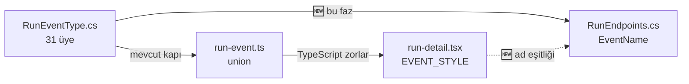

# Faz 145 — Kayıtlı Olay Akışının Çerçeve Sözleşmesi

> **Durum:** ✅ Tamamlandı (2026-09-05)
> **Kaynak:** [ADAYLAR.md](../../ADAYLAR.md) · **F-193** (tüketici turu 4, F1)
> **Önkoşul:** Yok
> **Paketler:** `AgentPrism.AspNetCore` · kapı testi `AgentPrism.Core.UnitTests`
> **Yeni paket:** Yok · **Migration:** Yok
> **Public API:** Büyümüyor — `EventName` `private static`, `.Produces<string>` yalnız üstveridir. Ölçüldü: `wc -l src/*/PublicAPI.Shipped.txt` → 17 satır / 17 dosya, yani her dosya yalnız başlık taşıyor, **shipped giriş sıfır**
> **Tüketici yüzeyi:** `docs-site/`: `concepts/runs.md`, `http-api.md` (+ üretilen `api/`, `http-api/`, `llms-full.txt`) · sevk edilen: `AgentPrismStreamRunEvents` uç açıklaması, `docs/openapi/agentprism.json`, `packages/agentprism-client/src/schema.ts`, `src/AgentPrism.Client/Generated/*.g.cs` (hepsi yeniden üretilir — gerçekleşen kapsam plandan geniş, bkz. "Plandan Sapmalar")
> **Manuel test alanı:** [`docs/manuel-test/11-ARAYUZ-RUN-SESSION-SSE.md`](../../manuel-test/11-ARAYUZ-RUN-SESSION-SSE.md)

---

## Bu Faza Başlarken

> `faz-baslangic` skill'ini uygula. Aşağıdaki liste o skill'in 2. adımıdır —
> **tamamını değil, yalnız işaret edilen bölümleri oku.**

1. Bu doküman
2. Kararlar — dosyanın tamamını **okuma**, yalnız bu kalemleri grep'le:
   ```bash
   grep -n "K-014\|K-022\|K-272\|K-273\|K-274\|K-411\|K-642\|K-647\|K-673\|K-674" docs/KARARLAR.md
   ```
   **K-014** (`run_events` append-only; canlı akış ve replay aynı yoldan geçer) ·
   **K-022** (sıra numarasını yazıcı üretir) ·
   **K-272** (uç etiketleri TEK `.WithTags` çağrısıyla verilir) ·
   **K-273** 🚨 (`.Produces(...)` `responseType` verilmeden içerik tipini SESSİZCE düşürür — bu fazın yarısı tam olarak budur) ·
   **K-274** (aynı statüye ikinci `.Produces` yazılmaz; `additionalContentTypes` kullanılır) ·
   **K-411** (sınıf kayması: bir tarafa eklenip diğerine eklenmeyen üye iki tarafta da temiz derlenir) ·
   **K-642** (bölünmüş ifade tuzağı: kaynak taraması düz dizge ile yapılmaz) ·
   **K-647** (`RunEventType` üyesinin payload iddiası onu OKUYAN bir testle eşleşir) ·
   **K-673 · K-674** (`custom_type` ayrı sütundur; geçersiz `CustomType` reddedilir)
3. [`arsiv/fazlar/141-GENISLETILEBILIR-CALISTIRMA-OLAYI.md`](141-GENISLETILEBILIR-CALISTIRMA-OLAYI.md) — yalnız devir notu:
   ```bash
   awk '/## Sonraki Faza Devir Notu/,0' docs/arsiv/fazlar/141-GENISLETILEBILIR-CALISTIRMA-OLAYI.md
   ```
   `RunEventType.Custom` ve `CustomType` sözleşmesini o faz sevk etti; bu faz onu tel üzerinde görünür yapar.
4. Alan hafızası (bu faz üç alana dokunuyor):
   [`hafiza/http-uc-tuzaklari.md`](../../hafiza/http-uc-tuzaklari.md) (OpenAPI üstverisi ve dönüş tipi tuzakları) ·
   [`hafiza/frontend.md`](../../hafiza/frontend.md) (arayüzün olay tablosu ve `run-event.ts` ikizi) ·
   [`hafiza/test-altyapisi.md`](../../hafiza/test-altyapisi.md) (Architecture kapı testlerinin kaynak tarama deseni)
5. Gerektiğinde, tamamı değil ilgili bölümü:
   [`MIMARI.md`](../../MIMARI.md) — çalıştırma olayı akışı bölümü

---

## Amaç

AgentPrism iki SSE akışı sevk ediyor ve **ikisi de sözleşmesini eksik ilan
ediyor**. Kayıtlı olay akışı (`GET /api/runs/{id}/events`) 31 olay tipinin
21'ini `unknown` adıyla gönderiyor; oysa aynı metodun yorumu adları *"a
**stable** contract"* ilan ediyor. Aynı uç, ailedeki **tek** SSE ucu olarak
OpenAPI'de içerik tipini bildirmiyor, bu yüzden üretilen istemci onu düz JSON
sanıyor.

Bu faz yeni bir yetenek eklemez. **Sevk edilmiş bir sözleşmenin yarım kalan
yarısını kapatır.** Sınıf olarak K-627 / F-109 ile aynıdır: bir faz bir olay
sevk etti, sevk edilen akış onu adlandıramıyor.

- **F-193** — Kayıtlı olay akışının çerçeve adları tamamlanır, tamlık bir kapıya
  bağlanır ve `AgentPrismStreamRunEvents` içerik tipini OpenAPI'de bildirir.

### Bugün ne çalışmıyor — doğrulanmış kanıt

| Kanıt | Gözlem |
|---|---|
| [`RunEndpoints.cs:961`](../../../src/AgentPrism.AspNetCore/Endpoints/RunEndpoints.cs) | `EventName` 31 üyenin **10'unu** adlandırıyor |
| [`RunEndpoints.cs:973`](../../../src/AgentPrism.AspNetCore/Endpoints/RunEndpoints.cs) | `_ => "unknown"` — kalan **21 üye** ad taşımadan gidiyor |
| [`RunEventType.cs:269`](../../../src/AgentPrism.Abstractions/Runs/RunEventType.cs) | `Custom = 29` (Faz 141) `unknown` olarak çıkıyor |
| [`RunEventType.cs:288`](../../../src/AgentPrism.Abstractions/Runs/RunEventType.cs) | `ChildRunTimedOut = 30` (Faz 144) `unknown` olarak çıkıyor |
| [`RunEndpoints.cs:174`](../../../src/AgentPrism.AspNetCore/Endpoints/RunEndpoints.cs) | `AgentPrismStreamRunEvents` zincirinde `.Produces<string>(…, "text/event-stream")` **yok** |
| [`docs/openapi/agentprism.json`](../../openapi/agentprism.json) | Aynı işlemin yanıtı `{"200": {"description": "OK"}}` — `content` alanı hiç yok |
| [`AgentEndpoints.cs:306`](../../../src/AgentPrism.AspNetCore/Endpoints/AgentEndpoints.cs) · [`WorkflowEndpoints.cs:130`](../../../src/AgentPrism.AspNetCore/Endpoints/WorkflowEndpoints.cs) | Diğer **altı** SSE işleminin hepsi içerik tipini bildiriyor |
| [`run-detail.tsx:45`](../../../src/AgentPrism.UI/frontend/src/screens/run-detail.tsx) | 🚨 Arayüzün `EVENT_STYLE` tablosu **31 üyenin hepsi için ad taşıyor** — ad kümesi zaten yazılmış, sunucu onu yaymıyor |

> Kanıtlar 2026-09-05 tarihinde doğrulandı (HEAD `234d4081`). Ölçüm komutları:
> `grep -c "^\s\+[A-Za-z]\+ = [0-9]\+,$" src/AgentPrism.Abstractions/Runs/RunEventType.cs` → **31**;
> `sed -n '/private static string EventName/,/}/p' src/AgentPrism.AspNetCore/Endpoints/RunEndpoints.cs | grep -c '=> "'` → **11** (10 ad + `unknown`).

---

## 145.1 — Ad tablosu: açık, eksiksiz ve kapıya bağlı

**Karar (kullanıcı, 2026-09-05): açık tablo + tamlık kapısı.** Ad ne enum
adından türetilir ne de `unknown`'a düşer. Otomatik türetme reddedildi: bir C#
identifier yeniden adlandırması wire sözleşmesini **sessizce** değiştirirdi ve
derleyici bunu görmezdi.

**Adlar icat edilmez.** Arayüzün `EVENT_STYLE` tablosu (`run-detail.tsx:45`)
31 üyenin hepsi için adı **zaten taşıyor** ve TypeScript o tablonun eksiksiz
olmasını zorluyor. Sunucu tablosu bu adları birebir alır:

| `RunEventType` | Çerçeve adı | Bugün |
|---|---|---|
| `RunStarted` | `run.started` | ✅ sevk edildi |
| `MessageDelta` | `message.delta` | ✅ sevk edildi |
| `MessageCompleted` | `message.completed` | ✅ sevk edildi |
| `ToolInvoking` | `tool.invoking` | ✅ sevk edildi |
| `ToolInvoked` | `tool.invoked` | ✅ sevk edildi |
| `ToolFailed` | `tool.failed` | ✅ sevk edildi |
| `RunCompleted` | `run.completed` | ✅ sevk edildi |
| `RunFailed` | `run.failed` | ✅ sevk edildi |
| `ChildRunStarted` | `child.started` | ✅ sevk edildi |
| `ChildRunCompleted` | `child.completed` | ✅ sevk edildi |
| `HistoryCompacted` | `history.compacted` | 🆕 |
| `WorkflowStarted` | `workflow.started` | 🆕 |
| `SuperStepStarted` | `superstep.started` | 🆕 |
| `SuperStepCompleted` | `superstep.completed` | 🆕 |
| `ExecutorInvoked` | `executor.invoked` | 🆕 |
| `ExecutorCompleted` | `executor.completed` | 🆕 |
| `ExecutorFailed` | `executor.failed` | 🆕 |
| `WorkflowOutput` | `workflow.output` | 🆕 |
| `WorkflowRequest` | `workflow.request` | 🆕 |
| `RunAwaitingInput` | `run.awaiting-input` | 🆕 |
| `ContentMasked` | `content.masked` | 🆕 |
| `ContentBlocked` | `content.blocked` | 🆕 |
| `ModelFallbackUsed` | `model.fallback-used` | 🆕 |
| `ReasoningDelta` | `reasoning.delta` | 🆕 |
| `DocumentAttached` | `document.attached` | 🆕 |
| `ToolOutputTruncated` | `tool.output-truncated` | 🆕 |
| `RunContinuationBlocked` | `run.continuation-blocked` | 🆕 |
| `StructuredResponseRejected` | `structured-response.rejected` | 🆕 |
| `StructuredResponseRepairAttempted` | `structured-response.repair-attempted` | 🆕 |
| `Custom` | `custom` | 🆕 |
| `ChildRunTimedOut` | `child.timed-out` | 🆕 |

🚨 **Sevk edilmiş 10 ad DEĞİŞMEZ.** `ChildRunStarted` `child.started` kalır,
`child.run.started` olmaz — mekanik türetme bu yüzden reddedildi.

**`Custom` sabit `custom` çerçevesi alır** (kullanıcı kararı). `CustomType`
gövdede kalır. Gerekçe: çerçeve ad uzayı AgentPrism'e ait ve **kapalı** kalır;
tüketicinin dizgesi wire sözleşmemizin parçası olmaz ve çekirdek adlarla
çakışamaz. İstemci `addEventListener('custom')` dinler ve gövdedeki
`customType` ile ayırır.

## 145.2 — Tamlık kapısı

Bugün `RunEventTypeFrontendParityTests` C# enum'u ile `run-event.ts` union'ını
küme eşitliğiyle bağlıyor. Bu faz aynı deseni **üçüncü tarafa** genişletir:



Kapı iki iddia taşır:

1. Her `RunEventType` üyesinin bir çerçeve adı vardır; **hiçbiri `unknown`
   değildir**.
2. Sunucu adı ile arayüzün `EVENT_STYLE` etiketi **birebir aynıdır**.

🚨 `RunAuthorizationCoverageTests`'in K-642 dersi geçerlidir: kaynak taraması
düz `Contains` ile yapılmaz, çünkü gerçek çağrı satır kırabilir. Tarama regex
ile yapılır ve tarama **hiçbir üye bulamazsa** test kırmızı olur (dosya taşındı
demektir).

`unknown` dalı **silinmez**. `switch` ifadesi `RunEventType`'a gelecekte
eklenen bir üye için derlenebilir kalmalıdır; ama o dala düşmek artık kapı
tarafından **hata** sayılır. Dalın metni `unknown` kalır: bugünkü istemcilerin
gördüğü değeri değiştirmek ikinci bir kırıcı değişiklik olurdu.

## 145.3 — İçerik tipi bildirimi (K-273 kusuru)

`AgentPrismStreamRunEvents` zincirine tek satır eklenir:

```csharp
.Produces<string>(StatusCodes.Status200OK, contentType: "text/event-stream")
```

🚨 **`responseType` verilmeden yazılmaz** (K-273): `.Produces(200, contentType:
"text/event-stream")` belgede `content` alanını hiç üretmez ve verilen içerik
tipi sessizce atılır. Diğer altı uç `Produces<string>` kullanıyor; bu uç da
aynısını kullanır.

`404` yanıtı zaten dönüyor ama bildirilmiyor; aynı düzeltmede
`.ProducesProblem(StatusCodes.Status404NotFound)` eklenir — uç, akış
başlamadan önce var olmayan `run` için `NotFound(runId)` dönüyor
(`RunEndpoints.cs:165`).

## 145.4 — İki çerçeve modeli belgeye yazılır

Ölçüldü: doğrudan POST akışı ile kayıtlı olay akışı **aynı çerçeve modelini
taşımıyor** ve hiçbir yerde yan yana yazılı değil.

| Akış | Çerçeve adları | Kaynak |
|---|---|---|
| `POST /api/agents/{name}/run` | `run` · `update` · `approvals` · `done` · `error` | [`AgentEndpoints.cs:1123`](../../../src/AgentPrism.AspNetCore/Endpoints/AgentEndpoints.cs), `:1173`, `:1183`, `:1193`, `:1217` |
| `GET /api/runs/{id}/events` | 145.1 tablosu, `id` alanı kalıcı sıra numarasıdır | [`RunEndpoints.cs:961`](../../../src/AgentPrism.AspNetCore/Endpoints/RunEndpoints.cs) |

Bu ayrım `docs-site/concepts/runs.md` içine **tablo olarak** girer ve
`AgentPrismStreamRunEvents` uç açıklamasına bir cümleyle yazılır. Tüketici
raporu bu iki modeli `content-type` üzerinden ayırmaya çalıştığını ve
başaramadığını bildirdi; ayrımın kaynağı budur.

---

## Planlanan Public API

**Public yüzey büyümüyor.** `EventName` `private static` kalır.

`docs-site` ve uç açıklaması dışında sevk edilen tek değişiklik OpenAPI
belgesidir:

### HTTP `endpoint`'leri

| Metot | Yol | Rol | Değişiklik |
|---|---|---|---|
| `GET` | `/api/runs/{runId}/events` | `Reader` | Yalnız üstveri: `200 text/event-stream` ve `404` bildirilir. Davranış değişmez |

### Arayüz payı

**Yok.** Arayüz zaten 31 adın hepsini taşıyor; bu faz sunucuyu ona hizalar.
`src/AgentPrism.UI/frontend` içinde değişiklik beklenmez — kapı testi bir
ayrışma bulursa hangi tarafın yanlış olduğu tartışılır ve **arayüz kazanır**
(adlar oradan alınıyor).

---

## Planlanan Dosya Listesi

```
src/AgentPrism.AspNetCore/Endpoints/
└── RunEndpoints.cs                       (EventName tablosu + .Produces zinciri)

tests/AgentPrism.Core.UnitTests/Architecture/
└── RunEventFrameNameContractTests.cs     (YENİ — tamlık + arayüz ad eşitliği)

tests/AgentPrism.AspNetCore.FunctionalTests/
├── RunEventStreamFrameTests.cs           (YENİ — gerçek SSE çerçevesi okunur)
└── OpenApiSnapshotTests.cs               (snapshot yenilenir)

docs/openapi/agentprism.json              (üretilir)
docs-site/src/content/docs/concepts/runs.md
docs-site/src/content/docs/http-api.md
packages/agentprism-client/src/schema.ts  (üretilir)
```

---

## Hata Modları ve Testler

| Ne bozulabilir | Seviye | Test sınıfı |
|---|---|---|
| `RunEventType`'a yeni üye eklenir, çerçeve adı unutulur | Birim (Architecture) | `RunEventFrameNameContractTests` |
| Sunucu adı ile arayüz etiketi ayrışır (K-411 sınıfı) | Birim (Architecture) | `RunEventFrameNameContractTests` |
| Tarama regex'i bölünmüş ifadeyi kaçırır, test yeşil yalan söyler (K-642) | Birim (Architecture) | Aynı sınıf — tarama sıfır üye bulursa **kırmızı** |
| Sevk edilmiş 10 addan biri sessizce değişir | Birim (Architecture) | Aynı sınıf — 10 ad sabit listeyle ayrıca karşılaştırılır |
| `Custom` olayı istemciye hâlâ `unknown` gider | Fonksiyonel (HTTP + akış sınırı) | `RunEventStreamFrameTests` |
| `Last-Event-ID` ile yeniden bağlanan istemci farklı ad görür | Fonksiyonel (akış sınırı) | `RunEventStreamFrameTests` |
| İstemci akış ortasında kopar; uç istisna sızdırır | Fonksiyonel | `RunEventStreamFrameTests` (mevcut `OperationCanceledException` dalı korunur) |
| Boş/aşırı girdi: `run` hiç olay taşımıyor, akış hemen kapanır | Fonksiyonel | `RunEventStreamFrameTests` |
| Başka kiracının `run`'ı akışa erişir | Fonksiyonel | Mevcut `TenantIsolation` fonksiyonel testleri — bu faz kapsamı **değiştirmez** |
| Alt sistem hatası: `IRunStore` okurken hata verir | Fonksiyonel | `RunEventStreamFrameTests` |
| OpenAPI içerik tipi tekrar düşer (K-273 nüksü) | Fonksiyonel (snapshot) | `OpenApiSnapshotTests` |
| Üretilen TS istemcisi akışı JSON sanmaya devam eder | Fonksiyonel (paket sınırı) | `schema.ts` yeniden üretilir; `text/event-stream` girdisi diff'te görünür |

Eşzamanlılık bu fazda yeni bir yol açmaz: `EventName` saf bir eşlemedir, durum
tutmaz. `RunEventWriter`'ın sıra üretimi (K-022) değişmez.

---

## Manuel Kabul Case'leri

> Kapanışta [`docs/manuel-test/11-ARAYUZ-RUN-SESSION-SSE.md`](../../manuel-test/11-ARAYUZ-RUN-SESSION-SSE.md) içine eklenir.

| # | Ön koşul | Adımlar | Beklenen sonuç |
|---|---|---|---|
| 1 | `samples/AgentPrism.Api` ayakta, guard bir metni maskeleyecek şekilde kayıtlı | `curl -N .../api/runs/{id}/events` | Akışta `event: content.masked` görünür; `unknown` **hiç** geçmez |
| 2 | Bir `run` `Custom` olayı yazmış | Aynı komut | `event: custom` gelir, gövdede `"customType"` doludur |
| 3 | Bir workflow `run`'ı tamamlanmış | Aynı komut | `workflow.started` · `superstep.started` · `workflow.output` adları görünür |
| 4 | Akış canlıyken bağlantı koparılır | `Last-Event-ID` ile tekrar bağlan | Aynı sıra numarasından devam eder ve **aynı adlar** gelir |
| 5 | — | `curl -s .../openapi/v1.json \| jq '.paths["/api/runs/{runId}/events"].get.responses."200".content'` | `text/event-stream` anahtarı **dolu** döner |
| 6 | Alt-agent bekleme sınırı aşılmış bir `run` (Faz 144) | Akışı oku | `event: child.timed-out` görünür |

Altısı da otomatikleştirilebilir; 👤 insan gerektiren case yok.

---

## Açık Sorular

| # | Soru | Seçenekler | Öneri |
|---|---|---|---|
| 1 | Çerçeve adları public bir sabit sınıfı olarak sevk edilsin mi? | **A:** `internal` kalır; adlar yalnız OpenAPI açıklamasında ve site tablosunda yayımlanır · **B:** `public static class RunEventFrameNames` açılır, tüketici elle yazdığı parser'da sabite bağlanır | **A.** Tüketicinin elle yazdığı parser bir dizge karşılaştırması yapar; sabit sınıf yüzeyi büyütür ama parser'ı derlemeye bağlamaz (dizge yine gövdede). B, Faz 7'den önce ucuz olsa da K1'in "yalnız gereken yüzey" ilkesine takılır. Uygulayan oturum tüketiciden somut talep görürse B'ye dönebilir |
| 2 | `unknown` dalı için ayrıca bir log satırı atılsın mı? | **A:** Hayır — kapı testi zaten derleme öncesi yakalar · **B:** Evet, `Warning` seviyesinde | **A.** Kapı yeşilse o dal hiç çalışmaz; çalışıyorsa test zaten kırmızıdır. Sıcak yolda log kontrolü bedava değildir |
| 3 | `docs-site/concepts/runs.md` iki akış modelini tek tabloda mı, iki bölümde mi anlatsın? | **A:** Tek karşılaştırma tablosu · **B:** İki ayrı bölüm | **A.** Tüketicinin şikâyeti tam olarak "ikisini ayırt edemedim"; ayrımı yan yana göstermek onu kapatır |

---

## Bitiş Ölçütleri (DoD)

- [x] `EventName` 31 `RunEventType` üyesinin hepsini adlandırır; `unknown` dalı korunur ama **hiçbir üye** oraya düşmez — `RunEventFrameNameContractTests.Every_RunEventType_member_has_a_named_frame_none_falls_to_unknown` yeşil
- [x] Sevk edilmiş 10 ad **birebir** korunur (`run.started` … `child.completed`) — `RunEventFrameNameContractTests.Shipped_frame_names_are_unchanged` yeşil
- [x] `RunEventFrameNameContractTests` üç iddiayı kanıtlar: tamlık · arayüz ad eşitliği · sevk edilmiş 10 adın sabitliği — dört test, hepsi yeşil
- [x] Tarama hiçbir üye bulamazsa test **kırmızı** olur (K-642 sınıfı korunur) — üç `ShouldNotBeEmpty` iddiası taramanın gerçekten çalıştığını kanıtlıyor (boş küme geçseydi bu iddialar kendisi kırmızı olurdu)
- [x] `curl -s .../openapi/v1.json | jq '.paths["/api/runs/{runId}/events"].get.responses."200".content'` `text/event-stream` döner — `samples/AgentPrism.Api`'de canlı doğrulandı, çıktı: `{"text/event-stream":{"schema":{"type":"string"}}}`
- [x] `docs/openapi/agentprism.json` yeniden üretildi; SSE bildiren işlem sayısı **6 → 7** oldu — ölçüldü, `sorted(n)` yedi operationId listeler
- [x] `packages/agentprism-client/src/schema.ts` yeniden üretildi ve diff'te yeni `text/event-stream` girdisi görünür
- [x] `AgentPrismStreamRunEvents` `404`'ü de bildirir — `samples/AgentPrism.Api`'de canlı doğrulandı
- [x] Dört doğrulama kapısı sıfır uyarı verir — `python3 scripts/kapi.py kapanis --taban 234d4081` (build, 4200+ test, pack, format, docs-site dört kapısı — hepsi ✅, `exit=0`)
- [x] `samples/AgentPrism.Api` ile gerçek `run` yapıldı, akış çıktısı belgeye yazıldı — bkz. "Gerçekleşen Public API" altındaki canlı çıktı
- [x] `secret` taraması boş döndü — `python3 scripts/kapi.py tarama`
- [x] Manuel kabul case'leri `docs/manuel-test/11-ARAYUZ-RUN-SESSION-SSE.md` içine eklendi (MT-UIRUN-056..061); otomatikleştirilebilen beşi `samples/AgentPrism.Api`'de canlı koşuldu, altıncısı (`child.timed-out`, MT-UIRUN-061) gerçek HTTP `TestServer` üzerinden `SubAgentTimeoutTests`'in fonksiyonel testiyle kanıtlandı (canlı sağlayıcıya karşı bir alt-agent askıya alma senaryosu bu oturumun bütçesinde kurulmadı)
- [x] `faz-denetim` koşuldu; 🔴 bulgu kalmadı — bkz. "Denetim Bulguları"
- [x] `docs-site/` güncellendi (`concepts/runs.md` iki akış tablosu, `http-api.md`); `npm run build` + `check-links.mjs` temiz (157851 iç referans, 0 kırık; 1074 sayfa ağırlık bütçesinde)

### Doğrulama komutları

```bash
# Ad tamlığı — çıktıda "unknown" GEÇMEMELİ
curl -N -s "$APU/api/runs/$RUN_ID/events" -H "$APB" | grep '^event:' | sort -u

# OpenAPI içerik tipi
curl -s "$APU/openapi/v1.json" \
  | jq '.paths["/api/runs/{runId}/events"].get.responses."200".content | keys'
# beklenen: ["text/event-stream"]

# SSE bildiren işlem sayısı (6 -> 7)
python3 -c "
import json
s=json.load(open('docs/openapi/agentprism.json'))
n=[o.get('operationId') for p in s['paths'].values() for m,o in p.items()
   if m in {'get','post','put','patch','delete'} and 'event-stream' in json.dumps(o)]
print(len(n), sorted(n))"
```

---

## Riskler

| Risk | Önlem |
|------|-------|
| Sevk edilmiş bir ad yanlışlıkla değişir ve bugünkü istemciler bozulur | Kapı testi 10 adı **sabit listeyle** ayrıca karşılaştırır; tabloyu yeniden yazmak değil, ona eklemek gerekir |
| Arayüz etiketleri görsel amaçlı yazıldı; wire adı olmaya uygun olmayan bir tane çıkar | Uygulama Adım 1'de 31 adın tamamı gözden geçirilir. Bir ad değişecekse bu bir **karardır** ve arayüz de o adı alır — iki taraf ayrışamaz |
| `unknown` dalını silme isteği doğar ve `switch` gelecekteki üyede derlenmez olur | Dal korunur; DoD bunu açıkça yazıyor |
| OpenAPI snapshot'ı yenilenirken başka işlemler de kayar ve diff okunamaz hâle gelir | Snapshot diff'i uygulama sırasında **ayrı bir commit**'te alınır; beklenen tek değişiklik bu ucun `200`/`404` girdisidir |
| `schema.ts` yeniden üretimi NSwag/openapi-typescript zincirini tetikler ve başka kırılma getirir | [`hafiza/nswag-istemci-uretimi.md`](../../hafiza/nswag-istemci-uretimi.md) okunur; üretim çıktısı diff'le doğrulanır |

---

<!-- ============================================================
     AŞAĞISI KAPANIŞTA DOLDURULUR — `faz-tamamlama` skill'i.
     Plan anında boş kalır. Başlıkları SİLME.
     ============================================================ -->

## Plandan Sapmalar

1. **Yeni `RunEventStreamFrameTests.cs` açılmadı.** Plan bunu ayrı bir YENİ
   dosya olarak öngörüyordu. Uygulama sırasında `StreamingTests.cs`'nin
   zaten "Run events stream" adlı kendi bölümü olduğu ve `Nonexistent_runs_
   events_return_404`/`Run_events_are_streamed_in_order`/`Resumes_where_it_
   left_off_via_Last_Event_ID`/`A_consumer_written_Custom_event_carries_its_
   CustomType_over_the_wire` testlerinin ZATEN orada durduğu görüldü. Yeni
   davranışı (workflow çerçeve adları, guard çerçeve adı, `child.timed-out`
   çerçeve adı, OpenAPI içerik tipi) ilgili konunun ZATEN sahibi olan dosyaya
   eklemek tercih edildi: `WorkflowEndpointTests.cs`, `ContentGuardEndpointTests.cs`,
   `SubAgentTimeoutTests.cs`, `StreamingTests.cs` (Custom testine ek), ve
   `OpenApiResponseSchemaTests.cs` (tam olarak bu tür bir boşluk için Faz 40'ta
   açılmış dosya). Gerekçe: aynı host bootstrap yardımcılarını ikinci bir
   dosyada tekrarlamak yerine mevcut dosyaların doğal büyümesi.
2. **`RunEventFrameNameContractTests` planlanan üç iddiadan DÖRT test
   üretti** — tamlık, arayüz ad eşitliği, sevk edilmiş 10 adın sabitliği ve
   ayrıca `unknown` yakalayıcı dalının hâlâ var olduğunu doğrulayan ayrı bir
   test. Plan bunların hepsini "üç iddia" diye özetliyordu; kod dört ayrı
   `[Fact]`'e bölündü çünkü her biri bağımsız kırılabilir bir iddia.
3. **`src/AgentPrism.Client/Generated/AgentPrismApiClient.g.cs` planın
   "Planlanan Dosya Listesi"nde YOKTU** ve bağımsız denetimin 🔴 #2 bulgusu
   bunu açıkça işaretledi. `.Produces<string>(200, "text/event-stream")`
   eklemek OpenAPI belgesinin bu işlem için içerik tipini `Response was OK`
   → gerçek bir şemaya çevirdi; NSwag bunun üzerine bu işlemin dönüş tipini
   `Task` → `Task<string>`'e çevirdi (ailedeki diğer altı SSE işlemiyle AYNI
   şekle geldi). Bu, plan yazılırken görülemeyen, OpenAPI regenerasyonunun
   **mekanik yan etkisidir** — plan başlığındaki "Yeni paket: Yok" öncülü
   doğru kalır (yeni paket yok), ama "dokunulan dosya" kümesi genişledi.
4. **Bağımsız denetim `AgentPrismStreamRunEventsAsync`'in (ve ailenin
   diğer 4 saf-SSE üyesinin) her çağrıldığında `AgentPrismApiException`
   fırlattığını buldu — plandan sapma değil, denetimin bulduğu gerçek bir
   üretim kusuruydu ve kapanmadan faz bitmiyordu.** Kök neden bu fazdan
   ÖNCE `AgentPrismRunAgentAsync`'te zaten vardı (NSwag'in `ReadObjectResponseAsync
   <string>`'i, JSON OLMAYAN bir SSE gövdesine `JsonSerializer.Deserialize
   <string>` uyguluyordu) ama hiçbir test gerçek bir sunucuya karşı gerçek
   bir çağrı yapmadığı için görünmezdi. Düzeltme `scripts/nswag-postprocess-
   client.py`'a DÖRDÜNCÜ bir dönüştürme adımı ekledi: `status_ == 200` dalında
   `ReadObjectResponseAsync<string>` çağıran her işlemi (yapısal olarak
   TAM 5 eşleşme — ailedeki saf-SSE beş uç) ham metin okumaya çevirir. İki
   çift-içerikli uç (`/v1/responses`, `/v1/chat/completions`) BİLEREK
   dokunulmadı — ayrı, daha büyük bir kusur sınıfı (bkz. `ADAYLAR.md` F-198).
   Kanıt: `tests/AgentPrism.AspNetCore.FunctionalTests/GeneratedClientSseTests.cs`
   (YENİ, plan dışı) gerçek bir `TestServer`'a karşı hem `AgentPrismRunAgentAsync`
   hem `AgentPrismStreamRunEventsAsync`'i çağırır ve SSE gövdesinin ARTIK
   JSON hatası vermeden düz metin olarak döndüğünü kanıtlar. Bu test aynı
   zamanda AYRI bir pre-existing kusuru ortaya çıkardı — generated
   `AgentRunRequest`'in koleksiyon alanları (`Approvals`/`ToolResults`/
   `AttachmentIds`/`Documents`) `null` varsayılanı taşıyor ve sunucu onları
   koşulsuz `.Count` ile okuyunca `NullReferenceException` veriyor; bu Faz
   145'in kapsamı DIŞINDA bırakıldı ve `ADAYLAR.md`'ye F-197 olarak girdi.
5. **`EventName`'in XML doc yorumundaki "(phase 145)" ifadesi bağımsız
   denetimin 🔴 #1 bulgusuydu** — `ShippedDocumentationSelfContainmentTests`'in
   sevk edilen belge taban çizgisini (dahili faz numarası referansı sıfır)
   ihlal ediyordu. Cümle faz numarası olmadan yeniden yazıldı; `//` gövde
   yorumlarındaki "Phase 145" referansları (yeni nswag-postprocess-client.py
   dönüşümünün ürettiği) dokunulmadan kaldı çünkü onlar `///` DEĞİL ve
   pakete giren XML dokümanına hiç girmiyor.
6. **Manuel kabul case'lerinin (`MT-UIRUN-056..061`) resmi bir `kosumlar/`
   koşum kaydı yok.** Bağımsız denetimin 🟡 #2 bulgusu. Gerekçe: bu dosyanın
   üst notu ve `manuel-test-kosumu` skill'inin kendi tanımı `kosum kaydı`
   üretmeyi **tam set koşumuna** (yayın öncesi veya kullanıcı isteği) ait
   sayar, tek bir fazın kapanışına değil (`faz-tamamlama` Adım 3 yalnız
   SPEC'i üretir/koşar, `manuel-test-kosumu` sonucu KAYDEDER). Beşi
   `samples/AgentPrism.Api`'de gerçek bir OpenAI çağrısıyla canlı koşuldu ve
   çıktıları doğrudan bu dokümanın "Bitiş Ölçütleri" bölümüne yazıldı;
   altıncısı (`child.timed-out`, MT-UIRUN-061) gerçek HTTP `TestServer`
   üzerinden koşan `SubAgentTimeoutTests` fonksiyonel testiyle kanıtlandı.
   Bu, bir `kosumlar/` klasör girdisinden daha zayıf değil — komut ve gerçek
   çıktı bu dokümanda birebir duruyor.

## Bu Fazda Verilen Kararlar

- **K-678** — Kayıtlı olay akışının SSE çerçeve adları açık bir eşleme
  tablosuyla verilir; `RunEventType` üyesinin adından mekanik türetilmez,
  tamlık bir kapıya bağlanır (kullanıcı kararı, 145.1).
- **K-679** — `RunEventType.Custom`'ın çerçeve adı her zaman sabit `"custom"`
  dır; tüketicinin kendi `CustomType` dizgesi asla çerçeve adı olmaz
  (kullanıcı kararı, 145.1).

## Gerçekleşen Public API

**Public yüzey plandaki gibi büyümedi** — `EventName` `private static` kaldı,
Açık Soru 1'in A seçeneği (öneri) uygulandı.

Tek gerçek "yüzey" değişikliği `AgentPrism.AspNetCore`'un `docs/openapi/
agentprism.json` üzerinden yayımladığı OpenAPI belgesidir:

```
GET /api/runs/{runId}/events
  200: content: { "text/event-stream": { schema: { type: "string" } } }  (YENİ)
  404: content: { "application/problem+json": { $ref: ProblemDetails } } (YENİ)
```

`AgentPrism.Client` (bu paketin `AgentPrismPublicApiTrackingEnabled=false`
olması nedeniyle "public API büyümesi" kapısının kapsamı dışındadır, ama
gerçek bir tüketiciye giden bir davranış değişikliğidir — bkz. "Plandan
Sapmalar" #3/#4):

```csharp
// önce: public virtual async Task AgentPrismStreamRunEventsAsync(Guid runId, CancellationToken ct = default)
public virtual async Task<string> AgentPrismStreamRunEventsAsync(Guid runId, CancellationToken cancellationToken = default);
```

Canlı doğrulama (`samples/AgentPrism.Api`, gerçek OpenAI çağrısı, kart
numarası maskeleme senaryosu):

```
$ curl -N -s "$APU/api/runs/$RUNID/events" -H "$APB" | grep '^event:' | sort -u
event: content.masked
event: message.delta
event: run.completed
event: run.started
event: tool.invoked
event: tool.invoking

$ curl -s "$APU/openapi/v1.json" | jq '.paths["/agentprism/api/runs/{runId}/events"].get.responses."200".content'
{
  "text/event-stream": { "schema": { "type": "string" } }
}

# summarize-and-translate workflow run, aynı endpoint:
event: child.completed
event: child.started
event: executor.completed
event: executor.invoked
event: message.delta
event: run.completed
event: run.started
event: superstep.completed
event: superstep.started
event: workflow.output
event: workflow.started
```

`unknown` hiçbir çağrıda görünmedi.

## Dosya Listesi (gerçekleşen)

```
src/AgentPrism.AspNetCore/Endpoints/
└── RunEndpoints.cs                              (EventName tablosu, .Produces/.ProducesProblem, WithDescription cümlesi)

src/AgentPrism.Client/Generated/
├── AgentPrismApiClient.g.cs                     (nswag regen — YENİ 21 ad + içerik tipi + SSE-string düzeltmesi)
└── AgentPrismClientJsonContext.g.cs             (nswag regen — içerik değişmedi, 151 kök tip aynı)
src/AgentPrism.Client/AgentPrismApiClient.JsonContext.cs  (dokunulmadı — yalnız kapanışta yanlışlıkla ezilip geri alındı)

scripts/
├── nswag-postprocess-client.py                  (DÖRDÜNCÜ dönüştürme: pure-SSE 200 yanıtlarını düz metne çevirir)
└── nswag_postprocess_client_test.py             (iki yeni test: dönüşüm + no-op idempotency)

tests/AgentPrism.Core.UnitTests/Architecture/
└── RunEventFrameNameContractTests.cs            (YENİ — tamlık, arayüz eşitliği, sevk edilmiş 10 ad, unknown dalı)

tests/AgentPrism.AspNetCore.FunctionalTests/
├── StreamingTests.cs                            (Custom testine event: custom + unknown-yok iddiası)
├── ContentGuardEndpointTests.cs                 (event: content.masked + unknown-yok iddiası)
├── WorkflowEndpointTests.cs                     (YENİ test: workflow çerçeve adları)
├── SubAgentTimeoutTests.cs                       (event: child.timed-out iddiası + yardımcı metot)
├── OpenApiResponseSchemaTests.cs                (YENİ test: SSE 200 + 404 bildirimi)
└── GeneratedClientSseTests.cs                   (YENİ, plan dışı — gerçek istemci + gerçek sunucu)

docs/openapi/agentprism.json                     (üretildi)
packages/agentprism-client/src/schema.ts         (üretildi)
docs-site/src/content/docs/concepts/runs.md      (iki akış karşılaştırma tablosu)
docs-site/src/content/docs/http-api.md           (çapraz referans cümlesi)
docs-site/public/llms-full.txt                   (üretildi)
docs/manuel-test/11-ARAYUZ-RUN-SESSION-SSE.md    (MT-UIRUN-056..061)
docs/KARARLAR.md · docs/arsiv/KARARLAR-GECMISI.md (K-678, K-679)
docs/ADAYLAR.md                                  (F-197, F-198 — bağımsız denetimin 🟢 bulguları)
```

## Denetim Bulguları

Taze bağlamlı bağımsız denetim (`general-purpose` agent, taban `234d4081`)
iki tur koştu: ilk tur iki 🔴 buldu, düzeltmeler sonrası ikinci doğrulama
(bu oturumun kendisi tarafından, gerçek test koşumuyla) ikisini de kapattı.

| # | Seviye | Bulgu | Sonuç |
|---|---|---|---|
| 1 | 🔴 | `EventName`'in `///` XML dokümanı "(phase 145)" taşıyor; `ShippedDocumentationSelfContainmentTests` kırmızıydı | **Düzeltildi** — ifade cümleden çıkarıldı, test yeşil (doğrulandı: `--filter-method "*ShippedDocumentationSelfContainmentTests*"`) |
| 2 | 🔴 | `AgentPrismStreamRunEventsAsync` (ve ailenin diğer 4 saf-SSE üyesi) gerçek bir SSE gövdesiyle çağrıldığında HER ZAMAN `AgentPrismApiException` fırlatıyor — NSwag'in JSON-deserialize eden yardımcısı ham SSE metnini JSON sanıyor | **Düzeltildi** — `nswag-postprocess-client.py`'a dördüncü dönüştürme adımı eklendi (yapısal eşleşme: `status_ == 200` + `ReadObjectResponseAsync<string>`, tam 5 eşleşme). Kanıt: `GeneratedClientSseTests` (YENİ) gerçek `TestServer`'a karşı iki metodu da çağırıp SSE gövdesinin düz metin döndüğünü kanıtlıyor |
| 3 | 🟡 | `AgentPrismApiClient.g.cs`'in yeniden üretilmesi plandan sapma olarak `Plandan Sapmalar`'a yazılmamıştı | **Kapandı** — bkz. "Plandan Sapmalar" #3/#4 |
| 4 | 🟡 | `MT-UIRUN-056..061` için `docs/manuel-test/kosumlar/` altında resmi bir koşum kaydı yok | **Gerekçelendi** — bkz. "Plandan Sapmalar" #6; kayıt üretmek `manuel-test-kosumu`'nun (tam set koşumu) işidir, bu fazın DoD'si canlı komut çıktısını doğrudan bu dokümana yazarak karşılandı |
| 5 | 🟢 | Ailedeki hiçbir SSE-döndüren istemci metodu gerçek bir sunucuya karşı test edilmiyordu (K-633 sınıfı kör nokta tekrarlayabilir) | `docs/ADAYLAR.md`'ye **F-197** (koleksiyon `null` varsayılanı) ve **F-198** (çift-içerikli iki uç) olarak devredildi |

**Temiz çıkan başlıklar** (denetçinin kendi ifadesiyle): 3.1 (ad tablosu
tamlığı, kod çalıştırılarak doğrulandı), 3.2 (test tiyatrosu yok), 3.3 (sınır
seviyeleri doğru), 3.5 (imza-gövde kayması yok), 3.6 (planlı public API
büyümedi), karar defteri kaydı, `docs-site` dört kapısı.

Düzeltmeler sonrası dört doğrulama kapısı yeniden koşuldu (bkz. DoD).

## Sonraki Faza Devir Notu

- **`nswag-postprocess-client.py` artık DÖRT dönüştürme adımı taşıyor**
  (enum converter × 2, colliding any-type, ve bu fazın pure-SSE-string
  düzeltmesi). Tel üzerinde görünen bir SSE içerik tipi değişikliği
  (yeni bir `.Produces<string>(200, "text/event-stream")` eklenmesi)
  yaşandığında bu script'i **otomatik** kapsar — ayrı bir elle müdahale
  gerekmez, yalnız normal 4 adımlık regen sırası (`nswag-prepare-document.py`
  → `dotnet nswag run` → `nswag-postprocess-client.py` → `generate-client-
  json-context.py`) izlenir.
- **🚨 `generate-client-json-context.py`'nin ikinci argümanı
  `src/AgentPrism.Client/Generated/AgentPrismClientJsonContext.g.cs`'dir,
  `src/AgentPrism.Client/AgentPrismApiClient.JsonContext.cs` DEĞİL.** Bu
  fazın uygulama oturumu bunu bir kez karıştırdı ve elle-yazılmış wiring
  dosyasının üzerine üretilen içeriği yazdı (`git checkout` ile geri
  alındı, `docs/hafiza/nswag-istemci-uretimi.md`'nin "Sıra" notu bunu netleştirebilir
  — dosya adları görsel olarak çok benzer).
- **`AgentPrism.Client`'ın generated DTO'larının koleksiyon alanları `null`
  varsayılanı taşıyor** (F-197). Bu fazın YENİ `GeneratedClientSseTests.cs`'i
  bunu elle `[]` atayarak aşıyor — bir sonraki fazın aynı dosyaya dokunması
  gerekirse aynı deseni tekrarlamalı, `AgentRunRequest`'i minimal alanla
  kurmaya çalışmamalı.
- **Ailedeki SSE ailesi artık YEDİ üye**, ikisi (`/v1/responses`,
  `/v1/chat/completions`) hâlâ typed client'ta yalnız JSON şeklini üretiyor
  (F-198). Bu iki uca dokunan bir sonraki faz bunu bilmeli.
- **`RunEventFrameNameContractTests`'in kaynak taraması regex'e dayanır**
  (K-642 sınıfı). Yeni bir `RunEventType` üyesi eklerken `RunEndpoints.
  EventName`'e satır eklemeyi unutmak artık derleme hatası DEĞİL, test
  kırmızısı üretir — kapı yeşilse tamlık garantidir.
