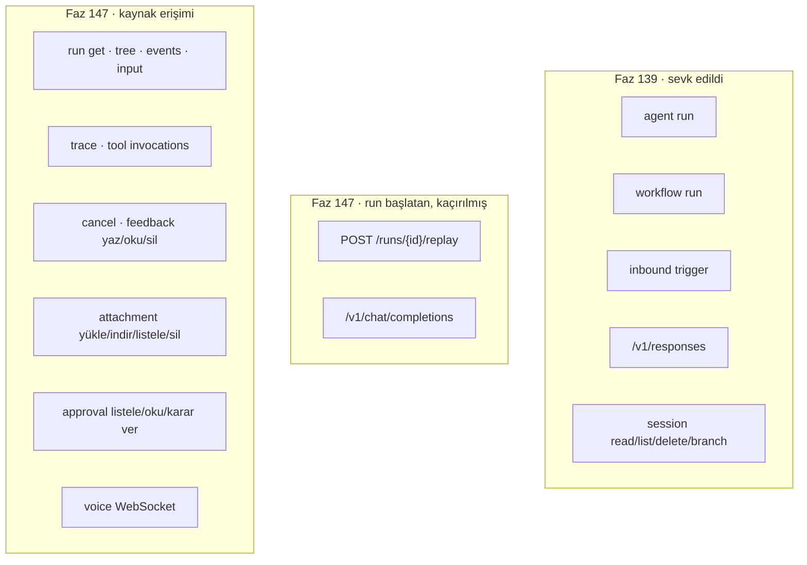

# Faz 147 — Yetkilendirme Kapısının Kaynak Kapsamı

> **Durum:** ✅ Tamamlandı (2026-09-05)
> **Kaynak:** [ADAYLAR.md](../../ADAYLAR.md) · **F-195** (tüketici turu 4, A1 · kapsam yarısı)
> **Önkoşul:** Yok — [Faz 139](139-CALISTIRMA-VE-OTURUM-YETKILENDIRMESI.md) sözleşmeyi zaten sevk etti; bu faz onun kapsamını tamamlar
> **Paketler:** `AgentPrism.Abstractions`, `AgentPrism.AspNetCore`
> **Yeni paket:** Yok · **Migration:** Yok
> **Public API:** Büyüyor — iki enum'a üye, bir request record. `wc -l src/*/PublicAPI.Shipped.txt` → 17 satır / 17 dosya (yalnız başlık), **shipped giriş sıfır**: bugün eklemek bedava, Faz 7'den sonra bir sürüm kararı
> **Tüketici yüzeyi:** `docs-site/`: `guides/embedding.md`, `concepts/governance.md`, `concepts/runs.md`, `guides/voice.md`, `capabilities.md` · sevk edilen: `IRunAuthorizationHandler` XML `<example>`, `src/AgentPrism.Abstractions/README.md`
> **Manuel test alanı:** [`docs/manuel-test/13-KIRACI-VE-GUVENLIK.md`](../../manuel-test/13-KIRACI-VE-GUVENLIK.md)

---

## Bu Faza Başlarken

> `faz-baslangic` skill'ini uygula. **Tamamını değil, yalnız işaret edilen
> bölümleri oku.**

1. Bu doküman
2. Kararlar — dosyanın tamamını **okuma**, yalnız bu kalemleri grep'le:
   ```bash
   grep -n "K-283\|K-642\|K-670\|K-671" docs/KARARLAR.md
   ```
   **K-283** 🚨 (görünmeyen oturum YOK sayılır; "başkasının oturumu" reddi kaldırıldı — ses kapsamı bu kararın sınıfına dikkatle yaklaşmalıdır) ·
   **K-642** (bölünmüş ifade tuzağı: kaynak taraması düz dizge ile yapılmaz) ·
   **K-670** (kapı dört run başlatan yüzeyi kapsar; `IEndpointFilter` DEĞİL, elle çağrı) ·
   **K-671** (reddedilen `List` `403`, reddedilen `Read`/`Delete`/`Branch` `404` ve gövdesi var olmayan session'la birebir aynı)
3. [`arsiv/fazlar/139-CALISTIRMA-VE-OTURUM-YETKILENDIRMESI.md`](139-CALISTIRMA-VE-OTURUM-YETKILENDIRMESI.md) — **devir notunu tamamen oku**:
   ```bash
   awk '/## Sonraki Faza Devir Notu/,0' docs/arsiv/fazlar/139-CALISTIRMA-VE-OTURUM-YETKILENDIRMESI.md
   ```
   O not iki şeyi bu faza devrediyor: yeni bir run başlatan yüzeyin kapıyı kendi gövdesinde çağırma zorunluluğu, ve sesin **kapsam dışı bırakıldığı**.
4. Alan hafızası (bu faz üç alana dokunuyor):
   [`hafiza/tool-onay-ve-yetkilendirme.md`](../../hafiza/tool-onay-ve-yetkilendirme.md) (yetkilendirme deseni) ·
   [`hafiza/http-uc-tuzaklari.md`](../../hafiza/http-uc-tuzaklari.md) 🚨 (dönüş tipi gevşetmenin OpenAPI'yi sessizce bozması — Faz 139 bunu yaşadı) ·
   [`hafiza/ses-ve-konusma.md`](../../hafiza/ses-ve-konusma.md) (WebSocket el sıkışması ve subprotocol)
5. Gerektiğinde, tamamı değil ilgili bölümü:
   [`MIMARI-GUVENLIK.md`](../../MIMARI-GUVENLIK.md) — yetkilendirme katmanları bölümü

---

## Amaç

Faz 139 `IRunAuthorizationHandler`'ı sevk etti ve **run başlatan** yüzeyleri
kapıya bağladı. Kapı orada durdu. Bugün bir tüketici bu kapıyı doğru kurduğunda
bile, aynı kiracıdaki bir `Reader` başka bir kullanıcının `run`'ının metnini,
girdisini, trace'ini, tool çağrılarını ve eklerini okuyabiliyor; bir `Operator`
onu iptal edebiliyor.

Bu faz **sahiplik öğretmez** — o [Faz 148](../../148-OTURUM-SAHIPLIGININ-KALICILIGI.md)'in
işidir. Bu faz var olan kapının **her kaynağa** ulaşmasını sağlar. Faz 139'un
kendi gerekçesi burada da geçerlidir: *"Yalnız birini kapsasaydık kapı bir
bypass'a dönerdi ve yanlış bir güvenlik hissi üretirdi — bu, kapının hiç
olmamasından kötüdür."*

- **F-195** — `run` okuma grafiği, ekler, onaylar ve ses oturumu aynı kapıdan
  geçer; ayrıca Faz 139'un kaçırdığı **iki run başlatan yüzey** kapsanır.

### Bugün ne çalışmıyor — doğrulanmış kanıt

| Kanıt | Gözlem |
|---|---|
| [`RunEndpoints.cs`](../../../src/AgentPrism.AspNetCore/Endpoints/RunEndpoints.cs) (992 satır) | `RunAuthorizationGate` çağrısı **sıfır**. `grep -c "RunAuthorizationGate" ` → 0 |
| [`RunEndpoints.cs:306`](../../../src/AgentPrism.AspNetCore/Endpoints/RunEndpoints.cs) | Tek koruma `run.TenantId == tenants.TenantId` — kiracı düzeyi |
| [`ApprovalEndpoints.cs`](../../../src/AgentPrism.AspNetCore/Endpoints/ApprovalEndpoints.cs) · [`AttachmentEndpoints.cs`](../../../src/AgentPrism.AspNetCore/Endpoints/AttachmentEndpoints.cs) | Kapı çağrısı **sıfır** |
| [`ObservabilityEndpoints.cs:18`](../../../src/AgentPrism.AspNetCore/Endpoints/ObservabilityEndpoints.cs) | `GET /api/runs/{id}/trace` aynı durumda |
| [`VoiceConversationEndpoint.cs:262`](../../../src/AgentPrism.AspNetCore/Voice/VoiceConversationEndpoint.cs) | `OwnsSessionAsync` yalnız `record.TenantId == tenantId` karşılaştırıyor |
| [`RunAuthorizationTypes.cs`](../../../src/AgentPrism.Abstractions/Runs/RunAuthorizationTypes.cs) | `RunAccess` yalnız `Start = 0` taşıyor; XML'i de *"Always Start today"* diyor |
| 🚨 [`RunEndpoints.cs:251`](../../../src/AgentPrism.AspNetCore/Endpoints/RunEndpoints.cs) | `POST /api/runs/{id}/replay` — kendi özeti *"Starts a new run with recorded input."* diyor, `RunReplayService` katalogdan agent çözüyor, **kapı çağrısı yok**. Bu bir **beşinci** run başlatan yüzeydir |
| 🚨 [`OpenAIChatCompletionsEndpoints.cs:107`](../../../src/AgentPrism.AspNetCore/OpenAICompat/OpenAIChatCompletionsEndpoints.cs) | `/v1/chat/completions` katalogdan agent çözüp `RunAsync`/`RunStreamingAsync` çağırıyor (`:138`, `:301`), **kapı çağrısı yok**. Bu bir **altıncı** run başlatan yüzeydir |
| [`RunAuthorizationCoverageTests.cs:42`](../../../tests/AgentPrism.Core.UnitTests/Architecture/RunAuthorizationCoverageTests.cs) | `ExpectedRunStartingFiles` **dört** dosya sayıyor; testin kendi dokümanı *"cannot discover a brand-new FIFTH run-starting endpoint"* diyor |

> Kanıtlar 2026-09-05 tarihinde doğrulandı (HEAD `234d4081`).
>
> 🚨 **Son iki satır tüketici raporunda YOKTU.** Tüketici yalnız okuma
> grafiğini ölçmüştü. `replay` ve `/v1/chat/completions` bu fazın planlama
> ölçümünde bulundu; ikisi de Faz 139'un "dört yüzey" iddiasını **eksik**
> yapıyor ve ikisi de gerçek bir `run` başlatıyor.

---

## 147.1 — Kapsanan yüzeyler



Toplam **21 çağrı yeri**. Faz 139'un deseni korunur: kapı bir
`IEndpointFilter` **değildir**, her uç kendi gövdesinde çağırır (K-670).

`AgentPrismCompareRuns` iki `run` okur; **iki kez** kapıdan geçer. Biri
reddedilirse karşılaştırma reddedilir.

## 147.2 — Sözleşme biçimi: var olan enum'lar büyür

**Karar (kullanıcı, 2026-09-05).** Ayrı bir kaynak yetki sözleşmesi
reddedildi: tüketici iki desen öğrenmek zorunda kalırdı ve handler üçüncü bir
metot kazanırdı.

```csharp
public enum RunAccess
{
    Start = 0,        // sevk edildi
    Read = 1,         // get · tree · events · input · trace · tool invocations · feedback oku
    Cancel = 2,
    Feedback = 3,     // feedback yaz · sil
    Attachment = 4,   // yükle · indir · listele · sil
    Approval = 5,     // listele · oku · karar ver
}

public enum SessionAccess
{
    Read = 0, List = 1, Delete = 2, Branch = 3,   // sevk edildi
    Voice = 4,                                     // WebSocket konuşma oturumu
}
```

🚨 **Enum hiçbir yere kalıcılaştırılmıyor.** `RunAuthorizationRequest` senkron
bir istek kaydıdır; XML'i zaten *"its result is not persisted or replayed"*
diyor. Bu yüzden sayısal değer bir persistence sözleşmesi **değildir** ve
K-627'nin "emekli sayısal değer" sınıfına girmez. Bu cümle enum'un XML'ine
**açıkça** yazılır — tüketici raporu tam olarak bunu sordu.

`RunAuthorizationRequest` iki isteğe bağlı alan kazanır: `RunId` (kaynak
erişiminde dolu, `Start`'ta `null`) ve `AgentName` `Start` dışında `null`
olabilir hâle gelir. `required` gevşetmesi kırıcıdır; `PublicAPI.Shipped.txt`
boş olduğu için bugün bedava.

## 147.3 — Ret kodları: K-671 aynen genişletilir

| Erişim | Ret yanıtı | Gerekçe |
|---|---|---|
| Liste uçları (`/api/runs`, attachments, approvals) | `403` | Liste bir işlemdir, kaynak değil — sızacak kimlik yok |
| Tekil kaynak okuma/yazma/silme | `404`, gövdesi gerçekten var olmayan kaynakla **birebir aynı** | `403` kaynağın var olduğunu doğrular; farklı metin aynı şeyi yan kanaldan sızdırır |
| `POST /runs/{id}/replay` · `/v1/chat/completions` | `403` | Run **başlatma** reddidir; Faz 139'un dört yüzeyiyle aynı sınıf |
| Voice WebSocket | El sıkışma reddi | Aşağıda |

## 147.4 — Ses: K-283'ün sınıfına dikkatle

Faz 139 sesi bilerek dışarıda bıraktı (Açık Soru 3, seçenek B) ve devir notu
*"K-283'ün ölçtüğü vakayla aynı sınıfa dikkatle yaklaşmalıdır"* dedi.

🚨 K-283 şunu kurmuştu: **görünmeyen bir oturum YOK sayılır.** Bugünkü
`OwnsSessionAsync` var olmayan session'ı da kabul ediyor — ilk tur onu açıyor
(`VoiceConversationEndpoint.cs:257` civarındaki `<remarks>`). Kapı bu davranışı
**bozmamalıdır**: kullanıcı sahipliği kontrolü yalnız *var olan* bir session
için anlamlıdır. Var olmayan session'da karar `Start` semantiğine düşer.

WebSocket'te `403` gövdesi yoktur; ret el sıkışmanın kendisinde verilir.
Uygulama bugünkü ret yolunu (`IsAuthorizedAsync` başarısızlığı) izler ve **aynı
durum kodunu** kullanır — yeni bir kod icat edilmez.

## 147.5 — Kapsam kapısı büyür

`RunAuthorizationCoverageTests.ExpectedRunStartingFiles` **altı** dosyaya
çıkar ve ikinci bir liste kazanır: kaynak erişimi çağıran dosyalar.

🚨 K-642 dersi aynen geçerlidir: tarama regex ile yapılır (`RunAuthorizationGate\s*\.\s*Check…`),
düz `Contains` ile değil — gerçek çağrı satır kırıyor. Tarama **hiçbir dosyada
hiçbir çağrı bulamazsa** test kırmızı olur.

Testin kendi dokümanı da düzeltilir: bugün *"cannot discover a brand-new FIFTH
run-starting endpoint"* diyor ve bu cümle bir beşinciyi (replay) ve bir
altıncıyı (chat completions) **zaten kaçırmış** olduğunu gizliyor.

---

## Planlanan Public API

> Taslak imzalardır. Gerçekleşen imzalar kapanışta ayrı bir bölüme yazılır.

```csharp
// AgentPrism.Abstractions — RunAuthorizationTypes.cs

public sealed record RunAuthorizationRequest
{
    public required string TenantId { get; init; }
    public string? AgentName { get; init; }   // Start dışında null olabilir (idi: required)
    public string? SessionId { get; init; }
    public string? UserId { get; init; }
    public string? RunId { get; init; }       // YENİ — kaynak erişiminde dolu
    public required RunAccess Access { get; init; }
}

// RunAccess ve SessionAccess: 147.2'deki üyeler.
// IRunAuthorizationHandler'ın METOT SAYISI DEĞİŞMEZ — iki metot kalır.
```

### HTTP `endpoint`'leri

Yeni uç yok. **21 mevcut uç** yeni bir ret yolu kazanır:

| Grup | Uçlar | `RunAccess`/`SessionAccess` | Ret |
|---|---|---|---|
| Run okuma | `GetRun` · `GetRunTree` · `StreamRunEvents` · `GetRunInput` · `GetRunTrace` · `ListRunToolInvocations` · `ListRunFeedback` | `Read` | `404` |
| Run listesi | `ListRuns` | `Read` | `403` |
| Run karşılaştırma | `CompareRuns` | `Read` ×2 | `404` |
| Run yazma | `CancelRun` | `Cancel` | `404` |
| Geri bildirim | `SaveRunFeedback` · `DeleteRunFeedback` | `Feedback` | `404` |
| Run başlatma | `ReplayRun` · `AgentPrismOpenAIChatCompletions` | `Start` | `403` |
| Ek | `UploadAttachment` · `DownloadAttachment` · `DeleteAttachment` | `Attachment` | `404` |
| Ek listesi | `ListAttachments` | `Attachment` | `403` |
| Onay | `GetPendingApproval` · `DecideApproval` | `Approval` | `404` |
| Onay listesi | `ListPendingApprovals` | `Approval` | `403` |
| Ses | WebSocket el sıkışması | `SessionAccess.Voice` | el sıkışma reddi |

### Arayüz payı

**Yok.** Konsol yönetim rolleriyle çalışır ve varsayılan `AllowAll` handler'ı
davranışı değiştirmez. Bundle payı **0 KB**.

---

## Planlanan Dosya Listesi

```
src/AgentPrism.Abstractions/Runs/
└── RunAuthorizationTypes.cs                 (enum üyeleri · RunId · XML "kalıcılaştırılmaz")

src/AgentPrism.AspNetCore/
├── RateLimiting/RunAuthorizationGate.cs     (CheckRunResourceAsync yardımcısı)
├── Endpoints/RunEndpoints.cs                (11 çağrı yeri)
├── Endpoints/ObservabilityEndpoints.cs      (2 çağrı yeri)
├── Endpoints/AttachmentEndpoints.cs         (4 çağrı yeri)
├── Endpoints/ApprovalEndpoints.cs           (3 çağrı yeri)
├── OpenAICompat/OpenAIChatCompletionsEndpoints.cs  (1 · run başlatan)
└── Voice/VoiceConversationEndpoint.cs       (1 · SessionAccess.Voice)

tests/AgentPrism.Core.UnitTests/Architecture/
└── RunAuthorizationCoverageTests.cs         (altı run başlatan + kaynak listesi)

tests/AgentPrism.AspNetCore.FunctionalTests/
├── RunResourceAuthorizationTests.cs         (YENİ — 21 uç, reddeden handler)
└── VoiceAuthorizationTests.cs               (YENİ)
```

---

## Hata Modları ve Testler

| Ne bozulabilir | Seviye | Test sınıfı |
|---|---|---|
| Bir uç kapıyı çağırmayı unutur | Birim (Architecture) | `RunAuthorizationCoverageTests` |
| Tarama regex'i bölünmüş çağrıyı kaçırır ve test yeşil yalan söyler (K-642) | Birim (Architecture) | Aynı sınıf — sıfır bulguda **kırmızı** |
| Reddedilen tekil kaynak `403` döner ve varlığını doğrular | Fonksiyonel (HTTP sınırı) | `RunResourceAuthorizationTests` |
| Ret gövdesi var olmayan kaynaktan **farklı** metin taşır (yan kanal) | Fonksiyonel | `RunResourceAuthorizationTests` — iki gövde birebir karşılaştırılır |
| `throw` eden handler erişime **izin verir** (fail-open) | Fonksiyonel | `RunResourceAuthorizationTests` |
| Handler kayıtlı değilken davranış değişir | Fonksiyonel | `RunResourceAuthorizationTests` — kayıtsız kurulumda **hiçbir** yanıt değişmez |
| `replay` kapıyı atlar ve yetkisiz `run` açar | Fonksiyonel | `RunResourceAuthorizationTests` — `runs` satırı **açılmamalı** |
| `/v1/chat/completions` kapıyı atlar | Fonksiyonel | `RunResourceAuthorizationTests` — akışlı ve akışsız dal ayrı ayrı |
| Reddedilen `replay` kota tüketir | Fonksiyonel | `RunResourceAuthorizationTests` |
| Ses: başka kullanıcının oturumuna bağlanılır | Fonksiyonel (WebSocket sınırı) | `VoiceAuthorizationTests` |
| Ses: var olmayan session reddedilir ve ilk tur açılamaz (K-283 nüksü) | Fonksiyonel | `VoiceAuthorizationTests` |
| İptal: kapı çağrısı sırasında istek iptal edilir | Fonksiyonel | `RunResourceAuthorizationTests` — `OperationCanceledException` yutulmaz |
| Eşzamanlılık: aynı `run` için paralel iki okuma | Fonksiyonel | `RunResourceAuthorizationTests` |
| Boş/aşırı girdi: var olmayan `runId` | Fonksiyonel | `RunResourceAuthorizationTests` — kapı çağrılmadan `404` (bugünkü sıra) |
| Başka kiracının kaydı | Fonksiyonel | Mevcut kiracı testleri korunur; kapı **onların yerine geçmez** |
| Alt sistem hatası: `IRunStore` hata verir | Fonksiyonel | `RunResourceAuthorizationTests` |
| Dönüş tipi gevşetilir ve OpenAPI'den `200` sessizce düşer | Fonksiyonel (snapshot) | `OpenApiSnapshotTests` — Faz 139 bunu yaşadı, `hafiza/http-uc-tuzaklari.md` |

---

## Manuel Kabul Case'leri

> Kapanışta [`docs/manuel-test/13-KIRACI-VE-GUVENLIK.md`](../../manuel-test/13-KIRACI-VE-GUVENLIK.md) içine eklenir.

| # | Ön koşul | Adımlar | Beklenen sonuç |
|---|---|---|---|
| 1 | Handler kayıtlı **değil** | 21 ucun hepsine istek at | Hiçbir yanıt bugünkünden farklı değil |
| 2 | Handler A kullanıcısını B'nin `run`'ından reddediyor | `GET /api/runs/{B}` | `404`, gövde var olmayan `run`'la **birebir** aynı |
| 3 | Aynı | `GET /api/runs/{B}/events` | `404`, akış hiç başlamaz |
| 4 | Aynı | `GET /api/runs/{B}/trace` · `/input` · `/tools` | Üçü de `404` |
| 5 | Aynı | `POST /api/runs/{B}/cancel` | `404`; `run` çalışmaya devam eder |
| 6 | Aynı | `POST /api/runs/{B}/replay` | `403`; yeni `runs` satırı **açılmaz**; kota tüketilmez |
| 7 | Aynı | `POST /v1/chat/completions` (akışlı ve akışsız) | İkisi de `403` |
| 8 | Aynı | `GET /api/attachments/{B'nin eki}` | `404` |
| 9 | Aynı | `POST /api/approvals/{B'nin onayı}/decide` | `404`; onay `Pending` kalır |
| 10 | Aynı | Liste uçları (`/api/runs`, `/api/attachments`, `/api/approvals/pending`) | Üçü de `403` |
| 11 | Aynı | B'nin voice session'ına WebSocket el sıkışması | Reddedilir |
| 12 | Handler `throw` ediyor | Herhangi bir kaynak isteği | Reddedilir (fail-closed) |
| 13 | Var olmayan voice session, handler izin veriyor | El sıkışma | Kabul edilir; ilk tur session'ı açar (K-283) |

On üçü de otomatikleştirilebilir; 👤 insan gerektiren case yok.

---

## Açık Sorular

| # | Soru | Seçenekler | Öneri |
|---|---|---|---|
| 1 | `Feedback` ayrı bir `RunAccess` üyesi mi olsun, `Read`/`Cancel` ile mi birleşsin? | **A:** Ayrı üye · **B:** Yazma `Cancel` ile birleşir | **A.** Geri bildirim yazmak `run`'ı durdurmaz; ikisini aynı karara bağlamak tüketiciyi ya çok geniş ya çok dar seçime zorlar |
| 2 | `CompareRuns` iki ayrı kapı çağrısı mı yapsın, tek çağrıda iki `RunId` mi taşısın? | **A:** İki çağrı · **B:** `RunId` yerine `RunIds` listesi | **A.** Request record'un şekli bozulmaz; iki çağrı okunabilir ve handler tarafında özel bir dal gerektirmez. Maliyeti bir ekstra çağrıdır |
| 3 | `Attachment` erişiminde `RunId` her zaman bilinebilir mi? | Ek yüklenirken henüz `run` olmayabilir | Uygulama Adım 1'de `AttachmentEndpoints`'in `run_id` alanının ne zaman dolduğunu **ölçer**. Boşsa `RunId` `null` gider ve handler kararını `TenantId`/`UserId` ile verir |
| 4 | Kapı çağrısı kiracı kontrolünden önce mi sonra mı gelsin? | **A:** Sonra — var olmayan/başka kiracının kaydı zaten `404` · **B:** Önce | **A.** Bugünkü `404` yolu korunur ve kapı yalnız *gerçekten var olan ve bu kiracıya ait* kaynak için çağrılır. Handler'a başka kiracının kimliği hiç gitmez |

---

## Bitiş Ölçütleri (DoD)

- [x] Handler kaydedilmemiş kurulumda **hiçbir** davranış değişmez — 21 ucun hepsi için kanıt. **Tek istisna, bilinçli:** `GET /api/runs/{id}/tools` var olmayan bir `run` için artık `200 []` yerine `404` döner (K-685, Plandan Sapmalar 1)
- [x] 21 çağrı yerinin hepsi kapıdan geçer; `RunResourceAuthorizationTests` her birini **ayrı ayrı** kanıtlar. Denetim **beş** yüzey daha buldu (workflow `resume` · `respond` · `checkpoints` · `requests`, eval `judge` ve `cases/from-run`); hepsi kapatıldı — bkz. Denetim Bulguları
- [x] `POST /api/runs/{id}/replay` reddedildiğinde `403` döner, `runs` satırı **açılmaz** ve kota tüketilmez
- [x] `/v1/chat/completions` akışlı ve akışsız dalda ayrı ayrı kapsanır
- [x] `throw` eden handler her kaynağı **reddeder** (fail-closed)
- [x] Reddedilen tekil kaynak `404` döner ve gövdesi var olmayan kaynakla **birebir aynıdır**; reddedilen liste `403` döner
- [x] `RunAuthorizationCoverageTests` run başlatan yüzeyleri (yedi girdi, `WorkflowEndpoints.cs` **iki** marker ile) ve **sekiz** kaynak erişimi dosyasını sayar; testin dokümanı düzeltildi
- [x] Ses: başka kullanıcının oturumuna bağlanma reddedilir; var olmayan session'ın ilk turu **hâlâ açılır** (K-283 korunur)
- [x] `RunAccess`/`SessionAccess` XML'i sayısal değerin bir persistence sözleşmesi **olmadığını** açıkça söyler
- [x] `OpenApiSnapshotTests` yeşil; hiçbir ucun `200` yanıtı sessizce düşmedi
- [x] Dört doğrulama kapısı sıfır uyarı verir — `python3 scripts/kapi.py kapanis --taban <faz öncesi commit>`
- [x] `samples/AgentPrism.Api` ile gerçek `run` yapıldı ve reddeden bir handler'la ret çıktısı belgeye yazıldı
- [x] `secret` taraması boş döndü
- [x] Manuel kabul case'leri `docs/manuel-test/13-KIRACI-VE-GUVENLIK.md` içine eklendi (MT-SEC-151 … MT-SEC-163). On üçünün de otomatikleştirilmiş karşılığı yeşil; ikisi (MT-SEC-152 · MT-SEC-157) ayrıca `samples/AgentPrism.Embedded` üzerinde elle koşuldu ve sonuç case'e yazıldı
- [x] `faz-denetim` koşuldu; 🔴 bulgu kalmadı
- [x] `docs-site/` güncellendi (`guides/embedding.md` genişleme noktası anlatısı, `concepts/governance.md`, `guides/voice.md`); `npm run build` + `check-links.mjs` temiz

### Doğrulama komutları

```bash
# Kapı çağrısı sayımı — beklenen: her dosyada > 0
for f in Endpoints/RunEndpoints Endpoints/ObservabilityEndpoints \
         Endpoints/AttachmentEndpoints Endpoints/ApprovalEndpoints \
         OpenAICompat/OpenAIChatCompletionsEndpoints Voice/VoiceConversationEndpoint; do
  printf '%-55s %s\n' "$f" \
    "$(grep -cE 'RunAuthorizationGate\s*\.\s*Check' "src/AgentPrism.AspNetCore/$f.cs")"
done

# Reddedilen run okuması, var olmayan run ile AYNI gövdeyi döndürmeli
diff <(curl -s "$APU/api/runs/$OTHER_RUN" -H "$APB") \
     <(curl -s "$APU/api/runs/00000000-0000-0000-0000-000000000000" -H "$APB")
```

---

## Riskler

| Risk | Önlem |
|------|-------|
| 21 çağrı yeri elle eklenirken biri atlanır | Kapsam kapısı (147.5) dosya bazında sayar; fonksiyonel test uç bazında kanıtlar. İki katman birlikte |
| Kapı sırası yanlış konur ve başka kiracının kimliği handler'a gider | Açık Soru 4 kararı: kapı kiracı kontrolünden **sonra**. Fonksiyonel test bunu ayrıca kanıtlar |
| 🚨 Faz 139'un `Task<IResult>` gevşetmesi tekrarlanır ve OpenAPI'den `200` sessizce düşer | [`hafiza/http-uc-tuzaklari.md`](../../hafiza/http-uc-tuzaklari.md) uygulama öncesi okunur; her uç somut `Results<T, ProblemHttpResult>` imzasını **korur**. `OpenApiSnapshotTests` diff'i gözle incelenir |
| Ses kapsamı K-283'ü bozar ve var olmayan oturum reddedilir | Manuel case 13 ve `VoiceAuthorizationTests` bu davranışı ayrıca kilitler |
| Enum büyümesi kırıcı sayılır | `PublicAPI.Shipped.txt` boş (ölçüldü: 17 satır / 17 dosya). Bugün bedava; plan bunu Faz 7 kararı olarak işaretler |
| `AgentName`'in `required` olmaktan çıkması mevcut tüketici kodunu bozar | Kırıcı ama `Shipped` boş. Ayrıca `Start` erişiminde alan **her zaman dolu** kalır; yalnız derleyici zorlaması gevşer |
| Faz 148 sahipliği getirince bu fazın kapıları yeniden yazılmak zorunda kalır | Kapı çağrıları sahipliği **bilmez** — yalnız handler'a sorar. Faz 148 depoyu ve sorguyu değiştirir, çağrı yerlerini değil |

---

<!-- ============================================================
     AŞAĞISI KAPANIŞTA DOLDURULUR — `faz-tamamlama` skill'i.
     Plan anında boş kalır. Başlıkları SİLME.
     ============================================================ -->

## Plandan Sapmalar

| # | Plan ne diyordu | Ne yapıldı | Neden |
|---|---|---|---|
| 1 | `GET /api/runs/{id}/tools` `Read` + `404` sınıfında; "hiçbir davranış değişmez" | Uç artık `run`'ı **önce okuyor**; var olmayan/başka kiracıya ait `run` için `200 []` yerine `404` dönüyor | **Kullanıcı kararı, K-685.** Plan bu ucun bugün `run`'ı hiç okumadığını ölçmemişti. Ret `404` dönerken yokluk `200 []` dönseydi ret bir **varlık kanıtı** olurdu — K-671'in kapatmak için var olduğu yan kanalın aynısı. Bedel: DoD 1'in "hiçbir davranış değişmez" cümlesinden bilinçli bir sapma ve bir ek depo sorgusu. Uç ayrıca kardeşleriyle (`/trace`, `/input`, `/feedback`) tutarlı hâle geldi |
| 2 | `POST /api/attachments` (yükleme) ret kodu `404` | `403` | **Kullanıcı kararı, K-686.** Yükleme adreslenen bir kaynak taşımaz; "Attachment not found" yanıtı işlemle çelişirdi ve gizlenecek kimlik zaten yok. `GET`/`DELETE /api/attachments/{id}` `404` kaldı |
| 3 | Ses reddi "bugünkü ret yolunu izler ve **aynı** durum kodunu kullanır" | `404`, `OwnsSessionAsync` başarısızlığının gövdesiyle birebir | **Kullanıcı kararı, K-687.** Plan cümlesi belirsizdi: uçta **iki** bugünkü ret yolu var (kimlik doğrulama `401`, erişilemeyen oturum `404`). `401` kimlik doğrulaması başarılı bir çağıranı yanlış yönlendirirdi, `403` oturumun varlığını doğrulardı |
| 4 | Replay kapıyı `CheckRunAsync` ile çağıracaktı (plan "run başlatma" sınıfına koymuştu) | `CheckRunResourceAsync` + `RunAccess.Start` + kaynak `run`'ın `RunId`'si | Ölçüm: `CheckRunAsync` `RunId` taşıyamıyor. Onsuz bir handler "bu agent'ı çalıştır" ile "başkasının kayıtlı konuşmasını yeniden oynat"ı **ayırt edemez** — replay'i kapsamanın tek gerekçesi tam olarak bu ayrımdı. `RunAuthorizationCoverageTests` bu yüzden `RunEndpoints.cs` için ayrı bir regex kullanıyor |
| 5 | Kapı ret yanıtını kendisi üretecekti (plan `CheckRunResourceAsync`'i `ProblemHttpResult?` dönen bir yardımcı olarak tarif ediyordu) | Ret yanıtı **çağırandan** `denied` parametresiyle alınıyor | Ölçüm: ret metni uçtan uca değişiyor (`"Run not found"` · `"Trace not found"` · `"Attachment not found"` · `"Approval request not found"`). Kapının tek bir metin üretmesi en az bir uçta gövde birebirliğini bozardı — ve o ayrışma bir varlık oracle'ıdır |
| 6 | 21 çağrı yeri | **23** çağrı yeri (21 HTTP ucu + ses; `CompareRuns` **iki kez** çağırıyor) | `CompareRuns` iki `run` okur; plan bunu 147.1'de zaten söylüyordu ama toplam sayıya tek çağrı olarak katmıştı |

**Sapma olmayan, doğrulanan iddialar:** Açık Soru 3'ün ölçümü yapıldı —
`AttachmentEndpoints`'in yükleme ucu `RunId`'yi **hiç doldurmuyor**
(`AttachmentDescriptor.RunId` yalnız agent'ın ürettiği ekler için dolu). Bu
yüzden yüklemede `RunId` `null` gidiyor, indirme/silmede `descriptor.RunId`
gidiyor — planın öngördüğü davranışın aynısı.

## Bu Fazda Verilen Kararlar

| # | Karar |
|---|---|
| K-683 | Kaynak yetkilendirmesi AYRI bir sözleşme açmaz: `RunAccess`/`SessionAccess` büyür, `RunAuthorizationRequest` `RunId` kazanır ve `AgentName` `required` olmaktan çıkar; `IRunAuthorizationHandler`'ın metot sayısı DEĞİŞMEZ. Enum'un sayısal değeri bir persistence sözleşmesi DEĞİLDİR ve bu XML'e açıkça yazılır 👤 |
| K-684 | Reddedilen TEKİL kaynak `404` (gövdesi var olmayanla birebir aynı), reddedilen LİSTE `403`; kapı kiracı kontrolünden SONRA, durum okumasından ÖNCE sorulur; ret yanıtını çağıran verir |
| K-685 | `GET /api/runs/{id}/tools` var olmayan `run` için `200 []` değil `404` döner 👤 |
| K-686 | `POST /api/attachments` reddi `403` döner, `404` değil 👤 |
| K-687 | Ses WebSocket yetkilendirme reddi `404` (erişilemeyen oturumla birebir aynı); var olmayan oturum reddedilmez, K-283 korunur 👤 |

## Gerçekleşen Public API

```csharp
// AgentPrism.Abstractions — Runs/RunAuthorizationTypes.cs

public sealed record RunAuthorizationRequest
{
    public required string TenantId { get; init; }
    public string? AgentName { get; init; }   // KIRICI: idi `required string`
    public string? SessionId { get; init; }
    public string? UserId { get; init; }
    public Guid? RunId { get; init; }         // YENİ
    public required RunAccess Access { get; init; }
}

public enum RunAccess
{
    Start = 0,        // sevk edilmişti — artık replay'i de kapsıyor
    Read = 1,         // YENİ
    Cancel = 2,       // YENİ
    Feedback = 3,     // YENİ
    Attachment = 4,   // YENİ
    Approval = 5,     // YENİ
}

public enum SessionAccess
{
    Read = 0, List = 1, Delete = 2, Branch = 3,   // sevk edilmişti
    Voice = 4,                                     // YENİ
}
```

`IRunAuthorizationHandler` **değişmedi** — iki metot, aynı imzalar. Yeni tip,
yeni metot, yeni paket, migration **yok**.

`PublicAPI.Unshipped.txt`: +8 satır (`AgentPrism.Abstractions`).
`AgentName.get` `string!` → `string?` olarak değişti; `Shipped` boş olduğu için
bu kırıcı değişiklik bugün bedava (K-683).

**Arayüz payı: 0 KB** — plandaki gibi. Konsol yönetim rolleriyle çalışır ve
varsayılan `AllowAll` handler'ı hiçbir davranışı değiştirmez.

### HTTP `endpoint`'leri

Yeni uç yok. **23 çağrı yeri** eklendi (21 HTTP ucu + ses el sıkışması;
`CompareRuns` iki kez çağırıyor):

| Dosya | Çağrı yeri |
|---|---|
| `Endpoints/RunEndpoints.cs` | 12 |
| `Endpoints/AttachmentEndpoints.cs` | 4 |
| `Endpoints/ApprovalEndpoints.cs` | 3 |
| `Endpoints/ObservabilityEndpoints.cs` | 2 |
| `OpenAICompat/OpenAIChatCompletionsEndpoints.cs` | 1 |
| `Voice/VoiceConversationEndpoint.cs` | 1 |

Dört ucun dönüş tipi `Ok<T>`'den `Results<Ok<T>, ProblemHttpResult>`'a
**genişledi** (`ListRuns` · `ListRunToolInvocations` · `ListAttachments` ·
`ListPendingApprovals`). OpenAPI snapshot diff'i gözle incelendi: **hiçbir
`200` düşmedi**, yalnız 5×`403` ve 1×`404` eklendi. Faz 139'un `IResult`
gevşetmesiyle karşıtlık `docs/hafiza/http-uc-tuzaklari.md`'ye yazıldı.

## Dosya Listesi (gerçekleşen)

```
src/AgentPrism.Abstractions/
├── Runs/RunAuthorizationTypes.cs            (enum üyeleri · RunId · AgentName gevşetmesi · XML)
└── PublicAPI.Unshipped.txt

src/AgentPrism.AspNetCore/
├── RateLimiting/RunAuthorizationGate.cs     (CheckRunResourceAsync)
├── Endpoints/RunEndpoints.cs                (12 çağrı yeri · replay)
├── Endpoints/ObservabilityEndpoints.cs      (2 · /trace · /tools + run okuması)
├── Endpoints/AttachmentEndpoints.cs         (4 · Delete artık descriptor okuyor)
├── Endpoints/ApprovalEndpoints.cs           (3 · Decide kapısı status'tan önce)
├── OpenAICompat/OpenAIChatCompletionsEndpoints.cs  (1 · akışlı+akışsız tek noktadan)
└── Voice/VoiceConversationEndpoint.cs       (1 · WriteSessionNotFoundAsync)

samples/AgentPrism.Embedded/
├── Authorization/EmbeddedRunAuthorizationHandler.cs  (iki soru sınıfı anlatıldı)
└── README.md

tests/AgentPrism.Core.UnitTests/Architecture/
└── RunAuthorizationCoverageTests.cs         (iki liste · üç regex · 3 test)

tests/AgentPrism.AspNetCore.FunctionalTests/
├── RunResourceAuthorizationTests.cs         (YENİ — 29 test)
└── VoiceAuthorizationTests.cs               (YENİ — 6 test)

docs/manuel-test/13-KIRACI-VE-GUVENLIK.md    (MT-SEC-151 … MT-SEC-163)
docs/openapi/agentprism.json                 (üretildi)
docs-site/src/content/docs/                  (capabilities · concepts/runs · guides/embedding · guides/voice)
docs/hafiza/                                 (tool-onay-ve-yetkilendirme · http-uc-tuzaklari · ses-ve-konusma)
```

## Denetim Bulguları

`faz-denetim` koşuldu (2026-09-05, taze bağlamlı bağımsız denetçi). **Üç 🔴
bulgu** çıktı ve üçü de gerçekti — üçü de "kapı hangi yüzeye ulaşmıyor"
sorusunun cevabıydı, yani tam olarak bu fazın işi. Hepsi kapatıldı.

### 🔴 Kapatıldı

| # | Bulgu | Nasıl kapatıldı |
|---|---|---|
| 1 | `DELETE /api/runs/{runId}/feedback/{scoreId}` kapıyı **`runId`** için soruyor ama silmeyi **`scoreId`** ile yapıyordu; `IRunScoreStore.DeleteAsync` `runId` almadığı için iki kimlik hiç bağlanmamıştı. Kendi `run`'ını puanlamaya izinli bir çağıran, rotada kendi `run`'ını yazıp **başkasının skorunu** silebiliyordu | Silmeden önce skorun **gerçekten o `run`'a ait olduğu** doğrulanıyor (`scores.ListAsync(tenantId, runId)` üyelik kontrolü); değilse `404`. Kanıt: `Feedback_delete_refuses_a_score_that_belongs_to_a_different_run`. Kusur Faz 147'den ÖNCE de vardı — kapı onu görünür yaptı, üretmedi |
| 2 | `POST /api/workflows/runs/{id}/resume` ve `/respond` **yeni bir `run` satırı açıyor** ama ne yetki ne kota kapısından geçiyordu. "Run başlatan yüzey sayısı altıdır" iddiası **eksikti** | İkisi de `RunAccess.Start` + kaynak `run`'ın `RunId`'siyle kapıya bağlandı; ret `403`. `RunAuthorizationCoverageTests` artık `WorkflowEndpoints.cs`'i **iki kez** sayıyor (`CheckRunAsync` **ve** `RunAccess.Start`) — tek bir dosya girdisi ilk çağrıda yeşile döner ve diğer ikisini gizlerdi. Kanıt: `Denied_workflow_resume_returns_403_and_opens_no_run_row`, `Denied_workflow_respond_returns_403` |
| 3 | `POST /api/runs/{runId}/judge` bir `run`'ı okuyup içeriğinden **skor yazıyordu**; kapı çağrısı yoktu. `RunAccess.Read` ve `RunAccess.Feedback`, aynı `/api/runs/{id}/…` yol önekinde bypass edilebiliyordu | Uç kapıdan **iki kez** geçiyor (`Read` ve `Feedback`); herhangi biri reddederse çağrı reddedilir. Kanıt: `Denied_judge_returns_404_and_writes_no_score`, `Denied_judge_is_refused_on_the_feedback_half_too` |

### 🟡 Kapatıldı

| # | Bulgu | Nasıl kapatıldı |
|---|---|---|
| 4 | `A_cancelled_request_is_not_swallowed_into_a_denial` hiçbir şey ayırt etmiyordu: `EnsureSuccessStatusCode()` her 2xx-dışı yanıtta patladığı için `OperationCanceledException` yutulsa da test **yeşil kalırdı** | İddia ayırt edici hâle getirildi: yanıt `404` **olmamalı** (yutulsaydı tam olarak o gelirdi) ve `200` de olmamalı |
| 5 | DoD 1 ("21 ucun hepsi için kanıt") 21 değil **16** uç için kanıtlıydı — `replay`, `/v1/chat/completions`, `DELETE .../feedback/{scoreId}` ve HTTP ek yükleme testte hiç çağrılmıyordu | Dördü de `Every_resource_endpoint_is_unchanged_when_no_handler_is_registered`'a eklendi. Ayrıca workflow devam uçları için ayrı bir kanıt yazıldı: `Workflow_continuation_is_unchanged_when_no_handler_is_registered` |
| 6 | Planın "alt sistem hatası: `IRunStore` hata verir" satırının karşılığı yoktu | `A_failing_run_store_does_not_turn_into_an_allow`: okunamayan bir `run` handler'a **hiç ulaşmıyor** ve istek yetkilendirilmiş bir okuma değil `404` ile bitiyor. Depo canlı host'ta değiştirilebilir olmadığı için ulaşılabilir en yakın eşdeğer ölçüldü — sınır bu, dokümanda açık |
| 7 | `docs/openapi/agentprism.json` yeni `403`/`404` yanıtları kazandı ama `src/AgentPrism.Client/Generated/AgentPrismApiClient.g.cs` yeniden üretilmemişti; drift kapısı yalnız `operationId` ↔ metot adı karşılaştırdığı için bunu göremiyordu | İstemci reçeteyle yeniden üretildi (`nswag-prepare` → `nswag run` → `postprocess` → `json-context`). Eşlenmiş dalda tüketici artık `AgentPrismApiException<ProblemDetails>` alıyor, ham `string` değil |
| 8 | Aynı sınıftan üç **yalnız okuyan** yüzey daha kapısızdı: `GET /api/workflows/runs/{id}/checkpoints`, `.../requests`, `POST /api/evals/{name}/cases/from-run/{runId}` | Üçü de `RunAccess.Read`'e bağlandı; ret `404`. `EvalEndpoints.cs` ve `WorkflowEndpoints.cs` kapsam kapısının **kaynak** listesine eklendi. Kanıt: `Denied_workflow_checkpoints_and_requests_return_404` |

### 🟢 Aday listesine devredildi

| # | Bulgu | Neden şimdi değil |
|---|---|---|
| 9 | `GET /api/runs/{id}/events` kapıyı akış başlamadan **bir kez** soruyor; uzun süren bir SSE bağlantısı sırasında yetki geri alınırsa akış devam eder | Planın bilinçli kararı: durum kodu akış başladıktan sonra değiştirilemez. Periyodik yeniden yetkilendirme ayrı bir tasarım kararıdır |
| 10 | Kapsam kapısı **dosya** düzeyinde sayıyor; bir dosyada tek bir çağrı kalması tüm dosyayı "kapsanmış" gösterir — bulgu 2 tam olarak bu boşluktan geçti | Bulgu 2 için `WorkflowEndpoints.cs`'e ikinci bir marker eklenerek **noktasal** kapatıldı, ama genel çözüm (rota ↔ çağrı eşlemesi) ayrı bir işçiliktir |

### Denetçinin temiz bulduğu başlıklar

3.5 (imza-gövde kayması — eklenen her `runAuthorizationHandler` parametresinin
gövdesinde çağrı var), 3.6 (plan dışı public API yok), 3.7 (İngilizce metin,
her public üyede XML, `ConfigureAwait(false)`, `secret` yok, MAF sarmalama yok,
handler yokken kapı tam no-op).

Denetçi ayrıca üç kullanıcı kararının gerekçesinin **kodda görünür** olduğunu
doğruladı ve `OpenApiSnapshotTests` riskinin gerçekleşmediğini ölçtü.

## Sonraki Faza Devir Notu

[Faz 148](../../148-OTURUM-SAHIPLIGININ-KALICILIGI.md) bu fazın hemen üstüne biniyor:
Faz 147 kapıyı **her kaynağa** ulaştırdı ama sahipliği hâlâ **öğretmiyor** —
`IRunAuthorizationHandler` tüketicinin kendi kaydına soruyor. Faz 148 o kaydı
AgentPrism'in içine taşıyacak. Devreden dört gerçek bilgi:

- 🚨 **Yeni bir run başlatan VEYA run kaynağına dokunan HTTP yüzeyi eklenirse**
  iki şey birden yapılmalıdır: yüzey kapıyı **kendi gövdesinde** çağırır ve
  `RunAuthorizationCoverageTests`'in **doğru listesine** eklenir
  (`ExpectedRunStartingFiles` altı dosya · `ExpectedResourceFiles` altı dosya).
  Tarama dosya bazındadır ve yeni bir dosyayı **kendiliğinden keşfedemez** —
  Faz 139 tam olarak bunu kaçırdı ve iki yüzey (replay, `/v1/chat/completions`)
  kapının dışında kaldı.
- 🚨 **Kapı sahipliği BİLMİYOR.** Çağrı yerleri yalnız handler'a soruyor; Faz
  148 depoyu ve sorguyu değiştirecek, **çağrı yerlerini değil**. Planın bu
  öngörüsü doğru çıktı — 23 çağrı yerinin hiçbiri sahiplik kavramına dokunmuyor.
- 🚨 **`RunAuthorizationRequest.RunId` Faz 148'in giriş noktasıdır.** Sahiplik
  kalıcı hâle geldiğinde varsayılan handler artık `AllowAll` olmayabilir; o
  karar alınırsa `RunResourceAuthorizationTests`'in "handler kayıtlı değilken
  hiçbir davranış değişmez" testi **kasten kırmızıya döner** ve bu bir
  regresyon değil, kararın kanıtıdır.
- **Ses `SessionAccess.Voice` ile kapsandı ve K-283 korundu.** Var olmayan bir
  oturum hâlâ açılıyor; Faz 148 oturum sahipliğini kalıcılaştırırken bu
  davranışı **bozmamalıdır** — `VoiceAuthorizationTests` ve MT-SEC-163 onu
  kilitliyor.
