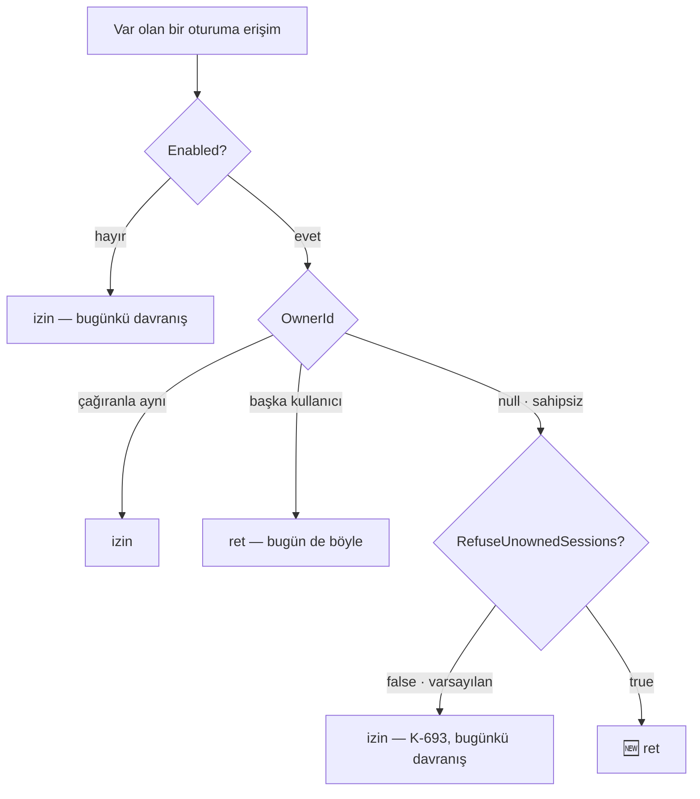

# Faz 149 — Sahipsiz Oturumun Katı Reddi

> **Durum:** ✅ Tamamlandı (2026-09-06)
> **Kaynak:** [ADAYLAR.md](../../ADAYLAR.md) · **F-201** (tüketici turu 4 yanıtı, §8 soru 1)
> **Önkoşul:** [Faz 148](148-OTURUM-SAHIPLIGININ-KALICILIGI.md) — sahiplik sütunu, `SessionOwnershipGate` ve seçenek sınıfı oradan gelir
> **Paketler:** `AgentPrism.Abstractions`, `AgentPrism.AspNetCore`
> **Yeni paket:** Yok · **Migration:** Yok — `owner_id` sütunu Faz 148'de açıldı
> **Public API:** Büyüyor — bir seçenek alanı + bir uç haritalama bayrağı. `wc -l src/*/PublicAPI.Shipped.txt` → 17 satır / 17 dosya (yalnız başlık), **shipped giriş sıfır**: bugün eklemek bedava, Faz 7'den sonra bir sürüm kararı
> **Tüketici yüzeyi:** `docs-site/`: `concepts/sessions.md`, `concepts/governance.md`, `guides/openai-api.md`, `guides/embedding.md`, `capabilities.md` · sevk edilen: `AgentPrismSessionOwnershipOptions` XML `<example>`, `AgentPrismEndpointOptions` XML, `src/AgentPrism.Abstractions/README.md`
> **Manuel test alanı:** [`docs/manuel-test/13-KIRACI-VE-GUVENLIK.md`](../../manuel-test/13-KIRACI-VE-GUVENLIK.md)

---

## Bu Faza Başlarken

> `faz-baslangic` skill'ini uygula. **Tamamını değil, yalnız işaret edilen
> bölümleri oku.**

1. Bu doküman
2. Kararlar — dosyanın tamamını **okuma**, yalnız bu kalemleri grep'le:
   ```bash
   grep -n "K-283\|K-324\|K-670\|K-671\|K-688\|K-689\|K-690\|K-691\|K-692\|K-693" docs/KARARLAR.md
   ```
   **K-283** 🚨 (görünmeyen oturum YOK sayılır — bu fazın **dokunmayacağı** sınır) ·
   **K-324** (`422`/ret yalnız akışsız dalda dönebilir; akışlı yolda ret bir `error` çerçevesidir) ·
   **K-670 · K-671** (kapı deseni ve ret kodları) ·
   **K-688–K-693** (Faz 148'in altı kararı; özellikle **K-693** — bu faz onun *yeniden açılma koşulunu* karşılıyor)
3. [`arsiv/fazlar/148-OTURUM-SAHIPLIGININ-KALICILIGI.md`](148-OTURUM-SAHIPLIGININ-KALICILIGI.md) — **devir notunu tamamen oku**:
   ```bash
   awk '/## Sonraki Faza Devir Notu/,0' docs/arsiv/fazlar/148-OTURUM-SAHIPLIGININ-KALICILIGI.md
   ```
   Sahiplik kapısının çağrı yerleri, akışlı yolda ret biçimi ve `SessionOwnershipGate`'in iki metodu oradan devralınır.
4. Alan hafızası (bu faz üç alana dokunuyor):
   [`hafiza/tool-onay-ve-yetkilendirme.md`](../../hafiza/tool-onay-ve-yetkilendirme.md) (yetkilendirme deseni) ·
   [`hafiza/http-uc-tuzaklari.md`](../../hafiza/http-uc-tuzaklari.md) 🚨 (dönüş tipi gevşetmenin OpenAPI'yi sessizce bozması) ·
   [`hafiza/maf-oturum.md`](../../hafiza/maf-oturum.md) (oturum yazma yolu)
5. Gerektiğinde, tamamı değil ilgili bölümü:
   [`MIMARI-GUVENLIK.md`](../../MIMARI-GUVENLIK.md) — kiracı ve sahiplik sınırı bölümü

---

## Amaç

Faz 148 sahipliği sevk etti ve bilinçli bir taviz verdi (K-693): **sahipsiz
eski satır sahipli listede görünmez, ama tekil erişimde reddedilmez.** Gerekçe,
bayrağın açıldığı anda canlı olan konuşmaların kopmamasıydı.

Tüketici bu tavizi reddetti ve gerekçesini yazdı:

> *"Sahipliği belirlenemeyen mevcut bir session, kimliğini bilen son
> kullanıcıya açık olmamalı. Listede görünmemesi erişim kontrolünün yerine
> geçmez."*

K-693'ün yeniden açılma koşulu (*"Bir 'sahipsiz satırları da reddet' seçeneği
talep gelirse ayrı kalem olarak açılabilir"*) böylece **karşılandı**.

Aynı yanıt bir ikinci şart koydu: kural **bütün** erişim yollarında geçerli
olmalı. Ölçüm sekiz yolun sekizinde tüketicinin kendi handler'ının çağrıldığını
doğruladı — ama **dokuzuncu bir yüzey** buldu: `/v1/conversations`, sahiplik
kapısından geçiyor, tüketicinin handler'ından **geçmiyor**.

- **F-201** — Sahipsiz satır için varsayılan kapalı bir katı ret modu; ve
  `/v1/conversations`'ın kapatılabilir hâle gelmesi ile yetki kapısına
  bağlanması.

### Bugün ne çalışmıyor — doğrulanmış kanıt

| Kanıt | Gözlem |
|---|---|
| [`SessionOwnershipGate.cs:170`](../../../src/AgentPrism.AspNetCore/Security/SessionOwnershipGate.cs) | `if (record?.OwnerId is not { } ownerId) return false;` — sahipsiz satır **izin alıyor** |
| [`SessionOwnershipGate.cs:254`](../../../src/AgentPrism.AspNetCore/Security/SessionOwnershipGate.cs) | `run` yolunda aynı taviz; yorumu *"an unowned row from before ownership was turned on"* diyor |
| [`SessionOwnershipGate.cs:240`](../../../src/AgentPrism.AspNetCore/Security/SessionOwnershipGate.cs) | 🚨 `record is null` (henüz açılmamış oturum) **ayrı bir dal** — tüketicinin istediği ayrım kodda zaten var |
| [`OpenAIConversationsEndpoints.cs:178`](../../../src/AgentPrism.AspNetCore/OpenAICompat/OpenAIConversationsEndpoints.cs), `:214`, `:252` | Üç `SessionOwnershipGate` çağrısı var; `IRunAuthorizationHandler` çağrısı **sıfır** |
| [`AgentPrismEndpointRouteBuilderExtensions.cs:186`](../../../src/AgentPrism.AspNetCore/AgentPrismEndpointRouteBuilderExtensions.cs) | `OpenAIConversationsEndpoints.Map(group, roles);` — **koşulsuz**, kapatma seçeneği yok |
| [`AgentPrismSessionOwnershipOptions.cs`](../../../src/AgentPrism.Abstractions/Options/AgentPrismSessionOwnershipOptions.cs) | Üç üye: `Enabled` · `RequireAuthenticatedOwner` · `ManagementPolicy` |
| [`AgentPrismEndpointOptions.cs`](../../../src/AgentPrism.AspNetCore/AgentPrismEndpointOptions.cs) | Bugün hiçbir uç ailesini kapatan bayrak yok |
| `grep -rn "SessionOwnershipGate\." src/AgentPrism.AspNetCore/` | **11 çağrı yeri**, 6 dosya: `AgentEndpoints` 1 · `SessionEndpoints` 4 · `WorkflowEndpoints` 1 · `OpenAIConversationsEndpoints` 3 · `OpenAIResponsesEndpoints` 1 · `VoiceConversationEndpoint` 1 |

> Kanıtlar 2026-09-06 tarihinde doğrulandı (HEAD `fc2f9d8d`).

**Reddedilenler defteri kontrolü:** `L33 — /v1/conversations ucu Faz 4'te
yazılmadı 👤🔁`. Kayıt **🔁 yeniden açılmış** işaretli ve uç bugün mevcut. Bu
faz kapatılmış bir tartışmayı açmıyor; var olan bir ucun kapı boşluğunu
kapatıyor.

---

## 149.1 — Katı mod: yerleşik bir bayrak

**Karar (kullanıcı, 2026-09-06).** Sahibi handler'a taşıma seçeneği
reddedildi: public yüzeyi büyütür ve sahiplik kapalıyken bile her kapı
çağrısına bir depo okuması ekler. Tüketicinin literal isteği de bir seçenekti.

```csharp
public sealed class AgentPrismSessionOwnershipOptions
{
    public bool Enabled { get; set; }
    public bool RequireAuthenticatedOwner { get; set; } = true;
    public string? ManagementPolicy { get; set; } = "AgentPrism.Operator";

    // YENİ — varsayılan false (K1)
    public bool RefuseUnownedSessions { get; set; }
}
```

Bayrak yalnız `Enabled=true` iken anlamlıdır. `Enabled=false` iken sahiplik
hiç okunmaz ve bu bayrak hiçbir şey yapmaz — bu, XML'e açıkça yazılır.



🚨 **`record is null` dalına DOKUNULMAZ.** Henüz açılmamış bir oturum bu
bayraktan etkilenmez; ilk tur onu açmaya devam eder. K-283 korunur ve
tüketicinin *"Yeni session oluşturma yolu korunmalı"* şartı budur.
`SessionOwnershipGate.cs:240` bu dalı zaten ayırıyor — bayrak yalnız `:254`'ün
`record.OwnerId is not { } ownerId` yarısını ve `:170`'i etkiler.

**Ret biçimi mevcut biçimlerin aynısıdır**, yeni bir kod veya `errorType`
icat edilmez:

| Yol | Ret |
|---|---|
| Oturum uçları (`Read`/`Delete`/`Branch`) | `404`, gövdesi var olmayan oturumla birebir (K-671) |
| `run` başlatma (akışsız) | `403` + `errorType: session_owner_required` |
| `run` başlatma (akışlı) | SSE `error` çerçevesi, aynı `errorType` (K-324) |
| Ses WebSocket | `404` (K-687) |

## 149.2 — `/v1/conversations`: kapı + kapatma seçeneği

**Karar (kullanıcı, 2026-09-06).** İkisi birden: yüzeyi kullanan da
kullanmayan da kapanır.

**Kapı.** Dört uç `IRunAuthorizationHandler`'a bağlanır:

| Uç | `SessionAccess` | Ret |
|---|---|---|
| `POST /v1/conversations` | — (yeni oturum; `record is null` dalı) | — |
| `GET /v1/conversations/{id}` | `Read` | `404` |
| `DELETE /v1/conversations/{id}` | `Delete` | `404` |
| `GET /v1/conversations/{id}/items` | `Read` | `404` |

⚠️ **Bu, handler kaydetmiş MEVCUT kurulumlarda bir davranış değişikliğidir.**
Bugün orada hiç sorulmayan handler artık sorulur ve reddedebilir. Yön
güvenlidir (fail-closed) ve K-670'in *"kapı bir bypass'a dönerse yanlış
güvenlik hissi üretir"* gerekçesiyle aynı sınıftır — ama sürüm notunda
**açıkça** yazılır.

**Kapatma seçeneği.** `AgentPrismEndpointOptions` bir bayrak kazanır. Ad ve
kapsam Açık Soru 1'dedir; varsayılan **bugünkü davranıştır** (yüzey haritalanır).

**Kapsam kapısı büyür.** `RunAuthorizationCoverageTests`'in kaynak listesine
`OpenAIConversationsEndpoints.cs` eklenir. 🚨 K-642 dersi geçerlidir: tarama
regex ile yapılır, düz `Contains` ile değil.

## 149.3 — Değişmeyenler

Bu faz **yalnız** yukarıdaki ikisini yapar. Aşağıdakiler bilerek dışarıdadır:

- **Sahiplik geriye dönük doldurulmaz.** Var olan satırlara sahip atayan bir
  migration veya yönetim ucu **yoktur**. K-689'un "bir kez atanır" kuralı
  korunur.
- **Yönetim payı değişmez.** `ManagementPolicy` taşıyan istek filtresiz
  kiracı listesini görmeye ve sahipsiz satırlara erişmeye devam eder — katı
  mod son kullanıcı yüzeyi içindir, denetim ve destek yüzeyi için değil.
- **Liste davranışı değişmez.** Sahipsiz satır sahipli listede zaten
  görünmüyordu (Faz 148); bu faz onu tekil erişimde de kapatır.
- **`run` kaynakları değişmez.** `RunAccess.Read`/`Cancel`/`Feedback` yolları
  Faz 147'nin kapsamındadır ve sahiplik onlara **bakmaz** — bir `run`'ın
  sahibi `runs.user_id`'dir, oturumun `owner_id`'si değil.

---

## Planlanan Public API

> Taslak imzalardır. Gerçekleşen imzalar kapanışta ayrı bir bölüme yazılır.

```csharp
// AgentPrism.Abstractions — AgentPrismSessionOwnershipOptions
/// <summary>
/// Refuses access to an EXISTING session row that carries no owner.
/// Ignored unless <see cref="Enabled"/> is on. A session that does not exist
/// yet is NOT affected: the first turn still opens it.
/// </summary>
public bool RefuseUnownedSessions { get; set; }   // varsayılan false

// AgentPrism.AspNetCore — AgentPrismEndpointOptions
// Ad ve kapsam: Açık Soru 1. Varsayılan bugünkü davranış (haritalanır).
public bool MapOpenAIConversations { get; set; } = true;
```

`IRunAuthorizationHandler`, `SessionAccess` ve `RunAccess` **değişmez**. Bu faz
yeni bir sözleşme açmaz.

### HTTP `endpoint`'leri

Yeni uç yok. Değişen davranış:

| Uç ailesi | Değişiklik |
|---|---|
| `/v1/conversations` (4 uç) | Yetki kapısı eklenir; `MapAgentPrism` seçeneğiyle kapatılabilir |
| Oturum · `run` başlatma · ses (11 sahiplik çağrı yeri) | `RefuseUnownedSessions=true` iken sahipsiz satır reddedilir |

### Arayüz payı

**Yok.** Konsol yönetim payıyla çalışır ve katı mod yönetim yüzeyini
etkilemez. Bundle payı **0 KB**.

---

## Planlanan Dosya Listesi

```
src/AgentPrism.Abstractions/Options/
└── AgentPrismSessionOwnershipOptions.cs      (RefuseUnownedSessions)

src/AgentPrism.AspNetCore/
├── Security/SessionOwnershipGate.cs          (🚨 iki dal: :170 ve :254)
├── AgentPrismEndpointOptions.cs              (haritalama bayrağı)
├── AgentPrismEndpointRouteBuilderExtensions.cs  (:186 koşullu)
└── OpenAICompat/OpenAIConversationsEndpoints.cs (3 kapı çağrısı)

src/AgentPrism.Core/
└── AgentPrismServiceCollectionExtensions.Binding.*.cs  (yeni bayrağın bağlanması)

tests/AgentPrism.Core.UnitTests/Architecture/
└── RunAuthorizationCoverageTests.cs          (conversations kaynak listesine)

tests/AgentPrism.AspNetCore.FunctionalTests/
├── SessionOwnershipTests.cs                  (katı mod case'leri)
└── OpenAIConversationsAuthorizationTests.cs  (YENİ)
```

---

## Hata Modları ve Testler

| Ne bozulabilir | Seviye | Test sınıfı |
|---|---|---|
| Bayrak kapalıyken davranış değişir | Fonksiyonel | `SessionOwnershipTests` — 11 çağrı yerinin hepsi için bugünkü yanıt |
| Katı mod **yeni** oturum açmayı da engeller (K-283 nüksü) | Fonksiyonel (HTTP sınırı) | `SessionOwnershipTests` — var olmayan `sessionId` ile `run` başlar |
| Katı mod yalnız oturum uçlarında çalışır, `run` yolunda çalışmaz | Fonksiyonel | `SessionOwnershipTests` — gövdede sahipsiz `sessionId` ile `run` reddedilir |
| Akışlı yolda ret `403` olarak denenir ve başlık zaten gitmiştir | Fonksiyonel (akış sınırı) | `SessionOwnershipTests` — SSE `error` çerçevesi, aynı `errorType` |
| Ret gövdesi var olmayan oturumdan **farklı** metin taşır (yan kanal) | Fonksiyonel | `SessionOwnershipTests` — iki gövde birebir karşılaştırılır |
| Yönetim payı katı modda da sahipsiz satırı görebilmeli | Fonksiyonel | `SessionOwnershipTests` |
| `Enabled=false` iken `RefuseUnownedSessions=true` bir şey yapar | Birim | `SessionOwnershipOptionsTests` |
| `/v1/conversations` kapı çağrısını kaybeder | Birim (Architecture) | `RunAuthorizationCoverageTests` |
| Tarama regex'i bölünmüş çağrıyı kaçırır (K-642) | Birim (Architecture) | Aynı sınıf — sıfır bulguda **kırmızı** |
| `/v1/conversations` reddi `403` döner ve varlığını doğrular | Fonksiyonel | `OpenAIConversationsAuthorizationTests` |
| Haritalama kapatıldığında uçlar hâlâ cevap verir | Fonksiyonel | `OpenAIConversationsAuthorizationTests` — `404` (rota yok) |
| Haritalama kapatıldığında OpenAPI'de hâlâ görünür | Fonksiyonel (snapshot) | `OpenApiSnapshotTests` |
| İptal: kapı çağrısı sırasında istek iptal edilir | Fonksiyonel | `OpenAIConversationsAuthorizationTests` |
| Eşzamanlılık: aynı sahipsiz oturuma paralel iki erişim | Fonksiyonel | `SessionOwnershipTests` |
| Boş/aşırı girdi: boş `sessionId`, çok uzun `conversationId` | Fonksiyonel | `OpenAIConversationsAuthorizationTests` |
| Başka kiracının sahipsiz oturumu | Fonksiyonel | Mevcut kiracı testleri korunur; katı mod **onların yerine geçmez** |
| Alt sistem hatası: `ISessionStore` hata verir | Fonksiyonel | `SessionOwnershipTests` — fail-closed |

---

## Manuel Kabul Case'leri

> Kapanışta [`docs/manuel-test/13-KIRACI-VE-GUVENLIK.md`](../../manuel-test/13-KIRACI-VE-GUVENLIK.md) içine eklenir.

| # | Ön koşul | Adımlar | Beklenen sonuç |
|---|---|---|---|
| 1 | `Enabled=true`, `RefuseUnownedSessions=false` (varsayılan) | Sahipsiz oturumu oku | `200` — Faz 148 davranışı korunur |
| 2 | `RefuseUnownedSessions=true` | Aynı isteği at | `404`, gövde var olmayan oturumla **birebir** aynı |
| 3 | Aynı | Sahipsiz oturumun id'siyle `POST /api/agents/{ad}/run` (akışsız) | `403` + `errorType: session_owner_required` |
| 4 | Aynı | Aynı istek akışlı (varsayılan SSE) | `event: error`, aynı `errorType` |
| 5 | Aynı | **Var olmayan** bir `sessionId` ile `run` | `200` — yeni oturum açılır, sahibi çağıran (K-283) |
| 6 | Aynı | Sahipsiz oturuma ses WebSocket'i | Reddedilir |
| 7 | Aynı, yönetim payı taşıyan token | Sahipsiz oturumu oku | `200` — yönetim yüzeyi etkilenmez |
| 8 | `Enabled=false`, `RefuseUnownedSessions=true` | Sahipsiz oturumu oku | `200` — bayrak tek başına bir şey yapmaz |
| 9 | Reddeden handler kayıtlı | `GET /v1/conversations/{id}` | `404` |
| 10 | Haritalama kapalı | Aynı istek | `404` — rota hiç yok |
| 11 | Haritalama kapalı | `curl .../openapi/v1.json \| jq '.paths \| keys'` | `/v1/conversations` yolları **yok** |

On biri de otomatikleştirilebilir; 👤 insan gerektiren case yok.

---

## Açık Sorular

| # | Soru | Seçenekler | Öneri |
|---|---|---|---|
| 1 | Haritalama bayrağının kapsamı ne olsun? | **A:** Yalnız conversations (`MapOpenAIConversations`) · **B:** Bütün OpenAI uyumlu yüzey (`MapOpenAICompatible` — responses + chat completions + conversations) · **C:** İkisi de | **A.** Bu fazın gerekçesi conversations'ın kapı boşluğudur; `/v1/responses` ve `/v1/chat/completions` zaten kapıdan geçiyor. Geniş bayrak (B) fazın kapsamını aşar ve ayrı bir talep kanıtı ister. Uygulama, adın `AgentPrismEndpointOptions`'ın mevcut adlandırma desenine uyduğunu doğrular |
| 2 | Katı mod ret metni ayrı bir `errorType` alsın mı? | **A:** Hayır — mevcut `session_owner_required` yeniden kullanılır · **B:** Evet, `session_unowned` gibi ayrı bir değer | **A.** İstemci için ikisi de aynı eylemi gerektiriyor (oturum kullanılamaz). Ayrı değer, tüketicinin ayırt etmesi gereken bir fark olduğunu ima eder — yok. Tüketici ayrım isterse B ayrı kalem |
| 3 | `POST /v1/conversations` (yeni oturum) kapıya bağlansın mı? | **A:** Hayır — `record is null` dalıdır, `RunAccess.Start` semantiği taşır ve orada zaten sahiplik kapısı var · **B:** Evet, `SessionAccess` ile | **A.** Uygulama Adım 1'de bu ucun bir oturum **açıp açmadığını** ölçer. Açıyorsa `SessionOwnershipGate`'in `record is null` dalı yeterlidir; ayrı bir kapı ikinci bir karar noktası üretir |
| 4 | Katı mod açıkken sahipsiz satır sayısı bir teşhis alanında görünsün mü? | **A:** Bu fazda hayır · **B:** `AgentPrismDiagnosticsReport`'a bir sayaç | **A.** Sayım bir tablo taraması gerektirir ve teşhis ucu sıcak yolda çağrılabilir. Operatörün ihtiyacı varsa ayrı kalem |

---

## Bitiş Ölçütleri (DoD)

- [x] `RefuseUnownedSessions=false` (varsayılan) iken **hiçbir** davranış değişmez — 11 sahiplik çağrı yerinin hepsi için kanıt — `An_unowned_session_stays_reachable_on_every_surface_while_strict_mode_is_off` + Faz 148'in 36 mevcut case'i
- [x] `Enabled=false` iken `RefuseUnownedSessions=true` **hiçbir şey yapmaz** — `Strict_mode_does_nothing_while_ownership_itself_is_off`
- [x] Katı mod açıkken sahipsiz satır oturum uçlarında `404`, `run` başlatmada `403` (akışlı VE akışsız dalın ikisinde de — **sapma 1**, SSE `error` çerçevesi değil), seste `404` döner
- [x] Ret gövdesi var olmayan kaynakla **birebir aynıdır** — `Strict_mode_answers_an_unowned_session_with_the_same_404_a_missing_one_gets` + örnek uygulamada `diff` boş
- [x] 🚨 **Var olmayan** oturum katı modda da açılır — K-283 korunur — üç test + örnek uygulama koşumu
- [x] Yönetim payı taşıyan istek katı modda da sahipsiz satıra erişir — `A_management_caller_still_reads_an_unowned_session_in_strict_mode`; `run` başlatmada muafiyet **yok** (K-694)
- [x] `/v1/conversations`'ın üç okuma/silme ucu `IRunAuthorizationHandler`'dan geçer; ret `404` — `OpenAIConversationsAuthorizationTests` — kapı olmadan 9 case kırmızı olduğu ölçüldü
- [x] `RunAuthorizationCoverageTests` `OpenAIConversationsEndpoints.cs`'i sayar; tarama sıfır bulguda **kırmızı** olur — `ExpectedResourceFiles`'a eklendi; `A_file_missing_the_call_is_reported_by_name` iki yönü de sınar
- [x] Haritalama kapatıldığında dört uç `404` döner ve OpenAPI'de **görünmez** — `Turning_the_surface_off_removes_all_four_routes` · `..._from_the_OpenAPI_document`
- [x] Haritalama bayrağının varsayılanı bugünkü davranıştır (yüzey haritalanır) — `The_conversations_surface_is_mapped_by_default`
- [x] Dört doğrulama kapısı sıfır uyarı verir — `python3 scripts/kapi.py kapanis --taban <faz öncesi commit>` — `--taban dc196ff6`; `dotnet format` bir kez kırmızı oldu (import sırası) ve düzeltildi
- [x] `samples/AgentPrism.Api` ile gerçek `run` yapıldı; katı mod çıktısı belgeye yazıldı — sonuçlar "Örnek Uygulama Koşumu" bölümünde
- [x] `secret` taraması boş döndü — `scripts/kapi.py tarama` ✅
- [x] Manuel kabul case'leri `docs/manuel-test/13-KIRACI-VE-GUVENLIK.md` içine eklendi; on biri de koşuldu — `MT-SEC-175` … `181` (yedi case, on bir iddia); hepsinin otomatik karşılığı var ve koşuldu
- [x] `faz-denetim` koşuldu; 🔴 bulgu kalmadı — kod tarafında hiç doğmadı; tek 🔴 zamanlama kaynaklıydı, beş 🟡'nin dördü düzeltildi
- [x] `docs-site/` güncellendi (`concepts/sessions.md`, `guides/openai-api.md`); `npm run build` + `check-links.mjs` temiz — `npm run check` dördü de temiz: `check:content` · `build` · `check:links` · `check:weight`
- [x] Sürüm notuna `/v1/conversations` davranış değişikliği **açıkça** yazıldı — `CHANGELOG.md` `[Unreleased]` → `### Changed`

### Doğrulama komutları

```bash
# Katı mod: sahipsiz satır, var olmayan satırla AYNI gövde
diff <(curl -s "$APU/api/sessions/$UNOWNED" -H "Authorization: Bearer $TOKEN") \
     <(curl -s "$APU/api/sessions/yok-boyle-bir-id" -H "Authorization: Bearer $TOKEN")

# Yeni oturum yolu korunuyor mu (K-283)
curl -s -o /dev/null -w '%{http_code}\n' -X POST "$APU/api/agents/support/run" \
  -H "Authorization: Bearer $TOKEN" -H 'content-type: application/json' \
  -d '{"input":"merhaba","sessionId":"hic-olmayan-id"}'
# beklenen: 200

# Haritalama kapalıyken OpenAPI
curl -s "$APU/openapi/v1.json" | jq '.paths | keys | map(select(startswith("/v1/conversations")))'
# beklenen: []
```

---

## Riskler

| Risk | Önlem |
|------|-------|
| 🚨 `record is null` dalı yanlışlıkla katı modun kapsamına girer ve yeni oturum açılamaz | DoD ayrı bir madde, manuel case 5 ve fonksiyonel test bunu üç katmandan kilitler. `SessionOwnershipGate.cs:240` yorumu **korunur** |
| `/v1/conversations` kapısı mevcut tüketicilerde sessiz kırılma üretir | Yön güvenli (fail-closed) ama sürüm notu maddesi DoD'de. Kapatma seçeneği aynı fazda geliyor — etkilenen tüketici yüzeyi kapatabilir |
| Akışlı yolda ret denenirken `403` yazılır ve başlık zaten gitmiştir | K-324 sınıfı; Faz 148 bunu zaten yaşadı ve `error` çerçevesi deseni kurulu. Fonksiyonel test akışlı dalı ayrı koşar |
| Bayrak iki yerde okunur ve dallar ayrışır | `SessionOwnershipGate`'in iki metodu tek bir yardımcıdan karar alır; test iki yolu da ayrı ayrı kanıtlar |
| Haritalama bayrağı OpenAPI snapshot'ını beklenmedik biçimde küçültür | `OpenApiSnapshotTests` varsayılan (açık) kurulumda koşar; kapalı kurulum ayrı bir fonksiyonel testte ölçülür |
| Katı mod destek ekibinin işini bozar (kullanıcı "konuşmam kayboldu" der) | Yönetim payı etkilenmiyor; `docs-site/concepts/sessions.md` bu ayrımı açıkça anlatır ve varsayılan kapalıdır |

---

<!-- ============================================================
     AŞAĞISI KAPANIŞTA DOLDURULUR — `faz-tamamlama` skill'i.
     Plan anında boş kalır. Başlıkları SİLME.
     ============================================================ -->

## Plandan Sapmalar

| # | Plan ne diyordu | Ne oldu | Neden |
|---|---|---|---|
| 1 | **Akışlı yolda ret bir SSE `error` çerçevesidir** (K-324; hata modu tablosu ve manuel case 4) | Ret **gerçek `403`'tür**, akışlı ve akışsız dalın ikisinde de | Plan bayattı. Faz 148'in devir notu bunu zaten yazmıştı: `CheckRunSessionAsync` uç gövdesinde `SseWriter.StartAsync`'ten **önce** koşar, bu yüzden başlıklar henüz gitmemiştir. Ölçüldü — `AgentEndpoints.cs:234` guard'ı `RunAsync`/`RunQueuedAsync` dallanmasından öncedir. K-324 bu fazın kapsamına hiç girmedi; `POST …/run` varsayılan olarak SSE'dir ve `Running_against_another_owners_session_is_refused` zaten `403` bekliyordu. Akışsız dal `Idempotency-Key` ile ayrı test edildi |
| 2 | Kapsam kapısına `OpenAIConversationsEndpoints.cs` **eklenir** | Ownership listesinde **zaten vardı** (Faz 148 onu eklemişti); eklenen yer `ExpectedResourceFiles`, yani `RunAuthorizationGate` listesi | Ölçüm: `ExpectedSessionOwnershipFiles` dosyayı taşıyordu, `ExpectedResourceFiles` taşımıyordu. Aynı dosya iki listeye ait; biri AgentPrism'in kendi sahiplik sınırı, diğeri tüketicinin handler'ı. Bir yüzey **yarım kapılı** olabilir |
| 3 | Yönetim payı "değişmez" (§149.3) | Yönetim muafiyeti **yeni** bir davranıştır ve tek noktaya eklendi | `DeniesAsync` bugüne kadar `ManagementPolicy`'ye **hiç bakmıyordu** (K-691 bilinçli kararı). "Değişmez" ancak yeni bir muafiyetle sağlanabilirdi. Kullanıcı kararı: muafiyet yalnız okuma/silme kapısında (`DeniesAsync`), `run` başlatmada **yok** → K-694 |
| 4 | `DeniesAsync` imzası değişmez | `HttpContext` parametresi eklendi (**yedi** çağrı yeri güncellendi: `SessionEndpoints` 3 · `OpenAIConversationsEndpoints` 3 · ses 1) | Yönetim politikası istek başına değerlendirilir; `SatisfiesManagementPolicyAsync` `HttpContext.User` ve `RequestServices` ister. Üç endpoint handler'ı da `HttpContext` parametresi kazandı — rota ve OpenAPI'yi etkilemez |
| 5 | Manuel case tablosu 11 kalem | 7 kalem (`MT-SEC-175`–`181`), aynı 11 iddiayı kapsıyor | Plan tablosu her satırı ayrı case sayıyordu; kabul seti biçimi her case'e birden çok adım verir. Sayı düştü, kapsam düşmedi — her case otomatik karşılığını adıyla sayar |

**Kapsamda kalmayan bir gözlem:** `docs-site` `--site-denetle`'nin `http-api`
kuralı hâlâ yanlış negatif üretiyor (Faz 148 devir notu). Bu faz onu
düzeltmedi; aday olarak açık.

## Bu Fazda Verilen Kararlar

| Karar | Gerekçe |
|---|---|
| **K-694 — Katı modun yönetim muafiyeti yalnız OKUMA kapısındadır (`DeniesAsync`), `run` BAŞLATMADA yoktur (kullanıcı kararı)** | `ManagementPolicy` bugüne kadar tekil oturuk erişiminde hiç sorulmuyordu (K-691). Katı mod açıkken sahipsiz satır yönetim listesinde görünmeye devam ederdi ama açılamazdı — destek ekibi göremediği değil, **görüp okuyamadığı** bir satıra bakardı. Muafiyet bu boşluğu kapatır. `run` başlatmaya taşınmaz: bir turu sürdürmek konuşmaya **yazar** ve operatörü sahipsiz bir konuşmanın yazarı yapar. Sahipsiz satırda sızacak bir kullanıcı konuşması yoktur (satır kimseye ait değildir), bu yüzden K-691'in "başkasının SAHİPLİ oturumu operatöre de kapalı" kuralı bozulmaz |
| **K-695 — Sahipsiz satır reddi ile başkasının oturumu reddi AYNI metni taşır (`run` yüzeyinde `403`, oturuk yüzeyinde `404`)** | İki ayrı metin, çağıranın görmeye zaten yetkili olduğu bir yanıttan hangi oturumların sahiplikten **önce** yazıldığını öğrenmesini sağlardı. İstemcinin eylemi iki durumda da aynıdır: bu oturum kullanılamaz. Açık Soru 2 cevabı A ile aynı sınıf; `errorType` de tektir (`session_owner_required`) |
| **K-696 — `/v1/conversations`'ın üç okuma/silme ucu `IRunAuthorizationHandler`'a bağlandı; `POST` bağlanmadı** | Uyumluluk yüzeyi aynı oturumlara başka bir adla erişiyordu: handler'ı `GET /api/sessions/{id}`'yi reddedecek biçimde kurmuş bir tüketicide `GET /v1/conversations/{id}/items` aynı geçmişi veriyordu. `POST` ölçüldü — hiçbir şey yazmaz, yalnız kimlik ayırır (`CreateAsync` `ISessionStore`'a hiç dokunmaz); kapıya bağlamak var olmayan bir kaynak üzerinde ikinci bir karar noktası açardı. ⚠️ Handler kaydetmiş MEVCUT kurulumlarda **davranış değişikliğidir** (fail-closed yönde) |
| **K-697 — `MapOpenAIConversations` yalnız conversations ailesini yönetir; `/v1/responses` ve `/v1/chat/completions` kapsam dışıdır (kullanıcı kararı, Açık Soru 1 cevabı A)** | Fazın gerekçesi conversations'ın kapı boşluğuydu; diğer iki yüzey zaten kapıdan geçiyor. Geniş bir `MapOpenAICompatible` bayrağı ayrı bir talep kanıtı ister ve conversations'ı kapatmak isteyen bir kurulumu `run` yüzeyini de kapatmaya zorlardı. Varsayılan `true` — yüzey sevk edildi, sessizce geri çekilemez |

> K-693 bu fazla **kapandı**: yeniden açılma koşulu ("bir 'sahipsiz satırları da
> reddet' seçeneği talep gelirse") karşılandı ve seçenek sevk edildi. K-693'ün
> kendisi hâlâ **varsayılan** davranışı tarif eder.

## Gerçekleşen Public API

```csharp
// AgentPrism.Abstractions — AgentPrismSessionOwnershipOptions
public bool RefuseUnownedSessions { get; set; }          // varsayılan false

// AgentPrism.AspNetCore — AgentPrismEndpointOptions
public bool MapOpenAIConversations { get; set; } = true;
```

Planlanan imzalarla **birebir aynı**. `IRunAuthorizationHandler`,
`SessionAccess` ve `RunAccess` değişmedi; yeni sözleşme açılmadı.
`PublicAPI.Unshipped.txt`: iki pakette dörder satır (`get`/`set`).

`AgentPrism:SessionOwnership:RefuseUnownedSessions` yapılandırma anahtarı
`BindSessionOwnership` içinde **elle** bağlandı (K-021, AOT) ve
`Strict_mode_is_bound_from_configuration` bunu kilitler.

### HTTP `endpoint`'leri

Yeni uç yok. Değişen davranış planla aynı: `/v1/conversations`'ın üç ucu yetki
kapısı kazandı ve dördü birden kapatılabilir; 11 sahiplik çağrı yerinin hepsi
`RefuseUnownedSessions=true` iken sahipsiz satırı reddeder.

## Dosya Listesi (gerçekleşen)

```
src/AgentPrism.Abstractions/Options/
└── AgentPrismSessionOwnershipOptions.cs      (+RefuseUnownedSessions; ManagementPolicy XML'i düzeltildi)

src/AgentPrism.AspNetCore/
├── Security/SessionOwnershipGate.cs          (iki dal + HttpContext parametresi + RefusedAsAnotherUsers)
├── AgentPrismEndpointOptions.cs              (+MapOpenAIConversations)
├── AgentPrismEndpointRouteBuilderExtensions.cs  (koşullu haritalama)
├── OpenAICompat/OpenAIConversationsEndpoints.cs (3 yetki kapısı + HttpContext)
├── Endpoints/SessionEndpoints.cs             (3 çağrı yeri + HttpContext)
└── Voice/VoiceConversationEndpoint.cs        (1 çağrı yeri)

src/AgentPrism.Core/
└── AgentPrismServiceCollectionExtensions.Binding.Security.cs

src/*/PublicAPI.Unshipped.txt                 (Abstractions · AspNetCore)

tests/AgentPrism.Core.UnitTests/Architecture/
└── RunAuthorizationCoverageTests.cs          (ExpectedResourceFiles'a conversations)

tests/AgentPrism.AspNetCore.FunctionalTests/
├── SessionOwnershipTests.cs                  (+17 katı mod case'i; 36 → 53)
└── OpenAIConversationsAuthorizationTests.cs  (YENİ, 18 case)

docs-site/src/content/docs/
├── concepts/sessions.md                      (katı mod bölümü)
├── concepts/governance.md
├── capabilities.md                           (iki satır)
└── guides/openai-api.md                      (kapı + kapatma + davranış değişikliği uyarısı)

docs/manuel-test/13-KIRACI-VE-GUVENLIK.md     (MT-SEC-175 … 181)
docs/manuel-test/00-INDEKS.md                 (satır 13 güncellendi)
```

## Örnek Uygulama Koşumu

`samples/AgentPrism.Api`, `AgentPrism__SessionOwnership__Enabled=true`,
`RequireAuthenticatedOwner=false` (sahipsiz satır **üretebilmek** için),
`RefuseUnownedSessions=true`, `Demo__Roles__Enabled=true`. Bellek içi `store`,
`echo` sağlayıcı — gerçek `run`, gerçek HTTP.

| Adım | Ölçülen |
|---|---|
| Kimliksiz çağıran `sessionId=legacy-1` ile `run` | `200` — sahipsiz satır yazıldı (`ownerId: null`) |
| `GET /api/sessions/legacy-1` (alice) | `404` |
| `DELETE /api/sessions/legacy-1` (alice) | `404`, satır **durdu** |
| `GET /v1/conversations/legacy-1` · `/items` | `404` · `404` |
| `404` gövdesi ↔ var olmayan oturumun gövdesi | **birebir aynı** (`traceId` ve id dışında; `diff` boş) |
| `POST /api/agents/support/run` `sessionId=legacy-1` (alice, akışlı/varsayılan) | `403` + `errorType: session_owner_required`, `detail`: *"belongs to another user"* (K-695) |
| 🚨 `sessionId=brand-new` (alice) | `200` — oturum açıldı ve sahibi alice (K-283 korundu) |
| `GET /api/sessions/brand-new` (bob) | `404` |
| `GET /api/sessions/legacy-1` **OPERATOR** rolüyle | `200` (K-694) |
| `GET /api/sessions/legacy-1` **READER** rolüyle | `404` — aynı kayıtlı politika, farklı cevap |
| `POST run` `legacy-1` **OPERATOR** rolüyle | `403` — muafiyet yazmayı kapsamaz (K-694) |
| Yönetim listesi | `[('legacy-1', None)]` — satır her reddin ardından **yerinde** |
| `GET /openapi/v1.json` (varsayılan) | Üç `/v1/conversations` yolu **var** |

Demo rolleri **kapalıyken** aynı `OPERATOR` okuması `404` verdi — `AgentPrism.Operator`
politikası kayıtlı değilse muafiyet **yoktur** (fail-closed, ayrıca ölçüldü).

## Denetim Bulguları

`faz-denetim` taze bağlamlı bir denetçiyle koşuldu. Denetçi bağımsız olarak
`dotnet build` (0 uyarı), 896 fonksiyonel test ve `docs-site npm run check`
koştu. **Kod tarafında 🔴 seviyesinde kusur bulunmadı.**

Denetçi üç kritik iddiayı ayrı ayrı doğruladı: `record is null` ↔
`record.OwnerId is null` ayrımı korunuyor (K-283 ayakta), yönetim muafiyeti
asimetrik (K-694 uygulanmış) ve `DeniesAsync`'in `HttpContext` parametresi
**yedi** çağrı yerinin yedisinde de doğru — plan ve devir notu "altı" diyordu,
gerçek sayı yedi (`SessionEndpoints` üç, ses bir, conversations üç).

### 🔴

| # | Bulgu | Sonuç |
|---|---|---|
| 1 | DoD'nin "örnek uygulama koşumu" satırı için dokümanda kayıt yok | **Geçersiz — zamanlama.** Denetçi dosyayı "Örnek Uygulama Koşumu" bölümü yazılmadan önce okudu. Bölüm bu dokümanda mevcuttur ve 13 satırlık ölçüm tablosu taşır |

### 🟡

| # | Bulgu | Sonuç |
|---|---|---|
| 1 | `A_cancelled_request_does_not_answer_200` **test tiyatrosu**: token istek gönderilmeden önce iptal ediliyor, sunucuya hiç ulaşılmıyor | **Düzeltildi.** Test `BlockingHandler` ile yeniden yazıldı: handler `AuthorizeSessionAsync` içinde isteğin **kendi** token'ını bekler, test handler'a girildiğini gördükten SONRA iptal eder ve `ObservedCancellation`'ı sınar. Artık token'ın tüketici koduna gerçekten ulaştığını kanıtlıyor |
| 2 | 🚨 Bir reddi **başka bir redle** karşılaştırıyordu; ayrıca kaynak yorumu *"a denial still cannot confirm the conversation exists"* diyordu — bu uçta **yanlış**, çünkü kullanılmamış bir kimlik `200` döner | **Düzeltildi, ikisi de.** Test artık gerçek bir **başka kiracı** kaydıyla karşılaştırıyor (`SeedAsync(..., tenantId: "other-tenant")`) ve kiracı reddinin handler'a hiç ulaşmadığını da ölçüyor (K-684). Kaynak yorumu düzeltildi: bayt eşitliğinin ne aldığı **ve ne almadığı** açıkça yazıldı — bu yüzeyde `404` her zaman "seninki değil" demektir, "hiç yok" değil; kimlik bir rezervasyondur |
| 3 | Katı mod 11 çağrı yerinin ikisinde (`WorkflowEndpoints`, `OpenAIResponsesEndpoints`) hiç denenmedi; `/v1/responses` reddi OpenAI biçimine **çevriliyor** | **Düzeltildi.** İki fonksiyonel case eklendi: `Strict_mode_refuses_an_unowned_conversation_on_the_OpenAI_run_surface` (çeviriyi de ölçer, satırın sahiplenilmediğini de) ve `Strict_mode_refuses_an_unowned_session_on_the_workflow_run_surface` |
| 4 | 17 DoD kutusunun tamamı işaretsiz | **Geçersiz — zamanlama.** Denetçi dosyayı kutular işaretlenmeden önce okudu |
| 5 | `guides/embedding.md` değişmemişti; oturum erişimi listesi conversations'ı saymıyordu | **Düzeltildi.** Liste üç conversations ucunu kapsayacak şekilde genişletildi; `POST`'un neden dışarıda olduğu da yazıldı |
| 6 | `dokuman-bakim.py` kırmızı: kapanmış faz kökte, `ADAYLAR.md` arşiv yoluna bağlanıyor | **Beklenen.** `faz-arsivle` ile kapandı; dört kapı arşivlemeden **sonra** yeniden koşuldu |

### 🟢 — aday listesine

| # | Bulgu | Kayıt |
|---|---|---|
| 1 | `ExpectedResourceFiles` dosya seviyesinde eşleşir: conversations'ın üç `CheckSessionAsync` çağrısından ikisi silinse tarama yeşil kalır | **F-204** |
| 2 | `/v1/conversations/{id}` varlık asimetrisi: yok → `200`, reddedildi → `404`; katı modda bir çağıran hangi id'lerin sahipsiz **satır** olduğunu sayabilir | **F-205** |
| 3 | `AgentPrismSessionOwnershipOptions` `<example>` taşımıyor | Kalite sözleşmesinin `<example>` kuralı giriş noktaları (`Add*`/`Use*`/`Map*`) içindir; bu bir property. **Kayda geçmez** |

## Sonraki Faza Devir Notu

Katı mod sevk edildi ve K-693 kapandı. Devreden beş gerçek bilgi:

- 🚨 **`SessionOwnershipGate.DeniesAsync` artık `HttpContext` ister.** Bugün
  **yedi** çağrı yeri var (`SessionEndpoints` 3 · `OpenAIConversationsEndpoints` 3
  · ses 1); `CheckRunSessionAsync`'in ayrıca üç çağrı yeri var, toplam 11.
  Yeni bir oturum yüzeyi eklerken üç şey birden gerekir: kapıyı **kendi gövdesinde**
  çağır, `HttpContext`'i geçir (yönetim politikası istek başına
  değerlendirilir) ve dosyayı `RunAuthorizationCoverageTests`'in **iki**
  listesine birden ekle — `ExpectedSessionOwnershipFiles` (AgentPrism'in kendi
  sınırı) ve `ExpectedResourceFiles` (tüketicinin handler'ı). Faz 148 birinciyi
  ekledi, ikincisini atladı; bu faz onu bulmak için geri gelmek zorunda kaldı.
  **Bir yüzey yarım kapılı olabilir ve bir kapıyı bulmak diğeri hakkında kanıt
  değildir.**
- 🚨 **"Henüz açılmamış" ile "sahipsiz yazılmış" AYRI dallardır ve öyle
  kalmalıdır.** `DeniesAsync` içinde `record is null` ilk kontrol,
  `record.OwnerId is null` ikincisidir; `CheckRunSessionAsync` içinde de ayrı.
  Bu ikisini "sahipsiz" diye birleştiren herhangi bir sadeleştirme K-283'ü
  düşürür ve her kurulumdaki **ilk** konuşmayı sessizce öldürür. Üç test
  (`Strict_mode_still_opens_...` × 2, `Strict_mode_refuses_...`) bunu üç
  katmandan kilitler.
- **Yönetim muafiyeti tek yerdedir ve simetrik DEĞİLDİR** (K-694). Sahipliği
  "tek yardımcıda toplamak" isteyen bir sonraki faz bu asimetriyi silmeye
  eğilimlidir; `The_management_exemption_does_not_extend_to_starting_a_run`
  onu tutar.
- **`AgentPrismEndpointOptions` yapılandırmadan bağlanmaz.** `MapOpenAIConversations`
  yalnız `MapAgentPrism(prefix, options => ...)` ile ayarlanır. Bu bilinçlidir
  (`AuthToken` aynı tipte yaşıyor, bkz. tipin `record` olmama gerekçesi); bir
  uç ailesini `appsettings` ile kapatılabilir yapmak isteyen faz önce bunu
  ölçmelidir.
- **Sahiplik hâlâ geriye dönük DEĞİLDİR.** Bu faz sahipsiz satırı *reddedebilir*
  hâle getirdi; ona *sahip atayan* bir migration veya uç hâlâ yoktur ve
  K-689'un "bir kez atanır" kuralı korunur. Katı modu açan bir kurulum o
  satırları artık hiç kullanamaz — `docs-site` bunu açıkça yazıyor.
