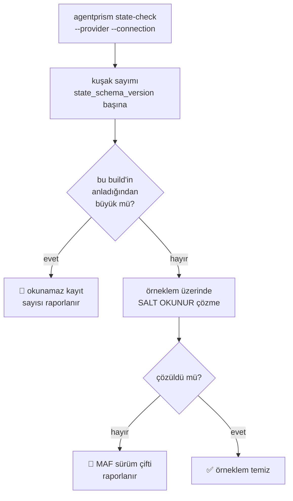

# Faz 156 — Durum Ön Kontrolü ve Upgrade Penceresi

> **Durum:** ✅ Tamamlandı (2026-09-08)
> **Kaynak:** [ADAYLAR.md](../../ADAYLAR.md) · **F-216** (doğrulamada **daraltıldı** — aşağıya bak)
> **Önkoşul:** Yok. [Faz 126](126-KALICI-PAYLOAD-SURUM-SOZLESMESI.md) bu fazın dayandığı sözleşmeyi kurdu; kapalıdır
> **Paketler:** `AgentPrism.Cli`, `AgentPrism.Core` (salt okunur ön kontrol mantığı)
> **Yeni paket:** Yok · **Migration:** Yok — bu faz **hiçbir şey yazmaz**
> **Public API:** Büyüyor — yeni CLI komutu ve onun okuduğu ön kontrol tipi. Faz 7'den önce ucuz
> **Tüketici yüzeyi:** `docs-site/src/content/docs/reference/versioning.md` (upgrade penceresi) · `docs-site/src/content/docs/guides/production.md` (başarısız restore prosedürü) · sevk edilen: `AgentPrism.Cli` README'si, `capabilities.md` satırı
> **Manuel test alanı:** [`docs/manuel-test/34-ISTEMCI-VE-CLI.md`](../../manuel-test/34-ISTEMCI-VE-CLI.md) — plan `25`'i işaret ediyordu; `state-check` bir CLI komutudur (bkz. *Plandan Sapmalar* §6)

---

## Bu Faza Başlarken

> `faz-baslangic` skill'ini uygula. Aşağıdaki liste o skill'in 2. adımıdır —
> **tamamını değil, yalnız işaret edilen bölümleri oku.**

1. Bu doküman
2. Kararlar — dosyanın tamamını **okuma**, yalnız bu kalemleri grep'le:
   ```bash
   grep -n "K-649\|K-059" docs/KARARLAR.md
   ```
   **K-649** (kalıcı payload sürüm sözleşmesi: `state_schema_version` ve `state_maf_version`) ·
   **K-059** (`secret` dosyaya **ve veritabanına** yazılmaz — bu faz bağlantı dizesi işler)
3. [Faz 126](126-KALICI-PAYLOAD-SURUM-SOZLESMESI.md) — yalnız devir notu:
   ```bash
   awk '/## Sonraki Faza Devir Notu/,0' docs/arsiv/fazlar/126-KALICI-PAYLOAD-SURUM-SOZLESMESI.md
   ```
   🚨 **Bu faz o fazın üstüne biner.** Faz 126 corpus'u ve testi kurdu; bu faz onu operatörün **kendi verisine** taşır. Devir notunu okumadan başlama.
4. Alan hafızası (bu faz iki alana dokunuyor):
   [`hafiza/maf-oturum.md`](../../hafiza/maf-oturum.md) (oturum durumu ve envelope) ·
   [`hafiza/paketleme-ve-dagitim.md`](../../hafiza/paketleme-ve-dagitim.md) (CLI aracı sevkiyatı)
5. Fixture sözleşmesi — **okunmadan fixture'a dokunulmaz**:
   `tests/AgentPrism.Core.UnitTests/Fixtures/README.md`

---

## Amaç

Bugün "yükselttiğimde bekleyen oturumlarım okunabilir mi" sorusunun cevabı
**yalnız CI'da** vardır. Operatörün kendi veritabanına sorabileceği bir şey
yoktur; öğrenme yeri üretimdir. Bu faz o soruyu yükseltmeden **önce**
sorulabilir hâle getirir ve cevabın ne anlama geldiğini yazıya döker.

- **F-216** — salt okunur durum ön kontrolü (CLI), yazılı upgrade penceresi ve
  başarısız restore prosedürü.

### 🚨 Aday doğrulamada daraldı — ne DÜŞTÜ

F-216'nın merkezî iddiası *"önceki artifact'in ürettiği durum corpus'u test
ağacında yok"* idi. **Yanlış.** [Faz 126](126-KALICI-PAYLOAD-SURUM-SOZLESMESI.md)
bunu zaten yapmıştır ve 2026-09-07'de doğrulandı:

| Bugün **var** | Kanıt |
|---|---|
| Gerçek koşumdan yakalanmış oturum corpus'u | `tests/AgentPrism.Core.UnitTests/Fixtures/session-state-1.18.0.json` |
| Gerçek koşumdan yakalanmış checkpoint corpus'u | `tests/AgentPrism.Workflows.UnitTests/Fixtures/workflow-checkpoint-1.18.0.json` |
| Çapraz sürüm okuma kapısı | [`PersistedPayloadUpgradeTests.cs:24`](../../../tests/AgentPrism.Core.UnitTests/Sessions/PersistedPayloadUpgradeTests.cs#L24) — 1.18.0 fixture'ını **bugünkü 1.20.0** koduyla okur |
| Bilinmeyen kuşağın tanımlı hatası | Aynı dosya `:36` — gelecekteki `StateSchemaVersion` tanımlı hata verir, oturum **silinmez** |
| Fixture yenileme yasağı | `Fixtures/README.md` — "kırmızı olduğu için yenileme"; `nuget-danismani`'ye götür |

**Bu yüzden corpus yazma işi bu fazın kapsamında DEĞİLDİR.** Faz 126'nın
fixture'larına ve yenileme kuralına dokunulmaz.

### Bugün ne çalışmıyor — doğrulanmış kanıt

| Kanıt | Gözlem |
|---|---|
| `ls src/AgentPrism.Cli/Commands/` | Yalnız `Eval` · `Health` · `Migrate` · `MigrateStatus`. Durumu ön kontrol eden komut **yok** |
| `grep -rl "upgrade window" docs-site/` | **Sıfır sonuç** — desteklenen upgrade penceresi hiçbir tüketici sayfasında yazılı değil |
| [`production.md:387`](../../../docs-site/src/content/docs/guides/production.md) | Yalnız bir kontrol listesi satırı: "restore prosedürlerini tanımla". Başarısız restore için **adım yok** |
| [`AgentSessionManager.cs:42`](../../../src/AgentPrism.Core/Sessions/AgentSessionManager.cs#L42) · [`AgentPrismCheckpointStore.cs:39`](../../../src/AgentPrism.Workflows/Internal/AgentPrismCheckpointStore.cs#L39) | `CurrentStateSchemaVersion = 1` — ikisi de `internal const`; dışarıdan okunamaz |
| [`ISessionStore.cs:175`](../../../src/AgentPrism.Abstractions/Sessions/ISessionStore.cs#L175) | ~~`QueryAsync(SessionQuery)` var — salt okunur sayım için yeterli~~ **🚨 ÇÜRÜDÜ (2026-09-08).** Kiracı filtreler, sayfalar, tam payload okur — bkz. *Plandan Sapmalar* §1 |
| [`IWorkflowCheckpointStore.cs:64`](../../../src/AgentPrism.Abstractions/Workflows/IWorkflowCheckpointStore.cs#L64) | ~~`ListAsync` var — checkpoint tarafı için aynı~~ **🚨 ÇÜRÜDÜ.** `tenantId` **ve** `sessionId` ister; veritabanı çapında kullanılamaz |
| [`MigrateCommand.cs:11`](../../../src/AgentPrism.Cli/Commands/MigrateCommand.cs#L11) | Doğrudan veritabanına bağlanan CLI deseni: `--provider` + `--connection` |

> Kanıtlar 2026-09-07 tarihinde doğrulandı.

---

## 156.1 — Salt okunur durum ön kontrolü

Yeni komut: `agentprism state-check`. `migrate` desenini izler (doğrudan
veritabanı, HTTP değil) — çünkü ön kontrol **yükseltmeden önce**, uygulama
ayakta değilken de koşabilmelidir.



🚨 **Üç sert kural.**

1. **Hiçbir şey yazmaz.** Ne oturum, ne checkpoint, ne migration tablosu.
   Kanıtı bir testtir, yorum değil (§*Hata Modları*).
2. **Örneklemdir, kanıt değildir.** Komut "örneklem temiz" der, "her kayıt
   okunabilir" **demez**. Çıktı bu ayrımı kelimeyle kurar; yoksa operatör
   yanlış güven kazanır.
3. **Bağlantı dizesi yazdırılmaz** (K-059). `MigrateCommand.cs:37`'nin emsali:
   sağlayıcı istisnası bağlantı dizesi taşımadığı için `ex.Message` güvenlidir;
   yeni kod bu varsayımı **kendi** hata yolları için tekrar doğrulamalıdır.

Örneklem büyüklüğü ve seçimi **Açık Soru 1**'dir.

## 156.2 — Kuşak numaralarının okunabilir olması

`CurrentStateSchemaVersion` bugün iki yerde `internal const`. Ön kontrol onu
okumak zorundadır. Seçenek **Açık Soru 2**'dir: sabiti public yapmak mı, yoksa
ön kontrolü `Core` içinde tutup CLI'a yalnız sonucu vermek mi.

Tercih edilen yön: **ikincisi**. Sabit bir uygulama ayrıntısıdır; public
yüzeye çıkarmak onu bir söz hâline getirir ve sonradan değiştirmeyi kırıcı
yapar. CLI, `Core`'un ürettiği bir rapor tipini okur.

## 156.3 — Yazılı upgrade penceresi

`reference/versioning.md`'ye yeni bir bölüm: **hangi sürümden hangisine
yükseltmek destekleniyor** ve bu sözün neye dayandığı. Bugün bu söz hiç
verilmemiştir; verilmediği için de tutulup tutulmadığı ölçülemez.

Bölüm üç şeyi söyler:

1. Desteklenen atlama aralığı (bir sürüm mü, N sürüm mü) — **Açık Soru 3**.
2. Sözün dayanağı: Faz 126'nın fixture'ları ve `PersistedPayloadUpgradeTests`.
   🚨 Söz **AgentPrism'in kendi envelope'u** içindir; MAF'ın kendi
   uyumluluğu AgentPrism'in vaadi değildir ve bu cümle sayfada durur.
3. Ön kontrolün nasıl koşulacağı ve çıktısının nasıl okunacağı.

## 156.4 — Başarısız restore prosedürü

`guides/production.md`'ye adım listesi: ön kontrol kırmızı döndüğünde ne
yapılır. Drain (mevcut `DrainTests`'in kanıtladığı davranış), eski runtime'ı
ne kadar tutmak gerektiği, ve kararın `nuget-danismani`'ye ne zaman gideceği.

🚨 Bu bölüm **eski runtime'ı süresiz tutma** beklentisi yaratmamalıdır. Pencere
yazılı olduğu için sınırlıdır; sınırın kendisi §156.3'te durur.

---

## Planlanan Public API

> Taslak imzalardır. Gerçekleşen imzalar kapanışta ayrı bir bölüme yazılır.

```csharp
// AgentPrism.Core — salt okunur ön kontrol sonucu
public sealed record StatePreflightReport
{
    public required IReadOnlyList<StateGenerationCount> Sessions { get; init; }
    public required IReadOnlyList<StateGenerationCount> Checkpoints { get; init; }
    public required int SampledCount { get; init; }
    public required int SampleFailureCount { get; init; }
    public required bool HasUnreadableGeneration { get; init; }
}

public sealed record StateGenerationCount
{
    public required int SchemaGeneration { get; init; }
    public required long RecordCount { get; init; }
    public required bool ReadableByThisBuild { get; init; }
}
```

### CLI yüzeyi

| Komut | Argümanlar | Ne yapar |
|---|---|---|
| `agentprism state-check` | `--provider` · `--connection` (veya `AGENTPRISM_CONNECTION`) · `--sample` · `--json` | Kuşakları sayar, örneklem üzerinde salt okunur çözme dener, rapor yazar |

Çıkış kodu: `0` temiz · `3` okunamaz kayıt veya örneklem hatası bulundu
(`EvalCommand`'ın regresyon için `3` kullanma emsali).

### HTTP `endpoint`'leri

Yeni uç **yok**. Ön kontrol uygulama ayakta değilken de koşmalıdır.

### Arayüz payı

Yok — bu faz arayüze dokunmuyor.

---

## Planlanan Dosya Listesi

```
src/AgentPrism.Core/Diagnostics/
├── StatePreflight.cs              (yeni — salt okunur sayım ve örneklem)
└── StatePreflightReport.cs        (yeni)

src/AgentPrism.Cli/Commands/
└── StateCheckCommand.cs           (yeni)

src/AgentPrism.Cli/
└── Program.cs                     (değişir — komut yönlendirmesi)

tests/AgentPrism.Sqlite.IntegrationTests/
└── StatePreflightTests.cs         (yeni — yazmadığını da kanıtlar)

tests/AgentPrism.Cli.FunctionalTests/
└── StateCheckCommandTests.cs      (yeni)
```

---

## Hata Modları ve Testler

> Mutlu yoldan değil, **ne bozulabilir**den türetilir. Seviyeyi plan seçer.

| Ne bozulabilir | Seviye | Test sınıfı |
|---|---|---|
| Ön kontrol **yazar** (satır günceller, migration koşar) | Fonksiyonel (depo sınırı) | `StatePreflightTests` — öncesi/sonrası tam tablo karşılaştırması |
| Okunamaz kuşak var ama komut `0` döner | Fonksiyonel | `StateCheckCommandTests` |
| Bağlantı dizesi hata çıktısına sızar (K-059) | Fonksiyonel | `StateCheckCommandTests` |
| Başka kiracının oturumu sayıma girer | Sözleşme (`TenantIsolationContract`) | dört koşumda birden |
| Örneklem "temiz" der, operatör "hepsi okunabilir" anlar | Manuel | kabul case 4 |
| Veritabanı erişilemez; komut yığın izi basar | Fonksiyonel | `StateCheckCommandTests` |
| Boş veritabanı; komut hata verir | Fonksiyonel | `StateCheckCommandTests` |
| Çok büyük tabloda tam tarama yapar ve üretimi yavaşlatır | Fonksiyonel | `StatePreflightTests` — sorgu sınırlı olmalı |

Beş soru: **iptal** — `Ctrl+C` yarıda kesince yazım olmadığı için durum
bozulmaz (test) · **eşzamanlılık** — canlı yazan uygulama varken okuma
(salt okunur, kilit almaz) · **boş/aşırı girdi** — boş veritabanı ve
`--sample 0` · **başka kiracı** — sözleşme testi · **alt sistem hatası** —
veritabanı erişilemez.

---

## Manuel Kabul Case'leri

| # | Ön koşul | Adımlar | Beklenen sonuç |
|---|---|---|---|
| 1 | Dolu bir veritabanı, güncel sürüm | `agentprism state-check --provider postgres --connection …` | Çıkış `0`; kuşak başına sayım listelenir |
| 2 | Bir oturum satırının `state_schema_version` değeri elle büyütülmüş | Aynı komut | Çıkış `3`; okunamaz kayıt sayısı raporlanır; satır **değişmemiştir** |
| 3 | Yanlış bağlantı dizesi | Aynı komut | Tek satırlık hata; bağlantı dizesi **yazdırılmaz**; yığın izi yok |
| 4 | Dolu veritabanı, `--sample 5` | Aynı komut | Çıktı "5 kayıt örneklendi" der; "tümü okunabilir" **demez** |
| 5 | Komut koşmadan ve koştuktan sonra tablo anlık görüntüsü | `state-check` koş, iki anlık görüntüyü karşılaştır | **Birebir aynı** — hiçbir satır değişmemiş |
| 6 | 👤 insan gerekir | `versioning.md` upgrade penceresi bölümünü oku | Desteklenen atlama aralığı, dayanağı ve MAF sınırı açıkça yazılı |

---

## Açık Sorular

| # | Soru | Seçenekler | Öneri |
|---|---|---|---|
| 1 | Örneklem nasıl seçilir? | A: En yeni N kayıt · B: Kuşak başına N kayıt · C: Rastgele N | **Kapandı: B** — risk kuşakta yoğunlaşır; en yeni kayıtlar zaten güncel kuşaktadır ve hiçbir şey kanıtlamaz. `ROW_NUMBER() OVER (PARTITION BY state_schema_version ...)` ile uygulandı |
| 2 | `CurrentStateSchemaVersion` public mi olsun? | A: Public sabit · B: `Core` içinde kalsın, CLI rapor tipini okusun | **Kapandı: B** — sabit `internal` kaldı. Tek fark: değeri artık `StateSchemaGenerations`'ta (bkz. *Plandan Sapmalar* §7), hâlâ `internal` |
| 3 | Desteklenen atlama aralığı ne olsun? | A: Yalnız bir önceki sürüm · B: Aynı ana sürüm içinde her sürüm | **Kapandı (2026-09-08, kullanıcı kararı): B.** Bugünkü kanıt bunu destekliyor — envelope kuşağı 1'den beri değişmedi ve Faz 126 fixture'ı çapraz sürüm okumayı her build'de kanıtlıyor. K-734 |
| 4 | Checkpoint tarafı ilk turda kapsam içinde mi? | A: Oturum + checkpoint birlikte · B: Yalnız oturum, checkpoint sonraya | **Kapandı: A** — sayım tarafı birlikte. Çözme tarafı checkpoint için **mümkün değil** (bkz. *Plandan Sapmalar* §4); rapor ikisini ayrı sayar |

---

## Bitiş Ölçütleri (DoD)

- [x] `agentprism state-check` dolu bir veritabanında kuşak sayımı üretir; çıktı aşağıda (*Gerçek Koşum Çıktısı*)
- [x] Okunamaz kuşak varken çıkış kodu `3`, temizken `0` — gerçek veritabanında ölçüldü, aşağıda
- [x] Komutun **hiçbir şey yazmadığı** öncesi/sonrası tablo karşılaştırmasıyla kanıtlandı (SQLite + PostgreSQL entegrasyon testi **ve** gerçek koşum: `diff` boş)
- [x] Hata yolunda bağlantı dizesi yazdırılmıyor (K-059); `kapi.py tarama` temiz döndü. İki fonksiyonel test (`--connection` ve `AGENTPRISM_CONNECTION` yolu)
- [x] `reference/versioning.md` upgrade penceresi bölümü yayımlandı; MAF sınırı ayrı bir `:::caution` bloğunda yazılı
- [x] `guides/production.md` başarısız restore prosedürü yayımlandı (beş adım + kontrol listesi satırı)
- [x] Faz 126'nın fixture'ları ve yenileme kuralı **değişmedi** — `git diff --stat` `tests/**/Fixtures/` altında sıfır satır gösteriyor
- [x] Dört doğrulama kapısı sıfır uyarı verir
- [x] `samples/AgentPrism.Api` ile gerçek `run` yapıldı (iki tur, gerçek OpenAI), çıktı aşağıda
- [x] Manuel kabul case'leri **`docs/manuel-test/34-ISTEMCI-VE-CLI.md`** içine eklendi (`MT-CLI-032`–`037`; plan `25`'i işaret ediyordu — *Plandan Sapmalar* §6); 32–36 otomatikleştirildi ve koşuldu
- [x] `faz-denetim` koşuldu; 🔴 bulgu kapatıldı (*Denetim Bulguları*)
- [x] `docs-site/` güncellendi; `npm run check` dördü de temiz

### Doğrulama komutları

```bash
# Temiz veritabanı
agentprism state-check --provider sqlite --connection "Data Source=./test.db" --json

# Hiçbir şey yazmadığının kanıtı
sqlite3 test.db "SELECT id, state_schema_version FROM sessions ORDER BY id" > before.txt
agentprism state-check --provider sqlite --connection "Data Source=./test.db"
sqlite3 test.db "SELECT id, state_schema_version FROM sessions ORDER BY id" > after.txt
diff before.txt after.txt   # boş olmalı
```

---

## Riskler

| Risk | Önlem |
|------|-------|
| Ön kontrol veriyi değiştirir | Salt okunur tasarım; kanıtı bir testtir (öncesi/sonrası karşılaştırma), yorum değil |
| Örneklem "temiz" der, operatör "hepsi okunabilir" anlar | Çıktı kelimesi bu ayrımı kurar; manuel kabul case 4 bunu doğrular |
| Büyük tabloda tam tarama üretimi yavaşlatır | Sayım toplulaştırılmış sorgudur; çözme yalnız örneklem üzerindedir |
| Upgrade penceresi tutulamayacak bir söz verir | Aralık, Faz 126'nın kanıtladığından geniş yazılmaz. Açık Soru 3 ilk yayın içeriğine bağlıdır |
| Yazılan pencere MAF'ın uyumluluğu sanılır | Sayfa AgentPrism envelope'u ile MAF sınırını ayrı cümlelerle söyler |
| Faz 126'nın fixture'ları yanlışlıkla yenilenir | DoD `git diff` ile bunu şart koşar; `Fixtures/README.md` okuma listesindedir |

---

<!-- ============================================================
     AŞAĞISI KAPANIŞTA DOLDURULUR — `faz-tamamlama` skill'i.
     Plan anında boş kalır. Başlıkları SİLME.
     ============================================================ -->

## Plandan Sapmalar

### 1. 🚨 Planın merkezî yapısal iddiası ölçümle çürüdü: `QueryAsync` sayım için YETMEZ

Plan §156.1 kanıt tablosu şöyle diyordu: *"`ISessionStore.cs:175` —
`QueryAsync(SessionQuery)` var — salt okunur sayım için yeterli"* ve
*"`IWorkflowCheckpointStore.cs:64` — `ListAsync` var — checkpoint tarafı için
aynı"*. `faz-uygulama` Adım 1 gereği kod yazılmadan ölçüldü; **üçü de yanlış**:

| Ölçüm | Sonuç |
|---|---|
| `SqlSessionStore.cs:216` | `QueryAsync` **her zaman** `tenant_id = @tenant_id` uygular. Kiracıdan bağımsız sayım çıkmaz |
| Aynı metot, `:237` | Her satırın **tam `state` payload'ını** okur ve `ProtectedValue.Read`'den geçirir. Sayım için tüm veriyi ağdan çeker |
| Aynı metot, `:224` | Sayfalıdır (`skip`/`take`). Toplam için tüm sayfalar dolaşılmalıdır |
| `IWorkflowCheckpointStore.ListAsync` | `tenantId` **ve** `sessionId` ister. Veritabanı çapında hiç kullanılamaz |

Bu, planın *"Sayım toplulaştırılmış sorgudur"* riskiyle doğrudan çelişiyordu:
o yüzeyden çıkan bir sayım kaçınılmaz olarak tam tarama olurdu.

**Karar (kullanıcı onaylı):** salt okunur sayım SQL katmanına indi. Yeni public
sözleşme `IStatePreflightReader` (`AgentPrism.Abstractions`), uygulaması
`SqlStatePreflightReader` (`AgentPrism.Sql.Shared`, üç sağlayıcıya bağlantılı
kaynak olarak derlenir). Yorumlama `AgentPrism.Core`'da kaldı — Açık Soru 2'nin
**B** cevabı korundu, `CurrentStateSchemaVersion` public olmadı.

**Beklenmedik kazanç:** dört sorgunun dördü de ANSI çıktı ve
`SqlQueriesBase.BuildSharedQueries` içinde **tek** yerde yaşıyor. Örneklem
`ROW_NUMBER() OVER (PARTITION BY ...)` kullanır — `LIMIT`/`TOP`/`FETCH`
farkını metne hiç sokmadığı için dialect başına kopya gerekmedi. Planın
öngördüğü üç dialect dosyası değişikliği **olmadı**.

### 2. Örneklem çözmesi gerçek MAF çözmesi oldu — ve sadakati bir testle kanıtlandı

Plan "salt okunur çözme" diyordu ama CLI'da sağlayıcı anahtarı yoktur, yani
üretimdeki agent derlenemez. Ölçüldü: MAF'ın `DeserializeSessionAsync`'i
`IChatClient`'ı **hiç çağırmaz**. Ön kontrol bu yüzden her çağrıyı reddeden bir
`IChatClient` üzerinde çıplak bir `ChatClientAgent` kurar.

Bu bir **yanlış 🔴 riski** taşıyordu: üretimdeki agent'ın şekli farklıysa
(tool'lar, `ChatHistoryProvider`) çıplak agent temiz bir oturumu okuyamayabilirdi.
Risk bir testle kapatıldı —
`StatePreflightTests.A_session_written_by_a_fully_wired_agent_decodes_through_the_bare_probe`:
tool'lu ve `InMemoryChatHistoryProvider`'lı derlenmiş bir agent iki gerçek tur
koşar, `AgentSessionManager.SaveSessionAsync` ile yazar, çıplak prob okur.
Testin anlamlı olduğunun kanıtı kardeşidir: aynı prob bozuk bir payload'da
`A_state_MAF_cannot_read_names_both_versions_instead_of_guessing` ile kırmızıya
döner.

### 3. 🚨 Planda olmayan hata modu: at-rest şifreli oturum yanlış 🔴 üretiyordu

`AgentPrismContentProtectionOptions.Columns` **varsayılan olarak tüm sütunları**
kapsar ve `sessions.state` bunlardan biridir. CLI hiçbir content protection
anahtarı tutmaz, dolayısıyla şifreli bir satırı **çözemez**. Bunu "okunamaz"
saymak, uygulamanın gayet iyi okuduğu bir satır hakkında **yanlış alarm**
üretirdi — üstelik `samples/AgentPrism.Api`'nin kendi yapılandırması tam da bu
durumdadır, yani ilk gerçek koşumda görülecekti.

Çözüm: `ContentProtectionEnvelope.IsProtected(JsonElement)` eklendi (yalnız
`$apEnc` etiketine bakar, açmayı denemez) ve böyle bir satır **yapı kontrolü**
olarak raporlanır, hata olarak değil. İki testle kilitlendi (birim + SQLite
entegrasyon).

### 4. Checkpoint çözmesi mümkün değil — rapor bunu söylüyor

Planın akış şeması checkpoint'i de oturumla aynı çözme dalından geçiriyordu.
Gerçek: checkpoint payload'ı MAF'ın kendi opak blob'udur ve **çalışan bir
workflow dışında çözücüsü yoktur** (Faz 126 devir notu bunu zaten söylüyordu:
executor kimliği süreç-yerel ve rastgele). Rapor bu yüzden `DecodedSampleCount`
ile `StructureOnlySampleCount`'u ayrı sayar ve çıktı ikisini ayrı cümleyle
söyler. Kuşak sayımı checkpoint tarafında **tam** kalır; yalnız çözme dalı
yoktur.

### 5. Checkpoint kuşağı `NULL` olabilir — planda yoktu

`workflow_checkpoints.state_schema_version` nullable'dır (Faz 126 öncesi
satırlar). `sessions`'ınki `NOT NULL`. Damgasız satır **okunabilir** sayılır —
damgalamadan önce yazıldığı için gelecekten gelemez; `WorkflowRunner.cs:946`
zaten aynı null-toleranslı karşılaştırmayı yapıyor. `StateGenerationTally` ve
`StateGenerationCount` bu yüzden `int?` taşır.

### 6. Manuel case'ler 25 değil 34 numaralı dosyaya gitti

Plan `docs/manuel-test/25-SAGLIK-TESHIS-OPENAPI.md` diyordu. O dosya HTTP
teşhis uçlarının dosyasıdır; `state-check` bir **CLI komutudur** ve
`34-ISTEMCI-VE-CLI.md` `migrate`/`migrate status`/`health`/`eval` case'lerinin
zaten yaşadığı yerdir. Case'ler `MT-CLI-032`–`MT-CLI-037` olarak oraya eklendi.

### 7. Planda olmayan iki tekilleştirme — ikisi de bu fazın ihtiyacından doğdu

- **`StateSchemaGenerations`** (`AgentPrism.Abstractions`, `internal`): kuşak
  sayısı `AgentSessionManager` ve `AgentPrismCheckpointStore`'da **iki ayrı
  `internal const 1`** olarak duruyordu. Ön kontrol ikisini birden okumak
  zorunda; üçüncü bir kopya açmak yerine tek kaynağa bağlandı.
  `AgentPrism.Workflows` için `InternalsVisibleTo` eklendi.
- **`AssemblyVersionText.Read`** (aynı yer): MAF sürümünü okuyan
  dokuz satırlık algoritma iki yerde birebir kopyaydı. Ön kontrol üçüncü
  kopya olacaktı. `MEMORY.md`'nin "elle tekrarlanan ifade bir kusur SINIFI
  üretir" dersi (K-483) doğrudan bu şekle uyuyor.

### 8. `HasUnreadableGeneration` ve `SampleFailureCount` hesaplanan oldu

Planın taslak imzası ikisini de `required` alan yapıyordu.
`SampleFailureCount`'u saydığı listenin yanında **saklamak**, ikisinden yalnız
biri güncellendiğinde sessizce kayar — bu deponun beş kez bedel ödettiği desen.
İkisi de `get`-only hesaplanan property'dir; `--json` çıktısında yine görünürler.

### 9. `--json` çıktısı camelCase

`EvalCommand`'ın `PrettyJson`'ında adlandırma politikası yoktur çünkü
serileştirdiği üretilmiş tipler zaten `[JsonPropertyName]` taşır. Kendi rapor
tipimiz taşımaz; politika verilmeseydi tek PascalCase belge çıkarırdı ve
`jq` boru hattında tek istisna olurdu. `JsonNamingPolicy.CamelCase` eklendi.

### 10. `SqlStatePreflightReader` kiracı denetim kapısına dahil edildi

`TenantCoverageTests.IsStoreLike` yalnız adı `Store` ile biten arayüzleri
(artı `IAuditLog`) tanıyordu. `IStatePreflightReader` **aynı kiracılı tablolar
üzerinde** çalışır ve yalnız adı yüzünden kapının dışında kalırdı — dosyanın
kendi yorumu bu tuzağı `PgVectorSearchStore` için zaten anlatıyor. Arayüz
kapıya eklendi; iki metot da gerekçesiyle `[TenantAgnostic]` işaretlendi.
**Kapının gerçekten ateşlediği ölçüldü**: attribute'lar geçici olarak
kaldırılınca test iki metodu da adıyla rapor edip kırmızıya döndü.

### 11. `PublicAPI.Unshipped.txt` yeniden sıralandı (denetim bulgusu 5)

Eksik public API girdileri, derleyicinin `RS0016` hatalarından üretilip dosyaya
eklendi ve dosya **büyük/küçük harf duyarsız** sıralandı; önceki hâli ordinal
sıralıydı. Sonuç: iki dosyada fazla ilgisiz ~200 satırlık yer değiştirme.
Denetçi sıralı küme karşılaştırmasıyla doğruladı — **hiçbir API sessizce
düşmedi**, ekleme yalnız bu fazın sekiz tipine ait. Sıralamayı zorlayan bir kapı
olmadığı için bir sonraki dokunuş yeniden karıştırabilir; düzeltilmedi, kaydedildi.

---

## Bu Fazda Verilen Kararlar

| Karar | Tarih | Özet | Yeniden açılır mı? |
|---|---|---|---|
| **K-733 — Durum ön kontrolü için AYRI bir salt okunur SQL yüzeyi: `IStatePreflightReader`** *(kullanıcı kararı)* | 2026-09-08 | `ISessionStore.QueryAsync` ölçüldü ve yetersiz çıktı: her zaman kiracı filtreler, sayfalar ve tam `state` payload'ını okur; `IWorkflowCheckpointStore.ListAsync` ayrıca `sessionId` ister. Yükseltme kiracı başına bir olay değildir, bu yüzden ön kontrol yüzeyi **kiracıdan bağımsızdır** ve yalnız `SELECT` koşar. Sorgular `SqlQueriesBase.BuildSharedQueries` içinde tek yerdedir (ANSI; `ROW_NUMBER()` sayesinde dialect kopyası yok). | Hayır — kiracı filtresi eklemek ön kontrolün ürettiği tek sayıyı anlamsızlaştırır |
| **K-734 — Desteklenen upgrade penceresi: aynı ana sürüm içinde HER sürümden HER sürüme** *(kullanıcı kararı)* | 2026-09-08 | Ara sürümlerden geçme zorunluluğu yoktur. Söz **yalnız AgentPrism'in kendi envelope'u** içindir; MAF'ın gövde uyumluluğu AgentPrism'in vaadi değildir ve sayfa bunu ayrı cümlelerle söyler. Dayanak Faz 126'nın gerçek koşumdan yakalanmış fixture'ları ve `PersistedPayloadUpgradeTests`'tir — bir niyet değil, her build'de koşan bir test. Envelope'u kıran değişiklik tanımı gereği ana sürüm artışıdır. | Ana sürüm politikası değişirse |
| **K-735 — Ön kontrol çözemediği şifreli satırı HATA saymaz** | 2026-09-08 | `AgentPrismContentProtectionOptions.Columns` varsayılan olarak `sessions.state`'i kapsar; CLI hiçbir anahtar tutmaz. Şifreli satır `$apEnc` etiketiyle tanınır (`ContentProtectionEnvelope.IsProtected`) ve **yapı kontrolü** olarak raporlanır. Aksi hâli, uygulamanın sorunsuz okuduğu bir satır hakkında yanlış alarmdır — ve `samples/AgentPrism.Api`'nin kendi kurulumu tam olarak bu durumdadır. | Hayır |
| **K-736 — Örneklem "temiz" der, "hepsi okunabilir" DEMEZ; ayrım kelimeyle kurulur** | 2026-09-08 | Kuşak **sayımı** her satırı kapsar (toplulaştırılmış sorgu); **çözme** kuşak başına `--sample` satırı kapsar. Çıktı `This is a sample, not a survey` satırını her koşumda yazar ve `all readable` / `every row` ifadelerini hiç kullanmaz; bir fonksiyonel test bu iki ifadenin yokluğunu sınar. Rapor `SamplePerGeneration`'ı taşır, çünkü ne kadar bakıldığını görmeyen okuyucu hatanın yokluğunu yargılayamaz. | Hayır |

> `K-733`–`K-736` numaraları kapanışta alındı; `docs/KARARLAR.md` ve
> `docs/KARARLAR-INDEKS.md` güncellendi.

---

## Gerçekleşen Public API

### `AgentPrism.Abstractions`

```csharp
public interface IStatePreflightReader
{
    string ProviderName { get; }

    ValueTask<IReadOnlyList<StateGenerationTally>> TallyAsync(
        StatePreflightTarget target, CancellationToken cancellationToken = default);

    ValueTask<IReadOnlyList<StateSample>> SampleAsync(
        StatePreflightTarget target, int perGeneration, CancellationToken cancellationToken = default);
}

public enum StatePreflightTarget { Sessions = 0, WorkflowCheckpoints = 1 }

public sealed record StateGenerationTally
{
    public required int? SchemaGeneration { get; init; }
    public required long RecordCount { get; init; }
}

public sealed record StateSample
{
    public required string Id { get; init; }
    public required int? SchemaGeneration { get; init; }
    public string? MafVersion { get; init; }
    public required JsonElement State { get; init; }   // Undefined = stored text is not JSON
}
```

### `AgentPrism.Core`

```csharp
public sealed class StatePreflight
{
    public StatePreflight(IStatePreflightReader reader);

    public ValueTask<StatePreflightReport> RunAsync(
        int samplePerGeneration = 5, CancellationToken cancellationToken = default);
}

public sealed record StatePreflightReport
{
    public required string ProviderName { get; init; }
    public required IReadOnlyList<StateGenerationCount> Sessions { get; init; }
    public required IReadOnlyList<StateGenerationCount> Checkpoints { get; init; }
    public required int SamplePerGeneration { get; init; }
    public required int DecodedSampleCount { get; init; }
    public required int StructureOnlySampleCount { get; init; }
    public required IReadOnlyList<StateSampleFailure> SampleFailures { get; init; }
    public required string RunningMafVersion { get; init; }

    public int SampledCount { get; }                 // hesaplanan
    public int SampleFailureCount { get; }           // hesaplanan
    public bool HasUnreadableGeneration { get; }     // hesaplanan
    public long UnreadableRecordCount { get; }       // hesaplanan
    public bool IsClean { get; }                     // hesaplanan
}

public sealed record StateGenerationCount
{
    public required StatePreflightTarget Target { get; init; }
    public required int? SchemaGeneration { get; init; }
    public required long RecordCount { get; init; }
    public required bool ReadableByThisBuild { get; init; }
}

public sealed record StateSampleFailure
{
    public required StatePreflightTarget Target { get; init; }
    public required string Id { get; init; }
    public required int? SchemaGeneration { get; init; }
    public required string? RecordedMafVersion { get; init; }
    public required string Reason { get; init; }
}
```

`internal` kalanlar (bilerek): `StateSchemaGenerations`, `AssemblyVersionText`,
`SqlStatePreflightReader`, `StateCheckCommand`.

### CLI yüzeyi

| Komut | Argümanlar | Çıkış kodları |
|---|---|---|
| `agentprism state-check` | `--provider` · `--connection` (veya `AGENTPRISM_CONNECTION`) · `--sample <n>` (varsayılan 5, `0` yalnız sayar) · `--json` | `0` temiz · `1` argüman hatası · `2` koşulamadı · `3` okunamaz durum bulundu |

### HTTP `endpoint`'leri

Yeni uç **yok** (planlandığı gibi). Arayüz payı yok.

---

## Dosya Listesi (gerçekleşen)

```
src/AgentPrism.Abstractions/Diagnostics/
├── IStatePreflightReader.cs        (yeni — sözleşme + StateGenerationTally + StateSample)
├── StateSchemaGenerations.cs       (yeni — internal, iki kuşak sabitinin TEK kaynağı)
└── AssemblyVersionText.cs          (yeni — internal, MAF sürüm okumasının TEK kaynağı)

src/AgentPrism.Abstractions/
└── AgentPrism.Abstractions.csproj  (değişti — InternalsVisibleTo: AgentPrism.Workflows)

src/AgentPrism.Sql.Shared/
├── Stores/SqlStatePreflightReader.cs   (yeni)
└── Internal/SqlQueriesBase.cs          (değişti — dört paylaşılan salt okunur sorgu)

src/AgentPrism.{PostgreSql,SqlServer,Sqlite}/
└── AgentPrism*BuilderExtensions.cs     (değişti — IStatePreflightReader kaydı)

src/AgentPrism.Core/
├── Diagnostics/StatePreflight.cs           (yeni — yorumlama + çözme probu)
├── Diagnostics/StatePreflightReport.cs     (yeni)
├── Security/ContentProtectionEnvelope.cs   (değişti — IsProtected)
└── Sessions/AgentSessionManager.cs         (değişti — iki sabit tek kaynağa bağlandı)

src/AgentPrism.Workflows/
└── Internal/AgentPrismCheckpointStore.cs   (değişti — aynı)

src/AgentPrism.Cli/
├── Commands/StateCheckCommand.cs   (yeni)
├── Program.cs                      (değişti — yönlendirme + yardım metni)
├── README.md                       (değişti)
└── AgentPrism.Cli.csproj           (değişti — paket açıklaması)

tests/
├── AgentPrism.Core.UnitTests/Diagnostics/StatePreflightTests.cs        (yeni, 11 test)
├── AgentPrism.Core.UnitTests/Fakes/FakeStatePreflightReader.cs         (yeni)
├── AgentPrism.Sqlite.IntegrationTests/StatePreflightTests.cs           (yeni, 8 test)
├── AgentPrism.PostgreSql.IntegrationTests/StatePreflightTests.cs       (yeni, 4 test — denetim bulgusu 2)
├── AgentPrism.Sqlite.IntegrationTests/Infrastructure/ProtectingStoreContext.cs (yeni — ContentProtectionTests'ten çıkarıldı)
├── AgentPrism.Sqlite.IntegrationTests/ContentProtectionTests.cs        (değişti — aynı yardımcıyı kullanır)
├── AgentPrism.Cli.FunctionalTests/StateCheckCommandTests.cs            (yeni, 13 test)
└── AgentPrism.SqlServer.IntegrationTests/TenantCoverageTests.cs        (değişti — kapı IStatePreflightReader'ı görür)

docs-site/src/content/docs/
├── reference/versioning.md   (değişti — upgrade penceresi + ön kontrol)
├── guides/production.md      (değişti — ön kontrol kırmızı dönünce prosedürü)
├── guides/cli.md             (değişti — state-check bölümü)
└── capabilities.md           (değişti — CLI satırı)

docs/manuel-test/34-ISTEMCI-VE-CLI.md   (değişti — MT-CLI-032..037)
```

---

## Gerçek Koşum Çıktısı

`samples/AgentPrism.Api`, SQLite kalıcılığıyla ve **gerçek OpenAI** anahtarıyla
ayağa kaldırıldı; `order-summary` agent'ına aynı oturumda iki tur koşuldu
(`POST /api/agents/order-summary/run`, ikisi de `200`). Uygulama durduruldu ve
ön kontrol o veritabanına karşı koşuldu.

### 1. Örneğin kendi kurulumu — at-rest şifreli (content protection AÇIK)

```
Provider: SQLite
Microsoft Agent Framework in this build: 1.20.0

Sessions:
  generation 1: 1 row(s), readable by this build
Workflow checkpoints:
  (no rows)

Sampled 1 row(s), at most 5 per generation: 0 fully decoded, 1 checked for structure only, 0 failed.
This is a sample, not a survey: rows outside it were not read.
A row is checked for structure only when it is a workflow checkpoint (no decoder exists
outside a running workflow), when it is encrypted at rest (this command holds no content
protection key), or when its generation is already reported above as unreadable.

Result: nothing found that blocks this build from reading the stored state.
EXIT=0
```

Öncesi/sonrası tam tablo anlık görüntüsü: `diff` **boş**.

### 2. Aynı akış, content protection KAPALI — gerçek MAF çözmesi

```
Sampled 1 row(s), at most 5 per generation: 1 fully decoded, 0 checked for structure only, 0 failed.
Result: nothing found that blocks this build from reading the stored state.
EXIT=0
```

**`1 fully decoded`** bu fazın en güçlü kanıtıdır: çıplak prob, örnek
uygulamanın tam üretim yolundan (tool'lu agent, SQL `ChatHistoryProvider`,
`AgentSessionManager.SaveSessionAsync`) yazdığı **gerçek MAF 1.20.0** durumunu
gerçekten deserialize etti.

### 3. Aynı satırın kuşağı elle `99` yapıldı

```
Sessions:
  generation 99: 1 row(s), NOT readable by this build
...
1 row(s) carry a schema generation this build cannot read. Upgrade the AgentPrism packages
before starting this build against this database.

Result: unreadable state found. Nothing was changed; see the lines above.
EXIT=3
```

Satır sonrasında hâlâ `faz156-plain|99` — dokunulmadı. `--json` çıktısı
`hasUnreadableGeneration: true`, `unreadableRecordCount: 1`, `target: "sessions"`.

---

## Denetim Bulguları

`faz-denetim` taze bağlamlı bağımsız bir denetçiyle koşuldu. Bir 🔴, üç 🟡,
bir 🟢 çıktı; hepsi kapatıldı.

| # | Seviye | Bulgu | Sonuç |
|---|---|---|---|
| 1 | 🔴 | `SampleAsync` checkpoint `id`'sini `reader.GetString(0)` ile okuyor; sütun PostgreSQL'de `uuid`, SQL Server'da `uniqueidentifier` — ikisi de `InvalidCastException` verir. `state-check` o iki sağlayıcıda **hiç çalışmıyordu** ve `catch` bloklarının hiçbiri bunu yakalamadığı için operatöre yığın izi düşerdi | **Düzeltildi.** `isSessions ? GetString(0) : DbHelpers.ToGuid(GetValue(0))`. Düzeltmenin kanıtı bulgu 2'nin testidir: attribute'suz sürümle PostgreSQL testi `InvalidCastException` ile kırmızıya döndü, düzeltmeyle yeşil |
| 2 | 🟡 | Ön kontrolün hiçbir sağlayıcı testi PostgreSQL veya SQL Server'da koşmuyordu; bulgu 1'i geçiren boşluk buydu. SQLite'ta `id TEXT` olduğu için tek entegrasyon testi yeşil kalıyordu | **Düzeltildi.** `tests/AgentPrism.PostgreSql.IntegrationTests/StatePreflightTests.cs` (4 test): oturum **ve** checkpoint örneklemesi, kiracıdan bağımsız sayım, "hiçbir şey yazmadı" anlık görüntüsü, okunamaz kuşak. Kırmızı-yeşil çifti yukarıda ölçüldü |
| 3 | 🟡 | `samplePerGeneration == 0` iken `probe` `null` kalıyor ama `DecodeSessionAsync(probe!, …)` çağrılıyor; `IStatePreflightReader` **public** olduğu için sözleşmeye uymayan bir üçüncü taraf uygulaması `NullReferenceException` alırdı | **Düzeltildi.** Prob artık istenen örneklem boyutuna değil, **gerçekten dönen satır sayısına** bakılarak kuruluyor (`sessionSamples.Count > 0`) |
| 4 | 🟡 | Doküman `✅ Tamamlandı` diyor ama on iki DoD kutusu işaretsiz; iki satırın istediği "çıktı belgeye yazıldı" yoktu ve DoD hâlâ manuel test dosyası olarak `25`'i gösteriyordu | **Düzeltildi.** Kutular işaretlendi, gerçek koşum çıktısı yukarıdaki bölüme yazıldı, `25` → `34` düzeltildi |
| 5 | 🟢 | İki `PublicAPI.Unshipped.txt` dosyası fazla ilgisiz ~200 satırlık **yalnız yer değiştirme** gürültüsü taşıyor (ordinal → büyük/küçük harf duyarsız sıralama) | **Kaydedildi**, düzeltilmedi. Denetçi sıralı karşılaştırmayla doğruladı: hiçbir API sessizce düşmemiş, ekleme yalnız faza ait. Sebebi *Plandan Sapmalar* §11'dedir; sıralamayı zorlayan bir kapı yok, dolayısıyla bir sonraki dokunuş yeniden karıştırabilir |

🔴 kapandıktan sonra dört kapı **yeniden koşuldu**.

---

## Sonraki Faza Devir Notu

**Devraldığın sözleşmeler:**

- **`IStatePreflightReader` public'tir ve hiçbir şey yazmaz.** Yeni bir metot
  eklersen (a) yalnız `SELECT` koşmalı, (b) kiracı filtrelememelidir, (c)
  `TenantCoverageTests` kapısına takılacaktır — gerekçeli `[TenantAgnostic]`
  ister. Kapı ölçülerek doğrulandı; sessizce geçmez.
- **Kuşak sabitleri artık `StateSchemaGenerations`'tadır.** Envelope'u
  değiştiren bir faz sayıyı **orada** artırır; `AgentSessionManager` ve
  `AgentPrismCheckpointStore` oradan okur ve ön kontrol otomatik doğru cevabı
  verir. İki yere ayrı ayrı yazmaya dönme.
- **MAF sürüm metni `AssemblyVersionText.Read`'dedir.** Üçüncü bir kopya açma.
- **`StatePreflightReport`'un dört alanı hesaplanandır.** Yeni bir hata sınıfı
  eklerken `SampleFailures` listesine yaz; sayaç kendiliğinden doğrudur.

**🚨 Bilinen tuzaklar:**

- **Çözme probunun sadakati bir teste bağlıdır.** `StatePreflight`
  `ChatClientAgent`'ı çıplak kurar (tool yok, `ChatHistoryProvider` yok).
  Üretimdeki oturum şekli bunun okuyamayacağı bir hâle gelirse **her temiz
  veritabanı yanlış 🔴 raporlar**. Kilit:
  `A_session_written_by_a_fully_wired_agent_decodes_through_the_bare_probe`.
  Bu test kırmızıya dönerse çözüm fixture yenilemek değil, çözme yüzeyini
  daraltmaktır.
- **`--json` çıktısı camelCase'dir ve bir fonksiyonel test onu ayrıştırır.**
  Rapor tipine alan eklemek çıktı sözleşmesini büyütür; kaldırmak kırar.
- **`state-check` şifreli satırı çözemez ve bu bir kusur değildir.** Bunu
  "düzeltmek" için CLI'a anahtar okutmaya kalkışma — K-059 sınırı oradadır.
- **🚨 SQLite tek başına bu yüzeyi kanıtlamaz.** `workflow_checkpoints.id`
  PostgreSQL'de `uuid`, SQL Server'da `uniqueidentifier`, SQLite'ta `TEXT`'tir.
  `reader.GetString(0)` yalnız SQLite'ta çalışır ve diğer ikisinde
  `InvalidCastException` verir — bu fazın tek 🔴 bulgusu buydu.
  `SqlStatePreflightReader`'a yeni bir sütun okuması eklerken PostgreSQL
  testini de koş; `DbHelpers.ToGuid`/`ToBoolean` bu tip ayrımı için vardır.
- **Örneklem sorgusu `ROW_NUMBER()` kullanır.** SQLite 3.25+ gerekir; bugünkü
  gömülü sürüm çok daha yenidir. Dördüncü bir sağlayıcı eklenirse pencere
  fonksiyonu desteği **kontrol edilmelidir**, yoksa sorgu dialect'e iner.

**Dosya listesi önerisi:** Faz 157 (sınırlı yük ve iki process arıza kanıtı)
bu fazın hiçbir dosyasına dokunmuyor; özel bir iskelet gerekmiyor.
