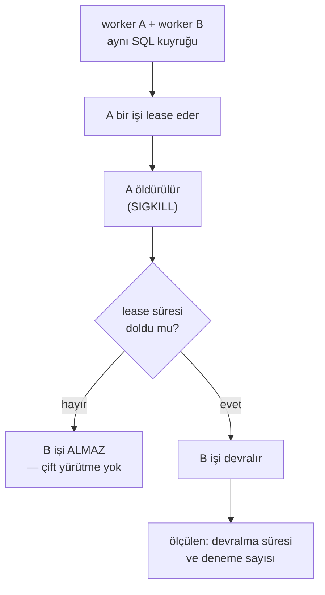

# Faz 157 — Sınırlı Yük ve İki Process Arıza Kanıtı

> **Durum:** ✅ Tamamlandı (2026-09-08)
> **Kaynak:** [ADAYLAR.md](../../ADAYLAR.md) · **F-217**
> **Önkoşul:** Yok. [Faz 116](116-PERFORMANS-TAHSIS-KAPISI.md) tahsis kapısını ve bench projesini kurdu; kapalıdır
> **Paketler:** Yok — bu faz **sevk edilen hiçbir pakete dokunmaz**. Yalnız `bench/` ve `tests/`
> **Yeni paket:** Yok · **Migration:** Yok
> **Public API:** Büyümüyor
> **Tüketici yüzeyi:** `docs-site/src/content/docs/guides/production.md` (arıza davranışı ve dağıtım örnekleri) · sevk edilen: Yok
> **Manuel test alanı:** [`docs/manuel-test/21-DAYANIKLILIK-VE-IPTAL.md`](../../manuel-test/21-DAYANIKLILIK-VE-IPTAL.md)

---

## Bu Faza Başlarken

> `faz-baslangic` skill'ini uygula. Aşağıdaki liste o skill'in 2. adımıdır —
> **tamamını değil, yalnız işaret edilen bölümleri oku.**

1. Bu doküman
2. Kararlar — dosyanın tamamını **okuma**, yalnız bu kalemleri grep'le:
   ```bash
   grep -n "K-354" docs/KARARLAR.md
   ```
   **K-354** (şema hazır olmadan SQL denemesi yapılmaz — arıza senaryolarında
   başlatma sırası bu kurala takılır)
3. [Faz 116](116-PERFORMANS-TAHSIS-KAPISI.md) — yalnız devir notu:
   ```bash
   awk '/## Sonraki Faza Devir Notu/,0' docs/arsiv/fazlar/116-PERFORMANS-TAHSIS-KAPISI.md
   ```
   Bench projesinin sözleşmesini ve **neden yalnız tahsisin kapı olduğunu**
   oradan devralıyorsun. Bu faz o kararı değiştirmez, üstüne ekler.
4. Alan hafızası (bu faz iki alana dokunuyor):
   [`hafiza/test-kosum-tuzaklari.md`](../../hafiza/test-kosum-tuzaklari.md) (kırılgan koşum ve yalıtım) ·
   [`hafiza/cekirdek-calistirma.md`](../../hafiza/cekirdek-calistirma.md) (lease, reconciliation, iptal)
5. Emsal kod — **yeniden yazma, oku**:
   `tests/AgentPrism.Package.Tests/Infrastructure/ProcessRunner.cs` (ayrı process başlatma)

---

## Amaç

Bugün ölçtüğümüz şey **tahsis**tir, işletim değil. "İki process çalışırken biri
ölürse ne olur" sorusunun koşulan bir cevabı yoktur. Bu faz o cevabı üretir —
ve bunu **çok node desteği vaat etmeden** yapar: amaç mevcut lease ve
reconciliation davranışının ne yaptığını kanıtlamaktır, yeni bir garanti
kurmak değil.

- **F-217** — mevcut bench üstüne sınırlı SQL yükü, iki process arıza senaryosu
  ve ayrı arıza manifestleri.

**Kapsam dışı:** Sıfırdan yük harness'i. Yeni kuyruk backend'i. SLO sayısı
vaat etmek. Tüm OS/veritabanı/sağlayıcı kombinasyonunu kapsamak.

### 🚨 Bu faz bir ürün sözü vermez

Kullanıcı kararı (2026-09-07): **çok node hedefi belirsizdir, tek process
varsayılır.** İki process senaryosu bu yüzden bir *destek beyanı* değil, bir
*ölçüm*dür. Çıktı "AgentPrism çok node destekler" cümlesini **kurmaz**;
"bir process ölünce lease şu sürede düşer ve iş şu şekilde devralınır" der.
SQLite'ın tek process tavsiyesi **korunur**.

### Bugün ne çalışmıyor — doğrulanmış kanıt

| Kanıt | Gözlem |
|---|---|
| `ls bench/AgentPrism.Benchmarks/*.cs` | Üç benchmark: `CompiledAgentCache` · `RunEventWriter` · `RunStoreQuery`. Yük senaryosu **yok** |
| [`RunEventWriterBenchmarks.cs:21`](../../../bench/AgentPrism.Benchmarks/RunEventWriterBenchmarks.cs#L21) | `new NoOpRunStore()` — ölçüm gerçek SQL'e **hiç dokunmuyor** |
| [`NoOpRunStore.cs:5`](../../../bench/AgentPrism.Benchmarks/NoOpRunStore.cs#L5) | Kendi dokümanı bunu açıkça söylüyor: "yazma maliyetinden ayırmak için" |
| [`Program.cs:19`](../../../bench/AgentPrism.Benchmarks/Program.cs#L19) | `scripts/kapi.py performans` yalnız `BytesAllocatedPerOperation` okuyor — kapı **tahsistir**, süre değil |
| `grep -rl "Kill\|Process.Start" tests/` | Yalnız `Package.Tests` (şablon koşumu). Ürün yolunda process öldüren test **yok** |
| `tests/AgentPrism.Package.Tests/Infrastructure/ProcessRunner.cs:27` | Ayrı process başlatma altyapısı **var** — yeniden yazılmaz, yeniden kullanılır |

> Kanıtlar 2026-09-07 tarihinde doğrulandı.

---

## 157.1 — Sınırlı SQL yükü

Mevcut bench `NoOpRunStore` ile tahsisi izole ediyor; bu doğru bir karardır ve
değişmez. Bu faz **ikinci** bir ölçüm ekler: gerçek bir SQLite/PostgreSQL
deposuna karşı sınırlı yük.

🚨 **Süre bir kapı değildir.** Faz 116'nın kararı korunur: paylaşılan CI
makinesinde süre gürültülüdür. Yük senaryosu bir **rapor** üretir, kırmızı/yeşil
değil. Kapıya dönüşmesi ayrı bir karardır ve bu fazda alınmaz.

Her koşum ortamını yazar: CPU · RAM · veritabanı sürümü · payload boyutu ·
eşzamanlılık · bağımlılık commit kimliği. 🚨 Dış model gecikmesi kontrol
düzlemi overhead'inden **ayrı** ölçülür; karıştırılırsa sayı hiçbir şey anlatmaz.

## 157.2 — İki process arıza senaryosu



Ölçülen üç şey: (1) lease düşene kadar geçen süre, (2) işin devralınıp
devralınmadığı, (3) **çift yürütmenin olmadığı**. Üçüncüsü en önemlisidir ve
`MaxAttempts = 1` varsayılanının anlamıdır.

`ProcessRunner` yeniden kullanılır. Yeni bir process altyapısı yazılmaz.

## 157.3 — Ayrı arıza manifestleri

Her arıza kendi manifestini alır; tek bir "chaos" testi yazılmaz. Manifest,
beklenen davranışın **yazılı** hâlidir — test onu doğrular, tanımlamaz.

| Arıza | Beklenen davranışın yazılacağı yer |
|---|---|
| Veritabanı erişilemez | Run ne olur, kuyruk ne olur, kayıt ne olur |
| Yavaş sink | Kayıt gecikmesi işlevi bozmaz (mevcut kural) |
| Sağlayıcı zaman aşımı | Fallback ve hata sınıflandırması |
| Retention hacmi | Büyük silmede kilit davranışı |
| Streaming fan-out | Çok abonede SSE davranışı |
| Rolling upgrade | Eski ve yeni process aynı anda ayakta |

🚨 **Rolling upgrade manifesti [Faz 156](156-DURUM-ON-KONTROLU-VE-UPGRADE-PENCERESI.md)
ile çakışır.** İkisi aynı soruyu iki ucundan sorar: 156 "yükseltmeden önce
veri okunabilir mi", 157 "yükseltme sırasında iki sürüm aynı anda ne yapar".
Sıra bağlayıcı değildir; ama 157 sonra koşarsa 156'nın penceresini girdi
olarak kullanabilir.

## 157.4 — Dağıtım örneklerinin bağlanması

`production.md`'deki API-only ve worker-only anlatısı bugün metindir. Bu faz
onu koşulan senaryoya bağlar: worker'ı olmayan bir API process'i ve API'si
olmayan bir worker process'i gerçekten ayağa kalkar ve beklenen davranışı
gösterir.

---

## Planlanan Public API

Büyümüyor. Bu faz sevk edilen hiçbir pakete dokunmaz.

### HTTP `endpoint`'leri

Yeni uç yok.

### Arayüz payı

Yok.

---

## Planlanan Dosya Listesi

```
bench/AgentPrism.Benchmarks/
└── SqlRunStoreLoadBenchmarks.cs        (yeni — gerçek depoya karşı sınırlı yük)

tests/AgentPrism.Sqlite.IntegrationTests/
├── TwoProcessLeaseTakeoverTests.cs     (yeni — kill ve devralma)
└── FailureManifests/
    ├── DatabaseUnavailableTests.cs
    ├── SlowSinkTests.cs
    └── RetentionVolumeTests.cs

tests/Shared/Infrastructure/
└── WorkerProcessHost.cs                (yeni — ProcessRunner üstüne worker başlatma)

docs-site/src/content/docs/guides/
└── production.md                       (değişir — arıza davranışı ve dağıtım)
```

> 🚨 `ProcessRunner` **taşınmaz veya kopyalanmaz**. `WorkerProcessHost` onu
> kullanır; ikinci bir kopya bu repo'nun beş kez ödediği senkronizasyon
> kopyası sınıfıdır.

---

## Hata Modları ve Testler

> Bu fazın kendisi test yazar. Tablo, **testlerin kendi** hata modlarıdır —
> yani yanlış yazılmış bir arıza testinin nasıl yanlış güven üreteceği.

| Ne bozulabilir | Seviye | Test sınıfı |
|---|---|---|
| Process öldürülür ama iş **iki kez** yürütülür | Fonksiyonel (process sınırı) | `TwoProcessLeaseTakeoverTests` |
| Lease süresi dolmadan ikinci worker işi alır | Fonksiyonel | `TwoProcessLeaseTakeoverTests` |
| Test kırılgan olur; CI'da rastgele düşer | Koşum disiplini | zaman aşımları mutlak süre değil **koşul** bekler |
| Öldürülen process artık dosya/port bırakır, sonraki test düşer | Koşum disiplini | `WorkerProcessHost` dispose'da temizler |
| Veritabanı erişilemezken run sessizce başarılı görünür | Fonksiyonel | `DatabaseUnavailableTests` |
| Yük ölçümü dış model gecikmesini kontrol düzlemi sanır | Ölçüm tasarımı | benchmark sahte sağlayıcı kullanır |
| Rolling upgrade senaryosu iki sürümü aynı şema üstünde koşturur ve veriyi bozar | Fonksiyonel | `FailureManifests` — senaryo salt okunur doğrulama ile biter |

Beş soru: **iptal** — öldürülen process'in yarım işi · **eşzamanlılık** — iki
worker aynı lease · **boş/aşırı girdi** — boş kuyruk ve çok büyük payload ·
**başka kiracı** — devralma kiracı sınırını geçmemeli · **alt sistem hatası** —
veritabanı erişilemez.

---

## Manuel Kabul Case'leri

| # | Ön koşul | Adımlar | Beklenen sonuç |
|---|---|---|---|
| 1 | İki worker, paylaşılan SQL kuyruğu, uzun süren bir iş | A'yı `SIGKILL` ile öldür | Lease süresi dolana kadar B işi **almaz**; sonra devralır; iş **bir kez** yürütülür |
| 2 | Aynı kurulum | Lease süresi dolmadan ölç | B'nin işi almadığı gözlenir |
| 3 | Veritabanı durdurulmuş | Bir run başlat | Run tanımlı hata verir; sessizce başarılı **görünmez** |
| 4 | API-only process (`RunWorker=false`) | Bir queued run gönder | Run `Queued` kalır; kuyruk ilerlemez — bu **beklenen** davranıştır |
| 5 | Worker-only process | Aynı kuyruk | İş tüketilir |
| 6 | 👤 insan gerekir | Yük raporunu oku | Ortam bilgisi (CPU/RAM/DB/eşzamanlılık/commit) raporda yazılı |

---

## Açık Sorular

| # | Soru | Seçenekler | Öneri |
|---|---|---|---|
| 1 | İki process testi hangi sağlayıcıda koşar? | A: Yalnız SQLite (ucuz, ama tek process tavsiyeli) · B: PostgreSQL (Docker, gerçek) | **B** — SQLite'ın tek process tavsiyesi bu senaryoyu anlamsız kılar; lease yarışı gerçek bir sunucuda ölçülmelidir |
| 2 | Yük ölçümü CI'da koşar mı? | A: Her PR · B: Yalnız elle/nightly | **B** — Faz 116'nın gürültü dersi geçerli; yük raporu kapı değildir, her PR'da koşmak maliyetlidir |
| 3 | Rolling upgrade manifesti bu fazda mı? | A: Evet · B: Faz 156 kapandıktan sonra | Faz sırasına bağlı; 156 önce koşarsa **A**, sonra koşarsa manifest yalnız iskelet olarak yazılır |
| 4 | Yük senaryosu bench projesinde mi, test projesinde mi? | A: `bench/` (BenchmarkDotNet) · B: `tests/` (düz koşum) | **B** — BenchmarkDotNet tahsis için doğru araçtır; yük senaryosu uzun süren ve dış kaynak isteyen bir koşumdur ve bench'in istatistik modeline uymaz |

---

## Bitiş Ölçütleri (DoD)

- [x] İki process senaryosunda öldürülen worker'ın işi devralınır ve **eşzamanlı çift yürütme olmaz**; çıktı belgeye yazıldı (§ Plandan Sapmalar — "bir kez yürütülür" ifadesi ölçülen sözleşmeye göre düzeltildi: `IJobHandler` **at-least-once**'tır)
- [x] Lease süresi dolmadan devralma **olmadığı** ölçüldü (`A_dead_workers_job_is_not_taken_over_before_its_lease_expires`; sahte kusur enjekte edilerek testin KIRMIZI olabildiği doğrulandı)
- [x] Altı arıza manifestinin her biri için beklenen davranış **yazıldı** ve testi koşuldu (veritabanı · yavaş sink · sağlayıcı zaman aşımı · retention hacmi · streaming fan-out · rolling upgrade)
- [x] Yük raporu ortam bilgisiyle (CPU/RAM/DB/payload/eşzamanlılık/commit) üretildi — `artifacts/load/bounded-sql-load-*.md`
- [x] Dış model gecikmesi kontrol düzlemi overhead'inden ayrı raporlandı (iki ayrı `Stopwatch`; rapor ikisini toplamamayı açıkça yazar)
- [x] `ProcessRunner` kopyalanmadı; `tests/Shared/Infrastructure/`'a taşındı ve iki projeye LINK'lendi, `WorkerProcessHost` onu kullanıyor
- [x] Faz 116'nın tahsis kapısı **değişmedi**; süre kapıya dönmedi (K-738)
- [x] Dört doğrulama kapısı sıfır uyarı verir
- [x] `samples/AgentPrism.Api` ile gerçek `run` yapıldı — akışsız `run` `Completed` (`echo`/`echo-1`, 13 token), akışlı SSE `run`/`update` çerçeveleri üretti, `jobs`/`health`/`workflows` uçları `200`; host log'unda hata yok
- [x] `secret` taraması boş döndü (`kapi.py tarama`)
- [x] Manuel kabul case'leri eklendi: **MT-RES-085…090**; altısının da otomatik karşılığı koşuluyor
- [x] `faz-denetim` koşuldu; 🔴 bulgu kalmadı
- [x] `docs-site` güncellendi (`guides/production.md`, `guides/model-providers.md`, `concepts/runs.md`, `concepts/workflows.md`, `http-api.md`); `npm run check` dört kapısı da temiz
- [x] 🚨 Hiçbir yerde "çok node destekleniyor" cümlesi kurulmadı; SQLite tek process tavsiyesi korundu (K-739)

### Doğrulama komutları

```bash
# İki process devralma senaryosu
dotnet test tests/AgentPrism.PostgreSql.IntegrationTests -c Release \
  -- --filter-class "*TwoProcessLeaseTakeoverTests*"

# Tahsis kapısı hâlâ yerinde
python3 scripts/kapi.py performans
```

---

## Riskler

| Risk | Önlem |
|------|-------|
| Arıza testleri kırılgan olur ve CI'ı gürültüye boğar | Zaman aşımları mutlak süre değil **koşul** bekler; yük koşumu CI kapısı değildir (Açık Soru 2) |
| Sentetik TPS sayısı pazarlama gibi okunur | Rapor ortamı ve sınırlarını yazar; SLO **vaat edilmez** |
| İki process senaryosu "çok node desteği" diye anlaşılır | DoD bunu açıkça yasaklar; `production.md` metni ölçüm ile vaat arasındaki farkı kurar |
| Öldürülen process CI ajanında artık bırakır | `WorkerProcessHost` dispose'da temizler; testi yalıtım kuralına bağla |
| Faz 116'nın kararı sessizce gevşer (süre kapıya döner) | DoD tahsis kapısının değişmediğini şart koşar |

---

<!-- ============================================================
     AŞAĞISI KAPANIŞTA DOLDURULUR — `faz-tamamlama` skill'i.
     Plan anında boş kalır. Başlıkları SİLME.
     ============================================================ -->

## Plandan Sapmalar

| Plan ne diyordu | Ne yapıldı | Neden |
|---|---|---|
| Dosya listesi: yük senaryosu `bench/AgentPrism.Benchmarks/SqlRunStoreLoadBenchmarks.cs` | `tests/AgentPrism.PostgreSql.IntegrationTests/Load/BoundedSqlLoadTests.cs` | Planın **kendi** Açık Soru 4'ü B'yi öneriyordu (BenchmarkDotNet'in istatistik modeli uzun süren, dış kaynak isteyen bir koşuma uymaz). Dosya listesi bayattı; öneri izlendi. |
| Dosya listesi: arıza testleri `tests/AgentPrism.Sqlite.IntegrationTests/` | `tests/AgentPrism.PostgreSql.IntegrationTests/` | Aynı çelişki: Açık Soru 1 ve DoD'nin doğrulama komutu PostgreSQL diyordu, dosya listesi SQLite. SQLite'ın tek process tavsiyesi senaryoyu anlamsız kılar. |
| "üçüncüsü … `MaxAttempts = 1` varsayılanının anlamıdır" | Cümle kullanılmadı | Ölçüldü: varsayılan `MaxAttempts` **3**'tür (`AgentPrismSchedulingOptions`). Ölçülen iddia yeniden yazıldı: çift yürütme **eşzamanlı** olamaz; çökmeden sonra yeniden yürütme sözleşmenin kendisidir (`IJobHandler` "at-least-once" der). |
| "Yavaş sink: kayıt gecikmesi işlevi bozmaz (mevcut kural)" | Kural **daraltıldı**: bozmaz ama YAVAŞLATIR | `RunEventWriter.DispatchToSinksAsync` sıcak yolda `await` edilir. Fırlatan `sink` izole edilir; GECİKME edilmez ve olay başına ödenir. `SlowSinkTests` bunu alt sınır olarak ölçer, `production.md` ve `hafiza/cekirdek-calistirma.md` yazar. |
| Yeni proje yok varsayımı (yalnız `bench/` ve `tests/`) | `tests/AgentPrism.WorkerHarness` eklendi (👤 kullanıcı kararı) | `ProcessRunner` ölçüldü: tamamlanmayı bekleyen `static` bir yardımcı, öldürülebilir uzun ömürlü bir host başlatamaz. Öldürülecek gerçek bir AgentPrism host'u gerekiyordu; `samples/AgentPrism.Api` (956 satır, HTTP portu, frontend varlıkları, kontrollü uzun handler yok) bu iş için ağırdı. Sevk edilen paketlere dokunulmadı. |
| `WorkerProcessHost` `ProcessRunner`'ı kullanır | Kullanıyor — ama `ProcessRunner` `tests/Shared/Infrastructure/`'a **taşındı** ve iki projeye LINK'lendi | Kopyalanmadı (DoD'nin şartı). `ProcessRunner`'a `StartAsync` eklendi; MSBuild `nodeReuse` deadlock düzeltmesi tek bir `CreateStartInfo` gövdesinde kaldı. |
| Faz kapsamı yalnız ölçüm | **Sevk edilen kodda bir kusur bulundu ve düzeltildi** (K-737) | Aşağıda. |

### 🚨 Kapsam dışı ama sevk edilen: sağlayıcı zaman aşımı kusuru (K-737)

`ProviderTimeoutTests` manifesti yazılırken ortaya çıktı ve `kusur-giderme`
protokolüyle kapatıldı.

**Repro:** `IChatClient` `TaskCanceledException` (inner `TimeoutException`)
fırlatır — `HttpClient` kendi istek zaman aşımını tam olarak böyle bildirir ve
her resmî sağlayıcı SDK'si `HttpClient` üzerindedir. Hiçbir token iptal
edilmemiştir.

**Gözlenen (düzeltmeden önce):** `run` `Canceled` + `error: null` yazılıyor,
uç **`200` + boş gövde** dönüyor, fallback zinciri sonraki halkayı
**denemiyordu**. Yani kesinti hiçbir arıza panosunda görünmüyor ve çağıran onu
başarı sanıyordu.

**Kök sebep:** iptal kararı istisnanın TİPİNDEN okunuyordu. Düzeltilen yerler:

| Yer | Ne değişti |
|---|---|
| `RunRecordingAgent` (akışlı + akışsız) | `when (cancellationSource.IsCancellationRequested)` |
| `FallbackChatClient` (akışlı + akışsız) | `when (cancellationToken.IsCancellationRequested)`; `IsCancellation` artık zaman aşımını iptal SAYMAZ; yeni `FallbackSkipReason.Timeout` (`"timeout"`) |
| `AgentEndpoints`, `WorkflowEndpoints`, `OpenAIChatCompletionsEndpoints`, `OpenAIResponsesEndpoints` | `when (httpContext.RequestAborted.IsCancellationRequested)` |
| `WorkflowRunner` (başlatma + adım) | `when (linked.IsCancellationRequested)` |
| `DefaultRunErrorClassifier` | zaman aşımı kontrolü `CanceledTypePattern`'den ÖNCE |

**Sınıf taraması:** `grep -rn "catch (OperationCanceledException)$" src/` → 32
yer. Yukarıdaki 11'i düzeltildi (kullanıcıya dönük yanlış-başarı üretenler).
Kalanlar arka plan döngülerinin "host kapanıyor" dalları (`JobWorkerBackgroundService`,
`RunHeartbeatWriter`, `RunReconciliationService`, `CanaryEvaluationService`,
`ApprovalExpirationService`, `McpDiscoveryService`), CLI'nin Ctrl+C dalları ve
`CompositeAgentCatalog`/`AgentDecoratorPipeline` gibi katalog yollarıdır;
hiçbiri bir sağlayıcı çağrısını sarmalamaz ve hiçbiri bir yanıt gövdesi
üretmez. Devir notunda açık kalem olarak duruyor.

**Kapı:** `RunCancellationStatusTests.An_uncancelled_OperationCanceledException_writes_Failed_not_Canceled`
(akışlı + akışsız) ve `FailureManifests.ProviderTimeoutTests`. Mevcut
`External_cancellation_writes_Canceled_*` testleri gerçek iptalin hâlâ
`Canceled` yazdığını kanıtlar — düzeltme iptal davranışını bozmadı.

**Bir testin beklentisi DEĞİŞTİ:** `StructuredResponseEndpointTests` içindeki
`Cancellation_during_validation_closes_the_run_as_canceled_not_as_a_validation_error`
eski davranışı kodluyordu ve kendi yorumu kusuru tarif ediyordu ("uç HİÇBİR
ŞEY yazmaz, yanıt ASP.NET Core'un varsayılan 200'ünde kalır"). Yeniden
adlandırıldı: `A_validator_that_throws_a_cancellation_nobody_requested_fails_the_run`,
beklenen sonuç `502` + `Failed`.

## Bu Fazda Verilen Kararlar

| # | Karar |
|---|---|
| K-737 | Bir `OperationCanceledException` ancak İLGİLİ TOKEN gerçekten iptal edildiyse iptaldir; aksi hâlde ARIZADIR |
| K-738 | Yük ve arıza ölçümleri RAPORDUR, kapı değildir; süre hiçbir eşiğe bağlanmaz |
| K-739 | İki process senaryosu bir ÖLÇÜMDÜR, çok node DESTEK BEYANI değildir 👤 |

## Gerçekleşen Public API

**Büyümedi.** Sevk edilen hiçbir tipin imzası değişmedi; `FallbackSkipReason`
ve `FallbackRetryClassifier` `internal`'dır. `PublicAPI.Unshipped.txt`
dosyalarında değişiklik yok.

**Davranış değişti** (K-737) — imza değil: sağlayıcı zaman aşımı artık
`Canceled` yerine `Failed`/`Timeout` olarak kaydedilir ve HTTP `200` yerine
`502` döner. Tüketiciye dönük not `production.md`'ye yazıldı.

## Dosya Listesi (gerçekleşen)

```
src/AgentPrism.Core/Models/FallbackChatClient.cs            (değişti — K-737)
src/AgentPrism.Core/Recording/RunRecordingAgent.cs          (değişti — K-737)
src/AgentPrism.Core/Runs/DefaultRunErrorClassifier.cs       (değişti — K-737)
src/AgentPrism.Workflows/Internal/WorkflowRunner.cs         (değişti — K-737)
src/AgentPrism.AspNetCore/Endpoints/AgentEndpoints.cs       (değişti — K-737)
src/AgentPrism.AspNetCore/Endpoints/WorkflowEndpoints.cs    (değişti — K-737)
src/AgentPrism.AspNetCore/OpenAICompat/OpenAIChatCompletionsEndpoints.cs (değişti)
src/AgentPrism.AspNetCore/OpenAICompat/OpenAIResponsesEndpoints.cs       (değişti)

tests/AgentPrism.WorkerHarness/                             (yeni proje)
├── AgentPrism.WorkerHarness.csproj
├── Program.cs                     (worker / api kipleri)
├── WorkerHarnessSettings.cs
└── LongRunningJobHandler.cs

tests/Shared/Infrastructure/                                (yeni dizin, LINK'lenir)
├── ProcessRunner.cs               (Package.Tests'ten TAŞINDI; StartAsync eklendi)
├── ProcessResult.cs               (taşındı)
├── ManagedProcess.cs              (yeni — SIGKILL, hazırlık satırı, temizlik)
├── RepoRoot.cs                    (yeni — RepoPaths'ten çıkarıldı)
├── WorkerProcessHost.cs           (yeni)
├── WorkerHarnessContract.cs       (yeni — iki process'in paylaştığı adlar)
└── HarnessExecutionLog.cs         (yeni — yazıcı + okuyucu, tek dosya)

tests/AgentPrism.PostgreSql.IntegrationTests/
├── TwoProcessLeaseTakeoverTests.cs                         (yeni)
├── FailureManifests/DatabaseUnavailableTests.cs            (yeni)
├── FailureManifests/SlowSinkTests.cs                       (yeni)
├── FailureManifests/RetentionVolumeTests.cs                (yeni)
├── FailureManifests/RollingUpgradeTests.cs                 (yeni)
├── Load/BoundedSqlLoadTests.cs                             (yeni — opt-in)
└── Infrastructure/PostgresTestContext.cs                   (değişti — connection string overload'ı)

tests/AgentPrism.AspNetCore.FunctionalTests/
├── FailureManifests/ProviderTimeoutTests.cs                (yeni)
├── FailureManifests/StreamingFanOutTests.cs                (yeni)
└── StructuredResponseEndpointTests.cs                      (değişti — beklenti düzeltildi)

tests/AgentPrism.Core.UnitTests/Recording/RunCancellationStatusTests.cs (değişti — K-737 regresyonu)
tests/AgentPrism.Package.Tests/Infrastructure/RepoPaths.cs  (değişti — RepoRoot'a devretti)
tests/Directory.Build.props                                 (değişti — IsTestHarnessProject muafiyeti)
Directory.Packages.props                                    (değişti — Microsoft.Extensions.Hosting)
AgentPrism.slnx                                             (değişti — harness projesi)

docs-site/src/content/docs/guides/production.md             (değişti — "What a failure actually does")
docs/manuel-test/21-DAYANIKLILIK-VE-IPTAL.md                (MT-RES-085…090)
```

## Denetim Bulguları

`faz-denetim` taze bağlamlı bir denetçiyle koşuldu (2026-09-08, taban
`a3ec7527`). **🔴 bulgu yok.** Denetçi K-737 düzeltmesinde aradığı dört
gerilemenin hiçbirini bulamadı: gerçek iptal hâlâ `Canceled` yazıyor,
`when` filtreleri doğru token'ı okuyor, `WorkflowEndpoints`'in dar `catch`'ine
`TaskCanceledException` ulaşamıyor (`WorkflowRunner` onu `PumpedEvent`'e
çeviriyor) ve `DefaultProviderRetryClassifier` bozulmadı.

Sekiz 🟡 bulgunun **tamamı kapatıldı**:

| # | Bulgu | Sonuç |
|---|---|---|
| 1 | K-737'nin en riskli satırı — sınıflandırıcıdaki SIRA — hiçbir testle sabitlenmemişti; eski sıraya dönülse her şey yeşil kalırdı | **Düzeltildi.** `DefaultRunErrorClassifierTests`'e aynı tipin mesajla ayrışan iki satırı, `FallbackRetryRegressionTests.DecisionTable`'a iki zaman aşımı satırı eklendi. Sıra elle geri alınarak testin KIRMIZI olduğu doğrulandı (1 düşen), sonra geri konup yeşile döndü |
| 2 | Sınıf taraması `when`/`is not` biçimini göremedi; `WorkflowNodeRetry` bir sağlayıcı çağrısı sarmalıyor ve `TransientClasses` `Timeout` içerdiği hâlde zaman aşımını hiç denemiyordu | **Düzeltildi.** `WorkflowNodeRetry.cs` filtresi `!cancellationToken.IsCancellationRequested`'a çevrildi. Devir notundaki "kalanların hiçbiri sağlayıcı çağrısı sarmalamaz" cümlesi de düzeltildi |
| 3 | "İş dokunulmadan kalır" iddiası ölçülmüyordu; worker kesintiden önce işi lease etmiş olabilir | **Düzeltildi.** Test adı ve iddiası daraltıldı (`..._the_job_is_not_lost`): `Status != Completed/Failed`, `DoneItems == 0`, `FailedItems == 0`. `production.md` de "jobs are untouched" yerine "in-flight attempt is lost, the job is not" diyor |
| 4 | Retention kilit manifesti sevk edilen `DeleteBatchAsync` ifadesini değil elle yazılmış bir `DELETE`'i koşuyor | **Gerekçelendi ve daraltıldı.** Ölçülen şey bir delete AÇIK/COMMIT EDİLMEMİŞken ne olduğudur; `DeleteBatchAsync` kendi bağlantısını sahiplenip dönmeden commit ettiği için public API üzerinden bu tutulamaz. Predicate store'unkiyle aynı; sınır hem test dokümanına hem `production.md`'ye ("verified against PostgreSQL with the delete deliberately left uncommitted") yazıldı. İkinci test zaten sevk edilen metodu koşuyor |
| 5 | 6 sn'lik lease penceresi worker B'nin tam process açılışını emmek zorundaydı — yüklü ajanda kırılgan | **Düzeltildi.** İki worker da `job` ENQUEUE EDİLMEDEN önce başlatılıyor; pencereye artık hiçbir process açılışı girmiyor. Yarışı kim kazanırsa o öldürülüyor (`FirstStarter()`), ikisi de aynı `WorkDuration`'ı alıyor — sonucu değiştiren bir kurulum ölçüm değil yazı turadır |
| 6 | Fan-out manifesti yalnız BİTMİŞ bir `run`'ı okuyor; canlı kuyruk hiç koşmuyor | **Kapsam yazıldı.** Sınıf dokümanı ve `production.md` artık "recorded stream of a finished run" diyor ve canlı kuyruğun `StreamingTests`'te olduğunu söylüyor |
| 7 | `production.md`'nin "measured, not inferred" başlığı rolling-upgrade'i de kapsıyordu, oysa orada iki gerçek sürüm ölçülmedi | **Düzeltildi.** O alt bölüme kendi sınırı yazıldı: tek build iki tarafı temsil ediyor, iki yayınlanmış sürüm yan yana ölçülmedi |
| 8 | MT-RES-089 `K-727` (Faz 155'in evaluator kararı) diyordu | **Düzeltildi** → `K-737` |

İki 🟢 bulgu (`ChildAgentInvoker`'ın zaman aşımını kendi deadline'ı sanması ·
yük raporundaki RAM/CPU alanlarının GC/container değerleri olması)
[`ADAYLAR.md`](../../ADAYLAR.md)'ye yazıldı.

🔴 olmadığı için kapılar bir kez daha koşuldu; 🟡 düzeltmeleri sevk edilen koda
(`WorkflowNodeRetry`) dokunduğu için tam kapanış kapısı tekrarlandı.

## Sonraki Faza Devir Notu

- **🚨 `catch (OperationCanceledException)` sınıfı KAPANMADI, daraltıldı.** 32
  yerin 11'i düzeltildi. Kalan 21'i bugün zararsızdır (arka plan döngüsü,
  CLI Ctrl+C, katalog) ama kural artık yazılıdır: **iptal kararı token'dan
  okunur**. Bu yollardan birine bir sağlayıcı/ağ çağrısı eklenirse aynı kusur
  yeniden doğar. Üçüncü tekrar olursa yazı yetmez — bir analyzer kuralı
  (`catch (OperationCanceledException)` filtre yoksa uyar) gerekir.
- **🚨 Tarama grep'i `catch (OperationCanceledException)$` idi ve `when` /
  `is not` biçimlerini GÖREMEDİ.** Denetim bu yüzden ikinci bir vaka buldu
  (`WorkflowNodeRetry`, düzeltildi). Bir sonraki tarama üç deseni birden
  arasın: `catch (OperationCanceledException)`, `is not OperationCanceledException`,
  `IsCancellation(`. `ChildAgentInvoker.cs:208,329` bilinçli olarak
  bırakıldı — orada zaman aşımı zaten bir zaman aşımı mesajına dönüşüyor,
  sessiz başarı üretmiyor; `ADAYLAR.md`'de F kalemi olarak duruyor.
- **Yük raporu bir kapı DEĞİLDİR ve öyle olması ayrı bir karardır** (K-738).
  `AGENTPRISM_LOAD=1` ile koşar, `artifacts/load/` altına yazar. Bu makinede
  ölçülen ilk değerler: 8 eşzamanlı, 200 `run` × 20 olay, 256 karakter payload
  → kontrol düzlemi `run` başına ~17,7 ms / olay başına ~0,88 ms
  (macOS arm64, PostgreSQL 18.4 container, commit `a3ec7527`).
- **Rolling upgrade manifesti "eski sürüm" olarak DAHA AZ opsiyonel migration
  seti açan bir context kullanır** — ikinci bir AgentPrism ikilisi değil. İki
  gerçek sürümü yan yana koşturmak ölçülmedi; `production.md` bunu vaat etmez.
  Gerçek iki-ikili ölçümü isteyen bir faz `nuget-danismani` ile yayınlanmış iki
  paket sürümü üzerinden kurmalıdır.
- **`docs/hafiza/test-altyapisi.md` %0 boşlukta** (15932/16000). Bir sonraki
  faz oraya not eklerse önce böler; `test-kosum-tuzaklari.md` (%34 boş) ve
  `test-yalitimi.md` (%16 boş) kardeşleridir.
- **`tests/Shared/Infrastructure/` bir csproj DEĞİLDİR**, LINK'lenen kaynak
  dosyalardır. Yeni bir tüketici projesi `<Compile Include=... Link=.../>`
  satırlarını ve `<Using Include="AgentPrism.Tests.Common" />` girdisini
  kendi csproj'una ekler. İkinci bir kopya açma (K-411).
- **Arıza manifestleri kapıdadır, yük raporu değildir.** `TwoProcessFailureProof`
  koleksiyonu process başlatan sınıfları birbirine karşı seri hâle getirir;
  yeni bir process testi o koleksiyona girmelidir, yoksa dört host aynı makinede
  aynı lease saatini ölçer.
