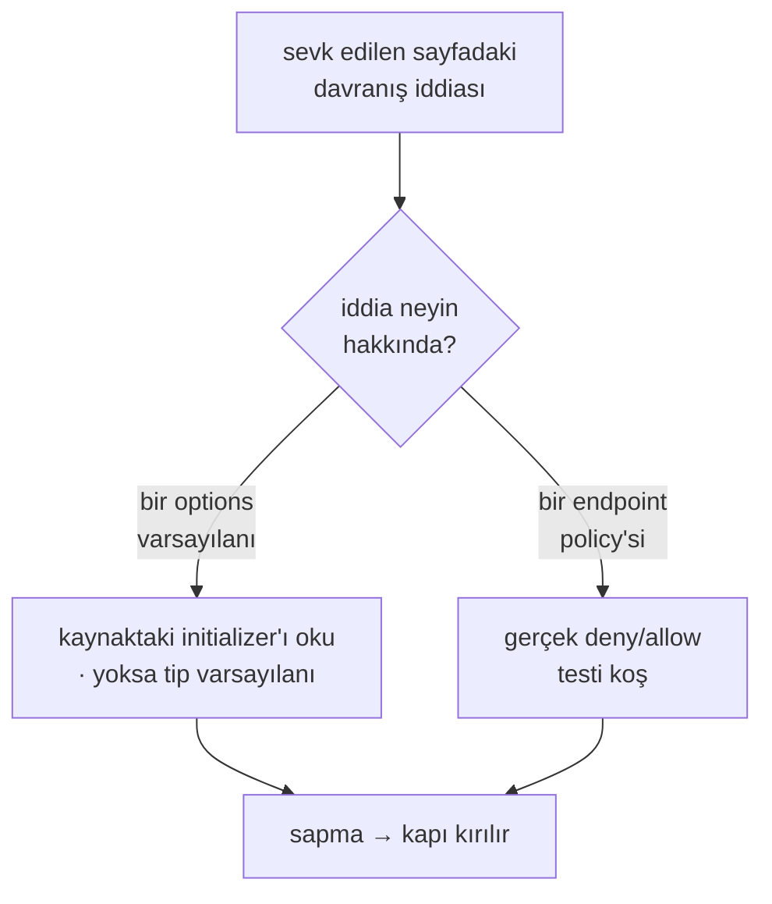

# Faz 158 — Davranış İddialarının Kapısı

> **Durum:** ✅ Tamamlandı (2026-09-08)
> **Kaynak:** [ADAYLAR.md](../../ADAYLAR.md) · **F-171** (kalan yarısı)
> **Önkoşul:** Yok. Sayı yarısı ve sürüm damgası yarısı **kapandı** — aşağıya bak
> **Paketler:** Yok — kapı `docs-site/scripts/` ve `scripts/` içinde yaşar
> **Yeni paket:** Yok · **Migration:** Yok
> **Public API:** Büyümüyor
> **Tüketici yüzeyi:** Doğrudan yok; kapı yanlış yazılmış tüketici sayfasını kırar
> **Manuel test alanı:** [`docs/manuel-test/32-DOKUMAN-KALITESI.md`](../../manuel-test/32-DOKUMAN-KALITESI.md)

---

## Bu Faza Başlarken

> `faz-baslangic` skill'ini uygula. **Tamamını değil, yalnız işaret edilen bölümleri oku.**

1. Bu doküman
2. Kararlar — dosyanın tamamını **okuma**:
   ```bash
   grep -n "K-483\|K-228\|K-232" docs/KARARLAR.md
   ```
   **K-483** (elle tekrarlanan ölçüm sessizce yanlışa döner) ·
   **K-228** (arayüz metni sözlükten; eksik anahtar derleme hatası) ·
   **K-232** (sunucu yanıtları çevrilmez)
3. Alan hafızası (bu faz iki alana dokunuyor):
   [`hafiza/dokumantasyon.md`](../../hafiza/dokumantasyon.md) — 🚨 **iki tuzak doğrudan bu fazındır**:
   kapı sapmayı yakalar ama sapmayı üreten protokol düzeltilmezse sınıf kapanmaz;
   ve yeni bir kapının ilk bulgusu bir kanıttır, emir değil ·
   [`hafiza/site-uretim-kapilari.md`](../../hafiza/site-uretim-kapilari.md) — kapı, sayfanın
   **iddia ettiği** şeyi ölçmelidir
4. Mevcut kapı gövdesi — yeniden yazma, üstüne ekle:
   `docs-site/scripts/check-content.mjs` (`countedClaims` taraması) ·
   `scripts/dokuman-bakim.py` (`bagimlilik_surum_damgasi`)

---

## Amaç

Sevk edilen metindeki **sayılabilir** iddialar artık kapı altındadır. **Davranış**
iddiaları değil. Bir sayı koddan yeniden hesaplanabilir; "varsayılan olarak
kapalıdır" cümlesi hesaplanamaz — yalnız yeniden ölçülebilir. Bu faz o ölçümü
otomatikleştirir.

- **F-171 (kalan yarısı)** — varsayılan ve policy iddialarını koddaki gerçek
  değerle karşılaştıran bir kapı.

### Bu adayın iki yarısı ZATEN kapandı — tekrar yapma

| Yarı | Durum |
|---|---|
| Sayılabilir iddialar (operasyon · tag · ekran) | ✅ `check-content.mjs` her elle yazılan sayfayı tarıyor; tarihli release/changelog muaf |
| Bağımlılık sürümü damgalı iddialar | ✅ `dokuman-bakim.py` `bagimlilik_surum_damgasi` — damga pinle karşılaştırılır, kayıtsız damga da kırar |
| **Varsayılan / policy iddiaları** | ❌ **bu fazın işi** |

### Bugün ne çalışmıyor — doğrulanmış kanıt

| Kanıt | Gözlem |
|---|---|
| Sitede `by default` / `defaults to` geçen satır | **147** — hiçbiri kapı altında değil |
| Bunlardan bir options tipi veya konfigürasyon anahtarı anan | **9** — mekanik olarak hedeflenebilir olan bu altküme |
| [`check-content.mjs:438`](../../../docs-site/scripts/check-content.mjs) | Bir seçeneğin **adının** sayfada geçtiğini doğruluyor; **varsayılan değerinin** doğru anlatıldığını değil |
| Bu turda elle düzeltilen | **4** — kiracılık varsayılanı · worker varsayılanı · OpenAI scope'u · approval devam tarifi. Dördü de tüketiciyi yanlış davranışa yönlendiriyordu ve dördünü de kapı değil insan buldu |

> Kanıtlar 2026-09-08 tarihinde doğrulandı.

---

## 158.1 — İki ayrı mekanizma, tek kapı değil

Davranış iddiası tek bir taramayla kapanmaz. İki ayrı kaynak, iki ayrı ölçüm:



**Neden ikisi de gerekli.** `AgentPrismTenancyOptions.Enabled`'ın varsayılanı
kaynaktan okunabilir (initializer yok ⇒ `false`). Ama "bu uç `RunsWrite` ister"
iddiası kaynaktan okunamaz — `RequireApiKeyScope` çağrısı bir metadata'dır ve
gerçek davranış filtre zincirine bağlıdır. Onu ancak bir istek kanıtlar.

## 158.2 — İşaretli iddia, her cümle değil

🚨 **Kapı her `by default` cümlesini denetlememelidir.** 147 satırın çoğu
mekanik olarak eşlenemez ("varsayılan olarak hiçbir şey yapmaz") ve zorlamak
yanlış pozitif üretir — bu da kapıyı susturulan bir kapıya çevirir.

Kapı yalnız **işaretlenmiş** iddiayı okur. İşaretin biçimi **Açık Soru 1**'dir;
en dar hâli sayfada makine-okunur bir ek bilgi taşımaktır (ör. bir HTML
yorumu veya frontmatter alanı) — böylece hangi cümlenin denetlendiği yazının
kendisinden okunur ve kapı sessizce kapsam dışı kalmaz.

## 158.3 — Kapsam: dokuz iddia, yüz kırk yedi değil

İlk turda hedef, bir options tipi veya konfigürasyon anahtarı anan **dokuz**
iddiadır. Ölçülen dağılım: `SessionOwnership` (2) · `Retention:Enabled` (2) ·
`AgentPrismSqliteOptions` · `AgentPrismSchedulingOptions` ·
`AgentPrismMcpServerOptions` · `AgentPrismEndpointOptions` · `Images` · `Egress`.

Kalan iddialar bu turda **editoryal** kalır. Kapı büyüdükçe kapsam genişler;
tersi değil.

---

## Planlanan Public API

Büyümüyor. Kapı bir geliştirme aparatıdır ve pakete girmez.

### Arayüz payı

Yok.

---

## Planlanan Dosya Listesi

```
docs-site/scripts/
└── check-content.mjs           (değişir — işaretli davranış iddiası taraması)

scripts/
├── dokuman-bakim.py            (değişir — endpoint policy tarafı, gerekiyorsa)
└── dokuman_bakim_test.py       (değişir)

tests/AgentPrism.AspNetCore.FunctionalTests/
└── DocumentedPolicyTests.cs    (yeni — sayfanın iddia ettiği scope gerçekten uygulanıyor mu)
```

---

## Hata Modları ve Testler

| Ne bozulabilir | Seviye | Test sınıfı |
|---|---|---|
| Kapı yanlış pozitif üretir; insanlar onu susturmayı öğrenir | Birim | `dokuman_bakim_test.py` — eşlenemeyen cümle **bulgu değildir** |
| Bir iddia işaretlenmediği için sessizce kapsam dışı kalır | Birim | işaretsiz iddia sayısı raporlanır; sıfıra inmesi gerekmez ama **görünür** olur |
| Sayfa doğru, kod değişti — kapı kodu değil sayfayı suçlar | Birim | bulgu metni iki değeri de yazar; hangisinin yanlış olduğunu **söylemez** |
| Endpoint policy iddiası metadata'dan okunur, gerçek davranış farklıdır | Fonksiyonel | `DocumentedPolicyTests` — gerçek deny/allow |
| Options varsayılanı `IConfiguration` ile ezilmiş; kaynak okuma yanıltır | Birim | kapı **kod varsayılanını** ölçer; sayfa da onu anlatmalıdır |
| Yeni bir davranış iddiası eklenir, işaretlenmez | Birim | işaretsiz sayım raporu |

Beş soru: **iptal** — yok (kapı saf okuma) · **eşzamanlılık** — yok ·
**boş/aşırı girdi** — işaretli iddia hiç yoksa kapı sessiz geçer ·
**başka kiracı** — yok · **alt sistem hatası** — kaynak dosya bulunamazsa kapı
kırılır, sessizce geçmez.

---

## Manuel Kabul Case'leri

| # | Ön koşul | Adımlar | Beklenen sonuç |
|---|---|---|---|
| 1 | Bir sayfa `Enabled` varsayılanını yanlış yazsın | `node docs-site/scripts/check-content.mjs` | Kapı kırmızı; bulgu iki değeri de yazar |
| 2 | Sayfa doğru yazsın | Aynı komut | Kapı yeşil |
| 3 | İşaretlenmemiş bir davranış iddiası eklensin | Aynı komut | Kapı yeşil kalır ama **işaretsiz sayım** raporda görünür |
| 4 | Bir uç `RequireApiKeyScope`'u değişsin, sayfa eski scope'u yazsın | `dotnet test … DocumentedPolicyTests` | Kırmızı |

---

## Açık Sorular

| # | Soru | Seçenekler | Öneri |
|---|---|---|---|
| 1 | İddia nasıl işaretlenir? | A: HTML yorumu (`<!-- claim: … -->`) · B: frontmatter alanı · C: prose deseni | **A** — sayfanın gövdesinde, cümlenin yanında durur; frontmatter iddiayı cümleden uzaklaştırır ve ikisi ayrı bayatlar |
| 2 | Options varsayılanı nasıl okunur? | A: kaynak metninden regex · B: reflection ile gerçek nesne | **B** — initializer'ı olmayan bir `bool`'un varsayılanı regex'e görünmez; reflection gerçek değeri verir. AOT sınırı yok, kapı pakete girmiyor |
| 3 | Endpoint policy tarafı bu fazda mı? | A: Evet · B: Yalnız options, policy sonraya | **A** — bu turda elle düzeltilen dört iddiadan **ikisi** policy tarafındaydı (OpenAI scope, approval); yalnız options kapatmak sınıfın yarısını açık bırakır |

---

## Bitiş Ölçütleri (DoD)

- [x] İşaretli iddiaların her biri koddaki gerçek değerle karşılaştırılıyor — plan dokuz diyordu, gerçekleşen **on** oldu (bkz. Plandan Sapmalar)
- [x] Kasten bozulan bir varsayılan cümlesinde kapı **kırmızı**; doğru cümlede yeşil — `AgentPrismSchedulingOptions.RunWorker`'ın initializer'ı kaldırılıp elle doğrulandı (bkz. Denetim Bulguları, kanıt komutları aşağıda)
- [x] İşaretsiz davranış iddiası sayısı raporda **görünür** (sıfır olması gerekmez) — `node docs-site/scripts/check-content.mjs` çıktısı: `Behavior claims: 11 marked and verified by DocumentedPolicyTests.cs; 146 sentence(s) across manual pages match "by default" or "defaults to"`
- [x] Bir uç scope'u ile sayfanın yazdığı scope ayrıştığında fonksiyonel test kırmızı — `OpenAIChatCompletionsEndpoints`'in `RequireApiKeyScope`'u `RunsRead`'e çevrilip elle doğrulandı: `Every_marked_endpoint_policy_claim_is_actually_enforced` kırmızı, mesaj her iki değeri de yazdı
- [x] Kapı yanlış pozitif üretmiyor: mevcut 147 satırın hiçbiri işaretlenmeden kırmızı yapmıyor — `npm run check:content` işaretlemeden önceki taban çizgiye karşı yeşil kaldı
- [x] Dört doğrulama kapısı sıfır uyarı verir — `python3 scripts/kapi.py kapanis --taban 91004b3a` (test adımı ilk turda kaynak çekişmesiyle kırmızı oldu, izole yeniden koşum ve tam ikinci koşum yeşildi; `docs/hafiza/test-altyapisi.md`'deki bilinen sınıf)
- [x] `samples/AgentPrism.Api` ile gerçek `run` yapıldı, çıktı belgeye yazıldı — bu faz üretim/çalışma anı davranışını değiştirmiyor (yalnız doküman metni ve bir doğrulama kapısı); örnek uygulama `dotnet build` + `dotnet run` ile ayağa kaldırıldı, `GET /agentprism/api/meta` → `200` doğrulandı, regresyon yok. Bu fazın gerçek iddiası (scope allow/deny) `DocumentedPolicyTests.cs` içinde **gerçek bir ASP.NET Core host'a karşı gerçek HTTP isteğiyle** kanıtlanıyor — samples üzerinde tekrarlamak aynı kanıtı ikinci kez üretmek olurdu
- [x] `secret` taraması boş döndü — `python3 scripts/kapi.py tarama` ✅
- [x] Manuel kabul case'leri `docs/manuel-test/32-DOKUMAN-KALITESI.md` içine eklendi ve **`00-INDEKS.md` sayımı güncellendi** — `MT-DKL-021`..`024`, sayaç 20 → 24
- [x] `faz-denetim` koşuldu; 🔴 bulgu kalmadı — bir 🔴 bulundu ve kapatıldı (bkz. Denetim Bulguları)

### Doğrulama komutları

```bash
# Kasten bozup kapıyı sına
node docs-site/scripts/check-content.mjs
python3 scripts/dokuman-bakim.py --denetle
```

---

## Riskler

| Risk | Önlem |
|------|-------|
| Yanlış pozitif kapıyı susturulan bir kapıya çevirir | Yalnız **işaretli** iddia denetlenir; işaretsiz olan raporlanır ama kırmızı yapmaz |
| Kapı sayfanın iddia etmediği bir şeyi ölçer (ekran sayısı emsali) | İşaret, ölçülecek değeri cümlenin yanında adlandırır |
| İlk koşumun bulgusu emir sanılır | 🚨 `hafiza/dokumantasyon.md`'deki tuzak: yeni kapının ilk bulgusu kanıttır; kapı da yanlış olabilir |
| Kapsam 147 satıra genişletilmeye çalışılır | İlk tur **dokuz** iddiadır; genişleme ölçülen değerle olur |

---

<!-- ============================================================
     AŞAĞISI KAPANIŞTA DOLDURULUR — `faz-tamamlama` skill'i.
     ============================================================ -->

## Plandan Sapmalar

- **Dokuz değil ON iddia işaretlendi.** Planın 158.3 tablosu "SessionOwnership
  (2) · Retention:Enabled (2) · Sqlite · Scheduling · McpServer · Endpoint ·
  Images · Egress" diyordu — bu, 2+2+6×1 = **10**'dur, plandaki "dokuz" sayısı
  bir toplama hatasıydı. Sekiz kategorinin hepsi işaretlendi (hiçbiri
  atlanmadı); SessionOwnership için `capabilities.md`'nin iki satırı (121,
  187), Retention:Enabled için `capabilities.md` + `configuration.md`.
- **Endpoint policy tarafı için `scripts/dokuman-bakim.py` değişmedi.**
  Plan "gerekiyorsa" diyordu — gerekmedi: policy claim'in şekil doğrulaması
  (scope adının `ApiKeyScope`'un üyesi olması) `check-content.mjs`'e eklendi,
  gerçek deny/allow kanıtı `DocumentedPolicyTests.cs`'e. Python tarafı bu
  fazda dokunulmayan bir dosya kaldı; `scripts/dokuman_bakim_test.py` da
  değişmedi.
- **Açık Soru 1, 2, 3 planın önerisiyle kapatıldı** — A (HTML yorumu, cümlenin
  yanında), B (reflection, gerçek nesne), A (policy tarafı bu turda dahil).
  Uygulama sırasında dördüncü, plan dışı bir kural eklendi: işaretli her
  cümle, marker'ın hemen ÖNÜNDE değeri backtick'li bir **görünür** literal
  olarak da tekrarlamak zorunda (bkz. Denetim Bulguları #1) — bu, planın
  öngörmediği ama denetimde ortaya çıkan üçüncü bir tutarlılık kuralıdır.

## Bu Fazda Verilen Kararlar

Yok. Bu faz bir geliştirme aparatı ekliyor (kapı + doğrulama testi); public
API, uyumluluk sözleşmesi, güvenlik/kiracı sınırı veya kalıcı veri kararı
içermiyor — karar defterine girecek bir kalem yok.

## Gerçekleşen Public API

Büyümedi. `tests/AgentPrism.AspNetCore.FunctionalTests/DocumentedPolicyTests.cs`
test projesinde `internal` olmayan tek üyeler `[Fact]` test metotlarıdır;
pakete girmez.

## Dosya Listesi (gerçekleşen)

```
docs-site/scripts/
└── check-content.mjs           (değişti — işaretli iddia taraması + görünür/marker tutarlılığı)

docs-site/src/content/docs/
├── capabilities.md              (değişti — 3 marker)
├── reference/configuration.md   (değişti — 6 marker)
├── reference/read-views.md      (değişti — 1 marker)
└── guides/openai-api.md         (değişti — 1 policy marker)

docs-site/public/llms-full.txt   (üretildi — build-agent-map.mjs)

tests/AgentPrism.AspNetCore.FunctionalTests/
└── DocumentedPolicyTests.cs     (YENİ — 2 test: options reflection + policy allow/deny)

docs/manuel-test/
├── 32-DOKUMAN-KALITESI.md       (değişti — MT-DKL-021..024)
└── 00-INDEKS.md                 (değişti — sayaç 20 → 24)

docs/hafiza/site-uretim-kapilari.md   (değişti — yeni tuzak notu)
```

Planlanan `scripts/dokuman-bakim.py` ve `scripts/dokuman_bakim_test.py`
değişmedi — bkz. Plandan Sapmalar.

## Denetim Bulguları

`faz-denetim` taze bağlamlı bir agent ile koşuldu (git diff + DoD, taban
`91004b3a`).

| # | Seviye | Bulgu | Sonuç |
|---|---|---|---|
| 1 | 🔴 | Kapı marker'ın değerini yalnız KODA karşı doğruluyordu (`DocumentedPolicyTests.cs`), marker'ın yanındaki GÖRÜNÜR cümleyle aynı olduğunu hiçbir yer denetlemiyordu — ikisi birbirinden bağımsız sürüklenebilir ve marker+kod hâlâ eşleşirken sayfa yanlış bilgi verebilirdi | **Düzeltildi.** `check-content.mjs`'e üçüncü bir kural eklendi: marker'ın hemen önündeki backtick'li literal, marker'ın kendi değeriyle eşleşmeli. 6 marker zaten uyumluydu (elle yazılan cümle bir kod bloğu/tablo hücresi içindeydi); 6 tanesine (`capabilities.md` ×3, `configuration.md` ×3'ün McpServer/Endpoint/Images bölümleri) küçük bir görünür literal eklendi — örn. "Off by default" → "Off by default (`false`)". Kasıtlı bozma ile doğrulandı: yalnız görünür `true`'yu `false` yapıp marker'a dokunmadan `npm run check:content` çalıştırıldı, kapı kırmızı oldu ve iki değeri de yazdı |
| 2 | 🟢 | `scripts/dokuman-bakim.py`'nin bu fazda dokunulmaması planın "gerekiyorsa" ifadesiyle tutarlı, ama bir gözlem | Devredildi — kayıt, kusur değil; bkz. Plandan Sapmalar |

Bulgular kapandıktan sonra dört kapı **yeniden** koşuldu (build, tam test
takımı, `dotnet pack`, `dotnet format`) ve site kapısı (`npm run check`);
hepsi yeşil.

## Sonraki Faza Devir Notu

- **Kapı şu an sekiz Options tipini tanıyor** (`DocumentedPolicyTests.
  ClaimableOptionTypes`). Yeni bir işaretli iddia eklerken tip listede yoksa
  kapı `check-content.mjs` içinde kırmızı olmaz ama `DocumentedPolicyTests`
  içinde açık bir hata mesajıyla kırmızı olur: "'<Tip>' is not registered in
  ClaimableOptionTypes". Kayıt kasıtlı — bkz. dosyanın kendi XML dokümanı.
- **Kapsam genişletme yolu:** yeni bir sayılabilir olmayan davranış iddiası
  işaretlenecekse aynı iki adım — (1) sayfada `<!-- claim:option
  Tip.Ozellik=deger -->` marker'ını görünür değerin (backtick literal)
  HEMEN önüne koy, (2) tip `ClaimableOptionTypes`'ta yoksa oraya ekle. Policy
  tarafı için marker `<!-- claim:policy METOD /yol scope=Kapsam -->` ve aynı
  görünür-literal kuralı geçerli.
  `Every_marked_endpoint_policy_claim_is_actually_enforced` HER marker için
  otomatik olarak yeni bir test host başlatıp iki anahtar oluşturuyor —
  yeni bir policy marker eklemek test kodunu değiştirmeden çalışır.
  `Every_marked_option_default_matches_the_real_type` de aynı şekilde marker
  listesini kendisi tarıyor.
  Faz 159 bu mekanizmaya dokunmuyor; F-171'in kalan kısmı (147 satırın
  geri kalanını kapsama genişletmek) `docs/ADAYLAR.md`'de aday olarak durur.
- **`AgentPrismSqliteOptions.EnableReadViews`, `AgentPrismSqlServerOptions.
  EnableReadViews` ve `AgentPrismPostgreSqlOptions.EnableReadViews` aynı
  cümleyle (`read-views.md:38`) belgeleniyor** ama yalnız Sqlite işaretlendi
  (plan böyle diyordu). PostgreSQL/SqlServer eşdeğerleri henüz kapı altında
  değil — genişleme adayı.
