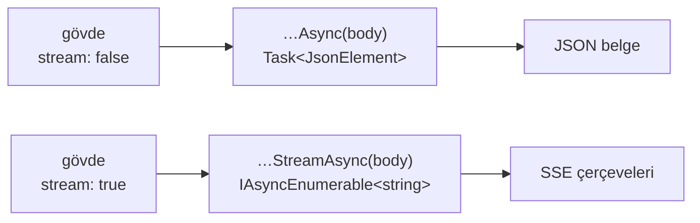

# Faz 159 — Tipli İstemcide Akışlı OpenAI Çağrısı

> **Durum:** ✅ Tamamlandı (2026-09-08)
> **Kaynak:** [ADAYLAR.md](../../ADAYLAR.md) · **F-198**
> **Önkoşul:** Yok — ama 🚨 **gövde bildirimi kusuru bu plandan ÖNCE kapandı** (2026-09-08, `DeclaredRequestBodyTests`). Plan o düzeltilmiş imzanın üstüne yazılmıştır
> **Paketler:** `AgentPrism.Client` (üretilen) · `@agentprism/client` (üretilen)
> **Yeni paket:** Yok · **Migration:** Yok
> **Public API:** Büyüyor — iki yeni üretilmiş metot. Yayımlanmamış olduğu için bugün ucuz
> **Tüketici yüzeyi:** `docs-site/src/content/docs/guides/openai-api.md` · `guides/typescript-client.md` · sevk edilen: `AgentPrism.Client` README'si
> **Manuel test alanı:** [`docs/manuel-test/34-ISTEMCI-VE-CLI.md`](../../manuel-test/34-ISTEMCI-VE-CLI.md)

---

## Bu Faza Başlarken

> `faz-baslangic` skill'ini uygula. **Tamamını değil, yalnız işaret edilen bölümleri oku.**

1. Bu doküman
2. Kararlar:
   ```bash
   grep -n "K-566\|K-633\|K-702" docs/KARARLAR.md
   ```
   **K-566** (`AgentPrism.Client` public API takibinin DIŞINDADIR — yüzey belgeden türetilir) ·
   **K-633** (NSwag'in gölgeleyen POCO ürettiği tipler; `COLLIDING_ANY_TYPES`) ·
   **K-702** (üretilen istemcinin koleksiyon başlangıç değeri kusuru)
3. Alan hafızası — 🚨 **ikisi de bu fazın tam merkezindedir**:
   [`hafiza/nswag-istemci-uretimi.md`](../../hafiza/nswag-istemci-uretimi.md) —
   **postprocess script'i IDEMPOTENT DEĞİLDİR**; yeni geçiş eklerken tam yeniden üretim yapılır ·
   [`hafiza/aspnetcore-json.md`](../../hafiza/aspnetcore-json.md) — `requestBody` tuzağı ve yeni kapısı
4. Emsal geçiş — yeniden yazma, oku:
   `scripts/nswag-postprocess-client.py` **dördüncü geçiş** (`SSE_STRING_RESPONSE_PATTERN`);
   beş saf-SSE ucunu düzeltir ve **bu iki ucu neden atladığını** kendi docstring'inde yazar

---

## Amaç

`/v1/responses` ve `/v1/chat/completions` 200 yanıtı için **iki içerik tipi**
ilan eder — `application/json` ve `text/event-stream` — ve hangisinin döneceğini
istek gövdesindeki `stream` bayrağı çalışma anında seçer. Üretilen tipli istemci
yalnız JSON şeklini bilir. `stream: true` gönderen bir çağıran SSE gövdesini JSON
çözücüye vermiş olur.

- **F-198** — bu iki uç için akışlı şekli tipli istemciden çağrılabilir kılmak.

### Bugün ne çalışmıyor — doğrulanmış kanıt

| Kanıt | Gözlem |
|---|---|
| `docs/openapi/agentprism.json` | Her iki operasyonun 200 yanıtı: `['application/json', 'text/event-stream']` |
| [`AgentPrismApiClient.g.cs:13760`](../../../src/AgentPrism.Client/Generated/AgentPrismApiClient.g.cs) | `AgentPrismOpenAIResponsesAsync(JsonElement body, …)` → `Task<JsonElement>` — yalnız JSON |
| Aynı dosya `:13880` | `AgentPrismOpenAIChatCompletionsAsync(JsonElement body, …)` → `Task<ChatCompletion>` — yalnız JSON |
| [`nswag-postprocess-client.py:76`](../../../scripts/nswag-postprocess-client.py) | Dördüncü geçiş beş saf-SSE ucunu düzeltiyor ve bu ikisini **bilerek** atlıyor: onlar `string` kök tipi üretmediği için eşleşen desen hiç oluşmuyor |
| Kök kısıt | NSwag **çalışma anında koşullu dönüş tipi** ifade edemez |

> Kanıtlar 2026-09-08 tarihinde doğrulandı. Gövde parametresi (`JsonElement body`)
> aynı gün kapatılan ayrı bir kusurdan gelir; ondan önce metotlar gövde bile almıyordu.

---

## 159.1 — İki metot, çalışma anı dallanması değil

**Kullanıcı kararı (2026-09-08):** JSON için mevcut metot kalır, SSE için ikinci
bir metot üretilir.



**Neden bu.** Seçim **derleme anında** olur ve yanlış kullanım orada yakalanır.
Tek metotlu çalışma anı dallanması, dönüş tipini birleşik bir sarmalayıcıya
çevirir; çağıran her kullanımda hangi şekli aldığını kontrol etmek zorunda kalır
ve hata çalışma anına kayar.

🚨 **Metot seçimi ile gövdedeki `stream` bayrağı tutarsız olabilir.** Çağıran
`stream: false` gövdesiyle `…StreamAsync`'i çağırırsa sunucu JSON döner ve
akış çözücüsü boş kalır. Bu davranışın ne olacağı **Açık Soru 2**'dir.

## 159.2 — Postprocess'e beşinci değil, ALTINCI geçiş

Dördüncü geçiş saf-SSE uçlarını düzeltiyor, beşinci geçiş koleksiyon başlangıç
değerlerini. Bu faz **yeni bir geçiş** ekler: dual JSON/SSE operasyonu için
ikinci bir metot üretmek.

🚨 **Postprocess script'i idempotent DEĞİLDİR** (`hafiza/nswag-istemci-uretimi.md`).
Yeni geçiş eklenirken doğru yol **tam yeniden üretimdir**: `dotnet tool restore`
→ `nswag-prepare-document.py` → `dotnet nswag run nswag.json` →
`nswag-postprocess-client.py` → `generate-client-json-context.py`. Belge
değişmediyse çıktı yalnız yeni geçişin deltası kadar farklı olmalıdır ve bu
`diff` ile **doğrulanır**.

## 159.3 — TypeScript tarafı ayrı bir sorudur

`@agentprism/client` `openapi-fetch` üzerinedir ve şekli farklıdır: yanıt
`Response` nesnesi olarak geri verilebilir, dolayısıyla akış zaten okunabilir
olabilir. Bunun bugün mümkün olup olmadığı **ölçülmedi** — **Açık Soru 3**.
İki istemcinin aynı çözümü almak zorunda olmadığı baştan kabul edilir.

---

## Planlanan Public API

> Taslak imzalardır. Gerçekleşen imzalar kapanışta ayrı bölüme yazılır.

```csharp
// AgentPrism.Client — ÜRETİLEN, elle yazılmaz; postprocess geçişi üretir
public virtual Task<JsonElement> AgentPrismOpenAIResponsesAsync(
    JsonElement body, CancellationToken cancellationToken = default);

public virtual IAsyncEnumerable<string> AgentPrismOpenAIResponsesStreamAsync(
    JsonElement body, CancellationToken cancellationToken = default);
```

> 🚨 Akış elemanının tipi (`string` ham çerçeve mi, ayrıştırılmış bir olay mı)
> **Açık Soru 1**'dir. Beş saf-SSE ucunun bugünkü şekli emsaldir; ondan sapmak
> ailede iki farklı akış sözleşmesi yaratır.

### HTTP `endpoint`'leri

Yeni uç **yok**. Sunucu değişmiyor; bu faz yalnız üretilen istemciyi düzeltir.

### Arayüz payı

Yok.

---

## Planlanan Dosya Listesi

```
scripts/
├── nswag-postprocess-client.py          (değişir — altıncı geçiş)
└── nswag_postprocess_client_test.py     (değişir)

src/AgentPrism.Client/Generated/
├── AgentPrismApiClient.g.cs             (ÜRETİLİR — elle düzenlenmez)
└── AgentPrismClientJsonContext.g.cs     (ÜRETİLİR)

tests/AgentPrism.AspNetCore.FunctionalTests/
└── GeneratedClientSseTests.cs           (değişir — dual uçlar eklenir)

packages/agentprism-client/
└── (Açık Soru 3'ün sonucuna göre)
```

---

## Hata Modları ve Testler

| Ne bozulabilir | Seviye | Test sınıfı |
|---|---|---|
| Akışlı metot gerçek sunucuya karşı çağrılınca ilk çerçevede çöker | Fonksiyonel (gerçek sunucu) | `GeneratedClientSseTests` |
| `stream: false` gövdesiyle `…StreamAsync` çağrılır | Fonksiyonel | `GeneratedClientSseTests` |
| `stream: true` gövdesiyle JSON metodu çağrılır — bugünkü sessiz çökme | Fonksiyonel | `GeneratedClientSseTests` |
| Postprocess geçişi idempotent olmadığı için ikinci koşumda bozar | Birim | `nswag_postprocess_client_test.py` |
| Yeni geçiş, dördüncü geçişin beş ucunu da yakalar ve iki kez işler | Birim | geçiş yalnız **dual** operasyonu eşlemeli |
| Üretilen istemci elle düzenlenir ve sonraki üretimde kaybolur | Koşum disiplini | tam yeniden üretim + `diff` doğrulaması |
| İptal token'ı akış ortasında dinlenmez | Fonksiyonel | `GeneratedClientSseTests` |

Beş soru: **iptal** — akış ortasında `CancellationToken` · **eşzamanlılık** — iki
akış aynı `HttpClient` üzerinde · **boş/aşırı girdi** — sıfır çerçeveli akış ve
çok büyük gövde · **başka kiracı** — kapsam dışı (istemci tarafı) · **alt sistem
hatası** — sunucu akış ortasında bağlantıyı keser.

---

## Manuel Kabul Case'leri

| # | Ön koşul | Adımlar | Beklenen sonuç |
|---|---|---|---|
| 1 | Örnek uygulama ayakta | `…StreamAsync` ile `stream: true` gövdesi gönder | Çerçeveler sırayla gelir; çökme yok |
| 2 | Aynı | `…Async` ile `stream: false` gövdesi gönder | JSON belge döner (bugünkü davranış korunur) |
| 3 | Aynı | `…Async` ile `stream: true` gövdesi gönder | Açık Soru 2'nin kararına göre: ya tanımlı hata ya belgelenmiş davranış — **sessiz çökme değil** |
| 4 | Akış ortasında | Token iptal et | Akış durur; kaynak sızmaz |

---

## Açık Sorular

| # | Soru | Seçenekler | Öneri |
|---|---|---|---|
| 1 | Akış elemanının tipi? | A: `string` ham çerçeve (beş saf-SSE ucunun emsali) · B: ayrıştırılmış olay tipi | **A** — ailede tek akış sözleşmesi kalır; ayrıştırma tüketicinin işidir ve OpenAI şeması bizim değildir |
| 2 | Metot ile `stream` bayrağı tutarsızsa? | A: İstemci gövdeyi düzeltir · B: Olduğu gibi gönderir, sunucunun cevabı ne ise o · C: Derleme öncesi doğrulama yok, çalışma anında tanımlı hata | **B** — istemcinin çağıranın gövdesini sessizce değiştirmesi daha kötü bir sürprizdir; davranış belgelenir |
| 3 | TypeScript istemcisi de değişecek mi? | A: Evet, simetrik · B: Hayır, `openapi-fetch` zaten `Response` verebiliyor · C: Ölç, sonra karar ver | **C** — ölçülmeden karar verilmez; ölçüm bu fazın ilk işidir |

---

## Bitiş Ölçütleri (DoD)

- [ ] `…StreamAsync` gerçek sunucuya karşı `stream: true` gövdesiyle çerçeve üretir; çıktı belgeye yazıldı
- [ ] `…Async` ile `stream: false` bugünkü davranışı **birebir** korur
- [ ] `stream: true` + JSON metodu birleşimi sessizce çökmüyor; davranış belgelendi
- [ ] Postprocess tam yeniden üretimle koşuldu ve delta `diff` ile doğrulandı — yalnız yeni geçişin farkı
- [ ] TypeScript istemcisi için ölçüm yapıldı ve Açık Soru 3 karara bağlandı
- [ ] Dört doğrulama kapısı sıfır uyarı verir
- [ ] `samples/AgentPrism.Api` ile gerçek `run` yapıldı, çıktı belgeye yazıldı
- [ ] `secret` taraması boş döndü
- [ ] Manuel kabul case'leri `docs/manuel-test/34-ISTEMCI-VE-CLI.md` içine eklendi ve **`00-INDEKS.md` sayımı güncellendi**
- [ ] `faz-denetim` koşuldu; 🔴 bulgu kalmadı
- [ ] `docs-site/` güncellendi (`guides/openai-api.md` akış bölümü); `npm run build` + `check-links.mjs` temiz

### Doğrulama komutları

```bash
# Tam yeniden üretim ve delta doğrulaması
python3 scripts/nswag-prepare-document.py docs/openapi/agentprism.json artifacts/openapi/agentprism.client-input.json
dotnet nswag run nswag.json
python3 scripts/nswag-postprocess-client.py src/AgentPrism.Client/Generated/AgentPrismApiClient.g.cs
git diff --stat src/AgentPrism.Client/Generated/
```

---

## Riskler

| Risk | Önlem |
|------|-------|
| Postprocess idempotent değil; ikinci koşum bozar | Tam yeniden üretim zorunlu; DoD `diff` doğrulamasını şart koşar |
| Yeni geçiş dördüncü geçişin uçlarını da yakalar | Desen yalnız **dual** içerik tipli operasyonu eşlemeli; birim testi bunu sabitler |
| Üretilen dosya elle düzenlenir | Dosya `Generated/` altındadır; düzeltme **script'te** yapılır |
| İki istemci farklı çözüm alır ve sözleşme ayrışır | Açık Soru 3 ölçümle kapanır; ayrışma **kararla** olur, kazayla değil |
| Yüzey büyür (iki yeni metot) ve yayın sonrası kırıcı olur | Bugün yayımlanmamış; K-566 gereği bu istemci public API takibinin dışındadır |

---

<!-- ============================================================
     AŞAĞISI KAPANIŞTA DOLDURULUR — `faz-tamamlama` skill'i.
     ============================================================ -->

## Plandan Sapmalar

| # | Plan ne diyordu | Ne oldu | Neden |
|---|---|---|---|
| 1 | Gövde parametresi `JsonElement body` (Planlanan Public API) | **Gerçekte `object body` idi.** Planın kanıt tablosu yanlıştı | Aynı gün kapanan gövde bildirimi kusuru `.Accepts<object>` bırakmıştı. Ölçüm: `object` gövde **çağrılamaz** — istemci kaynak-üretilmiş `JsonSerializerContext` ile serilestirir, anonim tip/POCO geçen her çağıran `NotSupportedException` alır. Sunucu `.Accepts<JsonElement>`'e çevrildi; imza artık planın yazdığı hâle geldi |
| 2 | Kapsam: yalnız iki dual uç | **SSE ilan eden yedi ucun tamamı** (kullanıcı kararı) | Açık Soru 1 "ailede iki farklı akış sözleşmesi" riskini yazıyordu. İki uçla sınırlamak tam da onu üretirdi (5 tamponlu + 2 akışlı). Geçiş genelleşince **basitleşti** de: "dual" özel durumu kalmadı, ayırt edici `text/event-stream` ilanının kendisi oldu |
| 3 | Açık Soru 2 önerisi B: "gövdeyi olduğu gibi gönder, belgele" | Gövde **yine** olduğu gibi gönderilir, ama yanıtın `Content-Type`'ı denetlenir ve tanımlı hata atılır (kullanıcı kararı) | Saf B, `…StreamAsync` + `stream:false` birleşimini **sessiz boş akış** bırakıyordu (SSE ayrıştırıcısı JSON belgesinde çerçeve bulamaz) — DoD'nin "sessiz çökme değil" satırıyla çelişirdi. Guard çağıranın gövdesini değiştirmez; yalnız sunucunun **gerçekten** ne yanıtladığına bakar |
| 4 | Açık Soru 3: "ölç, sonra karar ver" | Ölçüldü: `parseAs: 'stream'` **zaten çalışıyor** (B doğru). Ama paket bir SSE çözücüsü **sevk etmiyordu** | Her tüketici çerçeveleyiciyi yeniden yazacaktı. Frontend'in test edilmiş `SseDecoder`/`readSse`'si pakete taşındı ve dışa açıldı; frontend artık onu paketten alır (kullanıcı kararı) |
| 5 | Geçiş "altıncı" olarak eklenecekti | Altıncı geçiş **dördüncüden ÖNCE** koşar | Dördüncü geçiş saf-SSE 200 dalını yeniden yazınca yedi ucun dalı iki ayrı şekle ayrılır. Önce koşunca hepsi hâlâ NJsonSchema'nın **tek** şeklindedir ve tek desen yediyi de eşler. `main` bunu iddia olarak zorlar: dördüncü geçiş sonrasında hâlâ tam `len(operations) - guarded` eşleşme olmalı |
| 6 | Kapsam dışı | `.Accepts<JsonElement>` **CS0019** doğurdu (`if (body == null)` bir struct'ta derlenmez) | K-633'ün belgelediği sınıfın **ikinci ekseni**: üçüncü geçiş yanıt tarafındaki null denetimini zaten siliyordu, gövde tarafındakini bilmiyordu. Silmek yerine **anlamlı guard'a çevrildi** — `default(JsonElement)` aksi hâlde serilestiricinin içinde `InvalidOperationException: Operation is not valid due to the current state of the object` ile düşüyordu (ölçüldü) |

### Faz dışında kapatılan kusurlar

Kullanıcı "konuyla alakasız kusurları da çöz" dedi; yol üstünde bulunanlar:

| Kusur | Nerede | Düzeltme |
|---|---|---|
| `typescript-client.md` "Server-Sent Events **desteklenmiyor**" diyordu | Sevk edilen site sayfası | Artık destekleniyor — bölüm `## Streaming responses` olarak yeniden yazıldı |
| Aynı sayfa "**Six** operations answer `text/event-stream`" diyordu | Aynı | **Yedi**; `GET /api/runs/{runId}/events` sayımdan düşmüştü |
| Kök `README.md` "HTTP API (**160** operations)" diyordu | Sevk edilen metin | **165**. `http-api.md`'nin aynı iddiası kapılıydı ve doğruydu; kök README'ninki değildi |
| `AgentPrism.Client` README'si "**160** generated methods" diyordu | Paket README'si | Sabit sayı kaldırıldı — "one per operation in the document" |
| `AgentPrism.Client.csproj` yorumu "160 generated operations" diyordu | Kaynak yorumu | Aynı düzeltme |

## Bu Fazda Verilen Kararlar

Karar defterine **yeni `K-*` kaydı girmedi.** Üç aday tartıldı ve üçü de
`AGENTS.md`'nin ölçütünü karşılamadı:

- **İki metotlu tasarım** — `AgentPrism.Client` public API takibinin dışındadır
  (K-566) ve yüzey belgeden türetilir; bu bir üretim kuralıdır, bir contract
  kararı değil. Kural `nswag-postprocess-client.py`'nin docstring'inde ve
  `docs/hafiza/nswag-istemci-uretimi.md`'de yaşar.
- **`.Accepts<object>` → `.Accepts<JsonElement>`** — belge **anlamca aynı**
  kalır (her ikisi de "her türlü JSON"), TypeScript çıktısı **birebir** aynıdır
  (`JsonElement` = `unknown`). Kırıcı bir sözleşme değişikliği değil, yanlış bir
  imzanın düzeltilmesi. K-633'ün "yeniden açılmaz" notu bu sınıfı zaten
  kapsıyor: yeni bir opak değer tipi keşfedilirse tabloya eklenir, yeni karar
  gerekmez.
- **`readSse`'nin pakete taşınması** — paket içi bir modül yerleşimi; public
  npm yüzeyi büyür ama `@agentprism/client` yayımlanmamıştır ve yüzeyi zaten
  belgeden türetilir.

## Gerçekleşen Public API

```csharp
// AgentPrism.Client — ÜRETİLEN (altıncı geçiş), yedi ucun her biri için:
public virtual IAsyncEnumerable<string> AgentPrismRunAgentStreamAsync(
    string name, AgentRunRequest body, [EnumeratorCancellation] CancellationToken cancellationToken = default);
public virtual IAsyncEnumerable<string> AgentPrismStreamRunEventsStreamAsync(Guid runId, ...);
public virtual IAsyncEnumerable<string> AgentPrismRunWorkflowStreamAsync(string name, WorkflowRunHttpRequest? body = null, ...);
public virtual IAsyncEnumerable<string> AgentPrismResumeWorkflowStreamAsync(Guid runId, WorkflowResumeHttpRequest? body = null, ...);
public virtual IAsyncEnumerable<string> AgentPrismRespondWorkflowRequestStreamAsync(Guid runId, WorkflowRespondHttpRequest? body = null, ...);
public virtual IAsyncEnumerable<string> AgentPrismOpenAIResponsesStreamAsync(JsonElement body, ...);
public virtual IAsyncEnumerable<string> AgentPrismOpenAIChatCompletionsStreamAsync(JsonElement body, ...);

// DEĞİŞEN imza (gövde tipi) — iki dual uç:
public virtual Task<JsonElement> AgentPrismOpenAIResponsesAsync(JsonElement body, ...);      // idi: object body
public virtual Task<ChatCompletion> AgentPrismOpenAIChatCompletionsAsync(JsonElement body, ...); // idi: object body
```

```ts
// @agentprism/client — elle yazılan, yeni dışa açılan
export { readSse, SseDecoder, type SseFrame } from './sse.js';
```

Elle yazılan C# tarafı **`internal`**'dır (`AgentPrismApiClient.Sse.cs`):
`IsServerSentEventStream` · `DescribeMediaType` · `EnsureContentTypeAsync` ·
`ReadServerSentEventFramesConfigured` · `ReadServerSentEventFramesAsync`.
`src/Directory.Build.props` zaten `AgentPrism.Client.UnitTests`'e internals
erişimi verdiği için birim testi edilebilirler; paketin yüzeyi büyümez.

### HTTP `endpoint`'leri

Yeni uç yok. Sunucuda değişen tek şey iki `.Accepts<>` bildirimi.

## Dosya Listesi (gerçekleşen)

```
scripts/
├── nswag-postprocess-client.py          (altıncı geçiş + gövde guard'ı; artık İKİ argüman alır)
└── nswag_postprocess_client_test.py     (+10 test: StreamingSiblingTests, ValueTypeBodyGuardTests)

src/AgentPrism.AspNetCore/OpenAICompat/
├── OpenAIResponsesEndpoints.cs          (.Accepts<JsonElement>)
└── OpenAIChatCompletionsEndpoints.cs    (.Accepts<JsonElement>)

src/AgentPrism.Client/
├── AgentPrismApiClient.Sse.cs           (YENİ — çerçeveleme ve content-type guard'ı)
├── README.md                            (streaming bölümü; sabit metot sayısı kaldırıldı)
├── AgentPrism.Client.csproj             (yorum düzeltmesi)
└── Generated/AgentPrismApiClient.g.cs   (ÜRETİLDİ — +1003 satır)

packages/agentprism-client/
├── src/sse.ts                           (TAŞINDI — frontend'den)
├── src/index.ts                         (readSse/SseDecoder/SseFrame dışa açıldı)
├── src/schema.ts                        (ÜRETİLDİ — iki requestBody satırı)
└── test/sse.test.ts                     (TAŞINDI — frontend'den)

src/AgentPrism.UI/frontend/src/screens/  (üç dosya: import kaynağı @agentprism/client oldu)

tests/
├── AgentPrism.Client.UnitTests/AgentPrismApiClientSseTests.cs   (YENİ — 12 test)
├── AgentPrism.Client.UnitTests/ClientCoverageTests.cs           (+2 cırcır testi)
└── AgentPrism.AspNetCore.FunctionalTests/GeneratedClientSseTests.cs (2 → 11 test)

docs-site/src/content/docs/
├── guides/openai-api.md                 (## Calling these endpoints from a typed client)
├── guides/typescript-client.md          (## Streaming responses; yanlış "desteklenmiyor" bölümü kaldırıldı)
├── packages.md · capabilities.md        (akış satırları)
docs/
├── openapi/agentprism.json              (ÜRETİLDİ — iki requestBody şeması)
├── hafiza/nswag-istemci-uretimi.md      (üç yeni not)
├── manuel-test/34-ISTEMCI-VE-CLI.md     (case 38–46)
└── manuel-test/00-INDEKS.md             (sayım 22 → 46; zaten bayattı)
README.md                                (160 → 165 operations)
```

## Gerçek Koşum Kanıtı

`samples/AgentPrism.Api` ayağa kaldırıldı (`EchoModelProvider`, ağ çağrısı yok)
ve üretilen istemciyle **gerçek** çağrılar yapıldı:

```
## 1. AgentPrismOpenAIResponsesStreamAsync  (stream: true)
  [0] event: response.created | data: {"type":"response.created",...
  [1] event: response.in_progress | data: {...
  [2] event: response.output_item.added | data: {...
  [18] event: response.completed | data: {...
  -> 19 frames

## 2. AgentPrismOpenAIChatCompletionsStreamAsync  (stream: true)
  first: data: {"id":"chatcmpl-...","object":"chat.completion.chunk",...
  last : data: [DONE]
  -> 4 frames

## 3. AgentPrismOpenAIResponsesAsync  (stream: false)
  object=response status=completed
  text=Merhaba! Size nasıl yardımcı olabilirim?

## 4. JSON method + stream:true
  AgentPrismApiException: The server answered 200 with content type
  'text/event-stream', not 'application/json'. ... Send "stream": false, or call
  AgentPrismOpenAIResponsesStreamAsync for the streaming shape.

## 5. Streaming method + stream:false
  AgentPrismApiException: The server answered 200 with content type
  'application/json', not 'text/event-stream'. ... Send "stream": true, or call
  AgentPrismOpenAIResponsesAsync for the JSON shape.

## 6. default(JsonElement) body
  ArgumentException (body): The request body is an uninitialized JsonElement.

## 7. AgentPrismRunAgentStreamAsync + early break
  [0] id: 0 | event: run | data: {"runId":"01a081fb-...
  [1] id: 1 | event: update | data: { | data:   "authorName": "cached-support",...
  -> break after 2 frames (stream released)
```

🚨 Örnek uygulamanın `secret`'ına **dokunulmadı**: `AgentPrism__Ui__AuthToken`
ortam değişkeni yalnız bu koşum için verildi (ortam değişkeni user-secrets'ı
ezer), böylece kullanıcının kendi token'ı ne okundu ne yazdırıldı.

### Yeniden üretim deltası

Taban doğrulaması **önce** yapıldı: değiştirilmemiş script tam zinciri koşunca
`git diff` **boş** döndü — hat güvenilir. Altıncı geçişten sonra delta yalnız
`AgentPrismApiClient.g.cs`'te **+1003 satır** (7 kardeş metot + 2 guard);
`AgentPrismClientJsonContext.g.cs` **değişmedi** (153 kök tip, aynı), yani yeni
metotlar hiçbir yeni serilestirme kökü getirmedi.

## Site Senkronu

`tuketici-dokuman-senkronu` koşuldu. Dört kural tetiklendi; üçü hedefiyle
karşılandı (`http-api` → `docs/openapi/agentprism.json` · `paket-tanimi` ve
`paket-readme` → `packages.md`). Dördüncüsü **gerekçeyle** geçildi:

> **`arayuz` → `ui.md` güncellenmedi.** Tetikleyen üç dosya
> (`screens/run-detail.tsx`, `screens/workflow-detail.tsx`,
> `screens/playground/use-playground-run.ts`) yalnız **import kaynağını**
> değiştirdi: `../lib/sse` → `@agentprism/client`. Aynı `readSse`, aynı
> çağrı, aynı çerçeveler. Hiçbir ekran, hiçbir metin, hiçbir davranış
> değişmedi; ekran görüntüsü de bayatlamadı. `ui.md`'ye yazılacak bir şey
> yoktur ve uydurmak sayfayı yanlış yapardı.

Kapı `--site-gerekce-yazildi` ile geçildi; bu bölüm o gerekçenin kaydıdır.

## Denetim Bulguları

Bağımsız denetçi (taze bağlam, yalnız DoD + `git diff 9539b670`) koştu.
**Bir 🔴, altı 🟡, üç 🟢.** Hepsi kapandı veya devredildi.

| # | Sev. | Bulgu | Sonuç |
|---|---|---|---|
| 1 | 🔴 | `llms-full.txt` kaynağından geride: agent haritası `packages.md`'nin **son** düzenlemesinden ÖNCE üretilmişti; `build-agent-map.mjs --check` ve `check:content` kırmızıydı | **Düzeltildi** — `build-agent-map.mjs` yeniden koşuldu, dört site kapısı yeşil. 🚨 Ders: harita üretimi doküman düzenlemelerinin **sonuncusu** olmalıdır, ortası değil |
| 2 | 🟡 | Yeni dışa açılan `readSse`'nin HTTP sınırında hiç testi yoktu; iki sayfanın "`parseAs: 'stream'` + `readSse`" vaadini hiçbir test kanıtlamıyordu (`sse.test.ts` yalnız çözücüyü test ediyor) | **Düzeltildi** — `packages/agentprism-client/test/streaming.test.ts` (3 test): sahte `fetch` ile gerçek `client.POST(..., parseAs: 'stream')` → `readSse`; parçalanmış çerçeve; ve **403'ün hâlâ `AgentPrismError` fırlattığı** (akış modu hata ara yazılımını atlatmıyor) |
| 3 | 🟡 | `guides/openai-api.md`'deki TypeScript örneği çalışmıyordu: `client` tanımsızdı | **Düzeltildi** — `createAgentPrismClient(...)` çağrısı örneğe eklendi |
| 4 | 🟡 | Taşınan `src/lib/sse.ts`'e beş bayat referans kaldı; `kapi.py tarama` ve `dokuman-bakim.py` ikisi de temiz döndü (dizin öneki taşımayan yol iddiası kapıların deliğinden geçiyor) | **Düzeltildi** — beşi de `@agentprism/client`'ı gösteriyor. `docs/guvenlik-tarama/BULGULAR.md`'deki altıncı referans **bilerek** bırakıldı: tarihli bir bulgu kaydıdır, ledger geçmişi yeniden yazılmaz |
| 5 | 🟡 | `A_matching_content_type_passes_in_both_directions` hiçbir şey iddia etmiyordu (yalnız "patlamadı") | **Düzeltildi** — `Should.NotThrowAsync` ile niyet görünür |
| 6 | 🟡 | Fazın kendi listelediği beş sorudan **alt sistem hatası** (sunucu akış ortasında bağlantıyı keser) iki seviyede de test edilmemişti | **Düzeltildi** — `A_connection_that_drops_mid_stream_surfaces_the_error_rather_than_ending_quietly`: `FailingStream` okuma ortasında `IOException` atar; istisna `MoveNextAsync`'ten çıkar ve o ana kadarki çerçeveler teslim edilmiş olur. Sessizce bitmek "run tamamlandı" diye okunurdu |
| 7 | 🟡 | `YOL-HARITASI.md` fazı hâlâ `📋 Planlandı` gösteriyordu | **Düzeltildi** — üretildi (K-413: elle yazılmaz) |
| 8 | 🟢 | Python testinin `document()` yardımcısı geçici dosya bırakıyordu | **Düzeltildi** (kendi kodum; `TemporaryDirectory` bağlam yöneticisi) |
| 9 | 🟢 | `text/event-stream` yanıtının şeması hâlâ JSON şeklini ilan ediyor | **Devredildi** — `ADAYLAR.md` **F-221** |
| 10 | 🟢 | Site ağırlık marjı %0,6'ya indi; kalite sözleşmesindeki taban kaydı bayat | **Devredildi** — `ADAYLAR.md` **F-222** |

**Denetçinin temiz bulduğu başlıklar:** 3.3 (test seviyesi) · 3.5 (imza-gövde
kayması) · 3.6 (plan dışı public API) · 3.7 (repo kuralları).

### Denetimin çürüttüğü bir varsayım

Denetçi izole bir probe koştu: `HttpClient.Timeout = 3s` ile
`ResponseHeadersRead` üzerinden **10 saniyelik** bir SSE akışı .NET 10'da
**kesilmiyor** ("COMPLETED normally after 10,1s"). Yani `AddAgentPrismClient`'ın
varsayılan 100 sn `Timeout`'u uzun akışlar için bir tuzak **değildir** — bu faz
için ayrı bir timeout ayarı gerekmedi.

### Denetim sonrası kapı koşumu

🔴 kapandıktan sonra kapılar yeniden koşuldu (düzeltme yeni kusur üretebilir):
`AgentPrism.Client.UnitTests` 18/18 · `@agentprism/client` 34/34 ·
`python -m unittest discover -s scripts` 257/257 · `build-agent-map --check` ✅ ·
`npm run check` (dördü) ✅.

## Sonraki Faza Devir Notu

- **`nswag-postprocess-client.py` artık İKİ argüman alır** —
  `<uretilen.cs> <openapi-document.json>`. Zorunludur, varsayılanı yoktur:
  unutulan yol sessizce kardeş üretmemek yerine yüksek sesle düşer. Reçetenin
  yazılı olduğu üç yer güncellendi (`ClientCoverageTests` mesajı,
  `docs/hafiza/nswag-istemci-uretimi.md`, bu doküman).
- **Geçiş sırası artık anlamlıdır ve `main` onu iddia eder.** Altıncı geçiş
  dördüncüden önce koşar; yeni bir geçiş eklerken bu iddiayı bozma.
- **Script hâlâ idempotent değil**, ama altıncı geçiş bunu artık kendisi
  yakalar (`SystemExit`, CS0111 beklemeden).
- **`readSse` artık `@agentprism/client`'ta yaşıyor.** Frontend onu paketten
  alır ve import **`dist/`'i** çözer — K-627'nin dördüncü adımı (`npm run build`)
  bu yüzden hâlâ zorunludur.
- **Açık kalan:** `text/event-stream` içerik tipinin **şeması** hâlâ JSON
  şeklini ilan ediyor (`ChatCompletion`/`JsonElement`); saf-SSE uçlar doğru
  biçimde `type: string` diyor. ASP.NET Core'un üstveri modeli aynı statü kodu
  için iki farklı şema ifade edemiyor (kaynaktaki yorum bunu zaten kabul
  ediyor) ve K-039 gereği kütüphane `Microsoft.AspNetCore.OpenApi`'ye bağımlı
  değil, yani bir `OpenApiOperationTransformer` de kütüphanede yaşayamaz.
  Üretilen istemci bundan **etkilenmiyor** (altıncı geçiş içerik tipinin
  varlığına bakar, şemasına değil), ama belgeyi okuyan bir üçüncü taraf üreteci
  yanlış bilgilenir. Aday olarak yazılmaya değer.
- **Örnek uygulamada bağlantısız bir gürültü var:** açılışta
  `SqliteException: no such table: agentprism_agent_definitions` loglanıyor —
  katalog, migration'lar tamamlanmadan listeliyor. Zararsız (migration hemen
  ardından koşuyor ve uygulama çalışıyor) ve bu fazın kapsamı dışında; ayrı bir
  kusur kalemi olarak açılmalı.
