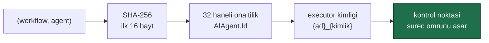
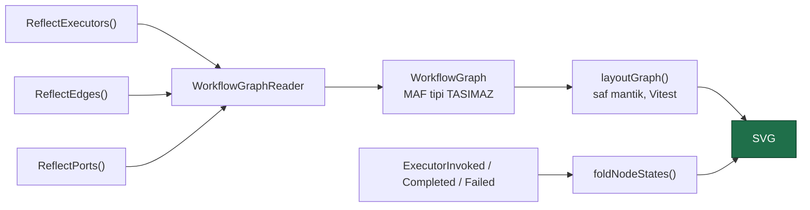
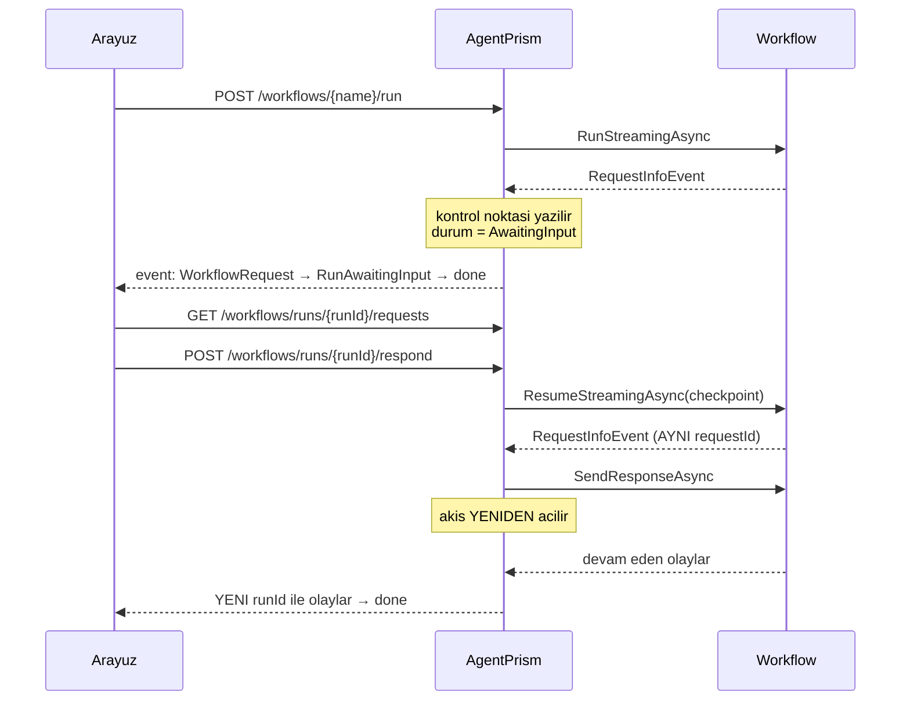

# Faz 16 — Workflows: Graf, Arayüz ve Human-in-the-Loop

> **Durum:** ✅ Tamamlandı (2026-08-03)
> **Kaynak:** [BEYIN-FIRTINASI.md](../BEYIN-FIRTINASI.md) · **F-27** (2/2)
> **Önkoşul:** [Faz 15](15-WORKFLOWS-YURUTME.md)
> **Sonraki:** [Faz 17](17-TOPLU-VE-ZAMANLANMIS-CALISTIRMA.md) — iş kuyruğu
> **Paketler:** `AgentPrism.Abstractions`, `.Core`, `.PostgreSql`, `.AspNetCore`, `.Workflows`, `.UI`
> **Yeni paket:** Yok · **Migration:** Yok

---

## Bu Fazda Ne Yapıldı

Faz 15 workflow'ları çalıştırıyordu ama kullanıcı ne olduğunu göremiyordu ve
insan girdisi isteyen bir graf yarım kalıyordu. Bu faz üçünü kapattı:

1. **Graf görselleştirme** — derlenmiş graf arayüzde elle çizilen SVG olarak
2. **Human-in-the-loop** — bekleyen istek, kontrol noktası, yanıt, sürdürme
3. **Magentic plan onayı** — Faz 15'te kapatılan `RequirePlanSignoff` açıldı

Ayrıca **kontrol noktalarının süreç ömrü sınırı kaldırıldı**: bekleyen bir insan
isteği artık dağıtımda kaybolmaz.

---

## 🚨 Ölçülen MAF Davranışları

Bu bölüm fazın en değerli çıktısıdır. Aşağıdakiler reflection ve **gerçek
çalıştırma** ile ölçüldü; hiçbiri MAF dokümanında yazılı değildir.

### 1. Grafta kimliği değişken olan **tek** şey agent executor'udur

Faz 15 dokümanı "kalıcı kimlik için hazır desenler yeniden yazılmalı" diyordu.
Ölçüldü — **gerek yok**. Beş desenin ürettiği executor kimlikleri:

| Desen | Üretilen executor kimlikleri |
|-------|------------------------------|
| `Sequential` | `{ad}_{AIAgent.Id}` ×N, `OutputMessages` |
| `Concurrent` | `Start`, `{ad}_{AIAgent.Id}` ×N, `Batcher/{ad}_{AIAgent.Id}` ×N, `ConcurrentEnd` |
| `Handoff` | `HandoffStart`, `{ad}_{AIAgent.Id}` ×N, `HandoffEnd` |
| `GroupChat` | `GroupChatHost`, `{ad}_{AIAgent.Id}` ×N |
| `Magentic` | `MagenticOrchestrator`, `{ad}_{AIAgent.Id}` ×N |

Yardımcı dügümlerin tamamı **zaten sabittir**. Yalnızca `AIAgent.Id`
sabitlenirse beş desenin tamamı kalıcı kimlik kazanır ve grafı elle kurmak
gerekmez.

### 2. `AIAgent.Id` yazılabilir bir alanın arkasındadır

```
AIAgent alani: String <Id>k__BackingField (initonly=False)
AIAgent.Id     virtual=False  canWrite=False
```

Özellik sanal değildir ve setter'ı yoktur; ama derleyicinin ürettiği arka alan
salt-okunur **değildir**. `WorkflowAgentIdentity` yalnızca AgentPrism'in kendi
sarmalayıcı örneğinde bu alanı yazar — MAF'ın hiçbir nesnesine dokunmaz.

### 3. Kontrol noktası bekleyen isteği **taşır** ve istek yeniden yayınlanır

Ölçüldü: bir `RequestInfoEvent` sonrası yazılan kontrol noktasından **yeni bir
`Workflow` örneğiyle** sürdürüldüğünde MAF aynı istegi **aynı `RequestId` ile
yeniden yayınlar**. Human-in-the-loop bu davranışın üzerine kuruldu: yanıt
saklanan bir nesneyle değil, yeniden yayınlanan istekle eşleştirilir.

### 4. 🚨 Yanıt gönderildikten sonra akış **yeniden açılmalıdır**

```csharp
await run.SendResponseAsync(response);   // mesaji kuyruklar
// ...ama o sirada tuketilen WatchStreamAsync numaralandiricisi
// zaten bitmeye karar vermistir.
```

`SendResponseAsync` bir mesaj kuyruklar, ancak o anda tüketilen
`WatchStreamAsync` numaralandırıcısı akışı bitirir. Devam eden super-step'leri
yalnızca **yeni bir numaralandırıcı** görür. `WorkflowRunner.PumpAsync` bu
yüzden bir dış döngü taşır: yanıt gönderildiyse akış yeniden açılır.

### 5. 🚨 Çıktı tipi **işleyicinin dönüş tipinden** bildirilir

Gövdesinde `YieldOutputAsync` çağıran, dönüşü olmayan bir işleyici hiçbir çıktı
tipi beyan etmez ve çalışma anında düşer:

```
Cannot output object of type String. Expecting one of [].
```

Doğrusu `BindAsExecutor<TInput, TOutput>` ile dönüş tipi olan bir işleyici
yazmak, ayrıca `WithOutputFrom(...)` çağırmaktır.

### 6. 🚨 `ForwardIncomingMessages` açıkken sonraki düğüm **iki kez** çalışır

Ölçüldü (örnek uygulama, gerçek model): agent host'u hem gelen mesajı hem kendi
yanıtını aşağı yollar; port iki kez tetiklenir ve tek bir onay yerine **iki ayrı
bekleyen istek** oluşur. `/requests` iki kayıt döndürdü. Çözüm:

```csharp
new AIAgentBinding(agent, new AIAgentHostOptions { ForwardIncomingMessages = false })
```

### 7. Elle kurulmuş grafta sürdürme, kontrol noktasında **kuyrukta kalan** işi tekrarlar

Ölçüldü: `ozetle-ve-onayla` sürdürüldüğünde özetleyici agent yeniden çalıştı
(37 `MessageDelta`) ve graf ikinci bir onay istedi. Sebep AgentPrism değil,
grafın şeklidir — kontrol noktası anında agent host'u için kuyrukta bir mesaj
duruyordu. Hazır desenlerde ve Magentic plan onayında bu görülmez: orkestratör
turu kendi elinde tutar.

---

## 16.1 — Kalıcı Executor Kimliği (K-127)

Faz 15'in en büyük sınırı buydu: `WorkflowAgentCache` süreç belleğindeydi,
uygulama yeniden başladığında kimlikler değişiyordu ve MAF eski kontrol
noktasını `InvalidDataException` ile reddediyordu. Bekleyen bir insan isteği
**her dağıtımda kayboluyordu**.



- `WorkflowAgentIdentity.Compute(workflowName, agentName)` → 32 haneli onaltılık
- Biçim `Guid.ToString("n")` ile aynıdır; ayırıcı karakter taşımaz
- Ayırıcı `\n`'dir: `("a-b","c")` ile `("a","b-c")` aynı kimliği üretemez
- Yazma başarısız olursa **istisna atılmaz**: uyarı loglanır, davranış Faz 15'e
  döner. Sessiz bozulmayı `WorkflowAgentIdentityTests.Kalici_kimlik_yazilabiliyor`
  engeller — MAF alanı kaldırırsa **test kırılır**

### Kanıt — gerçek süreç yeniden başlatma

```
executor kimligi (yeniden baslatma ONCESI): ozetleyici_b5626e159bce3491a139616e0e003f32
=== SUREC OLDURULDU, YENIDEN BASLATILIYOR ===
executor kimligi (yeniden baslatma SONRASI): ozetleyici_b5626e159bce3491a139616e0e003f32
KIMLIK AYNI ✅

yeniden baslatmadan ONCE olusan istek: 2ab45a8f18ae4303affa27376a6d4582
YENI runId: 019fc5a4-a8f0-700a-9dfd-5ba82cf03d2a
CIKTI: ['Yayin iptal edildi; ozet arsivde birakildi.']
HATA: []
```

Faz 15'te bu akış `InvalidDataException` ile düşerdi.

---

## 16.2 — Graf Görselleştirme

**Karar korundu: graf elle SVG olarak çizilir** (K-002'nin bundle bütçesi).

| Yol | Bundle | Sonuç |
|-----|--------|-------|
| mermaid.js | ~+100 KB gzip | Reddedildi |
| Elle SVG | ölçülen +12,8 KB gzip (tüm ekran ailesiyle birlikte) | **Seçilen** |



**Graf tanımdan değil, DERLENMİŞ workflow'dan çıkarılır.** Sebep ölçülmüştür:
hazır desenler kullanıcının yazmadığı düğümler ekler ve çalıştırma olayları tam
olarak o düğümleri adlandırır. Tanımdan çizilen bir graf hiçbir zaman
renklenmezdi.

- Düğüm kimlikleri `ExecutorInvoked` olaylarının `Text` alanıyla **birebir** aynıdır
- Düğüm rolleri: `Agent`, `Orchestration`, `RequestPort`, `Output`
- Kenar türleri: `Direct`, `FanOut`, `FanIn` (geri dönen kenar kesikli çizilir)
- **"Copy Mermaid"** düğmesi MAF'ın `ToMermaidString` çıktısını panoya kopyalar

🚨 **Bileşik kimlikler ayrıştırılmaz.** `Concurrent` deseni her agent için bir
`Batcher/{ad}_{kimlik}` düğümü ekler; eğik çizgi denetlenmezse birleştirici
düğümler agent sanılır ve graf **iki kat** agent gösterir. Ölçüldü ve test
altına alındı.

### Kanıt — gerçek graf

```
start: ozetleyici_b5626e159bce3491a139616e0e003f32
  dugum ozetleyici_b5626e159bce3491a139616e0e003f32   kind=Agent          agent=ozetleyici
  dugum onay-sorusu                                   kind=Orchestration  agent=None
  dugum yayin-onayi                                   kind=RequestPort    agent=None
  dugum yayin                                         kind=Orchestration  agent=None
```

---

## 16.3 — Human-in-the-Loop



### Bekleyen istekler için tablo açılmadı

İstek bir `RunEventType.WorkflowRequest` olayının **yükünde** yaşar. Olay akışı
zaten append-only, kiracı filtreli ve sayfalanabilir; ikinci bir kayıt hattı
aynı bilgiyi iki yerde tutup zamanla ayrışırdı. Yük şunları taşır:
`requestId`, `portId`, `requestType`, `responseType`, `prompt`, `form`.

🚨 Bu yük `RecordToolPayloads` ayarına **tabi değildir**. Kuralın bilinçli
istisnasıdır: burada yük bir gözlem ayrıntısı değil, işlevin kendisidir —
susturulursa kullanıcı cevaplayacağı soruyu hiç göremez. Aynı gerekçe K-089'da
kuruldu.

### Yanıt biçimi porttan türetilir

| Portun yanıt tipi | `form` | Arayüz | Yanıt alanı |
|-------------------|--------|--------|-------------|
| `MagenticPlanReviewRequest` (istek tipi) | `PlanReview` | Onayla / düzeltmeyle geri gönder | `approved`, `text` |
| `IExternalRequestEnvelope` (istek tipi) | `Text` | Metin kutusu | `text` |
| `bool` | `Boolean` | Evet / hayır | `approved` |
| `string` | `Text` | Metin kutusu | `text` |
| diğer | `Json` | JSON kutusu | `data` |

Çevrilemeyen bir yanıt **reddedilir**. Sessizce kabul etmek, yürütmeyi
kullanıcının anlayamayacağı bir noktada — bir executor'ın içinde — bozardı.

### Durum modeli

- `RunStatus.AwaitingInput` (**4**, sona eklendi) — ne çalışıyor ne sonuçlanmış
- `RunEventType.RunAwaitingInput` (**19**) — akışın son olayı
- `RunStatistics.AwaitingInputRuns` — alt toplamlar `TotalRuns` ile tutsun diye

🚨 Yanıtlanmış bir çalıştırma `AwaitingInput` olarak **kalır**: geçmişi geriye
dönük değiştirmek olay akışının append-only kuralını (K-014) bozardı. Devam
eden iş yeni çalıştırma satırındadır. `ListPendingRequestsAsync` yalnızca
gerçekten `AwaitingInput` durumundaki bir çalıştırma için istek döndürür.

🚨 Bekleyen bir çalıştırmanın kontrol noktaları `KeepCheckpointsAfterCompletion`
kapalı olsa bile **silinmez**: yanıt tam olarak onlardan devam eder.

### Kanıt — gerçek model, gerçek PostgreSQL

```
POST /agentprism/api/workflows/ozetle-ve-onayla/run
olaylar: {RunStarted 1, WorkflowStarted 1, SuperStepStarted 3, ExecutorInvoked 4,
          ExecutorCompleted 4, MessageDelta 36, SuperStepCompleted 3,
          WorkflowRequest 1, RunAwaitingInput 1}

bekleyen istek:
{
  "requestId": "c1b1a2fd960c4f44a826d99a413c87c1",
  "portId": "yayin-onayi",
  "requestType": "System.String",
  "responseType": "System.Boolean",
  "prompt": "Bu ozet yayinlansin mi?\n\n- Faz 16 workflow grafiğini arayüze getirdi.\n…",
  "form": "Boolean"
}

POST .../runs/{runId}/respond {"approved":true}
→ YENI runId, WorkflowOutput: "Ozet yayinlandi."
```

Kontrol noktaları zincirlenmiş üç nokta:

```
019fc5a399c8700e84acf8f3ed5388f0 parent=-
019fc5a39a1a7296ae27e748545124f4 parent=019fc5a399c8700e84acf8f3ed5388f0
019fc5a39a6d7f8db0989e8c04d6771b parent=019fc5a39a1a7296ae27e748545124f4
```

---

## 16.4 — Magentic Plan Onayı

`WorkflowDefinition.RequirePlanApproval` eklendi. Yalnızca `Magentic` deseninde
anlamlıdır; başka desende verilirse **400** döner (K-125'in aynı kuralı).
Varsayılan `false` — bir tanım açıkça istemeden çalıştırma insan beklemez (K1).

Derleyici artık `RequirePlanSignoff(definition.RequirePlanApproval)` çağırır.

### Kanıt — gerçek model

```
PUT /agentprism/api/workflows/plan-onayli
{"kind":"Magentic","agentNames":["cevirmen"],"managerAgentName":"ozetleyici",
 "maxIterations":2,"requirePlanApproval":true}
→ 200, requirePlanApproval=true, version=1

POST .../run → RunAwaitingInput
form: PlanReview | requestType: Microsoft.Agents.AI.Workflows.MagenticPlanReviewRequest
plan metni:
- Kaynak cümleyi Türkçe olarak okuyup anlamını belirle.
- En doğal İngilizce karşılığı seç: "Phase 16 is complete."
- Gerekirse alternatif olarak "Phase 16 has been completed." ifadesini değerlendirme.

POST .../respond {"approved":true}
→ YENI runId, katilimci agent calisti (20 MessageDelta), WorkflowOutput uretildi
```

Plan reddedilirken **düzeltme metni zorunludur**: yönetici agent planı neye göre
yeniden kuracağını bilemez. Metinsiz ret `400`'e karşılık gelen bir akış hatası
üretir.

**Maliyet uyarısı arayüzde yazılıdır** — yönetici agent her turda çalışır ve
reddedilen bir plan onu yeniden çalıştırır.

---

## 16.5 — Bildirimsel Workflow: ALINMADI (K-129)

`Microsoft.Agents.AI.Workflows.Declarative` **1.16.0 sürümü vardır** — Faz 15'in
"1.13.x serisi" endişesi doğrulanmadı. Buna rağmen paket alınmadı; iki ölçülmüş
gerekçe:

**1. Bağımlılık grafiği.** Ölçüldü: geçişli paket sayısı **23 → 42** (+19).
Gelenler arasında tüm Power Fx yorumlayıcı yığını (`Microsoft.PowerFx.Core`,
`.Interpreter`, `.Json`, `.LanguageServerProtocol`, `.Transport.Attributes`),
`Microsoft.Agents.ObjectModel.*` (ayrı sürüm şeması: `2026.2.4.1`) ve
`System.CodeDom` var.

**2. MAF desteklemiyor.** `DeclarativeWorkflowOptions` zorunlu olarak bir
`ResponseAgentProvider` ister ve paketin kendi XML dokümanı şunu yazar:

> *"The shape of this provider contract is very much opinionated around patterns
> that exist in the Open AI Responses API… Using other `AIAgent` or
> `ChatClientAgent` patterns that are not based on the Response API is currently
> not supported."*

AgentPrism'in katalog agent'ları `ChatClientAgent` tabanlıdır ve K-030 gereği
Responses'ın sunucu tarafı depolaması kapalıdır; `/v1/conversations` ise oturum
deposu üzerine kuruludur (K-043), Responses konuşma API'si değil. Pakette hazır
bir sağlayıcı uygulaması yoktur; beş soyut üye (konuşma oluştur, mesaj ekle,
mesajı getir, imleçli mesaj listesi, agent çağır) tüketiciye bırakılmıştır.

Karar kullanıcıya iki kez, ölçümle birlikte sunuldu ve bu fazda alınmama yönünde
verildi.

---

## 16.6 — Arayüz

Faz 15 uçları yazmış, ekranı yazmamıştı. Bu faz tam ekran ailesini getirdi.

| Ekran | Yol | Ne yapar |
|-------|-----|----------|
| Workflows | `workflows` | Katalog: desen, katılımcılar, kaynak (kod/veritabanı) |
| Yeni / Düzenle | `workflows/new`, `workflows/:name/edit` | Beş desen, sıralı katılımcı seçici, plan onayı |
| Detay | `workflows/:name` | Graf, canlı çalıştırma, bekleyen istek kartı |

- Graf düzeni **saf mantık** olarak `lib/workflow-graph.ts` içindedir ve Vitest
  ile test edilir (13 test); ekranlar Playwright ile doğrulanır
- Katmanlama başlangıç düğümünden genişlik öncelikli yürüyüşle yapılır;
  **zaten yerleşmiş bir düğüm sütununu korur** — aksi hâlde `GroupChat`'in
  döngüsü sütunları sonsuza kadar iteler ve hiç oturmazdı
- Başlangıçtan erişilemeyen düğüm **düşürülmez**, sona yerleştirilir
- Uçları graftaki bir düğüme denk gelmeyen kenar çizilmez: hiçbir yere giden bir
  çizgi, çizgisizlikten kötüdür
- Hata veren bir düğüm **hata rengini korur**: `Handoff` ve `GroupChat` aynı
  executor'a geri döner ve sonraki başarı önceki hatayı gizlememelidir

🚨 **Kodda tanımlı workflow'ların `kind` alanı boştur.** Serbest graf bir desene
karşılık gelmez; arayüz o durumda "code graph" rozeti gösterir. Bu kusur
yalnızca örnek uygulamayı gerçekten çalıştırınca ortaya çıktı — 22 E2E testi
yeşildi.

### Bundle ölçümü

```
javascript : 105.2 KB gzipped (budget 250 KB)
```

Faz 15 sonunda 92,4 KB idi → **+12,8 KB**. Plan taslağı "+10 KB'den az"
öngörüyordu; kapsam kullanıcı kararıyla büyüdü (liste + editör + detay + graf).
Bütçenin %42'si kullanılıyor.

---

## Gerçekleşen Public API

```csharp
// AgentPrism.Abstractions — MAF tipi YOK
public interface IWorkflowRunner
{
    ValueTask<IReadOnlyList<WorkflowDescriptor>> ListAsync(CancellationToken ct = default);
    ValueTask<WorkflowDescriptor?> GetAsync(string name, CancellationToken ct = default);
    ValueTask<WorkflowGraph?> GetGraphAsync(string name, CancellationToken ct = default);          // YENI
    ValueTask<IReadOnlyList<WorkflowPendingRequest>> ListPendingRequestsAsync(                     // YENI
        Guid runId, CancellationToken ct = default);
    IAsyncEnumerable<RunEvent> RunStreamingAsync(WorkflowRunRequest request, CancellationToken ct = default);
    IAsyncEnumerable<RunEvent> ResumeStreamingAsync(WorkflowResumeRequest request, CancellationToken ct = default);
    IAsyncEnumerable<RunEvent> RespondStreamingAsync(WorkflowRespondRequest request,               // YENI
        CancellationToken ct = default);
}

public sealed record WorkflowGraph
{
    public required string Name { get; init; }
    public required string StartExecutorId { get; init; }
    public IReadOnlyList<WorkflowGraphNode> Nodes { get; init; } = [];
    public IReadOnlyList<WorkflowGraphEdge> Edges { get; init; } = [];
    public required string Mermaid { get; init; }
}

public enum WorkflowNodeKind { Unknown, Agent, Orchestration, RequestPort, Output }
public enum WorkflowEdgeKind { Direct, FanOut, FanIn }

public sealed record WorkflowPendingRequest
{
    public required Guid RunId { get; init; }
    public required string RequestId { get; init; }
    public required string PortId { get; init; }
    public string? RequestType { get; init; }
    public string? ResponseType { get; init; }
    public string? Prompt { get; init; }
    public required WorkflowRequestForm Form { get; init; }
    public DateTimeOffset RequestedAt { get; init; }
}

public enum WorkflowRequestForm { Json, Text, Boolean, PlanReview }

public sealed record WorkflowRespondRequest
{
    public required Guid RunId { get; init; }
    public required string RequestId { get; init; }
    public bool? Approved { get; init; }
    public string? Text { get; init; }
    public string? Json { get; init; }
    public string? CheckpointId { get; init; }
    public Guid? NewRunId { get; init; }
}

// Mevcut tiplere eklenenler
public enum RunStatus { Running, Completed, Failed, Canceled, AwaitingInput }   // 4 YENI
public enum RunEventType { /* … */ WorkflowRequest = 18, RunAwaitingInput = 19 } // 19 YENI
public sealed record WorkflowDefinition { /* … */ public bool RequirePlanApproval { get; init; } }
public sealed record RunStatistics { /* … */ public long AwaitingInputRuns { get; init; } }
```

### Plandan sapan kararlar

| Plan | Gerçekleşen | Gerekçe |
|------|-------------|---------|
| Kalıcı kimlik "yüksek maliyetli, hazır desenler yeniden yazılır" | Tek dosyada 130 satır | Ölçüldü: yalnızca `AIAgent.Id` değişken; yardımcı düğümler zaten sabit |
| Declarative "sürüm uyumluysa alınır" | Alınmadı | Sürüm uyumlu, ama +19 paket ve MAF `ChatClientAgent`'ı desteklemiyor (K-129) |
| Bekleyen istekler için yeni uç + tablo | Uç var, tablo yok | Olay akışı zaten append-only ve kiracı filtreli |
| Bundle "+10 KB'den az" | +12,8 KB | Arayüz kapsamı kullanıcı kararıyla editörü de kapsadı |
| — | `RunEventType.RunAwaitingInput` (yeni) | `RunFailed` yazmak arayüzde kırmızı bir hata gösterirdi |
| — | `RunStatistics.AwaitingInputRuns` (yeni) | Alt toplamlar `TotalRuns` ile tutmalı |
| — | Graf hatası çalıştırmayı `Failed` yapar | Ölçüldü: executor patlıyor, çıktı üretilmiyor, satır yine "Completed" kaydediliyordu |

---

## Dosya Listesi

```
src/AgentPrism.Abstractions/Workflows/
├── WorkflowGraph.cs                          (YENI)
└── WorkflowPendingRequest.cs                 (YENI)

src/AgentPrism.Workflows/Internal/
├── WorkflowAgentIdentity.cs                  (YENI — kalici executor kimligi)
├── WorkflowGraphReader.cs                    (YENI — derlenmis graf → WorkflowGraph)
├── WorkflowRequestDescriptor.cs              (YENI — ExternalRequest ↔ olay yuku)
└── WorkflowResponseFactory.cs                (YENI — yanit → ExternalResponse)

src/AgentPrism.UI/frontend/src/
├── lib/workflow-graph.ts                     (YENI — katman hesabi, SVG duzeni, durum katlama)
├── lib/workflow-graph.test.ts                (YENI — 13 test)
├── components/workflow-graph.tsx             (YENI — SVG cizimi)
├── screens/workflows.tsx                     (YENI — katalog)
├── screens/workflow-editor.tsx               (YENI — tanim editörü)
└── screens/workflow-detail.tsx               (YENI — graf + calistirma + bekleyen istek)

Degisenler:
  Abstractions: RunStatus, RunEventType, RunStatistics, WorkflowDefinition, IWorkflowRunner
  Core:         RunEventWriter, WorkflowDefinitionValidator, InMemoryRunStore
  PostgreSql:   SqlQueries, PostgresRunStore, WorkflowDefinitionPayload
  Workflows:    WorkflowRunner, WorkflowAgentCache, WorkflowEventMapper, WorkflowDefinitionCompiler
  AspNetCore:   WorkflowEndpoints, WorkflowContracts
  UI:           types.ts, api.ts, app.tsx, layout.tsx, icons.tsx, runs.tsx, run-detail.tsx
  samples:      Program.cs (ozetle-ve-onayla workflow'u)
```

---

## HTTP Uçları (Faz 16'da eklenenler)

| Uç | Rol | Ne yapar |
|----|-----|----------|
| `GET {prefix}/api/workflows/{name}/graph` | Reader | Derlenmiş graf + Mermaid metni |
| `GET {prefix}/api/workflows/runs/{runId}/requests` | Reader | Bekleyen istekler (yalnız `AwaitingInput`) |
| `POST {prefix}/api/workflows/runs/{runId}/respond` | Operator | Yanıtlar ve SSE ile sürdürür |

`501 Not Implemented` — motor kayıtlı değilse `/graph`, `/requests` ve
`/respond` uçlarında. Graf **derlenmiş** workflow'dan çıkarılır; derleyici
motorla gelir.

---

## Testler

| Proje | Sınıf | Ne doğrular | Test |
|-------|-------|-------------|------|
| `AgentPrism.Workflows.UnitTests` | `WorkflowAgentIdentityTests` (**yeni**) | Kimlik yazılabiliyor, kararlı, yeniden kurulan önbellek aynı kimliği veriyor | 5 |
| | `WorkflowGraphReaderTests` (**yeni**) | Düğüm/kenar/port çıkarımı, **kimlik-olay eşleşmesi**, `Batcher` tuzağı | 5 |
| | `WorkflowHumanInTheLoopTests` (**yeni**) | Bekleme, checkpoint, listeleme, yanıt, ret, kiracı yalıtımı, checkpoint kapalı | 10 |
| | `WorkflowPlanApprovalTests` (**yeni**) | Desen kuralı, bekleme, onay, metinsiz ret | 6 |
| `AgentPrism.AspNetCore.FunctionalTests` | `WorkflowEndpointTests` | `/graph`, `/requests`, `/respond`, `501`, `400`, plan onayı alanı | +10 |
| `AgentPrism.PostgreSql.IntegrationTests` | `WorkflowDefinitionStoreContract` | `RequirePlanApproval` gidiş-dönüşü | +2 ×2 |
| `AgentPrism.Ui.E2ETests` | `UiTests` | Graf çiziliyor, Mermaid kopyalanıyor, kart cevaplanıyor, Runs listesinde ayrı durum | +4 |
| Frontend (Vitest) | `workflow-graph.test.ts` | Katman hesabı, döngü, düzen, durum katlama | 13 |

**Toplam: 799 test, 0 hata.** (Faz 15 sonunda 758 idi.)

---

## Bitiş Ölçütleri (DoD)

- [x] Workflow grafı arayüzde çiziliyor; düğümler çalıştırma sırasında renkleniyor —
      `foldNodeStates` olayları kimlik üzerinden eşler; E2E `Workflow_grafi_cizilir`
- [x] Mermaid metni kopyalanabiliyor — E2E `Mermaid_metni_kopyalanabilir`, panodan
      `flowchart` doğrulandı
- [x] İnsan girdisi isteyen workflow bekliyor, cevaplanıyor ve tamamlanıyor —
      gerçek model + PostgreSQL: `WorkflowOutput: "Ozet yayinlandi."`
- [x] **Süreç yeniden başladığında sürdürme kararı verildi ve UYGULANDI** —
      kimlik yeniden başlatma sonrası aynı kaldı, yeniden başlatmadan önce oluşan
      istek sonrasında cevaplandı ve çıktı üretildi (bkz. 16.1 kanıtı)
- [x] `GroupChat` ve `Magentic` desenleri çalışıyor — Faz 15'te tamamlandı
- [x] `Magentic` plan onayı açılabiliyor — gerçek modelle plan metni alındı,
      onaylandı, katılımcı agent çalıştı
- [x] Declarative kararı verildi ve gerekçesi yazıldı — K-129, iki ölçümle
- [~] Bundle **+12,8 KB gzip** arttı (105,2 / 250 KB) — plan +10 KB öngörüyordu;
      kapsam kullanıcı kararıyla tanım editörünü de kapsadı
- [x] Dört doğrulama kapısı sıfır uyarı; `dotnet pack` 9 paket üretiyor

---

## Uygulama Sırasında Yaşanan Hatalar

Bu bölüm sonraki fazın en değerli bilgisidir.

### 1. Çıktı üretmeyen executor sessizce "tamamlandı" oldu

**Belirti:** İnsan yanıtı gönderildi, yürütme devam etti, ama hiçbir çıktı
gelmedi ve çalıştırma `Completed` kaydedildi.

**Kök neden:** İki ayrı sorun. (a) `YieldOutputAsync` çağıran ama dönüşü olmayan
işleyici hiçbir çıktı tipi beyan etmiyordu → `Cannot output object of type
String. Expecting one of []`. (b) `WorkflowErrorEvent` olay akışına yazılıyor ama
çalıştırma durumunu değiştirmiyordu.

**Çözüm:** (a) dönüş tipli işleyici + `WithOutputFrom`. (b) graf hatası artık
çalıştırmayı `Failed` yapar.

### 2. Graf `Concurrent` deseninde iki kat agent gösterdi

**Belirti:** İki agent'lı bir `Concurrent` workflow'un grafında dört agent
düğümü çıktı.

**Kök neden:** Agent adı, kimlikten `{ad}_{32 onaltilik}` kalıbıyla
ayrıştırılıyordu; `Batcher/bir_<32hex>` de bu kalıba uyuyordu.

**Çözüm:** Eğik çizgi taşıyan bileşik kimlikler ayrıştırılmaz. Regresyon testi
`Concurrent_grafi_dagitici_ve_birlestirici_dugumleri_gosterir`.

### 3. Bir onay yerine iki bekleyen istek oluştu

**Belirti:** Örnek uygulamada `/requests` iki kayıt döndürdü.

**Kök neden:** `AIAgentHostOptions.ForwardIncomingMessages` açıkken agent host'u
hem gelen mesajı hem yanıtını aşağı yolluyor, sonraki düğüm iki kez çalışıyordu.

**Çözüm:** Örnekte `ForwardIncomingMessages = false`. **Yalnızca örnek
uygulamayı gerçekten çalıştırmak ortaya çıkardı** — 799 test yeşildi.

### 4. Kodda tanımlı workflow'un `kind` alanı arayüzü kırıyordu

**Belirti:** Katalogda desen rozeti boş çıkıyordu.

**Kök neden:** `WorkflowDescriptor.Kind` kod workflow'larında `null`'dur; arayüz
tipi bunu zorunlu varsaymıştı.

**Çözüm:** Tip düzeltildi, "code graph" rozeti eklendi. Yine yalnızca gerçek
çalıştırma yakaladı.

### 5. Playwright gizli `<option>` metnini buldu

**Belirti:** Runs listesindeki `awaiting input` rozetini bekleyen test, durum
süzgecindeki gizli `<option>Awaiting input</option>` öğesini bulup zaman aşımına
uğradı.

**Çözüm:** `Exact = true`. Faz 8'in `GetByPlaceholder` tuzağının aynısı.

---

## Sonraki Faza Devir Notu

- **İş kuyruğu `AwaitingInput` durumunu hesaba katmalıdır** (Faz 17): bekleyen
  bir çalıştırma ne çalışıyor ne bitmiş; zamanlanmış bir tetikleyici onu yeniden
  başlatmamalıdır.
- **Bekleyen istek bildirimi yoktur.** Kimse arayüze bakmıyorsa istek görülmez.
  Faz 21'in webhook'u bunu `RunAwaitingInput` olayı üzerinden çözebilir.
- **Bekleyen çalıştırmalar birikir.** Zaman aşımı yalnızca akış açıkken
  çalışır; `AwaitingInput` bir çalıştırma süresiz bekler. Faz 25'in saklama
  politikası bunu ele almalıdır.
- **Faz 20 (maliyet):** plan onayı açık bir Magentic workflow'u her turda
  yönetici agent'ı çalıştırır; maliyet raporu bunu ayrı gösterebilmelidir.
- **Declarative yeniden açılabilir** (K-129): MAF `ChatClientAgent` tabanlı bir
  sağlayıcıyı desteklerse veya hazır bir `ResponseAgentProvider` yayınlarsa.
