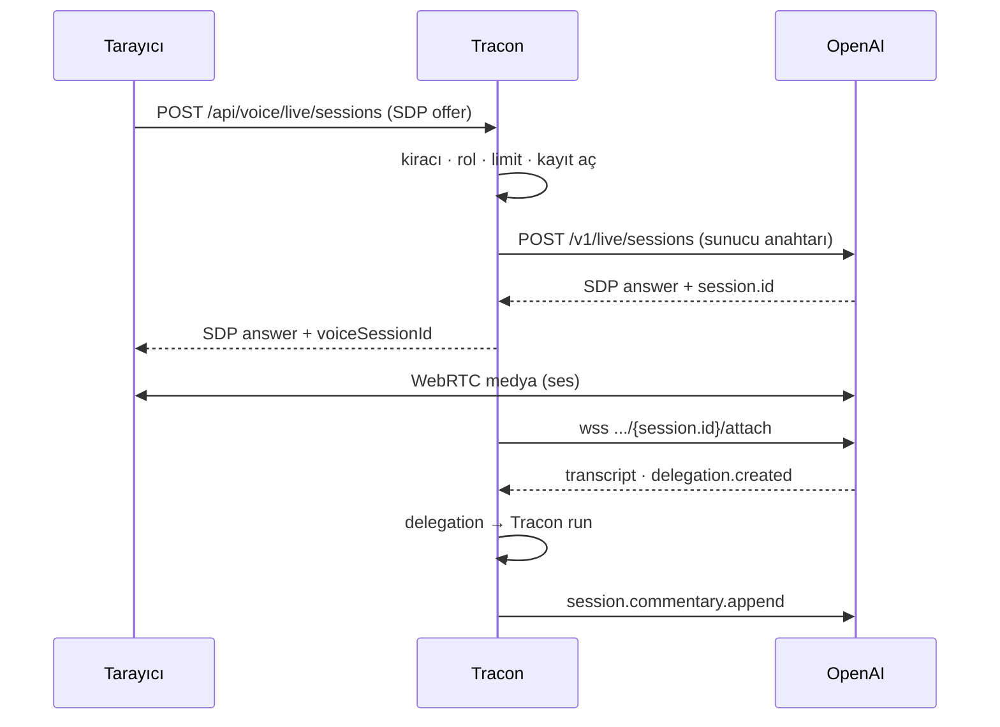

# Faz 161 — GPT-Live Sideband Denetimi

> **Durum:** ✅ Tamamlandı (2026-09-11)
> **Kaynak:** Kullanıcı isteği (2026-09-11) — bu kalem [ADAYLAR.md](../../ADAYLAR.md) içinde hiç bulunmadı. OpenAI GPT-Live'ı 2026-09-10'da API'ye açtı
> **Önkoşul:** [Faz 29](29-KONUSMA-KATMANI.md) — `VoiceSessionRecord`'u, uç kapılarını ve bağlantı limitleyicisini devralır
> **Paketler:** `Tracon.Abstractions`, `.Core`, `.OpenAI`, `.AspNetCore`, `.Sql.Shared`, `.PostgreSql`, `.SqlServer`, `.Sqlite`, `.Testing.Contracts.Xunit`
> **Yeni paket:** Yok — ham `ClientWebSocket` ve `HttpClient` (K-216 emsali) · **Migration:** Gerekli — üç set; numaralar uygulama anında alınır
> **Public API:** Büyüyor — `Tracon.Abstractions`'a iki arayüz, beş `record`, üç `enum`. `wc -l src/*/PublicAPI.Shipped.txt` = 17 satır (ölçüldü 2026-09-11); taban çizgisi **boştur**, bugün eklemek ucuzdur
> **Tüketici yüzeyi:** [`docs-site/src/content/docs/guides/voice.md`](../../../docs-site/src/content/docs/guides/voice.md) — canlı mod bölümü **ve kayıp/gizlilik listesi** · üretilen `api/` + `http-api/` sayfaları · sevk edilen: XML `<example>` blokları
> **Manuel test alanı:** [`docs/manuel-test/19-COK-MODLULUK-VE-SES.md`](../../manuel-test/19-COK-MODLULUK-VE-SES.md)

---

> ### ⚗️ Damıtılmış kayıt
> Bu dosya fazın **planını** değil, fazın bıraktığı **kalıcı bilgiyi**
> taşır. Plan gövdesi, planlanan/gerçekleşen API, dosya listesi, risk ve
> açık soru bölümleri kapanışta düştü — **silinmedi, git geçmişindedir.**
>
> Tam metin — kopyala, çalıştır:
>
> ```bash
> git show 16f0ae20:docs/arsiv/fazlar/161-GPT-LIVE-SIDEBAND-DENETIMI.md
> ```
>
> Damıtıldı 2026-09-11 · elle (damıtıcı, `Bu Faza Başlarken` içindeki fenced
> `awk` satırını başlık sanıp dokümanı ikiye böldü ve her yarıyı ayrı damıttı)

---

## Amaç

OpenAI, 2026-09-10'da **GPT-Live**'ı API'ye açtı: `gpt-live-1`, tam çift yönlü,
saniye bazlı faturalama. Model konuşmayı yürütür ve ağır işi **delegation** ile
arkaya devreder.

Bu faz, Tracon'i o delegation'ın **arkasına** koyar. Medyayı tarayıcı ile
OpenAI doğrudan WebRTC üzerinden taşır; Tracon iki yerde durur:

1. **Oturumu o yaratır** — SDP aracılığı yapar, böylece kiracı, rol, eşzamanlılık
   ve oturum kaydı kapıları uygulanabilir ve **ham API anahtarı tarayıcıya hiç
   gitmez**.
2. **Sideband ile bağlanır** — `session.delegation.created` olayını sıradan bir
   Tracon `run`'ına çevirir: tool registry, content guard, kota, maliyet ve
   denetim izi tam devrede.

Konuşmayı OpenAI yürütür, işi Tracon yapar.

- **Kapsam** — sunucu yeteneği. Gerçek koşum kanıtı için `samples/` altında küçük
  bir WebRTC test sayfası yazılır. `Tracon.UI` canlı paneli **Faz 162'dedir**.

### 🚨 161.0 Spike — ölçüldü, doküman yanlıştı

Bu faz bir tel spike'ıyla açıldı ve tasarımın ilk hâlini **çürüttü**. Kullanıcının
gerçek anahtarıyla `api.openai.com` üzerinde ölçülen sonuçlar (2026-09-11):

| Sonda | Sonuç |
|---|---|
| `GET /v1/models/gpt-live-1` | `200` — model erişilebilir |
| `POST /v1/live/sessions` · `transport.type: websocket` | `400` — **"Only the webrtc transport is supported."** |
| `POST /v1/live/sessions` · `transport.type: ws` | `400` — aynı |
| `POST /v1/live/sessions` · `transport.type: webrtc` | `400` `invalid_value` / `transport.sdp` — **"An SDP offer is required."** yani geçerli |
| `POST /v1/live/sessions` · `transport.type: sip` | `403` `outbound_sip_not_enabled` — bu organizasyonda kapalı |
| `POST /v1/live/sessions` gövdesi `{"transport":{...},"session":{...}}` | `invalid_offer` (SDP ayrıştırma) — **şekil doğru** |
| `POST /v1/live/client_secrets` | `404` — GPT-Live için ephemeral token ucu **yoktur** |
| `POST /v1/realtime/client_secrets` | `200`, `ek_…` döner — ama `session.type` = `realtime`, GPT-Live değil |
| `wss /v1/live/sessions/{bilinmeyen}/attach` | `404` — uç yanıt veriyor |

**Sonuç:** OpenAI, `gpt-live-1` için **sunucu taraflı ses transport'u sunmuyor.**
Dokümandaki "WebSockets for server-side audio integrations" ifadesi
`gpt-realtime-2.1` için doğrudur, `gpt-live-1` için değildir. Bir sunucu köprüsü
(Tracon'in sesi geçirmesi) **yapılamaz**.

Buna karşılık **sunucu sideband'i resmen desteklenir**:
`wss://api.openai.com/v1/live/sessions/{session_id}/attach`, oturumu yaratan
projenin API anahtarıyla. Doküman: *"Both connections share one session while
WebRTC or SIP carries the primary audio."*

Bu, güvenlik hikâyesini **iyileştirdi**: ephemeral token'a gerek yok, çünkü oturumu
Tracon kendi anahtarıyla yaratır.



### K-222 ile ilişki — dürüst kayıt

K-222 Seçenek A'yı seçti ve Seçenek B'yi şu koşulla açık bıraktı: *"Ölçülen gecikme
kabul edilemez bulunursa Seçenek B **ek bir mod** olarak eklenir; kaybedilenler
açıkça yazılır."*

🚨 **Bu fazın gerekçesi o koşul değildir. Seçenek A'nın gecikmesi ölçülmedi.**
Gerekçe farklıdır: GPT-Live, Seçenek A'nın **yapısal olarak üretemeyeceği** bir
yetenek sınıfı sunar — tam çift yönlülük, sağlayıcı tarafı VAD, konuşurken dinleme.
Seçenek A tek turludur; ne kadar hızlanırsa hızlansın çift yönlü olmaz.

Kararın ikinci şartına uyulur: kayıplar aşağıdadır ve `docs-site/guides/voice.md`
içine de girer.

### 🚨 Bu yolda neyi kaybediyoruz

| Kayıp | Ayrıntı |
|---|---|
| **Ses Tracon'e hiç uğramaz** | Medya tarayıcı ile OpenAI arasında akar. Content guard konuşulanı **görmez**; model, Tracon'in hiç denetlemediği bir cümle söyleyebilir |
| **Her tur bir `run` değildir** | Yalnız **delegation'lar** run üretir. Token muhasebesi, kota ve guard yalnız **devredilen işi** kapsar |
| **`PersistAudio` bu yolda anlamsızdır** | Saklanacak ses Tracon'den geçmiyor. Seçenek A'da kalır, canlı yolda yok sayılır |
| **Kullanıcının sesi üçüncü tarafa gider** | K-225 saklamayı yasaklar; bu bir **iletim** değişikliğidir ama kullanıcıya görünür olmalıdır |
| **🚨 Konuşma metni Tracon deposunda kalıcı olur** | Kullanıcı kararı (2026-09-11): transcript'ler `AgentSession` geçmişine yazılır. K-225 sesi korur, **metni değil**. Bu yeni bir gizlilik kararıdır ve 161.4'te ele alınır |
| **Kendi STT/TTS sağlayıcımız devre dışı** | `ISpeechTranscriber`/`ISpeechSynthesizer` bu yolda çağrılmaz |
| **Harcama tavanı yalnız süre/bağlantı limitidir** | K-227 ses dakikasını kota birimi saymaz. `QuotaEnforcer` değil, `MaxConnectionDuration` ve `MaxConcurrentConnectionsPerTenant` sınırlar |
| **Telefon (SIP) kapsam dışı** | Spike'ta `403 outbound_sip_not_enabled` ölçüldü — organizasyonda etkin değil |

Bu kayıplar **Seçenek A'yı geçersiz kılmaz**. Realtime API'si olmayan her sağlayıcı
için Seçenek A doğru seçimdir ve bu fazda ona **dokunulmaz**.

### Bugün ne çalışmıyor — doğrulanmış kanıt

| Kanıt | Gözlem |
|---|---|
| `grep -rln ClientWebSocket src tests samples` → boş | Repo'da **hiç** giden WebSocket yoktur; bu fazınki ilkidir |
| [`ConversationContracts.cs:18`](../../../src/Tracon.Abstractions/Voice/ConversationContracts.cs) | `VoiceSessionRecord` maliyet, `Provider` ve `Model` alanı **taşımaz** |
| [`TraconOptions.cs:715`](../../../src/Tracon.Core/TraconOptions.cs) | `VoicePriceOverride.PerMinute` **zaten vardır ve bağlanır** — fiyat şeması değişmez |
| [`SpeechContracts.cs`](../../../src/Tracon.Abstractions/Voice/SpeechContracts.cs) | `IVoicePricingReader` yüzeyinde süre fiyatlaması yoktur |
| [`SqlVoiceSessionStore.cs:71`](../../../src/Tracon.Sql.Shared/Stores/SqlVoiceSessionStore.cs) | `Read` **çıplak ordinal** kullanır (0–10) |
| [`EgressSocketGuard.cs:109`](../../../src/Tracon.Core/Egress/EgressSocketGuard.cs) | `ValidateAsync(Uri, ct)` bağımsız çağrılabilir — `ClientWebSocket`'in `ConnectCallback`'i yoktur |
| [`AmbientTenantScope.cs`](../../../src/Tracon.Abstractions/Tenancy/AmbientTenantScope.cs) · `AgentRunJobHandler.cs:68` | İstek dışında kiracı bağlamanın sevk edilmiş yolu budur |
| `wc -l src/*/PublicAPI.Shipped.txt` = 17 | Taban çizgisi on yedi pakette de boştur |

> Kanıtlar 2026-09-11 tarihinde doğrulandı.

### Hâlâ doğrulanmamış — uygulamanın ilk işi

Spike, oturum **yaratmayı** doğruladı ama gerçek bir oturum açmak WebRTC istemcisi
gerektirdiği için sideband'in **içi** ölçülmedi:

| İddia | Durum |
|---|---|
| `session` nesnesinin kabul ettiği alanlar (`model`, `voice`, `instructions`, delegation modu) | **Doğrulanmadı** — geçerli bir SDP ile ölçülmeli |
| Attach soketinin yaydığı olay adları ve gövdeleri | **Doğrulanmadı** |
| `session.delegation.created` alanları, özellikle `offset_ms` | **Doğrulanmadı** — 161.3 buna dayanıyor |
| Append olayları ve 500-token sınırı | **Doğrulanmadı** — sınır **ölçülmeli**, varsayılmamalı |
| Tarayıcı WebRTC'yi kapatınca sideband'in gördüğü olay | **Doğrulanmadı** — süre ölçümü buna bağlı (161.5) |
| Sideband'in konuşmayı kesebilmesi (`interrupt`) | **Doğrulanmadı** — mümkün değilse `InterruptAsync` sözleşmeden düşer |

🚨 Uygulamanın **ilk iş kalemi**, `samples/` altındaki test sayfasıyla gerçek bir
oturum açıp attach soketinin **ham dökümünü** almaktır. Döküm "Plandan Sapmalar"a
yazılır; 161.3 ve 161.5 ona göre düzeltilir.

**MAF için `maf-api-kesfi` gerekmez.** Kullanılan her MAF tipi mevcut sürücüde
zaten var (ölçüldü): `AgentSessionManager`
([`:60`](../../../src/Tracon.Core/Voice/VoiceConversationDriver.cs)),
`ChatHistoryProvider` (`:63`), `AgentSession` (`:211`), `RunStreamingAsync` +
`ChatMessage` + `TraconRunOptions` (`:643`),
`ChatHistoryProvider.InvokedContext` + `MAAI001` (`:759`).

---

## Plandan Sapmalar

Faz bir tel spike'ıyla açıldı; spike'ın **tamamı tekrar ölçüldü ve doğrulandı**
(`GET /v1/models/gpt-live-1` → 200 · `transport.type: websocket` → 400 "Only the
webrtc transport is supported." · `webrtc` SDP'siz → 400 `transport.sdp` ·
`/v1/live/client_secrets` → 404). Sonra planın **doğrulanmamış** bıraktığı altı
maddenin hepsi gerçek bir oturumla kapatıldı.

### Ham döküm nasıl alındı

Plan "👤 insan gerekir" diyordu. Gerekmedi: macOS `say` ile sentetik konuşma
üretildi, sonuna 14–20 sn sessizlik eklendi (sağlayıcının VAD'i tur sonunu ancak
böyle görüyor) ve Chromium `--use-file-for-fake-audio-capture` ile bunu **gerçek
mikrofon** olarak sundu. Gerçek WebRTC, gerçek transcript, gerçek delegation.

🚨 **Sessizlik eklemek şart.** İlk denemede ses dosyası döngüde çalındı, kullanıcı
hiç susmadı ve model **hiç sıra alamadı** — 117 transcript delta geldi, tek
delegation gelmedi.

### Ölçülen protokol — planın bilmediği her şey

Ölçülen protokolün tamamı — kabul edilen istemci olayları, yayılan olaylar ve
gövdeleri — [`hafiza/ses-ve-konusma.md`](../../hafiza/ses-ve-konusma.md) içindedir
ve orada yaşar: bir sonraki oturum onu alan dosyasında arar, faz kaydında değil.

### Sapmalar (yedi kalem)

| # | Plan | Gerçek | Sonuç |
|---|---|---|---|
| 1 | Append alanı `text` | **`content`** | Sözleşmede `Text`, telde `content`. |
| 2 | `Instructions`'ta `delegation_id` null = oturum geneli | **Üç kanalda da zorunlu** (`Missing required parameter: 'delegation_id'`) | `LiveVoiceAppend.DelegationId` **`required`** oldu. |
| 3 | `Usage` olayı **modellenmez** ("Tracon ölçüm uydurmaz") | `session.usage.updated` **var** ve saniyeyi sağlayıcı bildiriyor | 🚨 En değerli sapma. `LiveSeconds` **duvar saati değil**, sağlayıcının sayısı. Açık Soru 2 hem A'yı hem B'yi geçersiz kıldı. |
| 4 | Transcript'te `IsFinal` | **`is_final` yok** — yalnız `start_ms`/`end_ms` taşıyan delta | `IsFinal` düştü; `StartMilliseconds`/`EndMilliseconds` geldi. Defter `TimeProvider` kullanmıyor: sağlayıcı zamanı veriyor, yerel saat **kayardı**. |
| 5 | `ResponseStarted`/`ResponseCompleted` kind'ları | Böyle olay **yok** | Modellenmedi. Gözlenmeyen olay sözleşmeye girmez. |
| 6 | "Ses Tracon'e **hiç** uğramaz" | Sideband sesi **aynalıyor** | Kayıp listesi düzeltildi: ses görünür ama bu faz tüketmiyor — imkânsızlık değil, **tasarım tercihi**. |
| 7 | `MaxAppendCharacters` "belgelenmiş sınır × oran" | Sınır ölçüldü: **500 token** (`"Context append text must not exceed 500 tokens."`) | Oran tek yerde: `ProviderAppendTokenLimit × ConservativeCharactersPerToken` = 1000 karakter. |

Ayrıca planda olmayan bir dosya eklendi: **`LiveVoiceSessionLauncher`**. Uç
katmanı host'u doğrudan kuramazdı — "limit → çöz → yarat → attach → kaydet"
sırasının tek yerde durması gerekiyordu. Gerekçe: 429'un sağlayıcı çağrısından
**önce** olması bir sıra iddiasıdır ve iddia HTTP katmanına dağılırsa kaybolur.

### Kapıların yakaladıkları

Mimari kapıları üç gerçek bulgu üretti:

1. `RunAuthorizationCoverageTests` — kapı çağrılarını `VoiceEndpointGates`'e
   taşımak dosya başına sayımı düşürdü. Beklenti haritası **yeni dosyaya**
   taşındı, gevşetilmedi.
2. `ShippedDocumentationSelfContainmentTests` — 31 XML doküman satırı 🚨/K-NNN
   taşıyordu. Hepsi tüketici sesine çevrildi; repo-içi gerekçeler `//` yorumuna
   indi. **Taban çizgisi yeni borç almadı.**
3. `SeamContractDocumentationTests` — iki yeni arayüz yaşam döngüsü/kiracı/teslim
   boyutlarını yazmamıştı. Üçü de belgelendi.

### Gerçek koşumda bulunan kusur

`LiveVoiceEndpoints.CreateAsync` yalnız `TraconException` yakalıyordu. Egress
politikası reddi **`HttpRequestException` içine sarılı** geliyor; sıradan ve
çağıran kaynaklı bir ret **yakalanmamış 500** olarak kaçıyordu.
`LiveVoiceEgressTests` bunu üretti, `catch` genişletildi ve `Describe` iç istisnayı
açıp operatöre değiştirmesi gereken ayarın adını veriyor.

## Bu Fazda Verilen Kararlar

| # | Karar |
|---|---|
| K-745 | **Canlı oturumun faturalanan süresi sağlayıcının bildirdiği sayıdır.** Tracon canlı yolda medyayı taşımaz; duvar saati faturayla çelişir. Sağlayıcı bildirmezse `LiveSeconds` `null` kalır — sıfır değil. |
| K-746 | **`VoiceSessionCost` iki terimli bir `record`'dur ve toplamı yalnız `Total()` yapar.** Düz `decimal?` her çağıranı "hangi terim?" kararına zorlar; elle tekrarlanan toplam üçüncü terimde sessizce kaybolur (K-483 sınıfı). Hiçbir terim fiyatlanmadıysa `Total()` `null` döner. |
| K-747 | **Canlı ses append'i her kanalda bir `delegation_id` taşır.** Ölçüldü: sağlayıcı oturum geneli append'i reddediyor. Canlı modelin kendi yönergesi oturum yaratılırken verilir. |
| K-748 | **Delegation olayı agent seçemez.** Agent oturum yaratılırken bir kez çözülür. Olay sağlayıcıdan gelir, kiracı sınırını geçer ve güvenilmez girdidir; agent seçtirmek prompt injection ile ayrıcalıklı bir agent'a erişim demektir. |
| K-749 | **Eşzamanlılık limiti sağlayıcı çağrısından ÖNCE uygulanır.** Yaratılıp sonra reddedilen oturum yine faturalanır. Sıra `LiveVoiceSessionLauncher`'da tek yerde durur. |
| K-750 | **Canlı yolda konuşma METNİ varsayılan olarak kalıcıdır; ses hiç saklanmaz.** K-225 sesi korur, metni değil. `PersistTranscript` kapatılabilir ve değeri oturum yaratma yanıtında bildirilir — sessiz kayıt yok. |
| K-751 | **Giden WebSocket egress politikasını `ValidateAsync` ile ELDE çağırır.** `ClientWebSocket`'in `ConnectCallback`'i yoktur; çağrı olmazsa politika sessizce atlanır. Test maddesidir, yorum değil. |
| K-752 | **Ses yüzeyinin 404 gövdesini tek bir yazar üretir** (`VoiceEndpointGates`). İki elle yazılmış kopya K-687'nin ihlalidir: ret ile yokluk ayırt edilirse durum kodu başka kiracının oturum kimlikleri için oracle olur. |

## Denetim Bulguları

Bağımsız denetçi (taze bağlam, yalnız DoD + diff) **dört 🔴 ve yedi 🟡** üretti.
Dördü de gerçekti; hiçbiri gerekçelenerek kapatılmadı, hepsi düzeltildi.

### 🔴 Kapatılanlar

| # | Bulgu | Düzeltme |
|---|---|---|
| 1 | **Üç yeni HTTP ucu sevk edilen OpenAPI belgesinde yoktu.** Snapshot üreteci "her opsiyonel ucu açık" üretmeyi taahhüt ediyor ama `UseLiveVoice()` çağırmıyordu; `grep -c "voice/live" docs/openapi/tracon.json` → **0**. .NET/TypeScript istemcileri ve `http-api/` sayfaları üç ucu hiç görmezdi — üstelik `guides/voice.md` "In the reference" diyerek oraya işaret ediyordu. | `OpenApiSnapshotTests.GenerateAsync` artık `UseOpenAI` + `UseOpenAILive` + `UseLiveVoice` kuruyor; snapshot yenilendi. |
| 2 | **Transcript'in geçmişe yazıldığını (ya da yazılmadığını) kanıtlayan tek bir test yoktu.** Üç gizlilik testi yalnız yanıttaki `persistTranscript` alanını okuyordu. `FlushHistoryAsync`'i gövdesiz bırakmak hiçbir testi kırmazdı — 161.4'ün tamamı test edilmemişti. | `LiveVoiceLifecycleTests` iki yönü de oturum geçmişini **okuyarak** doğruluyor. |
| 3 | **`CloseAsync` süpürge ve sunucu kapanışı yolunda ambient kiracısız koşuyordu.** Kiracı yalnız `PumpAsync`'in gövdesinde açılıyordu; `SweepAsync` ve `LiveVoiceShutdownService` host'u pump'ın **dışından** kapatıyor ve `FlushHistoryAsync` orada `_tenantContext.TenantId` okuyor. Çok kiracılı bir kurulumda `MaxSessionDuration` ile biten oturumun geçmişi `default` kiracıya yazılır, kiracı kapsamlı güncelleme satırı bulamaz, `VoiceHistoryWriter` istisnayı yutar ve **transcript sessizce kaybolur**. 🚨 Fazın kendi "en olası sessiz kusuru" ile aynı sınıf, başka yol. | `CloseAsync` kendi gövdesinde de `AmbientTenantScope.Begin` açıyor. |
| 4 | **`VoiceSessionEndReason.Abandoned` üretilemezdi.** `AttachAsync` durumu hemen `Active` yapıyordu, yani `Pending` yalnız sağlayıcı çağrısı süresince yaşıyordu ve süpürge terk edilmiş bir oturumu asla göremezdi. XML dokümanı, `docs-site` ve **MT-MM-116** gerçekleşemeyecek bir davranış vaat ediyordu. | Attach artık durumu değiştirmiyor: ölçüldü, `session.started` tarayıcı hiç bağlanmasa da geliyor. Durum yalnız **medya kanıtı** olan bir olayda (`InputTranscript` · `OutputTranscript` · `DelegationCreated`) `Active` olur; medya akmadan gelen sağlayıcı kapanışı `Abandoned` yazılır. İki dal da test edildi. |

### 🟡 Kapatılanlar

| # | Bulgu | Düzeltme |
|---|---|---|
| 5 | İptal edilen delegation'ın kısmi çıktısı **asla** geçmişe yazılmıyordu: `SpokenText` `try/catch`'ten sonra atanıyor, `throw;` atamayı atlıyordu — çağıranın "yarım cümleyi yaz" dalı ölü koddu. | Atama `finally`'ye alındı. |
| 6 | `LiveTranscriptLedger` kilitsizdi ve yarış **bugünkü varsayılanda** vardı (pump ↔ tek delegation), devir notunun iddia ettiği gibi yalnız yükseltilmiş eşzamanlılıkta değil. | Her üye `_entries` üzerinde kilitleniyor; `Entries` yerine kopya döndüren `Snapshot()`. Devir notu düzeltildi. |
| 7 | Ölen sideband `EndReason.Client` yazıyordu — "kullanıcı kapattı". `ReceiveAsync` `WebSocketException`'ı yutup `yield break` ediyordu ve pump numaralandırmayı normal bitmiş görüyordu. Sağlayıcı kesintisini araştıran operatör kaydı asla bulamazdı. | Sideband bir `Error` olayı yayıyor; host `EndReason.Error` yazıyor. Test eklendi. |
| 8 | `MaxConcurrentSessionsPerTenant` kontrolü **atomik değildi**: `CountFor` ile `Add` arasında CAS yoktu, iki eşzamanlı istek ikisi de limitin altını görüp geçiyordu. Aynı klasördeki `VoiceConnectionLimiter` bu tuzağı yorumla belgeliyordu. | `Registry.TryAdd(host, limit)` — tek compare-and-swap; rezervasyonun kendisi limit kontrolü. Slot `Release` ile geri veriliyor. |
| 9 | Sevk edilen XML dokümanı var olmayan bir çapraz kontrol testini ve var olmayan bir ikinci kopyayı iddia ediyordu. Ayrıca `ShouldBe(28.5m / 60m * 0.10m)` implementasyonu implementasyonla karşılaştıran totolojik bir iddiaydı. | Doküman "formül **yalnız burada**" diyor; test elle hesaplanmış değerlere ve gerçek koşumun sayısına (57 sn × 0,60 → 0,57) sabitlendi. |
| 10 | `With_no_price_configured_the_cost_is_null_NOT_zero` boşlukta geçiyordu: `WaitForAsync(() => true)` anında dönüyor, `LiveSeconds` `null` kalabiliyor ve `cost` zaten `null` oluyordu — fiyatlama kodu silinse de test geçerdi. | Süre gerçekten beklenıyor ve `LiveSeconds.ShouldBe(30m)` iddiası eklendi: "fiyatlanmadı" ile "ölçülmedi" artık ayrı. |
| 11 | Planın adlandırdığı dört test sınıfı yazılmamıştı ve **append'lerin content guard'dan geçtiğini kanıtlayan test yoktu** — fazın "bu bir yorum değil, bir test maddesidir" dediği sınıfın komşusu. | `LiveVoiceLifecycleTests`: guard çağrılıyor · bloklanan append sağlayıcıya **gitmiyor** · `MaxConcurrentDelegations` aşımı run açmıyor ve "meşgul" diyor · kapanış akan delegation'ı iptal ediyor · üç `EndReason` dalı. |

### Denetimin zinciri: bulgu 1'in arkasından çıkanlar

🔴 1'i kapatmak (OpenAPI'a canlı katmanı açmak) **üç ardıl bulgu** üretti — hepsi
denetçinin işaret ettiği "belge → istemciler → site" zincirinin doğrulanması:

1. **`ClientCoverageTests` kırıldı**: belgede artık var olan üç `operationId`'nin
   istemcilerde karşılığı yoktu. Dört adımlı yeniden üretim koşuldu
   (`nswag-prepare-document.py` → `dotnet nswag run` →
   `nswag-postprocess-client.py` → `generate-client-json-context.py`) ve
   `@tracon/client` şeması yenilendi.
2. **🚨 Üretilen istemci metotları `Task` dönüyordu, `Task<T>` değil.** Uçlar
   `HttpContext` üzerinden yazdığı için hiçbir şey yanıt şeklini çıkarmıyordu ve
   `.Produces<T>` üstverisi yoktu — yani **çağıran SDP yanıtına hiç ulaşamıyordu**.
   Üç uca da açık `.Produces`/`.ProducesProblem` üstverisi eklendi; bu denetimin
   3.8 maddesinin ("yeni HTTP ucu `.Produces` taşıyor mu") gerçek bir vakasıydı.
3. `ClientDescriptionBaselineTests` 395 → 396. Sebep incelendi:
   `VoiceSessionCost? Cost` bir `$ref` özelliğidir ve NSwag bu şekle açıklama
   yazmaz — `RunCost? Cost` (iki kez) ve `RunTreeCost? TreeCost` zaten aynı
   sebeple taban çizgisindedir. Kaybolmuş bir açıklama değil, yeni ve aynı
   sınıftan bir yüzey; taban çizgisi bu gerekçeyle bir artırıldı.

### Site senkron kuralları — ikisi gerekçelendi

`dokuman-bakim.py --site-denetle` dört kural tetikledi. İkisi gerçek tüketici
bilgisi taşıyordu ve **yazıldı**:

- `cekirdek-kavram` → [`concepts/sessions.md`](../../../docs-site/src/content/docs/concepts/sessions.md):
  canlı oturumun transcript'i **aynı oturum geçmişine** yazılıyor; bu okuma
  yüzeyini değiştiren bir gerçektir ve gizlilik bölümüne bağlandı.
- `buildtransitive` → `capabilities.md`: yeni yetenek ve giriş noktaları eklendi.

İkisi **gerekçelendi** (`--site-gerekce-yazildi`):

- **`kalicilik` → `getting-started/persistence.md`.** Kural üç lehçenin sorgu
  metni değiştiği için tetiklendi. Sayfa tabloların şemasını değil, **migration
  mekanizmasını** anlatır (otomatik uygulama, kilit, şema izolasyonu, `migrate`
  adımı) ve o mekanizmanın hiçbir parçası değişmedi: `voice_sessions`'a altı
  sütun eklendi, yeni tablo yok, yeni kilit yok, yeni adım yok. Sütun listesi bu
  sayfada hiç yoktu; eklemek sayfayı bir şema referansına çevirirdi ve şema
  referansının yeri `http-api/` üretilen sayfalarıdır — `VoiceSessionRecord`'un
  yeni alanları oraya **zaten girdi**.
- **`model-saglayici` → `getting-started/first-agent.md`.** Kural
  `src/Tracon.OpenAI/Live/` yeni olduğu için tetiklendi. O sayfa ilk agent'ı
  ayağa kaldıran yürüyüştür ve tek bir sohbet modeli kaydeder; saniye bazlı
  faturalanan bir canlı ses bağlantısını oraya koymak yeni başlayan okuru
  yanlış yere götürürdü. Sağlayıcı kaydının gerçek yeri
  [`guides/model-providers.md`](../../../docs-site/src/content/docs/guides/model-providers.md)'dir
  ve oraya **"Live voice providers" bölümü eklendi** — görüntü kaydının
  (`UseOpenAIImages`) yanına, aynı gerekçeyle: "bu ayrı bir kayıt çünkü sohbet
  modelinden çıkarsanamaz".

### 🟢 Aday listesine alınmayanlar

Üç 🟢 bulgu da kapsam dışı veya zararsızdı ve `ADAYLAR.md`'ye girmedi: `BackendModel`
bilerek ileri tarihli (Açık Soru 4), SDP sızıntı testinin iddiası zaten düşemez
(gerçek koruma `OpenAILiveProvider`'da ve doğru), `HttpClient` timeout'unun
`IOptionsMonitor` yeniden yüklemesini izlememesi tüm sağlayıcılarda aynı desen.

### Denetimin doğruladıkları

Temiz çıkan başlıklar: test seviyeleri · imza-gövde kayması (altı yeni sütun üç
lehçede ve `Read` ordinal 11–16'da birebir) · plan dışı public API yok · repo
kuralları (İngilizce, `TryAdd*`, varsayılan kapalı, MAF sarmalanmamış, `secret`
sızmıyor, `ConfigureAwait(false)`) · sevk edilen metinde iç referans yok · egress
iki yarıda da devrede · 429 sağlayıcıdan önce · başka kiracının 404'ü bayt bayt aynı
· kiracı sızıntısı testi gerçek · `store` hata verince `run` devam ediyor · hiçbir
muafiyet listesi veya taban çizgisi büyümedi.

## Sonraki Faza Devir Notu

**Gerçek koşum kanıtı (2026-09-11).** `samples/Tracon.Api` + sentetik mikrofon:
WebRTC bağlandı, model sesli yanıt verdi, iki delegation gerçek `runs` satırı
üretti (biri `get_order_status` tool'unu `orderId: 442` ile çağırdı, yanıt sesli
döndü). Kayıt: `provider: openai · model: gpt-live-1 · liveSeconds: 57.0 ·
cost.durationCost: 0.57 USD · turns: 3 · endReason: Client`. Fiyat yapılandırması
kaldırılınca `cost` `null` döndü.

**Faz 162'ye açık kalanlar:**

- **`Responses` delegation modu.** Sözleşmede var, `NotSupportedException` atıyor.
  Sağlayıcı `session.delegation.type` için `responses` değerini kabul ediyor
  (ölçüldü); uygulaması yapılmadı.
- **`Tracon.UI` canlı paneli.** Bu fazda arayüz payı yok; `live-test.html`
  bir örnek varlığıdır, paketlenmez.
- **`tracon.voice.session.cost` metriği.** Kayıt maliyeti taşıyor, metrik yok.
- **🚨 Sideband sesi aynalıyor** (`session.input_audio.append` /
  `session.output_audio.delta`). Bu faz frame'leri yok sayıyor. Content guard'ın
  konuşulanı görmesi istenirse giriş **buradadır** — ama o zaman ses Tracon'e
  uğrar ve K-225'in saklama yasağı yeniden ele alınmalıdır.
- **`response.item.create` / `response.create`** kabul ediliyor ama kullanılmıyor.
  Delegation sonucunu `commentary.append` yerine konuşma öğesi olarak enjekte etmek
  isteyen bir faz buradan başlar.
- **Defter artık kilitli** (denetim bulgusu 6). Yarış bugünkü varsayılanda da
  vardı: pump `Append` ederken delegation görevi `Cut` çağırıyor. Kilit
  `_entries` üzerindedir ve `Snapshot()` kopya döndürür. Bu alana yeni bir üye
  eklenirse **kilit içinde** olmalıdır.

## Bitiş Ölçütleri (DoD)

- [x] `samples/.../live-test.html` ile gerçek bir GPT-Live oturumu açıldı; konuşuldu ve sesli yanıt alındı
- [x] Bir delegation gerçek bir `runs` satırı üretti; satırda maliyet ve denetim izi var
- [x] Attach soketinin ham olay dökümü alındı ve "Plandan Sapmalar"a yazıldı
- [x] `GET /api/voice/sessions` kaydında `provider`, `model`, `liveSeconds`, `cost.durationCost` dolu
- [x] Fiyat yapılandırması yokken `cost` **`null`** döndü, `0` değil
- [x] 🚨 Çok kiracılı kurulumda delegation run'ı **doğru kiracıya** yazıldı — testle kanıtlandı
- [x] 🚨 429, sağlayıcı çağrısından önce döndü — reddedilen istek faturalanan oturum yaratmadı
- [x] `PersistTranscript=false` iken geçmişe yazılmadı ve yanıt bunu bildirdi
- [x] `UseOpenAILive()` yokken `501`; `UseLiveVoice()` de yokken `404`
- [x] Mevcut `VoiceConversationTests` **değiştirilmeden** yeşil (Seçenek A regresyon çiti)
- [x] `EgressSocketGuard` hem giden sokette hem REST çağrısında devrede — testle kanıtlandı
- [x] Dört doğrulama kapısı sıfır uyarı verir
- [x] `samples/Tracon.Api` ile gerçek `run` yapıldı, çıktı belgeye yazıldı
- [x] `secret` taraması boş döndü
- [x] Manuel kabul case'leri `docs/manuel-test/19-COK-MODLULUK-VE-SES.md` içine eklendi; otomatikleştirilebilenler koşuldu
- [x] `faz-denetim` koşuldu; 🔴 bulgu kalmadı
- [x] `docs-site/guides/voice.md` canlı mod bölümünü, **kayıp listesini ve gizlilik notunu** içeriyor; `npm run build` + `check-links.mjs` temiz

### Doğrulama komutları

```bash
python3 scripts/kapi.py kapanis --taban f7fc7cb9
MSBUILDDISABLENODEREUSE=1 dotnet build -c Release

./artifacts/bin/Tracon.AspNetCore.FunctionalTests/release/Tracon.AspNetCore.FunctionalTests \
  --filter-method "*LiveVoice*"

TRACON_SQL_SNAPSHOT_REFRESH=1 dotnet test
curl -s http://localhost:5081/tracon/api/voice/sessions -H "Authorization: Bearer $TOKEN"
python3 scripts/dokuman-bakim.py --denetle
```

---
