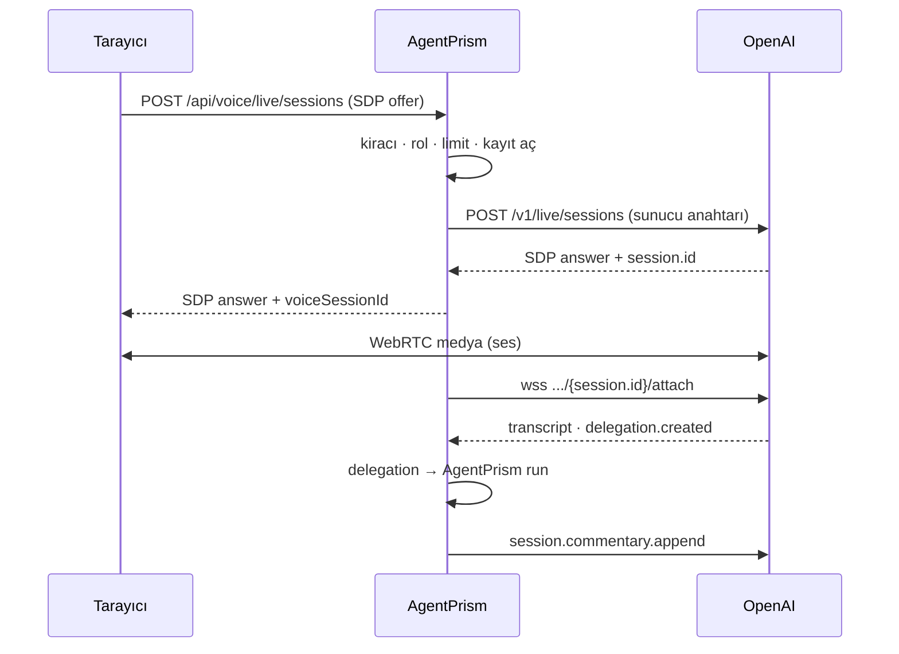
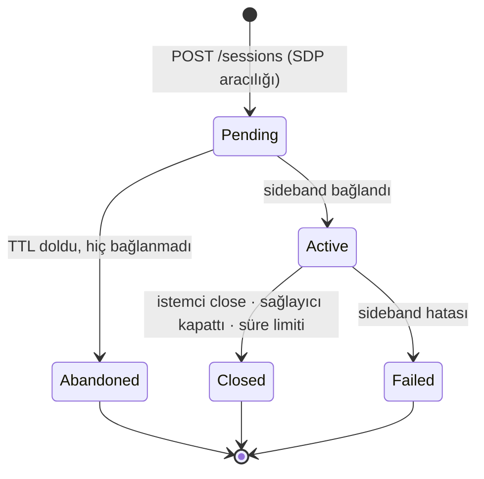

# Faz 161 — GPT-Live Sideband Denetimi

> **Durum:** ✅ Tamamlandı (2026-09-11)
> **Kaynak:** Kullanıcı isteği (2026-09-11) — bu kalem [ADAYLAR.md](../../ADAYLAR.md) içinde hiç bulunmadı. OpenAI GPT-Live'ı 2026-09-10'da API'ye açtı
> **Önkoşul:** [Faz 29](29-KONUSMA-KATMANI.md) — `VoiceSessionRecord`'u, uç kapılarını ve bağlantı limitleyicisini devralır
> **Paketler:** `AgentPrism.Abstractions`, `.Core`, `.OpenAI`, `.AspNetCore`, `.Sql.Shared`, `.PostgreSql`, `.SqlServer`, `.Sqlite`, `.Testing.Contracts.Xunit`
> **Yeni paket:** Yok — ham `ClientWebSocket` ve `HttpClient` (K-216 emsali) · **Migration:** Gerekli — üç set; numaralar uygulama anında alınır
> **Public API:** Büyüyor — `AgentPrism.Abstractions`'a iki arayüz, beş `record`, üç `enum`. `wc -l src/*/PublicAPI.Shipped.txt` = 17 satır (ölçüldü 2026-09-11); taban çizgisi **boştur**, bugün eklemek ucuzdur
> **Tüketici yüzeyi:** [`docs-site/src/content/docs/guides/voice.md`](../../../docs-site/src/content/docs/guides/voice.md) — canlı mod bölümü **ve kayıp/gizlilik listesi** · üretilen `api/` + `http-api/` sayfaları · sevk edilen: XML `<example>` blokları
> **Manuel test alanı:** [`docs/manuel-test/19-COK-MODLULUK-VE-SES.md`](../../manuel-test/19-COK-MODLULUK-VE-SES.md)

---

## Bu Faza Başlarken

> `faz-baslangic` skill'ini uygula. Aşağıdaki liste o skill'in 2. adımıdır —
> **tamamını değil, yalnız işaret edilen bölümleri oku.**

1. Bu doküman
2. Kararlar — dosyanın tamamını **okuma**, yalnız bu kalemleri grep'le:
   ```bash
   grep -n "K-215\|K-216\|K-219\|K-221\|K-222\|K-225\|K-226\|K-227\|K-320\|K-483\|K-687" docs/KARARLAR.md
   ```
   **K-222** (Seçenek A; Seçenek B ek mod olarak açık) · **K-225** (kullanıcının
   sesi saklanmaz) · **K-227** (ses dakikası kota birimi değildir) · **K-219** (ses
   maliyeti token maliyetiyle toplanmaz) · **K-215/K-216** (sözleşme Abstractions'ta,
   ses paketi NuGet almaz) · **K-320** (yapısal iddiayı grep'le ölç) · **K-483**
   (toplama alan `record`'a `Total()` ver) · **K-687** (yetki reddi 404)
3. [`arsiv/fazlar/29-KONUSMA-KATMANI.md`](29-KONUSMA-KATMANI.md) —
   yalnız devir notu:
   ```bash
   awk '/## Sonraki Faza Devir Notu/,0' docs/arsiv/fazlar/29-KONUSMA-KATMANI.md
   ```
4. Alan hafızası (üç alan):
   [`hafiza/ses-ve-konusma.md`](../../hafiza/ses-ve-konusma.md) ·
   [`hafiza/cekirdek-calistirma.md`](../../hafiza/cekirdek-calistirma.md)
   (`Activity`/`AsyncLocal` akışı — bu fazın en büyük tuzağı burada) ·
   [`hafiza/openai-saglayici.md`](../../hafiza/openai-saglayici.md)
5. Gerektiğinde: [`MIMARI-GUVENLIK.md`](../../MIMARI-GUVENLIK.md) — ses satırı

---

## Amaç

OpenAI, 2026-09-10'da **GPT-Live**'ı API'ye açtı: `gpt-live-1`, tam çift yönlü,
saniye bazlı faturalama. Model konuşmayı yürütür ve ağır işi **delegation** ile
arkaya devreder.

Bu faz, AgentPrism'i o delegation'ın **arkasına** koyar. Medyayı tarayıcı ile
OpenAI doğrudan WebRTC üzerinden taşır; AgentPrism iki yerde durur:

1. **Oturumu o yaratır** — SDP aracılığı yapar, böylece kiracı, rol, eşzamanlılık
   ve oturum kaydı kapıları uygulanabilir ve **ham API anahtarı tarayıcıya hiç
   gitmez**.
2. **Sideband ile bağlanır** — `session.delegation.created` olayını sıradan bir
   AgentPrism `run`'ına çevirir: tool registry, content guard, kota, maliyet ve
   denetim izi tam devrede.

Konuşmayı OpenAI yürütür, işi AgentPrism yapar.

- **Kapsam** — sunucu yeteneği. Gerçek koşum kanıtı için `samples/` altında küçük
  bir WebRTC test sayfası yazılır. `AgentPrism.UI` canlı paneli **Faz 162'dedir**.

### 🚨 161.0 Spike — ölçüldü, doküman yanlıştı

Bu faz bir tel spike'ıyla açıldı ve tasarımın ilk hâlini **çürüttü**. Kullanıcının
gerçek anahtarıyla `api.openai.com` üzerinde ölçülen sonuçlar (2026-09-11):

| Sonda | Sonuç |
|---|---|
| `GET /v1/models/gpt-live-1` | `200` — model erişilebilir |
| `POST /v1/live/sessions` · `transport.type: websocket` | `400` — **"Only the webrtc transport is supported."** |
| `POST /v1/live/sessions` · `transport.type: ws` | `400` — aynı |
| `POST /v1/live/sessions` · `transport.type: webrtc` | `400` `invalid_value` / `transport.sdp` — **"An SDP offer is required."** yani geçerli |
| `POST /v1/live/sessions` · `transport.type: sip` | `403` `outbound_sip_not_enabled` — bu organizasyonda kapalı |
| `POST /v1/live/sessions` gövdesi `{"transport":{...},"session":{...}}` | `invalid_offer` (SDP ayrıştırma) — **şekil doğru** |
| `POST /v1/live/client_secrets` | `404` — GPT-Live için ephemeral token ucu **yoktur** |
| `POST /v1/realtime/client_secrets` | `200`, `ek_…` döner — ama `session.type` = `realtime`, GPT-Live değil |
| `wss /v1/live/sessions/{bilinmeyen}/attach` | `404` — uç yanıt veriyor |

**Sonuç:** OpenAI, `gpt-live-1` için **sunucu taraflı ses transport'u sunmuyor.**
Dokümandaki "WebSockets for server-side audio integrations" ifadesi
`gpt-realtime-2.1` için doğrudur, `gpt-live-1` için değildir. Bir sunucu köprüsü
(AgentPrism'in sesi geçirmesi) **yapılamaz**.

Buna karşılık **sunucu sideband'i resmen desteklenir**:
`wss://api.openai.com/v1/live/sessions/{session_id}/attach`, oturumu yaratan
projenin API anahtarıyla. Doküman: *"Both connections share one session while
WebRTC or SIP carries the primary audio."*

Bu, güvenlik hikâyesini **iyileştirdi**: ephemeral token'a gerek yok, çünkü oturumu
AgentPrism kendi anahtarıyla yaratır.



### K-222 ile ilişki — dürüst kayıt

K-222 Seçenek A'yı seçti ve Seçenek B'yi şu koşulla açık bıraktı: *"Ölçülen gecikme
kabul edilemez bulunursa Seçenek B **ek bir mod** olarak eklenir; kaybedilenler
açıkça yazılır."*

🚨 **Bu fazın gerekçesi o koşul değildir. Seçenek A'nın gecikmesi ölçülmedi.**
Gerekçe farklıdır: GPT-Live, Seçenek A'nın **yapısal olarak üretemeyeceği** bir
yetenek sınıfı sunar — tam çift yönlülük, sağlayıcı tarafı VAD, konuşurken dinleme.
Seçenek A tek turludur; ne kadar hızlanırsa hızlansın çift yönlü olmaz.

Kararın ikinci şartına uyulur: kayıplar aşağıdadır ve `docs-site/guides/voice.md`
içine de girer.

### 🚨 Bu yolda neyi kaybediyoruz

| Kayıp | Ayrıntı |
|---|---|
| **Ses AgentPrism'e hiç uğramaz** | Medya tarayıcı ile OpenAI arasında akar. Content guard konuşulanı **görmez**; model, AgentPrism'in hiç denetlemediği bir cümle söyleyebilir |
| **Her tur bir `run` değildir** | Yalnız **delegation'lar** run üretir. Token muhasebesi, kota ve guard yalnız **devredilen işi** kapsar |
| **`PersistAudio` bu yolda anlamsızdır** | Saklanacak ses AgentPrism'den geçmiyor. Seçenek A'da kalır, canlı yolda yok sayılır |
| **Kullanıcının sesi üçüncü tarafa gider** | K-225 saklamayı yasaklar; bu bir **iletim** değişikliğidir ama kullanıcıya görünür olmalıdır |
| **🚨 Konuşma metni AgentPrism deposunda kalıcı olur** | Kullanıcı kararı (2026-09-11): transcript'ler `AgentSession` geçmişine yazılır. K-225 sesi korur, **metni değil**. Bu yeni bir gizlilik kararıdır ve 161.4'te ele alınır |
| **Kendi STT/TTS sağlayıcımız devre dışı** | `ISpeechTranscriber`/`ISpeechSynthesizer` bu yolda çağrılmaz |
| **Harcama tavanı yalnız süre/bağlantı limitidir** | K-227 ses dakikasını kota birimi saymaz. `QuotaEnforcer` değil, `MaxConnectionDuration` ve `MaxConcurrentConnectionsPerTenant` sınırlar |
| **Telefon (SIP) kapsam dışı** | Spike'ta `403 outbound_sip_not_enabled` ölçüldü — organizasyonda etkin değil |

Bu kayıplar **Seçenek A'yı geçersiz kılmaz**. Realtime API'si olmayan her sağlayıcı
için Seçenek A doğru seçimdir ve bu fazda ona **dokunulmaz**.

### Bugün ne çalışmıyor — doğrulanmış kanıt

| Kanıt | Gözlem |
|---|---|
| `grep -rln ClientWebSocket src tests samples` → boş | Repo'da **hiç** giden WebSocket yoktur; bu fazınki ilkidir |
| [`ConversationContracts.cs:18`](../../../src/AgentPrism.Abstractions/Voice/ConversationContracts.cs) | `VoiceSessionRecord` maliyet, `Provider` ve `Model` alanı **taşımaz** |
| [`AgentPrismOptions.cs:715`](../../../src/AgentPrism.Core/AgentPrismOptions.cs) | `VoicePriceOverride.PerMinute` **zaten vardır ve bağlanır** — fiyat şeması değişmez |
| [`SpeechContracts.cs`](../../../src/AgentPrism.Abstractions/Voice/SpeechContracts.cs) | `IVoicePricingReader` yüzeyinde süre fiyatlaması yoktur |
| [`SqlVoiceSessionStore.cs:71`](../../../src/AgentPrism.Sql.Shared/Stores/SqlVoiceSessionStore.cs) | `Read` **çıplak ordinal** kullanır (0–10) |
| [`EgressSocketGuard.cs:109`](../../../src/AgentPrism.Core/Egress/EgressSocketGuard.cs) | `ValidateAsync(Uri, ct)` bağımsız çağrılabilir — `ClientWebSocket`'in `ConnectCallback`'i yoktur |
| [`AmbientTenantScope.cs`](../../../src/AgentPrism.Abstractions/Tenancy/AmbientTenantScope.cs) · `AgentRunJobHandler.cs:68` | İstek dışında kiracı bağlamanın sevk edilmiş yolu budur |
| `wc -l src/*/PublicAPI.Shipped.txt` = 17 | Taban çizgisi on yedi pakette de boştur |

> Kanıtlar 2026-09-11 tarihinde doğrulandı.

### Hâlâ doğrulanmamış — uygulamanın ilk işi

Spike, oturum **yaratmayı** doğruladı ama gerçek bir oturum açmak WebRTC istemcisi
gerektirdiği için sideband'in **içi** ölçülmedi:

| İddia | Durum |
|---|---|
| `session` nesnesinin kabul ettiği alanlar (`model`, `voice`, `instructions`, delegation modu) | **Doğrulanmadı** — geçerli bir SDP ile ölçülmeli |
| Attach soketinin yaydığı olay adları ve gövdeleri | **Doğrulanmadı** |
| `session.delegation.created` alanları, özellikle `offset_ms` | **Doğrulanmadı** — 161.3 buna dayanıyor |
| Append olayları ve 500-token sınırı | **Doğrulanmadı** — sınır **ölçülmeli**, varsayılmamalı |
| Tarayıcı WebRTC'yi kapatınca sideband'in gördüğü olay | **Doğrulanmadı** — süre ölçümü buna bağlı (161.5) |
| Sideband'in konuşmayı kesebilmesi (`interrupt`) | **Doğrulanmadı** — mümkün değilse `InterruptAsync` sözleşmeden düşer |

🚨 Uygulamanın **ilk iş kalemi**, `samples/` altındaki test sayfasıyla gerçek bir
oturum açıp attach soketinin **ham dökümünü** almaktır. Döküm "Plandan Sapmalar"a
yazılır; 161.3 ve 161.5 ona göre düzeltilir.

**MAF için `maf-api-kesfi` gerekmez.** Kullanılan her MAF tipi mevcut sürücüde
zaten var (ölçüldü): `AgentSessionManager`
([`:60`](../../../src/AgentPrism.Core/Voice/VoiceConversationDriver.cs)),
`ChatHistoryProvider` (`:63`), `AgentSession` (`:211`), `RunStreamingAsync` +
`ChatMessage` + `AgentPrismRunOptions` (`:643`),
`ChatHistoryProvider.InvokedContext` + `MAAI001` (`:759`).

---

## 161.1 — Sözleşmeler (`AgentPrism.Abstractions`)

**Taşıyıcı kural:** K-226'nın dersi "üye ekleme" değil, **büyüme yüzeyini `record`
ve `enum`'a koy, `interface`'e koyma**'dır. Emsal repo'da yazılı: `VoiceServerMessage`
tek `record`'dur, alanları opsiyoneldir, `Type` ayırt eder.

```csharp
// singleton · TryAdd · KİRACIDAN BAĞIMSIZ (ISpeechSynthesizer duruşu)
public interface ILiveVoiceProvider
{
    string ProviderName { get; }        // "openai"
    string ModelId { get; }             // "gpt-live-1"
    int MaxAppendCharacters { get; }    // ISpeechSynthesizer.MaxCharactersPerRequest emsali

    /// Medya eşinin SDP teklifini sağlayıcıya iletir ve oturumu yaratır.
    ValueTask<LiveVoiceSessionHandle> CreateSessionAsync(
        LiveVoiceCreateRequest request, CancellationToken cancellationToken = default);

    /// Var olan bir oturuma sunucu tarafı denetim bağlantısı açar.
    ValueTask<ILiveVoiceSideband> AttachAsync(
        string providerSessionId, CancellationToken cancellationToken = default);
}

public interface ILiveVoiceSideband : IAsyncDisposable
{
    ValueTask AppendAsync(LiveVoiceAppend append, CancellationToken cancellationToken = default);
    IAsyncEnumerable<LiveVoiceEvent> ReceiveAsync(CancellationToken cancellationToken = default);
}
```

**Spike'ın sözleşmeden düşürdükleri:**

| Düşen | Neden |
|---|---|
| `SendAudioAsync` | Ses AgentPrism'e hiç uğramıyor |
| `MintClientSecretAsync` | `/v1/live/client_secrets` **404** — böyle bir uç yok |
| `ILiveVoiceSession` (ses oturumu) | Yerini `ILiveVoiceSideband` aldı |

`InterruptAsync` **bilerek yoktur**: sideband'in konuşmayı kesebildiği
doğrulanmadı. Ölçülür ve mümkünse eklenir — ama o zaman `AppendAsync` gibi bir
**üye** değil, `LiveVoiceAppendChannel`'a yeni bir kanal olarak eklenmesi tercih
edilir (record/enum büyür, arayüz büyümez).

**Record'lar ve enum'lar:**

```csharp
public sealed record LiveVoiceCreateRequest
{
    public required string SdpOffer { get; init; }
    public LiveVoiceSessionOptions Options { get; init; } = new();
}

public sealed record LiveVoiceSessionHandle
{
    public required string ProviderSessionId { get; init; }
    public required string SdpAnswer { get; init; }
    public string? Model { get; init; }
}

public sealed record LiveVoiceSessionOptions
{
    public string? Model { get; init; }
    public string? Voice { get; init; }
    public string? Instructions { get; init; }
    public LiveVoiceDelegationMode DelegationMode { get; init; } = LiveVoiceDelegationMode.Client;
    public string? BackendModel { get; init; }   // yalnız Responses modunda
}

public enum LiveVoiceDelegationMode { Client = 0, Responses = 1 }

public sealed record LiveVoiceAppend
{
    public required LiveVoiceAppendChannel Channel { get; init; }
    public required string Text { get; init; }
    public string? DelegationId { get; init; }   // Instructions'ta null = oturum geneli
}

public enum LiveVoiceAppendChannel { Thinking = 0, Commentary = 1, Instructions = 2 }

public sealed record LiveVoiceEvent
{
    public required LiveVoiceEventKind Kind { get; init; }
    public string? SessionId { get; init; }
    public string? Text { get; init; }
    public bool? IsFinal { get; init; }
    public string? ItemId { get; init; }
    public string? DelegationId { get; init; }
    public int? OffsetMilliseconds { get; init; }
}

[JsonConverter(typeof(JsonStringEnumConverter<LiveVoiceEventKind>))]
public enum LiveVoiceEventKind
{
    SessionStarted = 0, InputTranscript = 1, OutputTranscript = 2,
    ResponseStarted = 3, ResponseCompleted = 4,
    DelegationCreated = 5, Error = 6, Closed = 7,
}
```

`LiveVoiceEvent`'te **ses alanı yoktur** — sideband ses taşımaz. `Usage` olayı
modellenmez: doğrulanmadı ve AgentPrism ölçüm uydurmaz.

**AOT / lisans:** her tip BCL ilkelleri üzerine `record`/`enum`/`interface`.
Yansıma yok. `AgentPrism.Abstractions` MIT ve AOT temiz kalır.

---

## 161.2 — Oturum yaşam döngüsü ve sideband sürücüsü

`VoiceConversationDriver`'a **hiç dokunulmaz**. Bu yolda istemci soketi, utterance
tamponu, turn state machine ve tur görevi yoktur. Yeni sınıf tamamen ayrıdır:

`LiveVoiceSessionHost` — `src/AgentPrism.Core/Voice/`.

### Durumlar



`VoiceSessionEndReason` iki **yeni** değer kazanır — mevcut değerler (0–4) sabit
kalır:

```csharp
Abandoned = 5,   // oturum yaratildi ama sideband hic baglanmadi / medya hic akmadi
Provider  = 6,   // saglayici oturumu kapatti
```

`Error`'ı yeniden kullanmak dürüst olmazdı: terk edilmiş bir oturum hata değildir.

### 🚨 Sideband pump'ı bir HTTP isteğinin dışında koşar

Bu, fazın **en olası sessiz kusurudur**. `AttachAsync`'ten dönen pump, oturumu
yaratan isteğin ömrüne bağlı değildir. İlk olay işlenmeden **önce**:

```csharp
using var tenant = AmbientTenantScope.Begin(record.TenantId);
using var actor  = /* denetim aktörü — CreatedBy */;
```

Yoksa delegation run'ları **varsayılan kiracıya** düşer, testler yeşil kalır ve
kusur ancak çok kiracılı bir kurulumda görünür. Emsal: `AgentRunJobHandler.cs:68`.

### Eşzamanlılık

- **Tek pump** — sideband soketi. İstemci soketi yoktur.
- Delegation'lar kilitli bir sözlüktür (`MaxConcurrentDelegations` ile tavanlı),
  tek görev değil.
- Kapanış sırası: her delegation CTS'i iptal et → hepsini bekle → kaydı yaz →
  soketi kapat. (Sevk edilmiş `ShutdownAsync` sırasıyla aynı.)
- `IHostApplicationLifetime.ApplicationStopping` her aktif host'u kapatır ve kaydı
  `ServerShutdown` ile yazar.

### Kayıt defteri

`LiveVoiceSessionRegistry` — singleton, `voiceSessionId → LiveVoiceSessionHost`.
Uç katmanı bunun üzerinden kapatma ve durum sorgusu yapar. Süre limiti ve
`Pending` TTL süpürgesi bir arka plan görevidir.

---

## 161.3 — Delegation → `run`

**Problem:** `session.delegation.created` üstveri taşır, **görev metni taşımaz**.

### Transcript defteri

`LiveTranscriptLedger` — saf sınıf, ağsız, birim test edilebilir:

- `InputTranscript(IsFinal: true)` ve birleştirilmiş `OutputTranscript` delta'larını
  `(rol, metin, atMilliseconds)` olarak biriktirir.
- `atMilliseconds`, `SessionStarted`'dan itibaren enjekte edilen `TimeProvider` ile
  ölçülür → `ManualTimeProvider` ile test edilir.
- **Sınırlıdır**: `MaxTranscriptLedgerCharacters`, en eskiden atar. "Aşırı büyük
  girdi" hata modu **burada** kapanır.
- `Cut(offsetMs, maxEntries)` → `offsetMs`'e kadarki girdiler.

🚨 `offset_ms` bu tasarımın en kritik alanıdır ve **doğrulanmamıştır**. Onsuz
"konuşmanın hangi kısmı devredilen görevdir" sorusu yanıtsızdır. Geri çekilme yolu
Açık Soru 1'dedir.

### Akış

```
DelegationCreated(delegationId, offsetMs)
 → cut = ledger.Cut(offsetMs, MaxLedgerEntriesPerDelegation)
 → cut BOŞSA:  Thinking append ("bağlam yok");  RUN AÇILMAZ
 → değilse:
     runId = AgentPrismId.NewId()
     _agent.RunStreamingAsync(
         [new ChatMessage(ChatRole.User, RenderPrompt(cut))],
         _session,
         new AgentPrismRunOptions { RunId = runId, SessionId = record.SessionId },
         delegationCts.Token)
```

- **Hangi agent?** Oturum yaratılırken adı verilen ve `IAgentCatalog.ResolveAsync`
  ile **bir kez** çözülen agent. 🚨 Delegation olayı agent **seçemez**: sağlayıcıdan
  gelen, kiracı sınırını geçen güvenilmez girdidir; prompt injection ile ayrıcalıklı
  bir agent seçtirilebilirdi.
- **Hangi session?** `AgentSessionManager`'dan gelen **aynı** `AgentSession`.
- **Run girdisi:** `RenderPrompt(cut)` etiketli transcript + tek yönerge satırı.
  `IRunInputStore` bunu aynen saklar, yani run **yeniden oynatılabilir**.
- **`RunRecordingAgent` ne görür?** Tamamen sıradan bir run. 🚨 **Değiştirilmez.**
  Ödül budur: sesli bir delegation, `POST /api/agents/{name}/run` ile birebir aynı
  kontrol düzleminden geçer.
- **Attribution:** `AmbientRunAttributionScope` + `agentprism.voice = "live-delegation"`
  etiketi. Şema değişikliği yok.

### 🚨 `Activity` / `AsyncLocal` kuralları

1. **Host span açmaz.** `agentprism.run`'ı `RunRecordingAgent` **kendi gövdesinde**
   açar; repo'da tek `ActivitySource` odur.
2. **İzinli yön ebeveyn→çocuk.** Delegation görevi, pump'tan kiracıyı ve attribution
   scope'unu devralır — 161.2'deki `AmbientTenantScope` bu yüzden pump'ın en
   dışındadır.
3. **Yasak yön çocuk→ebeveyn.** `runId` **host tarafından üretilir** ve
   `AgentPrismRunOptions.RunId` ile geçirilir; geri okunmaya çalışılmaz.
4. **Akış yeniden kurulumu.** `await foreach`, ortam durumu da yazan bir
   `async IAsyncEnumerable` yardımcısına **konmaz**: `yield return` sınırını
   `ExecutionContext` yazımı geçmez. Bu sınıfın repo'daki **dördüncü** vakası
   olurdu. Akış, delegation metodunun **kendi gövdesinde** tüketilir.

### Sonuç → append

- Metin delta'ları birikir; **`VoiceSpeechSegmenter` aynen yeniden kullanılır**;
  her tam cümle bir `Commentary` append'i olur.
- `FunctionResultContent` güncellemeleri **`Thinking`** append'i olur.
  `Instructions` **yalnız** yapılandırmadan gelir, asla run çıktısından.
- 🚨 **Tavan token değil KARAKTER üzerinden.** AgentPrism'in tokenizer'ı yoktur ve
  almamalıdır (AOT + yeni paket yok). `MaxAppendCharacters` tek otoritedir; OpenAI
  uygulaması sınırdan **bir kez, ihtiyatlı** çevirir ve oranı **tek yerde**
  belgeler. Türkçe token başına İngilizce'den az karakter düşürür.
- Sağlayıcı reddederse uyarı loglanır ve sert kırpılmış sürüm gönderilir.
  **Sessizce düşürülmez.**
- **İkinci tavan:** `MaxAppendsPerDelegation`.
- **Egress content guard:** append'ler süreçten üçüncü tarafa çıkar.
  `ContentGuardingChatClient` run içindeki **modele giden** metni denetler; bu aynı
  yol değildir. Append metni `AppendAsync`'ten önce `ContentGuardPipeline`'dan
  geçirilir. 🚨 **Bu konum iddiası uygulamadan önce grep'le ölçülür** — K-320 sınıfı.

### Hata modları

| Durum | Davranış |
|---|---|
| Run hata verir | `Thinking`: "istenen işlem başarısız (ref: `<correlationId>`)". 🚨 Ham exception **asla** — `host:port` taşıyabilir |
| Delegation geçersizleşti / oturum kapandı | CTS iptal → kısmi çıktı geçmişe yazılır → sonraki tur kendi yarım cümlesini görür |
| `MaxConcurrentDelegations` aşıldı | `Thinking`: "meşgul"; **run açılmaz**. Sağlayıcı kaç run başlatacağımıza karar veremez — DoS ekseni |
| Sideband soketi ölür | Kayıt `EndReason.Error` ile yazılır; aktif delegation'lar iptal edilir. 🚨 Kayıt **her zaman** yazılır |

---

## 161.4 — Transcript → `AgentSession` geçmişi

**Kullanıcı kararı (2026-09-11):** sideband'den gelen transcript'ler yalnız
delegation kesimi için bellekte tutulmaz; **`AgentSession` geçmişine de yazılır**.
Böylece `/api/sessions/{id}` konuşmanın tam dökümünü gösterir ve devredilen run'lar
tam bağlamı görür.

Yazım `VoiceHistoryWriter` üzerinden yapılır — `RecordInterruptionAsync`'in
`MAAI001` bastırmasını barındıran ortak internal. 🚨 Bastırma **tek** yerde kalır;
bu yüzden o metot mevcut sürücüden bu ortak sınıfa **taşınır**, kopyalanmaz.

### 🚨 Gizlilik sonucu — açıkça yazılır

K-225 **sesi** korur, **metni** değil. Bu karar, kullanıcının konuştuklarının
**metnini** AgentPrism deposunda kalıcı hâle getirir. İki önlem:

1. `VoiceLiveOptions.PersistTranscript` — varsayılan **açık** (kullanıcı kararı),
   ama kapatılabilir. Kapalıyken defter yalnız bellekte kalır ve delegation
   çalışmaya devam eder.
2. Değer, oturum yaratma yanıtında **istemciye bildirilir** — `persistTranscript`
   alanı. K-225'in "hiçbir kayıt sessizce olmaz" duruşu aynen uygulanır; sevk
   edilmiş `ready` frame'i `persistAudio`'yu zaten böyle bildiriyor.

Bu ikisi `docs-site/guides/voice.md` içine de girer.

---

## 161.5 — Saniye bazlı faturalama

### Fiyat şeması hiçbir şey gerektirmiyor

`AgentPrism:Pricing:Voice:openai:gpt-live-1:PerMinute` **bugün zaten bağlanıyor**
([`AgentPrismOptions.cs:715`](../../../src/AgentPrism.Core/AgentPrismOptions.cs)); elle
yazılmış AOT binder'ı zaten okur. **Sıfır options değişikliği.**

### `IVoicePricingReader.ForDuration` EKLENMEZ

Fiyat **yazma anında** hesaplanır ve kayda gömülür; HTTP katmanı yalnız saklanan
kaydı okur. Gerekçe repo'nun `run` kararıyla aynıdır: `RunCost` bir **fiyat anlık
görüntüsüdür**; fiyat listesi sonradan değişirse geçmiş değerler değişmez. Kapalı
bir oturum yeniden fiyatlanırsa `/api/voice/sessions` listesi bir yapılandırma
düzenlemesinden sonra **sessizce değer değiştirir**.

Yeni internal `Core/Voice/VoiceDurationPricing.cs`, `IOptions<AgentPrismOptions>`'ı
doğrudan okur — paket yönü ihlali yok, arayüz değişikliği yok, K-226 ihlali yok.
🚨 Formül iki pakette olur; çapraz kontrol testi eklenir (`CostAddendsCrossCheckTests`
emsali).

### Süre neyle ölçülür

🚨 **Doğrulanmamış nokta.** AgentPrism medyayı görmüyor; faturalanan süre WebRTC
oturumunun ömrüdür. Ölçüm için iki aday:

| Aday | Riski |
|---|---|
| Sideband'in `SessionStarted` → `Closed` aralığı | Tarayıcı medyayı kapatınca sağlayıcının `Closed` yayıp yaymadığı **ölçülmeli** |
| `Pending → Closed` duvar saati | Sideband geç bağlanırsa fazla sayar |

Uygulama, ilk gerçek oturumun dökümüne bakarak seçer ve seçimi belgeye yazar.
Ölçülemezse `LiveSeconds` **`null`** kalır — AgentPrism süre uydurmaz.

### `VoiceSessionRecord` — yeni alanlar ve bir `Total()`

```csharp
public string?  Provider    { get; init; }   // "openai"
public string?  Model       { get; init; }   // "gpt-live-1"
public decimal? LiveSeconds { get; init; }   // duvar saati oturum suresi
public VoiceSessionCost? Cost { get; init; }

public sealed record VoiceSessionCost
{
    public decimal? DurationCost  { get; init; }
    public decimal? CharacterCost { get; init; }
    public string?  Currency      { get; init; }

    public decimal? Total()
        => this is { DurationCost: null, CharacterCost: null }
            ? null
            : (DurationCost ?? 0m) + (CharacterCost ?? 0m);
}
```

Düz `decimal? Cost` değil, `Total()`'lı iç `record` — **K-483'ün kuralı**. Toplamın
iki terimi vardır: canlı yol süreyi, Seçenek A karakteri faturalar. Düz skaler her
çağıranı "hangisi?" diye karar vermeye zorlar ve yedi kopyalı maliyet tavanı kusuru
tam böyle doğdu.

🚨 `LiveSeconds` **ayrı alandır**, `InputSeconds` değil. `InputSeconds` "çözülmüş
ses süresi" olarak belgelidir; bu ise duvar saati oturum süresidir. Farklı nicelik,
farklı alan. `Total()` hiçbir şey fiyatlanmadıysa `null` döner, `0m` değil.

### Bilerek yok: backend modelin token maliyeti

`0016_voice_sessions.sql` başlığı ve K-219 aynı şeyi söylüyor: token maliyeti
`runs` satırında durur ve **burada tekrarlanmaz**. GPT-Live dokümanı da backend'in
ayrı faturalandığını söylüyor.

⚠️ Doküman yorumuna yazılır: **yalnız ses maliyetini gösteren bir arayüz eksik
bildirir.** Doğru gösterim ses maliyeti **artı** oturumun run maliyetleridir.

### Depolama

Üç migration seti (numaralar uygulama anında alınır). Sütunlar: `provider`,
`model`, `live_seconds`, `duration_cost`, `character_cost`, `currency`.

🚨 [`SqlVoiceSessionStore.cs:71`](../../../src/AgentPrism.Sql.Shared/Stores/SqlVoiceSessionStore.cs)
**çıplak ordinal 0–10** kullanır. Yeni sütunlar üç lehçenin `SelectVoiceSessions`
metninde **SONA** eklenir; `UpsertVoiceSession` üçünde de güncellenir.
`SqlTextSnapshotTests` kırılacaktır — `AGENTPRISM_SQL_SNAPSHOT_REFRESH=1` ile
yenilenir ve 🚨 **diff okunur**.

`VoiceSessionStoreContract` genişletilir → dört uygulama da round-trip iddiasını
bedava alır.

---

## 161.6 — Yapılandırma ve kayıt

| Tip | Section | İçerik |
|---|---|---|
| `VoiceLiveOptions` (Core) | `AgentPrism:Voice:Live` | `MaxConcurrentDelegations` · `MaxAppendsPerDelegation` · `MaxTranscriptLedgerCharacters` · `MaxLedgerEntriesPerDelegation` · `DelegationTimeout` · `DelegationMode` · `Instructions` · `PersistTranscript` · `MaxSessionDuration` · `PendingSessionTimeout` · `MaxConcurrentSessionsPerTenant` |
| `OpenAILiveOptions` (OpenAI) | `AgentPrism:Providers:OpenAI:Live` | `Model` · `Voice` · `Endpoint` · `BackendModel` · `MaxAppendCharacters` · `Timeout` |

🚨 Bu yol `VoiceConversationOptions`'ı **kullanmaz** — Seçenek A'nın utterance ve
ses formatı ayarları burada anlamsızdır. Kendi section'ı vardır.

🚨 İki binder de **elle yazılmıştır (AOT)**. Unutulan anahtar hata vermez, sessizce
varsayılana düşer. Tuzak kontrol listesine girer.

🚨 İkisi de `record` **olamaz** — `ToString` log'a sızar; `SecretLeakTests` zorlar.

### Kayıt

```csharp
builder.AddAgentPrism()
       .UseOpenAI(config.GetSection(OpenAIProviderOptions.SectionName))
       .UseOpenAILive(config.GetSection(OpenAILiveOptions.SectionName))
       .UseLiveVoice(config.GetSection(VoiceLiveOptions.SectionName));
```

`UseOpenAILive` ayrı bir çağrıdır, `UseOpenAI()` üzerinde bayrak değil: saniye
bazlı faturalanan bir giden bağlantı açar ve K1 (sıfır sürpriz, varsayılan kapalı)
bunu açık tercihe bağlar. Ayrı çağrı 501 metnini de tek tek teşhis edilebilir yapar.

🚨 `UseLiveVoice`, Seçenek A'nın `UseVoiceConversation()`'ından **bağımsızdır**.
İkisi birlikte veya ayrı ayrı açılabilir.

`OpenAIProviderOptions.ApiKey` yeniden kullanılır; `UseOpenAI` önce çağrılmalıdır ve
`OpenAILiveOptionsValidator` bunu **hangi çağrının eksik olduğunu söyleyen** bir
mesajla doğrular.

🚨 **Opsiyonel bağımlılık tuzağı:** host `TryAddSingleton` + **fabrika** ile
kaydedilir ve `ILiveVoiceProvider` `provider.GetService<>()` ile alınır. Yerleşik
container, C# varsayılanı olsa bile kayıtsız bir ctor parametresini **zorunlu
sayar** — bu, `VoiceConversationBuilderExtensions`'ın doküman yorumunda birebir
yazılıdır.

**Bu faz `UseWebSockets()`'e dokunmaz.** Giden bir soket açılır, gelen bir soket
açılmaz; K-223 ilgisizdir.

---

## 161.7 — Uçlar ve kapılar

| Metot | Yol | Rol | Ne yapar |
|---|---|---|---|
| `POST` | `/api/voice/live/sessions` | Operator | SDP teklifini iletir, oturumu yaratır, sideband'i bağlar |
| `DELETE` | `/api/voice/live/sessions/{voiceSessionId}` | Operator | Oturumu kapatır ve kaydı yazar |
| `GET` | `/api/voice/live/sessions/{voiceSessionId}` | Reader | Durum ve ölçüm |

Hepsi **korunan uç grubunda** — düz HTTP'dir, tarayıcı `Authorization` başlığı
koyabilir. 🚨 K-224'ün alt protokol muafiyeti **yalnız** WebSocket el sıkışması
başlık taşıyamadığı için vardır ve buraya ödünç alınmaz.

`POST` gövdesi: `{ sessionId, agent, sdp, voice? }`.
Yanıtı: `{ voiceSessionId, sdp, model, persistTranscript }`.

Kapı sırası sevk edilmiş ses ucuyla **aynıdır** ve yardımcılar **paylaşılır** —
K-687, 404 gövdesinin erişilemez bir oturumunkiyle **bayt bayt aynı** olmasını
gerektiriyor:

```
501  ILiveVoiceProvider kayıtlı değil
404  kiracı sahipliği
404  IRunAuthorizationGate
404  SessionOwnershipGate
429  MaxConcurrentSessionsPerTenant  ← sağlayıcıya gitmeden ÖNCE
→ POST /v1/live/sessions → AttachAsync → kayıt Active
```

🚨 429 kontrolü sağlayıcı çağrısından **önce** olmalıdır; sonra olursa reddedilen
her istek yine de faturalanmış bir oturum yaratır.

401→429 arası yardımcılar `VoiceConversationEndpoint`'ten internal bir
`VoiceEndpointGates` sınıfına çıkarılır; `WriteSessionNotFoundAsync` tek 404 yazarı
kalır. İki elle yazılmış kopya bekleyen bir K-687 ihlalidir.

---

## 161.8 — Egress

🚨 Repo'nun **ilk giden soketi**. `EgressSocketGuard`
`SocketsHttpHandler.ConnectCallback` etrafında tasarlanmıştır
([`:13`](../../../src/AgentPrism.Core/Egress/EgressSocketGuard.cs)) ve
`ClientWebSocket`'in böyle bir kancası **yoktur** — politika sessizce atlanır.

Kanca `EgressSocketGuard.ValidateAsync(Uri, ct)`
([`:109`](../../../src/AgentPrism.Core/Egress/EgressSocketGuard.cs)):
`ClientWebSocket.ConnectAsync`'ten **önce** çağrılır. REST çağrısı (`CreateSessionAsync`)
ise `EgressSocketGuard.CreateHandler()` ile kurulan `HttpClient`'ı kullanır.

Bu bir yorum değil, bir **test maddesidir**.

---

## Planlanan Public API

| Paket | Eklenen |
|---|---|
| `AgentPrism.Abstractions` | `ILiveVoiceProvider` · `ILiveVoiceSideband` · `LiveVoiceCreateRequest` · `LiveVoiceSessionHandle` · `LiveVoiceSessionOptions` · `LiveVoiceAppend` · `LiveVoiceEvent` · `LiveVoiceDelegationMode` · `LiveVoiceAppendChannel` · `LiveVoiceEventKind` · `VoiceSessionCost` · `VoiceSessionRecord`'a dört alan · `VoiceSessionEndReason`'a iki değer |
| `AgentPrism.Core` | `VoiceLiveOptions` · `UseLiveVoice()` |
| `AgentPrism.OpenAI` | `OpenAILiveOptions` · `UseOpenAILive()` |

`PublicAPI.Unshipped.txt` üç pakette de güncellenir.

### Arayüz payı

Yok — `AgentPrism.UI`'a dokunulmaz. `samples/` altındaki test sayfası paketlenmez.

---

## Planlanan Dosya Listesi

```
src/AgentPrism.Abstractions/Voice/
├── LiveVoiceContracts.cs          (yeni)
└── ConversationContracts.cs       (VoiceSessionRecord + Cost + EndReason)

src/AgentPrism.Core/Voice/
├── LiveVoiceSessionHost.cs        (yeni)
├── LiveVoiceSessionRegistry.cs    (yeni)
├── LiveVoiceDelegationRunner.cs   (yeni)
├── LiveTranscriptLedger.cs        (yeni)
├── LiveVoiceAppendBudget.cs       (yeni)
├── VoiceHistoryWriter.cs          (yeni — mevcut surucudan TASINIR)
├── VoiceDurationPricing.cs        (yeni)
├── VoiceLiveOptions.cs            (yeni)
├── LiveVoiceBuilderExtensions.cs  (yeni — UseLiveVoice)
└── VoiceConversationDriver.cs     (yalnizca VoiceHistoryWriter cikarimi)

src/AgentPrism.OpenAI/Live/
├── OpenAILiveProvider.cs          (yeni)
├── OpenAILiveSideband.cs          (yeni — ham ClientWebSocket)
├── OpenAILiveJsonContext.cs       (yeni — kaynak ureteci)
├── OpenAILiveOptions.cs           (yeni)
├── OpenAILiveOptionsValidator.cs  (yeni)
└── OpenAILiveProviderExtensions.cs(yeni)

src/AgentPrism.AspNetCore/Voice/
├── LiveVoiceEndpoints.cs          (yeni)
├── VoiceEndpointGates.cs          (yeni — cikarim, K-687)
└── VoiceConversationEndpoint.cs   (kapilar cikarilir)

src/AgentPrism.Sql.Shared/ + .PostgreSql/ + .SqlServer/ + .Sqlite/
└── voice_sessions sutunlari + uc migration seti

samples/AgentPrism.Api/wwwroot/
└── live-test.html                 (yeni — WebRTC kanit sayfasi, paketlenmez)

tests/AgentPrism.AspNetCore.FunctionalTests/Infrastructure/
└── FakeGptLiveServer.cs           (yeni — GERCEK WebApplication: REST + attach WS)
```

---

## Hata Modları ve Testler

🚨 **Ölçülmüş kısıt:** giden soket `TestServer`'dan taklit **edilemez**. Sahte
sağlayıcı, `app.UseWebSockets()` ile `http://127.0.0.1:0` üzerinde **gerçek** bir
`WebApplication` olmalıdır ve hem `POST /v1/live/sessions`'ı hem `attach` soketini
konuşmalıdır. `FakeOpenAiCompatibleServer` emsali genişletilir.

| Ne bozulabilir | Seviye | Test sınıfı |
|---|---|---|
| **İptal:** delegation akarken oturum kapanır; kapanışta sunucu | Fonksiyonel | `LiveVoiceCancellationTests` |
| **Eşzamanlılık:** iki çakışan delegation; üçüncüsü reddedilir | Fonksiyonel | `LiveVoiceConcurrencyTests` |
| **Boş girdi:** `cut` boş → run **açılmaz** | Fonksiyonel | `LiveVoiceDelegationTests` |
| **Aşırı girdi:** tavanı aşan çıktı bölünür, düşürülmez; ledger en eskiyi atar | Birim | `LiveTranscriptLedgerTests` · `LiveVoiceAppendBudgetTests` |
| **Başka kiracı:** B'nin `voiceSessionId`'siyle kapatma/sorgu → bayt bayt aynı 404 | Fonksiyonel | `LiveVoiceAuthorizationTests` |
| **🚨 Kiracı sızıntısı:** sideband pump'ı istek dışında koşarken delegation run'ı **doğru kiracıya** yazılır | Fonksiyonel | `LiveVoiceTenancyTests` |
| **Alt sistem hatası:** sideband ölür → kayıt `EndReason.Error` ile yazılır | Fonksiyonel | `LiveVoiceProviderFailureTests` |
| **Alt sistem hatası:** `IVoiceSessionStore.SaveAsync` fırlatır → yalnız uyarı | Fonksiyonel | `LiveVoiceProviderFailureTests` |
| 🚨 429 sağlayıcı çağrısından **önce** — reddedilen istek faturalanan oturum yaratmaz | Fonksiyonel | `LiveVoiceLimitTests` |
| `UseOpenAILive()` yokken **501**; `UseLiveVoice()` de yokken route açılmaz | Fonksiyonel | `LiveVoiceRegistrationTests` |
| 🚨 Opsiyonel bağımlılık tuzağı | Fonksiyonel (gerçek host) | `LiveVoiceRegistrationTests` |
| `Pending` oturum TTL'de `Abandoned` ile kapanır | Fonksiyonel | `LiveVoiceLifecycleTests` |
| `PersistTranscript=false` iken geçmişe yazılmaz ve yanıtta bildirilir | Fonksiyonel | `LiveVoicePrivacyTests` |
| Yeni sütunlar dört depoda round-trip eder | Sözleşme | `VoiceSessionStoreContract` |
| `VoiceSessionCost.Total()` tek terimle doğru; hiçbiri yokken `null` | Birim | `VoiceSessionCostTests` |
| İki paketteki süre fiyatı formülü ayrışır | Birim | `VoiceDurationPricingCrossCheckTests` |
| `AgentPrism.OpenAI` AOT/trim temiz; yansımalı `JsonSerializer` yok; yeni NuGet yok | Paket | `AgentPrism.Package.Tests` |
| `ApiKey` log'a/denetime/kayda düşmez; SDP de düşmez | Birim | `SecretLeakTests` |
| 🚨 Giden soket ve REST `EgressSocketGuard`'ı çağırır | Birim + Fonksiyonel | `LiveVoiceEgressTests` |
| **Seçenek A regresyonu** (`VoiceHistoryWriter` çıkarımı) | Fonksiyonel | mevcut `VoiceConversationTests` — **değiştirilmeden** yeşil kalmalı |

---

## Manuel Kabul Case'leri

| # | Ön koşul | Adımlar | Beklenen sonuç |
|---|---|---|---|
| 1 | `UseOpenAILive()` çağrılmamış | `POST /api/voice/live/sessions` | `501`; metin hangi çağrının eksik olduğunu söyler |
| 2 | `UseLiveVoice()` de çağrılmamış | Aynı adres | `404` — route açılmamış |
| 3 | Gerçek anahtar · agent tanımlı | `samples/.../live-test.html` aç, mikrofona izin ver, konuş | Sesli yanıt duyulur 👤 insan gerekir |
| 4 | Case 3 sürüyor | Güncel bilgi isteyen bir soru sor | `GET /api/runs` **gerçek** satır gösterir; yanıt sesli gelir |
| 5 | Case 4 sonrası | `GET /api/sessions/{id}` | Konuşma dökümü geçmişte görünür (`PersistTranscript` açık) |
| 6 | `PersistTranscript=false` | Case 4'ü tekrarla | Geçmişte transcript **yok**; delegation yine çalışır; yanıt `persistTranscript:false` bildirmiş |
| 7 | Oturum kapandıktan sonra | `GET /api/voice/sessions` | `provider`, `model`, `liveSeconds`, `cost.durationCost` dolu |
| 8 | Fiyat yapılandırması **yok** | Case 7'yi tekrarla | `cost` **`null`** — sıfır değil |
| 9 | Oturum yaratıldı, tarayıcı hiç bağlanmadı | TTL kadar bekle | Kayıt `Abandoned` ile kapanır |
| 10 | İki kiracı | B'nin `voiceSessionId`'siyle `DELETE` | `404`, gövde erişilemez oturumunkiyle aynı |
| 11 | Seçenek A regresyonu | Mevcut `/stream` route'unda tam bir tur | Faz 29 davranışı **değişmemiş** |

---

## Açık Sorular

| # | Soru | Seçenekler | Öneri |
|---|---|---|---|
| 1 | `offset_ms` doğrulanmazsa kesim nasıl yapılır? | A: son N girdi · B: son kullanıcı turundan itibaren | **B** — "son kullanıcı turu" gözlemlenebilir bir sınırdır; N bir tahmindir |
| 2 | Süre neyle ölçülür? | A: sideband `SessionStarted`→`Closed` · B: `Pending`→`Closed` duvar saati | **A**, ilk gerçek dökümde `Closed` görülürse. Görülmezse B; hiçbiri olmazsa `LiveSeconds` `null` kalır |
| 3 | `MaxAppendCharacters` varsayılanı? | A: belgelenmiş token sınırı × muhafazakâr oran · B: sağlayıcıdan sor | **A** — B için uç yok. Oran **tek yerde** belgelenir ve ilk oturumda ölçülür |
| 4 | `Responses` delegation modu bu fazda uygulanmalı mı? | A: yalnız `Client`; enum'da var ama `NotSupportedException` · B: ikisi de | **A** — sözleşme bugün donar (K-226), uygulama Faz 162'de gelir |
| 5 | Sideband konuşmayı kesebiliyor mu? | Ölçülecek | Mümkünse `LiveVoiceAppendChannel`'a kanal olarak eklenir, arayüze üye olarak **değil** |

---

## Bitiş Ölçütleri (DoD)

- [x] `samples/.../live-test.html` ile gerçek bir GPT-Live oturumu açıldı; konuşuldu ve sesli yanıt alındı
- [x] Bir delegation gerçek bir `runs` satırı üretti; satırda maliyet ve denetim izi var
- [x] Attach soketinin ham olay dökümü alındı ve "Plandan Sapmalar"a yazıldı
- [x] `GET /api/voice/sessions` kaydında `provider`, `model`, `liveSeconds`, `cost.durationCost` dolu
- [x] Fiyat yapılandırması yokken `cost` **`null`** döndü, `0` değil
- [x] 🚨 Çok kiracılı kurulumda delegation run'ı **doğru kiracıya** yazıldı — testle kanıtlandı
- [x] 🚨 429, sağlayıcı çağrısından önce döndü — reddedilen istek faturalanan oturum yaratmadı
- [x] `PersistTranscript=false` iken geçmişe yazılmadı ve yanıt bunu bildirdi
- [x] `UseOpenAILive()` yokken `501`; `UseLiveVoice()` de yokken `404`
- [x] Mevcut `VoiceConversationTests` **değiştirilmeden** yeşil (Seçenek A regresyon çiti)
- [x] `EgressSocketGuard` hem giden sokette hem REST çağrısında devrede — testle kanıtlandı
- [x] Dört doğrulama kapısı sıfır uyarı verir
- [x] `samples/AgentPrism.Api` ile gerçek `run` yapıldı, çıktı belgeye yazıldı
- [x] `secret` taraması boş döndü
- [x] Manuel kabul case'leri `docs/manuel-test/19-COK-MODLULUK-VE-SES.md` içine eklendi; otomatikleştirilebilenler koşuldu
- [x] `faz-denetim` koşuldu; 🔴 bulgu kalmadı
- [x] `docs-site/guides/voice.md` canlı mod bölümünü, **kayıp listesini ve gizlilik notunu** içeriyor; `npm run build` + `check-links.mjs` temiz

### Doğrulama komutları

```bash
python3 scripts/kapi.py kapanis --taban f7fc7cb9
MSBUILDDISABLENODEREUSE=1 dotnet build -c Release

./artifacts/bin/AgentPrism.AspNetCore.FunctionalTests/release/AgentPrism.AspNetCore.FunctionalTests \
  --filter-method "*LiveVoice*"

AGENTPRISM_SQL_SNAPSHOT_REFRESH=1 dotnet test
curl -s http://localhost:5081/agentprism/api/voice/sessions -H "Authorization: Bearer $TOKEN"
python3 scripts/dokuman-bakim.py --denetle
```

---

## Riskler

| Risk | Önlem |
|------|-------|
| Sideband'in içi (olay adları, `offset_ms`, append sınırı, `Closed`) ölçülmedi | İlk iş kalemi gerçek oturum + ham döküm. Açık Sorular 1·2·3·5 geri çekilme yollarını tarif eder |
| 🚨 Sideband pump'ı istek dışında koşar; kiracı bağlanmazsa run'lar varsayılan kiracıya düşer | `AmbientTenantScope` pump'ın **en dışında**; ayrı bir fonksiyonel test maddesi |
| 429 sağlayıcı çağrısından sonra kalırsa reddedilen istek para harcar | Kapı sırası DoD maddesi; `LiveVoiceLimitTests` |
| Repo'nun ilk giden soketi — egress politikası sessizce atlanabilir | `ValidateAsync` çağrısı DoD ve test maddesi |
| Konuşma metninin kalıcı olması gizlilik beklentisini bozar | `PersistTranscript` kapatılabilir; değer yanıtta bildirilir; kayıp listesi siteye girer |
| Tarayıcı WebRTC kodu kırılgan olabilir ve kanıtı bloklar | Test sayfası minimum tutulur: `getUserMedia` + `RTCPeerConnection` + tek `fetch`. UI paneli Faz 162'de |
| `MaxAppendCharacters` Türkçe'de yanlış hesaplanırsa append reddedilir | İhtiyatlı varsayılan + redde sert kırpma ve uyarı; sessiz düşürme yok |
| Sıradan sesli yanıtın run üretmemesi tüketicinin maliyet/denetim beklentisini boşa çıkarır | Kayıp listesi hem burada hem `docs-site/guides/voice.md` içinde açıkça yazılır — K-222'nin ikinci şartı |

---

<!-- ============================================================
     AŞAĞISI KAPANIŞTA DOLDURULUR — `faz-tamamlama` skill'i.
     Plan anında boş kalır. Başlıkları SİLME.
     ============================================================ -->

## Plandan Sapmalar

Faz bir tel spike'ıyla açıldı; spike'ın **tamamı tekrar ölçüldü ve doğrulandı**
(`GET /v1/models/gpt-live-1` → 200 · `transport.type: websocket` → 400 "Only the
webrtc transport is supported." · `webrtc` SDP'siz → 400 `transport.sdp` ·
`/v1/live/client_secrets` → 404). Sonra planın **doğrulanmamış** bıraktığı altı
maddenin hepsi gerçek bir oturumla kapatıldı.

### Ham döküm nasıl alındı

Plan "👤 insan gerekir" diyordu. Gerekmedi: macOS `say` ile sentetik konuşma
üretildi, sonuna 14–20 sn sessizlik eklendi (sağlayıcının VAD'i tur sonunu ancak
böyle görüyor) ve Chromium `--use-file-for-fake-audio-capture` ile bunu **gerçek
mikrofon** olarak sundu. Gerçek WebRTC, gerçek transcript, gerçek delegation.

🚨 **Sessizlik eklemek şart.** İlk denemede ses dosyası döngüde çalındı, kullanıcı
hiç susmadı ve model **hiç sıra alamadı** — 117 transcript delta geldi, tek
delegation gelmedi.

### Ölçülen protokol — planın bilmediği her şey

**Sağlayıcının kabul ettiği istemci olayları** (sağlayıcının kendi hata mesajından
alındı, tahmin değil):

```
session.update · session.input_audio.append · session.input_audio.mute ·
session.input_audio.unmute · session.instructions.append · session.thinking.append ·
session.commentary.append · response.item.create · response.create · session.close
```

**Sağlayıcının yaydığı olaylar:**

| Olay | Gövde |
|---|---|
| `session.started` | `session:{id, expires_at, model, instructions, audio:{output:{voice}}, delegation:{type}, status, input:[]}` |
| `session.input_transcript.delta` | `start_ms`, `end_ms`, `delta` |
| `session.output_transcript.delta` | `start_ms`, `end_ms`, `delta` |
| `session.delegation.created` | `offset_ms`, `delegation:{id, type, target}` |
| `session.thinking\|commentary\|instructions.appended` | `start_ms`, `end_ms` — **onay (ACK)** |
| `session.usage.updated` | `usage:{seconds}`, `context_window:{usage_ratio}` |
| `session.closed` | `reason`, `session`, `usage:{seconds}` |
| `error` | `error:{type, code, message, param}` |
| `session.input_audio.append` · `session.output_audio.delta` | base64 ses — **aynalanır** |

### Sapmalar (yedi kalem)

| # | Plan | Gerçek | Sonuç |
|---|---|---|---|
| 1 | Append alanı `text` | **`content`** | Sözleşmede `Text`, telde `content`. |
| 2 | `Instructions`'ta `delegation_id` null = oturum geneli | **Üç kanalda da zorunlu** (`Missing required parameter: 'delegation_id'`) | `LiveVoiceAppend.DelegationId` **`required`** oldu. |
| 3 | `Usage` olayı **modellenmez** ("AgentPrism ölçüm uydurmaz") | `session.usage.updated` **var** ve saniyeyi sağlayıcı bildiriyor | 🚨 En değerli sapma. `LiveSeconds` **duvar saati değil**, sağlayıcının sayısı. Açık Soru 2 hem A'yı hem B'yi geçersiz kıldı. |
| 4 | Transcript'te `IsFinal` | **`is_final` yok** — yalnız `start_ms`/`end_ms` taşıyan delta | `IsFinal` düştü; `StartMilliseconds`/`EndMilliseconds` geldi. Defter `TimeProvider` kullanmıyor: sağlayıcı zamanı veriyor, yerel saat **kayardı**. |
| 5 | `ResponseStarted`/`ResponseCompleted` kind'ları | Böyle olay **yok** | Modellenmedi. Gözlenmeyen olay sözleşmeye girmez. |
| 6 | "Ses AgentPrism'e **hiç** uğramaz" | Sideband sesi **aynalıyor** | Kayıp listesi düzeltildi: ses görünür ama bu faz tüketmiyor — imkânsızlık değil, **tasarım tercihi**. |
| 7 | `MaxAppendCharacters` "belgelenmiş sınır × oran" | Sınır ölçüldü: **500 token** (`"Context append text must not exceed 500 tokens."`) | Oran tek yerde: `ProviderAppendTokenLimit × ConservativeCharactersPerToken` = 1000 karakter. |

Ayrıca planda olmayan bir dosya eklendi: **`LiveVoiceSessionLauncher`**. Uç
katmanı host'u doğrudan kuramazdı — "limit → çöz → yarat → attach → kaydet"
sırasının tek yerde durması gerekiyordu. Gerekçe: 429'un sağlayıcı çağrısından
**önce** olması bir sıra iddiasıdır ve iddia HTTP katmanına dağılırsa kaybolur.

### Kapıların yakaladıkları

Mimari kapıları üç gerçek bulgu üretti:

1. `RunAuthorizationCoverageTests` — kapı çağrılarını `VoiceEndpointGates`'e
   taşımak dosya başına sayımı düşürdü. Beklenti haritası **yeni dosyaya**
   taşındı, gevşetilmedi.
2. `ShippedDocumentationSelfContainmentTests` — 31 XML doküman satırı 🚨/K-NNN
   taşıyordu. Hepsi tüketici sesine çevrildi; repo-içi gerekçeler `//` yorumuna
   indi. **Taban çizgisi yeni borç almadı.**
3. `SeamContractDocumentationTests` — iki yeni arayüz yaşam döngüsü/kiracı/teslim
   boyutlarını yazmamıştı. Üçü de belgelendi.

### Gerçek koşumda bulunan kusur

`LiveVoiceEndpoints.CreateAsync` yalnız `AgentPrismException` yakalıyordu. Egress
politikası reddi **`HttpRequestException` içine sarılı** geliyor; sıradan ve
çağıran kaynaklı bir ret **yakalanmamış 500** olarak kaçıyordu.
`LiveVoiceEgressTests` bunu üretti, `catch` genişletildi ve `Describe` iç istisnayı
açıp operatöre değiştirmesi gereken ayarın adını veriyor.

## Bu Fazda Verilen Kararlar

| # | Karar |
|---|---|
| K-745 | **Canlı oturumun faturalanan süresi sağlayıcının bildirdiği sayıdır.** AgentPrism canlı yolda medyayı taşımaz; duvar saati faturayla çelişir. Sağlayıcı bildirmezse `LiveSeconds` `null` kalır — sıfır değil. |
| K-746 | **`VoiceSessionCost` iki terimli bir `record`'dur ve toplamı yalnız `Total()` yapar.** Düz `decimal?` her çağıranı "hangi terim?" kararına zorlar; elle tekrarlanan toplam üçüncü terimde sessizce kaybolur (K-483 sınıfı). Hiçbir terim fiyatlanmadıysa `Total()` `null` döner. |
| K-747 | **Canlı ses append'i her kanalda bir `delegation_id` taşır.** Ölçüldü: sağlayıcı oturum geneli append'i reddediyor. Canlı modelin kendi yönergesi oturum yaratılırken verilir. |
| K-748 | **Delegation olayı agent seçemez.** Agent oturum yaratılırken bir kez çözülür. Olay sağlayıcıdan gelir, kiracı sınırını geçer ve güvenilmez girdidir; agent seçtirmek prompt injection ile ayrıcalıklı bir agent'a erişim demektir. |
| K-749 | **Eşzamanlılık limiti sağlayıcı çağrısından ÖNCE uygulanır.** Yaratılıp sonra reddedilen oturum yine faturalanır. Sıra `LiveVoiceSessionLauncher`'da tek yerde durur. |
| K-750 | **Canlı yolda konuşma METNİ varsayılan olarak kalıcıdır; ses hiç saklanmaz.** K-225 sesi korur, metni değil. `PersistTranscript` kapatılabilir ve değeri oturum yaratma yanıtında bildirilir — sessiz kayıt yok. |
| K-751 | **Giden WebSocket egress politikasını `ValidateAsync` ile ELDE çağırır.** `ClientWebSocket`'in `ConnectCallback`'i yoktur; çağrı olmazsa politika sessizce atlanır. Test maddesidir, yorum değil. |
| K-752 | **Ses yüzeyinin 404 gövdesini tek bir yazar üretir** (`VoiceEndpointGates`). İki elle yazılmış kopya K-687'nin ihlalidir: ret ile yokluk ayırt edilirse durum kodu başka kiracının oturum kimlikleri için oracle olur. |

## Gerçekleşen Public API

| Paket | Eklenen |
|---|---|
| `AgentPrism.Abstractions` | `ILiveVoiceProvider` · `ILiveVoiceSideband` · `LiveVoiceCreateRequest` · `LiveVoiceSessionHandle` · `LiveVoiceSessionOptions` · `LiveVoiceAppend` · `LiveVoiceEvent` · `LiveVoiceDelegationMode` · `LiveVoiceAppendChannel` · `LiveVoiceEventKind` · `VoiceSessionCost` · `VoiceSessionRecord`'a `Provider`/`Model`/`LiveSeconds`/`Cost` · `VoiceSessionEndReason`'a `Abandoned`/`Provider` |
| `AgentPrism.Core` | `VoiceLiveOptions` · `LiveVoiceBuilderExtensions.UseLiveVoice()` (üç aşırı yükleme) |
| `AgentPrism.OpenAI` | `OpenAILiveOptions` · `OpenAILiveProviderExtensions.UseOpenAILive()` (üç aşırı yükleme) |
| `AgentPrism.AspNetCore` | `LiveVoiceSessionCreateRequest` · `LiveVoiceSessionCreateResponse` · `LiveVoiceSessionStatusResponse` |

Plandan fark: `InterruptAsync` ve `MintClientSecretAsync` zaten düşmüştü;
`LiveVoiceEvent`'ten `IsFinal`, `ResponseStarted`, `ResponseCompleted` de düştü,
`StartMilliseconds`/`EndMilliseconds`/`Seconds`/`Reason` eklendi.

## Dosya Listesi (gerçekleşen)

```
src/AgentPrism.Abstractions/Voice/
├── LiveVoiceContracts.cs              (yeni)
└── ConversationContracts.cs           (VoiceSessionCost + dort alan + iki EndReason)

src/AgentPrism.Core/Voice/
├── LiveVoiceSessionHost.cs            (yeni)
├── LiveVoiceSessionRegistry.cs        (yeni)
├── LiveVoiceSessionLauncher.cs        (yeni — PLANDA YOKTU)
├── LiveVoiceDelegationRunner.cs       (yeni)
├── LiveTranscriptLedger.cs            (yeni)
├── LiveVoiceAppendBudget.cs           (yeni)
├── VoiceHistoryWriter.cs              (yeni — mevcut surucuden TASINDI)
├── VoiceDurationPricing.cs            (yeni)
├── VoiceLiveOptions.cs                (yeni)
├── LiveVoiceBuilderExtensions.cs      (yeni)
└── VoiceConversationDriver.cs         (yalnizca VoiceHistoryWriter cikarimi)

src/AgentPrism.OpenAI/Live/
├── OpenAILiveProvider.cs · OpenAILiveSideband.cs · OpenAILiveJson.cs
├── OpenAILiveOptions.cs · OpenAILiveOptionsValidator.cs
└── OpenAILiveProviderExtensions.cs    (hepsi yeni)

src/AgentPrism.AspNetCore/
├── Voice/LiveVoiceEndpoints.cs        (yeni)
├── Voice/VoiceEndpointGates.cs        (yeni — cikarim, K-752)
├── Voice/VoiceConversationEndpoint.cs (kapilar cikarildi)
└── AgentPrismEndpointRouteBuilderExtensions.cs (kosullu map)

SQL: voice_sessions'a alti sutun + uc migration (pg 0050 · sqlite 0037 · mssql 0038)
     + uc lehcede Upsert/Select + SqlVoiceSessionStore + VoiceSessionStoreContract

samples/AgentPrism.Api/
├── wwwroot/live-test.html             (yeni — WebRTC kanit sayfasi, paketlenmez)
└── Program.cs                         (UseOpenAILive + UseLiveVoice + UseStaticFiles)

tests/
├── AspNetCore.FunctionalTests/Infrastructure/FakeGptLiveServer.cs  (GERCEK WebApplication)
├── AspNetCore.FunctionalTests/LiveVoice{,Authorization,Egress,Lifecycle,Privacy,Registration}Tests.cs
├── Core.UnitTests/Voice/{LiveTranscriptLedger,LiveVoiceAppendBudget,VoiceSessionCost}Tests.cs
└── OpenAI.UnitTests/OpenAILiveSidebandTests.cs

Denetim sonrasi degisenler: OpenApiSnapshotTests (canli katman acildi) ·
RunAuthorizationCoverageTests (kapi haritasi VoiceEndpointGates'e tasindi) ·
LiveVoiceLifecycleTests (yeni, denetim bulgulari 2/4/5/7/11)
```

## Denetim Bulguları

Bağımsız denetçi (taze bağlam, yalnız DoD + diff) **dört 🔴 ve yedi 🟡** üretti.
Dördü de gerçekti; hiçbiri gerekçelenerek kapatılmadı, hepsi düzeltildi.

### 🔴 Kapatılanlar

| # | Bulgu | Düzeltme |
|---|---|---|
| 1 | **Üç yeni HTTP ucu sevk edilen OpenAPI belgesinde yoktu.** Snapshot üreteci "her opsiyonel ucu açık" üretmeyi taahhüt ediyor ama `UseLiveVoice()` çağırmıyordu; `grep -c "voice/live" docs/openapi/agentprism.json` → **0**. .NET/TypeScript istemcileri ve `http-api/` sayfaları üç ucu hiç görmezdi — üstelik `guides/voice.md` "In the reference" diyerek oraya işaret ediyordu. | `OpenApiSnapshotTests.GenerateAsync` artık `UseOpenAI` + `UseOpenAILive` + `UseLiveVoice` kuruyor; snapshot yenilendi. |
| 2 | **Transcript'in geçmişe yazıldığını (ya da yazılmadığını) kanıtlayan tek bir test yoktu.** Üç gizlilik testi yalnız yanıttaki `persistTranscript` alanını okuyordu. `FlushHistoryAsync`'i gövdesiz bırakmak hiçbir testi kırmazdı — 161.4'ün tamamı test edilmemişti. | `LiveVoiceLifecycleTests` iki yönü de oturum geçmişini **okuyarak** doğruluyor. |
| 3 | **`CloseAsync` süpürge ve sunucu kapanışı yolunda ambient kiracısız koşuyordu.** Kiracı yalnız `PumpAsync`'in gövdesinde açılıyordu; `SweepAsync` ve `LiveVoiceShutdownService` host'u pump'ın **dışından** kapatıyor ve `FlushHistoryAsync` orada `_tenantContext.TenantId` okuyor. Çok kiracılı bir kurulumda `MaxSessionDuration` ile biten oturumun geçmişi `default` kiracıya yazılır, kiracı kapsamlı güncelleme satırı bulamaz, `VoiceHistoryWriter` istisnayı yutar ve **transcript sessizce kaybolur**. 🚨 Fazın kendi "en olası sessiz kusuru" ile aynı sınıf, başka yol. | `CloseAsync` kendi gövdesinde de `AmbientTenantScope.Begin` açıyor. |
| 4 | **`VoiceSessionEndReason.Abandoned` üretilemezdi.** `AttachAsync` durumu hemen `Active` yapıyordu, yani `Pending` yalnız sağlayıcı çağrısı süresince yaşıyordu ve süpürge terk edilmiş bir oturumu asla göremezdi. XML dokümanı, `docs-site` ve **MT-MM-116** gerçekleşemeyecek bir davranış vaat ediyordu. | Attach artık durumu değiştirmiyor: ölçüldü, `session.started` tarayıcı hiç bağlanmasa da geliyor. Durum yalnız **medya kanıtı** olan bir olayda (`InputTranscript` · `OutputTranscript` · `DelegationCreated`) `Active` olur; medya akmadan gelen sağlayıcı kapanışı `Abandoned` yazılır. İki dal da test edildi. |

### 🟡 Kapatılanlar

| # | Bulgu | Düzeltme |
|---|---|---|
| 5 | İptal edilen delegation'ın kısmi çıktısı **asla** geçmişe yazılmıyordu: `SpokenText` `try/catch`'ten sonra atanıyor, `throw;` atamayı atlıyordu — çağıranın "yarım cümleyi yaz" dalı ölü koddu. | Atama `finally`'ye alındı. |
| 6 | `LiveTranscriptLedger` kilitsizdi ve yarış **bugünkü varsayılanda** vardı (pump ↔ tek delegation), devir notunun iddia ettiği gibi yalnız yükseltilmiş eşzamanlılıkta değil. | Her üye `_entries` üzerinde kilitleniyor; `Entries` yerine kopya döndüren `Snapshot()`. Devir notu düzeltildi. |
| 7 | Ölen sideband `EndReason.Client` yazıyordu — "kullanıcı kapattı". `ReceiveAsync` `WebSocketException`'ı yutup `yield break` ediyordu ve pump numaralandırmayı normal bitmiş görüyordu. Sağlayıcı kesintisini araştıran operatör kaydı asla bulamazdı. | Sideband bir `Error` olayı yayıyor; host `EndReason.Error` yazıyor. Test eklendi. |
| 8 | `MaxConcurrentSessionsPerTenant` kontrolü **atomik değildi**: `CountFor` ile `Add` arasında CAS yoktu, iki eşzamanlı istek ikisi de limitin altını görüp geçiyordu. Aynı klasördeki `VoiceConnectionLimiter` bu tuzağı yorumla belgeliyordu. | `Registry.TryAdd(host, limit)` — tek compare-and-swap; rezervasyonun kendisi limit kontrolü. Slot `Release` ile geri veriliyor. |
| 9 | Sevk edilen XML dokümanı var olmayan bir çapraz kontrol testini ve var olmayan bir ikinci kopyayı iddia ediyordu. Ayrıca `ShouldBe(28.5m / 60m * 0.10m)` implementasyonu implementasyonla karşılaştıran totolojik bir iddiaydı. | Doküman "formül **yalnız burada**" diyor; test elle hesaplanmış değerlere ve gerçek koşumun sayısına (57 sn × 0,60 → 0,57) sabitlendi. |
| 10 | `With_no_price_configured_the_cost_is_null_NOT_zero` boşlukta geçiyordu: `WaitForAsync(() => true)` anında dönüyor, `LiveSeconds` `null` kalabiliyor ve `cost` zaten `null` oluyordu — fiyatlama kodu silinse de test geçerdi. | Süre gerçekten beklenıyor ve `LiveSeconds.ShouldBe(30m)` iddiası eklendi: "fiyatlanmadı" ile "ölçülmedi" artık ayrı. |
| 11 | Planın adlandırdığı dört test sınıfı yazılmamıştı ve **append'lerin content guard'dan geçtiğini kanıtlayan test yoktu** — fazın "bu bir yorum değil, bir test maddesidir" dediği sınıfın komşusu. | `LiveVoiceLifecycleTests`: guard çağrılıyor · bloklanan append sağlayıcıya **gitmiyor** · `MaxConcurrentDelegations` aşımı run açmıyor ve "meşgul" diyor · kapanış akan delegation'ı iptal ediyor · üç `EndReason` dalı. |

### Denetimin zinciri: bulgu 1'in arkasından çıkanlar

🔴 1'i kapatmak (OpenAPI'a canlı katmanı açmak) **üç ardıl bulgu** üretti — hepsi
denetçinin işaret ettiği "belge → istemciler → site" zincirinin doğrulanması:

1. **`ClientCoverageTests` kırıldı**: belgede artık var olan üç `operationId`'nin
   istemcilerde karşılığı yoktu. Dört adımlı yeniden üretim koşuldu
   (`nswag-prepare-document.py` → `dotnet nswag run` →
   `nswag-postprocess-client.py` → `generate-client-json-context.py`) ve
   `@agentprism/client` şeması yenilendi.
2. **🚨 Üretilen istemci metotları `Task` dönüyordu, `Task<T>` değil.** Uçlar
   `HttpContext` üzerinden yazdığı için hiçbir şey yanıt şeklini çıkarmıyordu ve
   `.Produces<T>` üstverisi yoktu — yani **çağıran SDP yanıtına hiç ulaşamıyordu**.
   Üç uca da açık `.Produces`/`.ProducesProblem` üstverisi eklendi; bu denetimin
   3.8 maddesinin ("yeni HTTP ucu `.Produces` taşıyor mu") gerçek bir vakasıydı.
3. `ClientDescriptionBaselineTests` 395 → 396. Sebep incelendi:
   `VoiceSessionCost? Cost` bir `$ref` özelliğidir ve NSwag bu şekle açıklama
   yazmaz — `RunCost? Cost` (iki kez) ve `RunTreeCost? TreeCost` zaten aynı
   sebeple taban çizgisindedir. Kaybolmuş bir açıklama değil, yeni ve aynı
   sınıftan bir yüzey; taban çizgisi bu gerekçeyle bir artırıldı.

### Site senkron kuralları — ikisi gerekçelendi

`dokuman-bakim.py --site-denetle` dört kural tetikledi. İkisi gerçek tüketici
bilgisi taşıyordu ve **yazıldı**:

- `cekirdek-kavram` → [`concepts/sessions.md`](../../../docs-site/src/content/docs/concepts/sessions.md):
  canlı oturumun transcript'i **aynı oturum geçmişine** yazılıyor; bu okuma
  yüzeyini değiştiren bir gerçektir ve gizlilik bölümüne bağlandı.
- `buildtransitive` → `capabilities.md`: yeni yetenek ve giriş noktaları eklendi.

İkisi **gerekçelendi** (`--site-gerekce-yazildi`):

- **`kalicilik` → `getting-started/persistence.md`.** Kural üç lehçenin sorgu
  metni değiştiği için tetiklendi. Sayfa tabloların şemasını değil, **migration
  mekanizmasını** anlatır (otomatik uygulama, kilit, şema izolasyonu, `migrate`
  adımı) ve o mekanizmanın hiçbir parçası değişmedi: `voice_sessions`'a altı
  sütun eklendi, yeni tablo yok, yeni kilit yok, yeni adım yok. Sütun listesi bu
  sayfada hiç yoktu; eklemek sayfayı bir şema referansına çevirirdi ve şema
  referansının yeri `http-api/` üretilen sayfalarıdır — `VoiceSessionRecord`'un
  yeni alanları oraya **zaten girdi**.
- **`model-saglayici` → `getting-started/first-agent.md`.** Kural
  `src/AgentPrism.OpenAI/Live/` yeni olduğu için tetiklendi. O sayfa ilk agent'ı
  ayağa kaldıran yürüyüştür ve tek bir sohbet modeli kaydeder; saniye bazlı
  faturalanan bir canlı ses bağlantısını oraya koymak yeni başlayan okuru
  yanlış yere götürürdü. Sağlayıcı kaydının gerçek yeri
  [`guides/model-providers.md`](../../../docs-site/src/content/docs/guides/model-providers.md)'dir
  ve oraya **"Live voice providers" bölümü eklendi** — görüntü kaydının
  (`UseOpenAIImages`) yanına, aynı gerekçeyle: "bu ayrı bir kayıt çünkü sohbet
  modelinden çıkarsanamaz".

### 🟢 Aday listesine alınmayanlar

Üç 🟢 bulgu da kapsam dışı veya zararsızdı ve `ADAYLAR.md`'ye girmedi: `BackendModel`
bilerek ileri tarihli (Açık Soru 4), SDP sızıntı testinin iddiası zaten düşemez
(gerçek koruma `OpenAILiveProvider`'da ve doğru), `HttpClient` timeout'unun
`IOptionsMonitor` yeniden yüklemesini izlememesi tüm sağlayıcılarda aynı desen.

### Denetimin doğruladıkları

Temiz çıkan başlıklar: test seviyeleri · imza-gövde kayması (altı yeni sütun üç
lehçede ve `Read` ordinal 11–16'da birebir) · plan dışı public API yok · repo
kuralları (İngilizce, `TryAdd*`, varsayılan kapalı, MAF sarmalanmamış, `secret`
sızmıyor, `ConfigureAwait(false)`) · sevk edilen metinde iç referans yok · egress
iki yarıda da devrede · 429 sağlayıcıdan önce · başka kiracının 404'ü bayt bayt aynı
· kiracı sızıntısı testi gerçek · `store` hata verince `run` devam ediyor · hiçbir
muafiyet listesi veya taban çizgisi büyümedi.

## Sonraki Faza Devir Notu/,0' docs/arsiv/fazlar/29-KONUSMA-KATMANI.md
   ```
4. Alan hafızası (üç alan):
   [`hafiza/ses-ve-konusma.md`](../../hafiza/ses-ve-konusma.md) ·
   [`hafiza/cekirdek-calistirma.md`](../../hafiza/cekirdek-calistirma.md)
   (`Activity`/`AsyncLocal` akışı — bu fazın en büyük tuzağı burada) ·
   [`hafiza/openai-saglayici.md`](../../hafiza/openai-saglayici.md)
5. Gerektiğinde: [`MIMARI-GUVENLIK.md`](../../MIMARI-GUVENLIK.md) — ses satırı

---

## Amaç

OpenAI, 2026-09-10'da **GPT-Live**'ı API'ye açtı: `gpt-live-1`, tam çift yönlü,
saniye bazlı faturalama. Model konuşmayı yürütür ve ağır işi **delegation** ile
arkaya devreder.

Bu faz, AgentPrism'i o delegation'ın **arkasına** koyar. Medyayı tarayıcı ile
OpenAI doğrudan WebRTC üzerinden taşır; AgentPrism iki yerde durur:

1. **Oturumu o yaratır** — SDP aracılığı yapar, böylece kiracı, rol, eşzamanlılık
   ve oturum kaydı kapıları uygulanabilir ve **ham API anahtarı tarayıcıya hiç
   gitmez**.
2. **Sideband ile bağlanır** — `session.delegation.created` olayını sıradan bir
   AgentPrism `run`'ına çevirir: tool registry, content guard, kota, maliyet ve
   denetim izi tam devrede.

Konuşmayı OpenAI yürütür, işi AgentPrism yapar.

- **Kapsam** — sunucu yeteneği. Gerçek koşum kanıtı için `samples/` altında küçük
  bir WebRTC test sayfası yazılır. `AgentPrism.UI` canlı paneli **Faz 162'dedir**.

### 🚨 161.0 Spike — ölçüldü, doküman yanlıştı

Bu faz bir tel spike'ıyla açıldı ve tasarımın ilk hâlini **çürüttü**. Kullanıcının
gerçek anahtarıyla `api.openai.com` üzerinde ölçülen sonuçlar (2026-09-11):

| Sonda | Sonuç |
|---|---|
| `GET /v1/models/gpt-live-1` | `200` — model erişilebilir |
| `POST /v1/live/sessions` · `transport.type: websocket` | `400` — **"Only the webrtc transport is supported."** |
| `POST /v1/live/sessions` · `transport.type: ws` | `400` — aynı |
| `POST /v1/live/sessions` · `transport.type: webrtc` | `400` `invalid_value` / `transport.sdp` — **"An SDP offer is required."** yani geçerli |
| `POST /v1/live/sessions` · `transport.type: sip` | `403` `outbound_sip_not_enabled` — bu organizasyonda kapalı |
| `POST /v1/live/sessions` gövdesi `{"transport":{...},"session":{...}}` | `invalid_offer` (SDP ayrıştırma) — **şekil doğru** |
| `POST /v1/live/client_secrets` | `404` — GPT-Live için ephemeral token ucu **yoktur** |
| `POST /v1/realtime/client_secrets` | `200`, `ek_…` döner — ama `session.type` = `realtime`, GPT-Live değil |
| `wss /v1/live/sessions/{bilinmeyen}/attach` | `404` — uç yanıt veriyor |

**Sonuç:** OpenAI, `gpt-live-1` için **sunucu taraflı ses transport'u sunmuyor.**
Dokümandaki "WebSockets for server-side audio integrations" ifadesi
`gpt-realtime-2.1` için doğrudur, `gpt-live-1` için değildir. Bir sunucu köprüsü
(AgentPrism'in sesi geçirmesi) **yapılamaz**.

Buna karşılık **sunucu sideband'i resmen desteklenir**:
`wss://api.openai.com/v1/live/sessions/{session_id}/attach`, oturumu yaratan
projenin API anahtarıyla. Doküman: *"Both connections share one session while
WebRTC or SIP carries the primary audio."*

Bu, güvenlik hikâyesini **iyileştirdi**: ephemeral token'a gerek yok, çünkü oturumu
AgentPrism kendi anahtarıyla yaratır.


### K-222 ile ilişki — dürüst kayıt

K-222 Seçenek A'yı seçti ve Seçenek B'yi şu koşulla açık bıraktı: *"Ölçülen gecikme
kabul edilemez bulunursa Seçenek B **ek bir mod** olarak eklenir; kaybedilenler
açıkça yazılır."*

🚨 **Bu fazın gerekçesi o koşul değildir. Seçenek A'nın gecikmesi ölçülmedi.**
Gerekçe farklıdır: GPT-Live, Seçenek A'nın **yapısal olarak üretemeyeceği** bir
yetenek sınıfı sunar — tam çift yönlülük, sağlayıcı tarafı VAD, konuşurken dinleme.
Seçenek A tek turludur; ne kadar hızlanırsa hızlansın çift yönlü olmaz.

Kararın ikinci şartına uyulur: kayıplar aşağıdadır ve `docs-site/guides/voice.md`
içine de girer.

### 🚨 Bu yolda neyi kaybediyoruz

| Kayıp | Ayrıntı |
|---|---|
| **Ses AgentPrism'e hiç uğramaz** | Medya tarayıcı ile OpenAI arasında akar. Content guard konuşulanı **görmez**; model, AgentPrism'in hiç denetlemediği bir cümle söyleyebilir |
| **Her tur bir `run` değildir** | Yalnız **delegation'lar** run üretir. Token muhasebesi, kota ve guard yalnız **devredilen işi** kapsar |
| **`PersistAudio` bu yolda anlamsızdır** | Saklanacak ses AgentPrism'den geçmiyor. Seçenek A'da kalır, canlı yolda yok sayılır |
| **Kullanıcının sesi üçüncü tarafa gider** | K-225 saklamayı yasaklar; bu bir **iletim** değişikliğidir ama kullanıcıya görünür olmalıdır |
| **🚨 Konuşma metni AgentPrism deposunda kalıcı olur** | Kullanıcı kararı (2026-09-11): transcript'ler `AgentSession` geçmişine yazılır. K-225 sesi korur, **metni değil**. Bu yeni bir gizlilik kararıdır ve 161.4'te ele alınır |
| **Kendi STT/TTS sağlayıcımız devre dışı** | `ISpeechTranscriber`/`ISpeechSynthesizer` bu yolda çağrılmaz |
| **Harcama tavanı yalnız süre/bağlantı limitidir** | K-227 ses dakikasını kota birimi saymaz. `QuotaEnforcer` değil, `MaxConnectionDuration` ve `MaxConcurrentConnectionsPerTenant` sınırlar |
| **Telefon (SIP) kapsam dışı** | Spike'ta `403 outbound_sip_not_enabled` ölçüldü — organizasyonda etkin değil |

Bu kayıplar **Seçenek A'yı geçersiz kılmaz**. Realtime API'si olmayan her sağlayıcı
için Seçenek A doğru seçimdir ve bu fazda ona **dokunulmaz**.

### Bugün ne çalışmıyor — doğrulanmış kanıt

| Kanıt | Gözlem |
|---|---|
| `grep -rln ClientWebSocket src tests samples` → boş | Repo'da **hiç** giden WebSocket yoktur; bu fazınki ilkidir |
| [`ConversationContracts.cs:18`](../../../src/AgentPrism.Abstractions/Voice/ConversationContracts.cs) | `VoiceSessionRecord` maliyet, `Provider` ve `Model` alanı **taşımaz** |
| [`AgentPrismOptions.cs:715`](../../../src/AgentPrism.Core/AgentPrismOptions.cs) | `VoicePriceOverride.PerMinute` **zaten vardır ve bağlanır** — fiyat şeması değişmez |
| [`SpeechContracts.cs`](../../../src/AgentPrism.Abstractions/Voice/SpeechContracts.cs) | `IVoicePricingReader` yüzeyinde süre fiyatlaması yoktur |
| [`SqlVoiceSessionStore.cs:71`](../../../src/AgentPrism.Sql.Shared/Stores/SqlVoiceSessionStore.cs) | `Read` **çıplak ordinal** kullanır (0–10) |
| [`EgressSocketGuard.cs:109`](../../../src/AgentPrism.Core/Egress/EgressSocketGuard.cs) | `ValidateAsync(Uri, ct)` bağımsız çağrılabilir — `ClientWebSocket`'in `ConnectCallback`'i yoktur |
| [`AmbientTenantScope.cs`](../../../src/AgentPrism.Abstractions/Tenancy/AmbientTenantScope.cs) · `AgentRunJobHandler.cs:68` | İstek dışında kiracı bağlamanın sevk edilmiş yolu budur |
| `wc -l src/*/PublicAPI.Shipped.txt` = 17 | Taban çizgisi on yedi pakette de boştur |

> Kanıtlar 2026-09-11 tarihinde doğrulandı.

### Hâlâ doğrulanmamış — uygulamanın ilk işi

Spike, oturum **yaratmayı** doğruladı ama gerçek bir oturum açmak WebRTC istemcisi
gerektirdiği için sideband'in **içi** ölçülmedi:

| İddia | Durum |
|---|---|
| `session` nesnesinin kabul ettiği alanlar (`model`, `voice`, `instructions`, delegation modu) | **Doğrulanmadı** — geçerli bir SDP ile ölçülmeli |
| Attach soketinin yaydığı olay adları ve gövdeleri | **Doğrulanmadı** |
| `session.delegation.created` alanları, özellikle `offset_ms` | **Doğrulanmadı** — 161.3 buna dayanıyor |
| Append olayları ve 500-token sınırı | **Doğrulanmadı** — sınır **ölçülmeli**, varsayılmamalı |
| Tarayıcı WebRTC'yi kapatınca sideband'in gördüğü olay | **Doğrulanmadı** — süre ölçümü buna bağlı (161.5) |
| Sideband'in konuşmayı kesebilmesi (`interrupt`) | **Doğrulanmadı** — mümkün değilse `InterruptAsync` sözleşmeden düşer |

🚨 Uygulamanın **ilk iş kalemi**, `samples/` altındaki test sayfasıyla gerçek bir
oturum açıp attach soketinin **ham dökümünü** almaktır. Döküm "Plandan Sapmalar"a
yazılır; 161.3 ve 161.5 ona göre düzeltilir.

**MAF için `maf-api-kesfi` gerekmez.** Kullanılan her MAF tipi mevcut sürücüde
zaten var (ölçüldü): `AgentSessionManager`
([`:60`](../../../src/AgentPrism.Core/Voice/VoiceConversationDriver.cs)),
`ChatHistoryProvider` (`:63`), `AgentSession` (`:211`), `RunStreamingAsync` +
`ChatMessage` + `AgentPrismRunOptions` (`:643`),
`ChatHistoryProvider.InvokedContext` + `MAAI001` (`:759`).

---

## 161.1 — Sözleşmeler (`AgentPrism.Abstractions`)

**Taşıyıcı kural:** K-226'nın dersi "üye ekleme" değil, **büyüme yüzeyini `record`
ve `enum`'a koy, `interface`'e koyma**'dır. Emsal repo'da yazılı: `VoiceServerMessage`
tek `record`'dur, alanları opsiyoneldir, `Type` ayırt eder.

```csharp
// singleton · TryAdd · KİRACIDAN BAĞIMSIZ (ISpeechSynthesizer duruşu)
public interface ILiveVoiceProvider
{
    string ProviderName { get; }        // "openai"
    string ModelId { get; }             // "gpt-live-1"
    int MaxAppendCharacters { get; }    // ISpeechSynthesizer.MaxCharactersPerRequest emsali

    /// Medya eşinin SDP teklifini sağlayıcıya iletir ve oturumu yaratır.
    ValueTask<LiveVoiceSessionHandle> CreateSessionAsync(
        LiveVoiceCreateRequest request, CancellationToken cancellationToken = default);

    /// Var olan bir oturuma sunucu tarafı denetim bağlantısı açar.
    ValueTask<ILiveVoiceSideband> AttachAsync(
        string providerSessionId, CancellationToken cancellationToken = default);
}

public interface ILiveVoiceSideband : IAsyncDisposable
{
    ValueTask AppendAsync(LiveVoiceAppend append, CancellationToken cancellationToken = default);
    IAsyncEnumerable<LiveVoiceEvent> ReceiveAsync(CancellationToken cancellationToken = default);
}
```

**Spike'ın sözleşmeden düşürdükleri:**

| Düşen | Neden |
|---|---|
| `SendAudioAsync` | Ses AgentPrism'e hiç uğramıyor |
| `MintClientSecretAsync` | `/v1/live/client_secrets` **404** — böyle bir uç yok |
| `ILiveVoiceSession` (ses oturumu) | Yerini `ILiveVoiceSideband` aldı |

`InterruptAsync` **bilerek yoktur**: sideband'in konuşmayı kesebildiği
doğrulanmadı. Ölçülür ve mümkünse eklenir — ama o zaman `AppendAsync` gibi bir
**üye** değil, `LiveVoiceAppendChannel`'a yeni bir kanal olarak eklenmesi tercih
edilir (record/enum büyür, arayüz büyümez).

**Record'lar ve enum'lar:**

```csharp
public sealed record LiveVoiceCreateRequest
{
    public required string SdpOffer { get; init; }
    public LiveVoiceSessionOptions Options { get; init; } = new();
}

public sealed record LiveVoiceSessionHandle
{
    public required string ProviderSessionId { get; init; }
    public required string SdpAnswer { get; init; }
    public string? Model { get; init; }
}

public sealed record LiveVoiceSessionOptions
{
    public string? Model { get; init; }
    public string? Voice { get; init; }
    public string? Instructions { get; init; }
    public LiveVoiceDelegationMode DelegationMode { get; init; } = LiveVoiceDelegationMode.Client;
    public string? BackendModel { get; init; }   // yalnız Responses modunda
}

public enum LiveVoiceDelegationMode { Client = 0, Responses = 1 }

public sealed record LiveVoiceAppend
{
    public required LiveVoiceAppendChannel Channel { get; init; }
    public required string Text { get; init; }
    public string? DelegationId { get; init; }   // Instructions'ta null = oturum geneli
}

public enum LiveVoiceAppendChannel { Thinking = 0, Commentary = 1, Instructions = 2 }

public sealed record LiveVoiceEvent
{
    public required LiveVoiceEventKind Kind { get; init; }
    public string? SessionId { get; init; }
    public string? Text { get; init; }
    public bool? IsFinal { get; init; }
    public string? ItemId { get; init; }
    public string? DelegationId { get; init; }
    public int? OffsetMilliseconds { get; init; }
}

[JsonConverter(typeof(JsonStringEnumConverter<LiveVoiceEventKind>))]
public enum LiveVoiceEventKind
{
    SessionStarted = 0, InputTranscript = 1, OutputTranscript = 2,
    ResponseStarted = 3, ResponseCompleted = 4,
    DelegationCreated = 5, Error = 6, Closed = 7,
}
```

`LiveVoiceEvent`'te **ses alanı yoktur** — sideband ses taşımaz. `Usage` olayı
modellenmez: doğrulanmadı ve AgentPrism ölçüm uydurmaz.

**AOT / lisans:** her tip BCL ilkelleri üzerine `record`/`enum`/`interface`.
Yansıma yok. `AgentPrism.Abstractions` MIT ve AOT temiz kalır.

---

## 161.2 — Oturum yaşam döngüsü ve sideband sürücüsü

`VoiceConversationDriver`'a **hiç dokunulmaz**. Bu yolda istemci soketi, utterance
tamponu, turn state machine ve tur görevi yoktur. Yeni sınıf tamamen ayrıdır:

`LiveVoiceSessionHost` — `src/AgentPrism.Core/Voice/`.

### Durumlar


`VoiceSessionEndReason` iki **yeni** değer kazanır — mevcut değerler (0–4) sabit
kalır:

```csharp
Abandoned = 5,   // oturum yaratildi ama sideband hic baglanmadi / medya hic akmadi
Provider  = 6,   // saglayici oturumu kapatti
```

`Error`'ı yeniden kullanmak dürüst olmazdı: terk edilmiş bir oturum hata değildir.

### 🚨 Sideband pump'ı bir HTTP isteğinin dışında koşar

Bu, fazın **en olası sessiz kusurudur**. `AttachAsync`'ten dönen pump, oturumu
yaratan isteğin ömrüne bağlı değildir. İlk olay işlenmeden **önce**:

```csharp
using var tenant = AmbientTenantScope.Begin(record.TenantId);
using var actor  = /* denetim aktörü — CreatedBy */;
```

Yoksa delegation run'ları **varsayılan kiracıya** düşer, testler yeşil kalır ve
kusur ancak çok kiracılı bir kurulumda görünür. Emsal: `AgentRunJobHandler.cs:68`.

### Eşzamanlılık

- **Tek pump** — sideband soketi. İstemci soketi yoktur.
- Delegation'lar kilitli bir sözlüktür (`MaxConcurrentDelegations` ile tavanlı),
  tek görev değil.
- Kapanış sırası: her delegation CTS'i iptal et → hepsini bekle → kaydı yaz →
  soketi kapat. (Sevk edilmiş `ShutdownAsync` sırasıyla aynı.)
- `IHostApplicationLifetime.ApplicationStopping` her aktif host'u kapatır ve kaydı
  `ServerShutdown` ile yazar.

### Kayıt defteri

`LiveVoiceSessionRegistry` — singleton, `voiceSessionId → LiveVoiceSessionHost`.
Uç katmanı bunun üzerinden kapatma ve durum sorgusu yapar. Süre limiti ve
`Pending` TTL süpürgesi bir arka plan görevidir.

---

## 161.3 — Delegation → `run`

**Problem:** `session.delegation.created` üstveri taşır, **görev metni taşımaz**.

### Transcript defteri

`LiveTranscriptLedger` — saf sınıf, ağsız, birim test edilebilir:

- `InputTranscript(IsFinal: true)` ve birleştirilmiş `OutputTranscript` delta'larını
  `(rol, metin, atMilliseconds)` olarak biriktirir.
- `atMilliseconds`, `SessionStarted`'dan itibaren enjekte edilen `TimeProvider` ile
  ölçülür → `ManualTimeProvider` ile test edilir.
- **Sınırlıdır**: `MaxTranscriptLedgerCharacters`, en eskiden atar. "Aşırı büyük
  girdi" hata modu **burada** kapanır.
- `Cut(offsetMs, maxEntries)` → `offsetMs`'e kadarki girdiler.

🚨 `offset_ms` bu tasarımın en kritik alanıdır ve **doğrulanmamıştır**. Onsuz
"konuşmanın hangi kısmı devredilen görevdir" sorusu yanıtsızdır. Geri çekilme yolu
Açık Soru 1'dedir.

### Akış

```
DelegationCreated(delegationId, offsetMs)
 → cut = ledger.Cut(offsetMs, MaxLedgerEntriesPerDelegation)
 → cut BOŞSA:  Thinking append ("bağlam yok");  RUN AÇILMAZ
 → değilse:
     runId = AgentPrismId.NewId()
     _agent.RunStreamingAsync(
         [new ChatMessage(ChatRole.User, RenderPrompt(cut))],
         _session,
         new AgentPrismRunOptions { RunId = runId, SessionId = record.SessionId },
         delegationCts.Token)
```

- **Hangi agent?** Oturum yaratılırken adı verilen ve `IAgentCatalog.ResolveAsync`
  ile **bir kez** çözülen agent. 🚨 Delegation olayı agent **seçemez**: sağlayıcıdan
  gelen, kiracı sınırını geçen güvenilmez girdidir; prompt injection ile ayrıcalıklı
  bir agent seçtirilebilirdi.
- **Hangi session?** `AgentSessionManager`'dan gelen **aynı** `AgentSession`.
- **Run girdisi:** `RenderPrompt(cut)` etiketli transcript + tek yönerge satırı.
  `IRunInputStore` bunu aynen saklar, yani run **yeniden oynatılabilir**.
- **`RunRecordingAgent` ne görür?** Tamamen sıradan bir run. 🚨 **Değiştirilmez.**
  Ödül budur: sesli bir delegation, `POST /api/agents/{name}/run` ile birebir aynı
  kontrol düzleminden geçer.
- **Attribution:** `AmbientRunAttributionScope` + `agentprism.voice = "live-delegation"`
  etiketi. Şema değişikliği yok.

### 🚨 `Activity` / `AsyncLocal` kuralları

1. **Host span açmaz.** `agentprism.run`'ı `RunRecordingAgent` **kendi gövdesinde**
   açar; repo'da tek `ActivitySource` odur.
2. **İzinli yön ebeveyn→çocuk.** Delegation görevi, pump'tan kiracıyı ve attribution
   scope'unu devralır — 161.2'deki `AmbientTenantScope` bu yüzden pump'ın en
   dışındadır.
3. **Yasak yön çocuk→ebeveyn.** `runId` **host tarafından üretilir** ve
   `AgentPrismRunOptions.RunId` ile geçirilir; geri okunmaya çalışılmaz.
4. **Akış yeniden kurulumu.** `await foreach`, ortam durumu da yazan bir
   `async IAsyncEnumerable` yardımcısına **konmaz**: `yield return` sınırını
   `ExecutionContext` yazımı geçmez. Bu sınıfın repo'daki **dördüncü** vakası
   olurdu. Akış, delegation metodunun **kendi gövdesinde** tüketilir.

### Sonuç → append

- Metin delta'ları birikir; **`VoiceSpeechSegmenter` aynen yeniden kullanılır**;
  her tam cümle bir `Commentary` append'i olur.
- `FunctionResultContent` güncellemeleri **`Thinking`** append'i olur.
  `Instructions` **yalnız** yapılandırmadan gelir, asla run çıktısından.
- 🚨 **Tavan token değil KARAKTER üzerinden.** AgentPrism'in tokenizer'ı yoktur ve
  almamalıdır (AOT + yeni paket yok). `MaxAppendCharacters` tek otoritedir; OpenAI
  uygulaması sınırdan **bir kez, ihtiyatlı** çevirir ve oranı **tek yerde**
  belgeler. Türkçe token başına İngilizce'den az karakter düşürür.
- Sağlayıcı reddederse uyarı loglanır ve sert kırpılmış sürüm gönderilir.
  **Sessizce düşürülmez.**
- **İkinci tavan:** `MaxAppendsPerDelegation`.
- **Egress content guard:** append'ler süreçten üçüncü tarafa çıkar.
  `ContentGuardingChatClient` run içindeki **modele giden** metni denetler; bu aynı
  yol değildir. Append metni `AppendAsync`'ten önce `ContentGuardPipeline`'dan
  geçirilir. 🚨 **Bu konum iddiası uygulamadan önce grep'le ölçülür** — K-320 sınıfı.

### Hata modları

| Durum | Davranış |
|---|---|
| Run hata verir | `Thinking`: "istenen işlem başarısız (ref: `<correlationId>`)". 🚨 Ham exception **asla** — `host:port` taşıyabilir |
| Delegation geçersizleşti / oturum kapandı | CTS iptal → kısmi çıktı geçmişe yazılır → sonraki tur kendi yarım cümlesini görür |
| `MaxConcurrentDelegations` aşıldı | `Thinking`: "meşgul"; **run açılmaz**. Sağlayıcı kaç run başlatacağımıza karar veremez — DoS ekseni |
| Sideband soketi ölür | Kayıt `EndReason.Error` ile yazılır; aktif delegation'lar iptal edilir. 🚨 Kayıt **her zaman** yazılır |

---

## 161.4 — Transcript → `AgentSession` geçmişi

**Kullanıcı kararı (2026-09-11):** sideband'den gelen transcript'ler yalnız
delegation kesimi için bellekte tutulmaz; **`AgentSession` geçmişine de yazılır**.
Böylece `/api/sessions/{id}` konuşmanın tam dökümünü gösterir ve devredilen run'lar
tam bağlamı görür.

Yazım `VoiceHistoryWriter` üzerinden yapılır — `RecordInterruptionAsync`'in
`MAAI001` bastırmasını barındıran ortak internal. 🚨 Bastırma **tek** yerde kalır;
bu yüzden o metot mevcut sürücüden bu ortak sınıfa **taşınır**, kopyalanmaz.

### 🚨 Gizlilik sonucu — açıkça yazılır

K-225 **sesi** korur, **metni** değil. Bu karar, kullanıcının konuştuklarının
**metnini** AgentPrism deposunda kalıcı hâle getirir. İki önlem:

1. `VoiceLiveOptions.PersistTranscript` — varsayılan **açık** (kullanıcı kararı),
   ama kapatılabilir. Kapalıyken defter yalnız bellekte kalır ve delegation
   çalışmaya devam eder.
2. Değer, oturum yaratma yanıtında **istemciye bildirilir** — `persistTranscript`
   alanı. K-225'in "hiçbir kayıt sessizce olmaz" duruşu aynen uygulanır; sevk
   edilmiş `ready` frame'i `persistAudio`'yu zaten böyle bildiriyor.

Bu ikisi `docs-site/guides/voice.md` içine de girer.

---

## 161.5 — Saniye bazlı faturalama

### Fiyat şeması hiçbir şey gerektirmiyor

`AgentPrism:Pricing:Voice:openai:gpt-live-1:PerMinute` **bugün zaten bağlanıyor**
([`AgentPrismOptions.cs:715`](../../../src/AgentPrism.Core/AgentPrismOptions.cs)); elle
yazılmış AOT binder'ı zaten okur. **Sıfır options değişikliği.**

### `IVoicePricingReader.ForDuration` EKLENMEZ

Fiyat **yazma anında** hesaplanır ve kayda gömülür; HTTP katmanı yalnız saklanan
kaydı okur. Gerekçe repo'nun `run` kararıyla aynıdır: `RunCost` bir **fiyat anlık
görüntüsüdür**; fiyat listesi sonradan değişirse geçmiş değerler değişmez. Kapalı
bir oturum yeniden fiyatlanırsa `/api/voice/sessions` listesi bir yapılandırma
düzenlemesinden sonra **sessizce değer değiştirir**.

Yeni internal `Core/Voice/VoiceDurationPricing.cs`, `IOptions<AgentPrismOptions>`'ı
doğrudan okur — paket yönü ihlali yok, arayüz değişikliği yok, K-226 ihlali yok.
🚨 Formül iki pakette olur; çapraz kontrol testi eklenir (`CostAddendsCrossCheckTests`
emsali).

### Süre neyle ölçülür

🚨 **Doğrulanmamış nokta.** AgentPrism medyayı görmüyor; faturalanan süre WebRTC
oturumunun ömrüdür. Ölçüm için iki aday:

| Aday | Riski |
|---|---|
| Sideband'in `SessionStarted` → `Closed` aralığı | Tarayıcı medyayı kapatınca sağlayıcının `Closed` yayıp yaymadığı **ölçülmeli** |
| `Pending → Closed` duvar saati | Sideband geç bağlanırsa fazla sayar |

Uygulama, ilk gerçek oturumun dökümüne bakarak seçer ve seçimi belgeye yazar.
Ölçülemezse `LiveSeconds` **`null`** kalır — AgentPrism süre uydurmaz.

### `VoiceSessionRecord` — yeni alanlar ve bir `Total()`

```csharp
public string?  Provider    { get; init; }   // "openai"
public string?  Model       { get; init; }   // "gpt-live-1"
public decimal? LiveSeconds { get; init; }   // duvar saati oturum suresi
public VoiceSessionCost? Cost { get; init; }

public sealed record VoiceSessionCost
{
    public decimal? DurationCost  { get; init; }
    public decimal? CharacterCost { get; init; }
    public string?  Currency      { get; init; }

    public decimal? Total()
        => this is { DurationCost: null, CharacterCost: null }
            ? null
            : (DurationCost ?? 0m) + (CharacterCost ?? 0m);
}
```

Düz `decimal? Cost` değil, `Total()`'lı iç `record` — **K-483'ün kuralı**. Toplamın
iki terimi vardır: canlı yol süreyi, Seçenek A karakteri faturalar. Düz skaler her
çağıranı "hangisi?" diye karar vermeye zorlar ve yedi kopyalı maliyet tavanı kusuru
tam böyle doğdu.

🚨 `LiveSeconds` **ayrı alandır**, `InputSeconds` değil. `InputSeconds` "çözülmüş
ses süresi" olarak belgelidir; bu ise duvar saati oturum süresidir. Farklı nicelik,
farklı alan. `Total()` hiçbir şey fiyatlanmadıysa `null` döner, `0m` değil.

### Bilerek yok: backend modelin token maliyeti

`0016_voice_sessions.sql` başlığı ve K-219 aynı şeyi söylüyor: token maliyeti
`runs` satırında durur ve **burada tekrarlanmaz**. GPT-Live dokümanı da backend'in
ayrı faturalandığını söylüyor.

⚠️ Doküman yorumuna yazılır: **yalnız ses maliyetini gösteren bir arayüz eksik
bildirir.** Doğru gösterim ses maliyeti **artı** oturumun run maliyetleridir.

### Depolama

Üç migration seti (numaralar uygulama anında alınır). Sütunlar: `provider`,
`model`, `live_seconds`, `duration_cost`, `character_cost`, `currency`.

🚨 [`SqlVoiceSessionStore.cs:71`](../../../src/AgentPrism.Sql.Shared/Stores/SqlVoiceSessionStore.cs)
**çıplak ordinal 0–10** kullanır. Yeni sütunlar üç lehçenin `SelectVoiceSessions`
metninde **SONA** eklenir; `UpsertVoiceSession` üçünde de güncellenir.
`SqlTextSnapshotTests` kırılacaktır — `AGENTPRISM_SQL_SNAPSHOT_REFRESH=1` ile
yenilenir ve 🚨 **diff okunur**.

`VoiceSessionStoreContract` genişletilir → dört uygulama da round-trip iddiasını
bedava alır.

---

## 161.6 — Yapılandırma ve kayıt

| Tip | Section | İçerik |
|---|---|---|
| `VoiceLiveOptions` (Core) | `AgentPrism:Voice:Live` | `MaxConcurrentDelegations` · `MaxAppendsPerDelegation` · `MaxTranscriptLedgerCharacters` · `MaxLedgerEntriesPerDelegation` · `DelegationTimeout` · `DelegationMode` · `Instructions` · `PersistTranscript` · `MaxSessionDuration` · `PendingSessionTimeout` · `MaxConcurrentSessionsPerTenant` |
| `OpenAILiveOptions` (OpenAI) | `AgentPrism:Providers:OpenAI:Live` | `Model` · `Voice` · `Endpoint` · `BackendModel` · `MaxAppendCharacters` · `Timeout` |

🚨 Bu yol `VoiceConversationOptions`'ı **kullanmaz** — Seçenek A'nın utterance ve
ses formatı ayarları burada anlamsızdır. Kendi section'ı vardır.

🚨 İki binder de **elle yazılmıştır (AOT)**. Unutulan anahtar hata vermez, sessizce
varsayılana düşer. Tuzak kontrol listesine girer.

🚨 İkisi de `record` **olamaz** — `ToString` log'a sızar; `SecretLeakTests` zorlar.

### Kayıt

```csharp
builder.AddAgentPrism()
       .UseOpenAI(config.GetSection(OpenAIProviderOptions.SectionName))
       .UseOpenAILive(config.GetSection(OpenAILiveOptions.SectionName))
       .UseLiveVoice(config.GetSection(VoiceLiveOptions.SectionName));
```

`UseOpenAILive` ayrı bir çağrıdır, `UseOpenAI()` üzerinde bayrak değil: saniye
bazlı faturalanan bir giden bağlantı açar ve K1 (sıfır sürpriz, varsayılan kapalı)
bunu açık tercihe bağlar. Ayrı çağrı 501 metnini de tek tek teşhis edilebilir yapar.

🚨 `UseLiveVoice`, Seçenek A'nın `UseVoiceConversation()`'ından **bağımsızdır**.
İkisi birlikte veya ayrı ayrı açılabilir.

`OpenAIProviderOptions.ApiKey` yeniden kullanılır; `UseOpenAI` önce çağrılmalıdır ve
`OpenAILiveOptionsValidator` bunu **hangi çağrının eksik olduğunu söyleyen** bir
mesajla doğrular.

🚨 **Opsiyonel bağımlılık tuzağı:** host `TryAddSingleton` + **fabrika** ile
kaydedilir ve `ILiveVoiceProvider` `provider.GetService<>()` ile alınır. Yerleşik
container, C# varsayılanı olsa bile kayıtsız bir ctor parametresini **zorunlu
sayar** — bu, `VoiceConversationBuilderExtensions`'ın doküman yorumunda birebir
yazılıdır.

**Bu faz `UseWebSockets()`'e dokunmaz.** Giden bir soket açılır, gelen bir soket
açılmaz; K-223 ilgisizdir.

---

## 161.7 — Uçlar ve kapılar

| Metot | Yol | Rol | Ne yapar |
|---|---|---|---|
| `POST` | `/api/voice/live/sessions` | Operator | SDP teklifini iletir, oturumu yaratır, sideband'i bağlar |
| `DELETE` | `/api/voice/live/sessions/{voiceSessionId}` | Operator | Oturumu kapatır ve kaydı yazar |
| `GET` | `/api/voice/live/sessions/{voiceSessionId}` | Reader | Durum ve ölçüm |

Hepsi **korunan uç grubunda** — düz HTTP'dir, tarayıcı `Authorization` başlığı
koyabilir. 🚨 K-224'ün alt protokol muafiyeti **yalnız** WebSocket el sıkışması
başlık taşıyamadığı için vardır ve buraya ödünç alınmaz.

`POST` gövdesi: `{ sessionId, agent, sdp, voice? }`.
Yanıtı: `{ voiceSessionId, sdp, model, persistTranscript }`.

Kapı sırası sevk edilmiş ses ucuyla **aynıdır** ve yardımcılar **paylaşılır** —
K-687, 404 gövdesinin erişilemez bir oturumunkiyle **bayt bayt aynı** olmasını
gerektiriyor:

```
501  ILiveVoiceProvider kayıtlı değil
404  kiracı sahipliği
404  IRunAuthorizationGate
404  SessionOwnershipGate
429  MaxConcurrentSessionsPerTenant  ← sağlayıcıya gitmeden ÖNCE
→ POST /v1/live/sessions → AttachAsync → kayıt Active
```

🚨 429 kontrolü sağlayıcı çağrısından **önce** olmalıdır; sonra olursa reddedilen
her istek yine de faturalanmış bir oturum yaratır.

401→429 arası yardımcılar `VoiceConversationEndpoint`'ten internal bir
`VoiceEndpointGates` sınıfına çıkarılır; `WriteSessionNotFoundAsync` tek 404 yazarı
kalır. İki elle yazılmış kopya bekleyen bir K-687 ihlalidir.

---

## 161.8 — Egress

🚨 Repo'nun **ilk giden soketi**. `EgressSocketGuard`
`SocketsHttpHandler.ConnectCallback` etrafında tasarlanmıştır
([`:13`](../../../src/AgentPrism.Core/Egress/EgressSocketGuard.cs)) ve
`ClientWebSocket`'in böyle bir kancası **yoktur** — politika sessizce atlanır.

Kanca `EgressSocketGuard.ValidateAsync(Uri, ct)`
([`:109`](../../../src/AgentPrism.Core/Egress/EgressSocketGuard.cs)):
`ClientWebSocket.ConnectAsync`'ten **önce** çağrılır. REST çağrısı (`CreateSessionAsync`)
ise `EgressSocketGuard.CreateHandler()` ile kurulan `HttpClient`'ı kullanır.

Bu bir yorum değil, bir **test maddesidir**.

---

## Planlanan Public API

| Paket | Eklenen |
|---|---|
| `AgentPrism.Abstractions` | `ILiveVoiceProvider` · `ILiveVoiceSideband` · `LiveVoiceCreateRequest` · `LiveVoiceSessionHandle` · `LiveVoiceSessionOptions` · `LiveVoiceAppend` · `LiveVoiceEvent` · `LiveVoiceDelegationMode` · `LiveVoiceAppendChannel` · `LiveVoiceEventKind` · `VoiceSessionCost` · `VoiceSessionRecord`'a dört alan · `VoiceSessionEndReason`'a iki değer |
| `AgentPrism.Core` | `VoiceLiveOptions` · `UseLiveVoice()` |
| `AgentPrism.OpenAI` | `OpenAILiveOptions` · `UseOpenAILive()` |

`PublicAPI.Unshipped.txt` üç pakette de güncellenir.

### Arayüz payı

Yok — `AgentPrism.UI`'a dokunulmaz. `samples/` altındaki test sayfası paketlenmez.

---

## Planlanan Dosya Listesi

```
src/AgentPrism.Abstractions/Voice/
├── LiveVoiceContracts.cs          (yeni)
└── ConversationContracts.cs       (VoiceSessionRecord + Cost + EndReason)

src/AgentPrism.Core/Voice/
├── LiveVoiceSessionHost.cs        (yeni)
├── LiveVoiceSessionRegistry.cs    (yeni)
├── LiveVoiceDelegationRunner.cs   (yeni)
├── LiveTranscriptLedger.cs        (yeni)
├── LiveVoiceAppendBudget.cs       (yeni)
├── VoiceHistoryWriter.cs          (yeni — mevcut surucudan TASINIR)
├── VoiceDurationPricing.cs        (yeni)
├── VoiceLiveOptions.cs            (yeni)
├── LiveVoiceBuilderExtensions.cs  (yeni — UseLiveVoice)
└── VoiceConversationDriver.cs     (yalnizca VoiceHistoryWriter cikarimi)

src/AgentPrism.OpenAI/Live/
├── OpenAILiveProvider.cs          (yeni)
├── OpenAILiveSideband.cs          (yeni — ham ClientWebSocket)
├── OpenAILiveJsonContext.cs       (yeni — kaynak ureteci)
├── OpenAILiveOptions.cs           (yeni)
├── OpenAILiveOptionsValidator.cs  (yeni)
└── OpenAILiveProviderExtensions.cs(yeni)

src/AgentPrism.AspNetCore/Voice/
├── LiveVoiceEndpoints.cs          (yeni)
├── VoiceEndpointGates.cs          (yeni — cikarim, K-687)
└── VoiceConversationEndpoint.cs   (kapilar cikarilir)

src/AgentPrism.Sql.Shared/ + .PostgreSql/ + .SqlServer/ + .Sqlite/
└── voice_sessions sutunlari + uc migration seti

samples/AgentPrism.Api/wwwroot/
└── live-test.html                 (yeni — WebRTC kanit sayfasi, paketlenmez)

tests/AgentPrism.AspNetCore.FunctionalTests/Infrastructure/
└── FakeGptLiveServer.cs           (yeni — GERCEK WebApplication: REST + attach WS)
```

---

## Hata Modları ve Testler

🚨 **Ölçülmüş kısıt:** giden soket `TestServer`'dan taklit **edilemez**. Sahte
sağlayıcı, `app.UseWebSockets()` ile `http://127.0.0.1:0` üzerinde **gerçek** bir
`WebApplication` olmalıdır ve hem `POST /v1/live/sessions`'ı hem `attach` soketini
konuşmalıdır. `FakeOpenAiCompatibleServer` emsali genişletilir.

| Ne bozulabilir | Seviye | Test sınıfı |
|---|---|---|
| **İptal:** delegation akarken oturum kapanır; kapanışta sunucu | Fonksiyonel | `LiveVoiceCancellationTests` |
| **Eşzamanlılık:** iki çakışan delegation; üçüncüsü reddedilir | Fonksiyonel | `LiveVoiceConcurrencyTests` |
| **Boş girdi:** `cut` boş → run **açılmaz** | Fonksiyonel | `LiveVoiceDelegationTests` |
| **Aşırı girdi:** tavanı aşan çıktı bölünür, düşürülmez; ledger en eskiyi atar | Birim | `LiveTranscriptLedgerTests` · `LiveVoiceAppendBudgetTests` |
| **Başka kiracı:** B'nin `voiceSessionId`'siyle kapatma/sorgu → bayt bayt aynı 404 | Fonksiyonel | `LiveVoiceAuthorizationTests` |
| **🚨 Kiracı sızıntısı:** sideband pump'ı istek dışında koşarken delegation run'ı **doğru kiracıya** yazılır | Fonksiyonel | `LiveVoiceTenancyTests` |
| **Alt sistem hatası:** sideband ölür → kayıt `EndReason.Error` ile yazılır | Fonksiyonel | `LiveVoiceProviderFailureTests` |
| **Alt sistem hatası:** `IVoiceSessionStore.SaveAsync` fırlatır → yalnız uyarı | Fonksiyonel | `LiveVoiceProviderFailureTests` |
| 🚨 429 sağlayıcı çağrısından **önce** — reddedilen istek faturalanan oturum yaratmaz | Fonksiyonel | `LiveVoiceLimitTests` |
| `UseOpenAILive()` yokken **501**; `UseLiveVoice()` de yokken route açılmaz | Fonksiyonel | `LiveVoiceRegistrationTests` |
| 🚨 Opsiyonel bağımlılık tuzağı | Fonksiyonel (gerçek host) | `LiveVoiceRegistrationTests` |
| `Pending` oturum TTL'de `Abandoned` ile kapanır | Fonksiyonel | `LiveVoiceLifecycleTests` |
| `PersistTranscript=false` iken geçmişe yazılmaz ve yanıtta bildirilir | Fonksiyonel | `LiveVoicePrivacyTests` |
| Yeni sütunlar dört depoda round-trip eder | Sözleşme | `VoiceSessionStoreContract` |
| `VoiceSessionCost.Total()` tek terimle doğru; hiçbiri yokken `null` | Birim | `VoiceSessionCostTests` |
| İki paketteki süre fiyatı formülü ayrışır | Birim | `VoiceDurationPricingCrossCheckTests` |
| `AgentPrism.OpenAI` AOT/trim temiz; yansımalı `JsonSerializer` yok; yeni NuGet yok | Paket | `AgentPrism.Package.Tests` |
| `ApiKey` log'a/denetime/kayda düşmez; SDP de düşmez | Birim | `SecretLeakTests` |
| 🚨 Giden soket ve REST `EgressSocketGuard`'ı çağırır | Birim + Fonksiyonel | `LiveVoiceEgressTests` |
| **Seçenek A regresyonu** (`VoiceHistoryWriter` çıkarımı) | Fonksiyonel | mevcut `VoiceConversationTests` — **değiştirilmeden** yeşil kalmalı |

---

## Manuel Kabul Case'leri

| # | Ön koşul | Adımlar | Beklenen sonuç |
|---|---|---|---|
| 1 | `UseOpenAILive()` çağrılmamış | `POST /api/voice/live/sessions` | `501`; metin hangi çağrının eksik olduğunu söyler |
| 2 | `UseLiveVoice()` de çağrılmamış | Aynı adres | `404` — route açılmamış |
| 3 | Gerçek anahtar · agent tanımlı | `samples/.../live-test.html` aç, mikrofona izin ver, konuş | Sesli yanıt duyulur 👤 insan gerekir |
| 4 | Case 3 sürüyor | Güncel bilgi isteyen bir soru sor | `GET /api/runs` **gerçek** satır gösterir; yanıt sesli gelir |
| 5 | Case 4 sonrası | `GET /api/sessions/{id}` | Konuşma dökümü geçmişte görünür (`PersistTranscript` açık) |
| 6 | `PersistTranscript=false` | Case 4'ü tekrarla | Geçmişte transcript **yok**; delegation yine çalışır; yanıt `persistTranscript:false` bildirmiş |
| 7 | Oturum kapandıktan sonra | `GET /api/voice/sessions` | `provider`, `model`, `liveSeconds`, `cost.durationCost` dolu |
| 8 | Fiyat yapılandırması **yok** | Case 7'yi tekrarla | `cost` **`null`** — sıfır değil |
| 9 | Oturum yaratıldı, tarayıcı hiç bağlanmadı | TTL kadar bekle | Kayıt `Abandoned` ile kapanır |
| 10 | İki kiracı | B'nin `voiceSessionId`'siyle `DELETE` | `404`, gövde erişilemez oturumunkiyle aynı |
| 11 | Seçenek A regresyonu | Mevcut `/stream` route'unda tam bir tur | Faz 29 davranışı **değişmemiş** |

---

## Açık Sorular

| # | Soru | Seçenekler | Öneri |
|---|---|---|---|
| 1 | `offset_ms` doğrulanmazsa kesim nasıl yapılır? | A: son N girdi · B: son kullanıcı turundan itibaren | **B** — "son kullanıcı turu" gözlemlenebilir bir sınırdır; N bir tahmindir |
| 2 | Süre neyle ölçülür? | A: sideband `SessionStarted`→`Closed` · B: `Pending`→`Closed` duvar saati | **A**, ilk gerçek dökümde `Closed` görülürse. Görülmezse B; hiçbiri olmazsa `LiveSeconds` `null` kalır |
| 3 | `MaxAppendCharacters` varsayılanı? | A: belgelenmiş token sınırı × muhafazakâr oran · B: sağlayıcıdan sor | **A** — B için uç yok. Oran **tek yerde** belgelenir ve ilk oturumda ölçülür |
| 4 | `Responses` delegation modu bu fazda uygulanmalı mı? | A: yalnız `Client`; enum'da var ama `NotSupportedException` · B: ikisi de | **A** — sözleşme bugün donar (K-226), uygulama Faz 162'de gelir |
| 5 | Sideband konuşmayı kesebiliyor mu? | Ölçülecek | Mümkünse `LiveVoiceAppendChannel`'a kanal olarak eklenir, arayüze üye olarak **değil** |

---

## Bitiş Ölçütleri (DoD)

- [x] `samples/.../live-test.html` ile gerçek bir GPT-Live oturumu açıldı; konuşuldu ve sesli yanıt alındı
- [x] Bir delegation gerçek bir `runs` satırı üretti; satırda maliyet ve denetim izi var
- [x] Attach soketinin ham olay dökümü alındı ve "Plandan Sapmalar"a yazıldı
- [x] `GET /api/voice/sessions` kaydında `provider`, `model`, `liveSeconds`, `cost.durationCost` dolu
- [x] Fiyat yapılandırması yokken `cost` **`null`** döndü, `0` değil
- [x] 🚨 Çok kiracılı kurulumda delegation run'ı **doğru kiracıya** yazıldı — testle kanıtlandı
- [x] 🚨 429, sağlayıcı çağrısından önce döndü — reddedilen istek faturalanan oturum yaratmadı
- [x] `PersistTranscript=false` iken geçmişe yazılmadı ve yanıt bunu bildirdi
- [x] `UseOpenAILive()` yokken `501`; `UseLiveVoice()` de yokken `404`
- [x] Mevcut `VoiceConversationTests` **değiştirilmeden** yeşil (Seçenek A regresyon çiti)
- [x] `EgressSocketGuard` hem giden sokette hem REST çağrısında devrede — testle kanıtlandı
- [x] Dört doğrulama kapısı sıfır uyarı verir
- [x] `samples/AgentPrism.Api` ile gerçek `run` yapıldı, çıktı belgeye yazıldı
- [x] `secret` taraması boş döndü
- [x] Manuel kabul case'leri `docs/manuel-test/19-COK-MODLULUK-VE-SES.md` içine eklendi; otomatikleştirilebilenler koşuldu
- [x] `faz-denetim` koşuldu; 🔴 bulgu kalmadı
- [x] `docs-site/guides/voice.md` canlı mod bölümünü, **kayıp listesini ve gizlilik notunu** içeriyor; `npm run build` + `check-links.mjs` temiz

### Doğrulama komutları

```bash
python3 scripts/kapi.py kapanis --taban f7fc7cb9
MSBUILDDISABLENODEREUSE=1 dotnet build -c Release

./artifacts/bin/AgentPrism.AspNetCore.FunctionalTests/release/AgentPrism.AspNetCore.FunctionalTests \
  --filter-method "*LiveVoice*"

AGENTPRISM_SQL_SNAPSHOT_REFRESH=1 dotnet test
curl -s http://localhost:5081/agentprism/api/voice/sessions -H "Authorization: Bearer $TOKEN"
python3 scripts/dokuman-bakim.py --denetle
```

---

## Riskler

| Risk | Önlem |
|------|-------|
| Sideband'in içi (olay adları, `offset_ms`, append sınırı, `Closed`) ölçülmedi | İlk iş kalemi gerçek oturum + ham döküm. Açık Sorular 1·2·3·5 geri çekilme yollarını tarif eder |
| 🚨 Sideband pump'ı istek dışında koşar; kiracı bağlanmazsa run'lar varsayılan kiracıya düşer | `AmbientTenantScope` pump'ın **en dışında**; ayrı bir fonksiyonel test maddesi |
| 429 sağlayıcı çağrısından sonra kalırsa reddedilen istek para harcar | Kapı sırası DoD maddesi; `LiveVoiceLimitTests` |
| Repo'nun ilk giden soketi — egress politikası sessizce atlanabilir | `ValidateAsync` çağrısı DoD ve test maddesi |
| Konuşma metninin kalıcı olması gizlilik beklentisini bozar | `PersistTranscript` kapatılabilir; değer yanıtta bildirilir; kayıp listesi siteye girer |
| Tarayıcı WebRTC kodu kırılgan olabilir ve kanıtı bloklar | Test sayfası minimum tutulur: `getUserMedia` + `RTCPeerConnection` + tek `fetch`. UI paneli Faz 162'de |
| `MaxAppendCharacters` Türkçe'de yanlış hesaplanırsa append reddedilir | İhtiyatlı varsayılan + redde sert kırpma ve uyarı; sessiz düşürme yok |
| Sıradan sesli yanıtın run üretmemesi tüketicinin maliyet/denetim beklentisini boşa çıkarır | Kayıp listesi hem burada hem `docs-site/guides/voice.md` içinde açıkça yazılır — K-222'nin ikinci şartı |

---

<!-- ============================================================
     AŞAĞISI KAPANIŞTA DOLDURULUR — `faz-tamamlama` skill'i.
     Plan anında boş kalır. Başlıkları SİLME.
     ============================================================ -->

## Plandan Sapmalar

Faz bir tel spike'ıyla açıldı; spike'ın **tamamı tekrar ölçüldü ve doğrulandı**
(`GET /v1/models/gpt-live-1` → 200 · `transport.type: websocket` → 400 "Only the
webrtc transport is supported." · `webrtc` SDP'siz → 400 `transport.sdp` ·
`/v1/live/client_secrets` → 404). Sonra planın **doğrulanmamış** bıraktığı altı
maddenin hepsi gerçek bir oturumla kapatıldı.

### Ham döküm nasıl alındı

Plan "👤 insan gerekir" diyordu. Gerekmedi: macOS `say` ile sentetik konuşma
üretildi, sonuna 14–20 sn sessizlik eklendi (sağlayıcının VAD'i tur sonunu ancak
böyle görüyor) ve Chromium `--use-file-for-fake-audio-capture` ile bunu **gerçek
mikrofon** olarak sundu. Gerçek WebRTC, gerçek transcript, gerçek delegation.

🚨 **Sessizlik eklemek şart.** İlk denemede ses dosyası döngüde çalındı, kullanıcı
hiç susmadı ve model **hiç sıra alamadı** — 117 transcript delta geldi, tek
delegation gelmedi.

### Ölçülen protokol — planın bilmediği her şey

**Sağlayıcının kabul ettiği istemci olayları** (sağlayıcının kendi hata mesajından
alındı, tahmin değil):

```
session.update · session.input_audio.append · session.input_audio.mute ·
session.input_audio.unmute · session.instructions.append · session.thinking.append ·
session.commentary.append · response.item.create · response.create · session.close
```

**Sağlayıcının yaydığı olaylar:**

| Olay | Gövde |
|---|---|
| `session.started` | `session:{id, expires_at, model, instructions, audio:{output:{voice}}, delegation:{type}, status, input:[]}` |
| `session.input_transcript.delta` | `start_ms`, `end_ms`, `delta` |
| `session.output_transcript.delta` | `start_ms`, `end_ms`, `delta` |
| `session.delegation.created` | `offset_ms`, `delegation:{id, type, target}` |
| `session.thinking\|commentary\|instructions.appended` | `start_ms`, `end_ms` — **onay (ACK)** |
| `session.usage.updated` | `usage:{seconds}`, `context_window:{usage_ratio}` |
| `session.closed` | `reason`, `session`, `usage:{seconds}` |
| `error` | `error:{type, code, message, param}` |
| `session.input_audio.append` · `session.output_audio.delta` | base64 ses — **aynalanır** |

### Sapmalar (yedi kalem)

| # | Plan | Gerçek | Sonuç |
|---|---|---|---|
| 1 | Append alanı `text` | **`content`** | Sözleşmede `Text`, telde `content`. |
| 2 | `Instructions`'ta `delegation_id` null = oturum geneli | **Üç kanalda da zorunlu** (`Missing required parameter: 'delegation_id'`) | `LiveVoiceAppend.DelegationId` **`required`** oldu. |
| 3 | `Usage` olayı **modellenmez** ("AgentPrism ölçüm uydurmaz") | `session.usage.updated` **var** ve saniyeyi sağlayıcı bildiriyor | 🚨 En değerli sapma. `LiveSeconds` **duvar saati değil**, sağlayıcının sayısı. Açık Soru 2 hem A'yı hem B'yi geçersiz kıldı. |
| 4 | Transcript'te `IsFinal` | **`is_final` yok** — yalnız `start_ms`/`end_ms` taşıyan delta | `IsFinal` düştü; `StartMilliseconds`/`EndMilliseconds` geldi. Defter `TimeProvider` kullanmıyor: sağlayıcı zamanı veriyor, yerel saat **kayardı**. |
| 5 | `ResponseStarted`/`ResponseCompleted` kind'ları | Böyle olay **yok** | Modellenmedi. Gözlenmeyen olay sözleşmeye girmez. |
| 6 | "Ses AgentPrism'e **hiç** uğramaz" | Sideband sesi **aynalıyor** | Kayıp listesi düzeltildi: ses görünür ama bu faz tüketmiyor — imkânsızlık değil, **tasarım tercihi**. |
| 7 | `MaxAppendCharacters` "belgelenmiş sınır × oran" | Sınır ölçüldü: **500 token** (`"Context append text must not exceed 500 tokens."`) | Oran tek yerde: `ProviderAppendTokenLimit × ConservativeCharactersPerToken` = 1000 karakter. |

Ayrıca planda olmayan bir dosya eklendi: **`LiveVoiceSessionLauncher`**. Uç
katmanı host'u doğrudan kuramazdı — "limit → çöz → yarat → attach → kaydet"
sırasının tek yerde durması gerekiyordu. Gerekçe: 429'un sağlayıcı çağrısından
**önce** olması bir sıra iddiasıdır ve iddia HTTP katmanına dağılırsa kaybolur.

### Kapıların yakaladıkları

Mimari kapıları üç gerçek bulgu üretti:

1. `RunAuthorizationCoverageTests` — kapı çağrılarını `VoiceEndpointGates`'e
   taşımak dosya başına sayımı düşürdü. Beklenti haritası **yeni dosyaya**
   taşındı, gevşetilmedi.
2. `ShippedDocumentationSelfContainmentTests` — 31 XML doküman satırı 🚨/K-NNN
   taşıyordu. Hepsi tüketici sesine çevrildi; repo-içi gerekçeler `//` yorumuna
   indi. **Taban çizgisi yeni borç almadı.**
3. `SeamContractDocumentationTests` — iki yeni arayüz yaşam döngüsü/kiracı/teslim
   boyutlarını yazmamıştı. Üçü de belgelendi.

### Gerçek koşumda bulunan kusur

`LiveVoiceEndpoints.CreateAsync` yalnız `AgentPrismException` yakalıyordu. Egress
politikası reddi **`HttpRequestException` içine sarılı** geliyor; sıradan ve
çağıran kaynaklı bir ret **yakalanmamış 500** olarak kaçıyordu.
`LiveVoiceEgressTests` bunu üretti, `catch` genişletildi ve `Describe` iç istisnayı
açıp operatöre değiştirmesi gereken ayarın adını veriyor.

## Bu Fazda Verilen Kararlar

| # | Karar |
|---|---|
| K-745 | **Canlı oturumun faturalanan süresi sağlayıcının bildirdiği sayıdır.** AgentPrism canlı yolda medyayı taşımaz; duvar saati faturayla çelişir. Sağlayıcı bildirmezse `LiveSeconds` `null` kalır — sıfır değil. |
| K-746 | **`VoiceSessionCost` iki terimli bir `record`'dur ve toplamı yalnız `Total()` yapar.** Düz `decimal?` her çağıranı "hangi terim?" kararına zorlar; elle tekrarlanan toplam üçüncü terimde sessizce kaybolur (K-483 sınıfı). Hiçbir terim fiyatlanmadıysa `Total()` `null` döner. |
| K-747 | **Canlı ses append'i her kanalda bir `delegation_id` taşır.** Ölçüldü: sağlayıcı oturum geneli append'i reddediyor. Canlı modelin kendi yönergesi oturum yaratılırken verilir. |
| K-748 | **Delegation olayı agent seçemez.** Agent oturum yaratılırken bir kez çözülür. Olay sağlayıcıdan gelir, kiracı sınırını geçer ve güvenilmez girdidir; agent seçtirmek prompt injection ile ayrıcalıklı bir agent'a erişim demektir. |
| K-749 | **Eşzamanlılık limiti sağlayıcı çağrısından ÖNCE uygulanır.** Yaratılıp sonra reddedilen oturum yine faturalanır. Sıra `LiveVoiceSessionLauncher`'da tek yerde durur. |
| K-750 | **Canlı yolda konuşma METNİ varsayılan olarak kalıcıdır; ses hiç saklanmaz.** K-225 sesi korur, metni değil. `PersistTranscript` kapatılabilir ve değeri oturum yaratma yanıtında bildirilir — sessiz kayıt yok. |
| K-751 | **Giden WebSocket egress politikasını `ValidateAsync` ile ELDE çağırır.** `ClientWebSocket`'in `ConnectCallback`'i yoktur; çağrı olmazsa politika sessizce atlanır. Test maddesidir, yorum değil. |
| K-752 | **Ses yüzeyinin 404 gövdesini tek bir yazar üretir** (`VoiceEndpointGates`). İki elle yazılmış kopya K-687'nin ihlalidir: ret ile yokluk ayırt edilirse durum kodu başka kiracının oturum kimlikleri için oracle olur. |

## Gerçekleşen Public API

| Paket | Eklenen |
|---|---|
| `AgentPrism.Abstractions` | `ILiveVoiceProvider` · `ILiveVoiceSideband` · `LiveVoiceCreateRequest` · `LiveVoiceSessionHandle` · `LiveVoiceSessionOptions` · `LiveVoiceAppend` · `LiveVoiceEvent` · `LiveVoiceDelegationMode` · `LiveVoiceAppendChannel` · `LiveVoiceEventKind` · `VoiceSessionCost` · `VoiceSessionRecord`'a `Provider`/`Model`/`LiveSeconds`/`Cost` · `VoiceSessionEndReason`'a `Abandoned`/`Provider` |
| `AgentPrism.Core` | `VoiceLiveOptions` · `LiveVoiceBuilderExtensions.UseLiveVoice()` (üç aşırı yükleme) |
| `AgentPrism.OpenAI` | `OpenAILiveOptions` · `OpenAILiveProviderExtensions.UseOpenAILive()` (üç aşırı yükleme) |
| `AgentPrism.AspNetCore` | `LiveVoiceSessionCreateRequest` · `LiveVoiceSessionCreateResponse` · `LiveVoiceSessionStatusResponse` |

Plandan fark: `InterruptAsync` ve `MintClientSecretAsync` zaten düşmüştü;
`LiveVoiceEvent`'ten `IsFinal`, `ResponseStarted`, `ResponseCompleted` de düştü,
`StartMilliseconds`/`EndMilliseconds`/`Seconds`/`Reason` eklendi.

## Dosya Listesi (gerçekleşen)

```
src/AgentPrism.Abstractions/Voice/
├── LiveVoiceContracts.cs              (yeni)
└── ConversationContracts.cs           (VoiceSessionCost + dort alan + iki EndReason)

src/AgentPrism.Core/Voice/
├── LiveVoiceSessionHost.cs            (yeni)
├── LiveVoiceSessionRegistry.cs        (yeni)
├── LiveVoiceSessionLauncher.cs        (yeni — PLANDA YOKTU)
├── LiveVoiceDelegationRunner.cs       (yeni)
├── LiveTranscriptLedger.cs            (yeni)
├── LiveVoiceAppendBudget.cs           (yeni)
├── VoiceHistoryWriter.cs              (yeni — mevcut surucuden TASINDI)
├── VoiceDurationPricing.cs            (yeni)
├── VoiceLiveOptions.cs                (yeni)
├── LiveVoiceBuilderExtensions.cs      (yeni)
└── VoiceConversationDriver.cs         (yalnizca VoiceHistoryWriter cikarimi)

src/AgentPrism.OpenAI/Live/
├── OpenAILiveProvider.cs · OpenAILiveSideband.cs · OpenAILiveJson.cs
├── OpenAILiveOptions.cs · OpenAILiveOptionsValidator.cs
└── OpenAILiveProviderExtensions.cs    (hepsi yeni)

src/AgentPrism.AspNetCore/
├── Voice/LiveVoiceEndpoints.cs        (yeni)
├── Voice/VoiceEndpointGates.cs        (yeni — cikarim, K-752)
├── Voice/VoiceConversationEndpoint.cs (kapilar cikarildi)
└── AgentPrismEndpointRouteBuilderExtensions.cs (kosullu map)

SQL: voice_sessions'a alti sutun + uc migration (pg 0050 · sqlite 0037 · mssql 0038)
     + uc lehcede Upsert/Select + SqlVoiceSessionStore + VoiceSessionStoreContract

samples/AgentPrism.Api/
├── wwwroot/live-test.html             (yeni — WebRTC kanit sayfasi, paketlenmez)
└── Program.cs                         (UseOpenAILive + UseLiveVoice + UseStaticFiles)

tests/
├── AspNetCore.FunctionalTests/Infrastructure/FakeGptLiveServer.cs  (GERCEK WebApplication)
├── AspNetCore.FunctionalTests/LiveVoice{,Authorization,Egress,Privacy,Registration}Tests.cs
├── Core.UnitTests/Voice/{LiveTranscriptLedger,LiveVoiceAppendBudget,VoiceSessionCost}Tests.cs
└── OpenAI.UnitTests/OpenAILiveSidebandTests.cs
```

## Denetim Bulguları

> `faz-denetim` çıktısı kapanışta buraya yazılır.

## Sonraki Faza Devir Notu

**Gerçek koşum kanıtı (2026-09-11).** `samples/AgentPrism.Api` + sentetik mikrofon:
WebRTC bağlandı, model sesli yanıt verdi, iki delegation gerçek `runs` satırı
üretti (biri `get_order_status` tool'unu `orderId: 442` ile çağırdı, yanıt sesli
döndü). Kayıt: `provider: openai · model: gpt-live-1 · liveSeconds: 57.0 ·
cost.durationCost: 0.57 USD · turns: 3 · endReason: Client`. Fiyat yapılandırması
kaldırılınca `cost` `null` döndü.

**Faz 162'ye açık kalanlar:**

- **`Responses` delegation modu.** Sözleşmede var, `NotSupportedException` atıyor.
  Sağlayıcı `session.delegation.type` için `responses` değerini kabul ediyor
  (ölçüldü); uygulaması yapılmadı.
- **`AgentPrism.UI` canlı paneli.** Bu fazda arayüz payı yok; `live-test.html`
  bir örnek varlığıdır, paketlenmez.
- **`agentprism.voice.session.cost` metriği.** Kayıt maliyeti taşıyor, metrik yok.
- **🚨 Sideband sesi aynalıyor** (`session.input_audio.append` /
  `session.output_audio.delta`). Bu faz frame'leri yok sayıyor. Content guard'ın
  konuşulanı görmesi istenirse giriş **buradadır** — ama o zaman ses AgentPrism'e
  uğrar ve K-225'in saklama yasağı yeniden ele alınmalıdır.
- **`response.item.create` / `response.create`** kabul ediliyor ama kullanılmıyor.
  Delegation sonucunu `commentary.append` yerine konuşma öğesi olarak enjekte etmek
  isteyen bir faz buradan başlar.
- **Defter artık kilitli** (denetim bulgusu 6). Yarış bugünkü varsayılanda da
  vardı: pump `Append` ederken delegation görevi `Cut` çağırıyor. Kilit
  `_entries` üzerindedir ve `Snapshot()` kopya döndürür. Bu alana yeni bir üye
  eklenirse **kilit içinde** olmalıdır.
