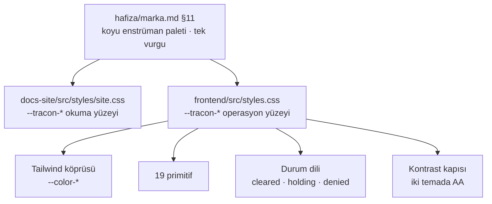

# Faz 164 — Console'un Enstrüman Katmanı

> **Durum:** ✅ Tamamlandı (2026-09-12)
> **Kaynak:** Kullanıcı isteği · **F-223** (aday listesi boştu; kalem doğrudan
> kullanıcıdan geldi ve dört tasarım kararı onunla birlikte alındı)
> **Önkoşul:** [Faz 163](163-MARKA-VE-DOKUMANTASYON.md) — marka dili,
> teal palet ve `hafiza/marka.md` orada kuruldu; bu faz onu console'a taşır
> **Paketler:** `Tracon.UI`
> **Yeni paket:** Yok · **Migration:** Yok
> **Public API:** Değişmiyor. HTTP sözleşmesi, `UseUI()` ve `MapTracon()` aynı
> **Tüketici yüzeyi:** Console'un tamamı · `docs-site/src/content/docs/ui.md` ·
> 19 ekran görüntüsü · `capabilities.md` console satırı
> **Manuel test alanı:** `docs/manuel-test/09-ARAYUZ-GENEL.md`
> **Taban:** `7cbc0f354337bd8a6be46eaa466f1eff087aa831`

---

## Bu Faza Başlarken

`faz-baslangic` skill'ini uygula. Bu fazın minimum okuma kümesi:

1. Bu doküman
2. **[`hafiza/marka.md`](../../hafiza/marka.md) — bağlayıcıdır.** Özellikle §5 (ses),
   §11 (görsel yön) ve §10 (terminoloji). §11 tek cümleyle bu fazın ölçütüdür:
   *"siteye bakan kişi havacılık teması değil, bir operasyon ekranı görmelidir."*
3. [`hafiza/frontend.md`](../../hafiza/frontend.md) — sözlük sözleşmesi, bundle kapısı
4. Kararlar — dosyanın tamamını **okuma**, yalnız bunları grep'le:
   ```bash
   grep -n "K-228\|K-232\|K-756" docs/KARARLAR.md
   ```
   **K-228** (`en.ts` ↔ `tr.ts` anahtar kümesi eşit; eksik anahtar derleme
   hatasıdır) · **K-232** (sunucu yanıtları çevrilmez) · **K-756** (bir gzip
   tavanını yükseltmek bir karardır, tercih değil)
5. Faz 163'ün devir notu — teal paletin ve kontrast cırcırının nereden geldiği:
   ```bash
   awk '/## Sonraki Faza Devir Notu/,0' docs/arsiv/fazlar/163-MARKA-VE-DOKUMANTASYON.md
   ```

---

## Amaç

Console bugün çalışır ve eksiksizdir; **konuşmaz.** 30 ekran, eski markanın mor
vurgusunu ve okuma-ağırlıklı bir yerleşimi taşır. Site Faz 163'te bir operasyon
ekranı diline kavuştu; console hâlâ eski dildedir.

Bu faz console'un **enstrüman katmanını** yeniden yazar — token seti, yoğunluk
ölçeği, 19 primitif, kabuk ve durum dili — ve onu beş ekranlık bir **kanıt
diliminde** uçtan uca ispatlar. Kalan 25 ekran Faz 165'in işidir.

- **F-223** — Console'un görsel ve etkileşim katmanı, sitenin tasarım diliyle
  yeniden kurulur; bundle tavanı ve bağımlılık grafiği değişmez.

Kapsam dışı: HTTP sözleşmesi, ekranların **ne yaptığı**, yeni yetenek. Bir ekran
bu fazda görünüş ve etkileşim olarak değişir, işlev olarak değişmez.

### Bugün ne çalışmıyor — doğrulanmış kanıt

| Kanıt | Gözlem |
|---|---|
| [`frontend/src/styles.css:33`](../../../src/Tracon.UI/frontend/src/styles.css) | `--ap-accent: #7c3aed` — vurgu rengi eski markadan (`AgentPrism`) kalma mor. Token önekinin tamamı `--ap-*`; 56 token bu önekte |
| [`frontend/src/styles.css:22`](../../../src/Tracon.UI/frontend/src/styles.css) | `:root, [data-theme='light']` açık paleti taşır, `[data-theme='dark']` (satır 57) koyuyu. **Varsayılan açıktır**; marka §11 "karanlık enstrüman paleti" diyor |
| [`frontend/src/components/ui.tsx`](../../../src/Tracon.UI/frontend/src/components/ui.tsx) | 19 primitif (365 satır) tipografi ölçeğini kendi içinde taşıyor; ortak bir yoğunluk ölçeği yok |
| `grep -rho "aria-[a-z]*\|role=" frontend/src --include="*.tsx" \| wc -l` | **66** — 130 dosya ve 26 585 satır için. `dialog`, `menu`, `combobox` ve `tooltip` desenleri elle ve tutarsız |
| [`frontend/scripts/postbuild.mjs:25`](../../../src/Tracon.UI/frontend/scripts/postbuild.mjs) | Bundle tavanı 250 KB gzip ve **gerçek bir kapıdır** — aşarsa build kırılır |
| `wwwroot/assets/index-*.js.br` | 152 378 B brotli. `ui.md:331` bunu 175,9 KB gzip diye yazar; tavanın ~%70'i, **~74 KB pay** |
| [`frontend/package.json`](../../../src/Tracon.UI/frontend/package.json) | Runtime bağımlılık dört tane: `react`, `react-dom`, `@tanstack/react-query`, `@tracon/client` |
| `tests/Tracon.Ui.E2ETests/UiTests.cs:95` | 375 px taşma testi yalnız **birkaç** ekranı gezer, 30'unu değil |

> Kanıtlar 2026-09-12 tarihinde doğrulandı.

---

## Onaylanan tasarım kararları

Dördü de kullanıcıyla plan yazılmadan **önce** kararlaştırıldı. Uygulama bunları
tartışmaz:

| Karar | Seçim |
|---|---|
| Kapsam | Görsel katman **ve** ekran bazında UX yeniden tasarımı. İki faza bölünür: 164 enstrüman katmanı + kanıt dilimi, 165 kalan ekranlar |
| Kimlik | Sitenin teal'ı, **koyu tema öncelikli**. Açık tema tam destekli kalır |
| "Lite" | 250 KB gzip tavanı **korunur**, **yeni runtime bağımlılığı yok**. Erişilebilirlik elle yazılır |
| Yoğunluk | Operatör yoğunluğu: 13-14 px taban, sıkı satır yüksekliği, monospace kimlikler |

---

## 164.1 — Token katmanı ve tema

`--ap-*` öneki `--tracon-*` olur ve palet sitenin token kümesinden türer. Site
ile console **aynı değerleri** paylaşmaz — biri okuma yüzeyi, diğeri operasyon
ekranı — ama aynı **aileden** gelir: koyu kömür zemin, kırık beyaz metin, tek
teal vurgu.



**Koyu öncelikli ne demektir.** `:root` koyu paleti taşır; açık tema
`:root[data-theme='light']` altında tanımlanır. Bugün tersidir. Sistem tercihi
yine okunur — varsayılanın yönü değişir, seçim hakkı değişmez.

🚨 **Bir renk yalnız bir `@media` veya bileşen kuralı içinde tanımlanırsa kapı
onu göremez ve tema değişiminde kaybolur.** Faz 163'te site tarafında ölçüldü;
aynı kural burada geçerlidir. Her token **iki temada da** değer alır.

**Durum renkleri anlam taşır, dekorasyon değildir.** Marka §11 bunu yazar ve
console'da karşılığı vardır: `Completed`/`Failed`/`Running`/`AwaitingApproval`,
onay kararı, sağlayıcı sağlığı, kota doluluğu. Bu faz renkleri **anlam
kümelerine** bağlar; bugün her ekran kendi rengini seçiyor.

**Kontrast cırcırı devralınır.** Faz 163 site tarafında metin 5,49:1 ve metin
dışı 3,74:1 ölçtü ve bunu
[`kalite-sozlesmesi.md`](../../../.agents/skills/tuketici-dokuman-senkronu/resources/kalite-sozlesmesi.md)
F tablosuna yazdı. Console'un kendi tabanı bu fazda **ilk kez ölçülür** ve aynı
tabloya girer; sonraki fazlarda yalnız yükselir.

## 164.2 — Yoğunluk ve tipografi ölçeği

Tek bir ölçek dosyada tanımlanır ve 19 primitif ondan okur. Bugün her primitif
kendi değerini taşıyor.

| Rol | Boyut | Nerede |
|---|---|---|
| Taban metin | 13 px | Tablo hücresi, etiket, yardım metni |
| Gövde | 14 px | Panel içeriği, form alanı, açıklama |
| Ekran başlığı | 20 px | `PageHeader` |
| Bölüm başlığı | 15 px | `Panel` başlığı |
| Kimlik (monospace) | 12,5 px | `run` id, `tenant`, `span`, API anahtarı ön eki |
| Tablo satırı | ~32 px | Yoğunluk ölçütü |

**Monospace kimlik bir marka kuralıdır** (§11: "monospace `callsign` etiketi").
Bir tanımlayıcı — `run` id, `session` id, `tenant`, `trace` — her yerde monospace
görünür ve kopyalanabilir. Bugün bazı ekranlarda düz metin.

## 164.3 — Primitifler

19 primitif yeniden yazılır. Liste
[`ui.tsx`](../../../src/Tracon.UI/frontend/src/components/ui.tsx) içindedir: `cx`,
`PageHeader`, `Panel`, `Button`, `Field`, `TextInput`, `TextArea`, `Select`,
`Badge`, `Mono`, `Empty`, `Loading`, `ErrorNote`, `Table`, `Th`, `Td`,
`CodeBlock`, `CopyButton`, `JsonView`.

**API'leri korunur.** Bir primitifin imzası değişirse 30 ekran birden değişir ve
bu faz kanıt dilimine sığmaz. Görünüş ve erişilebilirlik değişir, çağrı yeri
değişmez. İmza değişmesi gereken bir primitif çıkarsa **faz dokümanına yazılır**;
sessizce genişletilmez.

Eksik olan ve bu fazda eklenen primitifler — hepsi bugün ekranlarda elle yazılı:

| Yeni primitif | Neden | Bugün nerede elle yazılı |
|---|---|---|
| `Dialog` | Odak tuzağı, `Esc`, `aria-modal` tek yerde | `command-palette.tsx` kendi tuzağını kurar; diğer modal'lar kurmaz |
| `Menu` | Klavye gezinme ve `aria-activedescendant` | Ekranlarda `<select>` veya çıplak `<button>` yığını |
| `Tooltip` | Yalnız görsel değil, `aria-describedby` | Bugün `title` özniteliği — dokunmatikte ve klavyede erişilemez |
| `Toolbar` | Liste ekranlarının filtre/arama/aksiyon şeridi | Her liste ekranı kendi yerleşimini kuruyor |
| `StatusDot` | Durum renginin **tek** kaynağı | Renk seçimi ekranlara dağılmış |

🚨 **Yeni bağımlılık yok.** Kullanıcı kararı: dialog, menu, tooltip ve combobox
davranışı elle yazılır. Bu, hazır bir headless kitaplıktan **daha çok iştir** ve
plan bunu kabul eder; karşılığında tüketicinin bağımlılık grafiği değişmez.

## 164.4 — Kabuk: navigasyon, komut paleti, klavye

18 gezinme girişi bugün tek düz liste. Operatör iki farklı iş yapar — **izler**
(dashboard, runs, sessions, jobs, audit) ve **kurar** (agents, tools, skills,
workflows, models, mcp, triggers, settings). Kabuk bu ikisini ayırır; ayrım
`locales/en/common.ts` içindeki `nav.*` anahtarlarına yeni bir grup katmanı
ekler, anahtar adlarını **değiştirmez** — ekran görüntüsü kapısı
(`check-console-screens.mjs:13`) o anahtarları okur.

`command-palette.tsx` (467 satır) bugün en erişilebilir bileşendir (17 aria/role).
Bu faz onu **kabuğun omurgası** yapar: her ekran, her birincil aksiyon ve her
son görüntülenen kayıt oradan erişilir. `Cmd/Ctrl+K` korunur.

**Klavye sözleşmesi** bu fazda yazılır ve test edilir: `Tab` sırası görsel sırayı
izler, odak halkası her yerde görünür, `Esc` her katmanı bir seviye kapatır,
tablo satırı `Enter` ile açılır.

## 164.5 — Durum dili

Dört durumun **tek** bir anlatımı olur: boş · yükleniyor · hata · yetkisiz.
Bugün `Empty`, `Loading`, `ErrorNote` primitifleri var ama ekranlar bunları
tutarsız kullanıyor; yetkisiz durumun primitifi hiç yok.

| Durum | Kural |
|---|---|
| Boş | Ne olmadığını **ve** nasıl oluşturulacağını söyler. Birincil aksiyon içerir |
| Yükleniyor | İskelet (skeleton), spinner değil. Tablo yüksekliğini korur ki yerleşim zıplamasın |
| Hata | Sunucunun mesajı **çevrilmez** (K-232). Yanında tekrar deneme aksiyonu olur |
| Yetkisiz | Rolün ne olduğunu ve neyin gerektiğini söyler. Boş ekranla karıştırılmaz |

## 164.6 — Erişilebilirlik tabanı

Bugün 66 `aria-*`/`role` var. Bu faz bir **taban ölçer ve cırcıra bağlar** —
hedef sayı uydurmak yerine, ölçülebilir dört kural konur:

1. Her etkileşimli öğenin erişilebilir adı vardır.
2. Her modal katman odağı tuzaklar ve `Esc` ile kapanır.
3. Her form alanı `label` ile bağlıdır; hata `aria-describedby` ile duyurulur.
4. Kanıt dilimindeki beş ekran klavyeyle uçtan uca kullanılabilir.

Ölçüm kapıya bağlanır (§ Hata Modları). Sayı uydurulmaz; kapanışta ölçülen değer
`kalite-sozlesmesi.md` F tablosuna yazılır ve yalnız iyileşir.

## 164.7 — Kanıt dilimi: beş ekran

Enstrüman katmanı ancak gerçek bir ekranda ispatlanır. Beş ekran seçildi çünkü
beşi **beş ayrı desen sınıfını** kapsar; kalan 25 ekran bu beşinden birine
benzer.

| Ekran | Satır | Kanıtladığı desen |
|---|---|---|
| `dashboard.tsx` | 537 | Metrik, grafik, zaman aralığı |
| `runs.tsx` | 300 | Liste, filtre, sayfalama, tablo→detay geçişi |
| `run-detail.tsx` | 700 | Derin detay, canlı SSE, waterfall, transcript |
| `agent-editor/` | 1093 | Form, doğrulama, kaydetme, sürüm |
| `approvals.tsx` | 150 | Karar yüzeyi: onayla/reddet, geri alınamaz aksiyon |

Bu beşi bitmeden Faz 165 başlamaz. Gerekçe: bir deseni 25 ekrana uygulamadan
önce o desenin gerçekten çalıştığını görmek gerekir — yanlış desen 25 kez
kopyalanır.

---

## Planlanan Public API

**Değişmiyor.** `UseUI()`, `MapTracon()`, HTTP uçları, `PublicAPI.*.txt`
dosyaları ve kalıcı veri aynı kalır. Bu faz yalnız `Tracon.UI` içindeki
gömülü varlıkları değiştirir.

### Arayüz payı

| Ölçüt | Bugün | Bu fazda |
|---|---|---|
| JS | 175,9 KB gzip | **Tavan 250 KB korunur.** Kapanışta ölçülen değer dokümana yazılır |
| CSS | 5,5 KB brotli | Token seti büyür, Tailwind budaması korunur |
| Runtime bağımlılık | 4 paket | **4 paket** — değişmez |
| Widget | 30 KB tavan | Dokunulmaz; ayrı Vite yapılandırması ve ayrı kapısı var |

🚨 **Tavan yükseltmek bu fazda yasaktır.** K-756 tavanı bir kez yükseltti ve
"ikinci kez yükseltilmez" kaydını düştü. Bundle şişerse kod küçülür, tavan değil.

---

## Planlanan Dosya Listesi

```
src/Tracon.UI/frontend/src/
├── styles.css                     token seti: --ap-* → --tracon-*, koyu öncelikli
├── components/
│   ├── ui.tsx                     19 primitif yeniden yazılır, imzalar korunur
│   ├── dialog.tsx                 yeni — odak tuzağı, Esc, aria-modal
│   ├── menu.tsx                   yeni — klavye gezinme
│   ├── tooltip.tsx                yeni — aria-describedby
│   ├── toolbar.tsx                yeni — liste ekranı şeridi
│   ├── status-dot.tsx             yeni — durum renginin tek kaynağı
│   ├── layout.tsx                 kabuk: gruplu navigasyon, tema, yoğunluk
│   ├── command-palette.tsx        kabuğun omurgası olur
│   └── icons.tsx                  işaret bileşeni ve ikon seti
├── screens/
│   ├── dashboard.tsx              kanıt dilimi
│   ├── runs.tsx                   kanıt dilimi
│   ├── run-detail.tsx             kanıt dilimi
│   ├── agent-editor/              kanıt dilimi
│   └── approvals.tsx              kanıt dilimi
└── locales/{en,tr}/common.ts      nav grup anahtarları; mevcut anahtarlar korunur

tests/Tracon.Ui.E2ETests/UiTests.cs    klavye, odak, tema, yoğunluk case'leri
docs-site/src/content/docs/ui.md       yeni görünüş ve bundle ölçümü
docs-site/public/screenshots/*.png     19 görüntü yeniden üretilir
```

---

## Hata Modları ve Testler

> Mutlu yoldan değil, **ne bozulabilir**den türetildi. Seviyeyi plan seçer.

| Ne bozulabilir | Seviye | Test |
|---|---|---|
| Bir token yalnız tek temada tanımlanır; tema değişiminde renk kaybolur | Birim (Node) | `styles.test.mjs` — her token iki temada değer alır |
| Kontrast AA'nın altına düşer | Birim (Node) | Kontrast hesabı; site kapısının aynısı, console token kümesi üzerinde |
| Bundle 250 KB'yi aşar | Paket kapısı | `postbuild.mjs` — build kırılır |
| Yeni bir runtime bağımlılığı sızar | Paket kapısı | `package.json` `dependencies` kümesi dört isimle sabitlenir |
| `Esc` modal'ı kapatmaz, odak tuzağı kaçırır | E2E | `UiTests` — dialog aç, `Esc`, odak dönüşünü doğrula |
| `Tab` sırası görsel sırayı izlemez | E2E | `UiTests` — kanıt diliminde ilk 10 durak |
| Bir ekran 375 px'te yatay taşar | E2E | `UiTests:95` genişletilir — **beş kanıt ekranı** eklenir |
| Bir ekran metni sözlükten değil koddan gelir | Derleme | `Messages` tipi (K-228) — eksik anahtar derleme hatası |
| Sunucu hata mesajı çevrilir | E2E | Hata yolunda sunucu metni birebir görünür (K-232) |
| Ekran görüntüsü eski görünüşte kalır | Gerçek console E2E | `DocumentationScreenshotTests` — 19 PNG |
| Bir ekranın **işlevi** değişir | E2E | Mevcut 58 E2E olgusu omurgadır; hiçbiri **değiştirilmez**, yalnız eklenir |

**Beş soru, her yeni kod yolu için:** iptal · eşzamanlılık · boş/aşırı girdi ·
başka kiracının kaydı · alt sistem hatası. Bu faz yeni bir çalışma anı yolu
açmıyor; beşi de **arayüz durumları** olarak karşılanır — iptal edilen `run`'ın
durumu, eşzamanlı SSE akışı, boş liste, başka kiracının 404'ü, sunucu 5xx'i.
Beşi de kanıt dilimindeki ekranlarda görünür olmalıdır.

🚨 **Mevcut 58 E2E olgusu değiştirilmez.** Bir tanesi kırılıyorsa ekranın
işlevi değişmiştir ve bu kapsam dışıdır. Test uyarlanmaz; kod düzeltilir.
Faz 20'nin dersi budur: testi hizalamak kusuru gizler.

---

## Manuel Kabul Case'leri

> Kapanışta `docs/manuel-test/09-ARAYUZ-GENEL.md` içine eklenir.

| # | Ön koşul | Adımlar | Beklenen sonuç |
|---|---|---|---|
| 1 | Console açık, tema seçilmemiş | İlk açılış | Koyu tema gelir; tek vurgu rengi teal; ekran bir operasyon paneli gibi okunur 👤 |
| 2 | Aynı | Temayı açığa çevir, beş ekran gez | Hiçbir yüzey okunmaz olmuyor; durum renkleri iki temada da ayırt ediliyor 👤 |
| 3 | Aynı | `Tab` ile dashboard'dan başla, 10 durak | Odak halkası her durakta görünür; sıra görsel sırayı izler 👤 |
| 4 | Aynı | `Cmd/Ctrl+K`, bir ekran adı yaz, `Enter` | Palet açılır, odak girdiye gider, seçim o ekranı açar, `Esc` kapatır ve odak geri döner |
| 5 | Bir modal açık | `Esc` | Modal kapanır, odak onu açan düğmeye döner; arka plan kaydırılmaz |
| 6 | Boş kiracı | `runs` ekranını aç | Boş durum ne olmadığını **ve** nasıl `run` başlatılacağını söyler; birincil aksiyon taşır 👤 |
| 7 | Sunucu 500 döndürür | Bir liste ekranı aç | Sunucunun kendi mesajı **çevrilmeden** görünür; yanında tekrar deneme var |
| 8 | Reader rolü | Admin ekranı aç | Yetkisiz durumu görünür; boş ekranla karıştırılmaz 👤 |
| 9 | — | 375 px genişlikte beş kanıt ekranı | Hiçbirinde yatay taşma yok (`scrollWidth - clientWidth == 0`) |
| 10 | — | `npm run build` | Bundle 250 KB gzip altında; ölçüm çıktıya yazılır |
| 11 | — | `tr` diline geç, beş ekran gez | Arayüz metni çevrilir; sunucu yanıtları çevrilmez 👤 |
| 12 | — | Bir `run` id'sinin üstüne gel | Monospace görünür ve tek tıkla kopyalanır 👤 |

---

## Bitiş Ölçütleri (DoD)

- [x] Token seti `--tracon-*` önekinde; her token iki temada değer alıyor; koyu
      varsayılan. Kontrast tabanı ölçüldü ve `kalite-sozlesmesi.md` F tablosuna
      yazıldı. — `scripts/check-tokens.mjs`: 27 token × 2 tema, 70 çift, metin
      **5,22:1**, metin dışı **3,56:1**. `--ap-*` deposunda sıfır kaldı.
- [x] 19 primitif yeniden yazıldı, **imzaları korundu**; beş yeni primitif
      (`Dialog`, `Menu`, `Tooltip`, `Toolbar`, `StatusDot`) eklendi. — Altıncısı
      da eklendi: `Unauthorized` (§164.5 durum dilinin eksik parçası). Prop
      yalnız **eklendi**; hiçbiri yeniden adlandırılmadı veya kaldırılmadı.
- [x] Kabuk gruplu navigasyonu ve komut paletini taşıyor; `nav.*` anahtar adları
      değişmedi ve ekran görüntüsü kapısı 18 girişin hepsini buluyor. — Envanter
      artık `components/navigation.ts`; kenar çubuğu, palet ve kapı ondan okur.
      `triggers` ve `diagnostics` palette **ilk kez** erişilebilir.
- [x] Dört durum dili (boş · yükleniyor · hata · yetkisiz) tek kaynaktan geliyor.
      — `Empty` (birincil aksiyonlu) · `Loading` (iskelet) · `ErrorNote`
      (`onRetry`) · `Unauthorized`.
- [x] Beş kanıt ekranı yeni katman üzerinde; **mevcut 58 E2E olgusunun hiçbiri
      değiştirilmedi** ve hepsi yeşil. — Bağımsız denetim `git diff` ile
      doğruladı: `UiTests.cs`'te yalnız ekleme, artı `Session.OpenAsync`'e
      isteğe bağlı bir parametre ve taşma yardımcısının hata mesajı.
- [x] Klavye sözleşmesi E2E ile kanıtlandı: odak sırası, `Esc`, odak dönüşü.
      — `Command_palette_takes_focus_traps_Tab_and_returns_focus_to_its_trigger_on_Escape` ·
      `Shortcut_help_dialog_opens_with_the_question_mark_and_closes_on_Escape` ·
      `Every_one_of_the_first_ten_Tab_stops_has_an_accessible_name_and_a_visible_focus_ring`.
- [x] Beş kanıt ekranı 375 px'te yatay taşmıyor; E2E testi genişletildi.
      — Genişletilmedi, **eklendi** (bkz. Plandan Sapmalar §5):
      `Proof_slice_screens_do_not_overflow_horizontally_at_375px_width`. İlk
      koşumda gerçek bir kusur buldu (87 px).
- [x] Bundle 250 KB gzip altında; **tavan yükseltilmedi**; `package.json`
      `dependencies` hâlâ dört paket. Ölçülen değer dokümana yazıldı. —
      **184,1 KB**; `JS_BUDGET_BYTES` değişmedi; bağımlılık kümesi artık
      `postbuild.mjs` tarafından zorlanıyor (K-758).
- [x] 19 ekran görüntüsü yeni görünüşle yeniden üretildi; `ui.md` güncellendi.
      — Koyu temada; `ui.md`'ye "How it is laid out" bölümü eklendi.
- [x] Dört doğrulama kapısı sıfır uyarı (`kapi.py kapanis`).
- [x] `samples/Tracon.Api` ile gerçek `run` — çıktı belgeye yazıldı (aşağıda).
- [x] `secret` taraması boş döndü. — `kapi.py tarama` ✅ temiz.
- [x] Manuel kabul case'leri `docs/manuel-test/09-ARAYUZ-GENEL.md` içine eklendi;
      otomatikleştirilebilenler koşuldu. — **MT-UI-044..054**; 044 · 046 · 050 ·
      053 otomatik karşılıklarıyla `UiTests`'te koştu.
- [x] `faz-denetim` koşuldu; 🔴 bulgu kalmadı.

### Örnek uygulama koşumu

`samples/Tracon.Api`, gerçek bir HTTP çağrısı, akışlı yanıt:

```
POST /tracon/api/agents/support/run   {"message":"where is ORD-7"}
→ event: run    {"runId":"01a09646-c56a-7b36-9a71-00032889a469"}
→ event: update × 4   "Echo: " / "where " / "is " / "ORD-7"

GET /tracon/api/runs/01a09646-c56a-7b36-9a71-00032889a469
  status      Completed
  modelId     echo-1        modelProvider  echo
  startedAt   15:40:15.646  completedAt    15:40:15.878   (232 ms)
  eventCount  6             isStreaming    true
```

Aynı `run` console'da açıldı (`.playwright-mcp/console-final-run-detail.png`):
saklanan tercih silinerek yüklendi ve **koyu** açıldı (K-757), yedi ölçüm
kutusu tek satıra sığdı, `message.delta` satırları canlı vurgu tonunda,
`run.started` bilgi tonunda, kimlik monospace ve kopyalanabilir.

## Riskler

**Bundle payı ~74 KB ve beş yeni primitif ondan yiyecek.** Elle yazılan dialog,
menu ve tooltip davranışı ücretsiz değildir. Ölçüm her primitiften sonra
yapılmalıdır, faz sonunda değil — 250 KB'ye faz sonunda çarpmak kodu yeniden
yazdırır.

**19 primitifin imzasını korumak bir kısıttır ve zorlayacaktır.** Yeni bir
görünüş bazen yeni bir prop ister. Kural: prop **eklemek** serbesttir, var olanı
değiştirmek veya kaldırmak faz dokümanına yazılır. Aksi hâlde 30 ekran birden
kırılır ve kanıt dilimi anlamını yitirir.

**Erişilebilirliği elle yazmak en büyük iş kalemidir.** Odak tuzağı, `aria-*`
ilişkileri ve klavye gezinme; hazır kitaplığın çözdüğü sorunlardır. Kullanıcı
kararı bağımlılık eklememektir; plan bu maliyeti kabul eder ve kanıt dilimini
küçük tutarak dengeler.

**Ekran görüntüleri fazın sonunda üretilir.** 19 PNG gerçek console E2E ile
çıkar; ekranlar donmadan üretmek iki kez üretmek olur.

---

## Açık Sorular

> Planı bloklamayan, uygulama sırasında karara bağlanacak sorular.

1. **Navigasyon grupları nasıl adlandırılır?** "İzle" ve "Kur" ayrımı §164.4'te
   tarif edildi; İngilizce karşılıkları (`Operate` / `Configure`?) uygulama
   anında marka §10 terminolojisine göre seçilir.
2. **Grafikler (`charts.tsx`) yeni palete nasıl oturur?** Durum renkleri anlam
   taşıdığı için grafik serisi renkleri onlarla çakışmamalıdır. Ayrı bir seri
   paleti gerekebilir; ölçülmeli.
3. **Yoğunluk kullanıcı tercihi olmalı mı?** Plan tek ölçek koyuyor. Ferah mod
   isteği çıkarsa kapsam dışıdır ve aday olarak kaydedilir.

---

## Plandan Sapmalar

> Plan doğru bir hedef anlattı ve iki yerde bayattı. İkisi de burada.

**1. Taban ölçüm yanlıştı: 175,9 KB değil, 180,0 KB.** Planın kanıt tablosu
`ui.md:331`'i alıntılıyordu; o sayı Faz 108'den kalmaydı. `npm run build` ile
ölçülen gerçek taban **180,0 KB gzip**'ti — pay ~74 KB değil, **70 KB**.
Kapanışta ölçülen değer **184,1 KB**'dir; enstrüman katmanının tamamı (beş yeni
primitif, durum dili, gruplu kabuk, kanıt dilimi) **4,1 KB gzip** eklemiştir.
Tavan yükseltilmedi, `package.json` `dependencies` hâlâ dört isimdir ve artık
bunu bir kapı zorluyor.

**2. 🚨 "Koyu öncelikli" bir CSS sorusu DEĞİLDİR — `prefers-color-scheme`
"seçilmemiş" durumunu bildiremez.** Plan §164.1 "sistem tercihi yine okunur,
varsayılanın yönü değişir" diyordu. Token katmanı planlandığı gibi yazıldı
(`:root` koyu, `:root[data-theme='light']` açık), ama **varsayılanın yönü CSS'te
değiştirilemez**: medya sorgusunun `no-preference` değeri modern tarayıcıdan
kalktı ve seçim yapmamış her makine `light` döner. İlk uygulama sorguyu
`(prefers-color-scheme: light)` olarak çevirdi; gerçek tarayıcıda ölçüldü
(`ColorScheme.NoPreference` ile açılan Playwright bağlamı **`light`** verdi) ve
düştü. Çalışan çözüm: **varsayılan saklanan tercihtir** — hiçbir şey
saklanmamışsa `dark`. Ayarlar'daki "sistemi izle" seçeneği aynen korundu ve
seçildiğinde eskisi gibi davranır. Kayıt: **K-757**.

**3. Onay ekranının doğrulama diyaloğu yazıldı ve GERİ ALINDI.** §164.7 onaylar
ekranını "geri alınamaz aksiyon" deseninin kanıtı olarak seçiyordu; ilk uygulama
her iki cevabı da bir `Dialog` arkasına aldı. Mevcut bir E2E olgusu
(`Approvals_screen_shows_pending_request_and_run_completes_once_approved`) düştü:
tek tık ile karar veriliyordu, artık iki tık gerekiyordu. DoD "mevcut 58 E2E
olgusunun hiçbiri değiştirilmedi" diyor ve kapsam "ekranın **ne yaptığı**"nı
dışarıda bırakıyor — bir onay adımı ekranın etkileşim sözleşmesini değiştirir.
Diyalog kaldırıldı. Yerine kararın **sonucu** karar anında okunur hâle geldi:
argümanlar satırın üstünde, süre sonu amber ve mutlak saatte, ve her iki düğme
`title` özniteliği yerine **gerçek bir tooltip** taşıyor (klavyeyle ve dokunmatik
ekranda erişilebilir). Onay adımının kendisi `docs/ADAYLAR.md`'ye aday olarak
kaydedildi.

**4. `Field`'ın zorunluluk yıldızı erişilebilir addan çıkarılamadı.** İlk uygulama
`*` işaretini `aria-hidden` yaptı; `Trigger_created_from_UI_is_listed` düştü
(erişilebilir ad "Name *" → "Name"). Kod düzeltildi, test değil. Gerekçe testin
kendisinden bağımsız: `Field`'ın düz-`children` biçimi kontrolün üstüne
`aria-required` **yazamaz** (çocuk bir `ReactNode`'dur), dolayısıyla yıldızı
gizlemek zorunlu bir alanı isteğe bağlı gibi duyururdu. Yıldız adın parçası
kaldı; `aria-describedby` ve `aria-invalid` bağlaması ise render-prop biçimiyle
geldi ve agent editörünün şema alanında kullanıldı.

**5. 375 px testi GENİŞLETİLMEDİ, yeni bir olgu eklendi.** Plan
"`UiTests:95` genişletilir" diyordu; DoD "hiçbir mevcut olgu değiştirilmedi"
diyor. İkisi çelişiyor. Mevcut olgu (dört genel ekran) olduğu gibi bırakıldı ve
beş kanıt ekranı için ayrı bir olgu yazıldı. Yan fayda: ikisi farklı şeyleri
kanıtlıyor — biri **boş** kabuğu, diğeri **dolu** ekranı, ve taşma yalnız
ikincisinde çıktı.

**6. Ekran görüntüsü kapısı sözlükten değil, gezinme TABLOSUNDAN okur.**
`check-console-screens.mjs` `nav\.([A-Za-z]+)` desenini `en/common.ts` üzerinde
koşuyordu — yani `nav.*` ad alanındaki **her** anahtar bir ekran sanılıyordu.
Bu fazda eklenen "İçeriğe geç" bağlantısı (`nav.skipToContent`) kapıyı kırmızı
yaptı ve kendisinin bir ekran görüntüsünü istedi. İki düzeltme birlikte yapıldı:
anahtar `shell.skipToContent`'e taşındı (gerçekten bir ekran değil) **ve** kapı
artık `components/navigation.ts`'i okuyor — kenar çubuğu ile paletin paylaştığı
tek envanter. Sınıfın tamamı kapandı; regresyon testi eklendi.

**7. Kapsam dışı kusurlar bulundu ve düzeltildi** (kullanıcı isteği). Listesi
"Yol Üzerinde Kapatılan Kusurlar" bölümündedir.

---

## Yol Üzerinde Kapatılan Kusurlar

Hiçbiri bu fazın konusu değildi; hepsi bu fazın işi sırasında görüldü.

| Kusur | Kanıt | Düzeltme |
|---|---|---|
| **Dashboard 375 px'te 87 px yatay taşıyordu** | Yeni E2E olgusu. Eski 375 px testi **run seed etmiyordu**, bu yüzden grafikler boş çiziliyor ve taşma hiç doğmuyordu | `Panel` artık `min-w-0`: bir panel neredeyse her zaman grid/flex öğesidir ve `min-width: auto` onu içindeki en geniş şeyin altına inmekten alıkoyar. Model kırılım satırı da sarmalıyor: dört sabit sütun + esnek çubuk bir telefona sığmıyordu |
| **Console favicon'u eski markanın mor üçgeniydi** | `index.html`, Faz 162/163 yeniden adlandırmasından kalma | Tracon radar işareti, satır içi veri URI'si olarak. Ayrıca soğuk yüklemede beyaz parlama vardı: `<head>` artık zemin rengini kendisi taşıyor |
| **Zaman serisi grafiğinin son eksen etiketi kırpılıyordu** | Ekran görüntüsü (`dashboard.png`) | Yatay iç boşluk 12 → 16 px; ilk ve son etiket artık uçlarına yaslanıyor, ortalanmıyor |
| **Durum dağılımı çubuğu %16 tint'ti — koyu temada görünmüyordu** | Ekran görüntüsü: tek bir koyu blok | Seri renginin kendisi kullanılıyor. `tint()` yardımcısı bu dosyada ölü kaldı ve silindi |
| **Runs boş durumu yarım cümle gösteriyordu** | "Send a message in the or call the agent through the API." — `before`/`after` parçaları aradaki bağlantıyı sarmak için vardı | Tek cümlelik `runs.empty.body`; bağlantının işini birincil aksiyon düğmesi yapıyor |
| **Runs kapsam filtresi yanlış etiketliydi** | Filtre şeridinde "TREE TOKENS" yazıyordu; kontrol kök/alt run seçimidir | Yeni anahtar `runs.filter.scope` |
| **`Menu` tetikleyicisinin ok işareti sağa bakıyordu** | Görsel denetim | `ChevronIcon` konsolun açılım okudur (sağa bakar); menü tetikleyicisi aşağı bakar, açıkken yukarı |

---

## Bu Fazda Verilen Kararlar

| Numara | Karar |
|---|---|
| **K-757** | Console'un varsayılan teması SAKLANAN TERCİHTİR (`dark`), medya sorgusu DEĞİL |
| **K-758** | Console'un runtime bağımlılık kümesi DÖRT isimle kapıya bağlandı |

Karar defterine yalnız bu ikisi girdi. Token adlandırması (`--ap-*` →
`--tracon-*`), yoğunluk ölçeği, gruplu gezinme ve durum sözlüğü gömülü varlığın
iç tercihleridir: public API'ye, kalıcı veriye veya bir güvenlik sınırına
dokunmazlar ve bu dokümanda kalırlar.

---

## Gerçekleşen Public API

**Değişmedi.** `UseUI()`, `MapTracon()`, HTTP uçları, `PublicAPI.*.txt` ve kalıcı
veri aynıdır. `dotnet pack` yüzeyi doğruladı.

Değişen tek tüketici-görünür davranış temanın varsayılanıdır (K-757) ve
`README.md`, `src/Tracon.UI/README.md` ile `docs-site/.../ui.md` bunu yazar.

### Arayüz payı — ölçülen

| Ölçüt | Faz öncesi | Kapanışta |
|---|---|---|
| JS | 180,0 KB gzip | **184,1 KB gzip** · tavan 250 KB (değişmedi) |
| Gömülü toplam | 154,2 KB brotli | 157,4 KB brotli |
| Runtime bağımlılık | 4 paket | **4 paket** · artık kapı zorluyor |
| Widget | 2,7 KB gzip · tavan 30 KB | 2,7 KB gzip (dokunulmadı) |

### Kontrast — ilk kez ölçüldü

| Taban | Değer | Nerede kırmızı olur |
|---|---|---|
| Metin | **5,22:1** (`light` · `subtle` üzerinde `raised`) | `frontend/scripts/check-tokens.mjs` |
| Metin dışı | **3,56:1** (`light` · `line-strong` üzerinde `raised`) | aynı kapı |

70 çift ölçülür, ikisi de `kalite-sozlesmesi.md` F tablosundadır ve yalnız
yükselir.

---

## Dosya Listesi (gerçekleşen)

```
src/Tracon.UI/frontend/
├── index.html                          favicon + zemin rengi (soğuk yükleme parlaması)
├── package.json                         build zincirine token kapısı eklendi
├── scripts/
│   ├── check-tokens.mjs                 YENİ — token eşliği + kontrast + taban çizgisi
│   └── postbuild.mjs                    runtime bağımlılık kapısı eklendi
└── src/
    ├── styles.css                       token seti --tracon-*, koyu öncelikli, yoğunluk ölçeği
    ├── lib/theme.ts                     varsayılan tercih 'dark' (K-757)
    ├── components/
    │   ├── navigation.ts                YENİ — ekran envanteri; kabuk ve palet ondan okur
    │   ├── ui.tsx                        19 primitif yeniden yazıldı + Unauthorized
    │   ├── dialog.tsx                    YENİ — odak tuzağı, Esc, kaydırma kilidi
    │   ├── menu.tsx                      YENİ — ok tuşları, Home/End, aria-activedescendant
    │   ├── tooltip.tsx                   YENİ — aria-describedby; `title` özniteliğinin yerine
    │   ├── toolbar.tsx                   YENİ — liste şeridi + etiketli filtre alanı
    │   ├── status-dot.tsx                YENİ — durum renginin TEK kaynağı
    │   ├── layout.tsx                    gruplu kabuk, atlama bağlantısı, mobil çekmece
    │   ├── command-palette.tsx           Dialog odak katmanını devraldı; session grubu eklendi
    │   ├── charts.tsx                    seri paleti; taşma ve kırpılma düzeltmeleri
    │   ├── icons.tsx                     LockIcon
    │   ├── workflow-graph.tsx            seri paleti + durum sözlüğü
    │   └── transcript.tsx                durum sözlüğü
    ├── screens/
    │   ├── dashboard.tsx                 kanıt dilimi — aralık seçici radiogroup, iskelet, retry
    │   ├── runs.tsx                       kanıt dilimi — Toolbar, StatusDot, boş/hata durumları
    │   ├── run-detail.tsx                 kanıt dilimi — olay tonları, Menu, kopyalanabilir kimlik
    │   ├── approvals.tsx                  kanıt dilimi — Tooltip, Unauthorized, argümanlar satırda
    │   ├── agent-editor.tsx               kanıt dilimi — iskelet, retry
    │   └── agent-editor/sections/model-section.tsx   şema hatası aria-describedby ile bağlandı
    └── locales/{en,tr}/{common,runs,operations,agents}.ts   yeni anahtarlar, K-228 korundu

tests/Tracon.Ui.E2ETests/
├── UiTests.cs                            +6 olgu (58 → 64); mevcut 58 DEĞİŞMEDİ
└── DocumentationScreenshotTests.cs       yakalamalar koyu temada

docs-site/
├── scripts/check-console-screens.mjs     envanter gezinme tablosundan okunur
├── scripts/check-console-screens.test.mjs +1 regresyon testi
├── src/content/docs/ui.md                "How it is laid out" + ölçümler
└── public/screenshots/*.png              19 görüntü yeniden üretildi (koyu)

README.md · src/Tracon.UI/README.md       ölçüm ve tema iddiası güncellendi
docs/manuel-test/09-ARAYUZ-GENEL.md       MT-UI-044..054
docs/manuel-test/00-INDEKS.md             satır 09: 43 → 54
.agents/skills/tuketici-dokuman-senkronu/resources/kalite-sozlesmesi.md   F tablosu: dört yeni taban
```

---

## Açık Soruların Cevapları

1. **Navigasyon grupları:** `Operate` / `Configure` — Türkçesi `Operasyon` /
   `Yapılandırma`. Metafor kullanılmadı: marka §4 bir kullanıcının bir şeyi
   *yapmaya* çalıştığı yerde metaforu yasaklar ve gezinme tam olarak orasıdır.
2. **Grafikler:** ayrı bir seri paleti kuruldu (`--tracon-series-1..6`). Gerekçe
   ölçülebilir: bir seri bir **kimliktir**, bir durum değil — kırmızı/yeşil bir
   çizgi bir hüküm gibi okunur. Altı seri de panele karşı ≥3:1 ölçülür.
3. **Yoğunluk tercihi:** eklenmedi. Tek ölçek kondu, ferah mod talebi çıkmadı.

---

## Denetim Bulguları

Taze bağlamlı bağımsız denetçi koştu (2026-09-12). Temiz çıkan başlıklar: 3.5
(imza-gövde kayması), 3.6 (plan dışı public API), 3.7 (repo kuralları).

Denetçi dört şeyi **kendisi ölçtü**, dokümanın iddiasına güvenmedi: 58 olgunun
değişmediğini `git diff` ile, 64/64 yeşili tam koşumla, primitif imzalarını
tek tek, ve **kapıların gerçekten kapı olduğunu ikisini de elle kırarak** (token
silme · `@media` içine token · kontrast düşürme · beşinci bağımlılık) — her
denemeden sonra dosyaları `shasum` ile doğrulayarak geri koydu.

### 🔴 — kapatıldı

| # | Bulgu | Sonuç |
|---|---|---|
| 1 | **`Tooltip`'in `aria-describedby` bağlaması DOM'a hiç ulaşmıyordu.** `Button` kapalı bir prop listesiyle render ediyor ve bilmediği prop'u sessizce yutuyor; tooltip görsel olarak çalışıyor, testler yeşil, ve onay ekranı faz **öncesinde** `title` ile taşıdığı açıklamayı kaybetmiş oluyordu. Sınıf taraması `Select`'i de gösterdi: `Field`'ın render-prop biçimindeki `aria-describedby`/`aria-invalid` orada da yutuluyordu | **Düzeltildi.** `Button` ve `Select` artık bağlamaları açıkça alıp DOM'a yazıyor. Yeni test dosyası `components/ui.test.tsx` dördünü birden kanıtlıyor: tooltip → düğme, alan hatası → `TextInput`, alan hatası → `Select`, ve zorunluluk yıldızının erişilebilir adda kalması |

### 🟡 — kapatıldı

| # | Bulgu | Sonuç |
|---|---|---|
| 2 | Agent editörünün **yükleme hata yolu yoktu**: `ready` yalnız başarıda true olduğu için çözülemeyen bir tanım (başka kiracının kaydı, silinmiş agent, düşmüş depo) ekranı sonsuza dek `aria-busy` iskeletinde bırakıyordu | **Düzeltildi.** `useAgentEditor` sorguyu dışa açıyor, ekran `ErrorNote` + "yeniden dene" çiziyor. Regresyon testi: `agent-editor.test.tsx` → 404 fixture'ı, `role="alert"` ve `error-retry` beklenir, `role="status"` beklenmez |
| 3 | Ekran görüntüsü kapısının regresyon testi adının iddia ettiğini koşmuyordu; ayrıca kapının envanter deseni **prop sırasına** bağlıydı — sırası değişen bir giriş sessizce sıfır ekran olarak ayrıştırılırdı | **Düzeltildi.** Kapı artık girişleri bağımsız sayıyor (`label: 'nav.*'`) ve ayrıştırılanla karşılaştırıyor; iki gerçek test eklendi (tabloda olmayan `nav.*` anahtarı hiçbir şey istemez · sırası değişmiş giriş **gürültüyle** düşer) |
| 4 | `index.html` iki temanın zemin rengini elle kopyalıyordu ve hiçbir kapı görmüyordu; ayrıca saklı tercihi `light` olan kullanıcı artık **koyu** parlama görüyordu | **İkisi de düzeltildi.** `check-tokens.mjs` kabuğun zemin renklerini `--tracon-bg` ile karşılaştırıyor. Parlamanın kendisi kaynağında kapandı: `<head>` içinde stylesheet'ten **önce** koşan küçük bir script saklanan tercihi `data-theme` olarak basıyor; `theme.ts` yine tek kaynak, yalnız yazma anı öne alındı |
| 5 | Depo kökünde takipsiz iki PNG kalmıştı | **Silindi.** |

### 🟢 — kapatıldı (üçü) ve gerekçelendi (biri)

| # | Bulgu | Sonuç |
|---|---|---|
| 6 | `dialog.tsx` var olmayan bir teste atıf yapıyordu | Düzeltildi; iki gerçek olgunun adı yazıldı |
| 7 | `FocusProbe` hiçbir kuralı olmayan bir sınıfı ekleyip siliyordu — no-op | Kaldırıldı |
| 8 | Kapının taban sabitleri 5,2 / 3,5; ölçülen 5,22 / 3,56 | **Bilerek.** Son haneye yazılan bir taban, algılanamaz bir yuvarlamayı kırmızı derlemeye çevirir ve insanlara tabanı düzenlemeyi öğretir. Gerekçe koda yazıldı |
| 9 | `runs.tsx`'te `filtered`, `?sessionId=` ile gelen daraltmayı saymıyordu; boş liste "henüz hiçbir şey çalıştırılmadı" diyordu | Düzeltildi — ve iki kavram ayrıldı: `resettable` (bu ekranın kontrollerinin geri alabildiği) ile `narrowed` (boş durumun ne demesi gerektiği). Tek bayrak kullanmak hiçbir şeyi temizlemeyen bir "Filtreleri temizle" düğmesi üretirdi |

## Sonraki Faza Devir Notu

**Faz kapandı.** Dört kapı sıfır uyarı, 64/64 E2E, bağımsız denetimin bir 🔴 ve
dört 🟡 bulgusu kapatıldı, 19 ekran görüntüsü yeniden üretildi, site yayınlandı.

**Faz 165'in kapsamı: kalan 25 ekran.** Kanıt dilimi beş deseni ispatladı;
her ekran bunlardan birine benzer:

| Desen | Kanıtı | Bu desene giren ekranlar |
|---|---|---|
| Metrik + grafik + zaman aralığı | `dashboard.tsx` | `diagnostics` |
| Liste + filtre + sayfalama | `runs.tsx` | `sessions` · `jobs` · `evals` · `experiments` · `audit` · `agents` · `tools` · `skills` · `models` · `mcp` · `triggers` · `workflows` |
| Derin detay + canlı akış | `run-detail.tsx` | `session-detail` · `job-detail` · `eval-run-detail` · `workflow-detail` · `playground` |
| Form + doğrulama + sürüm | `agent-editor/` | `workflow-editor` · `skills` editörü · `settings` |
| Karar yüzeyi | `approvals.tsx` | `experiment-detail` (promosyon) · `agent-detail` (rollback) |

**Sonraki oturumun bilmesi gerekenler:**

1. **Bundle payı 66 KB.** 184,1 / 250 KB. Kalan 25 ekran yeni primitif
   getirmemeli — hepsi zaten yazıldı; iş onları **kullanmaktır**. Ölçüm her
   ekrandan sonra yapılır, faz sonunda değil.
2. **🚨 Kapalı prop listesi taşıyan her primitif bir tuzaktır.** Denetimin 🔴
   bulgusu buydu: `Button` `aria-describedby`'ı yutuyordu. `ui.test.tsx` şimdi
   dört bağlamayı koruyor. Bir primitife yeni bir ARIA bağlaması geçireceksen
   önce o testi genişlet, sonra kodu yaz.
3. **Kalan ekranlar hâlâ eski desenleri taşıyor.** Somut örnekler: `agents.tsx`
   kendi arama girdisini elle kuruyor (`Toolbar` var), "Run" bağlantıları vurgu
   rengi taşımıyor (bağlantı gibi okunmuyor), liste ekranlarının çoğu hâlâ
   `Loading`'i varsayılan satır sayısıyla çağırıyor ve boş durumları birincil
   aksiyon taşımıyor.
4. **`docs/manuel-test/09-ARAYUZ-GENEL.md` 54 case'e çıktı** ve dosya bütçesine
   yaklaşıyor. Faz 165'in case'leri `10-ARAYUZ-AGENT-PLAYGROUND.md` ve
   `11-ARAYUZ-RUN-SESSION-SSE.md` içine, ekranın sahibi olan dosyaya girmeli.
5. **Ekran görüntüleri koyu temada üretiliyor** (`DocumentationScreenshotTests`,
   `ColorScheme.Dark`). Bir ekranın görünüşü değişirse 19'u birden yeniden
   üretilir; tek tek üretmenin yolu yoktur.
6. **F-224 açık:** geri alınamaz kararlar için doğrulama adımı. `Dialog` hazır
   ve kanıtlı; iş, envanteri çıkarmak ve etkilenen E2E olgularını birlikte
   taşımaktır. Bu faz yapamazdı — DoD'si mevcut olguların değişmemesini şart
   koşuyordu.
7. **F-221'in kalanı:** `assets/icon.png`, `docs-site/public/favicon.svg` ve
   `src/` içindeki `_prismOptions`/`prismException` adları hâlâ eski markadan.
   Console tarafı bu fazda kapandı.
