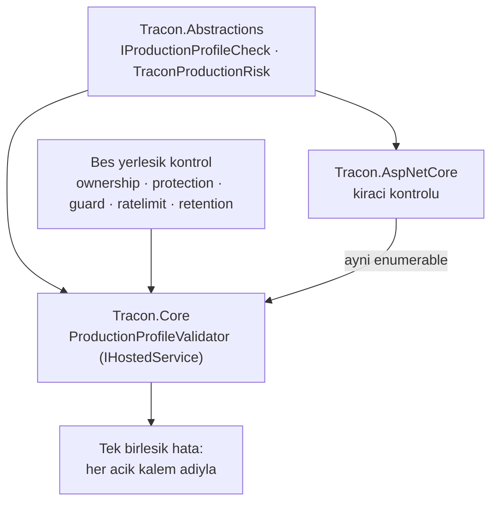

# Faz 170 — Production Profil Kapısı

> **Durum:** ✅ Tamamlandı (2026-09-14)
> **Plan onayı:** onaylandı 2026-09-14 (kullanıcı: "sıradaki fazı geliştir")
> **Kaynak:** [ADAYLAR.md](../../ADAYLAR.md) · **F-231**
> **Önkoşul:** [Faz 150](150-ZORUNLU-BINDING-PROFILI.md) — `RequireCustomBinding` + `RequiredBindingValidator` deseni; bu faz onun **options yarısıdır**
> **Paketler:** `Tracon.Abstractions` (risk enum'u + katkı sözleşmesi) · `Tracon.Core` (doğrulayıcı + beş yerleşik kontrol) · `Tracon.AspNetCore` (kiracı kontrolünün katkısı)
> **Yeni paket:** Yok · **Migration:** Yok
> **Public API:** Büyüyor — bir `ITraconBuilder` üyesi, bir seçenek sınıfı, bir `enum`, bir istisna tipi, bir katkı arayüzü. `wc -l src/*/PublicAPI.Shipped.txt` → **17 satır / 17 dosya** (2026-09-14, yalnız `#nullable enable` başlıkları): **shipped giriş sıfır, bugün eklemek bedava.** GA'da `Shipped` dolduktan sonra aynı ekleme bir sürüm kararıdır
> **Tüketici yüzeyi:** Site: `guides/production.md` (Production-sensitive defaults tablosu ve dağıtım checklist'i — ikisi de 2026-09-14'te güncellendi, bu faz onlara kapıyı bağlar) · `guides/embedding.md` ("Make a binding required" bölümünün kardeşi) · `getting-started/security.md`
> · Sevk edilen: `ITraconBuilder`'ın XML `<example>`'ı · `src/Tracon.Core/README.md` · `capabilities.md` satırı
> **Manuel test alanı:** [`docs/manuel-test/13-KIRACI-VE-GUVENLIK.md`](../../manuel-test/13-KIRACI-VE-GUVENLIK.md) — `MT-SEC-182`'den devam

---

## Bu Faza Başlarken

> `faz-baslangic` skill'ini uygula. **Tamamını değil, yalnız işaret edilen
> bölümleri oku.**

1. Bu doküman; ilk kod satırından önce `faz-uygulama` skill'i.
2. Kararlar — dosyanın tamamını **okuma**, yalnız bu kalemleri grep'le:
   ```bash
   grep -n "K-059\|K-421\|K-057\|K-228\|K-232" docs/KARARLAR.md
   ```
   **K-059** (`secret` veritabanına da yazılmaz — risk kabul kaydı bir `secret`
   taşımaz), **K-421** (`EnablePublicApiTracking` açıktır), **K-057**
   (bağımlılık yönü — bu fazın en belirleyici kısıtı, §170.2),
   **K-228/K-232** (arayüz sözlüğü ve sunucu yanıtı; bu faz arayüze dokunmaz
   ama kararın sınırını bilmek gerekir).
3. [Faz 150](150-ZORUNLU-BINDING-PROFILI.md) — yalnız devir notu ve
   "Amaç" bölümü:
   ```bash
   awk '/## Sonraki Faza Devir Notu/,0' docs/arsiv/fazlar/150-ZORUNLU-BINDING-PROFILI.md
   ```
   Bu faz onun kardeşidir: 150 **binding**'leri, 170 **options**'ı kapsar.
   Aynı hata mesajı sözleşmesi (hangi kalem · bugünkü değer · nasıl düzeltilir)
   birebir devralınır.
4. Alan hafızası (bu faz üç alana dokunuyor):
   [`hafiza/aspnetcore-di.md`](../../hafiza/aspnetcore-di.md) (`TryAdd` sırası ve
   yaşam döngüsü) · [`hafiza/olcum-kota-ve-secenekler.md`](../../hafiza/olcum-kota-ve-secenekler.md)
   (`Bind()` ve seçenek tuzakları) ·
   [`hafiza/genisleme-noktalari-ve-denetim.md`](../../hafiza/genisleme-noktalari-ve-denetim.md)
   (genişleme noktası kaydı).
5. Gerektiğinde, tamamı değil ilgili bölümü:
   [`MIMARI-GUVENLIK.md`](../../MIMARI-GUVENLIK.md) — kiracı ve rol bölümleri.

---

## Amaç

`AddTracon()` her genişleme noktasını `TryAdd` ile kaydeder ve güvenlik duyarlı
her anahtar **izin verici** varsayılanla gelir. Bu K1'in ("sıfır sürpriz")
doğru sonucudur: ilk koşumda hiçbir şey sürpriz yapmaz. Bir production
dağıtımı içinse yanlış varsayılandır — bir kurulum, kiracı yalıtımını hiç
açmadan, oturum sahipliğini hiç kararlaştırmadan ve içerik denetimini hiç
kaydetmeden **sessizce** ayağa kalkar.

Faz 150 bu sorunun **binding** yarısını çözdü: `RequireCustomBinding<T>()` ilan
edilen bir sözleşme hâlâ yerleşik varsayılana çözülüyorsa host'u başlatmaz.
Aynı argümanın **options** yarısında kapı yoktur. Bu faz onu kurar.

- **F-231** — `RequireProductionProfile()`: hiçbir seçenek değerini
  **değiştirmez**; izin verici varsayılanda kalan her güvenlik duyarlı anahtarı
  **adıyla sayar** ve host'u başlatmaz. Tüketici ya anahtarı açar ya riski
  **açıkça kabul eder**.

🚨 **Bu metot bir "güvenli mod" değildir ve öyle anlatılmaz.** Değer ayarlamaz,
politika seçmez ve hiçbir şeyi güvenli hâle getirmez. Yaptığı tek şey, atlanmış
bir kararı **başlatma hatasına** çevirmektir. XML dokümanının ilk cümlesi bunu
söyler; `capabilities.md` satırı ve site metni de öyle.

### Bugün ne çalışmıyor — doğrulanmış kanıt

| Kanıt | Gözlem |
|---|---|
| [`TraconTenancyOptions.cs:42`](../../../src/Tracon.AspNetCore/Tenancy/TraconTenancyOptions.cs#L42) | `Enabled` initializer'sız — çok kiracılık **kapalı**; her istek tek varsayılan kiracıya çözülür |
| [`TraconSessionOwnershipOptions.cs:63`](../../../src/Tracon.Abstractions/Options/TraconSessionOwnershipOptions.cs#L63) | `Enabled` initializer'sız. Kendi XML'i "geri dönüşlü değildir" der: kapalıyken açılan oturum sonsuza dek sahipsiz kalır |
| [`TraconContentProtectionOptions.cs:36`](../../../src/Tracon.Core/Security/TraconContentProtectionOptions.cs#L36) | `Enabled` initializer'sız — at-rest şifreleme (AES-256-GCM) **kapalı** |
| [`TraconRateLimitOptions.cs:37`](../../../src/Tracon.Core/Quotas/TraconRateLimitOptions.cs#L37) | `Enabled` initializer'sız — hız sınırı **kapalı** |
| [`TraconRetentionOptions.cs:28`](../../../src/Tracon.Core/Retention/TraconRetentionOptions.cs#L28) | `Enabled` initializer'sız — hiçbir şey otomatik silinmez |
| [`TraconContentGuardBuilderExtensions.cs:60`](../../../src/Tracon.Core/Guards/TraconContentGuardBuilderExtensions.cs#L60) | İçerik denetimi bir **bayrak değil, kayıttır**: `AddTracon()` hiç guard kaydetmez, `IEnumerable<IContentGuard>` boştur ve denetim sarmalayıcısı boru hattına hiç eklenmez |
| [`RequiredBindingValidator.cs:43`](../../../src/Tracon.Core/Diagnostics/RequiredBindingValidator.cs#L43) | `IHostedService`; `IEnumerable<RequiredBindingRegistration>` okur, `IServiceScopeFactory` ile scope açar. Bu fazın birebir izleyeceği desen |
| [`TraconServiceCollectionExtensions.Registration.Core.cs:50`](../../../src/Tracon.Core/TraconServiceCollectionExtensions.Registration.Core.cs#L50) | `TryAddEnumerable(ServiceDescriptor.Singleton<IHostedService, RequiredBindingValidator>())` — kayıt biçimi |
| [`Tracon.Core.csproj:9`](../../../src/Tracon.Core/Tracon.Core.csproj#L9) | `Tracon.Core` **yalnız** `Tracon.Abstractions`'ı referans eder; `TraconTenancyOptions`'ı **göremez** (§170.2'nin sebebi) |
| `wc -l src/*/PublicAPI.Shipped.txt` → 17 | 17 dosyanın toplamı 17 satır: hepsi yalnız başlık taşır, **shipped giriş sıfırdır** |
| `grep -rl "IValidateOptions" src \| wc -l` → 34 | Seçenek doğrulama seam'i olgun; bu faz yeni bir mekanizma icat etmez |

> Kanıtlar **2026-09-14** tarihinde doğrulandı.

---

## 170.1 — Kapsam: altı anahtar, iki gerekçe

👤 **Kullanıcı kararı (2026-09-14).** Profil **altı** anahtarı kapsar. Küme
keyfî değildir; iki gerekçeden birine dayanır ve her satır gerekçesini taşır.

| Anahtar | Gerekçe | İzin verici varsayılanın anlamı |
|---|---|---|
| Çok kiracılık | Veri sınırı | Her istek tek varsayılan kiracıya çözülür |
| Oturum sahipliği | Veri sınırı | Oturum bir kullanıcıya damgalanmaz; listeler sahibe göre süzülmez |
| İçerik koruma (at-rest) | Veri sınırı | Kayıtlı içerik açık metindir |
| İçerik denetimi | Veri sınırı | Hiçbir istem veya yanıt incelenmez |
| Hız sınırı | İstismar ve maliyet | Bir çağıran tek başına sağlayıcı bütçesini tüketebilir |
| Saklama | İstismar ve maliyet | Veri sınırsız büyür; silinme politikası yoktur |

**Dışarıda bırakılanlar ve sebepleri — bu liste de plandır:**

| Kalem | Neden dışarıda |
|---|---|
| Skill script yürütme · teşhis ucu · özel ağ egress | **Zaten katı.** Varsayılanları güvenli yöndedir; profil "her anahtarı aç" değildir |
| Uzak erişim · rol politikası zorlaması | Faz 150'nin **binding** yarısına aittir; `RequireCustomBinding` onları zaten kapsar. İki kapı aynı kalemi sormaz |
| Ön kontrol (`Preflight`) · run mutabakatı | İşletim hijyeni, veri sınırı değil. Onay yorgunluğu gerçek bir maliyettir; her şeyi sordurmak hiçbirini sordurmamakla aynı yere çıkar |

---

## 170.2 — 🚨 Bağımlılık yönü tasarımı belirliyor

`Tracon.Core` yalnız `Tracon.Abstractions`'ı referans eder
(`Tracon.Core.csproj:9`); `TraconTenancyOptions` ise `Tracon.AspNetCore`'da
yaşar. Doğrulayıcıyı Core'a koyup kiracıyı oradan okumak **imkânsızdır** ve
K-057'nin bağımlılık yönünü kırar.

Çözüm, bu repo'nun zaten kullandığı biçimdir: doğrulayıcı **katkı toplar**.



- `IProductionProfileCheck` ve `TraconProductionRisk` **`Tracon.Abstractions`**'tadır;
  ikisini de hem Core hem AspNetCore görür.
- `Tracon.Core` doğrulayıcıyı ve **beş** yerleşik kontrolü kaydeder.
- `Tracon.AspNetCore` kiracı kontrolünü `TryAddEnumerable` ile **ekler**.
  AspNetCore yoksa kiracı kontrolü de yoktur — gömülü bir host'ta
  `TraconTenancyOptions` kavramı zaten yoktur, dolayısıyla bu doğru davranıştır
  ve plan bunu bir eksiklik değil, **yazılı bir sınır** olarak kaydeder.
- Kontrol **açık kaydedilir**, yansımayla taranmaz: `Abstractions`, `Core` ve
  `OpenAI` AOT uyumlu kalmalıdır ve tip taraması bu duruşu bozar.

🚨 **Kayıt sırası tuzağı.** Faz 150 ölçtü: `RequireCustomBinding` `AddTracon`'dan
**sonra** çağrılmalıdır, çünkü `TryAdd` ilk kaydı tutar. Aynı tuzak buradadır ve
aynı biçimde test edilir — `AddTracon` öncesi çağrı senaryosu ayrı bir hata
modu satırıdır.

---

## 170.3 — Kontrolün cevabı üç değerlidir

Bir kontrol `true/false` dönmez. Üç durum vardır ve ikisini karıştırmak yanlış
bir kapı üretir:

| Cevap | Anlamı | Doğrulayıcının davranışı |
|---|---|---|
| `Satisfied` | Anahtar açık | Geç |
| `Permissive` | Anahtar izin verici varsayılanda | Kabul edilmediyse **başlatma** |
| `NotApplicable` | Kalem bu kurulumda **anlamsız** | Geç, ama raporda **sayılır** |

`NotApplicable` gerçek bir ihtiyaçtır: içerik koruma anahtarları hiç
yapılandırılmamış bir kurulumda "kapalı" ile "bu kurulumda yok" aynı şey
değildir. Üçüncü değeri olmayan bir kapı, tüketiciyi anlamsız bir kalemi kabul
etmeye zorlar ve kabul listesi gürültüye boğulur.

**Kabul, anahtar başına ve açıktır** (👤 kullanıcı kararı: enum kabul listesi):

```csharp
builder.AddTracon()
       .RequireProductionProfile(p => p
           .Accept(TraconProductionRisk.SingleTenant)
           .Accept(TraconProductionRisk.UnencryptedContentAtRest));
```

Kabul edilen bir risk **sessizce geçmez**: doğrulayıcı onu `Information`
seviyesinde, riskin adıyla loglar. Kabul bir karardır; kaydı kalır.

🚨 **Kabul kaydı `secret` taşımaz** (K-059). `enum` değeri ve kalem adından
başka hiçbir şey loglanmaz veya bir istisna mesajına girmez — seçenek
değerlerinin kendisi (anahtar kimliği, bağlantı dizesi, politika adı) mesaja
**konmaz**.

---

## 170.4 — Yükseltme sözleşmesi

👤 **Kullanıcı kararı (2026-09-14):** sonraki bir sürüm profile yeni bir anahtar
eklerse, `RequireProductionProfile()` çağıran bir kurulum **yükseltmede
başlamaz**. Bu bir kusur değil, metodun amacıdır: yeni bir güvenlik kararının
sessizce atlanması tam olarak engellenmek istenen şeydir.

Bunun bir **yayın yükümlülüğü** vardır ve plan onu şimdi yazar:

- Profile anahtar ekleyen her sürüm, bunu `CHANGELOG.md`'de **davranışsal
  kırıcı değişiklik** olarak ilan eder ve hangi riskin kabul edilebileceğini
  adıyla yazar.
- İlan metni yeni anahtarın **neden** eklendiğini söyler; "sıkılaştırıldı"
  yeterli değildir.
- `reference/compatibility.md` bu kuralı taşır: `RequireProductionProfile`
  çağıran bir kurulum için profil kümesi **sürüme bağlı bir sözleşmedir**.
- XML dokümanı bunu metodun kendi `<remarks>`'ında söyler; tüketici bu maliyeti
  metodu çağırmadan **önce** okumalıdır.

---

## Planlanan Public API

> Taslak imzalardır. Gerçekleşen imzalar kapanışta ayrı bir bölüme yazılır.

```csharp
// Tracon.Abstractions
/// <summary>One production decision the profile gate asks about.</summary>
public enum TraconProductionRisk
{
    SingleTenant,
    UnownedSessions,
    UnencryptedContentAtRest,
    UninspectedContent,
    UnlimitedRequestRate,
    UnboundedRetention,
}

public enum ProductionProfileState { Satisfied, Permissive, NotApplicable }

public sealed record ProductionProfileResult(
    ProductionProfileState State,
    string Detail);

/// <summary>One check the production profile gate runs at startup.</summary>
public interface IProductionProfileCheck
{
    TraconProductionRisk Risk { get; }

    ProductionProfileResult Evaluate(IServiceProvider services);
}

// Tracon.Core
public sealed class TraconProductionProfileOptions
{
    public TraconProductionProfileOptions Accept(TraconProductionRisk risk);
}

public sealed class TraconProductionProfileException : InvalidOperationException;

// Tracon.Core — ITraconBuilder üyesi (Faz 150'nin RequireCustomBinding'i ile aynı aile)
ITraconBuilder RequireProductionProfile(Action<TraconProductionProfileOptions>? configure = null);
```

**Üye mi extension metot mu — bu bir karardır ve uygulama anında verilir.**
`RequireCustomBinding` bir **arayüz üyesidir** (`ITraconBuilder.cs:489`);
`AddContentGuard` ise bilerek **extension metottur** ve kendi XML'i sebebini
yazar ("yayın sonrası arayüze üye eklemek kırıcıdır, extension metot eklemek
değildir"). `Shipped` bugün boş olduğu için üye yapmak **şu an bedavadır** ve
`Require*` ailesiyle tutarlıdır; uygulayan oturum bu iki gerekçeyi tartar ve
seçimini "Bu Fazda Verilen Kararlar"a yazar. Açık Soru 1.

### HTTP `endpoint`'leri

Yok. Bu faz hiçbir uç eklemez veya değiştirmez.

### Arayüz payı

Yok — arayüze dokunulmaz. Yeni ekran metni yok, `en.ts`/`tr.ts` değişmez.

---

## Planlanan Dosya Listesi

```
src/Tracon.Abstractions/
└── Diagnostics/
    ├── TraconProductionRisk.cs
    ├── ProductionProfileState.cs
    ├── ProductionProfileResult.cs
    └── IProductionProfileCheck.cs

src/Tracon.Core/
├── Diagnostics/
│   ├── ProductionProfileValidator.cs          (IHostedService)
│   ├── TraconProductionProfileOptions.cs
│   ├── TraconProductionProfileException.cs
│   └── Checks/
│       ├── SessionOwnershipProfileCheck.cs
│       ├── ContentProtectionProfileCheck.cs
│       ├── ContentGuardProfileCheck.cs        (kayıt yokluğu — bayrak değil)
│       ├── RateLimitProfileCheck.cs
│       └── RetentionProfileCheck.cs
├── ITraconBuilder.cs                          (üye eklenirse)
├── TraconBuilder.cs
└── TraconServiceCollectionExtensions.Registration.Core.cs

src/Tracon.AspNetCore/
└── Tenancy/
    └── TenancyProfileCheck.cs                 (TryAddEnumerable ile katkı)

tests/Tracon.Core.UnitTests/Diagnostics/
└── ProductionProfileValidatorTests.cs

tests/Tracon.AspNetCore.FunctionalTests/
└── ProductionProfileStartupTests.cs
```

---

## Hata Modları ve Testler

> Mutlu yoldan değil, **ne bozulabilir**den türetilir. Seviyeyi plan seçer.

| Ne bozulabilir | Seviye | Test sınıfı |
|---|---|---|
| Metot hiç çağrılmayan kurulumun davranışı değişir (kompozisyon sırası dâhil) | Fonksiyonel | `ProductionProfileStartupTests` — çağrısız host **aynı** kalır; hiçbir servis erkenden çözülmez |
| Altı kalemden biri izin verici olduğu hâlde host başlar | Fonksiyonel | `ProductionProfileStartupTests` — **altı kalem için ayrı ayrı** kanıt, tek bir toplu test değil |
| Kabul edilen risk yine de host'u durdurur | Fonksiyonel | `ProductionProfileStartupTests` |
| Kabul edilmemiş **başka** bir kalem kabul yüzünden sessizce geçer | Fonksiyonel | `ProductionProfileStartupTests` — kabul **yalnız** adlandırılan riski kapsar |
| 🚨 Kiracı kontrolü hiç kaydedilmediği için kapı kiracıyı **hiç sormaz** | Fonksiyonel (HTTP sınırı) | `ProductionProfileStartupTests` — AspNetCore'lu host'ta kiracı kalemi **görünür**; Core-only host'ta `NotApplicable` ve raporda sayılır |
| `AddTracon`'dan **önce** çağrılınca kayıt `TryAdd` yüzünden kaybolur | Fonksiyonel | `ProductionProfileStartupTests` — Faz 150'nin ölçtüğü tuzak |
| İçerik denetimi bayrak sanılır; guard kaydı olmadığı hâlde "açık" denir | Fonksiyonel | `ProductionProfileStartupTests` — `IEnumerable<IContentGuard>` boşken `Permissive`, guard kayıtlıyken `Satisfied` |
| Hata mesajı hangi kalemin açık olduğunu söylemez | Birim | `ProductionProfileValidatorTests` — mesaj üç bilgiyi taşır: kalem · bugünkü değer · nasıl düzeltilir (Faz 150 sözleşmesi) |
| Mesaj veya log bir `secret` ya da seçenek değeri taşır | Birim + `kapi.py tarama` | `ProductionProfileValidatorTests` — canary değerli seçenekle mesaj taranır (K-059) |
| Doğrulayıcı scope'suz çözüm yapar (captive dependency) | Birim | `ProductionProfileValidatorTests` — `IServiceScopeFactory` üzerinden çözüm; Faz 150 ile aynı |
| İptal edilen başlatmada doğrulayıcı `CancellationToken`'ı yok sayar | Birim | `ProductionProfileValidatorTests` |
| Kabul listesi aynı riski iki kez alınca hata verir | Birim | `ProductionProfileValidatorTests` — tekrar **no-op**'tur, hata değil |
| İki kalem birden açık kalınca yalnız ilki raporlanır | Birim | `ProductionProfileValidatorTests` — **tüm** açık kalemler tek mesajda |
| AOT publish yansıma yüzünden kırılır | Paket (AOT smoke) | Mevcut AOT smoke; kontrol kaydı **açıktır**, tip taraması yoktur |

Beş soru ve cevapları: **iptal** — `StartAsync` token'ı kontrol eder (satır
yukarıda) · **eşzamanlılık** — doğrulayıcı başlatmada bir kez koşar, paylaşılan
durum yoktur · **boş/aşırı girdi** — kabul listesi boş olabilir (varsayılan) ve
tekrar no-op'tur · **başka kiracı** — bu faz kiracı verisine dokunmaz, yalnız
kiracılığın **açık olup olmadığını** sorar · **alt sistem hatası** — bir kontrol
istisna atarsa host **başlamaz** ve hangi kontrolün attığı yazılır; sessizce
`Satisfied` sayılmaz.

---

## Manuel Kabul Case'leri

> Kapanışta [`docs/manuel-test/13-KIRACI-VE-GUVENLIK.md`](../../manuel-test/13-KIRACI-VE-GUVENLIK.md)
> içine eklenecek; numaralar `MT-SEC-182`'den devam eder ve `00-INDEKS.md`
> sayacı güncellenir.

| # | Ön koşul | Adımlar | Beklenen sonuç |
|---|---|---|---|
| 1 | Varsayılan kurulum, `RequireProductionProfile` **çağrılmamış** | `samples/Tracon.Api` başlat | Host normal başlar; hiçbir davranış değişmez |
| 2 | Aynı kurulum, `RequireProductionProfile()` eklenmiş | Host'u başlat | Host **başlamaz**; mesaj altı kalemden açık olanların **hepsini** adıyla ve nasıl düzeltileceğiyle sayar |
| 3 | Case 2'nin mesajındaki kalemler açılmış | Host'u başlat | Host başlar |
| 4 | Tek kiracılı kurulum, `Accept(SingleTenant)` verilmiş, diğerleri açık | Host'u başlat | Host başlar; log'da kabul edilen risk `Information` olarak adıyla görünür |
| 5 | `Accept(SingleTenant)` verilmiş ama oturum sahipliği hâlâ kapalı | Host'u başlat | Host **başlamaz**; yalnız oturum sahipliği raporlanır — kabul komşu kalemi kapsamaz |
| 6 | `MapTracon` çağırmayan gömülü host | Host'u başlat | Kiracı kalemi `NotApplicable` olarak raporlanır; bu kalem yüzünden host durmaz |
| 7 | Guard kaydı olmayan kurulum, içerik denetimi kabul edilmemiş | Host'u başlat | Host **başlamaz**; mesaj `AddContentGuard` kaydının yokluğunu söyler, bir seçenek bayrağını değil |
| 8 | Canary değerli bir içerik koruma anahtarı yapılandırılmış, host durduruluyor | Hata mesajını ve log'u incele | Hiçbir yerde anahtar değeri yok; yalnız kalem adı ve risk adı var |

---

## Açık Sorular

> Planı bloklamayan, faz uygulanırken karara bağlanacak sorular. Bloklayan
> dört soru plan yazılmadan **önce** soruldu ve cevaplandı (§170.1, §170.3,
> §170.4 ve metodun adı).

| # | Soru | Seçenekler | Öneri |
|---|---|---|---|
| 1 | `RequireProductionProfile` arayüz **üyesi** mi extension metot mu? | A: Üye — `RequireCustomBinding` ile aynı aile, `Shipped` boş olduğu için bugün bedava · B: Extension metot — `AddContentGuard`'ın gerekçesi, yayın sonrası büyütmek kırıcı değil | **A.** `Shipped` bugün boş (ölçüldü: 17 satır); `Require*` ailesinin tutarlılığı bu sürümde ücretsiz kazanılır. Uygulayan oturum kararı yazar |
| 2 | Bir kontrol istisna atarsa host durmalı mı, o kalem `NotApplicable` mı sayılmalı? | A: Dur — sessiz geçiş bu kapının amacını bozar · B: `NotApplicable` say ve logla | **A.** Bir kapının sessizce kapanması, kapı olmamasından kötüdür |
| 3 | Kabul edilen riskler tek satırda mı, kalem başına mı loglanır? | A: Kalem başına — `grep`'lenir · B: Tek özet satırı | **A.** Operasyon log'unda satır başına bir karar aranabilir olmalıdır |

---

## Bitiş Ölçütleri (DoD)

> 🚨 **İki satır kapanışta yeniden yazıldı** (denetim 🔴 #2 · 🟡 #2). Gerekçeler
> **Plandan Sapmalar** §1, §2 ve §7'dedir; eski metin git geçmişindedir. Kural:
> doküman ile kod çelişirse **doküman yanlıştır**.

- [x] `RequireProductionProfile` **çağrılmayan** kurulumda hiçbir davranış değişmez — kompozisyon sırası ve servis çözüm anı dâhil (Faz 150 ile aynı şart). *(`Declaring_nothing_resolves_nothing` — atan bir `IServiceScopeFactory` ile ölçüldü · `A_host_that_does_not_declare_the_profile_starts_unchanged` · `ServiceRegistrationSnapshotTests`)*
- [x] Altı kalemin **her biri** için ayrı kanıt: kalem izin verici varsayılandayken host **başlamaz**. Tek bir toplu test yeterli sayılmaz. *(`One_permissive_decision_stops_the_host_and_is_named`, altı `InlineData`; her koşum diğer beşi karşılar ve yalnız birini açık bırakır)*
- [x] İçerik denetimi kalemi **kayıt yokluğuyla** ölçülür (`IEnumerable<IContentGuard>` boş), bir seçenek bayrağıyla değil — **ve kayıt tek başına yeterli sayılmaz**: guard kayıtlı olduğu hâlde `InspectInput` ve `InspectOutput` ikisi de kapalıysa kalem yine açıktır (denetim 🔴 #1). *(`Content_inspection_is_measured_by_the_registration_not_by_a_flag` · `A_registered_guard_that_inspects_nothing_is_still_uninspected_content` · `A_guard_that_inspects_one_direction_answers_the_inspection_decision`)*
- [x] **YENİDEN YAZILDI (Sapma §1).** Kiracı kalemi **iki** kontrolle yanıtlanır: `Tracon.Core` hangi `ITenantContext` bağlandığını okur, `Tracon.AspNetCore` `UseTenancy` içinden `Enabled`'ı ekler ve **en katı** cevap kazanır. `Tracon.Core` `TraconTenancyOptions`'a **referans vermez** ve `DependencyDirectionTests` temizdir. *Eski metin ("kalem yalnız AspNetCore'dan katkı olarak gelir") ölçümle düştü: AspNetCore'un her host'ta koşan bir kayıt noktası yoktur.* *(`UseTenancy_with_resolution_off_is_still_reported_as_single_tenant` · `UseTenancy_with_resolution_on_answers_the_tenant_decision` · `An_applications_own_tenant_context_answers_the_tenant_decision`)*
- [x] **YENİDEN YAZILDI (Sapma §2).** `MapTracon` çağırmayan gömülü host'ta kapı **koşar** ve kiracı kalemi `SingleTenantContext` adıyla **anlamlı** yanıtlanır — tek kiracılıysa `Permissive`, kendi `ITenantContext`'i bağlıysa `Satisfied`. *Eski metin (`NotApplicable` döner, host durmaz) Sapma §1'den sonra yanlıştı: gömülü bir host da çok kiracılı olabilir.* `NotApplicable` artık **kontrolsüz risk** için üretilir ve raporda sayılır (K-770). *(`The_gate_runs_in_a_host_with_no_HTTP_surface` · `A_risk_no_check_covers_is_reported_as_not_applicable_and_does_not_stop_the_host`)*
- [x] Kabul edilen risk host'u durdurmaz ve `Information` seviyesinde **adıyla** loglanır; kabul **yalnız** adlandırılan riski kapsar — komşu kalem yine durdurur. *(`An_accepted_risk_starts_the_host_and_is_logged_by_name` · `An_accept_does_not_cover_the_decision_next_to_it`; iddia **tek bir log girdisinin** iki yarıyı birden taşıdığını ölçer — K-642 bölünmüş ifade tuzağı)*
- [x] **YENİDEN YAZILDI (Sapma §7).** Eski satır (`AddTracon`'dan **önce** çağrılan kurulum başlamaz) **yapısal olarak konusuzdur**: `RequireProductionProfile` bir `ITraconBuilder` üyesidir ve builder yalnız `AddTracon()` döndükten sonra vardır. Gerçek sıra sorusu tüketicinin **kendi kontrolünün** kaydıdır ve `AddTracon`'dan önce kaydedilen bir kontrol listeye katılır. *(`An_applications_own_check_joins_the_decision_and_the_strictest_answer_wins`, `configureServices` `AddTracon`'dan **önce** koşar)*
- [x] Hata mesajı üç bilgiyi taşır: hangi kalem · bugünkü değer · nasıl düzeltilir. Açık kalemlerin **hepsi** tek mesajda listelenir. *(`The_message_carries_the_item_todays_value_and_the_fix` · `Every_open_item_is_named_in_one_message`; sözleşme **yapısaldır** — `ProductionProfileResult.Permissive(...)` üçünü de zorunlu alır)*
- [x] Hata mesajı, istisna ve log hiçbir seçenek **değeri** veya `secret` taşımaz; canary değerli bir kurulumla ölçülmüştür (K-059). *(`Neither_the_failure_nor_the_log_carries_a_configured_value` — dolu bir `ContentProtection:Keys` haritasıyla · `Neither_the_message_nor_the_log_carries_a_configuration_value` · `kapi.py tarama` temiz)*
- [x] Bir kontrol istisna atarsa host başlamaz ve hangi kontrolün attığı yazılır. *(`A_check_that_throws_stops_the_host_and_names_the_check`)*
- [x] AOT smoke koşar; kontrol kaydı açıktır, hiçbir yerde tip taraması yoktur. `Abstractions`/`Core` AOT uyumluluğu korunur. *(`kapi.py kapanis` içindeki AOT smoke; `Enum.GetValues<T>()`/`Enum.IsDefined<T>()` generic aşırı yüklemeleri ve `GetServices<T>()` kapalı generic'tir — `GetServices(Type)` kullanılmadı)*
- [x] `reference/compatibility.md` yükseltme sözleşmesini taşır: profile anahtar eklemek **davranışsal kırıcı değişikliktir** ve `CHANGELOG.md`'de öyle ilan edilir (§170.4). *(yeni bölüm: "The production profile is a versioned contract" · `CHANGELOG.md` Unreleased/Added · `ITraconBuilder` XML `<remarks>` — K-773)*
- [x] `guides/production.md`'nin "Production-sensitive defaults" tablosu ve dağıtım checklist'i kapıya bağlanır; `guides/embedding.md` "Make a binding required" bölümünün kardeşi yazılır. *(ayrıca `concepts/governance.md`, `getting-started/security.md`, `capabilities.md`, `packages.md` — site senkron kapısı dört kuralın dördünü de yeşil verdi)*
- [x] Dört doğrulama kapısı sıfır uyarı verir: `python3 scripts/kapi.py kapanis --taban 7079e3a9`.
- [x] `samples/Tracon.Api` ile gerçek `run` yapıldı, çıktı belgeye yazıldı — hem profil **çağrılmadan** hem çağrılıp karşılanarak. *(bkz. "Örnek Uygulama Koşumu"; geçici yama geri alındı, `git diff --stat samples/` boş)*
- [x] `secret` taraması boş döndü.
- [x] Manuel kabul case'leri `docs/manuel-test/13-KIRACI-VE-GUVENLIK.md` içine `MT-SEC-182`'den eklendi ve `00-INDEKS.md` sayacı güncellendi (132 → 140); otomatikleştirilebilenlerin **hepsi** koşuldu.
- [x] `faz-denetim` koşuldu; 🔴 bulgu kalmadı.

### Doğrulama komutları

```bash
# Profil çağrılmayan host aynı kalır
dotnet run --project samples/Tracon.Api

# Altı kalemin ayrı kanıtı
./artifacts/bin/Tracon.AspNetCore.FunctionalTests/release/Tracon.AspNetCore.FunctionalTests \
  --filter-class "*ProductionProfileStartupTests*"

# Mesaj ve log secret taşımıyor
python3 scripts/kapi.py tarama
```

---

## Riskler

| Risk | Önlem |
|------|-------|
| Metot "güvenli mod" sanılır; tüketici değerleri ayarladığını düşünür | XML'in **ilk cümlesi** değer değiştirmediğini söyler; site metni ve `capabilities.md` satırı aynı cümleyi taşır. Ad da `Require*` ailesindendir, `Use*` değil |
| Altı kalem onay yorgunluğu üretir; tüketici hepsini refleksle `Accept` eder | Kabul **kalem başına** ve **adıyla** yazılır; toplu bir "hepsini kabul et" yolu yoktur ve eklenmez. Her `Accept` satırı kod incelemesinde görünür |
| Yeni anahtar eklendiğinde yükseltmeler kırılır ve sürpriz olur | §170.4'ün yayın yükümlülüğü: `CHANGELOG.md`'de davranışsal kırıcı ilan + `reference/compatibility.md` kuralı + XML `<remarks>` uyarısı |
| Kiracı kontrolü AspNetCore'a bağlı olduğu için gömülü host'ta sessizce eksilir | `NotApplicable` üçüncü değeri tam bu yüzden vardır; kalem raporda **sayılır**, gizlenmez. DoD ayrı satır taşır |
| Kontrol listesi yansımayla taranmaya çalışılır ve AOT kırılır | Kayıt **açıktır** (`TryAddEnumerable`); DoD ve AOT smoke bunu kilitler |
| Kapı, güvenliğin kendisi sanılır | XML ve site metni Faz 150'nin cümlesini tekrarlar: bu bir **kompozisyon kapısıdır**, güvenlik kanıtı değil. Anahtarın açık olması, politikanın doğru olduğunu söylemez |

---

<!-- ============================================================
     AŞAĞISI KAPANIŞTA DOLDURULUR — `faz-tamamlama` skill'i.
     Plan anında boş kalır. Başlıkları SİLME.
     ============================================================ -->

## Plandan Sapmalar

> Plan ile gerçek arasındaki fark **gizlenmez** — sonraki oturumun en değerli
> bilgisidir.

### 1 — 🚨 Planın §170.2 YAPISAL iddiası DÜŞTÜ: `Tracon.AspNetCore`'un her host'ta koşan bir kayıt noktası YOK

Plan şunu söylüyordu: *"`Tracon.AspNetCore` kiracı kontrolünü `TryAddEnumerable`
ile **ekler**."* `faz-uygulama` Adım 1 bunu ölçtü ve iddia düştü.

```bash
grep -rn "public static ITraconBuilder AddTracon" src/   # yalnız Tracon.Core
grep -rn "this IServiceCollection\|this ITraconBuilder" src/Tracon.AspNetCore/
grep -rn "TryAddEnumerable\|IHostedService\|IStartupFilter" src/Tracon.AspNetCore/
```

Ölçüm: `AddTracon` **tamamen `Tracon.Core`'dadır**. `Tracon.AspNetCore` üç
opt-in zincir uzantısı sunar (`UseTenancy` · `UseMcpServer` · `UseA2A`) ve bir
de `MapTracon` — ki o, kap **kurulduktan sonra** koşar ve servis kaydedemez.
Paketin her host'ta koşan bir kayıt noktası **yoktur**.

Sonucu şudur: kontrolü `UseTenancy` içine koymak kapıyı **delik** bırakır.
`UseTenancy` hiç çağırmayan bir host — yani kapının yakalaması gereken tam
durum — kiracıyı hiç sormaz.

👤 **Kullanıcı kararı (2026-09-14).** Kiracı sorusu **iki** kontrolle yanıtlanır:

| Katman | Neye bakar | Cevap |
|---|---|---|
| `Tracon.Core` · `TenancyProfileCheck` | Kaba **hangi `ITenantContext`** bağlandı | Yerleşik `SingleTenantContext` ise `Permissive`, değilse `Satisfied` |
| `Tracon.AspNetCore` · `TenancyResolutionProfileCheck` | `TraconTenancyOptions.Enabled` | `UseTenancy` çağrıldıysa kayıtlıdır; `false` ise `Permissive` |

Doğrulayıcı risk başına **en katı** cevabı alır (`Permissive` > `Satisfied` >
`NotApplicable`). Bu, planın kapatamadığı deliği de kapatır:
`UseTenancy(options => options.Enabled = false)` `ITenantContext`'i
**değiştirir**, yani Core'un cevabı tek başına `Satisfied` olurdu — oysa her
istek hâlâ varsayılan kiracıya çözülür.

Kazanç plandan büyüktür: kiracı sorusu artık **gömülü host'ta da** anlamlı
yanıtlanır ve kendi `ITenantContext`'ini bağlayan (kiracıyı bir kuyruk
başlığından çözen) bir tüketici, HTTP kiracılığı hiç kullanmadan `Satisfied`
sayılır.

### 2 — `NotApplicable` gömülü host'ta kiracı için DEĞİL, kapsanmayan risk için üretilir

Planın DoD'si ve Manuel Case 6, `MapTracon` çağırmayan gömülü host'ta kiracı
kaleminin `NotApplicable` dönmesini istiyordu. Sapma 1'den sonra bu **yanlış**
olurdu: gömülü bir host da pekâlâ çok kiracılı olabilir ve Core'un kontrolü ona
anlamlı bir cevap verir.

👤 **Kullanıcı kararı (2026-09-14):** üç değerli model korunur (§170.3'ün
kullanıcı kararı), ama üçüncü değer artık şu iki durumda üretilir:

1. Doğrulayıcı **altı riskin hepsini** dolaşır; bir riski taşıyan **hiç kontrol
   kayıtlı değilse** o kalem `NotApplicable` olarak loglanır ve raporda sayılır.
   Bugün altısının da Core'da kontrolü vardır, yani bu dal gelecek içindir: bir
   paketin kendi riskini katması (ör. yalnız `Tracon.PostgreSql` ile anlamlı bir
   karar) o paketi kurmayan host'u durdurmaz, **gizlemez de**.
2. Bir kontrol **kendisi** `ProductionProfileResult.NotApplicable(...)` döner.
   Bu, `IProductionProfileCheck` public sözleşmesinin bir parçasıdır; Tracon'in
   sevk ettiği altı kontrolün hiçbiri bugün bunu dönmez, çünkü altısının da
   sorusu her kompozisyonda anlamlıdır.

Manuel Case 6 bu gerçeğe göre `MT-SEC-189` olarak yeniden yazıldı: gömülü
host'ta kapı **koşar** ve kiracı kalemi `SingleTenantContext` adıyla raporlanır.

### 3 — `TraconProductionProfileException` EKLENMEDİ (K-699'un tekrarı)

Plan bir istisna tipi listeliyordu. Faz 150 aynı kararı zaten vermişti (K-699):
ihlal `InvalidOperationException` atar, `TraconException` ailesine yeni tip
eklenmez. Gerekçe birebir geçerlidir — tüketicinin yakalayacağı bir şey yoktur
(host zaten başlamaz) ve yeni bir istisna tipi public yüzeyi bedelsiz büyütür.
Plan bu emsali görmemişti; uygulama onu izledi. Public yüzey planlanandan **bir
tip küçük** çıktı.

### 4 — `ProductionProfileResult` bir `record` DEĞİL, üç fabrikalı bir sınıf

Plan `public sealed record ProductionProfileResult(ProductionProfileState State,
string Detail)` öngörüyordu. İki sebeple değişti:

- **`Detail` tek dize, DoD ise üç bilgi istiyor** (kalem · bugünkü değer · nasıl
  düzeltilir). Üçü ayrı alan olunca sözleşme **yapısal** olur: `Permissive(...)`
  fabrikası üçünü de zorunlu alır, yani eksik bir mesaj **yazılamaz**. Tek dize
  bunu bir yazım geleneğine bırakırdı.
- **`record`'un üretilen `ToString`'i her alanı basar.** Bu tip bir tüketici
  kontrolünün döndürdüğü metni taşır ve doğrudan başlangıç istisnasına girer;
  nesneyi biçimlendiren herhangi bir log satırı ikinci, denetlenmemiş bir
  ifşa yolu olurdu. Aynı gerekçe `TraconTenancyOptions`'ın kendi XML'inde de
  yazılıdır.

### 5 — Altı kontrol `AddTracon()` içinde kayıtlıdır, `RequireProductionProfile()` içinde değil

Plan kayıt yerini söylemiyordu. Kontroller `AddTracon()` içinde açıkça
(`TryAddEnumerable`) kaydedilir; `RequireProductionProfile()` yalnız
**beyanı** kaydeder. Sebep: `UseTenancy`'nin katkısı zincirde
`RequireProductionProfile`'dan **önce** de sonra da gelebilir ve kaydı tek bir
çağrıya bağlamak o sırayı anlamlı kılardı. Bedeli altı `ServiceDescriptor`'dur
ve doğrulayıcı beyan yoksa **hiçbirini çözmez** — `ProductionProfileValidator`
`IEnumerable<IProductionProfileCheck>`'i kurucusunda **almaz**, scope'tan
çözer.

### 6 — `samples/` değiştirilmedi

Faz 150 `samples/Tracon.Embedded`'a dört zorunlu binding eklemişti. Buraya
eşdeğeri eklenmedi: profil altı kalemin **hepsini** ister ve örnek uygulamayı
o hâle getirmek, aynı örneğe dayanan diğer manuel case ailelerinin zeminini
değiştirirdi. DoD kanıtı bunun yerine **geçici** bir yamayla ölçüldü (aşağıda),
yama geri alındı ve `git status` temiz doğrulandı.

### 7 — "`AddTracon`'dan önce çağrılan kurulum" hata modu YAPISAL OLARAK KONUSUZ

Planın hata modu tablosu ve bir DoD satırı, Faz 150'nin `TryAdd` tuzağını buraya
taşıyordu: *"`AddTracon`'dan **önce** çağrılınca kayıt `TryAdd` yüzünden
kaybolur."* Bu buraya uymuyor:

- `RequireProductionProfile` bir **`ITraconBuilder` üyesidir** ve builder yalnız
  `AddTracon()` **döndükten sonra** vardır — "önce çağırmak" diye bir çağrı yeri
  yoktur.
- Beyan `AddSingleton(new ProductionProfileRegistration(...))` ile kaydedilir,
  `TryAdd*` ile değil; yani düşecek bir kayıt da yoktur (aynı sebep K-667'de
  yazılıdır ve idempotence okuyan tarafta sağlanır).

Sıra sorusunun **gerçek** karşılığı tüketicinin **kendi kontrolüdür**:
`IProductionProfileCheck`'i `AddTracon`'dan önce kaydeden bir modülün kontrolü
listeye katılır ve en katı cevap yine kazanır.
`An_applications_own_check_joins_the_decision_and_the_strictest_answer_wins`
bunu ölçer — `configureServices`, `AddTracon`'dan **önce** koşar.

### 8 — 🚨 İçerik denetimi kalemi: KAYIT gerekli ama YETERLİ değil (denetim 🔴 #1)

Plan ve ilk uygulama kalemi tek bir soruyla ölçüyordu: `IEnumerable<IContentGuard>`
boş mu? Bağımsız denetim bunun **yetmediğini** buldu ve repro'yu kodda gösterdi:

```
TraconContentGuardOptions.InspectInput  = true (varsayılan)  -> false yapılabilir
TraconContentGuardOptions.InspectOutput = true (varsayılan)  -> false yapılabilir
ContentGuardingChatClient.cs:52,58 — ikisi de HER çağrıda okunur
```

Guard kayıtlıyken iki bayrağı da kapatan bir kurulumda sarmalayıcı boru hattına
**eklenir**, her çağrıda koşar ve **hiçbir şeye bakmaz** — yani
`TraconProductionRisk.UninspectedContent`'in kendi XML'inin tarif ettiği durumun
tam kendisi. Kapı ise `Satisfied` diyordu.

Düzeltme, önce **düşen bir test** yazılarak yapıldı
(`A_registered_guard_that_inspects_nothing_is_still_uninspected_content` —
düzeltmeden önce kırmızı koştuğu doğrulandı):

| Durum | Cevap |
|---|---|
| Guard kayıtlı değil | `Permissive` — "no content guard is registered" |
| Kayıtlı, iki bayrak da kapalı | `Permissive` — "neither input nor output is inspected" |
| Kayıtlı, en az biri açık | `Satisfied` |

**Kısmi inceleme bilerek `Satisfied` sayılır.** Tek bir yönü kapatmak, tüketicinin
**yazarak** verdiği açık bir karardır; riskin kendi tanımı ise "hiçbir istem veya
yanıt incelenmez" der. Kapı kararın alınıp alınmadığını sorar, kararın doğru
olup olmadığını değil.

### 9 — Kiracı incelmesinin `Setting`'i bir yapılandırma anahtarı DEĞİL, çağrının kendisidir (denetim 🟡 #1)

İlk uygulama `TenancyResolutionProfileCheck`'in `Setting` alanına
`"Tracon:Tenancy:Enabled"` yazıyordu. Denetim ölçtü: o anahtarı **kütüphane hiç
bağlamaz** — `UseTenancy` yalnız `AddOptions<TraconTenancyOptions>()` +
`Configure(configure)` yapar ve `Tracon:Tenancy` bölümü hiçbir yerde `Bind`
edilmez; anahtar yalnız `samples/Tracon.Api`'nin **kendi** kodunda okunur
(`grep -rn "Tracon:Tenancy" src/` → yalnız o kontrolün kendisi).

Sonuç gerçek bir kusurdu: tüketici mesajı okur, `appsettings.json`'a o anahtarı
yazar ve host **aynı mesajla yine durur**. `Setting` artık gerçek yüzeyi
gösterir: `UseTenancy(options => options.Enabled)`. Diğer beş kontrolün
`Setting`'i `SectionName` sabitinden türer ve o anahtarlar gerçekten bağlanır;
bu kontrolün ayrık olmasının sebebi budur ve koda yorum olarak yazıldı.

## Bu Fazda Verilen Kararlar

| Karar | Gerekçe |
|---|---|
| **K-769** — Bir üretim kararı **iki** kontrol taşıyabilir ve risk başına **en katı** cevap kazanır *(kullanıcı kararı)* | `Tracon.AspNetCore`'un her host'ta koşan bir kayıt noktası yoktur (Sapma 1), yani kiracı sorusu tek katmandan doğru yanıtlanamaz. Core "hangi `ITenantContext` bağlandı" sorusunu her kompozisyonda (gömülü host dâhil) yanıtlar; `UseTenancy` ise yalnız kendi görebildiği `Enabled=false` durumunu ekler. Alternatif — kontrolü yalnız `UseTenancy`'ye koymak — kapının yakalaması gereken tam durumu (hiç `UseTenancy` çağırmayan host) kör bırakırdı. |
| **K-770** — `NotApplicable`, bir riski taşıyan **hiç kontrol kayıtlı olmadığında** üretilir; sevk edilen altı kontrolün hiçbiri bunu dönmez *(kullanıcı kararı)* | Planın örneği (gömülü host + kiracı) Sapma 1'den sonra yanlıştı: o kalemin gerçek ve anlamlı bir cevabı vardır. Üçüncü değer yine de kalır, çünkü `IProductionProfileCheck` public bir seam'dir ve bir paketin kendi riskini katması hâlinde o paketi kurmayan host'un kalemi **gizlenmemeli**, sayılmalıdır. |
| **K-771** — Toplu kabul yolu (`AcceptAll()`) yoktur ve eklenmeyecektir | Kabul **kalem başına** yazılır; altı satırlık bir kabul listesi kod incelemesinde görünür, tek satırlık bir `AcceptAll()` görünmez ve kapıyı tam olarak kaldırmak istediği sessizliğe geri çevirir. Aynı sebeple her kabul `Information` seviyesinde adıyla loglanır. |
| **K-772** — `ProductionProfileResult` bir `record` değildir ve üç fabrikayla kurulur | `record`'un üretilen `ToString`'i, tüketici kontrolünün yazdığı metni herhangi bir log satırına ikinci bir ifşa yolu olarak taşır. Fabrikalar ayrıca DoD'nin "üç bilgi" sözleşmesini **derleme anında** zorlar: `Permissive` çağrısı bugünkü değer ve düzeltme olmadan yazılamaz. |
| **K-773** — Profil kümesi bir **sürüm sözleşmesidir**; kümeye anahtar eklemek davranışsal kırıcı değişikliktir | §170.4'ün yayın yükümlülüğü koda ve üç sevk edilen metne bağlandı: `ITraconBuilder` XML `<remarks>`, `reference/compatibility.md`'nin kendi bölümü ve `CHANGELOG.md` girdisi. Yeni bir kararın sessizce atlanması tam olarak engellenmek istenen şeydir; bedeli önceden yazılıdır. |

Faz 150'nin **K-699**'u (yeni istisna tipi eklenmez) burada **yeniden
uygulandı**, yeniden açılmadı — bkz. Sapma 3.

## Gerçekleşen Public API

```csharp
// Tracon.Abstractions
public enum TraconProductionRisk
{
    SingleTenant, UnownedSessions, UnencryptedContentAtRest,
    UninspectedContent, UnlimitedRequestRate, UnboundedRetention,
}

public enum ProductionProfileState { Satisfied, Permissive, NotApplicable }

public sealed class ProductionProfileResult
{
    public ProductionProfileState State { get; }
    public string Setting { get; }
    public string Observed { get; }
    public string Remedy { get; }

    public static ProductionProfileResult Satisfied(string setting);
    public static ProductionProfileResult Permissive(string setting, string observed, string remedy);
    public static ProductionProfileResult NotApplicable(string setting, string reason);
}

public interface IProductionProfileCheck
{
    TraconProductionRisk Risk { get; }
    ProductionProfileResult Evaluate(IServiceProvider services);
}

// Tracon.Core
public sealed class TraconProductionProfileOptions
{
    public IReadOnlyCollection<TraconProductionRisk> AcceptedRisks { get; }
    public TraconProductionProfileOptions Accept(TraconProductionRisk risk);
}

public interface ITraconBuilder
{
    ITraconBuilder RequireProductionProfile(Action<TraconProductionProfileOptions>? configure = null);
}
```

**Açık Soru 1 → A (arayüz üyesi).** `Require*` ailesiyle tutarlıdır ve
`PublicAPI.Shipped.txt` bugün boş olduğu için bedelsizdir (ölçüldü: 17 dosya /
17 satır, hepsi yalnız `#nullable enable` başlığı). `AddContentGuard`'ın
extension-metot gerekçesi yayın **sonrası** için geçerlidir; bu sürüm o eşiğin
öncesindedir.

**Açık Soru 2 → A (dur).** Bir kontrol istisna atarsa host başlamaz ve mesaj
hangi kontrolün attığını yazar. Sessizce `Satisfied` sayılmaz — fail-open bir
kapı, kapı olmamasından kötüdür.

**Açık Soru 3 → A (kalem başına).** Her kabul ayrı bir `Information` satırıdır;
operasyon log'unda satır başına bir karar aranabilir.

Ölçülen public tip artışı: `Tracon.Abstractions` 411 → **415**, `Tracon.Core`
164 → **165**. Planlanan istisna tipi eklenmediği için artış plandan bir tip
küçüktür.

## Dosya Listesi (gerçekleşen)

```
src/Tracon.Abstractions/Diagnostics/
├── TraconProductionRisk.cs                    (yeni)
├── ProductionProfileState.cs                  (yeni)
├── ProductionProfileResult.cs                 (yeni)
└── IProductionProfileCheck.cs                 (yeni)

src/Tracon.Core/Diagnostics/
├── ProductionProfileValidator.cs              (yeni — IHostedService + ProductionProfileRegistration)
├── TraconProductionProfileOptions.cs          (yeni)
└── Checks/
    ├── TenancyProfileCheck.cs                 (yeni — plan bunu AspNetCore'a koyuyordu, Sapma 1)
    ├── SessionOwnershipProfileCheck.cs        (yeni)
    ├── ContentProtectionProfileCheck.cs       (yeni)
    ├── ContentGuardProfileCheck.cs            (yeni)
    ├── RateLimitProfileCheck.cs               (yeni)
    └── RetentionProfileCheck.cs               (yeni)

src/Tracon.Core/
├── ITraconBuilder.cs                          (üye + XML)
├── TraconBuilder.cs                           (uygulama)
├── TraconServiceCollectionExtensions.Registration.Core.cs  (doğrulayıcı + altı kontrol)
├── README.md                                  (sevk edilen metin)
└── PublicAPI.Unshipped.txt

src/Tracon.AspNetCore/Tenancy/
├── TenancyResolutionProfileCheck.cs           (yeni — Enabled=false incelmesi)
└── TraconTenancyBuilderExtensions.cs          (TryAddEnumerable katkısı)

src/Tracon.Abstractions/PublicAPI.Unshipped.txt

tests/Tracon.Core.UnitTests/
├── Diagnostics/ProductionProfileValidatorTests.cs          (yeni, 15 test)
├── Configuration/ServiceRegistrationSnapshotTests.cs       (7 kayıt satırı)
└── Architecture/public-surface-baseline.txt                (411→415, 164→165)

tests/Tracon.AspNetCore.FunctionalTests/
└── ProductionProfileStartupTests.cs                        (yeni, 18 test)

docs-site/src/content/docs/
├── capabilities.md                            (Security and governance satırı)
├── guides/production.md                       (kayıt bölümü · varsayılan tablosu · checklist)
├── guides/embedding.md                        (yeni bölüm + checklist)
├── reference/compatibility.md                 (yeni bölüm — sürüm sözleşmesi)
└── getting-started/security.md                (checklist satırı)

docs-site/public/llms.txt · llms-full.txt · src/Tracon.Core/buildTransitive/Tracon.AgentMap.md
                                               (üretilen — build-agent-map.mjs)

CHANGELOG.md                                   (Unreleased · Added)
docs/manuel-test/13-KIRACI-VE-GUVENLIK.md      (MT-SEC-182…189)
docs/manuel-test/00-INDEKS.md                  (132 → 140)
```

## Örnek Uygulama Koşumu (DoD kanıtı)

`samples/Tracon.Api`, `Release`, gerçek süreç. Üç koşum:

| # | Kurulum | Ölçülen |
|---|---|---|
| 1 | Değiştirilmemiş (profil **çağrılmamış**) | `Application started` **1** · `Production profile` geçen satır **0** |
| 2 | Geçici `tracon.RequireProductionProfile();` | Süreç `exit=134` · `Application started` **0** · mesaj **5** kalemi ayrı ayrı saydı |
| 3 | `Accept(SingleTenant)` + `Accept(UnencryptedContentAtRest)`, diğer üçü ortam değişkeniyle açık | `Application started` **1** · `GET /api/meta` → `200` · log'da **iki** `Information` satırı, riskleri adıyla |

Koşum 2'nin altı kalemden **beşini** sayması bir kusur değil, kanıttır: örnek
uygulama zaten bir içerik guard'ı kaydeder, dolayısıyla `UninspectedContent`
listede **yoktur** — kalem bir bayrakla değil, **kaydın varlığıyla** ölçülüyor.

Koşum 2'nin tam mesajından bir kalem:

```text
RequireProductionProfile() was called, and 5 production decisions are still on the
permissive default, so the host does not start.

  SingleTenant
    Setting: ITenantContext
    Today:   resolves to Tracon's built-in SingleTenantContext, so every call runs as the default tenant
    Fix:     register your own ITenantContext before the AddTracon() call, or on an ASP.NET Core host call UseTenancy(options => options.Enabled = true)
```

Koşum 3'ün kabul satırları:

```text
info: Production profile: SingleTenant is accepted. ITenantContext is permissive: resolves to
      Tracon's built-in SingleTenantContext, so every call runs as the default tenant.
info: Production profile: UnencryptedContentAtRest is accepted. Tracon:ContentProtection:Enabled
      is permissive: off, so prompts, responses and tool arguments are stored as clear text.
```

Gerçek `run`: aynı kapılı host üzerinde
`POST /tracon/api/agents/cached-support/run` SSE akışı `run` → `update` ×3 →
`done` turunu verdi; `GET /tracon/api/stats` `totalRuns:1`,
`completedRuns:1` döndü. Geçici yama geri alındı;
`git diff --stat samples/` boş.

## Süreç Ölçümü

| Metrik | Değer |
|---|---|
| Plan revizyonu sayısı | 0 — plan revize edilmedi; iki yapısal iddiası uygulama sırasında ölçülüp **Plandan Sapmalar** bölümüne yazıldı (Sapma 1 · 2), ikisi de kullanıcıya sorularak karara bağlandı |
| Düzeltme turu sayısı | 2 — (1) `RS0016` public API girdileri + `CA1859`, (2) dört ratchet kapısı (`CapabilityCoverage` · `SeamContract` · `PublicSurface` · `ServiceRegistrationSnapshot`) |
| 🔴 bulgu: gerçek / gürültü / araştırılacak | **2 / 0 / 0** — ikisi de kullanıcı triyajında **gerçek** sayıldı ve kapatıldı (biri kod + düşen test, biri doküman) |
| Fazın ürettiği regresyon | 0 — 2667 Core birim testi ve etkilenen fonksiyonel setler yeşil; `AddTracon` kayıt sırası snapshot'ı yalnız **eklenen** yedi satırla değişti |
| Faz kapandıktan sonra bulunan kusur | — (kapanış anında boş; sonraki oturum doldurur) |

## Denetim Bulguları

`faz-denetim` bağımsız denetçisi (taze bağlam, yalnız DoD + diff, salt-okunur)
**iki 🔴**, **dört 🟡** ve **üç 🟢** bulgu üretti. 🔴'ların triyajını kullanıcı
yaptı (K-768); ikisi de **gerçek** sayıldı. Hepsi kapandı ya da gerekçelendi.

| # | Seviye | Bulgu | Triyaj | Kapanış |
|---|---|---|---|---|
| 1 | 🔴 | İçerik denetimi kalemi yalnız KAYDA bakıyor; guard kayıtlıyken `InspectInput`/`InspectOutput` ikisi de kapatılabilir ve kapı yine `Satisfied` der | **gerçek** 👤 | Düzeltildi — Sapma §8. Önce düşen test yazıldı (`A_registered_guard_that_inspects_nothing_is_still_uninspected_content`, düzeltmeden önce kırmızı koştuğu doğrulandı), sonra kontrol iki bayrağı da okur hâle geldi. Kısmi incelemenin `Satisfied` kaldığı ayrıca bir testle kilitlendi |
| 2 | 🔴 | DoD listesi sevk edilen davranışın **tersini** söylüyor (gömülü host'ta kiracı kalemi `NotApplicable`); Sapma §2 doğruyu anlatıyor ama DoD güncellenmemiş | **gerçek** 👤 | Düzeltildi — DoD'nin iki satırı yeniden yazıldı, ikisi de sapma numarasına bağlandı ve her satıra kanıtı (test adı) eklendi. Denetçinin uyarısı kayda geçti: eski DoD'yi okuyan sonraki oturum `TenancyProfileCheck`'i `NotApplicable`'a çevirir ve K-769'un kapattığı deliği geri açardı |
| 3 | 🟡 | `TenancyResolutionProfileCheck`, kütüphanenin hiç bağlamadığı bir yapılandırma anahtarını (`Tracon:Tenancy:Enabled`) `Setting` olarak yazıyor | — | Düzeltildi — Sapma §9. `Setting` artık `UseTenancy(options => options.Enabled)`; fonksiyonel test ve `MT-SEC-187` birlikte güncellendi |
| 4 | 🟡 | "`AddTracon`'dan önce çağrılınca" hata modu ve DoD satırı için ne test var ne yazılı gerekçe | — | Gerekçelendi — Sapma §7: satır yapısal olarak konusuzdur (`RequireProductionProfile` bir `ITraconBuilder` üyesidir). Gerçek sıra sorusu tüketicinin kendi kontrolüdür ve zaten test edilmiş |
| 5 | 🟡 | Kabul log'u iddiası **bölünmüş ifade** ile ölçülüyor (K-642 tuzağı): `ShouldContain("SingleTenant")` + ayrı `ShouldContain("accepted")`, ve `SingleTenantContext` zaten `SingleTenant` içeriyor | — | Düzeltildi — iki fonksiyonel iddia **tek bir log girdisinin** `"<Risk> is accepted"` taşıdığını ölçer hâle geldi |
| 6 | 🟡 | Sapma §1'in tuzağı alan hafızasına girmedi; yalnız faz dokümanında duruyor ve o kapanışta arşive gidiyor | — | Düzeltildi — not [`docs/hafiza/aspnetcore-di.md`](../../hafiza/aspnetcore-di.md) başına eklendi (ölçüm komutlarıyla birlikte) |
| 7 | 🟢 | `AcceptedRisks` arkadaki `HashSet`'i doğrudan döner; `IReadOnlyCollection`'dan downcast ile boşaltılabilir | — | Alınmadı. Tüketicinin **kendi** options nesnesidir ve hiçbir güvenlik sınırı geçmez; kendi kabul listesini boşaltan bir tüketici yalnız kapıyı sıkılaştırmış olur |
| 8 | 🟢 | Kayıt yolu mesajı `Tracon:ContentGuard:Pattern` bölümünü bir yol olarak saymıyordu | — | 🔴 #1 düzeltilirken kapandı: mesaj artık üç yolu da sayar |
| 9 | 🟢 | `Severity`'nin `_ => 0` dalı, gelecekte eklenecek bir `ProductionProfileState` değerini en gevşek sayar | — | Alınmadı. Fabrikalar `private` kurucuyu sarmaladığı için bugün ulaşılamaz; `ProductionProfileState`'e değer eklemek zaten K-773'ün ilan yükümlülüğüne tabidir |

**Denetçinin temiz bulduğu başlıklar:** 3.3 (test seviyesi) · 3.5 (imza-gövde
kayması) · 3.6 (plan dışı public API) · 3.7 (repo kuralları) · 3.8 (ürün yüzeyi).

**Denetçinin ölçmediğini yazdığı yer:** salt-okunur olduğu için dört kapıyı,
`dotnet build`'i ve AOT smoke'u koşmadı. Bunlar uygulayan oturum tarafından
koşuldu (`kapi.py kapanis --taban 7079e3a9`, çıkış 0) ve 🔴 düzeltmelerinden
**sonra** tekrar koşuldu.

## Sonraki Faza Devir Notu

- 🚨 **`Tracon.AspNetCore`'un HER host'ta koşan bir servis kayıt noktası
  YOKTUR.** `AddTracon` tamamen `Tracon.Core`'dadır; AspNetCore yalnız opt-in
  zincir uzantıları (`UseTenancy` · `UseMcpServer` · `UseA2A`) ve `MapTracon`
  sunar — ve `MapTracon` kap kurulduktan **sonra** koşar, servis kaydedemez.
  "AspNetCore'dan katkı gelsin" diyen bir plan cümlesi yazmadan önce o katkının
  **hangi çağrıda** kaydedileceğini söyle; opt-in bir çağrıya bağlanan katkı,
  o çağrıyı yapmayan host'u kör bırakır.
- **Bir üretim kararına ikinci bir kontrol eklemek serbesttir** (K-769):
  `TryAddEnumerable(ServiceDescriptor.Singleton<IProductionProfileCheck, X>())`
  yeter, risk başına **en katı** cevap kazanır. Bir kontrolü "sadeleştirip"
  tekilleştiren bir değişiklik, `UseTenancy(Enabled=false)` deliğini geri açar.
- **Profile yeni bir anahtar eklemek DAVRANIŞSAL KIRICI DEĞİŞİKLİKTİR**
  (K-773). Üç yerde birden ilan edilir: `CHANGELOG.md` (neden eklendiğiyle),
  `reference/compatibility.md`'nin kendi bölümü ve `ITraconBuilder` XML
  `<remarks>`'ı. `TraconProductionRisk`'e değer eklerken üçünü de güncelle;
  yalnız enum'a satır eklemek sözleşmeyi sessizce kırar.
- **Toplu kabul yolu eklenmeyecektir** (K-771). Bir sonraki faz
  "tüketici altı satır yazıyor" diye `AcceptAll()` önerirse, karar defterindeki
  gerekçe bunu zaten yanıtlar.
- **Kapı `IHost` gerektirir** — Faz 150'nin devir notuyla aynı sınır.
  `IHostedService`'tir; `AddTracon()` + `BuildServiceProvider()` ile duran bir
  giriş noktası (bugün yalnız `Tracon.Cli/Commands/SqlProviderSelector.cs`)
  kapıdan geçmez.
- **Kapı bir kompozisyon kapısıdır, güvenlik kanıtı değildir.** XML, site
  metni, `capabilities.md` ve `CHANGELOG` bunu dört kez yazıyor; "Tracon
  production'ı güvenli hâle getiriyor" diyen bir metin yazma. Kapı bir anahtarın
  **açık** olduğunu söyler, arkasındaki politikanın doğru olduğunu değil.
