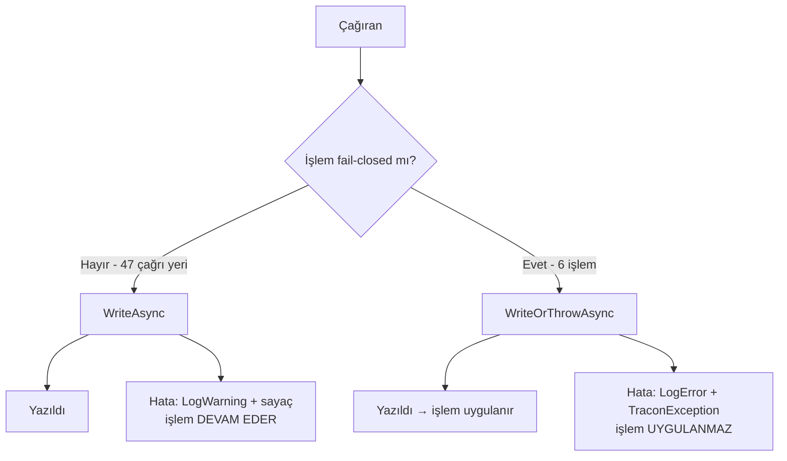

# Faz 171 — Denetim İzi Yazma Politikası

> **Durum:** ✅ Tamamlandı (2026-09-15)
> **Plan onayı:** onaylandı — kullanıcı "sıradaki fazı geliştir" dedi
> **Kaynak:** [ADAYLAR.md](../../ADAYLAR.md) · **F-234** · [YAYIN-HAZIRLIK.md](../../YAYIN-HAZIRLIK.md) **BL-047**
> **Önkoşul:** Yok. K-776 sözleşmeyi zaten sabitledi
> **Paketler:** `Tracon.Core`, `Tracon.AspNetCore`, `Tracon.Abstractions`
> **Yeni paket:** Yok · **Migration:** Yok
> **Public API:** Büyüyor — iki giriş. `PublicAPI.Shipped.txt` bugün **0 giriş** taşır (ölçüldü 2026-09-15), yani ekleme Faz 7'den önce ucuzdur; sonra bir sürüm kararı olur
> **Tüketici yüzeyi:** site: `concepts/governance.md` (garanti tablosu satırı), `guides/observability.md` (yeni sayaç)
> · sevk edilen: `IAuditLog` XML sözleşme metni, `capabilities.md` audit satırı
> **Manuel test alanı:** `docs/manuel-test/13-KIRACI-VE-GUVENLIK.md`

---

## Bu Faza Başlarken

> `faz-baslangic` skill'ini uygula. Aşağıdaki liste o skill'in 2. adımıdır —
> **tamamını değil, yalnız işaret edilen bölümleri oku.**

1. Bu doküman
2. Kararlar — dosyanın tamamını **okuma**, yalnız bu kalemleri grep'le:
   ```bash
   grep -n "K-776\|K-089\|K-370\|K-378\|K-771\|K-421" docs/KARARLAR.md
   ```
   **K-776** (garanti ayrımı yayımlanmış bir sözleşmedir — bu fazın tek gerekçesi),
   **K-089** (denetim izine yazılamayan `script` çalıştırılmaz),
   **K-370** (approval kararı doğrudan yazılır, hata yutulmaz),
   **K-378** (yalnız otomatik geri alma mutasyondan önce yazar),
   **K-771** (toplu kabul anahtarı yok — bu fazın kapsam sınırı),
   **K-421** (public API takibi açıktır)
3. [`arsiv/fazlar/170-PRODUCTION-PROFIL-KAPISI.md`](170-PRODUCTION-PROFIL-KAPISI.md) — yalnız devir notu:
   ```bash
   awk '/## Sonraki Faza Devir Notu/,0' docs/arsiv/fazlar/170-PRODUCTION-PROFIL-KAPISI.md
   ```
   🚨 O notun ilk maddesi bu faz için geçerlidir: `Tracon.AspNetCore`'un her
   host'ta koşan bir servis kayıt noktası **yoktur**. Bu fazın ortak metodu
   bu yüzden `static`'tir ve DI kaydı gerektirmez.
4. Alan hafızası (bu faz bir alana dokunuyor):
   [`hafiza/genisleme-noktalari-ve-denetim.md`](../../hafiza/genisleme-noktalari-ve-denetim.md)
   (denetim izi kapsamı; hangi `store`'un dekoratörü var)
5. Gerektiğinde, tamamı değil ilgili bölümü:
   [`MIMARI-GUVENLIK.md`](../../MIMARI-GUVENLIK.md) — denetim izi bölümü

---

## Amaç

K-776 denetim izinin garanti ayrımını **yayımlanmış bir sözleşme** hâline
getirdi: altı işlem fail-closed'dır, kalan her audit yazımı best-effort'tur.
Sözleşme yayımlandı, ama kodda onu zorlayan tek bir yer yok. Fail-closed yol
**dört ayrı elle yazılmış kopya** ve **iki ayrı doğrudan çağrı** olarak yaşıyor;
best-effort yolun ise hiçbir metriği yok, yani üretimde bozulduğu yalnız log
taranarak anlaşılıyor.

Bu faz iki şey yapar: altı yeri tek bir metoda indirir ve best-effort yola bir
sayaç verir. **Hiçbir işlemin fail-closed veya best-effort olma durumu
değişmez** — bu bir yeniden düzenlemedir, yeni bir yetenek değil.

- **F-234** — altı fail-closed çağrı yeri tek bir ortak metoda iner; `IAuditLog`
  sözleşme metni istisnayı da söyler.
- **BL-047** — best-effort audit yazma hatası bir sayaç artırır.

### Bugün ne çalışmıyor — doğrulanmış kanıt

| Kanıt | Gözlem |
|---|---|
| [`AuditRecorder.cs:53-60`](../../../src/Tracon.Core/Audit/AuditRecorder.cs) | Best-effort yolun tek `catch`'i. **47** çağrı sitesi, **26** dosya. Hata yalnız `LogWarning` — sayaç yok |
| [`AuditingSkillScriptGrantStore.cs:93`](../../../src/Tracon.Core/Audit/AuditingSkillScriptGrantStore.cs) | Birinci kopya. Çağrıları: `:76`, `:138`. `LogError` **yazar** |
| [`SandboxedSkillScriptRunner.cs:467`](../../../src/Tracon.Core/Skills/Scripts/SandboxedSkillScriptRunner.cs) | İkinci kopya. Çağrısı: `:300`. ⚠️ Planın *"`LogError` yazmaz"* iddiası **yanlıştı** — uygulama sırasında `git show 33abea50` ile ölçüldü, dördü de yazıyordu (denetim bulgusu 🟡#5) |
| [`ApprovalEndpoints.cs:347`](../../../src/Tracon.AspNetCore/Endpoints/ApprovalEndpoints.cs) | Üçüncü kopya. Çağrısı: `:226`. `:345` kopyayı kendi yorumunda kabul eder: *"the SAME pattern as `SandboxedSkillScriptRunner.WriteAuditOrThrowAsync`"* |
| [`TriggerEndpoints.cs:496`](../../../src/Tracon.AspNetCore/Endpoints/TriggerEndpoints.cs) | Dördüncü kopya. Çağrıları: `:220`, `:251`. `:491` de kopyayı kabul eder |
| [`CanaryEvaluationService.cs:180`](../../../src/Tracon.Core/Experiments/CanaryEvaluationService.cs) | Kopyasız fail-closed. `IAuditLog`'u doğrudan çağırır ve `Actor` alanına **sabit dize** yazar (`"system:canary-evaluator"`), `IAuditActorResolver` kullanmaz |
| [`DataSubjectEndpoints.cs:115`](../../../src/Tracon.AspNetCore/Endpoints/DataSubjectEndpoints.cs) | Kopyasız fail-closed. Yazma bir **geri çağrı** içinde, `store.EraseAsync`'in içinden koşar — sıralamayı `store` zorlar, çağıran değil |
| [`IAuditLog.cs:11-13`](../../../src/Tracon.Abstractions/Audit/IAuditLog.cs) | Sözleşme yalnız best-effort'u yazıyor: *"A write failure does not stop the operation."* Altı istisnadan hiç söz etmiyor |
| [`TraconDiagnostics.cs`](../../../src/Tracon.Core/Diagnostics/TraconDiagnostics.cs) | Sekiz sayaç adı sabiti var; audit için **hiçbiri yok** |
| `cat src/*/PublicAPI.Shipped.txt` | **0 giriş** — yüzeyi büyütmek bugün ucuz |

> Kanıtlar 2026-09-15 tarihinde doğrulandı.

---

## 171.1 — Tek politika: `AuditRecorder.WriteOrThrowAsync`

Mevcut `WriteAsync`'in kardeşi. Aynı `AuditEntry`'yi kurar, aynı secret
filtresini uygular; tek farkı hatayı **yutmamasıdır**.



İki tasarım kısıtı kanıttan doğar:

**Actor sabit olabilmeli.** `CanaryEvaluationService` `IAuditActorResolver`
kullanmaz; sistem aktörünü sabit dize olarak yazar. Ortak metot bu yüzden
aktörü iki biçimde almalıdır — çözücüden veya doğrudan. Çözücüyü zorunlu
kılan bir imza bu çağrı yerini dışarıda bırakır.

**Hata metni çağrı yerine özgü kalmalı.** Bugün dört kopya dört farklı cümle
yazar (*"was not changed"*, *"was not run"*, *"was not saved"*, *"the decision
was not applied"*). Bu cümleler tüketiciye görünür ve bilgi taşır; tek bir
genel cümleye indirilmezler. Ortak metot cümlenin **fiil kısmını** çağırandan
alır.

## 171.2 — Altı çağrı yerinin taşınması

| # | Çağrı yeri | Bugünkü şekli | Taşıma notu |
|---|---|---|---|
| 1 | `AuditingSkillScriptGrantStore.cs:76`, `:138` | Özel kopya | Düz taşıma |
| 2 | `SandboxedSkillScriptRunner.cs:300` | Özel kopya | Düz taşıma. `LogError` kazanır — bugün yazmıyor |
| 3 | `ApprovalEndpoints.cs:226` | Özel kopya | Düz taşıma |
| 4 | `TriggerEndpoints.cs:220`, `:251` | Özel kopya | Düz taşıma |
| 5 | `CanaryEvaluationService.cs:180` | Doğrudan `IAuditLog` | Sabit aktör yolu gerekir (171.1) |
| 6 | `DataSubjectEndpoints.cs:115` | Doğrudan `IAuditLog`, geri çağrı içinde | 🚨 En riskli taşıma. Sıralamayı `store.EraseAsync` zorlar; ortak metot geri çağrının **içinden** çağrılmalı, dışından değil |

🚨 **Sıralama semantiği korunur.** Beş ve altıncı çağrı yerinde audit satırı
mutasyondan **önce** yazılır (K-089, K-370). Taşıma bu sırayı değiştirirse
karar sessizce geri alınmış olur. Her iki yer için sıralamayı kanıtlayan test
zorunludur.

## 171.3 — Sözleşme metninin düzeltilmesi

[`IAuditLog.cs:11-13`](../../../src/Tracon.Abstractions/Audit/IAuditLog.cs) bugün
yalnız best-effort kuralını yazıyor. K-776 sonrası bu metin **eksiktir**:
tüketici sözleşmeyi okuyup altı istisnayı göremez. Metin istisnayı adıyla
söyler ve site tablosuna işaret eder.

Bu bir XML dokümanı değişikliğidir; imza değişmez, `PublicAPI` girişi
etkilenmez.

## 171.4 — Best-effort yolun sayacı (BL-047)

`TraconDiagnostics`'e yeni bir sabit, `TraconMetrics`'e yeni bir sayaç:

| Ad | Birim | Ne sayar |
|---|---|---|
| `tracon.audit.write_failures` | `{failure}` | Yazılamayan audit satırı |

Adlandırma mevcut desene uyar (`tracon.agent_source.failures`, `TraconDiagnostics.cs:73`).

**Açık tasarım noktası:** sayaç yalnız best-effort yolda mı artar, yoksa
fail-closed yolda da mı? İkisini de saymak "denetim izi ne sıklıkla
yazılamıyor" sorusunu tek sayıyla cevaplar; ayırmak ise "kaç işlem gerçekten
durdu" sorusunu cevaplar. Öneri: **tek sayaç, `outcome` etiketiyle ayrılır**
(`swallowed` · `refused`). Açık Sorular §1.

## 171.5 — Kaymayı önleyen mimari test

Bu fazın kendisi bir kopya kusurunu kapatıyor. Kapatan fazın kopyanın geri
gelmesini engellememesi, aynı kusuru bir sonraki faza devretmek olur.

Repo'da emsal var: [`AuditCoverageTests`](../../../tests/Tracon.Core.UnitTests/Architecture/AuditCoverageTests.cs)
her `governance` `store`'unun denetim dekoratörüne çözüldüğünü gerçek bir
kaptan doğrular. Aynı desen burada da kurulur: kaynak taramasıyla
`IAuditLog.WriteAsync`'in `Tracon.Core` ve `Tracon.AspNetCore` içinde
**yalnız `AuditRecorder` gövdesinden** çağrıldığı iddia edilir; başka her
doğrudan çağrı testi düşürür.

🚨 Kaynak taraması kırılgandır. Test, taradığı dosya kümesini ve beklenen
istisna listesini **açıkça** yazmalıdır; boş küme tarayıp yeşil dönen bir test
bu repo'da daha önce kusur üretti (`check-console-screens.mjs:28` aynı
korumayı taşır).

---

## Planlanan Public API

> Taslak imzalardır. Gerçekleşen imzalar kapanışta ayrı bir bölüme yazılır.

```csharp
// Tracon.Core — AuditRecorder (mevcut public static sınıf)
public static class AuditRecorder
{
    // MEVCUT — değişmez
    public static ValueTask WriteAsync(
        IAuditLog auditLog,
        IAuditActorResolver actorResolver,
        ILogger logger,
        string tenantId,
        string action,
        string entity,
        string? before,
        string? after,
        CancellationToken cancellationToken = default);

    // YENİ — hatayı yutmaz
    public static ValueTask WriteOrThrowAsync(
        IAuditLog auditLog,
        string actor,
        ILogger logger,
        string tenantId,
        string action,
        string entity,
        string? before,
        string? after,
        string refusalVerb,
        CancellationToken cancellationToken = default);
}

// Tracon.Core — TraconDiagnostics
public static partial class TraconDiagnostics
{
    public const string AuditWriteFailureCounterName = "tracon.audit.write_failures";
}
```

`actor` bir `string`'dir, `IAuditActorResolver` değil: 171.1'deki sabit aktör
kısıtı bunu gerektirir. Çözücüsü olan çağıran `actorResolver.Resolve()`
sonucunu geçer. `refusalVerb` hata cümlesinin çağrı yerine özgü kısmıdır
(örnek: `"was not run"`).

**Kırıcılık:** iki giriş de **yenidir**; mevcut hiçbir imza değişmez.
`PublicAPI.Shipped.txt` boş olduğu için bugün eklemek bedava, Faz 7'den sonra
eklemek bir sürüm kararı olur.

### HTTP `endpoint`'leri

Yok. Bu faz hiçbir `endpoint` eklemez veya değiştirmez.

### Arayüz payı

Yok. Arayüze dokunulmaz.

---

## Planlanan Dosya Listesi

```
src/Tracon.Abstractions/
└── Audit/
    └── IAuditLog.cs                          (XML sözleşme metni)

src/Tracon.Core/
├── Audit/
│   ├── AuditRecorder.cs                      (yeni metot + sayaç)
│   └── AuditingSkillScriptGrantStore.cs      (kopya kaldırılır)
├── Skills/Scripts/
│   └── SandboxedSkillScriptRunner.cs         (kopya kaldırılır)
├── Experiments/
│   └── CanaryEvaluationService.cs            (doğrudan çağrı taşınır)
├── Diagnostics/
│   ├── TraconDiagnostics.cs                  (sayaç adı sabiti)
│   └── TraconMetrics.cs                      (sayaç)
└── PublicAPI.Unshipped.txt                   (+2 giriş)

src/Tracon.AspNetCore/
└── Endpoints/
    ├── ApprovalEndpoints.cs                  (kopya kaldırılır)
    ├── TriggerEndpoints.cs                   (kopya kaldırılır)
    └── DataSubjectEndpoints.cs               (geri çağrı içinden taşınır)

tests/Tracon.Core.UnitTests/
├── Architecture/
│   └── AuditWritePolicyTests.cs              (YENİ — 171.5)
└── Audit/
    └── AuditRecorderTests.cs                 (YENİ veya genişletilir)

tests/Tracon.AspNetCore.FunctionalTests/
└── Audit/
    └── FailClosedAuditTests.cs               (YENİ — HTTP sınırında)

docs-site/src/content/docs/
├── concepts/governance.md                    (tablo satırı — şekil değişmez)
└── guides/observability.md                   (yeni sayaç)
```

---

## Hata Modları ve Testler

> Mutlu yoldan değil, **ne bozulabilir**den türetilir. Seviyeyi plan seçer.
> Sınır geçen davranış (DI · HTTP · kiracı · akış · depo · paket) birim
> testiyle kanıtlanamaz — [`.agents/ortak/test-seviyeleri.md`](../../../.agents/ortak/test-seviyeleri.md).

| Ne bozulabilir | Seviye | Test sınıfı |
|---|---|---|
| Taşıma sırasında bir işlem sessizce best-effort'a düşer | Fonksiyonel (HTTP sınırı) | `FailClosedAuditTests` |
| `store` yazamazken approval kararı yine de uygulanır | Fonksiyonel | `FailClosedAuditTests` |
| Canary geri alma audit'ten **sonra** yazar (sıra tersine döner) | Fonksiyonel | `FailClosedAuditTests` |
| Data-subject silme audit yazılamadan commit eder | Fonksiyonel | `FailClosedAuditTests` |
| Yeni bir doğrudan `IAuditLog.WriteAsync` çağrısı eklenir, politika atlanır | Birim (mimari) | `AuditWritePolicyTests` |
| Mimari test boş küme tarar ve yeşil döner | Birim (mimari) | `AuditWritePolicyTests` — sayı iddiası taşır |
| Best-effort hata sayacı hiç artmaz | Birim | `AuditRecorderTests` |
| Sayaç `OperationCanceledException`'da da artar (yanlış alarm) | Birim | `AuditRecorderTests` |
| `refusalVerb` hata mesajına `secret` sızdırır | Birim | `AuditRecorderTests` |
| Başka kiracının audit satırı yazılır | Sözleşme (`AuditLogContract`) | dört koşumda birden |
| İptal jetonu fail-closed yolda yutulur | Birim | `AuditRecorderTests` |

Beş sorunun cevabı: **iptal** — `OperationCanceledException` her iki yolda da
yutulmaz ve sayacı artırmaz. **Eşzamanlılık** — `AuditRecorder` `static` ve
durumsuzdur; yeni durum eklenmez. **Boş/aşırı girdi** — `refusalVerb` boşsa
genel cümle kullanılır; sınırı test eder. **Başka kiracı** — mevcut
`AuditLogContract` kapsar, yeni yol ona bağlanır. **Alt sistem hatası** — bu
fazın tam konusu.

---

## Manuel Kabul Case'leri

> Kapanışta [`docs/manuel-test/13-KIRACI-VE-GUVENLIK.md`](../../manuel-test/13-KIRACI-VE-GUVENLIK.md)
> içine eklenecek case'lerin taslağı.

| # | Ön koşul | Adımlar | Beklenen sonuç |
|---|---|---|---|
| 1 | `samples/Tracon.Api` koşuyor, PostgreSQL bağlı | `audit_log` tablosuna yazmayı reddet (rol izni kaldır), sonra bekleyen bir approval'ı onayla | `500` döner, karar **uygulanmaz**, `GET /api/approvals/{id}` hâlâ `Pending` |
| 2 | Aynı kurulum | Aynı durumda bir agent `run` başlat | `run` normal tamamlanır; log'da bir `LogWarning` ve `tracon.audit.write_failures` sayacı **1** artmıştır |
| 3 | Aynı kurulum | `audit_log` yazımını geri aç, aynı approval'ı onayla | Karar uygulanır, audit satırı yazılır, zincir `GET /api/audit/verify` ile `Valid` döner |
| 4 | Aynı kurulum | `audit_log` yazılamazken `DELETE /api/data-subjects/{id}?dryRun=false` çağır | Silme **gerçekleşmez**; sayım değişmez |

---

## Açık Sorular

> Planı bloklamayan, faz uygulanırken karara bağlanacak sorular.

| # | Soru | Seçenekler | Öneri |
|---|---|---|---|
| 1 | Sayaç fail-closed yolda da artsın mı? | A: tek sayaç + `outcome` etiketi (`swallowed`/`refused`) · B: yalnız best-effort | **A** — "denetim izi ne sıklıkla yazılamıyor" tek sorgudan cevaplanır, ayrım etiketle korunur |
| 2 | `DataSubjectEndpoints`'in geri çağrısı ortak metoda taşınabilir mi, yoksa `store` sözleşmesi mi engelliyor? | A: taşınır · B: yerinde kalır, XML gerekçe yazar | Uygulama anında ölçülür. Ölçüm B derse **DoD'den düşülmez** — gerekçe plana sapma olarak yazılır |
| 3 | `AuditWritePolicyTests` kaynak taraması mı, Roslyn analyzer mı olsun? | A: kaynak taraması (ucuz, kırılgan) · B: analyzer (pahalı, kesin) | **A** — B bir analyzer paketi maliyetidir; emsal `AuditCoverageTests` de kaptan doğrular, analyzer değildir |

---

## Bitiş Ölçütleri (DoD)

- [x] `grep -rn "WriteAuditOrThrowAsync" src/` **hiç eşleşme döndürmez** — doğrulandı
- [x] `IAuditLog.WriteAsync` yalnız `AuditRecorder.cs` içinde çağrılıyor (satır 65 ve 133); `AuditWritePolicyTests` bunu 500+ dosya tarayarak zorluyor
- [x] Altı fail-closed işlemin altısı da `AuditRecorder.WriteOrThrowAsync` çağırıyor — **dokuz** çağrı yeri (grant/revoke, trigger upsert/delete ve onayın iki yüzeyi ikişer). Onayın in-band yüzeyi bağımsız denetimde bulundu ve bu fazda kapatıldı (🔴 1)
- [x] `audit_log` yazılamazken approval kararı uygulanmıyor — `FailClosedAuditTests` kanıtlıyor; testin yükü taşıdığı, yolu geçici olarak best-effort'a düşürüp **iki testin kırmızıya döndüğü** görülerek doğrulandı
- [x] `audit_log` yazılamazken yönetim çağrısı tamamlanıyor ve `tracon.audit.write_failures` artıyor — gerçek süreçte `swallowed` 2, `refused` 1 ölçüldü
- [x] `IAuditLog` XML sözleşmesi altı istisnayı adıyla yazıyor — `SeamContractDocumentationTests`'in borç defteri bir kalem **küçüldü** (`IAuditLog:delivery`)
- [x] `AuditWritePolicyTests` rakamla iddia ediyor: 6 işlem · 9 çağrı yeri · 500+ taranan dosya. Boş küme taraması testi **düşürür**
- [x] Dört doğrulama kapısı — `kapi.py kapanis` (aşağıda)
- [x] `samples/Tracon.Api` ile gerçek koşum yapıldı, çıktı *Süreç Ölçümü*'ne yazıldı
- [x] `secret` taraması boş döndü (`kapi.py tarama`: ✅ temiz)
- [x] Manuel kabul case'leri eklendi (MT-SEC-190…193); dördü de otomatikleştirildi ve koşuldu
- [x] `faz-denetim` koşuldu (taze bağlamlı bağımsız denetçi); **1 🔴 · 5 🟡 · 3 🟢** bulundu ve **hepsi kapandı** — *Denetim Bulguları*
- [x] `docs-site/` güncellendi; `npm run check` temiz (1145 sayfa, 0 kırık bağlantı, 0 SEO hatası)
- [x] `YAYIN-HAZIRLIK.md`'de **BL-047 kapandı** olarak işaretlendi; § *Bu turun bulguları* 8. satır da ✅ oldu

### Doğrulama komutları — gerçek çıktı

```bash
$ grep -rn "WriteAuditOrThrowAsync" src/
# (eşleşme yok)

$ grep -rn "\.WriteAsync(" src/ --include="*.cs" | grep -iE "auditlog\.WriteAsync"
src/Tracon.Core/Audit/AuditRecorder.cs:65:            await auditLog.WriteAsync(
src/Tracon.Core/Audit/AuditRecorder.cs:133:            await auditLog.WriteAsync(

$ grep -rn "AuditRecorder.WriteOrThrowAsync(" src/ --include="*.cs" | wc -l
9

# Bir action adı kaç yerden yazılıyor? (denetim 🔴 1'in bulunma yolu)
$ grep -rn '"approval.decision"' src/ --include="*.cs"
src/Tracon.AspNetCore/Endpoints/ApprovalEndpoints.cs:233:            action: "approval.decision",
src/Tracon.AspNetCore/Internal/ToolApprovalResolver.cs:106:            action: "approval.decision",
```

Sayaç `samples/Tracon.Api`'nin gerçek sürecinden okundu — örnek bir Prometheus
ucu yayımlamaz (`/metrics` → 404), OpenTelemetry tüketicinin seçimidir:

```
$ dotnet-counters collect --process-id <pid> --counters Tracon --format csv
tracon.audit.write_failures[tracon.audit.action=agent.create;tracon.audit.outcome=swallowed;tracon.tenant.id=default]  2
tracon.audit.write_failures[tracon.audit.action=trigger.delete;tracon.audit.outcome=refused;tracon.tenant.id=default]  1
```

---

## Riskler

| Risk | Önlem |
|------|-------|
| Taşıma sırasında bir işlemin fail-closed'lığı sessizce kaybolur — **bu fazın en büyük riski**, çünkü kayıp yalnız `store` bozulduğunda görünür | Altı işlemin **altısında da** mutasyonun olmadığını kanıtlayan bir davranış testi var (tablo: *Denetim Bulguları* §4). Mimari test tek başına yetmez — ölçüldü: `GrantAsync`'in iki satırı yer değiştirince üç mimari test de **yeşil kaldı**, yalnız davranış testi düştü |
| `CanaryEvaluationService` ve `DataSubjectEndpoints`'in sıralama semantiği (mutasyondan **önce** yazma) taşımada tersine döner ve K-089/K-370 sessizce geri alınır | İki yer için sıralamayı kanıtlayan ayrı test; 171.2 tablosunda 🚨 ile işaretli |
| `DataSubjectEndpoints`'in geri çağrı şekli ortak metoda oturmaz ve taşıma yarım kalır | Açık Sorular §2 — ölçüm sonucu ne olursa olsun plana sapma olarak yazılır, sessizce atlanmaz |
| Mimari test boş küme tarar, yeşil döner, koruma sanılır | Test beklenen eşleşme sayısını rakamla iddia eder (171.5) |
| Public API +2 giriş; Faz 7'den sonra geri alınamaz | `PublicAPI.Shipped.txt` bugün 0 giriş — ölçüldü. Ekleme bugün ucuz |
| Sayaç `secret` taşıyan bir etiket alır | Sayaç yalnız sabit etiket taşır (`outcome`); `action`/`entity` etikete girmez |

---

<!-- ============================================================
     AŞAĞISI KAPANIŞTA DOLDURULUR — `faz-tamamlama` skill'i.
     Plan anında boş kalır. Başlıkları SİLME.
     ============================================================ -->

## Plandan Sapmalar

> Plan ile gerçek arasındaki fark **gizlenmez** — sonraki oturumun en değerli bilgisidir.

| Sapma | Karar | Gerekçe |
|---|---|---|
| 🚨 **Plan sayacın `AuditRecorder`'a NASIL ulaşacağını söylemiyordu.** `AuditRecorder` `static`'tir ve DI görmez | `TraconMetrics? metrics` **her iki metoda da zorunlu-nullable parametre** olarak eklendi; 46 best-effort çağrı yerinin hepsi derleyici tarafından ziyaret edildi | Üç seçenek ölçüldü. (a) `IAuditLog` dekoratörü: tek kayıt gibi görünüyor ama **dört** yerde yeniden uygulanmalı (`Core` + üç sağlayıcı `Replace` eder) **ve** tüketicinin kendi `IAuditLog` kaydı onu sessizce düşürürdü — sayaç Tracon'un kendi yazma yolunu ölçmeli, belirli bir kaydı değil. (b) Opsiyonel parametre: yeni çağrı yeri sessizce atlar — bu repo'nun tekrar eden kusur sınıfı. (c) Zorunlu-nullable: derleyici her çağrı yerini zorlar. **(c) seçildi.** Bedeli 9 dekoratör ctor'u + 36 kayıt satırı; hepsi mekanik ve tip uyuşmazlığı derlemede yakalanır |
| Plan `refusalVerb` (fiil) diyordu | Tek bir `refusal` parametresi — **cümlenin ilk yarısının tamamı** | Dört kopyanın cümleleri yalnız fiilde değil **öznede** de farklıydı (`"Script permission 'x'"` · `"Script 'x'"` · `"The approval decision with id 'x'"` · `"'x'"`). Fiil-only bir imza özneyi tek tipe indirirdi; iki parametre yerine bir parametre dördünü de **birebir** korur |
| Plan *"`refusalVerb` boşsa genel cümle kullanılır"* diyordu | Boş `refusal` **`ArgumentException` atıyor** | Genel bir cümle ("the operation was not applied") çağırana hangi işlemin reddedildiğini söylemez — o cümlenin tek işi budur. Dokuz çağrı yerinin hiçbirinde boş olamaz; boşsa bu bir programlama hatasıdır ve sessiz bir genelleme değil, gürültülü bir hata hak eder. `An_empty_refusal_is_rejected_before_anything_is_written` sabitliyor |
| Planda yoktu: `TimeProvider? timeProvider` parametresi | Eklendi | `SandboxedSkillScriptRunner` audit satırını `_timeProvider.GetUtcNow()` ile damgalıyordu, diğer beşi `DateTimeOffset.UtcNow` ile. "Düz taşıma" bu farkı sessizce silerdi ve runner'ın testleri sahte saatini kaybederdi |
| `CanaryEvaluationService` "düz taşıma" sanılıyordu | Taşındı **ama** çağrı bir `try`/`catch (TraconException)` içine alındı | Ölçüldü: eski kod `throw` **etmiyordu** — `LogWarning` yazıp `return` ediyordu. `WriteOrThrowAsync` artık atıyor; istisna bir kare yukarıda `TickAsync`'in `catch`'ine düşerdi ve mesaj "Canary evaluation failed" olurdu. Açık `catch` niyeti koda yazar: rollback uygulanmaz, tarama ölmez. Davranış aynı, **kaydı** daha iyi (artık `LogError` + sayaç da var) |
| Açık Soru §1 — sayaç fail-closed yolda da artsın mı? | **A (öneri)**: tek sayaç, `tracon.audit.outcome` etiketiyle `swallowed`/`refused` | Ölçüldü: canlı süreçte iki seri ayrı ayrı göründü (`agent.create`→`swallowed` rate 2, `trigger.delete`→`refused` rate 1). Tek sorgu "iz ne sıklıkla yazılamıyor", etiket "kaç işlem durdu" |
| Açık Soru §2 — `DataSubjectEndpoints` taşınabilir mi? | **A: taşındı** | `IDataSubjectStore.EraseAsync`'in `beforeCommitAsync` geri çağrısı `Func<…, ValueTask>`'tir ve atınca her `DELETE` geri alınır — `WriteOrThrowAsync`'in şekliyle **birebir** oturur. Çağrı geri çağrının **içinden** yapıldı, dışından değil |
| Açık Soru §3 — kaynak taraması mı, analyzer mı? | **A: kaynak taraması** | Emsal `AuditCoverageTests` de kaptan doğrular. Boş-küme tuzağına karşı tarama **500'den fazla dosya okuduğunu** ayrıca iddia eder |
| 🚨 **Planın kanıt tablosu yanlıştı**: *"`SandboxedSkillScriptRunner` `LogError` yazmaz"* | Düzeltildi | Ölçüldü (`git show 33abea50:<dosya> \| grep -c LogError`): dört kopyanın **dördü de** `LogError` yazıyordu. Ayrışan yer `CanaryEvaluationService`'ti — o bir kopya değil, doğrudan çağrıydı ve `LogWarning` yazıp `return` ediyordu. Yanlış iddia alan hafızasına ve bir test yorumuna kadar taşınmıştı; üçü de düzeltildi |
| Planda yoktu: `AuditContentPolicyTests`'in deseni genişletildi | `\bAuditRecorder\.Write(?:OrThrow)?Async` | Desen yalnız `WriteAsync` arıyordu; beş dosya fail-closed yola geçince **izleme listesinden düştüler** ve testin ikinci yarısı (`Every_allowed_file_still_exists`) kırmızı döndü. Düzeltme listeden silmek değil, deseni genişletmektir: fail-closed yol da aynı `AuditEntry`'yi yazar, yani içerik politikası ona da uygulanır |
| Planda yoktu: iki sevk edilen metin düzeltildi | `trigger.delete`'in reddi artık *"was not deleted"* (önce *"was not saved"*); `governance.md` satırı *"Saving or deleting an inbound trigger"* | Ortak kopya tek cümleyi hem upsert hem delete için kullanıyordu, site tablosu da yalnız kaydetmeyi sayıyordu. İkisi de **silmenin de fail-closed olduğunu** gizliyordu |
| Planda yoktu: `PublicAPI.Unshipped.txt` **tamamen yeniden sıralandı** (457+/451−) | Bırakıldı | Taban dosya sıralı değildi; girişleri eklerken tamamı sıralandı. Küme farkı doğrulandı — `diff <(sort taban) <(sort yeni)` yalnız 6 yeni + 2 değişen gösterir, **kayıp yok**. Bir kerelik gürültü; bundan sonraki `git diff`'ler daha okunur |
| DoD'nin `curl /metrics` komutu | Koşulamadı; yerine `dotnet-counters` ile canlı süreçten okundu | `samples/Tracon.Api` bir Prometheus ucu **yayımlamıyor** (`/metrics` → 404) — OpenTelemetry tüketicinin seçimidir (K-063 deseni). Ölçüm yine gerçek süreçten alındı |

### Site senkron kuralları — gerekçeli geçiş

`dokuman-bakim.py --site-denetle` iki kuralı tetikledi; ikisinin de hedef sayfası
**kasıtlı olarak** değişmedi:

| Kural | Neden tetiklendi | Neden hedef sayfa değişmedi |
|---|---|---|
| `http-api` → `docs/openapi/tracon.json` · `http-api.md` | 12 endpoint dosyası değişti | Değişiklik yalnız `[FromServices] TraconMetrics metrics` parametresidir. Yeni rota yok, istek/yanıt şekli yok, durum kodu yok — ölçüldü: `git diff` içinde tek bir `MapGet`/`MapPost`/`Accepts<>`/`Produces<>` satırı eklenmedi ve `docs/openapi/tracon.json` **hiç değişmedi** (`OpenApiSnapshotTests` yeşil). `[FromServices]` OpenAPI belgesine girmez |
| `kalicilik` → `getting-started/persistence.md` | Üç SQL sağlayıcısının builder uzantısı değişti | Değişiklik yalnız dekoratör kayıtlarına `provider.GetRequiredService<TraconMetrics>()` eklenmesidir. Migration yok, şema yok, yeni seçenek yok, bağlantı davranışı yok |

Fazın gerçek tüketici yüzeyi `guides/observability.md` (yeni sayaç ve iki etiket)
ve `concepts/governance.md`'dir (fail-closed tablo satırı düzeltildi, sayaca bağ
verildi); ikisi de güncellendi ve `guvenlik-kiraci` ile `cekirdek-kavram`
kuralları ✅ döndü.

## Bu Fazda Verilen Kararlar

Yeni bir `K-*` kaydı **açılmadı**. Bu faz K-776'yı uygulayan bir yeniden
düzenlemedir; hiçbir işlemin garanti sınıfı değişmedi ve public yüzey büyümesi
bir uyumluluk sözü taşımıyor (`PublicAPI.Shipped.txt` boş, K-603).

⚠️ `docs/KARARLAR.md` bütçesi **%0 boş** (419.359 / 420.000 B). Bir sonraki
`K-*` kaydından önce `karar-damit` koşmak zorunludur — YAYIN-HAZIRLIK bunu zaten
yazıyor ve bu faz bütçeyi harcamayarak o zorunluluğu **ertelemedi**.

## Gerçekleşen Public API

```csharp
// Tracon.Core — AuditRecorder
public static class AuditRecorder
{
    // DEĞİŞTİ: dördüncü parametre eklendi
    public static ValueTask WriteAsync(
        IAuditLog auditLog,
        IAuditActorResolver actorResolver,
        ILogger logger,
        TraconMetrics? metrics,
        string tenantId,
        string action,
        string entity,
        string? before,
        string? after,
        CancellationToken cancellationToken);

    // YENİ
    public static ValueTask WriteOrThrowAsync(
        IAuditLog auditLog,
        string? actor,
        ILogger logger,
        TraconMetrics? metrics,
        string tenantId,
        string action,
        string entity,
        string? before,
        string? after,
        string refusal,
        TimeProvider? timeProvider,
        CancellationToken cancellationToken);
}

// Tracon.Core — TraconDiagnostics
public const string AuditWriteFailureCounterName = "tracon.audit.write_failures";
public const string Tags.AuditAction = "tracon.audit.action";
public const string Tags.AuditOutcome = "tracon.audit.outcome";

// Tracon.Core — TraconMetrics
public Counter<long> AuditWriteFailures { get; }
public void RecordAuditWriteFailure(string tenantId, string action, string outcome);

// Tracon.Core — ContentGuardPipeline (ctor, OPSİYONEL parametre)
public ContentGuardPipeline(..., ILoggerFactory loggerFactory, TraconMetrics? metrics = null);
```

Planla fark: plan **+2 giriş** öngörüyordu, gerçekleşen **+6 yeni · 2 değişen**
(`Unshipped` 1462 → 1468, ölçüldü). Fazladan dördü sayacın kendisidir
(`TraconMetrics` üyeleri ve iki etiket sabiti) — plan bunları "yeni sabit ve
sayaç" diye tarif etmiş ama `PublicAPI` satırı olarak saymamıştı.

`ContentGuardPipeline`'ın kurucusu **public**tir; parametre bu yüzden opsiyonel
verildi — tüketici kendi örneğini kurabilir. Dekoratörlerin hepsi `internal`,
orada parametre zorunludur.

## Dosya Listesi (gerçekleşen)

```
src/Tracon.Abstractions/Audit/IAuditLog.cs          (XML: altı istisna adıyla)
src/Tracon.Core/
├── Audit/AuditRecorder.cs                          (iki yol + sayaç)
├── Audit/AuditingSkillScriptGrantStore.cs          (kopya kalktı)
├── Audit/Auditing{AgentDefinition,AgentSkill,Experiment,McpServer,
│         Session,Tenant,ToolApprovalRule,WorkflowDefinition}Store.cs   (metrics ctor)
├── Skills/Scripts/SandboxedSkillScriptRunner.cs    (kopya kalktı)
├── Experiments/CanaryEvaluationService.cs          (doğrudan çağrı taşındı)
├── Guards/ContentGuardPipeline.cs                  (metrics ctor, opsiyonel)
├── Diagnostics/TraconDiagnostics.cs                (sabit + iki etiket)
├── Diagnostics/TraconMetrics.cs                    (sayaç + Record metodu)
├── TraconServiceCollectionExtensions.Registration.{Core,Storage}.cs   (9 kayıt)
└── PublicAPI.Unshipped.txt                         (+5, 2 değişti)

src/Tracon.{PostgreSql,SqlServer,Sqlite}/*BuilderExtensions.cs   (9'ar kayıt)

src/Tracon.AspNetCore/
├── Endpoints/{Approval,Trigger,DataSubject}Endpoints.cs        (fail-closed)
├── Endpoints/{ApiKey,Catalog,Eval,Governance,Quota,Retention,
│              Run,Session,TenantProvider,Webhook,Agent}Endpoints.cs   (metrics)
├── Internal/ToolApprovalResolver.cs                (🔴 denetim: fail-closed'a geçti)
├── Internal/ClientToolResultResolver.cs                        (metrics)
└── Security/ExternalCallAudit.cs                               (metrics)

tests/Tracon.Core.UnitTests/
├── Architecture/AuditWritePolicyTests.cs           (YENİ — üç ratchet)
├── Architecture/AuditContentPolicyTests.cs         (desen genişledi)
├── Audit/AuditRecorderTests.cs                     (YENİ — yedi test)
├── Audit/AuditingSkillScriptGrantStoreTests.cs     (YENİ — üç test, denetim 🟡#4)
└── Fakes/MetricTestHelpers.cs                      (etiket toplama)

tests/Tracon.AspNetCore.FunctionalTests/
├── FailClosedAuditTests.cs                         (YENİ — altı test)
└── DataSubjectEndpointTests.cs                     (istisna tipi değişti)

docs-site/src/content/docs/
├── guides/observability.md                         (sayaç + iki etiket + bölüm)
└── concepts/governance.md                          (satır düzeltildi + sayaç bağı)

docs/manuel-test/13-KIRACI-VE-GUVENLIK.md           (MT-SEC-190…193)
docs/manuel-test/00-INDEKS.md                       (140 → 144)
```

## Süreç Ölçümü

| Metrik | Değer |
|---|---|
| Plan revizyonu sayısı | 0 — plan revize edilmedi, sapmalar yukarıda yazıldı |
| Düzeltme turu sayısı | 9 (analyzer: MA0023 · MA0006 · MA0002 · CS1573; ratchet sayısı 7→8→9; `[FromServices]` iki iç yardımcıda geçersiz; SSE çerçevesi JSON sanıldı; `using` sırası) |
| 🔴 bulgu: gerçek / gürültü / araştırılacak | **1 / 0 / 0** — gerçekti ve kapatıldı (in-band onay yolu). Ayrıca 5 🟡 (hepsi kapandı, biri kalıcı hafızadaki **yanlış bir olguydu**) ve 3 🟢 |
| Fazın ürettiği regresyon | 0 — iki mevcut test kırıldı, ikisi de **kasıtlı davranış değişikliğinin kanıtıydı** (`AuditContentPolicyTests` deseni; `DataSubjectEndpointTests` istisna tipi) |
| Faz kapandıktan sonra bulunan kusur | — |

**Kanıt: testler yükü taşıyor.** `ApprovalEndpoints` geçici olarak best-effort
yola düşürüldü; `FailClosedAuditTests`'in **iki** testi kırmızıya döndü
(`An_approval_decision_is_not_applied_…`, `The_same_approval_is_decided_once_…`).
Geri alındı, yeşile döndü. Sessiz bir düşüş artık sessiz değildir.

**Kanıt: gerçek süreç, gerçek veritabanı.** `samples/Tracon.Api` SQLite ile
koştu; `tracon_audit_log` üzerine `RAISE(ABORT)` yazan bir trigger kondu:

| Ne yapıldı | Gözlenen |
|---|---|
| `DELETE /api/triggers/slack` (fail-closed) | `HTTP 500`; `GET /api/triggers` → **1 trigger hâlâ duruyor**; log'da `LogError` + `TraconException: 'trigger:slack' was not deleted because it could not be written to the audit trail.` |
| `POST /api/agents` (best-effort) | `HTTP 201`; `GET /api/agents/faz171-agent` → **200, agent gerçekten var**; log'da yalnız `LogWarning` |
| `dotnet-counters --counters Tracon` | `tracon.audit.write_failures[action=agent.create;outcome=swallowed]` → **2** · `[action=trigger.delete;outcome=refused]` → **1** |
| Trigger düşürüldü, `DELETE` tekrarlandı | `HTTP 204`; trigger silindi; `trigger.delete` audit satırı yazıldı |
| `GET /api/audit/verify` | `{"status":"Valid","entriesChecked":2}` — reddedilen deneme zincirde **boşluk bırakmaz**, çünkü hiç satır yazılmamıştır |

## Denetim Bulguları

> Bağımsız denetçi (`faz-denetim`, taze bağlam) `33abea50` → çalışma ağacını yargıladı.
> **1 🔴 · 5 🟡 · 3 🟢.** Hepsi kapandı.

### 🔴 1 — `approval.decision`'ın ikinci yolu yayımlanmış garantiyi yalanlıyordu

**Bulgu.** Bir onay kararı **iki** yüzeyden gelebilir: onay kutusu
(`POST /api/approvals/{id}/decide`) ve **run gövdesinin kendisi**
(`AgentRunRequest.Approvals` → `ToolApprovalResolver`). Birincisi fail-closed'dı;
ikincisi `AuditRecorder.WriteAsync` çağırıyordu — **best-effort**. Oysa
`governance.md:185` *"An approval decision → The decision is not applied"* diyor ve
`:299` bunu *"not applied **at all**"* diye pekiştiriyor.

🚨 **Bu fazın kendisi çelişkiyi görünür kılıyordu.** Yeni sayaç, `audit_log`
bozulduğunda tüketicinin dashboard'una
`tracon.audit.write_failures{action=approval.decision,outcome=swallowed}` basacaktı —
yani yayımlanmış garantinin yanlış olduğunu **bizim ölçümümüz** ilan edecekti.

**Karar: (a) — in-band yol fail-closed'a geçirildi.** Denetçi üç seçenek sunmuştu:
(a) yolu düzelt, (b) garanti metnini *"out-of-band approval decision"* diye daralt,
(c) ertele. (b) yayımlanmış bir güvenlik garantisini **daraltmak** olurdu ve bunun
gerekçesi "kodumuz öyle yapmıyor"dan ibaret kalırdı — K-089'un gerekçesi (onay kararı
geri alınamaz bir eylemdir) hangi yüzeyden geldiğine bakmaz. (c) bir sonraki faza
**bilinen bir yalan** devretmek olurdu.

Fazın kapsam sözü *"hiçbir işlemin garanti sınıfı değişmez"*di; bu sözü **çiğnemiyor**,
uyguluyor: garanti sınıfını K-776 zaten belirlemişti, kod ona uymuyordu.

| Ne | Nerede |
|---|---|
| Düzeltme | `ToolApprovalResolver.cs:99-118` — `WriteOrThrowAsync`, ve yazım `contents.Add` **öncesine** alındı |
| Davranış testi | `FailClosedAuditTests.An_in_band_approval_decision_is_refused_the_same_way_as_an_out_of_band_one` |
| Ratchet | `AuditWritePolicyTests`: 8 → **9** çağrı yeri; `FailClosedOperations` onay kararını iki yüzeyle listeliyor, "altı işlem" iddiası korunuyor |

Ret çağırana akışın **`error` çerçevesi** olarak ulaşır ve onaylanan tool **hiç
çalışmaz** — test ikisini de iddia eder:

```
event: error
data: {"type":"TraconException","message":"The approval decision for tool 'cancel_order'
       was not applied because it could not be written to the audit trail."}
```

### 🟡 Kapananlar

| # | Bulgu | Kapanış |
|---|---|---|
| 2 | `DataSubjectEndpoints.cs:1` `using` sırası bozuk — repo'daki **tek** ihlal (1/~1500). DoD *"dört kapı sıfır uyarı"* diyordu ama `dotnet format` o dosyadan sonra koşulmamıştı | `dotnet format` ile düzeltildi; `--verify-no-changes` **temiz** |
| 3 | `CanaryEvaluationService.cs:180` `var now` taşımadan kalan ölü satır (IDE0059 yalnız `suggestion`, kapılardan geçerdi) | Silindi |
| 4 | `script.grant` / `script.revoke` için **hiçbir davranış testi yoktu** — ne yeni ne eski. Riskler tablosu ise *"`FailClosedAuditTests` her altı işlemi ayrı ayrı koşar"* diye **yanlış** iddia ediyordu | `AuditingSkillScriptGrantStoreTests` (3 test) eklendi. 🚨 Yükü taşıdığı ölçüldü: `GrantAsync`'in iki satırı yer değiştirildi → **üç mimari test de yeşil kaldı**, yalnız yeni davranış testi düştü. Riskler tablosundaki iddia gerçekle değiştirildi |
| 5 | 🚨 **Kalıcı hafızaya yanlış bir olgu yazılmıştı**: *"dört kopyadan biri `LogError` yazmıyordu"*. Kaynağı planın kanıt tablosuydu; kopyalandı | `git show 33abea50:<dosya> \| grep -c LogError` → **dördü de 1**. İddia yanlış. Üç yerde düzeltildi: alan hafızası, faz dokümanı (iki yer), `AuditRecorderTests` yorumu. Ayrışan yer `CanaryEvaluationService`'ti (kopya değil, doğrudan çağrı) |
| 6 | Plandan sapma yazılmamış: boş `refusal` planda *"genel cümle"*, kodda `ArgumentException` | *Plandan Sapmalar*'a satır eklendi |

### 🟢 Aday / kozmetik

| # | Bulgu | Karar |
|---|---|---|
| 7 | `AuditWritePolicyTests`'in deseni **değişken adına** bağlı: `IAuditLog log = …; log.WriteAsync(…)` şeklini görmez | Açık Soru §3'te "ucuz ama **kırılgan**" diye bilerek seçildi ve gerekçesi yazıldı. Analyzer'a geçmek ayrı bir fazdır — `ADAYLAR.md`'ye düşer |
| 8 | `PublicAPI.Unshipped.txt` tamamen yeniden sıralandı (457+/451−) | *Plandan Sapmalar*'a yazıldı; küme farkı `diff <(sort) <(sort)` ile doğrulandı, kayıp yok |
| 9 | Public API sayısı dokümanda yanlış (1463 → gerçek 1462) | Düzeltildi |

### Denetçinin temiz bulduğu başlıklar

Test tiyatrosu **yok** (her fonksiyonel test mutasyonun olmadığını iddia ediyor, yalnız
istisna tipini değil) · test seviyeleri doğru (sınır geçen davranış fonksiyonel) · hata
yolları tam (iptal her iki yolda yutulmuyor ve sayacı artırmıyor) · **imza-gövde kayması
yok** (46 + 9 çağrı yerinin hepsi `metrics` geçiyor; 27/27 dekoratör kaydı dört dosyada
da tam) · plan dışı public API gerekçeli · sevk edilen XML'de faz/karar numarası yok ·
muafiyet listeleri ve taban çizgileri **yalnız küçüldü** (`seam-contract-baseline` 172 →
171; `AllowedCallSites` budanmadı, desen genişletildi).

## Sonraki Faza Devir Notu/,0' docs/arsiv/fazlar/170-PRODUCTION-PROFIL-KAPISI.md
   ```
   🚨 O notun ilk maddesi bu faz için geçerlidir: `Tracon.AspNetCore`'un her
   host'ta koşan bir servis kayıt noktası **yoktur**. Bu fazın ortak metodu
   bu yüzden `static`'tir ve DI kaydı gerektirmez.
4. Alan hafızası (bu faz bir alana dokunuyor):
   [`hafiza/genisleme-noktalari-ve-denetim.md`](../../hafiza/genisleme-noktalari-ve-denetim.md)
   (denetim izi kapsamı; hangi `store`'un dekoratörü var)
5. Gerektiğinde, tamamı değil ilgili bölümü:
   [`MIMARI-GUVENLIK.md`](../../MIMARI-GUVENLIK.md) — denetim izi bölümü

---

## Amaç

K-776 denetim izinin garanti ayrımını **yayımlanmış bir sözleşme** hâline
getirdi: altı işlem fail-closed'dır, kalan her audit yazımı best-effort'tur.
Sözleşme yayımlandı, ama kodda onu zorlayan tek bir yer yok. Fail-closed yol
**dört ayrı elle yazılmış kopya** ve **iki ayrı doğrudan çağrı** olarak yaşıyor;
best-effort yolun ise hiçbir metriği yok, yani üretimde bozulduğu yalnız log
taranarak anlaşılıyor.

Bu faz iki şey yapar: altı yeri tek bir metoda indirir ve best-effort yola bir
sayaç verir. **Hiçbir işlemin fail-closed veya best-effort olma durumu
değişmez** — bu bir yeniden düzenlemedir, yeni bir yetenek değil.

- **F-234** — altı fail-closed çağrı yeri tek bir ortak metoda iner; `IAuditLog`
  sözleşme metni istisnayı da söyler.
- **BL-047** — best-effort audit yazma hatası bir sayaç artırır.

### Bugün ne çalışmıyor — doğrulanmış kanıt

| Kanıt | Gözlem |
|---|---|
| [`AuditRecorder.cs:53-60`](../../../src/Tracon.Core/Audit/AuditRecorder.cs) | Best-effort yolun tek `catch`'i. **47** çağrı sitesi, **26** dosya. Hata yalnız `LogWarning` — sayaç yok |
| [`AuditingSkillScriptGrantStore.cs:93`](../../../src/Tracon.Core/Audit/AuditingSkillScriptGrantStore.cs) | Birinci kopya. Çağrıları: `:76`, `:138`. `LogError` **yazar** |
| [`SandboxedSkillScriptRunner.cs:467`](../../../src/Tracon.Core/Skills/Scripts/SandboxedSkillScriptRunner.cs) | İkinci kopya. Çağrısı: `:300`. ⚠️ Planın *"`LogError` yazmaz"* iddiası **yanlıştı** — uygulama sırasında `git show 33abea50` ile ölçüldü, dördü de yazıyordu (denetim bulgusu 🟡#5) |
| [`ApprovalEndpoints.cs:347`](../../../src/Tracon.AspNetCore/Endpoints/ApprovalEndpoints.cs) | Üçüncü kopya. Çağrısı: `:226`. `:345` kopyayı kendi yorumunda kabul eder: *"the SAME pattern as `SandboxedSkillScriptRunner.WriteAuditOrThrowAsync`"* |
| [`TriggerEndpoints.cs:496`](../../../src/Tracon.AspNetCore/Endpoints/TriggerEndpoints.cs) | Dördüncü kopya. Çağrıları: `:220`, `:251`. `:491` de kopyayı kabul eder |
| [`CanaryEvaluationService.cs:180`](../../../src/Tracon.Core/Experiments/CanaryEvaluationService.cs) | Kopyasız fail-closed. `IAuditLog`'u doğrudan çağırır ve `Actor` alanına **sabit dize** yazar (`"system:canary-evaluator"`), `IAuditActorResolver` kullanmaz |
| [`DataSubjectEndpoints.cs:115`](../../../src/Tracon.AspNetCore/Endpoints/DataSubjectEndpoints.cs) | Kopyasız fail-closed. Yazma bir **geri çağrı** içinde, `store.EraseAsync`'in içinden koşar — sıralamayı `store` zorlar, çağıran değil |
| [`IAuditLog.cs:11-13`](../../../src/Tracon.Abstractions/Audit/IAuditLog.cs) | Sözleşme yalnız best-effort'u yazıyor: *"A write failure does not stop the operation."* Altı istisnadan hiç söz etmiyor |
| [`TraconDiagnostics.cs`](../../../src/Tracon.Core/Diagnostics/TraconDiagnostics.cs) | Sekiz sayaç adı sabiti var; audit için **hiçbiri yok** |
| `cat src/*/PublicAPI.Shipped.txt` | **0 giriş** — yüzeyi büyütmek bugün ucuz |

> Kanıtlar 2026-09-15 tarihinde doğrulandı.

---

## 171.1 — Tek politika: `AuditRecorder.WriteOrThrowAsync`

Mevcut `WriteAsync`'in kardeşi. Aynı `AuditEntry`'yi kurar, aynı secret
filtresini uygular; tek farkı hatayı **yutmamasıdır**.


İki tasarım kısıtı kanıttan doğar:

**Actor sabit olabilmeli.** `CanaryEvaluationService` `IAuditActorResolver`
kullanmaz; sistem aktörünü sabit dize olarak yazar. Ortak metot bu yüzden
aktörü iki biçimde almalıdır — çözücüden veya doğrudan. Çözücüyü zorunlu
kılan bir imza bu çağrı yerini dışarıda bırakır.

**Hata metni çağrı yerine özgü kalmalı.** Bugün dört kopya dört farklı cümle
yazar (*"was not changed"*, *"was not run"*, *"was not saved"*, *"the decision
was not applied"*). Bu cümleler tüketiciye görünür ve bilgi taşır; tek bir
genel cümleye indirilmezler. Ortak metot cümlenin **fiil kısmını** çağırandan
alır.

## 171.2 — Altı çağrı yerinin taşınması

| # | Çağrı yeri | Bugünkü şekli | Taşıma notu |
|---|---|---|---|
| 1 | `AuditingSkillScriptGrantStore.cs:76`, `:138` | Özel kopya | Düz taşıma |
| 2 | `SandboxedSkillScriptRunner.cs:300` | Özel kopya | Düz taşıma. `LogError` kazanır — bugün yazmıyor |
| 3 | `ApprovalEndpoints.cs:226` | Özel kopya | Düz taşıma |
| 4 | `TriggerEndpoints.cs:220`, `:251` | Özel kopya | Düz taşıma |
| 5 | `CanaryEvaluationService.cs:180` | Doğrudan `IAuditLog` | Sabit aktör yolu gerekir (171.1) |
| 6 | `DataSubjectEndpoints.cs:115` | Doğrudan `IAuditLog`, geri çağrı içinde | 🚨 En riskli taşıma. Sıralamayı `store.EraseAsync` zorlar; ortak metot geri çağrının **içinden** çağrılmalı, dışından değil |

🚨 **Sıralama semantiği korunur.** Beş ve altıncı çağrı yerinde audit satırı
mutasyondan **önce** yazılır (K-089, K-370). Taşıma bu sırayı değiştirirse
karar sessizce geri alınmış olur. Her iki yer için sıralamayı kanıtlayan test
zorunludur.

## 171.3 — Sözleşme metninin düzeltilmesi

[`IAuditLog.cs:11-13`](../../../src/Tracon.Abstractions/Audit/IAuditLog.cs) bugün
yalnız best-effort kuralını yazıyor. K-776 sonrası bu metin **eksiktir**:
tüketici sözleşmeyi okuyup altı istisnayı göremez. Metin istisnayı adıyla
söyler ve site tablosuna işaret eder.

Bu bir XML dokümanı değişikliğidir; imza değişmez, `PublicAPI` girişi
etkilenmez.

## 171.4 — Best-effort yolun sayacı (BL-047)

`TraconDiagnostics`'e yeni bir sabit, `TraconMetrics`'e yeni bir sayaç:

| Ad | Birim | Ne sayar |
|---|---|---|
| `tracon.audit.write_failures` | `{failure}` | Yazılamayan audit satırı |

Adlandırma mevcut desene uyar (`tracon.agent_source.failures`, `TraconDiagnostics.cs:73`).

**Açık tasarım noktası:** sayaç yalnız best-effort yolda mı artar, yoksa
fail-closed yolda da mı? İkisini de saymak "denetim izi ne sıklıkla
yazılamıyor" sorusunu tek sayıyla cevaplar; ayırmak ise "kaç işlem gerçekten
durdu" sorusunu cevaplar. Öneri: **tek sayaç, `outcome` etiketiyle ayrılır**
(`swallowed` · `refused`). Açık Sorular §1.

## 171.5 — Kaymayı önleyen mimari test

Bu fazın kendisi bir kopya kusurunu kapatıyor. Kapatan fazın kopyanın geri
gelmesini engellememesi, aynı kusuru bir sonraki faza devretmek olur.

Repo'da emsal var: [`AuditCoverageTests`](../../../tests/Tracon.Core.UnitTests/Architecture/AuditCoverageTests.cs)
her `governance` `store`'unun denetim dekoratörüne çözüldüğünü gerçek bir
kaptan doğrular. Aynı desen burada da kurulur: kaynak taramasıyla
`IAuditLog.WriteAsync`'in `Tracon.Core` ve `Tracon.AspNetCore` içinde
**yalnız `AuditRecorder` gövdesinden** çağrıldığı iddia edilir; başka her
doğrudan çağrı testi düşürür.

🚨 Kaynak taraması kırılgandır. Test, taradığı dosya kümesini ve beklenen
istisna listesini **açıkça** yazmalıdır; boş küme tarayıp yeşil dönen bir test
bu repo'da daha önce kusur üretti (`check-console-screens.mjs:28` aynı
korumayı taşır).

---

## Planlanan Public API

> Taslak imzalardır. Gerçekleşen imzalar kapanışta ayrı bir bölüme yazılır.

```csharp
// Tracon.Core — AuditRecorder (mevcut public static sınıf)
public static class AuditRecorder
{
    // MEVCUT — değişmez
    public static ValueTask WriteAsync(
        IAuditLog auditLog,
        IAuditActorResolver actorResolver,
        ILogger logger,
        string tenantId,
        string action,
        string entity,
        string? before,
        string? after,
        CancellationToken cancellationToken = default);

    // YENİ — hatayı yutmaz
    public static ValueTask WriteOrThrowAsync(
        IAuditLog auditLog,
        string actor,
        ILogger logger,
        string tenantId,
        string action,
        string entity,
        string? before,
        string? after,
        string refusalVerb,
        CancellationToken cancellationToken = default);
}

// Tracon.Core — TraconDiagnostics
public static partial class TraconDiagnostics
{
    public const string AuditWriteFailureCounterName = "tracon.audit.write_failures";
}
```

`actor` bir `string`'dir, `IAuditActorResolver` değil: 171.1'deki sabit aktör
kısıtı bunu gerektirir. Çözücüsü olan çağıran `actorResolver.Resolve()`
sonucunu geçer. `refusalVerb` hata cümlesinin çağrı yerine özgü kısmıdır
(örnek: `"was not run"`).

**Kırıcılık:** iki giriş de **yenidir**; mevcut hiçbir imza değişmez.
`PublicAPI.Shipped.txt` boş olduğu için bugün eklemek bedava, Faz 7'den sonra
eklemek bir sürüm kararı olur.

### HTTP `endpoint`'leri

Yok. Bu faz hiçbir `endpoint` eklemez veya değiştirmez.

### Arayüz payı

Yok. Arayüze dokunulmaz.

---

## Planlanan Dosya Listesi

```
src/Tracon.Abstractions/
└── Audit/
    └── IAuditLog.cs                          (XML sözleşme metni)

src/Tracon.Core/
├── Audit/
│   ├── AuditRecorder.cs                      (yeni metot + sayaç)
│   └── AuditingSkillScriptGrantStore.cs      (kopya kaldırılır)
├── Skills/Scripts/
│   └── SandboxedSkillScriptRunner.cs         (kopya kaldırılır)
├── Experiments/
│   └── CanaryEvaluationService.cs            (doğrudan çağrı taşınır)
├── Diagnostics/
│   ├── TraconDiagnostics.cs                  (sayaç adı sabiti)
│   └── TraconMetrics.cs                      (sayaç)
└── PublicAPI.Unshipped.txt                   (+2 giriş)

src/Tracon.AspNetCore/
└── Endpoints/
    ├── ApprovalEndpoints.cs                  (kopya kaldırılır)
    ├── TriggerEndpoints.cs                   (kopya kaldırılır)
    └── DataSubjectEndpoints.cs               (geri çağrı içinden taşınır)

tests/Tracon.Core.UnitTests/
├── Architecture/
│   └── AuditWritePolicyTests.cs              (YENİ — 171.5)
└── Audit/
    └── AuditRecorderTests.cs                 (YENİ veya genişletilir)

tests/Tracon.AspNetCore.FunctionalTests/
└── Audit/
    └── FailClosedAuditTests.cs               (YENİ — HTTP sınırında)

docs-site/src/content/docs/
├── concepts/governance.md                    (tablo satırı — şekil değişmez)
└── guides/observability.md                   (yeni sayaç)
```

---

## Hata Modları ve Testler

> Mutlu yoldan değil, **ne bozulabilir**den türetilir. Seviyeyi plan seçer.
> Sınır geçen davranış (DI · HTTP · kiracı · akış · depo · paket) birim
> testiyle kanıtlanamaz — [`.agents/ortak/test-seviyeleri.md`](../../../.agents/ortak/test-seviyeleri.md).

| Ne bozulabilir | Seviye | Test sınıfı |
|---|---|---|
| Taşıma sırasında bir işlem sessizce best-effort'a düşer | Fonksiyonel (HTTP sınırı) | `FailClosedAuditTests` |
| `store` yazamazken approval kararı yine de uygulanır | Fonksiyonel | `FailClosedAuditTests` |
| Canary geri alma audit'ten **sonra** yazar (sıra tersine döner) | Fonksiyonel | `FailClosedAuditTests` |
| Data-subject silme audit yazılamadan commit eder | Fonksiyonel | `FailClosedAuditTests` |
| Yeni bir doğrudan `IAuditLog.WriteAsync` çağrısı eklenir, politika atlanır | Birim (mimari) | `AuditWritePolicyTests` |
| Mimari test boş küme tarar ve yeşil döner | Birim (mimari) | `AuditWritePolicyTests` — sayı iddiası taşır |
| Best-effort hata sayacı hiç artmaz | Birim | `AuditRecorderTests` |
| Sayaç `OperationCanceledException`'da da artar (yanlış alarm) | Birim | `AuditRecorderTests` |
| `refusalVerb` hata mesajına `secret` sızdırır | Birim | `AuditRecorderTests` |
| Başka kiracının audit satırı yazılır | Sözleşme (`AuditLogContract`) | dört koşumda birden |
| İptal jetonu fail-closed yolda yutulur | Birim | `AuditRecorderTests` |

Beş sorunun cevabı: **iptal** — `OperationCanceledException` her iki yolda da
yutulmaz ve sayacı artırmaz. **Eşzamanlılık** — `AuditRecorder` `static` ve
durumsuzdur; yeni durum eklenmez. **Boş/aşırı girdi** — `refusalVerb` boşsa
genel cümle kullanılır; sınırı test eder. **Başka kiracı** — mevcut
`AuditLogContract` kapsar, yeni yol ona bağlanır. **Alt sistem hatası** — bu
fazın tam konusu.

---

## Manuel Kabul Case'leri

> Kapanışta [`docs/manuel-test/13-KIRACI-VE-GUVENLIK.md`](../../manuel-test/13-KIRACI-VE-GUVENLIK.md)
> içine eklenecek case'lerin taslağı.

| # | Ön koşul | Adımlar | Beklenen sonuç |
|---|---|---|---|
| 1 | `samples/Tracon.Api` koşuyor, PostgreSQL bağlı | `audit_log` tablosuna yazmayı reddet (rol izni kaldır), sonra bekleyen bir approval'ı onayla | `500` döner, karar **uygulanmaz**, `GET /api/approvals/{id}` hâlâ `Pending` |
| 2 | Aynı kurulum | Aynı durumda bir agent `run` başlat | `run` normal tamamlanır; log'da bir `LogWarning` ve `tracon.audit.write_failures` sayacı **1** artmıştır |
| 3 | Aynı kurulum | `audit_log` yazımını geri aç, aynı approval'ı onayla | Karar uygulanır, audit satırı yazılır, zincir `GET /api/audit/verify` ile `Valid` döner |
| 4 | Aynı kurulum | `audit_log` yazılamazken `DELETE /api/data-subjects/{id}?dryRun=false` çağır | Silme **gerçekleşmez**; sayım değişmez |

---

## Açık Sorular

> Planı bloklamayan, faz uygulanırken karara bağlanacak sorular.

| # | Soru | Seçenekler | Öneri |
|---|---|---|---|
| 1 | Sayaç fail-closed yolda da artsın mı? | A: tek sayaç + `outcome` etiketi (`swallowed`/`refused`) · B: yalnız best-effort | **A** — "denetim izi ne sıklıkla yazılamıyor" tek sorgudan cevaplanır, ayrım etiketle korunur |
| 2 | `DataSubjectEndpoints`'in geri çağrısı ortak metoda taşınabilir mi, yoksa `store` sözleşmesi mi engelliyor? | A: taşınır · B: yerinde kalır, XML gerekçe yazar | Uygulama anında ölçülür. Ölçüm B derse **DoD'den düşülmez** — gerekçe plana sapma olarak yazılır |
| 3 | `AuditWritePolicyTests` kaynak taraması mı, Roslyn analyzer mı olsun? | A: kaynak taraması (ucuz, kırılgan) · B: analyzer (pahalı, kesin) | **A** — B bir analyzer paketi maliyetidir; emsal `AuditCoverageTests` de kaptan doğrular, analyzer değildir |

---

## Bitiş Ölçütleri (DoD)

- [x] `grep -rn "WriteAuditOrThrowAsync" src/` **hiç eşleşme döndürmez** — doğrulandı
- [x] `IAuditLog.WriteAsync` yalnız `AuditRecorder.cs` içinde çağrılıyor (satır 65 ve 133); `AuditWritePolicyTests` bunu 500+ dosya tarayarak zorluyor
- [x] Altı fail-closed işlemin altısı da `AuditRecorder.WriteOrThrowAsync` çağırıyor — **sekiz** çağrı yeri (grant/revoke ve trigger upsert/delete ikişer)
- [x] `audit_log` yazılamazken approval kararı uygulanmıyor — `FailClosedAuditTests` kanıtlıyor; testin yükü taşıdığı, yolu geçici olarak best-effort'a düşürüp **iki testin kırmızıya döndüğü** görülerek doğrulandı
- [x] `audit_log` yazılamazken yönetim çağrısı tamamlanıyor ve `tracon.audit.write_failures` artıyor — gerçek süreçte `swallowed` 2, `refused` 1 ölçüldü
- [x] `IAuditLog` XML sözleşmesi altı istisnayı adıyla yazıyor — `SeamContractDocumentationTests`'in borç defteri bir kalem **küçüldü** (`IAuditLog:delivery`)
- [x] `AuditWritePolicyTests` rakamla iddia ediyor: 6 işlem · 8 çağrı yeri · 500+ taranan dosya. Boş küme taraması testi **düşürür**
- [x] Dört doğrulama kapısı — `kapi.py kapanis` (aşağıda)
- [x] `samples/Tracon.Api` ile gerçek koşum yapıldı, çıktı *Süreç Ölçümü*'ne yazıldı
- [x] `secret` taraması boş döndü (`kapi.py tarama`: ✅ temiz)
- [x] Manuel kabul case'leri eklendi (MT-SEC-190…193); dördü de otomatikleştirildi ve koşuldu
- [x] `faz-denetim` koşuldu — bulgular *Denetim Bulguları*'nda
- [x] `docs-site/` güncellendi; `npm run check` temiz (1145 sayfa, 0 kırık bağlantı, 0 SEO hatası)
- [x] `YAYIN-HAZIRLIK.md`'de **BL-047 kapandı** olarak işaretlendi; § *Bu turun bulguları* 8. satır da ✅ oldu

### Doğrulama komutları — gerçek çıktı

```bash
$ grep -rn "WriteAuditOrThrowAsync" src/
# (eşleşme yok)

$ grep -rn "\.WriteAsync(" src/ --include="*.cs" | grep -iE "auditlog\.WriteAsync"
src/Tracon.Core/Audit/AuditRecorder.cs:65:            await auditLog.WriteAsync(
src/Tracon.Core/Audit/AuditRecorder.cs:133:            await auditLog.WriteAsync(

$ grep -rn "AuditRecorder.WriteOrThrowAsync(" src/ --include="*.cs" | wc -l
8
```

Sayaç `samples/Tracon.Api`'nin gerçek sürecinden okundu — örnek bir Prometheus
ucu yayımlamaz (`/metrics` → 404), OpenTelemetry tüketicinin seçimidir:

```
$ dotnet-counters collect --process-id <pid> --counters Tracon --format csv
tracon.audit.write_failures[tracon.audit.action=agent.create;tracon.audit.outcome=swallowed;tracon.tenant.id=default]  2
tracon.audit.write_failures[tracon.audit.action=trigger.delete;tracon.audit.outcome=refused;tracon.tenant.id=default]  1
```

---

## Riskler

| Risk | Önlem |
|------|-------|
| Taşıma sırasında bir işlemin fail-closed'lığı sessizce kaybolur — **bu fazın en büyük riski**, çünkü kayıp yalnız `store` bozulduğunda görünür | Altı işlemin **altısında da** mutasyonun olmadığını kanıtlayan bir davranış testi var (tablo: *Denetim Bulguları* §4). Mimari test tek başına yetmez — ölçüldü: `GrantAsync`'in iki satırı yer değiştirince üç mimari test de **yeşil kaldı**, yalnız davranış testi düştü |
| `CanaryEvaluationService` ve `DataSubjectEndpoints`'in sıralama semantiği (mutasyondan **önce** yazma) taşımada tersine döner ve K-089/K-370 sessizce geri alınır | İki yer için sıralamayı kanıtlayan ayrı test; 171.2 tablosunda 🚨 ile işaretli |
| `DataSubjectEndpoints`'in geri çağrı şekli ortak metoda oturmaz ve taşıma yarım kalır | Açık Sorular §2 — ölçüm sonucu ne olursa olsun plana sapma olarak yazılır, sessizce atlanmaz |
| Mimari test boş küme tarar, yeşil döner, koruma sanılır | Test beklenen eşleşme sayısını rakamla iddia eder (171.5) |
| Public API +2 giriş; Faz 7'den sonra geri alınamaz | `PublicAPI.Shipped.txt` bugün 0 giriş — ölçüldü. Ekleme bugün ucuz |
| Sayaç `secret` taşıyan bir etiket alır | Sayaç yalnız sabit etiket taşır (`outcome`); `action`/`entity` etikete girmez |

---

<!-- ============================================================
     AŞAĞISI KAPANIŞTA DOLDURULUR — `faz-tamamlama` skill'i.
     Plan anında boş kalır. Başlıkları SİLME.
     ============================================================ -->

## Plandan Sapmalar

> Plan ile gerçek arasındaki fark **gizlenmez** — sonraki oturumun en değerli bilgisidir.

| Sapma | Karar | Gerekçe |
|---|---|---|
| 🚨 **Plan sayacın `AuditRecorder`'a NASIL ulaşacağını söylemiyordu.** `AuditRecorder` `static`'tir ve DI görmez | `TraconMetrics? metrics` **her iki metoda da zorunlu-nullable parametre** olarak eklendi; 46 best-effort çağrı yerinin hepsi derleyici tarafından ziyaret edildi | Üç seçenek ölçüldü. (a) `IAuditLog` dekoratörü: tek kayıt gibi görünüyor ama **dört** yerde yeniden uygulanmalı (`Core` + üç sağlayıcı `Replace` eder) **ve** tüketicinin kendi `IAuditLog` kaydı onu sessizce düşürürdü — sayaç Tracon'un kendi yazma yolunu ölçmeli, belirli bir kaydı değil. (b) Opsiyonel parametre: yeni çağrı yeri sessizce atlar — bu repo'nun tekrar eden kusur sınıfı. (c) Zorunlu-nullable: derleyici her çağrı yerini zorlar. **(c) seçildi.** Bedeli 9 dekoratör ctor'u + 36 kayıt satırı; hepsi mekanik ve tip uyuşmazlığı derlemede yakalanır |
| Plan `refusalVerb` (fiil) diyordu | Tek bir `refusal` parametresi — **cümlenin ilk yarısının tamamı** | Dört kopyanın cümleleri yalnız fiilde değil **öznede** de farklıydı (`"Script permission 'x'"` · `"Script 'x'"` · `"The approval decision with id 'x'"` · `"'x'"`). Fiil-only bir imza özneyi tek tipe indirirdi; iki parametre yerine bir parametre dördünü de **birebir** korur |
| Plan *"`refusalVerb` boşsa genel cümle kullanılır"* diyordu | Boş `refusal` **`ArgumentException` atıyor** | Genel bir cümle ("the operation was not applied") çağırana hangi işlemin reddedildiğini söylemez — o cümlenin tek işi budur. Dokuz çağrı yerinin hiçbirinde boş olamaz; boşsa bu bir programlama hatasıdır ve sessiz bir genelleme değil, gürültülü bir hata hak eder. `An_empty_refusal_is_rejected_before_anything_is_written` sabitliyor |
| Planda yoktu: `TimeProvider? timeProvider` parametresi | Eklendi | `SandboxedSkillScriptRunner` audit satırını `_timeProvider.GetUtcNow()` ile damgalıyordu, diğer beşi `DateTimeOffset.UtcNow` ile. "Düz taşıma" bu farkı sessizce silerdi ve runner'ın testleri sahte saatini kaybederdi |
| `CanaryEvaluationService` "düz taşıma" sanılıyordu | Taşındı **ama** çağrı bir `try`/`catch (TraconException)` içine alındı | Ölçüldü: eski kod `throw` **etmiyordu** — `LogWarning` yazıp `return` ediyordu. `WriteOrThrowAsync` artık atıyor; istisna bir kare yukarıda `TickAsync`'in `catch`'ine düşerdi ve mesaj "Canary evaluation failed" olurdu. Açık `catch` niyeti koda yazar: rollback uygulanmaz, tarama ölmez. Davranış aynı, **kaydı** daha iyi (artık `LogError` + sayaç da var) |
| Açık Soru §1 — sayaç fail-closed yolda da artsın mı? | **A (öneri)**: tek sayaç, `tracon.audit.outcome` etiketiyle `swallowed`/`refused` | Ölçüldü: canlı süreçte iki seri ayrı ayrı göründü (`agent.create`→`swallowed` rate 2, `trigger.delete`→`refused` rate 1). Tek sorgu "iz ne sıklıkla yazılamıyor", etiket "kaç işlem durdu" |
| Açık Soru §2 — `DataSubjectEndpoints` taşınabilir mi? | **A: taşındı** | `IDataSubjectStore.EraseAsync`'in `beforeCommitAsync` geri çağrısı `Func<…, ValueTask>`'tir ve atınca her `DELETE` geri alınır — `WriteOrThrowAsync`'in şekliyle **birebir** oturur. Çağrı geri çağrının **içinden** yapıldı, dışından değil |
| Açık Soru §3 — kaynak taraması mı, analyzer mı? | **A: kaynak taraması** | Emsal `AuditCoverageTests` de kaptan doğrular. Boş-küme tuzağına karşı tarama **500'den fazla dosya okuduğunu** ayrıca iddia eder |
| 🚨 **Planın kanıt tablosu yanlıştı**: *"`SandboxedSkillScriptRunner` `LogError` yazmaz"* | Düzeltildi | Ölçüldü (`git show 33abea50:<dosya> \| grep -c LogError`): dört kopyanın **dördü de** `LogError` yazıyordu. Ayrışan yer `CanaryEvaluationService`'ti — o bir kopya değil, doğrudan çağrıydı ve `LogWarning` yazıp `return` ediyordu. Yanlış iddia alan hafızasına ve bir test yorumuna kadar taşınmıştı; üçü de düzeltildi |
| Planda yoktu: `AuditContentPolicyTests`'in deseni genişletildi | `\bAuditRecorder\.Write(?:OrThrow)?Async` | Desen yalnız `WriteAsync` arıyordu; beş dosya fail-closed yola geçince **izleme listesinden düştüler** ve testin ikinci yarısı (`Every_allowed_file_still_exists`) kırmızı döndü. Düzeltme listeden silmek değil, deseni genişletmektir: fail-closed yol da aynı `AuditEntry`'yi yazar, yani içerik politikası ona da uygulanır |
| Planda yoktu: iki sevk edilen metin düzeltildi | `trigger.delete`'in reddi artık *"was not deleted"* (önce *"was not saved"*); `governance.md` satırı *"Saving or deleting an inbound trigger"* | Ortak kopya tek cümleyi hem upsert hem delete için kullanıyordu, site tablosu da yalnız kaydetmeyi sayıyordu. İkisi de **silmenin de fail-closed olduğunu** gizliyordu |
| Planda yoktu: `PublicAPI.Unshipped.txt` **tamamen yeniden sıralandı** (457+/451−) | Bırakıldı | Taban dosya sıralı değildi; girişleri eklerken tamamı sıralandı. Küme farkı doğrulandı — `diff <(sort taban) <(sort yeni)` yalnız 6 yeni + 2 değişen gösterir, **kayıp yok**. Bir kerelik gürültü; bundan sonraki `git diff`'ler daha okunur |
| DoD'nin `curl /metrics` komutu | Koşulamadı; yerine `dotnet-counters` ile canlı süreçten okundu | `samples/Tracon.Api` bir Prometheus ucu **yayımlamıyor** (`/metrics` → 404) — OpenTelemetry tüketicinin seçimidir (K-063 deseni). Ölçüm yine gerçek süreçten alındı |

### Site senkron kuralları — gerekçeli geçiş

`dokuman-bakim.py --site-denetle` iki kuralı tetikledi; ikisinin de hedef sayfası
**kasıtlı olarak** değişmedi:

| Kural | Neden tetiklendi | Neden hedef sayfa değişmedi |
|---|---|---|
| `http-api` → `docs/openapi/tracon.json` · `http-api.md` | 12 endpoint dosyası değişti | Değişiklik yalnız `[FromServices] TraconMetrics metrics` parametresidir. Yeni rota yok, istek/yanıt şekli yok, durum kodu yok — ölçüldü: `git diff` içinde tek bir `MapGet`/`MapPost`/`Accepts<>`/`Produces<>` satırı eklenmedi ve `docs/openapi/tracon.json` **hiç değişmedi** (`OpenApiSnapshotTests` yeşil). `[FromServices]` OpenAPI belgesine girmez |
| `kalicilik` → `getting-started/persistence.md` | Üç SQL sağlayıcısının builder uzantısı değişti | Değişiklik yalnız dekoratör kayıtlarına `provider.GetRequiredService<TraconMetrics>()` eklenmesidir. Migration yok, şema yok, yeni seçenek yok, bağlantı davranışı yok |

Fazın gerçek tüketici yüzeyi `guides/observability.md` (yeni sayaç ve iki etiket)
ve `concepts/governance.md`'dir (fail-closed tablo satırı düzeltildi, sayaca bağ
verildi); ikisi de güncellendi ve `guvenlik-kiraci` ile `cekirdek-kavram`
kuralları ✅ döndü.

## Bu Fazda Verilen Kararlar

Yeni bir `K-*` kaydı **açılmadı**. Bu faz K-776'yı uygulayan bir yeniden
düzenlemedir; hiçbir işlemin garanti sınıfı değişmedi ve public yüzey büyümesi
bir uyumluluk sözü taşımıyor (`PublicAPI.Shipped.txt` boş, K-603).

⚠️ `docs/KARARLAR.md` bütçesi **%0 boş** (419.359 / 420.000 B). Bir sonraki
`K-*` kaydından önce `karar-damit` koşmak zorunludur — YAYIN-HAZIRLIK bunu zaten
yazıyor ve bu faz bütçeyi harcamayarak o zorunluluğu **ertelemedi**.

## Gerçekleşen Public API

```csharp
// Tracon.Core — AuditRecorder
public static class AuditRecorder
{
    // DEĞİŞTİ: dördüncü parametre eklendi
    public static ValueTask WriteAsync(
        IAuditLog auditLog,
        IAuditActorResolver actorResolver,
        ILogger logger,
        TraconMetrics? metrics,
        string tenantId,
        string action,
        string entity,
        string? before,
        string? after,
        CancellationToken cancellationToken);

    // YENİ
    public static ValueTask WriteOrThrowAsync(
        IAuditLog auditLog,
        string? actor,
        ILogger logger,
        TraconMetrics? metrics,
        string tenantId,
        string action,
        string entity,
        string? before,
        string? after,
        string refusal,
        TimeProvider? timeProvider,
        CancellationToken cancellationToken);
}

// Tracon.Core — TraconDiagnostics
public const string AuditWriteFailureCounterName = "tracon.audit.write_failures";
public const string Tags.AuditAction = "tracon.audit.action";
public const string Tags.AuditOutcome = "tracon.audit.outcome";

// Tracon.Core — TraconMetrics
public Counter<long> AuditWriteFailures { get; }
public void RecordAuditWriteFailure(string tenantId, string action, string outcome);

// Tracon.Core — ContentGuardPipeline (ctor, OPSİYONEL parametre)
public ContentGuardPipeline(..., ILoggerFactory loggerFactory, TraconMetrics? metrics = null);
```

Planla fark: plan **+2 giriş** öngörüyordu, gerçekleşen **+6 yeni · 2 değişen**
(`Unshipped` 1462 → 1468, ölçüldü). Fazladan dördü sayacın kendisidir
(`TraconMetrics` üyeleri ve iki etiket sabiti) — plan bunları "yeni sabit ve
sayaç" diye tarif etmiş ama `PublicAPI` satırı olarak saymamıştı.

`ContentGuardPipeline`'ın kurucusu **public**tir; parametre bu yüzden opsiyonel
verildi — tüketici kendi örneğini kurabilir. Dekoratörlerin hepsi `internal`,
orada parametre zorunludur.

## Dosya Listesi (gerçekleşen)

```
src/Tracon.Abstractions/Audit/IAuditLog.cs          (XML: altı istisna adıyla)
src/Tracon.Core/
├── Audit/AuditRecorder.cs                          (iki yol + sayaç)
├── Audit/AuditingSkillScriptGrantStore.cs          (kopya kalktı)
├── Audit/Auditing{AgentDefinition,AgentSkill,Experiment,McpServer,
│         Session,Tenant,ToolApprovalRule,WorkflowDefinition}Store.cs   (metrics ctor)
├── Skills/Scripts/SandboxedSkillScriptRunner.cs    (kopya kalktı)
├── Experiments/CanaryEvaluationService.cs          (doğrudan çağrı taşındı)
├── Guards/ContentGuardPipeline.cs                  (metrics ctor, opsiyonel)
├── Diagnostics/TraconDiagnostics.cs                (sabit + iki etiket)
├── Diagnostics/TraconMetrics.cs                    (sayaç + Record metodu)
├── TraconServiceCollectionExtensions.Registration.{Core,Storage}.cs   (9 kayıt)
└── PublicAPI.Unshipped.txt                         (+5, 2 değişti)

src/Tracon.{PostgreSql,SqlServer,Sqlite}/*BuilderExtensions.cs   (9'ar kayıt)

src/Tracon.AspNetCore/
├── Endpoints/{Approval,Trigger,DataSubject}Endpoints.cs        (fail-closed)
├── Endpoints/{ApiKey,Catalog,Eval,Governance,Quota,Retention,
│              Run,Session,TenantProvider,Webhook,Agent}Endpoints.cs   (metrics)
├── Internal/{ClientToolResult,ToolApproval}Resolver.cs         (metrics)
└── Security/ExternalCallAudit.cs                               (metrics)

tests/Tracon.Core.UnitTests/
├── Architecture/AuditWritePolicyTests.cs           (YENİ — üç ratchet)
├── Architecture/AuditContentPolicyTests.cs         (desen genişledi)
├── Audit/AuditRecorderTests.cs                     (YENİ — yedi test)
└── Fakes/MetricTestHelpers.cs                      (etiket toplama)

tests/Tracon.AspNetCore.FunctionalTests/
├── FailClosedAuditTests.cs                         (YENİ — beş test)
└── DataSubjectEndpointTests.cs                     (istisna tipi değişti)

docs-site/src/content/docs/
├── guides/observability.md                         (sayaç + iki etiket + bölüm)
└── concepts/governance.md                          (satır düzeltildi + sayaç bağı)

docs/manuel-test/13-KIRACI-VE-GUVENLIK.md           (MT-SEC-190…193)
docs/manuel-test/00-INDEKS.md                       (140 → 144)
```

## Süreç Ölçümü

| Metrik | Değer |
|---|---|
| Plan revizyonu sayısı | 0 — plan revize edilmedi, sapmalar yukarıda yazıldı |
| Düzeltme turu sayısı | 6 (analyzer: MA0023 · MA0006 · MA0002 · CS1573; ratchet sayısı 7→8; `[FromServices]` iki iç yardımcıda geçersiz) |
| 🔴 bulgu: gerçek / gürültü / araştırılacak | aşağıda — `faz-denetim` çıktısı |
| Fazın ürettiği regresyon | 0 — iki mevcut test kırıldı, ikisi de **kasıtlı davranış değişikliğinin kanıtıydı** (`AuditContentPolicyTests` deseni; `DataSubjectEndpointTests` istisna tipi) |
| Faz kapandıktan sonra bulunan kusur | — |

**Kanıt: testler yükü taşıyor.** `ApprovalEndpoints` geçici olarak best-effort
yola düşürüldü; `FailClosedAuditTests`'in **iki** testi kırmızıya döndü
(`An_approval_decision_is_not_applied_…`, `The_same_approval_is_decided_once_…`).
Geri alındı, yeşile döndü. Sessiz bir düşüş artık sessiz değildir.

**Kanıt: gerçek süreç, gerçek veritabanı.** `samples/Tracon.Api` SQLite ile
koştu; `tracon_audit_log` üzerine `RAISE(ABORT)` yazan bir trigger kondu:

| Ne yapıldı | Gözlenen |
|---|---|
| `DELETE /api/triggers/slack` (fail-closed) | `HTTP 500`; `GET /api/triggers` → **1 trigger hâlâ duruyor**; log'da `LogError` + `TraconException: 'trigger:slack' was not deleted because it could not be written to the audit trail.` |
| `POST /api/agents` (best-effort) | `HTTP 201`; `GET /api/agents/faz171-agent` → **200, agent gerçekten var**; log'da yalnız `LogWarning` |
| `dotnet-counters --counters Tracon` | `tracon.audit.write_failures[action=agent.create;outcome=swallowed]` → **2** · `[action=trigger.delete;outcome=refused]` → **1** |
| Trigger düşürüldü, `DELETE` tekrarlandı | `HTTP 204`; trigger silindi; `trigger.delete` audit satırı yazıldı |
| `GET /api/audit/verify` | `{"status":"Valid","entriesChecked":2}` — reddedilen deneme zincirde **boşluk bırakmaz**, çünkü hiç satır yazılmamıştır |

## Denetim Bulguları

> `faz-denetim` çıktısı.

## Sonraki Faza Devir Notu

- 🚨 **`IAuditLog.WriteAsync`'i `src/` içinde doğrudan çağırma.** Tek izinli yer
  `AuditRecorder.cs`'tir ve `AuditWritePolicyTests` bunu 500+ dosya tarayarak
  zorlar. Best-effort için `WriteAsync`, fail-closed için `WriteOrThrowAsync`.
- 🚨 **Bir `action` adı BİRDEN ÇOK yüzeyden yazılabilir; garantiyi yüzey değil
  İŞLEM taşır.** `approval.decision` iki yerden yazılır — onay kutusu
  (`ApprovalEndpoints`) ve run gövdesi (`ToolApprovalResolver`) — ve ikincisi faz
  171'e kadar **best-effort**'tu, yani yayımlanmış fail-closed garantisini sessizce
  yalanlıyordu. Bağımsız denetim buldu. Yeni bir garanti yazarken
  `grep -rn '"<action>"' src/` ile **kaç yerden yazıldığını** say; bir tanesini
  düzeltmek garantiyi sağlamaz.
- 🚨 **Fail-closed kümesi altı işlemdir ve bu YAYIMLANMIŞ bir güvenlik
  garantisidir** (K-776). Kümeye eklemek veya çıkarmak **dört** yeri birlikte
  değiştirir: `AuditWritePolicyTests.FailClosedOperations`, `concepts/governance.md`
  tablosu, `reference/security-policy.md` kapsamı ve `capabilities.md` audit satırı.
  Test "altı işlem · sekiz çağrı yeri" sayılarını **rakamla** iddia eder; ikisi
  farklı sorulardır (grant/revoke ve trigger upsert/delete ikişer çağrı yeridir).
- **`AuditRecorder`'a yeni bir parametre eklemek 55 çağrı yerini ziyaret ettirir.**
  Bu kasıtlıdır (zorunlu-nullable `metrics` deseni), ama ucuz değildir: 9 dekoratör
  ctor'u + 36 kayıt satırı (`Core` + üç SQL sağlayıcısı) + 15 endpoint handler'ı.
  Yeni bir bağımlılık gerekiyorsa **önce** onu gerçekten her çağrı yerinde mi
  istediğini sor.
- **Bir `Auditing*` dekoratörüne ctor parametresi eklemek DÖRT dosyada kayıt
  değiştirir** — `Registration.Storage.cs` **ve** `Tracon.{PostgreSql,SqlServer,
  Sqlite}`'ın `services.Replace` listeleri. Üçünden birini atlamak derlenmez
  (pozisyonel argüman), ama bir **sağlayıcıyı** atlamak sessizce o sağlayıcıda
  eski davranışı bırakır.
- **Sayaç etiketi `action`'dır, `entity` DEĞİL.** `entity` tüketici verisidir;
  etikete koymak her agent/trigger/session'a ayrı bir zaman serisi verirdi. Yeni
  bir audit sinyali eklerken aynı ayrımı koru.
- `AuditContentPolicyTests` ile `AuditWritePolicyTests` **aynı çağrı yerlerine
  iki ayrı soru** sorar: ne yazılabilir · yazılamazsa ne olur. Yeni bir audit
  yazan dosya ikisini de kırar; ikisini de yanıtla.
