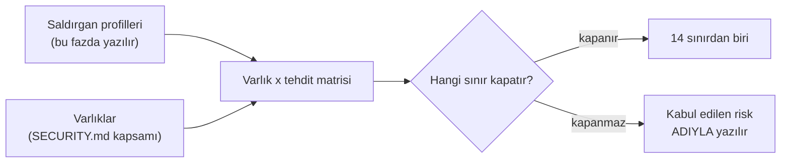

# Faz 172 — Tehdit Modeli

> **Durum:** ✅ Tamamlandı (2026-09-15)
> **Plan onayı:** onaylandı (2026-09-15) — açık sorular önerilen seçeneklerle kapatıldı
> **Kaynak:** [ADAYLAR.md](../../ADAYLAR.md) · **F-235**
> **Önkoşul:** Yok. Sınır envanteri tüketici geri bildirimi turunda (2026-09-15) üretildi
> **Paketler:** Yok — bu faz kod yazmaz
> **Yeni paket:** Yok · **Migration:** Yok
> **Public API:** Büyümüyor
> **Tüketici yüzeyi:** site: yeni `reference/threat-model.md`, `getting-started/security.md` (çapraz link), `reference/security-policy.md` (kapsam gerekçesi)
> · sevk edilen: Yok
> **Manuel test alanı:** Yok — doğrulama `dokuman-bakim.py` kapısıdır

---

## Bu Faza Başlarken

> `faz-baslangic` skill'ini uygula. Aşağıdaki liste o skill'in 2. adımıdır —
> **tamamını değil, yalnız işaret edilen bölümleri oku.**

1. Bu doküman
2. Kararlar — dosyanın tamamını **okuma**, yalnız bu kalemleri grep'le:
   ```bash
   grep -n "K-776\|K-775\|K-059\|K-771\|K-773" docs/KARARLAR.md
   ```
   **K-776** (denetim izi garanti ayrımı — modelin bir sınırı),
   **K-775** (yayımlanan sayı ölçülmeden güncellenmez — bu fazın kapı deseni),
   **K-059** (`secret` veritabanına da yazılmaz),
   **K-771** (toplu kabul anahtarı yok),
   **K-773** (production profil kümesi bir sürüm sözleşmesidir)
3. [`arsiv/fazlar/170-PRODUCTION-PROFIL-KAPISI.md`](170-PRODUCTION-PROFIL-KAPISI.md) — yalnız devir notu:
   ```bash
   awk '/## Sonraki Faza Devir Notu/,0' docs/arsiv/fazlar/170-PRODUCTION-PROFIL-KAPISI.md
   ```
   Altı üretim riskinin (`TraconProductionRisk`) tehdit modelindeki karşılığı
   oradan gelir.
4. Alan hafızası (bu faz bir alana dokunuyor):
   [`hafiza/dokumantasyon.md`](../../hafiza/dokumantasyon.md) (yayın hattı, `docs/` ile
   `docs-site/` sınırı, üretilen sayfalar)
5. Gerektiğinde, tamamı değil ilgili bölümü:
   [`MIMARI-GUVENLIK.md`](../../MIMARI-GUVENLIK.md) — **tamamı okunmaz**; model oradaki
   güvenlik modelini tekrar etmez, ona **atıf yapar**

---

## Amaç

Tracon bir kontrol düzlemidir ve kendisi bir güvenlik sınırıdır. `SECURITY.md`
kapsam içi sekiz alan sayar, site 14 sınır listeler — ama hiçbir yerde
**saldırgan modeli** yoktur: kim, nereden, neyi hedefler ve hangi sınır onu
durdurur. Kurumsal güvenlik incelemesinin ilk istediği belge budur.

Bu faz o belgeyi yazar ve **bayatlamasını engelleyen bir kapı** kurar. Kapısı
olmayan bir tehdit modeli, bir sonraki faz yeni bir sınır eklediğinde sessizce
yanlışlanır; bu repo'da tam olarak bu kusur sınıfı defalarca tekrarladı.

- **F-235** — tehdit modeli dokümanı, tüketiciye dönük özeti ve tazelik kapısı.

### Bugün ne çalışmıyor — doğrulanmış kanıt

| Kanıt | Gözlem |
|---|---|
| `grep -rli "tehdit model\|threat model\|STRIDE" docs/` | Yalnız üç dosya eşleşir ve **üçü de bu turun kendi kaydıdır** (`ADAYLAR.md`, `YAYIN-HAZIRLIK.md`, bir arşiv girdi raporu). Model dokümanı yok |
| `grep -roi "security boundar" docs-site/src/content/docs/api/` | **22** geçiş, **15** ayrı `api/` sayfasına dağılmış. Tekil notlar; birleştirilmiş bir analiz değil |
| [`getting-started/security.md`](../../../docs-site/src/content/docs/getting-started/security.md) § *The boundaries Tracon enforces* | **14** sınır listeler. Bu turda eklendi ve modelin iskeletidir — ama sınırın **neyi**, **kime karşı** koruduğunu yazmaz |
| [`SECURITY.md`](../../../SECURITY.md) § *Scope* | Kapsam içi sekiz alan sayar. Liste var, gerekçe yok: bir raporcu neyin kapsam içi olduğunu görür, **neden** olduğunu görmez |
| `wc -c docs/MIMARI-GUVENLIK.md` | **22.000 / 23.200 bayt — DAR (%5 boş)**. Yeni içerik bu dosyaya sığmaz; ayrı dosya zorunludur |
| [`TraconProductionRisk.cs`](../../../src/Tracon.Abstractions/Diagnostics/TraconProductionRisk.cs) | Altı üretim riski adıyla tanımlı. Tehdit modelinin risk ekseni burada zaten yarı yarıya yazılmış |

> Kanıtlar 2026-09-15 tarihinde doğrulandı.

---

## 172.1 — İki doküman, iki okuyucu

Dil sınırı bu fazda özellikle kritiktir: `docs/` Türkçe geliştirme kaydıdır,
`docs-site/` İngilizce ürün dokümantasyonudur. Aynı içerik iki yere yazılmaz.

| Doküman | Dil | Okuyucu | Ne taşır |
|---|---|---|---|
| `docs/MIMARI-TEHDIT-MODELI.md` | Türkçe | Sonraki geliştirme oturumu | Tam analiz: varlık envanteri, saldırgan profilleri, varlık×tehdit matrisi, her hücrenin hangi sınırla kapandığı, **kapanmayan hücreler** |
| `docs-site/.../reference/threat-model.md` | İngilizce | Kurumsal güvenlik inceleyicisi | Saldırgan profilleri, sınır eşlemesi, kabul edilen riskler. Kod kanıtı ve iç gerekçe **taşımaz** |

🚨 **Kapanmayan hücre gizlenmez.** Bir tehdit modelinin değeri kapattığı
hücrelerde değil, kapatmadığını **söylediği** hücrelerdedir. "Kabul edilen
risk" bölümü her iki dokümanda da bulunur.

## 172.2 — Modelin ekseni

Analiz üç eksenden kurulur. Eksenlerin ikisi repo'da zaten ölçülmüştür;
üçüncüsü bu fazın işidir.



**Saldırgan profilleri** en az şunları ayırır: kimliği doğrulanmamış ağ
çağrısı · yetkisi düşük kiracı kullanıcısı · başka kiracının kullanıcısı ·
`tool` çıktısı üzerinden gelen içerik (prompt injection) · kötü niyetli MCP
sunucusu · konsol erişimi olan operatör · veritabanı okuma erişimi olan kişi.
Son ikisi önemlidir: Tracon'un tehditlerinin bir kısmı **dışarıdan gelmez**.

**Varlıklar** `SECURITY.md` kapsam listesinden gelir ve genişletilir:
`secret`'lar · kiracı verisi · oturum içeriği · denetim izi · `tool` çağrı
yetkisi · model bütçesi · `script` çalıştırma hakkı.

## 172.3 — Tazelik kapısı

`dokuman-bakim.py`'ye yeni bir kontrol. K-775 deseni: yayımlanan bir iddia
ölçümle bağlanır.

Kapı, `getting-started/security.md`'deki sınır tablosunun satır kümesi ile
tehdit modelindeki sınır kümesini karşılaştırır. Bir faz yeni bir sınır ekler
ve modele yazmazsa kapı **kırmızı** döner.

🚨 Kapı iki yönlü olmalıdır. Yalnız "modelde eksik sınır var mı" diye bakan bir
kapı, silinen bir sınırı yakalamaz ve model gerçekte olmayan bir korumayı ilan
etmeye devam eder — yanlış güven, eksik belgeden kötüdür.

**Doğrulanmadı — uygulama anında ölçülmeli:** `dokuman-bakim.py`'nin bugünkü
kontrolleri `docs/` ile `src/` arasında çalışıyor. Bu kapı `docs/` ile
`docs-site/` arasında çalışacak; böyle bir kontrol emsali var mı, uygulayan
oturum önce onu ölçer (`site-seo-denetle.py` ve `check-content.mjs` hangisinin
sahibi olduğuna bakar).

---

## Planlanan Public API

Yok. Bu faz kod yazmaz.

### HTTP `endpoint`'leri

Yok.

### Arayüz payı

Yok.

---

## Planlanan Dosya Listesi

```
docs/
└── MIMARI-TEHDIT-MODELI.md                   (YENİ — Türkçe tam analiz)

docs-site/src/content/docs/reference/
└── threat-model.md                           (YENİ — İngilizce özet)

docs-site/src/
└── sidebar.mjs                               (Reference bölümüne kalem)

docs-site/scripts/
└── check-content.mjs                         (VEYA scripts/dokuman-bakim.py — 172.3'te ölçülür)

SECURITY.md                                   (kapsam listesi modele link verir)
```

---

## Hata Modları ve Testler

> Bu faz kod yazmaz; "test" burada doküman kapılarıdır. Seviye yine de seçilir.

| Ne bozulabilir | Seviye | Test |
|---|---|---|
| Yeni bir sınır eklenir, modele yazılmaz | Kapı | 172.3 tazelik kapısı |
| Bir sınır kaldırılır, model onu ilan etmeye devam eder | Kapı | 172.3 — iki yönlü karşılaştırma |
| Site sayfası ile Türkçe doküman çelişir | Kapı | `dokuman-bakim.py` — `SECURITY.md` senkron kapısının (2026-09-15) aynı deseni |
| Türkçe metin İngilizce site sayfasına sızar | Kapı | `SourceLanguageTests` — taban çizgisi yalnız küçülür |
| Model `secret` veya iç altyapı adresi sızdırır | Kapı | `secret` taraması; ayrıca `docs-site` yalnız kavram taşır, kod kanıtı taşımaz (172.1) |
| Yeni sayfa sidebar'dan erişilemez | Kapı | `npm run check:content` — mevcut kontrol |
| Bağlantılar kırılır | Kapı | `npm run check:links` |

---

## Manuel Kabul Case'leri

> Bu faz tüketiciye dönük **metin** sevk eder, davranış değil. Kabul, metnin
> kendi kapılarıyla ölçülür; `docs/manuel-test/` altına case eklenmez.

| # | Ön koşul | Adımlar | Beklenen sonuç |
|---|---|---|---|
| 1 | Site derlenmiş | `getting-started/security.md`'ye yeni bir sınır satırı ekle, modele ekleme, kapıyı koş | Kapı **kırmızı** döner ve eksik sınırın adını yazar |
| 2 | Site derlenmiş | Modelden bir sınırı sil, kapıyı koş | Kapı **kırmızı** döner (iki yönlü kontrol) |
| 3 | Site derlenmiş | `npm run check` | Dört site kapısı da temiz |

---

## Açık Sorular

| # | Soru | Seçenekler | Öneri |
|---|---|---|---|
| 1 | Kapı `dokuman-bakim.py`'de mi `check-content.mjs`'de mi yaşasın? | A: `check-content.mjs` (site tarafı, `docs/` okuyabilir) · B: `dokuman-bakim.py` (doküman tarafı) | Uygulama anında ölçülür (172.3). `SECURITY.md` senkron kapısı 2026-09-15'te **A**'ya kondu; emsal orada |
| 2 | STRIDE mi kullanılsın, serbest kategori mi? | A: STRIDE · B: varlık×saldırgan matrisi, kategori adı yok | **B** — STRIDE'ın altı kategorisi Tracon'un asıl risklerini (kiracı sızıntısı, prompt injection, `tool` yetkisi) doğal olarak bölmüyor. STRIDE adı yalnız kurumsal okuyucuya **atıf** olarak geçer |
| 3 | Model sürüm taşısın mı? | A: sürüm + ölçüm tarihi (K-775 deseni) · B: tarihsiz | **A** — kurumsal inceleyici belgenin ne zaman ölçüldüğünü sorar |

---

## Bitiş Ölçütleri (DoD)

- [x] `docs/MIMARI-TEHDIT-MODELI.md` var; 14 sınırın **hepsi** matriste bir hücreye bağlı
- [x] Kapanmayan her hücre "kabul edilen risk" olarak **adıyla** yazılmış (R1-R7, § 6)
- [x] `docs-site/.../reference/threat-model.md` var ve sidebar'dan erişiliyor (`Reference` bölümü)
- [x] `SECURITY.md` kapsam listesi modele link veriyor
- [x] Tazelik kapısı **iki yönlü** çalışıyor: eksik sınır ve fazla sınır ayrı ayrı kırmızı döndürüyor
- [x] Kapı bilerek bozulup kırmızı döndüğü **gösterildi** (manuel case 1 ve 2 — aşağıda gerçek çıktı)
- [x] Dört doğrulama kapısı sıfır uyarı verir (`kapi.py kapanis`, 10/10 komut ✅)
- [x] `secret` taraması boş döndü (`kapi.py tarama` — 6 işaretli sentetik credential atlandı)
- [x] `docs-site/` için `npm run check` temiz
- [x] `SourceLanguageTests` taban çizgisi büyümedi (bu faz C# dokunmadı; `kapi.py kapanis`'in `dotnet test` adımı doğruladı)
- [x] `python3 scripts/dokuman-bakim.py --denetle` çıkış kodu 0; yeni dosya bütçeye kaydedildi (`docs/MIMARI-TEHDIT-MODELI.md`: 16_600, olculen 14_069)
- [x] `faz-denetim` koşuldu; 🔴 bulgu kalmadı (1 🟡 bulundu ve kapandı — bkz. Denetim Bulguları)

### Doğrulama komutları

```bash
# Kapı gerçekten kırmızı dönüyor mu
cd docs-site && npm run check:content   # sınır eklenip modele yazılmadan koşulur

# Site kapıları
cd docs-site && npm run check

# Doküman bütçesi
python3 scripts/dokuman-bakim.py --denetle
```

---

## Riskler

| Risk | Önlem |
|------|-------|
| Model yazılır, kapı yazılmaz; altı ay sonra sessizce yanlıştır | Kapı DoD'nin **zorunlu** kalemidir ve bilerek bozularak gösterilir |
| `MIMARI-GUVENLIK.md` ile içerik çakışır, iki doküman aynı şeyi ayrı anlatır | Model o dosyayı **tekrar etmez**, atıf yapar. `MIMARI-GUVENLIK.md` DAR olduğu için zaten büyüyemez |
| Tüketiciye dönük sayfa iç mimari ayrıntısı sızdırır | 172.1 sınırı: site sayfası kod kanıtı ve iç gerekçe taşımaz |
| Yayınlanmış sürüm yokken model erken yazılır ve yüzey GA'ya kadar değişir | Kabul edilen maliyet: kapı, değişimi **yakalayacak** mekanizmadır. Kapısız yazmak erken yazmaktan daha pahalıdır |
| Doküman bütçesi aşılır | Yeni dosya kendi bütçesiyle kaydedilir; içerik **silinmez, taşınır** |

---

<!-- ============================================================
     AŞAĞISI KAPANIŞTA DOLDURULUR — `faz-tamamlama` skill'i.
     Plan anında boş kalır. Başlıkları SİLME.
     ============================================================ -->

## Plandan Sapmalar

- Açık soru 1 (kapı konumu) planın önerdiği gibi ölçülüp **A: `check-content.mjs`**
  seçildi — `SECURITY.md` ↔ `reference/security-policy.md` senkron kapısının
  (`securityPolicyFacts`) yanına, aynı dosyada, aynı desenle eklendi.
- Açık soru 2 ve 3 önerilen seçeneklerle (B: varlık×saldırgan matrisi; A: sürüm+tarih
  damgası) uygulandı — sapma yok.
- Plan "Tüketici yüzeyi" başlığında `getting-started/security.md`'ye "çapraz link"
  ve `reference/security-policy.md`'ye "kapsam gerekçesi" vaat ediyordu ama ilk
  taslak bu iki dosyayı hiç değiştirmedi — yalnız kök `SECURITY.md` link verdi.
  Bağımsız denetim (Adım 4) bunu 🟡 bulgu olarak yakaladı; her iki site sayfasına
  da `threat-model.md`'ye giden bir cümle eklenerek kapandı (bkz. Denetim Bulguları).
- Planlanan dosya listesindeki `docs-site/scripts/check-content.mjs (VEYA
  scripts/dokuman-bakim.py)` belirsizliği check-content.mjs lehine çözüldü;
  `scripts/dokuman-bakim.py`'ye yalnız yeni dosyanın bütçe kaydı eklendi (Adım 172.3'ün
  kendi planladığı ölçüm), yeni bir kapı değil.

## Bu Fazda Verilen Kararlar

- **K-779** — Denetim izinin `before`/`after` içeriği at-rest content protection
  kapsamı dışındadır; adlandırılmış bir kabul edilen risktir (§ 6, R5). Matris
  kurulurken ölçüldü, plana yazılı değildi.

## Gerçekleşen Public API

Yok — plandaki gibi. `docs-site/scripts/check-content.mjs`'ye eklenen
`boundaryNames()` fonksiyonu site derleme betiğinin iç yardımcısıdır, herhangi bir
paketten dışa açılmaz.

## Dosya Listesi (gerçekleşen)

```
docs/
├── MIMARI-TEHDIT-MODELI.md                    (YENİ — 14.1 KB)
└── KARARLAR.md, arsiv/KARARLAR-GECMISI.md      (K-779)

docs-site/src/content/docs/reference/
├── threat-model.md                             (YENİ)
├── security-policy.md                          (tehdit modeline atıf cümlesi)
docs-site/src/content/docs/getting-started/
└── security.md                                 (tehdit modeline atıf cümlesi)

docs-site/src/
└── sidebar.mjs                                 (Reference: "Threat model")

docs-site/scripts/
└── check-content.mjs                           (boundaryNames() + iki yönlü kapı)

docs-site/public/
└── llms.txt, llms-full.txt                     (üretilen — build-agent-map.mjs)

SECURITY.md                                     (kapsam listesi modele link verir)
scripts/dokuman-bakim.py                        (SORGU_BUTCESI: yeni dosya kaydı)
docs/YOL-HARITASI.md                            (üretilen — durum satırından)
```

## Süreç Ölçümü

| Metrik | Değer |
|---|---|
| Plan revizyonu sayısı | 0 (plan onaylandı, açık sorular önerilen seçeneklerle kapandı) |
| Düzeltme turu sayısı | 1 (denetimin 🟡 bulgusu için) |
| 🔴 bulgu: gerçek / gürültü / araştırılacak | 0 / 0 / 0 |
| Fazın ürettiği regresyon | 0 (`kapi.py kapanis` 10/10 ✅, tam test paketi geçti) |
| Faz kapandıktan sonra bulunan kusur | ölçülmedi (henüz kapanış sonrası bir tur geçmedi) |

## Denetim Bulguları

`faz-denetcisi` (taze bağlamlı) koştu. Kapsam: `git diff 33abea50...` (commit
edilmemiş çalışma ağacı, 9 dosya).

| # | Seviye | Bulgu | Triyaj | Sonuç |
|---|---|---|---|---|
| 1 | 🟡 | Plan `getting-started/security.md` ve `reference/security-policy.md`'nin tehdit modeline link vereceğini vaat ediyordu; ilk taslakta ikisi de değişmemişti | gerçek | düzeltildi — her iki sayfaya bir cümle eklendi, `check:content` yeniden temiz koştu |

🔴 bulgu yok. 🟢 aday listesine giden bulgu yok. Denetçi `kapi.py kapanis`'i
koşturmadı (diff `src/`/`tests/` dışında, "denetim ucuz olmalı" ilkesi) — bu faz
oturumu kapanış kapısını ayrıca ve tam olarak koşturdu (bkz. DoD).

## Sonraki Faza Devir Notu

- Bu faz kod yazmadı; sonraki fazın devraldığı bir arayüz/sözleşme yok.
- **Tazelik kapısının deseni artık ikinci emsalidir** (birincisi
  `securityPolicyFacts`): bir Türkçe/İngilizce veya kök/site içerik çifti
  senkron kalmalıysa `docs-site/scripts/check-content.mjs`'e iki yönlü bir
  karşılaştırma eklemek bu iki örneği takip edebilir.
- **Sınır kümesi 14'te sabit değil.** Bir sonraki faz `getting-started/security.md`'nin
  "The boundaries Tracon enforces" tablosuna satır eklerse `docs/MIMARI-TEHDIT-MODELI.md`
  § 4/5 ve `reference/threat-model.md`'nin "Boundary mapping" tablosu da güncellenmeli
  — kapı bunu unutulursa yakalar (kırmızı döner), unutmayı önlemez.
- R1-R7'de adlandırılan kabul edilen risklerden biri (örn. content guard'ların
  opt-in olması, R4) gelecekte varsayılan davranışa dönüştürülürse hem
  `TraconProductionRisk` hem bu iki doküman güncellenmelidir.
