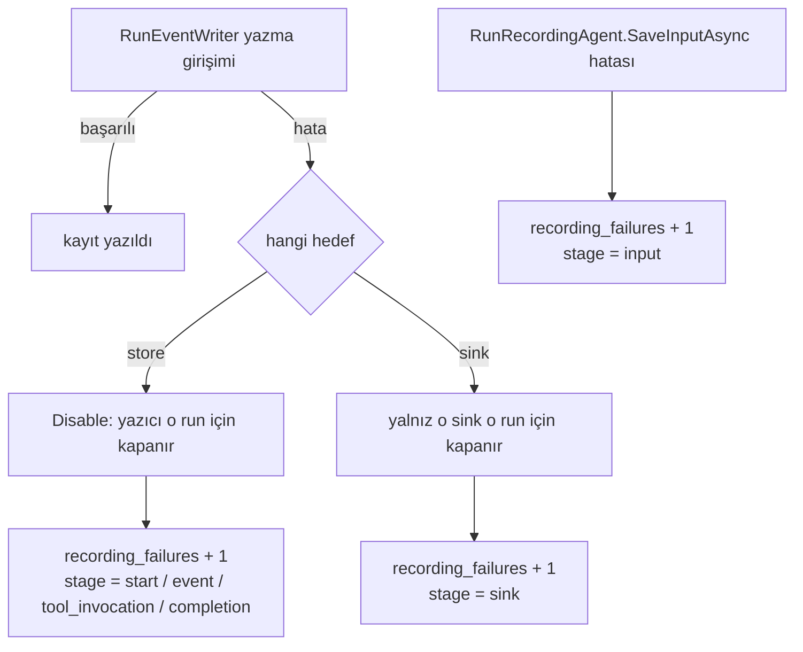

# Faz 173 — Çalıştırma Kaydının Kaybı Ölçülür

> **Durum:** ✅ Tamamlandı (2026-09-15)
> **Plan onayı:** kapsam seçimi kullanıcı tarafından onaylandı (2026-09-15) · uygulama kullanıcı talimatıyla başladı (2026-09-15)
> **Kaynak:** Tüketici geri bildirimi turu (2026-09-15), *"Beşinci risk: recording semantics"*. `ADAYLAR.md`'de F-NN kalemi **yoktur**; kısmi öncül 2026-09-07 turunun **A10** kalemidir ([`arsiv/incelemeler/2026-09-07-tuketici-analizi-codebase-olcumu.md`](../incelemeler/2026-09-07-tuketici-analizi-codebase-olcumu.md)).
> **Önkoşul:** [Faz 171](171-DENETIM-IZI-YAZMA-POLITIKASI.md) — sayacın deseni (`tracon.audit.write_failures`) ve `TraconMetrics`'i statik olmayan bir yazma yoluna taşıma tekniği oradan devralınır
> **Paketler:** `Tracon.Core`, `Tracon.Workflows`
> **Yeni paket:** Yok · **Migration:** Yok
> **Public API:** Büyüyor — `TraconDiagnostics` iki sabit, `TraconMetrics` bir sayaç ve bir metot, `RunEventWriter` yapıcısı bir parametre alır. **Ölçüldü (2026-09-15):** her `src/*/PublicAPI.Shipped.txt` yalnız `#nullable enable` satırını taşır (17 dosya, 17 satır) — hiçbir yüzey donmadı, bugün eklemek bedava, Faz 7'den sonra yapıcı imzası değiştirmek kırıcı olur
> **Tüketici yüzeyi:** site — [`guides/observability.md`](../../../docs-site/src/content/docs/guides/observability.md) (metrik tablosu · etiket tablosu · yeni bölüm), [`concepts/governance.md`](../../../docs-site/src/content/docs/concepts/governance.md) (§ *What is guaranteed to be written* içindeki `run` paragrafı), [`reference/threat-model.md`](../../../docs-site/src/content/docs/reference/threat-model.md) (best-effort `caution` bloğu) · sevk edilen — `RunEventWriter` ve `TraconMetrics` XML dokümanı; `api/` sayfaları bundan **üretilir**
> **Manuel test alanı:** [`docs/manuel-test/12-GOZLEMLENEBILIRLIK-MALIYET.md`](../../manuel-test/12-GOZLEMLENEBILIRLIK-MALIYET.md)

---

## Bu Faza Başlarken

> `faz-baslangic` skill'ini uygula. Aşağıdaki liste o skill'in 2. adımıdır —
> **tamamını değil, yalnız işaret edilen bölümleri oku.**

1. Bu doküman
2. Kararlar — dosyanın tamamını **okuma**, yalnız bu kalemleri grep'le:
   ```bash
   grep -n "K-776\|K-355\|K-421\|K-483" docs/KARARLAR.md
   ```
   **K-776** (denetim izinin garanti ayrımı: altı işlem fail-closed, kalanı best-effort — bu fazın kardeş sözleşmesi),
   **K-355** (her alt yazımın kiracı damgasını taşıması — sayacın kiracı etiketi buradan gelir),
   **K-421** (`EnablePublicApiTracking` açık — yapıcı imzası değişince `PublicAPI.Unshipped.txt` güncellenir),
   **K-483** (elle tekrarlanan ifade bir kusur SINIFI üretir — bu fazda `Disable`'ın serbest metin gerekçesi bu sınıftadır)
3. [`arsiv/fazlar/171-DENETIM-IZI-YAZMA-POLITIKASI.md`](171-DENETIM-IZI-YAZMA-POLITIKASI.md) — yalnız devir notu ve "Bu Fazda Verilen Kararlar":
   ```bash
   awk '/## Sonraki Faza Devir Notu/,0' docs/arsiv/fazlar/171-DENETIM-IZI-YAZMA-POLITIKASI.md
   ```
   Sayaç oraya **zorunlu-nullable parametre** olarak taşınmıştı; gerekçesi (opsiyonel parametre yeni çağrı yerini sessizce atlar) bu fazda birebir geçerlidir.
4. Alan hafızası (bu faz üç alana dokunuyor):
   [`hafiza/cekirdek-calistirma.md`](../../hafiza/cekirdek-calistirma.md) (`RunRecording` zinciri),
   [`hafiza/olcum-kota-ve-secenekler.md`](../../hafiza/olcum-kota-ve-secenekler.md) (metrik ve etiket tuzakları),
   [`hafiza/genisleme-noktalari-ve-denetim.md`](../../hafiza/genisleme-noktalari-ve-denetim.md) (denetim izi kapsamı)
5. Gerektiğinde, tamamı değil ilgili bölümü:
   [`MIMARI-TEHDIT-MODELI.md`](../../MIMARI-TEHDIT-MODELI.md) § R6 — bu fazın kapattığı görünürlük boşluğu orada adlandırılmıştır

---

## Amaç

Tracon'in `run` kaydı best-effort'tur: `store` hata verirse `run` sürer ve kayıt
düşer. Bu **bilinçli** bir tasarımdır ve değişmez. Değişen tek şey şudur:
bugün o kaybı yalnız log okuyan biri fark eder. Denetim izi yolu aynı sorunu
Faz 171'de bir sayaçla çözdü ve site bunun gerekçesini yayımladı — *"a hole in
the audit trail is not something to find out about by reading logs"*. Aynı
cümle `run` kaydı için yazılmadı, çünkü `run` yolunda sayaç **yok**.

Bu faz o asimetriyi kapatır. Garanti değişmez; garantinin **ihlali görünür**
olur.

- **Kapsam** — `run` kayıt kaybını sayan bir OTel sayacı, kaybın hangi aşamada
  olduğunu söyleyen kapalı bir etiket kümesi, ve best-effort `run` kaydını
  yayımlanmış sözleşme hâline getiren bir karar kaydı.

### Bugün ne çalışmıyor — doğrulanmış kanıt

| Kanıt | Gözlem |
|---|---|
| [`RunEventWriter.cs:115`](../../../src/Tracon.Core/Recording/RunEventWriter.cs#L115) | `StartRunAsync` hatası yutulur, `Disable(...)` çağrılır, `run` sürer |
| [`RunEventWriter.cs:198`](../../../src/Tracon.Core/Recording/RunEventWriter.cs#L198) | Olay yazımı hatası — aynı yol |
| [`RunEventWriter.cs:232`](../../../src/Tracon.Core/Recording/RunEventWriter.cs#L232) | `sink` hatası: o `run` için **yalnız o sink** kapatılır, `LogWarning` |
| [`RunEventWriter.cs:272`](../../../src/Tracon.Core/Recording/RunEventWriter.cs#L272) | Tool çağrı kaydı hatası — aynı yol |
| [`RunEventWriter.cs:360`](../../../src/Tracon.Core/Recording/RunEventWriter.cs#L360) | `run` kapanış yazımı hatası — aynı yol |
| [`RunEventWriter.cs:421`](../../../src/Tracon.Core/Recording/RunEventWriter.cs#L421) | `Disable` yalnız `LogWarning` yazar; **hiçbir sayaç artmaz** |
| [`RunRecordingAgent.Persistence.cs:156`](../../../src/Tracon.Core/Recording/RunRecordingAgent.Persistence.cs#L156) | `run` girdisi yazılamazsa yutulur; `run` çalışır, **replay ölür** |
| `grep -rn "IsDisabled" src/` | Beş eşleşmenin hepsi `RunEventWriter`'ın kendi içinde (biri `ContentGuardPipeline` yorumu). Durum yazıcıdan **hiç çıkmaz**: ne `run` kaydına, ne yanıta, ne metriğe |
| [`TraconMetrics.cs:128`](../../../src/Tracon.Core/Diagnostics/TraconMetrics.cs#L128) · [`:353`](../../../src/Tracon.Core/Diagnostics/TraconMetrics.cs#L353) | Denetim izi yolunda sayaç **var** (`tracon.audit.write_failures`, etiket `swallowed`/`refused`) — kardeş yolda yok |
| [`observability.md:320`](../../../docs-site/src/content/docs/guides/observability.md#L320) | Site davranışı doğru anlatıyor ama ölçülebilir bir sinyal **vaat etmiyor** |
| `grep -rn "new RunEventWriter(" src/ tests/ bench/ samples/` | **19** çağrı yeri: **2**'si üretimde ([`RunRecordingAgent.Lifecycle.cs:87`](../../../src/Tracon.Core/Recording/RunRecordingAgent.Lifecycle.cs#L87), [`WorkflowRunner.cs:440`](../../../src/Tracon.Workflows/Internal/WorkflowRunner.cs#L440)), **17**'si test ve bench |
| [`RunRecordingAgent.cs:39`](../../../src/Tracon.Core/Recording/RunRecordingAgent.cs#L39) · [`WorkflowRunner.cs:50`](../../../src/Tracon.Workflows/Internal/WorkflowRunner.cs#L50) | **İki üretim çağrı yerinin ikisinde de** `TraconMetrics? _metrics` alanı zaten vardır — yeni bağımlılık zinciri kurulmaz |

> Kanıtlar 2026-09-15 tarihinde doğrulandı. 🚨 Satır numaraları **bu faz
> uygulanmadan ÖNCEki** hâle aittir ve artık kaymıştır (`Disable` → `:452`);
> kanıtı yeniden okuyacak bir oturum `git show f10e87d8:<yol>` kullanmalıdır.

### Kapsam dışı — bilerek

| Ne | Neden |
|---|---|
| `RecordingMode.Required` / genel fail-closed `run` kaydı | Geri bildirimin önerisiydi; **alınmadı**. Model çağrısı ve tool yan etkileri olduktan sonra `run`'ı düşürmek hiçbir şeyi geri almaz — elde yalnız erişilebilirlik kaybı kalır. 2026-09-07 turunda da aynı gerekçeyle reddedilmişti (A10) |
| Etkiden önceki dar fail-closed `seam` (`run` açılışı · yan etkili tool çağrısı) | Savunulabilir bir tasarımdır ama bu fazın kapsamı değildir. **F-237** olarak [`ADAYLAR.md`](../../ADAYLAR.md) § *Bekleyen Kalemler* içine koşuluyla yazıldı (2026-09-15) |
| Kayıp kaydın `run` kaydına veya HTTP yanıtına yansıtılması | Yeni bir sözleşme alanıdır; sayaç önce ölçsün, talep ölçülsün |
| `run` kaydı için dayanıklı `outbox` | A10'un ikinci yarısı. Talep kanıtı bugün de yok |

---

## 173.1 — Ne sayılır

Yeni sayaç: `tracon.run.recording_failures`, birim `{failure}`.

Anlamı tek cümleyle yazılır ve o cümle sitede de aynıdır: **kaydını
kaybeden yazma girişimi sayılır.** `store` tarafında bu pratikte "kaydını
kaybeden `run` sayısı"na eşittir, çünkü `Disable` ilk hatadan sonra yeni
girişimi engeller — bu eşitlik bir tesadüf değil, yazıcının tasarımıdır ve
dokümana böyle yazılır.



### Etiketler

| Etiket | Değer kümesi | Neden |
|---|---|---|
| `tracon.tenant.id` | mevcut sabit | K-355; hangi kiracının kanıtı eksildi |
| `tracon.recording.stage` | `start` · `event` · `tool_invocation` · `completion` · `sink` · `input` | **Kapalı** küme. Hangi aşama düştü |

`tracon.run.id` **etiket olarak eklenmez** — sınırsız kardinalitedir ve site bu
kuralı zaten yayımlıyor (*"Four of these are span attributes only"*). `sink`
tipi de etiket **değildir**: kayıt sayısı sınırlı olsa da tip adı tüketicinin
kodudur; hangi `sink`'in düştüğü `LogWarning` satırında zaten yazılıdır.

### 🚨 `Disable`'ın serbest metni kapalı kümeye çevrilir

Bugün `Disable(ex, "failed to open run record")` çağrılıyor ve gerekçe **elle
yazılmış bir string**. Dört çağrı yeri dört ayrı metin taşıyor. Bu, MEMORY.md'nin
"elle tekrarlanan ifade bir kusur SINIFI üretir" (K-483) kalemidir ve bir metrik
etiketi olarak doğrudan kardinalite riskidir. `Disable`'ın ikinci parametresi
kapalı bir sabit kümesine çevrilir; log cümlesi o sabitten üretilir.

---

## 173.2 — Sayaç yazıcıya nasıl ulaşır

`RunEventWriter` bir DI servisi değildir; her `run` için elle kurulur. Faz
171'de aynı sorun `AuditRecorder` için çözüldü ve orada üç seçenek ölçülmüştü.
Aynı ölçüm burada da geçerlidir:

| Seçenek | Sonuç |
|---|---|
| (a) `IRunStore` dekoratörü | Sayaç Tracon'in yazma yolunu değil belirli bir kaydı ölçer; tüketicinin kendi `IRunStore` kaydı onu sessizce düşürür. **Reddedildi** |
| (b) Opsiyonel parametre (`TraconMetrics? metrics = null`) | Yeni çağrı yeri sessizce atlar — bu repo'nun tekrar eden kusur sınıfı. **Reddedildi** |
| (c) Zorunlu-nullable parametre | Derleyici 19 çağrı yerinin hepsini ziyaret eder. **Seçildi** |

Parametre `sinks`'ten **önce** gelir; `sinks` opsiyonel kalır. Konumsal çağrı
yapan test (`RunEventSinkTests.cs:33`) derlemede kırılır — istenen budur.

`RunRecordingAgent.SaveInputAsync` yazıcı dışındadır ve `_metrics` alanını
zaten görür; orada yeni parametre gerekmez.

---

## Planlanan Public API

> Taslak imzalardır. Gerçekleşen imzalar kapanışta ayrı bir bölüme yazılır.

```csharp
// Tracon.Core — Diagnostics/TraconDiagnostics.cs
public const string RunRecordingFailureCounterName = "tracon.run.recording_failures";

public static class Tags
{
    public const string RecordingStage = "tracon.recording.stage";
}

// Tracon.Core — Diagnostics/TraconMetrics.cs
/// <summary>Run-recording failure counter. Tags: tenant, stage.</summary>
public Counter<long> RunRecordingFailures { get; }

public void RecordRunRecordingFailure(string? tenantId, string stage);

// Tracon.Core — Recording/RunEventWriter.cs  (yapıcı imzası DEĞİŞİR)
public RunEventWriter(
    IRunStore store,
    TraconRunRecordingOptions options,
    ILogger logger,
    Guid runId,
    TraconMetrics? metrics,
    IReadOnlyList<IRunEventSink>? sinks = null);
```

Aşama sabitleri `internal` bir sabit kümesinde yaşar; public yüzeye `string`
olarak çıkmaz — etiket değerleri sözleşmedir ama `enum` olarak yayımlanmaları
gerekmez.

### HTTP `endpoint`'leri

Yok. Bu faz hiçbir uç eklemez veya değiştirmez.

### Arayüz payı

Yok. Arayüze dokunulmaz.

---

## Planlanan Dosya Listesi

```
src/Tracon.Core/
├── Diagnostics/
│   ├── TraconDiagnostics.cs        (sabit eklenir)
│   └── TraconMetrics.cs            (sayaç + metot eklenir)
└── Recording/
    ├── RunEventWriter.cs           (yapıcı + Disable + sink catch)
    └── RunRecordingAgent.Persistence.cs  (SaveInputAsync catch)

src/Tracon.Core/Recording/RunRecordingAgent.Lifecycle.cs  (çağrı yeri)
src/Tracon.Workflows/Internal/WorkflowRunner.cs           (çağrı yeri)
src/Tracon.Core/PublicAPI.Unshipped.txt                   (yüzey güncellenir)

tests/Tracon.Core.UnitTests/Recording/RunRecordingFailureMetricTests.cs   (yeni)
tests/Tracon.PostgreSql.IntegrationTests/FailureManifests/DatabaseUnavailableTests.cs  (mevcut test genişler)
+ 16 test/bench çağrı yeri (mekanik)

docs-site/src/content/docs/guides/observability.md
docs-site/src/content/docs/concepts/governance.md
docs-site/src/content/docs/reference/threat-model.md
docs/MIMARI-TEHDIT-MODELI.md   (§ R6)
```

---

## Hata Modları ve Testler

> Mutlu yoldan değil, **ne bozulabilir**den türetilir. Seviyeyi plan seçer.

| Ne bozulabilir | Seviye | Test sınıfı |
|---|---|---|
| Sayaç eklenirken `Disable` yolu `throw` etmeye başlar ve `run` düşer | **Fonksiyonel** (depo sınırı) | `DatabaseUnavailableTests.Run_recording_disables_itself_instead_of_failing_the_run` — mevcut test sayaç iddiasıyla genişler |
| `store` hatası sayılmaz (sessiz kayıp sürer) | Fonksiyonel | aynı test |
| `Disable` bir `run` içinde iki kez artar (çift sayım) | Birim | `RunRecordingFailureMetricTests` |
| `sink` hatası `store` aşamasıyla etiketlenir | Birim | `RunRecordingFailureMetricTests` |
| İki `sink`'ten biri düşer, diğeri sürer ama sayaç bir kez artar | Birim | `RunRecordingFailureMetricTests` |
| `run` girdisi kaybı hiç sayılmaz | Birim | `RunRecordingFailureMetricTests` |
| Kiracısız `run`'da (`TenantId` `null`) etiket üretimi çöker veya boş seri üretir | Birim | `RunRecordingFailureMetricTests` |
| İptal (`OperationCanceledException`) sayaç artırır — iptal bir kayıp değildir | Birim | `RunRecordingFailureMetricTests` |
| `WorkflowRunner` çağrı yeri sayacı geçirmeyi atlar | **Derleme** | zorunlu parametre; ayrıca `WorkflowRecordingFailure` fonksiyonel iddiası |
| Başka kiracının `run`'ı bu kiracının sayacını artırır | Birim | `RunRecordingFailureMetricTests` — yazıcının kendi `TenantId`'si kullanılır, ortam kiracısı değil (K-355) |
| Eşzamanlı `run`'lar tek `sink` örneğini paylaşırken sayaç karışır | Birim | `RunRecordingFailureMetricTests` — `_sinkDisabled` `run` başınadır |
| Site metrik tablosu ile kod sabiti ayrışır | Manuel + kapı | `docs-site` `check-content.mjs` bugün metrik adı senkronu **yapmıyor**; Açık Soru §2 |

Beş soru — iptal: sayaç artmaz (mevcut `when (ex is not OperationCanceledException)`
süzgeci korunur). Eşzamanlılık: `_sinkDisabled` ve `IsDisabled` `run` başınadır.
Boş/aşırı girdi: `stage` kapalı kümedir. Başka kiracı: yazıcının kendi
`TenantId`'si. Alt sistem hatası: bu fazın **konusu** budur.

---

## Manuel Kabul Case'leri

> Kapanışta `docs/manuel-test/12-GOZLEMLENEBILIRLIK-MALIYET.md` içine eklenecek
> case taslağı.

| # | Ön koşul | Adımlar | Beklenen sonuç |
|---|---|---|---|
| 1 | `samples/Tracon.Api` ayakta, PostgreSQL ayakta, OTel konsol dışa aktarıcısı açık | Bir `run` koş, metrikleri oku | `tracon.run.recording_failures` **yok veya sıfır**; `tracon.runs` arttı |
| 2 | Aynı kurulum | PostgreSQL'i durdur, bir `run` koş | `run` **tamamlanır** (yanıt döner); `tracon.run.recording_failures` **1** artar, `stage=start` |
| 3 | Aynı kurulum, veritabanı geri açık | `run` ortasında veritabanını durdur | Sayaç `stage=event` veya `stage=completion` ile artar; istemciye akış **kesilmez** |
| 4 | Hata fırlatan bir `IRunEventSink` kayıtlı | Bir `run` koş | Sayaç `stage=sink` ile bir kez artar; `store` kaydı **eksiksizdir** |
| 5 | `RecordRunInput=true`, `run_inputs` yazımı engelli | Bir `run` koş | Sayaç `stage=input` ile artar; `run` tamamlanır, replay başarısız olur |

---

## Açık Sorular

> Planı bloklamayan, faz uygulanırken karara bağlanacak sorular.

| # | Soru | Seçenekler | Öneri |
|---|---|---|---|
| 1 | `TenantId` `null` iken etiket ne olur? | A: ham `null` (`RecordRun` deseni, `TraconMetrics.cs:211`) · B: `?? "unknown"` (`RecordJobExecution` deseni, `:391`) | **B.** Repo'da iki desen de var; dışa aktarıcılar boş etiketi eksik etiketten ayırmaz. Sayaç bir **alarm** kaynağıdır, belirsiz seri üretmemelidir |
| 2 | Site metrik tablosu ile `TraconDiagnostics` sabitleri arasında kapı kurulsun mu? | A: Bu fazda kurulmaz, elle senkron · B: `check-content.mjs`'e sabit↔tablo karşılaştırması eklenir | **B, ama küçük tutarak.** Faz 172 devir notu bu kapı desenini "ikinci emsal" ilan etti; üçüncüsü ucuzdur. Maliyet ölçülmeli — sabitleri okumak için kaynak taraması gerekir |
| 3 | `stage` sabitleri `internal` sabit kümesi mi, public `enum` mu? | A: `internal` sabit · B: public `enum` | **A.** Etiket değeri bir sözleşmedir ama tüketici onu yazmaz, okur. Public `enum` Faz 7'den sonra dondurulur ve yeni bir aşama eklemek kırıcı olur |
| 4 | `run` girdisi kaybı ayrı bir aşama mı, yoksa ayrı bir sayaç mı? | A: `stage=input` (aynı sayaç) · B: ayrı sayaç | **A.** İkisi de "bu `run`'ın kanıtı eksildi" olayıdır; ayrı sayaç iki alarm kuralı ister |

---

## Bitiş Ölçütleri (DoD)

- [x] ~~PostgreSQL **kapalıyken**~~ → **`tracon.runs` yazımı engelliyken** (gerekçe: *Plandan Sapmalar* §2) `samples/Tracon.Api` üzerinde bir `run` koşulur: `run` **tamamlanır** ve `tracon.run.recording_failures` `stage=start` ile **1** artar — komut ve çıktı *Süreç Ölçümü*'ne yazıldı
- [x] `stage` etiketi altı değerin dışına **çıkamaz**; `Disable` serbest metin gerekçe **almaz** (`grep -n "Disable(" src/Tracon.Core/Recording/RunEventWriter.cs` yalnız sabit gösterir)
- [x] `RunEventWriter` yapıcısını çağıran 19 yerin hepsi sayacı geçirir veya bilinçli olarak `null` geçer; opsiyonel parametre **yoktur**
- [x] `IsDisabled` davranışı **değişmedi**: `run` hâlâ sürer, yanıt hâlâ akar (`DatabaseUnavailableTests` yeşil)
- [x] Dört doğrulama kapısı sıfır uyarı verir
- [x] `samples/Tracon.Api` ile gerçek `run` yapıldı, çıktı belgeye yazıldı
- [x] `secret` taraması boş döndü
- [x] Manuel kabul case'leri `docs/manuel-test/12-GOZLEMLENEBILIRLIK-MALIYET.md` içine eklendi; otomatikleştirilebilenler koşuldu
- [x] `faz-denetim` koşuldu; 🔴 bulgu kalmadı
- [x] `docs-site/` güncellendi (metrik tablosu · etiket tablosu · yeni bölüm · `governance.md` `run` paragrafı · `threat-model.md` `caution` bloğu); `npm run build` + `check-links.mjs` temiz
- [x] `docs/MIMARI-TEHDIT-MODELI.md` § R6 güncellendi — `run` yarısı artık ölçülebilir
- [x] Karar kaydı yazıldı: best-effort `run` kaydı **yayımlanmış sözleşmedir**, K-776'nın kardeşidir, ve ihlali sayılır

### Doğrulama komutları

```bash
# Aşama sabitleri kapalı küme mi
grep -n "Disable(" src/Tracon.Core/Recording/RunEventWriter.cs
# → 4 satır, hepsi RunRecordingStages.* ; serbest metin YOK

# Sayaç her iki üretim çağrı yerine ulaştı mı
grep -rn "new RunEventWriter(" src/
# → 2 satır, ikisi de _metrics geçiyor

# Site tablosu ile sabit aynı adı taşıyor mu
grep -rn "tracon.run.recording_failures" src/ docs-site/src/content/docs/
# → TraconDiagnostics.cs + observability.md (metrik tablosu, anlatı bölümü)
#   + governance.md + threat-model.md
# 🚨 Bu senkron ELLE denetlenmez: docs-site/scripts/check-content.mjs
#   TraconDiagnostics.cs'in HER public const string'ini toplar ve elle
#   yazılmış bir sayfada tam ad eşleşmesiyle arar (Plandan Sapmalar §1).

# Gerçek süreç kanıtı (Süreç Ölçümü'ndeki koşum)
PID=$(dotnet-counters ps | grep "Tracon.Api" | awk '{print $1}')   # 🚨 dotnet run'ın PID'i DEĞİL
dotnet-counters collect --process-id "$PID" --counters Tracon \
  --refresh-interval 1 --duration 00:00:00:30 --format csv --output faz173.csv
awk -F',' '$NF != 0' faz173.csv | grep -E "recording_failures|tracon.runs"
```

---

## Riskler

| Risk | Önlem |
|------|-------|
| Sayaç eklerken yutma yolu `throw` etmeye başlar ve gözlemlenebilirlik ürünü keser — bu fazın **tam tersi** sonuç | `Disable` ve `catch` gövdeleri `try` **içinde** kalır; sayaç çağrısı `Counter.Add` dışında iş yapmaz. `DatabaseUnavailableTests` bunu kanıtlar |
| `stage` etiketi ileride serbest metne kayar ve kardinalite patlar | Kapalı sabit kümesi + `RunRecordingFailureMetricTests`'in küme iddiası |
| 17 test çağrı yerini mekanik güncellerken bir testin **anlamı** değişir | Değişiklik yalnız yeni parametre eklemektir; hiçbir `assert` dokunulmaz. `git diff --stat` ile satır sayısı denetlenir |
| Yapıcı imzası değişikliği tüketiciyi kırar | `PublicAPI.Shipped.txt` boştur (ölçüldü); hiçbir yüzey donmadı. Faz 7'den sonra bu değişiklik yapılamaz |
| Sayaç eklenir ama site anlatısı eklenmez — ölçülen ama bilinmeyen bir sinyal | DoD'de ayrı satır; `tuketici-dokuman-senkronu` kapanışta koşar |

---

<!-- ============================================================
     AŞAĞISI KAPANIŞTA DOLDURULUR — `faz-tamamlama` skill'i.
     Plan anında boş kalır. Başlıkları SİLME.
     ============================================================ -->

## Plandan Sapmalar

### 1. 🚨 Site kapısı zaten vardı — Açık Soru §2 ölçümle kapandı

Plan *"`check-content.mjs` bugün metrik adı senkronu **yapmıyor**"* diyordu ve
seçenek B'yi (yeni bir kapı yazmak) öneriyordu. **Yanlıştı.**
[`check-content.mjs:492-515`](../../../docs-site/scripts/check-content.mjs) `TraconDiagnostics.cs`
içindeki **her** `public const string` değerini toplar ve elle yazılmış bir
sayfada tam ad eşleşmesiyle arar; bulamazsa kırmızı döner. Kapı ayrıca kendi
körlüğüne karşı da korunmuş (sıfır ad topladıysa reddediyor).

Sonuç: yeni bir kapı **yazılmadı**, çünkü var olan kapı tam olarak sorulan
kaymayı zaten yakalıyor. Kanıt kod okumasıyla değil koşumla alındı — iki yeni
sabit siteye yazılmadan önce kapıyı gerçekten kırmışlardır (`Telemetry name
'tracon.run.recording_failures' appears on no hand-written page`).

### 2. 🚨 DoD'nin "PostgreSQL kapalıyken" senaryosu ULAŞILAMAZ çıktı — teknik değişti

DoD birinci satırı *"PostgreSQL kapalıyken bir `run` koşulur: `run` tamamlanır
ve sayaç `stage=start` ile 1 artar"* diyordu. Gerçek koşum bunu yalanladı:
veritabanı tamamen kapalıyken uç **HTTP 500** döndürür ve `RunEventWriter`
hiç kurulmaz.

Sebep bir kusur **değil**, kasıtlı bir tasarımdır. `AgentEndpoints.RunAsync`
akış başlamadan önce üç okuma yapar — ek dosya sahipliği, deney ataması
(`ExperimentAssignmentResolver` → `SqlExperimentStore.GetRunningAsync`) ve
parametre kapısı — ve kodun kendi yorumu gerekçeyi yazıyor: *"checked BEFORE
the run starts, so the response is a proper ProblemDetails — this is not
possible once the stream has started."* Bu, `DatabaseUnavailableTests`'in
yayımlanmış manifestosuyla da tutarlıdır: **okuma sesli düşer**, yazma sessiz.
Yani `run` henüz yokken korunacak bir `run` da yoktur.

Doğru teknik Faz 171'in kendi tekniğidir: depoyu kapatmak yerine **yazmayı**
engellemek. `tracon.runs` üzerine `RAISE EXCEPTION` yazan bir trigger kondu;
okumalar çalıştı, ön uçuş geçti, `StartRunAsync` düştü. Gerçekleşen koşum
*Süreç Ölçümü*'ndedir. DoD satırı bu tekniğe göre yeniden yazıldı.

### 3. `IsDisabled` bir `bool` alan olmaktan çıktı, `Interlocked` ile korunan bir `int` oldu

Planda yoktu. Sayaç "kaydını kaybeden `run`" sayar; `bool` alan **eşzamanlı**
iki yazımın ikisinin de `Disable`'a girmesine izin verir ve tek bir `run` iki
kez sayılırdı. Alt `run`'ın kök yazıcıya yazdığı bilindiğine göre bu
varsayımsal değildir. `Disable`'ın ilk çağıranı `Interlocked.Exchange` ile
geçişi sahiplenir; **log her çağrıda yazılır** (iki ayrı teşhistir), yalnız
sayaç bir kez artar. `IsDisabled` artık `Volatile.Read` ile okunur.

🚨 Bu değişikliğin ilk testi **yükü taşımıyordu** — aşağıya bakın.

### 4. `RunRecordingStages` yalnız sabit kümesi değil, `Describe` de taşıyor

Plan *"log cümlesi o sabitten üretilir"* diyordu ve bu uygulandı, ama bir adım
daha atıldı: `All` listesi ve `Describe` eşlemesi aynı tipte yaşıyor ve bir
test her `All` üyesinin **kendine ait** bir cümlesi olduğunu iddia ediyor.
Aksi hâlde yeni bir aşama etiketiyle gelir, cümlesiz kalır ve operatör
filtreleyebildiği bir etiketin yanında hiçbir şey anlatmayan bir log satırı
görür.

### 6. Denetim sonrası: iki fonksiyonel test, bir politika kapısı ve bir eşzamanlılık düzeltmesi eklendi

Bağımsız denetim iki 🔴 buldu ve ikisi de kapsamı **büyütmeden** kapandı
(*Denetim Bulguları*): `RunRecordingAgent` ve `WorkflowRunner` çağrı yerlerinin
her biri kendi fonksiyonel testini aldı, `sink` sayımı `Interlocked` ile
korundu, ve kapalı küme `RunRecordingStagePolicyTests` ile kaynak taramasına
bağlandı (Faz 171'in `AuditWritePolicyTests` emsali). Planın *Hata Modları*
tablosunun iki satırı (`WorkflowRecordingFailure` fonksiyonel iddiası ve
paylaşılan `sink` örneği) **planda vardı, ilk yazımda atlanmıştı** — bu sapmanın
kendisi denetimin bulgusudur.

### 5. `MetricProbe` eklendi (`Tracon.PostgreSql.IntegrationTests`)

Planın dosya listesinde yoktu. Entegrasyon test projesinde metrik dinleyici
yoktu; `Tracon.Core.UnitTests`'teki `MetricCollector` `internal`'dır ve
paylaşılamaz. `MetricProbe` meter'ı **referansla** eşler, adla değil — ad
eşlemesi yan yana koşan başka bir testin ölçümünü de toplar ve "bir kez
sayıldı" iddiasını bir yarışa çevirirdi.

## Bu Fazda Verilen Kararlar

| No | Karar |
|---|---|
| **K-782** | Best-effort `run` kaydı **yayımlanmış bir sözleşmedir** ve K-776'nın kardeşidir: `store` yazımı düşerse `run` sürer, kayıt düşer — ama ihlal **sayılır** (`tracon.run.recording_failures`). Garanti değişmedi; görünürlüğü değişti. Etiket kümesi (`tracon.recording.stage`: `start` · `event` · `tool_invocation` · `completion` · `sink` · `input`) **kapalıdır**; küme değişikliği yayımlanmış bir gözlemlenebilirlik sözleşmesini değiştirir ve üç yeri birlikte günceller: `RunRecordingStages`, `guides/observability.md` etiket satırı ve `RunRecordingFailureMetricTests`'in küme iddiası |

Açık soruların dördü de karara bağlandı:

| # | Karar | Gerekçe |
|---|---|---|
| 1 | **B** — `?? "unknown"` | Dışa aktarıcılar boş etiketi eksik etiketten ayırmaz; sayaç bir alarm kaynağıdır. `RecordJobExecution` deseni. Testi: `A_run_without_a_tenant_is_counted_under_a_named_series_not_an_empty_one` |
| 2 | **Hiçbiri** — kapı **zaten vardı** | Ölçüldü; *Plandan Sapmalar* §1 |
| 3 | **A** — `internal` sabit | Public `enum` Faz 7'den sonra donar ve yedinci aşama kırıcı olur. Tüketici bu değeri **okur**, yazmaz |
| 4 | **A** — `stage=input` (aynı sayaç) | İkisi de "bu `run`'ın kanıtı eksildi" olayıdır. Gerçek koşum bunu doğruladı: `runs` yazımı engellenince `run_inputs` de düştü (FK) ve **iki ayrı aşama** olarak sayıldı — tek sayaç ayrımı kaybetmiyor | K-NNN numaraları burada alınır; plan numara rezerve etmez.

## Gerçekleşen Public API

Plandaki taslakla **birebir** aynı, tek fark `RecordRunRecordingFailure`'ın
`tenantId` parametresinin `string?` olmasıdır (Açık Soru §1'in B yanıtı).

```csharp
// Tracon.Core — Diagnostics/TraconDiagnostics.cs
public const string RunRecordingFailureCounterName = "tracon.run.recording_failures";
public static class Tags { public const string RecordingStage = "tracon.recording.stage"; }

// Tracon.Core — Diagnostics/TraconMetrics.cs
public Counter<long> RunRecordingFailures { get; }
public void RecordRunRecordingFailure(string? tenantId, string stage);

// Tracon.Core — Recording/RunEventWriter.cs  (yapıcı imzası DEĞİŞTİ)
public RunEventWriter(
    IRunStore store,
    TraconRunRecordingOptions options,
    ILogger logger,
    Guid runId,
    TraconMetrics? metrics,
    IReadOnlyList<IRunEventSink>? sinks = null);
```

`PublicAPI.Unshipped.txt`: **4 satır eklendi, 1 satır değişti** (yapıcı).
Toplam 1471 giriş. `Shipped.txt` boş kalmaya devam ediyor (K-603).

`RunRecordingStages` **`internal`**'dır ve public yüzeye çıkmaz.

## Dosya Listesi (gerçekleşen)

```
src/Tracon.Core/
├── Diagnostics/
│   ├── TraconDiagnostics.cs              (sabit + etiket)
│   └── TraconMetrics.cs                  (sayaç + metot)
├── Recording/
│   ├── RunRecordingStages.cs             ★ YENİ (internal, kapalı küme + Describe)
│   ├── RunEventWriter.cs                 (yapıcı · Disable · sink catch · IsDisabled)
│   ├── RunRecordingAgent.Lifecycle.cs    (çağrı yeri)
│   └── RunRecordingAgent.Persistence.cs  (SaveInputAsync catch)
└── PublicAPI.Unshipped.txt

src/Tracon.Workflows/Internal/WorkflowRunner.cs   (çağrı yeri)

tests/
├── Tracon.Core.UnitTests/Recording/RunRecordingFailureMetricTests.cs    ★ YENİ (15 test)
├── Tracon.Core.UnitTests/Architecture/RunRecordingStagePolicyTests.cs   ★ YENİ (denetim 🟡 6)
├── Tracon.Workflows.UnitTests/WorkflowRecordingFailureTests.cs          ★ YENİ (denetim 🔴 1)
├── Tracon.Workflows.UnitTests/Fakes/WorkflowTestHost.cs                 (CreateRunner aşırı yüklemesi)
├── Tracon.PostgreSql.IntegrationTests/Infrastructure/MetricProbe.cs     ★ YENİ (planda yoktu)
├── Tracon.PostgreSql.IntegrationTests/FailureManifests/DatabaseUnavailableTests.cs  (genişledi)
└── + 16 mekanik çağrı yeri (6 dosya)

bench/Tracon.Benchmarks/RunEventWriterBenchmarks.cs  (çağrı yeri)

docs-site/src/content/docs/guides/observability.md      (metrik · etiket · yeni bölüm)
docs-site/src/content/docs/concepts/governance.md       (run paragrafı)
docs-site/src/content/docs/reference/threat-model.md    (caution bloğu)
docs-site/public/llms-full.txt                          (üretildi)
docs/MIMARI-TEHDIT-MODELI.md                            (§ R6)
docs/manuel-test/12-GOZLEMLENEBILIRLIK-MALIYET.md       (5 kabul case'i)
```

**19 çağrı yerinin hepsi ziyaret edildi** — derleyici zorladı, opsiyonel
parametre yok. İkisi üretim (`_metrics` geçer), 17'si test/bench
(`metrics: null` veya gerçek bir `probe.Metrics`).

## Süreç Ölçümü

| Metrik | Değer |
|---|---|
| Plan revizyonu sayısı | 0 — plan revize edilmedi; beş sapma *Plandan Sapmalar*'a yazıldı |
| Düzeltme turu sayısı | 9 (analyzer `MA0002` iki kez · `ToolInvocationRecord` alan adları · eksik `using Microsoft.Extensions.AI` · test `RunStartInfo.RunId` yazıcının `run`'ıyla eşleşmiyordu · site içi bağlantı `/guides/replay/` yok · `CS0260` eksik `partial` · politika regex'i metot BILDIRIMINI çağrı sanıyordu · beklenen çağrı yeri sayısı 5 değil 6) |
| 🔴 bulgu: gerçek / gürültü / araştırılacak | **2 / 0 / 0** — ikisi de gerçekti ve kapandı. Ayrıca 4 🟡 (biri denetçinin gördüğü **bayat ağaçtan** doğdu, üçü gerçek) ve 2 🟢 (biri `ADAYLAR.md`'ye F-238 oldu) |
| Fazın ürettiği regresyon | 0 — mevcut hiçbir test kırılmadı. Kıran tek şey **derleyiciydi** ve kasıtlıydı: 17 test/bench çağrı yeri zorunlu parametreyi karşılamak zorunda kaldı |
| Faz kapandıktan sonra bulunan kusur | — |

### 🚨 Kanıt: bir mutasyon hayatta kaldı ve testi düzeltti

Bu fazın en değerli ölçümü budur ve test yazımının **ilk hâlini yalanladı**.

`Disable`'ın `Interlocked.Exchange` koruması kaldırıldı (her yutulan istisna
sayacı artırsın diye) ve **12 testin hiçbiri düşmedi**. Sebep:
`A_run_that_loses_its_record_is_counted_once_no_matter_how_many_writes_fail`
sıralı üç yazım deniyordu, ama ilk hatadan sonra `IsDisabled` diğer ikisini
zaten engelliyor — yani test "bir kez sayıldı"yı **koruma sayesinde değil,
`IsDisabled` sayesinde** görüyordu. Koruma, testten ayırt edilemeyen ölü koddu.

Düzeltme testi güçlendirmek oldu:
`Concurrent_writes_that_fail_together_still_count_the_run_once` yarışı
**zorlar** — `GatedFailingRunStore` sekiz çağıranı depo içinde tutar, hepsi
`IsDisabled` kontrolünü geçtikten sonra hep birlikte düşer. Koruma kaldırılınca
bu test **düşüyor**. Yarış varsayımsal değildir: alt `run` kök yazıcıya yazar.

| Mutasyon | Sonuç |
|---|---|
| `Disable`'ın `Interlocked` koruması kaldırıldı | ❌ önce hayatta kaldı → test güçlendirildi → ✅ yakalandı |
| `sink` hatası `stage=event` ile etiketlendi | ✅ yakalandı |
| `tenantId ?? "unknown"` → `?? ""` | ✅ yakalandı |
| `SaveInputAsync`'in sayaç çağrısı silindi | ✅ yakalandı |
| `Lifecycle.cs:87` `_metrics` → `null` | ❌ **hayatta kaldı** (denetim 🔴 1) → fonksiyonel test eklendi → ✅ yakalandı |
| `WorkflowRunner.cs:440` `_metrics` → `null` | ❌ **hayatta kaldı** (denetim 🔴 1) → workflow testi eklendi → ✅ yakalandı |
| `sink`'in `Interlocked` koruması kaldırıldı | ❌ **hayatta kaldı** (denetim 🔴 2, koruma henüz yoktu) → koruma + zorlanan yarış → ✅ yakalandı |
| `Disable(ex, "toolinvocation")` (serbest metin) | ✅ yakalandı (`RunRecordingStagePolicyTests`, denetim 🟡 6'dan sonra) |

🚨 **Sekiz mutasyonun DÖRDÜ ilk hâlinde hayatta kaldı**, ve üçünü bağımsız denetim
buldu. Ortak sebep tek bir cümleyle yazılabilir: *derleyicinin zorladığı şey
imzadır, değer değildir; ve bir korumanın varlığı onun ölçüldüğü anlamına gelmez.*
Faz kendi dersini (`Interlocked` + zorlanan yarış) `store` yoluna uyguladı,
`sink` yoluna uygulamadı.

### Kanıt: gerçek süreç, gerçek veritabanı, gerçek `run`

`samples/Tracon.Api` + PostgreSQL 18 (`pgvector/pgvector:pg18`) + `echo`
sağlayıcısı (ağ çağrısı yok). `tracon.runs` üzerine `RAISE EXCEPTION` yazan
bir trigger konarak **yalnız yazma** engellendi (gerekçe: *Plandan Sapmalar* §2).

| Ne yapıldı | Gözlenen |
|---|---|
| Trigger yokken bir `run` | `HTTP 200`; `tracon.runs[status=Completed]` → **1**; `recording_failures` **hiç artmadı** |
| Trigger varken bir `run` | `HTTP 200`, akış `event: done` ile normal bitti — **istemci yanıtın tamamını aldı** |
| Aynı koşumun sayaçları | `tracon.run.recording_failures[tracon.recording.stage=start;tracon.tenant.id=default]` → **1** · `[...stage=input;...]` → **1** · `tracon.runs[...status=Completed]` → **1** |
| Aynı koşumun log'u | `Tracon run recording was disabled (the run record could not be opened). Run 01a0a5c6-… continues normally.` |
| Trigger düşürüldükten sonra `SELECT count(*) FROM tracon.runs` | **2** — yalnız sağlıklı koşumlar; engelli koşumların satırı yok |

🚨 İki ayrı aşamanın aynı koşumda sayılması **planlanmamıştı ve Açık Soru
§4'ü doğruladı**: `runs` satırı hiç yazılmadığı için `run_inputs` yabancı
anahtarı da düştü. Tek sayaç iki kaybı iki ayrı seri olarak gösterdi — ayrı
bir sayaç bu bilgiyi eklemez, yalnız ikinci bir alarm kuralı isterdi.

🚨 **Ölçüm tuzağı:** `dotnet-counters` `dotnet run`'ın PID'ine bağlanırsa
oturum açılır, "Running" der ve **boş bir CSV** bırakır. Gerçek uygulama
ayrı bir alt süreçtir; PID `dotnet-counters ps` çıktısındaki `Tracon.Api`
satırından alınır. Bu, manuel case'lerin ön koşuluna yazıldı.

## Denetim Bulguları

> Bağımsız denetçi (`faz-denetim`, taze bağlam) `f10e87d8` → çalışma ağacını yargıladı.
> **2 🔴 · 4 🟡 · 2 🟢.** Hepsi kapandı.
>
> İki 🔴 aynı sınıfın iki yüzüydü ve ikisi de fazın **kendi yazdığı dersi** fazın
> kendi koduna uygulamamaktan doğdu.

### 🔴 1 — Sayacın üretim çağrı yerlerine ULAŞTIĞINI hiçbir test kanıtlamıyordu

**Bulgu.** 12 birim testinin hepsi `RunEventWriter`'ı **elle** kuruyordu; yani
yazıcının aritmetiğini kanıtlıyor, üretimi hiç kanıtlamıyorlardı. Derleyici iki
üretim çağrı yerini bir argüman geçmeye **zorlar**, *doğru* argümanı geçmeye
zorlamaz.

🚨 **Mutasyonla doğrulandı.** `RunRecordingAgent.Lifecycle.cs:87`'de
`_metrics` → `null` yapıldı: **12 testin hepsi yeşil kaldı.** Aynı mutasyon
`WorkflowRunner.cs:440` için de sessizdi. Yani faz, agent üzerinden koşan her
`run` için üretimde **ölü** olabilirdi ve hiçbir kapı bunu söylemezdi.

Bu tam olarak reponun kendi yara kaydıdır (Faz 20, K-157: `CompleteAsync`'e
`cost` parametresi eklendi, gövdeye `Cost = cost` yazılmadı, **1068 test**
yakalamadı) ve `AGENTS.md` bunu "imza değiştirmek ile gövdeyi kullanmak İKİ
AYRI ADIMDIR" diye yazıyor. Plan bu riski görmüştü ve *Hata Modları* tablosunda
bir `WorkflowRecordingFailure` fonksiyonel iddiası söz vermişti; o iddia
**yazılmamıştı** ve sapma da kaydedilmemişti.

| Ne | Nerede |
|---|---|
| Agent yolu | `RunRecordingFailureMetricTests.A_run_through_RunRecordingAgent_counts_its_lost_record` — gerçek `RunRecordingAgent`, kaydı reddeden `store`, `run` yine yanıt veriyor |
| Workflow yolu | `WorkflowRecordingFailureTests.A_workflow_whose_run_record_cannot_be_written_still_runs_and_counts_the_loss` (yeni dosya) + `WorkflowTestHost.CreateRunner(IRunStore, TraconMetrics, …)` aşırı yüklemesi |
| Kanıt | İki mutasyon (`_metrics` → `null`, iki çağrı yerinde ayrı ayrı) artık **ilgili testi düşürüyor** |

### 🔴 2 — `sink` aşaması eşzamanlı yazımda ÇOK KEZ sayıyordu

**Bulgu.** Aynı fazda `store` yoluna `Interlocked` koruması kondu (çünkü iki
eşzamanlı yazım tek `run`'ı iki kez sayardı) ama `sink` yolu **korumasız**
bırakıldı. `_sinkDisabled` düz bir `bool[]`'du: sekiz eşzamanlı olay kontrolü
birlikte geçer, sekizi de düşer, sayaç **8** artardı.

🚨 Bu yalnız bir tutarsızlık değildi — **sevk edilen bir cümleyi yalanlıyordu.**
Aynı fazda `observability.md`'ye *"Counted once per sink per run"* yazılmıştı ve
kodun kendi yorumu da `_sinkDisabled`'ın bunu sağladığını iddia ediyordu. İkisi
de yanlıştı. Ayrıca `bool[]` yazımı bariyersizdir: ikinci bir iş parçacığı
bozuk `sink`'i çağırmaya devam edebilirdi.

Yarış varsayımsal değildir: `AllowConcurrentToolCalls` tool olaylarını aynı anda
yayar ve alt `run` kök yazıcıya yazar — `Disable` korumasını gerekçelendiren
cümlenin **aynısı**.

| Ne | Nerede |
|---|---|
| Düzeltme | `RunEventWriter.cs` — `_sinkDisabled` `bool[]` → `int[]`; okuma `Volatile.Read`, geçişi `Interlocked.Exchange` sahipleniyor; yalnız sahiplenen çağıran sayıyor **ve logluyor** |
| Zorlanan yarış | `RunRecordingFailureMetricTests.Concurrent_events_into_one_failing_sink_count_that_sink_once` — `GatedThrowingRunEventSink` sekiz çağıranı tutar, hepsi birlikte düşer |
| Kanıt | Koruma kaldırılınca test **düşüyor** |

### 🟡 Kapananlar

| # | Bulgu | Kapanış |
|---|---|---|
| 3 | "Bir kez sayılır" testlerinin **yorumları yanlıştı**: `FailAt.Everything` yalnız `StartRunAsync`'i düşürüyordu, ama iki ayrı yorum (birim + entegrasyon) "üç yazım da reddedildi" diyordu | Enum `FailAt.StartRun` olarak yeniden adlandırıldı ve tek bir yazımı reddettiği XML'e yazıldı. 🚨 Daha önemlisi: mekanizma artık **anlatılmıyor, iddia ediliyor** — `FailingRunStore.StoreCallCount` eklendi ve test `ShouldBe(1)` ile "devre dışı yazıcı depoyu bir daha ÇAĞIRMAZ" diyor. Entegrasyon testinin yorumu da düzeltildi |
| 4 | Planın *Hata Modları* tablosundaki 11. satırın ("eşzamanlı `run`'lar tek `sink` örneğini paylaşır") karşılığı yoktu | `Two_runs_sharing_one_sink_instance_each_count_their_own_failure` — tek `sink` nesnesi, iki yazıcı, iki ayrı kiracı; her `run` kendi kaybını sayar |
| 5 | DoD bloğu işaretsizdi ve 1. satır fazın kendi koşumunun ulaşılamaz ilan ettiği tekniği yazıyordu | Denetçi **bayat bir ağaç** gördü; ikisi de denetim koşarken düzeltilmişti. Şimdi on bir satır `- [x]` ve 1. satır trigger tekniğini yazıyor (*Plandan Sapmalar* §2'ye bağlı) |
| 6 | "Kapalı küme" DoD'sini hiçbir kapı zorlamıyordu — yalnız sabit listesinin kendisiyle karşılaştırıldığı bir test ve elle grep vardı | `RunRecordingStagePolicyTests` (yeni) — Faz 171'in `AuditWritePolicyTests` emsali. `src/` taranır; her `Disable(` / `RecordRunRecordingFailure(` ikinci argümanı ya `RunRecordingStages.*` ya da `Disable`'ın kendi ileri taşıdığı `stage` parametresidir. İkinci test çağrı yeri **sayısını** rakamla kilitler (`RunEventWriter.cs` → 6, `Persistence.cs` → 1). Sıfır eşleşmeye karşı kendi körlük koruması var. Kanıt: `Disable(ex, "toolinvocation")` mutasyonu ilk testi, serbest metin mutasyonu ikincisini düşürüyor |

### 🟢 Aday / kapanış adımı

| # | Bulgu | Karar |
|---|---|---|
| 7 | `MetricProbe` (PostgreSQL) · `MetricCollector` (Core) · `WorkflowMetricProbe` (Workflows) neredeyse aynı — bu fazda **üçüncü** kopya oldu | Denetçi ikisini gördü, faz üçüncüsünü ekledi; kopya sayısı artık K-483'ün eşiğindedir. Paylaşılan test yardımcısı `Tracon.Testing` yüzeyine ait ayrı bir karardır. **`ADAYLAR.md`'ye F-238 olarak yazıldı** |
| 8 | `YOL-HARITASI.md` fazı `📋 Planlandı` gösteriyor, doküman kökte | `faz-tamamlama`'nın arşiv adımı; denetim ondan **önce** koşar. Kapanışta `faz-arsivle` + yol haritası üretimi kapattı |

### Denetçinin temiz bulduğu başlıklar

Plan dışı public API **yok** (gerçekleşen yüzey taslakla birebir; `RunRecordingStages`
`internal` kaldı) · sevk edilen `///` metninde faz numarası · `K-*` · `F-*` · 🚨 ·
`MEASURED` **yok** · her yeni public üye XML dokümanına sahip · `secret` yazımı yok ·
MAF tipi sarmalanmamış · `ValueTask` yollarında `ConfigureAwait(false)` korunmuş ·
**hiçbir muafiyet listesi veya taban çizgisi büyümedi** (`check-content.mjs`,
`DIAGRAM_EXEMPT`, `CLOSING_EXEMPT`, `SourceLanguageTests`, ağırlık tavanı diff'te yok) ·
16 mekanik test/bench düzenlemesi **saf parametre ekidir**, hiçbir `assert` değişmedi.

## Sonraki Faza Devir Notu

- 🚨 **Bir es zamanlilik korumasi eklerken, o korumanin KALDIRILMASIYLA dusen
  bir test yaz.** Bu fazda `Interlocked` koruması eklendi ve **12 testin hiçbiri**
  onu kaldırmakla düşmedi — sıralı test "bir kez sayıldı"yı korumadan değil
  `IsDisabled`'dan görüyordu, yani koruma testten ayırt edilemeyen ölü koddu.
  Yarışı **zorlayan** bir fake (`GatedFailingRunStore`: N çağıranı depo içinde
  tutar, hepsi birlikte düşer) tek kanıttır.
- 🚨 **Kayıt yolunun best-effort davranışını gerçek süreçte ölçmek isteyen faz
  veritabanını KAPATAMAZ.** `AgentEndpoints.RunAsync` akış başlamadan önce üç
  okuma yapar (ek dosya · deney ataması · parametre kapısı) ve üçü de **kasıtlı**
  olarak sesli düşer; uç `HTTP 500` döner ve `RunEventWriter` kurulmaz bile.
  Teknik Faz 171'inkidir: hedef tabloya `RAISE EXCEPTION` yazan bir trigger —
  okumalar çalışır, yalnız yazma düşer.
- 🚨 **`dotnet-counters` `dotnet run`'ın PID'ine bağlanırsa sessizce boş döner.**
  Oturum açılır, "Running" yazar, **başlığı dışında boş bir CSV** bırakır.
  Gerçek uygulama ayrı bir alt süreçtir; PID `dotnet-counters ps` çıktısındaki
  `Tracon.Api` satırındandır. `collect`'i `--duration` ile bitir; `pkill` ile
  durdurulan oturum dosyayı hiç yazmaz.
- **`docs-site`'ın telemetri kapısı ZATEN VAR ve `TraconDiagnostics.cs`'i okur**
  ([`check-content.mjs:492`](../../../docs-site/scripts/check-content.mjs)). Oraya yeni
  bir `public const string` eklemek, o adı elle yazılmış bir sayfaya yazmayı
  **zorunlu** kılar. Yeni bir metrik veya etiket eklerken kapı yazmaya kalkma —
  koş, zaten kırmızı dönecektir.
- **`RunEventWriter` yapıcısına parametre eklemek 19 çağrı yerini ziyaret
  ettirir** (2 üretim, 17 test/bench, 8 dosya). Zorunlu-nullable desen bunu
  kasten yapar. Konumsal `sinks` argümanı geçen çağrılar (`RunEventSinkTests`,
  `SlowSinkTests`) derlemede **anlaşılmaz** bir hata verir
  (`CS9174: Cannot initialize type 'TraconMetrics' with a collection
  expression`) — sebebi budur, adlandırılmış argüman (`metrics: null`) ile
  çözülür.
- **`tracon.recording.stage` kümesine aşama eklemek ÜÇ yeri birlikte değiştirir**
  (K-782): `RunRecordingStages` (sabit **ve** `Describe` cümlesi),
  `guides/observability.md`'nin etiket satırı ve aşama listesi, ve
  `RunRecordingFailureMetricTests`'in kümeyi rakamla kilitleyen iki testi.
  Yalnız sabiti eklemek `Every_stage_value_has_a_log_sentence_of_its_own`'u
  kırar — istenen budur.
- **`stage=start` ve `stage=input` aynı koşumda birlikte artar** ve bu doğrudur:
  `runs` satırı yazılamayınca `run_inputs` yabancı anahtarı da düşer. Bunu
  "çift sayım" sanıp birini bastırma — iki ayrı kayıp, iki ayrı seri.
- 🚨 **Zorunlu parametre imzayı zorlar, DEĞERI zorlamaz.** Bu fazda
  `_metrics` → `null` mutasyonu iki üretim çağrı yerinde de **12 testi yeşil
  bıraktı** (denetim 🔴 1). `RunEventWriter`'ı elle kuran bir test üretim
  hakkında hiçbir şey söylemez. Bu tipin yapıcısına bağımlılık ekleyen her faz,
  o bağımlılığın `RunRecordingAgent` **ve** `WorkflowRunner` üzerinden
  geçtiğini ayrı ayrı iddia eden bir test bırakmalıdır.
- 🚨 **Bir eşzamanlılık korumasını bir yola koyup kardeş yoluna koymamak, sevk
  edilen bir cümleyi yalanlar.** `store` yolu `Interlocked` aldı, `sink` yolu
  almadı, ve aynı fazda siteye *"Counted once per sink per run"* yazıldı —
  yanlıştı (denetim 🔴 2). Aynı sayaca yazan her yolu birlikte düşün.
- **F-237 açık duruyor** ([`ADAYLAR.md`](../../ADAYLAR.md)): etkiden önceki dar
  fail-closed `seam`. Bu fazın sayacı o adayın **önkoşuludur** — kaybın gerçek
  sıklığı ölçülmeden inşa edilen bir `seam` yanlış şekli alır.
