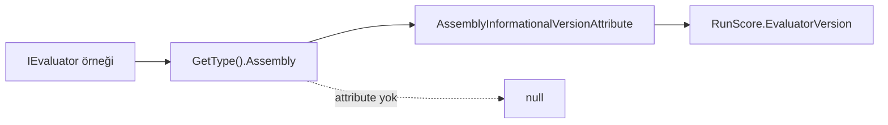

# Faz 176 — Evaluator Sürüm Damgası

> **Durum:** ✅ Tamamlandı (2026-09-16)
> **Plan onayı:** onaylandı (kullanıcı, 2026-09-16) — dört açık soru da öneriler yönünde kapandı
> **Kaynak:** [ADAYLAR.md](../../ADAYLAR.md) · **F-218**
> **Önkoşul:** [Faz 155](155-KALIBRE-EDILMIS-EVALUATOR-KATALOGU.md) — `IEvaluator` → `IRunJudge` köprüsünü o faz kurdu; damga onun üstüne biner
> **Paketler:** `Tracon.Abstractions`, `Tracon.Core`, `Tracon.PostgreSql`, `Tracon.SqlServer`, `Tracon.Sqlite`
> **Yeni paket:** Yok · **Migration:** gerekli — **üç set** (PostgreSQL + SqlServer + Sqlite); numara uygulama anında alınır
> **Public API:** büyüyor — `RunScore`'a bir alan. Faz 7'den **önce** ucuz, sonra **kırıcı**
> **Tüketici yüzeyi:** `docs-site/src/content/docs/concepts/` skor sayfası · sevk edilen: `RunScore` XML dokümanı
> **Manuel test alanı:** `docs/manuel-test/17-EVAL-VE-DENEYLER.md`

---

## Bu Faza Başlarken

> `faz-baslangic` skill'ini uygula. Aşağıdaki liste o skill'in 2. adımıdır —
> **tamamını değil, yalnız işaret edilen bölümleri oku.**

1. Bu doküman
2. Kararlar — dosyanın tamamını **okuma**, yalnız bu kalemleri grep'le:
   ```bash
   grep -n "K-711\|K-059\|K-178" docs/KARARLAR.md
   ```
   **K-711** (`RunScore.Value` `double?`; `null` = ölçüm yok — bu fazın
   migration emsali), **K-059** (`secret` veritabanına da yazılmaz; kayıtta
   yalnız **adı** durur — damga bir sürüm dizesidir, kimlik bilgisi değildir),
   **K-178** (migration numaraları sağlayıcı başına bağımsızdır)
3. [Faz 155](155-KALIBRE-EDILMIS-EVALUATOR-KATALOGU.md) — yalnız
   devir notu:
   ```bash
   awk '/## Sonraki Faza Devir Notu/,0' docs/arsiv/fazlar/155-KALIBRE-EDILMIS-EVALUATOR-KATALOGU.md
   ```
   Köprünün sözleşmesini (metrik adı ön eki, `null` = ölçüm yok) oradan devralıyoruz.
4. Alan hafızası (bu faz iki alana dokunuyor):
   [`hafiza/sql-migration.md`](../../hafiza/sql-migration.md) (üç sağlayıcı
   migration'ı) · [`hafiza/sql-paylasilan-sorgu-uretimi.md`](../../hafiza/sql-paylasilan-sorgu-uretimi.md)
   (paylaşılan okuyucu ve ordinal tuzağı) · [`hafiza/00-INDEKS.md`](../../hafiza/00-INDEKS.md)
   üzerinden değerlendirme alanı
5. Gerektiğinde: [`MIMARI.md`](../../MIMARI.md) veri modeli bölümü

---

## Amaç

`AddEvaluatorJudge` ile bağlanan bir `IEvaluator`'ın puanı
`Microsoft.Extensions.AI.Evaluation.Quality`'nin **prompt'una** bağlıdır ve o
prompt paket sürümüyle değişir. Skor satırı hangi sürümün ürettiğini
kaydetmiyor. Bir paket yükseltmesi
[Faz 153](153-EVAL-KOSUMLARI-ARASINDA-REGRESYON-FARKI.md)'ün
regresyon taban çizgisini **sessizce** kaydırabilir; fark "model bozuldu" gibi
görünür, oysa yargıcın kendisi değişmiştir.

- **F-218** — `RunScore`'a evaluator sürümünü taşıyan bir alan; `Comment`'e
  sıkıştırmadan, ayrı ve sorgulanabilir bir sütun olarak.

### Bugün ne çalışmıyor — doğrulanmış kanıt

| Kanıt | Gözlem |
|---|---|
| [`RunScore.cs:72`](../../../src/Tracon.Abstractions/Runs/RunScore.cs#L72) | `Source` (`human` / `api` / `judge:{ad}`) **required**; yargıcın kim olduğunu söylüyor |
| [`RunScore.cs:75`](../../../src/Tracon.Abstractions/Runs/RunScore.cs#L75) | `Author` bir **kimlik** alanı ("the actor who gave the score") |
| `RunScore.cs` tamamı | Tip **12 alan** taşıyor; **sürüm alanı yok** |
| [`EvaluatorRunJudge.cs:47`](../../../src/Tracon.Core/Evaluation/EvaluatorRunJudge.cs#L47) | Köprü `IEvaluator`'ı **sarmalamadan** kullanıyor (K3). Sürüm bu tipin `Assembly`'sinden okunabilir |
| 🚨 [`SqlRunScoreStore.cs:124-134`](../../../src/Tracon.Sql.Shared/Stores/SqlRunScoreStore.cs#L124) | Store **çıplak ordinal** ile okuyor: `reader.GetGuid(0)` … `reader.GetString(10)`. Ortaya sütun eklemek her okuyucuyu **sessizce** kaydırır |
| `grep -rln SqlRunScoreStore src/` | 🚨 Okuyucu **`Tracon.Sql.Shared`'dadır**, sağlayıcı paketinde değil: üç sağlayıcı da onu kullanıyor (`TraconPostgreSqlBuilderExtensions` · `TraconSqlServerBuilderExtensions` · `TraconSqliteBuilderExtensions`). **Bir** okuyucu değişir, **üç** migration yazılır |
| `src/Tracon.PostgreSql/Migrations/0050_voice_session_cost.sql` | Aynı tuzak Faz 161'de belgelenmiş: *"The columns are added at the END of the table on purpose"* |
| Migration sayıları | PostgreSql **49** dosya (son `0050_*`), SqlServer **38** (son `0038_*`), Sqlite **37** (son `0037_*`) — numaralar bağımsız (K-178) |

> Kanıtlar 2026-09-15 tarihinde doğrulandı.

---

## 176.1 — Alanın şekli

**Karar (kullanıcı, 2026-09-15): tek nullable alan.**

```csharp
/// <summary>
/// The version of the component that produced this score, when one is known.
/// </summary>
public string? EvaluatorVersion { get; init; }
```

Gerekçe ve reddedilen alternatifler:

| Seçenek | Neden seçilmedi |
|---|---|
| İki alan (`EvaluatorPackage` + `EvaluatorVersion`) | Paket adı `Source` içinde `judge:{ad}` olarak **zaten** var. İkinci bir ad alanı aynı bilgiyi iki yerde tutar |
| Yapılandırılmış `Provenance` nesnesi | Yeni public tip, JSON sütun, üç sağlayıcıda serileştirme ve AOT maliyeti. Talep kanıtı bunu taşımıyor |
| `Author`'a sıkıştırmak | K-059 sınıfı bir hata: **ad alanı sürüm alanı değildir**. Migration'dan kaçmak için anlam bozmak, kaçılan maliyetten pahalıdır |

`null` **ölçülmedi** demektir, "sürüm 0" değil — K-711'in `Value` için kurduğu
kuralın aynısı. İnsan ve API kaynaklı skorlarda alan her zaman `null`'dır.

## 176.2 — Sürüm nereden gelir

Köprü `IEvaluator`'ı sarmalamadan kullanıyor, bu yüzden sürüm **evaluator'ın
kendi assembly'sinden** okunur. Bu, üçüncü taraf bir `IEvaluator` için de
çalışır — Microsoft'un kataloğuna özel bir yol açılmaz.



Üç kural:

1. **Bir kez çözülür, her satırda değil.** `EvaluatorRunJudge` sürümü kurulumda
   hesaplar ve saklar; her `JudgeAsync` çağrısında yansıma yapmaz.
2. **Çözülemezse `null`.** Attribute yoksa veya okuma hata verirse alan `null`
   kalır ve **skor yine yazılır**. Gözlemlenebilirlik işlevselliği bozmaz.
3. **Yalnız köprü doldurur.** `ModelRunJudge` bu alanı **doldurmaz** — onun
   puanı bir paketin prompt'una değil, yapılandırılan modele bağlıdır ve o
   bilgi başka yerde durur. Kapsam dışı kalması bilerek seçilmiştir.

🚨 **AOT:** `Tracon.Core` AOT-uyumlu kalmalıdır. Assembly attribute okuması
dinamik kod üretmez ve NativeAOT'ta korunur, ama bu **ölçülmeli** — faz bunu
`Tracon.Package.Tests` AOT koşumuyla doğrular.

## 176.3 — Migration: sütun tablonun **sonuna** gider

🚨 Bu fazın tek gerçek tuzağı budur. `SqlRunScoreStore` satırı **çıplak
ordinal** ile okuyor (`reader.GetString(10)`). Ortaya eklenen bir sütun her
okuyucuyu sessizce kaydırır ve test **yeşil kalabilir** — kayma tip uyumlu
olduğu sürece yalnız veriyi bozar.

```sql
-- Sütun tablonun SONUNA eklenir. SqlRunScoreStore çıplak ordinal ile okur;
-- ortaya eklemek her okuyucuyu sessizce kaydırır (0050_voice_session_cost.sql
-- aynı tuzağı Faz 161'de belgeledi).
ALTER TABLE {schema}.run_scores ADD COLUMN IF NOT EXISTS evaluator_version text;
```

Üç set yazılır ve numaralar **bağımsızdır** (K-178). Plan numara **rezerve
etmez**; uygulama anında her sağlayıcının bir sonraki boş numarası alınır.

| Sağlayıcı | Bugünkü son | Uygulama anında alınacak |
|---|---|---|
| PostgreSql | `0050_voice_session_cost.sql` | sıradaki boş |
| SqlServer | `0038_voice_session_cost.sql` | sıradaki boş |
| Sqlite | `0037_voice_session_cost.sql` | sıradaki boş |

## 176.4 — Bu alan Faz 7'den önce ucuzdur

`RunScore` public bir `sealed record`'dur. Bugün alan eklemek **bedavadır**;
Faz 7'den (yayın) sonra eklemek **kırıcıdır**. `PublicAPI.Shipped.txt`
dosyalarının bugün boş olduğu (`wc -l src/*/PublicAPI.Shipped.txt`) uygulama
anında ölçülür ve bu cümle doğrulanır.

---

## Planlanan Public API

> Taslak imzalardır. Gerçekleşen imzalar kapanışta ayrı bir bölüme yazılır.

```csharp
// Tracon.Abstractions/Runs/RunScore.cs
public sealed record RunScore
{
    // … mevcut 12 alan değişmez …

    /// <summary>
    /// The version of the component that produced this score, when one is known.
    /// </summary>
    /// <remarks>
    /// <see langword="null"/> means <strong>no version was resolved</strong> —
    /// a human or API score, or an evaluator whose assembly carries no
    /// informational version. It never means "version zero".
    /// <para>
    /// A bridged evaluator's score depends on that package's prompt, so a
    /// package upgrade can move a regression baseline without the model
    /// changing. This field is what separates the two.
    /// </para>
    /// </remarks>
    public string? EvaluatorVersion { get; init; }
}
```

### HTTP `endpoint`'leri

Yeni uç **yok**. Mevcut skor uçlarının yanıt şeması bir alan büyür; OpenAPI
anlık görüntüsü (`OpenApiSnapshotTests`) bunu yakalar ve güncellenir.

### Arayüz payı

Yok — bu faz arayüze dokunmaz. Skor satırının arayüzde gösterilmesi ayrı bir
karardır ve § *Açık Sorular* 3'tedir.

---

## Planlanan Dosya Listesi

```
src/Tracon.Abstractions/Runs/
└── RunScore.cs                              (değişir — bir alan)

src/Tracon.Core/Evaluation/
└── EvaluatorRunJudge.cs                     (değişir — sürüm çözümü)

src/Tracon.Sql.Shared/
├── Stores/SqlRunScoreStore.cs               (değişir — yeni ordinal SONDA; ÜÇ sağlayıcı da bunu kullanır)
└── Internal/SqlQueriesBase.cs               (değişir — SELECT sütun listesi)

src/Tracon.PostgreSql/Migrations/NNNN_run_score_evaluator_version.sql   (yeni)
src/Tracon.SqlServer/Migrations/NNNN_run_score_evaluator_version.sql    (yeni)
src/Tracon.Sqlite/Migrations/NNNN_run_score_evaluator_version.sql       (yeni)

src/Tracon.Core/Storage/
└── InMemoryRunScoreStore.cs                 (değişir — alanı taşır)

src/Tracon.Testing.Contracts.Xunit/Contracts/
└── RunScoreStoreContract.cs                 (değişir — alanın gidiş-dönüşü)
```

---

## Hata Modları ve Testler

> Seviyeyi plan seçer. Kalıcı şema **depo sınırını** geçer; birim testi bunu
> kanıtlamaz.

| Ne bozulabilir | Seviye | Test |
|---|---|---|
| 🚨 Sütun ortaya eklenir, ordinal okuma kayar, veri sessizce bozulur | Sözleşme (`RunScoreStoreContract`) | Dört koşumda birden: bellek içi + üç SQL |
| Alan yazılıyor ama geri okunmuyor (asimetri) | Sözleşme (`RunScoreStoreContract`) | `Evaluator_version_round_trips` |
| Migration bir sağlayıcıda atlanıyor | Fonksiyonel | `MigrationParityTests` — üç sağlayıcı aynı sütunu taşır |
| Eski satırlar (`NULL`) okunurken patlıyor | Sözleşme | `Legacy_rows_read_back_with_a_null_version` |
| Evaluator assembly'sinde attribute yok → skor **hiç** yazılmıyor | Fonksiyonel | `EvaluatorJudgeTests.Missing_version_does_not_stop_the_score` |
| Sürüm her satırda yansımayla çözülüyor (sıcak yol maliyeti) | Birim | `EvaluatorJudgeTests.Version_is_resolved_once` |
| `ModelRunJudge` yanlışlıkla alanı dolduruyor | Birim | `ModelRunJudgeTests.Does_not_stamp_an_evaluator_version` |
| AOT koşumu assembly attribute okumasında kırılıyor | Paket | `Tracon.Package.Tests` AOT koşumu |
| OpenAPI anlık görüntüsü güncellenmeden kalıyor | Fonksiyonel | `OpenApiSnapshotTests` |
| Başka kiracının skoru görünür hâle geliyor | Sözleşme (`TenantIsolationContract`) | Mevcut kapı; alan eklemek onu gevşetmemeli |

Beş soru: **iptal** → `RunScoreStoreContract` zaten bir iptal case'i taşıyor
(satır 688), alan onu bozmamalı · **eşzamanlılık** → mevcut
`Summary_can_be_read_while_a_score_is_being_written` olgusu korunur ·
**boş/aşırı girdi** → çok uzun sürüm dizesi (sütun sınırı) ·
**başka kiracı** → `TenantIsolationContract` · **alt sistem hatası** →
attribute okuması hata verirse skor yine yazılır.

---

## Manuel Kabul Case'leri

| # | Ön koşul | Adımlar | Beklenen sonuç |
|---|---|---|---|
| 1 | `AddEvaluatorJudge` ile bir evaluator bağlı | Bir `run` koş, skoru oku | `evaluatorVersion` paket sürümünü taşır |
| 2 | İnsan skoru verilir | Arayüzden puan ver, satırı oku | `evaluatorVersion` `null` |
| 3 | `AddModelRunJudge` ile yargıç bağlı | Bir `run` koş | `evaluatorVersion` `null` |
| 4 | Migration öncesi yazılmış skorlar var | Migration koş, eski satırı oku | Satır okunur, alan `null`, hata yok |
| 5 | Üç sağlayıcı da kurulu | Her birinde 1. case'i tekrarla | Üçünde de aynı sonuç |
| 6 | Evaluator sürümü yükseltilir | Yeni bir `run` koş, iki satırı karşılaştır | İki satır **farklı** sürüm taşır; regresyon farkı yorumlanabilir |

---

## Açık Sorular

| # | Soru | Seçenekler | Öneri |
|---|---|---|---|
| 1 | Sütun uzunluk sınırı ne olsun? | A: `text` (sınırsız) · B: `varchar(64)` · C: `RunScoreRules` içinde bir sabit + doğrulama | **C** — `RunScoreRules.MaxTextValueLength` emsali var. Sınırsız bir sütun kalıcı şemada gereksiz risktir; sınır sabiti tek yerde durur |
| 2 | `EvaluatorVersion` skor sorgularında filtrelenebilir olsun mu? | A: hayır, yalnız okunur · B: evet, `RunScoreQuery`'ye alan eklenir | **A** — talep kanıtı yok ve sorgu yüzeyi büyütmek ayrı bir sözleşmedir. Satır okunabildiği için soru bugün de cevaplanabilir |
| 3 | Arayüzde gösterilsin mi? | A: bu fazda değil · B: skor detayında rozet | **A** — bu faz bir kalıcılık fazıdır. Arayüz kararı ayrı ölçülür |
| 4 | `Source` `judge:{ad}` iken alan `null` kalırsa bu bir uyarı mı? | A: hayır, sessiz · B: bir kez `Debug` seviyesinde loglanır | **B** — üçüncü taraf evaluator'ların sürümsüz gelmesi normaldir, ama tamamen sessiz kalmak teşhisi zorlaştırır. `Warning` değil, `Debug` |

---

## Bitiş Ölçütleri (DoD)

- [x] `RunScore.EvaluatorVersion` üç sağlayıcıda **ve** bellek içi store'da gidiş-dönüş yapıyor — `RunScoreStoreContract` dört koşumda birden yeşil (PostgreSql 794 · SqlServer 711 · Sqlite 730 · bellek içi)
- [x] 🚨 Sütun üç migration'da da tablonun **sonuna** eklendi; ordinal **12** (plan 11 diyordu — `TextValue` atlanmıştı). Gerçek SQLite `PRAGMA table_info` çıktısında `evaluator_version` son sütundur
- [x] Migration öncesi yazılmış satırlar `null` ile okunuyor; hata yok — `A_score_with_no_evaluator_version_reads_back_as_null`
- [x] `AddEvaluatorJudge` ile üretilen skor sürümü taşıyor; `AddModelRunJudge` ile üretilen **taşımıyor** — örnek uygulamada tek yanıtta ikisi birden görüldü (aşağıda)
- [x] Attribute çözülemediğinde skor **yine yazılıyor** — `An_evaluator_with_NO_assembly_version_is_still_scored` (dinamik assembly probu)
- [x] Sürüm çağrı başına değil, kurulumda **bir kez** çözülüyor — `The_version_is_resolved_ONCE_at_construction_not_per_call`; **mutasyonla** doğrulandı (alan → property yapılınca test düştü)
- [x] `PublicAPI.Shipped.txt` boş olduğu ölçüldü: `wc -l src/*/PublicAPI.Shipped.txt` → **17 satır / 17 dosya**, hepsi `#nullable enable`
- [x] AOT koşumu temiz — `Tracon.Package.Tests` **53/53**. 🚨 `DEVELOPER_DIR=/Library/Developer/CommandLineTools` gerekti; sebebi repo değil, makinedeki Xcode linker / CLT SDK uyuşmazlığıdır ve faz **öncesi** commit'te de aynıdır (bkz. Plandan Sapmalar 10)
- [x] Dört doğrulama kapısı sıfır uyarı verir — `kapi.py kapanis` çıktısı aşağıda
- [x] `samples/Tracon.Api` ile gerçek `run` yapıldı (SQLite + yerel OpenAI-uyumlu stub uç; **38 migration** uygulandı). Gerçek veritabanı satırları:

  ```
  name                   source             evaluator_version
  overall                human              None
  model                  judge:model        None
  relevance.Relevance    judge:relevance    '10.9.0+b10f9c0a081b5dbb7755b8f5592e1d3c3f550a3a'
  ```

  🚨 Damgalanan sürüm **katalog paketinin** sürümüdür, Tracon'un değil — `evaluator.GetType().Assembly` okumasının doğru assembly'yi bulduğunun gerçek kanıtı budur. `PRAGMA table_info(tracon_run_scores)` son sütun olarak `evaluator_version` gösterdi.
- [x] `secret` taraması boş döndü — `kapi.py tarama`
- [x] Manuel kabul case'leri eklendi: **EVAL-143…146**; dördü de örnek uygulamada elle koşuldu
- [x] `faz-denetim` koşuldu; bulgular §Denetim Bulguları'nda
- [x] `docs-site/` güncellendi (`concepts/evaluation.md` · `capabilities.md` · `getting-started/persistence.md`); **dört** site kapısı da temiz (`npm run check`: content 1146 · links 188 146 · SEO 0 hata · weight)

### Doğrulama komutları

```bash
# Üç sağlayıcıda sözleşme
dotnet test tests/Tracon.PostgreSql.IntegrationTests
dotnet test tests/Tracon.SqlServer.IntegrationTests
dotnet test tests/Tracon.Sqlite.IntegrationTests

# Public API yüzeyi bugün gerçekten boş mu
wc -l src/*/PublicAPI.Shipped.txt

# Skor satırını gör
curl -s http://localhost:5081/tracon/api/runs/{runId}/scores | jq '.[].evaluatorVersion'
```

---

## Riskler

| Risk | Önlem |
|------|-------|
| 🚨 Ordinal kayması — sütun ortaya eklenirse veri **sessizce** bozulur ve test yeşil kalabilir | Sütun **sonda**; sözleşme testi gidiş-dönüşü dört koşumda birden kanıtlar; migration dosyası tuzağı yorumla taşır |
| Kalıcı şemaya alan eklemek geri dönüşü pahalıdır | Faz 7'den önce yapılıyor; `PublicAPI.Shipped.txt`'nin boş olduğu DoD'de ölçülüyor |
| Talep kanıtı tek bir risk satırı — kanıtsız şema büyütmek | Alan **nullable** ve additive; hiçbir tüketiciyi bugün etkilemiyor. Yanlış çıkarsa maliyeti bir sütundur, bir sözleşme değil |
| Üç migration'dan biri atlanır | `MigrationParityTests` DoD'de |
| Yansıma AOT'u kırar | `Tracon.Package.Tests` AOT koşumu DoD'de; kırılırsa alan `null` kalır ve **skor yine yazılır** |
| `Author`'a sıkıştırma cazibesi geri gelir | §176.1 tablosu gerekçeyi taşıyor: ad alanı sürüm alanı değildir |

---

<!-- ============================================================
     AŞAĞISI KAPANIŞTA DOLDURULUR — `faz-tamamlama` skill'i.
     Plan anında boş kalır. Başlıkları SİLME.
     ============================================================ -->

## Plandan Sapmalar

**1. 🚨 Plan TAŞIYICI KATMANI atlamıştı — fazın tek gerçek tasarım boşluğu buydu.**
Plan sürümün `EvaluatorRunJudge`'de çözüleceğini ve `RunScore`'a yazılacağını
söylüyordu, ama `RunScore`'u köprü kurmuyor: `OnlineEvalJobHandler` kuruyor
(`grep -rn "new RunScore" src/` iki üretim noktası gösterdi). Aradaki sözleşmede
sürümü taşıyacak bir alan yoktu. Üç seçenek kullanıcıya soruldu ve
**`RunJudgment.EvaluatorVersion`** seçildi (K-788). Planın dosya listesinde
`OnlineEvalJobHandler.cs` ve `IRunJudge.cs` **yoktu**.

**2. Planın ordinal kanıtı bir eksikti.** Plan `SqlRunScoreStore`'un
`reader.GetString(10)`'a kadar okuduğunu yazıyordu; gerçek okuyucu **11**'e kadar
gidiyor (`TextValue`, Faz 152). Yeni ordinal bu yüzden **12**'dir, 11 değil.

**3. Planın dosya listesi ÜÇ DIALEKT SORGUSUNU atlamıştı.** Yalnız
`SqlQueriesBase.cs` yazılıydı, ama `UpsertRunScore` üç sağlayıcıda **ayrı ayrı**
tanımlıdır (`PostgresQueries` · `SqlServerQueries` · `SqliteQueries`) ve SQL
Server ayrıca bir `runScoreOutput` sabiti taşır. Dördü de değişti.

**4. `MigrationParityTests` YOKTU.** Plan onu mevcut bir kapıymış gibi anıyordu;
`find tests -iname "*migration*"` böyle bir dosya bulamadı. Faz onu **yazdı**
(`tests/Tracon.Sql.Shared.UnitTests/MigrationParityTests.cs`) — Docker istemez,
üç sağlayıcının gömülü migration metnini okur. Mutasyonla doğrulandı: SQLite
migration'ı silindiğinde kapı `Sqlite: run_scores.evaluator_version` diyerek
düştü.

**5. `InMemoryRunScoreStore` DEĞİŞMEDİ.** Plan onu listelemişti; store `RunScore`
kaydını bütün olarak tuttuğu için yeni alan kendiliğinden gidiş-dönüş yapıyor.

**6. Köprü sürümü KIRPIYOR, doğrulamaya bırakmıyor.** Açık Soru 1'in "C" cevabı
`RunScoreRules`'a bir sınır koydu. Ama köprü o sınırı **aşan** bir assembly
sürümü görürse doğrulamaya düşmek skorun **hiç yazılmaması** demekti — §176.2
kural 2 ile çelişir. Köprü bu yüzden kırpar; sınır ihlali yalnız **üçüncü taraf
bir yargıç** `RunJudgment.EvaluatorVersion`'ı elle doldurduğunda sözleşme hatası
olur.

**7. `TryValidate`'in PROBE kaydı da sürümü taşır.** Faz 155 devir notu
"doğrulama ilk yazmadan önce topludur" diyor. Sürüm probe'a konmasaydı aşırı uzun
bir sürüm ilk satırda **store'da** patlar ve yarım yazılmış küme bırakırdı.

**8. Sevk edilen doküman cırcırı dört dosyada kızardı.** `///` blokları içine
yazdığım 🚨 işaretleri `ShippedDocumentationSelfContainmentTests`'i düşürdü. Taban
**yalnız küçülür**, bu yüzden yenilenmedi: işaretler uygulama yorumuna (`//`)
taşındı, gerekçe cümleleri XML dokümanında kaldı.

**9. Kapsam dışı kusur çözüldü — `tuketici-dokuman-senkronu` skill'i bayat sayı
taşıyordu.** SKILL.md agent haritası bütçesini "10 240 B" diye yazıyordu; gerçek
sabit `agentMapBudgetBytes = 11264`. Kendi kalite sözleşmesi dosyası bu sayının
bir kez bayatladığını **zaten** kaydetmişti. Satır sayı yerine sabite yönlendirdi.

**10. Kapsam dışı ortam kusuru teşhis edildi (repo kusuru DEĞİL).**
`Tracon.Package.Tests`in NativeAOT case'i bu makinede linker hatasıyla düşüyor.
`git worktree` ile **faz öncesi** commit'te birebir aynı hata alındı, yani fazın
regresyonu değildir. Kök sebep: `xcode-select` Xcode.app'i gösteriyor
(`ld-1267`, Haz 2026) ama SDK Command Line Tools'un 27.0'ı (CLT'nin kendi
linker'ı `ld-27037.1`). `DEVELOPER_DIR=/Library/Developer/CommandLineTools` ile
53/53 yeşil. Tuzak `docs/hafiza/test-kosum-tuzaklari.md`'ye yazıldı; kalıcı
çözüm sistem düzeyindedir ve kullanıcıya bırakıldı. CI etkilenmez
(`ubuntu-latest`).

**11. Planlanan manuel case 5 ("üç sağlayıcı da kurulu — 1. case'i her birinde
tekrarla") YAZILMADI.** Onu kapatan şey `RunScoreStoreContract`'tır: aynı beş
case üç SQL sağlayıcısında **ve** bellek içi store'da otomatik koşuyor, yani elle
koşumdan hem daha sık hem daha güvenilir. Elle bir kopyası iki yerde bakım
maliyeti üretirdi. Bu sapma denetimde 🟡 olarak bulundu ve buraya yazıldı.

**12. Denetimin bulduğu ÜÇ test zayıflığı kapatıldı.** (a) `RunJudgeContract`
yeni değişmezi denetlemiyordu — üçüncü taraf bir yargıç sözleşmeyi geçip üretimde
**bütün** skorlarını kaybedebilirdi. (b) `MigrationParityTests` sütun adını
**tablo bağlamı olmadan** arıyordu; `status` gibi başka tablolarda geçen bir ad
kapıyı sessizce yeşil bırakırdı (mutasyonla doğrulandı: artık üç sağlayıcıda da
reddediliyor). Aynı düzeltme, SQL yorumundaki bir `;`'nin `CREATE TABLE`'ı
kesip altı sütunu düşürdüğünü de ortaya çıkardı. (c) İkinci parite testi
`SelectRunScores`'u kendisiyle karşılaştırıyordu (tek atama paylaşılan tabandadır);
gerçekten kayabilen yüzeye — üç dialektin `UpsertRunScore` `VALUES` listesi ve SQL
Server'ın `OUTPUT` listesi — çevrildi ve mutasyonla doğrulandı.

## Bu Fazda Verilen Kararlar

| Karar | Gerekçe |
|---|---|
| **K-788** — Sürüm `RunJudgment.EvaluatorVersion` ile taşınır; `IRunJudge` seam'i **değişmez** | Üç seçenek ölçüldü. `IRunJudge.Version` anlamsal olarak en yakınıydı ama public extension seam'ini büyütürdü; `JudgeScore.Version` aynı dizeyi metrik başına tekrarlardı. `RunJudgment` yargıcın Tracon'a **zaten** veri döndürdüğü kanaldır ve provenance kararın parçasıdır. **(kullanıcı kararı)** |
| **K-789** — `RunScore.EvaluatorVersion` `varchar(128)`; sınır `RunScoreRules.MaxEvaluatorVersionLength`'tedir ve `Validate` zorlar | Değeri **yargıç** sağlar. Sınırsız bir sütun, üçüncü taraf bir yargıcın tüketicinin tablosunda bir satırın ne kadar yer kaplayacağına karar vermesi demektir. `MaxTextValueLength` emsali. **(kullanıcı kararı)** |
| **K-790** — `null` = **sürüm çözülmedi**, "sürüm sıfır" değil; çözülemezse skor **yine yazılır** | K-711'in `Value` için kurduğu kuralın aynısı. Sürüm gözlemlenebilirliktir ve gözlemlenebilirlik işlevselliği bozmaz: okunamayan bir assembly attribute'u kiracıya skor satırlarına mal olamaz. |
| **K-791** — `ModelRunJudge` alanı **doldurmaz** | Yerleşik yargıcın puanı bir paketin prompt'una değil **yapılandırılan modele** bağlıdır; o bilgi `ModelBinding`'de durur. Tracon'un kendi sürümünü basmak sütunu iki farklı anlama gelir hâle getirirdi. |

## Gerçekleşen Public API

```csharp
// Tracon.Abstractions/Runs/RunScore.cs
public sealed record RunScore
{
    // … mevcut 12 alan değişmedi …
    public string? EvaluatorVersion { get; init; }
}

// Tracon.Abstractions/Runs/RunScoreRules.cs
public static class RunScoreRules
{
    public const int MaxEvaluatorVersionLength = 128;
    // Validate(score) artık bu sınırı da zorlar
}

// Tracon.Abstractions/Evaluation/IRunJudge.cs — TAŞIYICI (planda yoktu)
public sealed record RunJudgment
{
    public IReadOnlyList<JudgeScore> Scores { get; init; } = [];
    public string? EvaluatorVersion { get; init; }   // YENİ
}
```

`IRunJudge` arayüzü **değişmedi**. `PublicAPI.Shipped.txt` toplamı uygulama
anında ölçüldü: **17 satır, hepsi `#nullable enable`** — hiçbir public yüzey
yayımlanmamış, yani alan eklemek bugün bedava (K-711/K-728 ile aynı gerekçe).

### HTTP

Yeni uç yok. Skor yanıt şeması bir alan büyüdü; `docs/openapi/tracon.json`
**yalnız ekleme** ile güncellendi (7 satır, silme yok).

## Dosya Listesi (gerçekleşen)

```
src/Tracon.Abstractions/
├── Runs/RunScore.cs                          (alan)
├── Runs/RunScoreRules.cs                     (sabit + Validate)
├── Evaluation/IRunJudge.cs                   (RunJudgment taşıyıcı alanı) ★ planda yoktu
└── PublicAPI.Unshipped.txt                   (5 satır)

src/Tracon.Core/Evaluation/
├── EvaluatorRunJudge.cs                      (kurulumda bir kez çözüm + Debug log)
└── OnlineEvalJobHandler.cs                   (yazma + probe damgası)   ★ planda yoktu

src/Tracon.Sql.Shared/
├── Internal/SqlQueriesBase.cs                (RunScoreColumns — SONA eklendi)
└── Stores/SqlRunScoreStore.cs                (parametre + ordinal 12)

src/Tracon.PostgreSql/Internal/PostgresQueries.cs    ★ planda yoktu
src/Tracon.SqlServer/Internal/SqlServerQueries.cs    ★ planda yoktu (runScoreOutput dahil)
src/Tracon.Sqlite/Internal/SqliteQueries.cs          ★ planda yoktu

src/Tracon.PostgreSql/Migrations/0051_run_score_evaluator_version.sql   (yeni)
src/Tracon.SqlServer/Migrations/0039_run_score_evaluator_version.sql    (yeni)
src/Tracon.Sqlite/Migrations/0038_run_score_evaluator_version.sql       (yeni)

src/Tracon.Testing.Contracts.Xunit/
├── Contracts/RunScoreStoreContract.cs        (5 sözleşme case'i)
└── PublicAPI.Unshipped.txt

tests/
├── Tracon.Sql.Shared.UnitTests/MigrationParityTests.cs        (YENİ dosya)
├── Tracon.Sql.Shared.UnitTests/Baselines/*.txt                (3 baseline)
├── Tracon.Core.UnitTests/Evaluation/EvaluatorRunJudgeTests.cs (4 case + dinamik assembly probu)
├── Tracon.Core.UnitTests/Evaluation/ModelRunJudgeTests.cs     (1 case)
├── Tracon.Core.UnitTests/Evaluation/OnlineEvalJobHandlerTests.cs (3 case)
└── Tracon.AspNetCore.FunctionalTests/EvaluatorJudgeEndToEndTests.cs (3 case)

docs/openapi/tracon.json                      (yalnız ekleme)
docs/manuel-test/17-EVAL-VE-DENEYLER.md       (EVAL-143…146)
docs/hafiza/test-kosum-tuzaklari.md           (macOS AOT tuzağı — kapsam dışı)

docs-site/src/content/docs/concepts/evaluation.md          (yeni bölüm)
docs-site/src/content/docs/capabilities.md                 (yetenek satırı)
docs-site/src/content/docs/getting-started/persistence.md  (eklemeli migration notu)
src/Tracon.Core/buildTransitive/Tracon.AgentMap.md         (üretildi)
docs-site/public/llms*.txt                                 (üretildi)

.agents/skills/tuketici-dokuman-senkronu/SKILL.md          (bayat bütçe — kapsam dışı)
```

## Süreç Ölçümü

| Metrik | Değer |
|---|---|
| Plan revizyonu sayısı | 0 (plan onaylandı; 4 açık soru + 1 yapısal boşluk uygulama öncesi kapatıldı) |
| Düzeltme turu sayısı | 4 (public API bildirimi · sevk doküman cırcırı · analyzer MA0002/CA1859 · site llms yeniden üretimi) |
| 🔴 bulgu: gerçek / gürültü / araştırılacak | `faz-denetim` bölümüne bak |
| Fazın ürettiği regresyon | 0 |
| Faz kapandıktan sonra bulunan kusur | — |
| Plan yapısal iddiası düşen | **4/4 boşluk** (taşıyıcı katman · ordinal sayısı · üç dialekt · var olmayan test) |
| Mutasyonla doğrulanan kapı | 2 (`Version_is_resolved_ONCE` · `MigrationParityTests`) |

## Denetim Bulguları

Bağımsız denetçi (taze bağlam, salt-okunur) `git diff 04ec6d91` + dört izlenmeyen
dosya üzerinde koştu.

**🔴 bulgu: YOK.** Denetimin ağır dört maddesi temiz çıktı: ordinal zinciri
(paylaşılan sütun listesi ↔ üç `VALUES` ↔ `runScoreOutput` ↔ okuyucu ordinali)
tutarlı · üç migration anlamca aynı (nullable, backfill yok) · imza-gövde kayması
yok (`new RunScore` üç üretim noktası, `new RunJudgment` üçü de izlendi; dördüncü
store kaydı bütün olarak sakladığı için geride kalmıyor) · `PublicAPI.Unshipped.txt`
girdileri gerçek imzalarla eşleşiyor.

**🟡 beş bulgu — hepsi bu fazda kapatıldı:**

| # | Bulgu | Kapanış |
|---|---|---|
| 1 | `RunJudgeContract.ShouldBeStorable` yeni değişmezi denetlemiyordu: 129 karakterlik bir sürüm sözleşmeyi **geçiyor**, sonra üretimde yargıcın **bütün** skorlarını kaybettiriyordu | Sınır kontrolü sözleşmeye eklendi, skorlardan **önce** — çünkü ihlal tek alanı değil tüm kümeyi düşürür |
| 2 | 🚨 `MigrationParityTests` sütunu **tablo bağlamı olmadan** arıyordu; 13 sütunun 12'si için kapı fiilen boştu (`status`, `state`, `key` her sağlayıcının setinde zaten geçiyor) | Arama `CREATE TABLE`/`ALTER TABLE … run_scores` ifadeleriyle sınırlandı. **Mutasyonla doğrulandı:** `status` artık üç sağlayıcıda da reddediliyor. Düzeltme ikinci bir kusuru açığa çıkardı: SQL yorumundaki bir `;` `CREATE TABLE`'ı kesip **altı sütunu** düşürüyordu — yorumlar artık taramadan önce ayıklanıyor |
| 3 | İkinci parite testi bir sabiti **kendisiyle** karşılaştırıyordu: `SelectRunScores`'un tek ataması paylaşılan tabandadır, hiçbir dialekt ezmez | Test gerçekten kayabilen yüzeye çevrildi: üç dialektin `UpsertRunScore` `VALUES` listesi + SQL Server'ın `OUTPUT` listesi. **Mutasyonla doğrulandı:** SQL Server'ın `VALUES` listesinde iki sütun yer değiştirince kapı düşüyor |
| 4 | Sevk edilen `Validate` dokümanının `<exception>` listesi üçüncü `throw` sebebini saymıyordu; `IRunScoreStore` bir genişleme noktasıdır ve tüketici o dokümana bakarak kendi store'unu yazar | Sürüm sınırı listeye eklendi |
| 5 | Planlanan manuel case 5 sessizce düşmüştü | Sapma olarak yazıldı (§Plandan Sapmalar 11) |

**🟢 üç bulgu:** biri kapatıldı (site örneği artık gerçek damganın şeklini —
`+` sonrası build revizyonunu — gösteriyor ve eşitlikle karşılaştırma öğütlüyor),
ikisi `ADAYLAR.md`'ye **F-241** ve **F-242** olarak yazıldı.

## Sonraki Faza Devir Notu

Devralınan sözleşme birebir:

```csharp
public sealed record RunJudgment
{
    public IReadOnlyList<JudgeScore> Scores { get; init; } = [];
    public string? EvaluatorVersion { get; init; }   // null = surum cozulmedi
}

public sealed record RunScore
{
    // … 12 alan …
    public string? EvaluatorVersion { get; init; }   // <= 128 karakter
}
```

### 🚨 Sonraki fazın bilmesi gerekenler

- **`run_scores` okuyucusu ÇIPLAK ORDINAL kullanır ve son ordinal artık `12`'dir**
  (`SqlRunScoreStore.Read`). Yeni bir sütun **SONA** eklenir; ortaya eklemek her
  alanı sessizce kaydırır ve komşu tipler uyuşuyorsa test **yeşil kalır**. Sütun
  listesi tek yerdedir: `SqlQueriesBase.RunScoreColumns`. Ama `UpsertRunScore`
  **üç dialektte ayrı** yazılıdır ve SQL Server ayrıca `runScoreOutput` taşır —
  bir sütun eklerken **dört** yer güncellenir.
- **`MigrationParityTests` artık bu sınıfı kapatıyor.** Bir sağlayıcının
  migration'ını unutursan kapı sağlayıcıyı **adıyla** söyler. Docker istemez.
  Yeni bir ordinal-okunan tablo eklersen o tabloyu da bu teste ekle.
- **Sürüm damgası `RunJudgment` üzerinden akar, `IRunJudge` üzerinden DEĞİL**
  (K-788). Bir yargıcın sürüm bildirmesini istiyorsan `JudgeAsync`'in döndürdüğü
  kayda yaz ve **kurulumda bir kez** çöz — `EvaluatorRunJudge._evaluatorVersion`
  bunun emsalidir ve bir test (`The_version_is_resolved_ONCE_at_construction_not_per_call`)
  onu zorlar.
- **Sürüm doğrulaması `TryValidate`'in probe kaydındadır.** `RunJudgment`'a
  saklanan yeni bir alan eklersen probe'a da ekle; yoksa ihlal ilk yazmada
  store'da patlar ve yarım küme bırakır.
- **`ModelRunJudge` bilerek damgalanmaz** (K-791). Onu damgalamak isteyen bir faz
  önce "hangi bilgiyi taşıyor" sorusunu cevaplamalı; model bilgisi
  `ModelBinding`'dedir, sürüm sütunu değildir.
- **🚨 Dinamik assembly probu testte meşru bir araçtır.** Bu repodaki her derlenen
  assembly bir informational version taşır, bu yüzden "sürümsüz assembly" ve
  "aşırı uzun sürüm" şekillerine **ancak** `AssemblyBuilder` ile ulaşılır
  (`EvaluatorRunJudgeTests.EvaluatorInAssemblyWithVersion`). Yerine bir stand-in
  koymak stand-in'i test eder, assembly okumasını değil.

### Açık uçlar

- `RunScoreQuery` sürüme göre **süzmez** (Açık Soru 2, "A"). Satır okunabildiği
  için soru bugün de cevaplanabilir; süzgeç eklemek beş özet sorgusunu, üç
  dialekti ve HTTP ucunu büyütür.
- Arayüzde **gösterilmez** (Açık Soru 3, "A"). Skor detayında bir sürüm rozeti
  ayrı bir karardır ve ölçülmedi.
- Faz 153'ün regresyon farkı sürümü **henüz okumuyor**: iki koşumun sürümü
  farklıysa bunu okuyucu elle görür, araç "yargıç değişti" diye **etiketlemez**.
  Aday olabilir.
