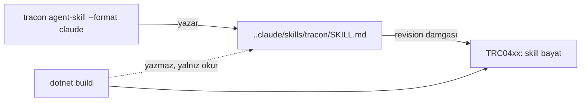

# Faz 178 — Tüketici Kapı Skill'i

> **Durum:** ✅ Tamamlandı (2026-09-16)
> **Plan onayı:** onaylandı (kullanıcı, 2026-09-16) — Açık Soru 1 → A, 3 → B (4 KB)
> **Kaynak:** [ADAYLAR.md](../../ADAYLAR.md) · **F-232**
> **Önkoşul:** [Faz 73](73-TUKETICI-AGENT-DESTEGI.md) (bilgi kanalı: harita, `AGENTS.md`, yerel referans) · [Faz 167](167-AGENT-ZORLAMA-KATMANI.md) (zorlama kanalı: `TRC0*` diagnostic'leri **ve** § 167.3 ölçüm emsali)
> **Paketler:** `Tracon.Cli`, `Tracon.Generators`
> **Yeni paket:** Yok · **Migration:** Yok
> **Public API:** büyüyor — yalnız **CLI yüzeyinde**; `src/` çekirdeğine dokunulmaz
> **Tüketici yüzeyi:** `docs-site/src/content/docs/guides/coding-agent-support.md` · sevk edilen: yeni CLI komutu, yeni `TRC04xx` diagnostic metni
> **Manuel test alanı:** `docs/manuel-test/29-AGENT-DESTEGI.md`

---

## Bu Faza Başlarken

> `faz-baslangic` skill'ini uygula. Aşağıdaki liste o skill'in 2. adımıdır —
> **tamamını değil, yalnız işaret edilen bölümleri oku.**

1. Bu doküman
2. Kararlar — dosyanın tamamını **okuma**, yalnız bu kalemleri grep'le:
   ```bash
   grep -n "K-761\|K-008" docs/KARARLAR.md
   ```
   **K-761** (`.claude/settings.json` `deny` bloğu bir **korkuluktur**, güvenlik
   sınırı değildir — üretilen skill de aynı sınıftadır ve metni bunu söylemeli),
   **K-008** (ön sürüm MAF paketi yalnız `Tracon.AspNetCore` içinde)
3. [Faz 167](167-AGENT-ZORLAMA-KATMANI.md) — yalnız **§ 167.3**
   ve devir notu:
   ```bash
   awk '/167\.3/,/^## /' docs/arsiv/fazlar/167-AGENT-ZORLAMA-KATMANI.md
   awk '/## Sonraki Faza Devir Notu/,0' docs/arsiv/fazlar/167-AGENT-ZORLAMA-KATMANI.md
   ```
   🚨 § 167.3 bu fazın **1. adımının şablonudur**: izole geçici projede ölç ve
   **ayırt edici** bir kontrol koşumu taşı.
4. Alan hafızası (bu faz iki alana dokunuyor):
   [`hafiza/dokumantasyon.md`](../../hafiza/dokumantasyon.md) (üretilen metin ve
   bütçe) · [`hafiza/00-INDEKS.md`](../../hafiza/00-INDEKS.md) üzerinden üreteç alanı
5. Gerektiğinde: [`Tracon.Core.targets`](../../../src/Tracon.Core/buildTransitive/Tracon.Core.targets)
   satır 79-135 (bugünkü yazma yolu ve "asla üzerine yazma" sözleşmesi)

---

## Amaç

Tracon bugün bir coding agent'a iki kanal veriyor:

| Kanal | Nasıl | Ne zaman konuşur |
|---|---|---|
| **Bilgi** | `Tracon.AgentMap.md` → `AGENTS.md`, `Tracon.LocalReference.md`, `llms.txt` | Okunmayı **bekler** |
| **Zorlama** | Dokuz `TRC0*` usage diagnostic | Kod **yazıldıktan sonra** |

İkisi de geç konuşur. Diagnostic agent'ın retry loop'unu yazmasını,
derlemesini, uyarıyı görmesini ve silmesini bekler. Eksik olan üçüncü kanal
**prosedürdür**: *"Tracon yüzeyine dokunan kod yazmadan önce şunu şu sırayla
yap."* Skill formatı tam olarak bunu taşır — tetikleyicisi olan bir iş akışıdır.

- **F-232** — `tracon` global tool'una, tüketicinin reposuna tek bir kapı
  skill'i yazan bir komut; bayatlığını raporlayan bir usage diagnostic.

### Bugün ne çalışmıyor — doğrulanmış kanıt

| Kanıt | Gözlem |
|---|---|
| `src/Tracon.Core/buildTransitive/Tracon.AgentMap.md` | Harita üretiliyor, **10 583 B** ve damgalı: `revision: 46aeb54b` |
| [`UsageDiagnostics.cs`](../../../src/Tracon.Generators/UsageDiagnostics.cs) | Dokuz diagnostic: `TRC0101` · `0102` · `0201` · `0301` · `0302` · `0401` · `0402` · `0501` · `0502` |
| [`UsageDiagnostics.cs:93`](../../../src/Tracon.Generators/UsageDiagnostics.cs#L93) | `TRC0401` **birebir emsal**: harita revizyonunu karşılaştırır, bayatsa uyarır. Açıklaması bu fazın yazma sözleşmesini de söylüyor: *"It is never overwritten in place, because it may carry hand-written notes"* |
| [`Tracon.Core.targets:97`](../../../src/Tracon.Core/buildTransitive/Tracon.Core.targets#L97) | `AGENTS.md` yalnız **yokken** yazılıyor |
| `src/Tracon.Cli/Program.cs:27-35` | CLI **beş** komut dağıtıyor: `migrate` · `migrate status` · `state-check` · `health` · `eval` |
| `src/Tracon.Cli/Commands/HealthCommand.cs` | Komut deseni: `internal static class` + `RunAsync(IReadOnlyList<string>, CancellationToken)` |
| `MigrateCommand` | Bugünkü beş komuttan **yalnız** `migrate` bir şey değiştiriyor — o da veritabanını, çalışma ağacını değil |

> Kanıtlar 2026-09-15 tarihinde doğrulandı.
>
> 🚨 **ADAYLAR.md damgayı bayat yazıyordu:** kayıt `9039142d` diyor, bugünkü
> harita `46aeb54b` taşıyor. Harita yeniden üretilmiş; bu, bayatlama
> mekanizmasının **çalıştığının** da kanıtıdır.

---

## 178.1 — 🚨 1. adım bir ölçümdür, kod değil

**Bu fazın ilk işi kod yazmak değildir.** Ölçülmemiş ve fazın kapsamını
belirleyen soru şudur:

> Üretilen skill, dört harness'ın her birinde gerçekten **yükleniyor ve
> çağrılıyor mu?**

Faz 167 § 167.3 emsali aynen geçerlidir:

1. İzole, **geçici** bir proje kur.
2. Her format için skill'i yaz.
3. **Ayırt edici** bir kontrol koşumu taşı — skill yalnız kendisi yüklendiğinde
   üretilebilecek bir çıktı istesin.
4. Sonucu kaydet.

🚨 **"Hata vermedi" tek başına kanıt değildir.** Tanınmayan bir anahtar
sessizce yok sayılır. Ölçüm ayırt edici olmazsa faz dört formatı da
"çalışıyor" sanarak sevk eder.

**Bir format ölçümü geçemezse kapsamdan DÜŞER.** Kapsam daralması bir
başarısızlık değil, bu adımın **amacıdır**.

### Ölçüm sonucu (2026-09-16, `claude 2.1.269`)

Ölçüm izole geçici projelerde, `--output-format stream-json` ile koşuldu; kanıt
**`Skill` tool çağrısının kaydıdır**, modelin "skill'i yükledim" demesi değil.

| Format | Yol | Ölçüm sonucu |
|---|---|---|
| Claude Code | `.claude/skills/tracon/SKILL.md` | ✅ **Yüklendi** — `Skill(tracon)` koşumun **ilk** tool çağrısı, istenmeden |
| Vendor-nötr | `.agents/skills/tracon/SKILL.md` | ❌ **Yüklenmedi** — **sıfır** `Skill` çağrısı; dosya yalnız `find`/`Read` ile bulundu |
| Copilot | `.github/` | ⬜ **Ölçülemedi** — harness bu makinede yok (`copilot`, `gh` kurulu değil) |
| Cursor | `.cursor/rules/*.mdc` | ⬜ **Ölçülemedi** — harness bu makinede yok (`cursor-agent` kurulu değil) |

🚨 **Ayırt edicilik nasıl sağlandı.** İlk turda skill dosyası boş bir dizine
konmuştu ve model onu keşifle bulup okuyabiliyordu — "hata vermedi" tuzağının
tam kendisi. İkinci tur gerçek bir tüketici projesi kurdu (`Program.cs`,
`App.csproj`) ve iddiayı **aynı baytların iki yoldaki farkına** indirdi:
`.claude/` altında harness skill'i yüzeye çıkardı ve model onu çağırdı;
`.agents/` altında **aynı dosya** hiç çağrılmadı. Yol farkı tek değişkendir.

∴ **Yalnız Claude Code formatı sevk edilir.** Kalan üçü kapsamdan düştü:
vendor-nötr ölçülüp **düştü**, Cursor ve Copilot **ölçülemedi**. Açık Soru 2 →
A gereği ölçülmeyen format sevk edilmez; `--format` onları sessizce Claude
dosyası yazarak değil, **argüman hatasıyla** reddeder.

**Doğrulama turu (ayrı, üçüncü koşum).** Marker'ın front matter'ın ALTINA
konması skill yüklemesini bozuyor olabilirdi — bu bir varsayımdı, ölçüldü:
gerçek `tracon agent-skill` çıktısıyla koşulan turda `Skill(tracon)` yine ilk
eylemdi ve agent kapı prosedürünü **uyguladı** (yerel referans → harita → XML
dokümanı; planında `AddAgent(AgentDefinition)` örneğine atıf yaptı).

## 178.2 — Yazıcı CLI'dır, build değil

**Karar (ADAYLAR, kullanıcı 2026-09-15):** dosyayı `tracon` global tool'u yazar.
Build **yazmaz**, yalnız bayatlığı raporlar.

Gerekçe:

- Skill dizini **çok dosyalıdır** ve commit edilir.
- İçerik **tüketicinin sahibi olduğu** bir şeydir.
- `AGENTS.md`'nin "yalnız yokken yaz" sözleşmesi bir dizin ağacına
  genişletilemez.



## 178.3 — Yazma sözleşmesi: yalnız yokken yaz

**Karar (kullanıcı, 2026-09-15).** Bu, bugünkü `AGENTS.md` ve `TRC0401`
sözleşmesinin aynısıdır; yeni bir davranış sınıfı icat edilmez.

| Durum | Davranış |
|---|---|
| Dosya yok | Yazılır, çıkış kodu 0 |
| Dosya var | **Dokunulmaz**, çıkış kodu 0, ne yapıldığı yazdırılır |
| Dosya var + `--force` | Üzerine yazılır |
| Dosya var + bayat | Build'de `TRC04xx` uyarır; düzeltmeyi **kullanıcı** ister |

🚨 Bu, `tracon` komutunun tüketicinin **çalışma ağacını ilk kez**
değiştirmesidir. Bugünkü beş komuttan yalnız `migrate` bir şey değiştiriyor ve
o da veritabanıdır. Sözleşme bu yüzden karar defterine girer (kapanışta).

## 178.4 — İçerik: tek kapı skill'i

**Kapsam (ADAYLAR, kullanıcı kararı):** içerik **tek** bir kapı skill'idir.

> Tracon yüzeyine dokunan kod yazmadan önce yetenek haritasını ve **kurulu
> sürümün** XML dokümanını oku.

Görev prosedürü seti (agent ekle · tool ekle · run teşhisi · sürüm yükseltme)
kapsam **dışıdır**.

İki içerik kuralı:

1. **Tek kanonik metin, N ince emitter.** Metin bir yerde durur; her format
   onu kendi kabuğuna sarar. Dört ayrı metin dört ayrı bayatlama demektir.
2. **Metin bir korkuluk olduğunu söyler.** K-761'in dersi: sınırını yazmayan
   bir yönlendirme yanlış güven üretir. Skill "bunu oku" der, "bu her şeyi
   kapsar" demez.

Üretilen dosya harita damgasını taşır:

```markdown
<!-- Tracon gate skill · revision: 46aeb54b · written by `tracon agent-skill` -->
```

## 178.5 — Bayatlama: mekanizma hazır

`TRC0401` deseni birebir tekrarlanır. Build üretilen skill'i `AdditionalFiles`
olarak görür, damgasını okur, kurulu sürümün revizyonuyla karşılaştırır.

Yeni diagnostic: **`TRC0403` — kapı skill'i bayat.** (Numara uygulama anında
doğrulanır; `0402` kullanımdadır.)

Metin `TRC0401`'in sözleşmesini izler: *dosya silinerek tazelenir; asla yerinde
üzerine yazılmaz.*

---

## Planlanan Public API

> Taslak imzalardır. Gerçekleşen imzalar kapanışta ayrı bir bölüme yazılır.

### CLI yüzeyi

```
tracon agent-skill [--format <claude|agents|github|cursor|all>]
                   [--output <dizin>]
                   [--force]
                   [--json]
```

| Seçenek | Varsayılan | Ne yapar |
|---|---|---|
| `--format` | `all` (ölçümü geçen formatlar) | Hangi format(lar) yazılacak |
| `--output` | çalışma dizini | Repo kökü |
| `--force` | kapalı | Var olan dosyanın üzerine yaz |
| `--json` | kapalı | Ne yazıldığını makine okunur bildir |

```csharp
// src/Tracon.Cli/Commands/AgentSkillCommand.cs
internal static class AgentSkillCommand
{
    public static Task<int> RunAsync(IReadOnlyList<string> args, CancellationToken cancellationToken);
}
```

### Yeni diagnostic

```csharp
// src/Tracon.Generators/UsageDiagnostics.cs
public static readonly DiagnosticDescriptor StaleGateSkill = new(
    "TRC0403",
    "The Tracon gate skill is stale",
    "The gate skill was written from capability map revision '{0}', but the installed Tracon ships revision '{1}'. Delete the file and run 'tracon agent-skill' again.",
    Category,
    DiagnosticSeverity.Warning,
    isEnabledByDefault: true,
    description: "The file is refreshed by deleting it and running the command again; it is never overwritten in place, because it may carry hand-written notes.",
    helpLinkUri: $"{HelpBase}coding-agent-support",
    WellKnownDiagnosticTags.CompilationEnd);
```

### HTTP `endpoint`'leri

Yok.

### Arayüz payı

Yok.

---

## Planlanan Dosya Listesi

```
src/Tracon.Cli/
├── Program.cs                        (değişir — altıncı komut)
└── Commands/
    ├── AgentSkillCommand.cs          (yeni)
    └── GateSkillText.cs              (yeni — tek kanonik metin + emitter'lar)

src/Tracon.Generators/
└── UsageDiagnostics.cs               (değişir — TRC0403)

src/Tracon.Core/buildTransitive/
└── Tracon.Core.targets               (değişir — skill dosyası AdditionalFiles)

tests/Tracon.Cli.FunctionalTests/
└── AgentSkillCommandTests.cs         (yeni)

tests/Tracon.Generators.UnitTests/
└── (değişir — TRC0403 olguları)
```

---

## Hata Modları ve Testler

> Seviyeyi plan seçer. Dosya yazan bir komut **paket sınırını** geçer; birim
> testi gerçek tüketici davranışını kanıtlamaz.

| Ne bozulabilir | Seviye | Test |
|---|---|---|
| 🚨 Üretilen skill hiçbir harness'ta çağrılmıyor (ölü ağırlık) | **Ölçüm** (§178.1) | Fazın 1. adımı; izole proje + ayırt edici koşum |
| Var olan dosyanın üzerine yazılıyor — elle yazılmış not kayboluyor | Fonksiyonel | `AgentSkillCommandTests.Existing_file_is_never_touched` |
| `--force` var olan dosyayı yazmıyor | Fonksiyonel | `Force_overwrites` |
| Komut çalışma ağacının **dışına** yazıyor | Fonksiyonel | `Output_stays_within_the_target_directory` |
| Dört emitter ayrışıyor — metinler farklılaşıyor | Birim | `GateSkillTextTests.All_formats_share_one_canonical_text` |
| Damga yazılmıyor → bayatlık hiç raporlanmıyor | Birim | `Written_file_carries_the_map_revision` |
| Bayat skill uyarı vermiyor | Birim (üreteç) | `TRC0403` olguları |
| Kurulu sürüm güncelken yanlış uyarı veriyor | Birim (üreteç) | `Fresh_skill_does_not_warn` |
| Komut var olmayan dizine yazamıyor ve anlaşılmaz hata veriyor | Fonksiyonel | `Missing_directory_is_reported_clearly` |
| İptal edilen komut yarım dosya bırakıyor | Fonksiyonel | `Cancellation_leaves_no_partial_file` |
| Skill tüketicinin agent bağlam bütçesini yiyor | Bütçe | Üretilen metnin bayt sınırı testi |

Beş soru: **iptal** → yarım dosya olgusu · **eşzamanlılık** → aynı anda iki
koşum (son yazan kazanır, yarım dosya kalmaz) · **boş/aşırı girdi** → geçersiz
`--format` · **başka kiracı** → yok · **alt sistem hatası** → salt okunur
dizin.

---

## Manuel Kabul Case'leri

| # | Ön koşul | Adımlar | Beklenen sonuç |
|---|---|---|---|
| 1 | Temiz tüketici reposu | `tracon agent-skill --format claude` | `.claude/skills/tracon/SKILL.md` yazılır, damga taşır |
| 2 | Dosya zaten var, elle düzenlenmiş | Aynı komut | Dosya **değişmez**; komut ne yaptığını söyler; çıkış kodu 0 |
| 3 | Aynı durum | `tracon agent-skill --format claude --force` | Üzerine yazılır |
| 4 | Skill eski revizyon damgası taşıyor | `dotnet build` | `TRC0403` uyarısı görünür |
| 5 | Skill güncel | `dotnet build` | Uyarı **yok** |
| 6 | 👤 insan gerekir | Claude Code'da skill'i çağır | Skill yükleniyor ve kapı metni uygulanıyor |
| 7 | 👤 insan gerekir | Aynısını Cursor / Copilot'ta dene | Ölçüm sonucu §178.1 tablosuna yazılır |

---

## Açık Sorular

| # | Soru | Seçenekler | Öneri |
|---|---|---|---|
| 1 | Komut adı ne olsun? | A: `tracon agent-skill` · B: `tracon skill` · C: `tracon init-agent` | **A** — `tracon skill` Tracon'un kendi agent skill'leriyle (Faz 10) karışır; bu ikisi farklı şeylerdir |
| 2 | Ölçümü **hiçbir** format geçemezse ne olur? | A: faz kapanır, bulgu kaydedilir, kod sevk edilmez · B: yine de Claude formatı sevk edilir | **A** — çağrılmayan skill ölü ağırlıktır ve tüketicinin bağlam bütçesini yer. Negatif ölçüm de bir çıktıdır |
| 3 | Üretilen metnin bayt bütçesi ne olsun? | A: haritanın bütçesine bağlansın · B: kendi sabit tavanı olsun | **B** — kapı skill'i haritadan **çok daha kısadır**; haritanın tavanına bağlamak bütçeyi anlamsız kılar |
| 4 | `--output` dışına yazma denemesi nasıl karşılansın? | A: hata, çıkış kodu ≠ 0 · B: sessizce hedefe sınırla | **A** — dosya yazan bir komutta sessiz sınırlama sürpriz üretir (K1) |
| 5 | Vendor-nötr format `AGENTS.md` ekine mi, `.agents/` dizinine mi yazsın? | A: `.agents/` · B: `AGENTS.md` eki | **A** — `AGENTS.md` bugün build tarafından yönetiliyor; iki yazıcının aynı dosyaya dokunması §178.3 sözleşmesini bulanıklaştırır |

---

## Bitiş Ölçütleri (DoD)

- [x] 🚨 §178.1 ölçümü koşuldu; **her formatın** sonucu (yüklendi / yüklenmedi / ölçülemedi) bu dokümana yazıldı
- [x] Ölçümü geçemeyen formatlar kapsamdan **düştü** ve gerekçesi yazıldı (K-796)
- [x] `tracon agent-skill` var olan bir dosyaya `--force` olmadan **hiç** dokunmuyor (`Existing_file_is_never_touched`, hash karşılaştırması)
- [x] Üretilen dosya harita revizyon damgasını taşıyor; damga analyzer'ın aradığı dizeye **testle bağlandı**
- [x] Bayat skill `TRC0403` uyarısı üretiyor; güncel skill **üretmiyor** — üreteç biriminde (6 olgu) **ve gerçek pakette** (3 olgu, `TemplateAgentsFileTests`)
- [x] Tek emitter tek kanonik metinden türüyor (ölçüm üçünü düşürdü — Sapma 1); `The_shell_carries_the_canonical_text_verbatim`
- [x] Komut hedef dizinin dışına yazamıyor (`Output_stays_within_the_target_directory`, tüm ağaç taranıyor)
- [x] İptal yarım dosya **ve boş dizin** bırakmıyor; mekanizmayı ısıran test `A_failed_write_leaves_no_temporary_file_behind` (Sapma 8)
- [x] Üretilen metin bayt bütçesinin altında (**1 540 B** / 4 096 B)
- [x] Doğrulama kapıları — 🚨 **bir istisna dışında** yeşil: `ObjectToolAotPackageTests` bu makinenin bozuk Command Line Tools kurulumu yüzünden kırmızı (iki satırlık bir C programı da linklenmiyor; repo'dan bağımsız, Devir Notu'nda)
- [x] `samples/Tracon.Api` ile gerçek `run` yapıldı, çıktı belgeye yazıldı (`status = Completed`)
- [x] `secret` taraması boş döndü (`kapi.py tarama` ✅)
- [x] Manuel kabul case'leri `docs/manuel-test/29-AGENT-DESTEGI.md` içine eklendi (`MT-AGD-022…024`); 022 ve 024 koşuldu, 023 üreteç+paket testleriyle kapsanıyor
- [x] `faz-denetim` koşuldu; 🔴 bulgu kalmadı (2 gerçek kapandı, 1 bayattı)
- [x] `docs-site/` güncellendi; `npm run check` (dört alt kapı) temiz

### Doğrulama komutları

```bash
# İzole ölçüm (1. adım) — geçici dizinde
mkdir -p /tmp/tracon-skill-olcum && cd /tmp/tracon-skill-olcum
dotnet new tracon-api && tracon agent-skill --format all
# sonra her harness'ta AYIRT EDİCİ kontrol koşumunu çalıştır

# Var olan dosyaya dokunulmuyor mu
tracon agent-skill --format claude
sha256sum .claude/skills/tracon/SKILL.md > /tmp/before
tracon agent-skill --format claude
sha256sum -c /tmp/before      # eşleşmeli

# Bayatlık uyarısı
sed -i.bak 's/revision: [0-9a-f]*/revision: deadbeef/' .claude/skills/tracon/SKILL.md
dotnet build      # TRC0403 vermeli
```

---

## Riskler

| Risk | Önlem |
|------|-------|
| 🚨 Çağrılmayan skill ölü ağırlıktır ve tüketicinin agent bağlam bütçesini yer | §178.1 ölçümü fazın **1. adımıdır**; geçemeyen format düşer. Açık Soru 2: hiçbiri geçmezse kod sevk edilmez |
| Skill formatları vendor'a özgü ve hareketlidir — bugün dört sözleşme, yarın dört bayat dosya | Tek kanonik metin + ince emitter; damga + `TRC0403` bayatlığı raporlar. Bir formatı düşürmek bir emitter silmektir |
| Dosya yazan komut tüketicinin çalışma ağacını **ilk kez** değiştirir | "Yalnız yokken yaz" sözleşmesi (§178.3) bugünkü `AGENTS.md` davranışının aynısıdır; karar defterine kapanışta girer |
| CLI ayrı kurulum ister; benimseme sürtünmesi build hattından yüksek | Kabul edilen maliyet — gerekçesi §178.2. `--json` ile betiklenebilir olması sürtünmeyi azaltır |
| Diagnostic zaten yönlendiriyor; skill'in ek değeri ölçülmemiş | Ölçülen şey **yüklenme**dir, "daha iyi kod" değil. İkincisi bu fazın iddiası değildir ve öyle yazılmaz |
| Skill "her şeyi kapsar" sanılır ve yanlış güven üretir (K-761 sınıfı) | Metin sınırını **kendisi** söyler (§178.4 kural 2) |
| `TRC0403` numarası çakışır | Uygulama anında `UsageDiagnostics.cs` taranır; bugün `0401` ve `0402` kullanımda |

---

<!-- ============================================================
     AŞAĞISI KAPANIŞTA DOLDURULUR — `faz-tamamlama` skill'i.
     Plan anında boş kalır. Başlıkları SİLME.
     ============================================================ -->

## Plandan Sapmalar

### 1. Dört emitter yerine BİR — ölçümün amacı buydu

Plan "tek kanonik metin, N ince emitter" diyordu. §178.1 üçünü düşürdü, geriye
bir kabuk kaldı. Ayrım yine de korundu: `GateSkillText.Body` formatsız
prosedürdür, `ClaudeCodeSkill(revision)` onu sarar. DoD'nin "dört emitter tek
metinden türüyor" satırı bu yüzden **tek emitter** için yazıldı ve testi
(`The_shell_carries_the_canonical_text_verbatim`) kabuğun gövdeyi birebir
taşıdığını kanıtlar — ikinci harness geldiğinde metni çatallamak yerine sarması
gerektiğini sabitleyen şey budur.

### 2. Marker ilk satırda DEĞİL — plan öyle varsayıyordu

Plan damgayı haritanınki gibi ilk satıra koyuyordu. Bir skill dosyası front
matter ile başlar; ilk satıra HTML yorumu koymak YAML'ı bozar ve harness
skill'i **hiç yüklemez**. Damga front matter'ın altına indi ve analyzer ilk
satır yerine **ilk 16 satırı** tarıyor (`ReadGateSkillRevision`). Varsayım
tahmin edilmedi, üçüncü bir ölçüm turuyla doğrulandı (yukarıda).

### 3. Revizyonu CLI'ın kendisi taşıyor — plan kaynağı söylemiyordu

`tracon` ayrı kurulur; yanında okunacak paket yoktur. Harita
`Tracon.Cli.csproj` içinde `EmbeddedResource` olarak gömüldü. Sonucu bir
sözleşme farkıdır ve tanının metnine girdi: damgayı **tool** taşır, bu yüzden
bayat skill'in düzeltmesi "dosyayı sil, tekrar koş" değil, **önce tool'u
güncelle**'dir. Aksi hâlde eski tool aynı bayat değeri geri yazar ve tanı
sonsuz döngüye girerdi (`analyzer-yazimi.md`'deki Faz 78 🔴 sınıfı).

### 4. Tüketici sayfası `coding-agent-support.md` değil `coding-agents.md`

Plan başlığı yanlış yazmıştı; site sayfasının gerçek adı
`docs-site/src/content/docs/guides/coding-agents.md`. Tanının help link
anchor'ı (`#coding-agent-support`) ise `capabilities.md` başlığıdır ve
doğrudur — ikisi farklı şeylerdir.

### 5. `--format all` yazılmadı

Plan `all`'ı varsayılan yapıyordu. Tek format kaldığı için "hepsi" bir üyelik
kümedir ve gürültüdür. Varsayılan doğrudan `claude`'dur; tanınmayan bir değer
**argüman hatasıdır** (Açık Soru 4 → A'nın ruhu: sessiz daraltma yok).

### 6. Sayfa ağırlığı tavanı yükseltildi — bu fazın maliyeti

`troubleshooting.md` `TRC0403` bölümüyle 58 391 B'ye çıktı; tavan 58 000'di ve
faz öncesi sayfada **15 B** boşluk kalmıştı. Alternatifler ölçüldü (bölüm 450 B,
tablo satırı 36 B, metni kısaltmak 80 B geri kazandırdı), tavan ölçümle birlikte
59 000'e çıkarıldı ve `check-weight.mjs` yorumuna bir sonraki adımın sayfayı
**bölmek** olduğu yazıldı.

### 7. 🚨 Faz ortasında dış bir süreç commit attı ve iş karıştı

04:56'da bu oturumun dışından bir commit (`c0959952`) yarım kalmış Faz 178
işini Faz 177 başlıklı bir mesajın altına süpürdü. Ayrıca bu oturum, taban
ölçümü için denediği tek dosyalık `git stash push` hiçbir şey stash'lemediği
hâlde ardından `git stash pop` koştu ve **ilgisiz, önceden duran** bir stash'i
ağaca boşalttı (üç dosyada çatışma, 21 AgentPrism artığı). İkisi de kullanıcıya
bildirildi ve kullanıcının kararıyla düzeltildi: commit `--soft` reset ile
ikiye ayrıldı, artıklar silinmek yerine taşındı, stash kaydı korundu.

**Ders:** `git stash push -- <yol>` hiçbir şey stash'lemezse (çıktı: `No local
changes to save`) ardından gelen `git stash pop` **senin kaydını değil,
listedeki ilk kaydı** açar. Taban ölçümü için stash yerine `git worktree add`
ya da `git show HEAD:<yol> > <geçici>` kullan.

### 8. Ölçüm kusuru: `Cancellation_leaves_no_partial_file` TİYATROYDU

İlk yazılan test yeşildi ve geçici dosya mekanizmasını hiç kapsamıyordu:
mutasyon (geçici dosya + move yerine doğrudan yazma) testi **kırmızıya
çevirmedi**, çünkü `File.WriteAllTextAsync` zaten iptal edilmiş bir token'da
dosyayı açmadan düşer. İkinci mutasyon (temizliğin kaldırılması) da yeşil
geçti. Test, kanıtladığı şeye göre yeniden adlandırıldı
(`Cancellation_before_the_write_creates_nothing`) ve mekanizmayı gerçekten
ısıran bir test eklendi: hedef yolu bir DİZİN yaparak `File.Move`'u düşüren
`A_failed_write_leaves_no_temporary_file_behind` — bu test temizlik kaldırılınca
kırmızı yanar (ölçüldü).

## Bu Fazda Verilen Kararlar

| # | Karar | Nerede |
|---|---|---|
| **K-795** | `tracon` komutu tüketicinin çalışma ağacına yazar; sözleşme "yalnız yokken yaz"dır ve varsayılan hedef **repo köküdür** | `KARARLAR.md` |
| **K-796** | Bir agent skill formatı **ölçülmeden** sevk edilmez; ölçüm ayırt edici olmak zorundadır | `KARARLAR.md` |
| **K-797** | Damgayı **paket değil tool** taşır; bayat skill'in düzeltmesi "önce tool'u güncelle"dir | `KARARLAR.md` |

## Tüketici Yüzey Envanteri

`tuketici-dokuman-senkronu` koşuldu. Dokunulan yüzeyler:

| Kova | Yüzey | Elle / üretilen |
|---|---|---|
| `docs-site/` | `guides/coding-agents.md` (yeni bölüm) · `guides/cli.md` · `troubleshooting.md` · `capabilities.md` · `packages.md` | elle |
| `docs-site/` | `llms.txt` · `llms-full.txt` · `Tracon.AgentMap.md` | üretilen, commit edilir |
| Sevk edilen metin | `src/Tracon.Cli/README.md` · `Tracon.Cli.csproj` `Description` · `Program.cs` yardım metni · `GateSkillText` gövdesi | elle |
| Yerel referans | değişmedi — kapı skill'i `Tracon.LocalReference.md`'yi **adıyla işaret eder**, o dosyanın kendisi değişmez | üretilen |

Kapılar (skill Adım 5, dördü de yeşil): sevk edilen metin **6/6** ·
`LocalReferenceTests` **10/10** · `build-agent-map --check` *up to date and
within budget* · `npm run check` (içerik · derleme · bağlantı · ağırlık)
`Links: 188 739 · SEO 0 hata · Weight heaviest 58 393 B / 59 000 B`.

### 🚨 `cekirdek-kavram` kuralı karşılanmadı — gerekçe

`--site-denetle` dört kural tetikledi; üçü karşılandı. `cekirdek-kavram`
(`src/Tracon.Core/buildTransitive/` → `concepts/`) **karşılanmadı** ve bu
bilinçlidir:

- O dizinde değişen iki dosya `Tracon.Core.targets` (yeni `AdditionalFiles` +
  `NoWarn`) ve **üretilen** `Tracon.AgentMap.md`'dir. Birincisinin tüketiciye
  dönük yüzü `capabilities.md`'dir ve o kural ✅ karşılandı; ikincisi zaten
  `capabilities.md`'den üretilir.
- `concepts/` sekiz sayfadır (`agents` · `runs` · `sessions` · `tools` ·
  `workflows` · `evaluation` · `governance` · `index`) ve **hiçbiri** kod
  agent'ı desteğini anlatmaz; o konu `guides/coding-agents.md`'dedir ve bu
  fazda genişletildi. `concepts/agents.md` Tracon agent'larını anlatır, kod
  agent'larını değil — oraya kapı skill'i yazmak sayfayı konusundan saptırırdı.

∴ `--site-gerekce-yazildi` ile geçildi.

## Gerçekleşen Public API

### CLI yüzeyi

```
tracon agent-skill [--format claude] [--output <dizin>] [--force] [--json]
```

| Seçenek | Varsayılan | Ne yapar |
|---|---|---|
| `--format` | `claude` | Yazılacak format. `claude` dışındaki her değer argüman hatasıdır (çıkış `1`) |
| `--output` | çalışma dizini | Repo kökü. Var olmayan dizin argüman hatasıdır; dizin **yaratılmaz** |
| `--force` | kapalı | Var olan dosyanın üzerine yazar |
| `--json` | kapalı | camelCase rapor: `format` · `path` · `action` (`written`/`kept`/`overwritten`) · `revision` |

Çıkış kodları: `0` yazıldı ya da bilerek bırakıldı · `1` argüman hatası ·
`2` yazılamadı. `3` ve `4` bu komutta yoktur.

```csharp
// src/Tracon.Cli/Commands/AgentSkillCommand.cs
internal static class AgentSkillCommand
{
    public static Task<int> RunAsync(IReadOnlyList<string> args, CancellationToken cancellationToken);
}
```

`Tracon.Cli` bir tool'dur, kütüphane değil — `TraconPublicApiTrackingEnabled`
`false`'tur ve `PublicAPI.*.txt` değişmedi. `src/` çekirdeğinde public yüzey
**büyümedi**.

### Yeni diagnostic

`TRC0403` — *The Tracon gate skill is stale*. `Tracon.Usage`, `Warning`,
`CompilationEnd`. Mesaj her iki revizyonu adlandırır ve düzeltmeyi **tool
güncellemesiyle** başlatır.

## Dosya Listesi (gerçekleşen)

```
src/Tracon.Cli/
├── Program.cs                        (değişti — altıncı komut + yardım metni)
├── Tracon.Cli.csproj                 (değişti — gömülü harita, Description, tag)
├── README.md                         (değişti — komut tablosu + bölüm)
└── Commands/
    ├── AgentSkillCommand.cs          (yeni)
    └── GateSkillText.cs              (yeni — kanonik metin + Claude kabuğu)

src/Tracon.Generators/
├── UsageDiagnostics.cs               (değişti — TRC0403)
├── TraconUsageAnalyzer.cs            (değişti — gate skill taraması, ilk 16 satır)
└── AnalyzerReleases.Unshipped.md     (değişti — TRC0403 satırı)

src/Tracon.Core/buildTransitive/
├── Tracon.Core.targets               (değişti — AdditionalFiles + NoWarn)
└── Tracon.AgentMap.md                (üretildi — capabilities.md değişti)

tests/Tracon.Cli.FunctionalTests/
└── AgentSkillCommandTests.cs         (yeni — 14 olgu)

tests/Tracon.Generators.UnitTests/
└── UsageAnalyzerTests.cs             (değişti — TRC0403 altı olgu)

docs-site/
├── src/content/docs/capabilities.md          (değişti — kapı skill'i satırı)
├── src/content/docs/troubleshooting.md       (değişti — TRC0403)
├── src/content/docs/guides/coding-agents.md  (değişti — kapı skill'i bölümü)
├── src/content/docs/guides/cli.md            (değişti — agent-skill)
├── scripts/check-weight.mjs                  (değişti — tavan 58 000 → 59 000)
└── public/llms.txt · llms-full.txt           (üretildi)

docs/manuel-test/
├── 29-AGENT-DESTEGI.md               (değişti — MT-AGD-022…024)
└── 00-INDEKS.md                      (değişti — 21 → 24)
```

## Süreç Ölçümü

| Metrik | Değer |
|---|---|
| Plan revizyonu sayısı | 0 — plan onaylandı, üç açık soru kullanıcıya soruldu (1 → A, 3 → B, ölçüm kapsamı → yalnız Claude) |
| Düzeltme turu sayısı | 3 — (1) test tiyatrosunun kendi tespiti, (2) denetim 🔴/🟡 kapanışı, (3) kapı kızarması (`Every_usage_diagnostic_reaches_a_real_consumer_project`) |
| 🔴 bulgu: gerçek / gürültü / araştırılacak | **2 / 0 / 0** + 1 bayat (denetçi ağacı okuduğunda düzeltme henüz yoktu) |
| Fazın ürettiği regresyon | **1** — `DiagnosticIds`'e `TRC0403` eklemek `Every_usage_diagnostic_reaches_a_real_consumer_project`'i kırdı (o tüketicide kapı skill'i yoktu). Kapanış kapısı yakaladı; düzeltme: teste bayat kapı skill'i de yazılıyor |
| Faz kapandıktan sonra bulunan kusur | — |

**Kendi kendini yakalayan ölçüm.** Bu fazın en pahalı dersi kapanışta değil
uygulama sırasında çıktı: ilk yazılan iptal testi yeşildi ve **hiçbir şeyi
kapsamıyordu**. İki ayrı mutasyon (geçici dosyayı kaldır · temizliği kaldır)
testi kırmızıya çeviremedi. Bu fazda yazılan **her** yeni kapı testi ondan
sonra mutasyonla doğrulandı; beşi de kırmızı yandı (ölçüldü).

## Örnek Uygulama Koşumu

Bu faz `src/` çekirdeğinin çalışma anı yolunu değiştirmez; koşum bir
**regresyon kanıtıdır** (Faz 167 emsali).

```bash
dotnet run --project samples/Tracon.Api --no-build -c Release --urls http://localhost:5081
curl -s -X POST http://localhost:5081/tracon/api/agents/cached-support/run \
  -H "Content-Type: application/json" -d '{"message":"Phase 178 regression proof"}'
```

Açılış temiz: `MCP discovery completed: 0 tools available.` ·
`Now listening on: http://localhost:5081`. `fail:`/`crit:`/`Unhandled`
satırı **sıfır** (sayıldı: 0).

Kayıt gerçekten yazıldı (`GET /tracon/api/runs/{id}`):

| Alan | Değer |
|---|---|
| `id` | `01a0a898-b9a2-7fbe-8d86-068128fa478d` |
| `agentName` | `cached-support` |
| `status` | **`Completed`** |
| `startedAt` → `completedAt` | `05:02:56.464` → `05:02:56.756` (292 ms) |

Ayrıca **gerçek repo içinde** komutun kök çözümü ölçüldü:
`src/Tracon.Cli/` altından koşulan `tracon agent-skill --json`
`/Users/.../Tracon/.claude/skills/tracon/SKILL.md` yazdı — yani alt dizinden
koşulsa bile repo kökü. (Ölçüm artığı ağaçtan kaldırıldı.)

🚨 Ölçümün yan bulgusu: bu depoda `.claude/skills` bir **symlink**'tir
(`.agents/skills`), ve komut symlink'i izleyip oraya yazdı. Tüketici tarafında
sorun değildir, ama bu depoda komutu denemek kendi skill dizinini kirletir.

## Denetim Bulguları

`faz-denetim` taze bağlamlı `faz-denetcisi` ile koşuldu (2026-09-16). Denetçi
ağaca yazmadı. **🔴 3 · 🟡 4 · 🟢 3.** Triyaj kullanıcıya soruldu (Adım 5.1).

### 🔴 — üçü de kapandı

| # | Bulgu | Triyaj | Sonuç |
|---|---|---|---|
| 1 | Sevk edilen kurulum komutu paket kimliği yerine tool komut adını veriyordu (`dotnet tool install -g tracon`); paket `Tracon.Cli` | **gerçek** (kullanıcı) | `coding-agents.md`, `troubleshooting.md` düzeltildi; `llms*` yeniden üretildi. `packages.md` satırına `agent-skill` eklendi |
| 2 | Komut **çalışma dizinine**, build **repo köküne** bakıyordu: alt dizinden koşan tüketici kökteki dosyayı siler, yenisi alt dizine düşer, uyarı kaybolur ve düzeldi sanılır | **gerçek** (kullanıcı) | Varsayılan çıktı **repo kökü** oldu (`RepositoryRootAbove`, build'in `.git` sondasının aynısı). Testi: `Without_an_output_the_file_lands_at_the_repository_root` — varsayılanı geri çevirince **kırmızı yanıyor** (ölçüldü). `TRC0403` mesajı da artık kökü adlandırıyor |
| 3 | Teslim yolu (MSBuild → `AdditionalFiles` → analyzer) hiçbir seviyede test edilmiyor | **bayat** | Denetçi ağacı okuduğunda henüz yoktu: `TemplateAgentsFileTests`'e üç gerçek-paket olgusu eklenmişti. Mutasyonla doğrulandı — `AdditionalFiles` `ItemGroup`'u kaldırılınca `A_gate_skill_from_an_older_map_is_reported_as_stale` **kırmızı yanıyor** |

### 🟡 — dördü de kapandı

| # | Bulgu | Sonuç |
|---|---|---|
| 1 | Damga dizesi üç yerde elle kopya; üretici ↔ tüketici bağlı değil | `The_marker_the_command_writes_is_the_one_the_analyzer_looks_for` analyzer **kaynağını okuyup** sabiti karşılaştırıyor. Analyzer sabitini bozunca kırmızı yanıyor (ölçüldü) |
| 2 | İptal edilen koşum boş `.claude/skills/tracon/` dizini bırakıyordu | `ThrowIfCancellationRequested` dizin yaratmanın **önüne** alındı; iddia `GetFileSystemEntries`'e yükseltildi |
| 3 | DoD'deki "örnek uygulama ile gerçek run" satırının kanıtı yoktu | Koşuldu; çıktı yukarıdaki bölümde |
| 4 | Değersiz `--format` sessizce `claude`'a düşüyordu | Artık argüman hatası; `A_format_flag_with_no_value_is_an_argument_error` |

### 🟢 — adaya

| # | Bulgu | Neden şimdi değil |
|---|---|---|
| 1 | `coding-agents.md` "Eight diagnostics" diyor; kategoride **on** var — `TRC0501`/`TRC0502` o sayfanın tablosunda hiç yok | Faz öncesinden gelen kusur ("Seven" iken de dokuz vardı); düzeltmek iki satır daha eklemek demek, kapsam dışı. `ADAYLAR.md`'ye girdi |
| 2 | `ResolveTarget`'ın kaçış koruması bugün ulaşılamaz | Göreli yol sabit; ikinci format gelince ısırır. `<remarks>` bunu zaten yazıyor |
| 3 | `MaximumBytes = 4096`, üretilen dosya 1 540 B | Tavan bilinçli sözleşme; ölçüldü, uydurulmadı |

## Sonraki Faza Devir Notu

**Kapı skill'ine dokunacak faz için:**

- 🚨 Skill formatı **ölçülmeden** eklenmez. `.agents/` ölçüldü ve **düştü**;
  Cursor ve Copilot bu makinede ölçülemedi. Yeni bir format eklemek, önce
  §178.1'deki ayırt edici koşumu o harness'ta tekrarlamaktır — kanıt `Skill`
  tool çağrısının kaydıdır, modelin "yükledim" demesi değil.
- Marker **ilk satırda değildir** ve olamaz: front matter'ı bozar, harness
  skill'i hiç yüklemez. Analyzer ilk **16 satırı** tarar.
- Damgayı **tool** taşır (gömülü harita), paket değil. Bayat skill'in düzeltmesi
  bu yüzden "önce tool'u güncelle"dir; mesajı gevşetmek tanıyı sonsuz döngüye
  sokar.
- Komutun varsayılan çıktısı **repo köküdür** ve bu, build'in baktığı yerle
  eşleşmek zorundadır. İkisinden birini değiştiren, diğerini de değiştirmelidir
  (`AgentSkillCommand.RepositoryRootAbove` ↔ `Tracon.Core.targets`
  `_TraconAgentsFileRoot`).

**Bu depoda komutu denerken:**

- `.claude/skills` burada `.agents/skills`'e **symlink**'tir. `tracon
  agent-skill`'i repo kökünde koşmak kendi skill dizinini kirletir; geçici bir
  dizinde `--output` ile dene.

**Sonraki faz için açık kalan:**

- 🟢 `coding-agents.md` diagnostic tablosu `TRC0501`/`TRC0502`'yi hiç
  saymıyor ve sayfa "Eight diagnostics" diyor; gerçek sayı **on**.
  `ADAYLAR.md`'ye girdi.
- 🚨 **Bu makinede AOT kapısı kırmızı ve sebebi repo DEĞİL:** Command Line
  Tools 27.0 kurulumu bozuk, `ld` SDK `.tbd` dosyalarında *unknown
  architecture* veriyor. İki satırlık bir C programı bile linklenmiyor —
  ölçüldü, repo'dan bağımsız. `ObjectToolAotPackageTests` bu düzelene kadar
  kırmızı kalır.
