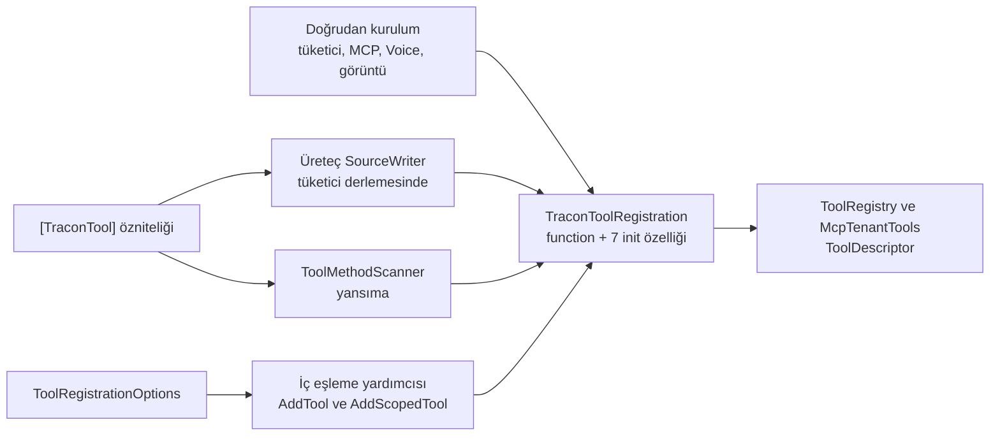

# Faz 189 — Tüketici Yüzeyi: TraconToolRegistration ve ITraconBuilder

> **Durum:** ✅ Tamamlandı (2026-09-24)
> **Plan onayı:** Bakımcı, 2026-09-23 (engelleyici kararlar sohbette alındı)
> **Kaynak:** [ADAYLAR.md](../../ADAYLAR.md) · **F-271** — B yarısı. A yarısı (DI kurucuları + ratchet) [Faz 188](188-DI-KURUCU-DARALTMA.md)'dir
> **Önkoşul:** [Faz 188](188-DI-KURUCU-DARALTMA.md) — **zorunlu**: kurucu ratchet'ini kurar; bu faz onun `TraconToolRegistration` satırını siler · [Faz 187](187-KIRICI-DEGISIKLIK-KAPISI.md) — `kapi.py yayin` kırıcı değişiklik kapısı; kırılmalar o kapıdan sürüm notuyla geçer · [Faz 186](186-SCRIPT-IZNI-ICERIK-PINI.md) — numara sırası; `ITraconBuilder.AddSkill` XML'ine (Açık Soru 1'ine göre gövdesine) dokunur (`186-…md:445`) · [Faz 185](185-KARDES-PAKET-SURUM-SABITLEME.md) — kardeş sabitlemesi; karışık graf riskini daraltır
> **Paketler:** `Tracon.Abstractions`, `.Core` (üreteç `Tracon.Generators` dahil — `analyzers/dotnet/cs`), `.Mcp`, `.Voice`, `.Testing` (README + XML)
> **Yeni paket:** Yok · **Migration:** Yok
> **Public API:** **Daralıyor ve büyüyor (bilinçli kırıcı, pre-1.0).** `TraconToolRegistration` kurucusu 8 → 1 parametre, 7 özellik `init` kazanır. `ITraconBuilder` 28 → 1 üye (`Services`); 27 metot yeni public statik uzantı sınıfına taşınır (Core +1 tip). Ölçüldü: `wc -l src/*/PublicAPI.Shipped.txt` → 17 dosya, her biri 1 satır (`#nullable enable`) — K-603
> **Tüketici yüzeyi:** site: `concepts/tools.md:212`, `guides/write-your-own-tool.md` (gözden geçirme), `reference/changelog.md` ve `api/` (üretilir)
> · sevk edilen: XML `<example>` (`TraconToolRegistration` için yeni; 15 metot `<example>`'ı uzantı sınıfına taşınır), `src/Tracon.Testing/README.md:126`, `TraconTestHost.cs:25` XML, `CHANGELOG.md` `[Unreleased]`, iki CustomTool sample dosyası; `capabilities.md` satırı **değişmez** (189.5)
> **Manuel test alanı:** `docs/manuel-test/02-CEKIRDEK-VE-KATALOG.md` (tool kaydı) · `docs/manuel-test/01-KURULUM-VE-PAKETLEME.md` (paketlenmiş tüketici, ikili kırılma, karışık graf)

---

> ### ⚗️ Damıtılmış kayıt
> Bu dosya fazın **planını** değil, fazın bıraktığı **kalıcı bilgiyi**
> taşır. Plan gövdesi, planlanan/gerçekleşen API, dosya listesi, risk ve
> açık soru bölümleri kapanışta düştü — **silinmedi, git geçmişindedir.**
>
> Tam metin — kopyala, çalıştır:
>
> ```bash
> git show a2503bec:docs/arsiv/fazlar/189-TUKETICI-YUZEYI-VE-BUILDER.md
> ```
>
> Damıtıldı 2026-09-24 · `scripts/dokuman-bakim.py faz-damit`

---

## Amaç

Tüketicinin **kurduğu** ve **çağırdığı** iki public yüzey GA donmasından önce ikili uyumlu büyüyebilir hâle gelir. Yeni tool seçeneği `init` özelliğidir. `ITraconBuilder`'a bir daha üye eklenmez; her kayıt yeteneği uzantıdır.

## Tasarım

### Kullanıcı kararları (kullanıcı kararı, 2026-09-23)

1. **`TraconToolRegistration`** tek zorunlu kurucu parametresi (`function`) +
   `init` özellikleri kullanır. Üreteç, `TraconBuilder.cs` ve
   `ToolMethodScanner.cs` kopyaları, çağrı yerleri ve dokümanlar izler.
2. **`ITraconBuilder`** yalnız `Services`'i tutar. 27 metot statik uzantı
   sınıfına taşınır; `[RequiresUnreferencedCode]`,
   `[DynamicallyAccessedMembers]` ve XML korunur. Çağıran için kaynak
   uyumlu; preview ikilisi kırılır (pre-1.0'da kabul, `versioning.md:15-17`).
   `CapabilityEntryPoints` kapısı `Configure`/`Require*` için düzeltilir.
3. **Kaldırılan imzalar doğrudan kalkar** — `[Obsolete]` yok. Sürüm notu
   geçiş örnekleri taşır.
4. **Faz 188'in ratchet'i sonucu korur.**

**Karar 4'ün kapsamı (ölçüldü).** Ratchet yalnız kurucuları izler (188 karar
4). Kurucu yarısı: `TraconToolRegistration` satırı bayat olur, silinir; bir
daha opsiyonel parametre eklenirse kapı kırmızıdır. Arayüz yarısını ratchet
görmez; tip tabanı tip sayar, Unshipped yalnız büyür. Bu yüzden kalıcı bir
mimari test eklenir: `ITraconBuilder` üyeleri tam olarak {`Services`}'tir
(189.4). Ratchet metotlara **genişletilmez** — 188'in kararıyla çelişir.

### Kaynak yollar



## Bitiş Ölçütleri (DoD)

- [x] `grep -c "^Tracon.ITraconBuilder\." src/Tracon.Core/PublicAPI.Unshipped.txt` → `1` (ölçüldü)
- [x] `grep -c "(this Tracon.ITraconBuilder" src/Tracon.Core/PublicAPI.Unshipped.txt` → faz başı değer + 27 (ölçüldü: 20 → 47)
- [x] Abstractions Unshipped: tek kurucu `TraconToolRegistration(Microsoft.Extensions.AI.AIFunctionDeclaration! function) -> void`; `grep -c "Tracon.TraconToolRegistration\..*\.init -> void"` → `7`; `grep -c "bool requiresApproval = false"` → `0`
- [x] `git grep -nE "(requiresApproval|safeToRepeat|maxOutputBytes|requiredPermission):" -- src samples docs-site/src/content/docs ':!docs-site/src/content/docs/api' ':!src/Tracon.UI'` → boş (2026-09-23'te 19 satır)
- [x] 189.2 eşleme testleri 1-4 yeşil, yansıma güdümlü; hariç liste testte yazılı
- [x] `McpToolRegistrationTests` yeşil; `McpConnection.cs`'te kurulum tek yerde (fabrika)
- [x] Descriptor anlık görüntüsü, `builder` `null`, `CapabilityEntryPoints` dört ad ve `TraconBuilderInterfaceTests` yeşil; `capability-coverage-baseline.txt`, `capability-example-baseline.txt` boş
- [x] `python3 -m unittest discover -s scripts -p "*_test.py"` yeşil (`kapi.py:1088`); iki betik testinde üç ad iddiası var
- [x] `grep -c "TraconToolRegistration" tests/Tracon.Core.UnitTests/Architecture/optional-parameter-constructor-baseline.txt` → `0`; tabanda başka değişiklik yok
- [x] `EmbeddedSampleTests` yeni iddiası ve hata modu 5 testi yeşil
- [x] `public-surface-baseline.txt`: Core +1 bilinçli; `python3 scripts/public-yuzey-envanteri.py --denetle` → çıkış 0, kanıtsız 0
- [x] `python3 scripts/kapi.py yayin --kuru` yeşil; 187 kapısı iki tip adını `[Unreleased]`'de bulur
- [x] `CHANGELOG.md` `[Unreleased]` 189.5'in iki girdisini ve dört maddesini taşır; önceki preview'lar ölçülen etiketlerle adlandırılır
- [x] Yeni K-* kategori etiketiyle açıldı; K-620 ve K-509'a not düştü; tuzak `hafiza/analyzer-yazimi.md` ve `genisleme-noktalari-ve-denetim.md`'de
- [x] Dört doğrulama kapısı sıfır uyarı verir — `python3 scripts/kapi.py kapanis --taban <faz öncesi commit>`
- [x] `samples/Tracon.Api` ile gerçek `run` yapıldı, çıktı belgeye ("Örnek Uygulama Koşumu") yazıldı — komut ve beklenen çıktı aşağıda
- [x] `secret` taraması boş döndü (`python3 scripts/kapi.py tarama`)
- [x] Manuel kabul case'leri `docs/manuel-test/02-CEKIRDEK-VE-KATALOG.md` ve `docs/manuel-test/01-KURULUM-VE-PAKETLEME.md` içine eklendi; otomatikleştirilebilenler (1, 3, 5) koşuldu
- [x] `faz-denetim` koşuldu; 🔴 bulgu kalmadı
- [x] `docs-site/` güncellendi (`tools.md`, `write-your-own-tool.md`, `api/` ve `changelog.md` yeniden üretildi); `npm run build` + `check-links.mjs` temiz

### Doğrulama komutları

```bash
# Örnek uygulama: Faz 182 deseni; tuzaklar docs/hafiza/elle-kosum-ortami.md
export APB="Authorization: Bearer <Tracon:Ui:AuthToken değeri>"
curl -s http://localhost:5080/tracon/api/tools -H "$APB" \
  | python3 -c "import sys,json; [print(t['name'], t['requiresApproval'], t['effect'], t.get('requiredPermission'), t.get('timeout')) for t in json.load(sys.stdin) if t['name'] in ('cancel_order','get_slow_report')]"
# Beklenen:
#   cancel_order True Destructive orders.cancel None
#   get_slow_report False Read None 00:00:01

curl -s -X POST http://localhost:5080/tracon/api/agents/support/run -H "$APB" \
  -H "content-type: application/json" \
  -d '{"message":"ORD-1001 siparisim nerede?","sessionId":"faz-189"}' | tail -c 400
# Beklenen: SSE `done` ile biter; /runs/{id} → Completed. OpenAI anahtarı
# varsa /runs/{id}/tools → get_order_status bir kez; yoksa "ölçülmedi".

python3 scripts/kapi.py yayin --kuru
python3 scripts/kapi.py kapanis --taban <faz öncesi commit>
```

---

## Örnek Uygulama Koşumu

2026-09-24, `samples/Tracon.Api` Development, `--urls http://127.0.0.1:5199`
(`docs/hafiza/elle-kosum-ortami.md` tarifi), PostgreSQL, gerçek OpenAI anahtarı.
Token user-secrets'tan okunup yalnız `Authorization` başlığına verildi.

| Çağrı | Sonuç | Kanıtladığı |
|---|---|---|
| `GET /tracon/api/tools` | `cancel_order True Destructive orders.cancel None None` · `get_order_status False Read None None None` · `get_slow_report False Read None 00:00:01 None` | Üreteç yolu (`AddGeneratedTools()`) yeni başlatıcı çıktısıyla her ayarı taşır; `source` `null` |
| `POST /tracon/api/agents/support/run` `{"message":"ORD-1001 siparisim nerede?","sessionId":"faz-189"}` | SSE `done` ile biter; run `01a0d2e5-…` | Uzantı zinciriyle kurulan host gerçek run koşar |
| `GET /tracon/api/runs/01a0d2e5-…` · `…/tools` | `status: Completed` · tools `['get_order_status']` | Tool çağrısı bir kez, kayıt tamam |

Uygulama günlüğünde `fail`/`unhandled` satırı yok.

## Plandan Sapmalar

| # | Plan | Gerçekleşen | Gerekçe |
|---|---|---|---|
| 1 | 189.1 `<example>`: `services.AddSingleton(new TraconToolRegistration(refundTool) {…})` | `builder.Services.AddSingleton(…)` | `ExampleCompilationTests` bloğu `ExamplePrelude` ile derler; prelude `services` tanımlamaz, `builder` (`IHostApplicationBuilder`) tanımlar. İlk hâl `CS0103` ile kırmızıydı |
| 2 | Test 4 (üreteç): metin iddiası + `OutputCompilation` sıfır hata | Ayrıca çıktı `Emit` edilir, collectible `AssemblyLoadContext`'e yüklenir, `TraconGeneratedTools.Create()` çağrılır ve kaydın **değerleri** özniteliğe karşı iddia edilir (`GeneratedRegistrationParityTests`) | Ad iddiası yanlış değer yazan üreteci kaçırır; değer okumak bunu kapatır |
| 3 | Descriptor anlık görüntüsü: 27 metot birer kez | Her metot **iki kez** çağrılır | İkinci çağrı `Add` (iki satır) ile `TryAdd*` (tek satır) farkını da kilitler — hata modu 13'ün asıl riski buydu. Case sayısı `TraconBuilderExtensions` metot sayısına yansımayla eşlenir |
| 4 | Açık Soru 3 = A: "iki betik ortak bir `kayit_giris_noktasi(satir)` yüklemi çıkarır" | Yüklem ayrı modüldedir: `scripts/kayit_giris_noktasi.py` (`kayit_giris_noktasi(satir)` + `kayit_uzantisi_mi(ad, alici)`), kendi fixture testiyle (`kayit_giris_noktasi_test.py`) | Betik adları tireli, birbirini import edemez; modül iki betiğin de import ettiği tek kaynaktır |
| 5 | — | `src/Tracon.Testing/README.md` "CORRECT" örneği yeniden yazıldı; `docs/manuel-test/24-…md:1346` alıntısı izledi | **Yolda bulunan kusur:** örnek `new TraconToolRegistration(new OrderTools(...), ...)` diyordu; `OrderTools` bir `AIFunctionDeclaration` değildir, kod hiçbir sürümde derlenmezdi. Yeni biçim `AIFunctionFactory.Create(tools.GetOrderStatus, "get_order_status")` |
| 6 | 189.5 madde: "Aynı imzalı kendi uzantısı CS0121 alır" · "implementasyon derlenir" | Denetimin 🟡 1'i ölçüldü ve iki madde düzeltildi | Scratch derlemesi (2026-09-24): `namespace MyApp` içindeki aynı imzalı tüketici uzantısı **sessizce kazandı** ("consumer extension ran"); açık implementasyon (`ITraconBuilder ITraconBuilder.AddTool`) `CS0539` verdi. `CS0121` yalnız aynı düzeyde içe aktarılan iki uzantıda çıkar (dil kuralı; ölçüm `CS0012` referans eksiğinde kaldı) |
| 7 | `<exception cref="ArgumentNullException">` her metotta | Yalnız `builder`'ı anar; `AddToolsFrom(Type)` mevcut maddesi "`builder` or `type`" oldu | Diğer argümanların `null` kontrolü önceden de belgelenmemişti; bu faz davranışı değil zinciri değiştirir |
| 8 | RUC/RDC mesajları "arayüzdeki mesajlarla" | Aynen arayüzün mesajları; `TraconBuilder`'ın farklı sözcüklü mesajları düştü | Plan gereği; tüketici IL2026/IL3050 metninde arayüz metnini görüyordu |
| 9 | — | `tests/Tracon.Ui.E2ETests/Ui/ExperimentTests.cs` seçimden önce alanın `<select>` olmasını bekler | **Yolda bulunan kırılgan test** (bu fazın kodundan bağımsız): ilk kapanış koşumunda "Element is not a <select> element" ile düştü, izole geçti. Sebep yarış: `variant-version-0` sürüm sorgusu dönene kadar sayı alanıdır. Hafıza: `frontend-test-altyapisi.md` |
| 10 | — | `scripts/breaking_changes.py` çitli kod bloklarını span okumadan önce siler; iki test (`test_citli_kod_blogu_span_eslesmesini_kaydirmaz`, `test_yalniz_citli_blokta_gecen_ad_kabul_edilmez`) | **Yolda bulunan kapı kusuru (Faz 187):** ilk yayın provası `TraconToolRegistration` ve `ITraconBuilder`'ı "notta yok" dedi; ikisi de code span'deydi. Her çitin üç backtick'i çevredeki metinle eşleşip span sınırlarını kaydırıyordu; Faz 188'in tek bloğu şans eseri geçti. Regresyon testi eski kodda `B, C`'yi kaçırıyor (ölçüldü). Hafıza: `yayin-ve-surumleme.md` |
| 11 | — | ADAYLAR **F-268** kapandı (Sapma 9); yeni **F-289** | `MT-PKG-150` koşumu ölçtü: `[TraconTool]` kütüphanesini referanslayan host `AddGeneratedTools()` çağıramaz (`CS0121` + `TRC0005`) — iki derlemenin üretilmiş uzantısı çakışır. Bu fazın değişikliği değil (K-350 tasarımı); case kütüphanenin kendi sarmalayıcısıyla koşuldu |

## Bu Fazda Verilen Kararlar

**K-867** *(kategori: public-api)* — `ITraconBuilder` yalnız `Services` taşır;
kayıt yetenekleri `TraconBuilderExtensions` uzantısıdır, arayüze üye eklenmez.
`TraconToolRegistration` tek zorunlu parametre + yedi `init` ayarı kullanır.
Kaldırılan imzalar `[Obsolete]`'suz kalktı (kullanıcı kararı).

**Mevcut satırlara not:** K-620 (kısmen geçersiz — `AddRunJudge` uzantıya
taşındı) · K-509 (genişletildi — builder alıcısında önek aranmaz; kural üç
kopyada aynı).

**Açık sorular:** AS 1 = A (tek `TraconBuilderExtensions`, alan başına beş
`partial` dosya: kök · `Tools` · `Agents` · `Evaluation` · `Models`) · AS 2 = A
(arayüz XML'i: implementasyon yalnız `Services` sağlar) · AS 3 = A (ortak
yüklem; Sapma 4).

**K almayan yerel kararlar:**

- Üreteç altı ayarı her kayıtta yazar (belirlenimci çıktı); `Source` yazmaz.
- Eşleme yardımcısı Core `internal static ToolRegistrationMapping.FromOptions`;
  yalnız public tip kullanır, yeni IVT bağı yok.
- MCP fabrikası `McpConnection.CreateRegistration(function, serverName,
  requiresApproval)` — `internal static`; eski kurucuyla çıkarıldı ve
  `McpToolRegistrationTests` başlatıcıya geçişten **önce** yeşil koştu.
- K-509 alıcı tabanlıdır: alıcı `Tracon.ITraconBuilder` ise ad serbest; diğer
  alıcılarda `Add`/`Use`/`Map` öneki. C# deseni `~?static` kabul eder
  (Python kopyasıyla eş; denetim 🟢 1).

## Süreç Ölçümü

> Kapanışta doldurulur. **Tablo olarak** — onay kutusu DEĞİL: arşivdeki her
> onay kutusu satırı `tamamlanmis_faz_isaretsiz_kutular()` kapısında ayrıca hata
> sayılır ve bulgunun kaynağı bulanıklaşır.

| Metrik | Değer |
|---|---|
| Plan revizyonu sayısı | 0 (sapmalar uygulama sırasında yazıldı, plan yeniden açılmadı) |
| Düzeltme turu sayısı | 5 — `ExampleCompilationTests` (`services` → `builder.Services`, Sapma 1); denetimin üç 🟡'ı tek turda; ilk kapanış koşumu kırılgan E2E testinde durdu (Sapma 9); ikincisi arşivlenmemiş kök faz dokümanında durdu; ilk yayın provası kapı kusurunda durdu (Sapma 10) |
| 🔴 bulgu: gerçek / gürültü / araştırılacak | 0 / 0 / 0 |
| Fazın ürettiği regresyon | 0 — commit'ten önce kırmızı olan yalnız fazın kendi yeni örneğiydi (Sapma 1) |
| Faz kapandıktan sonra bulunan kusur | ölçülmedi (kapanış anı) |

## Denetim Bulguları

`faz-denetcisi`, 2026-09-24, kapsam `305c2084` + çalışma ağacı. **🔴 yok.**
Denetçi 27 gövdeyi `git show 305c2084:src/Tracon.Core/TraconBuilder.cs` ile satır
satır karşılaştırdı: tek fark `ThrowIfNull(builder)` ve `builder.Services`;
`TryAddEnumerable` yalnız dört generic metotta, RUC/RDC/DAM/MAAI001 yerinde.
Temiz başlıklar: 3.2, 3.3, 3.5, 3.6, 3.7.

| # | Bulgu | Seviye | Triyaj | Sonuç |
|---|---|---|---|---|
| 1 | `CHANGELOG.md` iki derleme iddiası fazla genel: yakın ad alanındaki aynı imzalı uzantı `CS0121` değil **sessizce kazanır**; açık implementasyon derlenmez (`CS0539`) | 🟡 | — | **Düzeltildi**: scratch derlemesiyle ölçüldü (Sapma 6), iki madde yeniden yazıldı |
| 2 | Hata modu 11'in testi yok: kurucunun `null` ve geçersiz ad sözü kilitsiz | 🟡 | — | **Düzeltildi**: `ToolRegistrationParityTests.The_constructor_rejects_a_missing_tool` · `…_an_invalid_tool_name_before_any_setting_is_applied` |
| 3 | `docs/manuel-test/24-…md:1346` Testing README'nin eski desenini alıntılıyor | 🟡 | — | **Düzeltildi** (Sapma 5) |
| 4 | C# deseni `^static`, Python `~?` kabul ediyor | 🟢 | — | **Düzeltildi**: C# `^~?static` (bugün `~` önekli uzantı satırı 0) |
| 5 | `Every_registration_method_has_a_case` yalnız sayı karşılaştırır | 🟢 | — | **Gerekçelendi**: silinen metodun case'i `Invoke` switch'inde derleme hatası verir; ekleme sayıyı bozar. Aday açılmadı |

## Sonraki Faza Devir Notu

**Sıradaki faz: [190](../../190-KIMLIK-BASLIKLARI-ANAHTAR-REFERANSI.md)** — teknik
bağımlılık yok (190 önkoşulu "yalnız sıra").

**Devralınan sözleşmeler:**

- **K-867.** `ITraconBuilder`'a üye eklenmez (`TraconBuilderInterfaceTests`).
  Yeni Core kayıt metodu `TraconBuilderExtensions`'ın ilgili `partial`
  dosyasına girer, `ThrowIfNull(builder)` ile başlar ve
  `TraconBuilderRegistrationSnapshotTests.Cases`'e bir satır ister (sayı
  yansımayla eşlenir). Paket uzantıları kendi sınıflarında kalır.
- Yeni tool ayarı `TraconToolRegistration`'a `init`, `ToolRegistrationOptions`'a
  `set` olarak girer; `ToolRegistrationMapping`, `ToolMethodScanner`,
  `SourceWriter` ve (öznitelikten geliyorsa) `TraconToolAttribute` izler. İki
  parity testi eksik olanı kırmızı gösterir; hariç liste testte yazılıdır.
- K-509 alıcı tabanlı; kural `CapabilityEntryPoints.cs` + `scripts/kayit_giris_noktasi.py`.
- Opsiyonel parametreli public kurucu tabanı artık 3 satır (`AgentRunBudget`,
  `TraconAgentSourceException`, `Testing.FakeModelProvider`).

**🚨 Tuzaklar:**

- Üretecin yazdığı kayıt **tüketicinin** ikilisidir; imza değişikliği üretilmiş
  kodu kırar ve yalnız `kapi.py yayin --kuru` (paketlenmiş sample) kanıtlar.
- `ExampleCompilationTests` prelude'u `services` tanımlamaz — sevk edilen
  `<example>` `builder.Services` yazar.
- Tüketicinin aynı imzalı uzantısı yakın ad alanındaysa Tracon'un metodunu
  sessizce gölgeler (ölçüldü); uzantıya taşıma bu riski açar, sürüm notu yazar.

**Açık iş:** `MT-CORE-131` örnek uygulamada geçici kod değişikliği ister
(koşulmadı, `⏳`; otomatik karşılığı `CatalogEndpointTests` yeşil). F-289
(üretilmiş uzantı çakışması) kusur kanalında. Site yayını (`faz-tamamlama`
Adım 10) bakımcı eylemidir.

## Kapanış Kapısı

`DOTNET_ROOT=~/.dotnet python3 scripts/kapi.py kapanis --taban 305c2084`, commit'li ağaç
`2a8a02fa`, 2026-09-24 → **EXIT 0**:

| Adım | Süre | Sonuç |
|---|---|---|
| `kapi.py tarama` | 5,4 sn | ✅ temiz |
| `dokuman-bakim.py --denetle` · Python testleri · ajan haritası · denetim paketi | ~9 sn | ✅ |
| `dotnet build Tracon.slnx -c Release` | 70,2 sn | ✅ 0 uyarı |
| `dotnet test … -maxcpucount:2 -- --report-trx` | 474,5 sn | ✅ 17.846 test (38 koşum), 0 kırmızı |
| `dotnet pack` | 6,9 sn | ✅ |
| `dotnet format --verify-no-changes` | 113,2 sn | ✅ |
| `docs-site npm run check` | 29,4 sn | ✅ |

İlk iki deneme kırmızıydı: (1) kırılgan `ExperimentTests` (Sapma 9); (2) faz
dokümanı arşivlenmeden koşuldu (`kapanmış faz docs/arsiv/fazlar/ altında
olmalı`). Performans kapısı tetiklenmedi (sıcak yol değişmedi). Kapı
düzeltmesi (`b0ee95f2`, yalnız Python) sonrası `python3 -m unittest discover -s scripts`
yeniden yeşil.

**Yayın provası** (`kapi.py yayin --kuru`, temiz ağaç `b0ee95f2`) → **EXIT 0**:
`Kırıcı liste: 121 tip, 0 TFM düşüşü, 10 paket — hepsi 'Unreleased' notunda` ·
20 paket `1.0.0-preview.2.70` · `npm publish --dry-run` ✅ ·
`provider/source/generated-tool AOT host smoke passed` ·
`net8.0 consumer smoke passed on .NET 8.0.31` · `6 exact-version packed sample`.
İlk deneme kapı kusurunda durdu (Sapma 10). Paketlenmiş sürüme karşı elle
koşulan case'ler: `MT-PKG-149`, `150`, `152` ✅ (gerçek çıktı case'lerde).
