# Faz 191 — Tek Derleme Zinciri

> **Durum:** ✅ Tamamlandı (2026-09-24)
> **Plan onayı:** Bakımcı, 2026-09-23 (engelleyici kararlar sohbette alındı)
> **Kaynak:** [ADAYLAR.md](../../ADAYLAR.md) · **F-273** — triaj N12'nin (b) parçası = `YAYIN-HAZIRLIK` açık kalemi **A-15** ("kapı kendi bastığı byte'ları doğrulamıyor"); bu faz A-15'i tamamen kapatır. (a) parçası = **A-8** iş süre sınırları, 2026-09-23 `kusur-giderme` turu.
> **Önkoşul:** [Faz 187](187-KIRICI-DEGISIKLIK-KAPISI.md) — iki faz da `kapi.py yayin`'i değiştirir; 187'nin pack anı adımları `paketle`'ye taşınır (191.8) · 2026-09-23 `kusur-giderme` turu: her `ci.yml` işinde `timeout-minutes` ve `zaman_siniri_olmayan_isler` kapısı; sınırlar ve kapı yeşil kalmalı · Faz 185 → 190 bu fazdan önce kapanır
> **Paketler:** Yok — sevk edilen içerik değişmez. Dokunulan: `ci.yml`, `kapi.py`, `dokuman-bakim.py`, iki script testi, `Directory.Build.targets` (yalnız K-661 yorumu), `WorkflowWorkspacePathsTests.cs` (Açık Soru 2)
> **Yeni paket:** Yok · **Migration:** Yok
> **Public API:** Büyümüyor, daralmıyor — `src/` altında imza değişmez. Ölçüm (2026-09-23): `wc -l src/*/PublicAPI.Shipped.txt` → 17 dosya, toplam 17 satır; her dosya yalnız `#nullable enable` taşır (Shipped boş, K-603)
> **Tüketici yüzeyi:** site: Yok — `git grep -in "reproducib\|provenance\|built by CI" -- docs-site/src/content/docs` 18 satır bulur; hepsi sürüm sabitleme veya `run`/skor provenance'ıdır, CI zincirini anlatmaz
> · sevk edilen: Yok — `.nupkg` içeriği, XML `<example>`, `src/*/README.md` ve `capabilities.md` satırı değişmez; `CHANGELOG.md` satırı Açık Soru 3
> **Manuel test alanı:** [`docs/manuel-test/01-KURULUM-VE-PAKETLEME.md`](../../manuel-test/01-KURULUM-VE-PAKETLEME.md) — yeni case'ler oraya; `MT-PKG-100` güncellenir

---

## Bu Faza Başlarken

> `faz-baslangic` skill'ini uygula. Aşağıdaki liste o skill'in 2. adımıdır —
> **tamamını değil, yalnız işaret edilen bölümleri oku.**

1. Bu doküman
2. Kararlar — dosyanın tamamını **okuma**, yalnız bu kalemleri grep'le:
   ```bash
   grep -n "K-604 \|K-661 \|K-603 " docs/KARARLAR.md
   grep -n "^### K-604\|^### K-661" docs/arsiv/KARARLAR-GECMISI.md   # tam gerekçe: sed -n 'N,+4p'
   ```
   **K-604** (yayın işleri `release-dryrun` kapısına bağlıdır; kapı her push'ta, PR dahil, koşar),
   **K-661** (bir `<id, version>` çifti tek bir artifact'ı adlandırır; kirli ağaçta pack reddedilir;
   `TraconSkipCleanWorkingTreeCheck` yeni bir çağırana eklenmez — "Yeniden açılmaz"),
   **K-603** (`PublicAPI.Shipped.txt` preview hattı boyunca boştur)
3. [Faz 187](187-KIRICI-DEGISIKLIK-KAPISI.md) — yalnız devir notu. 187 `yayin`'e pack
   öncesi adımlar, üç `-p:` özelliği ve pack anı raporları ekler; açtığı K-* de oradadır:
   ```bash
   f=$(find docs -name '187-*.md' | head -1)   # zsh'te eşleşmeyen glob komutu düşürür
   awk '/## Sonraki Faza Devir Notu/,0' "$f"
   ```
4. Alan hafızası, yalnız şu bölümler:
   [`hafiza/yayin-ve-surumleme.md`](../../hafiza/yayin-ve-surumleme.md) "MinVer surumu calisma
   agacinin durumunu GORMEZ (Faz 136)" (`TRACON0004`, CI iş alanı yolları, `.psmdcp`,
   staging/promote, eski sürümlerden temizlenmeyen `release_dir`) ·
   [`hafiza/test-kosum-tuzaklari.md`](../../hafiza/test-kosum-tuzaklari.md) "Alt surec ve MSBuild"
   (`MSBUILDDISABLENODEREUSE=1`) ·
   [`hafiza/test-kosum-olcumleri.md`](../../hafiza/test-kosum-olcumleri.md) "CI iş süreleri ve
   `timeout-minutes` — 2026-09-23" (sınır tabanı ve ölçüm yöntemi; 191.4)

🚨 Her `dosya:satır` HEAD `bb9953e3`'te ölçüldü. Aynı turun `kusur-giderme` değişikliği
(`ci.yml` +43, `dokuman-bakim.py` +128, `YAYIN-HAZIRLIK.md` +5 satır) ve Faz 187
numaraları kaydırır. Numarayı değil çapayı ara:

```bash
grep -n "^  [a-z-]*:$\|- name:" .github/workflows/ci.yml
grep -n "^def \(release_rehearsal\|_finish_release_rehearsal\|_promote_staged_packages\|_write_manifest\|_content_fingerprint\)" scripts/kapi.py
grep -n "^def \(geri_alinamaz_registry_islemi\|tekrarlanan_kapi_tanimlari\|zaman_siniri_olmayan_isler\|_yaml_girinti\)" scripts/dokuman-bakim.py
grep -n "A-15\|^| OP-010\|Deterministic/reproducible" docs/YAYIN-HAZIRLIK.md
git grep -n "CI .pack. job" -- Directory.Build.targets scripts
```

---

## Amaç

Bugün bir `v*` etiketi üç ayrı derleme üretir: build işi birini test eder,
`release-dryrun` kendi paketini üretip doğrular ve atar, `pack` işi taze bir runner'da
yeniden derler. `publish` bu son dosyayı denetimsiz nuget.org'a iter. Üç derleme hiç
karşılaştırılmaz ve NuGet'te geri dönüş yoktur. Bu faz zinciri tek derlemeye indirir:
test edilen derleme paketlenir, prova o dosyaları doğrular, `publish` tam o baytları
iter. Tüketici test edilen derlemeyi alır; bakımcı etiket günü ilk kez koşan bir
doğrulamayla karşılaşmaz.

- **F-273** — `pack` işi kalkar; build işi paketler; `kapi.py yayin --paket-dizini`
  paketi üretmeden doğrular; SHA-256 manifest her push'ta doğrulanır.

### Bugün ne çalışmıyor — doğrulanmış kanıt

| Kanıt | Gözlem |
|---|---|
| [`ci.yml:280-319`](../../../.github/workflows/ci.yml) (`pack`) | Taze runner'da restore + `dotnet build Tracon.slnx` + `dotnet pack Tracon.slnx --no-build` (`:308-310`); `nuget-packages` yükler (`:312-319`). Build işinin test ettiği derleme **değildir** |
| [`ci.yml:321-333`](../../../.github/workflows/ci.yml) · `:375` | `release-dryrun` bilerek `pack`'ten bağımsızdır ("PARALEL kosar"); `kapi.py yayin --kuru` kendi paketini üretir |
| [`kapi.py:1380`](../../../scripts/kapi.py) (`release_rehearsal`) | Provanın kendi `dotnet pack Tracon.src.slnf -c Release -o <staging>` çağrısı; doğrulanan dosyalar bunun ürünüdür |
| [`ci.yml:389`](../../../.github/workflows/ci.yml) | `publish: needs: [pack, release-dryrun, npm-publish]` — prova yalnız **sırada** öndedir |
| [`ci.yml:398-402`](../../../.github/workflows/ci.yml) · `:431-436` | `publish` `pack`'in artifact'ını `packages/`'a indirir; denetimsiz `dotnet nuget push "packages/*.nupkg"` |
| [`kapi.py:1298-1304`](../../../scripts/kapi.py) (`_write_manifest`) | `package-manifest.json` yazılır; `git grep -n "package-manifest" -- ':!docs'` yalnız bu satırı bulur — okuyan kod yok |
| [`kapi.py:1238-1268`](../../../scripts/kapi.py) (`_content_fingerprint`) | `.psmdcp` adı rastgeledir; aynı commit iki kez paketlenince ham SHA-256 değişir. Ayrı bir pack'in dosyası manifest'le **hiç** kanıtlanamaz |
| `git show 8634a1e3:docs/YAYIN-HAZIRLIK.md` satır 1459 · [`YAYIN-HAZIRLIK.md:608`](../../YAYIN-HAZIRLIK.md) | **A-15** "Kapı kendi bastığı byte'ları doğrulamıyor"; "Faz adayı, ⚪ GA"; §13'te açık |

> Kanıtlar 2026-09-23 tarihinde HEAD `bb9953e3` üzerinde doğrulandı.

### Build işinde src çıktısını yeniden derleyen pack çağıranları

"Paket testten **önce**" sırasının gerekçesi. "Yeniden damgalar" koddan çıkarımdır;
191.0-3 ölçer.

| Çağıran | Komut | Sonuç |
|---|---|---|
| [`ReleaseArtifactFixture.cs:31-35`](../../../tests/Tracon.Package.Tests/Infrastructure/ReleaseArtifactFixture.cs) | `pack Tracon.src.slnf`, `--no-build` yok, `MinVerVersionOverride=1.0.0-preview.1` | src'yi başka sürümle yeniden derler; çıktı `artifacts/package/release` |
| [`TemplateFixture.cs:32-35`](../../../tests/Tracon.Package.Tests/Infrastructure/TemplateFixture.cs) | `pack Tracon.src.slnf`, `--no-build` yok | çıktı `artifacts/package/release` |
| [`PackCleanlinessGateTests.cs`](../../../tests/Tracon.Package.Tests/PackCleanlinessGateTests.cs) `:30` `:70` `:100` `:115` `:133` | `pack src/Tracon.Abstractions`, `--no-build` yok; `:115` `:133` `0.0.0-dirty.gate-test` | `Tracon.Abstractions`'ı yeniden damgalar; `DirtMarker` ağacı test sırasında **kirletir** |
| [`capacity.py:308`](../../../scripts/capacity.py) ("Kapasite smoke") | `pack Tracon.src.slnf -o <feed>`, `0.0.0-ci.N` | src'yi yeniden damgalar |

Test exe'leri src DLL'lerinin kendi kopyalarını yükler; testler etkilenmez. Ama testten
sonra koşan `pack --no-build` yanlış damgalı DLL'i paketler.

---

## 191.0 — Başlamadan ölç

İlk kod satırından önce dört ölçüm. Sonuçlar kapanışta "Plandan Sapmalar"a girer.

1. **Önkoşullar birleşti mi?**
   ```bash
   git log --oneline -1                                  # faz öncesi commit (kapanış --taban)
   grep -c "timeout-minutes" .github/workflows/ci.yml     # > 0 olmalı
   grep -n "^def zaman_siniri_olmayan_isler\|^def _yaml_girinti" scripts/dokuman-bakim.py
   find docs/arsiv/fazlar -name '187-*.md'              # boş = 187 kapanmadı
   ```
   187 devir notu 187.0 adım 6'nın sonucunu taşır: farksız pakette SDK rapor yazıyor
   mu? 191.8'in rapor kaydı kuralı buna bağlıdır. Notta yoksa ilk `paketle`
   çıktısında `api-compat/` okunur.
2. **Build işinin pack öncesi adımları ağacı kirletiyor mu?** Taze klonun kökünde
   (`git clone --no-local <repo> /tmp/tracon-191`), CI ortamıyla
   (`export CI=true NUGET_PACKAGES="$PWD/.nuget/packages" MSBUILDDISABLENODEREUSE=1`),
   build işinin `Derle` dahil her `run:` adımını `working-directory`'siyle sırayla koş.
   Sonra `git status --porcelain` BOŞ olmalı; değilse karar 3 uygulanır. İlk CI koşumu
   ayrıca okunur (DoD).
3. **"Yeniden damgalar" doğru mu?** Aynı klonda:
   ```bash
   shasum -a 256 artifacts/bin/Tracon.Core/release_net10.0/Tracon.Core.dll
   python3 scripts/kapi.py test --proje Tracon.Package.Tests --sinif "*ReleaseArtifact*"
   shasum -a 256 artifacts/bin/Tracon.Core/release_net10.0/Tracon.Core.dll   # farklıysa doğrulandı
   ```
   Sonuç sıra kuralını (191.6) değiştirmez; yalnız gerekçeyi ölçer ve hafızaya girer.
4. **Yeniden koşum sabit adlı artifact'a çarpar mı?** `test-results-${{ matrix.os }}`
   bugün sabit adla `if: always()` yüklenir. Hafızadaki yöntemle (anonim Actions API,
   `repos/StudyZoneInt/Tracon/actions/runs`) `run_attempt > 1` olan koşum aranır; ikinci
   denemede "Test sonuclarini yukle" sonucu okunur. Koşum yoksa "ölçülmedi".

---

## 191.1 — Bakımcı kararları

Sohbette alındı ve bağlayıcıdır; uygulama oturumu yeniden açmaz.

| # | Karar | Kaynak |
|---|---|---|
| 1 | **Tek derleme.** Build işinin ubuntu bacağı testlerden ÖNCE `--no-build` ile paketler ve paketleri artifact olarak yükler. Prova bu artifact'ı yeni `kapi.py yayin --paket-dizini` moduyla, kendi pack'i olmadan doğrular ve doğrulanmış kümeyi SHA-256 manifest'iyle yükler. `publish` tam bu baytları iter. Ayrı `pack` işi silinir | (kullanıcı kararı, 2026-09-23) |
| 2 | **Bayt eşitliği her push'ta.** SHA-256/manifest karşılaştırması provanın içinde, her push'ta (PR dahil) koşar; yalnız `publish`'te değil. Gerekçe A-29/A-33 dersidir: yalnız etikette koşan adımlar yayın günü kırıldı | (kullanıcı kararı, 2026-09-23) |
| 3 | **Temiz ağaç kapısına bypass yok.** Build işinde `TRACON0004` düşerse ağacı kirleten adım düzeltilir ya da çıktısı `.gitignore`'a alınır. `TraconSkipCleanWorkingTreeCheck` eklenmez (K-661 "Yeniden açılmaz") | (kullanıcı kararı, 2026-09-23) |
| 4 | **Yeni bir K-*** K-604 ve K-661'i CI zincirine genişletir (191.10) | (kullanıcı kararı, 2026-09-23) |
| 5 | **npm kanalı aday kalır.** `npm-publish` kendi `npm run build`'ini yayınlar (`ci.yml:482-484`); aynı sınıf **F-276**'dır, bu faz dokunmaz | (kullanıcı kararı, 2026-09-23) |
| 6 | Build işindeki diğer pack çağıranları (tablo yukarıda, `TemplateFixture` ve `PackCleanlinessGateTests` dahil) tasarımda hesaba katılır | (kullanıcı kararı, 2026-09-23) |

---

## 191.2 — Hedef zincir

```mermaid
flowchart LR
    subgraph B["build (ubuntu bacağı)"]
        B1["Derle"] --> B2["kapi.py paketle (--no-build)"] --> B3["testler, kapasite smoke"] --> B4["paket-dogrula"] --> B5["yükle: nuget-packages"]
    end
    subgraph R["release-dryrun (her push)"]
        R1["indir"] --> R2["yayin --kuru --paket-dizini"] --> R3["paket-dogrula"] --> R4["yükle: nuget-verified"]
    end
    subgraph U["publish (yalnız v* etiketi)"]
        U1["indir"] --> U2["paket-dogrula"] --> U3["NuGet/login"] --> U4["dotnet nuget push"]
    end
    B5 --> R1
    R4 --> U1
```



- **Test edilen = paketlenen:** aynı `dotnet build` çıktısı, aynı iş ve SDK; pack önce.
- **Paketlenen = yüklenen:** `paket-dogrula` yüklemeden hemen önce koşar.
- **Doğrulanan = itilen:** prova yeniden üretmez; `publish` SHA-256'yı yeniden sınar.

Windows bacağı paketlemez; platform farkını ölçer.

---

## 191.3 — `kapi.py`: tek pack komutu, üç giriş noktası

Komut adları öneridir ve yerel karardır (191.10).

| Komut | Ne yapar | Kim çağırır |
|---|---|---|
| `kapi.py paketle --cikti <dizin>` | Erken git reddi (`kapi.py:1353` ile aynı). `<dizin>` boş değilse **reddeder, silmez**. 187'nin pack anı adımları (191.8). `dotnet pack Tracon.src.slnf -c Release --no-build -o <dizin>` + 187'nin üç `-p:`'si; `MSBUILDDISABLENODEREUSE=1`. Kimlik kümesi ve tek sürüm hattı. `<dizin>/package-manifest.json`: bugünkü alanlar (`version`, `commit`, `dirty`, `packages[]` `sha256`/`symbolsSha256`) + `baseline` + rapor kayıtları | build (yalnız ubuntu) · yerel |
| `kapi.py yayin --kuru --paket-dizini <dizin>` | `dotnet pack` **koşmaz**. `paket-dogrula <dizin>` → ortak yol (`_finish_release_rehearsal`, 187'nin rapor denetimi dahil) → `release_dir`'e atomik kopya (girdi değişmez) → yeni manifest, girdi manifest'iyle alan alan eşit → `paket-dogrula release_dir` | `release-dryrun` |
| `kapi.py paket-dogrula <dizin>` | Manifest'in andığı her dosya (paket ve rapor) var ve ham SHA-256'sı eşit; manifest dışı `*.nupkg`/`*.snupkg` yok. Değilse çıkış 1, her fark dosya adıyla | build (yüklemeden önce) · `release-dryrun` · `publish` (itmeden önce) |
| `kapi.py yayin --kuru [--surum X]` | Değişmez; kendi paketini üretir. Pack aşaması `paketle` ile **aynı fonksiyondur** (`--no-build` yok, staging dizini) | insan · `faz-tamamlama` · `nuget-danismani` |

Kurallar:

- **Tek pack kurucusu;** `ci.yml`'de ham `dotnet pack` kalmaz (emsal:
  `tekrarlanan_kapi_tanimlari`). Zincir yeniden paketlemez, bu yüzden ham SHA-256 doğru
  ölçüdür; `_content_fingerprint` yalnız promote çakışması için kalır (K-661).
- **Her denetim bir türe girer.** 🚨 185–190'ın (en çok 187'nin) `release_rehearsal()`
  içine, `_finish_release_rehearsal` dışına eklediği denetimi `--paket-dizini` sessizce
  atlar. İlk iş: `sed -n '/^def release_rehearsal/,/^def _finish_release_rehearsal/p' scripts/kapi.py`.
  `obj/`'yi, pack başlangıç zamanını veya geçici taban cache'ini okuyan denetim **pack
  anı**dır: pack aşamasına gider, sonucu manifest'e yazılır. Yalnız paket dizinini,
  git'i veya `CHANGELOG.md`'yi okuyan denetim **ortak yola** gider. Pack anı denetimi
  ortak yola taşınmaz: `release-dryrun`'da `obj/` yoktur. Birim testi iki kuralı kilitler.
- **Kopya atomiktir.** Bugün `_promote_staged_packages` taşır (`kapi.py:1294`
  `shutil.move`). Paket dizini modunda dosya `release_dir`'de `.nupkg`/`.snupkg` ile
  bitmeyen geçici ada kopyalanır, `os.replace` ile asıl adına geçer. `_content_fingerprint`
  (`zipfile`) bozuk dosyada `BadZipFile` izi değil, dosya adıyla çıkış 1 verir.
- **Girdi dışı paket.** Yerel `release_dir` eski sürümlerden temizlenmez (hafıza, Faz
  136; bugün yerelde on sürüm). Son `paket-dogrula` katıdır → Açık Soru 5.
- **Commit eşitliği.** `REPOSITORY_COMMIT_PATTERN` (`kapi.py:36`) bugün yalnız
  `<repository commit="…">`'in **varlığını** arar. Yeni kural değerin ve manifest
  `commit`'inin `git rev-parse HEAD`'e eşitliğini ister (PR'de iki iş aynı merge
  commit'ini checkout eder).
- `--komutlari-bas` yeni komutları listeler (bugün `kapi.py:1746-1748` sabit satır basar).

---

## 191.4 — `ci.yml`: iş iş değişiklik

| İş | Bugün (`bb9953e3`) | Hedef |
|---|---|---|
| `build` (ubuntu) | `Derle` (`:163-164`) → performans kapısı → Playwright → test (`:231-239`) → kapasite smoke (`:257-262`) → `if: always()` yüklemeleri | `Derle` → **`Paketle`** (`kapi.py paketle --cikti artifacts/ci-paket`) → değişmeyen adımlar → **`Paketleri dogrula`** (`kapi.py paket-dogrula artifacts/ci-paket`) → **`Paketleri yukle`** (`nuget-packages`: `*.nupkg`, `*.snupkg`, `package-manifest.json`, `api-compat/*.xml`; `if-no-files-found: error`) → `if: always()` yüklemeleri. Üç yeni adım `if: matrix.os == 'ubuntu-latest'` taşır |
| `build` (windows) | — | Değişmez; paketlemez, yüklemez (ad tektir) |
| `pack` | `:280-319` | **Silinir** |
| `release-dryrun` | Kendi pack'i (`:375`) | `nuget-packages` → `artifacts/ci-paket` → `kapi.py yayin --kuru --paket-dizini artifacts/ci-paket` → `nuget-verified` yükle (`artifacts/package/release/` `*.nupkg`, `*.snupkg`, `package-manifest.json`; `if-no-files-found: error`). İş yorumu (`:321-333`) ve bayat `TRACON0003` yorumu düzeltilir; Node adımı npm dry-run için kalır |
| `publish` | `needs: [pack, release-dryrun, npm-publish]`; `packages/`'a indir; denetimsiz push | `needs: [release-dryrun, npm-publish]`. Checkout + Python → `nuget-verified` → `artifacts/nuget-verified` → `kapi.py paket-dogrula artifacts/nuget-verified` → `NuGet/login` → `dotnet nuget push "artifacts/nuget-verified/*.nupkg" … --skip-duplicate` |
| `npm-publish` · `github-release` · `site` | — | Değişmez |

- 🚨 **`publish`'e checkout eklenince `packages/` çakışır:** repo izlenen
  `packages/tracon-client/`'ı taşır; bugünkü indirme yolu `packages`'tır (`ci.yml:402`).
  İndirme `artifacts/` altına gider.
- Doğrulama login'den önce koşar: repo kodu koşarken API anahtarı yoktur. `.snupkg`
  `.nupkg`'nin yanında kalır; `dotnet nuget push` onu kendisi bulur.
- **Süre sınırları.** `pack`'in sınırı işle gider. `build` (bugün 100 dk),
  `release-dryrun` (15), `publish` (10) yeni adımların **ölçülen** süresiyle, hafızanın
  "CI iş süreleri" kuralıyla (en uzun × ~2, 5 dk'ya yukarı) yeniden hesaplanır. Taban
  (en uzun): `pack` 7,4 · `release-dryrun` 5,7 · `build` ubuntu 37,9 dk.

---

## 191.5 — Bayt eşitliği her push'ta

Karar 2'nin uygulanışı. Her SHA-256 denetimi `paket-dogrula`'dan geçer: build'de
yüklemeden önce, `release-dryrun`'da girdi ve çıktı dizininde — üçü de her push'ta,
PR dahil. `publish` yalnız `v*`'da aynı komutu bir kez daha çağırır. Etiket yolunda
**yeni** mantık yoktur. Açık Soru 1 `publish`'teki çağrının biçimini sorar.

---

## 191.6 — Sıra kuralı ve temiz ağaç (karar 3)

- **`Paketle`, `Derle`'nin hemen ardındadır.** Performans kapısı bench'i `dotnet run`
  ile derler; kapasite smoke ve fikstürler src'yi yeniden derler. Hiçbiri önce koşmaz.
- **Yükleme testlerden sonradır (yerel karar).** Küme `paketle` anında manifest
  SHA-256'larıyla donar; `Paketleri dogrula` kapasite smoke'tan sonra testlerin kümeyi
  değiştirmediğini kanıtlar. Gerekçe: düşen test denemesi yüklemez, "Re-run failed jobs"
  aynı adla ikinci yüklemeye çarpmaz. Seçilmeyen yol: testten önce yükleme +
  `overwrite: true`.
- **Ayrılmış dizin:** `artifacts/ci-paket`; fikstürlerin `artifacts/package/release`
  paketleri yüklemeye sızamaz.
- **Bypass yok:** `paketle` `TraconSkipCleanWorkingTreeCheck`/`TraconAllowDirtyPack`
  geçmez. K-661'in üç iç aracı (`kapanis` pack adımı, `ReleaseArtifactFixture`,
  `TemplateFixture`) değişmez; `paketle` o listeye **girmez**.
- **`TRACON0004` düşerse** ileti kirli girdileri taşır (`Directory.Build.targets:127-129`,
  `TraconDirtyEntries`); kiri üreten adım düzeltilir veya `.gitignore`'a alınır.
- İndirme yolları `artifacts/` altındadır (`.gitignore:26`); erken git denetimi
  (`kapi.py:1353`) onları kir saymaz.
- Paketlenen DLL = test edilen DLL karşılaştırması CI adımı değildir; case 5 bir kez
  ölçer, sırayı yapısal kapı kilitler.

---

## 191.7 — Yapısal kapı: `dokuman-bakim.py`

Etiket yolu CI'da simüle edilemez (`MT-PKG-100` elle okur). Zincirin biçimini her
push'ta `dokuman-bakim.py` denetler ("Dokuman kapilari" adımı; yalnız stdlib, YAML
kütüphanesi yok). **Emsal:** aynı turun `zaman_siniri_olmayan_isler` + `_yaml_girinti`
iş bloğu ayrıştırıcısı; ortak yardımcıya çıkarılıp paylaşılır, kopyalanmaz. Adım
ayrıştırması (`- name:` öğeleri) yeni eklenir. `geri_alinamaz_registry_islemi` ve
`tekrarlanan_kapi_tanimlari` tüm dosyayı dizge olarak tarar; onlardan yalnız yorum
satırı atlama kuralı alınır.

Değişmezler (her biri ayrı bulgu; yorum satırı sayılmaz; 3–6 ilgili iş bloğunda):

1. `jobs:` altında `pack:` işi yoktur.
2. Hiçbir satır `dotnet pack` taşımaz.
3. `kapi.py paketle` tam bir kez geçer: `build` işinde, `ubuntu` koşuluyla, **`build`
   işinin** `dotnet build Tracon.slnx` adımının hemen ardında (`site` işi de
   `dotnet build Tracon.slnx` koşar, `ci.yml:700`).
4. `nuget-packages`'ı tek bir adım yükler: `build` işinde, `ubuntu` koşuluyla,
   `dotnet test Tracon.slnx` adımından sonra; hemen önünde
   `kapi.py paket-dogrula artifacts/ci-paket` vardır.
5. `release-dryrun` `nuget-packages`'ı indirir, `kapi.py yayin --kuru --paket-dizini`
   koşar, `nuget-verified` yükler.
6. `publish` `nuget-verified`'ı `artifacts/` altına indirir; `dotnet nuget push`'tan ve
   `NuGet/login`'den önce `kapi.py paket-dogrula` koşar; `dotnet build`, `dotnet pack`,
   `kapi.py paketle` taşımaz; `needs:` `release-dryrun`'ı içerir.

`dokuman_bakim_test.py`: bir pozitif vaka ve her değişmez için bir negatif vaka. Emsal:
`zaman_siniri_olmayan_isler` vakaları (sahte `jobs:` bloğu) ve `:629-752` (sahte `ci.yml`).

---

## 191.8 — Faz 187 ile birleşme

187 `yayin`'e iki tür adım ekler (187.1). **Pack anı** adımı pack'in yanında koşar:
taban yolu pack'e girer, kanıt `obj/`'dedir. **Artifact anı** adımı yalnız raporu,
git'i ve `CHANGELOG.md`'yi okur. 191'de pack build işindedir:

| 187 adımı | Tür | 191'deki yeri |
|---|---|---|
| Taban: son `v*` etiketi, `git describe` (187.2) | Pack anı | `paketle`; build checkout'u `fetch-depth: 0` (`ci.yml:58`). Manifest `baseline` taşır; `--paket-dizini` kendi `git describe`'ıyla eşitlik ister (`release-dryrun` da `fetch-depth: 0`, `:343`) |
| İlk yayın bayrağı bayat mı (187.7) | Pack anı | `paketle` (ağ yok) |
| Tabanların izole `NUGET_PACKAGES`'a restore'u + nuget.org kaynak kanıtı (187.3) | Pack anı | `paketle`; geçici cache depo dışında, `finally`'de silinir, işler arası taşınmaz |
| `-p:TraconPackageBaselineRoot`, `-p:TraconPackageBaselineVersion`, `-p:TraconApiCompatReportDir` (187 "MSBuild özellik sözleşmesi") | Pack anı | Tek pack kurucusu. Rapor dizini `<dizin>/api-compat/`; `paketle` boş olmayan `<dizin>`'i reddettiği için her koşumda yenidir (187.5 zorlaması) |
| Doğrulama bu koşumda koştu mu: semaphore zamanı > pack başlangıcı (187.5) | Pack anı | `paketle`, sonucu manifest'e. 🚨 `--paket-dizini`'ye **taşınmaz**: `release-dryrun`'da `obj/` yoktur |
| Çözümlenen sürüm > taban (187.2) | Artifact anı | Ortak yol; sürüm paket adından, taban manifest'ten |
| Rapor → kırıcı liste, sürüm notu eşleşmesi, `breaking-changes.json` (187.6) | Artifact anı | `_finish_release_rehearsal`, iki modda; `--paket-dizini` raporu `<dizin>/api-compat/`'tan okur |

🚨 **Tuzak:** `PackageValidationBaselineVersion`'ı doğrudan vermek tabanı geliştirici
cache'inden okur (187.3). 191 bu özelliği vermez; yalnız 187'nin üç özelliğini geçer.

**Rapor manifest'e girer.** `paketle` her beklenen lib paketi için
(`breaking_changes.baseline_package_ids`, bugün 17) bir kayıt yazar: raporun göreli
yolu, ham SHA-256'sı, semaphore sonucu. 187.0 adım 6 farksız pakette dosya yazılmadığını
gösterdiyse kayıt "rapor yok" diyebilir; yoksa dosya zorunludur.

**Eksik rapor yeşil değildir.** `yayin --paket-dizini` beklenen kimlikleri manifest'ten
değil **kendi checkout'undan** hesaplar. Kayıt veya andığı dosya yoksa çıkış 1: "rapor
eksik: <paket>". Boş `api-compat/` "kırıcı değişiklik yok" demek değildir; koruma
`if-no-files-found`'a bırakılmaz.

**`yayin`'i değiştiren tek önceki faz 187'dir:** Faz 185 Açık Soru 5'in önerisi A'dır
(`yayin`'e dokunmaz); 188–190 `kapi.py yayin --kuru`'yu yalnız koşar (grep,
2026-09-23). 185 B seçerse o denetim 191.3'ün sınıflandırmasına girer. 187'nin
gerçekleşen tasarımı saparsa fark "Plandan Sapmalar"a yazılır.

---

## 191.9 — Bayat metin ve referans senkronu

| Yer | Bugünkü iddia |
|---|---|
| [`Directory.Build.targets:79-81`](../../../Directory.Build.targets) (K-661 yorumu, `:52-82` bloğu) | "the CI `pack` job that a `v*` tag actually publishes from". 🚨 `:20-28` Faz 187'nindir; bu faz yalnız bu bloğa dokunur |
| [`kapi.py:1093-1098`](../../../scripts/kapi.py) (`kapanis` pack adımı yorumu) | Aynı "CI `pack` job" cümlesi (`:1096`) |
| `kapi.py:967` · `kapi_test.py:361` | Yalnız doğrulama: `ci.yml:183` referansını `kusur-giderme` turu 'ci.yml "Test et" adimlariyla' diye düzeltti; DoD grep'i doğrular |
| [`ci.yml:321-333`](../../../.github/workflows/ci.yml) · Node adımı yorumu | Provanın bağımsız pack'i; `TRACON0003` gerekçesi |
| [`YAYIN-HAZIRLIK.md:457`](../../YAYIN-HAZIRLIK.md) (`OP-010`) | `nuget-publish` (`ci.yml:284`) — iş adı ve satır bayat |
| [`YAYIN-HAZIRLIK.md:504`](../../YAYIN-HAZIRLIK.md) ("Deterministic/reproducible") · `:608` (A-15) | Kutu ikiye ayrılır: "CI zinciri yeniden derlemez — itilen bayt = test edilen derleme (Faz 191)" `[x]`; "runner'lar arası / üçüncü taraf yeniden üretim" `[ ]` GA'da kalır. A-15 §13 açık listesinden çıkar |
| `MT-PKG-100` (`01-KURULUM-VE-PAKETLEME.md:2662`; komut `:2687`) | "`publish`'i `pack` bittiği an başlatır". `grep -A2` `needs:`'i göstermez (iş anahtarından sonraki üçüncü satır) → case 9'un `awk`'ı |
| [`hafiza/yayin-ve-surumleme.md`](../../hafiza/yayin-ve-surumleme.md) `:31-33` | "`pack` ve `yayin provasi` isleri … `TRACON0004` ile dustu" — tarihsel, kalır; yeni bölüm eklenir |
| [`hafiza/test-kosum-olcumleri.md`](../../hafiza/test-kosum-olcumleri.md) "CI iş süreleri" | `pack` satırı düşer; yeni süreler girer |

---

## 191.10 — Kararlar

**Yeni K-* (numara kapanışta alınır).** Kategori `geri-dönüşü-pahalı` (nuget.org'a
itilen sürüm geri alınamaz); kullanıcı kararı. Biçim aynı turun
`_kategorisiz_karar_satirlari` kapısına uyar:
`| **K-NNN — …** *(kategori: geri-dönüşü-pahalı)* *(kullanıcı kararı)* | tarih | gerekçe | yeniden açılma |`.

> Bir `v*` etiketinin nuget.org'a ittiği her `.nupkg`/`.snupkg`, aynı workflow
> koşumunda build işinin ubuntu bacağının derleyip test ettiği derlemeden
> `--no-build` ile üretilen dosyadır. `release-dryrun` o dosyayı kendisi
> paketlemeden doğrular ve SHA-256 manifest'iyle yeniden yükler. `publish` yalnız
> bu kümeyi, manifest'i yeniden doğruladıktan sonra iter. CI'da ikinci bir yayın
> `dotnet pack`'i yoktur. Bayt eşitliği her push'ta sınanır; etiket yolu yeni mantık
> taşımaz.

- **Genişlettiği:** K-604 (artık iteni de prova doğrular) ve K-661 (tek artifact — CI
  zincirinde de). K-661'in arşiv gerekçesi CI `pack` işini "bir `v*` etiketinin
  nuget.org'a yayınladığı TEK yol" diye anar (`KARARLAR-GECMISI.md:4394`); ledger
  düzenlenmez, yeni K atıf yapar.
- **Yeniden açılma (öneri):** npm kanalı aynı ilkeye alınırsa (F-276). Runner'lar arası
  yeniden üretim (GA) ayrı karardır.

**Yerel kararlar** (K-* yok; kapanışta "Bu Fazda Verilen Kararlar"a): komut, artifact
ve dizin adları · atomik kopya (191.3) · yüklemenin testlerden sonra gelmesi (191.6) ·
rapor kaydı biçimi (191.8) · Açık Soru 4 ve 5'in sonucu.

---

## Kapsam Dışı

| Konu | Neden |
|---|---|
| npm kanalı | Karar 5 — **F-276** |
| `site` işinin yeniden derlemesi (`ci.yml:697-700`) | Paket yayınlamaz |
| Kapasite smoke'un kendi pack'i (`capacity.py:308`) | Yayın yolu değil (K-774); kendi exact sürümünü ister (`kapi.py:1696`). Yalnız sırası korunur |
| Fikstürlerin yeniden paketlemesi | Paketleme **sözleşmesini** test eder (K-661); değişmez, paketten sonra koşar |
| Runner'lar arası / üçüncü taraf yeniden üretim | GA (`YAYIN-HAZIRLIK.md:624`); bu faz yeniden derlemeyi kaldırır, ölçmez |
| İş ve test düzeyi süre sınırları, HangDump, MTP `--timeout` | Triaj N12'nin (a) parçası = A-8; 2026-09-23 `kusur-giderme` turu |
| `release_extension_samples.py:104` `:125` sınırsız alt süreç | İş düzeyi `timeout-minutes` sınırlar (aynı tur) |

---

## Planlanan Public API

Yok. `src/` altında imza değişmez; dokunulan public tip yoktur. Bu yüzden "bugün
eklemek/değiştirmek ucuz (pre-1.0, Shipped boş) / GA'dan sonra kırıcı" ayrımı hiçbir
tipe uygulanmaz (ölçüm başlıkta). Değişen yüzey `kapi.py` komut yüzeyidir (191.3);
geliştirme aparatıdır, sevk edilmez.

### HTTP `endpoint`'leri

Yok.

### Arayüz payı

Yok.

---

## Planlanan Dosya Listesi

```
.github/workflows/ci.yml                 (build: Paketle + dogrula + yükle · pack silinir · release-dryrun · publish)
scripts/kapi.py                          (tek pack kurucusu · paketle · paket-dogrula · yayin --paket-dizini · 187 adım sınıflandırması · atomik kopya · commit eşitliği · bayat yorum)
scripts/kapi_test.py                     (yeni vakalar)
scripts/dokuman-bakim.py                 (zincir kapısı · paylaşılan iş ayrıştırıcısı)
scripts/dokuman_bakim_test.py            (pozitif + değişmez başına negatif vaka)
Directory.Build.targets                  (yalnız :52-82 K-661 yorumu)
tests/Tracon.Package.Tests/WorkflowWorkspacePathsTests.cs   (Açık Soru 2)
docs/KARARLAR.md                         (yeni K · KARARLAR-INDEKS üretilir)
docs/YAYIN-HAZIRLIK.md                   (A-15 · "Deterministic/reproducible" · OP-010)
docs/hafiza/yayin-ve-surumleme.md        (yeni bölüm: tek derleme zinciri)
docs/hafiza/test-kosum-olcumleri.md      (CI iş süreleri tablosu)
docs/manuel-test/01-KURULUM-VE-PAKETLEME.md   (yeni case'ler · MT-PKG-100)
.agents/ortak/kapilar.md                 (yalnız komut yüzeyi satırı, gerekirse)
```

---

## Hata Modları ve Testler

> **Ne bozulabilir**den türetilir; seviyeyi plan seçer. Sınır geçen davranış (süreç ·
> paket · işler arası artifact) birim testiyle kanıtlanamaz —
> [`.agents/ortak/test-seviyeleri.md`](../../../.agents/ortak/test-seviyeleri.md). Seviyeler:
> **Birim** (`kapi_test.py`) · **Repo kapısı** (`dokuman-bakim.py` + testi) · **Paket**
> (gerçek pack + prova) · **CI** (tag'siz push) · **Manuel**.

| Ne bozulabilir | Seviye | Test |
|---|---|---|
| `Paketle` testten sonraya kayar; yeniden damgalı DLL paketlenir | Repo kapısı + Manuel | Değişmez 3: ters sıralı sahte `ci.yml` kırmızı · case 5 |
| `--paket-dizini` bir denetimi atlar ya da pack anı denetimini ortak yola taşır | Birim | İki mod aynı `_finish_release_rehearsal`; paket dizini modunda `dotnet pack` **çağrılmaz** (mock); semaphore yalnız pack aşamasında. Mutasyon: çağrı silinince kırmızı |
| 187 raporu eksik ya da yüklenmedi → kırıcı kapı sessizce yeşil | Birim + Paket | Kayıt yok · dosya yok · `api-compat/` boş → her biri çıkış 1, "rapor eksik". Paket: case 2c |
| `paketle` bypass bayrağı taşır (K-661) | Birim | Komut `TraconSkipCleanWorkingTreeCheck`/`TraconAllowDirtyPack` içermez |
| Build işi ağacı kirletir → `TRACON0004` | CI + Manuel | 191.0-2 · ilk CI koşumu |
| `paketle` kirli ağaçta pack'e girer | Birim | Erken git reddi, pack denenmez (`test_yayin_kirli_agacta_erken_reddeder_pack_denenmez` emsali) |
| Çıktı dizini boş değil | Birim | Reddeder, **silmez** |
| İptal: `paketle` yarıda kesilir | Birim | Sonraki koşum yarım dizini reddeder; CI'da yükleme ve alt işler koşmaz |
| İptal: `release_dir`'e kopya yarıda kesilir | Birim | Geçici ad + `os.replace`: asıl adla kesik dosya kalmaz. `release_dir`'de kesik `.nupkg` → temiz çıkış 1, dosya adıyla |
| Boş/aşırı/eksik girdi: dizin boş · manifest yok/bozuk · manifest dışı paket · eksik dosya · `release_dir`'de girdi dışı paket (Açık Soru 5) | Birim | Her vaka ayrı çıkış 1, nedeniyle |
| Tek bayt farkı (aktarım, test adımı, elle) | Birim + Paket | Sahte zip · case 2a; build'deki `Paketleri dogrula` yüklemeden yakalar |
| Paketler başka commit'ten | Birim + Manuel | Çıkış 1 · case 4 |
| İki sürüm hattı karışık | Birim (mevcut) | Mevcut kapı paket dizini modunda da koşar |
| Prova girdi dizinini değiştirir | Birim | Koşumdan sonra küme ve SHA-256'lar aynı |
| `release_dir`'de aynı kimlik farklı içerik | Birim (mevcut) | `_promote_staged_packages` testleri kopya yolunda da (K-661) |
| CI biçimi bozulur: Windows da yükler · `publish` derler, paketler, doğrulamadan ya da login'den sonra doğrular · indirme izlenen `packages/`'a düşer | Repo kapısı | Değişmez 3, 4, 6; ihlal başına negatif vaka |
| Doğrulama yalnız etikette koşar (A-29/A-33) | CI + Repo kapısı | `release-dryrun` `paket-dogrula`'yı her push'ta koşar; değişmez 5, 6 |
| İndirme yolu git'e görünür | Paket + CI | Açık Soru 2 · erken git denetimi |
| Eşzamanlılık: yerelde iki `paketle` aynı dizine · aynı commit için iki CI koşumu | Birim ("Çıktı dizini boş değil") · CI'da uygulanmaz | İkinci `paketle` reddedilir; artifact koşuma özeldir |
| Build ubuntu bacağı yüklemeden sonra "Re-run failed jobs" ile yeniden koşar; aynı ad ikinci kez yüklenir, bayt farklıdır (`.psmdcp`) | CI — **doğrulanmadı, ölçülmeli** (191.0-4) | Yükleme testlerden sonra: düşen test denemesi yüklemez. Yüklemeden sonra düşen adımda çakışma ölçülürse bu tek adıma `overwrite: true` (değişmez 4 tek yükleyiciyi kilitler) |
| Alt sistem: artifact yükleme/indirme | CI | `if-no-files-found: error`; alt iş koşmaz; yeniden koşum |
| Alt sistem: 187 tabanı nuget.org'dan inmez | CI | Build düşer (PR dahil); kalıcıysa 187 devir notunun politikası |
| Yeni adımlar süre sınırını aşar | CI | Süre ölçülür, sınır yeniden hesaplanır; timeout kapısı yeşil |
| Başka kiracının kaydı | Uygulanmaz | CI zinciri kiracı verisi taşımaz |
| nuget.org depo imzası baytı değiştirir | Manuel (👤 etiket günü) | Case 8 |

---

## Manuel Kabul Case'leri

> Kapanışta `01-KURULUM-VE-PAKETLEME.md`'ye eklenir; numara kapanışta alınır (bugün en
> büyük `MT-PKG-129`). Otomatikleştirilebilenler kapanışta koşulur.

| # | Ön koşul | Adımlar | Beklenen sonuç |
|---|---|---|---|
| 1 | Temiz ağaç; `rm -rf artifacts/package/release /tmp/ci-paket-191` (Açık Soru 5) | `dotnet build Tracon.slnx -c Release` → `kapi.py paketle --cikti /tmp/ci-paket-191` → `kapi.py yayin --kuru --paket-dizini /tmp/ci-paket-191` | İkisi çıkış 0. `paketle` 187'nin `Taban: v<sürüm> (git describe)` ve `Taban paketleri izole cache'ten: 17 paket, kaynak api.nuget.org` satırlarını yazar (sayı 187'nindir). Dizin: 38 dosya (20 `.nupkg` + 18 `.snupkg`), manifest, beklenen her lib paket için `api-compat/` kaydı. Prova `dotnet pack` basmaz; `Kırıcı liste: …` ve `artifacts/package/breaking-changes.json` yazar. İki manifest paket, SHA-256, sürüm, commit olarak aynı. Altı dış sample ve AOT smoke bu dosyalarla koştu. `git status --porcelain` ve `find src -name CompatibilitySuppressions.xml` boş |
| 2 | #1 bitti | Dizini kopyala. (a) `.nupkg`'ye bir bayt ekle → `paket-dogrula <kopya>`. (b) Fazla/eksik dosya. (c) Taze kopyada bir raporu **ve** kaydını sil → `yayin --kuru --paket-dizini <kopya>` | (a) çıkış 1, dosya adıyla · (b) her biri çıkış 1 · (c) çıkış 1, "rapor eksik: <paket>" |
| 3 | Temiz ağaç + untracked dosya | `kapi.py paketle --cikti /tmp/x`; `kapi.py paketle --help` | Pack denenmeden çıkış 1, kirli girdiyle; `--help` bypass seçeneği göstermez |
| 4 | #1 bitti | `git worktree add /tmp/wt HEAD~1`; orada build + `paketle --cikti /tmp/eski`; ana ağaçta `yayin --kuru --paket-dizini /tmp/eski`; worktree'yi kaldır | Çıkış 1; `repository commit` ≠ HEAD |
| 5 | #1 bitti | Üç TFM'de nupkg'deki `lib/<tfm>/Tracon.Core.dll` ile `artifacts/bin/Tracon.Core.UnitTests/release_<tfm>/Tracon.Core.dll` SHA-256'sı; sonra 191.0-3 | Üç TFM'de eşit; fikstürden sonra src çıktısı değişti mi, yazılır |
| 6 | Dolu `paketle` dizini | İkinci `paketle` aynı dizine | Çıkış 1; dosyalar silinmedi |
| 7 ➜ CI | Faz etiketsiz itildi — 👤 bakımcı iter (push yalnız istek üzerine) | Actions iş listesi ve log'lar | `pack` işi yok. Build (ubuntu): `Paketle` `Derle`'nin ardında, `Paketleri dogrula` yüklemenin önünde; `TRACON0004` yok. `release-dryrun` manifest eşitliğini ve kırıcı listeyi yazar. İndirilen `nuget-verified`'da `paket-dogrula` çıkış 0. `publish` atlandı. Süreler hafızadaki yöntemle okunur |
| 8 👤 | Bu fazdan sonraki ilk `v*` etiketi | nuget.org'daki paketi (`v3-flatcontainer`) aynı koşumun `nuget-verified` dosyasıyla girdi bazında karşılaştır, `.signature.p7s` hariç | Girdiler aynı; ham SHA-256 farkı beklenir (depo imzası) |
| 9 | `MT-PKG-100` (girdi komutu bununla değişir) | `awk '/^  [a-z-]+:$/{j=$1} j && /^    needs:/{print j, $0; j=""}' .github/workflows/ci.yml` | `publish:` `release-dryrun` ve `npm-publish` içerir, `pack` içermez; `npm-publish:` `release-dryrun` içerir; `pack:` yok |

---

## Açık Sorular

> Planı bloklamayan, faz uygulanırken karara bağlanacak sorular.

| # | Soru | Seçenekler | Öneri |
|---|---|---|---|
| 1 | `publish`'teki doğrulama nasıl koşsun? | A: checkout + Python + `kapi.py paket-dogrula` · B: satır içi `sha256sum -c` (checkout yok) | **A** — karar 2 aynı kod yolunu ister; B etikette ilk kez koşan mantıktır (A-29/A-33) |
| 2 | `WorkflowWorkspacePathsTests` göreli `path:` değerlerini de tarasın mı? | A: upload/download `path:`'leri de `git check-ignore` ile · B: erken git denetimi yeter | **A** — bugün yalnız `${{ github.workspace }}/…` taranır (`WorkflowWorkspacePathsTests.cs:24-25`); `.nuget/` dersi (2026-09-09): bu sınıf yalnız CI'da düşer |
| 3 | `CHANGELOG.md`'ye satır? | A: hayır · B: `Changed` altında | **A** — paket içeriği ve tüketici davranışı değişmez |
| 4 | `--surum` ile `--paket-dizini` birlikte? | A: izinli, "beklenen sürüm" doğrulaması · B: argparse hatası | **A** — yeni anlam yok; CI bayrağı geçmez |
| 5 | `--paket-dizini` modunda `release_dir`'de girdi dışı paket? | A: çıkış 1 + `rm -rf artifacts/package/release` önerisi · B: başka sürümler yok sayılır, katı denetim yalnız CI'da | **A** — son `paket-dogrula` her yolda aynı katı fonksiyondur (karar 2); CI runner'ı taze, yalnız yerel koşum etkilenir. Dosya silinmez, yalnız ret (K-661) |

---

## Bitiş Ölçütleri (DoD)

- [x] `grep -c "^  pack:" .github/workflows/ci.yml` → `0`; yorum dışı `dotnet pack` yok — ✅ `0`; yorum dışı `dotnet pack` yok (değişmez 2 kapıda)
- [x] `grep -v '^[[:space:]]*#' .github/workflows/ci.yml | grep -c 'kapi.py paketle'` → `1`; yapısal kapı `--denetle`'de yeşil; altı değişmezin her biri için kırmızı vaka — ✅ `1`; "CI tek derleme zinciri" ✅ temiz; `dokuman_bakim_test.TekDerlemeZinciriTestleri` 21 vaka (her değişmez ≥1 negatif)
- [x] Case 1 beklenen sonucu tuttu (187 satırları dahil); girdi dizini koşumdan sonra aynı — ✅ MT-PKG-153: `paketle` 15 sn, prova 70 sn çıkış 0, `dotnet pack` yok, 121 tip / 10 paket, girdi `diff` boş, `git status` ve `find` boş
- [x] Case 2 (2c dahil), 3, 4, 6: her bozulma çıkış 1, dosya/neden adıyla · case 5: üç TFM'de eşit — ✅ MT-PKG-154 · 155 · 156 · 158; case 5 = MT-PKG-157: üç TFM'de nupkg = test = src
- [x] Hata modu tablosunun her Birim satırı `kapi_test.py`'de bir vaka; mutasyon kanıtı kapanışta — ✅ `kapi_test.TekDerlemeZinciriTestleri` 31 vaka; mutasyon: on mutasyonun onu kırmızı ("Süreç Ölçümü")
- ⏳ Tag'siz CI yeşil (case 7, 👤); `TRACON0004` bypass'sız. Yeni süreler hafızanın "CI iş süreleri" yöntemiyle ölçüldü; `build` (100), `release-dryrun` (15), `publish` (10) yeniden hesaplandı; tablo güncellendi (`pack` satırı düştü) — **açık:** push bakımcı eylemi (MT-PKG-159 ➜ CI); yerel ölçüm ve sınır kararı "CI iş süreleri" tablosunda
- [x] 191.0-4 sonucu (veya "ölçülmedi" + gerekçe) kapanışta — ✅ ölçüldü: iki gerçek yeniden koşum, sabit adlı yükleme çakışmadı (Plandan Sapmalar 5)
- [x] Yeni K: `| **K-NNN — …** *(kategori: geri-dönüşü-pahalı)* *(kullanıcı kararı)* | …`; K-604 ve K-661'e atıf; kategori kapısı yeşil; `KARARLAR-INDEKS.md` üretildi — ✅ K-871; kategori kapısı yeşil; indeks üretildi
- [x] 191.9: `git grep -n "CI .pack. job" -- Directory.Build.targets scripts` → boş; `git grep -n "ci.yml:[0-9]" -- scripts/kapi.py scripts/kapi_test.py` → boş; `MT-PKG-100` case 9'un `awk`'ını taşır — ✅ ikisi de boş; MT-PKG-100 `awk`'ı taşır
- [x] `YAYIN-HAZIRLIK.md`: A-15 §13'ten çıktı; "Deterministic/reproducible" ikiye ayrıldı; `OP-010`'daki `nuget-publish` düzeldi — ✅
- [x] `hafiza/yayin-ve-surumleme.md`: "tek derleme zinciri" bölümü (sıra tuzağı, pack anı/artifact anı, depo imzası, 191.0 sonuçları; bugün 12.099 / 16.000 B, sığmazsa taşınır) — ✅ 15.509 / 16.000 B
- [ ] Dört doğrulama kapısı sıfır uyarı verir: `python3 scripts/kapi.py kapanis --taban <faz öncesi commit>`
- [x] `samples/Tracon.Api` ile gerçek `run` yapıldı, çıktı belgeye yazıldı (komut aşağıda; beklenen: HTTP `200`, gövde `runId` taşır; OpenAI anahtarı yoksa `echo` sağlayıcısı, `samples/Tracon.Api/Program.cs:479-485`). Fazın kendi tüketici koşumu case 1'in altı dış sample + AOT smoke'udur — ✅ HTTP `200`, SSE `event: run` `runId` `01a0d415-…`, `echo` sağlayıcısı (Örnek Uygulama Koşumu)
- [x] `secret` taraması boş döndü: `python3 scripts/kapi.py tarama` — ✅ `kapanis`'in ilk adımı
- [x] Manuel kabul case'leri `docs/manuel-test/01-KURULUM-VE-PAKETLEME.md` içine eklendi; otomatikleştirilebilenler (1–6, 9) koşuldu; case 8 (👤) etiket gününe devredildi ve `YAYIN-HAZIRLIK` §13'e adım olarak bağlandı — ✅ MT-PKG-153…160 (8 case) + MT-PKG-100; 153–158 ve 100 koşuldu; 159 ➜ CI; 160 👤 `YAYIN-HAZIRLIK` §13'e bağlandı
- [x] `faz-denetim` koşuldu; 🔴 bulgu kalmadı — ✅ 🔴 0 (1 aday gürültü); 🟡1 ve 🟢1 düzeltildi, 🟡2 gerekçelendi (Denetim Bulguları)

Site ve arayüz etkisi yoktur; ilgili iki şablon satırı uygulanmaz.

### Doğrulama komutları

```bash
# Zincirin biçimi (yerel zincir: case 1)
grep -n "^  [a-z-]*:$\|kapi.py paketle\|--paket-dizini\|paket-dogrula\|nuget-packages\|nuget-verified" .github/workflows/ci.yml
python3 scripts/dokuman-bakim.py --denetle

# samples/Tracon.Api gerçek run
dotnet run --project samples/Tracon.Api -c Release &
sleep 10
curl -s -o /tmp/run.json -w "%{http_code}\n" -X POST http://localhost:5080/tracon/api/agents/support/run \
  -H "Content-Type: application/json" -d '{"message":"ORD-1001"}'
kill %1
```

---

## Riskler

| Risk | Önlem |
|------|-------|
| Build işi uzar (pack + yükleme) | Taban hafızada (191.4); yeni süre ölçülür, sınırlar yeniden hesaplanır |
| Artifact depolaması artar (`nuget-verified` her push'ta) | Varsayılan saklama; bir küme 38 dosya, ~47 MB (yerel ölçüm, `1.0.0-preview.2.18`); sorun olursa `retention-days` |
| Aynı etiket yeni koşumda yeniden koşar: nuget.org ilk baytları tutar, `--skip-duplicate` farkı sessizce atlar | Düzeltme aynı koşumda "Re-run failed jobs" ile yapılır; artifact'ların yeniden kullanıldığı **doğrulanmadı — ilk etiket gününde ölçülmeli**; hafızaya yazılır |
| İlk gerçek push yeni zincirle yapılır | Doğrulama her push'ta koşar; `publish` aynı komutu çağırır; case 8 (👤) |

---

<!-- ============================================================
     AŞAĞISI KAPANIŞTA DOLDURULUR — `faz-tamamlama` skill'i.
     Plan anında boş kalır. Başlıkları SİLME.
     ============================================================ -->

## Plandan Sapmalar

> Kapanışta doldurulur. Plan ile gerçek arasındaki fark **gizlenmez** — sonraki
> oturumun en değerli bilgisidir.


1. **191.0 ölçümleri** (HEAD `bc1af904`, taze klon `git clone --no-local`, CI ortamı):
   (1) önkoşullar birleşmişti: `timeout-minutes` 11 kez, `zaman_siniri_olmayan_isler` ve
   `_yaml_girinti` var, 187 arşivde; 187.0 adım 6 = "farksız pakette SDK rapor YAZMAZ".
   (2) `Derle` dahil her `run:` adımından sonra `git status --porcelain` **boş** → karar 3
   bir düzeltme gerektirmedi (macOS'ta ölçüldü; Linux ilk CI koşumunda, MT-PKG-159).
   (3) **Doğrulandı:** `ReleaseArtifact*` sonrası `Tracon.Core.dll` SHA-256'sı
   `dbda611e…` → `8abbc1b0…` (net10.0) ve `2a3aeb47…` → `f0d9c633…` (net8.0).
   (4) plandaki kaynak (`StudyZoneInt/Tracon`) anonim API'de `404`; public repo
   `farukatasoy/Tracon`'da ölçüldü (madde 5).
2. **Semaphore denetimi her iki modda pack aşamasına taşındı.** Plan yalnız
   `--paket-dizini`'nin semaphore'u taşımamasını istiyordu; `BreakingChangeGate` artık
   yalnız `baseline` + `report_dir` taşır, `library_ids` ve `pack_started` alanları düştü.
   Sonuç: `yayin --kuru`'da "doğrulama koşmadı" hatası kimlik/metaveri denetiminden
   **önce** gelir. Gerekçe: iki modda aynı fonksiyon (`_pack_release`), sınıflandırma kodla
   kilitli (`test_paket_dizini_modu_yesil_girdi_degismez_manifest_esit` `not_run.assert_not_called`).
3. **Commit eşitliği iki modda da koşar** (plan yalnız yeni kuralı tarif ediyordu): `.nuspec`
   `repository commit` = HEAD. Git yoksa (`yayin --kuru`, commit `unknown`) yalnız varlık
   denetlenir. `paketle` ve `--paket-dizini` git'siz **reddeder** (plan belirtmiyordu).
4. **Plan dışı iki yorum düzeltmesi:** `Directory.Build.targets` Faz 187 bloğu "yalniz yayin
   provasi" diyordu — `paketle` de taban geçirdiği için yanlış olurdu; `PackageBaselineWiringTests`
   "the CI pack job never compares" diyordu — `paketle` artık karşılaştırır. Plan yalnız K-661
   bloğuna dokunmayı söylüyordu; ikisi de iddiası bu fazla yanlışlaşan metindir.
5. **191.0-4 ölçüldü, risk düştü:** `farukatasoy/Tracon` koşum 35507188627 (deneme 1-3) ve
   35524722320 (1-2): `nuget-packages` ve `test-results-<os>` her denemede yeniden yüklendi,
   hepsi `success`. `upload-artifact@v4` adı denemeye bağlar; `overwrite: true` gerekmedi.
6. **Manifest şeması:** `release_dir` manifest'i de `baseline` taşır (iki mod). `paket-dogrula`
   plandan katıdır: manifest dışı `api-compat/*.xml`'i de, şema bozukluğunu da (mutlak/`..`
   yol, 64 hex olmayan SHA) bulgu sayar. `_content_fingerprint` bozuk zip'te `PackageFileError`
   (dosya adıyla) fırlatır; ortak yol onu çıkış 1'e çevirir.
7. **`dokuman-bakim.py` ayrıştırıcısı düz sınıftır, `dataclass` değil:** betik
   `sys.modules`'a kaydedilmeden yüklenir ve Python 3.14'te `@dataclass` modülü yükletmedi
   (hafıza: `defter-bakimi.md`).
8. Manuel case numarası plan anındaki `MT-PKG-129` değil `MT-PKG-153`'ten başladı (185–190
   araya girdi). Case 9 yeni case değil, MT-PKG-100'ün güncellemesidir.

## Bu Fazda Verilen Kararlar

> Kapanışta doldurulur. K-NNN numaraları burada alınır; plan numara rezerve etmez.


- **K-871** *(kategori: geri-dönüşü-pahalı)* (kullanıcı kararı) — tek derleme zinciri; K-604 ve K-661'i genişletir.
- Yerel: komut adları `paketle` · `paket-dogrula` · `yayin --paket-dizini`; artifact adları
  `nuget-packages` · `nuget-verified`; dizinler `artifacts/ci-paket` · `artifacts/nuget-verified`.
- Yerel: `release_dir`'e kopya geçici ad (`.<ad>.<pid>.partial`) + `os.replace`; girdi hiç taşınmaz.
- Yerel: yükleme testlerden sonra (191.6); 191.0-4 ölçümü `overwrite: true`'yu gereksiz kıldı.
- Yerel: rapor kaydı `{"id", "report", "sha256", "validationRan"}`; farksız paket `report: null`.
- Açık Soru 1 = **A** (`publish` checkout + `paket-dogrula`) · 2 = **A** (`EveryArtifactStepPathIsGitIgnored`)
  · 3 = **A** (`CHANGELOG.md` satırı yok — paket içeriği değişmez) · 4 = **A** (`--surum` beklenen
  sürümdür) · 5 = **A** (girdi dışı paket → ret + `rm -rf` önerisi, silme yok).

## Gerçekleşen Public API

> Kapanışta doldurulur. Koddaki **gerçek** imzalar.


Yok — `src/` altında imza değişmedi. Değişen yüzey `scripts/kapi.py` komut yüzeyidir
(sevk edilmez): `paketle --cikti <dizin>` · `paket-dogrula <dizin>` ·
`yayin --kuru [--surum X] [--paket-dizini <dizin>]`. İç fonksiyonlar: `pack_command`,
`_pack_release` (pack anı), `pack_for_ci`, `package_directory_problems`,
`verify_package_directory`, `rehearse_package_directory`, `_finish_release_rehearsal(…, input_manifest=)`.

## Dosya Listesi (gerçekleşen)

> Kapanışta doldurulur.


```
.github/workflows/ci.yml                         pack işi silindi · build: Paketle / Paketleri dogrula / Paketleri yukle · release-dryrun · publish
scripts/kapi.py                                  tek pack kurucusu · paketle · paket-dogrula · --paket-dizini · commit eşitliği
scripts/kapi_test.py                             TekDerlemeZinciriTestleri (31) · mevcut 187 testleri yeni gate'e uyarlandı
scripts/dokuman-bakim.py                         _workflow_isleri (paylaşılan) · tek_derleme_zinciri_bulgulari · denetim satırı
scripts/dokuman_bakim_test.py                    TekDerlemeZinciriTestleri (21)
Directory.Build.targets                          K-661 ve Faz 187 yorumları
tests/Tracon.Package.Tests/WorkflowWorkspacePathsTests.cs     EveryArtifactStepPathIsGitIgnored
tests/Tracon.Package.Tests/PackageBaselineWiringTests.cs      bayat yorum
docs/KARARLAR.md · KARARLAR-INDEKS.md · arsiv/KARARLAR-GECMISI.md   K-871
docs/YAYIN-HAZIRLIK.md                           A-15 · reproducible kutusu ikiye · OP-010 · MT-PKG-160 adımı
docs/hafiza/yayin-ve-surumleme.md                "Tek derleme zinciri"
docs/hafiza/test-kosum-olcumleri.md              CI iş süreleri (pack satırı düştü)
docs/hafiza/defter-bakimi.md                     dataclass tuzağı
docs/hafiza/kod-haritasi.md · .agents/ortak/kapilar.md          komut yüzeyi
docs/manuel-test/01-KURULUM-VE-PAKETLEME.md · 00-INDEKS.md      MT-PKG-153…160 · MT-PKG-100
```

Site ve sevk edilen metin: yok — `dokuman-bakim.py --site-denetle --taban bc1af904` "19 değişen
dosya, 0 kural tetiklendi"; `.nupkg` içeriği, XML, paket README'leri ve `capabilities.md` değişmedi.

## Örnek Uygulama Koşumu

`samples/Tracon.Api`, 2026-09-24, `Tracon__Ui__AuthToken` yerel bir değerle ezildi,
`Tracon__Providers__OpenAI__ApiKey=` (boş → `echo` sağlayıcısı):

```bash
curl -s -w "%{http_code}\n" -X POST http://localhost:5080/tracon/api/agents/support/run \
  -H "Authorization: Bearer <yerel>" -H "Content-Type: application/json" -d '{"message":"ORD-1001"}'
```

HTTP `200`; SSE `event: run` → `{"runId":"01a0d415-b1dc-733e-9d66-c7c1259a993c"}`, ardından
`Echo: ORD-1001`. Fazın kendi tüketici koşumu MT-PKG-153'tür: altı dış sample, AOT smoke ve
net8.0 tüketicisi `paketle`'nin ürettiği dosyalarla koştu.

## Süreç Ölçümü

> Kapanışta doldurulur. **Tablo olarak** — onay kutusu DEĞİL: arşivdeki her
> `- [ ]` satırı `tamamlanmis_faz_isaretsiz_kutular()` kapısında ayrıca hata
> sayılır ve bulgunun kaynağı bulanıklaşır.
>
> `dokuman-bakim.py --denetle` 14. kapısı (`surec_olcumu_bulgulari`) bu tabloyu
> **eşik 167**'den itibaren her kapanmış fazda arar. Boş bir değer hücresi
> kırmızıdır; `ölçülmedi` **geçerli bir değerdir** — kapı bir sayı değil, bir
> **karar** arar. Kapı bölümün VARLIĞINI denetler, doğruluğunu denetlemez
> (K-766).

| Metrik | Değer |
|---|---|
| Plan revizyonu sayısı | 0 — sekiz sapma uygulama içinde yazıldı (Plandan Sapmalar) |
| Düzeltme turu sayısı | 3 — (1) mutasyon: semaphore'u ortak yola geri koyan mutasyon yeşil kaldı, test güçlendirildi; (2) `dataclass` betik yüklemesini kırdı; (3) denetim 🟡1 + 🟢1 |
| 🔴 bulgu: gerçek / gürültü / araştırılacak | 0 / 1 / 0 |
| Fazın ürettiği regresyon | 0 |
| Faz kapandıktan sonra bulunan kusur | ölçülmedi |


## Denetim Bulguları

> Kapanışta doldurulur — `faz-denetim` çıktısı. Her satır: bulgu · seviye
> (🔴/🟡/🟢) · sonuç (düzeltildi / gerekçelendi / F-NN olarak devredildi).
> Bulgu yoksa "🔴 ve 🟡 yok" yazılır; boş bırakılmaz.


`faz-denetcisi`, 2026-09-24, çalışma ağacı ↔ `bc1af904`. **🔴 yok.**

| Bulgu | Seviye | Triyaj | Sonuç |
|---|---|---|---|
| Göreli `--cikti` ile `TraconApiCompatReportDir` proje dizinine göre çözülür ve rapor kaybolur (hipotez) | 🔴 aday | gürültü — denetçi `dotnet msbuild -v:diag` ile ölçtü: 17 paket 4 değerlendirmede kök `artifacts/ci-paket/api-compat/<P>.xml` | düşürüldü |
| Yapısal kapı adımların varlığına ve sırasına bakıyor; `if:` etiket koşulu, `continue-on-error`, `|| true` ve başka dizinin itilmesi (M1–M6) kapıdan geçiyordu | 🟡 | gerçek | **düzeltildi:** `yumusatilmis()` + `release-dryrun` iş `if:`'i + itilen/doğrulanan dizin = indirilen dizin; yedi negatif vaka (`test_prova_isi_yalniz_etikette_kosarsa_kirmizi` …) |
| `Directory.Build.targets` Faz 187 bloğunun yorumu değişti (plan yalnız K-661 bloğuna izin veriyordu) | 🟡 | gerçek (sapma) | gerekçelendi — Plandan Sapmalar 4 |
| `paketle --cikti <göreli>` kök dışından çağrılınca Python yolu cwd'ye, `dotnet pack` köke göre çözer | 🟢 | gerçek | **düzeltildi** (üç komutta `.resolve()`); aday açılmadı |

## Sonraki Faza Devir Notu

> Kapanışta doldurulur: devralınan sözleşmeler, bilinen tuzaklar (🚨), yarım
> kalan işler, sıradaki faz.

**Sıradaki faz: planlanmadı** — `YOL-HARITASI`'nda 191'den sonra kalem yok; yeni faz
`faz-planlama` ile `ADAYLAR.md`'den seçilir. İlgili aday: **F-276** (npm kanalı aynı ilke).

Devralınan sözleşme (K-871):

- Yayın paketinin tek kurucusu `kapi.py`'deki `pack_command`'dır. `ci.yml`'de ham
  `dotnet pack` yazmak `dokuman-bakim.py --denetle` "CI tek derleme zinciri"ni kırmızı yapar.
- Pack anı denetimi (`obj/`, pack zamanı, taban cache'i) `_pack_release`'e girer ve sonucu
  `paketle` manifest'ine yazılır. Artifact anı denetimi `_finish_release_rehearsal`'a girer.
  🚨 Yeni bir pack anı denetimini ortak yola koymak `release-dryrun`'da sessizce kırılır.
- `paketle` manifest'i: `version` · `commit` · `dirty` · `baseline` · `packages[]` ·
  `apiCompat[] {id, report|null, sha256|null, validationRan}`.

Açık iş:

- ⏳ **MT-PKG-159 ➜ CI** — bu fazın commit'leri push edilmedi (bakımcı eylemi). İlk Linux
  koşumunda `TRACON0004` olmamalı, `release-dryrun` `Manifest girdiyle aynı` yazmalı; süreler
  "CI iş süreleri" tablosuna girer. Faz 187'nin MT-PKG-142'si de aynı push'la ölçülür.
- 👤 **MT-PKG-160** — sonraki ilk `v*` etiketinde nuget.org paketi = `nuget-verified` (girdi bazında).

🚨 Tuzaklar:

- Yerelde `yayin --kuru --paket-dizini` eski sürüm taşıyan `artifacts/package/release`'i
  reddeder: `rm -rf artifacts/package/release`. Net8.0 tüketicisi `DOTNET_ROOT=~/.dotnet` ister.
- `paketle` yalnız `Derle`'nin hemen ardında anlamlıdır; fikstürler src'yi yeniden damgalar.
