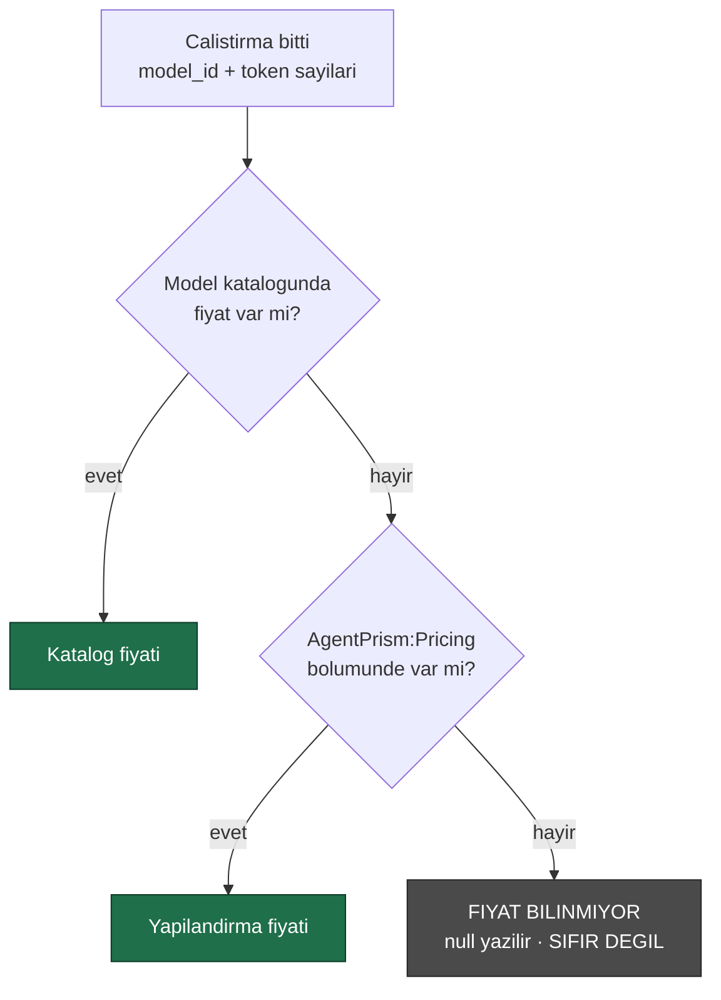

# Faz 20 — Maliyet Raporlaması ve Gösterge Paneli

> **Durum:** ✅ Tamamlandı (2026-08-03)
> **Kaynak:** [BEYIN-FIRTINASI.md](../BEYIN-FIRTINASI.md) · **F-17**, **F-23**
> **Önkoşul:** Yok · Faz 8 önerilir (uyumlu sağlayıcıların fiyatları da yapılandırmadan gelir)
> **Sonraki bağımlı:** [Faz 21](21-KOTA-VE-OLAY-YAYINI.md) — kota maliyet görünürlüğünden sonra anlamlıdır
> **Paketler:** `AgentPrism.Abstractions`, `.Core`, `.PostgreSql`, `.AspNetCore`, `.UI`
> **Yeni paket:** Yok · **Migration:** 0011 (`0011_run_costs.sql`)

---

## Bu Faza Başlarken

1. [`KARARLAR.md`](../../KARARLAR.md) — **K-032** (fiyat yapılandırmadan gelir, koda gömülmez), **K-034** (`/api/stats` neden maliyet döndürmüyordu), **K-041** (özet depoda hesaplanır), **K-002** (bundle bütçesi)
2. [`06-GOZLEMLENEBILIRLIK.md`](06-GOZLEMLENEBILIRLIK.md) — `RunStatistics.ByModel`, `runs.model_id`
3. [`19-SURUM-KARSILASTIRMA-VE-AB.md`](19-SURUM-KARSILASTIRMA-VE-AB.md) — bölüm 19.4 devir notu: deney sonuç
   tablosuna varyant başına maliyet sütunu bu fazda eklenir. Gerçekleşen tipler:
   `ExperimentVariantResult` (`Abstractions/Experiments/ExperimentVariantResult.cs`,
   zaten `TotalTokens` taşıyor — fiyat çarpımı bu fazda eklenir),
   `IRunStore.GetExperimentResultsAsync` (`ExperimentResultsQuery` alır,
   `PostgresRunStore`'da `SqlQueries.SelectExperimentResults` üzerinden çalışır),
   `ExperimentEndpoints.GetResultsAsync` (`AspNetCore/Endpoints/ExperimentEndpoints.cs`).
   Maliyet eklemek için `SelectExperimentResults` sorgusuna `runs.input_cost`/`output_cost`
   toplamı eklenir — bu fazın 20.2'de tanımladığı sütunlar zaten `runs` tablosunda olacak.
4. Bu doküman

---

## Amaç

OpenAI konsolunun en çok bakılan ekranı maliyet ekranıdır. AgentPrism'de token
kırılımı Faz 6'da geldi (`RunStatistics.ByModel`, `runs.model_id`); **eksik olan
tek şey fiyattır**.

İkinci iş: Settings ekranı bugün bir sayı listesi gösteriyor. Zaman serisi
grafikleri (çalıştırma/saat, hata oranı, token, maliyet) bir kontrol düzleminin
ana ekranıdır.

---

## 20.1 — Fiyat Nereden Gelir

K-032 kesindir: **AgentPrism fiyat uydurmaz.** Sağlayıcılar makinece okunabilir
fiyat listesi yayınlamaz; koda gömülen fiyat yayınlandığı gün yanlış olabilir ve
yanlış fiyat, maliyet raporunu **sessizce** bozar.

`ModelDescriptor` iki alanı **zaten taşıyor** (Faz 3'ten beri):

```csharp
decimal? InputCostPerMillionTokens { get; init; }
decimal? OutputCostPerMillionTokens { get; init; }
```

Bu alanlar bugün hiçbir yerde okunmuyor. Çözüm sırası:



```
AgentPrism:Pricing:openai:gpt-5.4-mini:Input   = 0.25
AgentPrism:Pricing:openai:gpt-5.4-mini:Output  = 2.00
AgentPrism:Pricing:openrouter:*:Input          = ...     ← joker desteklenmez, acikca yazilir
AgentPrism:Pricing:Currency                    = USD
```

🚨 **Bilinmeyen fiyat sıfır değildir.** Sıfır yazmak, kullanıcıya "bu model
bedava" demektir. `null` yazılır, raporda "fiyatı tanımsız N çalıştırma" satırı
görünür ve kullanıcı eksik yapılandırmayı **fark eder**.

---

## 20.2 — Fiyat Anlık Görüntüsü (kritik tasarım)

Fiyat okuma anında hesaplanırsa, fiyat listesi değiştiğinde **geçmiş maliyetler
de değişir**. Bu yanlıştır: geçen ayın faturası bugünkü fiyatla hesaplanmaz.

Bu yüzden maliyet **çalıştırma bittiğinde hesaplanır ve yazılır**:

```sql
ALTER TABLE {schema}.runs ADD COLUMN input_cost    numeric(20,10);
ALTER TABLE {schema}.runs ADD COLUMN output_cost   numeric(20,10);
ALTER TABLE {schema}.runs ADD COLUMN cost_currency text;
ALTER TABLE {schema}.runs ADD COLUMN pricing_source smallint;   -- 0=Catalog 1=Configuration 2=Unknown

CREATE INDEX IF NOT EXISTS runs_tenant_cost_idx
    ON {schema}.runs (tenant_id, started_at DESC)
    WHERE input_cost IS NOT NULL;
```

`numeric` kullanılır, `double` değil — para hesabında ikili kayan nokta
kullanılmaz. `decimal` ↔ `numeric` eşlemesi Npgsql'de doğrudandır.

Fiyat sonradan tanımlanırsa geçmiş **yeniden hesaplanmaz**. İstenirse ayrı bir
bakım ucu (`POST /api/stats/recalculate-costs`) eklenir; bu **Admin** yetkisidir
ve denetim izine yazılır.

---

## 20.3 — Raporlar

`RunStatistics` genişler:

```csharp
public sealed record RunStatistics
{
    // ...mevcut uyeler
    public decimal? TotalCost { get; init; }
    public string? Currency { get; init; }
    public long RunsWithUnknownPricing { get; init; }        // DURUSTLUK ALANI
    public IReadOnlyList<RunModelStatistics> ByModel { get; init; }   // maliyet alanlariyla genisler
    public IReadOnlyList<RunAgentStatistics> ByAgent { get; init; }
}

public sealed record TimeSeriesPoint
{
    public required DateTimeOffset Bucket { get; init; }
    public long Runs { get; init; }
    public long FailedRuns { get; init; }
    public long InputTokens { get; init; }
    public long OutputTokens { get; init; }
    public decimal? Cost { get; init; }
    public double? AverageDurationMs { get; init; }
}
```

`ExperimentVariantResult` (Faz 19) da genişler:

```csharp
public sealed record ExperimentVariantResult
{
    // ...mevcut uyeler (Variant, Version, TotalRuns, ..., TotalTokens, AverageDurationMs)
    public decimal? TotalCost { get; init; }
    public string? Currency { get; init; }
}
```

`SqlQueries.SelectExperimentResults`'a `SUM(input_cost) + SUM(output_cost)`
eklenir; `InMemoryRunStore.GetExperimentResultsAsync`'in `VariantTally`'sine de
aynı toplam eklenir (iki uygulama sözleşmesi aynı kalmalı, Faz 19'un
`ExperimentStoreContract` deseniyle test edilir).

Yeni uç:

```
GET {prefix}/api/stats/timeseries?from=…&to=…&bucket=hour|day&agent=…&model=…
```

- Hesap **depoda** yapılır (K-041). PostgreSQL'de `date_trunc` + `generate_series`
  ile **boş kovalar da döner** — aksi hâlde grafikte kesinti, "veri yok" değil
  "sıfır" gibi görünür
- Kova sayısı sınırlıdır (varsayılan en çok 500); aşılırsa `400` ve önerilen
  `bucket` değeri
- Bellek içi depo aynı sözleşmeyi tek geçişle karşılar

---

## 20.4 — Grafikler: Ölç, Sonra Karar Ver

Beyin fırtınası belgesi bunu açıkça yazmıştı: *"Bir grafik kütüphanesi 40–100 KB
gzip ekler; waterfall gibi elle SVG çizmek 5 KB'de biter. Karar ölçümle
verilmeli."*

**Uygulama sırası:**

1. Elle SVG ile üç grafik yazılır: çizgi (zaman serisi), çubuk (model kırılımı),
   yığılmış çubuk (durum dağılımı)
2. Bundle ölçülür
3. Sonuç `docs/KARARLAR.md`'ye ölçümle yazılır

**Beklenti:** üç grafik ~7 KB gzip. Waterfall (Faz 6) bunun kanıtıdır: hiyerarşik
görselleştirme 4,3 KB'de yazıldı (MCP ekranı dâhil).

Kütüphane **yalnız** şu durumda alınır: elle çizim 15 KB'yi aşarsa veya
etkileşim (zoom, tooltip, fırça seçimi) gereksinimi elle karşılanamazsa. O
durumda bile karar ölçümle ve gerekçeyle yazılır.

Grafiklerin ortak ilkeleri:

- Renkler tema değişkenlerinden gelir (açık/koyu tema ikisi de çalışır)
- Erişilebilirlik: yalnız renkle anlam verilmez; hata serisi kesikli çizgidir
- Boş veri durumu açıkça yazılır ("Bu aralıkta çalıştırma yok")

---

## 20.5 — Gösterge Paneli Ekranı

Yeni ekran: **Dashboard** — arayüzün **giriş ekranı** olur (bugün Agents).

| Bölüm | İçerik |
|-------|--------|
| Üst şerit | Bugün: çalıştırma, hata oranı, token, maliyet — dünle karşılaştırmalı |
| Zaman serisi | Çalıştırma/saat + hata oranı, seçilebilir aralık (1s, 24s, 7g, 30g) |
| Model kırılımı | Çalıştırma, token, maliyet — çubuk |
| Agent kırılımı | En çok çalışan 10 agent |
| Uyarılar | Fiyatı tanımsız model sayısı, açık devre kesici (Faz 8), bekleyen onay sayısı |

> Giriş ekranını değiştirmek bir davranış değişikliğidir; `docs/arsiv/fazlar/05-AGENTPRISM-UI.md`
> güncellenir ve `router.tsx` varsayılan rotası değişir.

Bütçe hedefi: **+12 KB gzip'ten az** (grafikler + ekran).

---

## Testler

| Proje | Yeni test | Sayı |
|-------|-----------|------|
| `AgentPrism.Core.UnitTests` | `Models/RunPricingResolverTests.cs` — katalog→yapılandırma sırası, bilinmeyen fiyat **null** (sıfır değil), saglayici-siz alfabetik ilk eşleşme, decimal yuvarlama, para birimi geçişi | 8 |
| `AgentPrism.Core.UnitTests` | `Recording/RunRecordingAgentTests.cs` — **uçtan uca** boru hattı testleri (`Maliyet_pipeline_ucdan_uca_hesaplanip_yaziliyor`, `Maliyet_pipeline_fiyatsiz_modelde_unknown_yazar`); bkz. K-157 | 2 |
| `AgentPrism.PostgreSql.IntegrationTests` | `Contracts/RunStoreContract.cs` — maliyet yazımı, `numeric(20,10)` tam gidiş-dönüş, model bilinmiyorsa `Cost=null`, ağaç maliyeti ayrı alan, deney sonucu maliyeti, zaman serisi boş kova doldurma, Eval'i hariç TUTMAMA, kova sınırı hatası, yeniden hesaplama ucu | 10 (× 2 depo = 20) |
| `AgentPrism.AspNetCore.FunctionalTests` | `StatsCostTests.cs` (maliyet alanları, boş kova, ters aralık 400, kova sınırı 400+öneri) + `RoleAndAuditTests.cs` eklentisi (Admin rolü, denetim izi) | 6 |
| Frontend (Vitest) | `lib/chart.test.ts` — ölçek, çizgi yolu, çubuk/yığın düzeni, kova etiketleme, boş veri güvenliği; `lib/format.test.ts` eklentisi (`money`) | 13 + 3 |
| `AgentPrism.Ui.E2ETests` | `Dashboard_grafikleri_cizilir_ve_aralik_degistirilebilir` + 4 mevcut testin "Agents" → "Dashboard" güncellemesi | 1 (+4 güncelleme) |

Toplam: mevcut 1033 backend teste **37 yeni test** eklendi (1070 toplam, hepsi
yeşil); Vitest 80 test (hepsi yeşil, 16 yeni).

**Gerçek kanıt** — `samples/AgentPrism.Api`, gerçek OpenAI çağrısıyla (K-141'in
aynı yöntemi):

```
$ curl -X POST http://localhost:5081/agentprism/api/agents/support/run -d '{"message":"..."}'  # 3 kez, fiyat TANIMSIZ
$ curl http://localhost:5081/agentprism/api/stats
{ "totalCost": null, "currency": null, "runsWithUnknownPricing": 0, "byModel": [{"modelId":"gpt-5.4-mini","totalCost":null,...}] }
```

Fiyat `AgentPrism:Pricing:openai:gpt-5.4-mini:Input=0.25` /
`:Output=2.0` ile tanımlanıp 3 çalıştırma tekrarlanınca:

```
$ curl http://localhost:5081/agentprism/api/stats
{ "totalCost": 0.00033025, "currency": "USD", "runsWithUnknownPricing": 0,
  "byModel": [{"modelId":"gpt-5.4-mini","totalRuns":3,"inputTokens":825,"outputTokens":62,"totalCost":0.00033025}] }

$ curl "http://localhost:5081/agentprism/api/stats/timeseries?from=...&to=...&bucket=Hour"
[ {"bucket":"...T13:00:00+00:00","runs":0,"cost":null,...},   # bos kova
  {"bucket":"...T14:00:00+00:00","runs":0,"cost":null,...},   # bos kova
  {"bucket":"...T16:00:00+00:00","runs":3,"cost":0.00033025,"averageDurationMs":2089.4} ]

$ curl -X POST http://localhost:5081/agentprism/api/stats/recalculate-costs
{ "runsConsidered": 3, "runsUpdated": 3, "runsStillUnknown": 0 }
```

🚨 Bu adım (Faz-tamamlama Adım 2) gerçek bir hata yakaladı:
`RunEventWriter.CompleteAsync`'e eklenen `cost` parametresi ilk yazımda
`RunCompletion` nesnesine hiç bağlanmamıştı — 1068 testin **hiçbiri** bunu
yakalamadı çünkü hiçbiri `RunRecordingAgent → RunEventWriter → Store` zincirini
uçtan uca çalıştırmıyordu. Bkz. K-157 ve yukarıdaki iki yeni
`RunRecordingAgentTests` testi.

---

## Bu Fazda Verilecek Kararlar

1. **Fiyat önce model kataloğundan, sonra `AgentPrism:Pricing` bölümünden** —
   iki kaynak da yapılandırmadır (K-032).
2. **Bilinmeyen fiyat `null`, sıfır değil** — sessiz yanlış rapor üretmeyiz.
3. **Maliyet çalıştırma anında hesaplanıp yazılır** — geçmiş, fiyat değişince
   değişmez.
4. **`numeric` kullanılır** — para hesabında kayan nokta yok.
5. **Grafik kütüphanesi kararı ölçümle verilir** ve ölçüm karar defterine yazılır.
6. **Dashboard giriş ekranı olur.**

---

## Açık Sorular — Karara Bağlandı

Dördü de kullanıcı tarafından dokümanın önerisiyle onaylandı ve karar
defterine yazıldı:

1. **Para birimi dönüşümü** → **Hayır**. Tek para birimi, `AgentPrism:Pricing:Currency`'den gelen bir etiket (K-150).
2. **Ağaç maliyeti gösterimi** → **İki ayrı alan**: `RunRecord.Cost` (kendi) ve `RunRecord.TreeCost` (ağaç toplamı, kendi maliyetini de içerir), toplanmaz — `Usage`/`TreeUsage` ile aynı desen (K-151).
3. **Eval/workflow dahil mi** → `/api/stats` `RunKind.Eval`'i hariç tutmaya devam eder (K-141 korunur); **yeni** `/api/stats/timeseries` bilerek hariç TUTMAZ, `?kind=` ile filtrelenebilir — bu iki ucun kasıtlı farkıdır (K-152).
4. **Yeniden hesaplama ucu** → **Evet**: `POST /api/stats/recalculate-costs`, Admin rolü + denetim izi (`stats.recalculate-costs`) (K-153).

---

## Bitiş Ölçütleri (DoD)

- [x] Fiyat yapılandırıldığında çalıştırma maliyeti `runs` satırına yazılıyor — gerçek OpenAI çağrısıyla doğrulandı
- [x] Fiyat tanımsızsa `null` yazılıyor ve rapor bunu **sayıyor** (`runsWithUnknownPricing`)
- [x] `/api/stats/timeseries` boş kovalarla birlikte doğru seri döndürüyor
- [x] Dashboard giriş ekranı; üç grafik çiziliyor; tema değişimi çalışıyor (var(--ap-*) token'ları, ayrı build gerekmez)
- [x] Grafik yaklaşımı ölçüldü ve karar yazıldı — el çizimi yeterli kaldı, kütüphaneye geçilmedi (aşağıya bkz.)
- [x] Faz 6'nın `ByModel` kırılımı maliyet sütunlarıyla genişledi
- [x] Bundle ölçüldü; bütçe aşılmadı — 113,2 KB → **116,2 KB gzip** (+3,0 KB, hedef +12 KB'nin çok altında)
- [x] Dört doğrulama kapısı sıfır uyarı (1070 backend test, 80 Vitest test)

---

## Riskler

| Risk | Önlem |
|------|-------|
| Yanlış fiyat yanlış rapor üretir | Fiyat yalnız yapılandırmadan; kaynak (`pricing_source`) kaydedilir ve raporda görünür |
| Grafik kütüphanesi bütçeyi yer | Elle çizim yeterli kaldı (+3,0 KB); kütüphaneye hiç bakılmadı |
| Zaman serisi sorgusu yavaşlar | Kova sınırı (500); kısmi indeks (`runs_tenant_cost_idx`) |
| Yerel modelde token gelmez (Faz 8) | Maliyet `null`; "tanımsız" sayacında görünür |
| Giriş ekranı değişimi kullanıcıyı şaşırtır | Yan menüde Agents ilk, Dashboard ikinci sırada; E2E testleri güncellendi |
| Yeni bir parametre eklenip gövdede kullanılmaması (K-157) | `faz-tamamlama` Adım 2 (örnek uygulamayı gerçek sağlayıcıyla çalıştırmak) zorunlu kalır; sözleşme testleri tek başına yetmez |

---

## Sonraki Faza Devir Notu

### Faz 21'e (Kota ve Olay Yayını) başlarken okunacaklar

1. Bu doküman — özellikle bölüm 20.1-20.3 (fiyat kaynağı, anlık görüntü, tipler).
2. `docs/KARARLAR.md` K-150…K-157 — bu fazın tüm kararları ve bilinen sınırlama.
3. Gerçekleşen tipler aşağıda; Faz 21 muhtemelen `RunCost`/`RunStatistics.TotalCost`'u
   doğrudan tüketecek (kota "para" cinsinden tanımlanırsa).

### Devraldığı sözleşmeler (gerçekleşen public API)

```csharp
// AgentPrism.Abstractions
public enum PricingSource { Catalog = 0, Configuration = 1, Unknown = 2 }
public enum TimeSeriesBucket { Hour = 0, Day = 1 }

public sealed record RunCost { InputCost, OutputCost, Currency, required Source }
public sealed record RunTreeCost { InputCost, OutputCost, Currency, RunsWithUnknownPricing }
public sealed record TimeSeriesPoint { Bucket, Runs, FailedRuns, InputTokens, OutputTokens, Cost, AverageDurationMs }
public sealed record RunTimeSeriesQuery { From, To, Bucket = Hour, AgentName?, ModelId?, Kind?, TenantId? }
public sealed record RunCostRecalculationResult { RunsConsidered, RunsUpdated, RunsStillUnknown }
public static class RunTimeSeriesBucketing { const int MaxBuckets = 500; StepFor/Truncate/Validate(...) }

public interface IRunPricingResolver { RunCost? Resolve(string? provider, string? model, RunUsage? usage); }

// IRunStore ekleri
ValueTask<IReadOnlyList<TimeSeriesPoint>> GetTimeSeriesAsync(RunTimeSeriesQuery, CancellationToken);
ValueTask UpdateRunCostAsync(Guid runId, RunCost? cost, CancellationToken);

// RunRecord/RunStatistics/RunModelStatistics/ExperimentVariantResult'a eklenen alanlar:
// Cost/TreeCost, TotalCost+Currency+RunsWithUnknownPricing, TotalCost, TotalCost+Currency

// AgentPrism.Core
public sealed class AgentPrismPricingOptions { Currency?, Providers: IDictionary<string, IDictionary<string, ModelPriceOverride>> }
public sealed class RunPricingResolver : IRunPricingResolver
public sealed class RunCostRecalculationService { ValueTask<RunCostRecalculationResult> RecalculateAsync(string tenantId, CancellationToken); }

// HTTP
GET  {prefix}/api/stats/timeseries?from&to&bucket&agentName&modelId&kind
POST {prefix}/api/stats/recalculate-costs   // Admin, denetim izi: "stats.recalculate-costs"
```

### Davranış sözleşmeleri (testlerin doğruladığı kurallar)

| Kural | Test |
|-------|------|
| Fiyat sırası: katalog → yapılandırma → Unknown | `RunPricingResolverTests` |
| Bilinmeyen fiyat asla `0`, her zaman `null` + `Source=Unknown` | `RunPricingResolverTests`, `RunStoreContract` |
| Maliyet çalıştırma bittiğinde bir kez hesaplanır, sonradan değişmez | `RunRecordingAgentTests` (uçtan uca) |
| `TreeCost`, `Cost` ile toplanmaz | `RunStoreContract.Agac_maliyeti_kendi_maliyetiyle_toplanmiyor_ayri_alanlar` |
| `/api/stats` Eval'i hariç tutar (K-141); `/api/stats/timeseries` TUTMAZ (K-152) | `RunStoreContract.Zaman_serisi_eval_calistirmalarini_haric_tutmaz` |
| Zaman serisi boş kovaları doldurur | `RunStoreContract.Zaman_serisi_bos_kovalari_doldurur` |
| 500 kova sınırı aşılırsa `AgentPrismException` (önerilen kova ile) | `RunStoreContract.Zaman_serisi_kova_sinirini_asinca_hata_verir` |
| Yeniden hesaplama saglayiciyi bilmez, alfabetik ilk eşleşen kazanır | K-154, `RunPricingResolverTests.Saglayici_verilmezse_*` |

### Bilinen tuzaklar

- 🚨 **Yeni bir parametre eklemek onu kullanmak DEĞİLDİR** (K-157) — bkz. MEMORY.md. Çağrı zincirindeki her katmanı (imza + gövde) elle izleyin.
- `runs` tablosunda saglayici sütunu **yok** — yalnız `model_id`. Aynı model adı iki saglayicida farklı fiyatlıysa yeniden hesaplama alfabetik ilk saglayiciyi seçer (K-154).
- `SqlQueries`'te own+tree maliyet sütunları `runColumns`'a **sona eklendi** (indeks 28-36); yeni bir sütun eklerken yine sona ekleyin, `ReadRun`'daki sabit indeksleri renumber etmeyin.

- **Faz 21 (kota) bu fazın maliyet alanlarını kullanır.** Kota "token" veya
  "para" cinsinden tanımlanabilir; para cinsi ancak fiyat tanımlıysa anlamlıdır
  ve tanımsızsa kota **token'a düşer**.
- Faz 19'un deney sonuç tablosu maliyet sütunu ile tamamlandı (`ExperimentVariantResult.TotalCost`/`Currency`).
- Faz 25 (saklama) `runs` özetini korur, olayları düşürür — maliyet alanları
  `runs` üzerinde olduğu için arşivleme sonrası da raporlanabilir.
