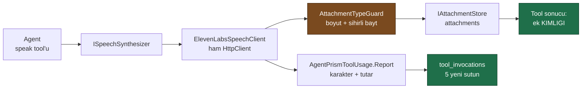

# Faz 28 — Ses Tool'ları (ElevenLabs)

> **Durum:** ✅ Tamamlandı (2026-08-05)
> **Kaynak:** [BEYIN-FIRTINASI.md](../BEYIN-FIRTINASI.md) · **F-13** (1/2)
> **Önkoşul:** [Faz 14](14-COK-MODLULUK.md) — ses çıktısı `attachments` deposunu kullanır
> **Sonraki:** [Faz 29](29-KONUSMA-KATMANI.md) — gerçek zamanlı konuşma katmanı
> **Paketler:** **`AgentPrism.Voice` (YENİ)**
> **Migration:** 0015 (Postgres) / 0003 (SqlServer, Sqlite) — planda "yok" deniyordu, **gerekli çıktı**

---

## Amaç ve Sonuç

Kullanıcı cevabı **konuştuğunu duysun** — ama henüz gerçek zamanlı bir konuşma
kurmadan. Nihai hedef konuşma katmanıdır (K-065); bu faz sağlayıcı soyutlamasını,
kimlik doğrulamayı, ses depolamayı ve maliyeti çözer. Faz 29 yalnız **gerçek
zamanlılık** sorununu ele alacaktır.

**Sonuç:** `AgentPrism.Voice` paketi üretiliyor ve **hiçbir NuGet paketi almıyor**
(ölçüldü: tek bağımlılık `AgentPrism.Core`). Üç tool kodda tanımlı: `speak`,
`transcribe`, `list_voices`. Üretilen ses `attachments` tablosunda yaşıyor; token
dışı ölçüm `tool_invocations` tablosuna yazılıyor.



---

## 28.0 — Yedi Ölçüm: planın altı varsayımı yanlıştı

Bu bölüm **çalışan koddan** okundu, dokümandan değil. İki bulgu (G4, G7) fazın
ilk taslağındaki tespitleri de **düzeltti** — ölçüm, kendi ön analizimi çürüttü.

### G1 — 🚨 Tool oturum kimliğini göremiyordu; ses eki **silinirdi**

`AgentRunScope` `SessionId` **taşımıyordu**. Oturum kimliği
`AgentSession.StateBag["AgentPrism.SessionId"]` içindedir ve bir tool
`AgentSession`'a erişemez. Sonuç: `speak` eki `session_id = NULL` ile yazardı ve
`RetentionTargetRegistry` tam olarak şu satırı siler:

```sql
created_at < @cutoff AND (session_id IS NULL
  OR NOT EXISTS (SELECT 1 FROM sessions s WHERE s.id = attachments.session_id))
```

Yani ses **sahipsiz** sayılır ve oturum hâlâ yaşarken transcript'ten kaybolurdu.
Birikme sorunundan kötüdür: sessiz veri kaybıdır.

**Yapıldı.** `AgentRunScope.SessionId` eklendi; `RunRecordingAgent.PrepareRun`
dolduruyor. Alt çağrı için `AgentPrismRunOptions.SessionId` taşınıyor
(`ChildAgentInvoker`), çünkü MAF alt agent'a oturum geçirmez.

> ⚠️ Kapsamdaki oturum kimliği `runs.session_id` sütununu **değiştirmez**.
> İki kavram ayrıdır: sütun "çalıştırma bu oturumla başlatıldı" der, kapsam
> "burada üretilen içerik bu oturuma aittir" der.

Kanıt (gerçek çalıştırma): ek `oturum=conv_019fd2369a23…`, `calistirma=019fd236-9a43…`.

### G2 — `AttachmentTypeGuard` HTTP katmanındadır, depoda değil

`IAttachmentStore.SaveAsync` **hiçbir doğrulama yapmaz**; denetleyici yalnız üç
HTTP giriş noktasından çağrılır. `speak` depoya doğrudan yazdığı için guard'ı
**kendisi çağırır**. Regresyon testi: `Basliksiz_icerik_ek_deposuna_YAZILMAZ`.

### G3 — 🚨 MP3 imzası sabit liste değil, **bit maskesidir**

Eski `SniffMediaType` yalnız `ID3`, `FF FB`, `FF F3` tanıyordu. MPEG çerçeve
senkronu **11 bit 1**'dir ve `FF F2`, `FF FA`, `FF E3` de geçerlidir. Sabit
liste, gerçek sağlayıcı çıktısında **sessiz bir ret** üretirdi.

**Yapıldı.** `IsMpegFrameSync` maskeyle tanır; sürüm/katman alanlarının
`reserved` değerleri elenir — yoksa `FF E0` ile başlayan her ikili içerik ses
sayılırdı. Altı geçerli ve iki geçersiz başlık test ediliyor.

Ham `pcm_*` / `ulaw_*` çıktıları **başlıksızdır** ve ek olarak saklanamaz.
`VoiceOptionsValidator` bu biçimleri uygulama **başlarken** reddeder.

### G4 — 🚨 `AIFunctionArguments.Services` AgentPrism'de **KULLANILAMAZ**

Bu fazın en pahalı bulgusudur ve **fazın kendi ilk taslağını çürütür.**

Ayrı bir prob programında ölçüldüğünde `AIFunctionArguments.Services` DI'ı
çözüyordu ve `arguments.Context` `null` geliyordu. Bunun üzerine tool'lar
`Services` üzerinden yazıldı. **Örnek uygulamada gerçek bir çağrıda çöktü:**

```
speak -> No service for type 'IOptions`1[AgentPrism.VoiceOptions]' has been registered.

TANILAMA: IOptions<VoiceOptions>=False, ISpeechSynthesizer=False,
          IAttachmentStore=False, ITenantContext=False,
          providerType=Microsoft.Extensions.AI.EmptyServiceProvider
```

Microsoft Agent Framework tool'a **`EmptyServiceProvider`** geçiriyor.
`ChatClientAgentOptions` bir `Services` özelliği taşımıyor ve
`chatClient.AsAIAgent(options, loggerFactory, services)` çağrısındaki sağlayıcı
fonksiyon çağrısına **akmıyor**.

Prob neden yanılttı: orada `FunctionInvokingChatClient`'ı **ben** kurmuştum ve
`functionInvocationServices` argümanını elle vermiştim. AgentPrism o istemciyi
kendisi kurmaz; MAF kurar.

**Yapıldı.** Tool'lar bağımlılığı **kurulum anında** alır:
`new SpeakTool(provider)`, kayıt `services.AddSingleton(provider => new AgentPrismToolRegistration(...))`
ile fabrika üzerinden. Gerekli servislerin tamamı singleton'dır; kiracı bilgisi
`ITenantContext` içindeki `IHttpContextAccessor`'dan gelir, kapsamdan değil.

> 🚨 **Yan bulgu:** `ToolMethodScanner` örnek metot tool'larını
> `arguments.Services` ile çözer. Aynı sebeple bunlar da çalışmaz. Depoda hiç
> örnek-metot tool'u yoktu (`OrderTools` statiktir), bu yüzden hiç görülmedi.
> Devir notuna yazıldı.

Ders: **bir prob programı, gerçek boru hattını kanıtlamaz.** Faz 27'nin
"derleme yeşilliği hiçbir şey kanıtlamaz" dersinin kardeşi.

### G5 — `tool_invocations` maliyet sütunu taşımıyordu

Gerçek şema: `id · run_id · tool_name · tool_call_id · arguments · result ·
duration_ms · error · created_at · source`. Karakter veya süre yazacak yer
**yoktu**; planın "Migration: Yok" satırı yanlıştı. Beş sütun eklendi
(bkz. [28.5](#285--maliyet)).

### G6 — Arayüz `<audio src="/api/attachments/{id}">` yazamaz

Arayüz her isteği `Authorization: Bearer` ile gönderir; tarayıcı kaynak
yüklemelerine özel başlık eklemez. Token açıkken doğrudan `src` **401** alır.
Faz 14 aynı sebeple `useAttachmentPreview` + `URL.createObjectURL` desenini
yazmıştı; ses aynı deseni kullanıyor. E2E testi token **açıkken** koşar ve
`src`'nin `blob:` ile başladığını doğrular.

### G7 — ⚠️ Fiyat yolu hakkındaki ilk tespitim **yanlıştı**

İlk analiz, `AgentPrismPricingOptions.Providers` özelliğine bakarak yolun
`AgentPrism:Pricing:Providers:{sağlayıcı}:…` olduğunu söylüyordu. **Yanlış.**
`BindPricing` elle yazılmıştır (AOT) ve `Pricing`'in **her çocuğunu doğrudan bir
sağlayıcı adı** sayar. Gerçek yol:

```
AgentPrism:Pricing:{saglayici}:{model}:Input|Output
```

Sınıfın kendi XML yorumu doğruydu. Bunun bir sonucu var: `Voice` bölümü eklenince
"Voice" adlı bir **sağlayıcı** sanılırdı. `Currency` gibi **rezerve anahtar**
yapıldı ve `BindPricing` onu atlıyor. Rezerve liste tek doğruluk noktasıdır ve
XML yorumunda uyarı olarak duruyor.

---

## Gerçekleşen Public API

```csharp
// AgentPrism.Abstractions/Voice/ — HTTP katmani bu tipleri gorur (K-174 deseni)
public interface ISpeechSynthesizer
{
    string ProviderName { get; }
    ValueTask<SpeechAudio> SynthesizeAsync(SpeechRequest r, CancellationToken ct = default);
    IAsyncEnumerable<ReadOnlyMemory<byte>> SynthesizeStreamingAsync(SpeechRequest r, CancellationToken ct = default);
    ValueTask<IReadOnlyList<VoiceDescriptor>> ListVoicesAsync(CancellationToken ct = default);
}

public interface ISpeechTranscriber
{
    string ProviderName { get; }
    ValueTask<SpeechTranscript> TranscribeAsync(Stream audio, string mediaType,
                                                SpeechTranscriptionOptions? options = null,
                                                CancellationToken ct = default);
}

public interface IVoiceHealthCheck   { ValueTask<VoiceHealth> CheckHealthAsync(CancellationToken ct = default); }
public interface IVoicePricingReader { string? Currency { get; } decimal? ForCharacters(decimal characters); }

public sealed record SpeechRequest              { Text · VoiceId · ModelId · OutputFormat · LanguageCode }
public sealed class  SpeechAudio                // record DEGIL — Data buyuk olabilir
{ Data · MediaType · Duration · CharactersBilled · UsageSource }
public enum SpeechUsageSource { Unknown, Provider, Estimated }
public sealed record SpeechTranscript           { Text · LanguageCode · LanguageProbability · AudioDuration }
public sealed record SpeechTranscriptionOptions { ModelId · LanguageCode }
public sealed record VoiceDescriptor            { VoiceId · Name · Category }
public sealed record VoiceHealth                { ProviderName · IsHealthy · Latency · CheckedAt · Detail · VoiceCount }
public sealed record SpeakRequest               { Text · SessionId · VoiceId }
public sealed record SpeakResponse              { Attachment · Characters · IsEstimated · Cost · Currency }

// AgentPrism.Abstractions/Tools/
public sealed record ToolCallUsage { Unit · Quantity · Cost · Currency · IsEstimated }
public static class ToolUsageUnits { Characters, Seconds }

// AgentPrism.Core — tool'un olcum bildirme yuzeyi
public static class AgentPrismToolUsage { public static bool Report(ToolCallUsage usage); }

// AgentPrism.Voice
public sealed class VoiceOptions            // class (K-035)
{
    public const string SectionName = "AgentPrism:Voice";
    Provider · ApiKey · Endpoint · DefaultVoiceId · SynthesisModelId ·
    TranscriptionModelId · OutputFormat · MaxCharactersPerRequest ·
    MaxConcurrentRequests · RequireApproval · Timeout
}
public sealed class VoiceOptionsValidator : IValidateOptions<VoiceOptions>;
public static class VoiceProviderNames { public const string ElevenLabs = "elevenlabs"; }
public static class VoiceBuilderExtensions
{
    public static IAgentPrismBuilder UseVoice(this IAgentPrismBuilder b, IConfiguration section, Action<VoiceOptions>? configure = null);
    public static IAgentPrismBuilder UseVoice(this IAgentPrismBuilder b, Action<VoiceOptions> configure);
}
```

`AgentRunScope` **değişti**: `SessionId` ve `internal ToolUsage` eklendi.
`ToolInvocationRecord` **değişti**: `Usage` eklendi.
`AgentPrismRunOptions` **değişti**: `SessionId` eklendi.
`AgentPrismPricingOptions` **değişti**: `Voice` sözlüğü eklendi.

---

## 28.1 — Sağlayıcı: ham `HttpClient`, SDK yok

**Karar: `ElevenLabs-DotNet` alınmadı.** Gerekçe üç katmanlı:

1. Kullanılan yüzey **üç uçtan** ibaret; JSON sözleşmesi basit.
2. `System.Text.Json` kaynak üreteci ile paket AOT uyumlu kalır.
3. Topluluk SDK'sı bakım riskini tüketiciye taşır (K-007), ve Faz 27 bir SDK'nın
   merkezî sürüm yönetimi altında çalışma anında **sessizce** kırılabildiğini
   ölçtü (K-211).

Ölçülen sonuç: paket **sıfır NuGet bağımlılığı** taşıyor.

```
AgentPrism.Voice -> 1 dogrudan bagimlilik
  AgentPrism.Core
```

Doğrulanan uçlar (elevenlabs.io/docs, 2026-08-05; taklit uçla uçtan uca ölçüldü):

| İş | İstek |
|---|---|
| TTS | `POST /v1/text-to-speech/{voice_id}?output_format=mp3_44100_128` · JSON gövde |
| TTS akış | `POST /v1/text-to-speech/{voice_id}/stream` |
| STT | `POST /v1/speech-to-text` · **`multipart/form-data`** (`file` + `model_id`) |
| Sesler | `GET /v2/voices` — 🚨 **v2**; `/v1/voices` eski yüzeydir |

Kimlik doğrulama **`xi-api-key`** başlığıdır, `Authorization: Bearer` değil.

Faturalanan karakter yanıt başlığından okunur (`character-cost`); başlık yoksa
metnin uzunluğu kullanılır ve ölçüm `Estimated` olarak işaretlenir. Tahmini
ölçüm gibi göstermek fiyat uydurmaktır (K-032).

---

## 28.2 — Tool'lar

K-012 korunur: tool'lar **kodda** tanımlıdır; arayüzden yalnız seçilir.

| Tool | Ne yapar | Sonuç | Onay |
|------|----------|-------|------|
| `speak` | Metni sese çevirir, `attachments`'a yazar | Ek **kimliği** | Varsayılan **kapalı**, `RequireApproval` ile açılır |
| `transcribe` | Bir ses ekini metne çevirir | Metin + dil | Aynı ayar |
| `list_voices` | Kullanılabilir sesleri listeler | Ad + kimlik | **Hiçbir zaman** — ücret üretmez, dış etki yaratmaz |

Neden onay varsayılan kapalı: tool geri alınamaz bir dış etki yaratmaz — dosya
üretir ve ücret harcar. Ücret bir gerekçe olabilir, bu yüzden ayar vardır.

Sonuç modele **ekin kimliğini** döndürür. Ham ses konsaydı bağlam penceresi
base64 ile dolardı; test sonucun 200 karakterin altında kaldığını doğruluyor.

> **Plandan sapma — `ApiKeyConfigurationKey` kullanılmadı.** Planın ilk hâli
> anahtarın **adını** tutuyor ve K-059'a dayanıyordu. K-059 bir sırrın
> **veritabanına** yazılmasını yasaklar; ses yapılandırması veritabanına hiç
> girmez ve diğer dört sağlayıcı paketi de düz `ApiKey` taşır. İkinci bir kalıp
> tutarsızlık üretirdi. Ses sağlayıcısı ileride arayüzden düzenlenebilir olursa
> K-059 o zaman uygulanır.

---

## 28.3 — Depolama

Ses **`attachments` tablosuna** yazılır (Faz 14). Yeni depo açılmadı.

- `media_type` = `audio/mpeg` — beyaz listede `audio/*` zaten vardı
- `tenant_id`, `session_id`, `run_id` doldurulur
- `run_id` bir yabancı anahtar **değildir** (şema 0006); silme yolu
  `session_id` üzerindendir — G1 bu yüzden kritikti

---

## 28.4 — HTTP uçları

| Uç | Rol | Not |
|---|---|---|
| `GET /api/voice/health` | Reader | Ücret üretmez; `GET /v2/voices` çağırır |
| `GET /api/voice/voices` | Reader | Arayüz ses seçimi |
| `POST /api/voice/speak` | **Operator** | Arayüzün "Speak" düğmesi |

`UseVoice()` çağrılmadıysa uçlar **501** döner, 404 değil: yanlış adres ile eksik
yapılandırma birbirine karışmamalıdır.

Ses sağlayıcısı `/api/models/health` çıktısında **görünmez** — bir
`IModelProvider` değildir ve iki kaynak tek listede toplanırsa devre kesici ile
model kataloğu yanlış davranır.

> ⚠️ **İki seslendirme yolunun ölçüm davranışı FARKLIDIR.**
> Agent'ın `speak` tool'u bir çalıştırmanın içindedir; ölçümü
> `tool_invocations`'a yazılır. `POST /api/voice/speak` bir **operatör
> eylemidir** ve çalıştırma dışındadır: `tool_invocations.run_id` zorunlu bir
> yabancı anahtar olduğu için çalıştırmasız ölçüm satırı yazılamaz. Maliyet yine
> de görünmezdir denemez — uç ölçülen karakteri ve tutarı **yanıtta döndürür**
> ve arayüz oynatıcının yanında gösterir. Kalıcı kayıt isteyen tool yolunu
> kullanır. Bu bilinçli bir ödünleşmedir; Faz 29 açık soru 5'te yeniden açılır.

---

## 28.5 — Maliyet

Ses ücretlendirmesi **karakter** (üretim) veya **süre** (çözüm) bazlıdır.
Faz 20'nin modeli token varsayar ve `runs` tablosuna yazar.

### Şema (migration 0015 / 0003 / 0003)

| Sütun | Tip (Postgres) | İçerik |
|---|---|---|
| `usage_unit` | `text` | `characters` \| `seconds`. `NULL` = ölçüm yok |
| `usage_quantity` | `numeric(20,10)` | Faturalanan miktar |
| `usage_estimated` | `boolean` | Miktar tahmin mi |
| `cost` | `numeric(20,10)` | Tutar. Fiyat yoksa `NULL` — **sıfır değil** |
| `cost_currency` | `text` | Para birimi etiketi |

`pricing_source` **eklenmedi**: ses fiyatının tek kaynağı yapılandırmadır (model
kataloğu ses fiyatı taşımaz). Yeni sütunlar üç diyalektte de `SELECT` listesinin
**sonuna** eklendi; sabit indeksli okuyucular renumber edilmedi (Faz 20 dersi).

### Ölçüm nasıl kayda bağlanır

Tool bir `AIFunction` gövdesinde çalışır ve kendi satırını yazamaz; kayıt
`ToolInvoking`/`ToolInvoked` çiftinden üretilir. Ölçümü doğru satıra bağlayan tek
anahtar **çağrı kimliğidir**:

```
tool govdesi                          ToolInvocationTracker
  FunctionInvokingChatClient              OnResult(result)
    .CurrentContext.CallContent.CallId  ->  _usage.Take(result.CallId)
        |                                        ^
        v                                        |
  ToolUsageAccumulator.Report(callId, usage) ----+
```

`FunctionInvokingChatClient.CurrentContext` tool gövdesinde **doludur** —
ölçüldü. (`AIFunctionArguments.Context` `null` gelir ve çağrı kimliğini
taşımaz.) `AgentPrismToolUsage.Report` bağlanamazsa `false` döner ve tool'un işi
**bozulmaz**: gözlemlenebilirlik işlevselliği bozmaz.

### Fiyat yapılandırması

```jsonc
"AgentPrism": {
  "Pricing": {
    "Currency": "USD",
    "Voice": {                       // 🚨 REZERVE anahtar (bkz. G7)
      "elevenlabs": {
        "eleven_multilingual_v2": { "PerMillionCharacters": 110.0 },
        "scribe_v2":              { "PerMinute": 0.006 }
      }
    }
  }
}
```

Ses maliyeti token maliyetiyle **toplanmaz** — iki farklı birim toplanamaz.

### Sınırlar

| Sınır | Varsayılan | Nereden |
|---|---|---|
| İstek başına karakter | 5.000 | `VoiceOptions.MaxCharactersPerRequest` |
| Ses dosyası boyutu | 20 MB | Faz 14 |
| Eşzamanlı istek | 2 | `VoiceOptions.MaxConcurrentRequests` (`SemaphoreSlim`) |

Sınır aşılırsa tool **hata döndürür**, metni sessizce kırpmaz.

---

## 28.6 — Arayüz

Playground'da her tamamlanmış asistan mesajının altında **"Speak"** düğmesi;
basıldığında ses üretilir ve satır içi çalar. Yanında ölçüm görünür
(`37 chars · 0.0041 USD`).

Bundle: **121,9 KB → 122,5 KB gzip** (+0,6 KB; hedef +4 KB, bütçe 250 KB).
Oynatıcı kütüphanesi **alınmadı** — düz `<audio>`.

---

## Dosya Listesi (gerçekleşen)

```
src/AgentPrism.Voice/                          YENI PAKET — 0 NuGet bagimliligi
├── AgentPrism.Voice.csproj
├── VoiceOptions.cs                            class + VoiceProviderNames (K-035)
├── VoiceOptionsValidator.cs                   saklanamaz bicimi ACILISTA reddeder
├── VoiceBuilderExtensions.cs                  UseVoice(...) — tool'lar FABRIKA ile
├── Internal/ElevenLabsSpeechClient.cs         uc uc + saglik; eszamanlilik sayaci
├── Internal/ElevenLabsJson.cs                 JsonSerializerContext (AOT)
├── Internal/VoicePricing.cs                   IVoicePricingReader uygulamasi
├── Tools/VoiceToolBase.cs                     🚨 bagimlilik KURULUM aninda (G4)
├── Tools/{Speak,Transcribe,ListVoices}Tool.cs elle yazilmis AIFunction turevleri
├── README.md
└── PublicAPI.{Shipped,Unshipped}.txt

src/AgentPrism.Abstractions/
├── Voice/SpeechContracts.cs                   YENI — HTTP katmani gorsun diye (K-174)
├── Voice/SpeechModels.cs                      YENI
├── Tools/ToolCallUsage.cs                     YENI
├── Tools/ToolInvocationRecord.cs              + Usage
└── Runs/AgentPrismRunOptions.cs               + SessionId

src/AgentPrism.Core/
├── Recording/AgentPrismRunContext.cs          + SessionId, + ToolUsage       (G1)
├── Recording/ToolUsageAccumulator.cs          YENI — cagri kimligine gore
├── Recording/RunRecordingAgent.cs             kapsami DOLDURUR
├── Recording/ToolInvocationTracker.cs         olcumu kayda BAGLAR
├── Tools/AgentPrismToolUsage.cs               YENI — public bildirim yuzeyi
├── Graph/ChildAgentInvoker.cs                 oturum kimligini alt cagriya tasir
├── Attachments/AttachmentTypeGuard.cs         IsMpegFrameSync — bit maskesi   (G3)
├── AgentPrismOptions.cs                       + Pricing.Voice, XML uyarisi    (G7)
├── AgentPrismOptionsValidator.cs              negatif ses fiyati reddi
└── AgentPrismServiceCollectionExtensions.cs   BindVoicePricing + rezerve anahtar

src/AgentPrism.AspNetCore/Endpoints/VoiceEndpoints.cs    YENI — 3 uc
src/AgentPrism.Sql.Shared/                     AddNullableBoolean + 5 sutun
src/AgentPrism.{PostgreSql,SqlServer,Sqlite}/  migration + sorgu
src/AgentPrism.UI/frontend/                    SpeakButton, SpeakerIcon, api.speak
samples/AgentPrism.Api/                        UseVoice + "sesli-asistan" + sema
tests/AgentPrism.Voice.UnitTests/              YENI PROJE (36 test)
```

---

## Testler

**1866 test geçiyor** (+166). Karşılaştırma tabanı Faz 27'nin 1700'üdür.
SQL Server'ın 215 testi bu makinede koşmuyor ve bu sayıya **dâhil değildir**.

| Proje | Sayı | Eklenen |
|-------|------|---------|
| `AgentPrism.Voice.UnitTests` | 36 | tamamı yeni |
| `AgentPrism.Core.UnitTests` | 481 | +16 |
| `AgentPrism.AspNetCore.FunctionalTests` | 268 | +7 |
| `AgentPrism.Sqlite.IntegrationTests` | 216 | +2 (sözleşme) |
| `AgentPrism.PostgreSql.IntegrationTests` | 444 | +2 (sözleşme) |
| `AgentPrism.Ui.E2ETests` | 30 | +1 |

| Test sınıfı | Neyi doğrular |
|---|---|
| `ElevenLabsSpeechClientTests` | `xi-api-key` başlığı, `/v2/voices`, multipart STT, akışlı sentez, hata gövdesinin **taşınmaması**, tahmin/sağlayıcı ölçüm ayrımı, bicim→MIME |
| `SpeakToolTests` | **G1** oturum kimliği, **G2** guard çağrısı, **G3** çerçeve senkronlu MP3, sonucun kimlik döndürmesi, sınırın kırpmaması |
| `VoiceBuilderExtensionsTests` | **G4 gerilemesi** — tool bağımlılıklarının tamamı çözülebilir; tüketicinin uygulaması korunur; tek örnek üç arayüze bağlanır |
| `VoiceOptionsValidatorTests` | Saklanamayan biçimin **açılışta** reddi |
| `SecretLeakTests` | Anahtar altı çıktıda yok; `ToString` tanımlı değil (K-035); doğrulama mesajı adres taşımaz |
| `AttachmentTypeGuardAudioTests` | Altı geçerli + iki geçersiz MPEG başlığı |
| `ToolUsageReportingTests` | Çağrı kimliğiyle eşleme; çalıştırma dışında sessiz başarısızlık |
| `VoiceEndpointTests` | 501, ek yazımı, indirme, boş metin, sağlayıcı gövdesinin sızmaması |
| `ToolInvocationContract` | Beş ölçüm sütunu üç diyalektte gidip gelir; **ondalık kesilmez** |
| `UiTests` | Token **açıkken** sesin `blob:` URL ile çalması |

**Gerçek ses sağlayıcısı çağrısı yapan test yoktur** (Faz 3'ten beri geçerli karar).

---

## Bitiş Ölçütleri (DoD)

Elle doğrulama: `samples/AgentPrism.Api`, 2026-08-05. Model çağrıları **gerçek
OpenAI**'a gitti; ses sağlayıcısı ElevenLabs'in veri düzlemi sözleşmesini birebir
taklit eden yerel bir uçtu (Faz 27'nin deseni).

| Ölçüt | Durum | Kanıt |
|---|---|---|
| `AgentPrism.Voice` paketi üretiliyor | ✅ | **15 paket**; 1 doğrudan bağımlılık, **0 NuGet** |
| `speak` gerçek bir çalıştırmada çalışıyor | ✅ | aşağıdaki çıktı, 3 |
| Ses `attachments`'a yazılıyor, `session_id` **dolu** | ✅ | çıktı 4 — G1 |
| `transcribe` ses ekini metne çeviriyor | ✅ | çıktı 5 |
| Ölçüm `tool_invocations`'a yazılıyor | ✅ | çıktı 3 ve 5 — `usage` alanı |
| Ses maliyeti token maliyetiyle toplanmıyor | ✅ | ayrı sütunlar, ayrı birim |
| Arayüzde ses çalınıyor (token açıkken de) | ✅ | E2E `…ses_ogesi_calar`, `blob:` |
| Bundle bütçesi | ✅ | +0,6 KB gzip |
| Paket AOT uyumlu, sıfır uyarı | ✅ | `IsAotCompatible=true` altında derleniyor |
| API anahtarı hiçbir yerde görünmüyor | ✅ | 7 API çıktısı + günlük → **0 kez** |
| Paket kontrol listesi tamam | ✅ | README + slnx + `DependencyDirectionTests` |
| Dört doğrulama kapısı sıfır uyarı | ✅ | build / test / pack / format → 0 uyarı |

> ⚠️ **Gerçek ElevenLabs aboneliğiyle doğrulama yapılmadı.** Sözleşme (yol,
> `xi-api-key`, `output_format`, multipart STT, `/v2/voices`) taklit uçla uçtan
> uca doğrulandı. Gerçek hesapta kalan **iki** belirsizlik:
> (1) faturalanan karakteri hangi yanıt başlığının taşıdığı — bulunamazsa ölçüm
> `Estimated` olur ve maliyet yine hesaplanır;
> (2) gerçek MP3 çıktısının ilk baytları — maske tabanlı tanıma altı geçerli
> başlığı kapsıyor, ama ölçülmedi.
>
> ⚠️ **SQL Server sözleşme testleri bu makinede koşmadı.** `mssql/server`
> konteyneri Apple Silicon üzerinde başlamıyor — Faz 23'ten beri bilinen ortam
> sınırı, bu fazın değişikliğiyle ilgisi yoktur. Migration `0003_tool_usage.sql`
> yazıldı ama **çalıştırılmadı**.
>
> ⚠️ E2E paketi tam çözüm koşusunda bir kez 1 test düşürdü; yalıtılmış koşuda
> iki kez 30/30 geçti. Yük altında zamanlama kaynaklı görünüyor.

### Gerçek çıktı (2026-08-05)

```
# 1) Ses saglayicisi sagligi — ucret uretmez
$ curl .../api/voice/health
  {"providerName":"elevenlabs","isHealthy":true,"latency":"00:00:00.030","voiceCount":2}

# 2) Tool defteri
$ curl .../api/tools
  list_voices  onay=False  sema=var
  speak        onay=False  sema=var
  transcribe   onay=False  sema=var

# 3) GERCEK CALISTIRMA — OpenAI modeli speak tool'unu cagirdi
  toolName   : speak
  arguments  : text=AgentPrism ses testi tamamlandi.
  result     : Ses uretildi. attachmentId=019fd236-a208-…, tur=audio/mpeg, boyut=2062 bayt
  duration   : 00:00:00.0309
  usage      : {unit: characters, quantity: 37, cost: 0.00407, currency: USD, isEstimated: false}
               # 110.0 * 37 / 1e6 = 0.00407  ← yapilandirmadan gelen fiyat

# 4) Ek kaydi — G1
  tur=audio/mpeg  boyut=2062
  oturum=conv_019fd2369a237fc28c5e0b2cf16be7de     # <- DOLU
  calistirma=019fd236-9a43-7be1-a70b-5c7cc489cf8e
  yazan=sesli-asistan

# 5) transcribe
  result : [dil=tr] merhaba bu bir deneme kaydidir
  usage  : {unit: seconds, quantity: 4.25, cost: 0.000425, currency: USD, isEstimated: false}

# 6) Saglayici ucuna ULASAN istekler
  POST /v1/text-to-speech/ses-tr-1?output_format=mp3_44100_128
       xi-api-key=SAHTE-SES-ANAHTARI-xyz789   Authorization=None   content-type=application/json
       govde={"text":"AgentPrism ses testi tamamlandi.","model_id":"eleven_multilingual_v2"}
  GET  /v2/voices
       xi-api-key=SAHTE-SES-ANAHTARI-xyz789

# 7) Sir taramasi
  /api/voice/health · /api/voice/voices · /api/meta · /api/tools ·
  /api/agents · /api/runs · /api/attachments     -> anahtar 0 kez
  uygulama gunlugu                               -> anahtar 0 kez
```

---

## Kullanım

```csharp
builder.AddAgentPrism()
       .UseVoice(configuration.GetSection(VoiceOptions.SectionName))
       .AddAgent(new AgentDefinition
       {
           Name = "sesli-asistan",
           Instructions = "Kullanici isterse cevabini seslendir.",
           Model = new ModelBinding { Provider = "openai", Model = "gpt-5.4-mini" },
           ToolNames = ["speak", "transcribe", "list_voices"],
       });
```

```bash
dotnet user-secrets set "AgentPrism:Voice:ApiKey" "..."
```

---

## Bu Fazda Verilen Kararlar

Karar defterine yazıldı (`docs/KARARLAR.md`, **K-215 – K-221**):

1. **K-215** — Ses sözleşmeleri `AgentPrism.Abstractions`'ta; ElevenLabs bir uygulamadır.
2. **K-216** — Ham `HttpClient`; `AgentPrism.Voice` hiçbir NuGet paketi almaz.
3. **K-217** — `AgentRunScope.SessionId` eklendi; oturumsuz ek saklama tarafından silinir.
4. **K-218** — 🚨 Tool bağımlılıkları **kurulum anında** alınır; `AIFunctionArguments.Services` MAF boru hattında boştur.
5. **K-219** — `tool_invocations` beş ölçüm sütunu taşır; ses maliyeti token maliyetiyle toplanmaz.
6. **K-220** — `POST /api/voice/speak` operatör eylemidir ve `tool_invocations`'a yazmaz.
7. **K-221** — Ses API anahtarı düz `ApiKey`'dir; K-059 yalnız veritabanı içindir.

---

## Riskler — kapanış durumu

| Risk | Sonuç |
|---|---|
| Ses eki sessizce siliniyor | **Kapandı.** `AgentRunScope.SessionId` + gerçek çalıştırmada doğrulandı |
| Sağlayıcı çıktısı beyaz listeden geçmiyor | **Kapandı.** Maske tabanlı tanıma + 8 test |
| Arayüz sesi yükleyemiyor (401) | **Kapandı.** Nesne URL deseni + token açık E2E |
| Topluluk SDK riski | **Ortadan kalktı.** Sıfır NuGet bağımlılığı |
| AOT uyumu kaybolur | **Gerçekleşmedi.** Elle `AIFunction` + `JsonSerializerContext` |
| 🆕 MAF tool'a boş servis sağlayıcı geçiyor | **Gerçekleşti ve ölçüldü** (K-218). Yalnız örnek uygulama yakaladı |
| Ses maliyeti fark edilmeden büyür | **Kısmen açık.** Tool yolu ölçülüyor; operatör yolu yalnız yanıtta gösteriyor (K-220) |

---

## Sonraki Faza Devir Notu

- 🚨 **`AIFunctionArguments.Services` bu depoda kullanılamaz** (K-218). Yeni bir
  tool yazarken bağımlılığı kurulum anında alın. Aynı sebeple
  **`AddToolsFrom` ile kaydedilen ÖRNEK METOT tool'ları da çalışmaz** —
  `ToolMethodScanner.CreateFunction` taşıyıcıyı `arguments.Services`'ten çözer ve
  `EmptyServiceProvider` alır. Depoda hiç örnek-metot tool'u yok, bu yüzden hiç
  görülmedi. Düzeltmek ayrı bir iştir: ya tarayıcıya bir `IServiceProvider`
  verilmeli ya da hata mesajı bu durumu açıkça söylemelidir.
- **`SynthesizeStreamingAsync` uygulandı ama üretimde kullanılmıyor.** Faz 29
  gerçek zamanlı yolda kullanacaktır. 🚨 Akan ses **eke yazılamaz**: PCM/µ-law
  başlıksızdır ve parçalar tek başına geçerli dosya değildir.
- **Artımlı transkripsiyon ayrı bir arayüz olmalıdır**
  (`IStreamingSpeechTranscriber`). `ISpeechTranscriber`'a üye eklemek tüketici
  uygulamalarını kırar.
- **STT yanıtındaki `words[]` okunmuyor.** Kelime zamanlaması Faz 29'un ihtiyacı.
- **Ses kotası Faz 21'in mekanizmasına bağlanmadı.** `QuotaEnforcer` token ve
  çalıştırma sayar; ses dakikası bir birim değildir. Faz 29'da ses sürekli akar
  ve `MaxCharactersPerRequest` orada koruma sağlamaz — soru orada açılmalıdır.
- **Operatör yolunun ölçümü kalıcı değildir** (K-220). Kalıcılık isteniyorsa
  `tool_invocations.run_id`'nin nullable yapılması veya operatör eylemleri için
  ayrı bir tablo gerekir; ikisi de bu fazın kapsamı dışındaydı.
- **`DependencyDirectionTests.AllowedReferences` hâlâ `AgentPrism.SqlServer`,
  `AgentPrism.Sqlite` ve `AgentPrism.Sql.Shared` paketlerini içermiyor**
  (Faz 23/24'ten kalan boşluk; Faz 26 ve 27'de de açıktı). Bu fazda
  `AgentPrism.Voice` eklendi.
