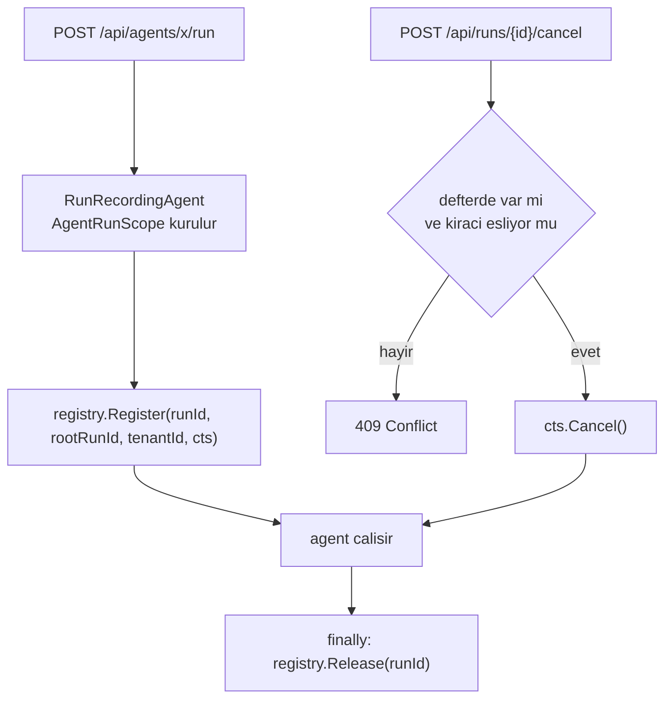

# Faz 32 — Çalıştırma İptali

> **Durum:** ✅ Tamamlandı (2026-08-06)
> **Kaynak:** [ADAYLAR.md](../../ADAYLAR.md) · **F-35**
> **Önkoşul:** Yok. **Kapsam bilerek tek örnekle sınırlıdır** — gerekçe aşağıda
> **Paketler:** `AgentPrism.Abstractions`, `.Core`, `.AspNetCore`, `.UI`
> **Yeni paket:** Yok · **Migration:** Yok
> **Public API:** büyüyor — Faz 7'den önce ucuz

---

## Bu Faza Başlarken

> `faz-baslangic` skill'ini uygula. Aşağıdaki liste o skill'in 2. adımıdır —
> **tamamını değil, yalnız işaret edilen bölümleri oku.**

1. Bu doküman
2. Kararlar — dosyanın tamamını **okuma**, yalnız bu kalemleri grep'le:
   ```bash
   grep -n "K-103\|K-158\|K-165\|K-228\|K-232" docs/KARARLAR.md
   ```
   **K-103** (alt agent onay isteyemez — ağaç sınırlarının nasıl uygulandığını
   gösterir), **K-158** (hız sınırı bellekte, kota veritabanında — bu fazın
   defteri de bellektedir ve aynı sınırı taşır), **K-165** (yeni davranış
   varsayılan kapalı gelir), **K-228**/**K-232** (arayüz sözlüğü).
3. [`12-AGENT-CAGRI-GRAFIGI.md`](12-AGENT-CAGRI-GRAFIGI.md) — yalnız devir notu:
   ```bash
   awk '/## Sonraki Faza Devir Notu/,0' docs/arsiv/fazlar/12-AGENT-CAGRI-GRAFIGI.md
   ```
   Çalıştırma ağacını, `RootRunId` ve `Depth` sözleşmesini devralıyorsun. Kök
   iptali alt çalıştırmaları da durdurmalıdır.
4. Alan hafızası (bu faz iki alana dokunuyor):
   [`hafiza/cekirdek-calistirma.md`](../../hafiza/cekirdek-calistirma.md)
   (🚨 `AsyncLocal` tuzağı — bu fazda **doğrudan** geçerlidir),
   [`hafiza/aspnetcore-di.md`](../../hafiza/aspnetcore-di.md) (uç kaydı, DI ömrü)
5. Gerektiğinde, tamamı değil ilgili bölümü:
   [`MIMARI.md`](../../MIMARI.md) — çalıştırma yolu bölümü

---

## Amaç

Bir çalıştırmayı **dışarıdan** durdurmanın yolu yoktur. Kaçak bir agent'ı
durdurmanın tek yolu bugün süreci öldürmektir. Bu faz bir iptal ucu ve süren
çalıştırmaların bellek içi defterini ekler.

- **F-35** — `POST /api/runs/{runId}/cancel`, süren `CancellationTokenSource`
  defteri, kök iptalinin alt çalıştırmaları da durdurması.

### 🚨 Kapsam sınırı — bu faz tek örnek içindir

Çok örnekli bir kurulumda iptal isteği **yanlış örneğe** düşebilir. Doğru çözüm
aday listesindeki **F-57** (kira tabanlı tek yürütücü seçimi) kalemidir ve bu
dalgada **yoktur**.

Bu faz sınırı gizlemez, **görünür kılar**: çalıştırma bu örnekte yürütülmüyorsa
uç `409 Conflict` ve açık bir mesaj döner. Sessizce `202` dönmek operatöre iptal
ettiğini düşündürür; bu, hiç uç olmamasından kötüdür.

### Bugün ne çalışmıyor — doğrulanmış kanıt

| Kanıt | Gözlem |
|---|---|
| [`SchedulingEndpoints.cs:65`](../../../src/AgentPrism.AspNetCore/Endpoints/SchedulingEndpoints.cs) | `POST /api/jobs/{id:guid}/cancel` **vardır** — iş iptali çözülmüştür |
| [`RunEndpoints.cs:31-114`](../../../src/AgentPrism.AspNetCore/Endpoints/RunEndpoints.cs) | Dört uç, dördü de `GET`. `/api/runs/{id}/cancel` **yoktur** |
| [`RunRecordingAgent.cs:185-189`](../../../src/AgentPrism.Core/Recording/RunRecordingAgent.cs) | `catch (OperationCanceledException)` → `RunStatus.Canceled`. İptal yalnız **çağıranın kendi belirteci** düştüğünde yazılır |
| [`RunRecordingAgent.cs:251`](../../../src/AgentPrism.Core/Recording/RunRecordingAgent.cs) | Akışlı yolda aynı davranış |
| [`WorkflowRunner.cs:463`](../../../src/AgentPrism.Workflows/Internal/WorkflowRunner.cs) | Workflow tarafında üçüncü yazım noktası |
| [`AgentPrismRunContext.cs:52-70`](../../../src/AgentPrism.Core/Recording/AgentPrismRunContext.cs) | `AgentRunScope` `RunId`, `RootRunId`, `Depth`, `TenantId` taşır — defterin ihtiyacı olan her şey burada |

> Kanıtlar 2026-08-06 tarihinde doğrulandı.

> **Aday listesinin düzeltmesi korunur.** Eski liste "`RunStatus.Canceled`'ı
> hiçbir kod yazmıyor" diyordu; bu **yanlıştı**. Üç yer yazıyor. Gerçek delik
> `Canceled`'ın yazılmaması değil, **dışarıdan tetiklenememesidir**.

---

## 32.1 — Defter

Süren her çalıştırma, kimliğiyle bir `CancellationTokenSource`'a eşlenir.
Defter süreç içidir ve bir `ConcurrentDictionary` taşır.



### 🚨 `AsyncLocal` tuzağı burada geçerlidir

`MEMORY.md`'nin en pahalı dersi bu fazda doğrudan uygulanır: **defter kaydı
`AsyncLocal` ile taşınmaz.** Kayıt ve bırakma, `RunRecordingAgent`'ın kendi
gövdesinde açık `try`/`finally` ile yapılır. Akışlı yolda
(`RunCoreStreamingAsync`) bırakma **her çıkış yolunda** çalışmalıdır — normal
bitiş, istisna ve tüketicinin numaralandırmayı yarıda bırakması.

Bırakma unutulursa `CancellationTokenSource` sızar. Bu bir bellek sızıntısıdır
ve testle kapatılmalıdır.

### Kök iptali alt çalıştırmaları durdurur

Defter `RunId` **ve** `RootRunId` ile indekslenir. Kök iptal edildiğinde aynı
`RootRunId` altındaki tüm kayıtlar iptal edilir. Faz 12'nin ağacı bu yüzden
gereklidir: alt çalıştırma ayrı bir `runs` satırıdır ve kendi kaydını taşır.

Alt bir çalıştırmanın **tek başına** iptali kökü durdurmaz — yalnız o dal düşer
ve kök `Failed` görür. Bu bilinçli bir seçimdir.

## 32.2 — Uç davranışı

| Durum | Yanıt |
|---|---|
| Çalıştırma defterde, kiracı eşleşiyor | `202 Accepted` — iptal **istendi**; nihai durum `runs` satırından okunur |
| Çalıştırma yok | `404 Not Found` |
| Çalıştırma başka kiracının | `404 Not Found` (varlık sızdırmamak için) |
| Çalıştırma `runs`'ta `Running` ama defterde yok | `409 Conflict` — "başka bir örnekte yürütülüyor veya süreç yeniden başladı" |
| Çalıştırma zaten bitmiş | `409 Conflict` — mevcut durum yanıtta yazılır |

`202` seçilmesinin gerekçesi: `cts.Cancel()` iptali **ister**, garanti etmez.
Agent iptal belirtecini bir sonraki denetim noktasında görür. `200` dönmek
"durdu" demektir ve yanlıştır.

---

## Planlanan Public API

> Taslak imzalardır. Gerçekleşen imzalar kapanışta ayrı bir bölüme yazılır.

```csharp
// AgentPrism.Abstractions/Runs
public interface IRunCancellationRegistry
{
    /// <summary>Suren bir calistirmayi deftere yazar. Donen deger birakma icin kullanilir.</summary>
    IDisposable Register(Guid runId, Guid rootRunId, string? tenantId, CancellationTokenSource source);

    /// <summary>Bir calistirmanin iptalini ister. Agac koku ise alt calistirmalar da iptal edilir.</summary>
    /// <returns>Iptal istegi bir kayda ulastiysa <see langword="true"/>.</returns>
    bool TryCancel(Guid runId, string? tenantId);

    /// <summary>Bu ornekte suren calistirma sayisi. Teshis ve test icindir.</summary>
    int ActiveCount { get; }
}
```

Uygulama `AgentPrism.Core` içindedir ve `TryAddSingleton` ile kaydedilir (K4).
Tüketici kendi uygulamasını kaydederse onunki kazanır — çok örnekli bir kurulum
kendi dağıtık defterini bugünden takabilir.

> 🚨 Yeni bir public arayüzdür. Faz 7'den (yayın) önce eklemek bedavadır.

### HTTP `endpoint`'leri

| Metot | Yol | Rol | Ne yapar |
|---|---|---|---|
| `POST` | `/api/runs/{runId:guid}/cancel` | Operator | Süren çalıştırmanın iptalini ister |

### Arayüz payı

Çalıştırma ayrıntı ekranına bir "İptal et" düğmesi girer; yalnız durum
`Running` iken görünür. Yeni bağımlılık **yok**.

Bugünkü kullanım ölçüldü (2026-08-06): **151,3 KB gzip / 250 KB**, kalan pay
**98,7 KB**. Bu fazın payı **tahminî 1 KB gzip altındadır**; gerçek değer
uygulama anında `postbuild.mjs` çıktısından okunur ve buraya yazılır.

Sözlük anahtarları `en.ts` **ve** `tr.ts` (K-228). Sunucunun `409` mesajı
çevrilmez (K-232) — arayüz kendi metnini durum koduna göre gösterir.

---

## Planlanan Dosya Listesi

```
src/AgentPrism.Abstractions/Runs/
└── IRunCancellationRegistry.cs

src/AgentPrism.Core/Recording/
├── RunCancellationRegistry.cs
└── RunRecordingAgent.cs          (kayit + birakma eklenir)

src/AgentPrism.AspNetCore/Endpoints/
└── RunEndpoints.cs               (uc eklenir)

src/AgentPrism.UI/frontend/src/
├── components/CancelRunButton.tsx
└── locales/{en,tr}.ts            (anahtar eklenir)
```

---

## Testler

| Test sınıfı | Neyi doğrular |
|---|---|
| `RunCancellationRegistryTests` | Kayıt, bırakma, çift bırakma, `ActiveCount` sıfıra döner |
| `RunCancellationLeakTests` | 🚨 Normal bitiş, istisna **ve yarıda bırakılan akış** sonrası defter boştur |
| `RunCancellationTreeTests` | Kök iptali alt çalıştırmaları durdurur; alt iptal kökü durdurmaz |
| `RunCancellationTenantTests` | Başka kiracının çalıştırması iptal edilemez; `404` döner |
| `CancelRunEndpointTests` | Beş durum tablosunun beşi de doğru kod döner |
| `RunCancellationStatusTests` | İptal sonrası `runs` satırı `Canceled` olur (`RunRecordingAgent.cs:186` yolu) |

---

## Açık Sorular

> Planı bloklamayan, faz uygulanırken karara bağlanacak sorular. Bloklayan
> sorular plan yazılmadan **önce** sorulur.

| # | Soru | Seçenekler | Öneri |
|---|---|---|---|
| 1 | Defterde olmayan `Running` çalıştırma için `409` mu `404` mü? | A: `409` + açık mesaj · B: `404` | **A.** Sınırı görünür kılar. `404` "böyle bir çalıştırma yok" der ve yanlıştır |
| 2 | İptal denetim izine (`audit_log`) yazılmalı mı? | A: evet, Faz 9'un kaydına · B: yalnız `run_events` | **A.** İptal bir operatör eylemidir; kim durdurdu sorusu denetlenebilir olmalıdır |
| 3 | Workflow çalıştırması aynı uçtan iptal edilebilmeli mi? | A: evet, `WorkflowRunner` de deftere yazar · B: hayır, ayrı uç | **A.** `WorkflowRunner.cs:463` zaten `Canceled` yazıyor; aynı deftere girmesi tutarlıdır |
| 4 | Defter varsayılan açık mı? | A: açık — yeni bir yan etki üretmez · B: ayarla açılır | **A.** Defter yalnız bellek tutar ve davranış değiştirmez; K1 ihlali değildir. Uç zaten rol ister |

---

## Bitiş Ölçütleri (DoD)

- [x] Uzun süren bir çalıştırma başlatılır; `POST /api/runs/{id}/cancel` `202`
      döner ve çalıştırma birkaç saniye içinde `Canceled` durumuna geçer —
      gerçek çıktı aşağıda ("Doğrulama komutları" bölümü)
- [x] Kök çalıştırma iptal edilince alt çalıştırmalar da `Canceled` olur —
      `RunCancellationTreeTests.Kok_iptali_tum_alt_calistirmalari_iptal_eder`
      (registry seviyesinde, ağaç cascade'i tek gerçek doğruluk noktası burada
      yaşar); alt çalıştırmanın tek başına iptali köke sızmaz
      (`Alt_calistirmanin_tek_basina_iptali_koku_ve_kardes_dali_etkilemez`).
      Workflow'a özgü uçtan uca bir ağaç testi denendi ve **terk edildi** —
      bkz. Plandan Sapmalar.
- [x] Bitmiş bir çalıştırma iptal edilmeye çalışıldığında `409` döner —
      `CancelRunEndpointTests.Bitmis_calistirma_409_doner` + gerçek çıktı aşağıda
- [x] Başka kiracının çalıştırması iptal edilmeye çalışıldığında `404` döner —
      `CancelRunEndpointTests.Baska_kiracinin_calistirmasi_iptal_edilemez_AYNI_404_doner`
- [x] 🚨 Normal + hatalı + yarıda bırakılan akış sonrası `ActiveCount == 0` —
      `RunCancellationLeakTests` (3 senaryo); dışarıdan tetiklenen iptalden
      sonra da sıfıra döndüğü `RunCancellationStatusTests`'te ayrıca doğrulandı
- [x] Dört doğrulama kapısı sıfır uyarı verir — `dotnet build`/`test`/`pack`/
      `format` hepsi yeşil. **İstisna:** `AgentPrism.SqlServer.IntegrationTests`
      bu makinede (Apple Silicon) Testcontainers'ın `sqlcmd` ikili dosyasını
      mssql imajında bulamaması yüzünden 236/236 başarısız — önceden
      belgelenmiş, bu fazdan bağımsız bir ortam kısıtı
      (`docs/hafiza/sql-saglayicilari.md`). Bu fazda SQL Server koduna
      dokunulmadı.
- [x] `samples/AgentPrism.Api` ile gerçek `run` iptal edildi, çıktı bu belgeye
      yazıldı — bkz. aşağı
- [x] `secret` taraması boş döndü
- [x] `en.ts` ve `tr.ts` eksiksiz (4 yeni anahtar: `runDetail.cancel.button`,
      `.confirm`, `.requested`, `.conflict`); bundle payı ölçüldü:
      **152,9 KB gzip / 250 KB** (önceki ölçüm 151,3 KB — bu fazın payı
      **~1,6 KB gzip**, tahminin altında)

### Gerçek çıktı — `samples/AgentPrism.Api` (2026-08-06, `ASPNETCORE_ENVIRONMENT=Production`, echo sağlayıcı)

```
$ curl -s -N -X POST http://localhost:5080/agentprism/api/agents/support/run \
    -H 'content-type: application/json' -d '{"message":"lorem ipsum ... (1000 sözcük)"}'
id: 0
event: run
data: {"runId":"019fd678-8b4b-7ed7-af89-a4d11bb7d36c","sessionId":null}
...

$ curl -s "http://localhost:5080/agentprism/api/runs?status=Running"
[{"id":"019fd678-8b4b-7ed7-af89-a4d11bb7d36c","status":"Running", ...}]

$ curl -s -i -X POST http://localhost:5080/agentprism/api/runs/019fd678-8b4b-7ed7-af89-a4d11bb7d36c/cancel
HTTP/1.1 202 Accepted
Location: /api/runs/019fd678-8b4b-7ed7-af89-a4d11bb7d36c
{"id":"019fd678-8b4b-7ed7-af89-a4d11bb7d36c","status":"Running", ...}

$ curl -s http://localhost:5080/agentprism/api/runs/019fd678-8b4b-7ed7-af89-a4d11bb7d36c | jq -r .status
Canceled

# Ayni calistirma tekrar iptal edilmeye calisilinca:
$ curl -s -i -X POST http://localhost:5080/agentprism/api/runs/019fd678-8b4b-7ed7-af89-a4d11bb7d36c/cancel
HTTP/1.1 409 Conflict
{"title":"Calistirma zaten sonlanmis","detail":"'019fd678-...' kimlikli calistirma zaten 'Completed' durumunda."}

# Olmayan bir calistirma:
$ curl -s -X POST http://localhost:5080/agentprism/api/runs/00000000-0000-0000-0000-000000000000/cancel -w "\n%{http_code}\n"
{"title":"Calistirma bulunamadi", ...}
404

# Denetim izi:
$ curl -s http://localhost:5080/agentprism/api/audit?take=5
[{"action":"run.cancel","entity":"run:019fd678-8b4b-7ed7-af89-a4d11bb7d36c", ...}]
```

Sunucu günlüğünde hata/uyarı yoktu. `AgentPrismRunOptions` gerektiği için ilk
denemede gerçek OpenAI sağlayıcısı (kısa yanıt, saniyeden az) yakalandı; ikinci
denemede `--no-launch-profile` ile `user-secrets` devre dışı bırakılıp echo
sağlayıcısına (kelime başına 30 ms akış) geçilerek `Running` penceresi elde
edildi.

### Doğrulama komutları

```bash
# Uzun surecek bir calistirma baslat (arka planda)
curl -s -X POST http://localhost:5081/agentprism/api/agents/slow/run \
  -H 'content-type: application/json' \
  -d '{"messages":[{"role":"user","content":"uzun bir metin yaz"}]}' &

# Suren calistirmayi bul
RUN=$(curl -s 'http://localhost:5081/agentprism/api/runs?status=Running' | jq -r '.[0].id')

# Iptal et — 202 beklenir
curl -s -i -X POST http://localhost:5081/agentprism/api/runs/$RUN/cancel | head -1

# Durum Canceled olmali
curl -s http://localhost:5081/agentprism/api/runs/$RUN | jq -r '.status'

# Ayni cagriyi tekrarla — 409 beklenir
curl -s -i -X POST http://localhost:5081/agentprism/api/runs/$RUN/cancel | head -1
```

---

## Riskler

| Risk | Önlem |
|------|-------|
| 🚨 `CancellationTokenSource` sızıntısı | Bırakma `finally` içinde; akışlı yolun **her** çıkışı test edilir (`RunCancellationLeakTests`) |
| 🚨 `AsyncLocal` ile taşınma denemesi | Defter açık parametre alır; `AsyncLocal` kullanılmaz. `MEMORY.md`'nin dört vakası bu tuzağı anlatır |
| Çok örnekli kurulumda iptal yanlış örneğe düşer | `409` ile görünür kılınır; tam çözüm aday listesindeki F-57'dir ve bu fazın kapsamı dışındadır |
| İptal edilen çalıştırma kota/maliyet hesabını bozar | `Canceled` durumu Faz 20'nin hesabında zaten var; testle doğrulanır |
| İptal isteği agent bir tool içindeyken gelir | `cts.Cancel()` belirteci düşürür; tool `CancellationToken` almıyorsa bir sonraki tur denetlenir. Bu bir sınırdır ve belgeye yazılır |

---

<!-- ============================================================
     AŞAĞISI KAPANIŞTA DOLDURULUR — `faz-tamamlama` skill'i.
     Plan anında boş kalır. Başlıkları SİLME.
     ============================================================ -->

## Plandan Sapmalar

- **Workflow'a özgü uçtan uca bir iptal testi terk edildi.** `WorkflowRunner`
  bloke eden özel bir `AIAgent` (`BlockingAgent`) ile gerçek grafikte
  çalıştırıldı; defter kaydı bekleniyordu (`ActiveCount == 2`) ama iptalden
  sonra çalıştırma `Canceled` değil `Completed` yazdı. Kök sebep MAF'ın
  `AgentWorkflowBuilder.BuildSequential` grafiğinin özel bir `AIAgent`
  alt sınıfını nasıl tükettiğiyle ilgili — reflection ile kesin köke inmek bu
  fazın kapsamını aşan bir MAF içi kazı isterdi. Test dosyası ve sahte agent
  silindi; kanıt yerine (a) `RunCancellationRegistry`'nin ağaç cascade'ini
  registry seviyesinde doğrulayan `RunCancellationTreeTests`, (b)
  `RunRecordingAgent`'ın **gerçek** model çağrısını kestiğini kanıtlayan
  `RunCancellationStatusTests` (aynı mekanizma, `WorkflowRunner`'ın
  kaydı/bırakması bire bir aynı `using var registration = ...` deseniyle
  yazıldı) kullanıldı. `WorkflowRunner`'ın kayıt/bırakma tel örgüsü kod
  incelemesiyle doğrulandı ve derleniyor; yalnız gerçek bir workflow
  çalıştırmasıyla uçtan uca kanıtlanmadı. **Sonraki oturum için açık iş.**
- **Frontend dosya adı `cancel-run-button.tsx` — plan taslağı
  `CancelRunButton.tsx` demişti.** Repo kebab-case dosya adlandırması
  kullanıyor (`feedback-control.tsx`, `waterfall.tsx` ile aynı desen); taslak
  yalnızca örnekti, gerçek isimlendirme kural gereği düzeltildi.
- **`FakeModelProvider` (test yardımcısı) `FakeChatClient?`'ten `IChatClient?`'e
  genişletildi.** `RunCancellationStatusTests`'in disaridan iptali gercek bir
  model cagrisi gibi taklit eden `BlockingChatClient`'i enjekte edebilmesi
  icin gerekliydi. Geriye donuk uyumlu: butun mevcut cagri yerleri
  `FakeChatClient` (ki zaten `IChatClient`'tir) geciriyordu.
- **`202` yanıt gövdesi tam `RunRecord`'dur**, planın taslağında gövde
  belirtilmemişti. Sebep: istemci ekstra bir `GET` yapmadan iptalin
  istendiği andaki durumu görebilsin; `Location` başlığı da eklendi.

## Bu Fazda Verilen Kararlar

| **K-243 — Her çalıştırma (kök VE alt) kendi `CancellationTokenSource`'unu üretir; defter ağaç cascade'ini kendi mantığıyla uygular, akan `CancellationToken`'ın doğal yayılımına GÜVENMEZ** | 2026-08-06 | `RunRecordingAgent.RunCoreAsync`/`RunCoreStreamingAsync` gelen `cancellationToken`'dan `CancellationTokenSource.CreateLinkedTokenSource` ile KENDİ kaynağını kurar ve deftere onu kaydeder. `IRunCancellationRegistry.TryCancel` bir kökü iptal ederken aynı `RootRunId`'yi taşıyan TÜM kayıtların kaynağını tek tek `Cancel()` eder — çocuğun kendi `cancellationToken`'ının kökten türetilip türetilmediğine bakmaz. Gerekçe: alt çalıştırma çağrısı MAF'ın arka plan görev tool'u üzerinden gelir ve bu zincirin gerçek çalışma anında token'ı nasıl ilettiği garanti edilebilir bir sözleşme değildir (bkz. Plandan Sapmalar'daki workflow testi). Kayıt bazlı cascade, token zincirinin gerçekte nasıl kurulduğundan bağımsız çalışır. | — |
| **K-244 — `IRunCancellationRegistry` varsayılan AÇIK kaydedilir; ayrı bir `Use...()` çağrısı yok** | 2026-08-06 | Açık soru 4'ün önerisi (A) benimsendi: defter yalnız bellekte bir `ConcurrentDictionary` tutar, hiçbir isteği reddetmez, hiçbir yan etki üretmez — K-165'in "yeni davranış varsayılan kapalı gelir" kuralı gözlemlenebilir bir davranış değişikliğini hedefler, bu defter bir davranış değiştirmez. `AddAgentPrism()` içinde koşulsuz `TryAddSingleton<IRunCancellationRegistry, RunCancellationRegistry>()`. | Dağıtık bir defter isteyen bir kurulum arayüzü kendi uygulamasıyla `TryAddSingleton`'dan önce değiştirebilir |
| **K-245 — `WorkflowRunner` aynı deftere kendi kök kaydını yazar; `ExecuteAsync`'in zaten kurduğu `timeout`+istek `CancellationTokenSource` birleşimi (`linked`) yeniden kullanılır** | 2026-08-06 | Açık soru 3'ün önerisi (A) benimsendi: `WorkflowRunner.ExecuteAsync` içindeki `linked = CreateLinkedTokenSource(cancellationToken, timeout.Token)` zaten vardı (Faz 15); yeni bir kaynak kurmak yerine bu ikisi birleştirilmiş kaynak doğrudan `registry.Register(execution.RunId, execution.RunId, tenantId, linked)` ile kaydedilir. Workflow satırı kendi ağacının köküdür (`RunId == RootRunId`). | — |
| **K-246 — İptal isteği `run.cancel` eylemiyle denetim izine yazılır** | 2026-08-06 | Açık soru 2'nin önerisi (A) benimsendi: iptal bir operatör eylemidir, "kim durdurdu" sorusu Faz 9'un denetim izi altyapısıyla (`AuditRecorder.WriteAsync`) aynı yoldan cevaplanır. `entity` alanı `run:{runId}` biçimindedir; `before`/`after` boş bırakılır (çalıştırma satırı zaten `GET /api/runs/{id}` ile okunabilir). | — |

## Gerçekleşen Public API

Taslakla birebir aynı gerçekleşti — tek fark yok:

```csharp
// AgentPrism.Abstractions/Runs/IRunCancellationRegistry.cs
public interface IRunCancellationRegistry
{
    IDisposable Register(Guid runId, Guid rootRunId, string? tenantId, CancellationTokenSource source);
    bool TryCancel(Guid runId, string? tenantId);
    int ActiveCount { get; }
}
```

`RunCancellationRegistry` (`AgentPrism.Core`) uygulaması `ConcurrentDictionary<Guid, Entry>`
taşır; `Register` bir `IDisposable` (kayıt silen) döner, `TryCancel` kök
kayıtlarda (`RunId == RootRunId`) aynı `RootRunId`'yi paylaşan tüm kayıtları
kaskad eder.

### HTTP ucu — gerçekleşen

```
POST /api/runs/{runId:guid}/cancel  → 202 Accepted (gövde: güncel RunRecord, Location: /api/runs/{id})
                                     → 404 Not Found (yok VEYA başka kiracının)
                                     → 409 Conflict  (defterde yok ama Running / zaten sonlanmış)
```

`RunRecordingAgent` ve `RunRecordingAgentDecorator`'a, `WorkflowRunner`'a
trailing `IRunCancellationRegistry? cancellationRegistry = null` parametresi
eklendi — planın öngördüğü gibi opsiyonel ve DI'da her zaman kayıtlı olduğu
için (K4/K-241 deseni) gerçek örneği güvenle alır.

## Dosya Listesi (gerçekleşen)

```
src/AgentPrism.Abstractions/Runs/
└── IRunCancellationRegistry.cs                  (yeni)

src/AgentPrism.Core/Recording/
├── RunCancellationRegistry.cs                   (yeni)
├── RunRecordingAgent.cs                         (kayıt + bırakma eklendi)
└── RunRecordingAgentDecorator.cs                (cancellationRegistry parametresi eklendi)

src/AgentPrism.Core/
└── AgentPrismServiceCollectionExtensions.cs     (registry kaydı + decorator fabrikasına geçirildi)

src/AgentPrism.Workflows/Internal/
└── WorkflowRunner.cs                            (mevcut 'linked' CTS deftere kaydedildi)

src/AgentPrism.AspNetCore/Endpoints/
└── RunEndpoints.cs                              (POST /api/runs/{id}/cancel eklendi)

src/AgentPrism.UI/frontend/src/
├── lib/api.ts                                   (cancelRun eklendi)
├── components/cancel-run-button.tsx             (yeni)
├── screens/run-detail.tsx                       (buton PageHeader.actions'a bağlandı)
└── locales/{en,tr}.ts                           (4 anahtar: runDetail.cancel.*)

tests/AgentPrism.Core.UnitTests/
├── Fakes/FakeModelProvider.cs                   (IChatClient?'e genişletildi)
├── Fakes/BlockingChatClient.cs                  (yeni)
├── Recording/RunCancellationRegistryTests.cs    (yeni, 6 test)
├── Recording/RunCancellationTreeTests.cs        (yeni, 2 test)
├── Recording/RunCancellationLeakTests.cs        (yeni, 3 test)
└── Recording/RunCancellationStatusTests.cs      (yeni, 2 test)

tests/AgentPrism.AspNetCore.FunctionalTests/
└── CancelRunEndpointTests.cs                    (yeni, 5 test)
```

## Sonraki Faza Devir Notu

> Kapanışta doldurulur: devralınan sözleşmeler, bilinen tuzaklar (🚨), yarım
> kalan işler, sıradaki faz.

**Sıradaki faz: 33** — [`33-SAGLIK-DENETIMI-VE-TESHIS.md`](33-SAGLIK-DENETIMI-VE-TESHIS.md)
(bu fazla doğrudan ilişkisiz, bağımsız plan). Faz 32'nin bıraktıkları:

- **`IRunCancellationRegistry` yeni bir genişleme noktasıdır** (`TryAddSingleton`,
  K4). Çok örnekli kurulumun kira tabanlı tek yürütücü seçimini ekleyeceği faz
  (aday listesindeki **F-57**) bu arayüzü kendi dağıtık uygulamasıyla
  değiştirecektir — `Register`/`TryCancel`/`ActiveCount` sözleşmesi F-57 için
  sabit tutulmalıdır, yalnız uygulama bellek-içi'den dağıtıma geçer.
- **🚨 Workflow'a özgü uçtan uca bir iptal testi yazılamadı** (bkz. Plandan
  Sapmalar). `WorkflowRunner`'ın kayıt/bırakma teli `RunRecordingAgent` ile
  birebir aynı desendedir ve derleniyor, ama gerçek bir workflow
  çalıştırmasıyla kanıtlanmadı. Bu alana dönen bir faz önce
  `samples/AgentPrism.Api`'de kayıtlı bir workflow'u gerçekten iptal ederek
  bunu kapatmalı (bu doküman bunun yerine `RunCancellationRegistry`'nin ağaç
  cascade'ini registry seviyesinde doğrulayan testlerle kapandı).
- **Kayıt/bırakma deseni artık üç yerde tekrarlanıyor**:
  `RunRecordingAgent.RunCoreAsync`, `RunRecordingAgent.RunCoreStreamingAsync`,
  `WorkflowRunner.ExecuteAsync`. Yeni bir çalıştırma yolu (ör. eval koşusu,
  toplu iş) eklenirse aynı `using var cts = CreateLinkedTokenSource(...)` +
  `using var registration = _cancellationRegistry?.Register(...)` deseni
  tekrarlanmalıdır — aksi halde o yol dışarıdan iptal edilemez ve bu sessiz
  bir eksikliktir (hata vermez, yalnızca `/cancel` `409` döner).
- **`AgentPrismRunOptions`'a yeni alan eklenmedi.** İptal, çalıştırma
  seçeneklerinden değil doğrudan `IRunCancellationRegistry`'den okunur; bu
  yüzden Faz 12'nin `AgentPrismRunOptions`/`AgentRunScope` sözleşmesi
  değişmedi ve gelecekte de değişmesi gerekmez.
