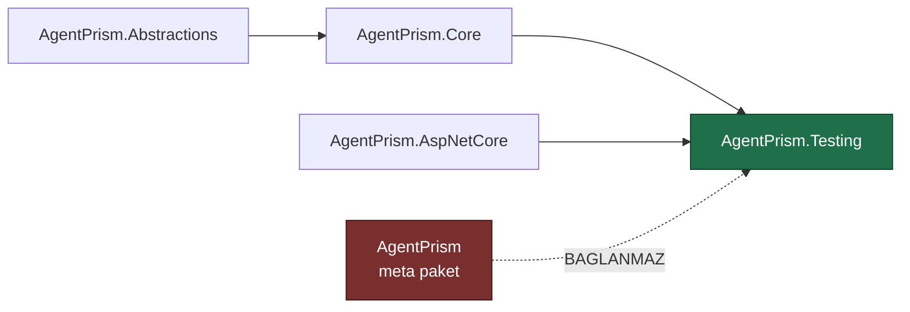

# Faz 39 — `AgentPrism.Testing` Paketi

> **Durum:** ✅ Tamamlandı (2026-08-06)
> **Kaynak:** [ADAYLAR.md](../../ADAYLAR.md) · **F-46**
> **Önkoşul:** Yok
> **Paketler:** `AgentPrism.Testing` (**yeni**), `AgentPrism.Abstractions`, `.Core`, `.AspNetCore`
> **Yeni paket:** **`AgentPrism.Testing`** — K-007 gerekçesi [39.1](#391--k-007-gerekçesi-neden-ayrı-bir-paket) · **Migration:** Yok
> **Public API:** büyüyor — 🚨 **bir kez doğru yapılmalıdır**; kırılırsa tüketicinin **tüm test paketi** kırılır

---

## Bu Faza Başlarken

> `faz-baslangic` skill'ini uygula. Aşağıdaki liste o skill'in 2. adımıdır —
> **tamamını değil, yalnız işaret edilen bölümleri oku.**

1. Bu doküman
2. Kararlar — dosyanın tamamını **okuma**, yalnız bu kalemleri grep'le:
   ```bash
   grep -n "K-001\|K-007\|K-008\|K-016\|K-018\|K-218" docs/KARARLAR.md
   ```
   **K-001** (modüler paket ailesi + meta paket — yeni paketin nereye
   oturacağını belirler), **K-007** (geçişli sabitleme kapalı — yeni paketin
   bağımlılık ağırlığı **sayılır**), **K-008** (ön sürüm MAF paketi yalnız
   `AspNetCore` içinde — test paketi bu kısıta uymak zorundadır),
   **K-018** (bellek içi `store`'lar birinci sınıf implementasyondur — test
   paketinin dayandığı temel), **K-016** (public API takibi Faz 7'ye ertelendi —
   bu fazın aciliyetinin sebebi), **K-218** (🚨 tool'un gördüğü servis sağlayıcı
   boştur — sahte tool yazan tüketici bu tuzağa düşecektir).
3. Alan hafızası (bu faz iki alana dokunuyor):
   [`hafiza/test-altyapisi.md`](../../hafiza/test-altyapisi.md) (**ana kaynak** —
   bugünkü sahte sağlayıcıların nasıl kullanıldığı),
   [`hafiza/build-ve-analyzer.md`](../../hafiza/build-ve-analyzer.md) (yeni paketin
   csproj, `slnx` ve paketleme kuralları)
4. Gerektiğinde, tamamı değil ilgili bölümü:
   [`MIMARI.md`](../../MIMARI.md) — paket ailesi bölümü

---

## Amaç

AgentPrism üzerine agent yazan biri, bugün kendi agent'ını **gerçek model
çağırmadan test edemez.** Test etmek için gereken her şey bu depoda **zaten
yazılmıştır** — ama test projelerinin içine kilitlidir ve `internal`'dır.

Bu faz o kodu birleştirir, tasarlar ve yayımlar. Yeni yetenek yazılmaz; var olan
yetenek **kullanılabilir hâle** getirilir.

- **F-46** — sahte model sağlayıcısı, bellek içi `host` fixture'ı ve çalıştırma
  iddiaları taşıyan bir test paketi.

### Bugün ne çalışmıyor — doğrulanmış kanıt

Beş ayrı sahte sağlayıcı, beş ayrı test projesinde yaşıyor:

| Kanıt | Satır | Gözlem |
|---|---|---|
| [`EchoModelProvider.cs`](../tests/AgentPrism.AspNetCore.FunctionalTests/Infrastructure/EchoModelProvider.cs) | 65 | `public` ama test projesinin içinde; tüketici erişemez |
| [`EchoModelProvider.cs`](../tests/AgentPrism.PostgreSql.IntegrationTests/Infrastructure/EchoModelProvider.cs) | 65 | 🚨 **İkinci kopya ve içerik AYNI DEĞİL** — `diff` fark bildiriyor |
| [`ScriptedModelProvider.cs`](../tests/AgentPrism.Ui.E2ETests/Infrastructure/ScriptedModelProvider.cs) | 190 | `internal`; senaryolu yanıt üretir |
| [`RoutingModelProvider.cs`](../tests/AgentPrism.AspNetCore.FunctionalTests/Infrastructure/RoutingModelProvider.cs) | 171 | `internal`; model adına göre yönlendirir |
| [`FakeModelProvider.cs`](../../../tests/AgentPrism.Core.UnitTests/Fakes/FakeModelProvider.cs) | 32 | `internal`; en yalın |
| [`AgentPrismTestHost.cs`](../../../tests/AgentPrism.AspNetCore.FunctionalTests/Infrastructure/AgentPrismTestHost.cs) | — | `StartAsync(…)` bellek içi bir host kurar. **Tüketicinin en çok isteyeceği tip budur ve erişilemez** |

Toplam **523 satır** kopyalanmış ve ayrışmış sahte sağlayıcı kodu.

Uygulanması gereken sözleşme ise küçüktür — üç üye:

```csharp
public interface IModelProvider
{
    string Name { get; }
    IReadOnlyList<ModelDescriptor> Models { get; }
    IChatClient CreateChatClient(ModelBinding binding);
}
```

> Kanıtlar 2026-08-06 tarihinde doğrulandı.

**Sorun bir yetenek eksikliği değildir; bir paketleme eksikliğidir.**

---

## 39.1 — K-007 gerekçesi: neden ayrı bir paket

K-007 her yeni pakette bir gerekçe ister. Gerekçe tek cümledir:

> **Test bağımlılığı üretim bağımlılık grafiğine girmemelidir.**

Sahte sağlayıcıyı `AgentPrism.Core` içine koymak, her üretim uygulamasına test
kodu taşırdı. `AgentPrism.Testing` tüketicinin yalnızca test projesinden
referans verdiği bir pakettir.

🚨 **Meta paket bu paketi taşımaz.** [`AgentPrism.csproj`](../../../src/AgentPrism/AgentPrism.csproj)
bugün altı proje referansı taşıyor; `AgentPrism.Testing` **eklenmez**. Meta
paket "tek referansla her şey" sözü verir ve test kodu o "her şey"in içinde
değildir.

### Bağımlılık yönü

`DependencyDirectionTests` dört kuralı zorluyor: izin verilen referanslar,
`Abstractions`'ın hiçbir AgentPrism paketine referans vermemesi, grafikte döngü
olmaması ve **her yayımlanabilir pakette README bulunması.** Yeni paket bu
kayıt defterine eklenir.



`AgentPrism.AspNetCore`'a bağlanmak bir karardır ve gerekçesi şudur: tüketicinin
en çok isteyeceği tip bellek içi `host` fixture'ıdır ve o, uçları kuran paketi
gerektirir.

> 🚨 **K-008 kısıtı burada geçerlidir.** `AgentPrism.AspNetCore` ön sürüm MAF
> paketleri taşıyabilen tek pakettir. `AgentPrism.Testing` ona bağlandığı için
> o ön sürüm bağımlılıkları **geçişli olarak** devralır. Bu kabul edilebilir —
> test paketi zaten üretim grafiğinde değildir — ama devir notunda yazılmalıdır.

## 39.2 — Çerçeveden bağımsızlık

Paket **hiçbir test çerçevesine bağlanmaz.** xunit, NUnit, MSTest, Shouldly,
FluentAssertions — hiçbiri `PackageReference` olmaz.

| Neden |
|---|
| Tüketici hangi çerçeveyi kullanırsa kullansın paket çalışır |
| K-007'nin saydığı geçişli ağırlık sıfır kalır |
| `Microsoft.AspNetCore.Mvc.Testing` deseninin aynısı — o da çerçeve seçmez |

İddialar başarısız olduğunda kendi istisnasını fırlatır:

```csharp
public sealed class AgentPrismAssertionException : AgentPrismException
```

Her test çerçevesi fırlatılan istisnayı başarısızlık sayar. Mesaj **ne
beklendiğini ve ne bulunduğunu** yazar; yığın izi tek başına yeterli değildir.

> Bu depo kendi testlerinde xunit + Shouldly kullanmaya devam eder. Paket bunu
> tüketiciye dayatmaz.

## 39.3 — Üç yetenek

### (a) Sahte model sağlayıcısı

Beş kopya tek bir yapılandırılabilir tipte birleşir. Bugünkü beş davranışın
tamamı korunur:

| Bugünkü kopya | Yeni karşılığı |
|---|---|
| `FakeModelProvider` (32 satır) | Varsayılan kurulum |
| `EchoModelProvider` (65 satır ×2) | `EchoesUserMessage()` |
| `ScriptedModelProvider` (190 satır) | `RespondsWith(…)` sırası |
| `RoutingModelProvider` (171 satır) | `ForModel("x").RespondsWith(…)` |
| — | `CallsTool("ad", args)` — tool çağrısı üretimi |

🚨 **İki `EchoModelProvider` kopyası aynı değildir.** Birleştiren oturum
`diff` çıktısını okumalı ve **hangi davranışın doğru olduğuna** karar
vermelidir. Sessizce birini seçmek, bugün geçen bir testi kıran en olası
yoldur.

### (b) Bellek içi `host` fixture'ı

`AgentPrismTestHost.StartAsync(…)` deseni public bir tipe taşınır. Tüketici
kendi agent'ını, kendi tool'larını ve kendi tanımlarını kaydeder; gerçek uçlar
üzerinden HTTP ile konuşur.

Bellek içi `store`'lar K-018 sayesinde **birinci sınıf implementasyondur** —
fixture bir veritabanı gerektirmez.

### (c) Çalıştırma iddiaları

`RunRecord` ve `run_events` zaten her şeyi kaydediyor. İddialar o kayıtları
okur:

```csharp
run.ShouldHaveCompleted();
run.ShouldHaveCalledTool("refund_order");
run.ShouldHaveCalledTool("refund_order", times: 1);
run.ShouldNotHaveCalledTool("delete_account");
run.ShouldHaveFailedWith("content_filtered");
```

Son satır Faz 26'nın `AgentPrismContentFilteredException.ContentFilteredErrorType`
kararlı adına dayanır — kararlı ad tam olarak bunun için vardı.

## 39.4 — K-218 tuzağı paketin dokümanına girer

`MEMORY.md` ve K-218 şunu kaydediyor: **tool'un gördüğü servis sağlayıcı
boştur.** MAF `AIFunctionArguments.Services` olarak `EmptyServiceProvider`
geçirir; bir tool bağımlılığını **kurulum anında** almalıdır.

Test paketi yazan tüketici bu tuzağa **kesinlikle** düşecektir: sahte bir tool
yazacak, DI'dan bir bağımlılık bekleyecek ve `null` alacaktır. Paketin README'si
ve fixture'ın XML dokümanı bunu açıkça yazar ve doğru deseni gösterir
(`new BenimTool(provider)` + fabrika kaydı).

> Faz 28'in ikinci dersi de buraya yazılır: **izole ölçüm entegre davranışı
> kanıtlamaz.** Test paketi gerçek boru hattını kurar, ayrı bir prob değildir.

---

## Planlanan Public API

> Taslak imzalardır. Gerçekleşen imzalar kapanışta ayrı bir bölüme yazılır.

```csharp
// AgentPrism.Testing

/// <summary>Aga cikmayan, yapilandirilabilir sahte model saglayicisi.</summary>
public sealed class FakeModelProvider : IModelProvider, IDisposable
{
    public FakeModelProvider(string name = "fake");

    public string Name { get; }
    public IReadOnlyList<ModelDescriptor> Models { get; }

    /// <summary>Bu saglayiciya bir model tanimlar.</summary>
    public FakeModelProvider WithModel(ModelDescriptor descriptor);

    /// <summary>Sirayla dondurulecek yanitlari ekler.</summary>
    public FakeModelProvider RespondsWith(params string[] responses);

    /// <summary>Gelen son kullanici mesajini yankilar.</summary>
    public FakeModelProvider EchoesUserMessage();

    /// <summary>Bir tool cagrisi uretir.</summary>
    public FakeModelProvider CallsTool(string toolName, object? arguments = null);

    /// <summary>Belirli bir model adi icin ayri davranis tanimlar.</summary>
    public FakeModelProvider ForModel(string modelId, Action<FakeModelProvider> configure);

    /// <summary>Saglayiciya ulasan istekler; en yeni sonuncudur.</summary>
    public IReadOnlyList<FakeModelRequest> Requests { get; }

    public IChatClient CreateChatClient(ModelBinding binding);
    public void Dispose();
}

/// <summary>Sahte saglayiciya ulasan tek bir istek.</summary>
public sealed record FakeModelRequest
{
    public required IReadOnlyList<ChatMessage> Messages { get; init; }
    public ChatOptions? Options { get; init; }
    public bool IsStreaming { get; init; }
}

/// <summary>Bellek ici AgentPrism host'u.</summary>
public sealed class AgentPrismTestHost : IAsyncDisposable
{
    public static ValueTask<AgentPrismTestHost> StartAsync(
        Action<AgentPrismTestHostOptions>? configure = null,
        CancellationToken cancellationToken = default);

    /// <summary>Host'a baglı HTTP istemcisi.</summary>
    public HttpClient Client { get; }

    /// <summary>Host'un servis saglayicisi.</summary>
    public IServiceProvider Services { get; }

    /// <summary>Bir agent'i calistirir ve kaydini dondurur.</summary>
    public ValueTask<RunAssertions> RunAsync(
        string agentName,
        string message,
        CancellationToken cancellationToken = default);

    public ValueTask DisposeAsync();
}

/// <summary>Kaydedilmis bir calistirma uzerinde iddialar.</summary>
public sealed class RunAssertions
{
    public RunRecord Record { get; }
    public IReadOnlyList<RunEvent> Events { get; }
    public IReadOnlyList<ToolInvocationRecord> ToolInvocations { get; }

    public RunAssertions ShouldHaveCompleted();
    public RunAssertions ShouldHaveFailed();
    public RunAssertions ShouldHaveFailedWith(string errorType);
    public RunAssertions ShouldHaveCalledTool(string toolName, int? times = null);
    public RunAssertions ShouldNotHaveCalledTool(string toolName);
    public RunAssertions ShouldHaveOutputContaining(string text);
}

/// <summary>Iddia karsilanmadiginda firlatilir.</summary>
public sealed class AgentPrismAssertionException : AgentPrismException;
```

> 🚨 Bu yüzeyin tamamı Faz 7'den **önce** yayımlanmalıdır. Bir test yardımcısı
> API'sini kırmak, tüketicinin tek bir testini değil **tüm test paketini**
> kırar — üretim API'sini kırmaktan daha görünür bir hatadır.

### HTTP `endpoint`'leri

Yok. Bu faz uç eklemez.

### Arayüz payı

**Yok.** Arayüze dokunulmaz.

---

## Planlanan Dosya Listesi

```
src/AgentPrism.Testing/
├── AgentPrism.Testing.csproj
├── README.md                       (DependencyDirectionTests bunu ZORUNLU kilar)
├── FakeModelProvider.cs
├── FakeModelRequest.cs
├── Internal/FakeChatClient.cs
├── AgentPrismTestHost.cs
├── AgentPrismTestHostOptions.cs
├── RunAssertions.cs
└── AgentPrismAssertionException.cs

tests/AgentPrism.Testing.UnitTests/      (YENI test projesi)
└── ...

AgentPrism.slnx                          (yeni proje + yeni test projesi)
README.md                                (paket tablosuna bir satir)
tests/AgentPrism.Core.UnitTests/Architecture/DependencyDirectionTests.cs
                                         (AllowedReferences'a yeni kayit)
```

### Kaldırılan kopyalar

```
tests/AgentPrism.AspNetCore.FunctionalTests/Infrastructure/EchoModelProvider.cs     SILINIR
tests/AgentPrism.PostgreSql.IntegrationTests/Infrastructure/EchoModelProvider.cs    SILINIR
tests/AgentPrism.AspNetCore.FunctionalTests/Infrastructure/RoutingModelProvider.cs  SILINIR
tests/AgentPrism.Ui.E2ETests/Infrastructure/ScriptedModelProvider.cs                SILINIR
tests/AgentPrism.Core.UnitTests/Fakes/FakeModelProvider.cs                          SILINIR
```

> 🚨 **Kopyaları silmek bu fazın işidir, sonraki fazın değil.** Depoda hem yeni
> paket hem eski kopyalar kalırsa ikisi ayrışır ve bugünkü sorun büyür.
> `MEMORY.md`'nin kopya dosya dersi bunun kardeşidir.

---

## Testler

| Test sınıfı | Neyi doğrular |
|---|---|
| `FakeModelProviderTests` | Beş davranışın (varsayılan, echo, senaryo, yönlendirme, tool çağrısı) her biri |
| `FakeModelProviderRequestTests` | `Requests` gelen mesajları ve `ChatOptions`'ı doğru kaydeder |
| `AgentPrismTestHostTests` | Host açılır, `/api/meta` yanıt verir, `DisposeAsync` kaynakları bırakır |
| `RunAssertionsTests` | Her iddia hem geçen hem **düşen** yolda doğrulanır; düşen yol mesajı beklenen ve bulunan değeri yazar |
| `RunAssertionsToolTests` | `ShouldHaveCalledTool(times:)` sayıyı doğru sayar |
| `TestingPackageDependencyTests` | 🚨 `AgentPrism.Testing` hiçbir test çerçevesine referans vermez; **meta paket ona referans vermez** |
| `DependencyDirectionTests` (mevcut) | Yeni paket kayıt defterinde; README var; grafik döngüsüz |
| Mevcut test paketlerinin **tamamı** | Kopyalar silindikten sonra yeni paketle koşar ve geçer |

---

## Açık Sorular

> Planı bloklamayan, faz uygulanırken karara bağlanacak sorular. Bloklayan
> sorular plan yazılmadan **önce** sorulur.

| # | Soru | Seçenekler | Öneri |
|---|---|---|---|
| 1 | İki `EchoModelProvider` kopyası hangi davranışta birleşsin? | A: `diff` okunur, davranış farkı bilinçli seçilir · B: fonksiyonel testlerdeki kopya esas alınır | **A.** Fark ölçülmeden seçim yapmak bugün geçen bir testi kırar. `diff` çıktısı kapanış bölümüne yazılır |
| 2 | `AgentPrismTestHost` `WebApplicationFactory` üstüne mi kurulsun? | A: hayır, kendi `IHost`'unu kurar · B: evet | **A.** B, `Microsoft.AspNetCore.Mvc.Testing` bağımlılığı getirir ve tüketiciyi bir test barındırma modeline bağlar. K-007'nin saydığı ağırlık artar |
| 3 | `RunAssertions` akışlı (`streaming`) çalıştırmaları da kapsasın mı? | A: evet, aynı kayıt okunur · B: hayır | **A.** `run_events` akışlı yolda da dolar; ayrı bir tip gereksizdir |
| 4 | Sahte **voice** sağlayıcısı (`StubVoiceProvider`) bu pakete girsin mi? | A: bu fazda hayır · B: evet | **A.** `AgentPrism.Voice` ayrı bir pakettir; test paketini ona bağlamak grafiği büyütür. Ayrı bir aday kalemdir |
| 5 | Paket AOT uyumlu işaretlensin mi? | A: **ölçülmeli** · B: hayır | **A.** Test paketi üretimde çalışmaz, ama `AgentPrism.AspNetCore` bağımlılığı duruşu belirler. Uygulayan oturum ölçer ve yazar |

---

## Bitiş Ölçütleri (DoD)

- [x] `AgentPrism.Testing` paketlenir; `nuspec` **hiçbir test çerçevesi**
      bağımlılığı taşımaz (`dotnet pack` çıktısı okunarak doğrulanır)
- [x] Meta paket `AgentPrism` bu pakete referans **vermez**
- [x] Beş sahte sağlayıcı kopyasının **hepsi silindi** — 🚨 **bir istisna
      dışında**: `tests/AgentPrism.Core.UnitTests/Fakes/FakeModelProvider.cs`
      bilinçli olarak KORUNDU (K-271, gerekçe "Plandan Sapmalar"da)
- [x] Mevcut test paketlerinin tamamı yeni paketle koşar ve geçer —
      `SqlServer.IntegrationTests` **hariç** (bu ortamda ARM64 Docker'da
      `mssql/server` imajı zaten çalışmıyor, README'de önceden belgeli,
      Faz 39 ile ilgisiz)
- [x] Depo dışından bir tüketici senaryosu çalıştı: `samples/` altında veya
      geçici bir projede, AgentPrism'e bağlı bir agent **gerçek model
      çağırmadan** test edildi; komut ve çıktı bu belgeye yazıldı
- [x] Her iddia hem geçen hem düşen yolda test edildi; düşen yol mesajı
      **beklenen ve bulunan** değeri içeriyor
- [x] `DependencyDirectionTests` yeni paketi tanıyor ve README denetimi geçiyor
- [x] 🚨 K-218 tuzağı paketin README'sinde ve fixture XML dokümanında yazılı
- [x] Dört doğrulama kapısı sıfır uyarı verir
- [x] `samples/AgentPrism.Api` ile gerçek `run` yapıldı, çıktı bu belgeye yazıldı
- [x] `secret` taraması boş döndü

### Doğrulama komutları — gerçek çıktı

```bash
$ dotnet pack src/AgentPrism.Testing -c Release --no-build
$ unzip -p artifacts/package/release/AgentPrism.Testing.0.0.0-preview.0.41.nupkg \
  AgentPrism.Testing.nuspec | grep -A5 "<dependencies>"
    <dependencies>
      <group targetFramework="net10.0">
        <dependency id="AgentPrism.AspNetCore" version="0.0.0-preview.0.41" exclude="Build,Analyzers" />
        <dependency id="AgentPrism.Core" version="0.0.0-preview.0.41" exclude="Build,Analyzers" />
        <dependency id="Microsoft.AspNetCore.TestHost" version="10.0.10" exclude="Build,Analyzers" />
      </group>
    </dependencies>
# Hicbir test cercevesi (xunit/NUnit/MSTest/Shouldly/FluentAssertions) YOK.

$ grep -c "AgentPrism.Testing" src/AgentPrism/AgentPrism.csproj
0

$ find tests -name "EchoModelProvider.cs" -o -name "ScriptedModelProvider.cs" \
  -o -name "RoutingModelProvider.cs" -o -name "FakeModelProvider.cs"
tests/AgentPrism.Core.UnitTests/Fakes/FakeModelProvider.cs
# Tek sonuc — K-271'in bilincli istisnasi. EchoModelProvider (x2),
# ScriptedModelProvider, RoutingModelProvider SILINDI (boş dönüyorlardı).

$ find src/AgentPrism.Testing -name "* 2.*"
# (bos)

$ grep -rIn -E "sk-[a-z]+-[A-Za-z0-9_-]{24,}|AVNS_[A-Za-z0-9]{12,}|(Password|pwd)=[^ \";']{6,}" . \
  --exclude-dir=.git --exclude-dir=artifacts --exclude-dir=node_modules
# (bos)
```

### Test sayıları (gerçek çalıştırma)

| Proje | Sonuç | Not |
|---|---|---|
| `AgentPrism.Testing.UnitTests` (**yeni**) | 32/32 ✅ | Paketin kendi testleri |
| `AgentPrism.Core.UnitTests` | 576/576 ✅ | `DependencyDirectionTests` dahil |
| `AgentPrism.AspNetCore.FunctionalTests` | 319/319 ✅ | `EchoModelProvider`+`RoutingModelProvider` göçü |
| `AgentPrism.PostgreSql.IntegrationTests` | 505/505 ✅ | Gerçek Postgres container (Testcontainers) |
| `AgentPrism.Sqlite.IntegrationTests` | 255/255 ✅ | |
| `AgentPrism.Ui.E2ETests` (Playwright) | 41/41 ✅ | `ScriptedModelProvider` göçü |
| `AgentPrism.SqlServer.IntegrationTests` | ⚠️ atlandı | Bu makinede `mssql/server` ARM64 Docker'da hazır olmuyor (önceden bilinen ortam kısıtı, bu fazla ilgisiz) |
| `Anthropic`/`Google`/`Azure`/`OpenAI`/`Voice`/`Workflows`/`Mcp`.UnitTests | 331/331 ✅ | Faz 39'a dokunulmadı, regresyon sıfır |
| `AgentPrism.Templates.Tests` | 10/10 ✅ | Bu oturumun ayrı bir düzeltmesiyle ilgili (bkz. altta) |

**Depo dışı tüketici senaryosu** (gerçek çıktı):

```bash
$ mkdir /tmp/faz39-consumer-check && cd /tmp/faz39-consumer-check
# NuGet.config: agentprism-local -> artifacts/package/release
$ dotnet test
Passed! - Failed: 0, Passed: 1, Skipped: 0, Total: 1, Duration: 848ms - Consumer.dll (net10.0|arm64)
```

Test: `FakeModelProvider().CallsTool("get_order_status", ...).EchoesUserMessage()`
+ `AgentPrismTestHost.RunAsync("support", "ORD-7 nerede?")` →
`ShouldHaveCompleted().ShouldHaveCalledTool(...).ShouldHaveOutputContaining("Echo:")`
— **hiçbir gerçek model çağrılmadı.** Bu adım gerçek bir hata yakaladı: bkz.
"Plandan Sapmalar".

**`samples/AgentPrism.Api` gerçek çalıştırma:**

```bash
$ curl -s http://localhost:5081/agentprism/api/meta
{"version":"0.0.0-preview.0.41","prefix":"/agentprism", ...}
$ curl -s -o /dev/null -w "%{http_code}\n" http://localhost:5081/agentprism/api/agents
200
```

---

## Riskler

| Risk | Önlem |
|------|-------|
| 🚨 Public test API'si kırılırsa tüketicinin **tüm** test paketi kırılır | Faz 7'den **önce** yayımlanır; her tip ve üye kapanışta gözden geçirilir |
| İki `EchoModelProvider` farkı sessizce kaybolur ve bir test kırılır | Açık Soru 1; `diff` çıktısı okunur ve karar kapanışa yazılır |
| Yeni paket geçişli bağımlılık getirir | `nuspec` DoD'de **okunarak** doğrulanır; çerçeveden bağımsızlık kuralı bunu sıfırda tutar |
| 🚨 `AgentPrism.AspNetCore` üzerinden ön sürüm MAF bağımlılığı geçişli gelir (K-008) | Kabul edilir — test paketi üretim grafiğinde değildir — ama devir notunda **yazılır** |
| Meta pakete yanlışlıkla eklenir | `TestingPackageDependencyTests` bunu bir testle kapatır |
| Kopyalar silinmeden yeni paket eklenir; ikisi ayrışır | Silme DoD kalemidir ve `find` komutuyla doğrulanır |
| 🚨 Tüketici sahte tool yazar, DI bağımlılığı `null` gelir (K-218) | README ve XML dokümanı doğru deseni gösterir; bir örnek test bunu kanıtlar |

---

<!-- ============================================================
     AŞAĞISI KAPANIŞTA DOLDURULUR — `faz-tamamlama` skill'i.
     Plan anında boş kalır. Başlıkları SİLME.
     ============================================================ -->

## Plandan Sapmalar

**Açık Soru 1 çözüldü — İki `EchoModelProvider` kopyası arasındaki fark:**
`diff` tek bir satır fark gösterdi — **yalnızca namespace bildirimi**
(`AgentPrism.AspNetCore.FunctionalTests.Infrastructure` vs
`AgentPrism.PostgreSql.IntegrationTests.Infrastructure`). Davranış birebir
aynıydı; Seçenek A (diff okunup bilinçli seçim yapılır) mekanik olarak
uygulandı, davranış farkı yoktu.

**Açık Soru 2, 3, 5 plandaki önerilerle aynen kapandı:** `AgentPrismTestHost`
kendi `IHost`'unu kurar (B değil A); `RunAssertions` akışlı çalıştırmaları da
kapsar (`run_events` aynı okunur); paket AOT uyumlu **değildir** (ölçüldü —
`FakeModelProvider.CallsTool` anonim tip özelliklerini yansıma ile okur,
`AgentPrismTestHost` JSON (de)serileştirmesi kaynak üreteci bağlamı taşımaz).
Açık Soru 4 (ses sağlayıcısı) plandaki gibi bu fazın dışında bırakıldı.

**Tasarım sapması — `FakeModelProvider` mesaj-geçmişi tarayan bir "akıllı"
saglayici DEĞİL, saglayicinin KENDİSİNDE tutulan bir kuyruktur:**
`RoutingModelProvider`/`ScriptedModelProvider` hangi tool'un zaten
çağrıldığını mesaj geçmişindeki `FunctionCallContent`/`FunctionResultContent`
çiftlerini korele ederek çıkarıyordu. Bu mantığı genellemek yerine, her model
kendi `Queue<FakeStep>`'ini taşır (`ForModel(id, cfg => ...)`); bir çağrı
sıradaki adımı çöker, kuyruk tükendiğinde `EchoesUserMessage()`/
`EchoesLastToolResult(prefix)` devreye girer. Bu, planın "Planlanan Public
API" taslağında YOKTU (`EchoesLastToolResult` ve `RespondsWith(text, tokens,
tokens)` yeni eklendi) — gerekçe K-269.

**Kaldırılan kopyalar listesi bir istisnayla uygulandı — `tests/AgentPrism.Core.UnitTests/Fakes/FakeModelProvider.cs`
SİLİNMEDİ:** plan bu dosyayı da listeye yazıyordu ama inceleme, 27 çağrı
yerinin 20'den fazlasının **argümanlı bir `IChatClient`** (derleyici/kayıt
zincirinin internallerini beyaz-kutu test eden) geçirdiğini gösterdi — yeni
paketin sıralı-kuyruk tasarımıyla karşılanamayan bir kullanım biçimi.
Gerekçe ve kullanıcıyla görüşme K-271'dedir.

**`RunAssertions.ShouldHaveOutputContaining` planın öngörmediği bir hata
içeriyordu, depo dışı tüketici senaryosu tarafından yakalandı:** ilk
uygulama yalnız `RunEventType.MessageCompleted` olaylarına bakıyordu; bu
olay tipi **yalnız akışsız `agent.RunAsync()` yolunda** yazılır.
`AgentPrismTestHost.RunAsync` HTTP `/run` (SSE, akışlı) kullandığı için
gerçek dünyadaki HER çağrı boş çıktı görüyordu — depo İÇİ testler bunu
kaçırdı çünkü hiçbiri bu iddiayı akışlı bir HTTP çağrısına karşı
çalıştırmıyordu. Düzeltme ve tam ders `docs/hafiza/cekirdek-calistirma.md`
ve `docs/hafiza/test-altyapisi.md`'dedir.

**Templates.Tests hız sorunu (bu fazın kapsamı DIŞINDA ama aynı oturumda
düzeltildi):** kullanıcı "Templates.Tests çok geç bitiyor (~1 saat)" diye
başladı; kök neden `TemplateFixture`'ın tam çözümü paketlemesiydi (13
gereksiz test projesi dahil). Düzeltme (`AgentPrism.src.slnf`) K-268'dedir;
Faz 39'un kendisiyle ilgisi yoktur ama aynı oturumda, Faz 39'a başlamadan
önce yapıldı.

## Bu Fazda Verilen Kararlar

- **K-268** — `TemplateFixture` tam çözüm yerine `AgentPrism.src.slnf` paketler (Templates.Tests hızı, Faz 39 kapsamı dışı)
- **K-269** — `FakeModelProvider` modele özel, bir kez tüketilen kuyruk tutar; `EchoesLastToolResult` eklendi
- **K-270** — `AgentPrism.Testing` yalnız `net10.0` hedefler (`Microsoft.AspNetCore.TestHost` sürüm kısıtı)
- **K-271** — Core.UnitTests'in kendi `FakeModelProvider`'ı silinmedi (27 çağrının çoğu argümanlı `IChatClient` gerektiriyor)

## Gerçekleşen Public API

Plandaki taslakla neredeyse birebir; farklar **kalın** yazıldı.

```csharp
// AgentPrism.Testing

public sealed class FakeModelProvider : IModelProvider, IDisposable
{
    public FakeModelProvider(string name = "fake");

    public string Name { get; }
    public IReadOnlyList<ModelDescriptor> Models { get; }
    public IReadOnlyList<FakeModelRequest> Requests { get; }

    public FakeModelProvider WithModel(ModelDescriptor descriptor);
    public FakeModelProvider RespondsWith(params string[] responses);
    // YENİ — planda yoktu: maliyet/kullanım metriklerini uctan uca test etmek icin.
    public FakeModelProvider RespondsWith(string response, int inputTokens, int outputTokens);
    public FakeModelProvider EchoesUserMessage();
    // YENİ — planda yoktu: nihai yanıtın GERÇEKTEN son tool sonucuna bağlı
    // olması gereken senaryolar (ör. alt agent'a devir) için.
    public FakeModelProvider EchoesLastToolResult(string prefix = "", int? inputTokens = null, int? outputTokens = null);
    public FakeModelProvider CallsTool(string toolName, object? arguments = null);
    public FakeModelProvider ForModel(string modelId, Action<FakeModelProvider> configure);

    public IChatClient CreateChatClient(ModelBinding binding);
    public void Dispose();
}

public sealed record FakeModelRequest
{
    public required IReadOnlyList<ChatMessage> Messages { get; init; }
    public ChatOptions? Options { get; init; }
    public bool IsStreaming { get; init; }
}

public sealed class AgentPrismTestHost : IAsyncDisposable
{
    public static ValueTask<AgentPrismTestHost> StartAsync(
        Action<AgentPrismTestHostOptions>? configure = null,
        CancellationToken cancellationToken = default);

    public HttpClient Client { get; }
    public IServiceProvider Services { get; }

    public ValueTask<RunAssertions> RunAsync(
        string agentName,
        string message,
        CancellationToken cancellationToken = default);

    public ValueTask DisposeAsync();
}

public sealed class AgentPrismTestHostOptions
{
    public FakeModelProvider ModelProvider { get; set; } // varsayilan: EchoesUserMessage()
    public Action<IAgentPrismBuilder>? ConfigureAgentPrism { get; set; }
    public Action<AgentPrismEndpointOptions>? ConfigureEndpoints { get; set; }
    public Action<IServiceCollection>? ConfigureServices { get; set; }
    public string Prefix { get; set; } // varsayilan: "/agentprism"
}

public sealed class RunAssertions
{
    public RunRecord Record { get; }
    public IReadOnlyList<RunEvent> Events { get; }
    public IReadOnlyList<ToolInvocationRecord> ToolInvocations { get; }

    public RunAssertions ShouldHaveCompleted();
    public RunAssertions ShouldHaveFailed();
    public RunAssertions ShouldHaveFailedWith(string errorType);
    public RunAssertions ShouldHaveCalledTool(string toolName, int? times = null);
    public RunAssertions ShouldNotHaveCalledTool(string toolName);
    public RunAssertions ShouldHaveOutputContaining(string text);
}

public sealed class AgentPrismAssertionException : AgentPrismException;
```

## Dosya Listesi (gerçekleşen)

```
src/AgentPrism.Testing/
├── AgentPrism.Testing.csproj
├── README.md
├── PublicAPI.Shipped.txt
├── PublicAPI.Unshipped.txt
├── FakeModelProvider.cs
├── FakeModelRequest.cs
├── AgentPrismTestHost.cs
├── AgentPrismTestHostOptions.cs
├── RunAssertions.cs
├── AgentPrismAssertionException.cs
└── Internal/
    ├── FakeChatClient.cs
    ├── FakeModelScript.cs         (FakeStep, FakeUsage, FakeFallbackKind de burada)
    └── SseReader.cs

tests/AgentPrism.Testing.UnitTests/   (YENİ, 32 test)
├── AgentPrism.Testing.UnitTests.csproj
├── FakeModelProviderTests.cs
├── FakeModelProviderRequestTests.cs
├── AgentPrismTestHostTests.cs
├── RunAssertionsTests.cs
├── RunAssertionsToolTests.cs
└── TestingPackageDependencyTests.cs

AgentPrism.slnx                          (yeni proje + yeni test projesi)
AgentPrism.src.slnf                      (YENİ — planda yoktu, K-268)
README.md                                (paket tablosu satırı + hedef framework notu)
tests/AgentPrism.Core.UnitTests/Architecture/DependencyDirectionTests.cs
                                          (AllowedReferences + mermaid yorum güncellendi)
```

### Kaldırılan kopyalar (gerçekleşen)

```
tests/AgentPrism.AspNetCore.FunctionalTests/Infrastructure/EchoModelProvider.cs     SİLİNDİ
tests/AgentPrism.PostgreSql.IntegrationTests/Infrastructure/EchoModelProvider.cs    SİLİNDİ
tests/AgentPrism.AspNetCore.FunctionalTests/Infrastructure/RoutingModelProvider.cs  SİLİNDİ
tests/AgentPrism.Ui.E2ETests/Infrastructure/ScriptedModelProvider.cs                SİLİNDİ
tests/AgentPrism.Core.UnitTests/Fakes/FakeModelProvider.cs                          KORUNDU (K-271)
```

### Göçürülen tüketici dosyaları

```
tests/AgentPrism.AspNetCore.FunctionalTests/Infrastructure/AgentPrismTestHost.cs  (varsayılan saglayici)
tests/AgentPrism.AspNetCore.FunctionalTests/StreamingTests.cs
tests/AgentPrism.AspNetCore.FunctionalTests/AttachmentRunTests.cs
tests/AgentPrism.AspNetCore.FunctionalTests/OpenAICompatTests.cs
tests/AgentPrism.AspNetCore.FunctionalTests/AgentDelegationTests.cs   (RoutingModelProvider -> ForModel)
tests/AgentPrism.PostgreSql.IntegrationTests/ServiceRegistrationTests.cs
tests/AgentPrism.PostgreSql.IntegrationTests/SessionPersistenceTests.cs
tests/AgentPrism.Ui.E2ETests/Infrastructure/UiHost.cs                 (ScriptedModelProvider -> ForModel, 3 model)
tests/AgentPrism.Ui.E2ETests/UiTests.cs                                (4 sabit referansi)
```

## Sonraki Faza Devir Notu

**Devralınan sözleşmeler:**
- `AgentPrism.Testing.FakeModelProvider`/`AgentPrismTestHost`/`RunAssertions`
  public API'si Faz 7'den önce yayımlandı; kırılması tüketicinin **tüm test
  paketini** kırır (K-016 aciliyeti burada da geçerli).
- `AgentPrism.Testing`, `AgentPrism.AspNetCore` üzerinden K-008'in ön sürüm
  MAF paketlerini (`Microsoft.Agents.AI.Hosting` preview,
  `.Hosting.OpenAI` alpha) **geçişli olarak** devralır. Test paketi üretim
  bağımlılık grafiğinde olmadığı için kabul edilebilir.
- `AgentPrism.Testing` yalnız `net10.0` hedefler (K-270) — `net8.0`/`net9.0`
  hedefleyen bir tüketici bu paketi kullanamaz.

**Bilinen tuzaklar (🚨):**
- `RunEventType.MessageCompleted` yalnız akışsız `agent.RunAsync()` yolunda
  yazılır; HTTP `/run` (SSE) yalnız `MessageDelta` üretir.
  `RunAssertions.ShouldHaveOutputContaining` ikisini doğru sırayla okur
  (`MessageCompleted` varsa o, yoksa `MessageDelta` birleşimi) — yeni bir
  olay-okuyan özellik eklerken bu ayrım tekrar unutulabilir.
- `AgentPrism.Testing.AgentPrismTestHost` ile
  `AgentPrism.AspNetCore.FunctionalTests.Infrastructure.AgentPrismTestHost`
  (TestServer tabanlı, iç) **aynı adı taşır**; `using AgentPrism.Testing;`
  FunctionalTests dosyalarında `CS0104` verir — `using FakeModelProvider =
  AgentPrism.Testing.FakeModelProvider;` takma adıyla alınmalıdır.
- `Microsoft.AspNetCore.TestHost` merkezi sürümü barındırma framework'üyle
  birebir eşlenir; SDK'nın hedef .NET sürümü değiştiğinde (bugün 10.0.100)
  bu paketin sürümü de güncellenmeli, aksi hâlde `AgentPrism.Testing` eski
  bir TFM'e kilitli kalır.

**Yarım kalan işler / açık uçlar:**
- `FakeModelProvider` "custom responder" kancası **eklenmedi** (K-269'un açık
  notu). Bir tüketici tool-tamamlanma-durumuna göre dinamik dallanma
  isterse (bugün karşılaşılmadı) bu eklenir; o noktada
  `Core.UnitTests/Fakes/FakeModelProvider.cs`'in (K-271) gerçekten
  gereksizleşip gereksizleşmediği yeniden değerlendirilir.
- `AgentPrism.src.slnf` (K-268) yalnız `src/` projelerini listeler; yeni bir
  paket eklendiğinde bu dosyaya da satır eklenmesi gerekir — `dotnet pack
  AgentPrism.slnx` DoD kontrolü paket SAYISINI doğrular ama `.slnf`'in
  güncel olduğunu doğrulamaz (otomatik bir denetim yok).

**Sıradaki faz:** `docs/arsiv/UCUNCU-FAZ-YOL-HARITASI.md`'deki sıraya göre seçilir —
Faz 39 dördüncü öncelikli yeni-pakete-genişleme fazıydı; kalan adaylar
`docs/ADAYLAR.md`'dedir.
