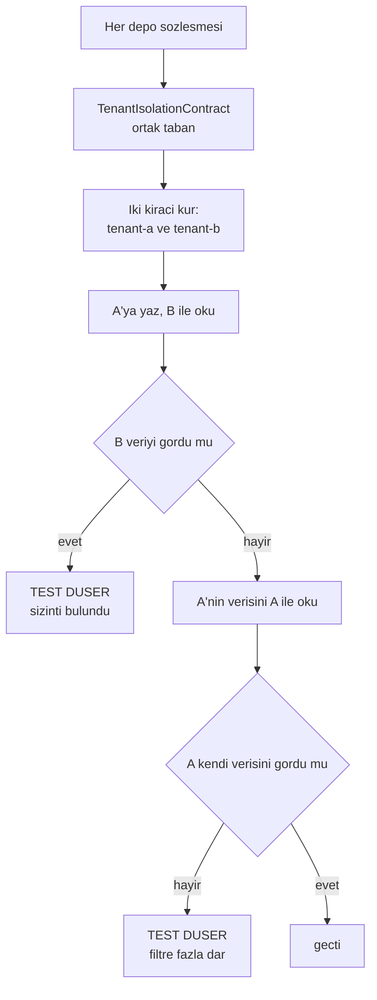

# Faz 41 — Kiracı Yalıtımının Zorlanması

> **Durum:** ✅ Tamamlandı (2026-08-07)
> **Kaynak:** [ADAYLAR.md](../../ADAYLAR.md) · **F-76**
> **Önkoşul:** Yok
> **Paketler:** `AgentPrism.Sql.Shared`, `.PostgreSql`, `.SqlServer`, `.Sqlite`, `.Core`, `.Abstractions`
> **Yeni paket:** Yok · **Migration:** 🚨 **gerekti** — üç set (PostgreSQL `0018`, SQL Server `0006`, SQLite `0006`)
> **Public API:** 🚨 **büyüdü** — `IRetentionStore`'un dört metodu `tenantId` aldı, `FixedTenantContext` eklendi
> **Seçim:** 👤 **Seçenek A — sözleşme testi kapısı** (kullanıcı kararı, 2026-08-06). Gerekçe [41.2](#412--neden-seçenek-a)

---

## Bu Faza Başlarken

> `faz-baslangic` skill'ini uygula. Aşağıdaki liste o skill'in 2. adımıdır —
> **tamamını değil, yalnız işaret edilen bölümleri oku.**

1. Bu doküman
2. Kararlar — dosyanın tamamını **okuma**, yalnız bu kalemleri grep'le:
   ```bash
   grep -n "K-013\|K-059" docs/KARARLAR.md
   sed -n '30p' docs/KARARLAR.md      # reddedilen is L30 — FK konmadi
   ```
   🚨 **L30 bir `K-` kaydı değildir.** Aday listesi buna "K-030" diyordu;
   **yanlıştır**. `tenant_id` sütunlarına yabancı anahtar konmaması
   `KARARLAR.md`'nin **reddedilen işler** bölümündedir (L30) ve K-030 bambaşka
   bir karardır (Responses API'de sunucu tarafı depolama). Ayrıntı
   [41.1](#411--düzeltilen-iki-kanıt).
   **K-013** (ayrı `agentprism` şeması), **K-059** (`secret` veritabanına
   yazılmaz — kiracı verisiyle aynı disiplin).
3. Alan hafızası (bu faz üç alana dokunuyor):
   [`hafiza/sql-saglayicilari.md`](../../hafiza/sql-saglayicilari.md) (**ana kaynak** —
   paylaşılan depo katmanı, üç diyalekt),
   [`hafiza/test-altyapisi.md`](../../hafiza/test-altyapisi.md) (sözleşme testi
   altyapısı, Testcontainers),
   [`hafiza/postgresql.md`](../../hafiza/postgresql.md) (sorgu ve indeks davranışı)
4. Gerektiğinde, tamamı değil ilgili bölümü:
   [`MIMARI.md`](../../MIMARI.md) — çok kiracılılık bölümü

---

## Amaç

Kiracı yalıtımı bugün **her sorgunun `tenant_id` filtresini hatırlamasına**
dayanıyor. Kural yazılı değildir, zorlanmaz ve tek bir unutulmuş `WHERE` bir
kiracının verisini diğerine sızdırır. Bu, çok kiracılı bir satın almada ilk
sorulan sorudur ve bugün cevabı "dikkatli yazıyoruz"dur.

Bu faz cevabı **"bir kapı zorluyor"** hâline getirir.

- **F-76** — her depo metodunun iki kiracıyla koşan bir sözleşme testi; kapsam
  boşluğunun kapatılması ve boşluğun bir daha açılmasının engellenmesi.

### Bugün ne çalışmıyor — doğrulanmış kanıt

| Kanıt | Değer | Gözlem |
|---|---|---|
| `ls src/AgentPrism.Sql.Shared/Stores/` | **22 dosya** | Her biri bir veya daha çok depo taşır |
| `grep -o "tenant_id" .../PostgresQueries.cs \| wc -l` | **262** | Elle yazılmış her filtre bir hatırlama noktasıdır |
| aynı, `SqlServerQueries.cs` | **278** | |
| aynı, `SqliteQueries.cs` | **266** | |
| `grep -rn "ROW LEVEL SECURITY" src/` | **boş** | Veritabanı düzeyinde savunma yok |
| `ls tests/Shared/Contracts/` | **18 sözleşme** | 22 depo dosyasına karşı |
| [`IsolationTests.cs:69-173`](../../../tests/AgentPrism.PostgreSql.IntegrationTests/IsolationTests.cs) | **5 test** | 🚨 Yalnız **üç** depoyu kapsıyor (agent tanımı, `run`, oturum) ve **yalnız PostgreSQL'de** koşuyor |
| `grep -rln "Isolation" tests/AgentPrism.SqlServer.IntegrationTests/ tests/AgentPrism.Sqlite.IntegrationTests/` | **boş** | 🚨 SQL Server ve SQLite'ta kiracı yalıtımı testi **hiç yok** |

Sözleşmesi **hiç olmayan** altı depo:

```
AgentFileStore          AgentSkillStore        ApprovalAndMcpStores
ChatHistoryProvider     RetentionStore         SkillScriptGrantStore
```

> Kanıtlar 2026-08-06 tarihinde doğrulandı.

**Boşluk üç katmanlıdır:** altı depo hiç sözleşme testi görmüyor; sözleşmesi
olan 18 depo yalıtımı ayrıca sınamıyor; var olan beş yalıtım testi üç sağlayıcının
yalnız birinde koşuyor.

---

## 41.1 — Düzeltilen iki kanıt

`faz-planlama`'nın 1. adımı aday listesinin iki iddiasını yanlışladı.
**Düzeltmeler burada da yazılıdır ki uygulayan oturum yanlış kanıta dayanmasın.**

| Aday listesinin iddiası | 2026-08-06 ölçümü |
|---|---|
| "`PostgresQueries.cs` içinde `tenant_id` **177 kez** geçiyor" | **Yanlış — 262 kez.** Ayrıca `SqlServerQueries.cs` 278, `SqliteQueries.cs` 266. Toplam **806** elle yazılmış filtre noktası. İddianın yönü doğru, büyüklüğü eksikti |
| "`tenants` tablosuna yabancı anahtar yok (**K-030**)" | **Kayıt numarası yanlış.** Bu bir `K-` kararı değil, `KARARLAR.md`'nin **reddedilen işler** bölümündeki **L30**'dur. K-030 bambaşka bir konudur (Responses API sunucu tarafı depolama). İddianın kendisi doğrudur: FK yoktur ve L30 bunu bilinçli bırakmıştır |

Ayrıca aday listesinin **bilmediği** bir kanıt bulundu ve bu fazın kapsamını
genişletti: `TenantIsolationTests` **vardır** ama üç depo ve tek sağlayıcı ile
sınırlıdır. Aday listesi bu testten hiç söz etmiyordu.

## 41.2 — Neden Seçenek A

Aday listesi seçimi faz dokümanına bırakmıştı. 👤 Kullanıcı **Seçenek A'yı**
seçti (2026-08-06). Gerekçeler:

| Ölçüt | Seçenek A — sözleşme testi | Seçenek B — PostgreSQL RLS |
|---|---|---|
| Üç sağlayıcı | ✅ Aynı test üçünde de koşar | 🚨 SQLite'ta RLS **yok**; davranış üç yerde ayrışır |
| Altyapı | ✅ `tests/Shared/Contracts/` hazır, 18 sözleşme × 4 koşum | Sıfırdan |
| Yeni paket | Yok | Yok |
| Risk | Yalnız **bilinen** metotları korur | Havuzlanmış bağlantıda oturum değişkeni sızıntısı |
| Bulduğu kusur | Gerçek bir kusuru **hemen** gösterir | Kusuru gizler — filtre unutulsa da RLS yakalar |

Son satır belirleyicidir. Seçenek B bir **kalkan**dır: eksik filtreyi maskeler
ve kod yanlış kalmaya devam eder. Seçenek A bir **kapı**dır: eksik filtreyi
kırmızı bir testle gösterir ve düzeltilmesini zorunlu kılar.

> Seçenek B iptal edilmedi, **ertelendi**. Derinlemesine savunma değerlidir ve
> A'nın üstüne eklenebilir. Aday listesine yeni bir kalem olarak yazılır
> ([Adım 6](#sonraki-faza-devir-notu)).

## 41.3 — Kapının tasarımı

Kapı üç parçadır.



🚨 **İkinci denetim (H) atlanamaz.** Yalnız "B görmemeli" denetlenirse, hiçbir
şey döndürmeyen kırık bir sorgu da testi geçer. İki yönlü denetim, filtrenin
hem yeterli hem de fazla dar olmadığını kanıtlar.

### (a) Ortak taban

`tests/Shared/Contracts/` altına `TenantIsolationContract` eklenir. Var olan 18
sözleşme onu miras alır veya bir yardımcı olarak kullanır. Dört koşum sınıfı
(bellek içi, PostgreSQL, SQL Server, SQLite) hiç değişmez — yeni testler
kendiliğinden dört yerde koşar.

### (b) Eksik altı sözleşme

Sözleşmesi olmayan altı depo için sözleşme yazılır. Bu, fazın **en büyük**
parçasıdır ve yalıtımdan bağımsız bir kazanç da üretir: o altı depo bugün üç
SQL sağlayıcısında hiç karşılaştırılmıyor.

> `ChatHistoryProvider` bir `store` değil bir MAF sağlayıcısıdır; sözleşmesi
> diğerlerinden farklı kurulur. Uygulayan oturum bunu ilk iş olarak ölçer.

### (c) Kapsam denetimi

En kolay kaçırılan şey, **yarın eklenecek** metodun testsiz kalmasıdır. Bir
yansıma tabanlı test bunu kapatır: `AgentPrism.Sql.Shared/Stores/` altındaki her
public depo metodu, ya yalıtım sözleşmesinde **görünmelidir** ya da açık bir
`[TenantAgnostic]` gerekçesiyle **muaf** işaretlenmelidir.

```csharp
// Muafiyet ornekleri — kiraci kavrami tasimayan metotlar
[TenantAgnostic("Migration durumu kiraci ustudur.")]
[TenantAgnostic("Is kuyrugu kiraci kimligini kaydin icinde tasir; sorgu kiraci filtrelemez.")]
```

Muafiyet **sessiz olamaz**: gerekçe yazmak zorunludur ve kod incelemesinde
görünür.

> 🚨 Bu denetim `AgentPrism.Sql.Shared`'a yansıma sokmaz. Test projesindedir;
> AOT duruşu etkilenmez.

## 41.4 — SQLite ve tek yazıcılık

SQLite üç sağlayıcıdan biridir ve testler orada da koşar. Ama bir uyarı gerekir:
SQLite tek yazıcılıdır ve çok kiracılı üretim kurulumunda kullanılmaz. Testin
orada koşması bir **regresyon kapısıdır**, bir üretim iddiası değil.

Aynı şey bellek içi `store`'lar için de geçerlidir. K-018 onları birinci sınıf
implementasyon sayar; yalıtım kuralı orada da geçerlidir ve orada da sınanır.

## 41.5 — Kusur bulunursa ne olur

**Bu faz bir kusur bulmayı bekler.** 806 elle yazılmış filtre noktası ve altı
testsiz depo varken, hepsinin doğru olması olası değildir.

Bulunan her kusur için:

| Adım | Ne yapılır |
|---|---|
| 1 | Kusur bu belgenin **Plandan Sapmalar** bölümüne yazılır — gizlenmez |
| 2 | Düzeltme aynı fazda yapılır; sonraki faza bırakılmaz |
| 3 | Kusur bir indeks veya benzersizlik kısıtı gerektiriyorsa **migration gerekir** — üç set, numaralar uygulama anında alınır (K-178) |
| 4 | Kusurun sınıfı `docs/hafiza/sql-saglayicilari.md`'ye yazılır |

> 🚨 **Bu bir güvenlik düzeltmesidir.** Bulunan bir sızıntı "sonra bakarız"
> kutusuna konmaz. Faz, kusur düzeltilmeden kapanmaz.

---

## Planlanan Public API

> Taslak imzalardır. Gerçekleşen imzalar kapanışta ayrı bir bölüme yazılır.

Public sözleşme **büyümez.** Bu faz yalnız test altyapısı ekler ve — kusur
bulunursa — var olan sorguları düzeltir.

```csharp
// tests/Shared/Contracts/TenantIsolationContract.cs   (test altyapisi, public API DEGIL)

/// <summary>
/// Bir deponun kiraci yalitimini iki yonlu sinar.
/// </summary>
public abstract class TenantIsolationContract<TStore> : IAsyncLifetime
{
    protected const string TenantA = "tenant-a";
    protected const string TenantB = "tenant-b";

    protected TStore Store { get; private set; } = default!;

    protected abstract ValueTask<TStore> CreateStoreAsync();

    /// <summary>A kiracisi icin ornek veri yazar ve anahtarini dondurur.</summary>
    protected abstract ValueTask<object> SeedAsync(string tenantId);

    [Fact] public async Task Kiraci_digerinin_verisini_okuyamaz();
    [Fact] public async Task Kiraci_kendi_verisini_okur();
    [Fact] public async Task Kiraci_digerinin_verisini_silemez();
    [Fact] public async Task Kiraci_digerinin_verisini_guncelleyemez();
    [Fact] public async Task Ayni_ad_iki_kiracida_bagimsiz_yasar();
}

/// <summary>Kiraci kavrami tasimayan bir depo metodunu muaf tutar.</summary>
[AttributeUsage(AttributeTargets.Method)]
public sealed class TenantAgnosticAttribute(string reason) : Attribute
{
    public string Reason { get; } = reason;
}
```

### HTTP `endpoint`'leri

Yok.

### Arayüz payı

**Yok.** Arayüze dokunulmaz.

---

## Planlanan Dosya Listesi

```
tests/Shared/Contracts/
├── TenantIsolationContract.cs        (YENI — ortak taban)
├── TenantAgnosticAttribute.cs        (YENI)
├── AgentFileStoreContract.cs         (YENI — eksik alti sozlesmeden)
├── AgentSkillStoreContract.cs        (YENI)
├── ApprovalStoreContract.cs          (YENI)
├── McpStoreContract.cs               (YENI)
├── ChatHistoryProviderContract.cs    (YENI — sekli OLCULMELI)
├── RetentionStoreContract.cs         (YENI)
├── SkillScriptGrantStoreContract.cs  (YENI)
└── *.cs                              (mevcut 18 sozlesme — yalitim taban sinifi eklenir)

tests/AgentPrism.PostgreSql.IntegrationTests/Contracts/PostgresStoreContractTests.cs
tests/AgentPrism.PostgreSql.IntegrationTests/Contracts/InMemoryStoreContractTests.cs
tests/AgentPrism.SqlServer.IntegrationTests/Contracts/SqlServerStoreContractTests.cs
tests/AgentPrism.Sqlite.IntegrationTests/Contracts/SqliteStoreContractTests.cs
                                      (yeni sozlesmeler icin dorder kosum sinifi)

tests/Shared/Contracts/TenantCoverageTests.cs   (YENI — yansimali kapsam denetimi)

src/AgentPrism.PostgreSql/Internal/PostgresQueries.cs    (YALNIZ kusur cikarsa)
src/AgentPrism.SqlServer/Internal/SqlServerQueries.cs    (ayni)
src/AgentPrism.Sqlite/Internal/SqliteQueries.cs          (ayni)
src/AgentPrism.Core/Storage/InMemory*.cs                 (ayni)
```

`tests/AgentPrism.PostgreSql.IntegrationTests/IsolationTests.cs` içindeki beş
`TenantIsolationTests` testi **ortak sözleşmeye taşınır**; PostgreSQL'e özgü
kalan `SchemaIsolationTests` yerinde durur.

---

## Testler

| Test sınıfı | Neyi doğrular | Koşum |
|---|---|---|
| `TenantIsolationContract<TStore>` (5 `[Fact]`) | Her depo iki kiracıyla **iki yönlü** sınanır: okuma, listeleme, silme, aynı adın bağımsız yaşaması | 23 sözleşme × 4 koşum |
| `TenantCoverageTests` (4 `[Fact]`) | 🚨 `Stores/` altındaki her public metot ya kapsam tablosunda ya `[TenantAgnostic]` gerekçesiyle muaf · gerekçe 40 karakterden uzun · kapsam tablosu bayat kayıt taşımaz · keşfin kendisi boş değil (≥20 depo) | 4 koşum |
| `AgentSkillStoreContract` · `ToolApprovalRuleStoreContract` · `McpServerStoreContract` | Üç depo üç SQL sağlayıcısında **ilk kez** karşılaştırılır; davranış + yalıtım | 4 koşum |
| `RetentionStoreContract` (5 `[Fact]`) | 🚨 K-279'un regresyon kapısı: sayım · silme · arşiv okuması · hacim eşiği yalnız verilen kiracıyı kapsar. `Silme_digerinin_verisine_DOKUNMAZ` faz öncesi **kırmızıydı** | 3 SQL koşumu |
| `AgentFileStoreContract` | Kalıcı dosya belleği: okuma, yazma, silme, varlık, listeleme, **arama** ve dizin çağrısı kiracı sınırını taşır | 3 SQL koşumu |
| `AgentDefinitionStoreContract.Kiraci_digerinin_tanimini_geri_alamaz` | `RollbackAsync` başka kiracının sürümünü geri alamaz | 4 koşum |
| `RunStoreContract.Ozet_ve_zaman_serisi_kiracilar_arasinda_sizmaz` | Özet, zaman serisi ve deney sonuçları kiracıyla sınırlı | 4 koşum |
| `EvalStoreContract.Kosu_okumalari_kiracilar_arasinda_sizmaz` | Koşu, iş kimliğinden koşu, vaka sonuçları ve koşu sorgusu | 4 koşum |
| `ExperimentStoreContract.Deney_yasam_dongusu_kiracilar_arasinda_sizmaz` | `StartAsync` · `StopAsync` · `GetRunningAsync` | 4 koşum |
| `AttachmentStoreContract.Oturum_bazli_silme_digerinin_eklerini_silmez` | `DeleteBySessionAsync` | 4 koşum |

**Ölçülen sayılar:** PostgreSQL entegrasyon **695 → 778**, SQLite **350 → 402**,
`AgentPrism.Core.UnitTests` 576, arayüz E2E 41. Toplam paket testleri
`dotnet test AgentPrism.slnx` ile yeşildir.

⚠️ SQL Server koşumu bu makinede çalışmadı (`mcr.microsoft.com/mssql/server`
yalnız `linux/amd64`); koşum sınıfları yazıldı ve derlenir.

---

## Açık Sorular — kapanıştaki cevaplar

| # | Soru | Öneri | 🔎 Gerçekleşen |
|---|------|-------|----------------|
| 1 | `ChatHistoryProvider` sözleşmesi diğerleriyle aynı şekilde mi kurulur? | A: ölçülmeli | **Kurulamaz.** `SqlChatHistoryProvider`'ın **hiç public metodu yoktur**; yalnız MAF'ın `protected override` kancalarını uygular ve bir `InvokingContext`/`AgentSession` ister. Kapsam denetiminin zorlayacağı bir yüzey yoktur; kapsam tablosunda boş küme ile durur |
| 2 | Muafiyet nasıl işaretlenir? | A: `[TenantAgnostic("gerekçe")]` | **A uygulandı**, ama öznitelik test projesinde değil `Sql.Shared/Internal/` içinde ve `internal`'dir (K-281). Ayrıca **tek başına yetmedi**: hangi metodun sözleşmede gerçekten çağrıldığı ayrıca bilinmelidir (`TenantCoverageTests.Covered`) |
| 3 | Bellek içi `store`'lar da sınansın mı? | A: evet | **A.** Ve haklı çıktı: **ilk kusur (K-277) tam oradaydı** ve en hızlı koşum onu ilk gösterdi |
| 4 | Kusur bulunursa migration gerekir mi? | A: kusura bağlı | **Gerekti.** K-278 `sessions` birincil anahtarını değiştirdi — üç set (K-178) |
| 5 | `IsolationTests.cs`'teki beş test taşınsın mı? | A: taşınır | **A.** `TenantIsolationTests` silindi; beş senaryo ortak sözleşmeye taşındı ve artık dört koşumda çalışıyor |

---

## Bitiş Ölçütleri (DoD)

| # | Ölçüt | Durum |
|---|-------|-------|
| 1 | `tests/Shared/Contracts/` altındaki **her** depo sözleşmesi kiracı yalıtımını iki yönlü sınıyor | ✅ 23 sözleşmenin tamamı `TenantIsolationContract<TStore>`'tan türer; `RetentionStoreContract` yalıtımı doğrudan sınar (veri düzleminin "kayıt" kavramı yoktur) |
| 2 | Sözleşmesi olmayan altı deponun **hepsi** sözleşme kazandı | ✅ Gerçek eksik **beşti** (`SkillScriptGrant`'ın sözleşmesi zaten vardı): `AgentSkill`, `ToolApprovalRule`, `McpServer`, `Retention`, `AgentFile`. `SqlTenantStore` gerekçesiyle muaf; `SqlChatHistoryProvider`'ın public metodu yok (ölçüldü) |
| 3 | 🚨 Kiracı yalıtım testleri **üç SQL sağlayıcısında ve bellek içi `store`'larda** koşuyor | ✅ Dört koşum. ⚠️ SQL Server'ın testleri bu makinede koşmadı — `mcr.microsoft.com/mssql/server` yalnız `linux/amd64` (bilinen tuzak, `docs/hafiza/sql-saglayicilari.md`). Kod derlenir ve koşum sınıfları yerindedir |
| 4 | `TenantCoverageTests` yeşil: testsiz veya gerekçesiz muaf metot yok | ✅ Dört test: kapsam, gerekçe uzunluğu, bayat kayıt, keşfin boş olmadığı |
| 5 | `IsolationTests.cs`'teki beş test ortak sözleşmeye **taşındı** (kopya bırakılmadı) | ✅ `TenantIsolationTests` sınıfı silindi; `SchemaIsolationTests` (PostgreSQL'e özgü) yerinde. `grep -n "class TenantIsolationTests"` boş döner |
| 6 | 🚨 Bulunan **her** kusur düzeltildi ve Plandan Sapmalar'a yazıldı | ✅ Üç kusur: K-277, K-278, K-279. Dördüncü bir boşluk bilerek açık bırakıldı ve gerekçesiyle yazıldı (K-280) |
| 7 | Yeni metodun testsiz eklenemeyeceği **kanıtlandı** | ✅ `SqlSessionStore.ProbeAsync` geçici eklendi → `Her_public_depo_metodu_ya_sinaniyor_ya_gerekceli_muaf` düştü (1 failed / 400) → metot geri alındı → 400/400 yeşil |
| 8 | Dört doğrulama kapısı sıfır uyarı verir | ✅ `dotnet build` (arayüz dâhil) 0 uyarı 0 hata · `dotnet format --verify-no-changes` temiz · `dotnet test` (aşağıda) · `dotnet pack` |
| 9 | `samples/AgentPrism.Api` ile gerçek `run` yapıldı, çıktı bu belgeye yazıldı | ✅ Yukarıdaki "Örnek uygulama ile gerçek koşum" bölümü |
| 10 | `secret` taraması boş döndü | ✅ Boş. Ayrıca `find src -name "* 2.*"` denetimi `wwwroot/` altında **üç senkronizasyon kopyası** buldu (üretilmiş, gitignore'lu) — MEMORY'nin Faz 30 tuzağı; silindi |

---

### Doğrulama komutları

```bash
# Uc saglayicida ve bellek icinde kosum
dotnet test tests/AgentPrism.PostgreSql.IntegrationTests -c Release --no-build
dotnet test tests/AgentPrism.SqlServer.IntegrationTests  -c Release --no-build
dotnet test tests/AgentPrism.Sqlite.IntegrationTests     -c Release --no-build

# Kapsam denetimi tek basina
dotnet test tests/AgentPrism.PostgreSql.IntegrationTests -c Release --no-build 2>&1 \
  | grep -i "TenantCoverage"

# Eski testler tasindi mi — TenantIsolationTests artik burada OLMAMALI
grep -n "class TenantIsolationTests" tests/AgentPrism.PostgreSql.IntegrationTests/IsolationTests.cs

# Muaf isaretli metotlarin tam listesi (gerekceleriyle)
grep -rn "TenantAgnostic(" src/AgentPrism.Sql.Shared/Stores/

# Filtre noktalarinin sayisi (kusur duzeltmesi sonrasi degisebilir)
for f in src/AgentPrism.PostgreSql/Internal/PostgresQueries.cs \
         src/AgentPrism.SqlServer/Internal/SqlServerQueries.cs \
         src/AgentPrism.Sqlite/Internal/SqliteQueries.cs; do
  printf "%s: " "$f"; grep -o "tenant_id" "$f" | wc -l
done
```

---

## Riskler

| Risk | Önlem |
|------|-------|
| 🚨 Faz gerçek bir sızıntı bulur ve kapsam büyür | **Beklenen sonuçtur.** Düzeltme aynı fazda yapılır; faz kusur düzeltilmeden kapanmaz |
| Tek yönlü test (yalnız "B görmemeli") kırık bir sorguyu geçirir | Sözleşme **iki yönlüdür**: A kendi verisini de görmelidir |
| Yeni bir depo metodu testsiz eklenir ve boşluk yeniden açılır | `TenantCoverageTests` yansımayla zorlar; muafiyet gerekçe ister |
| Muafiyet bir kaçış kapısına dönüşür | Gerekçe zorunludur ve metodun yanında durur; kod incelemesinde görünür |
| `ChatHistoryProvider` diğerlerinden farklıdır ve sözleşme kurulamaz | Açık Soru 1; uygulayan oturum imzayı ilk iş olarak ölçer |
| Testcontainers ile üç sağlayıcı koşumu yavaşlar | Bellek içi koşum en hızlısıdır ve kusuru ilk o gösterir; SQL koşumları kapanışta çalışır |
| Seçenek B (RLS) hiç yapılmaz ve derinlemesine savunma eksik kalır | B **iptal değil ertelendi**; aday listesine yeni kalem olarak yazılır |

---

<!-- ============================================================
     AŞAĞISI KAPANIŞTA DOLDURULUR — `faz-tamamlama` skill'i.
     Plan anında boş kalır. Başlıkları SİLME.
     ============================================================ -->

## Plandan Sapmalar

> Plan ile gerçek arasındaki fark **gizlenmez** — sonraki oturumun en değerli
> bilgisidir.

### Bulunan kusurlar — üç tane, üçü de düzeltildi

Faz bir kusur bekliyordu ([41.5](#415--kusur-bulunursa-ne-olur)); **üç** buldu.

| # | Kusur | Etki | Düzeltme |
|---|-------|------|----------|
| **K1** | 🚨 **Bellek içi depolarda kiracı yalıtımı hiç yoktu.** `InMemoryAgentDefinitionStore` `tenant_id` kavramını taşımıyordu; `InMemorySessionStore.GetAsync/DeleteAsync`, `InMemoryRunStore.GetRunAsync/ReadEventsAsync/ListToolInvocationsAsync` ve `InMemoryTraceStore.GetTraceByRunAsync` kiracıyı hiç okumuyordu | K-018 bellek içi depoları **birinci sınıf** sayar ve `AddAgentPrism()` onları varsayılan olarak kaydeder. Veritabanısız çok kiracılı bir kurulumda A kiracısı B'nin agent tanımını, oturumunu ve çalıştırmasını **okuyup silebiliyordu** | Dört depo `ITenantContext` alır; anahtar `(kiracı, ad)` çiftine döndü. Sorgu filtreleri SQL ile aynı kurala geçti: `query.TenantId ?? ambient` |
| **K2** | 🚨 **`sessions.id` tek başına birincil anahtardı.** Oturum kimliği çağıran tarafından verilir (`AgentSession` kimliği, `/v1/responses` konuşma kimliği) ve tabloda **bütün kiracılar arasında** benzersizdi. `ON CONFLICT (id) DO UPDATE SET tenant_id = EXCLUDED.tenant_id` bir kiracının diğerinin oturumunu **üzerine yazmasına** izin veriyordu | Veri kaybı **ve** satır sahipliğinin el değiştirmesi. Oturum kimlikleri tahmin edilebilir olabilir (`user-42-chat`) | Anahtar `(tenant_id, id)` oldu — üç migration. Upsert `ON CONFLICT (tenant_id, id)`'ye geçti ve artık `tenant_id` güncellemez; SQL Server dalında `WHERE`'e kiracı koşulu eklendi |
| **K3** | 🚨 **Saklama veri düzlemi kiracı süzgeci taşımıyordu.** `IRetentionStore.DeleteBatchAsync(target, cutoff, batchSize)` hedefteki **tüm** kiracıların satırlarını siliyordu; politika ise kiracı başınadır (`retention_policies.tenant_id`, Faz 25 kullanıcı kararı) | A kiracısının admin'i `/api/retention/run` çağırınca B kiracısının verisi de siliniyordu. Çapraz kiracı **veri yıkımı** | 👤 Kullanıcı kararı: **tam düzeltme**. `IRetentionStore`'un dört metodu `string? tenantId` aldı; `RetentionTargetDefinition` bir `TenantPredicate` taşır (kendi `tenant_id` sütunu olmayan üç hedef — `run_events`, `tool_invocations`, `eval_case_results` — sahibine bakan `EXISTS` ile süzülür); `RetentionExecutor` her zaman isteyen kiracıyı geçirir |

### Kapatılmayan boşluk — bilerek ve gerekçesiyle

`IRunStore`'un dört **yazma** metodu (`AppendEventAsync`, `CompleteRunAsync`,
`UpdateRunCostAsync`, `RecordToolInvocationAsync`) kiracı süzgeci taşımaz ve
`[TenantAgnostic]` ile işaretlendi.

Ambient kiracıyla süzmek **denendi ve geri alındı**: `RunStartInfo.TenantId`
ambient kiracıyı bilerek ezebilir (workflow ve iş kuyruğu böyle çalışır), bu
yüzden süzgeç meşru yazmaları sessizce düşürüyordu — `Ozet_baska_kiracinin_cagrilarini_saymaz`
testi bunu anında kırmızıya çevirdi. Gerçek bir denetim, çağrının **beklenen**
kiracıyı taşımasını gerektirir; bu da `RunEvent`/`RunCompletion`/`ToolInvocationRecord`
kayıtlarına birer alan eklemek demektir. Bugün ulaşılabilir bir sızıntı yoktur
(çalıştırma kimlikleri uuid v7'dir ve okuma tarafı süzülüdür), bu yüzden kalem
aday listesine yazıldı.

### Yan etki — bir uç davranışı değişti (K-283)

`VoiceConversationEndpoint.OwnsSessionAsync` **kiracı körü bir depo**
varsayıyordu: başka bir kiracının oturumunu okuyup "başkasının" diye
reddediyordu. K-277'den sonra o kayıt görünmez ve bağlantı reddedilmez —
kendi kiracısında taze bir oturum açar, diğerinin kaydına hiç dokunmaz.

Bu bir zayıflama değil, güçlenmedir: eski davranış bir **varlık kâhiniydi**
(bir kiracı, bir oturum kimliğinin başka bir kiracıda var olup olmadığını hata
koduyla ölçebiliyordu). `Baska_kiracinin_oturumu_REDDEDILIR` testi
`Baska_kiracinin_oturumuna_ERISILEMEZ` oldu ve artık mekanizmayı değil
**yalıtımı** doğrular: kayıt görünmez, bağlantı kurulur, diğerinin durumu
bozulmadan yerinde kalır.

> Bu, "imza değiştirmek ile gövdeyi kullanmak iki ayrı adımdır" dersinin bir
> kardeşidir: **bir davranışı düzeltmek, o davranışa dayanan çağıranı sessizce
> değiştirir.** Kusuru birim testleri değil, `AgentPrism.AspNetCore.FunctionalTests`
> yakaladı.

### Plan ile gerçek arasındaki diğer farklar

| Planın söylediği | Gerçekleşen |
|---|---|
| "Sözleşmesi **hiç olmayan** altı depo: `AgentFileStore`, `AgentSkillStore`, `ApprovalAndMcpStores`, `ChatHistoryProvider`, `RetentionStore`, `SkillScriptGrantStore`" | **`SkillScriptGrantStore`'un sözleşmesi zaten vardı** (`SkillScriptGrantContract.cs`). Gerçek eksik beştir; `ApprovalAndMcpStores` de üç depo taşır (`ToolApprovalRule`, `McpServer`, `Tenant`) |
| "`ls src/AgentPrism.Sql.Shared/Stores/` → **22 dosya**" | **23 dosya** (`SqlAgentSkillStore.cs` sayılmamış) |
| "`ls tests/Shared/Contracts/` → 18 sözleşme" | 19'du; şimdi **25 dosya** (23 sözleşme + ortak taban + kapsam denetimi) |
| Ortak taban yalnız yalıtım testleri taşıyacaktı | `TenantIsolationContract<TStore>` **ortak yaşam döngüsü tesisatını da** aldı; 19 sözleşmedeki birebir aynı `Store`/`CreateStoreAsync`/`InitializeAsync`/`DisposeAsync` kopyaları silindi. Sonuç: yeni sözleşmeler için ayrı koşum sınıfı **gerekmedi** — var olan koşumlar yalıtım testlerini kendiliğinden aldı |
| `[TenantAgnostic]` test projesinde tanımlanacaktı | Öznitelik **`AgentPrism.Sql.Shared/Internal/`** içindedir ve `internal`'dir. Gerekçenin metodun yanında durması ancak böyle mümkündü; `internal` olduğu için public sözleşme büyümedi |
| "Muafiyet nasıl işaretlenir?" (Açık Soru 2) → `[TenantAgnostic]` | Uygulandı, **ama tek başına yetmedi.** Kapsam denetimi ayrıca deponun hangi metotlarının sözleşmede *gerçekten çağrıldığını* bilmek zorundadır; bu, `TenantCoverageTests.Covered` tablosudur. Tablo bayat kayıt taşıyamaz (ayrı test) |
| `ChatHistoryProvider` sözleşmesi ölçülecekti (Açık Soru 1) | **Ölçüldü: yazılamaz.** `SqlChatHistoryProvider`'ın **hiç public metodu yoktur**; yalnızca MAF'ın `protected override` kancalarını uygular ve bir `InvokingContext`/`AgentSession` ister. Kapsam denetiminin zorlayacağı bir yüzey yoktur; kapsam listesinde boş küme ile durur |
| Kiracı bağlamı olan depolarda iki depo örneği kurulacaktı | Tek örnek + **değiştirilebilir kiracı bağlamı** (`MutableTenantContext`) seçildi. Bellek içi depolar kendi durumlarını taşır; iki örnek aynı arka uca bakmazdı ve senaryo kurulamazdı |
| Migration rezerve edilmemişti | K2 üç migration gerektirdi. SQLite'ta birincil anahtar değiştirilemez: tablo yeniden kuruldu, veri taşındı, indeksler yeniden oluşturuldu |
| Public API büyümeyecekti | K3'ün tam düzeltmesi `IRetentionStore`'u değiştirdi (👤 kullanıcı kararı). Ayrıca `FixedTenantContext` eklendi |

### Ölçülen sayılar

| Ölçüm | Faz öncesi | Faz sonrası |
|---|---|---|
| `tenant_id` geçişi (`PostgresQueries.cs`) | 262 | **272** |
| aynı, `SqlServerQueries.cs` | 278 | **291** |
| aynı, `SqliteQueries.cs` | 266 | **276** |
| `tests/Shared/Contracts/` dosya sayısı | 19 | **25** |
| PostgreSQL entegrasyon testi | 695 | **778** |
| SQLite entegrasyon testi | 350 | **402** |
| `[TenantAgnostic]` muafiyeti | — | **26** (yedi depoda) |
| Kiracı yalıtımı testi koşan sağlayıcı | 1 (PostgreSQL) | **4** (bellek içi + üç SQL) |

### Örnek uygulama ile gerçek koşum (2026-08-07)

`samples/AgentPrism.Api`, çok kiracılılık **açık** (başlık çözümü) ve gerçek bir
OpenAI anahtarıyla çalıştırıldı. Kiracı başlığı `X-AgentPrism-Tenant`.

```
GET  /agentprism/api/tenants/current   (kiraci-a) → {"tenantId":"kiraci-a"}
GET  /agentprism/api/tenants/current   (kiraci-b) → {"tenantId":"kiraci-b"}

POST /agentprism/api/agents            (kiraci-a) → 201, tenantId "kiraci-a"
GET  /agentprism/api/agents            (kiraci-a) → Database kaynaklı: ['gizli-agent']
GET  /agentprism/api/agents            (kiraci-b) → Database kaynaklı: []
GET  /agentprism/api/agents/gizli-agent (kiraci-b) → 404
DEL  /agentprism/api/agents/gizli-agent (kiraci-b) → 404
GET  /agentprism/api/agents/gizli-agent (kiraci-a) → 200      ← kayıt yerinde

POST /agentprism/api/agents/arastirmaci/run (kiraci-a) → SSE aktı, gerçek model yanıtı
GET  /agentprism/api/runs              (kiraci-a) → 1 kayıt, tenantId "kiraci-a"
GET  /agentprism/api/runs              (kiraci-b) → 0 kayıt
GET  /agentprism/api/runs/{id}         (kiraci-b) → 404
GET  /agentprism/api/runs/{id}         (kiraci-a) → 200
```

🚨 **Bu koşum faz öncesi sızardı.** Örnek uygulama veritabanı olmadan çalışır ve
bellek içi depoları kullanır; K-277'den önce `GET /api/agents` B kiracısına
A'nın tanımını gösteriyor, `DELETE` ise silmeyi başarıyordu.

Yan gözlem (bu fazın kapsamı **değil**): `/openapi/v1.json` örnek uygulamada
`500` döner — bilinen F-76/K-276 kusuru (iki SQL sağlayıcısının linked-source
XML doküman çakışması). Faz 40 belgeyi bu yüzden `FunctionalTests`'ten üretir.

## Bu Fazda Verilen Kararlar

Numaralar `docs/KARARLAR.md`'de alındı: **K-277 … K-283**.

## Gerçekleşen Public API

```csharp
// AgentPrism.Core/Tenancy/FixedTenantContext.cs (YENI)
public sealed class FixedTenantContext(string tenantId) : ITenantContext
{
    public static FixedTenantContext Default { get; }
    public string TenantId { get; }
}

// AgentPrism.Abstractions/Retention/IRetentionStore.cs (DEGISTI — kirici)
ValueTask<long> CountOlderThanAsync(string target, string? tenantId, DateTimeOffset cutoff, CancellationToken ct = default);
ValueTask<IReadOnlyList<ArchiveRow>> ReadForArchiveAsync(string target, string? tenantId, DateTimeOffset cutoff, int batchSize, CancellationToken ct = default);
ValueTask<int> DeleteBatchAsync(string target, string? tenantId, DateTimeOffset cutoff, int batchSize, CancellationToken ct = default);
ValueTask<DateTimeOffset?> FindRowLimitCutoffAsync(string target, string? tenantId, long maxRows, CancellationToken ct = default);

// Bellek ici depolar: istege bagli kiraci baglami (kirici DEGIL)
public InMemoryAgentDefinitionStore(ITenantContext? tenantContext = null);
public InMemorySessionStore(ITenantContext? tenantContext = null);
public InMemoryTraceStore(ITenantContext? tenantContext = null);
public InMemoryRunStore(IRunScoreStore? scores = null, ITenantContext? tenantContext = null);
```

Test altyapısı (public API **değil**):

```csharp
// tests/Shared/Contracts/TenantIsolationContract.cs
public sealed class MutableTenantContext(string tenantId) : ITenantContext
{
    public string TenantId { get; set; }
}

public abstract class TenantIsolationContract<TStore> : IAsyncLifetime
{
    protected const string TenantA = "tenant-a";
    protected const string TenantB = "tenant-b";
    protected MutableTenantContext AmbientTenant { get; }
    protected TStore Store { get; }

    protected abstract ValueTask<TStore> CreateStoreAsync();
    protected abstract ValueTask<object> SeedAsync(string tenantId, string name);
    protected abstract ValueTask<bool> ExistsAsync(string tenantId, object key);
    protected abstract ValueTask<int> CountAsync(string tenantId);
    protected virtual ValueTask<bool?> TryDeleteAsync(string tenantId, object key);
    protected virtual ValueTask<bool> TryOverwriteAsync(string tenantId, string name);

    [Fact] Kiraci_digerinin_kaydini_okuyamaz
    [Fact] Kiraci_kendi_kaydini_okur
    [Fact] Kiraci_digerinin_kaydini_listede_gormez
    [Fact] Kiraci_digerinin_kaydini_silemez
    [Fact] Ayni_ad_iki_kiracida_bagimsiz_yasar
}

// src/AgentPrism.Sql.Shared/Internal/TenantAgnosticAttribute.cs (internal)
[AttributeUsage(AttributeTargets.Method)]
internal sealed class TenantAgnosticAttribute(string reason) : Attribute
{
    public string Reason { get; }
}
```

## Dosya Listesi (gerçekleşen)

```
YENI — urun kodu
src/AgentPrism.Core/Tenancy/FixedTenantContext.cs
src/AgentPrism.Sql.Shared/Internal/TenantAgnosticAttribute.cs
src/AgentPrism.PostgreSql/Migrations/0018_sessions_tenant_key.sql
src/AgentPrism.SqlServer/Migrations/0006_sessions_tenant_key.sql
src/AgentPrism.Sqlite/Migrations/0006_sessions_tenant_key.sql

DEGISTI — urun kodu
src/AgentPrism.Abstractions/Retention/IRetentionStore.cs      (K3: tenantId)
src/AgentPrism.Core/Retention/{NullRetentionStore,RetentionExecutor}.cs
src/AgentPrism.Core/Storage/InMemory{AgentDefinition,Session,Run,Trace}Store.cs  (K1)
src/AgentPrism.Core/AgentPrismServiceCollectionExtensions.cs  (K1: DI kaydi)
src/AgentPrism.Sql.Shared/Internal/{RetentionTargetRegistry,SqlDialect}.cs       (K3)
src/AgentPrism.Sql.Shared/Stores/SqlRetentionStore.cs                            (K3)
src/AgentPrism.Sql.Shared/Stores/{SqlRunStore,SqlEvalStore,SqlJobStore,          ([TenantAgnostic])
  SqlJobScheduleStore,SqlWebhookStore,SqlRetentionPolicyStore,SqlApprovalAndMcpStores}.cs
src/AgentPrism.{PostgreSql,SqlServer,Sqlite}/Internal/*Queries.cs                (K2: upsert)
src/AgentPrism.{PostgreSql,SqlServer,Sqlite}/Internal/*Dialect.cs                (K3: extraPredicate)

YENI — test
tests/Shared/Contracts/TenantIsolationContract.cs       (ortak taban + MutableTenantContext)
tests/Shared/Contracts/TenantCoverageTests.cs           (yansimali kapsam kapisi)
tests/Shared/Contracts/AgentSkillStoreContract.cs
tests/Shared/Contracts/ToolApprovalRuleStoreContract.cs (+ McpServerStoreContract)
tests/Shared/Contracts/RetentionStoreContract.cs
tests/Shared/Contracts/AgentFileStoreContract.cs

DEGISTI — test
tests/Shared/Contracts/*.cs                             (19 sozlesme tabana tasindi)
tests/AgentPrism.{PostgreSql,SqlServer,Sqlite}.IntegrationTests/Contracts/*.cs
tests/AgentPrism.{PostgreSql,SqlServer,Sqlite}.IntegrationTests/Infrastructure/*TestContext.cs
tests/AgentPrism.PostgreSql.IntegrationTests/IsolationTests.cs   (TenantIsolationTests TASINDI)
tests/AgentPrism.Core.UnitTests/{Recording,Graph,Retention}/*.cs
tests/AgentPrism.Workflows.UnitTests/Fakes/WorkflowTestHost.cs
```

## Sonraki Faza Devir Notu

**Sıradaki faz:** [Faz 42 — Tek yürütücü seçimi](42-TEK-YURUTUCU-SECIMI.md).

### Devralınan sözleşmeler

- **Yeni bir depo metodu artık testsiz eklenemez.** `TenantCoverageTests`
  `AgentPrism.Sql.Shared/Stores/` altındaki her public metodu ya
  `Covered` tablosunda ya `[TenantAgnostic("gerekçe")]` ile arar. Kanıtlandı:
  geçici bir `ProbeAsync` eklendi, kapı kırmızıya döndü, metot geri alındı.
- **Yeni bir depo sınıfı da sessizce eklenemez**: keşif yansımayladır
  (`I*Store` arayüzü veya `AgentFileStore`/`ChatHistoryProvider` türevi), ama
  kapsam tablosunda karşılığı yoksa test düşer.
- **Yeni bir sözleşme yazarken koşum sınıfı gerekmez** — var olan dört koşum
  (bellek içi + üç SQL) `TenantIsolationContract<TStore>`'tan türeyen her
  sözleşmenin yalıtım testlerini kendiliğinden alır.

### 🚨 Bilinen tuzaklar

- **`RunStartInfo.TenantId` ambient kiracıyı ezer.** Bu bilinçlidir (workflow
  ve iş kuyruğu bir kiracı adına çalışır). Bir çalıştırmanın *alt* yazmalarını
  ambient kiracıyla süzmek meşru yazmaları düşürür — denendi, geri alındı.
- **Bellek içi depolar artık kiracı bağlamı ister.** Bir testte
  `new InMemoryRunStore()` ile `RunRecordingAgent`'ı farklı bir kiracı
  bağlamıyla kurmak, sorguların boş dönmesine yol açar. Aynı bağlamı ikisine
  de verin (`new InMemoryRunStore(tenantContext: ...)`).
- **Saklama artık isteyen kiracıya kilitlidir.** `'*'` politikası hâlâ *bütün
  kiracılara uygulanan bir politika* demektir, ama **tek bir çalıştırma bütün
  kiracıları temizlemez**: her kiracı kendi koşusunu ister. Kurulum genelinde
  temizlik isteniyorsa `IRetentionStore` metotlarına `tenantId: null` geçen bir
  çağıran gerekir; bugün böyle bir çağıran yoktur.
- **SQLite'ta birincil anahtar değiştirilemez.** 0006 tabloyu yeniden kurar;
  indeksler tabloyla birlikte düşer ve elle yeniden oluşturulur.

### Aday listesine yazılan kalemler

1. **PostgreSQL RLS ile derinlemesine savunma** (Seçenek B). Bu fazda
   ertelendi; gerekçe [41.2](#412--neden-seçenek-a).
2. **Çalıştırma alt yazmalarında açık kiracı.** `RunEvent`, `RunCompletion` ve
   `ToolInvocationRecord` kayıtlarına kiracı alanı eklemek, yukarıdaki
   kapatılmayan boşluğu API'yi büyüterek kapatır.
3. **F-40 (BYOK) ve F-56 (kiracı API anahtarları)** bu fazın sağlamlaştırdığı
   zemine yazacaktır. Muaf işaretli metotların listesi kod içinde
   `[TenantAgnostic]` ile aranabilir: `grep -rn "TenantAgnostic(" src/`.
