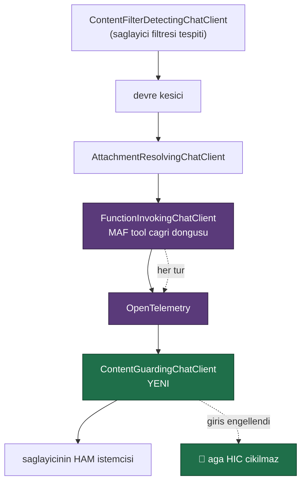

# Faz 48 — Guardrails ve İçerik Güvenliği Genişleme Noktası

> **Durum:** ✅ Tamamlandı (2026-08-07)
> **Kaynak:** [ADAYLAR.md](../../ADAYLAR.md) · **F-32**
> **Önkoşul:** Yok. Faz 8'in model boru hattı ve Faz 26'nın `ContentFilterDetectingChatClient`'ı **kullanılır**
> **Paketler:** `Tracon.Abstractions`, `.Core`, `.AspNetCore`
> **Yeni paket:** Yok — Azure adaptörü bilerek kapsam dışıdır ([48.6](#486--azure-ai-content-safety-bu-fazda-yok)) · **Migration:** Yok
> **Public API:** büyüyor — bir arayüz, üç kayıt tipi, iki enum, bir ayar, bir kararlı hata tipi. Faz 7'den önce ucuz

---

> ### ⚗️ Damıtılmış kayıt
> Bu dosya fazın **planını** değil, fazın bıraktığı **kalıcı bilgiyi**
> taşır. Plan gövdesi, planlanan/gerçekleşen API, dosya listesi, risk ve
> açık soru bölümleri kapanışta düştü — **silinmedi, git geçmişindedir.**
>
> Tam metin — kopyala, çalıştır:
>
> ```bash
> git show 7f1833e:docs/arsiv/fazlar/48-GUARDRAILS.md
> ```
>
> Damıtıldı 2026-08-23 · `scripts/dokuman-bakim.py faz-damit`

---

## Amaç

Tracon bugün içeriği **denetlemiyor**. Modele giden istem hiç süzülmüyor; modelden gelen yanıt yalnız sağlayıcının kendi filtresi kestiyse fark ediliyor. Regüle bir sektörde bu, satın almanın önündeki kapıdır. Bu faz bir **genişleme noktası** verir: `IContentGuard`.

## Plandan Sapmalar

> Plan ile gerçek arasındaki fark **gizlenmez** — sonraki oturumun en değerli
> bilgisidir.

### S1 — 🚨 Guard'ın katmanı ölçüldü ve plan YANLIŞ çıktı

[48.1](#481--hangi-katman-iagentdecorator-değil-ichatclient) doğru katmanı
(`IChatClient`) seçiyordu, ama [48.2](#482--boru-hattındaki-yer) o katmandaki
**yeri** yanlış gösteriyordu. Ölçüm:

| Kanıt | Ölçüm (2026-08-07) |
|---|---|
| `grep -rn "UseFunctionInvocation" src/` | Dört sağlayıcı fabrikası bunu **kendi içinde** kuruyordu: [OpenAI:78](../../../src/Tracon.OpenAI/OpenAIChatClientFactory.cs), Anthropic:129, Google:122, Azure:112 — artı `Tracon.Testing/FakeModelProvider:221` |
| Sonuç | `ModelProviderRegistry`'nin sardığı **her halka** tool çağrı döngüsünün DIŞINDA kalıyordu |

Planın "en dışta" dediği yer bir agent turu başına **tek** model çağrısı görür.
Tool sonucu modele **ikinci** çağrıda girer ve o çağrı döngünün içindedir. Yani
planın kendi motivasyon örneği (uzak bir MCP tool'unun döndürdüğü zararlı içerik)
o konumda **yakalanamazdı** ve `ContentGuardToolResultTests` yazılamazdı.

**👤 Kullanıcı kararı: boru hattı defterin içine taşındı.** `IModelProvider`
artık **ham** istemci döndürür; boru hattının tamamını
`ModelProviderRegistry.CreateChatClient` kurar. Bugünkü sıra (dıştan içe):



Kazanılan üç şey:

1. Guard **her gerçek model çağrısını** görür — tool sonuçları dahil. 48.1'in
   gerekçesi artık gerçekten geçerlidir.
2. Engellenen istek ağa **hiç çıkmaz**: guard ham istemcinin hemen üstündedir.
3. Üçüncü taraf bir `IModelProvider` bütün halkaları **bedava** devralır. Eski
   düzende kendi boru hattını kuran bir sağlayıcı guard'ı **sessizce** almazdı —
   bir güvenlik kontrolü için kabul edilemez bir arıza biçimi.

Ödenen bedel: `IModelProvider.CreateChatClient` sözleşmesi değişti (dört sağlayıcı
paketi + `FakeModelProvider`), ve dört sağlayıcı testinin boru hattı iddiası
defter düzeyine taşındı (`ModelProviderRegistryTests.Boru_hatti_tool_dongusunu_ve_telemetriyi_defter_kurar`).

**Bilerek taşınmayan iki halka:** devre kesici ve ek çözme döngünün **dışında**
kaldı. Devre kesici içeri alınsaydı sayım granülerliği agent turundan gerçek ağ
çağrısına kayardı (eşik anlamı değişir); ek çözme içeri alınsaydı beş turlu bir
tool döngüsü aynı eki beş kez okurdu.

### S2 — 🚨 Devre kesici engelleme kararını ayıklamak zorunda kaldı

Guard artık döngünün içinde, devre kesici ise dışında. Bir engelleme
`CircuitBreakingChatClient`'ın `catch (Exception)` bloğuna ulaşıyordu ve
**ardışık hata sayılıyordu** — planın "engelleme devre kesiciyi tetiklemez"
gereksinimi düşerdi. Çözüm bir `catch (TraconContentBlockedException)`
ayıklamasıdır; gerekçe `ContentFilterDetectingChatClient`'ı devre kesicinin
dışında tutan gerekçenin aynısıdır: bir politika kararı sağlayıcı arızası
değildir.

### S3 — 🚨 K1'in kapısı bir bayrak değil, KAYDIN kendisi

Plan iki şeyi birlikte istiyordu: (a) `PatternContentGuard` `TryAddEnumerable`
ile **her zaman** kaydedilsin, (b) hiç guard kayıtlı değilken maliyet **tam
sıfır** olsun. Yerleşik guard her zaman kayıtlıysa `IEnumerable<IContentGuard>`
asla boş olmaz ve (b) **ölçülemez**.

**👤 Kullanıcı kararı: kayıt opt-in oldu.** `AddTracon()` hiçbir guard
kaydetmez. `PatternContentGuardOptions.Enabled` bayrağı **hiç yazılmadı**:
kaydın kendisi kapıdır. İki açma yolu vardır ve ikisi de açık tercihtir —
`builder.AddPatternContentGuard(...)` veya `Tracon:ContentGuard:Pattern`
bölümünü doldurmak.

Guard'ı kayıtlı bırakıp etkisizleştirmek gerekirse `DeniedTerms` boşaltılır ve
`MaskedPii = None` yapılır; guard ilk satırda `Allow` döner.

### S4 — `422` yalnızca AKIŞSIZ dalda mümkündür

Plan "girişte engelleme `422` döner" diyordu. Ölçüm: `/api/agents/{name}/run`
varsayılan olarak SSE'dir ve `SseWriter.StartAsync` çalıştırma **başlamadan**
başlıkları gönderir. Guard model boru hattında olduğu için karar durum kodu
yazıldıktan **sonra** oluşur; akışlı yolda `422` fiziksel olarak imkânsızdır.

**👤 Kullanıcı kararı: sadece akışsız dalda `422`.** Akışsız dal `Idempotency-Key`
başlığıyla seçilir (Faz 43). Akışlı dalda engelleme SSE `error` olayı olarak
görünür; `runs.error_type` her iki dalda da `content_blocked` olur. Ölçülen
çıktılar aşağıdaki DoD tablosundadır.

Reddedilen iki alternatif: (a) uç önünde ikinci bir ön-uçuş denetimi — ilk
kullanıcı mesajını iki kez denetlerdi; (b) SSE'yi ilk çerçeveye kadar geciktirmek
— `runId` taşıyan `run` olayının sözleşmesini değiştirirdi.

### S5 — `RunErrorClass`'a yeni bir üye eklendi (plan öngörmemişti)

Plan `content_blocked` için yalnız bir istisna tipi öngörüyordu. Faz 44'ün
taksonomisine bakıldığında `ContentFiltered = 5`'in XML dokümanı **"model yanıtı
sağlayıcının filtresiyle kesildi"** diyor. Bir guard kararını aynı kovaya yazmak,
operatörün "model reddetti" ile "bizim politikamız reddetti" ayrımını kaybetmesine
yol açardı — karşılık gelen eylem de farklıdır (biri sağlayıcı ayarını gevşetmek,
diğeri politikayı gözden geçirmek). `RunErrorClass.ContentBlocked = 11` **sona**
eklendi ve `DefaultRunErrorClassifier.StableIdentities`'e bağlandı. Eklenmeseydi
her engelleme `Unknown` kovasına düşerdi — Faz 44'ün panosunda sessiz bir gerileme.

### S6 — İki gerçek kusur testlerle bulundu

| Kusur | Nasıl bulundu | Düzeltme |
|---|---|---|
| 🚨 Sarmalayıcı **iç istemcinin nesnelerini yerinde değiştiriyordu** (`ChatResponseUpdate.Contents`, `ChatMessage.Contents`) | `ContentGuardStreamingTests` iki testte paylaşılan statik bir çerçeve listesi kullandı; maskeleme testi listeyi kalıcı olarak bozdu ve engelleme testi bir sonraki koşumda düştü | Artık her şey `Clone()` ile kopyalanır: sahibi olmadığımız nesne değiştirilmez. Önbellekleyen bir `IChatClient` aynı örneği yeniden verebilir; yerinde değiştirme o örneği kalıcı olarak bozardı |
| TC kimlik kontrol basamağı **onuncu basamağı da toplamlara katıyordu** | `PatternGuardTurkishIdTests` — geçerli bir numara maskelenmedi | Yalnız ilk **dokuz** basamak tek/çift toplamlarına girer; onuncu basamak kendi formülünün girdisi olamaz ([`CheckDigits.cs`](../../../src/Tracon.Core/Guards/CheckDigits.cs)) |

### S7 — Küçük sapmalar

- **`LuhnValidator.cs` → `CheckDigits.cs`.** Dosya iki algoritma taşır (Luhn ve
  TC kimlik); `LuhnValidator` adı içindeki TC denetimini yanlış tanıtırdı.
- **`ContentGuardResult` eşleşme sayısı ve karakter aralığı TAŞIMAZ.**
  [48.5](#485--engellenen-icerik-saklanmaz) denetim izine "eşleşme sayısı ve
  karakter aralığı" yazılmasını öneriyordu. Karakter aralığı içeriğin uzunluğunu
  ve konumunu sızdırır; planın kendi API taslağı da bu alanları taşımıyordu.
  Yazılan alanlar: guard adı, kural adı, yön, karar, çalıştırma kimliği, kiracı.
- **`PatternContentGuardOptions.MaskReplacement` eklendi** (planda yoktu). Maske
  metnini sabitlemek, `[redacted]` dizesini bekleyen bir tüketiciyi kilitlerdi.
- **`TraconContentGuardOptions` ayrı bir sınıf oldu.** Plan
  `InspectInput`/`InspectOutput`/`BufferStreamingOutput`'u
  `PatternContentGuardOptions` içine koyuyordu; bunlar **boru hattı** ayarlarıdır
  ve yerleşik guard'a değil sarmalayıcıya aittir. Özel bir guard yazan tüketici de
  onlara tabidir.
- **`TraconContentBlockedException.GuardName`/`Direction` `required` DEĞİL.**
  Kardeş istisnalarla (`TraconContentFilteredException.ProviderName`) aynı
  desen korundu; `required` üye, `CA1032`'nin istediği üç kurucunun hepsini
  çağrılamaz hâle getirirdi.

---

## Bu Fazda Verilen Kararlar

Numaralar `docs/KARARLAR.md`'ye yazıldı: **K-320 … K-326**.

| # | Karar | Özet |
|---|---|---|
| K-320 | Model boru hattının tamamını `ModelProviderRegistry` kurar | `IModelProvider` ham istemci döndürür. Ölçüldü: `UseFunctionInvocation()` dört sağlayıcı paketinin içindeydi ve defterin sardığı hiçbir halka tool turlarını göremiyordu |
| K-321 | Guard `IChatClient` katmanındadır ve tool döngüsünün **içindedir** | Bir tool sonucu modele ikinci çağrıda girer; `IAgentDecorator` ve döngü dışı bir halka onu görmez |
| K-322 | Devre kesici içerik engellemesini hata **saymaz** | Engelleme sağlayıcı arızası değildir; istek ağa hiç çıkmadı. `ContentFilterDetectingChatClient`'ın gerekçesinin aynısı |
| K-323 | 👤 K1'in kapısı **kayıttır**, bir `Enabled` bayrağı değil | `AddTracon()` hiç guard kaydetmez → sarmalayıcı eklenmez → ölçülen maliyet farkı sıfır (736 B temel). Faz 43/46'nın "açık" yorumundan farkı: orada başlığı göndermeyen istemcinin maliyeti sıfırdı; burada guard **her istekte** çalışır ve davranışı değiştirir |
| K-324 | 👤 `422` yalnızca akışsız dalda döner | SSE başlıkları çalıştırma başlamadan gönderilir; akışlı yolda durum kodu değiştirilemez |
| K-325 | Engellenen içerik hiçbir yere yazılmaz | Denetim izi ve olay yükü yalnız guard/kural/yön taşır. K-059'un ruhu; iki ayrı test `grep -c` = 0 doğrular |
| K-326 | `RunErrorClass.ContentBlocked` `ContentFiltered`'dan ayrıdır | "Model reddetti" ile "bizim politikamız reddetti" farklı sebepler ve farklı eylemlerdir |

### Ölçülen tahsis farkı

`GC.GetAllocatedBytesForCurrentThread()`, 2 000 çağrı, iki geçiş (ilk geçiş
paylaşılan JIT maliyetini taşır ve atılır), tekrarlanabilir:

| Yapılandırma | Tahsis | Fark |
|---|---|---|
| **Guard kayıtlı DEĞİL (varsayılan)** | **736 B/çağrı** | temel |
| Guard kayıtlı, hiç kural yok | 952 B/çağrı | +216 B |
| Kural var, eşleşme yok | 1 736 B/çağrı | +1 000 B |
| Eşleşme var (maskeleme) | 2 976 B/çağrı | +2 240 B |

🚨 **Varsayılan satır planın iddiasını doğrular:** guard kayıtlı değilken
sarmalayıcı boru hattına **hiç eklenmez** ve temel değer bu fazdan önceki
değerdir. "Kural var, eşleşme yok" satırındaki +1 000 B planın "eşleşme yoksa
yeni dize tahsis edilmez" ideali kadar ucuz değildir: her denetimde bir
`ContentGuardContext` (giriş + çıkış = iki tane) ve her desen için bir `Regex`
çalıştırıcısı kiralanır. Dize tahsisi gerçekten yoktur; tahsis eden şey
denetimin kendi kurulumudur.

---

## Bitiş Ölçütleri (DoD) — sonuç

- [x] 🚨 Hiç guard kayıtlı değilken `ContentGuardingChatClient` boru hattında
      **yoktur**; ölçülen temel **736 B/çağrı** ve bu fazdan önceki değerdir
      (yapısal doğrulama: `Hic_guard_kayitli_degilse_sarmalayici_boru_hattinda_yoktur`)
- [x] 🚨 Engellenen bir giriş sağlayıcıya **hiç ulaşmaz** — sahte istemci sayacı `0`
- [x] 🚨 Arka arkaya on engelleme devre kesiciyi **açmaz** (birim + fonksiyonel + gerçek koşum)
- [x] 🚨 Bir **tool sonucundaki** zararlı içerik ikinci model çağrısında yakalanır —
      `ContentGuardPipelineTests.Tool_sonucundaki_icerik_ikinci_model_cagrisinda_yakalanir`
- [x] Maskelenen metin modele maskelenmiş gider; `ContentMasked` olayı yazılır
- [x] 🚨 Denetim izi ve olay yükü **engellenen metni taşımaz** — gerçek koşumda
      `grep -c` = **0**
- [x] Çıkış guard'ı açıkken akış tamponlanır; kapalıyken tamponlanmaz
- [x] İki guard'tan `Block` olan kazanır (kayıt sırasından bağımsız)
- [x] Girişte engelleme `422` döner — 🚨 **yalnız akışsız dalda** (bkz. S4);
      `runs.error_type` her iki dalda `content_blocked`
- [x] Geçersiz Luhn kontrollü 16 haneli sayı **maskelenmez** (gerçek koşumda
      `ContentMasked` olay sayısı = 0)
- [x] Patolojik girdi `matchTimeout` ile durur
- [x] 🚨 `Tracon.Core` AOT uyarısı üretmez; her desen `[GeneratedRegex]`
- [x] **Tahsis ölçümü yapıldı** — dört yapılandırma, yukarıdaki tabloda
- [x] Dört doğrulama kapısı sıfır uyarı verir (iki bilinen istisna aşağıda)
- [x] `samples/Tracon.Api` ile gerçek `run` yapıldı — çıktılar aşağıda
- [x] `secret` taraması boş döndü
- [x] `en.ts` ve `tr.ts` eksiksiz; bundle payı **+0,1 KB gzip** (159,3 → 159,4 KB;
      bütçe 250 KB, kalan **90,6 KB**)

### Doğrulama kapılarındaki iki bilinen istisna

Hiçbiri bu fazın kodundan kaynaklanmıyor; ikisi de kanıtla doğrulandı.

| İstisna | Kanıt |
|---|---|
| `Tracon.SqlServer.IntegrationTests` — 22 test, fixture `mssql/server` konteynerini başlatamıyor (`TimeoutException`) | Faz 23'ten miras **açık kalem** (K-186), [`docs/arsiv/fazlar/23-SQL-SERVER.md`](23-SQL-SERVER.md#açık-kalan--gerçek-mssqlserver-hâlâ-koşturulamadı) |
| `PostgresEvalStoreContractTests.AddCaseAsync_es_zamanli_terfiler_farkli_seq_uretir` — `5 denemede sira numarasi atanamadi` | 🚨 **Faz 45 kusuru, HEAD'de de var.** `e48fb03` için ayrı bir worktree kuruldu; aynı test **izole koşumda orada da düşüyor** (`--filter-method "*AddCaseAsync_es_zamanli*"`). Tam takımda geçip geçmemesi zamanlamaya bağlıdır. `SqlEvalStore.AddCaseAsync`'in 5 denemelik yeniden deneme sınırı gerçek eş zamanlılıkta meşru olarak tükeniyor |
| `UiTests.Playground_konusma_modu_mikrofonu_acar_ve_transkript_gosterir` — `waiting for GetByTestId("voice-transcript")` 30 sn zaman aşımı | 🚨 **Bayat test, bu fazın kodundan bağımsız.** Ölçüm: yalnız `src/Tracon.UI/frontend` HEAD'e alınıp arayüz yeniden derlendiğinde test **üç denemeden ikisinde yine düşüyor**. Aynı takım bu oturumda daha önce 41/41 geçmişti. Chromium'un sahte medya cihazı sürekli ton üretir; commit ile sunucunun transkript yanıtı arasında bir yarış var |

### Gerçek koşum çıktıları (`samples/Tracon.Api`, gerçek OpenAI modeli)

```bash
# guard ayari: MaskedPii = CreditCard | Email | ProviderApiKey, DeniedTerms = ["gizli-proje"]

# 1) Eslesmeyen istem degismeden gecer
$ curl -s -X POST .../api/agents/support/run -H "Idempotency-Key: $(uuidgen)"     -d '{"message":"siparisim nerede"}'
Siparişinizi kontrol edebilmem için **sipariş numaranız** gerekiyor. Lütfen paylaşın.

# 2) GIRIS maskelemesi — model maskelenmis istemi gordu
$ ... -d '{"message":"kart numaram 4539578763621486, tekrar eder misin"}'
Kart numaranı güvenlik nedeniyle tekrar edemem. İstersen son 4 hanesini söyleyebilirsin…

# 3) Olay yazildi ve ICERIK TASIMIYOR
RunStarted    | kart numaram 4539578763621486, tekrar eder misin | None
ContentMasked | pattern/credit-card (Input) | {"guard":"pattern","rule":"credit-card","direction":"Input","action":"Mask"}
$ curl -s .../events | grep ContentMasked | grep -c "4539578763621486"
0

# 4) CIKIS maskelemesi (istemde e-posta YOK, modelin urettigi maskelendi)
$ ... -d '{"message":"Ornek bir kurumsal iletisim adresi uydur ve SADECE onu yaz."}'
[redacted]
ContentMasked | pattern/email (Output)

# 5) ENGELLEME -> 422, govde metni tasimiyor
HTTP/1.1 422 Unprocessable Entity
{"title":"Icerik engellendi","status":422,
 "detail":"Icerik 'pattern' guard'i tarafindan engellendi (kural: denied-term, yon: Input)…",
 "errorType":"content_blocked","guard":"pattern","rule":"denied-term","direction":"Input"}

# 6) Hata tipi ve sinifi kararli
{'type': 'content_blocked', 'class': 'ContentBlocked',
 'fingerprint': 'b7d47a78df58678912327d191ee9b4348ae57e6d5085157e82678e27689272d1'}

# 7) On engellemeden sonra saglayici KAPANMADI
anthropic Healthy · google Healthy · openai Healthy · openai-responses Healthy · openrouter Healthy
-> ardindan normal bir istek: 200

# 8) Luhn — gecersiz kontrol basamakli 16 hane maskelenmedi
$ ... -d '{"message":"siparis numaram 1234567812345678, aynen tekrar et"}'
ContentMasked olay sayisi: 0

# 9) 🚨 Denetim izinde engellenen metin YOK
$ curl -s ".../api/audit?action=content.blocked" | grep -c "gizli-proje"
0
{"action":"content.blocked","entity":"run:019fdcf2-f4de-71ba-9fed-531078d4dfa8",
 "before":null,"after":"{\"guard\":\"pattern\",\"rule\":\"denied-term\",\"direction\":\"Input\",\"action\":\"Block\"}"}

# 10) AKISLI (varsayilan SSE) yolda engelleme -> error olayi
event: run
event: error
data: {"type":"TraconContentBlockedException","message":"Icerik 'pattern' guard'i tarafindan engellendi…"}
```

---

## Sonraki Faza Devir Notu

**Sıradaki faz: [Faz 49 — Çevrimiçi Değerlendirme](49-CEVRIMICI-DEGERLENDIRME.md).**
Önkoşulları (Faz 31 `run_scores`, Faz 47 `run_inputs`) tamamdır.

### Devralınan sözleşmeler

- **`IContentGuard` genişleme noktası** yukarıdaki imzalarla kararlıdır. Yeni bir
  guard `builder.AddContentGuard<T>()` ile eklenir; birden çok guard sırayla
  çalışır ve **en sert karar kazanır**.
- 🚨 **`IModelProvider.CreateChatClient` artık HAM istemci döndürür** (K-320).
  Model boru hattına yeni bir halka ekleyecek her faz onu
  `ModelProviderRegistry.CreateChatClient` içine koyar ve **döngünün içinde mi
  dışında mı** olacağına karar verir. Karar ölçütü: her model çağrısını görmesi
  gerekiyorsa içeri (guard gibi), agent turu başına bir kez yeterliyse dışarı
  (devre kesici, ek çözme gibi).
- **`TraconContentBlockedException`** `content_blocked` kararlı kimliğini ve
  `RunErrorClass.ContentBlocked` sınıfını taşır.

### Bilinen tuzaklar

- 🚨 **`IChatClient` dekoratörü, iç istemciden gelen nesneyi yerinde
  DEĞİŞTİRMEZ.** `ChatMessage`, `ChatResponseUpdate` ve içerikleri
  `Clone()` ile kopyalanır. Önbellekleyen bir istemci veya önceden kurulmuş bir
  sahte istemci aynı örneği yeniden verebilir; yerinde değiştirme o örneği kalıcı
  olarak bozar. Bu fazda bir test bunu yakaladı (S6).
- 🚨 **Bir mesajın metnini değiştiren dekoratör `RawRepresentation`'ı
  DÜŞÜRMELİDİR.** Faz 26'da ölçüldü: Anthropic adaptörü verilen ham nesnenin
  üzerine yazmıyor. Ham gösterim taşınırsa maskeleme sessizce etkisiz kalır ve
  maskelenmemiş metin ağa çıkar.
- 🚨 **Maskeleme MODEL SINIRINDA bir kontroldür, bir depolama redaksiyonu
  DEĞİLDİR.** `RunStarted` olayı kullanıcının ham istemini taşır (Faz 45,
  üretimden eval vakası terfisinin tek kaynağı) ve `run_inputs` tablosu da ham
  mesajları saklar (Faz 47). Guard bunları geriye dönük temizlemez. Kayıtlardaki
  hassas veriyi de temizlemek isteyen bir kurulum **ayrı bir işe** ihtiyaç duyar
  — aşağıdaki aday kalem.
- **`[GeneratedRegex]` zaman aşımı taşır** (1000 ms) ve bu zorunludur; `MA0009`
  aksini yakalar. `docs/hafiza/build-ve-analyzer.md`'deki "GeneratedRegex'in
  timeout aşırı yüklemesi yoktur" notu **yanlıştır**; beş yeni desen
  `matchTimeoutMilliseconds` ile derlendi.
- **Yerleşik desen ailelerinin sırası anlamlıdır.** Kart deseni TC kimlik
  deseninden **önce** çalışır: 16 haneli bir kart numarasının içinde geçerli bir
  11 haneli kimlik dizisi bulunabilir ve kart önce maskelenirse o sahte eşleşme
  hiç oluşmaz.

### Yeni aday kalemler (bu fazın kapsam dışına çıkardıkları)

ID'ler `ADAYLAR.md` içinde **F-87'den** devam eder.

| Kapsam dışı iş | Neden ayrı bir kalem |
|---|---|
| **Azure AI Content Safety adaptörü** | Ölçüldü: `Azure.AI.ContentSafety` 1.0.0 → **4 geçişli paket**. Erteleme gerekçesi ağırlık **değil**, doğrulanamazlıktır (K-212 emsali): gerçek bir Azure kaynağı olmadan sahte istemciden öteye test edilemez. Ayrı paket olacaktır: `Tracon.ContentSafety`. Kanca doğru olduğu için adaptör otuz satırdır |
| 🚨 **Kayıtlardaki hassas verinin redaksiyonu** | Guard model sınırındadır; `run_events.RunStarted`, `run_inputs` ve oturum geçmişi ham metni saklar. Bu **ayrı bir sözleşmedir**: hangi kayıt, hangi anda ve geri alınamaz biçimde mi temizlenecek? Faz 45'in eval terfisi ve Faz 47'nin yeniden oynatması ham girdiye **bağımlıdır**; redaksiyon ikisini de bozar ve önce o çatışma karara bağlanmalıdır |
| **Tool argümanı denetimi** | Guard model sınırındadır; bir tool'un **argümanını** çağrıdan önce denetlemek **F-61**'in işidir ve o kalem listede duruyor |
| **Guard kararının transcript'te gösterilmesi** | Bu faz iki olay tipini ham olay akışına ekledi; katlanmış transcript görünümü (`transcript.ts`) onları göstermiyor. `compaction` için var olan "sistem konuşmayı değiştirdi" öğesinin kardeşi gerekir — yeni bir öğe tipi, bileşen ve sözlük anahtarları |
| **Kiracı bazlı guard kuralları** | `ContentGuardContext.TenantId` taşınıyor ve özel bir guard onu **bugün** kullanabilir; ama yerleşik `PatternContentGuard` tek bir kural kümesi taşır. Kiracı başına kural, kuralların **nerede yaşadığı** sorusunu açar (yapılandırma mı, veritabanı mı) ve K2'ye (tool'lar yalnız kodda) benzer bir sınır kararı ister |

### 🚨 F-72 (ACS uyumu) bu fazın üstüne oturur

Ölçülmüş engeli aday listesinde yazılıdır: `AgentControlSpecification` paketi
**beta** ve **native**'dir (Rust çekirdeği, beş RID; musl ve win-arm64 yok). Bu
fazın `IContentGuard`'ı ACS'nin `input`/`output` kesişim noktalarına eşlenir;
`pre_tool_call`/`post_tool_call` **bu fazda kapsanmadı** ve F-61 (argüman düzeyinde
tool politikası) ile birlikte düşünülmelidir.
