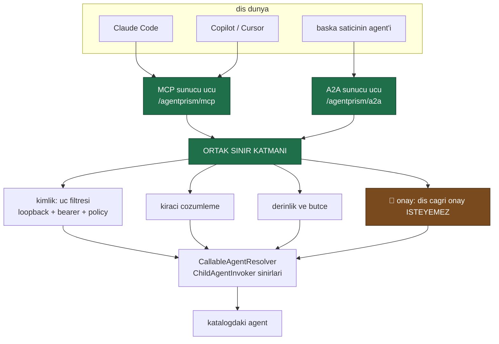
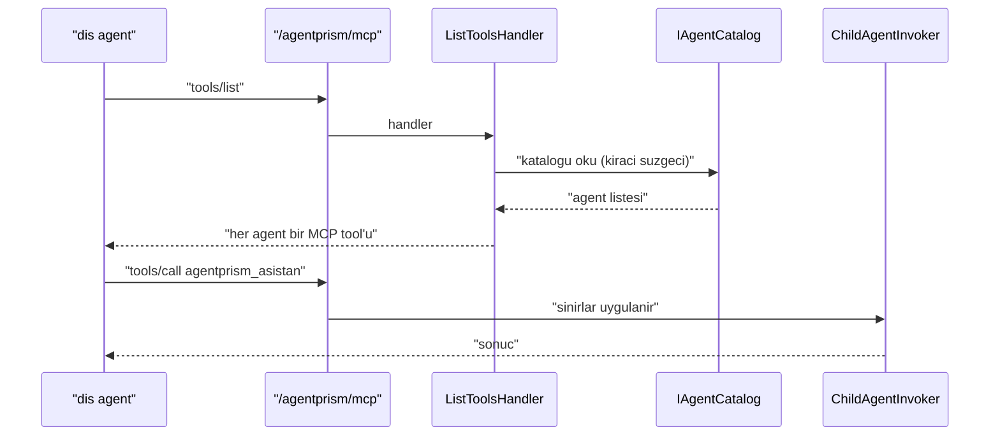

# Faz 50 — Dışa Açılan Agent Yüzeyi (MCP sunucusu ve A2A)

> **Durum:** ✅ Tamamlandı (2026-08-08)
> **Kaynak:** [ADAYLAR.md](../../ADAYLAR.md) · **F-31**, **F-33** (birleşti)
> **Önkoşul:** Yok. Faz 12'nin `ChildAgentInvoker` sınır denetimleri **yeniden kullanılır**
> **Paketler:** `AgentPrism.AspNetCore` (yeni bağımlılıklar **yalnız burada**), `.Abstractions`, `.Core`
> **Yeni paket:** Yok (AgentPrism paketi) · **Yeni NuGet:** `ModelContextProtocol.AspNetCore` (GA) + Açık Soru 1'e bağlı olarak A2A · **Migration:** Yok
> **Public API:** büyüyor — iki eşleme metodu, iki ayar sınıfı. Faz 7'den önce ucuz

---

## Bu Faza Başlarken

> `faz-baslangic` skill'ini uygula. Aşağıdaki liste o skill'in 2. adımıdır —
> **tamamını değil, yalnız işaret edilen bölümleri oku.**

1. Bu doküman
2. Kararlar — dosyanın tamamını **okuma**, yalnız bu kalemleri grep'le:
   ```bash
   grep -n "K-007\|K-008\|K-019\|K-057\|K-103\|K-212" docs/KARARLAR.md
   ```
   🚨 **K-057** (`ModelContextProtocol.Core` seçildi çünkü "AgentPrism yalnızca
   **istemcidir**" — **bu fazın yeniden açtığı karar tam olarak budur**),
   **K-008** (ön sürüm MAF paketi yalnız `AgentPrism.AspNetCore` içinde),
   **K-019** (`IAgentSource` soyutlaması; MAF'ın `AddAIAgent` kayıt defteri
   **kullanılmıyor** — A2A'nın kısıtı buradan doğar), **K-103** (alt agent onay
   isteyemez — dışarıdan çağrılan agent da isteyemez), **K-007** (geçişli
   sabitleme kapalı; yeni paket gerekçe ister), **K-212** (37 paketlik ağırlık
   ve doğrulanamazlık nasıl bir erteleme gerekçesi olur).
3. [`22-MCP-DERINLESMESI.md`](22-MCP-DERINLESMESI.md) — yalnız istemci mimarisi ve devir notu:
   ```bash
   awk '/## Sonraki Faza Devir Notu/,0' docs/arsiv/fazlar/22-MCP-DERINLESMESI.md
   ```
   Aynanın diğer yüzü bu fazdır; adlandırma ve kimlik deseni oradan devralınır.
4. [`12-AGENT-CAGRI-GRAFIGI.md`](12-AGENT-CAGRI-GRAFIGI.md) — yalnız sınır denetimleri bölümü.
   Dört sınır (derinlik, bütçe, kiracı, onay) bu fazda **aynen** uygulanır.
5. Alan hafızası (bu faz üç alana dokunuyor):
   [`hafiza/aspnetcore-di.md`](../../hafiza/aspnetcore-di.md) (**ana kaynak** —
   `MapAgentPrism`, uç filtresi, kiracı çözümleme),
   [`hafiza/maf-api.md`](../../hafiza/maf-api.md) (MCP ve A2A tipleri),
   [`hafiza/build-ve-analyzer.md`](../../hafiza/build-ve-analyzer.md)
   (paket bağımlılığı, AOT işareti)
6. Gerektiğinde, tamamı değil ilgili bölümü:
   [`MIMARI.md`](../../MIMARI.md) — güvenlik ve HTTP yüzeyi bölümleri ·
   [`MAF-GENISLEME-NOKTALARI.md`](../../MAF-GENISLEME-NOKTALARI.md)

---

## Amaç

[Faz 22](22-MCP-DERINLESMESI.md) AgentPrism'i MCP **istemcisi** yaptı: uzak sunucuların
tool'ları katalogda görünüyor. Aynanın diğer yüzü yok — AgentPrism'in
agent'ları dışarıya **hiç** açılmıyor.

Bu faz o yüzü açar. Claude Code, Copilot, Cursor veya başka bir agent,
AgentPrism'deki bir agent'ı doğrudan çağırabilir. Kontrol düzlemi iddiası
böylece iki yönlü olur.

- **F-31** — katalogdaki agent'ları MCP tool'u olarak yayımlayan bir uç.
- **F-33** — aynı altyapı üstünde ikinci bir adaptör: A2A sunucusu.
  🚨 **Kapsamı ölçüm sonucunda daraldı**; [50.5](#505--a2anın-ölçülmüş-kısıtı)
  gerekçeyi yazar.

### Bugün ne çalışmıyor — doğrulanmış kanıt

| Kanıt | Gözlem |
|---|---|
| [`AgentPrism.Mcp.csproj`](../../../src/AgentPrism.Mcp/AgentPrism.Mcp.csproj) | Tek MCP bağımlılığı `ModelContextProtocol.Core`. Açıklama: "Uzak MCP sunucularinin tool'lari kesfedilir" — **yalnız istemci** |
| `ls src/AgentPrism.Mcp/` | 19 dosyanın tamamı istemci tarafı: `McpToolRegistry`, `McpDiscoveryService`, `McpTransportFactory`, `McpOAuthAuthorizationCoordinator`. **Sunucu tarafı sıfır** |
| K-057 gerekçesi | "Tam paket `Microsoft.Extensions.Hosting.Abstractions` ve `Caching.Abstractions` da çeker; bunlar MCP **sunucusu** barındırmak içindir ve AgentPrism yalnızca istemcidir" |
| [`ChildAgentInvoker.cs:31`](../../../src/AgentPrism.Core/Graph/ChildAgentInvoker.cs) | "Bir agent'in cagirabilecegi alt agent'i sarar; **derinlik, butce ve kiraci sinirlarini uygular**". Dört sınır denetimi hazır |
| [`CallableAgentResolver.cs:110`](../../../src/AgentPrism.Core/Graph/CallableAgentResolver.cs) | `CallableAgentInfo(string Name, string? Description, int Version)` — MCP tool bildirimi için gereken üstveri hazır |
| [`AgentPrismEndpointFilter.cs:21-22`](../../../src/AgentPrism.AspNetCore/Security/AgentPrismEndpointFilter.cs) | Üç katmanlı koruma: loopback + tek statik bearer token + authorization policy. 🚨 **Kiracıya bağlı anahtar yok** — F-56'nın işi |

> Kanıtlar 2026-08-06 tarihinde doğrulandı.

---

## 50.1 — Paket ölçümü: MCP sunucusu ucuz, A2A pahalı değil ama kısıtlı

K-007 her yeni NuGet bağımlılığı için ölçüm ister. Ölçüldü (2026-08-06,
`dotnet restore` + `project.assets.json`):

| Paket | Geçişli toplam | Yeni gelen |
|---|---|---|
| `ModelContextProtocol.AspNetCore` **2.0.0 (GA)** | **13** | `ModelContextProtocol` 2.0.0, `.AspNetCore` 2.0.0, `Microsoft.Extensions.Caching/Configuration/Diagnostics/FileProviders/Hosting/Options/Primitives` |
| `Microsoft.Agents.AI.Hosting` (bugün **zaten var**) | 43 | — |
| `Microsoft.Agents.AI.Hosting.A2A` (ön sürüm) | 45 | 🚨 **+2** — `Hosting.A2A` ve `A2A` 1.0.0-preview2 |
| `Microsoft.Agents.AI.A2A` (istemci, ön sürüm) | 6 | `A2A` 1.0.0-preview2, `Google.Protobuf` |

🚨 **MCP sunucusunun getirdiği on iki paketin tamamı `Microsoft.Extensions.*`
ailesindendir ve sürümleri bizimkiyle birebir aynıdır** (`10.0.10`,
`Microsoft.Extensions.AI.Abstractions 10.8.3`). Yabancı bir bağımlılık yoktur.
Bu, K-057'nin endişesinin ölçülmüş yanıtıdır: paketler gerçekten sunucu
barındırma içindir ve bu faz **sunucu barındırıyor**.

🚨 **A2A sunucusunun artımlı maliyeti iki pakettir**, kırk beş değil.
`AgentPrism.AspNetCore` `Microsoft.Agents.AI.Hosting`'i **zaten referans
alıyor** (K-008 gereği ön sürüm bağımlılıkları orada toplanmış). Aday
listesinin "ağırlık" endişesi bu yüzden geçersizdir; gerçek kısıt başkadır ve
[50.5](#505--a2anın-ölçülmüş-kısıtı)'te yazılıdır.

### K-057 nasıl yeniden açılır

K-057 bir hata değildi ve yanlışlanmıyor. Kararın **koşulu** değişti:

> **Eski:** "AgentPrism yalnızca istemcidir" → `.Core` yeterlidir.
> **Yeni:** AgentPrism **sunucu da olur** → sunucu paketleri gereklidir.

🚨 **Ama bağımlılık yönü korunur.** `ModelContextProtocol.AspNetCore` **yalnız
`AgentPrism.AspNetCore`** içine girer. `AgentPrism.Mcp` (istemci paketi)
`.Core`'da kalır ve büyümez. MCP kullanmayan tüketici hiçbirini almaz.

## 50.2 — Tek altyapı, iki adaptör



**Protokoller iki ince adaptördür.** Değer ortak sınır katmanındadır ve o
katman Faz 12'de zaten yazıldı — `ChildAgentInvoker` derinlik, bütçe ve kiracı
sınırlarını uyguluyor. Bu faz aynı sınırları **ikinci bir çağıran** için
yeniden kullanır.

### 🚨 Dışarıdan çağrılan agent onay isteyemez

K-103 alt agent için ölçülmüş bir sınır koydu: onay gerektiren bir çağrıda
çalıştırma **biter** ve karar bir sonraki turun girdisidir; ağacın ortasında
askıya alma MAF'ta yoktur.

Aynı sınır burada **daha da serttir**: MCP veya A2A çağıranı bir insan
değildir, bir agent'tır. Onay isteği ona ulaşsa bile karar veremez.

**Kural:** Dışa açılan bir agent'ın onay gerektiren bir tool'u varsa çağrı
**başarısız olur** ve hata hangi tool'un onay istediğini yazar. Sessizce
onaysız çalıştırmak kabul edilemez — bu bir güvenlik sınırıdır ve K2 ile aynı
sınıftadır.

Bir agent'ı dışa açan yapılandırma, o agent'ın onaylı tool taşıyıp taşımadığını
**açılışta** denetler ve taşıyorsa açık bir hata verir. Çalışma anında sürpriz
yaşanmaz.

## 50.3 — MCP sunucusu: dinamik katalog çalışıyor

Ölçülen imzalar (`ModelContextProtocol.AspNetCore` 2.0.0):

```
McpEndpointRouteBuilderExtensions.MapMcp(IEndpointRouteBuilder, String pattern)

McpServerBuilderExtensions
    WithListToolsHandler(IMcpServerBuilder, McpRequestHandler<ListToolsRequestParams, ListToolsResult>)
    WithCallToolHandler (IMcpServerBuilder, McpRequestHandler<CallToolRequestParams,  CallToolResult>)

McpServerTool.Create(AIFunction function, McpServerToolCreateOptions options)
```

Üç şey bu tasarımı mümkün kılıyor:

| Ölçüm | Neden önemli |
|---|---|
| 🚨 `WithListToolsHandler` bir **handler** alır | Tool listesi **istek anında** üretilir. AgentPrism'in katalogu veritabanındadır ve çalışma anında değişir; statik bir liste işe yaramazdı |
| 🚨 `McpServerTool.Create(AIFunction …)` | Bir `AIFunction` **doğrudan** MCP tool'u olur. K3 korunur — paralel bir tip hiyerarşisi kurulmaz |
| `MapMcp(endpoints, pattern)` | `MapAgentPrism`'in önek desenine doğal oturur |

Akış:



**Adlandırma:** Faz 22 uzak tool'ları `{sunucu}_{tool}` biçiminde adlandırdı
([`McpToolNaming.cs`](../../../src/AgentPrism.Mcp/Internal/McpToolNaming.cs)). Ters
yön simetriktir: dışa açılan agent `agentprism_{agent}` olur. Aynı dosyanın
`[GeneratedRegex("^[a-zA-Z0-9_-]+$")]` doğrulaması yeniden kullanılır.

**Hangi agent'lar açılır?** Hiçbiri — **açıkça izin verilmedikçe**.

```csharp
options.ExposedAgents.Add("asistan");     // beyaz liste
// veya
options.ExposeAllAgents = true;           // acik tercih
```

🚨 K1'in en sert uygulaması. Bir agent'ı yanlışlıkla dışa açmak, kapalı bir
özelliği yanlışlıkla açmaktan **çok daha pahalıdır**.

## 50.4 — Kimlik: bugünkü üç katman, yeni bir şey değil

Dış yüzey `MapAgentPrism`'in **aynı** üç katmanını kullanır:

| Katman | Kaynak |
|---|---|
| Loopback kısıtı | `AgentPrismEndpointFilter`; `AllowRemoteAccess` kapalıysa yalnız aynı makine |
| Bearer token | Aynı filtre, aynı sabit zamanlı karşılaştırma |
| Authorization policy | `RequireAuthorization` ile ASP.NET Core boru hattı |

🚨 **Bu yeterli DEĞİLDİR ve plan bunu açıkça söyler.** Token **tek ve
statiktir**; kiracıya bağlanmaz, döndürülemez, iptal edilemez. Aday listesinin
F-56'sı (kiracı bazlı API anahtarları) tam olarak bu deliği kapatır ve
"F-56 bundan önce yapılırsa kimlik sorunu kendiliğinden çözülür" diyor.

F-56 planlanmadığı için bu faz **iki savunma** ekler:

1. **Beyaz liste zorunludur** — hiçbir agent varsayılan olarak açık değildir.
2. 🚨 **Uzak erişim + dış yüzey birlikte açılamaz.** `AllowRemoteAccess = true`
   iken MCP/A2A ucu açılırsa **açılışta hata verilir** ve mesaj F-56'yı işaret
   eder. Loopback dışına açılmış, kiracıya bağlanmamış tek bir token'la
   korunan bir agent yüzeyi üretime uygun değildir; sessizce çalışması
   kullanıcının korunduğunu sanmasına yol açar.

Kiracı çözümlemesi `HttpTenantContext` ile aynı yoldan yapılır — ikinci bir
kiracı mekanizması kurulmaz.

## 50.5 — A2A'nın ölçülmüş kısıtı

Ölçülen imzalar (`Microsoft.Agents.AI.Hosting.A2A` 1.16.0-preview.260730.1):

```
A2AServerServiceCollectionExtensions
    AddA2AServer(IServiceCollection services, String agentName, Action<A2AServerRegistrationOptions>)
    AddA2AServer(IServiceCollection services, AIAgent agent,    Action<A2AServerRegistrationOptions>)
    AddA2AServer(IHostedAgentBuilder agentBuilder,              Action<A2AServerRegistrationOptions>)

A2AServerRegistrationOptions   { AgentRunMode, A2AServerOptions }
AgentRunMode.AllowBackgroundWhen(Func<A2ARunDecisionContext, CancellationToken, ValueTask<Boolean>>)
```

🚨 **`AddA2AServer` bir KAYIT ZAMANI API'sidir.** Bir `AIAgent` **örneğini**
veya MAF'ın kayıt defterindeki bir **adı** ister. AgentPrism'in katalogu
veritabanındadır ve agent'lar çalışma anında oluşturulabilir; ayrıca K-019
gereği AgentPrism MAF'ın `AddAIAgent` kayıt defterini **kullanmıyor**.

Sonuç: A2A, MCP'nin yaptığı gibi **dinamik** bir liste sunamaz.

| Yetenek | MCP sunucusu | A2A sunucusu |
|---|---|---|
| Sürüm | **GA** (2.0.0) | Ön sürüm (K-008 kapsamında) |
| Artımlı paket | 13 | 2 |
| Dinamik katalog | ✅ `WithListToolsHandler` | ❌ kayıt anında sabit |
| Çalışma anında eklenen agent | ✅ görünür | ❌ görünmez |

**Karar (Açık Soru 1'e bağlıdır):** A2A, **açılışta adları verilen sabit bir
agent kümesi** için açılır. Sınır beyaz listenin doğal sonucudur ve
kullanıcıya sürpriz üretmez: listeye sonradan eklenen bir agent A2A'da
görünmez ve bu **belgeye yazılır**.

🚨 **A2A istemci tarafı (`Microsoft.Agents.AI.A2A`) bu fazın kapsamı
DIŞINDADIR.** Aday listesi bunu doğru tespit etmişti: istemci paketi
`AgentPrism.AspNetCore`'a doğal oturmaz ("uzak bir agent'ı çağırmak" bir HTTP
katmanı işi değildir) ve K-008 onu `.Core`'a koymayı yasaklar. Uzak agent
çağırma yeni bir aday kalemidir.

---

## Planlanan Public API

> Taslak imzalardır. Gerçekleşen imzalar kapanışta ayrı bir bölüme yazılır.

```csharp
// AgentPrism.AspNetCore/AgentPrismMcpServerOptions.cs (YENI)

/// <summary>AgentPrism agent'larini MCP tool'u olarak yayimlama ayarlari.</summary>
public sealed class AgentPrismMcpServerOptions
{
    /// <summary>
    /// Disa acilacak agent adlari. 🚨 Bos ise HICBIR agent acilmaz.
    /// </summary>
    public IList<string> ExposedAgents { get; } = [];

    /// <summary>
    /// Katalogdaki her agent'i acar. 🚨 Varsayilan <see langword="false"/>;
    /// acmak acik bir tercihtir.
    /// </summary>
    public bool ExposeAllAgents { get; set; }

    /// <summary>
    /// Tool adi oneki. Varsayilan <c>agentprism</c>; tool adi
    /// <c>{Prefix}_{agent}</c> olur.
    /// </summary>
    public string ToolNamePrefix { get; set; } = "agentprism";

    /// <summary>Dis cagrilar icin derinlik ve token butcesi.</summary>
    public AgentRunBudget Budget { get; set; } = new() { MaxDepth = 1 };
}

// AgentPrism.AspNetCore/AgentPrismA2AOptions.cs (YENI)

/// <summary>AgentPrism agent'larini A2A uzerinden yayimlama ayarlari.</summary>
/// <remarks>
/// 🚨 <c>ExposeAllAgents</c> karsiligi YOKTUR. Olculdu (MAF 1.16.0):
/// <c>AddA2AServer</c> bir kayit zamani API'sidir ve calisma aninda eklenen
/// bir agent'i goremez.
/// </remarks>
public sealed class AgentPrismA2AOptions
{
    /// <summary>Disa acilacak agent adlari. Acilista okunur ve SABITTIR.</summary>
    public IList<string> ExposedAgents { get; } = [];

    /// <summary>Dis cagrilar icin derinlik ve token butcesi.</summary>
    public AgentRunBudget Budget { get; set; } = new() { MaxDepth = 1 };
}
```

```csharp
// AgentPrism.AspNetCore/AgentPrismEndpointRouteBuilderExtensions.cs

/// <summary>
/// Katalogdaki agent'lari MCP tool'u olarak yayimlar.
/// </summary>
/// <remarks>
/// 🚨 <c>MapAgentPrism</c> ile ayni koruma katmanlarini uygular.
/// <c>AllowRemoteAccess</c> aciksa acilista hata verir — tek statik token,
/// disa acilmis bir agent yuzeyi icin yeterli degildir.
/// </remarks>
public static IEndpointConventionBuilder MapAgentPrismMcpServer(
    this IEndpointRouteBuilder endpoints,
    string pattern = "/agentprism/mcp",
    Action<AgentPrismMcpServerOptions>? configure = null);

/// <summary>Katalogdaki agent'lari A2A uzerinden yayimlar.</summary>
public static IEndpointConventionBuilder MapAgentPrismA2A(
    this IEndpointRouteBuilder endpoints,
    string pattern = "/agentprism/a2a",
    Action<AgentPrismA2AOptions>? configure = null);
```

```csharp
// AgentPrism.Abstractions — disa acilan cagrinin sinir ihlali
public sealed class AgentPrismExternalCallException : AgentPrismException
{
    /// <summary><see cref="AgentPrismException.ErrorType"/> icin kararli deger.</summary>
    public const string ExternalCallRejectedErrorType = "external_call_rejected";

    /// <inheritdoc />
    public override string ErrorType => ExternalCallRejectedErrorType;

    /// <summary>Cagrilan agent.</summary>
    public required string AgentName { get; init; }

    /// <summary>Protokol: <c>mcp</c> veya <c>a2a</c>.</summary>
    public required string Protocol { get; init; }
}
```

### HTTP `endpoint`'leri

| Metot | Yol | Koruma | Ne yapar |
|---|---|---|---|
| MCP protokolü | `/agentprism/mcp` | Üç katman + beyaz liste | `tools/list` ve `tools/call` |
| A2A protokolü | `/agentprism/a2a` | Üç katman + beyaz liste | Agent kartı ve çalıştırma |

Yönetim API'sinde yeni uç **yok**. Hangi agent'ların açık olduğu
`GET /api/meta` üzerinden görünür (Faz 33'ün teşhis raporu bunu taşıyabilir).

### Arayüz payı

**Yok.** Bu faz arayüze dokunmaz. Hangi agent'ların dışa açık olduğu bir
yapılandırma bilgisidir ve teşhis ekranının işidir; ayrı bir ekran açmak
bundle payı harcar ve değeri düşüktür.

---

## Planlanan Dosya Listesi

```
src/AgentPrism.AspNetCore/McpServer/
├── AgentPrismMcpServerOptions.cs        (YENI)
├── AgentPrismMcpServerExtensions.cs     (YENI — MapAgentPrismMcpServer)
├── CatalogToolListHandler.cs            (YENI — WithListToolsHandler)
└── CatalogToolCallHandler.cs            (YENI — WithCallToolHandler)

src/AgentPrism.AspNetCore/A2A/
├── AgentPrismA2AOptions.cs              (YENI)
└── AgentPrismA2AExtensions.cs           (YENI — MapAgentPrismA2A)

src/AgentPrism.AspNetCore/Security/
└── ExternalSurfaceGuard.cs              (YENI — acilis denetimleri)

src/AgentPrism.AspNetCore/
└── AgentPrism.AspNetCore.csproj         (ModelContextProtocol.AspNetCore [+ A2A])

src/AgentPrism.Abstractions/
└── AgentPrismException.cs               (AgentPrismExternalCallException)

src/AgentPrism.Core/Graph/
└── CallableAgentResolver.cs             (dis cagri icin yeniden kullanilir)

Directory.Packages.props                 (ModelContextProtocol.AspNetCore [+ A2A])
```

🚨 **`AgentPrism.Mcp` paketine DOKUNULMAZ.** İstemci paketi `.Core`'a bağlıdır
ve sunucu bağımlılığı oraya girerse tüm MCP istemcisi kullanan tüketiciler
sunucu paketlerini de alır.

---

## Testler

| Test sınıfı | Neyi doğrular |
|---|---|
| `McpServerToolListTests` | `tools/list` beyaz listedeki agent'ları döndürür; ad `agentprism_{agent}` |
| `McpServerDefaultClosedTests` | 🚨 Beyaz liste boşken `tools/list` **boş** döner |
| `McpServerDynamicCatalogTests` | 🚨 Çalışma anında eklenen bir agent (beyaz listede ise) **yeni bir sunucu kurulmadan** görünür |
| `McpServerToolCallTests` | `tools/call` agent'ı çalıştırır ve normal bir `runs` satırı üretir |
| `McpServerApprovalRejectionTests` | 🚨 Onay gerektiren tool taşıyan agent dışa **açılamaz**; açılışta anlaşılır hata |
| `McpServerDepthBudgetTests` | `MaxDepth = 1` iken dışarıdan çağrılan agent alt agent çağıramaz |
| `McpServerTenantTests` | Kiracı çözümlemesi `HttpTenantContext` ile aynı; başka kiracının agent'ı görünmez |
| `McpServerAuthTests` | Token'sız istek reddedilir; sabit zamanlı karşılaştırma korunur |
| `McpServerRemoteAccessTests` | 🚨 `AllowRemoteAccess = true` + dış yüzey açık → **açılışta hata**; mesaj F-56'yı işaret eder |
| `McpServerToolNamingTests` | Geçersiz karakter taşıyan agent adı reddedilir (`[GeneratedRegex]` yeniden kullanımı) |
| `McpServerRecursionTests` | 🚨 Dışarıdan çağrılan agent kendini MCP üzerinden çağıramaz — bütçe ve derinlik bunu keser |
| `A2AAgentCardTests` | Agent kartı beyaz listedeki agent'lar için üretilir |
| `A2ADynamicLimitTests` | 🚨 Çalışma anında eklenen agent A2A'da **görünmez** — ölçülen kısıt **test edilerek belgelenir** |
| `A2ABoundaryTests` | A2A çağrısı MCP ile **aynı** dört sınırı geçer |
| `DependencyDirectionTests` | 🚨 `AgentPrism.Mcp` sunucu paketlerine bağımlı **değildir**; `ModelContextProtocol.AspNetCore` yalnız `AgentPrism.AspNetCore`'da |

---

## Açık Sorular

> Planı bloklamayan, faz uygulanırken karara bağlanacak sorular.

| # | Soru | Seçenekler | Öneri |
|---|---|---|---|
| 1 | Ölçülen kısıt sonrası A2A bu fazda kalsın mı? | A: **kalsın, sabit beyaz listeyle** · B: ertelensin · C: kendi A2A ucumuzu yazalım | **A.** Artımlı maliyet iki pakettir ve sınır **açıktır**: listeye sonradan eklenen agent görünmez. Bu, yarım çalışan bir özellik değil, **kapsamı belli** bir özelliktir. C, `Hosting.A2A`'nın verdiği protokol uyumunu elle yazmak demektir ve K-139'un ("ikinci bir çerçeve yazma") ruhuna aykırıdır |
| 2 | Beyaz liste yapılandırmada mı, agent tanımında mı? | A: **yapılandırmada** · B: `AgentDefinition`'a bir bayrak | **A.** Bir agent'ı dışa açmak bir **dağıtım** kararıdır, tanım kararı değil. B ayrıca arayüzden dışa açmayı mümkün kılardı ve bu bir güvenlik sınırını gevşetirdi |
| 3 | Dışa açılan çağrı kotayı tüketsin mi? | A: **evet** · B: hayır | **A.** Gerçek bir çalıştırmadır. Kotadan muaf tutmak dış yüzeyi bir kaçış kapısı yapar |
| 4 | Akışlı yanıt MCP üzerinden verilsin mi? | A: **hayır, tam yanıt** · B: evet | **A** bir taslaktır. MCP `tools/call` tek bir sonuç bekler; ilerleme bildirimi protokolde var ama **ölçülmedi**. Ölçüm yapılmadan taahhüt yazılmaz |
| 5 | Dış çağrı denetim izine yazılsın mı? | A: **evet, ayrı eylem adıyla** · B: normal çalıştırma kaydı yeter | **A.** Dış yüzeyden gelen çağrı ayrı bir güven sınırından gelir; `external.call` eylemi denetçinin ilk soracağı şeydir |
| 6 | Varsayılan `MaxDepth` kaç olsun? | A: **1** · B: 3 (bugünkü varsayılan) | **A.** Dışarıdan çağrılan bir agent'ın kendi ağacını açması maliyeti öngörülemez yapar. Tüketici bilerek yükseltebilir |
| 7 | MCP kaynak (`resources`) ve istem (`prompts`) da yayımlansın mı? | A: **hayır** · B: evet | **A.** Bu fazın işi agent'ı **tool** olarak açmaktır. Kaynak ve istem yayını ayrı bir sözleşmedir ve yeni bir aday kalemidir |

---

## Bitiş Ölçütleri (DoD)

- [x] 🚨 Beyaz liste boşken `tools/list` **boş** döner — hiçbir agent
      varsayılan olarak açık değildir (`Bos_beyaz_liste_hicbir_tool_dondurmez`)
- [x] Beyaz listedeki agent `tools/list`'te `agentprism_{ad}` olarak görünür
- [x] `tools/call` agent'ı çalıştırır ve normal bir `runs` satırı üretir
- [x] 🚨 Çalışma anında eklenen bir agent (beyaz listede) MCP'de **yeni sunucu
      kurulmadan** görünür (`Dinamik_katalog_yeni_agent_sunucu_yeniden_kurulmadan_gorunur`)
- [x] 🚨 Onay gerektiren tool taşıyan agent dışa **açılamaz**; açılışta
      anlaşılır hata verir (MCP ve A2A, ikisi de ayrı test)
- [x] 🚨 `AllowRemoteAccess = true` + dış yüzey açık → **açılışta hata**;
      mesaj F-56'yı işaret eder (MCP ve A2A)
- [x] `MaxDepth = 1` iken dışarıdan çağrılan agent alt agent çağıramaz —
      🚨 **düzeltme (K-340):** `MaxDepth=N`, N seviye devire izin verir; test
      `MaxDepth=0` ile "hiç alt çağrı yok" sınırını doğrular
      (`Derinlik_siniri_alt_cagriyi_engeller`)
- [x] Kiracı yalıtımı korunur; başka kiracının agent'ı görünmez
      (`Kiraci_yalitimi_korunur`)
- [x] Dış çağrı denetim izine `external.call` olarak yazılır (MCP ve A2A)
- [x] A2A agent kartı beyaz listedeki agent'lar için üretilir —
      🚨 **düzeltme (K-336):** tek bir kart değil, her agent kendi
      `{prefix}/{agent}/.well-known/agent-card.json`'unda
- [x] 🚨 A2A'nın dinamik kısıtı **test edilerek** belgelenmiştir
      (`Calisma_aninda_eklenen_agent_A2Ada_gorunmez`)
- [x] 🚨 `DependencyDirectionTests`: `AgentPrism.Mcp` sunucu paketlerine bağımlı
      **değildir** (`Mcp_istemci_paketi_sunucu_paketlerine_bagli_degildir`)
- [x] Gerçek bir MCP istemcisiyle (Claude Code) **uçtan uca** çağrı yapıldı ve
      çıktı bu belgeye yazıldı — bkz. [Gerçek Doğrulama](#gerçek-doğrulama)
- [x] Dört doğrulama kapısı sıfır uyarı verir — bkz.
      [Gerçek Doğrulama](#gerçek-doğrulama) (SqlServer.IntegrationTests hariç:
      bu makinede ARM64/amd64 imaj uyuşmazlığı nedeniyle ortam kaynaklı, faza
      ilişkisiz — ayrıntı orada)
- [x] `samples/AgentPrism.Api` ile gerçek `run` yapıldı, çıktı bu belgeye
      yazıldı — bkz. [Gerçek Doğrulama](#gerçek-doğrulama)
- [x] `secret` taraması boş döndü (tek eşleşme `docs/hafiza/sql-server-yerel-test.md`
      içinde önceden var olan, gerçek olmayan bir değişken referansı — bu
      fazda eklenmedi)

## Gerçek Doğrulama

`samples/AgentPrism.Api` çalıştırıldı (`.UseMcpServer(o => o.ExposedAgents.Add("ozetleyici"))`,
`.UseA2A(o => o.ExposedAgents.Add("ozetleyici"))`; "ozetleyici" bilerek seçildi
çünkü tool taşımaz, onay sınırına hiç dokunmaz).

**MCP `tools/list`:**

```json
{"result":{"tools":[{"name":"agentprism_ozetleyici","description":"Gelen metni uc maddede ozetler.","inputSchema":{"type":"object","properties":{"message":{"type":"string","description":"Agent'a gonderilecek kullanici mesaji."}},"required":["message"]}}]},"id":1,"jsonrpc":"2.0"}
```

**MCP `tools/call`:**

```json
{"result":{"content":[{"type":"text","text":"- Bugün hava çok güzeldi.\n- İş yerinde her şey yolunda gitti.\n- Toplantılar verimliydi."}]},"id":2,"jsonrpc":"2.0"}
```

**A2A agent kartı** (`GET /agentprism/a2a/ozetleyici/.well-known/agent-card.json`):

```json
{"name":"ozetleyici","description":"Gelen metni uc maddede ozetler.","version":"1","supportedInterfaces":[{"url":"/agentprism/a2a/ozetleyici","protocolBinding":"JSONRPC","protocolVersion":"1.0"}],"capabilities":{"streaming":false,"pushNotifications":false},"defaultInputModes":["text/plain"],"defaultOutputModes":["text/plain"]}
```

**A2A `SendMessage`:**

```json
{"jsonrpc":"2.0","id":1,"result":{"message":{"role":"ROLE_AGENT","parts":[{"text":"- A2A protokolü üzerinden mesaj gönderildi.\n- Mesaj başarıyla agente ulaştı.\n- Mesaj işlendi."}],"messageId":"chatcmpl-EALwaI6FeRRYEZxT8mVTDZq8QmbqW","contextId":"a6b3eff65ac849c4b274661d554db203"}}}
```

**Her ikisi de gerçek bir `runs` satırı ve `external.call` denetim kaydı üretti**
(`GET /agentprism/api/runs`, `GET /agentprism/api/audit?action=external.call`
ile doğrulandı — sırasıyla 2 satır, `protocol` alanı `mcp`/`a2a`).

**Gerçek MCP istemcisi — Claude Code CLI:**

```
$ claude mcp add --transport http agentprism-test http://localhost:5080/agentprism/mcp -s local
Added HTTP MCP server agentprism-test with URL: http://localhost:5080/agentprism/mcp to local config

$ claude mcp get agentprism-test
agentprism-test:
  Scope: Local config (private to you in this project)
  Status: ✔ Connected
  Type: http
  URL: http://localhost:5080/agentprism/mcp
```

`✔ Connected`, gerçek MCP `initialize` el sıkışması geçti (basit bir HTTP `200`
değil). Doğrulama sonrası `claude mcp remove agentprism-test -s local` ile
temizlendi.

**Dört doğrulama kapısı** (2026-08-08, `AgentPrism.slnx`, tam çözüm):

| Kapı | Sonuç |
|---|---|
| `dotnet build -c Release` | 0 uyarı, 0 hata |
| `dotnet test -c Release --no-build` | Tüm derlemeler yeşil **SqlServer.IntegrationTests hariç** — `SqlServerFixture` Testcontainers ile mssql imajını başlatırken `TimeoutException` veriyor; kök sebep `WARNING: The requested image's platform (linux/amd64) does not match the detected host platform (linux/arm64/v8)` (bu oturumun makinesi Apple Silicon). İzole tekrar (`dotnet test tests/AgentPrism.SqlServer.IntegrationTests`) aynı sonucu verdi; bu fazda `AgentPrism.SqlServer`'a hiçbir dosya dokunulmadı — ortam kısıtı, kod regresyonu değil |
| `dotnet pack -c Release --no-build` | 236 `.nupkg`/`.snupkg`, 16 paketin `.52` sürümü dahil sıfır hata |
| `dotnet format --verify-no-changes` | Sıfır fark |
| `secret` taraması | Tek eşleşme, bu fazdan önce var olan gerçek olmayan bir değişken referansı (yukarı bakınız) |

### Doğrulama komutları

```bash
# 1) Beyaz liste bos — HICBIR tool gorunmemeli
curl -s -X POST http://localhost:5081/agentprism/mcp \
  -H "content-type: application/json" \
  -H "Authorization: Bearer $AGENTPRISM_TOKEN" \
  -d '{"jsonrpc":"2.0","id":1,"method":"tools/list"}' | jq '.result.tools | length'
#    beklenen: 0

# --- ornek uygulamada acilir: ExposedAgents = ["asistan"] ---

# 2) Tool listesi
curl -s -X POST http://localhost:5081/agentprism/mcp \
  -H "content-type: application/json" \
  -H "Authorization: Bearer $AGENTPRISM_TOKEN" \
  -d '{"jsonrpc":"2.0","id":1,"method":"tools/list"}' \
  | jq '.result.tools[] | {name, description}'

# 3) Tool cagrisi -> gercek bir runs satiri
BEFORE=$(psql -tA "$AGENTPRISM_CONN" -c "SELECT count(*) FROM agentprism.runs;")
curl -s -X POST http://localhost:5081/agentprism/mcp \
  -H "content-type: application/json" \
  -H "Authorization: Bearer $AGENTPRISM_TOKEN" \
  -d '{"jsonrpc":"2.0","id":2,"method":"tools/call",
       "params":{"name":"agentprism_asistan","arguments":{"message":"merhaba"}}}' | jq
AFTER=$(psql -tA "$AGENTPRISM_CONN" -c "SELECT count(*) FROM agentprism.runs;")
echo "runs: $BEFORE -> $AFTER  (bir artmali)"

# 4) 🚨 Dinamik katalog — yeni agent, sunucu yeniden kurulmadan gorunmeli
curl -s -X POST http://localhost:5081/agentprism/api/agents \
  -H "content-type: application/json" \
  -d '{"name":"yeni-agent","instructions":"...","model":{"provider":"openai","modelId":"gpt-5-mini"}}'
#    (ExposedAgents listesine eklendikten sonra)
curl -s -X POST http://localhost:5081/agentprism/mcp \
  -H "content-type: application/json" -H "Authorization: Bearer $AGENTPRISM_TOKEN" \
  -d '{"jsonrpc":"2.0","id":3,"method":"tools/list"}' | jq '.result.tools | length'

# 5) Kimliksiz istek reddedilmeli
curl -s -o /dev/null -w "%{http_code}\n" -X POST http://localhost:5081/agentprism/mcp \
  -H "content-type: application/json" \
  -d '{"jsonrpc":"2.0","id":4,"method":"tools/list"}'

# 6) A2A agent karti
curl -s http://localhost:5081/agentprism/a2a/.well-known/agent-card.json \
  -H "Authorization: Bearer $AGENTPRISM_TOKEN" | jq

# 7) Denetim izi
curl -s "http://localhost:5081/agentprism/api/audit?action=external.call" | jq 'length'

# 8) 🚨 Bagimlilik yonu — AgentPrism.Mcp sunucu paketi ALMAMALI
dotnet list src/AgentPrism.Mcp/AgentPrism.Mcp.csproj package --include-transitive \
  | grep -i "ModelContextProtocol.AspNetCore" || echo "TEMIZ"

# 9) Gercek istemci — Claude Code MCP yapilandirmasi ile
#    (cikti bu belgeye yazilir)
```

---

## Riskler

| Risk | Önlem |
|------|-------|
| 🚨 **Yeni bir dış yüzeydir; kimlik tek statik token'dır** | Beyaz liste zorunlu; `AllowRemoteAccess` + dış yüzey birlikte **açılamaz**. Kalıcı çözüm F-56'dır ve devir notunda yazılır |
| 🚨 Bir agent yanlışlıkla dışa açılır | Varsayılan hiçbir agent açık değil; `ExposeAllAgents` açık tercihtir |
| 🚨 Dışarıdan çağrılan agent onay ister ve kimse cevaplayamaz | Onaylı tool taşıyan agent **açılamaz**; denetim açılışta yapılır (K-103'ün aynı sınırı) |
| Sunucu paketleri `AgentPrism.Mcp`'ye sızar ve istemci tüketicisi bedel öder | Bağımlılık yalnız `AgentPrism.AspNetCore`'da; `DependencyDirectionTests` doğrular |
| 🚨 A2A ön sürümdür ve kırıcı değişebilir | K-008 kapsamında yalnız `AgentPrism.AspNetCore`'da. Sürüm `Microsoft.Agents.AI.Hosting` ile aynı hatta ilerler |
| A2A çalışma anında eklenen agent'ı göremez | Ölçülmüş kısıttır, **test edilerek belgelenir**; sessiz bir eksik bırakılmaz |
| Dış çağrı bütçesiz ağaç açar ve maliyet patlar | Varsayılan `MaxDepth = 1`; bütçe `AgentRunBudget` ile uygulanır |
| Dış çağrı kotayı atlar | Kota normal çalıştırma gibi tüketilir (Açık Soru 3) |
| MCP tool adı geçersiz karakter taşır | Faz 22'nin `[GeneratedRegex]` doğrulaması yeniden kullanılır |

---

<!-- ============================================================
     AŞAĞISI KAPANIŞTA DOLDURULUR — `faz-tamamlama` skill'i.
     Plan anında boş kalır. Başlıkları SİLME.
     ============================================================ -->

## Plandan Sapmalar

Plan ile gerçek arasındaki fark gizlenmez — beşi de gerçek koşumda (fonksiyonel
test veya `samples/AgentPrism.Api`) ortaya çıktı, plan taslağının ölçümünde
görünmüyordu:

1. **MCP sunucu kaydı üçüncü bir çağrı ister: `WithHttpTransport()`.** Plan
   taslağı yalnız `AddMcpServer().WithListToolsHandler/WithCallToolHandler`
   biliyordu; bu üçüncü çağrı olmadan `MapMcp()` açılışta
   `InvalidOperationException: You must call WithHttpTransport()` verir.
   Ayrıntı: `docs/hafiza/mcp-a2a-sunucu.md`, K-334.
2. **A2A'nın ölçülen ek maliyeti "+2 paket" değil "+4 paket".** Plan yalnız
   `Microsoft.Agents.AI.Hosting.A2A` + `A2A`'yı ölçmüştü. `AddA2AServer` yalnız
   DI KAYDI yapar; HTTP ucunu açan `MapA2A`/`MapWellKnownAgentCard` uzantıları
   plan taslağında hiç geçmeyen **ayrı bir paket** olan `A2A.AspNetCore`'dadır,
   o da `Microsoft.Agents.AI.Hosting.AspNetCore`'u ister. Dördü de aynı SDK
   ailesinden, yabancı bağımlılık yok — yalnızca sayı düzeltildi. K-335.
3. **A2A tek bir `.well-known/agent-card.json` yayımlayamaz.** Plan taslağının
   doğrulama örneği tekil bir kart varsayıyordu. A2A protokolü bir sunucuyu
   bir agent kimliği olarak modeller; birden çok agent AYRI alt yollara
   (`{prefix}/{agent}`) bağlanır, her biri kendi kartını taşır. K-336.
4. **Dış çağrı `ChildAgentInvoker`'ı kullanmaz.** Plan bunu açıkça belirtmiyordu
   ama örtük varsayımı ("aynı sınır katmanı yeniden kullanılır") bu sınıfın
   AMBIENT bir üst kapsam beklediği gerçeğiyle çelişirdi — dış çağrının böyle
   bir kapsamı yoktur. İki küçük, ayrı sınıf yazıldı: `CatalogToolCallHandler`
   (MCP) ve `ExternalAgentProxy` (A2A, `CallableAgentResolver`'ın aynı
   "geç çözüm" deseniyle). K-337.
5. **`MaxDepth` semantiği DoD'nin sözel iddiasından farklı.** "`MaxDepth=1`
   iken alt agent çağıramaz" yanlıştı; `ChildAgentInvoker.Refuse()`'un
   `Depth+1 > MaxDepth` kuralı `MaxDepth=1`'de BİR seviyeye izin verir.
   Varsayılan yine de 1 bırakıldı (Açık Soru 6'nın gerekçesi geçerli); test
   `MaxDepth=0` ile gerçek "hiç alt çağrı yok" sınırını doğruladı. K-340.

Ayrıca: `MapAgentPrismMcpServer`/`MapAgentPrismA2A` planın taslak imzasından
(`Action<TOptions>? configure` parametreli) SAPTI — MCP'de `configure`
kaldırıldı (ayarlar `UseMcpServer()`'da, IServiceCollection zamanında
sabitlenir; K-251 deseni: `Map...` yalnız zaten kurulmuş servisleri HTTP'ye
bağlar) ve A2A'da hiç yoktu (`ExposedAgents` kayıt anında sabit, K-336/K-337).

## Bu Fazda Verilen Kararlar

K-334 – K-340. Tam gerekçeler `docs/KARARLAR.md`'de (grep ile):

```bash
grep -n "K-334\|K-335\|K-336\|K-337\|K-338\|K-339\|K-340" docs/KARARLAR.md
```

Özet:

| Karar | Ne |
|---|---|
| K-334 | K-057 güncellendi: AgentPrism artık MCP istemcisi VE sunucusu; `WithHttpTransport()` zorunluluğu ölçüldü |
| K-335 | A2A'nın gerçek ek maliyeti 4 paket (2 değil); `A2A.AspNetCore` + `Microsoft.Agents.AI.Hosting.AspNetCore` plan taslağında yoktu |
| K-336 | A2A agent başına ayrı alt yol + ayrı kart; tekil kart varsayımı terk edildi |
| K-337 | Dış çağrı `ChildAgentInvoker` kullanmaz; her zaman YENİ bir kök çalıştırma (`CatalogToolCallHandler`/`ExternalAgentProxy`) |
| K-338 | Erişim ayarları `IApplicationBuilder.Properties` ile `MapAgentPrism`'den devralınır; `MapAgentPrism` önce çağrılmalı |
| K-339 | `ChildRunApproval` public yapıldı — üçüncü tüketici MCP/A2A dış çağrı katmanı |
| K-340 | `MaxDepth=N` → N seviye devire izin verir (0 değil); DoD cümlesi düzeltildi, davranış (Faz 12) değişmedi |

## Gerçekleşen Public API

Taslaktan sapmalar **kalın** işaretlendi.

```csharp
// AgentPrism.AspNetCore/McpServer/AgentPrismMcpServerOptions.cs
public sealed class AgentPrismMcpServerOptions
{
    public IList<string> ExposedAgents { get; } = [];
    public bool ExposeAllAgents { get; set; }
    public string ToolNamePrefix { get; set; } = "agentprism";
    public AgentRunBudget Budget { get; set; } = new() { MaxDepth = 1 };
}

// AgentPrism.AspNetCore/McpServer/AgentPrismMcpServerBuilderExtensions.cs — YENİ, plan taslağında yoktu
public static class AgentPrismMcpServerBuilderExtensions
{
    public static IAgentPrismBuilder UseMcpServer(
        this IAgentPrismBuilder builder,
        Action<AgentPrismMcpServerOptions>? configure = null);
}

// AgentPrism.AspNetCore/McpServer/AgentPrismMcpServerExtensions.cs
public static class AgentPrismMcpServerExtensions
{
    public const string DefaultPattern = "/agentprism/mcp";

    // 🚨 `configure` parametresi KALDIRILDI — ayarlar UseMcpServer()'da sabitlenir.
    public static IEndpointConventionBuilder MapAgentPrismMcpServer(
        this IEndpointRouteBuilder endpoints,
        string pattern = DefaultPattern);
}

// AgentPrism.AspNetCore/A2A/AgentPrismA2AOptions.cs
public sealed class AgentPrismA2AOptions
{
    public IList<string> ExposedAgents { get; } = [];
    public AgentRunBudget Budget { get; set; } = new() { MaxDepth = 1 };
}

// AgentPrism.AspNetCore/A2A/AgentPrismA2ABuilderExtensions.cs — YENİ, plan taslağında yoktu
public static class AgentPrismA2ABuilderExtensions
{
    public static IAgentPrismBuilder UseA2A(
        this IAgentPrismBuilder builder,
        Action<AgentPrismA2AOptions>? configure = null);
}

// AgentPrism.AspNetCore/A2A/AgentPrismA2AExtensions.cs
public static class AgentPrismA2AExtensions
{
    public const string DefaultPattern = "/agentprism/a2a";

    // 🚨 `configure` parametresi HİÇ YOK — ExposedAgents kayıt anında sabit.
    public static IEndpointConventionBuilder MapAgentPrismA2A(
        this IEndpointRouteBuilder endpoints,
        string pattern = DefaultPattern);
}

// AgentPrism.Abstractions/AgentPrismException.cs
public sealed class AgentPrismExternalCallException : AgentPrismException
{
    public const string ExternalCallRejectedErrorType = "external_call_rejected";
    public required string AgentName { get; init; }
    public required string Protocol { get; init; }
}

// AgentPrism.Core/Graph/ChildAgentInvoker.cs — 🚨 internal → public (K-339)
public static class ChildRunApproval
{
    public static string? Describe(IEnumerable<ChatMessage> messages);
    public static string? Describe(IEnumerable<AIContent> contents);
}
```

## Dosya Listesi (gerçekleşen)

```
src/AgentPrism.AspNetCore/McpServer/
├── AgentPrismMcpServerOptions.cs
├── AgentPrismMcpServerBuilderExtensions.cs   (YENİ — planda yoktu; UseMcpServer)
├── AgentPrismMcpServerExtensions.cs          (MapAgentPrismMcpServer)
├── CatalogToolListHandler.cs
├── CatalogToolCallHandler.cs
└── ExternalAgentToolNaming.cs                 (YENİ — planda yoktu)

src/AgentPrism.AspNetCore/A2A/
├── AgentPrismA2AOptions.cs
├── AgentPrismA2ABuilderExtensions.cs          (YENİ — planda yoktu; UseA2A)
├── AgentPrismA2AExtensions.cs                 (MapAgentPrismA2A)
└── ExternalAgentProxy.cs                      (YENİ ad — planda yoktu)

src/AgentPrism.AspNetCore/Security/
├── ExternalSurfaceGuard.cs
└── ExternalCallAudit.cs                       (YENİ — planda yoktu, MCP+A2A ortak denetim izi)

src/AgentPrism.AspNetCore/
├── AgentPrism.AspNetCore.csproj                (ModelContextProtocol.AspNetCore, A2A trio)
└── AgentPrismEndpointRouteBuilderExtensions.cs (StoreSharedEndpointOptions/RequireSharedEndpointOptions, K-338)

src/AgentPrism.Abstractions/
└── AgentPrismException.cs                      (AgentPrismExternalCallException)

src/AgentPrism.Core/Graph/
└── ChildAgentInvoker.cs                        (ChildRunApproval internal → public)

Directory.Packages.props                        (ModelContextProtocol.AspNetCore, A2A trio)

docs/hafiza/mcp-a2a-sunucu.md                    (YENİ alan dosyası)

tests/AgentPrism.AspNetCore.FunctionalTests/
├── McpServerEndpointTests.cs                    (12 test)
├── A2AEndpointTests.cs                          (7 test)
└── Infrastructure/
    ├── McpTestClient.cs                         (YENİ)
    └── AgentPrismTestHost.cs                    (configureAfterMap parametresi eklendi)

tests/AgentPrism.Core.UnitTests/Architecture/
└── DependencyDirectionTests.cs                  (Mcp_istemci_paketi_sunucu_paketlerine_bagli_degildir)

samples/AgentPrism.Api/Program.cs                (.UseMcpServer/.UseA2A + MapAgentPrismMcpServer/MapAgentPrismA2A, "ozetleyici" acildi)
```

🚨 **`AgentPrism.Mcp`'ye DOKUNULMADI** — plan bunu vaat ediyordu, gerçekleşti;
`DependencyDirectionTests` bunu kalıcı kılar.

## Testler

| Test sınıfı | Test sayısı | Neyi doğruladı |
|---|---|---|
| `McpServerEndpointTests` | 12 | boş/dolu beyaz liste, tool adlandırma, `tools/call` → `runs` satırı, bilinmeyen tool reddi, onaylı-tool guard'ı, `MaxDepth=0` sınırı, `AllowRemoteAccess` çakışması, bearer token (ret/kabul), `external.call` denetim izi, dinamik katalog, kiracı yalıtımı |
| `A2AEndpointTests` | 7 | agent kartı, `SendMessage` → `runs` satırı, beyaz liste dışı agent, kayıt-anı sabitleme kısıtı, `AllowRemoteAccess` çakışması, onaylı-tool guard'ı, `external.call` denetim izi |
| `DependencyDirectionTests` (Core.UnitTests, +1) | 1 | `AgentPrism.Mcp` sunucu paketlerinden hiçbirini almaz |

Toplam yeni test: 20. Tam paket koşumu: 410/410 (`AgentPrism.AspNetCore.FunctionalTests`), tüm çözüm yeşil (SqlServer.IntegrationTests hariç — ortam kısıtı, yukarı bakınız).

## Sonraki Faza Devir Notu

**Devralınan sözleşmeler:**
- `MapAgentPrismMcpServer(pattern)` ve `MapAgentPrismA2A(pattern)` —
  `MapAgentPrism(...)`'den **SONRA** çağrılmalı (`RequireSharedEndpointOptions`
  aksi halde `InvalidOperationException` fırlatır).
- `builder.UseMcpServer(o => ...)` / `builder.UseA2A(o => ...)` —
  `IServiceCollection` zamanında (Build() öncesi) çağrılmalı.
- `ChildRunApproval` artık **public**; yeni bir dış çağrı yüzeyi (varsa) aynı
  tespiti yeniden yazmadan kullanabilir.

**Bilinen tuzaklar (🚨) — ayrıntı `docs/hafiza/mcp-a2a-sunucu.md`:**
1. `AddMcpServer()` sonrası `.WithHttpTransport()` unutulursa açılışta patlar.
2. `AddA2AServer`'ın keyed kaydı `IA2ARequestHandler` değil somut `A2AServer`'dır.
3. `A2A.AspNetCore.MapA2A(..., path)` boş `path` kabul etmez (`MapWellKnownAgentCard` eder).
4. A2A JSON-RPC gövdesi PascalCase + `"SendMessage"` (spec'in `message/send` biçimi DEĞİL) + `Role` `"ROLE_USER"`/`"ROLE_AGENT"` yazar — elle yazma, `A2AJsonUtilities.DefaultOptions` ile serileştir.

**Yarım kalan / ertelenen işler (aynen plandan devraldı, değişmedi):**
1. 🚨 **F-56 (kiracı bazlı API anahtarları) artık ACİLDİR.** Bu faz dış bir
   yüzey açtı ve onu tek statik bir token koruyor. `AllowRemoteAccess` kilidi
   geçici bir savunmadır; F-56 yapıldığında kaldırılabilir.
2. **A2A istemci tarafı** (`Microsoft.Agents.AI.A2A`, client paketi —
   `Google.Protobuf` taşır, sunucu paketlerinden AYRI ölçülmelidir) yeni bir
   aday kalemidir. K-008 gereği yerleşimi ayrıca kararlaştırılmalıdır.
3. **MCP kaynak ve istem yayını** (`resources`, `prompts`) yeni bir aday kalemidir.
4. **Akışlı MCP/A2A yanıtı ölçülmedi** (Açık Soru 4). `AgentCapabilities.Streaming = false`
   olarak bırakıldı; ileride ölçülürse taahhüt buraya yazılır.
5. **A2A agent kartının `Url` alanı GÖRELİ yol taşır** (`/agentprism/a2a/{agent}`),
   mutlak değil — çalışma anında uygulamanın genel host adresi (ters vekil
   arkasında olabilir) bilinmiyor. Gerçek bir A2A istemcisi mutlak URL
   beklerse tüketici kendi kartını üretmelidir; bu bir aday kalemi olabilir.
>    protokolde var; ölçüm yapılırsa sonucu buraya yazılmalıdır.
