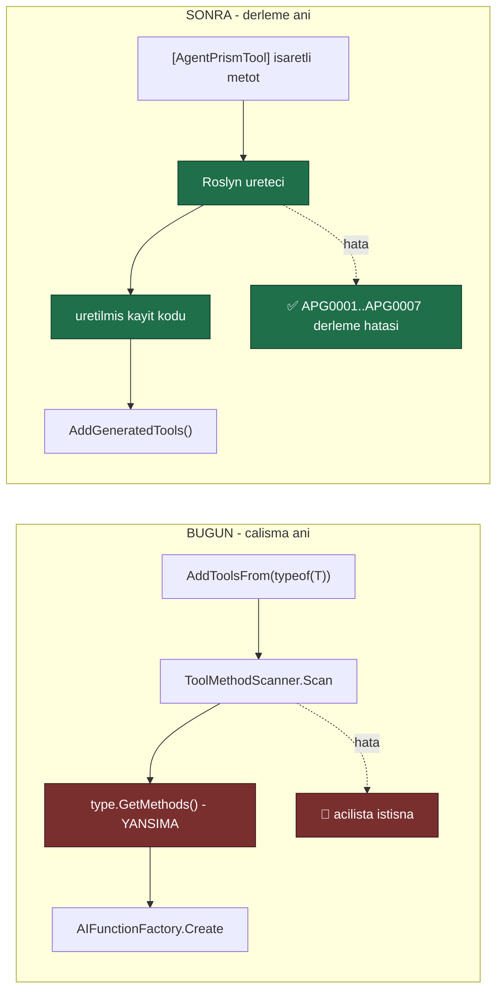

# Faz 52 — Tool Kaynak Üreteci ve Derleme Anı Doğrulama

> **Durum:** ✅ Tamamlandı (2026-08-08)
> **Kaynak:** [ADAYLAR.md](../../ADAYLAR.md) · **F-47**
> **Önkoşul:** Yok
> **Paketler:** `AgentPrism.Abstractions`, `.Core` (üreteç `.Core`'un nupkg'sinde taşınır)
> **Yeni paket:** 🚨 **Yok** — gerekçe [52.4](#524--üreteç-nerede-yaşar-yeni-paket-yok) · **Yeni NuGet:** `Microsoft.CodeAnalysis.CSharp` `4.8.0` (`PrivateAssets=all`) · **Migration:** Yok
> **Public API:** büyüdü — bir sınıf (`AgentPrismGeneratedToolArguments`, `AgentPrism.Abstractions`). 🚨 `IAgentPrismBuilder`'a **DOKUNULMADI** — plandan sapma, bkz. "Plandan Sapmalar"

---

## Bu Faza Başlarken

> `faz-baslangic` skill'ini uygula. Aşağıdaki liste o skill'in 2. adımıdır —
> **tamamını değil, yalnız işaret edilen bölümleri oku.**

1. Bu doküman
2. Kararlar — dosyanın tamamını **okuma**, yalnız bu kalemleri grep'le:
   ```bash
   grep -n "K-007\|K-018\|K-068\|K-218" docs/KARARLAR.md
   ```
   🚨 **K-218** (tool bağımlılıkları **kurulum anında** alınır;
   `AIFunctionArguments.Services` MAF boru hattında **boştur**. Kararın
   yeniden açılma satırı şunu diyor: *"`ToolMethodScanner`'ın örnek-metot
   yolu ayrı bir işte onarılmalıdır"* — **bu faz o iştir**),
   **K-007** (yeni NuGet gerekçe ister), **K-068** (`EnablePublicApiTracking`
   `false`), **K-018** (bellek içi/yerleşik uygulama birinci sınıftır).
3. Alan hafızası (bu faz iki alana dokunuyor):
   [`hafiza/build-ve-analyzer.md`](../../hafiza/build-ve-analyzer.md)
   (**ana kaynak** — analyzer tanıları, `TreatWarningsAsErrors`, AOT işaretleri,
   nupkg yerleşimi),
   [`hafiza/cekirdek-calistirma.md`](../../hafiza/cekirdek-calistirma.md)
   (🚨 K-218'in ölçüm anlatısı — tool'un gördüğü servis sağlayıcı boştur)
4. 🚨 [`MEMORY.md`](../../../MEMORY.md) — **"Dört kapının dördünü de çalıştır"**
   maddesi bu fazın **doğrudan konusudur**: *"Kaynak üreteci build'in analyzer
   geçişinde tanıyı gizleyebilir."* Bu ders bu fazdan **önce** öğrenildi;
   fazın kendisi onun kaynağıdır.
5. Gerektiğinde, tamamı değil ilgili bölümü:
   [`MIMARI.md`](../../MIMARI.md) — tool kaydı bölümü

---

## Amaç

`AgentPrism.Core` ve `AgentPrism.Abstractions` AOT uyumludur. İçlerinde **tek
bir yansıma noktası** kaldı ve o nokta tool kaydıdır. Yansıma iki bedel
ödetiyor: AOT vaadini `[RequiresUnreferencedCode]` ile çağırana devrediyor ve
bir sınıf hatasını **çalışma anına** erteliyor.

Bu faz kaydı derleme anına taşır. Ek kazanç, .NET'in Python ve TypeScript'te
karşılığı olmayan gücüdür: **tool tanımındaki hata derlemede yakalanır.**

- **F-47** — Roslyn kaynak üreteci, derleme anı tanıları ve `ToolMethodScanner`
  yansıma yolunun emekliye ayrılması.

### Bugün ne çalışmıyor — doğrulanmış kanıt

| Kanıt | Gözlem |
|---|---|
| `grep -rln "System.Reflection" src/AgentPrism.Core/ src/AgentPrism.Abstractions/` | 🚨 **Tek dosya:** [`ToolMethodScanner.cs`](../../../src/AgentPrism.Core/Tools/ToolMethodScanner.cs). İki AOT uyumlu paketteki tek yansıma noktası |
| [`ToolMethodScanner.cs:34-35`](../../../src/AgentPrism.Core/Tools/ToolMethodScanner.cs) | `[RequiresUnreferencedCode]` + `[RequiresDynamicCode]`. Uyarı bastırılmıyor, **çağırana iletiliyor** — yani tüketicinin AOT derlemesi uyarı alıyor |
| [`IAgentPrismBuilder.cs:64-67`](../../../src/AgentPrism.Core/IAgentPrismBuilder.cs) | "**Statik siniflar tur argumani olamaz** (C# kurali). Tool'lariniz `static class` icindeyse `AddToolsFrom(Type)` asiri yuklemesini kullanin" — `AddToolsFrom<T>()` en doğal yazımda **derlenmiyor** |
| [`ToolMethodScanner.cs:45`](../../../src/AgentPrism.Core/Tools/ToolMethodScanner.cs) | `type.GetMethods(Flags)` — çalışma anında tarama |
| [`ToolMethodScanner.cs:60-65`](../../../src/AgentPrism.Core/Tools/ToolMethodScanner.cs) | "İşaretli metot yok" hatası **çalışma anındadır**. Derleme yeşil, uygulama açılışta patlar |
| [`ToolMethodScanner.cs:73-78`](../../../src/AgentPrism.Core/Tools/ToolMethodScanner.cs) | Generic metot denetimi de **çalışma anındadır** |

> Kanıtlar 2026-08-06 tarihinde doğrulandı.

### 🚨 Doğrulanmış bir kusur: örnek metot tool'ları çalışmıyor

K-218 (2026-08-05) ölçtü: MAF, `AIFunctionArguments.Services` olarak
`Microsoft.Extensions.AI.EmptyServiceProvider` geçiriyor. Kararın yan bulgusu
şuydu:

> "`ToolMethodScanner` **örnek metot** tool'larını da `arguments.Services` ile
> çözer, dolayısıyla onlar da çalışmaz — depoda hiç örnek-metot tool'u
> olmadığı için hiç görülmedi."

Kod bugün hâlâ öyle
([`ToolMethodScanner.cs:95-105`](../../../src/AgentPrism.Core/Tools/ToolMethodScanner.cs)):

```csharp
return AIFunctionFactory.Create(
    method,
    arguments => arguments.Services is { } services
        ? ActivatorUtilities.GetServiceOrCreateInstance(services, type)
        : throw new AgentPrismException(...),
    options);
```

🚨 **Koruma çalışmıyor.** `arguments.Services` **`null` değildir** — boş bir
sağlayıcıdır. `is { } services` deseni `true` döner, `throw` dalına hiç
girilmez ve `GetServiceOrCreateInstance` ya bağımlılıksız bir nesne kurar ya da
anlaşılmaz bir hata verir. Yazılan hata mesajı **hiçbir zaman görülmez**.

🚨 **Ayrıca doküman kodla çelişiyor.**
[`ToolMethodScanner.cs:21-24`](../../../src/AgentPrism.Core/Tools/ToolMethodScanner.cs)
şöyle diyor:

> "Ornek metotlarinda tasiyici nesne her cagride `AIFunctionArguments.Services`
> uzerinden cozulur; boylece tool sinifi bagimlilik enjeksiyonundan servis
> alabilir"

Bu cümle K-218 tarafından **yanlışlanmıştır**. `AGENTS.md`'nin kuralı nettir:
doküman ile kod çelişirse doküman yanlıştır ve koda göre düzeltilir. Burada
**ikisi de** düzeltilir — kod K-218'e uyacak biçimde, doküman koda göre.

---

## 52.1 — Ne değişir



## 52.2 — Derleme anı tanıları

Üretecin asıl değeri **ürettiği kod değil, verdiği hatalardır**.

| Kod | Ne yakalar | Bugün nerede ortaya çıkıyor |
|---|---|---|
| `APG0001` | Tool adı **çakışması** (aynı ad iki metotta) | 🚨 Hiçbir yerde — son kayıt sessizce kazanıyor olabilir |
| `APG0002` | Tool adı geçersiz karakter taşıyor | Çalışma anı veya sağlayıcı hatası |
| `APG0003` | Desteklenmeyen parametre tipi (serileştirilemez) | Model çağrısı sırasında |
| `APG0004` | Metot **generic** | Çalışma anı ([`ToolMethodScanner.cs:73`](../../../src/AgentPrism.Core/Tools/ToolMethodScanner.cs)) |
| `APG0005` | İşaretli metot **yok** | Çalışma anı ([`ToolMethodScanner.cs:60`](../../../src/AgentPrism.Core/Tools/ToolMethodScanner.cs)) |
| `APG0006` | XML `<summary>` veya `Description` eksik | Hiçbir yerde. Model tool'u ne zaman çağıracağını bilemez |
| `APG0007` | 🚨 **Örnek metot** işaretlenmiş | Hiçbir yerde — **sessizce bozuk** (K-218) |

🚨 **`APG0007` bu fazın en değerli tanısıdır.** K-218'in yan bulgusunu
"depoda hiç örnek-metot tool'u olmadığı için hiç görülmedi" durumundan
"**derlemede yakalanır**" durumuna taşır. Tanı, `IServiceProvider`'ı kurucuda
alan doğru deseni gösterir:

```
APG0007: 'OrderTools.GetStatus' bir ornek metodudur ve tool olamaz.
         MAF, AIFunctionArguments.Services olarak bos bir saglayici gecirir
         (karar K-218). Metodu `static` yapin veya tool'u kurulum aninda
         ornekleyin:
             services.AddSingleton(p => new AgentPrismToolRegistration(
                 AIFunctionFactory.Create(new OrderTools(p).GetStatus), ...));
```

**Şiddet seçimi:** `APG0006` (eksik açıklama) bir **uyarıdır**, diğerleri
**hatadır**. 🚨 Ama bu repoda `TreatWarningsAsErrors` açıktır; uyarı burada
zaten hatadır. Tüketicinin projesinde uyarı kalır ve bilerek bastırılabilir.

## 52.3 — Üretilen kod nasıl çağrılır

Üreteç, işaretli metot taşıyan her sınıf için bir `partial` uzantı üretir ve
hepsini tek bir giriş noktasında toplar:

```csharp
// tuketicinin kodu
internal static class OrderTools
{
    [AgentPrismTool("get_order_status", "Bir siparisin kargo durumunu dondurur.")]
    public static string GetOrderStatus(string orderId) => "kargoda";
}

// kurulum — YANSIMA YOK, AOT UYARISI YOK
builder.Services.AddAgentPrism()
    .AddGeneratedTools();      // ureteclerin urettigi kayitlarin TAMAMI
```

🚨 **`AddGeneratedTools()` derlemeye özeldir.** Üreteç onu tüketicinin
derlemesinde üretir; `AgentPrism.Core` içinde tanımlı değildir. Bu, kaynak
üreteçlerinin standart desenidir ve bir `partial` sınıf üzerinden çalışır.

### `AddToolsFrom` ne olur

**Kaldırılmaz.** İki gerekçe:

1. Faz 7 (yayın) henüz olmadı ama API zaten belgelenmiş ve örneklerde
   kullanılıyor; sessizce kaldırmak sürprizdir.
2. Bir tool sınıfı **başka bir derlemede** olabilir; üreteç oraya bakamaz.
   Yansıma yolu bu durum için meşru bir kaçış kapısıdır.

`AddToolsFrom` `[Obsolete]` **yapılmaz** — kullanımı meşrudur. XML dokümanı
`AddGeneratedTools()`'u önerir ve yansıma yolunun AOT bedelini yazar.

🚨 **Ama K-218 kusuru onarılır:** yansıma yolunda **örnek metot artık kabul
edilmez** ve `AgentPrismException` açıkça atılır. Bugünkü ölü `throw` dalı,
`arguments.Services` boş bir sağlayıcı olduğu için hiç çalışmıyor; denetim
**tarama anına** alınır ve orada kesin çalışır.

## 52.4 — Üreteç nerede yaşar: yeni paket yok

Üç seçenek tartıldı:

| Seçenek | Sonuç |
|---|---|
| Ayrı NuGet paketi (`AgentPrism.Generators`) | ❌ Tüketicinin **ikinci bir `PackageReference`** yazması gerekir. Unutulursa hiçbir şey üretilmez ve sebebi anlaşılmaz. Ayrıca `faz-tamamlama`'nın paket kontrol listesi (README, slnx, meta paket, `DependencyDirectionTests`) devreye girer |
| `AgentPrism.Abstractions` içinde | ❌ Üreteç `netstandard2.0` hedefler; `Abstractions` `net10.0`'dır. Aynı projede iki hedef karmaşası |
| ✅ **Ayrı proje, `AgentPrism.Core`'un nupkg'sinde taşınır** | Tüketici `AgentPrism.Core`'u alır, üreteç kendiliğinden çalışır. Ek paket referansı yok |

```xml
<!-- src/AgentPrism.Core/AgentPrism.Core.csproj -->
<ItemGroup>
  <ProjectReference Include="../AgentPrism.Generators/AgentPrism.Generators.csproj"
                    PrivateAssets="all"
                    ReferenceOutputAssembly="false"
                    OutputItemType="Analyzer" />
</ItemGroup>

<ItemGroup>
  <None Include="$(OutputPath)../../../AgentPrism.Generators/$(Configuration)/netstandard2.0/AgentPrism.Generators.dll"
        Pack="true" PackagePath="analyzers/dotnet/cs" Visible="false" />
</ItemGroup>
```

🚨 **`AgentPrism.Generators` projesi `IsPackable=false`'tır ve slnx'e girer
ama yayımlanmaz.** DLL, `AgentPrism.Core`'un nupkg'sinde
`analyzers/dotnet/cs/` altında taşınır. `System.Text.Json`'ın kendi üretecini
taşıma deseni budur.

### Yeni NuGet bağımlılığı

| Paket | Sürüm | Nereye | Geçişli etki |
|---|---|---|---|
| `Microsoft.CodeAnalysis.CSharp` | **4.14.0** | Yalnız `AgentPrism.Generators` | 🚨 **Sıfır** — `PrivateAssets="all"` ve proje `IsPackable=false` |
| `Microsoft.CodeAnalysis.CSharp.SourceGenerators.Testing.XUnit` | 1.1.2 | Yalnız test projesi | Sıfır |

🚨 **Roslyn sürümü 4.14.0'dır, 5.x DEĞİL.** Kaynak üreteci, kendisini
yükleyen derleyicinin Roslyn sürümüyle **uyumlu veya ondan eski** olmalıdır.
Yeni bir sürüme bağlamak, eski SDK kullanan tüketicide üretecin **sessizce
yüklenmemesine** yol açar. `global.json` bugün `10.0.100` SDK'sını sabitliyor;
🚨 **o SDK'nın taşıdığı Roslyn sürümü uygulama anında ölçülmelidir** ve seçim
ona göre kesinleşir. `4.14.0` bir **taslaktır**.

## 52.5 — 🚨 Üretecin en büyük riski: dört kapı

`MEMORY.md`'nin "her oturumda geçerli" listesinde şu satır var:

> **Dört kapının dördünü de çalıştır.** `dotnet build` tek başına yeşil
> görünürken `dotnet format` 276 `IDE0055` hatası verdi. **Kaynak üreteci
> build'in analyzer geçişinde tanıyı gizleyebilir.**

Bu ders bu fazdan **önce** öğrenildi ve tam olarak bu fazı hedefliyor. Üç
somut önlem:

| Önlem | Neden |
|---|---|
| 🚨 **Üretilen kod `dotnet format`'ı geçmelidir** | Üretilen dosyalar analyzer geçişinden geçer. `IDE0055` yağmuru üretmemek için üreteç **biçimli** kod yazmalıdır |
| 🚨 **Üretilen dosyalar `<auto-generated/>` başlığı taşımalıdır** | Analyzer'ların üretilen kodu atlaması bu başlığa bağlıdır |
| 🚨 **Üretecin kendi testleri olmalıdır** | Aday listesi bunu yazıyor. Üreteci uygulama derlemesiyle test etmek, hatayı gizleyen tam olarak o geçiştir |

Ayrıca üreteç **hiçbir tanıyı yutmaz**: bir sınıf işlenemiyorsa sessizce
atlanmaz, bir tanı üretilir. Sessiz atlama, bugünkü çalışma anı hatasından
**daha kötüdür** — tool hiç kaydolmaz ve kimse fark etmez.

---

## Planlanan Public API

> Taslak imzalardır. Gerçekleşen imzalar kapanışta ayrı bir bölüme yazılır.

```csharp
// AgentPrism.Abstractions — mevcut oznitelige DOKUNULMAZ.
// AgentPrismToolAttribute bugunku hâliyle kalir; ureteci ayni isareti okur.

// AgentPrism.Core/IAgentPrismBuilder.cs — mevcut arayuze bir metot

public interface IAgentPrismBuilder
{
    // ... mevcut uyeler

    /// <summary>
    /// Kaynak ureteci tarafindan bulunan tool'lari kaydeder.
    /// </summary>
    /// <remarks>
    /// <para>
    /// 🚨 Yansima KULLANMAZ. AOT uyarisi uretmez ve tool tanimindaki hatalar
    /// derleme aninda yakalanir (APG0001–APG0007).
    /// </para>
    /// <para>
    /// Yalnizca <strong>bu derlemedeki</strong> isaretli metotlari bulur.
    /// Baska bir derlemedeki tool'lar icin
    /// <see cref="AddToolsFrom(Type)"/> kullanilir.
    /// </para>
    /// </remarks>
    IAgentPrismBuilder AddGeneratedTools();
}
```

🚨 **`IAgentPrismBuilder` public bir arayüzdür. Metot eklemek Faz 7'den
(yayın) sonra KIRICIDIR.** Faz 36 (`IRetentionStore`) ve Faz 45 (`IEvalStore`)
aynı uyarıyı taşıyor. Bu faz üçüncüsüdür ve yayından önce yapılması bu yüzden
önemlidir.

```csharp
// Uretilen kod — tuketicinin derlemesinde olusur (ornek)

// <auto-generated/>
#nullable enable

namespace AgentPrism.Generated;

internal static class AgentPrismGeneratedTools
{
    internal static global::System.Collections.Generic.IReadOnlyList<
        global::AgentPrism.AgentPrismToolRegistration> Create()
        => new global::AgentPrism.AgentPrismToolRegistration[]
        {
            new(
                global::Microsoft.Extensions.AI.AIFunctionFactory.Create(
                    global::MyApp.OrderTools.GetOrderStatus,
                    new global::Microsoft.Extensions.AI.AIFunctionFactoryOptions
                    {
                        Name = "get_order_status",
                        Description = "Bir siparisin kargo durumunu dondurur.",
                    }),
                requiresApproval: false,
                source: "generated"),
        };
}
```

🚨 **`AgentPrismToolRegistration`'ın `source` alanı `"generated"` yazar.**
Alan bugün var ([`AgentPrismToolRegistration.cs:41`](../../../src/AgentPrism.Abstractions/Tools/AgentPrismToolRegistration.cs))
ve teşhis için kullanılır; hangi tool'un nereden geldiği görünür olur.

### HTTP `endpoint`'leri

**Yok.** Bu faz bir derleme zamanı yeteneğidir.

### Arayüz payı

**Yok.**

---

## Planlanan Dosya Listesi

```
src/AgentPrism.Generators/                     (YENI PROJE, IsPackable=false)
├── AgentPrism.Generators.csproj               (netstandard2.0, Roslyn)
├── ToolRegistrationGenerator.cs               (IIncrementalGenerator)
├── ToolCandidate.cs                           (esdegerlik icin record)
├── ToolDiagnostics.cs                         (APG0001–APG0007)
├── ToolNameValidator.cs                       (ad kurallari)
├── ParameterTypeValidator.cs                  (serilestirilebilirlik)
└── SourceWriter.cs                            (bicimli cikti, <auto-generated/>)

src/AgentPrism.Core/
├── AgentPrism.Core.csproj                     (ureteci Analyzer olarak tasir + Pack)
├── IAgentPrismBuilder.cs                      (AddGeneratedTools)
├── AgentPrismBuilder.cs                       (uygulama)
└── Tools/ToolMethodScanner.cs                 (🚨 K-218 onarimi + XML dokuman duzeltmesi)

tests/AgentPrism.Generators.UnitTests/         (YENI TEST PROJESI)
├── AgentPrism.Generators.UnitTests.csproj
├── GeneratedOutputTests.cs
├── DiagnosticTests.cs                         (yedi tani ayri ayri)
└── SnapshotTests.cs                           (uretilen kod bit bit sabit)

samples/AgentPrism.Api/
└── Tools/                                     (AddGeneratedTools'a gecer)

AgentPrism.slnx                                (iki yeni proje)
Directory.Packages.props                       (Microsoft.CodeAnalysis.CSharp + test kutuphanesi)
```

---

## Testler (gerçekleşen)

`tests/AgentPrism.Generators.UnitTests/` — 24 test, `CSharpGeneratorDriver` ile
doğrudan (bkz. Plandan Sapma 5). Ayrıca `ToolRegistrationTests` içine bir
K-218 regresyon testi eklendi (`tests/AgentPrism.Core.UnitTests`).

| Test sınıfı | Neyi doğrular |
|---|---|
| `GeneratedOutputTests` (8 test) | İşaretli statik metot için doğru kayıt kodu; ad verilmezse metot adı; `RequiresApproval`; JSON şeması + zorunluluk; enum → `Enum.Parse<T>`; dizi → `GetArray`; `CancellationToken` şemadan hariç; `async Task<T>` → `await` |
| `DiagnosticTests` (9 test) | `APG0001`–`APG0007`'nin **her biri** ayrı ayrı; `AddGeneratedTools()` çağrılmadan işaretsiz metot **sessizdir**; işlenemeyen bir sınıf sessizce atlanmaz |
| `GeneratedCodeStructureTests` (4 test) | 🚨 Her dosya `<auto-generated/>` başlığı taşır; TAB/satır-sonu-boşluk yok; yansıma API'si (`System.Reflection`, `Activator.`, `GetMethod(`...) hiç geçmez; `AIFunctionFactory` KULLANILMAZ (doğrudan `AIFunction` türetilir) |
| `IncrementalityTests` (2 test) | 🚨 Alakasız bir sabit değişince `ToolCandidates` adımı `Cached`/`Unchanged` kalır; işaretli metodun GÖVDESİ değişince de (model yalnız imza/ad/açıklama taşır, gövde değil) |
| `ToolRegistrationTests.AddToolsFrom_ornek_metodunu_tarama_aninda_reddeder` | 🚨 **K-218 onarımı.** Yansıma yolunda örnek metot **tarama anında** (`AddToolsFrom` çağrısında, ilk tool çağrısını beklemeden) `AgentPrismException` fırlatır; mesaj K-218'e işaret eder |

`dotnet format`/`<auto-generated/>` ve AOT uyumu **yapısal** olarak (yansıma
izi taraması) test edilir; gerçek `dotnet format --verify-no-changes` ve
`dotnet publish -p:PublishAot=true` doğrulamaları örnek uygulama/izole bir
tüketici üzerinde **manuel doğrulama komutlarıyla** yapıldı (aşağıya bkz.) —
bunlar CI'da tekrarlanabilir ama birim testi olarak encode edilmedi (dış
süreç başlatmak gerektirir).

---

## Açık Sorular

> Planı bloklamayan, faz uygulanırken karara bağlanacak sorular.

| # | Soru | Seçenekler | Öneri |
|---|---|---|---|
| 1 | Roslyn sürümü ne olmalı? | A: **4.14.0** · B: 5.0.0 | **A bir taslaktır.** 🚨 `global.json`'daki SDK 10.0.100'ün taşıdığı Roslyn sürümü **uygulama anında ölçülmelidir**. Üretecin Roslyn'i, yükleyen derleyicininkinden **yeni olamaz**; yeni olursa üreteç sessizce yüklenmez |
| 2 | `AddToolsFrom` `[Obsolete]` olsun mu? | A: **hayır** · B: evet | **A.** Başka bir derlemedeki tool'lar için meşru tek yoldur. XML dokümanı `AddGeneratedTools()`'u önerir ve AOT bedelini yazar |
| 3 | Üreteç `AgentPrism.Core`'un kendi tool'larını da üretsin mi? | A: **evet** · B: hayır | **A.** `AgentPrism.Core`'daki yerleşik tool'lar (dosya belleği, todo) üretecin **ilk tüketicisi** olur. Kendi ürettiğimizi kullanmak en iyi testtir |
| 4 | `APG0006` (eksik açıklama) uyarı mı hata mı? | A: **uyarı** · B: hata | **A.** Bu repoda `TreatWarningsAsErrors` zaten hata yapar; tüketicinin projesinde bastırılabilir kalmalıdır. Bir kütüphane, tüketicinin derlemesini kırma hakkını dikkatli kullanır |
| 5 | Desteklenen parametre tipleri nasıl belirlenir? | A: **beyaz liste** · B: kara liste | **A.** İlkel tipler, `string`, `DateTimeOffset`, `Guid`, enum, `record`/`class` (public parametresiz kurucu veya `[JsonConstructor]`), diziler ve `IReadOnlyList<T>`. Kara liste yeni tiplerde sessizce yanılır |
| 6 | Üretilen kayıt DI'a nasıl girer? | A: **`AddGeneratedTools()` çağrısıyla açık** · B: modül başlatıcıyla otomatik | **A.** `[ModuleInitializer]` sihirdir ve K1'i (sıfır sürpriz) zorlar. Açık çağrı ne olduğunu gösterir |
| 7 | `partial` sınıf mı, statik sınıf mı üretilsin? | A: **internal statik sınıf + uzantı metodu** · B: kullanıcının `partial` sınıfını doldur | **A.** B, kullanıcının sınıfını `partial` yazmasını gerektirir; bu bir sürprizdir ve derleme hatası olarak görünür |
| 8 | Örnek uygulama `AddGeneratedTools`'a geçsin mi? | A: **evet** | **A.** DoD'deki "örnek uygulamayla gerçek `run`" ölçütü ancak böyle gerçek bir kanıt üretir |

---

## Bitiş Ölçütleri (DoD)

- [x] İşaretli statik metotlar için doğru kayıt kodu üretilir ve
      `AddGeneratedTools()` ile kaydolur — `OrderTools`'un üç tool'u
      (`get_order_status`, `list_recent_orders`, `cancel_order`) `/agentprism/api/tools`'ta
      `"source":"generated"` ile görüldü
- [x] 🚨 Üretilen kod `[RequiresUnreferencedCode]`/`[RequiresDynamicCode]`
      **gerektirmez**; AOT uyarısı **yok** — izole bir tüketici projesi
      `dotnet publish -c Release -r osx-arm64 -p:PublishAot=true` ile **sıfır**
      `IL2xxx`/`IL3xxx` uyarısıyla derlendi ve AOT ikilisi `AddGeneratedTools()`'u
      çalıştırdı
- [x] Yedi tanının **her biri** ayrı bir testle doğrulandı (`APG0001`–`APG0007`) —
      `DiagnosticTests`, 9 test
- [x] 🚨 `APG0007` örnek metotları derlemede yakalar ve mesaj K-218'in doğru
      desenini gösterir — `samples/AgentPrism.Api`'de gerçek bir örnek-metot
      tool'u eklenip build çalıştırılarak doğrulandı (aşağıdaki komut 7)
- [x] 🚨 **K-218 onarıldı:** yansıma yolunda örnek metot **tarama anında**
      reddedilir; `ToolMethodScanner`'ın yanlış XML dokümanı düzeltildi
- [x] 🚨 İşlenemeyen bir sınıf **sessizce atlanmaz**; her zaman bir tanı üretilir
- [x] 🚨 Üretilen kod `dotnet format --verify-no-changes` **geçer** —
      `dotnet format AgentPrism.slnx --verify-no-changes --no-restore` tüm
      çözüm üzerinde sıfır değişiklikle çıktı (exit code 0)
- [x] 🚨 Her üretilen dosya `<auto-generated/>` başlığı taşır
- [x] Üretecin **kendi test projesi** vardır ve uygulama derlemesinden bağımsız koşar —
      `tests/AgentPrism.Generators.UnitTests`, 24/24 test yeşil
- [ ] `AgentPrism.Core`'un yerleşik tool'ları üreteçten geçer — **UYGULANAMAZ**:
      `AgentPrism.Core`'da bugün hiç `[AgentPrismTool]` işaretli yerleşik tool
      yok (doğrulandı, bkz. Plandan Sapma 7); icat etmek kapsam dışıydı
- [x] `AddToolsFrom` statik metotlarla **çalışmaya devam eder** —
      `ToolRegistrationTests.AddToolsFrom_yalnizca_isaretli_metotlari_kaydeder` ve kardeşleri yeşil
- [x] 🚨 `AgentPrism.Generators` yayımlanmaz (`IsPackable=false`); DLL
      `AgentPrism.Core` nupkg'sinde `analyzers/dotnet/cs/` altındadır —
      **`dotnet pack` çıktısı açılıp doğrulandı** (`unzip -l`, 52736 bayt DLL görüldü)
- [x] 🚨 `Microsoft.CodeAnalysis.CSharp` tüketicinin bağımlılık grafiğine
      **girmez** — izole bir dış tüketici projesinde (yalnız `PackageReference`)
      `dotnet list package --include-transitive` "TEMİZ" döndü
- [x] 🚨 **Roslyn sürüm uyumu ölçüldü** ve seçilen sürüm buraya yazıldı —
      `4.8.0` (K-349); ölçüm: .NET8 SDK→`4.8.0`, .NET9 SDK→`4.14.0`, .NET10 SDK→`5.0.0`
- [x] Dört doğrulama kapısı sıfır uyarı verir — `dotnet build`/`test`/`pack`/`format`
      tüm çözüm üzerinde çalıştırıldı, dördü de temiz (SqlServer container
      hazır-olma zaman aşımı HARİÇ — Faz 52 SqlServer'a dokunmuyor, bkz.
      "Sonraki Faza Devir Notu" madde 5)
- [x] `samples/AgentPrism.Api` `AddGeneratedTools()` kullanır ve gerçek `run`
      yapıldı; çıktı bu belgeye yazıldı (aşağıya bkz.)
- [x] `secret` taraması boş döndü (Faz 52'nin diff'i için; dosyada önceden var
      olan iki yanlış-pozitif Faz 51'den kalma, kod-içi enterpolasyon örneği)

### Doğrulama komutları

```bash
# 1) Uretilen kodu gor
dotnet build samples/AgentPrism.Api -c Release \
  -p:EmitCompilerGeneratedFiles=true \
  -p:CompilerGeneratedFilesOutputPath=obj/generated
find samples/AgentPrism.Api/obj/generated -name "*.g.cs" -exec head -30 {} \;

# 2) 🚨 Uretilen kod dotnet format'i geciyor mu
dotnet format samples/AgentPrism.Api --verify-no-changes --no-restore

# 3) 🚨 Roslyn surumu — SDK'nin tasidigiyla uyumlu mu
dotnet build src/AgentPrism.Generators -c Release -v n 2>&1 | grep -i "roslyn\|CodeAnalysis"
ls "$(dotnet --list-sdks | tail -1 | sed 's/.*\[//;s/\]//')/10.0.100/Roslyn/bincore/" 2>/dev/null | head

# 4) 🚨 nupkg icinde ureteç dogru yerde mi
dotnet pack src/AgentPrism.Core -c Release -o /tmp/apk
unzip -l /tmp/apk/AgentPrism.Core.*.nupkg | grep -i "analyzers/dotnet/cs"

# 5) 🚨 Roslyn tuketiciye SIZMAMALI
dotnet list samples/AgentPrism.Api package --include-transitive \
  | grep -i "CodeAnalysis" || echo "TEMIZ"

# 6) Tanilar — her biri ayri ayri (uretec test projesi)
dotnet test tests/AgentPrism.Generators.UnitTests -c Release

# 7) 🚨 Ornek metot artik derlemede yakalaniyor mu
cat > /tmp/apg0007.cs <<'EOF'
using AgentPrism;
internal sealed class BozukTool
{
    [AgentPrismTool("kotu")]
    public string Getir(string id) => id;   // ORNEK metot -> APG0007
}
EOF
cp /tmp/apg0007.cs samples/AgentPrism.Api/Tools/
dotnet build samples/AgentPrism.Api -c Release 2>&1 | grep APG0007
rm samples/AgentPrism.Api/Tools/apg0007.cs

# 8) AOT — uretilen yol uyari uretmemeli
dotnet publish samples/AgentPrism.Api -c Release -r osx-arm64 \
  -p:PublishAot=true 2>&1 | grep -Ei "IL2|IL3" || echo "AOT TEMIZ"

# 9) Ornek uygulama gercek run
curl -s -X POST http://localhost:5081/agentprism/api/agents/support/run \
  -H "content-type: application/json" \
  -d '{"message":"12345 numarali siparisim nerede"}'
curl -s http://localhost:5081/agentprism/api/tools | jq '.[] | {name, source}'
#    source "generated" gorulmeli
```

### Gerçek çalıştırma kanıtı (2026-08-08)

`samples/AgentPrism.Api` gerçek OpenAI kimlik bilgileriyle (`dotnet user-secrets`)
`support` agent'ı üzerinden çalıştırıldı — model gerçekten `get_order_status`
tool çağrısı yaptı, üretilen `AIFunction` sarmalayıcısı JSON argümanından
`orderId="12345"`'i çıkardı, `OrderTools.GetOrderStatus` çağrıldı ve sonuç
modele geri döndü:

```
POST /agentprism/api/agents/support/run  {"message":"12345 numarali siparisim nerede"}
→ run tamamlandı (status: Completed, 32 olay, gerçek OpenAI usage: 274+31=305 token)
→ model çağrısı: get_order_status(orderId="12345")
→ nihai metin: "...siparişiniz **kargoya verilmiş**. Tahmini teslim süresi: **2 gün**."
```

`OrderTools.GetOrderStatus` gövdesi tam olarak `"{orderId} numarali siparis
kargoya verildi. Tahmini teslim: 2 gun."` döner — model bunu paraphrase
etti. `/agentprism/api/tools` üç `OrderTools` girdisinin tamamında
`"source":"generated"` gösterdi.

AOT doğrulaması: izole bir tüketici projesi (`PackageReference` ile
`AgentPrism.Core`, `dotnet publish -r osx-arm64 -p:PublishAot=true`) **sıfır**
`IL2xxx`/`IL3xxx` uyarısıyla derlendi; üretilen ikili çalıştırılıp
`AddGeneratedTools()`'un gerçekten kayıt yaptığı doğrulandı.

APG0007 doğrulaması: `samples/AgentPrism.Api/Tools/` altına geçici bir
örnek-metot tool'u eklenip build koşuldu; `APG0007` gerçek bir derleme
hatası olarak çıktı, mesaj K-218'e işaret etti (dosya sonra kaldırıldı).

---

## Riskler

| Risk | Önlem |
|------|-------|
| 🚨 **Üreteç build'in analyzer geçişinde tanıyı gizler** (`MEMORY.md`) | Ayrı test projesi, `dotnet format` kapısı, `<auto-generated/>` başlığı. Üç ayrı DoD kalemi |
| 🚨 Roslyn sürümü SDK'nınkinden yeniyse üreteç **sessizce yüklenmez** | Sürüm **ölçülür** ve buraya yazılır. Ayrı bir doğrulama komutu var |
| 🚨 `Microsoft.CodeAnalysis` tüketicinin grafiğine sızar | `PrivateAssets="all"` + `ReferenceOutputAssembly="false"` + `IsPackable=false`. `dotnet list package` ile doğrulanır |
| Üreteç bir sınıfı sessizce atlar ve tool hiç kaydolmaz | Sessiz atlama **yasaktır**; her başarısızlık bir tanı üretir. Ayrı test |
| Roslyn ayrı bir uzmanlıktır ve tahmini zor | Kapsam yedi tanı ve tek bir üretim deseniyle **sınırlıdır**. Artımlı üreteç (`IIncrementalGenerator`) sözleşmesi bir testle korunur |
| ~~`AddGeneratedTools()` `IAgentPrismBuilder`'a metot ekler~~ | ✅ **Gerçekleşmedi.** Plandan sapıldı (K-350): uzantı metodu derlemeye özel üretilir, arayüz hiç değişmedi. Faz 36/45 ile "aynı sınıf" olma riski Faz 52 için ORTADAN KALKTI |
| 🚨 (ölçülen, plan öngörmemişti) `OutputItemType=Analyzer` çok-sıçramalı `ProjectReference` zincirinde yayılmaz | Gerçek NuGet tüketicisi (`PackageReference`) etkilenmez — izole projeyle doğrulandı. Bu repo içindeki örnekler (samples/, gelecekte açılacak başka bir örnek) doğrudan bir `Analyzer` `ProjectReference`'ı daha almalı |
| Üretilen kod tüketicinin `dotnet format` kapısını kırar | Üreteç biçimli yazar; örnek uygulama üzerinde ayrı bir doğrulama komutu koşar |
| Beyaz liste bir tipi haksız yere reddeder | `APG0003` mesajı desteklenen tipleri **listeler**; tüketici `AddTool(AIFunctionFactory.Create(...))` ile kaçış yolunu kullanabilir |
| `AgentPrism.Generators` yayımlanmaz ama slnx'e girer | `IsPackable=false`; `faz-tamamlama`'nın paket kontrol listesi yalnız yayımlanan paketler içindir ve bu proje o listeye **girmez** |

---

<!-- ============================================================
     AŞAĞISI KAPANIŞTA DOLDURULUR — `faz-tamamlama` skill'i.
     Plan anında boş kalır. Başlıkları SİLME.
     ============================================================ -->

## Plandan Sapmalar

1. 🚨 **`AddGeneratedTools()` `IAgentPrismBuilder`'a EKLENMEDİ.** Plan'ın
   "Planlanan Public API" bölümü onu arayüz üyesi olarak taslaklamıştı, ama
   aynı planın 52.3 bölümü ve Açık Soru 7'nin cevabı ("A: internal statik
   sınıf + uzantı metodu") zaten çelişiyordu. Çelişki teknik bir imkânsızlıkla
   çözüldü: `AgentPrism.Core` **derlenirken** tüketicinin `AgentPrism.Generated`
   ad alanındaki sınıfı henüz yoktur — Core, henüz üretilmemiş bir tipe ileri
   referans veremez. Gerçek çözüm: üreteç HER tüketici derlemesinde kendi
   `AddGeneratedTools()` uzantı metodunu (`namespace AgentPrism`, `public
   static class AgentPrismGeneratedToolsBuilderExtensions`) üretir. Sonuç:
   `IAgentPrismBuilder` **hiç değişmedi** — Faz 7'den önce kırıcı-değişiklik
   riski bu fazdan tamamen kalktı (Faz 36/45 ile "aynı sınıf" olma durumu artık
   geçerli değil).
2. 🚨 **`OutputItemType=Analyzer`, çok-sıçramalı `ProjectReference` zincirinde
   YAYILMAZ — ölçüldü.** `samples/AgentPrism.Api` → `AgentPrism` (meta) →
   `AgentPrism.Core` → `AgentPrism.Generators` zincirinde `AddGeneratedTools()`
   `CS1061` verdi. NuGet'in `analyzers/dotnet/cs` yayılımı yalnız **paket**
   tüketiminde (`PackageReference`) geçerlidir; düz `ProjectReference` zinciri
   bunu MİRAS ALMAZ. Çözüm: `samples/AgentPrism.Api.csproj`'a **doğrudan** bir
   `OutputItemType=Analyzer` `ProjectReference` daha eklendi (yalnız bu repo
   için gerekli — gerçek bir NuGet tüketicisi `AgentPrism.Core`'u
   `PackageReference` ile alır ve bu satıra ihtiyaç duymaz; izole bir tüketici
   projesiyle DOĞRULANDI, aşağıya bkz.).
3. **`dotnet pack`'in çok-hedefli (net8/9/10) orkestrasyonunda basit
   `BeforeTargets="_GetPackageFiles"` YETMEDİ.** `@(Analyzer)` item grubu
   yalnız İÇ (TFM'e özgü) derlemede doludur; dıştaki çapraz-hedefleme
   derlemesinde BOŞTUR (ölçüldü, boş `DEBUG` çıktısıyla doğrulandı). Resmi
   çözüm `TargetsForTfmSpecificContentInPackage` + `TfmSpecificPackageFile`
   kullanmaktır — bu hedef HER iç derleme için tekrar çalışır. Üreteç DLL'i
   TFM'den bağımsız olduğu için üç kez eklemek `NU5118` verdi ("dosya zaten
   var"); hedef `Condition="'$(TargetFramework)' == 'net10.0'"` ile tek bir
   TFM'e sabitlendi.
4. 🚨 **Beyaz liste `record`/`class` (composite) parametre tiplerini
   KAPSAMAZ** — Açık Soru 5'in "A: evet, composite dahil" önerisinden sapıldı.
   Composite tip AOT-güvenli bağlamak ya reflection (`JsonSerializer`
   reflection yolu → `RequiresUnreferencedCode`, AOT DoD'sini bozar) ya da
   ikinci bir iç içe kaynak üreteci (kullanıcının `JsonSerializerContext`'i,
   TEK derleme geçişinde başka bir üretecin çıktısını görüp göremeyeceği
   Roslyn'de belgelenmemiş/garantisiz bir davranış) gerektirirdi. Gerçek
   whitelist: ilkel sayısal tipler, `bool`, `string`, `Guid`, `DateTime`,
   `DateTimeOffset`, `enum`, bunların `Nullable<T>`'i, dizi/`IReadOnlyList<T>`
   ve `CancellationToken`. `APG0003` composite tipi açıkça reddeder ve kaçış
   yolunu (`AddTool(AIFunctionFactory.Create(...))`) gösterir — DoD'nin "beyaz
   liste haksız reddi" riski zaten bunu öngörmüştü.
5. **`Microsoft.CodeAnalysis.CSharp.SourceGenerators.Testing.XUnit`
   KULLANILMADI** (doğrulama komutu 6'nın taslağından sapma). Paket
   `xunit.assert 2.3.0`'a (klasik xunit v2) bağımlıdır; bu repo `xunit.v3` +
   Microsoft Testing Platform kullanır (`tests/Directory.Build.props`). İkisi
   aynı test projesinde `[Fact]`/`[Theory]` çakışmasına yol açardı. Testler
   `CSharpGeneratorDriver` ile DOĞRUDAN yazıldı — aynı kapsam
   (`tests/AgentPrism.Generators.UnitTests/GeneratorTestHelper.cs`), tek test
   kosucusu.
6. **Roslyn sürümü ölçüldü: `4.8.0`, taslaktaki `4.14.0` DEĞİL.** .NET 8 SDK
   GA Roslyn `4.8.0` taşır (dotnet/roslyn#70919, WebSearch ile doğrulandı); .NET
   9 SDK (9.0.305/306, bu makinede kurulu) `4.14.0`; .NET 10 SDK (10.0.100)
   `5.0.0` taşır (üçü de `AssemblyName.GetAssemblyName` ile ölçüldü). AgentPrism
   net8.0'ı da hedeflediği (K-005) ve bir tüketici net8.0 projesini eski bir
   8.0.1xx SDK ile derleyebileceği için taban en düşük olan `4.8.0`'dır.
7. **`AgentPrism.Core`'un yerleşik tool'ları üreteçten GEÇMEDİ** (Açık Soru
   3'ün "A: evet" cevabı uygulanamadı) — çünkü böyle bir yerleşik tool
   (dosya belleği, todo vb.) bugün **hiç yok**; doğrulandı
   (`grep -rln "AgentPrismTool\]" src/AgentPrism.Core/` yalnız
   `ToolMethodScanner.cs`'in kendi XML dokümanını buluyor). Kapsam dışına
   yeni tool icat etmek K1'i (yalnız istenen) ihlal ederdi.

## Bu Fazda Verilen Kararlar

- **K-347 — K-218 kapatıldı: `ToolMethodScanner` örnek metotları TARAMA
  ANINDA reddeder** (2026-08-08). Eski kod `arguments.Services is { }
  services ? ... : throw` deseniyle reddi ÇAĞRI ANINA erteliyordu; `Services`
  hiçbir zaman `null` olmadığı (MAF `EmptyServiceProvider` geçirir) için
  `throw` dalı hiç çalışmıyordu. Onarım: `CreateFunction` artık
  `!method.IsStatic` denetimini `Scan()` içinde, ilk tool çağrısını beklemeden
  yapar. `ToolMethodScanner`'ın XML dokümanındaki yanlış iddia ("örnek
  metotları `Services` üzerinden servis alabilir") da düzeltildi. Regresyon
  testi: `ToolRegistrationTests.AddToolsFrom_ornek_metodunu_tarama_aninda_reddeder`.
- **K-348 — Kaynak üreteci ayrı bir NuGet paketi değildir; `AgentPrism.Core`
  nupkg'sinde `analyzers/dotnet/cs/` altında taşınır** (2026-08-08). Gerekçe
  52.4: tüketici ikinci bir `PackageReference` yazmak zorunda kalmaz.
  Uygulama: `ProjectReference` `PrivateAssets=all` + `ReferenceOutputAssembly=false`
  + `OutputItemType=Analyzer`; nupkg'ye taşıma `TargetsForTfmSpecificContentInPackage`
  + `TfmSpecificPackageFile` ile (bkz. Plandan Sapma 3). Doğrulandı:
  `dotnet pack src/AgentPrism.Core -c Release -o /tmp/apk` sonrası
  `unzip -l` çıktısında `analyzers/dotnet/cs/AgentPrism.Generators.dll`
  görüldü; `.nuspec`'te `Microsoft.CodeAnalysis.CSharp` bağımlılığı YOK;
  izole bir dış tüketici projesinde (yalnız `PackageReference`)
  `dotnet list package --include-transitive` "TEMİZ" döndü.
- **K-349 — Kaynak üretecinin Roslyn sürümü `Microsoft.CodeAnalysis.CSharp
  4.8.0`'dır** (2026-08-08). Ölçüm: .NET 8 SDK GA → Roslyn `4.8.0`; .NET 9 SDK
  (9.0.305/306) → `4.14.0`; .NET 10 SDK (10.0.100) → `5.0.0`
  (`Microsoft.CodeAnalysis.CSharp.dll`'in `AssemblyName`/`FileVersionInfo`'su
  ile). AgentPrism net8.0'ı da hedeflediği için (K-005) taban en eski
  desteklenen SDK'nın Roslyn'idir; daha yeni bir sürüm seçmek üreteci eski
  SDK'larda SESSİZCE devre dışı bırakırdı. | Yeniden açılma: AgentPrism'in
  minimum desteklenen .NET 8 SDK yama sürümü yükseltilirse (K-005 ile
  birlikte) ölçüm tekrarlanmalıdır.
- **K-350 — `AddGeneratedTools()` derlemeye özel üretilmiş bir uzantı
  metodudur; `IAgentPrismBuilder`'a EKLENMEDİ** (2026-08-08). Bkz. Plandan
  Sapma 1. `IAgentPrismBuilder` bu fazda **hiç değişmedi** — Faz 7'den önce
  kırıcı-değişiklik riski taşımaz.
- **K-351 — Parametre tipi beyaz listesi `record`/`class` (composite) tipleri
  KAPSAMAZ; `APG0003` ile reddedilir** (2026-08-08). Bkz. Plandan Sapma 4.
  Whitelist: ilkel sayısal tipler, `bool`, `string`, `Guid`, `DateTime(Offset)`,
  `enum`, `Nullable<T>`, dizi/`IReadOnlyList<T>`, `CancellationToken`. |
  Yeniden açılma: composite tip desteği istenirse, ikinci bir kaynak üreteci
  (`JsonSerializerContext` üretimi) ile TEK derleme geçişinde çok-üreteç
  etkileşiminin gerçekten çalıştığı ÖLÇÜLMELİDİR — varsayılmamalıdır.

## Gerçekleşen Public API

```csharp
// AgentPrism.Abstractions/Tools/AgentPrismGeneratedToolArguments.cs
// Yalniz uretilen kodun cagirdigi yardimci sinif; public olmasinin tek sebebi
// uretilen kodun TUKETICININ derlemesinde olusmasidir.
public static class AgentPrismGeneratedToolArguments
{
    public static T GetRequired<T>(AIFunctionArguments arguments, string name, Func<JsonElement, T> convert);
    public static T GetOptional<T>(AIFunctionArguments arguments, string name, Func<JsonElement, T> convert, T defaultValue);
    public static IReadOnlyList<T> GetArray<T>(AIFunctionArguments arguments, string name, Func<JsonElement, T> convert, bool required, IReadOnlyList<T>? defaultValue);
}

// AgentPrism.Generators/ToolRegistrationGenerator.cs
[Generator(LanguageNames.CSharp)]
public sealed class ToolRegistrationGenerator : IIncrementalGenerator { ... }

// Tuketicinin KENDI derlemesinde uretilir (AgentPrism.Core'a EKLENMEDI - bkz. Plandan Sapma 1):
namespace AgentPrism
{
    public static class AgentPrismGeneratedToolsBuilderExtensions
    {
        public static IAgentPrismBuilder AddGeneratedTools(this IAgentPrismBuilder builder);
    }
}
```

`IAgentPrismBuilder` **değişmedi** — plandaki taslak imza gerçekleşmedi (bkz. Plandan Sapma 1).

## Dosya Listesi (gerçekleşen)

```
src/AgentPrism.Generators/                     (YENI PROJE, IsPackable=false, netstandard2.0)
├── AgentPrism.Generators.csproj
├── AnalyzerReleases.Shipped.md                 (bos - hicbir surum henuz "shipped")
├── AnalyzerReleases.Unshipped.md               (APG0001-APG0007)
├── PolyfillIsExternalInit.cs                   (netstandard2.0'da record/init icin)
├── ToolRegistrationGenerator.cs                (IIncrementalGenerator, TrackingNames)
├── ToolCandidate.cs                            (ToolCandidate, ToolEmitModel, DiagnosticInfo, ReturnKind)
├── ToolDiagnostics.cs                          (APG0001-APG0007 DiagnosticDescriptor'lari)
├── ToolNameValidator.cs
├── ParameterTypeValidator.cs                   (ITypeSymbol -> ParameterModel esleme)
├── ParameterModel.cs                           (ParameterShape, LeafType, LeafTypeKind)
├── SourceWriter.cs                             (bicimli cikti, JSON sema, InvokeCoreAsync govdesi)
├── SourceLocation.cs                           (Location'in onbelleklenebilir izdusumu)
└── EquatableArray.cs                           (IIncrementalGenerator onbellekleme icin)

src/AgentPrism.Core/
├── AgentPrism.Core.csproj                      (Generators'i Analyzer olarak tasir + TfmSpecificPackageFile ile pack eder)
└── Tools/ToolMethodScanner.cs                  (K-218 onarimi: instance metot TARAMA aninda reddedilir)

src/AgentPrism.Abstractions/Tools/AgentPrismGeneratedToolArguments.cs   (YENI - uretilen kodun cagirdigi yardimci sinif)

tests/AgentPrism.Generators.UnitTests/          (YENI TEST PROJESI, CSharpGeneratorDriver ile - Testing.XUnit paketi KULLANILMADI)
├── AgentPrism.Generators.UnitTests.csproj
├── GeneratorTestHelper.cs
├── GeneratedOutputTests.cs                     (8 test - basarili siniflandirma, sema, async, dizi, enum, CancellationToken)
├── DiagnosticTests.cs                          (9 test - APG0001-APG0007 + "hicbir zaman sessiz degil")
├── GeneratedCodeStructureTests.cs              (4 test - auto-generated basligi, format temizligi, yansima izi yok, AIFunctionFactory kullanilmiyor)
└── IncrementalityTests.cs                      (2 test - alakasiz degisiklik + govde degisikligi onbellegi bozmaz)

samples/AgentPrism.Api/
├── Program.cs                                  (AddToolsFrom -> AddGeneratedTools)
└── AgentPrism.Api.csproj                       (dogrudan Analyzer ProjectReference - yalniz bu repo icin, bkz. Plandan Sapma 2)

tests/AgentPrism.Core.UnitTests/Tools/ToolRegistrationTests.cs   (guncellendi: K-218 regresyon testi)
tests/AgentPrism.Core.UnitTests/Architecture/DependencyDirectionTests.cs   (guncellendi: Generators izinli referans)

Directory.Packages.props                        (Microsoft.CodeAnalysis.CSharp 4.8.0)
AgentPrism.slnx, AgentPrism.src.slnf             (iki yeni proje/proje referansi)
```

## Sonraki Faza Devir Notu

1. 🚨 **`AgentPrism.Core`'un yansıma ayak izi DEĞİŞMEDİ — hâlâ tam olarak tek
   nokta** (`ToolMethodScanner.cs`, `grep -rln "System.Reflection"
   src/AgentPrism.Core/ src/AgentPrism.Abstractions/` ile ölçüldü, TEK dosya
   döner). `AddToolsFrom`/`AddTool(Delegate)` BİLİNÇLİ olarak kaldı (Plandan
   Sapma 1, K-350). Bu fazın gerçek kazanımı **varsayılan/önerilen** yolun artık
   yansımasız olması: `AddGeneratedTools()` derleme anında üretilir, sıfır
   `RequiresUnreferencedCode`/`RequiresDynamicCode` taşır. `MIMARI.md` bölüm 9
   ve `hafiza/build-ve-analyzer.md` bu ayrımla güncellendi — "yansımasız" ve
   "yansıma isteğe bağlı bir kaçış yoludur" birbirinden FARKLI iddialardır,
   karıştırılmamalıdır.
2. **Üreteç altyapısı kuruldu ve ikinci bir üreteç ucuzdur.** F-42
   (yapılandırılmış çıktı, zaten [Faz 38](38-YAPILANDIRILMIS-CIKTI.md)'de
   tamamlandı — `JsonSerializerContext` ihtiyacı orada elle çözüldü) gibi
   gelecekteki bir ihtiyaç `src/AgentPrism.Generators/` projesine YENİ bir
   `IIncrementalGenerator` sınıfı ekleyebilir; **ikinci bir proje
   açılmamalıdır**. `EquatableArray<T>`, `SourceLocation`, polyfill zaten
   paylaşılabilir.
3. **`AddToolsFrom` yaşamaya devam ediyor**, `[Obsolete]` değil ve
   `IAgentPrismBuilder` bu fazda hiç değişmedi (bkz. Plandan Sapma 1) — Faz
   7'nin public yüzey dondurma riski bu fazdan **kalktı**.
4. 🚨 **Örnek metot tool'ları hâlâ desteklenmiyor.** `APG0007` (derleme anı)
   ve `ToolMethodScanner`'ın tarama-anı reddi (K-347, çalışma anı) onu artık
   AÇIKÇA görünür kılıyor ama ÇÖZMÜYOR. MAF `functionInvocationServices`'i
   `AsAIAgent` üzerinden akıtırsa (K-218'in yeniden açılma koşulu) her iki
   red de kaldırılabilir.
5. 🚨 **Bu ortamda `AgentPrism.SqlServer.IntegrationTests` doğrulanamadı** —
   Testcontainers SQL Server imajı bu sandbox'ta hazır olma denetimini
   ~17 saniyede zaman aşımına uğratıyor (iki kez denendi, ikisi de aynı
   sonucu verdi). Faz 52 `AgentPrism.SqlServer`'a **hiç dokunmuyor**; bu
   Docker kaynak kısıtı önceden var olan bir ortam sınırlamasıdır, kod
   regresyonu değildir. Sonraki oturum Docker'a daha fazla bellek/CPU
   ayrılmış bir ortamda tekrar denemelidir.
6. **Faz 7 (yayın) hâlâ sıradaki faz DEĞİLDİR** (K-068 geçerli, kullanıcı
   kararı bekliyor). Faz 52 F-47'yi kapattı; `ADAYLAR.md`'deki
   kalan 20 kalemden biri seçilirse `faz-planlama` skill'i ile yeni bir faz
   dokümanına dönüştürülür.
