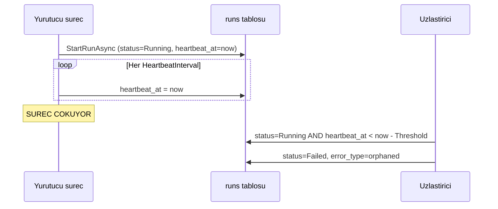

# Faz 54 — Öksüz Çalıştırma Uzlaştırması

> **Durum:** ✅ Tamamlandı (2026-08-09)
> **Kaynak:** [ADAYLAR.md](../../ADAYLAR.md) · **F-36**
> **Önkoşul:** [Faz 42](42-TEK-YURUTUCU-SECIMI.md) — `ISingletonLeaseStore` · [Faz 46](46-DAYANIKLI-CALISTIRMA.md) — bu fazın kapsamını **daraltan** faz
> **Paketler:** `AgentPrism.Abstractions`, `AgentPrism.Core`, `AgentPrism.Sql.Shared`
> **Yeni paket:** Yok · **Migration:** gerekli — `runs` tablosuna heartbeat sütunu, numara uygulama anında alınır
> **Public API:** büyüyor — bir ayar sınıfı ve `IRunStore`'a iki metot. Faz 7'den önce ucuz

---

## Bu Faza Başlarken

> `faz-baslangic` skill'ini uygula.

1. Bu doküman
2. Kararlar — dosyanın tamamını **okuma**, yalnız bu kalemleri grep'le:
   ```bash
   grep -n "K-138\|K-158\|K-355" docs/KARARLAR.md
   ```
   **K-138** (benzersiz kısıt cron çift tetiklemesini zaten kapatıyor),
   **K-158** (hız sınırı bilerek bellekte),
   **K-355** (alt yazma yolları **beklenen** kiracıyı taşır — uzlaştırma da bir yazmadır)
3. [`46-DAYANIKLI-CALISTIRMA.md`](46-DAYANIKLI-CALISTIRMA.md) — yalnız devir notu:
   ```bash
   awk '/## Sonraki Faza Devir Notu/,0' docs/arsiv/fazlar/46-DAYANIKLI-CALISTIRMA.md
   ```
   🚨 **Bu adım atlanamaz.** O notun 1. maddesi bu fazın kapsamını daraltıyor.
4. [`42-TEK-YURUTUCU-SECIMI.md`](42-TEK-YURUTUCU-SECIMI.md) — yalnız `SingletonGuard` kullanımı
5. Alan hafızası: [`hafiza/sql-saglayicilari.md`](../../hafiza/sql-saglayicilari.md) (üç migration seti),
   [`hafiza/cekirdek-calistirma.md`](../../hafiza/cekirdek-calistirma.md) (`RunRecording` zinciri)

---

## Amaç

Süreç düşerse `runs` satırı sonsuza dek `Running` kalır. Arayüzde asla
bitmeyen çalıştırmalar birikir ve `RunStatistics.ErrorRate` hesabının paydası
(`settled = CompletedRuns + FailedRuns + CanceledRuns`) bozulur: sonuçlanmamış
bir satır paydaya hiç girmez ve hata oranı **yapay olarak** düşük görünür.

- **F-36** — çalıştırma kirası: `runs`'a heartbeat sütunu, açılışta ve
  aralıklarla uzlaştırma. Süresi geçmiş `Running` satırlar `Failed` olarak
  kapanır ve nedeni yazılır.

### 🚨 Kanıt Faz 46'da DARALDI — düzeltilmiş gerekçe

Aday listesi "süreç düşerse satır sonsuza dek `Running` kalır" diyordu.
[Faz 46](46-DAYANIKLI-CALISTIRMA.md)'nın devir notu (madde 1) bunu ölçüp
**düzeltti** ve bu plan düzeltilmiş hâli kullanır:

| Senaryo | Bugünkü davranış |
|---|---|
| `MaxAttempts > 1` yapılandırılmış, işçi çöküyor | 🚨 **Orphan OLUŞMUYOR.** `StartRunAsync` bir UPSERT'tir; yeniden deneme **aynı** satırı `Running`'e geri getirir |
| `MaxAttempts = 1` (**varsayılan**), işçi `agent.RunAsync` ortasında çöküyor | Satır `Running`'de sonsuza dek kalır — **gerçek orphan** |
| Kuyruğa hiç girmemiş, doğrudan HTTP çalıştırması, süreç çöküyor | Satır `Running`'de kalır — **gerçek orphan** |

**Kalem ayakta, gerekçesi daraldı:** "her çöküş orphan üretir" değil,
"**yeniden denemesiz** çöküş orphan üretir". Varsayılan yapılandırma tam da
bu yüzden risklidir — `MaxAttempts` varsayılanı 1'dir.

### Doğrulanmış kanıt

| Kanıt | Gözlem |
|---|---|
| [`RunStatistics.cs:116-120`](../../../src/AgentPrism.Abstractions/Runs/RunStatistics.cs) | `settled = CompletedRuns + FailedRuns + CanceledRuns`; `Running` satır paydaya girmez ve hata oranını seyreltir |
| [`0008_scheduling.sql:35-36`](../../../src/AgentPrism.PostgreSql/Migrations/0008_scheduling.sql) | `jobs` tablosu `lease_owner` + `lease_until` taşıyor — **kopyalanacak desen budur**, sıfırdan tasarım gerekmez |
| [`ISingletonLeaseStore.cs`](../../../src/AgentPrism.Abstractions/Coordination/ISingletonLeaseStore.cs) | Küme genelinde tek yürütücü seçimi hazır; uzlaştırıcı bunu kullanır ve N replikada N kez koşmaz |
| [`RunStatus.cs:60`](../../../src/AgentPrism.Abstractions/Runs/RunStatus.cs) | `Queued = 5` (Faz 46). Uzlaştırma `Queued` satırlara **dokunmamalıdır** — onların sahibi iş kuyruğudur |

> Kanıtlar 2026-08-08 tarihinde doğrulandı.

---

## 54.1 — Kira mı, heartbeat mi

İki tasarım vardır ve fark önemlidir.

| Yaklaşım | Nasıl | Sorun |
|---|---|---|
| **Kira** (`lease_until`) | Çalıştırmayı yürüten süreç satırı belirli bir ana kadar kiralar | Uzun süren meşru bir çalıştırma kirayı **uzatmak** zorundadır |
| **Heartbeat** (`heartbeat_at`) | Yürüten süreç aralıklarla "hâlâ buradayım" yazar | Aynı şey, ama eşik okuma anında hesaplanır |

**Seçim: heartbeat.** Gerekçe: kira, "ne kadar süreceğini" **baştan** bilmeyi
gerektirir; bir agent çalıştırmasının süresi baştan bilinmez. Heartbeat'te
eşik tek bir yerde (uzlaştırıcıda) yaşar ve yanlış seçilirse tek yerden
düzeltilir.



## 54.2 — Eşik seçimi ve yanlış pozitif riski

🚨 **En büyük risk çalışan bir işi ölü ilan etmektir.** Üç koruma:

1. **Eşik heartbeat aralığının katıdır.** Varsayılan:
   `HeartbeatInterval = 30 sn`, `OrphanThreshold = 5 dk` — yani **on kaçırılmış**
   heartbeat. Tek bir GC duraklaması veya kısa bir veritabanı kesintisi
   çalıştırmayı öldürmez.
2. **Uzlaştırma varsayılan olarak KAPALI gelir** (K1). Tek örnekli bir geliştirme
   kurulumunda kimse bir arka plan yazıcısı beklemez.
3. **`Queued` satırlara dokunulmaz.** Onların sahibi iş kuyruğudur ve kendi
   kira alanları (`jobs.lease_until`) vardır. İki mekanizmanın aynı satırı
   kapatması yarış üretirdi.

## 54.3 — Uzlaştırma ne yazar

Öksüz satır `Failed` olarak kapatılır ve **neden** açıkça yazılır:

| Alan | Değer |
|---|---|
| `status` | `Failed` |
| `completed_at` | Uzlaştırma anı |
| `error_type` | `orphaned` |
| `error_message` | "Calistirma yuruten surec yanit vermiyor; son isaret: {heartbeat_at}." |
| `error_class` | Faz 44'ün sınıflandırmasından uygun olan (**ölçülmeli** — `Infrastructure` beklenir) |

🚨 **Bir `RunFailed` olayı da yazılmalı mıdır?** Yazılmalıdır: arayüzün
transcript görünümü olay akışını okur ve olaysız kapanan bir çalıştırma
"neden bitti" sorusuna cevap veremez. Ama `RunEventWriter` o süreçte artık
yoktur; olay **uzlaştırıcı tarafından** yazılır ve sıra numarası mevcut en
büyük değerin bir fazlasıdır.

## 54.4 — Faz 46 ile sıralama

Aday listesi "F-36, Faz 46'dan **sonra** yapılmalıdır, yoksa iki kez yazılır"
diyordu. Faz 46 bitti; sıra doğru. Bu faz Faz 46'nın ürettiği daralmış
senaryoyu kapatır ve `202 Accepted` sözleşmesine **dokunmaz**.

---

## Planlanan Public API

> Taslak imzalardır.

```csharp
// AgentPrism.Abstractions
public sealed class RunReconciliationOptions
{
    public const string SectionName = "AgentPrism:RunReconciliation";

    /// <summary>Varsayilan KAPALI (K1).</summary>
    public bool Enabled { get; set; }

    public TimeSpan HeartbeatInterval { get; set; } = TimeSpan.FromSeconds(30);

    /// <summary>Bu sureden uzun sure isaret vermeyen Running satir oksuz sayilir.</summary>
    public TimeSpan OrphanThreshold { get; set; } = TimeSpan.FromMinutes(5);

    public TimeSpan ScanInterval { get; set; } = TimeSpan.FromMinutes(1);

    /// <summary>Bir turda kapatilacak ust satir sayisi.</summary>
    public int MaxRunsPerScan { get; set; } = 100;
}

// IRunStore'a EKLENEN iki metot
// 🚨 Var olan bir arayuze metot eklemek Faz 7'den SONRA kirici olurdu.
ValueTask TouchHeartbeatAsync(Guid runId, DateTimeOffset at, string? tenantId = null, CancellationToken cancellationToken = default);

ValueTask<IReadOnlyList<RunRecord>> ClaimOrphanedRunsAsync(DateTimeOffset staleBefore, int max, CancellationToken cancellationToken = default);
```

🚨 **`ClaimOrphanedRunsAsync` `[TenantAgnostic]` olacaktır**: uzlaştırma bir
bakım işidir ve **bütün** kiracıların öksüz satırlarını tarar; ambient kiracıyla
süzmek diğer kiracıların satırlarını sonsuza dek `Running` bırakırdı. Gerekçe
`TenantCoverageTests`'in istediği uzunlukta yazılmalıdır.

### HTTP `endpoint`'leri

Yok. Bu bir arka plan işidir. **Açık soru 2**, elle tetikleme ucunun gerekip
gerekmediğini sorar.

### Arayüz payı

Yok — mevcut çalıştırma listesi `Failed` satırı zaten gösteriyor.

---

## Planlanan Dosya Listesi

```
src/AgentPrism.Abstractions/Runs/
├── RunReconciliationOptions.cs
└── IRunStore.cs                    (iki metot eklenir)

src/AgentPrism.Core/Recording/
├── RunHeartbeatWriter.cs           (yuruten surecin isareti)
└── RunReconciliationService.cs     (BackgroundService + SingletonGuard)

src/AgentPrism.Core/Storage/
└── InMemoryRunStore.cs             (iki metot eklenir)

src/AgentPrism.Sql.Shared/Stores/
└── SqlRunStore.cs                  (iki metot eklenir)

src/AgentPrism.{PostgreSql,SqlServer,Sqlite}/
├── Migrations/NNNN_run_heartbeat.sql   (uc ayri set - K-178)
└── Internal/*Queries.cs                (uc lehce)
```

---

## Testler

| Test sınıfı | Neyi doğrular |
|---|---|
| `RunStoreContract` (mevcut, genişletilir) | 🚨 `TouchHeartbeatAsync` ve `ClaimOrphanedRunsAsync` — bellek içi **ve** üç SQL sağlayıcısında |
| `RunReconciliationTests` | Eşiği aşan `Running` satır `Failed` olur; **eşiği aşmayan satıra dokunulmaz** (iki yönlü) |
| `RunReconciliationQueuedTests` | 🚨 `Queued` satır **hiçbir** koşulda uzlaştırılmaz |
| `RunReconciliationSingletonTests` | İki örnekte uzlaştırma yalnız birinde koşar (Faz 42 deseni, `McpDiscoverySingletonTests` emsali) |
| `RunReconciliationDisabledTests` | `Enabled = false` (varsayılan) iken **hiçbir** SQL sorgusu atılmaz |
| `RunStatisticsTests` (mevcut) | Uzlaştırma sonrası `ErrorRate` paydası düzelir |

🚨 **Uzlaştırıcı SQL'e dokunan bir `BackgroundService`'tir**; `SchemaReadyGate`'i
(K-354) beklemek **zorundadır**. Testi `SchemaReadyGateTests` deseninde yazılır.

---

## Açık Sorular

| # | Soru | Seçenekler | Öneri |
|---|---|---|---|
| 1 | Heartbeat'i kim yazar? | A: `RunEventWriter` içinden · B: Ayrı bir `BackgroundService` tüm aktif çalıştırmaları toplu günceller | **B.** A, uzun süren ama olay üretmeyen bir çalıştırmada hiç yazmaz (model yanıtı beklerken). B tek bir `UPDATE ... WHERE id IN (...)` ile N çalıştırmayı günceller ve sıcak yola hiçbir şey eklemez |
| 2 | Elle tetikleme ucu gerekli mi? | A: `POST /api/runs/reconcile` · B: Yok | **B**, ilk turda. Faz 33'ün teşhis ucu zaten "kaç öksüz satır var" sorusunu cevaplayabilir; yazma ucunu eklemek için gerçek bir talep beklenmelidir (YAGNI) |
| 3 | `error_class` hangi değer? | A: `Infrastructure` · B: Yeni bir `Orphaned` değeri | **A**, ama **ölçülmeli**: Faz 44'ün `ErrorClass` enum'ı okunup uygun değer seçilir. Yeni enum değeri eklemek Faz 7'den önce ucuzdur ama gereksizse eklenmemelidir |
| 4 | Heartbeat sütunu `runs`'a mı yoksa ayrı tabloya mı? | A: `runs.heartbeat_at` · B: `run_heartbeats` tablosu | **A.** Ayrı tablo her heartbeat'te bir JOIN ve bir satır daha demektir; `runs` zaten satır başına güncelleniyor |

**Uygulanan sonuç:** Dördü de önerilen seçenekle kapandı — 1 → B (`IRunCancellationRegistry.ActiveRunIds` +
`RunHeartbeatWriter`, K-362); 2 → B (elle tetikleme ucu eklenmedi); 3 → A ama
`Infrastructure` **yoktu**, yeni değer olarak eklendi (K-363); 4 → A (`runs.heartbeat_at`).
Soru 1'in "tek bir `UPDATE ... WHERE id IN (...)`" önerisi, K-191'in dizi/harf
büyüklüğü riskini taşıdığı için `TouchHeartbeatAsync`'te dizi parametresi yerine
tekil `UPDATE` döngüsüne dönüştürüldü (K-365) — sonuç aynı ("tur başına bir
karar noktası"), yol farklı.

---

## Bitiş Ölçütleri (DoD)

- [x] Eşiği aşan bir `Running` satır `Failed` + `error_type = orphaned` olarak kapanır — `RunStoreContract.ClaimOrphanedRunsAsync_esigi_asan_Running_satiri_Failed_yapar` (InMemory + PostgreSQL + SQLite + SQL Server), ayrıca `samples/AgentPrism.Api` ile gerçek kanıt (aşağıda)
- [x] Eşiği **aşmayan** bir `Running` satıra dokunulmaz (yanlış pozitif yok) — `ClaimOrphanedRunsAsync_esigi_asmayan_Running_satira_dokunmaz`
- [x] `Queued` satır hiçbir koşulda uzlaştırılmaz — `ClaimOrphanedRunsAsync_Queued_satira_hicbir_kosulda_dokunmaz`
- [x] `Enabled = false` (varsayılan) iken hiçbir uzlaştırma sorgusu atılmaz — `RunReconciliationTests.Devre_disiyken_uzlastirma_hicbir_sorgu_atmadan_hemen_doner` / `...heartbeat_yazici...` (bilerek kayıtlı-ama-`MarkReady`-çağrılmamış bir `SchemaReadyGate` ile test edildi: erken çıkış gate'i beklemeden gerçekleşiyor)
- [x] İki örnekli kurulumda uzlaştırma yalnız birinde koşar — `RunReconciliationTests.Iki_ornekte_uzlastirma_yalniz_birinde_kosar` (Faz 42'nin `SingletonGuard` deseni)
- [x] Uzlaştırma sonrası `GET /api/stats` hata oranı paydası doğru — `RunReconciliationTests.Esigi_asan_calistirma_kapanir_ve_ErrorRate_paydasi_duzelir`
- [x] Kapatılan çalıştırmanın olay akışında bir `RunFailed` olayı görünür — sözleşme testi + gerçek `run`'da doğrulandı
- [x] Uzlaştırıcı `SchemaReadyGate`'i bekler (K-354) — `RunReconciliationService`/`RunHeartbeatWriter` `ExecuteAsync` ilk satırında `WaitAsync`
- [x] Dört doğrulama kapısı sıfır uyarı verir — build/test/pack/format hepsi yeşil
- [x] `samples/AgentPrism.Api` ile gerçek `run` yapıldı, çıktı belgeye yazıldı — bkz. "Gerçek Çalıştırma Kanıtı" altında
- [x] `secret` taraması boş döndü

### Gerçek Çalıştırma Kanıtı

`samples/AgentPrism.Api`, SQLite (`AgentPrism:Sqlite:ConnectionString`) ve kısa
aralıklarla (`HeartbeatInterval=1sn`, `OrphanThreshold=3sn`, `ScanInterval=1sn`)
gerçekten çalıştırıldı. Önce normal bir `run` (`support` agent'ı) uçtan uca
SSE ile tamamlandı (mevcut davranış bozulmadı). Ardından **çökmüş bir sürecin
bıraktığı** satırı taklit etmek için `runs` tablosuna doğrudan `started_at`'i
10 dakika geride olan bir `Running` satır eklendi (id, gerçek `StartRunAsync`
yolunun kullandığı BÜYÜK harfli uuid biçimiyle — K-191). ~4 saniye sonra:

```
$ curl -s http://localhost:5080/agentprism/api/runs/$RUN_ID | jq '.status, .error'
"Failed"
{
  "type": "orphaned",
  "message": "Calistirma yuruten surec yanit vermiyor; son isaret: 2026-08-08T22:57:09.0000000Z.",
  "class": "Infrastructure",
  "fingerprint": "orphaned"
}

$ curl -s "http://localhost:5080/agentprism/api/runs?status=Running" | jq
[]
```

Log: `warn: AgentPrism.RunReconciliationService[0] 1 oksuz calistirma kapatildi
(esik: ...)`. `eventCount: 1` ve olay akışında tek bir `RunFailed` (tip 7) kaydı
oluştu.

🚨 **Bu doğrulama, `samples/AgentPrism.Api`'de Faz 54'ten TAMAMEN bağımsız,
önceden var olan bir kusuru tesadüfen ortaya çıkardı**: `app.MapAgentPrismMcpServer()`
`app.Run()`'dan ÖNCE senkron `catalog.ListAsync()` çağırır ama migration'lar
yalnız `host.StartAsync()` (yani `app.Run()`) içinde çalışır; tamamen boş bir
veritabanı dosyasıyla ilk açılış `SqliteException: no such table` ile çöker.
Bu fazın kapsamı DIŞINDA olduğu için düzeltilmedi; doğrulama için yerel
`Program.cs`'te `MapAgentPrismMcpServer()`/`MapAgentPrismA2A()` çağrıları
GEÇİCİ olarak yorum satırına alınıp test sonrası `git checkout` ile geri
alındı (K-186/K-317'nin izlediği "geçici değiştir, doğrula, geri al" yöntemi).
Ayrıntı ve olası düzeltme yönü: `docs/hafiza/mcp-a2a-sunucu.md`.

### Doğrulama komutları

```bash
curl -s "http://localhost:5080/agentprism/api/runs?status=Running" | jq 'length'
# uzlastirma turundan sonra 0 beklenir (uc bir dizi doner, {items:[...]} DEGIL —
# plan taslaginin `.items | length` varsayimi yanlisti, gercek cikti ile duzeltildi)

curl -s http://localhost:5080/agentprism/api/runs/$RUN_ID | jq '.status, .error.type'
# "Failed", "orphaned" beklenir
```

---

## Riskler

| Risk | Önlem |
|------|-------|
| 🚨 Çalışan bir işi ölü ilan etmek | Eşik heartbeat aralığının **on katı**; varsayılan kapalı; iki yönlü test (dokunulmaması gereken satır) |
| Uzlaştırma N replikada N kez koşar | `SingletonGuard` (Faz 42) — `McpDiscoveryService` deseninin aynısı |
| `Queued` satırlar iş kuyruğuyla çakışır | Uzlaştırma sorgusu **yalnız** `status = Running` süzer; sözleşme testi bunu kapatır |
| Migration açılışta yarışır | `SchemaReadyGate` (K-354) beklenir |
| Heartbeat yazımı sıcak yola maliyet ekler | Açık soru 1: toplu `UPDATE`, çalıştırma başına değil tur başına bir sorgu. Maliyet **ölçülüp** belgeye yazılır |
| Üç migration setinden biri unutulur | Sözleşme testi üç sağlayıcıda koşar ve eksik sütunu yakalar |

---

<!-- ============================================================
     AŞAĞISI KAPANIŞTA DOLDURULUR — `faz-tamamlama` skill'i.
     Plan anında boş kalır. Başlıkları SİLME.
     ============================================================ -->

## Plandan Sapmalar

1. **`TouchHeartbeatAsync` imzası `Guid runId` değil `IReadOnlyCollection<Guid> runIds` aldı** — Açık Soru 1'in kendi önerisiyle (toplu `UPDATE`) taslak imza çelişiyordu; öneri esas alındı, taslak düzeltildi (K-362).
2. **`ClaimOrphanedRunsAsync`'in `RunFailed` olayını KİM yazar sorusu, "uzlaştırıcı" ifadesinin `RunReconciliationService` mi yoksa `IRunStore` uygulaması mı olduğu belirsizdi.** Karar: `IRunStore` uygulamasının kendisi yazar (`runs` UPDATE'i ile aynı çağrıda) — `RunReconciliationService`'i olay şemasından habersiz tutar ve store'un tenant-agnostic sınırını tek yerde toplar (K-366).
3. **`error_class` için "Infrastructure" değeri plan taslağının varsaydığı gibi hazır DEĞİLDİ**; `RunErrorClass` enum'ı okununca yoktu. Yeni değer sona eklendi (K-014'ün "sayısal değer yeniden numaralanmaz" kuralıyla) — K-363.
4. **Hata parmak izi `ErrorFingerprint.Compute` ile DEĞİL, sabit `"orphaned"` dizesiyle üretildi** — o sınıf `AgentPrism.Core`'da `internal`'dır ve `AgentPrism.Sql.Shared` (ayrı derleme) ona erişemez; sabit dize hem daha basit hem üç uygulama arasında davranış eşitliğini garantiler (K-364).
5. **Dizi tabanlı `WHERE id IN (@array)` sorgusu HİÇBİR yerde kullanılmadı** — `AddUuidArray`'in SQL Server/SQLite'ta ürettiği küçük harfli JSON, `runs.id`'nin büyük harfli metniyle (K-191) sessizce uyuşmayabilirdi. `TouchHeartbeatAsync` tekil `UPDATE` döngüsüne, `ClaimOrphanedRunsAsync` ise salt-okunur bir alt sorguya (id eşitliği hiç gerekmez) yazıldı (K-365).
6. **`samples/AgentPrism.Api` ile gerçek doğrulama, fazın kapsamı dışında önceden var olan bir kusur ortaya çıkardı** (`MapAgentPrismMcpServer`'in migration'lardan önce senkron sorgu atması) — düzeltilmedi, `docs/hafiza/mcp-a2a-sunucu.md`'ye not düşüldü.

## Bu Fazda Verilen Kararlar

K-362, K-363, K-364, K-365, K-366 — tam gerekçeler `docs/KARARLAR.md`'de.

## Gerçekleşen Public API

```csharp
// AgentPrism.Abstractions
public sealed class RunReconciliationOptions
{
    public const string SectionName = "AgentPrism:RunReconciliation";
    public bool Enabled { get; set; }
    public TimeSpan HeartbeatInterval { get; set; } = TimeSpan.FromSeconds(30);
    public TimeSpan OrphanThreshold { get; set; } = TimeSpan.FromMinutes(5);
    public TimeSpan ScanInterval { get; set; } = TimeSpan.FromMinutes(1);
    public int MaxRunsPerScan { get; set; } = 100;
}

// RunErrorClass — yeni deger, sona eklendi
public enum RunErrorClass
{
    // ... mevcut degerler (0-11) ...
    Infrastructure = 12,
}

// IRunCancellationRegistry — yeni uye
public interface IRunCancellationRegistry
{
    // ... mevcut uyeler ...
    IReadOnlyCollection<Guid> ActiveRunIds { get; }
}

// IRunStore'a EKLENEN iki metot (taslaktan farklı: TouchHeartbeatAsync toplu alır)
ValueTask TouchHeartbeatAsync(
    IReadOnlyCollection<Guid> runIds,
    DateTimeOffset at,
    CancellationToken cancellationToken = default);

ValueTask<IReadOnlyList<RunRecord>> ClaimOrphanedRunsAsync(
    DateTimeOffset staleBefore,
    int max,
    CancellationToken cancellationToken = default);
```

`RunReconciliationOptionsValidator`, `RunHeartbeatWriter`, `RunReconciliationService`
`internal`'dır (public yüzeye girmez, `IHostedService` olarak kaydedilir).

### HTTP `endpoint`'leri

Yok (plan gibi).

### Arayüz payı

Yok (plan gibi).

## Dosya Listesi (gerçekleşen)

```
src/AgentPrism.Abstractions/Runs/
├── RunReconciliationOptions.cs          (YENI)
├── IRunStore.cs                         (iki metot eklendi)
├── IRunCancellationRegistry.cs          (ActiveRunIds eklendi)
└── RunErrorClass.cs                     (Infrastructure eklendi)

src/AgentPrism.Core/Recording/
├── RunHeartbeatWriter.cs                (YENI — BackgroundService)
├── RunReconciliationService.cs          (YENI — BackgroundService + SingletonGuard)
├── RunReconciliationOptionsValidator.cs (YENI)
└── RunCancellationRegistry.cs           (ActiveRunIds uygulandi)

src/AgentPrism.Core/Storage/InMemoryRunStore.cs        (iki metot + _heartbeats sozlugu)
src/AgentPrism.Core/AgentPrismServiceCollectionExtensions.cs  (options/binder/hosted service kaydi)

src/AgentPrism.Sql.Shared/Internal/SqlQueriesBase.cs   (uc yeni sorgu alani)
src/AgentPrism.Sql.Shared/Stores/SqlRunStore.cs        (iki metot + ReadOrphanedRun)

src/AgentPrism.PostgreSql/Internal/PostgresQueries.cs  (sorgu metinleri)
src/AgentPrism.PostgreSql/Migrations/0026_run_heartbeat.sql

src/AgentPrism.SqlServer/Internal/SqlServerQueries.cs  (sorgu metinleri)
src/AgentPrism.SqlServer/Migrations/0013_run_heartbeat.sql

src/AgentPrism.Sqlite/Internal/SqliteQueries.cs        (sorgu metinleri)
src/AgentPrism.Sqlite/Migrations/0013_run_heartbeat.sql

tests/Shared/Contracts/RunStoreContract.cs             (5 yeni test, dort saglayicida kosar)
tests/AgentPrism.Core.UnitTests/Recording/RunReconciliationTests.cs  (YENI — 5 test)
tests/AgentPrism.Core.UnitTests/Recording/RunRecordingAgentTests.cs   (ThrowingRunStore genisletildi)
tests/AgentPrism.AspNetCore.FunctionalTests/MetaEndpointTests.cs      (CustomRunStore genisletildi)
docs/openapi/agentprism.json                            (RunErrorClass.Infrastructure yansidi)
```

Planlanan `run_heartbeats` tablosu (Açık Soru 4, reddedilen seçenek) hiç açılmadı.

## Testler (gerçekleşen)

| Test sınıfı | Neyi doğrular | Sayı |
|---|---|---|
| `RunStoreContract` (genişletildi) | `TouchHeartbeatAsync`/`ClaimOrphanedRunsAsync` — bellek içi + üç SQL sağlayıcısında | +5 (63 toplam, dört sağlayıcının her birinde) |
| `RunReconciliationTests` (YENİ) | Enabled=false erken çıkış (gate'i beklemeden), gerçek kapama + `ErrorRate` düzelmesi, iki örnekte singleton, heartbeat'in yalnız bu süreçteki aktif çalıştırmaları işaretlemesi | 5 |
| `TenantCoverageTests` | İki yeni metot `[TenantAgnostic]` gerekçesiyle muaf; kapsam listesi bayat değil | (mevcut, genişlemedi — muafiyet otomatik) |

Dört sağlayıcıda gerçek veritabanına karşı koşturuldu: SQLite (63/63), PostgreSQL
(63/63, testcontainers), SQL Server (63/63, `azure-sql-edge` geçici fixture ile,
K-317 — doğrulama sonrası fixture `mssql/server`'a geri alındı).

## Sonraki Faza Devir Notu

1. **`RunHeartbeatWriter`/`RunReconciliationService` ikisi de `RunReconciliationOptions.Enabled`
   tek bayrağına bağlıdır** — ikisini ayrı açıp kapatmanın bir yolu yok. Bugüne
   kadar ayrı bir talep olmadı; gerekirse `HeartbeatEnabled`/`ReconciliationEnabled`
   olarak ikiye bölünebilir (Faz 7'den önce ucuz).
2. **Elle tetikleme ucu (`POST /api/runs/reconcile`) hâlâ yok** (Açık Soru 2, YAGNI).
   Faz 33'ün teşhis ucu "kaç öksüz satır var" sorusunu `SELECT` ile cevaplayabilir
   ama kapatmaz; gerçek bir operasyonel talep gelirse eklenir.
3. **🚨 `samples/AgentPrism.Api`'de `MapAgentPrismMcpServer()`/`MapAgentPrismA2A()`
   tamamen boş bir veritabanında acilista COKER** (Faz 54'ten bağımsız, bu fazın
   doğrulamasında tesadüfen bulundu). Ayrıntı ve olası düzeltme yönü:
   `docs/hafiza/mcp-a2a-sunucu.md`. Bir sonraki fazda MCP/A2A yüzeyine dokunuluyorsa
   bu not okunmalı; aksi halde ayrı bir aday kalem olarak ele alınabilir.
4. **`RunErrorClass` artık 13 değer taşıyor** (`Infrastructure = 12` eklendi).
   Yeni bir hata sınıfı ihtiyacı doğarsa aynı desen (sona ekle, K-014) izlenir.
5. **`IRunCancellationRegistry.ActiveRunIds` genel amaçlı bir "bu süreçte şu an
   çalışan run'lar" sorgusudur** — heartbeat dışında ihtiyaç duyan gelecekteki
   bir özellik (ör. süreç-içi teşhis ucu) bu özelliği doğrudan kullanabilir,
   yeni bir defter icat etmesine gerek yok.
