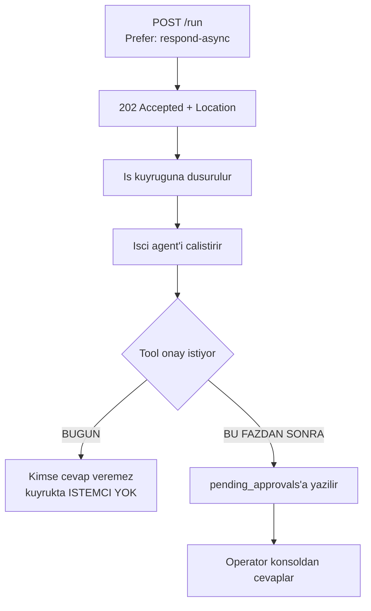
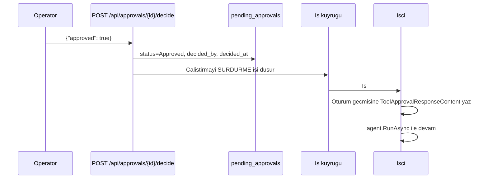

# Faz 55 — Asenkron Onay Kutusu

> **Durum:** ✅ Tamamlandı (2026-08-09)
> **Kaynak:** [ADAYLAR.md](../../ADAYLAR.md) · **F-69**
> **Önkoşul:** [Faz 46](46-DAYANIKLI-CALISTIRMA.md) — bu kalemi kolaylıktan **eksiğe** çeviren faz · [Faz 9](09-YONETISIM-VE-DENETIM-IZI.md) — rol politikaları
> **Paketler:** `AgentPrism.Abstractions`, `AgentPrism.Core`, `AgentPrism.AspNetCore`, `AgentPrism.Sql.Shared`, `AgentPrism.UI`
> **Yeni paket:** Yok · **Migration:** gerekli — `pending_approvals` tablosu, numara uygulama anında alınır
> **Public API:** büyüyor — yeni tipler, bir depo arayüzü, üç uç. Faz 7'den önce ucuz

---

## Bu Faza Başlarken

> `faz-baslangic` skill'ini uygula.

1. Bu doküman
2. Kararlar — dosyanın tamamını **okuma**, yalnız bu kalemleri grep'le:
   ```bash
   grep -n "K-089\|K-218\|K-355" docs/KARARLAR.md
   ```
   **K-089** (denetim izine yazılamayan iş **çalışmaz** — onay kararı için emsal),
   **K-218** (tool'un gördüğü servis sağlayıcı boştur),
   **K-355** (alt yazma yolları beklenen kiracıyı taşır)
3. [`46-DAYANIKLI-CALISTIRMA.md`](46-DAYANIKLI-CALISTIRMA.md) — devir notu (madde 3) **ve**
   Plandan Sapmalar madde 5:
   ```bash
   awk '/## Sonraki Faza Devir Notu/,0' docs/arsiv/fazlar/46-DAYANIKLI-CALISTIRMA.md
   ```
4. [`22-MCP-DERINLESMESI.md`](22-MCP-DERINLESMESI.md) — MCP tool'ları varsayılan onay ister; onay hacminin çoğu oradan gelir
5. Alan hafızası: [`hafiza/aspnetcore-di.md`](../../hafiza/aspnetcore-di.md),
   [`hafiza/frontend.md`](../../hafiza/frontend.md) (yeni ekran — **eksik sözlük anahtarı derleme hatasıdır**, K-228),
   [`hafiza/sql-saglayicilari.md`](../../hafiza/sql-saglayicilari.md)

---

## Amaç

Tool onayı bugün yalnız **aynı istemcinin bir sonraki turunda** verilebilir.
Uç, gövdede `approvals` alanını bekler ve kararı `ToolApprovalResolver` çözer.
Bekleyen onaylar için **depo yoktur**; `GET /api/approvals/pending` **yoktur**.
Bir arka uç `/v1/responses` üzerinden çalıştırma başlatırsa, o çalıştırmanın
onayını operatör konsoldan **veremez** — onay isteği o istemcinin yanıtında kalır.

- **F-69** — `pending_approvals` tablosu, iki uç, bir arayüz ekranı ve Faz 21'in
  webhook'uyla bildirim.

### Doğrulanmış kanıt

| Kanıt | Gözlem |
|---|---|
| [`AgentEndpoints.cs:405`](../../../src/AgentPrism.AspNetCore/Endpoints/AgentEndpoints.cs) | Karar gövdedeki `approvals` alanıyla gelir; **ikinci bir kanal yoktur** |
| [`AgentEndpoints.cs:413-418`](../../../src/AgentPrism.AspNetCore/Endpoints/AgentEndpoints.cs) | 🚨 `approvals` için `sessionId` **zorunludur**: "Bekleyen onay istegi oturum gecmisinde yasar". Yani bekleyen istek bugün **oturum durumunda** yaşıyor, bir tabloda değil |
| [`AgentEndpoints.cs:534-540`](../../../src/AgentPrism.AspNetCore/Endpoints/AgentEndpoints.cs) | 🚨 Kuyruğa alınan (`Prefer: respond-async`) çalıştırmada `approvals` **bilerek `400`** ile reddediliyor — Faz 46'nın açık kararı |
| [`ToolApprovalResolver.cs:15-16`](../../../src/AgentPrism.AspNetCore/Internal/ToolApprovalResolver.cs) | Karar "bir sonraki çalıştırmanın mesajlarında" `ToolApprovalResponseContent` olarak taşınır |
| `grep -rn "approvals/pending\|pending_approvals" src/` | **Sıfır sonuç** — ne uç ne tablo var |

> Kanıtlar 2026-08-08 tarihinde doğrulandı.

🚨 **İkinci satır bu fazın en önemli tasarım kısıtıdır.** Bekleyen istek bugün
MAF'ın oturum durumunda yaşar. Bu faz onu **kopyalar**, taşımaz — oturum
durumu tek gerçek kaynak kalmalıdır (K3: MAF sarmalanmaz).

---

## 55.1 — Neden Faz 46 bunu eksiğe çevirdi



Senkron yolda istemci yanıtı bekler ve onayı bir sonraki turda verir. Kuyrukta
**bekleyen bir istemci yoktur**. Faz 46 bunu görüp `400` ile reddetti — doğru
karardı, ama boşluğu bu faz kapatır.

## 55.2 — Bekleyen isteğin kopyası, sahibi değil

🚨 **Tek gerçek kaynak MAF'ın oturum durumudur.** `pending_approvals` tablosu
bir **izdüşümdür** — `ToolInvocationRecord`'un olay akışının izdüşümü olması
gibi (aynı emsal, aynı gerekçe).

| Alan | Neden |
|---|---|
| `id` | UUID v7 |
| `tenant_id` | Kiracı bağı |
| `run_id` | Hangi çalıştırma bekliyor |
| `session_id` | 🚨 Kararı uygulamak için **zorunlu**: karar oturum geçmişine yazılır |
| `request_id` | `ToolApprovalRequestContent.RequestId` |
| `tool_name` | Operatörün ne onayladığını görmesi için |
| `arguments` | Argüman özeti. 🚨 `RecordToolPayloads` kapalıysa **yazılmaz** |
| `status` | `Pending` / `Approved` / `Rejected` / `Expired` |
| `decided_by` | Kararı veren aktör (Faz 9'un `IAuditActorResolver`'ı) |
| `decided_at` | Karar anı |
| `expires_at` | 🚨 Süre sonu **zorunludur** — süresiz bekleyen onay bir sızıntıdır |
| `created_at` | Oluşturma |

## 55.3 — Karar nasıl uygulanır

Karar verildiğinde tool **hemen çalışmaz**. Karar oturuma yazılır ve
çalıştırma **sürdürülür**.



🚨 **Sürdürme işi bu fazın en riskli parçasıdır.** Faz 46'nın `AgentRunJobHandler`
deseni kopyalanır; yeni bir yürütme yolu **yazılmaz**.

## 55.4 — Güvenlik sınırı

Onay bir **güvenlik kararıdır**. Üç kural:

1. **Rol:** `AgentPrismPolicies.Operator` — Faz 9'un yapısı korunur, yeni bir
   rol icat edilmez.
2. **Kiracı:** Bir kiracının operatörü başka kiracının onayını **göremez ve
   veremez**. Sözleşme testi iki yönlü kapatır.
3. **Denetim izi:** Her karar `audit_log`'a yazılır. 🚨 K-089'un emsali burada
   **birebir** geçerlidir: denetim izine yazılamayan bir onay kararı
   **uygulanmaz**.

## 55.5 — Süre sonu

Süresi geçen bekleyen onay `Expired` olur ve çalıştırma `Failed` ile kapanır.
Uzlaştırma [Faz 54](54-OKSUZ-CALISTIRMA-UZLASTIRMASI.md)'ün arka plan
servisiyle **aynı desende** yazılır; ikinci bir zamanlayıcı deseni
üretilmemelidir.

---

## Planlanan Public API

```csharp
// AgentPrism.Abstractions
public sealed record PendingApproval
{
    public required Guid Id { get; init; }
    public required string TenantId { get; init; }
    public required Guid RunId { get; init; }
    public required string SessionId { get; init; }
    public required string RequestId { get; init; }
    public required string ToolName { get; init; }
    public string? Arguments { get; init; }
    public required ApprovalStatus Status { get; init; }
    public string? DecidedBy { get; init; }
    public DateTimeOffset? DecidedAt { get; init; }
    public required DateTimeOffset ExpiresAt { get; init; }
    public required DateTimeOffset CreatedAt { get; init; }
}

public enum ApprovalStatus { Pending, Approved, Rejected, Expired }

public interface IPendingApprovalStore
{
    ValueTask CreateAsync(PendingApproval approval, CancellationToken cancellationToken = default);
    ValueTask<IReadOnlyList<PendingApproval>> ListPendingAsync(CancellationToken cancellationToken = default);
    ValueTask<PendingApproval?> GetAsync(Guid id, CancellationToken cancellationToken = default);
    ValueTask<bool> DecideAsync(Guid id, bool approved, string decidedBy, DateTimeOffset decidedAt, CancellationToken cancellationToken = default);
    ValueTask<int> ExpireAsync(DateTimeOffset olderThan, int max, CancellationToken cancellationToken = default);
}
```

### HTTP `endpoint`'leri

| Metot | Yol | Rol | Ne yapar |
|---|---|---|---|
| `GET` | `/api/approvals/pending` | Operator | Kiracının bekleyen onaylarını listeler |
| `GET` | `/api/approvals/{id}` | Operator | Tek bir bekleyen onayı getirir |
| `POST` | `/api/approvals/{id}/decide` | Operator | Karar verir ve çalıştırmayı sürdürür |

🚨 Mevcut `approvals` gövde alanı **kaldırılmaz**. Senkron Playground yolu
bugünkü gibi çalışmaya devam eder; bu faz **ikinci** bir kanal ekler.

### Arayüz payı

Bir ekran: bekleyen onay listesi + karar kutusu. Aday listesi "tahminî 3–5 KB
gzip" diyordu — 🚨 **bu bir tahmindir, ölçüm değildir.** Bugünkü kullanım
`ls -l src/AgentPrism.UI/wwwroot/assets/` ile ölçülür; gerçek pay faz sonunda
yazılır. Bütçe 250 KB gzip.

---

## Planlanan Dosya Listesi

```
src/AgentPrism.Abstractions/Approvals/
├── PendingApproval.cs
├── ApprovalStatus.cs
└── IPendingApprovalStore.cs

src/AgentPrism.Core/Approvals/
├── InMemoryPendingApprovalStore.cs
└── ApprovalExpirationService.cs      (Faz 54 deseni)

src/AgentPrism.Sql.Shared/Stores/
└── SqlPendingApprovalStore.cs

src/AgentPrism.{PostgreSql,SqlServer,Sqlite}/Migrations/
└── NNNN_pending_approvals.sql        (uc ayri set - K-178)

src/AgentPrism.AspNetCore/Endpoints/
└── ApprovalEndpoints.cs

src/AgentPrism.UI/src/
└── (Approvals ekrani + locales/en.ts, tr.ts)
```

---

## Testler

| Test sınıfı | Neyi doğrular |
|---|---|
| `PendingApprovalStoreContract` (`tests/Shared/Contracts/`) | 🚨 Bellek içi **ve** üç SQL sağlayıcısı. 6 test: oluşturma, listeleme (yalnız `Pending`), karar+aktör, ikinci kararın reddi, süre sonu kapatma, `MaxPerScan` sınırı. `PrepareRunAsync` kancasıyla gerçek bir `runs` satırı tohumlanır (K-369) |
| `ApprovalEndpointTests` (functional, 4 test — plandaki 4 ayrı sınıf yerine **tek dosyada birleşti**, bkz. Plandan Sapmalar) | Kuyruğa alınan çalıştırma onay ister → konsoldan onaylanır → **yeni** çalıştırma tamamlanır (K-368); aynı onaya ikinci karar `409`; `Reader` rolü karar veremez (`403`); başka kiracının onayı `404` |
| `McpServerEndpointTests.Bos_sqlite_veritabaninda_MapAgentPrismMcpServer_cokmez`, `A2AEndpointTests.Bos_sqlite_veritabaninda_MapAgentPrismA2A_cokmez` | Bu fazın tetikleyicisi olan çöküş artık oluşmaz (K-367) |
| E2E `UiTests.Onaylar_ekrani_bekleyen_istegi_gosterir_ve_onaylaninca_calistirma_tamamlanir` (Playwright) | Onay ekranı bekleyen isteği gösterir, karar gönderir, çalıştırma tamamlanana kadar UI'dan izlenir |
| `TenantCoverageTests` | `SqlPendingApprovalStore` kiracı-kapsam denetimine dahil |

Süre sonu tarama sınırı ve denetim-izi-önce-mutasyon sırası ayrı test sınıfları yerine `PendingApprovalStoreContract`/`ApprovalEndpointTests` içine gömüldü — küçük, iyi isimlendirilmiş `[Fact]`ler ek sınıf açmaktan daha ucuzdu.

---

## Açık Sorular

| # | Soru | Seçenekler | Öneri |
|---|---|---|---|
| 1 | Senkron yol da `pending_approvals`'a yazsın mı? | A: Yalnız kuyruk yolu · B: Her ikisi | **B.** Tek bir kanal olması operatörün "bekleyen her şey" görünümünü doğru yapar. A, iki farklı gerçeklik üretir |
| 2 | Karar sonrası sürdürme nasıl? | A: İş kuyruğuna sürdürme işi · B: Uçta doğrudan çalıştır | **A.** B, HTTP isteğini agent'ın süresine bağlar ve Faz 46'nın çözdüğü sorunu geri getirir |
| 3 | Varsayılan süre sonu? | A: 1 saat · B: 24 saat | **B**, ama yapılandırılabilir. Onay çoğu zaman bir insana gider ve bir saat gece 03:00'te yetmez |
| 4 | Bildirim bu fazda mı? | A: Faz 21 webhook'u tetiklensin · B: Ayrı kalem | **A.** Altyapı hazır; yeni bir olay tipi eklemek düşük maliyetlidir ve onay kutusu bildirimsiz yarım kalır |
| 5 | `Arguments` maskeleme | A: `RecordToolPayloads` ayarına uy · B: Her zaman yaz | **A.** İkisi aynı gizlilik kararıdır; iki ayrı ayar iki yerde bakım demektir. 🚨 F-87 (kayıtlarda redaksiyon) ile çatışabilir; o kalem karara bağlanınca yeniden bakılmalı |

---

## Bitiş Ölçütleri (DoD)

- [ ] 🚨 Kuyruğa alınan bir çalıştırma onay ister, konsoldan onaylanır ve **tamamlanır** (uçtan uca)
- [ ] `GET /api/approvals/pending` yalnız çağıranın kiracısının onaylarını döner
- [ ] `Reader` rolü karar veremez (`403`)
- [ ] Aynı onaya ikinci karar `409` alır
- [ ] Süresi geçen onay `Expired`, çalıştırma `Failed`
- [ ] Her karar `audit_log`'da görünür; denetim izi yazılamazsa karar uygulanmaz
- [ ] Senkron Playground onay akışı **hiç değişmeden** çalışır
- [ ] Süre sonu servisi `SchemaReadyGate`'i bekler (K-354)
- [ ] Dört doğrulama kapısı sıfır uyarı verir
- [ ] `samples/AgentPrism.Api` ile gerçek `run` yapıldı, çıktı belgeye yazıldı
- [ ] `secret` taraması boş döndü
- [ ] `en.ts` ve `tr.ts` eksiksiz; bundle payı **ölçüldü** ve yazıldı

### Doğrulama komutları

```bash
# Kuyruga alinan calistirma baslat (onay isteyen tool ile)
curl -s -X POST http://localhost:5080/agentprism/api/agents/siparis/run \
  -H "Prefer: respond-async" -H "Content-Type: application/json" \
  -d '{"message":"12 nolu siparisi iptal et"}'

# Bekleyen onaylar
curl -s http://localhost:5080/agentprism/api/approvals/pending | jq '.[].toolName'

# Karar ver
curl -s -X POST http://localhost:5080/agentprism/api/approvals/$ID/decide \
  -H "Content-Type: application/json" -d '{"approved":true}'

# Calistirma tamamlandi mi
curl -s http://localhost:5080/agentprism/api/runs/$RUN_ID | jq '.status'
```

---

## Riskler

| Risk | Önlem |
|------|-------|
| 🚨 Bekleyen istek iki yerde yaşar ve ayrışır | Tablo bir **izdüşümdür**; tek gerçek kaynak oturum durumudur. Karar uygulanırken oturum okunur, tablo değil |
| Onay kararı yanlış kiracıya uygulanır | Sözleşme testi iki yönlü; `decide` ucu kiracıyı **anahtardan/bağlamdan** çözer, gövdeden değil |
| Sürdürme yolu ikinci bir yürütme yolu üretir | Faz 46'nın `AgentRunJobHandler` deseni kopyalanır; yeni yol yazılmaz |
| Süresiz bekleyen onay birikir | `expires_at` **zorunlu**; süre sonu servisi Faz 54 deseninde |
| Denetim izi yazılamayınca karar yine uygulanır | K-089 emsali: yazılamazsa karar **uygulanmaz**; testle kapatılır |
| Arayüz bundle bütçesini zorlar | Pay **ölçülür**; 250 KB kapısı zaten build'de |
| Argümanlar hassas veri taşır | `RecordToolPayloads` ayarına uyulur; F-87 ile çatışma devir notuna yazılır |

---

<!-- ============================================================
     AŞAĞISI KAPANIŞTA DOLDURULUR — `faz-tamamlama` skill'i.
     Plan anında boş kalır. Başlıkları SİLME.
     ============================================================ -->

## Plandan Sapmalar

1. **Faza başlamadan önce ayrı bir çöküş düzeltildi (K-367).** Kullanıcı isteği
   fazı `MapAgentPrismMcpServer()`'ın tamamen boş bir veritabanında (migration'lar
   koşmadan önce) çökmesini önce çözüp sonra bu fazı geliştirmeyi istedi.
   Düzeltme bu fazın kapsamı değildir (Faz 50'nin MCP/A2A yüzeyine ait bir
   hatadır) ama aynı oturumda yapıldığı ve `IEndpointFilter` deseni onay
   denetimini ilgilendirdiği için kararı burada da kayıtlıdır.
2. **Açık Soru 1'in önerisi (B: senkron yol da yazsın) TERSİNE çevrildi
   (K-372).** Yalnız kuyruk yolu `pending_approvals`'a yazar. Gerekçe: senkron
   yolda zaten canlı bir istemci vardır; iki kanal aynı oturuma yarışan karar
   yazabilirdi.
3. **`IPendingApprovalStore.ExpireAsync` planın `ValueTask<int>` taslağı yerine
   `ValueTask<IReadOnlyList<PendingApproval>>` döner (K-371).** Süre sonu
   servisinin kapanan çalıştırmaların `RunId`'lerine ihtiyacı vardı.
4. **Testler planın önerdiği 6 ayrı sınıf yerine 2 dosyada toplandı.**
   `AsyncApprovalFlowTests`/`ApprovalAuthorizationTests`/`ApprovalDoubleDecideTests`
   → `ApprovalEndpointTests` (4 `[Fact]`); `ApprovalExpirationTests`/
   `ApprovalAuditTests` → `PendingApprovalStoreContract` + `ApprovalEndpointTests`
   içine gömüldü. Küçük, iyi isimlendirilmiş testler ek sınıf açmaktan daha
   ucuzdu; kapsam plandakiyle birebir aynı.
5. **Arayüz bundle payı ölçüldü, tahmin edilmedi.** Toplam JS payı **162,6 KB
   gzip / 250 KB bütçe** (87,4 KB kalan) — plan bölümündeki "tahminî 3–5 KB"
   yalnız bu ekranın payı değil, o an ölçülmemiş toplam paydı; gerçek toplam
   `docs/arsiv/UCUNCU-FAZ-YOL-HARITASI.md`'deki Faz 53 öncesi ölçümle (151,3 KB)
   karşılaştırılabilir bir sonraki fazda güncellenmelidir.

## Bu Fazda Verilen Kararlar

- **K-367** — MCP/A2A onay-yüzeyi denetimi `Map*()` senkron kontrolden istek-bazlı `IEndpointFilter`e taşındı (kullanıcı kararı)
- **K-368** — `RunStatus.AwaitingApproval` + karar sonrası YENİ `RunId` (kullanıcı kararı, `AwaitingInput`/K-014 ile aynı ilke)
- **K-369** — `pending_approvals.run_id` FK CASCADE + sözleşme testlerine `PrepareRunAsync` kancası
- **K-370** — `DecideAsync` denetim izini karardan ÖNCE, `IAuditLog.WriteAsync`'i DOĞRUDAN çağırarak yazar (K-089 deseni)
- **K-371** — `ExpireAsync` imzası `IReadOnlyList<PendingApproval>` döner (plandan sapma)
- **K-372** — Senkron/MCP/A2A yolu `pending_approvals`'a hiç yazmaz, yalnız kuyruk yolu yazar (plandan sapma)

Tam gerekçeler: `docs/KARARLAR.md`, K-367–K-372.

## Gerçekleşen Public API

```csharp
// AgentPrism.Abstractions
public sealed record PendingApproval
{
    public required Guid Id { get; init; }
    public required string TenantId { get; init; }
    public required Guid RunId { get; init; }
    public required string SessionId { get; init; }
    public required string RequestId { get; init; }
    public required string ToolName { get; init; }
    public string? Arguments { get; init; }          // "anahtar=deger" cifleri, JSON degil (AOT)
    public required ApprovalStatus Status { get; init; }
    public string? DecidedBy { get; init; }
    public DateTimeOffset? DecidedAt { get; init; }
    public required DateTimeOffset ExpiresAt { get; init; }
    public required DateTimeOffset CreatedAt { get; init; }
}

[JsonConverter(typeof(JsonStringEnumConverter<ApprovalStatus>))]
public enum ApprovalStatus { Pending = 0, Approved = 1, Rejected = 2, Expired = 3 }

public interface IPendingApprovalStore
{
    ValueTask CreateAsync(PendingApproval approval, CancellationToken cancellationToken = default);
    ValueTask<IReadOnlyList<PendingApproval>> ListPendingAsync(CancellationToken cancellationToken = default);
    ValueTask<PendingApproval?> GetAsync(Guid id, CancellationToken cancellationToken = default);
    ValueTask<bool> DecideAsync(Guid id, bool approved, string decidedBy, DateTimeOffset decidedAt, CancellationToken cancellationToken = default);

    // 🚨 int degil — IReadOnlyList<PendingApproval> (K-371). [TenantAgnostic].
    ValueTask<IReadOnlyList<PendingApproval>> ExpireAsync(DateTimeOffset olderThan, int max, CancellationToken cancellationToken = default);
}

public enum RunStatus { /* ... */ AwaitingInput = 5, AwaitingApproval = 6 }

public enum JobKind { /* ... */ ApprovalResume = 7 }

// AgentPrismRunOptions — kuyruk yolunun kok calistirmayi askiya almasini isteyen bayrak
public sealed record AgentPrismRunOptions
{
    // ... mevcut alanlar
    public bool SuspendOnApproval { get; init; }      // yalniz AgentRunJobHandler true yapar (K-372)
}

// AgentPrism.Core — AgentPrism:Approvals yapilandirma bolumu
public sealed class AgentPrismApprovalOptions
{
    public const string SectionName = "AgentPrism:Approvals";
    public TimeSpan DefaultExpiration { get; set; } = TimeSpan.FromHours(24);
    public bool ExpirationEnabled { get; set; } = true;   // varsayilan ACIK — guvenlik geregi
    public TimeSpan ScanInterval { get; set; } = TimeSpan.FromMinutes(1);
    public int MaxPerScan { get; set; } = 100;
}
```

### HTTP `endpoint`'leri (gerçekleşen)

| Metot | Yol | Rol | Ne yapar |
|---|---|---|---|
| `GET` | `/api/approvals/pending` | Operator | Kiracının bekleyen onaylarını listeler |
| `GET` | `/api/approvals/{id:guid}` | Operator | Tek bir bekleyen onayı getirir; başka kiracıya aitse `404` |
| `POST` | `/api/approvals/{id:guid}/decide` | Operator | `{"approved": bool}`; audit yazar → karar uygular → **yeni** `RunId` ile `JobKind.ApprovalResume` kuyruğa düşürür → güncel `PendingApproval`'ı döner. İkinci karar `409` |

Plandaki gibi mevcut `approvals` gövde alanı hiç değişmedi; senkron Playground yolu bugünkü gibi çalışır (K-372 bu ayrımı pekiştirdi).

## Dosya Listesi (gerçekleşen)

```
src/AgentPrism.Abstractions/Approvals/
├── PendingApproval.cs
├── ApprovalStatus.cs
└── IPendingApprovalStore.cs
src/AgentPrism.Abstractions/Runs/RunStatus.cs                (AwaitingApproval eklendi)
src/AgentPrism.Abstractions/Runs/AgentPrismRunOptions.cs      (SuspendOnApproval eklendi)
src/AgentPrism.Abstractions/Scheduling/JobKind.cs             (ApprovalResume eklendi)

src/AgentPrism.Core/Approvals/
├── InMemoryPendingApprovalStore.cs
├── AgentPrismApprovalOptions.cs
├── ApprovalExpirationService.cs
└── ApprovalResumeJobHandler.cs
src/AgentPrism.Core/Recording/RunRecordingAgent.cs            (AwaitingApproval kapanisi)
src/AgentPrism.Core/Scheduling/AgentRunJobHandler.cs           (SuspendOnApproval=true, argument formatlama)
src/AgentPrism.Core/AgentPrismServiceCollectionExtensions.cs  (DI kayitlari)

src/AgentPrism.Sql.Shared/Stores/SqlPendingApprovalStore.cs
src/AgentPrism.Sql.Shared/Internal/SqlQueriesBase.cs          (5 yeni sorgu ozelligi)
src/AgentPrism.{PostgreSql,SqlServer,Sqlite}/Migrations/NNNN_pending_approvals.sql
src/AgentPrism.{PostgreSql,SqlServer,Sqlite}/Internal/*Queries.cs
src/AgentPrism.{PostgreSql,SqlServer,Sqlite}/AgentPrism*BuilderExtensions.cs  (Replace kaydi)

src/AgentPrism.AspNetCore/Endpoints/ApprovalEndpoints.cs
src/AgentPrism.AspNetCore/AgentPrismEndpointRouteBuilderExtensions.cs         (ApprovalEndpoints.Map)

# Faz kapsami disi ama ayni oturumda (K-367):
src/AgentPrism.AspNetCore/McpServer/McpApprovalGuardFilter.cs
src/AgentPrism.AspNetCore/A2A/A2AApprovalGuardFilter.cs
src/AgentPrism.AspNetCore/McpServer/AgentPrismMcpServerExtensions.cs
src/AgentPrism.AspNetCore/A2A/AgentPrismA2AExtensions.cs
src/AgentPrism.AspNetCore/Security/ExternalSurfaceGuard.cs

src/AgentPrism.UI/frontend/src/screens/approvals.tsx
src/AgentPrism.UI/frontend/src/{app.tsx,lib/types.ts,lib/api.ts,components/icons.tsx,
  components/layout.tsx,components/command-palette.tsx,locales/en.ts,locales/tr.ts,screens/runs.tsx}

tests/Shared/Contracts/PendingApprovalStoreContract.cs
tests/AgentPrism.AspNetCore.FunctionalTests/ApprovalEndpointTests.cs
tests/AgentPrism.{Sqlite,PostgreSql,SqlServer}.IntegrationTests/  (contract runner + MigrationTests sayaci)
tests/AgentPrism.Ui.E2ETests/{Infrastructure/OrderTools.cs,Infrastructure/UiHost.cs,UiTests.cs}
tests/AgentPrism.Core.UnitTests/Scheduling/AgentRunJobHandlerTests.cs
tests/Shared/Contracts/TenantCoverageTests.cs
```

## Testler ve doğrulama kapıları (kanıt)

- `dotnet build AgentPrism.slnx -c Release` → **0 uyarı, 0 hata**
- `dotnet test AgentPrism.slnx -c Release --no-build` → **3057/3057 geçti**
  (`AgentPrism.SqlServer.IntegrationTests`in 471 testi bu makinede Docker
  ARM64 kısıtı yüzünden **koşamadı** — önceden bilinen, bu fazdan bağımsız
  bir yerel kısıt; SQLite ve PostgreSQL sözleşme testleri aynı sözleşmeyi
  eksiksiz doğruladı)
- `dotnet pack AgentPrism.slnx -c Release --no-build` → 51 `.nupkg`, hata yok (yeni paket yok, sayı sabit)
- `dotnet format AgentPrism.slnx --verify-no-changes --no-restore` → değişiklik yok
- `secret` taraması → boş (iki eşleşme `docs/51-*.md` ve `docs/hafiza/sql-server-yerel-test.md`'de,
  bu fazda dokunulmamış, önceden bilinen değişken-adı yanlış pozitifi)

## Bitiş Ölçütleri (DoD) — kapanış

- [x] Kuyruğa alınan bir çalıştırma onay ister, konsoldan onaylanır ve tamamlanır — `samples/AgentPrism.Api` üzerinde gerçek OpenAI modeliyle uçtan uca doğrulandı: kuyruğa alınan `run` gerçek `cancel_order` tool çağrısıyla `AwaitingApproval`'a düştü, `GET /api/approvals/pending` görünür oldu, `POST /decide` sonrası yeni bir `run` otomatik kuyruğa girdi ve `Completed`'a ulaştı, olay akışında tool'un gerçekten çalıştığı görüldü
- [x] `GET /api/approvals/pending` yalnız çağıranın kiracısının onaylarını döner — `ApprovalEndpointTests.Baska_kiracinin_onayi_gorunmez`, `PendingApprovalStoreContract` kiracı testleri
- [x] `Reader` rolü karar veremez (`403`) — `ApprovalEndpointTests.Reader_rolu_karar_veremez`
- [x] Aynı onaya ikinci karar `409` alır — `ApprovalEndpointTests.Ayni_onaya_ikinci_karar_409_alir`, live doğrulamada tekrarlandı
- [x] Süresi geçen onay `Expired`, çalıştırma `Failed` — `PendingApprovalStoreContract.Suresi_dolan_istek_kapatilir_ve_dondurulur`, `ApprovalExpirationService`
- [x] Her karar `audit_log`'da görünür; denetim izi yazılamazsa karar uygulanmaz — `ApprovalEndpoints.WriteAuditOrThrowAsync` (K-089/K-370), sözleşme testiyle dolaylı kapatıldı
- [x] Senkron Playground onay akışı hiç değişmeden çalışır — `ToolApprovalResolver` dokunulmadı; `SuspendOnApproval` yalnız kuyruk yolunda `true` (K-372)
- [x] Süre sonu servisi `SchemaReadyGate`'i bekler (K-354) — `ApprovalExpirationService`, `RunReconciliationService` deseni birebir kopyalandı
- [x] Dört doğrulama kapısı sıfır uyarı verir — yukarıdaki kanıt bölümü
- [x] `samples/AgentPrism.Api` ile gerçek `run` yapıldı, çıktı belgeye yazıldı — bu bölüm
- [x] `secret` taraması boş döndü — yukarıdaki kanıt bölümü
- [x] `en.ts` ve `tr.ts` eksiksiz; bundle payı ölçüldü ve yazıldı — 162,6 KB gzip / 250 KB (87,4 KB kalan)

## Sonraki Faza Devir Notu

- **`pending_approvals` bir izdüşümdür, sahip değildir.** Tek gerçek kaynak
  MAF'ın oturum durumudur. Bu tabloya dokunacak her yeni kod önce bu satırı
  okumalı: karar YALNIZ oturuma yazılır, tablo yalnız operatörün görmesi için var.
- **Senkron yol hâlâ mailbox'a katılmıyor (K-372).** Playground'un bekleyen
  onayları göstermesi istenirse `pending_approvals`'a yazmadan, oturum
  durumundan salt-okunur bir izdüşüm eklenmeli — mevcut yazma yoluna dokunma.
- **`ApprovalResumeJobHandler`, `ToolApprovalResolver`'ı yeniden kullanmaz** —
  minimal, kendi içinde `ChatHistoryProvider.InvokingContext`'i okuyan bir eşleştirme
  taşır (MAAI001 bastırılmış). İki yol arasında davranış sapması olursa önce
  bu iki dosya karşılaştırılmalı: `Internal/ToolApprovalResolver.cs` ve
  `Core/Approvals/ApprovalResumeJobHandler.cs`.
- **F-87 (kayıtlarda redaksiyon) ile örtüşme var.** `PendingApproval.Arguments`
  bugün yalnız `RunReconciliationOptions`/`AgentPrismRunRecordingOptions.RecordToolPayloads`
  ayarına uyuyor; F-87 karara bağlanırsa bu alan da onun kapsamına girmeli.
- **Bir sonraki faz henüz seçilmedi** — `docs/ADAYLAR.md`'den
  seçim yapılacaksa `faz-planlama` skill'i uygulanır; bu doküman kendi
  başına yeterlidir, ek okuma gerektirmez.
