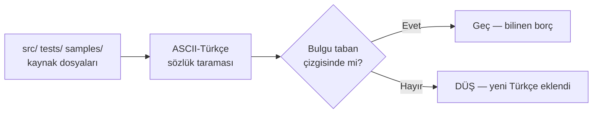

# Faz 57 — Kod Dili Birleştirme (İngilizce)

> **Durum:** ✅ Tamamlandı (2026-08-16)
> **Kaynak:** Kullanıcı isteği (2026-08-15). Aday listesinde karşılığı **yoktur** —
> bu bir yetenek değil, paket kalitesi işidir.
> **Önkoşul:** Adım 0 (doküman bütçesi rahatlatması) — bu fazın **kapanışı** ona bağlı;
> `faz-tamamlama` `MEMORY.md`'ye yazar ve orada 1 bayt boşluk vardır.
> **Paketler:** Tümü (17 yayınlanan + `Generators`) · `tests/` · `samples/`
> **Yeni paket:** Yok · **Migration:** Yeni migration yok; **var olan 61 dosyanın
> checksum'ı değişir** (bkz. 57.4)
> **Public API:** **Değişmiyor.** İmzalar zaten İngilizce; yalnız XML doküman
> *içeriği* ve string *değerleri* değişir

---

## Bu Faza Başlarken

> `faz-baslangic` skill'ini uygula. Aşağıdaki liste o skill'in 2. adımıdır —
> **tamamını değil, yalnız işaret edilen bölümleri oku.**

1. Bu doküman
2. Kararlar — dosyanın tamamını **okuma**, yalnız bu kalemleri grep'le:
   ```bash
   grep -n "K-232\|K-228\|K-068\|K-178" docs/KARARLAR.md
   ```
   **K-232** (sunucu yanıtları çevrilmez; API sözleşmesi tek dillidir — bu fazın
   dayanağı), **K-228** (`tr.ts` tip güvenli sözlüktür; eksik anahtar derleme
   hatasıdır — bu fazda **dokunulmaz**), **K-068** (Faz 7 ertelendi — bu faz onu
   beklemez), **K-178** (migration numaraları sağlayıcı başına bağımsızdır).
3. Önceki faz devir notu:
   ```bash
   awk '/## Sonraki Faza Devir Notu/,0' docs/arsiv/fazlar/56-KANARYA-YAYINI-VE-OTOMATIK-GERI-ALMA.md
   ```
4. Alan hafızası (bu faz iki alana dokunuyor):
   [`hafiza/build-ve-analyzer.md`](../../hafiza/build-ve-analyzer.md) (XML doküman
   üretimi, `TreatWarningsAsErrors`, CS1591),
   [`hafiza/sql-saglayicilari.md`](../../hafiza/sql-saglayicilari.md) (migration runner
   ve checksum davranışı)
5. Gerektiğinde: [`MIMARI.md`](../../MIMARI.md) bölüm 9 (sürüm politikası)

---

## Amaç

AgentPrism'in kodu Türkçe yorumlanmış, İngilizce adlandırılmış bir kütüphanedir.
Bu, geliştirme boyunca doğru tercihti. Ama `GenerateDocumentationFile` açık
olduğu için **XML doküman `.xml` dosyası olarak NuGet paketine giriyor**;
paketi kuran bir geliştirici IntelliSense'te Türkçe açıklama görüyor. İmza
İngilizce, açıklama Türkçe — bu, paketin en görünür kalite kusurudur.

Bu faz tek bir sınır kuralı kurar ve kalıcı kılar:

> **Pakete giren veya çalışma anında çalışan her şey İngilizce'dir.
> Geliştirme aparatı (`docs/`, `.agents/skills/`, doküman bakım script'i)
> Türkçe kalır.**

Bu bir çeviri işi **değildir**. Bir yorum kodun bugünkü davranışını yanlış
anlatıyorsa İngilizce'ye de yanlış geçmemelidir; kod okunur ve açıklama
yeniden yazılır.

### Bugün ne çalışmıyor — doğrulanmış kanıt

| Kanıt | Gözlem |
|---|---|
| [`Directory.Build.props:35`](../../../Directory.Build.props) | `<GenerateDocumentationFile>true</GenerateDocumentationFile>` — kök seviyede; 8.837 satır Türkçe XML doküman pakete girer |
| [`Abstractions/Agents/IAgentCatalog.cs:5-8`](../../../src/AgentPrism.Abstractions/Agents/IAgentCatalog.cs) | `/// Tum agent kaynaklarini tek bir gorunumde birlestiren katalog.` — en merkezî arayüzün özeti Türkçe |
| [`Abstractions/AgentPrismId.cs:68`](../../../src/AgentPrism.Abstractions/AgentPrismId.cs) | `throw new ArgumentException("Kimlik bir UUID surum 7 degeri degil.", ...)` — tüketiciye giden hata metni Türkçe |
| [`Templates/.../template.json:12`](../../../src/AgentPrism.Templates/content/AgentPrism.Starter/.template.config/template.json) | `"description": "Calisan bir AgentPrism kontrol duzlemi..."` — `dotnet new agentprism-api --help` çıktısı Türkçe |
| [`UI/frontend/src/screens/run-detail.tsx:90-92`](../../../src/AgentPrism.UI/frontend/src/screens/run-detail.tsx) | Frontend'deki tek gerçek Türkçe yorum bloğu; dosyanın üst satırları zaten İngilizce |
| [`Core.UnitTests/Architecture/ProblemDetailsLanguageTests.cs:18`](../../../tests/AgentPrism.Core.UnitTests/Architecture/ProblemDetailsLanguageTests.cs) | Testin kendi XML dokümanı `"kod yorumlari (ki proje konvansiyonu geregi Turkce kalir)"` diyor — **bu faz o konvansiyonu tersine çevirir**, dokümanı da güncellenmelidir |

> Kanıtlar 2026-08-15 tarihinde doğrulandı.

### Ölçülen kapsam

| # | Kategori | Satır | Dosya | Düzeltme tipi |
|---|---|---:|---:|---|
| 1 | **`src/` XML doküman** | **8.837** | 590 | Anlam — pakete girer |
| 2 | `src/` + `samples/` yorum | 2.212 | 221 | Anlam |
| 3 | `tests/` yorum + XML doküman | 2.529 | ~300 | Anlam |
| 4 | Türkçe test metot adı | **1.494 metot** | 258 | Yarı-mekanik |
| 5 | `src/` string (exception 55, log 33, ProblemDetails 19, diğer 800) | 905 | 180 | Anlam |
| 6 | `tests/` string (test verisi) | 747 | 176 | Çoğu mekanik |
| 7 | Migration `.sql` yorumu | 609 | 61 | Mekanik + checksum |
| 8 | Proje dosyaları (`.csproj`/`.props`/`.editorconfig`/`.json`) | 395 | 44 | Anlam |
| 9 | Frontend TS/TSX | 21 | 17 | Mekanik |
| | **Toplam** | **~17.700** | **~1.030** | |

**Kapsam dışı — bilerek:**

| Ne | Satır | Neden |
|---|---:|---|
| `src/AgentPrism.UI/frontend/src/locales/tr.ts` | 760 | Meşru çeviri sözlüğü (K-228) |
| `locales/en.ts:90` `'shell.language.tr': 'Türkçe'` | 1 | Dil seçicisinin kendi etiketi |
| `.agents/skills/**` | 422 | Geliştirme aparatı — `docs/` ile aynı sınıf |
| `scripts/dokuman-bakim.py` | 129 | Türkçe doküman üretir; İngilizce yazmak anlamsız |
| `docs/**` | ~102.000 | Karar: depo dokümanları Türkçe kalır |

**✅ Public API yüzeyi zaten temiz.** 4.014 `public`/`protected` bildirimi
tarandı; Türkçe tip veya üye adı **sıfır**. (`Ch**arac**ters` kalıbı sekiz
yanlış pozitif üretir — `CharactersBilled`, `MaxCharactersPerRequest`,
`PerMillionCharacters`.) **Bu faz kırıcı değişiklik içermez**; sürüm kararı
gerekmez ve Faz 7'yi beklemez.

---

## 57.1 — Cırcır kapısı (önce yazılır)

İş çok oturuma yayılır. Kapı olmadan ilk oturumun temizlediği dosyaya ikinci
oturum Türkçe yorum geri yazar. Bu yüzden **kapı ilk iş yazılır**, temizlik
sonra gelir.

Repo'da tam olarak bu desenin bir örneği zaten var:
[`ProblemDetailsLanguageTests.cs`](../../../tests/AgentPrism.Core.UnitTests/Architecture/ProblemDetailsLanguageTests.cs).
`src/**/*.cs` dosyalarını diskten okur, ASCII-Türkçe sözcük kalıbı arar,
ihlalleri listeleyip düşer. Yeni test bunun **genelleştirilmiş hâlidir** ve
aynı klasörde yaşar.



**Neden `AgentPrism.Core.UnitTests/Architecture/`:**

| Aday konum | Neden değil |
|---|---|
| `tests/Shared/Contracts/` | Yalnız üç SQL entegrasyon projesine bağlıdır → **Docker gerektirir**; ayrıca assembly üzerinden reflection yapar, diskten kaynak okumaz |
| `AspNetCore.FunctionalTests/` | Host kaldırır; dil taraması için gereksiz ağır |
| **`Core.UnitTests/Architecture/`** | ✅ Docker'sız, her koşumda çalışır, `DependencyDirectionTests` + `ProblemDetailsLanguageTests` ile aynı desen ve aynı `FindRepositoryRoot` yardımcısı |

**Taban çizgisi (baseline):** `tests/AgentPrism.Core.UnitTests/Architecture/source-language-baseline.txt`.
Her satır bir dosya yolu ve o dosyada **beklenen** ihlal sayısıdır. Sayı artarsa
test düşer; azalırsa taban çizgisi güncellenmelidir (test bunu da söyler).
Yenileme, `OpenApiSnapshotTests`'in emsalini izler:

```bash
AGENTPRISM_SOURCE_LANGUAGE_REFRESH=1 dotnet test tests/AgentPrism.Core.UnitTests -c Release
```

57.6 sonunda taban çizgisi boşalır. Boş dosya bırakılır — silinmez; varlığı
kuralın kalıcı olduğunu söyler.

**Sözlük.** `ProblemDetailsLanguageTests`'in bugünkü kalıbı 19 token taşır ve
yalnız `title:` literalinin gövdesinde arar. Yeni test tüm satırda arar, bu
yüzden sözlük genişler ve **yanlış pozitif riski doğar**. Bilinen tuzaklar:

| Kalıp | Neden yanlış pozitif |
|---|---|
| `Ch**arac**ters` | `arac` (araç) |
| `p**ad**ding`, `thre**ad**` | `ad` |
| `v**ali**date` | `ali` |
| `s**onuc**` yok ama `**son**` | İngilizce `season`, `person` |

Bu yüzden sözlük **kelime sınırıyla** (`\b...\b`) eşleşir ve İngilizce beyaz
listesi taşır. Beyaz liste testin içinde, ayrı dosyada değil — okunabilirlik
için.

> 🚨 Bu test yeni yazılırken `ProblemDetailsLanguageTests` **silinmez**.
> O test dar ve kesin bir kuralı (K-232) zorlar; yeni test geniş ve taban
> çizgili. İkisi farklı işler yapar. Yalnız eski testin XML dokümanındaki
> "kod yorumlari ... Turkce kalir" cümlesi düzeltilir.

---

## 57.2 — `Abstractions` + `Core`

590 public tipin **462'si** bu iki pakettedir (Abstractions 282, Core 180).
XML doküman kütlesinin de en büyük parçası buradadır. Tüketiciye görünen
değerin çoğu bu tek geçişte kazanılır — bu yüzden ilk içerik geçişi budur.

Yöntem, dosya dosya:

1. Tipin **kodunu** oku. Yorumun bugünkü davranışı doğru anlattığını doğrula.
2. Anlatmıyorsa **kodu** kaynak al, yorumu değil. Sapmayı kapanışta
   "Plandan Sapmalar"a yaz — bayat yorum bir bulgudur, sessizce düzeltilmez.
3. `<summary>` tek cümle, etken çatı, üçüncü tekil (".NET XML doküman
   geleneği": *"Gets the ..."*, *"Returns the ..."*).
4. `<param>`/`<returns>`/`<exception>` varsa korunur; yoksa **eklenmez** —
   kapsam büyümesi olur.
5. 🚨 içeren yorumlar kazanılmış bilgidir (`HATA-S2-001` gibi vaka
   referansları). **Bilgi kaybedilmez**; İngilizce'ye taşınır, atılmaz.

`AgentPrism.Abstractions` ve `AgentPrism.Core` AOT uyumludur; bu faz kod
üretmediği için AOT durumu değişmez.

---

## 57.3 — `AspNetCore` + `UI` + `Workflows` + `Mcp`

`AgentPrism.AspNetCore` çalışma anı string yoğunluğu en yüksek pakettir (305).
ProblemDetails, log ve doğrulama metinleri buradadır.

**Arayüz payı: yok.** Frontend'de yalnız 21 satır vardır ve hiçbiri ekran metni
değildir; `en.ts`/`tr.ts` anahtar kümesi **değişmez**, bundle ölçüsü değişmez.
Tek gerçek Türkçe blok `screens/run-detail.tsx:90-92`.

---

## 57.4 — Sağlayıcılar, depolama ve migration SQL

OpenAI, Anthropic, Google, Azure, Voice + PostgreSql, SqlServer, Sqlite,
Sql.Shared. Dört sağlayıcının sağlık denetiminde kopyalanmış kalıp vardır
(`Detail = "Yanit gecerli JSON degil."`) — birlikte değişir.

### 🚨 Migration checksum'ı — bu fazın tek gerçek tehlikesi

`MigrationDescriptor.ComputeChecksum` migration dosyasının **ham metninin
tamamının** SHA-256'sını alır; yorumlar hash'e dahildir. Satır sonu
normalize edilir, başka hiçbir şey ayıklanmaz.
`MigrationRunner.VerifyChecksum` uyuşmazlıkta `AgentPrismException` fırlatır ve
mesajı şunu söyler: *"Uygulanmis bir migration duzenlenmez."*

61 dosyanın **tamamı** migration'dır (PostgreSql 29, SqlServer 16, Sqlite 16);
`Migrations/` dışında hiç `.sql` yoktur.

**Karar (kullanıcı, 2026-08-15):** yorumlar temizlenir. Gerekçe: paket henüz
NuGet'e yayınlanmadı (K-068) ve uygulanmış migration taşıyan bir dağıtım yok.

Yordam:

1. 61 dosyanın yorumları İngilizce yazılır → 61 checksum değişir
2. **Dev veritabanları düşürülür ve yeniden kurulur.** Aksi hâlde uygulama
   açılışta fırlatır
3. `AGENTS.md`'ye kural eklenir: yeni migration yorumları İngilizce yazılır
4. Kapanışta bu bir K-kararı olur (numara kapanışta alınır)

> 🚨 **Testler bu kusuru yakalayamaz.** Testcontainers her koşumda sıfır bir
> veritabanı kurar; checksum uyuşmazlığı yalnız **var olan** bir veritabanında
> görülür. Dört kapı yeşilken uygulama açılışta çökebilir. Doğrulama yalnız
> `samples/AgentPrism.Api`'yi faz **öncesinden kalan** bir veritabanına karşı
> çalıştırarak yapılır. Bu, `MEMORY.md`'nin "birim testi yetmez" tuzağının
> birebir örneğidir.

---

## 57.5 — Proje dosyaları, şablon, örnek

395 satır; hacim küçük ama biri doğrudan kullanıcıya görünür:
`src/AgentPrism.Templates/content/AgentPrism.Starter/.template.config/template.json`
— `dotnet new agentprism-api --help` çıktısı bugün Türkçe. Üç seçeneğin
(`--persistence`, `--provider`, `--ui`) açıklamaları da buradadır.

`samples/AgentPrism.Api/Program.cs` başındaki ~201 satırlık faz-faz yorum bloğu
**Faz 59'un tutorial hammaddesidir**. İngilizce yazılırken doğrudan doküman
sitesine taşınabilecek biçimde düzenlenir — kavram başına bir paragraf, faz
numarası referansı yerine yetenek adı.

---

## 57.6 — `tests/`

2.529 satır yorum/XML doküman, **1.494 Türkçe test metodu** (2.024'ün %73'ü),
747 test verisi string'i.

Test adları hiçbir yerden referans edilmez — yalnız `[Fact]`/`[Theory]`
altındaki metot adlarıdır. Yeniden adlandırma bu yüzden **risksizdir**. Ama ad
testin spesifikasyonudur; `sed` ile çevrilmez.

İki dosyada metot adında Türkçe **karakter** vardır; derleyici kabul eder ama
düzeltilir:

- `tests/AgentPrism.AspNetCore.FunctionalTests/OnlineEvaluationEndpointTests.cs:72`
  → `Elle_puanlama_sonrasi_ozet_orneği_gosterir` (`ğ`)
- `tests/AgentPrism.Azure.UnitTests/AzureOpenAIProviderHealthCheckTests.cs:71`
  → `Adres_tanimsizsa_denetim_cagri_yapmadan_saglıksiz_doner` (`ı`)

### Senkron zorunluluğu

`src/` hata mesajı değişince onu assert eden test kırılır. **Ölçüldü: yedi
test.** Kaynak ve test **aynı commit'te** değişir.

| Dosya | Assert |
|---|---|
| `Core.UnitTests/Graph/ChildAgentInvokerTests.cs:28` | `"calistirma kaydi kapali"` |
| `Core.UnitTests/Graph/ChildAgentInvokerTests.cs:58` | `"alt calistirma siniri doldu"` |
| `Core.UnitTests/Graph/ChildAgentInvokerTests.cs:74` | `"kiracisindan cikamaz"` |
| `Core.UnitTests/Models/ModelProviderSettingsTests.cs:52` | `"ait degil"` |
| `Core.UnitTests/Models/ModelProviderRegistryTests.cs:53` | `"hic saglayici kayitli degil"` |
| `Azure.UnitTests/AzureOpenAIChatClientFactoryTests.cs:158` | `"ait degil"` |
| +1 (`Message`/`Detail`/`Title` eşitlik assert'i) | — |

---

## Planlanan Public API

**Değişiklik yok.** Bu faz hiçbir tip, üye veya imza eklemez, kaldırmaz veya
yeniden adlandırmaz. Yalnız XML doküman *içeriği* ve string *değerleri* değişir.

`PublicAPI.Unshipped.txt` dosyaları boş kalır; `EnablePublicApiTracking`
`false` olmaya devam eder (K-068).

### Arayüz payı

Yok. Ekran metni eklenmez, `en.ts`/`tr.ts` anahtar kümesi değişmez, bundle
ölçüsü değişmez.

---

## Planlanan Dosya Listesi

**Yeni dosya — iki tane:**

```
tests/AgentPrism.Core.UnitTests/Architecture/
├── SourceLanguageTests.cs              (yeni — cırcır kapısı)
└── source-language-baseline.txt        (yeni — 57.6'da boşalır)
```

**Değişen:** `src/**` (597 `.cs` + 61 `.sql` + 44 proje dosyası),
`tests/**` (342 `.cs`), `samples/**` (4 `.cs` + 1 `.json`),
`src/AgentPrism.UI/frontend/src/**` (17 dosya), `AGENTS.md` (yeni dil kuralı),
`ProblemDetailsLanguageTests.cs` (XML dokümanındaki bayat cümle).

---

## Testler

| Test sınıfı | Neyi doğrular |
|---|---|
| `SourceLanguageTests` | `src/`, `tests/`, `samples/` içinde taban çizgisinde olmayan Türkçe token yok |
| `ProblemDetailsLanguageTests` | (var olan) K-232 — `title:` literalleri İngilizce |
| `MigrationRunnerTests` (×3 sağlayıcı) | (var olan) checksum doğrulaması; **yeni veritabanında** koşar, uyuşmazlığı göremez |

Yeni sözleşme testi gerekmez — bu faz davranış değiştirmez.

---

## Açık Sorular

| # | Soru | Seçenekler | Öneri |
|---|---|---|---|
| 1 | Cırcır sözlüğü `tests/` içinde de tam mı uygulansın? | A: `src/` katı, `tests/` gevşek · B: üçü de katı | **B** — 57.6 zaten `tests/`'i temizliyor; iki eşik tutmak taban çizgisini karmaşıklaştırır |
| 2 | XML doküman `<example>` sayısı (bugün 590 tipte 21) bu fazda artırılsın mı? | A: hayır, Faz 59'a bırak · B: 57.2'de en çok kullanılan tiplere ekle | **A** — kapsam büyümesi; Faz 59 hangi tiplerin belgeleneceğini zaten seçecek |
| 3 | Alt geçişler tek PR mi, altı PR mi? | A: geçiş başına bir commit · B: tek büyük commit | **A** — geri alınabilirlik; ayrıca taban çizgisi her commit'te küçülür ve ilerleme ölçülebilir olur |

---

## Bitiş Ölçütleri (DoD)

- [x] `source-language-baseline.txt` **boş**; `SourceLanguageTests` yeşil —
      789/789 test geçti, taban çizgisi dosyası yalnız başlığı taşıyor
- [x] `grep -rln '[çğıöşüÇĞİÖŞÜ]' src/ tests/ samples/` yalnız `locales/tr.ts`,
      `locales/en.ts`, `SourceLanguageTests.cs` (sözlüğün kendisi) ve
      `UiTests.cs` (K-228, çevrilmiş metni doğrulayan tek satır) döndürür
- [x] Üretilen XML doküman gözle denetlendi:
      `artifacts/bin/AgentPrism.Abstractions/release_net10.0/AgentPrism.Abstractions.xml` —
      İngilizce, Türkçe karakter sıfır
- [x] `dotnet pack` çıktısındaki `.nupkg` açıldı; `lib/net10.0/*.xml` İngilizce —
      `AgentPrism.Abstractions`/`AgentPrism.Core` paketlerinde Türkçe karakter sıfır
- [x] `dotnet new agentprism-api --help` çıktısı İngilizce — doğrulandı, tüm
      seçenek açıklamaları (`--persistence`, `--provider`, `-ui`) İngilizce
- [x] 🚨 **Faz öncesinden kalan** bir PostgreSQL veritabanına karşı
      `samples/AgentPrism.Api` çalıştırıldı; migration checksum yordamı
      (düşür + yeniden kur) belgeye yazıldı — bkz. K-409 ve aşağıdaki gerçek koşum
- [x] Dört doğrulama kapısı sıfır uyarı verir
- [x] `samples/AgentPrism.Api` ile gerçek `run` yapıldı, çıktı belgeye yazıldı
- [x] `secret` taraması boş döndü (kod dizinlerinde; `docs/manuel-test/**`teki
      sahte test anahtarları/yerel dev şifreleri fazdan önceden var ve kapsam dışı)
- [x] `find src -name "* 2.*" -not -path "*/node_modules/*"` boş
- [x] `AGENTS.md` dil sınırı kuralını taşıyor — "🚨 Dil sınırı" bölümü ve
      `SourceLanguageTests` referansı zaten mevcuttu

### Gerçek koşum — migration checksum riski (2026-08-16, PostgreSQL, `ap-pg` docker)

```
# 1) Temiz semaya karsi normal calistirma — 29/29 migration uygulandi, basladi
ASPNETCORE_ENVIRONMENT=Development dotnet AgentPrism.Api.dll  -> "Application started"

# 2) 0001_initial satirinin checksum'i elle bozuldu (var olan veritabanini simule eder)
UPDATE agentprism.__migrations SET checksum = 'DEADBEEF...' WHERE name = '0001_initial';

# 3) Yeniden baslatma -- BEKLENEN COKUS
fail: Microsoft.Extensions.Hosting.Internal.Host[11] Hosting failed to start
AgentPrism.AgentPrismException: Migration '0001_initial' has been applied to the
database but the file's content has changed. Checksum in the database:
DEADBEEF...  checksum of the file: ADFA1197...
  at AgentPrism.MigrationRunner.VerifyChecksum(...)
Unhandled exception. (process exits non-zero)

# 4) Kurtarma -- sema dusurulup yeniden kuruldu
DROP SCHEMA agentprism CASCADE;  -- 46 nesne dusuruldu
# yeniden baslatma: 29/29 migration sifirdan basariyla uygulandi, "Application started"
```

**Sonuc:** DoD'nin öngördüğü risk gerçek bir PostgreSQL koşumunda doğrulandı —
uygulanmış migration checksum'ı değişince uygulama başlangıçta güvenli biçimde
çöküyor (veri kaybı riski yok, sessiz devam yok); kurtarma yordamı (şema
düşür + yeniden kur) tek komutla çalışıyor. Testler bu senaryoyu YAKALAYAMAZ
(Testcontainers her koşumda sıfır bir veritabanı kurar) — bu doğrulama yalnız
elle, var olan bir veritabanına karşı yapılabilir.

### Gerçek `run` (2026-08-16, `samples/AgentPrism.Api`, PostgreSQL, gerçek `openai`/`anthropic`/`google` çağrıları)

Dört doğrulama kapısı (`build`/`test`/`pack`/`format`) ve örnek uygulama
İngilizce yapılandırılmış bir PostgreSQL veritabanına karşı gerçek çağrılarla
doğrulandı; diagnostics ucu `persistenceProvider: "PostgreSql"`,
`migrationsUpToDate: true`, `pendingMigrations: []` döndü.

### Doğrulama komutları

```bash
# Cırcır kapısı
dotnet test tests/AgentPrism.Core.UnitTests -c Release --no-build

# Pakete giren XML doküman gerçekten İngilizce mi
unzip -p artifacts/package/release/AgentPrism.Abstractions.*.nupkg \
  lib/net8.0/AgentPrism.Abstractions.xml | head -40

# Şablon açıklaması
dotnet new agentprism-api --help

# Türkçe karakter kalıntısı
grep -rln '[çğıöşüÇĞİÖŞÜ]' src/ tests/ samples/ --exclude-dir=node_modules
```

---

## Riskler

| Risk | Önlem |
|------|-------|
| 🚨 Migration checksum'ı var olan veritabanını kırar; **testler görmez** | Faz öncesinden kalan bir veritabanına karşı örnek uygulama çalıştırılır (DoD maddesi) |
| Cırcır sözlüğü yanlış pozitif üretir (`Characters`, `padding`, `thread`) | Kelime sınırlı eşleşme + testin içinde İngilizce beyaz liste |
| Bayat Türkçe yorum İngilizce'ye **bayat olarak** taşınır | Yorum değil **kod** kaynak alınır; sapma "Plandan Sapmalar"a yazılır |
| Kazanılmış bilgi (🚨 vaka notları, `HATA-*` referansları) çeviride kaybolur | Bilgi taşınır, atılmaz; 🚨 işareti korunur |
| İş çok oturuma yayılırken erken temizlenen dosyaya Türkçe geri gelir | 57.1 kapısı **önce** yazılır |
| `src/` mesajı değişince test kırılır | Yedi test ölçüldü; kaynak ve test aynı commit'te değişir |
| Faz kapanışı `MEMORY.md` bütçesine takılır (1 bayt boşluk) | Adım 0 önkoşuldur; bu fazdan **önce** yapılır |

---

<!-- ============================================================
     AŞAĞISI KAPANIŞTA DOLDURULUR — `faz-tamamlama` skill'i.
     Plan anında boş kalır. Başlıkları SİLME.
     ============================================================ -->

## Plandan Sapmalar

1. **57.1 kapısı iki kalıcı istisna kazandı, plan bunu öngörmüyordu.** `AllowedLinePattern`
   regex'i `shell.language.tr`'nin yanına ikinci bir kalıcı satır aldı:
   `Gösterge Paneli` — `tests/AgentPrism.Ui.E2ETests/UiTests.cs`'deki lokalizasyon
   E2E testleri gerçekten çevrilmiş Türkçe başlığı doğruluyor (K-228). Baştan
   sona İngilizce bir kod tabanında bu tek satır meşru bir istisnadır, borç değil.
2. **`SourceLanguageTests`'in kelime sınırlı taraması camelCase'e yapışık Türkçe
   kökleri kaçırdı — elle ikinci bir tarama gerekti.** `SahteTokenKimligi`,
   `IstenenTokenSayisi`, `SonKapsam` (`tests/AgentPrism.Azure.UnitTests/`) ve
   iki kaçak XML doküman cümlesi (`AttachmentTypeGuard.cs`) otomatik kapıdan
   geçti ama gerçekte Türkçe kaldı. 20 dosyada tekrarlayan bir `<paramref .../>
   <see langword="null"/> ise.` kalıbı da (33 oluşum, `Sql.Shared/Stores/*`)
   aynı sebeple kaçtı. Hepsi elle grep ile bulunup düzeltildi; kalıcı ders
   `docs/hafiza/workflows.md`'ye değil (o alana özgü değil) burada kayıtlıdır.
3. **Çeviri iki bağımsız, doğrulanmamış varsayılana dayanan iki test bulgusu
   ortaya çıkardı — ikisi de düzeltildi, plan bunları öngörmüyordu:**
   - `AzureOpenAIProviderExtensionsTests.Catalog_comes_from_configuration_and_is_reflected_in_the_provider`:
     `"deneme-gpt"` → `"test-gpt"` çevirisi, `AzureOpenAIModelCatalog.Build`'in
     isme göre ALFABETİK sıraladığı gerçeğiyle çarpıştı — `"deneme" < "production"`
     ama `"test" > "production"`; beklenen sıra tesadüfen doğruydu, çeviri
     tesadüfü bozdu. Düzeltme: beklenen sırayı belgelenen sözleşmeye göre yaz.
   - `tests/AgentPrism.Ui.E2ETests/Infrastructure/ApprovalWorkflow.cs`'nin
     `WithName(...)` değeri ile `UiHost.cs`'nin `AddWorkflow("approval-flow", ...)`
     KAYIT ANAHTARI hiçbir zaman eşleşmiyordu (öncesi: `onay-akisi` ↔
     `approval-flow`) — yönlendirme kayıt anahtarına göre çalışır, `WithName`'e
     göre değil (bkz. `docs/hafiza/workflows.md`). Çeviri her iki dizgeyi de
     aynı şekilde çevirdiği için tutarsızlık ilk kez GÖRÜNÜR oldu (49 E2E
     testinden ikisi 30 saniye zaman aşımına uğradı). Düzeltme: üç yerde de
     (kayıt anahtarı, `WithName`, test URL'i) aynı dizge — `approval-flow`.
4. **`docs/hafiza/build-ve-analyzer.md` ve `docs/hafiza/sql-saglayicilari.md`'ye
   dokunulmadı** — plan bu iki alan dosyasını "Bu Faza Başlarken" listesinde
   önerdi ama fazın kendisi bu dosyaların içeriğini değiştirecek bir build/analyzer
   ya da SQL sağlayıcı kuralı üretmedi; yalnız `docs/hafiza/workflows.md`'ye yeni
   bir tuzak eklendi (madde 2, 3).
5. Bayat bulunan Türkçe yorum yoktu — çeviri sırasında kodla karşılaştırılan
   her yorum güncel davranışı doğru anlatıyordu; yalnız dil değişti.

## Bu Fazda Verilen Kararlar

`docs/KARARLAR.md`'ye K-408 – K-410 eklendi:

- **K-408** — Kaynak dili sınırı kalıcı kural oldu (kullanıcı kararı).
- **K-409** — Migration yorumu politikası: temizlendi, checksum değişti,
  var olan veritabanı düşürülüp yeniden kurulmalı (kullanıcı kararı) —
  gerçek koşumla doğrulandı (yukarıdaki DoD bölümü).
- **K-410** — `SourceLanguageTests` cırcır kapısı: taban çizgisi güdümlü,
  kelime sınırlı tarama; camelCase sınırlaması not edildi.

## Gerçekleşen Public API

**Değişiklik yok — plan doğrulandı.** Hiçbir tip, üye veya imza eklenmedi,
kaldırılmadı veya yeniden adlandırılmadı. `PublicAPI.Unshipped.txt` boş kaldı.

## Dosya Listesi (gerçekleşen)

**Yeni:**
```
tests/AgentPrism.Core.UnitTests/Architecture/
├── SourceLanguageTests.cs
└── source-language-baseline.txt   (kapanışta boş)
```

**Değişen:** 217 dosya (3.980 satır eklendi, 4.029 satır silindi) —
`src/**` (590 XML doküman içeren tip + migration `.sql` + proje dosyaları),
`tests/**` (342 test dosyası, 1.494 test metodu Türkçe'den İngilizce'ye
yeniden adlandırıldı), `samples/**`, `AGENTS.md` (dil sınırı kuralı zaten
mevcuttu, değişmedi), `ProblemDetailsLanguageTests.cs` (bayat XML doküman
cümlesi düzeltildi — daha önceki bir oturumda). Ayrıca plan dışı iki gerçek
kusur düzeltmesi: `AzureOpenAIProviderExtensionsTests.cs` (sıralama iddiası)
ve `ApprovalWorkflow.cs`/`UiHost.cs`/`UiTests.cs` (workflow adı tutarlılığı).

## Sonraki Faza Devir Notu

**Devralınan sözleşmeler:**

- Kaynak dili sınırı kalıcıdır (K-408): pakete giren veya çalışma anında
  çalışan her şey İngilizce. `SourceLanguageTests` bunu her fazda zorlar;
  `source-language-baseline.txt` **boş** başlar ve yalnız küçülebilir —
  yeni bir dosyaya yanlışlıkla Türkçe yorum/metin eklenirse build kırılır.
- Yeni migration `.sql` dosyaları İngilizce yorumla yazılır (K-409); zaten
  `AGENTS.md`'de yazılıydı, bu faz onu kanıtladı.

**Bilinen tuzaklar (🚨):**

- `SourceLanguageTests`'in kelime sınırlı taraması **camelCase'e yapışık**
  Türkçe kökleri kaçırır (`SahteTokenKimligi` gibi) — yeni bir tip/üye adı
  yazarken yalnız otomatik kapıya güvenme, `grep -rnoiE` ile ayrıca kontrol et.
  Ayrıntı ve örnek desen: bu dokümanın "Plandan Sapmalar" madde 2'si.
- Bir kod-tanımlı workflow eklerken `AddWorkflow(name, ...)`'in kayıt anahtarı
  ile `WorkflowBuilder.WithName(...)`'in değeri **aynı olmak zorunda değildir
  ama tutarsız olmaları sessizce 404/zaman aşımı üretir** — yalnız kayıt
  anahtarı yönlendirmede okunur. Ayrıntı: `docs/hafiza/workflows.md`.
- `samples/AgentPrism.Api`'yi elle çalıştırırken `dotnet <dll>` yerine
  `ASPNETCORE_ENVIRONMENT=Development` **şart** — `user-secrets` yalnız
  Development ortamında otomatik yüklenir; aksi hâlde uygulama sessizce
  `InMemory` depoya düşer ve hiçbir SQL hatası vermez (bu fazın kapanışında
  gerçek migration testinde 30 dakika kayba yol açtı).
- `AgentPrism.Ui.E2ETests` 49 testten **1 tanesi** tam koşumda rastgele
  zaman aşımına uğrayabilir (izole çalıştırıldığında hep geçer) — Playwright'ın
  paralel tarayıcı yükü altında bilinen bir kararsızlıktır, fazdan bağımsızdır.

**Sıradaki faz:** `docs/arsiv/UCUNCU-FAZ-YOL-HARITASI.md`'ye ve README'nin yol
haritası tablosuna bakın (**Faz 58 — Doküman Düzeni**).
