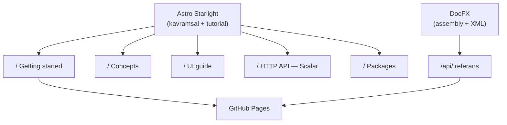

# Faz 59 — Ürün Dokümantasyonu (Doküman Sitesi)

> **Durum:** ✅ Tamamlandı (2026-08-16)
> **Kaynak:** Kullanıcı isteği (2026-08-15). Faz 7'nin 7.7 alt başlığını
> ("Dokümantasyon — dış tüketici gözüyle") **devralır ve genişletir**.
> **Önkoşul:** [Faz 57](57-KOD-DILI-BIRLESTIRME.md) — **zorunlu.** API referansı
> XML dokümandan üretilir; Türkçe XML doküman Türkçe site üretir.
> **Paketler:** Kod değişmez; `AgentPrism.AspNetCore` OpenAPI üstverisi düzeltilir
> **Yeni paket:** Yok (Node tarafında yeni bir çalışma alanı) · **Migration:** Yok
> **Public API:** Değişmiyor

---

## Bu Faza Başlarken

1. Bu doküman
2. Kararlar:
   ```bash
   grep -n "K-039\|K-232\|K-045\|K-228\|K-068" docs/KARARLAR.md
   ```
   **K-039** + reddedilen L35 (`Microsoft.AspNetCore.OpenApi` bağımlılığı
   **alınmadı**; belge tüketicinin `AddOpenApi()` çağrısıyla oluşur — siteye
   gömülecek JSON bu yüzden bir *snapshot*'tır), **K-232** (tek dilli API
   sözleşmesi), **K-045**/**K-228** ("kütüphane yerine elle yaz" emsali),
   **K-068** (yayın ertelendi).
3. Faz 57 devir notu:
   ```bash
   awk '/## Sonraki Faza Devir Notu/,0' docs/arsiv/fazlar/57-KOD-DILI-BIRLESTIRME.md
   ```
4. Alan hafızası: [`hafiza/frontend.md`](../../hafiza/frontend.md) (Node sürümü, Vite,
   bundle bütçesi), [`hafiza/aspnetcore-json.md`](../../hafiza/aspnetcore-json.md)
   (`.WithTags`/`.Produces` üstverisi — OpenAPI açıklamaları oradan gelir)
5. [`MIMARI.md`](../../MIMARI.md) — **tamamı**. Bu fazın "Concepts" bölümünün kaynağıdır.

---

## Amaç

AgentPrism 17 NuGet paketi ve 33 route'luk bir arayüz yayınlıyor. Kullanıcıya
dönük dokümantasyon bugün ~2.500 satırdır (`README.md` 362 + 18 paket README
1.375 + `MIMARI.md` 751); geri kalan ~99.500 satır **geliştirme günlüğüdür**.
Site altyapısı sıfırdır — repo genelinde DocFX, Docusaurus, MkDocs veya
GitHub Pages izi yoktur.

Bu faz iki hedef kitleye tek site üretir:

- **Kullanıcı** — kurulum, ilk agent, arayüz turu, HTTP API
- **Geliştirici (paket tüketicisi)** — API referansı, genişleme noktaları,
  paket seçimi

**Dil: yalnız İngilizce** (kullanıcı kararı, 2026-08-15). Gerekçe K-232 ile
aynıdır: paket uluslararası yayınlanır, aynı metin günlükte, testte ve destek
kaydında aynı olmalıdır. `docs/` Türkçe kalmaya devam eder — bu iki karar
birbirinden bağımsızdır.

### Bugün ne çalışmıyor — doğrulanmış kanıt

| Kanıt | Gözlem |
|---|---|
| `.github/workflows/` | **Tek dosya** (`ci.yml`); `pages` job'u, `permissions: pages`, `actions/deploy-pages` yok |
| `docs/openapi/agentprism.json` `info.title` | `"AgentPrism.AspNetCore.FunctionalTests \| v1"` — snapshot'ı üreten test host'unun adı |
| aynı dosya `servers` / `securitySchemes` | `http://localhost/` · **boş** |
| aynı dosya, `description` alanı | 143 operasyonun **68'inde** var (%48) |
| `src/AgentPrism.UI/README.md` | "7 ekran", "~88 KB" — gerçek 27 ekran / 33 route |
| `src/AgentPrism.Abstractions/README.md` | **20 satır**; `Core` 23, `PostgreSql` 25, meta 31, `AspNetCore` 32 — en merkezî beş paketin README'si en ince olanlar |
| `<example>` XML etiketi | 590 public tipte **21 tane** |

> Kanıtlar 2026-08-15 tarihinde doğrulandı.

### Eldeki hammadde — güçlü

| Girdi | Durum |
|---|---|
| HTTP API | 112 path, 143 operasyon, 226 şema; **143/143 `summary`**, 2xx şeması olmayan uç **0**; snapshot testiyle güncel tutuluyor |
| Arayüz | 33 route, 27 ekran, `locales/en.ts` 1.009 anahtar |
| Örnek uygulama | `samples/AgentPrism.Api/Program.cs` — 729 satır, başında ~201 satırlık kavram anlatımı (Faz 57.5'te İngilizce yazılacak) |
| Şablon | `dotnet new agentprism-api`, üç seçenek |
| XML doküman | 4.267 `<summary>`, 590 public tip — Faz 57 sonunda İngilizce |

---

## 59.0 — DocFX spike (ilk iş, kısa)

> Bu bölüm bir **ölçümdür**, bir uygulama değil. Sonucu 59.2'nin şeklini belirler.

**Risk.** DocFX kararlı sürümü **2.78.5**'tir (2026-02). .NET Foundation altında
topluluk bakımındadır ve **.NET 8 hedefler**; .NET 10 desteği yalnız nightly
paketlerdedir. Bu repo `global.json` ile SDK **10.0.100**'e sabittir ve
`allowPrerelease: false`'tur.

**Azaltma.** DocFX'i csproj/MSBuild üzerinden çalıştırma. `dotnet build`'in
zaten ürettiği ikiliyi ver:

```
artifacts/bin/<Paket>/release/<Paket>.dll
artifacts/bin/<Paket>/release/<Paket>.xml
```

Bu mod MSBuild/Roslyn bağımlılığını tamamen kaldırır. Spike bunu **17 pakette**
doğrular.

⚠️ Üç paket farklıdır: `AgentPrism.Testing` ve `AgentPrism.Templates` yalnız
`net10.0` hedefler; `AgentPrism.Generators` `netstandard2.0`'dır ve
`IsPackable=false`'tur (DLL'i `Core` nupkg'sinin içinde taşınır).

**Spike başarısızsa** alternatif: XML → markdown üreteci yazmak. Repo'nun
"kütüphane yerine elle yaz" emsali vardır (K-045 yönlendirici, K-228 i18n).
Maliyet: kalıtım, generic ve overload gösterimini kendin sahiplenirsin.

**Çıktı:** bir karar cümlesi — "DocFX assembly+XML modu 17 pakette çalışıyor"
veya "çalışmıyor, sebep X, alternatif Y".

### ✅ Spike sonucu (2026-08-16)

> **DocFX 2.78.5'in assembly + XML modu 17 paketin tamamında MSBuild'e hiç
> dokunmadan çalışıyor: 588 public tip, 0 uyarı, 0 hata, ~7 saniye.**

Planın öngördüğü .NET 10 SDK riski gerçekleşmedi; markdown üreteci alternatifine
gerek kalmadı. İki sapma ölçüldü:

- **Yol düzeni plandan farklı.** Plan `artifacts/bin/<Paket>/release/<Paket>.dll`
  diyordu; gerçek düzen çok hedefli projelerde `release_net10.0/`, tek hedefli
  `Templates` ve `Generators`'ta `release/`. `docfx.json` 17 yolu **açıkça**
  listeler — glob kullanılmadı (aşağıdaki senkron kopyası tuzağı).
- **`AgentPrism.Generators`'ın `.xml` dosyası yok** ve zaten `IsPackable=false`;
  referanstan çıkarıldı. Kalan 17 paketin hepsinde XML doküman var.
- **Tip sayısı 588, plandaki 590 değil.** Plan namespace sayfalarını da saymıştı;
  gerçek dağılım 588 tip + 2 namespace (`AgentPrism`, `AgentPrism.Testing`).
  Paket kırılımı Faz 57'nin ölçümüyle birebir uyuşuyor (Abstractions 282,
  Core 180). `AgentPrism` (meta) ve `Templates` public tip taşımaz.

---

## 59.1 — Ön koşul düzeltmeleri

Site yazılmadan önce kaynak veriler doğru olmalıdır.

| # | Düzeltme | Yer |
|---|---|---|
| 1 | `info.title` gerçek ürün adını taşısın | Snapshot'ı üreten host yapılandırması |
| 2 | `servers` ve `securitySchemes` doldurulsun | Aynı yer; `securitySchemes` API anahtarı şemasını yansıtmalı (Faz 53) |
| 3 | Eksik 75 `description` yazılsın | `.WithDescription` — `src/AgentPrism.AspNetCore/` |
| 4 | Beş merkezî paket README'si genişletilsin | `Abstractions`, `Core`, `PostgreSql`, `AspNetCore`, meta |
| 5 | `src/AgentPrism.UI/README.md` güncellensin | 27 ekran, ölçülen bundle değeri |

> 1–3 `docs/openapi/agentprism.json` snapshot'ını değiştirir. Yenileme:
> `AGENTPRISM_OPENAPI_REFRESH=1 dotnet test tests/AgentPrism.AspNetCore.FunctionalTests -c Release --filter-method "*OpenApiSnapshot*"`

---

## 59.2 — Site yapısı



| Bölüm | Kaynak |
|---|---|
| Getting started | `README.md` kurulum + `dotnet new agentprism-api` + ilk agent |
| Concepts | `docs/MIMARI.md` (İngilizce yazılır) + `samples/.../Program.cs` kavram bloğu |
| UI guide | 33 route / 27 ekran; ekran görüntüleriyle |
| HTTP API | `docs/openapi/agentprism.json` → Scalar ile render |
| Packages | 17 paket README'si |
| `/api/` | DocFX, 590 public tip |

**Neden iki araç.** Starlight yerleşik i18n, Pagefind araması, MDX ve
bakımlı bir tema verir; DocFX .NET API referansının standart üreticisidir ve
XML dokümanı doğrudan okur. Tek araçla ikisini iyi yapmak mümkün değildi:
DocFX'in kavramsal tarafı zayıf, Starlight'ın .NET API referansı yok.

**Ekran görüntüsü disiplini.** Playwright E2E altyapısı zaten var
(`tests/AgentPrism.Ui.E2ETests/`). Tutorial görselleri **elle alınmaz** —
E2E koşumundan üretilir. Gerekçe: elle alınan görsel arayüz değişince sessizce
bayatlar ve bunu kimse fark etmez. `docs/manuel-test/kanit/S4/MT-UI-043-dashboard-375.png`
bu desenin tek örneğidir; genelleştirilir.

> 🚨 E2E testleri dili **sabitlemek zorundadır** (K-231: varsayılan dil
> tarayıcıdan gelir). Ekran görüntüsü üreten koşum `en-US` sabitler, yoksa
> görseller koşumu yapan makinenin diline bağlanır.

---

## 59.3 — Yayın

`.github/workflows/ci.yml`'e `pages` job'u eklenir: `permissions: pages: write`,
`actions/deploy-pages`. Tetikleyici `main`'e push.

Site çıktısı ve Node çalışma alanı `.gitignore`'a girer. Doküman sitesi
`dotnet build`'e **bağlanmaz** — arayüzden farklı olarak pakete gömülmez, ayrı
bir yayın hattıdır.

---

## Planlanan Public API

Değişiklik yok. 59.1'in 1–3 numaralı kalemleri `endpoint` **üstverisini**
değiştirir (`WithDescription`), imzaları değil.

### Arayüz payı

Yok. Doküman sitesi ayrı bir Node projesidir; `AgentPrism.UI` bundle'ına
girmez ve 250 KB gzip bütçesini etkilemez.

---

## Planlanan Dosya Listesi

```
docs-site/                          (yeni — repo kökünde, docs/ ile karıştırma)
├── astro.config.mjs
├── package.json
├── src/content/docs/               (MDX içerik, İngilizce)
└── public/screenshots/             (E2E'den üretilir)
docfx/
├── docfx.json                      (assembly + XML modu)
└── filterConfig.yml
.github/workflows/ci.yml            (pages job'u eklenir)
```

> `docs-site/` adı bilinçlidir. `docs/` Türkçe geliştirme günlüğüdür;
> `docs-site/` İngilizce ürün dokümantasyonudur. İkisi karıştırılmaz.

---

## Testler

| Test | Neyi doğrular |
|---|---|
| Bağlantı denetimi (site build'i) | İç bağlantılar kırık değil |
| `OpenApiSnapshotTests` (var olan) | 59.1'den sonra snapshot güncel |
| E2E ekran görüntüsü koşumu | Görseller üretiliyor ve dil `en-US` sabit |

---

## Açık Sorular

| # | Soru | Seçenekler | Öneri |
|---|---|---|---|
| 1 | Site sürümlenecek mi (v1 / v2 ayrı)? | A: hayır, tek sürüm · B: Starlight versioning | **A** — paket henüz yayınlanmadı; sürümleme ilk `1.0` sonrası anlam kazanır |
| 2 | `/api/` referansı 17 paketin **hepsini** mi kapsasın? | A: hepsi · B: yalnız meta pakete girenler (7) | **A** — `Sqlite`, `Anthropic` gibi paketler tam da referans aranan yerlerdir |
| 3 | `docs/MIMARI.md` İngilizce'ye kopyalansın mı, yoksa Concepts sıfırdan mı yazılsın? | A: kopyala-uyarla · B: sıfırdan | **B** — MIMARI iç okuyucu için yazıldı (karar referansları, faz numaraları). Dış okuyucu bunları bilmez |
| 4 | Alan adı / Pages yolu | `farukatasoy.github.io/AgentPrism` · özel alan adı | Kullanıcıya sorulacak; Faz 7'nin 7.4 (depo adresi) kalemiyle birlikte karara bağlanır |

---

## Bitiş Ölçütleri (DoD)

- [x] 59.0 spike sonucu bir karar cümlesiyle bu dokümana yazıldı — 59.0 bölümü
- [x] Site yerel derleniyor: **628 sayfa**, sıfır hata (Node 22.21.0)
- [x] `/api/` altında **588 public tip** görünüyor ve açıklamaları İngilizce —
      plandaki 590 namespace sayfalarını da sayıyordu (bkz. 59.0 spike sonucu)
- [x] 143 operasyon render ediliyor (Scalar yerine üretilen sayfalarla, K-417);
      `info.title` = `AgentPrism HTTP API`, `servers` ve `securitySchemes` dolu
- [~] Getting started **temiz bir makinede** izlenmedi. Bu makinede doğrulanan:
      `dotnet new agentprism-api` şablonu ve seçenekleri (`Templates.Tests`,
      canlı `--help`), örnek uygulamanın gerçek koşumu, sayfadaki her `curl`
      kalıbının canlı uygulamaya karşı çalışması. Temiz makine doğrulaması
      yapılmadı — .NET SDK'sız bir ortam gerektirir
- [x] UI guide'daki 14 ekran görüntüsünün tamamı E2E koşumundan **üretildi**
      (`DocumentationScreenshotTests`, `AGENTPRISM_UI_SCREENSHOTS=1`)
- [x] İç bağlantı denetimi: **628 sayfada 403.240 referans, sıfır kırık**
- [~] `pages` job'u yazıldı ve YAML doğrulandı; **yeşil olduğu görülmedi** —
      depo henüz GitHub'da yok (`git remote -v` boş). Bkz. "Yayın için gereken
      tek elle adım"
- [x] Dört doğrulama kapısı sıfır uyarı verir — build/test/pack/format hepsi 0
- [x] `secret` taraması boş döndü; sitede bağlantı dizesi/anahtar yok
      (`docs/manuel-test/**`'teki sahte test anahtarları fazdan öncedir ve
      kapsam dışıdır — Faz 57 ile aynı gerekçe)
- [x] `find ... -name "* [0-9].*"` boş; `artifacts/` iki kez temizlendi ve
      `docfx.json` kalıcı `exclude` deseni taşıyor (Sapma 9)

### Doğrulama komutları

> ⚠️ Site **Node 22.12+** ister (Astro 7). Yerelde 20.x varsa derlenmez.

```bash
# Site — uretim + derleme + baglanti denetimi
cd docs-site && npm ci && npm run build && node scripts/check-links.mjs

# API referansi: kac tip, kac cozulemeyen capraz referans
cd docs-site && npm run generate
#   -> API reference: 588 types across 15 assemblies; 76 cross-reference(s) ...
#   -> HTTP API: 143 operations across 19 groups.

# OpenAPI ustverisi ve K-418 kapisinin olctugu sey
python3 -c "
import json; d=json.load(open('docs/openapi/agentprism.json'))
ops=[o for p,v in d['paths'].items() for m,o in v.items() if m in ('get','post','put','delete','patch')]
props=[pv for s in d['components']['schemas'].values() for pv in (s.get('properties') or {}).values()]
print(d['info']['title'], d['servers'], d.get('security'))
print('description:', sum(1 for o in ops if o.get('description')), '/', len(ops))
print('sema property dokumani:', sum(1 for v in props if v.get('description')), '/', len(props))
"
#   -> AgentPrism HTTP API [...] [{'bearer': []}]
#   -> description: 143 / 143
#   -> sema property dokumani: 819 / 1080

# Ekran goruntulerini yenile
AGENTPRISM_UI_SCREENSHOTS=1 dotnet test tests/AgentPrism.Ui.E2ETests -c Release
```

---

## Riskler

| Risk | Önlem |
|------|-------|
| DocFX .NET 10 SDK ile çalışmaz | 59.0 spike **ilk iş**; assembly+XML modu MSBuild'i devre dışı bırakır. Başarısızsa markdown üreteci alternatifi |
| DocFX topluluk bakımında; sürüm kadansı düzensiz | Çıktı statik HTML'dir; araç durursa üretilmiş site çalışmaya devam eder. Bağımlılık yayın anında, çalışma anında değil |
| Faz 57 bitmeden site kurulur → API referansı Türkçe çıkar | Önkoşul **zorunlu** işaretli; 59.0 dışındaki hiçbir bölüm 57 bitmeden başlamaz |
| Ekran görüntüleri arayüz değişince bayatlar | E2E'den üretilir; elle alınan görsel kabul edilmez (DoD maddesi) |
| `docs/` ile `docs-site/` karışır, içerik iki yere yazılır | Ad ayrımı + `AGENTS.md`'ye tek satır kural |
| Site içeriği `README.md` ile kayar | README site'ye **bağlantı verir**, içeriği tekrarlamaz |

---

<!-- ============================================================
     AŞAĞISI KAPANIŞTA DOLDURULUR — `faz-tamamlama` skill'i.
     ============================================================ -->

## Plandan Sapmalar

1. **HTTP API için Scalar kullanılmadı; sayfalar OpenAPI belgesinden üretildi (K-417).**
   Plan Scalar öngörüyordu. Ölçüldü: standalone paket **7,4 MB / 90 chunk**, kendi
   temasında render ediyor ve içeriği **Pagefind'e girmiyor**. Bu fazda 143
   operasyonun tamamına açıklama yazıldı; hepsini sitenin kendi aramasından gizlemek
   kabul edilemezdi. `scripts/build-http-api.mjs` etiket başına bir Starlight sayfası
   üretir. Ham belge `/openapi/agentprism.json` olarak yayınlanır.

2. **API referansı DocFX'in HTML sitesi değil, markdown çıktısı (K-416).** Aynı
   gerekçe: tek site, tek tema, tek arama indeksi. Bedeli ölçüldü ve ödendi — DocFX
   prose içindeki `<see cref>`'leri ham `<xref>` olarak bırakıyor (374/590 sayfada
   1351 oluşum) ve bunları çözen ~250 satırlık bir üreteç yazıldı.

3. **🚨 Fazın kendisi bir gerileme üretti ve kapı onu göstermedi (K-418).**
   `AddOpenApi(ProductOpenApiDocument.Configure)` yazıldı; belge **226 şemanın
   166'sının** property açıklamalarını kaybetti. `OpenApiSnapshotTests` yakalayamadı
   çünkü yalnız "dosya host'la aynı mı" der — snapshot yenilendiği an gerileme
   gizlendi. `git diff`'in satır sayısı (711 eklendi / 1639 silindi) fark edilip
   yapısal olarak ölçülünce çıktı. Kalıcı kapı eklendi ve hatalı bağlamayla gerçekten
   düştüğü doğrulandı.

4. **A2A uçları plan dışı eklendi.** Snapshot'ta yoklar (test host `MapAgentPrismA2A`
   çağırmaz), bu yüzden "eksik 75" listesinde görünmüyorlardı. Örnek uygulamanın
   kendi belgesi 147/147 yerine 145/147 gösterince ortaya çıktılar; ikisine de
   `summary` + `description` yazıldı.

5. **Yayınlanan açıklamalardaki iç doküman referansları temizlendi (K-420).** Plan
   yalnız "eksik 75'i yaz" diyordu; var olan 68'in 6'sı Türkçe geliştirme günlüğüne
   işaret ediyordu ve o metinler siteye giriyor.

6. **Plan kanıtı bayattı: `src/AgentPrism.UI/README.md` zaten güncelmiş.** Plan "7
   ekran, ~88 KB" diyordu; dosya gerçekte 27 ekran / 33 route / 165,8 KB yazıyordu.
   Üçü de bağımsız ölçüldü ve doğrulandı (27 `.tsx`, 33 `pattern:`, `npm run build`
   → 165,8 KB). 59.1'in 5. kalemi bu yüzden **gereksizdi**.

7. **Node sürümü yükseldi.** Astro 7 **22.12+** ister; arayüzün Vite 7'si 20.19 ile
   yetiniyordu. Astro 5 seçilmedi çünkü `npm audit` 5 açık bildirdi (2 yüksek: XSS,
   SSRF). Astro 7.2.2 + Starlight 0.41.7 = 0 açık.

8. **`AgentPrism.Generators` referans listesinden çıkarıldı** — XML dokümanı yok ve
   `IsPackable=false`. Kullanıcının "17 paketin hepsi" kararı paketlenebilir 17
   projeyi kapsar; `Sql.Shared`'in `.csproj`'u yoktur, `Generators` paket değildir.

9. **🚨 Senkron kopyaları iki kez araya girdi.** `artifacts/` altında 1707 ve sonra
   814 adet `<ad> N.dll` kopyası oluştu; ikincisi DocFX'i `IOException` ile kırdı.
   Silmek yetmedi — `docfx.json`'ın `references` bloğuna kalıcı `exclude` deseni
   eklendi (`**/* [0-9].dll`), assembly listesi de glob yerine 17 yolu **açıkça**
   yazar. MEMORY.md'nin beş kez yaşanmış tuzağının altıncı ve yedinci vakası.

## Bu Fazda Verilen Kararlar

`docs/KARARLAR.md`'ye **K-415 – K-420** eklendi:

- **K-415** — Ürün sitesi ayrı, İngilizce, Astro Starlight, GitHub Pages (kullanıcı kararı)
- **K-416** — API referansı DocFX markdown + kendi bağlantı çözücümüz
- **K-417** — HTTP API sayfaları üretilir; Scalar gömülmedi
- **K-418** — 🚨 `AddOpenApi()` çıplak çağrılmalı; aksi hâlde şema XML dokümanı düşer
- **K-419** — Ekran görüntüleri E2E'den üretilir, `en-US` + Light sabit
- **K-420** — Yayınlanan `description` metinleri iç doküman referansı taşımaz

### Açık soruların cevapları (kullanıcı, 2026-08-16)

| # | Soru | Karar |
|---|---|---|
| 1 | Sürümleme | **A** — hayır, tek sürüm |
| 2 | `/api/` kapsamı | **A** — paketlenebilir 17 paketin hepsi |
| 3 | Concepts | **B** — sıfırdan, dış okuyucu için |
| 4 | Alan adı | `farukatasoy.github.io/AgentPrism` (proje sitesi, `base: /AgentPrism/`) |

## Gerçekleşen Public API

**Değişiklik yok — plan doğrulandı.** Hiçbir tip, üye veya imza eklenmedi,
kaldırılmadı veya yeniden adlandırıldı. Değişen tek şey `endpoint` **üstverisidir**
(`WithSummary`/`WithDescription`) ve o üstveri imzaya girmez.

Ölçülen kapsam:

| | Önce | Sonra |
|---|---:|---:|
| `description` taşıyan operasyon (snapshot) | 68 / 143 | **143 / 143** |
| `description` taşıyan operasyon (canlı örnek uygulama) | — | **147 / 147** |
| Belgelenmiş şema property'si | 819 / 1080 | **819 / 1080** (korundu, K-418) |
| `info.title` | `AgentPrism.AspNetCore.FunctionalTests \| v1` | `AgentPrism HTTP API` |
| `servers` | `http://localhost/` | `http://localhost:5081` + açıklama |
| `securitySchemes` | **boş** | `bearer` (http/bearer) + `security` gereksinimi |

## Dosya Listesi (gerçekleşen)

**Yeni:**

```
docs-site/                                    (Astro Starlight, İngilizce)
├── astro.config.mjs · package.json · package-lock.json
├── scripts/build-api-reference.mjs           (DocFX markdown → Starlight)
├── scripts/build-http-api.mjs                (OpenAPI → Starlight)
├── scripts/check-links.mjs                   (kırık iç bağlantı kapısı)
├── src/content.config.ts · src/styles/site.css
├── src/content/docs/                         (17 elle yazılmış sayfa)
│   ├── index.mdx · packages.md · ui.md · http-api.md
│   ├── getting-started/ (5)  ·  concepts/ (8)
├── public/favicon.svg
└── public/screenshots/                       (14 PNG, E2E'den üretildi)
docfx/
├── docfx.json                                (assembly + XML, markdown çıktı)
└── filterConfig.yml
.config/dotnet-tools.json                     (docfx 2.78.5)
tests/AgentPrism.AspNetCore.FunctionalTests/Infrastructure/ProductOpenApiDocument.cs
tests/AgentPrism.Ui.E2ETests/DocumentationScreenshotTests.cs
```

**Değişen:** `src/AgentPrism.AspNetCore/` (18 uç dosyası + A2A — 77 yeni
`WithDescription`, 6 temizlenmiş), beş merkezî paket README'si
(`Abstractions` 20→~95, `Core` 24→~100, `PostgreSql` 25→~95, `AspNetCore` 32→~100,
meta 31→~95 satır), `docs/openapi/agentprism.json`, `.github/workflows/ci.yml`
(`pages` job'ı), `.gitignore`, `AGENTS.md`, `README.md`,
`tests/.../OpenApiDocumentTests.cs` (K-418 kapısı),
`tests/.../AgentPrismTestHost.cs`.

**Değişmeyen (plan öngörmüştü):** `src/AgentPrism.UI/README.md` — zaten güncelmiş
(Sapma 6).

## Testler

| Test | Neyi doğrular | Sonuç |
|---|---|---|
| `OpenApiDocumentTests.Document_carries_operation_descriptions_and_schema_documentation` | **Yeni.** Her operasyonda `description`; 500+ belgelenmiş şema property'si | ✅ hatalı bağlamayla gerçekten DÜŞTÜĞÜ doğrulandı |
| `DocumentationScreenshotTests.Every_documented_screen_renders_and_is_captured` | **Yeni.** 14 ekran gerçek tarayıcıda render oluyor; `en-US` + Light sabit | ✅ |
| `OpenApiSnapshotTests` (var olan) | Snapshot host'la aynı | ✅ (ama K-418'i göremez — sapma 3) |
| `check-links.mjs` (site kapısı) | 628 sayfada 403.240 iç referans | ✅ sıfır kırık |

## Sonraki Faza Devir Notu

**Devralınan sözleşmeler:**

- `docs/` ile `docs-site/` iki ayrı şeydir ve karıştırılmaz (K-415). Kural
  `AGENTS.md`'dedir. Kullanıcıya dönük her yeni anlatı **siteye** yazılır.
- Site içeriğinin bir kısmı **üretilir ve commit edilmez**: `src/content/docs/api/`,
  `src/content/docs/http-api/`, `src/generated/`, `public/openapi/`. `npm run generate`
  onları yeniden kurar. Ekran görüntüleri **commit edilir**.
- Yeni bir HTTP ucu eklerken `.WithSummary` **ve** `.WithDescription` zorunludur —
  `OpenApiDocumentTests` artık her operasyonda `description` arar.

**Bilinen tuzaklar (🚨):**

- **`AddOpenApi()` çıplak çağrılmalıdır** (K-418). Delege alan aşırı yükleme XML
  doküman interceptor'ını devre dışı bırakır ve 226 şemanın 166'sı açıklamasız kalır.
  `OpenApiSnapshotTests` bunu göremez; snapshot yenilemek gerilemeyi gizler.
- **Snapshot yenilemeden önce `git diff --stat`'e bak.** Bu fazda 1639 satırlık bir
  silme, sessiz bir kayıp anlamına geliyordu. Satır sayısı beklenmedikse **yapısal
  olarak ölç** (path/op/schema/requestBody/response sayıları), sonra yenile.
- **Node 22.12+** gerekir (Astro 7). Yerel makinede 20.19 varsa site derlenmez;
  CI `node-version: '22'` kullanır.
- **Senkron kopyaları DocFX'i kırar** (`IOException`, yarım yazılmış `<ad> N.dll`).
  `docfx.json` artık `exclude` taşır ama `artifacts/` temizliği yine de ilk adımdır.
- **Starlight sidebar bağlantıları `base` TAŞIMAZ**, markdown bağlantıları taşır.
  Karıştırmak `/AgentPrism/AgentPrism/...` üretir; `check-links.mjs` yakalar.
- 🚨 **Tam çözüm koşumunda iki kez aralıklı bir test düşüşü görüldü** (bir kez
  `AspNetCore.FunctionalTests`, bir kez `Core.UnitTests`), hiçbiri izole koşumda
  tekrar etmedi ve ikisi de yakalanamadı. Sonrasında **altı ardışık tam koşum
  temiz** (`exit=0`), TRX ile üç kez daha denendi ve tekrar üretilemedi. Sebep
  atfedilmedi; bu faz bir E2E testi ekledi (`DocumentationScreenshotTests` — Kestrel
  host + tarayıcı bağlamı + iki gerçek `run`) ve paralel yükü artırdı, dolayısıyla
  ilişkisi dışlanamaz. MEMORY.md'de zaten kayıtlı olan "49 E2E testinden 1'i tam
  koşumda rastgele zaman aşımına uğrayabilir" tuzağıyla aynı sınıfta görünüyor.
  Kırmızı bir kapı görürsen **önce izole koş** — bayat mı kusurlu mu ayrımı budur.
- `run` kaydında `durationMs` ve token alanları gerçek Anthropic koşumunda `null`
  döndü (`startedAt`/`completedAt` dolu, 5 olay yazıldı, `status: Completed`). Bu
  fazdan **önce de** böyleydi ve bu faz çalışma anına dokunmadı; ölçülmemiş bir
  açık kalemdir.

**Sıradaki faz:** `docs/arsiv/UCUNCU-FAZ-YOL-HARITASI.md` ve README'nin yol haritası
tablosu. Açık kalan büyük kalem **Faz 7**'dir (public API dondurma + NuGet yayını,
K-068); bu faz onun için gereken tüketici dokümantasyonunu hazırladı.

### 🚨 Yayın için gereken tek elle adım

`pages` job'ı yazıldı ve yeşil olmaya hazır, ama **GitHub deposu henüz yok**
(`git remote -v` boş). Site yayına girmeden önce depo açılmalı ve
**Settings → Pages → Source = GitHub Actions** seçilmelidir. Bu adım olmadan job
`actions/configure-pages` aşamasında düşer.
