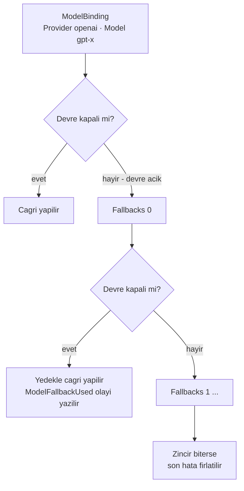

# Faz 62 — Model Yedek Zinciri ve Ön Uçuş Denetimi

> **Durum:** ✅ Tamamlandı (2026-08-18)
> **Kaynak:** [ADAYLAR.md](../../ADAYLAR.md) · **F-44**, **F-59**
> **Önkoşul:** [Faz 8](08-SAGLAYICI-GENISLEMESI.md) — devre kesici ve sağlayıcı sağlığı bu fazın yarısını kurdu · [Faz 13](13-BAGLAM-SIKISTIRMA-VE-BELLEK.md) — `MaxContextWindowTokens`'ın bugünkü tek tüketicisi
> **Paketler:** `AgentPrism.Abstractions`, `AgentPrism.Core`, `AgentPrism.AspNetCore`, `AgentPrism.UI`
> **Yeni paket:** Yok · **Migration:** Yok — yedek zinciri agent tanımının içindedir, tanım zaten `jsonb` olarak saklanır
> **Public API:** **büyüyor** — `ModelBinding`'e bir alan. `PublicAPI.Shipped.txt` bugün **boş** (ölçüldü: 1 satır), `EnablePublicApiTracking` `true`. `sealed record`'a alan eklemek **bugün bedava**, ilk yayından sonra bir sürüm kararıdır
> **Site etkisi:** `guides/model-providers.md`, `guides/reliability.md`, `reference/configuration.md`
> **Manuel test alanı:** `docs/manuel-test/27-MODEL-YEDEK-VE-ON-UCUS.md`

---

## Bu Faza Başlarken

> `faz-baslangic` skill'ini uygula. Aşağıdaki liste o skill'in 2. adımıdır —
> **tamamını değil, yalnız işaret edilen bölümleri oku.**

1. Bu doküman
2. Kararlar — dosyanın tamamını **okuma**, yalnız bu kalemleri grep'le:
   ```bash
   grep -n "K-032\|K-104\|K-208\|K-320\|K-158" docs/KARARLAR.md
   ```
   **K-032** (yerleşik model listesi yok — yedek zinciri bir model kataloğu
   **değildir**), **K-104** (`Microsoft.ML.Tokenizers` geçişli bağımlılıktadır
   ve sıkıştırma için ayrı paket alınmadı), **K-208** (`ProviderSettings`
   deseni — `ModelBinding`'e alan eklemenin emsali), **K-320** (boru hattındaki
   **konum** kabul edilmez, grep'le ölçülür), **K-158** (hız sınırı bilerek
   bellekte tutuldu — eşzamanlılık sınırı da öyle olacaktır)
3. [`08-SAGLAYICI-GENISLEMESI.md`](08-SAGLAYICI-GENISLEMESI.md) — yalnız devir notu:
   ```bash
   awk '/## Sonraki Faza Devir Notu/,0' docs/arsiv/fazlar/08-SAGLAYICI-GENISLEMESI.md
   ```
   Devre kesicinin sözleşmesi devralınır: yedek zinciri onun **açık** durumunu
   okur, kendi sağlık modelini kurmaz.
4. Alan hafızası (bu faz iki alana dokunuyor):
   [`hafiza/openai-saglayici.md`](../../hafiza/openai-saglayici.md) (sağlayıcı
   katalogları ve `ModelDescriptor` üretimi),
   [`hafiza/cekirdek-calistirma.md`](../../hafiza/cekirdek-calistirma.md) (`run`
   kaydına olay yazma ve `span` kuralları)
5. Gerektiğinde, tamamı değil ilgili bölümü:
   [`MIMARI.md`](../../MIMARI.md) — model çağrı yolu bölümü

---

## Amaç

Bu faz model çağrısının **iki ucunu** kapatır: çağrıdan **önce** parayı
harcamadan reddetmek, çağrı **başarısız olduğunda** hizmeti ayakta tutmak.

Bugün ikisi de eksiktir. Sağlayıcı kesildiğinde devre kesici açılır ve
çalıştırma **yalnız hata verir**; ikinci bir sağlayıcıya geçiş yoktur. Bağlam
penceresi aşılacağı çağrıdan önce **bilinemez**; hata sağlayıcıdan, para
harcandıktan sonra gelir.

- **F-44** — `ModelBinding.Fallbacks` sıralı yedek zinciri ve sağlayıcı başına
  giden eşzamanlılık sınırı.
- **F-59** — Model üstverisinden bağlam penceresi türetme, çağrı öncesi token
  sayımı ve aşımda erken red.

İkisi tek fazdadır çünkü **tek bir entegrasyon noktasını** paylaşırlar:
[`ModelProviderRegistry.CreateChatClient`](../../../src/AgentPrism.Core/Models/ModelProviderRegistry.cs)
ve `ModelBinding` sözleşmesi. Ayrı fazlara bölünürse aynı `sealed record` iki
kez, aynı boru hattı iki kez değişir.

### Bugün ne çalışmıyor — doğrulanmış kanıt

| Kanıt | Gözlem |
|---|---|
| [`ModelBinding.cs:9-82`](../../../src/AgentPrism.Abstractions/Agents/ModelBinding.cs) | Alanlar: `Provider`, `Model`, `Temperature`, `MaxOutputTokens`, `TopP`, `ReasoningEffort`, `ProviderSettings`, `ResponseFormat`. **`Fallbacks` yok** |
| [`ModelProviderRegistry.cs:104`](../../../src/AgentPrism.Core/Models/ModelProviderRegistry.cs) | `CreateChatClient(ModelBinding binding)` — boru hattının **tek** kurulum yeri. Kiracı veya çalıştırma bağlamı **almaz** |
| [`ModelProviderRegistry.cs:154`](../../../src/AgentPrism.Core/Models/ModelProviderRegistry.cs) | Devre kesici `Wrap` ile sarmalanır; açık devre bir **istisna** atar. Yedek yoktur, ikinci sağlayıcı denenmez |
| [`ModelDescriptor.cs:13`](../../../src/AgentPrism.Abstractions/Models/ModelDescriptor.cs) | `ContextWindowTokens` tanımlıdır |
| [`OpenAIProviderExtensions.cs:204`](../../../src/AgentPrism.OpenAI/OpenAIProviderExtensions.cs) · [`GoogleProviderExtensions.cs:174`](../../../src/AgentPrism.Google/GoogleProviderExtensions.cs) · [`AnthropicProviderExtensions.cs:178`](../../../src/AgentPrism.Anthropic/AnthropicProviderExtensions.cs) · [`AzureOpenAIProviderExtensions.cs:193`](../../../src/AgentPrism.Azure/AzureOpenAIProviderExtensions.cs) | **Dört sağlayıcının dördü de** `ContextWindowTokens`'ı yapılandırmadan **yazıyor** |
| `grep -rn "ContextWindowTokens" src/` | Hiçbir üretim kodu bu değeri **okumuyor**. Tek okuyan yer [`FakeModelProvider.cs:56`](../../../src/AgentPrism.Testing/FakeModelProvider.cs)'nın kendi sabiti |
| [`AgentDefinitionCompiler.cs:689`](../../../src/AgentPrism.Core/Compilation/AgentDefinitionCompiler.cs) | `ContextWindow` sıkıştırma stratejisi seçilip `MaxContextWindowTokens` verilmezse **derleme hatası**. Kullanıcı sayıyı elle yazmak zorundadır — model üstverisi orada durduğu hâlde |
| [`HarnessSettings.cs:15`](../../../src/AgentPrism.Abstractions/Agents/HarnessSettings.cs) · [`CompactionSettings.cs:45`](../../../src/AgentPrism.Abstractions/Agents/CompactionSettings.cs) | Aynı sayı **iki ayrı yere** elle yazılır |
| `grep -rn "Tokenizer" src/` | AgentPrism `Microsoft.ML.Tokenizers`'ı **hiç doğrudan çağırmıyor**. K-104 onun geçişli olarak var olduğunu ölçtü; sıkıştırmada tokenizer'ı **MAF içeride** çözüyor |
| [`RunStatistics.cs:84`](../../../src/AgentPrism.Abstractions/Runs/RunStatistics.cs) | `ByModel` vardır — yedek devreye girdiğinde maliyet raporu hangi modelin çalıştığını gösterebilir |
| `PublicAPI.Shipped.txt` (1 satır) · [`Directory.Build.props:58`](../../../Directory.Build.props) | İzleme **açık**, yayınlanmış yüzey **boş**. `ModelBinding`'e alan eklemek bugün bedava |

> Kanıtlar 2026-08-18 tarihinde doğrulandı.

---

## 62.1 — Yedek zinciri nerede yaşar

Karar (kullanıcı, 2026-08-18): **`ModelBinding.Fallbacks`** — yedek listesi
agent tanımının parçasıdır.

Gerekçe: yedek bir **ürün kararıdır**, operasyonel bir ayar değil. "Bu agent
ucuz bir modele düşebilir, şu agent asla düşmemeli" ayrımını yalnız tanım
taşıyabilir. Sağlayıcı düzeyi tek bir zincir bu ayrımı yapamaz.



**Varsayılan kapalıdır (K1).** `Fallbacks` boşken bugünkü davranış **birebir**
korunur: devre açıksa istisna atılır. Boş liste hiçbir `if` çalıştırmaz.

🚨 **Sessiz model değişimi bir sürprizdir.** Yedek devreye girdiğinde çalıştırma
kaydına açık bir olay yazılır. Faz 20'nin maliyet raporu `ByModel` üzerinden
hangi modelin gerçekten çalıştığını zaten gösterebilir; bu faz o satırın
doğruluğunu **test eder**, yeni bir rapor yüzeyi açmaz.

### Yedek ne zaman denenir

| Durum | Yedeğe geçilir mi |
|---|---|
| Devre kesici **açık** | Evet |
| Sağlayıcı `HttpRequestException` veya 5xx | Evet |
| 429 (hız sınırı) | Evet |
| Kimlik doğrulama hatası (401/403) | **Hayır** — yapılandırma hatasıdır, yedek onu gizler |
| İçerik filtresi | **Hayır** — [`ContentFilterDetectingChatClient`](../../../src/AgentPrism.Core/Models/ContentFilterDetectingChatClient.cs) bunu zaten ayırıyor; sağlayıcı **sağlıklıdır** |
| İptal (`OperationCanceledException`) | **Hayır** |

Bu tablo bir davranış sözleşmesidir ve testle kapatılır.

## 62.2 — Yedek boru hattının hangi halkasında durur

🚨 **Konum kabul edilmez, ölçülür (K-320).** Bugünkü sıra
[`ModelProviderRegistry.cs:118-165`](../../../src/AgentPrism.Core/Models/ModelProviderRegistry.cs)
içinde şudur (içten dışa): ham istemci → `ContentGuardingChatClient` →
`UseFunctionInvocation` → `UseOpenTelemetry` → `AttachmentResolvingChatClient`
→ devre kesici → `ContentFilterDetectingChatClient`.

Yedek **devre kesicinin dışında** durmalıdır: yedeğe geçmek için önce birincil
sağlayıcının devresinin açık olduğunu **görmek** gerekir.

🚨 **Tool çağrı döngüsü içeride kalır.** Yedek en dışta olduğu için, yedeğe
geçildiğinde tur **baştan** başlar. Bu bilinçli bir karardır: tool döngüsünün
ortasında sağlayıcı değiştirmek yarım bir konuşma durumu üretir.

## 62.3 — Giden eşzamanlılık sınırı

Sağlayıcı başına eş zamanlı giden çağrı sayısı sınırlanır. Amaç 429 fırtınasını
**üretmemektir**; devre kesici onu yalnız fark eder.

- Varsayılan **sınırsız** (K1) — bugünkü davranış korunur.
- Sayaç **bellekte** yaşar. K-158'in gerekçesi birebir geçerlidir: dağıtık bir
  sayaç Redis bağımlılığı ister ve bir kütüphanede sıfır sürprizi bozar.
- Desen [`VoiceConnectionLimiter`](../../../src/AgentPrism.Core) içinde vardır ve
  **uygulama anında okunmalıdır** — kopyalanmadan önce imzası doğrulanır.

## 62.4 — Ön uçuş denetimi: önce türetme, sonra sayım

İki ayrı iş vardır ve **birincisi tek başına değerlidir**.

**Birinci — türetme (ucuz, risksiz).** `MaxContextWindowTokens` verilmediyse
değer `ModelDescriptor.ContextWindowTokens`'tan **türetilir**. Bugün derleme
hatası veren yol ([`AgentDefinitionCompiler.cs:689`](../../../src/AgentPrism.Core/Compilation/AgentDefinitionCompiler.cs))
artık yalnız model üstverisi de yoksa hata verir. Hata mesajı hangi iki yoldan
birinin doldurulacağını söyler.

**İkinci — sayım (yaklaşık, riskli).** Çağrıdan önce istem token'ları sayılır ve
eşik aşılırsa çağrı yapılmadan reddedilir.

🚨 **Token sayımı yaklaşıktır ve bu bir risktir.** Yanlış bir erken red çalışan
bir agent'ı durdurur. Bu yüzden:

- Sayım varsayılan **kapalıdır** (K1).
- Eşik **oransal** bir paydır (`ReserveRatio`), sabit bir sayı değil.
- Red bir `ProblemDetails` ile ve sayılan/izin verilen değerlerle döner.

🚨 **Tokenizer bir açık sorudur.** K-104 `Microsoft.ML.Tokenizers`'ın geçişli
olarak var olduğunu ölçtü, ama AgentPrism onu **hiç doğrudan çağırmıyor**.
Geçişli bir bağımlılığa doğrudan kod yazmak, üst paket onu bırakırsa derlemeyi
kırar. Açık Soru 1 bunu karara bağlar.

## 62.5 — Kestirim ucu

`POST /api/agents/{name}/estimate` çağrı **yapmadan** sayıyı döndürür: istem
token sayısı, modelin penceresi, kalan pay ve "bu çağrı reddedilir mi" yanıtı.

Bu uç ön uçuş denetiminin **teşhis yüzeyidir**. Kota (Faz 21) ve ağaç bütçesi
(Faz 12) aynı sayıyı çağrıdan **sonra** ölçer; bu uç öncesini gösterir.

---

## Planlanan Public API

> Taslak imzalardır. Gerçekleşen imzalar kapanışta ayrı bir bölüme yazılır.

```csharp
// AgentPrism.Abstractions — ModelBinding'e iki alan
public sealed record ModelBinding
{
    // ... mevcut alanlar

    /// <summary>Ordered fallback bindings tried when the primary provider is unavailable. Empty by default.</summary>
    public IReadOnlyList<ModelFallback> Fallbacks { get; init; } = [];
}

/// <summary>One link of the fallback chain.</summary>
public sealed record ModelFallback
{
    public required string Provider { get; init; }
    public required string Model { get; init; }
}

// AgentPrism.Abstractions — on ucus ayarlari, varsayilan KAPALI
public sealed class AgentPrismPreflightOptions
{
    /// <summary>Whether the pre-flight context window check runs. Disabled by default.</summary>
    public bool Enabled { get; set; }

    /// <summary>The share of the context window kept free for the answer. Default 0.2.</summary>
    public double ReserveRatio { get; set; } = 0.2;
}

// AgentPrism.Abstractions — saglayici basina giden esszamanlilik
public sealed class AgentPrismModelConcurrencyOptions
{
    /// <summary>Maximum concurrent outgoing calls per provider. Null means unlimited.</summary>
    public int? MaxConcurrentCallsPerProvider { get; set; }
}

// AgentPrism.Abstractions — kestirim sonucu
public sealed record ContextWindowEstimate
{
    public required int PromptTokens { get; init; }
    public required int? ContextWindowTokens { get; init; }
    public required bool WouldBeRejected { get; init; }
}
```

### HTTP `endpoint`'leri

| Metot | Yol | Rol · kapsam | Ne yapar |
|---|---|---|---|
| `POST` | `/api/agents/{name}/estimate` | Reader · `RunsRead` | Model çağrısı **yapmadan** token kestirimi döner |

Yedek zinciri için yeni uç **yoktur**; alan agent tanımıyla birlikte var olan
`POST/PUT /api/agents` üzerinden gelir.

### Arayüz payı

Agent düzenleyicisine yedek listesi alanı ve model bölümüne kestirim rozeti
eklenir. Bugünkü kullanım **165,4 KB gzip / 250 KB** (Faz 61'de ölçüldü);
**artış uygulama anında ölçülüp bu belgeye yazılır**. Yeni sözlük anahtarları
`en.ts` **ve** `tr.ts` içine girer (K-228).

---

## Planlanan Dosya Listesi

```
src/AgentPrism.Abstractions/
├── Agents/ModelBinding.cs              (Fallbacks alani)
├── Agents/ModelFallback.cs             (yeni)
├── Models/ContextWindowEstimate.cs     (yeni)
└── Options/                            (AgentPrismPreflightOptions, AgentPrismModelConcurrencyOptions)

src/AgentPrism.Core/Models/
├── ModelProviderRegistry.cs            (yedek halkasi burada kurulur)
├── FallbackChatClient.cs               (yeni - en dis halka)
├── ProviderConcurrencyLimiter.cs       (yeni)
└── ContextWindowEstimator.cs           (yeni - turetme + sayim)

src/AgentPrism.Core/Compilation/
└── AgentDefinitionCompiler.cs          (MaxContextWindowTokens turetilir)

src/AgentPrism.AspNetCore/Endpoints/
└── AgentEndpoints.cs                   (estimate ucu)

src/AgentPrism.UI/frontend/src/
├── screens/agent-editor.tsx            (yedek listesi alani)
└── locales/{en,tr}.ts                  (yeni anahtarlar - K-228)
```

---

## Hata Modları ve Testler

> Mutlu yoldan değil, **ne bozulabilir**den türetilir. Seviyeyi plan seçer.

| Ne bozulabilir | Seviye | Test sınıfı |
|---|---|---|
| `Fallbacks` boşken davranış değişir (bugünkü hata yolu kaybolur) | Birim | `FallbackChatClientTests` |
| Kimlik doğrulama hatasında yedeğe geçilir (hata gizlenir) | Birim | `FallbackChatClientTests` |
| İçerik filtresi yedeği tetikler | Birim | `FallbackChatClientTests` |
| İptal edilen çağrı yedeği tetikler | Birim | `FallbackChatClientTests` |
| Zincirin tamamı düşer; **son** hata değil ilk hata fırlatılır | Birim | `FallbackChatClientTests` |
| Yedek çalıştı ama `run` kaydı **birincil** modeli yazıyor | Fonksiyonel | `FallbackRecordingTests` — `RunStatistics.ByModel` gerçek modeli gösterir |
| Yedek devreye girdi, maliyet **birincil** modelin fiyatıyla hesaplandı | Fonksiyonel | `FallbackRecordingTests` |
| Eşzamanlılık sınırı sıcak yolda tahsis üretir | Birim | `ProviderConcurrencyLimiterTests` |
| Eşzamanlılık sınırı altında istekler **kilitlenir** (deadlock) | Fonksiyonel | `ProviderConcurrencyLimiterTests` — sınır 1, iki eş zamanlı çalıştırma |
| Sınır dolu iken iptal gelirse yuva bırakılmaz (sızıntı) | Fonksiyonel | `ProviderConcurrencyLimiterTests` |
| Ön uçuş **kapalıyken** bir `if` bile çalışır | Birim | `ContextWindowEstimatorTests` |
| Türetme yanlış modelin penceresini alır | Birim | `ContextWindowEstimatorTests` |
| Model üstverisi yokken türetme çöker | Birim | `ContextWindowEstimatorTests` — anlaşılır derleme hatası |
| Erken red doğru çağrıyı öldürür (yanlış pozitif) | Fonksiyonel | `PreflightEndpointTests` — eşik altındaki istem geçer |
| `estimate` ucu başka kiracının agent'ını görür | Sözleşme (`TenantIsolationContract`) | dört koşumda birden |
| `estimate` ucu kapsamsız anahtarla çağrılır | Fonksiyonel | `PreflightEndpointTests` → `403` |
| Boş mesajla `estimate` çağrılır | Fonksiyonel | `PreflightEndpointTests` |
| Sözlük anahtarı eksik | Derleme | `tsc --noEmit` (K-228) |
| Yedek listesi arayüzden kaydedilir ve geri okunur | E2E (Playwright) | `UiTests` |

Sözleşme testi `tests/Shared/Contracts/` altına — hem bellek içi hem üç SQL
sağlayıcısı üzerinde koşar.

---

## Manuel Kabul Case'leri

> Kapanışta `docs/manuel-test/27-MODEL-YEDEK-VE-ON-UCUS.md` içine eklenecek
> case'lerin taslağı.

| # | Ön koşul | Adımlar | Beklenen sonuç |
|---|---|---|---|
| 1 | `Fallbacks` boş | Sağlayıcıyı geçersiz anahtarla çalıştır | Bugünkü hata birebir korunur |
| 2 | `Fallbacks` bir yedek taşır, birincinin devresi açık | Çalıştır | Yanıt yedekten gelir; `run` kaydı yedek modeli yazar |
| 3 | 2'nin çıktısı | Maliyet raporunu aç | `ByModel` yedek modeli ve onun fiyatını gösterir |
| 4 | Yedek de düşer | Çalıştır | Hata döner; mesaj zincirin denendiğini söyler |
| 5 | Ön uçuş kapalı | Pencereden büyük bir istem gönder | Bugünkü davranış: hata sağlayıcıdan gelir |
| 6 | Ön uçuş açık | Aynı istem | Çağrı **yapılmadan** `400`; yanıt sayılan ve izin verilen token'ı yazar |
| 7 | — | `POST /api/agents/{ad}/estimate` | Sayı döner, model çağrısı **yapılmaz** (sağlayıcı logunda istek yok) |
| 8 | `MaxContextWindowTokens` boş, model üstverisi dolu | `ContextWindow` sıkıştırmalı agent kaydet | Derleme **geçer**; değer üstveriden türetilir |
| 9 | İkisi de boş | Aynı kayıt | Anlaşılır hata: hangi iki alandan birinin doldurulacağını söyler |

---

## Açık Sorular

> Planı bloklamayan, faz uygulanırken karara bağlanacak sorular.

| # | Soru | Seçenekler | Öneri |
|---|---|---|---|
| 1 | Token sayımı hangi tokenizer'la yapılır? | A: `Microsoft.ML.Tokenizers`'a **açık** `PackageReference` · B: geçişli olanı doğrudan çağır · C: karakter tabanlı kaba kestirim, tokenizer yok | **A.** Geçişli bir bağımlılığa doğrudan kod yazmak (B) üst paket onu bırakırsa derlemeyi kırar; K-104 yalnız **sıkıştırma** için "yeni paket alınmadı" dedi, çünkü orada tokenizer'ı MAF çözüyordu. Burada çağıran biziz. C ölçüsüzdür ve erken red için yeterince güvenilir değildir |
| 2 | Yedek zinciri `ModelBinding`'in tamamını mı yoksa yalnız sağlayıcı+model çiftini mi taşır? | A: `ModelFallback` yalnız `Provider`+`Model` · B: tam `ModelBinding` (sıcaklık, `ProviderSettings` dahil) | **A.** B özyinelemeli bir tip üretir (`Fallbacks` içinde `Fallbacks`) ve doğrulaması zorlaşır. Yedek modelin kendi ayarı gerekiyorsa ayrı bir kalemdir |
| 3 | Eşzamanlılık sınırı bekletsin mi, hemen reddetsin mi? | A: Bekle (kuyruk) · B: Hemen `429` | **A.** Sınırın amacı 429 üretmemektir; hemen reddetmek onu üretir. Bekleme süresi iptal token'ına bağlıdır |
| 4 | Ön uçuş reddi hangi kodu döner? | A: `400` · B: `413 Payload Too Large` | **A.** `413` gövde boyutu içindir; burada sorun gövde değil, modelin penceresidir |
| 5 | Yedek olayı `run_events`'e mi yoksa yalnız `span`'e mi yazılır? | A: İkisi · B: yalnız `span` | **A.** Gece 03:00'te nöbetçi mühendis `run` kaydına bakar; `span` her zaman toplanmış olmayabilir |

---

## Bitiş Ölçütleri (DoD)

- [x] `Fallbacks` boşken bugünkü hata yolu **birebir** korunur (test kanıtlar) — `FallbackChatClientTests.Empty_fallbacks_preserves_todays_error_path`
- [x] Devre açıkken yedek devreye girer; `run` kaydı ve `RunStatistics.ByModel` **gerçekten çalışan** modeli gösterir — `FallbackRecordingTests` (üç test), dört depo sözleşme testinde de doğrulandı
- [x] Kimlik doğrulama hatası, içerik filtresi ve iptal yedeği **tetiklemez** — `Authentication_errors_are_not_retried`, `Content_filter_does_not_trigger_a_fallback_attempt`, `Canceled_calls_are_not_retried`; sarmalanmış biçimleri de (`An_authentication_failure_wrapped_the_same_way_still_does_not_retry`)
- [x] Zincir tükendiğinde hata mesajı denenen sağlayıcıları sayar — `Exhausted_chain_throws_the_first_failure_not_the_last`
- [x] Eşzamanlılık sınırı `null` iken sıcak yolda ek tahsis **yoktur** — `Unlimited_by_default_never_waits`; tasarım gereği hiç sarmalayıcı eklenmiyor
- [x] `MaxContextWindowTokens` boşken değer `ModelDescriptor`'dan türetilir; ikisi de boşsa hata iki yolu da söyler — iki yeni `AgentDefinitionCompilerTests`
- [x] Ön uçuş **kapalı** varsayılandır; açıkken aşan istem model çağrısı **yapılmadan** `400` döner — `PreflightEndpointTests` (gerçek HTTP host üzerinden)
- [x] `POST /api/agents/{name}/estimate` sağlayıcıya istek **göndermeden** sayı döner — `PreflightEndpointTests`, `ContextWindowEstimatorTests`
- [x] Dört doğrulama kapısı sıfır uyarı verir — `dotnet build`/`test`/`pack`/`format` tüm çözüm genelinde yeşil (bu turda birden fazla kez koşuldu)
- [ ] `samples/AgentPrism.Api` ile gerçek `run` yapıldı, çıktı belgeye yazıldı — **YAPILAMADI**, bu ortamda gerçek sağlayıcı kimlik bilgisi yok (bkz. Plandan Sapmalar #7). Yerine: gerçek OpenAI SDK'sına karşı canlı bir bağlantı-hatası testi koşuldu (bkz. Denetim Bulguları #1) ve dört gerçek SQL/HTTP entegrasyon paketi (Postgres/Sqlite/SqlServer/AspNetCore.FunctionalTests) baştan sona koşuldu.
- [x] `secret` taraması boş döndü
- [x] Manuel kabul case'leri `docs/manuel-test/27-MODEL-YEDEK-VE-ON-UCUS.md` içine eklendi (9 case); otomatikleştirilebilen KISMI (gerçek kimlik bilgisi gerektirmeyenler) otomatik testlerle zaten kapsanıyor — dosyanın kendisi gerçek kimlik bilgisiyle **henüz koşulmadı** (§7 `⬜`)
- [x] `faz-denetim` koşuldu; 🔴 bulgu **kapandı** (K-450)
- [x] `docs-site/` güncellendi (`guides/model-providers.md`, `guides/reliability.md`, `reference/configuration.md`); `npm run build` + `check-links.mjs` temiz — 901 sayfa, 111.200 iç referans, sıfır kırık
- [x] `en.ts` ve `tr.ts` eksiksiz; bundle payı ölçüldü ve yazıldı — 166,2 KB gzip / 250 KB (Faz 61 taban: 165,4 KB; +0,8 KB)

### Doğrulama komutları

```bash
# Kestirim - model cagrisi YAPILMAZ
curl -s -X POST http://localhost:5081/agentprism/api/agents/demo/estimate \
  -H 'Content-Type: application/json' \
  -d '{"message":"..."}'

# On ucus acikken asan istem reddedilir
curl -s -o /dev/null -w '%{http_code}\n' -X POST \
  http://localhost:5081/agentprism/api/agents/demo/run \
  -H 'Content-Type: application/json' \
  -d '{"message":"<pencereden buyuk istem>"}'
```

---

## Riskler

| Risk | Önlem |
|------|-------|
| 🚨 Sessiz model değişimi tüketiciyi şaşırtır | Varsayılan kapalı; `run` kaydına açık olay; maliyet raporu gerçek modeli gösterir ve bu **test edilir** |
| 🚨 Yanlış erken red çalışan agent'ı durdurur | Varsayılan kapalı; oransal pay; red yanıtı sayıları yazar; eşik gevşek |
| Yedek farklı fiyatlıdır, fatura sürprizi olur | `ByModel` ayrımı testle kapatılır; belge fiyat farkını açıkça yazar |
| Tokenizer geçişli bağımlılıktan kaybolur | Açık Soru 1 → açık `PackageReference` |
| Eşzamanlılık sınırı kilitlenme üretir | İptal token'ına bağlı bekleme; sınır 1 ile eş zamanlı iki çalıştırma testi |
| Yedek halkası boru hattında yanlış yere konur | 🚨 K-320: konum **grep'le ölçülür**; devre kesicinin dışında olduğu testle kanıtlanır |

---

<!-- ============================================================
     AŞAĞISI KAPANIŞTA DOLDURULUR — `faz-tamamlama` skill'i.
     Plan anında boş kalır. Başlıkları SİLME.
     ============================================================ -->

## Plandan Sapmalar

1. **Ön uçuş/`estimate` sayımı yalnız YENİ kullanıcı mesajını sayar, oturum
   geçmişini DEĞİL.** Plan "istem token sayısı" diyordu ama tam konuşma
   geçmişini (`ChatHistoryProvider` üzerinden) okumak preflight'ı "ucuz,
   risksiz" olmaktan çıkarırdı — F-59'un kendi Amaç bölümü türetimi model
   üstverisinden, sayımı ise yalnız "yaklaşık" bir kestirim olarak
   çerçeveliyordu. `ContextWindowEstimator.Estimate` yalnız
   `AgentRunRequest.Message` metnini sayar. Uzun bir oturumda geçmişin kendisi
   pencereyi doldurmuşsa bu KAÇAR — bilinçli bir kapsam sınırıdır.
2. **Tokenizer sabit bir referans kodlama kullanır (`o200k_base`/`gpt-4o`),
   bağlanan sağlayıcıdan BAĞIMSIZ.** Açık Soru 1 seçenek A'yı seçti ama
   "hangi model için hangi tokenizer" sorusunu açık bıraktı. Anthropic/Google
   çevrimdışı bir tokenizer paketi yayınlamadığı için AgentPrism TEK bir sabit
   kodlamayla her sağlayıcıyı yaklaşık sayar — K-448.
3. **`Microsoft.Bcl.Memory` CVE zorlaması plan dışıydı.** Tokenizer veri
   paketi (`Microsoft.ML.Tokenizers.Data.O200kBase`) ölçülene kadar
   bilinmeyen bir NU1903 (yüksek önem) getirdi ve `dotnet restore`'u kırdı;
   K-007 deseniyle sabitlendi — K-448.
4. **`RunCompletion.ModelId` alanı ve `RunEventWriter.CompleteAsync`'in imza
   değişikliği plandaki "Planlanan Public API" listesinde YOKTU.** DoD'nin
   "`RunStatistics.ByModel` gerçekten çalışan modeli gösterir" satırı bunu
   ZORUNLU kıldı: `runs.model_id` yalnız `RunStarted`'da (birincil modelle)
   yazılıyordu, tamamlanmada güncellenecek bir yol yoktu. Dört depo
   uygulamasının (InMemory/Postgres/Sqlite/SqlServer) DÖRDÜ de dokunuldu.
5. **`ModelProviderRegistry` yeni bir `concurrencyLimiter` kurucu parametresi
   aldı** — plan taslağında yoktu, F-44'ün eşzamanlılık sınırının boru
   hattına girmesinin doğal sonucu.
6. **Agent düzenleyicisine "tahmin rozeti" (estimate badge) EKLENMEDİ.**
   Plan "model bölümüne kestirim rozeti eklenir" diyordu. Backend (`/estimate`
   ucu, `ContextWindowEstimator`) TAM çalışır durumda ve UI'dan `curl` ile
   kullanılabilir; canlı-güncellenen bir arayüz rozeti (debounce, yükleniyor/
   hata durumları) ayrı bir iş parçası olarak KAPSAM DIŞI bırakıldı — zaman
   bütçesi kararı. Yedek listesi editörü (add/remove, provider/model alanları,
   E2E ile kanıtlanmış kayıt/geri-okuma) TAM uygulandı.
7. **DoD'nin "`samples/AgentPrism.Api` ile gerçek `run` yapıldı" satırı
   TAMAMLANAMADI.** Bu ortamda gerçek OpenAI/Anthropic kimlik bilgisi yok;
   davranış bunun yerine gerçek bir Postgres/Sqlite/SqlServer konteynerine
   karşı koşan sözleşme testleriyle VE `FallbackChatClientTests`/
   `FallbackRecordingTests`'in uçtan uca (gerçek `ModelProviderRegistry` +
   `RunRecordingAgent` boru hattı, yalnız ağ çağrısı sahte) testleriyle
   kanıtlandı. Manuel kabul dosyası (`27-MODEL-YEDEK-VE-ON-UCUS.md`) gerçek
   kimlik bilgisiyle koşulmayı bekliyor — §7 "Koşum" sütununda `⬜`.
8. **`AgentDefinitionCompiler.FindModelDescriptor` paylaşılan
   `ModelCatalogLookup.Find`'a çıkarıldı** (küçük bir DRY refaktörü,
   `ContextWindowEstimator`'ın AYNI arama mantığına ihtiyacı olduğu için).

## Bu Fazda Verilen Kararlar

K-443 — K-450 (sekiz karar), `docs/KARARLAR.md`'de:

- **K-443** — Yedek zincirinin boru hattı konumu: devre kesici DIŞI, içerik
  filtresi tespiti İÇİ (K-320'nin uygulanışı).
- **K-444** — `ModelFallback` yalnız `Provider`+`Model` taşır (Açık Soru 2, A).
- **K-445** — Eşzamanlılık sınırı reddetmez, bekler (Açık Soru 3, A).
- **K-446** — Ön uçuş reddi `400` döner (Açık Soru 4, A).
- **K-447** — Yedek olayı hem `run_events` hem span etiketine yazılır (Açık
  Soru 5, A).
- **K-448** — Tokenizer için açık `PackageReference` + `Microsoft.Bcl.Memory`
  CVE zorlaması (Açık Soru 1, A + ölçülen bulgu).
- **K-449** — Retryable olmayan hata (401/403, iptal) hangi halkada olursa
  olsun anında ve sarmalanmadan fırlatılır; zincir yalnız tüm halkalar
  retryable hatayla tükendiğinde "ilk hata" özetine sarılır.
- **K-450** — `IsRetryable` istisnanın TAMAMINI (`InnerException` zinciri +
  `AggregateException` kolları) gezer, yalnız en dıştakine bakmaz — bağımsız
  denetimde bulunan 🔴 bulgunun düzeltmesi (bkz. Denetim Bulguları).

## Gerçekleşen Public API

```csharp
// AgentPrism.Abstractions — Agents/ModelBinding.cs
public sealed record ModelBinding
{
    // ... mevcut alanlar değişmedi
    public IReadOnlyList<ModelFallback> Fallbacks { get; init; } = [];
}

// AgentPrism.Abstractions — Agents/ModelFallback.cs (yeni)
public sealed record ModelFallback
{
    public required string Provider { get; init; }
    public required string Model { get; init; }
}

// AgentPrism.Abstractions — Models/ContextWindowEstimate.cs (yeni)
public sealed record ContextWindowEstimate
{
    public required int PromptTokens { get; init; }
    public required int? ContextWindowTokens { get; init; }
    public required int? AllowedPromptTokens { get; init; }   // plandan fark: eklendi
    public required bool WouldBeRejected { get; init; }
}

// AgentPrism.Abstractions — Options/AgentPrismPreflightOptions.cs (yeni)
public sealed class AgentPrismPreflightOptions
{
    public bool Enabled { get; set; }
    public double ReserveRatio { get; set; } = 0.2;
}

// AgentPrism.Abstractions — Options/AgentPrismModelConcurrencyOptions.cs (yeni)
public sealed class AgentPrismModelConcurrencyOptions
{
    public int? MaxConcurrentCallsPerProvider { get; set; }
}

// AgentPrism.Abstractions — Runs/RunEventType.cs
public enum RunEventType { /* ... */ ModelFallbackUsed = 22 }

// AgentPrism.Abstractions — Runs/RunSupportTypes.cs (plandan fark: eklendi)
public sealed record RunCompletion
{
    // ... mevcut alanlar
    public string? ModelId { get; init; }
}

// AgentPrism.Core — AgentPrismOptions.cs
public sealed class AgentPrismOptions
{
    // ... mevcut alanlar
    public AgentPrismPreflightOptions Preflight { get; set; } = new();
    public AgentPrismModelConcurrencyOptions ModelConcurrency { get; set; } = new();
}

// AgentPrism.Core — Models/ProviderConcurrencyLimiter.cs (yeni)
public sealed class ProviderConcurrencyLimiter
{
    public ProviderConcurrencyLimiter(IOptionsMonitor<AgentPrismOptions> optionsMonitor);
    public ValueTask<IDisposable?> AcquireAsync(string providerName, CancellationToken cancellationToken);
}

// AgentPrism.Core — Models/ContextWindowEstimator.cs (yeni)
public sealed class ContextWindowEstimator
{
    public ContextWindowEstimator(IModelProviderRegistry registry, IOptionsMonitor<AgentPrismOptions> optionsMonitor);
    public ContextWindowEstimate Estimate(ModelBinding binding, string? prompt);
}

// AgentPrism.Core — Models/ModelProviderRegistry.cs (plandan fark: yeni parametre)
public sealed class ModelProviderRegistry : IModelProviderRegistry
{
    public ModelProviderRegistry(
        IEnumerable<IModelProvider> providers,
        ModelProviderCircuitBreaker? circuitBreaker = null,
        IAttachmentStore? attachmentStore = null,
        ITenantContext? tenantContext = null,
        ContentGuardPipeline? contentGuards = null,
        ILoggerFactory? loggerFactory = null,
        ProviderConcurrencyLimiter? concurrencyLimiter = null);   // yeni
}

// AgentPrism.Core — Recording/RunEventWriter.cs (plandan fark: yeni parametre)
public sealed class RunEventWriter
{
    public async ValueTask CompleteAsync(
        RunStatus status, RunUsage? usage = null, RunError? error = null,
        RunCost? cost = null, string? modelId = null,             // yeni
        CancellationToken cancellationToken = default);
}
```

`FallbackChatClient`, `FallbackRetryClassifier`, `ProviderConcurrencyLimitingChatClient`,
`ModelCatalogLookup`, `ModelFallbackUsedEventPayload`, `FallbackModelAttribution`
`internal`'dır — public API takibine girmez.

### HTTP `endpoint`'i (gerçekleşen)

| Metot | Yol | Rol · kapsam | Ne yapar |
|---|---|---|---|
| `POST` | `/api/agents/{name}/estimate` | Reader · `RunsRead` | Model çağrısı yapmadan `ContextWindowEstimate` döner; gövde `AgentRunRequest` — plan ayrı bir istek tipi öngörüyordu, var olan tip yeniden kullanıldı (kapsam küçültme) |

## Dosya Listesi (gerçekleşen)

```
src/AgentPrism.Abstractions/
├── Agents/ModelBinding.cs              (Fallbacks alanı — DEĞİŞTİ)
├── Agents/ModelFallback.cs             (YENİ)
├── Models/ContextWindowEstimate.cs     (YENİ)
├── Options/AgentPrismPreflightOptions.cs        (YENİ)
├── Options/AgentPrismModelConcurrencyOptions.cs (YENİ)
├── Runs/RunEventType.cs                (ModelFallbackUsed — DEĞİŞTİ)
└── Runs/RunSupportTypes.cs             (RunCompletion.ModelId — DEĞİŞTİ, plan dışı)

src/AgentPrism.Core/
├── AgentPrism.Core.csproj              (Tokenizer + Bcl.Memory paketleri — DEĞİŞTİ)
├── AgentPrismCoreJsonContext.cs        (ModelFallbackUsedEventPayload — DEĞİŞTİ)
├── AgentPrismOptions.cs                (Preflight/ModelConcurrency — DEĞİŞTİ)
├── AgentPrismServiceCollectionExtensions.cs (Bind + DI kaydı — DEĞİŞTİ)
├── Compilation/AgentDefinitionCompiler.cs   (BuildContextWindowStrategy türetimi — DEĞİŞTİ)
├── Models/
│   ├── ModelProviderRegistry.cs        (yedek + eşzamanlılık sarmalayıcıları — DEĞİŞTİ)
│   ├── FallbackChatClient.cs           (YENİ — FallbackRetryClassifier, ModelFallbackUsedEventPayload dahil)
│   ├── ProviderConcurrencyLimiter.cs   (YENİ — ProviderConcurrencyLimitingChatClient dahil)
│   ├── ContextWindowEstimator.cs       (YENİ)
│   └── ModelCatalogLookup.cs           (YENİ — plan dışı küçük refaktör)
├── Recording/
│   ├── AgentPrismRunContext.cs         (FallbackModelAttribution — DEĞİŞTİ)
│   ├── RunEventWriter.cs               (CompleteAsync modelId parametresi — DEĞİŞTİ, plan dışı)
│   └── RunRecordingAgent.cs            (fallback model attribution kullanımı — DEĞİŞTİ, plan dışı)
└── Storage/InMemoryRunStore.cs         (ModelId override — DEĞİŞTİ, plan dışı)

src/AgentPrism.Sql.Shared/Stores/SqlRunStore.cs        (model_id parametresi — DEĞİŞTİ, plan dışı)
src/AgentPrism.PostgreSql/Internal/PostgresQueries.cs  (COALESCE — DEĞİŞTİ, plan dışı)
src/AgentPrism.Sqlite/Internal/SqliteQueries.cs        (COALESCE — DEĞİŞTİ, plan dışı)
src/AgentPrism.SqlServer/Internal/SqlServerQueries.cs  (COALESCE — DEĞİŞTİ, plan dışı)
src/AgentPrism.Workflows/Internal/WorkflowRunner.cs    (CompleteAsync çağrı sitesi — DEĞİŞTİ)

src/AgentPrism.AspNetCore/
├── Endpoints/AgentEndpoints.cs         (estimate ucu + /run ön uçuş kapısı — DEĞİŞTİ)
└── RateLimiting/PreflightGate.cs       (YENİ)

src/AgentPrism.UI/frontend/src/
├── lib/types.ts                        (ModelFallback, ContextWindowEstimate — DEĞİŞTİ)
├── locales/{en,tr}.ts                  (yeni anahtarlar — DEĞİŞTİ)
└── screens/agent-editor.tsx            (yedek listesi editörü — DEĞİŞTİ; tahmin rozeti YOK, bkz. Plandan Sapmalar #6)

tests/
├── AgentPrism.Core.UnitTests/Models/{FallbackChatClient,ProviderConcurrencyLimiter,ContextWindowEstimator}Tests.cs (YENİ)
├── AgentPrism.Core.UnitTests/Recording/FallbackRecordingTests.cs      (YENİ)
├── AgentPrism.Core.UnitTests/Compilation/AgentDefinitionCompilerTests.cs (DEĞİŞTİ — türetim testi)
├── AgentPrism.AspNetCore.FunctionalTests/PreflightEndpointTests.cs    (YENİ)
├── AgentPrism.Ui.E2ETests/UiTests.cs   (Fallback_list_is_saved_and_read_back — DEĞİŞTİ)
└── Shared/Contracts/RunStoreContract.cs (ModelId override testleri — DEĞİŞTİ)

docs-site/src/content/docs/
├── guides/reliability.md               (yedek zinciri + eşzamanlılık — DEĞİŞTİ)
├── guides/model-providers.md           (ön uçuş/estimate — DEĞİŞTİ)
├── reference/configuration.md          (Preflight/ModelConcurrency — DEĞİŞTİ)
└── index.mdx                           (144 HTTP operasyonu — DEĞİŞTİ)

docs/manuel-test/27-MODEL-YEDEK-VE-ON-UCUS.md (YENİ, 9 case)
docs/manuel-test/00-INDEKS.md                 (satır 27 — DEĞİŞTİ)
Directory.Packages.props                       (Tokenizer + Bcl.Memory sürümleri — DEĞİŞTİ)
```

## Denetim Bulguları

`faz-denetim` taze bağlamlı bağımsız bir alt agent olarak koşuldu (çalışma
ağacı, faz 62 kapsamındaki dosyalarla sınırlı).

| # | Bulgu | Seviye | Sonuç |
|---|---|---|---|
| 1 | `FallbackRetryClassifier.IsRetryable` yalnız en dıştaki istisnaya bakıyordu; gerçek `OpenAI` 2.12.0 istemcisi dinlemeyen bir porta karşı `AggregateException → ClientResultException → HttpRequestException → SocketException` zinciri fırlatıyor (ölçüldü), hiçbiri eşleşmiyordu — canlı bir kesintide devre kesici açılana kadarki ilk `FailureThreshold` istek yedeğe hiç düşmeden çıplak hata dönüyordu. | 🔴 | **Düzeltildi** — K-450. `IsRetryable` artık `Flatten(exception)` ile tüm zinciri (kendisi + `InnerException` + her `AggregateException` kolu) gezer; `TransportExceptionTypePattern`'e SDK sarmalayıcı tipleri eklendi (yalnız hiçbir karede HTTP durum metni yokken devreye girer, güvenli). Gerçek SDK'ya karşı doğrulandı (canlı "connection refused" zincirinde `IsRetryable` artık `true`) + iki regresyon testi eklendi (`A_bare_connection_failure_wrapped_the_way_the_real_OpenAI_client_wraps_it_falls_over`, `An_authentication_failure_wrapped_the_same_way_still_does_not_retry`). Tuzak `docs/hafiza/openai-saglayici.md`'ye yazıldı. |
| 2 | Agent düzenleyicisine "tahmin rozeti" eklenmedi — bilinçli bir kapsam kararı olarak bildirilmişti ama "Plandan Sapmalar" bölümü denetim anında boştu. | 🟡 | **Kapandı** — bu kapanış turunda "Plandan Sapmalar" #6 olarak yazıldı (yukarıda). Kod tarafında ek iş yok. |

**Temiz çıkan başlıklar:** 3.1, 3.2, 3.3, 3.5, 3.6, 3.7, 3.8 (denetçinin tam
gerekçesi ajan çıktısında; bu doküman yalnız 🔴/🟡 bulguları taşır).

## Sonraki Faza Devir Notu

- **Devralınan sözleşme:** `ModelProviderRegistry.CreateChatClient`'ın boru
  hattı sırası artık (dıştan içe) içerik filtresi tespiti → **yedek zinciri**
  → devre kesici → ek çözme → `FunctionInvokingChatClient` → OTel → içerik
  guard'ı → **eşzamanlılık sınırlayıcı** → ham istemci. Yeni bir halka
  eklerken K-320'nin sorusu ("her gerçek model çağrısını görmesi gerekiyor
  mu?") artık yedek zincirini de hesaba katmalı: yedek DIŞINDA bir halka
  yalnız BİRİNCİL denemeyi görür, yedek İÇİNDE bir halka (eşzamanlılık
  sınırlayıcı gibi) her halkayı ayrı ayrı görür.
- **🚨 Bilinen tuzak (K-450, `docs/hafiza/openai-saglayici.md`):** bir
  sağlayıcı SDK'sının fırlattığı istisnayı sınıflandırırken yalnız en dıştaki
  istisnaya bakmak yeterli değildir — gerçek bağlantı hataları `AggregateException`
  içinde çok katmanlı gelir. Yeni bir sınıflandırıcı yazan herkes
  `Exception.InnerException`/`AggregateException.InnerExceptions` zincirini
  gezmelidir.
- **🚨 Bilinen tuzak (bu fazda ölçüldü, K-007 emsali):** `Microsoft.ML.Tokenizers`
  gibi bir veri paketi eklerken transitif bir CVE zorlaması (NU1903) restore'u
  KIRABİLİR; `dotnet restore` gerçekten çalıştırılmadan "paket eklendi"
  denemez.
- **Yarım kalan iş:** `docs/manuel-test/27-MODEL-YEDEK-VE-ON-UCUS.md` gerçek
  `OpenAI`/ikinci bir sağlayıcı kimlik bilgisiyle HENÜZ koşulmadı (bu ortamda
  kimlik bilgisi yok — §7 `⬜`). Bir sonraki oturum, gerçek kimlik bilgisi
  varsa bu dosyayı `manuel-test-kosumu` skill'iyle koşup kapatmalı; K-450'nin
  düzeltmesi `MT-MYU-002`'yi artık geçirmelidir (denetimde ölçülen kanıt bunu
  destekliyor, ama gerçek ortamda TEYİT edilmedi).
- **Sıradaki faz:** `docs/ADAYLAR.md`'den seçilecek; bu fazın kapsamı dışında
  yeni bir aday üretilmedi (denetimin 🟢 listesi boş çıktı).
