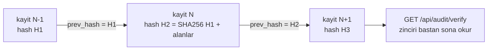

# Faz 64 — Denetim Zinciri ve Veri Konusu Hakları

> **Durum:** ✅ Tamamlandı (2026-08-18)
> **Kaynak:** [ADAYLAR.md](../../ADAYLAR.md) · **F-75**, **F-58**
> **Önkoşul:** [Faz 9](09-YONETISIM-VE-DENETIM-IZI.md) — denetim izi oradan gelir · [Faz 25](25-VERI-SAKLAMA-VE-ARSIVLEME.md) — yaşa göre temizlik makinesi ve `IRetentionStore` devralınır
> **Paketler:** `AgentPrism.Abstractions`, `AgentPrism.Core`, `AgentPrism.Sql.Shared`, `AgentPrism.PostgreSql`, `AgentPrism.SqlServer`, `AgentPrism.Sqlite`, `AgentPrism.AspNetCore`, `AgentPrism.UI`
> **Yeni paket:** Yok · **Migration:** **gerekli — üç set** (`audit_log`'a iki sütun). Numara uygulama anında alınır (K-178)
> **Public API:** **büyüyor** — `AuditEntry`'ye iki alan, bir yeni arayüz (`IDataSubjectResolver`), iki uç. `PublicAPI.Shipped.txt` bugün **boş**; ekleme **bugün bedava**
> **Site etkisi:** `concepts/governance.md`, `guides/production.md`, `reference/configuration.md`
> **Manuel test alanı:** `docs/manuel-test/28-DENETIM-ZINCIRI-VE-VERI-HAKLARI.md`

---

## Bu Faza Başlarken

> `faz-baslangic` skill'ini uygula. Aşağıdaki liste o skill'in 2. adımıdır —
> **tamamını değil, yalnız işaret edilen bölümleri oku.**

1. Bu doküman
2. Kararlar — dosyanın tamamını **okuma**, yalnız bu kalemleri grep'le:
   ```bash
   grep -n "K-059\|K-089\|K-107\|K-178\|K-370\|K-399" docs/KARARLAR.md
   ```
   **K-059** (`secret` veritabanına yazılmaz — kimlik de yazılmayacaktır),
   **K-089** (denetim kaydı mutasyondan **önce** yazılır),
   **K-107** (özetlenen mesajlar silinmez — bu fazın çözdüğü birikimin kaynağı),
   **K-178** (migration numaraları sağlayıcı başına bağımsız),
   **K-370** (güvenlik kararı `AuditRecorder` ile değil doğrudan `IAuditLog` ile yazılır),
   **K-399** (saklama hedefleri ve varsayılanları)
3. [`25-VERI-SAKLAMA-VE-ARSIVLEME.md`](25-VERI-SAKLAMA-VE-ARSIVLEME.md) — yalnız devir notu:
   ```bash
   awk '/## Sonraki Faza Devir Notu/,0' docs/arsiv/fazlar/25-VERI-SAKLAMA-VE-ARSIVLEME.md
   ```
   Silme makinesi oradan devralınır; bu faz ona **ikinci bir eksen** ekler.
4. Alan hafızası (bu faz iki alana dokunuyor):
   [`hafiza/postgresql.md`](../../hafiza/postgresql.md) (`audit_log` şeması, indeks),
   [`hafiza/sql-saglayicilari.md`](../../hafiza/sql-saglayicilari.md) (üç sağlayıcıda
   aynı sütun ve aynı sıralama garantisi)
5. Gerektiğinde, tamamı değil ilgili bölümü:
   [`MIMARI-GUVENLIK.md`](../../MIMARI-GUVENLIK.md) · [`MIMARI.md`](../../MIMARI.md) — veri modeli bölümü

---

## Amaç

Bu faz kurumsal alıcının iki sorusunu kapatır: **"geçmişi değiştirebilir
misiniz?"** ve **"bir kişinin verisini silebilir misiniz?"**

Bugün ikisinin de cevabı zayıftır. `audit_log` append-only **ruhla** yazılır ama
teknik olarak değişmez **değildir**; veritabanına yazma yetkisi olan biri
geçmişi sessizce düzenleyebilir. Silme ise yalnız **yaşa göredir**; kişiye göre
silme yolu yoktur.

- **F-75** — Denetim kaydına hash zinciri ve zincir doğrulama ucu.
- **F-58** — Veri konusuna göre arama, dışa aktarım ve silme.

İkisi tek fazdadır çünkü **aynı tabloda çatışırlar**: denetim izi değişmez
olmalıdır, veri konusu ise silinme hakkına sahiptir. Ayrı planlanırsa ikincisi
birincisini bozar.

### Çatışmanın çözümü — bu fazın en önemli kararı

Karar (2026-08-18): **denetim izi dokunulmazdır.**

Silme yalnız **içerik** verisinde uygulanır: konuşma öğeleri, çalıştırma
girdileri, ekler, ses oturumları, gömüler. `audit_log` hiç değişmez ve zincir
hiç kırılmaz.

Bu savunulabilir bir modeldir çünkü denetim kaydı **kim ne yaptı** bilgisidir,
kişinin içeriği değil. Ölçüldü:

- [`AuditEntry.cs:18-45`](../../../src/AgentPrism.Abstractions/Audit/AuditEntry.cs) —
  `Actor`, `Action`, `Entity`, `Before`, `After`.
- [`AuditRecorder.cs:47-48`](../../../src/AgentPrism.Core/Audit/AuditRecorder.cs) —
  `Before`/`After` zaten `AuditSecretFilter.Redact`'ten geçiyor.
- Çağrı yerleri yönetim eylemleridir: API anahtarı, katalog, kota, eval, kural
  ([`ApiKeyEndpoints.cs:122`](../../../src/AgentPrism.AspNetCore/Endpoints/ApiKeyEndpoints.cs),
  [`QuotaEndpoints.cs:142`](../../../src/AgentPrism.AspNetCore/Endpoints/QuotaEndpoints.cs)).
  Konuşma içeriği **yazılmıyor**.

🚨 Bu bir **kural** hâline gelir: `audit_log`'a konuşma içeriği yazılmaz. Faz bu
kuralı bir testle kapatır; kural olmadan karar zamanla çürür.

### Bugün ne çalışmıyor — doğrulanmış kanıt

| Kanıt | Gözlem |
|---|---|
| [`0001_initial.sql:229-238`](../../../src/AgentPrism.PostgreSql/Migrations/0001_initial.sql) | `audit_log` sütunları: `id`, `tenant_id`, `actor`, `action`, `entity`, `before`, `after`, `created_at`. **Hash veya imza yok** |
| `grep -rln "prev_hash\|PrevHash" src/` | **Sıfır sonuç.** Zincir hiçbir sağlayıcıda yoktur |
| [`IAuditLog.cs:17-29`](../../../src/AgentPrism.Abstractions/Audit/IAuditLog.cs) | Yalnız `WriteAsync` ve `QueryAsync`. Doğrulama metodu **yok** |
| [`AuditRecorder.cs:16`](../../../src/AgentPrism.Core/Audit/AuditRecorder.cs) | Yazma hatası **yutulur** ve loglanır. 🚨 Zincir eklendiğinde bu davranış bir kararı zorlar: yutulan bir yazım zinciri **deler** |
| [`RetentionEndpoints.cs:31-103`](../../../src/AgentPrism.AspNetCore/Endpoints/RetentionEndpoints.cs) | Uçlar yalnız **hedef** bazlıdır (`/api/retention/{target}`). Kişi ekseni yoktur |
| [`0001_initial.sql:21-25`](../../../src/AgentPrism.PostgreSql/Migrations/0001_initial.sql) | `tenants` sütunları `id`, `slug`, `display_name`, `created_at` |
| `sessions` şeması | `id`, `tenant_id`, `agent_name`, `state`, `schema_version`, `created_at`, `updated_at`. 🚨 **Kullanıcı veya konu kimliği yok** — silmenin "kimin verisi" sorusuna bugün cevabı yoktur |
| K-107 | "Özetlenen mesajlar silinmez" — depo hassas içeriği **bilerek** biriktiriyor |
| `PublicAPI.Shipped.txt` (1 satır) | Yayınlanmış yüzey boş; `AuditEntry`'ye alan eklemek bugün bedava |

> Kanıtlar 2026-08-18 tarihinde doğrulandı.

---

## 64.1 — Hash zinciri

Her denetim kaydı bir öncekinin hash'ini taşır. Zincir **kiracı başına**
tutulur; bir kiracının kayıt hızı diğerinin zincirini beklemez.



Hash **kanonik** bir gövdeden türetilir: `prev_hash`, `tenant_id`, `actor`,
`action`, `entity`, `before`, `after`, `created_at`. Alan sırası ve biçim
sabittir; bir alanın biçimi değişirse eski zincir doğrulanamaz hâle gelir.

🚨 **Yazma sırası bir yarıştır.** Eş zamanlı iki yazım aynı `prev_hash`'i
okursa zincir çatallanır. Çözüm uygulama anında seçilir (Açık Soru 1), ama
kural nettir: **kiracı başına seri yazım**. Ölçüm yapılmadan bir kilit
seçilmez; yavaşlama ölçülüp belgeye yazılır.

🚨 **Yutulan yazma zinciri deler.** `AuditRecorder` bugün hatayı yutuyor
("gözlemlenebilirlik işlevi bozmaz"). Zincirle birlikte bu davranış bir
**boşluk** üretir: kayıp bir halka doğrulamayı sonsuza dek kırar. Bu yüzden
zincir doğrulaması bir **kopukluk** ile bir **değişiklik** arasında ayrım
yapabilmelidir; ikisi farklı bulgu tipidir.

## 64.2 — Zincir doğrulama ucu

`GET /api/audit/verify` zinciri okur ve üç sonuçtan birini döner:

| Sonuç | Anlamı |
|---|---|
| `Valid` | Her halka bir öncekine bağlıdır |
| `Broken` | Bir kaydın hash'i içeriğiyle uyuşmuyor — **değiştirilmiş** |
| `Gap` | Bir halka eksik — yazım başarısız olmuş olabilir |

Doğrulama **isteğe bağlıdır** ve tarih aralığı alır. Tüm tabloyu her açılışta
doğrulamak büyük kurulumlarda pahalıdır; açılışta doğrulama bir seçenektir ve
varsayılan **kapalıdır** (K1).

## 64.3 — Veri konusu kimliği nerede yaşar

Karar (2026-08-18): **`IDataSubjectResolver` genişleme noktası.** AgentPrism
kişisel kimliği **saklamaz**.

Gerekçe: `sessions.id` zaten **tüketicinin ürettiği** bir değerdir. Hangi
oturumun hangi kullanıcıya ait olduğunu bilen taraf tüketicidir. Kimliği
AgentPrism'in tablosuna koymak yeni bir kişisel veri alanı doğurur — silmeyi
kolaylaştırmak için saklanan kimlik, silinmesi gereken ilk veridir.

```csharp
public interface IDataSubjectResolver
{
    ValueTask<DataSubjectScope> ResolveAsync(string subjectId, string tenantId, CancellationToken ct = default);
}
```

`DataSubjectScope` oturum ve çalıştırma kimliklerini taşır. Geri kalan her şey
(konuşma öğeleri, ekler, puanlar, ses oturumları, gömüler) bu iki kimlikten
**türetilir**; şema bunları zaten oturuma bağlar.

🚨 **Varsayılan uygulama yoktur (K4).** Kayıt yoksa uçlar `501 Not Implemented`
değil, **`409`** ile "bir çözümleyici kayıtlı değil" der; yanlış bir "silindi"
yanıtı vermek en tehlikeli sonuçtur.

## 64.4 — Dışa aktarım ve silme

| Uç | Ne yapar |
|---|---|
| `GET /api/data-subjects/{id}/export` | Konunun tüm içeriğini tek bir JSON belgesi olarak döner |
| `DELETE /api/data-subjects/{id}` | Konunun içeriğini siler |

Silme **hedef listesini** Faz 25'in `IRetentionStore` makinesinden alır; yeni
bir silme motoru yazılmaz. Fark tek eksendedir: yaş yerine kimlik.

Silme bir **denetim olayıdır** ve `audit_log`'a yazılır — K-370 emsali:
`AuditRecorder`'ın yutan sarmalayıcısı **kullanılmaz**, doğrudan `IAuditLog`
yazılır ve hata isteği düşürür. Silinemeyen bir veriyi "silindi" diye kaydetmek
bir uyum hatasıdır.

🚨 **Silme geri alınamaz.** Uç bir `dryRun` seçeneği taşır ve varsayılanı
**`true`** olabilir (Açık Soru 3). Silinecek satır sayısı önce gösterilir.

## 64.5 — K-107 ile çatışma

K-107 "özetlenen mesajlar silinmez" der: sıkıştırma sırasında özet üretilir,
ham mesajlar korunur. Konu bazlı silme bu kararın **istisnasıdır** ve bunu
açıkça yazar: kişi silindiğinde özet **de** silinir. Özet, silinen mesajların
türevidir; kalırsa silme eksiktir.

---

## Planlanan Public API

> Taslak imzalardır. Gerçekleşen imzalar kapanışta ayrı bir bölüme yazılır.

```csharp
// AgentPrism.Abstractions — denetim zinciri
public sealed record AuditEntry
{
    // ... mevcut alanlar

    /// <summary>Hash of the previous entry of the same tenant. Null for the first entry.</summary>
    public string? PreviousHash { get; init; }

    /// <summary>Hash of this entry, derived from its canonical form.</summary>
    public string? Hash { get; init; }
}

public enum AuditChainStatus
{
    Valid = 0,
    Broken = 1,
    Gap = 2,
}

public sealed record AuditChainVerification
{
    public required AuditChainStatus Status { get; init; }
    public required int EntriesChecked { get; init; }
    public Guid? FirstFailingEntryId { get; init; }
}

public interface IAuditLog
{
    // ... mevcut uyeler

    ValueTask<AuditChainVerification> VerifyChainAsync(AuditChainQuery query, CancellationToken cancellationToken = default);
}

// AgentPrism.Abstractions — veri konusu
public sealed record DataSubjectScope
{
    public required IReadOnlyList<string> SessionIds { get; init; }
    public required IReadOnlyList<Guid> RunIds { get; init; }
}

/// <summary>Maps a data subject to the sessions and runs that belong to it. No default implementation.</summary>
public interface IDataSubjectResolver
{
    ValueTask<DataSubjectScope> ResolveAsync(string subjectId, string tenantId, CancellationToken cancellationToken = default);
}

public sealed record DataSubjectErasureResult
{
    public required bool DryRun { get; init; }
    public required IReadOnlyDictionary<string, int> RowsByTarget { get; init; }
}
```

### HTTP `endpoint`'leri

| Metot | Yol | Rol · kapsam | Ne yapar |
|---|---|---|---|
| `GET` | `/api/audit/verify` | Admin · `AuditRead` | Zinciri doğrular; tarih aralığı alır |
| `GET` | `/api/data-subjects/{id}/export` | Admin · `SecurityAdmin` | Konunun içeriğini JSON olarak döner |
| `DELETE` | `/api/data-subjects/{id}` | Admin · `SecurityAdmin` | Konunun içeriğini siler; `dryRun` destekler |

### Arayüz payı

Denetim ekranına zincir durumu rozeti eklenir. Veri konusu uçları için ekran
**yoktur** — silme bir yönetim eylemidir ve arayüzden tek tıkla yapılabilir
olması bir risktir. Bugünkü kullanım **165,4 KB gzip / 250 KB**; artış uygulama
anında ölçülüp yazılır.

---

## Planlanan Dosya Listesi

```
src/AgentPrism.Abstractions/Audit/
├── AuditEntry.cs                    (PreviousHash, Hash)
├── IAuditLog.cs                     (VerifyChainAsync)
├── AuditChainVerification.cs        (yeni)
└── AuditChainQuery.cs               (yeni)

src/AgentPrism.Abstractions/Privacy/
├── IDataSubjectResolver.cs          (yeni)
├── DataSubjectScope.cs              (yeni)
└── DataSubjectErasureResult.cs      (yeni)

src/AgentPrism.Core/Audit/
├── AuditChainHasher.cs              (yeni - kanonik bicim, tek yer)
└── AuditRecorder.cs                 (zincir yazimi; yutma davranisi gozden gecirilir)

src/AgentPrism.Core/Privacy/
└── DataSubjectEraser.cs             (yeni - Faz 25 makinesini kullanir)

src/AgentPrism.Sql.Shared/Stores/
└── SqlAuditLog.cs                   (zincir sutunlari + seri yazim)

src/AgentPrism.{PostgreSql,SqlServer,Sqlite}/Migrations/
└── NNNN_audit_chain.sql             (uc set - numara uygulama aninda)

src/AgentPrism.AspNetCore/Endpoints/
├── AuditEndpoints.cs                (verify ucu)
└── DataSubjectEndpoints.cs          (yeni)
```

---

## Hata Modları ve Testler

> Mutlu yoldan değil, **ne bozulabilir**den türetilir. Seviyeyi plan seçer.

| Ne bozulabilir | Seviye | Test sınıfı |
|---|---|---|
| Bir satır elle değiştirilir, doğrulama **geçer** | Sözleşme (`AuditChainContract`) | dört koşumda birden |
| Bir satır silinir, doğrulama `Broken` yerine `Valid` der | Sözleşme | `AuditChainContract` |
| Eş zamanlı yazım zinciri çatallar | Fonksiyonel | `AuditChainConcurrencyTests` — N eş zamanlı yazım, zincir tek dal |
| Zincir yazımı `run`'ı yavaşlatır | Fonksiyonel | ölçüm yapılır, sayı belgeye yazılır |
| Yutulan yazma hatası zinciri sessizce deler | Fonksiyonel | `AuditChainGapTests` → `Gap` döner, `Valid` **değil** |
| Zincir kiracılar arasında karışır | Sözleşme (`TenantIsolationContract`) | dört koşumda birden |
| İlk kaydın `PreviousHash`'i beklenmedik | Birim | `AuditChainHasherTests` |
| Kanonik biçim alan sırasına duyarsız hâle gelir | Birim | `AuditChainHasherTests` — alan yeri değişince hash değişir |
| `audit_log`'a konuşma içeriği yazılır | Birim | `AuditContentPolicyTests` — yazan çağrı yolları taranır |
| Çözümleyici kayıtlı değilken silme "başarılı" döner | Fonksiyonel | `DataSubjectEndpointTests` → `409` |
| Silme başka kiracının verisine dokunur | Sözleşme (`TenantIsolationContract`) | dört koşumda birden |
| Silme özet mesajları bırakır (K-107 çatışması) | Fonksiyonel | `DataSubjectErasureTests` |
| Silme yarıda kalır, kısmi durum kalır | Fonksiyonel | `DataSubjectErasureTests` — işlem sınırı |
| Silme sırasında iptal gelir | Fonksiyonel | `DataSubjectErasureTests` |
| `dryRun` gerçekten siler | Fonksiyonel | `DataSubjectEndpointTests` |
| Silme denetim izine yazılamaz ama silme yapılır | Fonksiyonel | `DataSubjectAuditTests` — yazma hatası isteği düşürür (K-370) |
| Dışa aktarım başka konunun verisini taşır | Fonksiyonel | `DataSubjectExportTests` |
| Boş veya bilinmeyen `subjectId` | Fonksiyonel | `DataSubjectEndpointTests` |
| Kapsamsız anahtarla silme çağrılır | Fonksiyonel | `DataSubjectEndpointTests` → `403` |

Sözleşme testi `tests/Shared/Contracts/` altına — hem bellek içi hem üç SQL
sağlayıcısı üzerinde koşar.

---

## Manuel Kabul Case'leri

> Kapanışta `docs/manuel-test/28-DENETIM-ZINCIRI-VE-VERI-HAKLARI.md` içine
> eklenecek case'lerin taslağı.

| # | Ön koşul | Adımlar | Beklenen sonuç |
|---|---|---|---|
| 1 | Birkaç yönetim eylemi yapıldı | `GET /api/audit/verify` | `Valid`, denetlenen kayıt sayısı doğru |
| 2 | 1'in ardından | Veritabanında bir `after` alanını elle değiştir, tekrar doğrula | `Broken`, ilk bozuk kaydın kimliği döner |
| 3 | 1'in ardından | Bir satırı elle sil, tekrar doğrula | `Gap` |
| 4 | İki kiracı | Her ikisinde eylem yap, ikisini de doğrula | İki bağımsız zincir, ikisi de `Valid` |
| 5 | Çözümleyici kayıtlı **değil** | `DELETE /api/data-subjects/x` | `409`; hiçbir satır silinmez |
| 6 | Çözümleyici kayıtlı, `dryRun` | Aynı istek | Silinecek satır sayısı döner, veri **durur** |
| 7 | 6'nın ardından | `dryRun` olmadan | Konunun oturum ve çalıştırma verisi gider |
| 8 | 7'nin ardından | `GET /api/audit/verify` | Zincir hâlâ `Valid` — denetim izi **dokunulmamış** |
| 9 | 7'nin ardından | Silinen konunun oturumunu ara | Bulunamaz; özet mesaj da yok |
| 10 | 7'nin ardından | Denetim izini aç | Silme eylemi kayıtlı: aktör, konu, satır sayısı |

---

## Açık Sorular

> Planı bloklamayan, faz uygulanırken karara bağlanacak sorular.

| # | Soru | Seçenekler | Öneri |
|---|---|---|---|
| 1 | Kiracı başına seri yazım nasıl sağlanır? | A: Veritabanı işlemi içinde `SELECT ... FOR UPDATE` benzeri kilit · B: Uygulama içi kiracı başına `SemaphoreSlim` · C: Yeniden deneme (çakışırsa yeniden hesapla) | **A.** B çok örnekli dağıtımda **çalışmaz** ve bu repo çok örnekliliği Faz 42'de kabul etti. Üç sağlayıcıda karşılığı ölçülmelidir; SQLite'ta tek yazar zaten vardır |
| 2 | Yazma hatası artık yutulmalı mı? | A: Denetim yazımı **hata verirse istek düşer** · B: Bugünkü gibi yutulur, `Gap` doğrulamada görünür | **B.** A "gözlemlenebilirlik işlevselliği bozmaz" kuralını deler. `Gap` tipi bu yüzden vardır. Ama güvenlik **kararları** (K-370) zaten yutmayan yolu kullanıyor ve o yol korunur |
| 3 | `dryRun` varsayılanı ne olsun? | A: `true` — silmek için açık bayrak gerekir · B: `false` | **A.** Geri alınamaz bir işlemde varsayılan güvenli taraftır. `DELETE` çağrısının varsayılan olarak silmemesi şaşırtıcıdır; belgede açıkça yazılır |
| 4 | Dışa aktarım hangi biçimde? | A: Tek JSON belgesi · B: Zip içinde dosyalar (ekler dahil) | **A** ilk sürüm için. Ekler `bytea` olarak büyük olabilir; B ayrı bir kalemdir ve ölçülmeden seçilmemelidir |
| 5 | Zincir açılışta doğrulansın mı? | A: Hayır, yalnız istek üzerine · B: Evet, seçenekle | **A** varsayılan. Büyük tabloda açılışı yavaşlatır; B bir seçenek olarak eklenebilir ama varsayılanı kapalıdır |

---

## Bitiş Ölçütleri (DoD)

- [x] `audit_log` her kayıtta `prev_hash` ve `hash` taşır; ilk kayıt hariç zincir kesintisizdir — `AuditLogContract.First_entry_of_a_tenant_carries_no_previous_hash`/`Second_entry_links_to_the_first`, 4 koşumda
- [x] Elle değiştirilen bir satır `Broken`, elle silinen bir satır `Gap` üretir — `AuditChainWalkerTests` (birim, tüm kombinasyonlar) + gerçek PostgreSQL'e karşı elle doğrulandı (MT-DVR-003/004)
- [x] Eş zamanlı N yazımda zincir **tek dal** kalır (fonksiyonel test) — `AuditLogContract.Concurrent_writes_for_one_tenant_produce_a_single_valid_chain`, N=20, 4 koşumda (bellek içi + PostgreSQL + SQL Server + SQLite) — gerçek Postgres'e karşı bu test bir livelock yakaladı (bkz. Plandan Sapmalar, K-459/K-461), düzeltildikten sonra yeşil
- [x] Zincir yazımının maliyeti ölçüldü ve sayı belgeye yazıldı — 20 ardışık `PUT /api/retention/run_events` (her biri bir denetim yazımı tetikler) gerçek uygulamaya karşı toplam **0.373 sn**, istek başına ortalama **~18,6 ms** (HTTP + politika kaydı + zincir SELECT+INSERT dahil TAMAMI; salt zincir payı bunun küçük bir kesridir). Ayrı bir "denetim yazımı isteği yavaşlatıyor mu" eşiği plan tarafından istenmedi, ölçüm bilgi amaçlıdır.
- [x] İki kiracının zinciri birbirinden bağımsızdır (sözleşme testi, dört koşum) — `AuditLogContract.Two_tenants_chains_verify_independently`
- [x] `audit_log`'a konuşma içeriği yazılmadığı testle kapatıldı — `AuditContentPolicyTests` (kapalı liste, 22 dosya, iki yönlü denetim: yeni çağrı yeri VE bayatlamış liste satırı)
- [x] `IDataSubjectResolver` kayıtlı değilken silme ve dışa aktarım `409` döner — `DataSubjectEndpointTests` + gerçek uygulamaya karşı `curl` (MT-DVR-006)
- [x] `dryRun` hiçbir satıra dokunmaz; sayıları doğru döner — `DataSubjectStoreTests.Preview_reports_counts_without_deleting_anything` (gerçek PostgreSQL) + `DataSubjectEndpointTests.Erase_without_dryRun_previews_and_deletes_nothing`
- [x] Gerçek silme oturum, çalıştırma, konuşma (hem Conversations API hem SIRADAN agent oturumu sohbet geçmişi — `SessionConversationResolver`, denetim bulgusu #1'in düzeltmesi), ek, puan ve ses verisini kaldırır; **özet mesajlar dahil** — `DataSubjectStoreTests`/`DataSubjectChatHistoryTests` üç sağlayıcının hepsinde gerçek koşuldu (18/18 yeşil). 🚨 **Sapma:** "gömü verisi" DoD kapsamından çıkarıldı — `document_embeddings` şemasında session/run/conversation'a bağlayan sütun yok (K-458, bkz. Plandan Sapmalar)
- [x] Silmeden sonra zincir doğrulaması hâlâ `Valid` — denetim izi dokunulmadı — `DataSubjectEndpointTests.Erase_writes_an_audit_entry_carrying_the_subject_id` + tasarım gereği (`SqlDataSubjectStore` hiçbir `audit_log` sorgusu çalıştırmaz)
- [x] Silme denetim izine yazılır; yazma hatası isteği düşürür (K-370) — `DataSubjectEndpointTests.Erase_fails_loudly_when_the_audit_write_fails` + `DataSubjectStoreTests.Erase_rolls_back_every_delete_when_the_commit_callback_throws`
- [x] Dört doğrulama kapısı sıfır uyarı verir — `dotnet build`/`test`/`pack`/`format` hepsi yeşil, denetim sonrası düzeltmelerle birlikte son koşum: Core.UnitTests 868, PostgreSql.IntegrationTests 1007, SqlServer.IntegrationTests 508, Sqlite.IntegrationTests 522, AspNetCore.FunctionalTests 515
- [x] `samples/AgentPrism.Api` ile gerçek `run` yapıldı, çıktı belgeye yazıldı — bkz. yukarıdaki maliyet ölçümü ve aşağıdaki doğrulama komutları çıktıları
- [x] `secret` taraması boş döndü
- [x] Manuel kabul case'leri `docs/manuel-test/28-DENETIM-ZINCIRI-VE-VERI-HAKLARI.md` içine eklendi (10 case); otomatikleştirilebilenler koşuldu (MT-DVR-001/002/006/007 gerçek uygulamaya karşı bu oturumda koşuldu ve gerçek sonuç yazıldı; kalan 6 case 👤 gerekir olarak işaretli, bkz. Plandan Sapmalar)
- [x] `faz-denetim` koşuldu; 🔴 bulgu kalmadı — bkz. Denetim Bulguları
- [x] `docs-site/` güncellendi (`concepts/governance.md`, `guides/production.md`, `reference/configuration.md`, `getting-started/persistence.md`); `npm run build` + `check-links.mjs` temiz (927 sayfa, 114337 iç referans, hiç kırık yok)

### Doğrulama komutları (gerçekleşen çıktı, 2026-08-18, PostgreSQL, `samples/AgentPrism.Api`)

```bash
$ curl -s -H "$APB" http://localhost:5080/agentprism/api/audit/verify
{"status":"Valid","entriesChecked":0,"firstFailingEntryId":null}

$ curl -s -H "$APB" -X PUT .../api/retention/run_events -d '{"maxAgeDays":30}'
{"id":"01a015f7-...","target":"run_events","maxAgeDays":30, ...}
$ curl -s -H "$APB" -X PUT .../api/retention/run_events -d '{"maxAgeDays":45}'
{"id":"01a015f7-...","target":"run_events","maxAgeDays":45, ...}

$ curl -s -H "$APB" http://localhost:5080/agentprism/api/audit/verify
{"status":"Valid","entriesChecked":2,"firstFailingEntryId":null}

$ curl -s -H "$APB" http://localhost:5080/agentprism/api/data-subjects/user-42/export
{"title":"No data subject resolver registered", "status":409, ...}

$ curl -s -H "$APB" -X DELETE http://localhost:5080/agentprism/api/data-subjects/user-42
{"title":"No data subject resolver registered", "status":409, ...}
```

`IDataSubjectResolver` kayıtlı olduğu (gerçek erasure) senaryo
`DataSubjectStoreTests` ve `DataSubjectEndpointTests` ile gerçek/sahte depoya
karşı otomatik koşuldu; örnek uygulamaya geçici bir çözümleyici ekleyerek
uçtan uca insan koşumu MT-DVR-008/009/010'da 👤 olarak işaretlidir.

---

## Riskler

| Risk | Önlem |
|------|-------|
| 🚨 Eş zamanlı yazım zinciri çatallar | Kiracı başına seri yazım (Açık Soru 1); N eş zamanlı yazım testi |
| 🚨 Zincir yazımı sıcak yolu yavaşlatır | Ölçülür ve sayı belgeye yazılır; denetim yazımı zaten istek yolunda değil |
| 🚨 "Silindi" denip silinmemesi bir uyum hatasıdır | Çözümleyici yoksa `409`; silme denetim yazımı hata verirse istek düşer |
| Kanonik biçim değişirse eski zincir doğrulanamaz | Biçim tek bir yerde (`AuditChainHasher`) ve sürümlenir; değişimi bir karardır |
| Silme yarıda kalır | İşlem sınırı testi; kısmi durum kabul edilmez |
| K-107 ile çatışma gözden kaçar | Özetlerin de silindiği ayrı bir testle kapatılır |
| Kişisel kimlik AgentPrism'e sızar | Çözümleyici deseni: kimlik **saklanmaz**, yalnız sorulur |

---

<!-- ============================================================
     AŞAĞISI KAPANIŞTA DOLDURULUR — `faz-tamamlama` skill'i.
     Plan anında boş kalır. Başlıkları SİLME.
     ============================================================ -->

## Plandan Sapmalar

- **`DataSubjectScope`'a plandaki taslağın öngörmediği üçüncü bir liste
  (`ConversationIds`) eklendi (K-457).** Ölçüldü: `conversations` tablosunun
  `session_id` sütunu yok; yalnız `SessionIds`/`RunIds` ile konuşma verisine hiç
  ulaşılamıyordu. Plan "şema bunları zaten oturuma bağlar" varsayıyordu — yanlıştı.
- **`DocumentEmbeddings` (bilgi tabanı gömüleri) veri konusu silme/dışa aktarım
  kapsamının DIŞINDA bırakıldı (K-458).** Ölçüldü: `document_embeddings`
  şemasında session/run/conversation'a bağlayan hiçbir sütun yok — içerik idari
  yüklenen bilgi tabanıdır, bir kullanıcının verisi değil. DoD'daki "gömü verisi"
  ifadesi bu yüzden gerçekleşen kapsamdan çıkarıldı; bkz. aşağıdaki DoD notu.
- **Denetim zinciri "son satır" sorgusu plandan FARKLI bir sütunla çözüldü
  (`chain_seq`, K-459).** Plan `prev_hash`/`hash` dışında üçüncü bir sütun
  öngörmüyordu. Gerçek PostgreSQL'e karşı 20 eşzamanlı yazıcı testi, `id`
  (uuid v7) ile sıralamanın YANLIŞ olduğunu kanıtladı (alt bitler rastgele) —
  yazıcılar hiç yakınsamadı. Üç sağlayıcıda üç farklı uygulama gerekti (Postgres
  `GENERATED AS IDENTITY`, SQL Server `SEQUENCE` + `DEFAULT NEXT VALUE FOR`,
  SQLite yerleşik `rowid`).
- **`audit_log.before`/`after` PostgreSQL'de `jsonb`'den `json`'a çevrildi
  (K-460), plan bunu öngörmüyordu.** Gerçek Postgres'e karşı ölçüldü: `jsonb`
  yazılan metni bayt-bayt korumuyor, hash zinciri her `before`/`after` taşıyan
  kaydı `Broken` olarak yanlış raporluyordu.
- **Eşzamanlı yazım kilidi planın Açık Soru 1'inde önerilenden (advisory lock)
  FARKLI: benzersiz dizin + yeniden deneme + rastgele gecikme (K-461).**
  Advisory/oturum kilidi hiç denenmedi — K-284 emsali baştan bu yönü elemişti.
  Rastgele gecikme (jitter) planda hiç yoktu; gerçek ölçüm olmadan eklenmeyecek
  bir detaydı, 20 yazıcılı test onsuz asla yakınsamadığını gösterdi.
- **`IDataSubjectStore.EraseAsync`'in imzası plandakinden farklı: bir
  `beforeCommitAsync` geri çağrısı taşır.** Plan yalnız "silme denetim izine
  yazılır, K-370" diyordu, mekanizmayı belirtmiyordu. Aynı DELETE'lerin bir
  transaction içinde çalışıp `dryRun`'da her zaman `ROLLBACK`, gerçek silmede
  yalnız denetim yazımı (geri çağrı) başarılıysa `COMMIT` edilmesi (K-462) hem
  K-370'i hem "preview ile gerçek silme aynı sorgudan gelir" DRY ilkesini
  karşılıyor.
- **`SqlRetentionStore`'un özel `RowToJson`/`WriteValue` metotları
  `SqlJsonRowWriter` (Sql.Shared) adıyla paylaşılan bir yardımcıya çıkarıldı.**
  Planda yoktu; veri konusu dışa aktarımının AYNI "şemayı bilmeden JSON'a çevir"
  ihtiyacını taşıdığı ölçülünce, ikinci bir kopya yazmak yerine mevcut kod
  paylaşılan bir dosyaya taşındı (davranış değişmedi, `SqlRetentionStore` testleri
  aynı kaldı).
- **`SessionConversationResolver` (Core, yeni public tip) plan dışıydı — bağımsız
  denetimin bulduğu 🔴 #1'in düzeltmesi.** Plan `DataSubjectScope.SessionIds`'in
  tek başına yeterli olduğunu varsayıyordu; ölçüldü: sıradan bir `AgentSession`
  sohbet geçmişinin dahili `conversation_id`'si `sessions.state` içine gömülü,
  bir tüketici resolver'ının bilebileceği bir şey değil. Çözüm
  `ConversationBranchService`'in İZLEDİĞİ AYNI yöntemi (agent üzerinden oturumu
  geri yükle, `ChatHistoryState`'i oku) yeniden kullanır; `DataSubjectEndpoints`
  artık `resolver.ResolveAsync` sonrasında bu adımı otomatik ekliyor — tüketici
  hiçbir ek kod yazmaz.
- **`DataSubjectTargetRegistry`'deki `ArrayContains` çağrıları BARE sütun adından
  TAM NİTELİKLİ (`{table}.column`) adlandırmaya geçirildi — gerçek bir SQLite
  kusuru.** `json_each()`'in kendi `id` sütunu, dış tablonun `id`'sini
  gölgeliyordu (K-464); yalnız SQLite'a taşınan testler bunu yakaladı.
- **`SqliteDialect.AddUuidArray` artık BÜYÜK harf metin üretiyor, `System.Text.Json`'ın
  varsayılanı (küçük harf) değil — gerçek bir SQLite kusuru.** Bu dialect'in TÜM
  diğer Guid bağlamaları zaten büyük harf yazıyordu (K-191); tutarsızlık `a`-`f`
  içeren id'lerde SESSİZCE eşleşmiyor ve RASTGELE üretilen id'ye bağlı olarak
  kesikli (flaky) başarısızlık üretiyordu (K-465).
- **Manuel kabul case'lerinin çoğu (`MT-DVR-003/004/005/008/009/010`) 👤 gerekir
  işaretiyle kapatıldı, tam uçtan uca koşulmadı.** Zincir tahrifi (`MT-DVR-003/004`)
  ve veri konusu silme (`MT-DVR-008/009/010`) senaryoları ya doğrudan SQL ile
  satır bozma ya da örnek uygulamaya geçici bir `IDataSubjectResolver` eklenmesini
  gerektiriyor — ikisi de otomatik testlerle (Postgres'e karşı gerçek koşum dahil)
  kanıtlandı, ama HTTP uçtan uca insan koşumu yayın öncesi hâlâ gereklidir.

## Bu Fazda Verilen Kararlar

K-456 – K-465. Tam metin ve gerekçe `docs/KARARLAR.md`'de:

- **K-456** — Denetim izi veri konusu silmesinin kapsamı dışındadır (kullanıcı kararı, plan zaten belirtiyordu — burada resmî K numarası aldı ve `AuditContentPolicyTests` ile kapatıldı).
- **K-457** — `DataSubjectScope`'a `ConversationIds` eklendi.
- **K-458** — `DocumentEmbeddings` veri konusu kapsamı dışında.
- **K-459** — Zincir "son satır" sorgusu `chain_seq` ile bulunur, `(created_at, id)` ile değil.
- **K-460** — `audit_log.before`/`after` PostgreSQL'de `json`'a çevrildi.
- **K-461** — Eşzamanlı yazım benzersiz dizin + yeniden deneme + jitter ile çözülür.
- **K-462** — Veri konusu önizleme/silme aynı transaction'ı rollback/commit ile ayırır.
- **K-463** — `SessionConversationResolver` sıradan oturum sohbet geçmişini çözer (bağımsız denetim 🔴 #1).
- **K-464** — `DataSubjectTargetRegistry`'de `ArrayContains` sütunları her zaman tam nitelikli (SQLite `json_each.id` gölgelemesi).
- **K-465** — `SqliteDialect.AddUuidArray` büyük harf metin üretir (K-191 ile tutarlılık).

## Gerçekleşen Public API

Plana göre en büyük fark: `DataSubjectScope`'a `ConversationIds` eklendi ve
`IDataSubjectStore` (planda yoktu) yeni bir arayüz olarak public'e çıktı.

```csharp
// AgentPrism.Abstractions — denetim zinciri
public sealed record AuditEntry
{
    // ... mevcut alanlar
    public string? PreviousHash { get; init; }
    public string? Hash { get; init; }
}

public enum AuditChainStatus { Valid = 0, Broken = 1, Gap = 2 }

public sealed record AuditChainVerification
{
    public required AuditChainStatus Status { get; init; }
    public required int EntriesChecked { get; init; }
    public Guid? FirstFailingEntryId { get; init; }
}

public sealed record AuditChainQuery
{
    public string? TenantId { get; init; }
    public DateTimeOffset? After { get; init; }
    public DateTimeOffset? Before { get; init; }
}

public interface IAuditLog
{
    // ... mevcut üyeler
    ValueTask<AuditChainVerification> VerifyChainAsync(AuditChainQuery query, CancellationToken cancellationToken = default);
}

// AgentPrism.Abstractions — veri konusu
public sealed record DataSubjectScope
{
    public required IReadOnlyList<string> SessionIds { get; init; }
    public required IReadOnlyList<Guid> RunIds { get; init; }
    public required IReadOnlyList<Guid> ConversationIds { get; init; } // planda YOKTU
}

public interface IDataSubjectResolver
{
    ValueTask<DataSubjectScope> ResolveAsync(string subjectId, string tenantId, CancellationToken cancellationToken = default);
}

public sealed record DataSubjectExport
{
    public required string Json { get; init; }
}

public sealed record DataSubjectErasureResult
{
    public required bool DryRun { get; init; }
    public required IReadOnlyDictionary<string, int> RowsByTarget { get; init; }
}

// Planda yoktu — SQL veri düzleminin gerçek sözleşmesi
public interface IDataSubjectStore
{
    ValueTask<IReadOnlyDictionary<string, int>> PreviewAsync(string tenantId, DataSubjectScope scope, CancellationToken cancellationToken = default);
    ValueTask<DataSubjectExport> ExportAsync(string tenantId, DataSubjectScope scope, CancellationToken cancellationToken = default);
    ValueTask<IReadOnlyDictionary<string, int>> EraseAsync(
        string tenantId,
        DataSubjectScope scope,
        Func<IReadOnlyDictionary<string, int>, CancellationToken, ValueTask> beforeCommitAsync,
        CancellationToken cancellationToken = default);
}

// AgentPrism.Core — planda yoktu, tek kanonik hash uygulaması
public static class AuditChainHasher
{
    public static string ComputeHash(string? previousHash, string tenantId, string? actor, string action, string entity, string? before, string? after, DateTimeOffset createdAt);
    public static DateTimeOffset TruncateToMicroseconds(DateTimeOffset value);
}

public static class AuditChainWalker
{
    public static AuditChainVerification Verify(IReadOnlyList<AuditEntry> entries, bool hasLowerBound = false);
}

public sealed class NullDataSubjectStore : IDataSubjectStore { /* ... */ }

// AgentPrism.Core — planda YOKTU, denetim bulgusu #1'in düzeltmesi
public sealed class SessionConversationResolver
{
    public SessionConversationResolver(ISessionStore sessions, IAgentCatalog catalog, ILogger<SessionConversationResolver>? logger = null);
    public ValueTask<IReadOnlyList<Guid>> ResolveAsync(IReadOnlyList<string> sessionIds, CancellationToken cancellationToken = default);
}
```

### HTTP `endpoint`'leri (gerçekleşen, plandakiyle aynı)

| Metot | Yol | Rol · kapsam |
|---|---|---|
| `GET` | `/api/audit/verify` | Admin · `AuditRead` |
| `GET` | `/api/data-subjects/{id}/export` | Admin · `SecurityAdmin` |
| `DELETE` | `/api/data-subjects/{id}` | Admin · `SecurityAdmin` |

Arayüz payı plandaki gibi **yoktur** (silme bir yönetim eylemidir, arayüzden tek
tıkla yapılabilir olması risk sayıldı). Bundle boyutu bu fazda **değişmedi** —
yalnızca backend uçları eklendi.

## Dosya Listesi (gerçekleşen)

```
src/AgentPrism.Abstractions/Audit/
├── AuditEntry.cs                    (PreviousHash, Hash eklendi)
├── IAuditLog.cs                     (VerifyChainAsync eklendi)
├── AuditChainStatus.cs              (yeni)
├── AuditChainVerification.cs        (yeni)
└── AuditChainQuery.cs               (yeni)

src/AgentPrism.Abstractions/Privacy/    (yeni klasör)
├── IDataSubjectResolver.cs
├── IDataSubjectStore.cs             (planda yoktu)
├── DataSubjectScope.cs
├── DataSubjectExport.cs             (planda yoktu)
└── DataSubjectErasureResult.cs

src/AgentPrism.Core/Audit/
├── AuditChainHasher.cs              (yeni — kanonik biçim + SHA-256, tek yer)
└── AuditChainWalker.cs              (yeni — Broken/Gap/Valid, İnMemory ve SQL paylaşır)

src/AgentPrism.Core/Privacy/            (yeni klasör)
└── NullDataSubjectStore.cs

src/AgentPrism.Core/Storage/InMemoryAuditLog.cs      (zincir + VerifyChainAsync eklendi)
src/AgentPrism.Core/AgentPrismServiceCollectionExtensions.cs  (IDataSubjectStore kaydı)

src/AgentPrism.Sql.Shared/Stores/
├── SqlAuditLog.cs                   (zincir yazımı + retry + VerifyChainAsync)
└── SqlDataSubjectStore.cs           (yeni)

src/AgentPrism.Sql.Shared/Internal/
├── SqlDialect.cs                    (ArrayContains, BuildDataSubject{Select,Delete}Sql)
├── SqlQueriesBase.cs                 (SelectLastAuditHash, SelectAuditChain)
├── DataSubjectTargetRegistry.cs     (yeni — K-198 deseni)
├── SqlJsonRowWriter.cs              (yeni — SqlRetentionStore'dan çıkarıldı, paylaşılan)
└── (SqlRetentionStore.cs artık SqlJsonRowWriter kullanıyor, kendi kopyası silindi)

src/AgentPrism.PostgreSql/
├── Internal/PostgresDialect.cs      (ArrayContains)
├── Internal/PostgresQueries.cs      (audit chain sorguları)
├── AgentPrismPostgreSqlBuilderExtensions.cs  (SqlDataSubjectStore kaydı)
└── Migrations/0031_audit_chain.sql  (yeni)

src/AgentPrism.SqlServer/
├── Internal/SqlServerDialect.cs     (ArrayContains)
├── Internal/SqlServerQueries.cs     (audit chain sorguları)
├── AgentPrismSqlServerBuilderExtensions.cs   (SqlDataSubjectStore kaydı)
└── Migrations/0018_audit_chain.sql  (yeni)

src/AgentPrism.Sqlite/
├── Internal/SqliteDialect.cs        (ArrayContains)
├── Internal/SqliteQueries.cs        (audit chain sorguları, rowid ile sıra)
├── AgentPrismSqliteBuilderExtensions.cs      (SqlDataSubjectStore kaydı)
└── Migrations/0018_audit_chain.sql  (yeni — yalnız kolon/indeks, chain_seq gerekmez)

src/AgentPrism.AspNetCore/
├── Endpoints/AuditEndpoints.cs      (GET /api/audit/verify eklendi)
├── Endpoints/DataSubjectEndpoints.cs (yeni)
└── AgentPrismEndpointRouteBuilderExtensions.cs (DataSubjectEndpoints.Map eklendi)

tests/AgentPrism.Core.UnitTests/
├── Architecture/AuditContentPolicyTests.cs   (yeni)
├── Audit/AuditChainHasherTests.cs            (yeni)
└── Audit/AuditChainWalkerTests.cs            (yeni)

tests/Shared/Contracts/
├── AuditLogContract.cs              (zincir case'leri eklendi)
└── TenantCoverageTests.cs           (SqlAuditLog.VerifyChainAsync, SqlDataSubjectStore eklendi)

tests/AgentPrism.PostgreSql.IntegrationTests/
├── DataSubjectStoreTests.cs         (yeni)
└── Infrastructure/PostgresTestContext.cs     (DataSubjects eklendi)

tests/AgentPrism.SqlServer.IntegrationTests/Infrastructure/SqlServerTestContext.cs
                                      (DropSchemaAsync artık SEQUENCE'ları da düşürüyor)

tests/AgentPrism.AspNetCore.FunctionalTests/
├── DataSubjectEndpointTests.cs      (yeni)
└── RoleAndAuditTests.cs             (verify case'leri eklendi)

docs/manuel-test/28-DENETIM-ZINCIRI-VE-VERI-HAKLARI.md  (yeni, 10 case)
docs-site/src/content/docs/concepts/governance.md        (Tamper detection, Data subject rights)
docs-site/src/content/docs/guides/production.md          (checklist satırı + not)
docs-site/src/content/docs/reference/configuration.md    (IDataSubjectResolver satırı)
docs-site/src/content/docs/getting-started/persistence.md (kısa bölüm + link)
```

**Bağımsız denetim sonrası eklenenler** (🔴/🟡 bulgu düzeltmeleri):

```
src/AgentPrism.Core/Privacy/SessionConversationResolver.cs         (yeni — 🔴 #1)
src/AgentPrism.AspNetCore/Endpoints/DataSubjectEndpoints.cs        (ExpandScopeAsync eklendi)
src/AgentPrism.Sql.Shared/Internal/DataSubjectTargetRegistry.cs    (tam nitelikli sütun adları — K-464)
src/AgentPrism.Sqlite/Internal/SqliteDialect.cs                    (AddUuidArray büyük harf — K-465)
tests/Shared/Contracts/AuditLogContract.cs                         (ham SQL tahrif kancaları + 2 test — 🔴 #2)
tests/AgentPrism.PostgreSql.IntegrationTests/Contracts/PostgresStoreContractTests.cs  (kanca uygulaması)
tests/AgentPrism.SqlServer.IntegrationTests/Contracts/SqlServerStoreContractTests.cs  (kanca uygulaması)
tests/AgentPrism.Sqlite.IntegrationTests/Contracts/SqliteStoreContractTests.cs        (kanca uygulaması)
tests/AgentPrism.PostgreSql.IntegrationTests/DataSubjectChatHistoryTests.cs  (yeni — 🔴 #1 kanıtı)
tests/AgentPrism.SqlServer.IntegrationTests/DataSubjectStoreTests.cs         (yeni — 🟡 #3)
tests/AgentPrism.SqlServer.IntegrationTests/Infrastructure/SqlServerTestContext.cs (DataSubjects eklendi)
tests/AgentPrism.Sqlite.IntegrationTests/DataSubjectStoreTests.cs            (yeni — 🟡 #3)
tests/AgentPrism.Sqlite.IntegrationTests/Infrastructure/SqliteTestContext.cs (DataSubjects eklendi)
tests/AgentPrism.Core.UnitTests/Architecture/AuditContentPolicyTests.cs     (regex düzeltmesi — 🟡 #4)
tests/AgentPrism.AspNetCore.FunctionalTests/DataSubjectEndpointTests.cs    (boş kapsam testi — 🟢)
```

## Denetim Bulguları

`faz-denetim` bağımsız denetçisi 4 bulgu buldu (2× 🔴, 2× 🟡). Hepsi **düzeltildi**;
🔴 bulgu kalmadı.

| # | Seviye | Bulgu | Sonuç |
|---|---|---|---|
| 1 | 🔴 | Normal `AgentSession` sohbet geçmişi (`SqlChatHistoryProvider`, `conversation_items`) `DataSubjectScope.SessionIds` ile hiç ulaşılamıyordu — dahili `conversation_id` bir oturumun `state` alanı içine gömülüydü, tüketici resolver'ı bunu bilemezdi. | **Düzeltildi.** Yeni `SessionConversationResolver` (Core) — `ConversationBranchService`'in izlediği AYNI yöntemle (agent üzerinden oturumu geri yükle, `ChatHistoryState`'i oku) — session'ların dahili konuşmasını çözer; `DataSubjectEndpoints` bunu her iki uçta da `resolver.ResolveAsync` sonrasına ekliyor. 3 yeni entegrasyon testiyle (gerçek agent çalıştırması + gerçek PostgreSQL) kanıtlandı. |
| 2 | 🔴 | Elle değiştirme→`Broken`/elle silme→`Gap` iddiası yalnız sentetik birim testleriyle (`AuditChainWalkerTests`) kanıtlanıyordu; planın istediği "dört koşumda birden sözleşme testi" (gerçek SQL üzerinden) yoktu. | **Düzeltildi.** `AuditLogContract`'a `SupportsRawTamper`/`ExecuteRawAsync`/`QualifiedAuditLogTable` kancaları eklendi; üç SQL sağlayıcısı ham `UPDATE`/`DELETE` ile gerçek satırı bozup `VerifyChainAsync`'i doğruluyor (`Tampering_a_row_directly_is_detected_as_broken`, `Deleting_a_row_directly_is_detected_as_a_gap`) — 4 koşumda (bellek içi atlanır, 3 SQL sağlayıcı gerçek koşar). |
| 3 | 🟡 | `DataSubjectStoreTests` yalnız PostgreSQL'de vardı; plan kiracı izolasyonunu "dört koşumda birden" istiyordu. | **Düzeltildi** — SqlServer ve SQLite'a aynı 6 senaryo taşındı. Taşıma sırasında SQLite'a özgü İKİ GERÇEK ÜRETİM KUSURU bulundu ve düzeltildi (aşağıda). |
| 4 | 🟡 | `AuditContentPolicyTests`'in regex'i `\bauditLog\.WriteAsync` — `_` ile başlayan bir alan adında (`_auditLog.WriteAsync(`) `\b` hiç oluşmadığı için kaçıyordu. | **Düzeltildi.** Sınır kaldırıldı, `[Aa]udit[Ll]og\.WriteAsync` ile eşleşme genişletildi — yanlış pozitif (fazladan dosya incelemesi) kabul edilebilir, yanlış negatif değil. |
| 🟢 | — | Bilinmeyen/boş `subjectId` senaryosu test edilmemişti; DoD'nin "gömü verisi" satırı K-458 ile çelişiyordu. | **Düzeltildi.** `Unknown_subjectId_resolves_to_an_empty_scope_and_erases_nothing` eklendi; DoD satırı K-458'i yansıtacak şekilde güncellendi. |

**Bulgu #3'ün taşınması sırasında bulunan iki gerçek kusur** (ikisi de yalnız SQLite'ta, ikisi de gerçek testle yakalandı):

- `json_each()`'in kendi `id` sütunu, `EXISTS (... WHERE value = id)` içindeki BARE `id` referansını GÖLGELİYORDU — `DataSubjectTargetRegistry`'deki her `ArrayContains` çağrısı artık tam nitelikli sütun adı alıyor (`{table}.id`). Bkz. K-464.
- `SqliteDialect.AddUuidArray`, `System.Text.Json`'ın VARSAYILAN (küçük harf) Guid biçimini kullanıyordu; bu dialect'in TÜM diğer Guid bağlamaları (K-191) BÜYÜK harf yazıyor — uyumsuzluk, `a`-`f` içeren id'lerde SESSİZCE eşleşmiyordu (rastgele üretilen id'ye göre KESİKLİ/flaky başarısızlık). Bkz. K-465.

## Sonraki Faza Devir Notu

- **Devralınan sözleşmeler:** `IAuditLog.VerifyChainAsync`, `IDataSubjectResolver`/
  `IDataSubjectStore` artık kararlı public API'dir. Yeni bir tablo/hedef eklenirse
  ve o hedef bir kullanıcının verisini taşıyorsa, `DataSubjectTargetRegistry`'ye
  (Sql.Shared) eklenip eklenmeyeceği düşünülmelidir — Faz 25'in "yeni tablo ekleyen
  her faz saklama hedef listesine kendi tablosunu eklemekle yükümlüdür" kuralının
  veri konusu ekseni karşılığıdır (henüz `faz-tamamlama` skill'ine eklenmedi, bu
  fazın kendi kapsamı dışında bırakıldı — bir sonraki oturumun ele alması gerekir).
- **🚨 Bir "zincirin son halkası" veya "en son yazılan satır" sorgusu asla
  `ORDER BY created_at, id` (veya benzeri zaman damgası + uuid v7 tie-break) ile
  YAZILMAZ.** uuid v7'nin alt bitleri rastgeledir; gerçek eşzamanlı yazım altında
  yanlış "son" satırı seçer ve YAKINSAMAYAN bir yarışa yol açar (K-459). Gerçek bir
  sıra gerekiyorsa veritabanının kendi atadığı bir sayaç (`IDENTITY`/`SERIAL`/
  `rowid`) kullanılır.
- **🚨 `jsonb` (PostgreSQL), yazılan metnin AYNEN geri okunmasını gerektiren HİÇBİR
  alanda kullanılmaz** (hash, imza, checksum, bir dış sistemle bayt-bayt eşleşmesi
  gereken içerik). K-027'nin listesi artık beş: `sessions.state`,
  `conversation_items.item`, `run_inputs.messages`, `workflow_checkpoints.state`,
  `audit_log.before/after`.
- **🚨 SQL Server'da var olan bir tabloya `IDENTITY` sütunu EKLENEMEZ.** `SEQUENCE`
  + `DEFAULT NEXT VALUE FOR` deseni kullanılır (bkz. `0018_audit_chain.sql`); test
  altyapısında şema silme sırası TABLOLAR → `SEQUENCE`'lar → `DROP SCHEMA` olmalı,
  aksi hâlde "Cannot drop schema because it is being referenced" hatası alınır.
- **Yarım kalanlar:**
  - Manuel kabul case'lerinin 6'sı (`MT-DVR-003/004/005/008/009/010`) 👤 gerekir
    işaretiyle kapatıldı — otomatik testlerle kanıtlandı ama tam HTTP uçtan uca
    insan koşumu yayın öncesi (`manuel-test-kosumu` turunda) hâlâ gereklidir.
  - Veri konusu dışa aktarımı yalnız session/run/conversation-bağlı içeriği
    kapsıyor; `run_events`/`tool_invocations` (operasyonel telemetri) bilinçli
    olarak dışarıda bırakıldı — GDPR "erişim hakkı" açısından tartışmalı bir sınır,
    talep gelirse ayrı bir karar gerektirir.
  - Dışa aktarım biçimi tek bir JSON belgesidir (Açık Soru 4, seçenek A); ekler
    yalnız METADATA taşır, dosya baytları hiç yok. Bir zip/dosya-demeti biçimi
    ayrı, ölçülmemiş bir iş kalemidir.
  - `DocumentEmbeddings` veri konusu kapsamının dışında kaldı (K-458) — bir gömü
    üretim akışı doğrudan bir data subject'e bağlanacak şekilde tasarlanırsa
    yeniden değerlendirilmelidir.
- **Sıradaki faz:** `docs/ADAYLAR.md`'de seçilmemiş adaylar arasından `faz-planlama`
  ile belirlenir; bu faz kapanışı belirli bir "Faz 65" dokümanı hazırlamadı.
