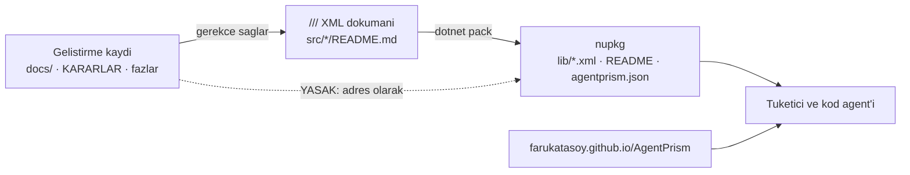

# Faz 75 — Tüketici Dokümanının Doğruluğu

> **Durum:** ✅ Tamamlandı (2026-08-20)
> **Kaynak:** [ADAYLAR.md](../../ADAYLAR.md) · **F-126**, **F-124**
> **Önkoşul:** [Faz 74](74-YEREL-REFERANS-YUZEYI.md) — tüketici agent'ını paketlenmiş XML korpusuna yönlendiren faz budur; bu faz o korpusu okunabilir yapar · [Faz 73](73-TUKETICI-AGENT-DESTEGI.md) — harita üreteci ve cırcır kapısı deseni · [Faz 57](57-KOD-DILI-BIRLESTIRME.md) — `SourceLanguageTests` cırcır altyapısı ve K-408 dil sınırı
> **Paketler:** On yedi paketin tamamı (yalnız XML dokümanı ve `README.md`) · `docs-site/` · `tests/`
> **Yeni paket:** Yok · **Migration:** Yok
> **Public API:** **Büyümüyor.** XML doküman metnini değiştirmek imza değiştirmez. Ölçüldü: `wc -l src/*/PublicAPI.Shipped.txt` = 16 satır (16 paket × 1 boş satır)
> **Site etkisi:** Yeni sayfa `guides/coding-agents.md` + kenar çubuğu bölümü · `ui.md` · `guides/observability.md` · `reference/configuration.md` · `http-api.md` · `capabilities.md` · üretilen `AgentPrism.AgentMap.md` / `llms.txt` / `llms-full.txt` **revizyonu değişir**
> **Manuel test alanı:** `docs/manuel-test/31-DOKUMAN-DOGRULUGU.md` (30 numarayı Faz 74 aldı)

---

## Bu Faza Başlarken

> `faz-baslangic` skill'ini uygula. Aşağıdaki liste o skill'in 2. adımıdır —
> **tamamını değil, yalnız işaret edilen bölümleri oku.**

1. Bu doküman
2. Kararlar — dosyanın tamamını **okuma**, yalnız bu kalemleri grep'le:
   ```bash
   grep -n "K-408\|K-410\|K-413\|K-421\|K-505\|K-507\|K-509" docs/KARARLAR.md
   ```
   **K-408** (dil sınırı: pakete giren her şey İngilizce'dir — bu faz kuralı
   dilden **hedef kitleye** genişletir; kanıt bölümü aynı sınıftır),
   **K-410** (`SourceLanguageTests`: taban çizgisi güdümlü cırcır — bu fazın
   yeni kapısı **aynı** mekaniği kullanır, yeni kavram getirilmez),
   **K-505** (harita `capabilities.md`'den üretilir, Node zinciri `dotnet build`'e
   bağlanmaz), **K-507** (harita işareti içerik revizyonudur — bu faz gövdeyi
   değiştirir, revizyon **değişecek**), **K-509** (`CapabilityCoverageTests`
   kapsamı 39 kayıt giriş noktasıdır — bu fazın yeni kapıları o kümeye
   **dokunmaz**, yeni boyutlar ekler), **K-413** (üretilen dosya elle yazılmaz),
   **K-421** (public API takibi açık; bu faz yüzeyi büyütmez).
3. [`74-YEREL-REFERANS-YUZEYI.md`](74-YEREL-REFERANS-YUZEYI.md) — yalnız devir notu:
   ```bash
   awk '/## Sonraki Faza Devir Notu/,0' docs/arsiv/fazlar/74-YEREL-REFERANS-YUZEYI.md
   ```
   Yedi maddenin **ikisi bu faz için zorunludur**: madde 4 (örneğin doğruluğunu
   yalnız derleme kanıtlar) ve madde 7 (paketlenmiş `agentprism.json` canlı
   belgenin alt kümesidir — bu faz o belgeyi **değiştirir**, kapsamını değil).
4. Alan hafızası (bu faz üç alana dokunuyor):
   [`hafiza/paketleme-ve-dagitim.md`](../../hafiza/paketleme-ve-dagitim.md) (**ana
   kaynak** — pakete giren dosya, `buildTransitive`, tüketiciye ulaşan yüzey),
   [`hafiza/test-altyapisi.md`](../../hafiza/test-altyapisi.md) (cırcır testi deseni,
   `AGENTPRISM_*_REFRESH` ortam değişkeni),
   [`hafiza/frontend.md`](../../hafiza/frontend.md) (yalnız ekran görüntüsü üreten
   E2E testine dokunulacaksa)
5. Gerektiğinde, tamamı değil ilgili bölümü:
   [`MIMARI.md`](../../MIMARI.md) — paketleme bölümü

---

## Amaç

Faz 73 tüketicinin kod agent'ına **haritayı** verdi. Faz 74 onu paketin kendi
diskindeki **ayrıntısına** yönlendirdi: 2,96 MB XML dokümanı, `~/.nuget/packages`
altında. Bu faz o korpusu ilk kez **okurunun gözünden** ölçer ve üç şey bulur.

Birincisi ve en ağırı: sevk edilen doküman **kendi kendine yetmiyor**. XML
dokümanı İngilizce'dir (K-408 bunu sağladı) ama kendi kendine gönderme yapar —
"the same rule as K-103", "(phase 64)", "docs/arsiv/fazlar/53-KIRACI-API-ANAHTARLARI.md,
section 53.3". Bu adresler tüketicide **yoktur**. Tüketicinin agent'ı o satırı
okur, referansı çözemez ve elinde yalnız bir boşluk kalır. K-408'in kanıt cümlesi
neredeyse birebir aynıydı: "imza İngilizce, açıklama Türkçe idi — paketin en
görünür kalite kusuru". Bu, aynı kusurun bir katman derinidir: dil doğru, **hedef
kitle** yanlış.

İkincisi: kapı var ama yanlış yere bakıyor. `check-content.mjs` bu sızıntıyı
zaten arıyor — ama yalnız sitenin **sanitize edilmiş kopyalarında**. Tüketiciye
giden `.nupkg` içeriği hiçbir kapının arkasında değil.

Üçüncüsü: anlatı beş yerde eksik ve bu eksikliklerin **hiçbiri** bugün bir testi
kızartmıyor.

- **F-126** — Tüketiciye giden her doküman yapıtı kendi kendine yeter, eksiksizdir
  ve bu iki nitelik cırcır kapılarına bağlanır.
- **F-124** — Harita üretecinin kesme ve kural seçimi kusurları kapanır
  ([Faz 73](73-TUKETICI-AGENT-DESTEGI.md) denetiminden devredildi; teşhisi bu
  fazda **düzeltildi**, aşağıda).

Kapsam dışı: editoryal ton, görsel kimlik, ekran görüntüsü estetiği ve okuma
akışı — [Faz 76](76-DOKUMAN-KALITESI-VE-GORSEL-KIMLIK.md). Bu faz **doğru ve
eksiksiz** olmayı ölçer; o faz **iyi** olmayı.

### Bugün ne çalışmıyor — doğrulanmış kanıt

| Kanıt | Gözlem |
|---|---|
| `artifacts/package/release/AgentPrism.*.0.272.nupkg` → `lib/net10.0/*.xml` | **1 033 satır**, 14 XML dosyasının 14'ünde: `phase 64`, `K-032`, `F-53`, `K1`, `docs/NN-*.md`. En yoğunu `AgentPrism.Core.xml` (295), sonra `Abstractions` (191) ve `AspNetCore` (123) |
| `grep -rniE "(phase\|faz) [0-9]+\|K-[0-9]{3}\|F-[0-9]{2,3}\|K[1-4]\|docs/" src --include="*.cs" \| grep "///"` | Kaynak tarafı: **896 satır**, 17 paketin 17'sinde. `AgentPrism.Core` 287, `Abstractions` 227, `AspNetCore` 132, `Sql.Shared` 91 |
| [`ApiKeyScope.cs:10`](../../../src/AgentPrism.Abstractions/Security/ApiKeyScope.cs#L10) | Sevk edilen bir `public enum`'un `<remarks>`'ı: "(docs/arsiv/fazlar/53-KIRACI-API-ANAHTARLARI.md, section 53.3)". Tüketicide o dosya yoktur |
| [`docs/openapi/agentprism.json`](../../openapi/agentprism.json) | Faz 74 bu belgeyi `AgentPrism.AspNetCore.nupkg` içine koydu. Belge **39 iç referans** taşıyor (26 ayrık), ikisi Türkçe dosya yolu: `docs/arsiv/fazlar/18-DEGERLENDIRME.md`, `docs/arsiv/fazlar/22-MCP-DERINLESMESI.md` |
| `grep -rniE "K-[0-9]{3}\|docs/" src/*/README.md` | **14 satır, 18 README'nin 9'unda.** `README.md` `PackageReadmeFile`'dır — nuget.org'un render ettiği sayfadır. Örnek: [`AgentPrism.Azure/README.md:96`](../../../src/AgentPrism.Azure/README.md#L96) "Details: `docs/KARARLAR.md`, decision K-211" |
| `grep -rl "farukatasoy.github.io" src/*/README.md` | **18 README'nin yalnız 5'i** doküman sitesine bağlantı taşıyor. On üç paketin nuget.org sayfası okuru hiçbir yere göndermiyor |
| [`check-content.mjs:271`](../../../docs-site/scripts/check-content.mjs#L271), [`:301`](../../../docs-site/scripts/check-content.mjs#L301) | `hasInternalHistory` kapısı **var** ve çalışıyor — ama yalnız `api/`, `http-api/` ve `public/openapi/agentprism.json` üzerinde. Sevk edilen `.nupkg` içeriği ve `docs/openapi/agentprism.json` **kapsam dışı** |
| `npm run check:content` | **Yeşil**: "37 manual pages and 999 total pages passed". Yukarıdaki hiçbir bulguyu görmüyor |
| [`schema-evalcasepromotionrequest.md:11`](../../../docs-site/src/content/docs/http-api/schema-evalcasepromotionrequest.md#L11) | Yayında olan cümle: "Request to promote a run to a case,." — sanitize eden süzgeç `(Phase 45, F-53)` parçasını sildi ve **bozuk cümle bıraktı**. Aynı sınıf iki yerde daha: `schema-evalsuite.md:23` ("… `. for the format.") ve `schema-jobschedulesaverequest.md:19` ("`POST.../trigger`") |
| [`build-agent-map.mjs:331-333`](../../../docs-site/scripts/build-agent-map.mjs#L331-L333) | `shorten()` son boşluğa değil, karaktere göre kesiyor. Sevk edilen haritada **üç kelime ortası kesme**: `a non-networked model provide…`, `errors,…`, `core s…` |
| [`build-agent-map.mjs:123-125`](../../../docs-site/scripts/build-agent-map.mjs#L123-L125) | Kural seçimi bölümün **ilk** düz metnini alır. Ölçüldü: 11 bölümün **9'u** kural üretiyor, **ikisi hiç üretmiyor** ("Runs, sessions, and media" ve "Observability and operations" — `capabilities.md`'de düz metinleri yok), **biri kural değil bir yön tarifi** üretiyor ("Storage and testability" → "Use Compatibility before you choose packages…") |
| [`ui.md`](../../../docs-site/src/content/docs/ui.md) ↔ [`en.ts:58-75`](../../../src/AgentPrism.UI/frontend/src/locales/en.ts#L58-L75) | Konsol gezinmesi **17 ekran** taşıyor. `ui.md` üçünü hiç anlatmıyor: **Sessions**, **Jobs**, **Skills**. `jobs` kelimesi sayfada **sıfır** kez geçiyor |
| [`DocumentationScreenshotTests.cs:45-62`](../../../tests/AgentPrism.Ui.E2ETests/DocumentationScreenshotTests.cs#L45-L62) | **14 ekran** görüntüleniyor. Beşi hiç yakalanmıyor: `sessions`, `jobs`, `skills`, `mcp`, `triggers`. Kapı "listedeki her ekran render oldu" der; "her ekran listede" **demez** |
| [`AgentPrismDiagnostics.cs`](../../../src/AgentPrism.Core/Diagnostics/AgentPrismDiagnostics.cs) ↔ [`guides/observability.md:46-55`](../../../docs-site/src/content/docs/guides/observability.md#L46-L55) | 36 telemetri adı var. Enstrümanların **onu da** dokümanda. Öznitelik anahtarlarının **23'ü hiçbir sayfada geçmiyor** — `agentprism.tenant.id`, `agentprism.agent.name`, `agentprism.run.status`, `agentprism.token.direction` dahil. Gösterge paneli yazan tüketici hangi etikete göre gruplayacağını bulamıyor |
| 39 `*Options` tipi, 266 public property | **13'ü hiçbir elle yazılmış sayfada geçmiyor**: `AgentPrismTenancyOptions` (`HeaderName`, `ClaimType`, `AllowHeaderResolution`, `AllowedTenants`), `AgentPrismRunOptions` (yedi üye), `AgentPrismOptions.DefaultTimeout`, `ModelRunJudgeOptions.Criteria` |
| [`http-api.md:9`](../../../docs-site/src/content/docs/http-api.md#L9) | "143 operations across 112 paths". Belgede bugün **160 işlem / 123 path** var. `index.mdx` sayıları kapıya bağlı ([`check-content.mjs:97-105`](../../../docs-site/scripts/check-content.mjs#L97-L105)), bu sayfa **değil** |
| [`README.md:7`](../../../README.md#L7) ↔ [`README.md:230`](../../../README.md#L230) | Aynı dosya iki farklı şey söylüyor: "Faz 73 tamamlandı" ve "Faz 0–74 bitti" |

> Kanıtlar 2026-08-20 tarihinde bu depo ve
> `artifacts/package/release/*.0.272.nupkg` üzerinde doğrulandı.

🚨 **En önemli satır kapı satırıdır.** Sızıntıyı arayan kod **zaten yazılmış**
([`check-content.mjs:359`](../../../docs-site/scripts/check-content.mjs#L359)) ve
doğru çalışıyor. Yeni bir tespit yeteneği icat edilmeyecek; var olan kural
**sevk edilen yapıtlara** uygulanacak. Bu fazın maliyeti tespit değil,
**temizliktir**.

---

## 75.1 — Kural: sevk edilen doküman kendi kendine yeter

K-408 bir **dil** sınırı çizdi. Bu faz aynı sınıra ikinci bir boyut ekler:

> Pakete giren bir dokümantasyon metni, **yalnız tüketicinin elindeki
> şeylere** gönderme yapar.

Tüketicinin elinde olanlar: paketin kendi tipleri, public üyeleri, yapılandırma
anahtarları, HTTP uçları, MSBuild özellikleri ve
`https://farukatasoy.github.io/AgentPrism` adresi. Elinde **olmayanlar**:
`docs/KARARLAR.md`, faz numaraları, `K-NNN`, `F-NN`, `K1`–`K4`, `MT-*`,
`docs/NN-*.md`.



### Dönüşüm kuralı — referans değil gerekçe

Satır **silinmez**; taşıdığı bilgi kendi kendine yeten bir cümleye çevrilir.
İçerik korunur, adres düşer.

| Bugün | Yarın |
|---|---|
| `AgentPrism carries no built-in model list (decision K-032).` | `AgentPrism carries no built-in model list: model names change faster than a NuGet release.` |
| `the same rule as K-103, applied a second time` | `the same rule that governs the first approval, applied a second time` |
| `A scope does not replace role policies, it narrows them (docs/arsiv/fazlar/53-KIRACI-API-ANAHTARLARI.md, section 53.3).` | `A scope does not replace role policies, it narrows them.` |
| `The outcome of a data subject erasure request (phase 64).` | `The outcome of a data subject erasure request.` |
| `Batch and scheduled run (Phase 17) settings.` | `Batch and scheduled run settings.` |
| `Details: docs/arsiv/fazlar/27-AZURE-FOUNDRY.md` (README) | `Details: https://farukatasoy.github.io/AgentPrism/guides/model-providers/` |

Üç desen çıkar ve iş bu üçe indirgenir:

1. **Parantez içi faz/karar etiketi** — silinir. Cümle zaten tamdır (ölçülen
   çoğunluk).
2. **Gerekçe taşıyan referans** — gerekçe yerine yazılır. Bilgi kazanılır.
3. **Türkçe doküman adresi** — doküman sitesindeki karşılık sayfaya çevrilir;
   karşılığı yoksa **silinir** (adres uydurulmaz).

🚨 `docs/` adresi taşıyan bir satır `docs-site` adresine çevrilirken hedefin
**var olduğu doğrulanır**. Kırık bağlantı üretmek, bağlantı olmamasından
kötüdür; `check-links.mjs` yalnız site içi bağlantıları görür, XML dokümanını
görmez.

### Kapsam

| Yüzey | Dahil mi | Neden |
|---|---|---|
| `src/**/*.cs` içindeki `///` satırları | ✅ | `.xml` olarak pakete girer |
| `src/*/README.md` | ✅ | `PackageReadmeFile` — nuget.org sayfası |
| `docs/openapi/agentprism.json` | ✅ | Faz 74 bunu `AspNetCore` paketine koydu |
| Kök `README.md` | ✅ ([§75.7](#757--kök-readmemd-dili)) | GitHub karşılama sayfası |
| `src/**` içindeki `//` ve `/* */` yorumları | ❌ | Pakete girmez; bakımcının kaydıdır ve `docs/` referansı orada **değerlidir** |
| `tests/**`, `samples/**` | ❌ | Pakete girmez |
| `docs/**`, `.agents/skills/**`, `scripts/**` | ❌ | Geliştirme aparatı (K-408 ile aynı sınır) |

🚨 Sınır `///` ile `//` arasındadır ve bu **bilinçlidir**. Bir uygulama
yorumunun "K-320 bu konumu ölçtü" demesi doğru davranıştır; sonraki bakımcı
o kaydı okuyabilir. Aynı cümle `<summary>` içine girerse tüketiciye gider.

---

## 75.2 — Kapı: `ShippedDocumentationSelfContainmentTests`

Yeri: `tests/AgentPrism.Core.UnitTests/Architecture/ShippedDocumentationSelfContainmentTests.cs`.
Mekanik [`SourceLanguageTests.cs`](../../../tests/AgentPrism.Core.UnitTests/Architecture/SourceLanguageTests.cs)
ile **birebir aynıdır** (K-410): dosya başına ihlal sayısı taşıyan bir taban
çizgisi, yalnız küçülen bir cırcır, `AGENTPRISM_*_REFRESH` ortam değişkeniyle
yenileme. Yeni kavram getirilmez.

Desen:

```text
\b(phase|faz)\s+\d+\b | \b[KF]-\d{2,3}\b | \bK[1-4]\b | \bMT-[A-Z0-9-]+\b | docs/[^\s`<),]+
```

Bu desen `check-content.mjs`'in
[`hasInternalHistory`](../../../docs-site/scripts/check-content.mjs#L359) fonksiyonundan
**alınır, yeniden yazılmaz**. İki uygulamanın ayrışması yeni bir kayma yüzeyidir;
plan bu yüzden tek kaynak ister — desen bir sabit olarak tek yerde durur ve
JavaScript tarafı onu okur ya da iki tarafın aynı deseni taşıdığını bir test
iddia eder ([Açık Soru 1](#açık-sorular)).

Taradığı yüzeyler ([§75.1](#751--kural-sevk-edilen-doküman-kendi-kendine-yeter)
kapsamı): `src/**/*.cs` içindeki `///` satırları, `src/*/README.md`, kök
`README.md`, `docs/openapi/agentprism.json`.

🚨 **Taban çizgisi BOŞ doğar.** Bu, 896 satırın **bu fazın içinde** temizlenmesi
demektir; kapı sonradan yeşile boyanmaz. `SourceLanguageTests`'in
[taban çizgisi](../../../tests/AgentPrism.Core.UnitTests/Architecture/source-language-baseline.txt)
de dört yorum satırından ibarettir — aynı çıta.

`AgentPrism.Generators` içindeki tek satır da kapsamdadır: o proje `IsPackable=false`
taşır ama üretilen tanı mesajları tüketicinin derleme çıktısına düşer.

---

## 75.3 — Paketlenen OpenAPI ve sanitize hasarı

Site kopyası (`docs-site/public/openapi/agentprism.json`) ile paketlenen kopya
(`docs/openapi/agentprism.json`) **aynı belge değildir**: ölçüldü, 384 alanda
ayrışıyorlar. Path ve şema kümeleri aynı (123 / 250); fark yalnız açıklama
metinlerindedir — site kopyası `build-http-api.mjs` tarafından sanitize edilmiş,
paketlenen kopya edilmemiştir.

Bu ayrışma iki kusur üretir ve ikisi de aynı kökten gelir:

1. **Paketlenen kopya kirli.** 39 iç referans doğrudan tüketiciye gidiyor.
2. **Site kopyası hasarlı.** Süzgeç parçayı siliyor ama cümleyi onarmıyor:
   "Request to promote a run to a case,."

[§75.1](#751--kural-sevk-edilen-doküman-kendi-kendine-yeter) ikisini birden
kapatır — çünkü her iki belgenin açıklamaları **aynı XML dokümanından** üretilir.
Kaynak cümle temizlenince sanitize edecek bir şey kalmaz ve iki kopya doğal
olarak yakınsar.

Kalıcı korumalar:

- `check-content.mjs`'in `hasInternalHistory` kapısı `docs/openapi/agentprism.json`
  üzerinde de koşar (bugün yalnız site kopyasında koşuyor).
- Sanitize süzgeci **sessizce bozmaz**: bir silme işlemi geride
  `,.` · ` .` · `. for` gibi bir kalıp bırakıyorsa süzgeç **hata verir**.
  Sessiz onarım denemesi yerine kaynağı düzeltmeyi zorlar.

🚨 Bu, süzgecin kaldırılması **değildir**. Faz 74'ün devir notu 7 doğrudur:
paketlenen belge canlı yüzeyin alt kümesidir ve `OpenApiSnapshotTests` onu
oraya sabitler. Değişen tek şey, süzgecin artık **boş çalışması** gerektiğidir.

---

## 75.4 — Harita üretecinin düzeltilmesi (F-124)

F-124 kaydı iki kusur bildiriyordu. **Ölçüm birini doğruladı, birini
düzeltti** ve **üçüncüsünü ortaya çıkardı**.

| # | F-124'ün iddiası | Ölçüm (2026-08-20) |
|---|---|---|
| 1 | `shorten()` kelime ortasından kesiyor | ✅ **Doğru.** Üç kesme: `provide…`, `errors,…`, `core s…` |
| 2 | Kural, "tablodan SONRAKİ paragrafı almıyor" | ⚠️ **Teşhis yanlış.** "Storage and testability" bölümünün tablodan önce düz metni **yok**; üreteç tablodan sonrakini zaten aldı. Gerçek kusur: alınan cümle bir kural değil, bir **yön tarifi** ("Use Compatibility before you choose packages…") |
| 3 | — | 🆕 **Yeni bulgu.** 11 bölümün **ikisi hiç kural üretmiyor** — `capabilities.md`'de düz metinleri yok: "Runs, sessions, and media" ve "Observability and operations" |

Düzeltme üç parçadır:

- `shorten()` son boşluktan keser; kelime bölmez.
- Üreteç, bölüm başına **tam bir kural** ister. Kural yoksa üreteç **hata
  verir** — sessizce eksik harita üretmez. Bu, `capabilities.md`'nin boş
  gövde durumunda zaten yaptığı şeydir
  ([`build-agent-map.mjs:82-84`](../../../docs-site/scripts/build-agent-map.mjs#L82-L84)).
- `capabilities.md` üç bölüme kural cümlesi kazanır: iki eksik bölüme yeni,
  "Storage and testability"nin yön tarifi yerine gerçek kural.

Harita gövdesi değişeceği için **revizyon değişir** (K-507). Kurulu tüketicilerde
`APG0401` çıkar; bu beklenen sonuçtur ve tanı sil-ve-derle yolunu zaten yazar.

---

## 75.5 — Eksik anlatı: beş boşluk

### 1 · Kod agent'ı desteğinin kendi sayfası yok

Faz 73 ve 74'ün tüm çıktısı — `AGENTS.md` üretimi, `AgentPrismWriteAgentsFile`,
`AgentPrismWriteLocalReference`, `llms.txt`, `AgentPrism.LocalReference.md`, altı
`APG` tanısı — bugün `capabilities.md`'de birer tablo satırı ve
`troubleshooting.md`'de bir bölümdür. Kenar çubuğunda hiçbir girişi yoktur.
Ölçüldü: `AgentPrismWriteAgentsFile` **iki** sayfada, `APG01` **bir** sayfada
geçiyor.

Yeni sayfa: `docs-site/src/content/docs/guides/coding-agents.md`. Kenar
çubuğunda **kendi bölümü** olur — "Coding agents" — çünkü hedef kitlesi
diğer sayfalardan farklıdır: bu sayfayı okuyan çoğu zaman bir insan değil,
onun agent'ıdır.

Kapsaması gerekenler: iki MSBuild özelliği ve varsayılanları · üretilen üç
dosyanın her birinin ne olduğu ve nereye yazıldığı · `AGENTS.md`'nin asla
ezilmediği · yenileme yolu (sil ve derle) · altı `APG` tanısının tablosu,
her biri için ne yakaladığı ve kaçış yolu · `AgentPrismUsageDiagnostics=false` ·
`llms.txt` / `llms-full.txt` adresleri · `.gitignore` tavsiyesi.

### 2 · `ui.md` üç konsol ekranını anlatmıyor

**Sessions**, **Jobs** ve **Skills**. Açılış sayfası "28 embedded console
screens" diye ölçülmüş bir sayı ilan ediyor; kılavuz on dördünü gösteriyor ve
üçünden hiç söz etmiyor.

`ui.md` üç bölüm kazanır. Ekran görüntüsü listesi
([`DocumentationScreenshotTests.cs:45`](../../../tests/AgentPrism.Ui.E2ETests/DocumentationScreenshotTests.cs#L45))
beş satır büyür: `sessions`, `jobs`, `skills`, `mcp`, `triggers`. Son ikisi
bugün metinde anlatılıyor ama görüntüsü yok.

### 3 · Telemetri öznitelikleri belgesiz

`guides/observability.md` on enstrümanı doğru sayıyor. Öznitelik anahtarlarının
**23'ü hiçbir yerde geçmiyor**. Gösterge paneli veya uyarı kuralı yazan tüketici
`agentprism.tenant.id` etiketini bilmeden kiracı bazlı maliyet paneli kuramaz.

Sayfa bir tablo kazanır: her öznitelik, hangi enstrümanlarda göründüğü ve
kardinalite uyarısı (`agentprism.run.id` ve `agentprism.session.id` yüksek
kardinalitelidir; etiket olarak toplanması pahalıdır — bu bir tuzaktır ve
yazılmalıdır).

### 4 · On üç yapılandırma üyesi belgesiz

`AgentPrismTenancyOptions`'ın dördü doğrudan bir güvenlik yüzeyidir:
`HeaderName`, `ClaimType`, `AllowHeaderResolution`, `AllowedTenants`. Kiracıyı
başlıktan çözmek üretimde kapatılması gereken bir seçenektir ve bugün
`reference/configuration.md` bundan hiç söz etmiyor.

`AgentPrismRunOptions`'ın yedi üyesi (`RunId`, `ParentRunId`, `RootRunId`,
`Depth`, `ExperimentId`, `ReplayOfRunId`, `AgentVersion`) bir yapılandırma
bölümü değildir — çağrı başına geçilen bağlamdır. Bunlar
`reference/configuration.md` yerine `concepts/runs.md`'ye aittir
([Açık Soru 3](#açık-sorular)).

### 5 · `http-api.md` bayat sayı taşıyor

"143 operations across 112 paths" → gerçek **160 / 123**. Sayı elle yazılmış ve
hiçbir kapı görmüyor.

---

## 75.6 — Yeni içerik kapisi ailesi

Bu fazın kalıcı değeri buradadır. Yukarıdaki beş boşluğun **hiçbiri** bugün bir
testi kızartmıyor; düzeltilseler bile aynı sınıf yarın yeniden açılır.

`check-content.mjs` beş iddia kazanır. Hepsi mevcut "landing metric drift"
desenini izler: **koddan ölç, dokümanda ara**.

| # | İddia | Kaynak | Hedef |
|---|---|---|---|
| 1 | Her konsol gezinme girişinin `ui.md`'de bir başlığı **ve** bir ekran görüntüsü var | `locales/en.ts` `nav.*` anahtarları | `ui.md`, `public/screenshots/` |
| 2 | Her telemetri adı en az bir sayfada geçiyor | `AgentPrismDiagnostics.cs` sabitleri | elle yazılmış sayfalar |
| 3 | Her `*Options` public property'si en az bir sayfada geçiyor | `src/**/*Options.cs` | elle yazılmış sayfalar |
| 4 | `http-api.md` işlem ve path sayısı belgeyle uyuşuyor | `docs/openapi/agentprism.json` | `http-api.md` |
| 5 | Sevk edilen yapıtlarda iç referans yok | desen | `docs/openapi/agentprism.json` |

🚨 2 ve 3 için **taban çizgisi dosyası gerekir**, cırcır mantığıyla: bugün
kapsanmayan üyeler listelenir ve liste **yalnız küçülür**. Ama bu fazın DoD'si
taban çizgilerinin **boş doğmasını** ister — yani 23 telemetri adı ve 13
property bu fazda gerçekten yazılır. Taban çizgisi bir kaçış kapısı değil, bir
kalıntı mekanizmasıdır ve boş kalması hedeftir.

🚨 İddia 1'in ekran görüntüsü yarısı `check-content.mjs`'te **dosyanın varlığını**
denetler; görüntünün **doğru ekranı** gösterdiğini `DocumentationScreenshotTests`
kanıtlar. İki kapı iki farklı şey söyler ve ikisi de gereklidir.

---

## 75.7 — Kök `README.md` dili

*(Kullanıcı kararı, 2026-08-20.)*

Kök `README.md` GitHub'ın karşılama sayfasıdır. Paket ailesini ilk kez gören
okur oraya düşer. Bugün Türkçe'dir ve K-408'in kapsamı dışındadır — çünkü
pakete girmez. Karar kapsamı genişletir: **okuru tüketici olan her yüzey
İngilizce'dir.**

Aynı geçişte iki iş daha yapılır:

- **Kayma düzeltilir.** Satır 7 "Faz 73 tamamlandı" derken satır 230 "Faz 0–74
  bitti" diyor.
- **`docs/` bağlantıları korunur.** Depo içinden `docs/KARARLAR.md`'ye
  bağlanmak **doğrudur** — okur depodadır, dosya oradadır. Kapı bu yüzden kök
  `README.md`'de yalnız `K-NNN` / `F-NN` / faz numarası desenlerini arar, `docs/`
  yolunu **aramaz** ([Açık Soru 2](#açık-sorular)).

🚨 Bütçe uyarısı — **ölçüldü ve zaten sıfırlandı.** `README.md` bütçesi
**20 000 bayt**. Bu fazın planlanması tek bir dalga satırı ekledi ve dosya
**19 966** bayta çıktı: kalan boşluk **%0**. İngilizce çeviri Türkçe'den tipik
olarak uzundur, yani aşım **kesindir**. İçerik **silinmez** — yol haritası
tablosu `docs/YOL-HARITASI.md`'ye devredilir (zaten üretilen tek kaynak odur,
K-413) ve README ona bağlanır. Bu, fazın ilk yapması gereken işlerden biridir.

On sekiz paket README'si de aynı geçişte doküman sitesine bağlantı kazanır:
bugün **yalnız beşi** taşıyor.

---

## Planlanan Public API

**Yüzey büyümüyor.** Bu faz hiçbir imzaya dokunmaz; yalnız `///` gövdelerini,
markdown dosyalarını ve test/script kodunu değiştirir.

### HTTP `endpoint`'leri

Yok.

### Arayüz payı

Yok — bu faz arayüz **koduna** dokunmaz. Yalnız `DocumentationScreenshotTests`
listesi büyür, o da `tests/` altındadır ve bundle'a girmez.

### Yeni doküman sözleşmesi

```
docs-site/src/content/docs/guides/coding-agents.md   (yeni sayfa)
astro.config.mjs                                     (yeni kenar cubugu bolumu)
```

---

## Planlanan Dosya Listesi

```
src/AgentPrism.{Abstractions,Core,AspNetCore,Sql.Shared,Workflows,Azure,
                PostgreSql,OpenAI,Anthropic,Sqlite,Mcp,Google,SqlServer,
                Voice,Testing,UI,Generators}/
├── **/*.cs                              (degisir — 896 `///` satiri)
└── README.md                            (degisir — 9'unda ic referans, 13'unde site baglantisi yok)

README.md                                (degisir — Ingilizce + kayma)
docs/openapi/agentprism.json             (yeniden uretilir — temiz kaynaktan)

docs-site/
├── scripts/build-agent-map.mjs          (degisir — shorten + kural zorunlulugu)
├── scripts/build-http-api.mjs           (degisir — sessiz onarim yerine hata)
├── scripts/check-content.mjs            (degisir — bes yeni iddia)
├── astro.config.mjs                     (degisir — yeni kenar cubugu bolumu)
├── public/screenshots/{sessions,jobs,skills,mcp,triggers}.png   (yeni, uretilen)
└── src/content/docs/
    ├── guides/coding-agents.md          (YENI)
    ├── capabilities.md                  (degisir — uc kural cumlesi)
    ├── ui.md                            (degisir — uc ekran bolumu)
    ├── guides/observability.md          (degisir — 23 oznitelik)
    ├── reference/configuration.md       (degisir — tenancy ve digerleri)
    ├── concepts/runs.md                 (degisir — AgentPrismRunOptions baglami)
    └── http-api.md                      (degisir — sayilar)
   → uretilen: buildTransitive/AgentPrism.AgentMap.md, public/llms.txt, public/llms-full.txt

tests/AgentPrism.Core.UnitTests/Architecture/
├── ShippedDocumentationSelfContainmentTests.cs        (YENI)
└── shipped-documentation-baseline.txt                 (YENI, BOS dogar)

tests/AgentPrism.Ui.E2ETests/
└── DocumentationScreenshotTests.cs      (degisir — bes ekran)

docs/manuel-test/31-DOKUMAN-DOGRULUGU.md (YENI)
docs/manuel-test/00-INDEKS.md            (degisir — satir 31)
docs/hafiza/dokumantasyon.md             (YENI — bu fazin tuzaklari)
```

---

## Hata Modları ve Testler

| Ne bozulabilir | Seviye | Test sınıfı |
|---|---|---|
| Yeni bir `///` satırı `K-NNN` veya faz numarası taşır | Birim (cırcır) | `ShippedDocumentationSelfContainmentTests` |
| Taban çizgisi bayatlar — temizlenen dosya listede kalır | Birim | `ShippedDocumentationSelfContainmentTests` |
| Bir `README.md`'ye `docs/KARARLAR.md` bağlantısı geri gelir | Birim | `ShippedDocumentationSelfContainmentTests` |
| `docs/openapi/agentprism.json` yeniden üretilirken kirlenir | Birim + CI | `ShippedDocumentationSelfContainmentTests` + `check-content.mjs` |
| Sanitize süzgeci cümleyi bozup sessizce geçer | CI | `build-http-api.mjs` (hata verir) + `check-content.mjs` |
| Yeni konsol ekranı eklenir, `ui.md` güncellenmez | CI | `check-content.mjs` iddia 1 |
| Ekran görüntüsü listesine eklenmemiş ekran | CI + **E2E** | `check-content.mjs` + `DocumentationScreenshotTests` |
| Ekran görüntüsü yanlış ekranı gösterir (spinner, boş liste) | **E2E** | `DocumentationScreenshotTests` (landmark iddiası) |
| Yeni telemetri adı eklenir, dokümana yazılmaz | CI | `check-content.mjs` iddia 2 |
| Yeni `Options` property'si eklenir, dokümana yazılmaz | CI | `check-content.mjs` iddia 3 |
| HTTP yüzeyi büyür, `http-api.md` sayısı bayatlar | CI | `check-content.mjs` iddia 4 |
| Harita bölümü kuralsız kalır | CI | `build-agent-map.mjs` (hata verir) |
| Harita kelime ortasından keser | CI | `check-content.mjs` sapma kapısı (üreteç çıktısı değişir) |
| Yeni sayfa kenar çubuğuna bağlanmaz | CI | `check-content.mjs` (mevcut iddia) |
| XML'den `docs-site` adresine çevrilen bağlantı kırıktır | Manuel + CI | `check-links.mjs` **görmez** → manuel case; [Açık Soru 4](#açık-sorular) |

Beş soru:

| Soru | Cevap |
|---|---|
| İptal | Konu dışı — bu faz çalışma anına dokunmaz |
| Eşzamanlılık | Konu dışı; üretilen dosyalar tek bir Node koşumunda yazılır |
| Boş/aşırı girdi | `capabilities.md` kuralsız bölüm taşırsa üreteç **hata verir**, eksik harita üretmez |
| Başka kiracı | Konu dışı |
| Alt sistem hatası | `check-content.mjs` okuyamadığı bir kaynak dosyası için **hata verir**, iddiayı sessizce atlamaz |

🚨 Bu fazın hiçbir davranışı DI · HTTP · kiracı · akış · depo sınırını geçmez —
tek istisna ekran görüntüsü üretimidir ve o **zaten E2E'dir**. Bu yüzden test
seviyeleri birim ve CI'da yoğunlaşır; bu bir kolaycılık değil, iş dağılımının
sonucudur.

---

## Manuel Kabul Case'leri

| # | Ön koşul | Adımlar | Beklenen sonuç |
|---|---|---|---|
| 1 | Temiz çalışma ağacı | `dotnet pack AgentPrism.slnx -c Release` sonra paketlenen her `lib/net10.0/*.xml` içinde deseni ara | **Sıfır eşleşme** (bugün 1 033) |
| 2 | Aynı | `unzip -p …AspNetCore….nupkg buildTransitive/agentprism.json` içinde deseni ara | **Sıfır eşleşme** (bugün 39) |
| 3 | Aynı | 18 `src/*/README.md` içinde deseni ara | **Sıfır eşleşme** (bugün 14) |
| 4 | Aynı | 18 `src/*/README.md` içinde `farukatasoy.github.io` ara | **18/18** (bugün 5) |
| 5 | Bir `///` satırına elle `(phase 12)` yaz | `dotnet test --filter ShippedDocumentationSelfContainment` | Kızarır ve **dosya adını** söyler |
| 6 | Bir README'den bir iç referans daha sil, taban çizgisini yenileme | Aynı | Kızarır — "taban çizgisi bayat" |
| 7 | `capabilities.md`'den bir bölümün kural paragrafını sil | `node docs-site/scripts/build-agent-map.mjs` | **Hata verir**, kuralsız harita üretmez |
| 8 | Üretilen `llms.txt` | `grep "…" docs-site/public/llms.txt` | **Sıfır satır** (bugün 3) |
| 9 | `en.ts`'e yeni bir `nav.*` anahtarı ekle | `npm run check:content` | Kızarır — `ui.md` bölümü ve ekran görüntüsü ister |
| 10 | `AgentPrismDiagnostics.cs`'e yeni bir öznitelik adı ekle | Aynı | Kızarır ve **adı** söyler |
| 11 | Bir `Options` tipine yeni public property ekle | Aynı | Kızarır ve **adı** söyler |
| 12 | Bir HTTP ucu ekle, `docs/openapi/agentprism.json`'ı yenile | Aynı | Kızarır — `http-api.md` sayısı bayat |
| 13 | `AGENTPRISM_UI_SCREENSHOTS=1` ile E2E koş | Beş yeni `.png` üretilir | Beşi de gerçek ekranı gösterir, boyutu makul |
| 14 | Yayınlanan site | `guides/coding-agents/` sayfası kenar çubuğundan açılır | Altı `APG` tanısı ve iki MSBuild özelliği eksiksiz | 👤 |
| 15 | XML'den siteye çevrilen her bağlantı | Adreslerin tamamını `curl -sI` ile dolaş | Hepsi `200` | 👤 |

---

## Açık Sorular

| # | Soru | Seçenekler | Öneri |
|---|---|---|---|
| 1 | İç referans deseni iki dilde (C# ve JS) yaşayacak. Nasıl tek kaynak olur | A: Desen bir metin dosyasında durur, iki taraf da okur · B: İki taraf ayrı yazar, bir test iki deseni karşılaştırır · C: Ayrışmayı kabul et | **A.** Desen bir satırlık veridir; dosyadan okumak iki uygulamayı da basitleştirir. B ikinci bir kayma yüzeyi kurar |
| 2 | Kök `README.md` `docs/` bağlantılarını koruyabilir mi | A: Evet — okur depodadır · B: Hayır — kapı tek desen kullanır | **A.** Kök README'nin okuru depoyu görüyordur; `docs/KARARLAR.md` bağlantısı orada **çalışır**. Kapı kök README için `docs/` yolunu kapsam dışı bırakır ve bu istisna koda yazılır |
| 3 | `AgentPrismRunOptions`'ın yedi üyesi nereye yazılır | A: `concepts/runs.md` · B: `reference/configuration.md` · C: İkisi de | **A.** Bunlar bir yapılandırma bölümü değil, çağrı başına bağlamdır. `configuration.md`'ye koymak sayfanın sözünü ("doğrulanmış bölüm adları ve varsayılanlar") bozar |
| 4 | XML dokümanındaki dış bağlantılar bir kapıya bağlansın mı | A: Hayır, manuel case yeter · B: Evet, `check-links.mjs` XML'i de tarasın | **B**, ama ölçülmeden karar verilmez: XML korpusu 2,96 MB'dır ve her bağlantıyı ağdan doğrulamak CI süresini bilinmeyen bir miktar uzatır. Süre ölçülür, 30 sn'yi aşarsa A |
| 5 | Ekran görüntüsü listesi beşten fazla mı büyümeli | A: Beş (nav girişleri) · B: 28 (tüm rota bileşenleri) | **A.** Detay ekranları (`run-detail`, `agent-editor`) gezinmede yoktur ve kılavuz onları anlatı içinde gösterir. 28 görüntü bakım borcudur |

---

## Bitiş Ölçütleri (DoD)

- [x] `dotnet pack` sonrası 15 paketin `lib/net10.0/*.xml` dosyalarında iç referans deseni **sıfır eşleşme** verir — ölçüldü (taban 1 033). Kalan tek eşleşme sıradan İngilizce'deki küçük harfli `rationale` kelimesidir, `Rationale:` etiketi değil
- [x] Paketlenen `buildTransitive/agentprism.json` **sıfır eşleşme** verir (taban 39); ayrıca 26 imza sızıntısı (`string? X.Y`) da sıfırlandı
- [x] 18 paket README'sinin 18'inde sıfır iç referans **ve** doküman sitesine en az bir bağlantı — ölçüldü: 0 ve 18/18
- [x] Kök `README.md` İngilizce; faz kayması yok; **17 701 / 20 000 bayt** (%11 boş)
- [x] `ShippedDocumentationSelfContainmentTests` yeşil; taban çizgisi **boş** (yalnız dört yorum satırı); iki yönde de kızardığı gösterildi
- [x] 11 bölümün **11'i** bir `Rule:` satırı taşır (ikisi hiç taşımıyordu). ~~`…` sıfır kez~~ → **Sapma 4:** üç kesme kalır ve hepsi **kelime sınırındadır**; kusur kesmenin kendisi değil, kelime ortasından kesmekti
- [x] `guides/coding-agents.md` yayında, kendi kenar çubuğu bölümünde; altı `APG` tanısı, iki MSBuild özelliği ve üç üretilen dosya anlatılıyor
- [x] **18** konsol gezinme girişinin 18'inin `ui.md`'de kendi başlığı ve bir görüntüsü var (plan 17 diyordu; ölçülen 18). Görüntü sayısı 14 → **19**
- [x] **34** telemetri adının 34'ü ve 266 `Options` property'sinin 266'sı en az bir sayfada geçer. **Sapma 5:** taban çizgisi dosyası yazılmadı — borç zaten sıfır olduğu için doğrudan iddia yeterli ve daha güçlü
- [x] `http-api.md` **160 operations across 123 paths** diyor ve kapıya bağlı (bayat değer 143/112 idi)
- [x] `check:content` 38 elle yazılmış / 1000 toplam sayfa temiz · `build` 1001 sayfa · `check-links` **128 663 bağlantı, kırık yok**
- [x] Dört doğrulama kapısı: `build` 0/0 · `test` **4 408 test, 0 başarısız** · `pack` temiz · `format --verify-no-changes` exit 0
- [x] `samples/AgentPrism.Api` ile gerçek `run` yapıldı — çıktı aşağıda
- [x] `secret` taraması: çıkan beş satırın hepsi test sabiti (`FAKE-VOICE-KEY-…`, `test-api-key-…`) ve analyzer testinin bilinçli girdisi
- [x] `docs/manuel-test/31-DOKUMAN-DOGRULUGU.md` yazıldı (**20 case**); 1–16, 19, 20 koşuldu, 17 ve 18 👤 işaretli
- [x] `faz-denetim` koşuldu; **6 🔴 · 8 🟡 · 2 🟢** bulgu çıktı, altı 🔴'ın altısı da kapandı; 🔴 kalmadı


### Gerçek çıktı — örnek uygulama

```text
GET  /agentprism/api/meta
  {"version":"0.0.0-preview.0.273","prefix":"/agentprism",
   "storage":{"persistent":true,"runStore":"SqlRunStore","jobWorkerEnabled":true}}

POST /agentprism/api/agents/claude-support/run    → SSE, 10 olay
  event: run     {"runId":"01a01c9e-a1f1-75c9-aa84-ad00e513a1d5"}
  event: update  ... (Anthropic gercek yaniti)
  event: done

GET  /agentprism/api/runs?limit=1
  {"id":"01a01c9e-a1f1-75c9-aa84-ad00e513a1d5","agentName":"claude-support","status":"Completed"}
```

Akışı erken kapatan ilk deneme `Canceled` kaydetti — doğru davranıştır ve
iptal yolunun canlı kanıtıdır.

### Gerçek çıktı — paketlenen yapıtlar

```text
dotnet pack AgentPrism.slnx -c Release        # 0.0.0-preview.0.273
15 nupkg → lib/net10.0/*.xml   ic referans: 0   (faz oncesi 1 033)
AgentPrism.AspNetCore.nupkg → buildTransitive/agentprism.json   ic referans: 0   (39)
15 nupkg → README.md           ic referans: 0   (14)
```

### Doğrulama komutları

```bash
# Sevk edilen XML temiz mi
dotnet pack AgentPrism.slnx -c Release
for p in artifacts/package/release/AgentPrism*.nupkg; do
  unzip -p "$p" 'lib/net10.0/*.xml' 2>/dev/null
done | grep -ciE "(phase|faz) [0-9]+|K-[0-9]{3}|F-[0-9]{2,3}|docs/"   # beklenen: 0

# Paketlenen OpenAPI temiz mi
unzip -p artifacts/package/release/AgentPrism.AspNetCore.*.nupkg \
  buildTransitive/agentprism.json | grep -ciE "phase [0-9]+|K-[0-9]{3}"  # beklenen: 0

# Harita kesme ve kural
grep -c "…" docs-site/public/llms.txt        # beklenen: 0
grep -c "^- Rule:" docs-site/public/llms.txt # beklenen: 11

# Kapinin gercekten yakaladigi gosterilir
dotnet test --filter ShippedDocumentationSelfContainment
cd docs-site && npm run check:content
```

---

## Riskler

| Risk | Önlem |
|------|-------|
| 896 satırlık temizlik mekanik bir "sil-geç" turuna dönüşür ve **bilgi kaybolur** | Dönüşüm kuralı üç deseni ayırır ([§75.1](#751--kural-sevk-edilen-doküman-kendi-kendine-yeter)); gerekçe taşıyan referans **gerekçeye çevrilir**, silinmez. `faz-denetim` örneklem alıp bilgi kaybını arar |
| Desen yanlış pozitif üretir — "phase 1 of the handshake" gibi meşru cümleler | Desen `check-content.mjs`'te **bir yıldır** aynı yüzeylerde koşuyor ve sıfır yanlış pozitif verdi. Yine de taban çizgisi mekaniği kaçış kapısını sağlar; kullanılırsa gerekçesi satır yorumuna yazılır |
| Harita revizyonu değişince kurulu her tüketicide `APG0401` çıkar | **Beklenen sonuç**, kusur değil (Faz 74 aynı riski aldı). Tanı sil-ve-derle yolunu yazar |
| Yeni beş kapı gürültü üretir ve sonraki fazlar onları bastırmaya çalışır | Her kapı **kod tarafından ölçülen** bir gerçeği doğrular; bastırmak dokümanı yanlış yapar. İki taban çizgisi boş doğar ve `faz-denetim` büyümelerini 🔴 sayar |
| README bütçesi İngilizce çeviride aşılır | İçerik **silinmez**: yol haritası tablosu zaten üretilen `docs/YOL-HARITASI.md`'ye devredilir (K-413) ve README ona bağlanır |
| `check-links.mjs` XML'den siteye açılan bağlantıları görmez; kırık bağlantı sevk edilir | Manuel case 15 hepsini dolaşır; kalıcı kapı [Açık Soru 4](#açık-sorular)'te ölçüme bağlandı |
| Beş yeni ekran görüntüsü E2E'yi kırılganlaştırır | Mevcut kapı landmark iddiası taşır: render olmayan ekran **testi düşürür**, spinner fotoğrafı üretmez. Beş yeni satır aynı sözleşmeye girer |
| `docs/**.md` dizin bütçesi aşılır — bu plan onu **%3 boşluğa** düşürdü (4 856 725 / 5 000 000) ve kapanış bölümleri henüz yazılmadı | Kapanıştan **önce** taşıma yapılır: Faz 73 ve 74'ün birikimli anlatısı `docs/arsiv/`'e gider. `python3 scripts/dokuman-bakim.py --denetle` fazın erken kapılarından biridir, sonuncusu değil |

---

<!-- ============================================================
     AŞAĞISI KAPANIŞTA DOLDURULUR — `faz-tamamlama` skill'i.
     Plan anında boş kalır. Başlıkları SİLME.
     ============================================================ -->

## Plandan Sapmalar

> Uygulama sırasında keşfedildikçe yazılır; kapanışta tamamlanır.

**1 — İş hacmi 896 değil 1 243 satır; ikinci bir kusur sınıfı var.**
`faz-uygulama` Adım 1'in ölçümü planın sayısını düşürdü. Plan yalnız **iç
referansları** saydı (`phase 64`, `K-032`, `docs/NN-*.md`) ve **914** buldu.
Ölçüm ikinci bir sınıf gösterdi: sevk edilen XML dokümanı geliştirme
günlüğünün **sesiyle** yazılmış — **347** satır 🚨/⚠️ taşıyor, **98** satır
`Rationale:` ile açılıyor, dördü `Measured (2026-…)` bloğu. Birleşik küme
**1 243 satır**, 17 pakette.

Bu sınıf kapsam dışı **bırakılamaz**, çünkü [§75.3](#753--paketlenen-openapi-ve-sanitize-hasarı)
sanitize süzgecinin boş çalışmasını istiyor. Ölçüldü: süzgeç tek değil **iki**
kopyadır ve toplam **110 satırdır** —
[`build-api-reference.mjs:554-625`](../../../docs-site/scripts/build-api-reference.mjs#L554-L625)
(70 satır) ve [`build-http-api.mjs:492-517`](../../../docs-site/scripts/build-http-api.mjs#L492-L517)
(26 satır). İçlerinde `🚨|⚠️ → **Important:**`, `Rationale: → ''`,
`Measured (20… → ''` kuralları var; yani proje bu sesi **zaten** tüketiciye
uygun bulmuyor ve siteye çıkarken siliyor. Kaynak temizlenmezse süzgeç
kalır, kalırsa üç bozuk cümle sınıfı da kalır.

Sonuç: kural tek cümleyle genişledi — sevk edilen doküman kendi kendine
yetmekle kalmaz, **tüketicinin sesiyle** yazılır. Kapı iki deseni de tarar.
Fazın kazancı da büyüdü: 110 satırlık onarım zinciri **silinebilir** hâle
gelir.

**2 — Uygulama sırasında bulunan üçüncü kusur sınıfı: `<see cref>` paketlenen
belgede TAM İMZA olarak render ediliyor.** Ölçüldü: `docs/openapi/agentprism.json`
içinde önce **26 yerde** `string? ClientToolResult.ErrorMessage`,
`int? ModelBinding.MaxOutputTokens` gibi metinler bulundu. 🚨 İlk düzeltme yalnız
**nullable** şekli kapatıyordu; ikinci ölçüm **17 vaka daha** gösterdi
(`string AgentDefinition.Name`, `bool EvalCaseResult.Passed` — soru işareti yok,
sızıntı aynı). Kapı iki şekli birden arar; toplam 83 satırda `<see cref>` → `<c>`. Kaynağı AgentPrism değil, ASP.NET Core'un XML doküman
üretecidir — `<see cref="X"/>` cümlenin ortasına imzayı basıyor. Site kopyası
bunu bir süzgeç kuralıyla siliyor; paketlenen kopya silmiyor.

Çözüm bu 26 yerde `<see cref>` yerine JSON adını `<c>` ile yazmaktır: OpenAPI
belgesini okuyan tüketici zaten CLR imzasını değil JSON alanını görüyor, yani
metin hem düzelir hem doğrulaşır. Kapı: [§75.6](#756--yeni-içerik-kapisi-ailesi)
iddiası 5 bu deseni de arar.

**3 — Ekran görüntüsü listesi beş değil BEŞ + tohum.** Plan yalnız beş satır
eklemeyi yazıyordu. Ölçüldü: yeni beş ekranın dördü **boş durum** gösteriyordu
(`No schedule yet`, `No job yet`), ve testin kendi dokümanı "boş bir konsolun
ekran görüntüsü hiçbir şey öğretmez" diyor. `SeedCatalogAsync` eklendi: bir skill,
bir schedule, tetiklenmiş bir job, bir trigger ve bir MCP sunucusu kurulur; iki
`run` artık tek bir `sessionId` paylaşır, böylece oturum listesi de dolu gelir.
Tohumlama iki gerçek sözleşmeyi de ortaya çıkardı: `JobScheduleSaveRequest.Payload`
atanmazsa uç **500** döner (`JsonElement` `Undefined` tuzağı) ve tetikleyici
imzalama anahtarı `AgentPrism:TriggerSecrets:` önekini zorunlu tutar.

**4 — Kesme kusuru "sıfır `…`" değil, "kelime ortasından kesme" idi.** DoD
`…` karakterinin hiç geçmemesini istiyordu. Ölçüldü: harita satırı 52 karakterle
sınırlıdır ve üç açıklama o sınırı gerçekten aşıyor; kesmenin kendisi doğru
davranıştır. Kusur `provide…` · `core s…` gibi **kelime ortasından** kesmekti.
`shorten()` artık son boşluktan keser ve kesmeden önceki noktalamayı düşürür;
üç kesme kaldı ve üçü de kelime sınırında.

**5 — Telemetri ve `Options` kapıları taban çizgisi dosyası ALMADI.** Plan cırcır
deseni öngörüyordu. Uygulamada borç zaten sıfıra indiği için taban çizgisi boş
doğacaktı; boş bir taban çizgisi dosyası, doğrudan iddiadan **daha zayıftır**
(bir sonraki oturum ona satır ekleyebilir). İki kapı da istisnasız iddia eder.

**6 — İki yeni kapı ilk yazımda GEVŞEKTİ ve hiçbir şey yakalamadı.** Kanıtlama
turu gösterdi: konsol ekranı kapısı "sayfada adı geçiyor mu" diye soruyordu ve
`Jobs` kelimesi o ekranı hiç anlatmayan bir çapraz bağlantıda da geçiyordu;
telemetri kapısı `includes()` kullanıyordu ve `agentprism.tenant.id`,
`agentprism.tenant.identifier`'ın **ön ekidir**. Sıkılaştırılmış kapı **beş
gerçek boşluk daha** buldu: `ui.md`'de Tools, Skills, Models, MCP, Triggers,
Audit ve Diagnostics ekranlarının kendi başlığı yoktu. Ders: bir kapıyı yazdıktan
sonra **kırmızı olduğunu görmeden** yeşil kabul etme.

**7 — Depo kuralı ihlali değil ama kayda değer: `-p:AgentPrismFrontendEnabled=false`
ile tam yeniden derleme `AgentPrism.slnx`'ten `AgentPrism.UI` satırını sildi.**
İki kez gözlendi (bir kez de `AgentPrism.Ui.E2ETests.csproj`'un `ProjectReference`
satırı). Sonuç sessiz değildi ama teşhisi yanıltıcıydı: `AgentPrism.src.slnf`
bozuldu ve 80 test "başarısız" göründü. İstek üzerine **yeniden üretilemedi**;
artımlı derleme tetiklemiyor. Not olarak bırakıldı — mekanizma iddia edilmiyor.

## Bu Fazda Verilen Kararlar

| # | Karar |
|---|---|
| **K-514** | Sevk edilen dokümantasyon kendi kendine yeter: pakete giren bir metin yalnız tüketicinin elindeki şeylere gönderme yapar. Kural sesi de kapsar (🚨, `Rationale:`, `Measured (20…)`); `//` uygulama yorumları kapsam dışıdır |
| **K-515** | Sevk edilen dokümanı denetleyen cırcır **satırı değil bloğu** okur — XML yorumu sarıldığı için `(phase 65)` iki satıra bölünür ve satır bazlı tarama iki yarıyı da göremez |
| **K-516** | Site üreteçleri artık onarmaz, **hata verir**. ~110 satırlık zincir ölçülerek emekliye ayrıldı: kaldırılınca 689 sayfanın yalnız biri değişti |
| **K-517** | `<see cref>` paketlenen OpenAPI'de tam imza olarak render edilir; sözleşme tiplerinde `<c>ÜyeAdı</c>` yazılır |
| **K-518** | Kök `README.md` İngilizce'dir; depo içi `docs/` bağlantıları korunur |

Gerekçeler `docs/KARARLAR.md`'dedir.

## Gerçekleşen Public API

**Yüzey büyümedi.** `git diff --stat src/*/PublicAPI.*.txt` boş. Bu faz yalnız
`///` gövdelerini, markdown dosyalarını, iki Node üretecini ve test kodunu
değiştirdi.

### HTTP `endpoint`'leri · Arayüz payı

Yok. `WithDescription`/`WithSummary` metinleri değişti; yol, metot ve şema
değişmedi — `OpenApiSnapshotTests` bunu doğruluyor.

### Yeni doküman sözleşmesi

```
docs-site/src/content/docs/guides/coding-agents.md   (yeni sayfa)
astro.config.mjs                                     ("Coding agents" kenar cubugu bolumu)
```

## Dosya Listesi (gerçekleşen)

```
src/  (17 paket)
├── **/*.cs                     468 dosya — 1 213 `///` satiri yeniden yazildi;
│                               43 satirda <see cref> -> <c>; 12 endpoint metni
├── */README.md                 15 dosya — ic referans temizligi + dokuman sitesi baglantisi
README.md                       Ingilizce'ye tasindi (19 966 -> 17 701 B)
docs/openapi/agentprism.json    yeniden uretildi (temiz kaynaktan)

docs-site/
├── astro.config.mjs                       (degisti — yeni kenar cubugu bolumu)
├── scripts/check-content.mjs              (degisti — bes yeni iddia)
├── scripts/build-agent-map.mjs            (degisti — shorten + kural zorunlulugu)
├── scripts/build-api-reference.mjs        (degisti — 70 satirlik zincir -> koruma)
├── scripts/build-http-api.mjs             (degisti — 26 satirlik zincir -> koruma)
├── public/screenshots/*.png               (19 goruntu; besi YENI)
└── src/content/docs/
    ├── guides/coding-agents.md            (YENI)
    ├── ui.md                              (degisti — 18 ekranin 18'i kendi basligiyla)
    ├── guides/observability.md            (degisti — 23 oznitelik + kardinalite uyarisi)
    ├── reference/configuration.md         (degisti — tenancy, judge, Tools:DefaultTimeout)
    ├── concepts/runs.md                   (degisti — AgentPrismRunOptions)
    ├── capabilities.md                    (degisti — uc kural cumlesi)
    └── http-api.md                        (degisti — 160/123)

tests/AgentPrism.Core.UnitTests/Architecture/
├── ShippedDocumentationSelfContainmentTests.cs   (YENI)
├── shipped-documentation-baseline.txt            (YENI, BOS)
└── SourceLanguageTests.cs                        (degisti — bir muafiyet satiri)

tests/AgentPrism.Ui.E2ETests/
└── DocumentationScreenshotTests.cs        (degisti — bes ekran + SeedCatalogAsync)

docs/hafiza/dokumantasyon.md               (YENI)
MEMORY.md                                  (degisti — bir yonlendirme satiri)
docs/manuel-test/31-DOKUMAN-DOGRULUGU.md   (YENI — 20 case)
docs/manuel-test/00-INDEKS.md              (degisti — satir 31)
```

**Ölçülen sonuç:** 522 dosya değişti, 12 dosya eklendi.

### Kapıların kanıtı

| Kapı | Kırmızı gösterildi mi |
|---|---|
| `ShippedDocumentationSelfContainmentTests` (yeni ihlal) | ✅ `+ AgentPrismOptions.cs: 1 offending lines, baseline allows 0` |
| Aynı kapı (bayat taban çizgisi) | ✅ `- …: baseline still allows N — refresh it` |
| Aynı kapı (satır sınırını aşan referans) | ✅ üç gerçek vakada; blok birleştirme olmadan görünmüyorlardı |
| `check-content` — konsol ekranı | ✅ `## Jobs` → `## Queue` yapılınca kızardı |
| `check-content` — telemetri | ✅ `agentprism.tenant.id` → `…identifier` yapılınca kızardı |
| `check-content` — `Options` üyesi | ✅ belgesiz property eklenince adıyla söyledi |
| `check-content` — HTTP sayısı | ✅ sayı bozulunca gerçek sayıyı yazdı |
| `build-agent-map.mjs` — kuralsız bölüm | ✅ hata verdi, eksik harita üretmedi |
| `build-api-reference.mjs` — iç referans | ✅ hata verdi ve eşleşen metni gösterdi |

## Denetim Bulguları

`faz-denetim` taze bağlamlı bir denetçiyle koşuldu (2026-08-20). Denetçi dört kapıyı
bağımsız koştu, üç üreteci ayrı ayrı çalıştırdı, paketlenen belgeyi ölçtü ve
`guides/coding-agents.md`'nin her iddiasını koda karşı doğruladı. **6 🔴 · 8 🟡 · 2 🟢.**
Altı 🔴'ın altısı da gerçekti.

| # | Seviye | Bulgu | Sonuç |
|---|---|---|---|
| 1 | 🔴 | Mekanik `///` temizliği, §75.3'ün yok etmek için var olduğu **bozuk cümle sınıfını kaynakta yeniden üretti** — `made. <c>TenantId</c>,.`, `at all. Detail:.`, `promotion,.`, sarkan `See`, beş boş `<para></para>` | **Düzeltildi.** Ölçüm 35 vaka buldu (4'ü yanlış pozitif); hepsi metin olarak onarıldı, hiçbiri silinmedi. Onarım pasajı bir bloğu tek satıra çökertti — 119 satır yeniden sarıldı |
| 2 | 🔴 | **Bilgi kaybı:** `AgentPrismRunOptions.SessionId`'nin `<remarks>`'ından "oturumsuz yazılan bir attachment öksüz sayılır ve saklama politikası onu siler" cümlesi adresle birlikte **tamamen** silindi | **Düzeltildi.** Gerçek kendi `<para>`'sı olarak geri yazıldı. §75.1'in "içerik korunur, adres düşer" kuralının tek ihlaliydi |
| 3 | 🔴 | `<see cref>` → `<c>` düzleştirmesi **kendine gönderme yapan cümleler** üretti: `ContextWindowTokens`'ı belgelerken "taken from `ContextWindowTokens`" | **Düzeltildi.** Tarama 13 vaka buldu; her birinde tip niteleyicisi metin olarak geri kondu (`<c>ModelDescriptor.ContextWindowTokens</c>`). Ayrıca aynı sınıftan üç vaka daha bulundu ve düzeltildi |
| 4 | 🔴 | "Tam CLR imzası" sınıfı kapanmamıştı: **24 tanesi hâlâ paketlenen belgede** ve kapının regex'i onları göremiyordu (`?` zorunluydu) | **Düzeltildi** — denetim raporu gelmeden önce bağımsız olarak da bulunmuştu. Kapı iki şekli birden arar; ölçüm sıfır |
| 5 | 🔴 | **Tüketicinin kendi projesi** kapı kapsamının dışındaydı: `AgentPrism.Starter.csproj`, `Program.cs`, `Starter/README.md` ve iki `buildTransitive/*.targets` hâlâ `K-392`, `K-032`, `K1`, 🚨 taşıyordu | **Düzeltildi.** Dokuz satır temizlendi ve kapı kapsamı `/content/` ile `/buildTransitive/` altındaki her dosyayı **tam metin** tarayacak şekilde genişletildi |
| 6 | 🔴 | `reference/configuration.md` bir **güvenlik seçeneğinin varsayılanını yanlış** yazıyordu: `ClaimType` varsayılanı `tenant_id` değil **yok**; tablo `Enabled`'ı hiç anmıyordu | **Düzeltildi.** Varsayılan *(none)* olarak yazıldı, "ayarlanmazsa hiçbir claim okunmaz" uyarısı ve eksik `Enabled` satırı eklendi |
| 7 | 🟡 | Beş yeni ekranın landmark'ı **kenar çubuğu etiketiydi** — her rotada bulunur, hiçbir şey kanıtlamaz | **Düzeltildi.** Landmark artık tohumun yazdığı satırdır (`support-ord-7`, `nightly-summary`, `refund-policy`, `knowledge-base`, `helpdesk-webhook`); beşi de yalnız kendi ekranında görünür |
| 8 | 🟡 | `jobs.png` **yarış hâlindeydi**: job tetiklenip beklenmeden ekran alınıyordu | **Düzeltildi + yeni bulgu.** `WaitForJobToSettleAsync` job terminal duruma gelene kadar bekler, gelmezse **düşer**. Beklemek ikinci bir kusuru gösterdi: tohum `AgentRun` kullanıyordu ve o kind çağırandan `runId` bekler — job **`failed` durumdaydı**. `AgentBatch`'e çevrildi; görüntü artık `completed 1/1` |
| 9 | 🟡 | `Options` kapısı **çıplak sözcük** eşliyordu; dört üye ilgisiz bir cümle sayesinde yeşildi | **Düzeltildi.** Kapı artık üyeyi **sahip tipini veya bölüm adını da anan** bir sayfada arar. Sıkılaştırma **19 gerçek boşluk daha** buldu; hepsi dolduruldu |
| 10 | 🟡 | Desen **beş kopyada** ve ayrışmıştı; `hasInternalHistoryMarker` ölü koddu | **Düzeltildi.** Tek kaynak: `docs-site/scripts/internal-history.pattern`. Üç üreteç `internal-history.mjs` üzerinden, .NET kapısı dosyayı doğrudan okur. Ölü fonksiyon silindi. Açık Soru 1'in cevabı (A) böylece gerçekten uygulandı |
| 11 | 🟡 | DoD `…` sıfır diyordu, gerçek 3 | **Zaten kapalıydı** — Sapma 4 olarak yazılmıştı; kusur kesme değil kelime ortasından kesmeydi |
| 12 | 🟡 | `MT-DDG-007`'nin ön koşulu kendisiyle çelişiyordu: boş taban çizgisiyle cırcırın ikinci yönü tetiklenemez | **Düzeltildi.** Case üç adımlı yazıldı ve **gerçekten koşuldu**: `- …: 0 offending lines, baseline still allows 1 — refresh it` |
| 13 | 🟡 | İki kapı **sessizce atlıyordu**: camelCase bir `nav.*` anahtarı hiç eşleşmiyor, `agentprism.` öneki olmayan üç telemetri adı hiç taranmıyordu | **Düzeltildi.** Anahtar deseni `[A-Za-z]+`; telemetri taraması artık dosyadaki **her** sabiti okur. Üç ad (`execute_skill_script`, `compact_history`, `skill_script`) belgelendi |
| 14 | 🟡 | `guides/coding-agents.md` satır 169 hâlâ "both properties" diyordu | **Zaten kapalıydı** — denetim sırasında düzeltilmişti |
| 15 | 🟢 | 38 `<see cref>` → `<c>` dönüşümü "109 cross-reference rendered as code" sayısını büyütmüş olabilir; önce/sonra ölçülmedi | `ADAYLAR.md` · **F-128** |
| 16 | 🟢 | Ses deseni `Measured (20` büyük/küçük harfe duyarlıydı | **Düzeltildi** (🟢 olmasına rağmen ucuzdu): yalnız o alternatif `(?i:)` ile duyarsızlaştırıldı — `Rationale:`/`Decision:` **etiket** olduğu için duyarlı kaldı, yoksa sıradan İngilizce'deki `rationale:` yanlış pozitif verirdi. Altı satır temizlendi |

**Denetçinin temiz bulduğu başlıklar:** 3.5 (imza-gövde kayması — hiçbir imza
değişmedi) · 3.6 (plan dışı public API yok; 16 `PublicAPI.Shipped.txt` dosyasının
hiçbiri değişmedi) · senkronizasyon kopyası (K-411 sınıfı) · `secret` taraması ·
bağlantı doğruluğu (15 ayrık site adresinin hepsi çözülüyor, 18/18 README bağlantılı) ·
cırcır taban çizgisinin gerçekten boş olduğu — denetçi bunu **bağımsız grep ile**
doğruladı.

🚨 **Bu denetimin dersi tek cümledir: bir kusur sınıfını kapatan tur, aynı sınıfı
üretebilir.** Bulgu 1 tam olarak §75.3'ün yok ettiği şeydi ve kaynakta yeniden
doğmuştu; bulgu 3 ise düzeltmenin kendi yan etkisiydi. İkisini de yeni cırcır
görmedi çünkü o **desen** arar, **cümle bütünlüğü** aramaz. Altı 🔴 kapandıktan sonra
dört kapı yeniden koşuldu.

## Sonraki Faza Devir Notu

1. 🚨 **XML yorumunu SATIR SATIR tarama.** Yorum kaynak genişliğinde sarılır ve
   `(phase 65)` rutin olarak iki satıra bölünür; satır bazlı bir regex iki yarıyı
   da göremez. Ölçüldü: üç referans bu delikten geçti. `///` bloğunu birleştir,
   öyle eşleştir (K-515).
2. 🚨 **Bir kapıyı yazdıktan sonra KIRMIZI olduğunu gör.** İki yeni kapı ilk
   yazımda gevşekti ve hiçbir şey yakalamadı: "sayfada adı geçiyor mu" bir çapraz
   bağlantıyla tatmin oluyordu, `includes()` bir ön ek eşleşmesini kabul ediyordu.
   Sıkılaştırılınca **beş gerçek boşluk daha** çıktı. Yeşil bir kapı, çalışan bir
   kapı değildir.
3. 🚨 **Üretilen site sayfaları `.gitignore`'dadır** (`api/`, `http-api/`,
   `public/openapi/`). `git status` temizken üretilen içerik bayat olabilir; ve
   `build-api-reference.mjs --skip-docfx` **bayat `docfx/api-md` önbelleğini**
   okur. Kaynak XML'i değiştiren her turda tam koşum gerekir.
4. 🚨 **Metin onarım zinciri yazma — hata ver.** İki üreteçte 110 satırlık
   `replace` zinciri vardı ve tek işi kaynağın kirliliğini gizlemekti; üç bozuk
   cümle sınıfı da o zincirin ürünüydü. Kaynak temizlenince zincir ölçülerek
   kaldırıldı: 689 sayfanın yalnız biri değişti (K-516).
5. **Ekran görüntüsü tohumu artık katalog kurar** (`SeedCatalogAsync`): bir skill,
   bir schedule, tetiklenmiş bir job, bir trigger, bir MCP sunucusu; iki `run` tek
   `sessionId` paylaşır. Yeni bir ekran eklerken tohumu da büyüt — boş bir ekran
   görüntüsü kılavuzda hiçbir şey öğretmez.
6. **`docs/**.md` dizin bütçesi %2 boşluğa indi** (4 883 454 / 5 000 000).
   [Faz 76](76-DOKUMAN-KALITESI-VE-GORSEL-KIMLIK.md)'nın kapanış bölümleri bunu
   aşırır. Taşıma yapılmadı çünkü hangi birikimli anlatının arşive gideceği bir
   **kullanıcı kararıdır**; Faz 76 bunu ilk işi olarak sormalıdır.
7. **Sözleşme tiplerinde `<see cref>` kullanma** — paketlenen OpenAPI onu tam imza
   olarak basar (K-517). 🚨 **İki şekli vardır ve ilk düzeltme birini kaçırdı:**
   `string? X.Y` (nullable) ve `string X.Y` (düz). Nullable şekli kapatıldıktan
   sonra ikinci ölçüm **17 vaka daha** buldu. Kapı artık ikisini de arar. Sınır
   yalnız OpenAPI'nin seri hâle getirdiği tiplerdir; iç tiplerde `<see cref>` IDE
   gezinmesi için değerlidir.
8. **Faz 76 bu fazın beş içerik kapısının üstüne yazar.** Hiçbir düzenleme onları
   gevşetemez; kızaran bir kapı düzenlemenin kusurudur, kapının değil.
