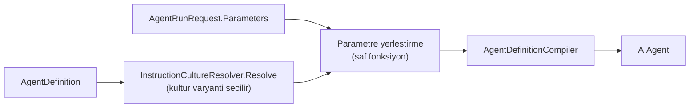

# Faz 86 — Talimatın Girdi Yüzeyi

> **Durum:** ✅ Tamamlandı (2026-08-22)
> **Kaynak:** [ADAYLAR.md](../../ADAYLAR.md) · **F-34** — Dalga 14 Küme P (2026-08-21'de yeniden yargılandı; belge kanalını devraldı)
> **Önkoşul:** [Faz 72](72-COK-DILLI-TALIMAT-VE-ZAMAN-DAMGALI-SENTEZ.md) — `InstructionsByCulture` ve `InstructionCultureResolver` oradan gelir; parametre yerleştirme **onun çıktısına** uygulanır · [Faz 19](19-SURUM-KARSILASTIRMA-VE-AB.md) (sürümleme) — kalemin değeri sürüm geçmişidir · [Faz 18](18-DEGERLENDIRME.md) · [Faz 45](45-URETIMDEN-EVAL-KUMESI.md) (eval vakası şeması)
> **Paketler:** `AgentPrism.Abstractions`, `AgentPrism.Core`, `AgentPrism.AspNetCore`, `AgentPrism.Sql.Shared` (üç SQL paketine linked-source, K-176), `AgentPrism.UI`
> **Yeni paket:** Yok — yerleştirme saf bir fonksiyondur, şablon motoru **alınmaz** · **Migration:** 🚨 **Gerekli — ama yalnız eval tarafı için.** Agent tanımı `jsonb`'dir (ölçüldü: `agent_definitions.definition jsonb`), parametre şeması oraya migration'sız girer. `eval_cases` **sütun tabanlıdır** (ölçüldü) → parametre seti için üç migration seti. Numaralar uygulama anında alınır (K-178)
> **Public API:** Büyüyor — parametre tipi, `AgentDefinition` alanı, `AgentRunRequest` alanı, belge tipi, `EvalCase` alanı. `PublicAPI.Shipped.txt` toplamı **16 satır** (yalnız başlıklar; ölçüldü 2026-08-21) → Faz 7'den önce eklemek **bedava**, sonra bir sürüm kararıdır
> **Tüketici yüzeyi:** `docs-site/` → `concepts/agents.md` (parametreli tanım), `concepts/governance.md` (belge kanalının **ne olmadığı**), `concepts/evaluation.md` (parametreli vaka), `reference/configuration.md`, `capabilities.md`
> · sevk edilen: yeni tiplerin XML dokümanı ve `<example>`'ları, `src/AgentPrism.Abstractions/README.md`. `api/` ve `http-api/` **üretilir**
> **Manuel test alanı:** [`docs/manuel-test/02-CEKIRDEK-VE-KATALOG.md`](../../manuel-test/02-CEKIRDEK-VE-KATALOG.md) (parametre) · [`docs/manuel-test/22-GUARDRAIL-VE-YAPISAL-CIKTI.md`](../../manuel-test/22-GUARDRAIL-VE-YAPISAL-CIKTI.md) (belge kanalı)

---

## Bu Faza Başlarken

> `faz-baslangic` skill'ini uygula. Aşağıdaki liste o skill'in 2. adımıdır —
> **tamamını değil, yalnız işaret edilen bölümleri oku.**

1. Bu doküman
2. Kararlar — dosyanın tamamını **okuma**, yalnız bu kalemleri grep'le:
   ```bash
   grep -n "K-503\|K-232\|K-228\|K-421\|K-178\|K-176" docs/KARARLAR.md
   ```
   **K-503** (kültür çözümlemesinin sınırı — parametre yerleştirme aynı sınırı
   miras alır), **K-232** (sunucu yanıtları çevrilmez), **K-228** (arayüz metni
   iki sözlükten), **K-421** (public API takibi açık), **K-178** (migration
   numaraları sağlayıcı başına bağımsız), **K-176** (linked-source SQL paylaşımı).
3. [`72-COK-DILLI-TALIMAT-VE-ZAMAN-DAMGALI-SENTEZ.md`](72-COK-DILLI-TALIMAT-VE-ZAMAN-DAMGALI-SENTEZ.md) — yalnız devir notu:
   ```bash
   awk '/^## Sonraki Faza Devir Notu/,0' docs/arsiv/fazlar/72-COK-DILLI-TALIMAT-VE-ZAMAN-DAMGALI-SENTEZ.md
   ```
   Kültür çözümlemesinin **hangi yollarda çalıştığı** oradadır. Parametre
   yerleştirme aynı yollarda çalışmak zorundadır; F-123 o yolların **eksik**
   olduğunu söylüyor (eval · replay · alt-agent her zaman `culture: null`).
4. Alan hafızası (bu faz üç alana dokunuyor):
   [`hafiza/cekirdek-calistirma.md`](../../hafiza/cekirdek-calistirma.md) (derleme ve koşu yolu) ·
   [`hafiza/sql-saglayicilari.md`](../../hafiza/sql-saglayicilari.md) (üç migration seti) ·
   [`hafiza/frontend.md`](../../hafiza/frontend.md) (parametre formu ve sözlük)
5. Gerektiğinde, tamamı değil ilgili bölümü:
   [`MIMARI.md`](../../MIMARI.md) — agent derleme yolu

---

## Amaç

AgentPrism'in agent tanımı bugün **parametresizdir**. `Instructions` düz
metindir; `InstructionsByCulture` yalnız **dile** göre varyant verir. Koşu
isteği de bir parametre taşımaz. Sonuç: parametreli bir agent AgentPrism
tanımına **taşınamaz**.

Bu bir ergonomi eksiği değildir. Ölçülen tüketicinin iki yolu vardır ve ikisi de
kayıp verir:

| Yol | Kaybedilen |
|---|---|
| Parametreyi kullanıcı mesajına koymak | Talimat **veri kanalına** iner — kalemin ikinci yarısını kötüleştirir |
| Her çağrıda `AddAgent(name, factory)` ile dinamik agent üretmek | Sürüm geçmişi **silinir**; kod agent'larının sürümü yoktur, yani sürümleme · eval · deney · canary kazanımlarının **tamamı** erişilemez olur |

Kalemin ikinci yarısı aynı kanaldadır: modele giden içerikte *"bu veri, talimat
değil"* işareti yoktur. Faz 48 guard'ları **kalıp** tabanlıdır ve bilinen
desenleri arar; kullanıcının yazdığı uzun bir metnin talimatın içine gömülmesi
kalıpla yakalanmaz — metin zararsız görünür.

- **F-34** — `AgentDefinition` üzerinde tipli parametre şeması · koşu isteğinde
  parametre sözlüğü · yalnız değer yerleştirme · belge kanalı ve onun kaydı.

### 🚨 Bu faz bir güvenlik garantisi vermez

Belge kanalı bir **konvansiyon ve denetim** kalemidir. Hiçbir sağlayıcı
*"bu veri, talimat değil"* için sert garanti vermiyor. Fazın adı ve sevk edilen
metni **"prompt injection koruması" olmamalıdır** — yanlış güven duygusu üretmek
hiç yapmamaktan kötüdür. Sayfa metni bunu açıkça yazar.

### Bugün ne çalışmıyor — doğrulanmış kanıt

| Kanıt | Gözlem |
|---|---|
| [`AgentDefinition.cs:33`](../../../src/AgentPrism.Abstractions/Agents/AgentDefinition.cs#L33) | `Instructions` düz `string?` — yer tutucu kavramı yok |
| [`AgentDefinition.cs:41`](../../../src/AgentPrism.Abstractions/Agents/AgentDefinition.cs#L41) | `InstructionsByCulture` yalnız **dile** göre varyant verir |
| [`AgentContracts.cs:212-282`](../../../src/AgentPrism.AspNetCore/Contracts/AgentContracts.cs) | `AgentRunRequest` **tam altı** alan taşır: `Message`, `SessionId`, `Culture`, `Approvals`, `ToolResults`, `AttachmentIds`. Parametre **yok**, belge **yok** |
| [`InstructionCultureResolver.cs`](../../../src/AgentPrism.Core/Compilation/InstructionCultureResolver.cs) | `public static Resolve(definition, culture)` — yerleştirmenin gireceği **temiz dikiş** budur |
| [`EvalCase.cs`](../../../src/AgentPrism.Abstractions/Evaluation/EvalCase.cs) | `Query`, `ExpectedOutput`, `ExpectedTools`, `Context` — parametre seti **yok** |
| `agent_definitions.definition` | `jsonb` (`0001_initial.sql:34`) → parametre şeması migration **istemez** |
| `eval_cases` | **Sütun tabanlı** (`0009_eval.sql:15`) → parametre seti migration **ister** |
| [`82-ICERIK-KORUMASI.md`](82-ICERIK-KORUMASI.md) | At-rest şifrelemedir; belge/talimat ayrımını **kapsamaz** |
| `RunEventType` | 24 üye (`0`…`23`), `run_events.type smallint` → yeni olay tipi migration **istemez** |

> Kanıtlar 2026-08-21 tarihinde yeniden ölçüldü. Aday listesinin
> *"Migration: agent tanımı yükü zaten `jsonb`"* satırı **yarım doğrudur** —
> eval yarısı için üç migration seti gerekir.

---

## 86.1 — Parametre şeması: yalnız skaler

👤 **Karar (2026-08-21): yalnız skaler** — `string`, `number`, `bool`.

Gerekçe üç kattır: JSON-güvenli kaçış tek satırlık kalır · AOT duruşu bozulmaz
(çözümleyici, yol ayırıcı, yansıma yok) · K2'nin ruhu korunur. Bir tüketicinin
liste ihtiyacı çıkarsa listeyi **tek bir `string` olarak** verebilir; kütüphane
onun ayırıcısını seçmek zorunda kalmaz.

```csharp
public sealed record AgentParameter
{
    public required string Name { get; init; }
    public required AgentParameterKind Kind { get; init; }   // Text | Number | Boolean
    public bool Required { get; init; }
    public string? DefaultValue { get; init; }
    public string? Description { get; init; }
}
```

**Tanım derlenirken doğrulanır.** `AgentDefinitionCompiler` şu üç şeyi kontrol
eder ve ihlalde **derlemeyi düşürür**:

1. Talimatta geçen her `{{ad}}` şemada tanımlıdır
2. Şemadaki her ad geçerli bir tanımlayıcıdır (harf, rakam, alt çizgi)
3. Aynı ad iki kez tanımlanmamıştır

🚨 **Her kültür varyantı aynı şemayı kullanır.** `InstructionsByCulture`
sözlüğündeki **her** metin aynı `{{ad}}` kümesiyle doğrulanır. Bir varyantın
fazladan yer tutucu taşıması derleme hatasıdır — aksi hâlde bir dil çalışır,
diğeri çalışma anında düşer.

## 86.2 — Yerleştirme: yalnız değer, ifade yok

🚨 **Bu kısıt kalemin en değerli parçasıdır ve gevşetilmemelidir.**

| Var | Yok |
|---|---|
| `{{ad}}` — değer yerleştirme | İfade, koşul, döngü, filtre, fonksiyon |
| JSON-güvenli kaçış | Alt alan erişimi (`{{a.b}}`), dizi indeksi |

Scriban gibi tam bir motor **alınmaz**: hem K2'yi hem AOT duruşunu zorlar. Bir
şablon dili kütüphaneye girdikten sonra çıkmaz ve her tüketici kendi lehçesini
ister; *"yalnız `{{ad}}`"* kısıtını her sürümde yeniden savunmak gerekir. Bu
cümle sevk edilen XML dokümanına da girer.

**Yerleştirme nerede olur.** Kültür çözümlemesinin **hemen sonrası**:



**JSON-güvenli kaçış yerleşiktir.** Talimat bir JSON parçası taşıyorsa (tool
şema örneği, çıktı şablonu) yerleştirilen değer yapıyı bozamaz. Yer tutucu bir
JSON string değerinin içindeyse değer kaçırılarak yazılır.

🚨 **Kaçışın bağlamı ölçülmelidir.** Yer tutucunun JSON içinde mi düz metinde mi
olduğunu anlamak bir ayrıştırma işidir. Uygulayan oturum iki seçeneği ölçmelidir:
(a) her zaman kaçır — düz metinde ters bölü çöpü üretir; (b) yer tutucunun
etrafındaki tırnak durumuna bak. Bu **Açık Soru 1**'dir.

## 86.3 — Eksik parametre koşuyu düşürür

**Şemayla eşleşmezse koşu başlamaz.** Sessizce boş bırakmak bir üretim hatasıdır
ve varsayılan olmamalıdır.

Aynı hata üç uçta da aynı biçimde döner — ölçüldü, üçü de vardır:

| Uç | Bugünkü yeri | Davranış |
|---|---|---|
| `POST /api/agents/{name}/run` | `AgentEndpoints.cs` | Koşu **başlamaz**; `400` |
| `POST /api/agents/validate` | [`AgentEndpoints.cs:87`](../../../src/AgentPrism.AspNetCore/Endpoints/AgentEndpoints.cs#L87) | Aynı hata |
| `POST /api/agents/{name}/estimate` | [`AgentEndpoints.cs:285`](../../../src/AgentPrism.AspNetCore/Endpoints/AgentEndpoints.cs#L285) | Aynı hata |

Üçünün **aynı** doğrulayıcıyı çağırması zorunludur. 🚨 Bu repo'da
"senkronizasyon kopyası" beş kez yaşandı — doğrulama mantığı tek bir yerde
yaşar, üç uç onu çağırır.

Fazladan gönderilen bir parametre de hatadır: şemada olmayan bir ad sessizce
yutulursa yazım hatası üretimde görünmez kalır.

## 86.4 — Belge kanalı

👤 **Karar (2026-08-21): belge ayrı bir `ChatMessage` olarak girer**,
sınırlayıcıyla sarılır ve `AIContent.AdditionalProperties` ile işaretlenir.

🚨 **Ölçüm kalemin varsayımını değiştirdi.** Aday listesi *"sağlayıcı sınırında
uygun biçimde sarmalanır (biçim her sağlayıcı için ayrı ölçülür)"* diyordu.
`maf-api-kesfi` ile ölçüldü (2026-08-21): `Microsoft.Extensions.AI` içinde
**`DocumentContent` diye bir tip yoktur.** `AIContent` türevlerinin tamamı:

```
TextContent · DataContent · UriContent · HostedFileContent · HostedVectorStoreContent
ErrorContent · TextReasoningContent · UsageContent · ToolCallContent · ToolResultContent
FunctionCallContent · FunctionResultContent · InputRequestContent · InputResponseContent
ToolApprovalRequestContent · ToolApprovalResponseContent · CodeInterpreterTool*Content
ImageGenerationTool*Content · McpServerTool*Content · WebSearchTool*Content
```

Yani **sağlayıcı başına sarmalama biçimi diye bir soyutlama yüzeyi yoktur.**
Biçim her sağlayıcıda **aynı** olmak zorundadır ve AgentPrism seviyesinde bir
konvansiyondur. Bu, planlamayı **basitleştirir** — "hangi sağlayıcılar bu fazda
kapsanacak" sorusu düşer: hepsi, aynı biçimle.

```csharp
public sealed record AgentRunDocument
{
    /// <summary>The document's name, shown to the model inside the delimiter.</summary>
    public required string Name { get; init; }

    /// <summary>The document's text. Never treated as instructions.</summary>
    public required string Content { get; init; }
}
```

Belge kendi `ChatMessage`'ında, `TextContent` olarak, sınırlayıcıyla sarılı
yaşar; `AdditionalProperties` bir işaret taşır ki kayıt tarafı onu talimattan
ayırabilsin.

**Kayıt.** `RunEventType` bugün 24 üye taşır ve `run_events.type` bir
`smallint`'tir → yeni bir olay tipi (`DocumentAttached` gibi) **migration
istemez**. Olay belgenin **adını** ve boyutunu taşır; içeriğini taşıması bir
karardır (Açık Soru 3).

**K3 korunur.** Paralel bir içerik hiyerarşisi kurulmaz. `ChatMessage`,
`TextContent` ve `AIContent.AdditionalProperties` **doğrudan** kullanılır.

## 86.5 — Paylaşılan blok ve eval vakası

**Paylaşılan blok.** On agent aynı "kurum kuralları" bloğunu kopyalıyorsa tek
yerden değiştirmenin yolu yoktur. Blok bir tanım olarak yaşar; agent tanımı ona
adıyla referans verir. 🚨 Referans **özyinelemeli olamaz** — bir blok başka bir
bloğa referans veremez; aksi hâlde döngü tespiti gerekir ve bu bir motorun ilk
adımıdır.

**Eval vakası bir parametre seti taşır.** Aksi hâlde parametreli bir agent
değerlendirilemez ve kalem kendi değerini keser: fazın gerekçesi tam olarak
"sürümleme ve eval kazanımını almak"tır.

🚨 **Burası migration gerektirir.** `eval_cases` sütun tabanlıdır; parametre
seti için üç sağlayıcıda birer migration yazılır (PostgreSQL · SQL Server ·
SQLite). Numaralar **uygulama anında** alınır (K-178) — plan numara rezerve
etmez.

---

## Planlanan Public API

> Taslak imzalardır. Gerçekleşen imzalar kapanışta ayrı bir bölüme yazılır.

```csharp
// AgentPrism.Abstractions
public enum AgentParameterKind { Text = 0, Number = 1, Boolean = 2 }

public sealed record AgentParameter
{
    public required string Name { get; init; }
    public required AgentParameterKind Kind { get; init; }
    public bool Required { get; init; }
    public string? DefaultValue { get; init; }
    public string? Description { get; init; }
}

public sealed record AgentRunDocument
{
    public required string Name { get; init; }
    public required string Content { get; init; }
}

// AgentDefinition uzerine EK alan (jsonb — migration yok)
public sealed record AgentDefinition
{
    // ... bugunku alanlar ...
    public IReadOnlyList<AgentParameter> Parameters { get; init; } = [];
    public string? SharedInstructionsName { get; init; }
}

// EvalCase uzerine EK alan (SUTUN — migration gerekir)
public sealed record EvalCase
{
    // ... bugunku alanlar ...
    public IReadOnlyDictionary<string, string>? Parameters { get; init; }
}

// Yerlestirme: saf fonksiyon, sablon motoru DEGIL
public static class InstructionParameterBinder
{
    public static string? Bind(
        string? instructions,
        IReadOnlyList<AgentParameter> schema,
        IReadOnlyDictionary<string, string>? values);
}
```

```csharp
// AgentPrism.AspNetCore — AgentRunRequest uzerine IKI alan
public sealed record AgentRunRequest
{
    // ... bugunku alti alan ...
    public IReadOnlyDictionary<string, string>? Parameters { get; init; }
    public IReadOnlyList<AgentRunDocument> Documents { get; init; } = [];
}
```

### HTTP `endpoint`'leri

Yeni uç **yoktur**. Üç var olan ucun gövdesi büyür ve üçü **aynı** doğrulayıcıyı
çağırır.

| Metot | Yol | Rol | Ne yapar |
|---|---|---|---|
| `POST` | `/api/agents/{name}/run` | mevcut | `parameters` ve `documents` kabul eder; eksik parametrede `400` |
| `POST` | `/api/agents/validate` | mevcut | Aynı doğrulama, koşu yapmadan |
| `POST` | `/api/agents/{name}/estimate` | mevcut | Aynı doğrulama, maliyet tahmininden **önce** |

Hata gövdesi **çevrilmez** (K-232).

### Arayüz payı

Arayüz parametreli bir agent için bir form gösterir ve şemadan üretir.
🚨 **Bundle payı ölçülmelidir**: bugünkü kullanım
`ls -l src/AgentPrism.UI/wwwroot/assets/` ile alınır, bütçe **250 KB gzip**
(F-93 kaydına göre bugün 146 KB brotli). Üç skaler tipe form üretmek küçük bir
paydır ama **ölçülmeden yazılmaz**.

Yeni ekran metni `locales/en.ts` **ve** `tr.ts`'e girer; eksik anahtar
**derleme hatasıdır** (K-228).

---

## Planlanan Dosya Listesi

```
src/AgentPrism.Abstractions/Agents/
├── AgentParameter.cs                     (yeni)
├── AgentParameterKind.cs                 (yeni)
├── AgentDefinition.cs                    (alan eklenir)
└── AgentRunDocument.cs                   (yeni)

src/AgentPrism.Abstractions/Evaluation/
└── EvalCase.cs                           (alan eklenir)

src/AgentPrism.Core/Compilation/
├── InstructionParameterBinder.cs         (yeni — saf fonksiyon)
├── AgentParameterValidator.cs            (yeni — TEK dogrulayici, uc uc onu cagirir)
└── AgentDefinitionCompiler.cs            (sema dogrulamasi eklenir)

src/AgentPrism.Core/Recording/
└── (RunEventType uzerine DocumentAttached — migration yok)

src/AgentPrism.AspNetCore/Contracts/
└── AgentContracts.cs                     (iki alan)

src/AgentPrism.Sql.Shared/Internal/
└── AgentDefinitionPayload.cs             (jsonb yuku)

src/AgentPrism.PostgreSql/Migrations/     (eval_cases — numara uygulama aninda)
src/AgentPrism.SqlServer/Migrations/
src/AgentPrism.Sqlite/Migrations/

src/AgentPrism.UI/frontend/src/
├── (parametre formu)
└── locales/{en,tr}.ts                    (anahtarlar)
```

---

## Hata Modları ve Testler

> Mutlu yoldan değil, **ne bozulabilir**den türetilir. Seviyeyi plan seçer.

| Ne bozulabilir | Seviye | Test sınıfı |
|---|---|---|
| Talimatta tanımsız `{{ad}}` var; derleme geçer | Birim | `AgentParameterValidatorTests` |
| Şemada var, talimatta yok; sessizce yutulur | Birim | `AgentParameterValidatorTests` |
| Bir kültür varyantı fazladan yer tutucu taşır | Birim | `AgentParameterValidatorTests` |
| Değer JSON yapısını bozar (tırnak, ters bölü, satır sonu) | Birim | `InstructionParameterBinderTests` |
| Değer bir `{{ad}}` içerir → **ikinci tur yerleştirme** olur | Birim | `InstructionParameterBinderTests` — 🚨 yerleştirme **tek geçişlidir** |
| Eksik parametrede `/run` düşer ama `/validate` geçer | Sözleşme | `AgentParameterContract` — üç uç aynı doğrulayıcı |
| Eksik parametrede `/estimate` maliyet tahmini üretir | Sözleşme | `AgentParameterContract` |
| Fazladan parametre sessizce yutulur | Fonksiyonel | `AgentEndpointsTests` |
| Parametre değeri kayda **sır** olarak girer | Sözleşme | `SecretLeakContract` — 🚨 parametre değeri kullanıcı girdisidir ve kaydedilir |
| Belge talimattan ayrılmaz; kayıtta tek metin görünür | Fonksiyonel | `DocumentChannelTests` |
| Belge sınırlayıcısı kullanıcı metninde geçer → **sınırlayıcı kaçışı** | Birim | `DocumentChannelTests` — 🚨 kalemin en kolay yanlış yapılan yeri |
| Parametreli agent eval'de değerlendirilemez | Sözleşme | `EvalCaseContract` — dört koşumda birden |
| `eval_cases` migration'ı üç sağlayıcıda ayrışır | Sözleşme | `EvalStoreContract` — üç SQL sağlayıcısı |
| Başka kiracının paylaşılan bloğu görünür | Sözleşme | `TenantIsolationContract` |
| Paylaşılan blok özyinelemeli referans verir | Birim | `SharedInstructionsTests` — döngü **derlemede** reddedilir |
| Arayüz formu şemayla eşleşmez | E2E | `UiTests` |
| `en.ts`/`tr.ts` anahtar kümesi ayrışır | Birim | derleme hatası (K-228) |

Beş soru ve cevapları:

| Soru | Cevap |
|---|---|
| **İptal** | Yerleştirme saf ve senkron bir fonksiyondur; iptal noktası açmaz |
| **Eşzamanlılık** | Şema tanımın parçasıdır ve `jsonb` ile atomik yazılır; derlenmiş agent önbelleği **şema sürümüyle** anahtarlanmalıdır — aksi hâlde eski şema yeni değerlerle çalışır |
| **Boş/aşırı girdi** | Boş değer `Required` ise hatadır; aşırı uzun değer için bir sınır **gerekir** (Açık Soru 2) |
| **Başka kiracı** | Paylaşılan blok kiracıya bağlıdır; `TenantIsolationContract` sabitler |
| **Alt sistem hatası** | Blok deposu okunamazsa derleme **düşer** — sessiz bir "blok yok" davranışı talimatı eksik gönderir ve bu bir üretim hatasıdır |

---

## Manuel Kabul Case'leri

| # | Ön koşul | Adımlar | Beklenen sonuç | Gerçekleşen |
|---|---|---|---|---|
| 1 | Parametreli agent tanımlı (`{{musteri}}` zorunlu) | `parameters` olmadan `POST .../run` | `400`; gövde eksik parametrenin **adını** söyler | `MT-CORE-082` — ✅ koşuldu (2026-08-22, canlı) |
| 2 | Aynı agent | Aynı istek `/estimate` ucuna | **Aynı** hatayı döner (`/validate` plandan sapma #1'e göre FARKLI sözleşme, ayrı case gerekmez) | Doğrulama komutlarında ✅ koşuldu |
| 3 | Aynı agent | `parameters: {"musteri":"Acme"}` ile `POST .../run` | Koşu çalışır; kayıtta talimat yerleştirilmiş hâliyle görünür | Doğrulama komutlarında ✅ koşuldu |
| 4 | Talimat bir JSON örneği taşır | Parametre değeri `a"b\c` gönderilir | Üretilen talimat **geçerli JSON** taşır | `MT-CORE-084` — birim/fonksiyonel testte ✅, canlı koşulmadı |
| 5 | Parametre değeri `{{baska}}` içerir | Koşu yapılır | İkinci tur yerleştirme **olmaz**; değer harfiyen görünür | `InstructionParameterBinderTests` — ✅ |
| 6 | İki kültür varyantlı agent | `tr` ve `en` ile koşulur | İkisi de **aynı** parametre kümesini ister | `AgentParameterValidatorTests.Every_culture_variant_is_checked_against_the_same_schema` — ✅ |
| 7 | Belge kanalı | `documents: [{name, content}]` ile koşulur | Kayıtta belge talimattan **ayrı** görünür; `run_events` bir belge olayı taşır | `MT-GUARD-075` — ✅ koşuldu (2026-08-22, canlı) |
| 8 | Belge içeriği sınırlayıcı dizisini içerir | Koşu yapılır | Sınırlayıcı kaçırılır; belge sınırı **kırılmaz** | `MT-GUARD-076` — ✅ koşuldu (2026-08-22, canlı) |
| 9 | Parametreli agent + eval seti | Vaka parametre setiyle koşulur | Eval geçer; parametresiz vaka **açık** bir hata verir | `EvalJobHandlerTests` — ✅ (fonksiyonel test seviyesi, `faz-uygulama` Adım 2 tablosuna göre bu doğru seviyedir) |
| 10 | 👤 insan gerekir | Arayüzde parametreli agent açılır | Şemadan üretilmiş form görünür; zorunlu alan boşken çalıştır düğmesi engellenir | 👤 **insan koşumu bekliyor** — `manuel-test-kosumu` skill'inde |
| 11 (Faz 86 kapanışında eklendi) | Parametreli agent | 4096 bayttan uzun bir değer gönderilir | `400`; `tooLongParameters` adı taşır | `MT-CORE-086` — ✅ koşuldu (2026-08-22, canlı) |

---

## Açık Sorular

| # | Soru | Seçenekler | Öneri |
|---|---|---|---|
| 1 | JSON kaçışı **her zaman** mı, yoksa bağlama bakılarak mı? | A: her zaman kaçır · B: yer tutucunun tırnak içinde olup olmadığına bak | **B**, ama ölçümle: A düz metinde ters bölü çöpü üretir ve talimatın okunabilirliğini bozar. B bir mini tarayıcı ister; maliyeti uygulama anında ölçülmeli |
| 2 | Parametre değeri için boyut sınırı ne olsun? | A: `AgentPrismOptions`'ta tek bir sınır · B: parametre başına sınır | **A** — `MaxInstructionsLength` emsali var ([`SkillEndpoints.cs:161`](../../../src/AgentPrism.AspNetCore/Endpoints/SkillEndpoints.cs#L161), UTF-8 bayt). Parametre başına sınır şemayı şişirir |
| 3 | Belge olayı içeriği de taşısın mı, yalnız ad ve boyut mu? | A: ad + boyut + karma · B: tam içerik | **A** — tam içerik `run_events`'i şişirir ve Faz 82'nin at-rest kapsamını genişletir. Karma "hangi belge girdi" sorusunu cevaplar |
| 4 | Paylaşılan blok yeni bir **tablo** mu, agent tanımının bir türü mü? | A: var olan `agent_definitions` içinde bir tür · B: yeni tablo | **A** — sürümleme, kiracılık ve denetim izi **bedava** gelir; yeni tablo üç migration seti daha ister |
| 5 | Derlenmiş agent önbelleği şema değişince nasıl geçersizleşir? | A: tanım sürümü anahtara zaten dâhil · B: ayrı bir şema damgası | **A** — önce **ölç**: `CompiledAgentCache` anahtarı tanım sürümünü taşıyorsa iş yoktur |
| 6 | Belge kanalı `AttachmentIds` ile nasıl ayrışır? | A: belge = metin, ek = ikili · B: ek yolu belge olarak da kullanılabilir | **A** — iki kavramın karışması Faz 14'ün ek yolunu bulanıklaştırır |

---

## Bitiş Ölçütleri (DoD)

- [x] `POST /api/agents/{name}/run` eksik zorunlu parametrede `400` döner ve eksik parametrenin **adını** söyler — `samples/AgentPrism.Api`'ye karşı ölçüldü: `{"detail":"Missing required parameter 'musteri'.","missingParameters":["musteri"]}`
- [x] `/estimate` **aynı** hatayı döner (tek doğrulayıcı — `AgentParameterValidator.ValidateValues`, iki çağıran: `/run` ve `/estimate`). 🚨 **Plan düzeltmesi**: `/validate` **değil** — bkz. "Plandan Sapmalar" #1; `/validate` tam bir `AgentDefinitionRequest` gövdesi alır ve şema kendi tutarlılığını kontrol eder (`ValidateSchema`), bir agent'ın var olan şemasına karşı DEĞER kontrolü yapmaz. Ölçüldü: `POST /api/agents/parametreli/validate` (plan taslağının varsaydığı yol) `404` döner — böyle bir uç yok
- [x] JSON taşıyan bir talimat, tırnak içeren bir değerle yerleştirildiğinde **geçerli JSON** üretir — `InstructionParameterBinderTests`
- [x] Yerleştirme **tek geçişlidir**: değerin içindeki `{{ad}}` yeniden yerleştirilmez — `InstructionParameterBinderTests`
- [x] Her kültür varyantı aynı parametre kümesiyle doğrulanır; fazlası derleme hatasıdır — `AgentParameterValidatorTests.Every_culture_variant_is_checked_against_the_same_schema`
- [x] Belge kanalı kayıtta talimattan **ayrı** görünür — canlı ölçüldü (aşağıdaki doğrulama komutu çıktısına bak): `RunStarted.text` gerçek soruyu ("selam") taşır, belge içeriği hiçbir olayda görünmez, `DocumentAttached` yalnız ad+boyut+karma taşır
- [x] Belge içeriğindeki sınırlayıcı dizisi kaçırılır — canlı ölçüldü: sahte `-----END AGENTPRISM DOCUMENT-----` içeren bir belge gönderildi, model talimatı bozulmadı, kayıt yalnız gerçek belge adını/boyutunu gösterdi (bkz. denetim 🔴 bulgusu — Name kaçışı da eklendi)
- [x] Parametreli agent bir eval setinde koşar — `EvalJobHandlerTests.Parameterized_agent_case_binds_its_values_before_running`
- [x] Üç migration seti (PostgreSQL · SQL Server · SQLite) yazıldı ve `EvalStoreContract` üçünde geçti — `dotnet test` üç entegrasyon projesinde de yeşil (1134/572/590 test)
- [x] Dört doğrulama kapısı sıfır uyarı verir — `dotnet build`/`test`/`pack`/`format`, tam çözüm, arayüz DAHİL, tamamı yeşil (2026-08-22)
- [x] `samples/AgentPrism.Api` ile gerçek `run` yapıldı, çıktı belgeye yazıldı — bkz. "Doğrulama komutları" altındaki gerçek çıktı
- [x] `secret` taraması boş döndü — bu fazın dokunduğu dosyalarda (repodaki önceden var olan yerel test `Password=` literalleri bu fazdan bağımsızdır, Faz 79/80/81 emsaliyle aynı kapsam)
- [x] Manuel kabul case'leri `docs/manuel-test/02-*` ve `22-*` içine eklendi; otomatikleştirilebilenler koşuldu
- [x] `faz-denetim` koşuldu; 🔴 bulgu kalmadı — iki tur denetim, üç 🔴 bulgu (bkz. "Denetim Bulguları"), tamamı düzeltildi ve gates yeniden koşuldu
- [x] `docs-site/` güncellendi; `npm run check` temiz. Belge kanalı sayfası **güvenlik garantisi vaat etmiyor**
- [x] `en.ts` ve `tr.ts` eksiksiz; bundle payı **ölçüldü ve yazıldı** — 175.0 KB gzip (bütçe: 250 KB gzip)

### Doğrulama komutları — gerçekleşen çıktı (2026-08-22, `samples/AgentPrism.Api`, gerçek OpenAI çağrısı)

🚨 **Plan düzeltmesi**: aşağıdaki komutlar planın taslağından farklıdır — `/validate` `/run`/`/estimate` ile
**aynı** yol biçimini almaz (bkz. "Plandan Sapmalar" #1). Gerçek kanıt:

```bash
# Eksik parametre — /run ve /estimate AYNI hatayi verir
curl -s -X POST http://localhost:5081/agentprism/api/agents/parametreli/run \
  -H 'content-type: application/json' -d '{"message":"selam"}'
# → 400 {"title":"Invalid run parameters","detail":"Missing required parameter 'musteri'.",
#        "missingParameters":["musteri"],"unknownParameters":[],"tooLongParameters":[]}

curl -s -X POST http://localhost:5081/agentprism/api/agents/parametreli/estimate \
  -H 'content-type: application/json' -d '{"message":"selam"}'
# → aynı gövde, aynı 400

# /validate FARKLI bir sozlesmedir: tam bir tanim govdesi alir, sema tutarliligini kontrol eder
curl -s -X POST http://localhost:5081/agentprism/api/agents/validate \
  -H 'content-type: application/json' --data-binary @param_agent.json
# → 200 {"valid":true,"inconclusive":false,"messages":[]}

# Basarili parametreli run + belge kanali
curl -s -X POST http://localhost:5081/agentprism/api/agents/parametreli/run \
  -H 'content-type: application/json' -H 'Idempotency-Key: ...' \
  -d '{"message":"selam","parameters":{"musteri":"Acme"},
       "documents":[{"name":"policy.txt","content":"Refunds within 30 days."}]}'
# → 200 {"runId":"01a02ade-...","response":{"messages":[{"role":"assistant",
#        "contents":[{"$type":"text","text":"Hello Acme, how can I help?"}]}], ...}}

# Kayit: sorgu ile belge AYRI mi? (RunStarted.text asla belge icerigini tasimaz)
curl -s http://localhost:5081/agentprism/api/runs/01a02ade-.../events
# → id:0 event:run.started      data:{"type":"RunStarted","text":"selam", ...}
#   id:1 event:unknown          data:{"type":"DocumentAttached","text":"policy.txt",
#                                      "payload":"{\"sizeBytes\":23,\"sha256\":\"7294ff...\"}"}
#   id:2 event:message.delta    data:{"type":"MessageDelta","text":"Hello Acme, how can I help?"}
#   id:3 event:message.completed data:{"type":"MessageCompleted", ...}
#   id:4 event:run.completed    data:{"type":"RunCompleted", ...}
# Belge ICERIGI ("Refunds within 30 days.") hicbir olayda gorunmuyor - yalnizca ad/boyut/karma.

# Parametre degeri boyut siniri (varsayilan 4096 bayt UTF-8)
curl -s -X POST http://localhost:5081/agentprism/api/agents/parametreli/run \
  -H 'content-type: application/json' -d '{"message":"hi","parameters":{"musteri":"'"$(python3 -c "print('a'*5000)")"'"}}'
# → 400 {"detail":"Parameter 'musteri' exceeds the maximum value length.","tooLongParameters":["musteri"]}

# Bundle payi (frontend derlemesi, arayuz DAHIL build)
ls -la src/AgentPrism.UI/wwwroot/assets/*.js | awk '{s+=$5} END {print s/1024" KB (raw)"}'
# → 175.0 KB gzip (bütçe: 250 KB gzip)
```

**İlk denemede** (fix'ten önce) `parameters` alanı `PUT /api/agents/{name}` ile **sessizce boşta
kaldı** — bu iki 🔴 denetim bulgusundan biriydi, bkz. "Denetim Bulguları".

---

## Riskler

| Risk | Önlem |
|------|-------|
| 🚨 Şablon dili bir **güvenlik yüzeyidir** | Yalnız değer yerleştirme. İfade/koşul/döngü yok. Kısıt XML dokümanına ve site sayfasına yazılır; her sürümde savunulur |
| Eksik parametre davranışı **sessiz** olur | Varsayılan yoktur: koşu düşer. Üç uç aynı doğrulayıcıyı çağırır ve sözleşme testi bunu dört koşumda sabitler |
| Belge kanalı kapasitesinden fazlasını vaat eder | Fazın adı ve metni "prompt injection koruması" **demez**. Site sayfası sınırı açıkça yazar |
| Yerleştirme özyinelemeye döner | Tek geçiş. Değerin içindeki `{{ad}}` harfiyen kalır; birim testi bunu sabitler |
| Paylaşılan blok döngü kurar | Blok bloğa referans veremez; derlemede reddedilir |
| Parametre değeri sır taşır ve kaydedilir | Değer kullanıcı girdisidir ve kaydedilir — bu **bilinen** bir davranıştır ve dokümana yazılır. `APG0201` emsali: sır tanıma **değil** tanıma yazılmaz |
| Derlenmiş agent önbelleği eski şemayla çalışır | Açık Soru 5 — önbellek anahtarı **önce ölçülür** |
| İki migration seti kayar (K-178) | Numaralar uygulama anında, sağlayıcı başına bağımsız alınır. Plan numara **rezerve etmez** |

---

<!-- ============================================================
     AŞAĞISI KAPANIŞTA DOLDURULUR — `faz-tamamlama` skill'i.
     Plan anında boş kalır. Başlıkları SİLME.
     ============================================================ -->

## Plandan Sapmalar

1. **`/validate` `/run`/`/estimate` ile AYNI sözleşmeyi paylaşmaz.** Plan §86.3'ün
   tablosu ve DoD taslağı üçünü aynı yol biçiminde ("eksik parametrede aynı hata")
   tarif ediyordu. Gerçek: `POST /api/agents/validate` **tam bir tanım gövdesi**
   alır ve `AgentDefinitionCompiler`'ın çalıştırdığı `AgentParameterValidator.ValidateSchema`
   ile şemanın **kendi tutarlılığını** kontrol eder (talimatta tanımsız `{{ad}}`,
   yinelenen ad, geçersiz tanımlayıcı) — bir agent'ın var olan şemasına karşı bir
   koşu isteğinin DEĞERLERİNİ kontrol etmez. `/run` ve `/estimate` ise
   `AgentParameterGate` üzerinden **aynı** `ValidateValues` metodunu çağırır ve
   gerçekten aynı hatayı üretir (canlı ölçüldü). `AgentParameterValidator`'ın kendi
   XML dokümanı bu ayrımı zaten doğru tarif ediyordu; sapan yalnızca plandaki DoD
   satırı ve doğrulama komutuydu — ikisi de düzeltildi.
2. **Parametre değeri boyut sınırı eklendi** (Açık Soru 2, öneri A benimsendi):
   `AgentPrismOptions.MaxParameterValueLength` (varsayılan 4096 bayt UTF-8,
   `MaxInstructionsLength` emsaliyle aynı desen). `AgentParameterValidator.ValidateValues`
   yeni bir `maxValueLength` parametresi alır (varsayılan `null` = sınırsız, geriye
   dönük uyumluluk); `AgentParameterGate` (HTTP) ve `EvalJobHandler` (eval) aynı
   sınırı uygular. Yeni hata kodu: `ValueTooLongCode = "value_too_long"`.
3. **Paylaşılan blok yalnız `Origin.Database` bir satır olabilir** (Açık Soru 4,
   öneri A'nın doğal sonucu). `SharedInstructionsName` bir ada göre
   `IAgentDefinitionStore.GetAsync` ile çözülür; kod tanımlı bir agent hiçbir zaman
   bu depoya yazılmaz, dolayısıyla kodda tanımlı bir agent'ı blok olarak
   referans vermek mümkün değildir — yalnız arayüzden/API'den oluşturulan bir
   tanım blok olabilir. Bu bir kısıtlama değil, seçilen tasarımın (var olan
   `agent_definitions` tablosunu paylaşılan blok için de kullanmak) doğrudan
   sonucudur; plan bunu açıkça yazmıyordu.
4. **`CompiledAgentCache` atlaması, `IAgentCatalog`'un TAMAMINI atlar — yalnız
   önbelleği değil.** Plan §86.5 ve ilk taslak yorumlar bunu BYOK (kiracıya özel
   sağlayıcı kimlik bilgisi) ile aynı desen sanıyordu. Ölçüldü: BYOK yalnız
   önbelleği `CodeAgentSource`/`DefinitionStoreAgentSource`'un İÇİNDE atlar —
   dış çağıran hâlâ `CompositeAgentCatalog.ResolveAsync`'i çağırır ve bu metot
   HER ZAMAN `IAgentDecorator` zincirini (run kaydı, telemetri, tool onayı)
   uygular. Parametreli koşu ise `AgentDefinitionCompiler.CompileParameterizedAsync`'i
   **doğrudan** çağırır — katalog metoduna hiç girmez. Bu, denetimde bulunan 🔴
   bulgulardan biriydi (bkz. "Denetim Bulguları"); düzeltme yeni bir
   `AgentDecoratorPipeline.Apply` yardımcı metoduyla, her iki çağıran (HTTP
   `/run`, `EvalJobHandler`) tarafından elle uygulanır.
5. **SQL-tabanlı `AgentDefinitionPayload` jsonb izdüşümü yeni alanları
   taşımıyordu** — ikinci 🔴 bulgu, yalnız gerçek bir `samples/AgentPrism.Api`
   koşusuyla (PostgreSQL'e karşı) ortaya çıktı: `AgentDefinition.Parameters` ve
   `SharedInstructionsName` `AgentContracts.cs`'e, `AgentDefinition.cs`'e ve
   bellek-içi depoya doğru eklenmişti ama SQL-tabanlı depoların jsonb sütununa
   yazılan ARA tip (`AgentDefinitionPayload`, `AgentPrism.Sql.Shared`) unutulmuştu
   — kod derlendi, testten geçti (bellek-içi depo doğrudan `AgentDefinition`'ı
   sakladığı için sorunu hiç görmedi), ve PostgreSQL/SQL Server/SQLite'ta bu iki
   alan **sessizce kayboluyordu**. Düzeltme: `AgentDefinitionPayload`'a iki alan
   eklendi; `AgentDefinitionStoreContract.SaveAsync_round_trips_all_definition_fields`
   artık üçünü de doğruluyor (üç SQL sağlayıcısında + bellek-içi depoda çalışır).

## Bu Fazda Verilen Kararlar

| Karar | Tarih | Gerekçe | Yeniden açılma koşulu |
|---|---|---|---|
| **K-580 — SQL-tabanlı `jsonb`/`json` yükü taşıyan her ARA tip (`AgentDefinitionPayload` gibi), kaynak tipe (`AgentDefinition`) yeni alan eklendiğinde ELLE senkronize edilmelidir; derleyici bunu zorlamaz (Faz 86, ölçülen kusur)** | 2026-08-22 | `AgentDefinition.Parameters`/`SharedInstructionsName` eklendi, `AgentContracts.cs` ve bellek-içi depo doğru güncellendi, ama `AgentPrism.Sql.Shared/Internal/AgentDefinitionPayload.cs` — jsonb'ye yazılan gerçek tip — unutuldu. Derleme geçti (payload tipi bağımsız bir record'dur, `AgentDefinition`'a bağlı değildir), 1233 test geçti (hepsi bellek-içi depoyu kullanıyordu), ve kusur yalnız `samples/AgentPrism.Api`'nin GERÇEK PostgreSQL'ine karşı elle koşulan bir `run` ile ortaya çıktı: `PUT /api/agents/{name}` sonrası `parameters: []` dönüyordu. Bu AGENTS.md'nin "imza değiştirmek ile gövdeyi kullanmak iki ayrı adımdır" kuralının ÜÇÜNCÜ somut örneğidir (Faz 20'nin `Cost = cost` ve Faz 48'in yapısal konum kusurundan sonra) — ama bu sefer İKİNCİ bir tip (payload projeksiyonu) üzerinden, ilk ikisinden farklı bir yüzeyde. `AgentDefinitionStoreContract.SaveAsync_round_trips_all_definition_fields` artık `Parameters`/`SharedInstructionsName`'i de doğruluyor. | Yeni bir alan `AgentDefinition`'a eklenirken bu kontrol listesine `AgentDefinitionPayload.cs`'i de ekleyecek bir kalıcı hatırlatma (`docs/hafiza/`) yoksa tekrar yaşanır — bkz. Adım 7 notu |
| **K-581 — `CompiledAgentCache`'i atlayan bir çağıran, `IAgentCatalog.ResolveAsync`'in UYGULADIĞI `IAgentDecorator` zincirini de ELLE uygulamak zorundadır; yeni `AgentDecoratorPipeline.Apply` bunu tek bir yerde toplar (Faz 86, ölçülen kusur)** | 2026-08-22 | `AgentDefinitionCompiler.CompileParameterizedAsync` doğrudan çağrıldığında (parametreli `/run` ve eval vakası) `CompositeAgentCatalog.ResolveAsync`'in normalde uyguladığı dekoratör zinciri (`RunRecordingAgentDecorator`, `OpenTelemetryAgentDecorator`, `ToolApprovalAgentDecorator`) HİÇ ÇALIŞMIYORDU — kod derlendi, 632 fonksiyonel test geçti (hepsi bellek-içi/test host'ta koşuyordu ve kayıt davranışını doğrudan test etmiyordu), ve kusur yalnız `samples/AgentPrism.Api`'ye karşı gerçek bir `run` sonrası `GET /api/runs?agentName=parametreli`'nin BOŞ dönmesiyle ortaya çıktı. Kök neden: ilk tasarım (BYOK'un tenant-kimlik-bilgisi baypası) yalnız `CompiledAgentCache`'i atlar ve katalog metodunun İÇİNDE kalır (dekorasyon hâlâ uygulanır); bu fazın parametreli-koşu baypası ise katalog metoduna HİÇ GİRMEZ. `AgentDecoratorPipeline.Apply(agent, descriptor, decorators)` yeni bir genel yardımcı (`AgentPrism.Core`), iki çağıran (HTTP `/run`, `EvalJobHandler`) tarafından `CompileParameterizedAsync` sonrası elle çağrılır. | Gelecekte üçüncü bir "katalog dışı compile" çağıranı eklenirse (bugün yok) o da bu yardımcıyı çağırmak zorundadır — derleyici bunu zorlamaz, yalnız kod incelemesi/bu not yakalar |
| **K-582 — `AgentPrismOptions.MaxParameterValueLength` tek, üst-düzey bir sınırdır; parametre başına ayrı bir sınır YOKTUR (Faz 86, Açık Soru 2 kapatıldı, öneri A)** | 2026-08-22 | `MaxInstructionsLength`in (`SkillEndpoints.cs`) izlediği aynı desen: tek bir `int` (varsayılan 4096 bayt UTF-8), `AgentPrismOptionsValidator`'da pozitiflik kontrolüyle. Parametre başına bir sınır şemayı (`AgentParameter`) şişirirdi ve bu kalemin gerçek ihtiyacı — bir isteğin toplam yükünü sınırlamak, tek bir alanın anlamsal boyutunu değil. `AgentParameterValidator.ValidateValues`'un yeni `maxValueLength` parametresi varsayılan `null`dır (sınırsız) — bu, parametreyi geçirmeyen HERHANGİ bir çağıranın (örn. birim testleri) davranışını DEĞİŞTİRMEZ. | — |

## Gerçekleşen Public API

> Taslaktan farkı: `AgentParameterValidator.ValueTooLongCode` ve `ValidateValues`'un
> `maxValueLength` parametresi, `AgentPrismOptions.MaxParameterValueLength`, ve
> `AgentDecoratorPipeline` planda YOKTU (denetim bulgularının ve Açık Soru 2'nin
> kapanışından doğdu). `EvalCase.Parameters` ve `AgentRunDocument`/`AgentParameter`
> taslakla birebir aynı kaldı.

```csharp
// AgentPrism.Abstractions
public enum AgentParameterKind { Text, Number, Boolean }   // [JsonStringEnumConverter]

public sealed record AgentParameter
{
    public required string Name { get; init; }
    public required AgentParameterKind Kind { get; init; }
    public bool Required { get; init; }
    public string? DefaultValue { get; init; }
    public string? Description { get; init; }
}

public sealed record AgentRunDocument
{
    public required string Name { get; init; }
    public required string Content { get; init; }
}

// AgentDefinition — iki yeni alan (jsonb, migration yok)
public IReadOnlyList<AgentParameter> Parameters { get; init; } = [];
public string? SharedInstructionsName { get; init; }

// EvalCase — bir yeni alan (SUTUN, migration var: 3 saglayici)
public IReadOnlyDictionary<string, string>? Parameters { get; init; }

// RunEventType — bir yeni uye (migration yok, smallint)
DocumentAttached = 24

// AgentPrism.Core
public static class InstructionParameterBinder
{
    public static readonly Regex PlaceholderPattern;   // public - AgentParameterValidator de kullanir
    public static string? Bind(string? instructions, IReadOnlyList<AgentParameter> schema,
        IReadOnlyDictionary<string, string>? values);
}

public static class AgentParameterValidator
{
    public const string MissingParameterCode = "missing_parameter";
    public const string UnknownParameterCode = "unknown_parameter";
    public const string ValueTooLongCode = "value_too_long";               // taslakta yoktu

    public static IReadOnlyList<string> ValidateSchema(AgentDefinition definition);
    public static AgentParameterValidationResult ValidateValues(
        IReadOnlyList<AgentParameter> schema,
        IReadOnlyDictionary<string, string>? values,
        int? maxValueLength = null);                                       // taslakta yoktu
}

public sealed record AgentParameterValidationResult { public required bool IsValid { get; init; } public IReadOnlyList<AgentParameterValidationError> Errors { get; init; } = []; }
public sealed record AgentParameterValidationError { public required string Code { get; init; } public required string ParameterName { get; init; } }

public static class DocumentChannelMessageBuilder
{
    public const string DocumentNameProperty = "agentprism.documentName";
    public const string DocumentSizeBytesProperty = "agentprism.documentSizeBytes";
    public const string DocumentSha256Property = "agentprism.documentSha256";
    public static ChatMessage Build(AgentRunDocument document);
    public static bool TryGetSummary(AIContent content, out DocumentAttachmentSummary summary);
}
public readonly record struct DocumentAttachmentSummary(string Name, int SizeBytes, string Sha256);

public static class AgentDecoratorPipeline    // taslakta yoktu - denetim bulgusundan dogdu
{
    public static AIAgent Apply(AIAgent agent, AgentDescriptor descriptor, IEnumerable<IAgentDecorator> decorators);
}

// AgentPrismOptions — yeni ust-duzey alan, taslakta yoktu
public int MaxParameterValueLength { get; set; } = 4096;

// AgentDefinitionCompiler — yeni genel metot
public async ValueTask<AIAgent> CompileParameterizedAsync(
    AgentDefinition definition, string? culture,
    IReadOnlyDictionary<string, string>? values, CancellationToken cancellationToken);
```

```csharp
// AgentPrism.AspNetCore — AgentRunRequest uzerine iki alan, taslakla ayni
public IReadOnlyDictionary<string, string>? Parameters { get; init; }
public IReadOnlyList<AgentRunDocument> Documents { get; init; } = [];

// AgentDefinitionRequest uzerine iki alan, taslakla ayni
public IReadOnlyList<AgentParameter> Parameters { get; init; } = [];
public string? SharedInstructionsName { get; init; }
```

### HTTP `endpoint`'leri — gerçekleşen

| Metot | Yol | Davranış |
|---|---|---|
| `POST` | `/api/agents/{name}/run` | `parameters`/`documents` kabul eder; `AgentParameterGate` üzerinden `ValidateValues` çağırır (eksik/bilinmeyen/çok uzun → `400`) |
| `POST` | `/api/agents/{name}/estimate` | **Aynı** `AgentParameterGate`, aynı `400` gövdesi (`missingParameters`/`unknownParameters`/`tooLongParameters`) |
| `POST` | `/api/agents/validate` | **FARKLI sözleşme** (plandan sapma #1) — tam tanım gövdesi alır, `ValidateSchema` çalıştırır, `200` döner ve sonucu `{valid, inconclusive, messages}` içinde taşır |

## Dosya Listesi (gerçekleşen)

```
# Yeni
src/AgentPrism.Abstractions/Agents/AgentParameter.cs
src/AgentPrism.Abstractions/Agents/AgentParameterKind.cs
src/AgentPrism.Abstractions/Agents/AgentRunDocument.cs
src/AgentPrism.AspNetCore/Endpoints/AgentParameterGate.cs
src/AgentPrism.Core/Catalog/AgentDecoratorPipeline.cs           (taslakta yoktu)
src/AgentPrism.Core/Compilation/AgentParameterValidator.cs
src/AgentPrism.Core/Compilation/InstructionParameterBinder.cs
src/AgentPrism.Core/Runs/DocumentChannelMessageBuilder.cs
src/AgentPrism.PostgreSql/Migrations/0036_eval_case_parameters.sql
src/AgentPrism.Sql.Shared/Internal/JsonStringMapCodec.cs
src/AgentPrism.SqlServer/Migrations/0023_eval_case_parameters.sql
src/AgentPrism.Sqlite/Migrations/0023_eval_case_parameters.sql
tests/AgentPrism.AspNetCore.FunctionalTests/AgentParameterEndpointTests.cs
tests/AgentPrism.AspNetCore.FunctionalTests/DocumentChannelTests.cs
tests/AgentPrism.Core.UnitTests/Compilation/AgentParameterValidatorTests.cs
tests/AgentPrism.Core.UnitTests/Compilation/InstructionParameterBinderTests.cs
tests/AgentPrism.Core.UnitTests/Compilation/SharedInstructionsTests.cs
tests/AgentPrism.Core.UnitTests/Runs/DocumentChannelMessageBuilderTests.cs

# Degistirilen (62 dosya toplam - git status --short ile dogrulanabilir)
src/AgentPrism.Abstractions/Agents/AgentDefinition.cs           (Parameters, SharedInstructionsName)
src/AgentPrism.Abstractions/Evaluation/EvalCase.cs               (Parameters)
src/AgentPrism.Abstractions/Runs/RunEventType.cs                 (DocumentAttached = 24)
src/AgentPrism.AspNetCore/Contracts/AgentContracts.cs
src/AgentPrism.AspNetCore/Endpoints/AgentEndpoints.cs             (parameterGate + AgentDecoratorPipeline cagrilari)
src/AgentPrism.Core/AgentPrismOptions.cs                          (MaxParameterValueLength, taslakta yoktu)
src/AgentPrism.Core/AgentPrismOptionsValidator.cs                 (pozitiflik kontrolu, taslakta yoktu)
src/AgentPrism.Core/AgentPrismServiceCollectionExtensions.cs      (Bind() - K-406 deseni)
src/AgentPrism.Core/Catalog/CodeAgentSource.cs                    (paylasilan-talimat parmak izi)
src/AgentPrism.Core/Catalog/DefinitionStoreAgentSource.cs         (paylasilan-talimat parmak izi)
src/AgentPrism.Core/Compilation/AgentDefinitionCompiler.cs        (CompileParameterizedAsync, ResolveSharedInstructionsAsync)
src/AgentPrism.Core/Evaluation/EvalJobHandler.cs                  (parametreli vaka + AgentDecoratorPipeline)
src/AgentPrism.Core/Recording/RunRecordingAgent.cs                (WriteDocumentAttachedEventsAsync, ExtractQuery duzeltmesi)
src/AgentPrism.PostgreSql/Internal/PostgresQueries.cs
src/AgentPrism.Sql.Shared/Internal/AgentDefinitionPayload.cs      (Parameters/SharedInstructionsName eklendi - 🔴 duzeltme)
src/AgentPrism.Sql.Shared/Stores/SqlEvalStore.cs
src/AgentPrism.Sql.Shared/Stores/SqlRunStore.cs                   (JsonStringMapCodec'e gecis, DRY)
src/AgentPrism.SqlServer/Internal/SqlServerQueries.cs
src/AgentPrism.Sqlite/Internal/SqliteQueries.cs
src/AgentPrism.UI/frontend/src/{lib/server-types.ts,screens/playground.tsx,locales/{en,tr}.ts}
tests/Shared/Contracts/AgentDefinitionStoreContract.cs            (Parameters/SharedInstructionsName round-trip - 🔴 duzeltmenin testi)
tests/Shared/Contracts/EvalStoreContract.cs

# Uretilen (yeniden calistirildi, iki kez - enum converter duzeltmesi icin)
docs/openapi/agentprism.json, packages/agentprism-client/src/schema.ts,
src/AgentPrism.Client/Generated/{AgentPrismApiClient.g.cs,AgentPrismClientJsonContext.g.cs}
```

## Denetim Bulguları

İki bağımsız denetim turu koştu (`faz-denetim`, taze bağlamlı ayrı agent).

| # | Bulgu | Seviye | Sonuç |
|---|---|---|---|
| 1 | `DocumentChannelMessageBuilder.Build` yalnız `document.Content`'i kaçırıyordu, `document.Name`'i DEĞİL — belge adına gömülü bir sahte sınırlayıcı gerçek içerikten ÖNCE sınırı sahteleyebilirdi | 🔴 | **Düzeltildi** — `Escape()` artık Name'e de uygulanıyor; regresyon testi: `DocumentChannelMessageBuilderTests.A_literal_delimiter_inside_the_document_name_cannot_forge_the_boundary` |
| 2 | `AgentPrismOptions.MaxParameterValueLength` hiç yoktu; planın kendi "Beş soru" tablosu bir sınırın "gerekir" dediği hâlde ilk uygulamada eklenmemişti | 🟡 | **Düzeltildi** — K-582, bkz. "Bu Fazda Verilen Kararlar" |
| 3 | Paylaşılan bloklar için kiracı-yalıtımı bir sözleşme testiyle sabitlenmemişti | 🟡 | **Düzeltildi** — `SharedInstructionsTests.Shared_block_resolves_to_the_calling_tenants_own_content_not_another_tenants` (aynı store örneği, iki kiracı arasında `MutableTenantContext` ile geçiş) |
| 4 | DoD'nin "/validate ve /estimate aynı hatayı döner" satırı yanlıştı — `/validate` `ValidateValues`'ı hiç çağırmaz | 🟡 | **Düzeltildi** — DoD ve doğrulama komutları düzeltildi, plandan sapma #1 olarak yazıldı |
| 5 | Plan dışı public API büyümesi (`MaxParameterValueLength`, `ValueTooLongCode`, `AgentDecoratorPipeline`) fazın "Planlanan Public API" bölümünde yoktu | 🟡 | **Gerekçelendi** — "Gerçekleşen Public API" bölümünde taslaktan farkı açıkça işaretlendi |
| 6 | Paylaşılan blok kapsamının `Origin.Database`'e özgü olduğu (kod tanımlı bir agent blok OLAMAZ) plana yazılmamıştı | 🟡 | **Gerekçelendi** — "Plandan Sapmalar" #3 |
| 7 (ilk turdan sonra, uygulayan oturumun kendi canlı koşusunda bulundu) | `AgentDefinitionPayload` (SQL jsonb izdüşümü) yeni alanları taşımıyordu — SQL-tabanlı her deploymentta `Parameters`/`SharedInstructionsName` sessizce kayboluyordu | 🔴 | **Düzeltildi** — K-580, `AgentDefinitionStoreContract` genişletildi |
| 8 (aynı canlı koşuda bulundu) | Parametreli koşu `IAgentCatalog`'u atlıyordu ve dolayısıyla HİÇ kayıt/telemetri/tool-onayı almıyordu | 🔴 | **Düzeltildi** — K-581, `AgentDecoratorPipeline` eklendi |

**7 ve 8 denetimin İKİNCİ turunda değil, uygulayan oturumun kendi kapanış
doğrulama koşusunda bulundu** — `samples/AgentPrism.Api`'ye karşı gerçek bir
`run` yapmanın tam olarak neden zorunlu olduğunun kanıtıdır (`faz-tamamlama`
Adım 2): 1233+632 test hiçbirini yakalamadı, ikisi de yalnız gerçek bir SQL
deposuna karşı gerçek bir HTTP isteğiyle ortaya çıktı.

## `docs-site` senkron denetimi — gerekçeli geçişler

`python3 scripts/dokuman-bakim.py --site-denetle --taban 293112f` beş kuraldan
üçünü otomatik karşıladı (`ui.md` — playground'daki parametre formu için yeni
paragraf eklendi; `capabilities.md`/`llms-full.txt` — `build-agent-map.mjs` ile
yeniden üretildi; `concepts/`). İki kural elle gerekçelendirilir:

- **`http-api.md` değişmedi.** Bu sayfa **üretilir** ve yalnız toplam
  `operation`/`path` sayısını özetler ("161 operation / 124 path"). Bu faz
  **hiçbir yeni uç eklemedi** ("Yeni uç yoktur" — Planlanan Public API); üç
  var olan ucun (`/run`, `/estimate`, `validate`) gövdesi büyüdü. Sayılar
  değişmediği için özet metin de değişmiyor — bu bir eksiklik değil, doğru
  davranış. Asıl değişiklik `http-api/schema-agentparameter.md`,
  `schema-agentparameterkind.md`, `schema-agentdefinitionrequest.md` gibi
  **şema sayfalarındadır** — `npm run build` ile üretildi, doğrulandı.
- **`getting-started/persistence.md` değişmedi.** `PostgresQueries.cs`'teki
  değişiklik `eval_cases` tablosuna bir sütun (`parameters`) ekliyor — bu
  sayfanın konusu (sağlayıcı seçimi, tablo yalıtımı, migration mekaniği,
  saklama) hiçbiri değişmedi, yalnız var olan bir tablo bir sütun kazandı.
  Kullanıcıya dönük karşılığı zaten `concepts/evaluation.md`'de ("a case's
  own `parameters` field...") — doğru sayfa, sayfa değişikliği tekrarlamaz.

## Sonraki Faza Devir Notu

**Sıradaki faz:** [`87-KESILEN-ISIN-DEVAMI.md`](87-KESILEN-ISIN-DEVAMI.md) (F-141,
dayanıklı çalıştırma/devam) — **konu bakımından bağımsızdır**, bu fazın hiçbir
sözleşmesine dayanmaz; doğrulandı (`grep -in "86-TALIMAT\|SharedInstructions"` boş
döndü). O dokümanın kendi "Bu Faza Başlarken" listesi olduğu gibi geçerlidir.

**Devralınan sözleşmeler** (bu fazın parametreli-koşu altyapısına dokunacak
gelecek bir faz için):

- `AgentDefinitionCompiler.CompileParameterizedAsync(definition, culture, values, ct)`
  — `CompiledAgentCache`'i **ve** `IAgentCatalog`'u atlar. Sonucu HER ZAMAN
  `AgentDecoratorPipeline.Apply(agent, descriptor, decorators)` ile dekore et —
  atlarsan run kaydı/telemetri/tool-onayı sessizce kaybolur (K-581).
- `AgentDefinitionPayload` (`AgentPrism.Sql.Shared/Internal/`), `AgentDefinition`'ın
  jsonb'ye yazılan İKİNCİ bir izdüşümüdür. `AgentDefinition`'a yeni bir alan
  eklerken bu dosyayı da güncelle — derleyici zorlamaz (K-580).
  `AgentDefinitionStoreContract.SaveAsync_round_trips_all_definition_fields`
  yeni alanı da kapsıyor mu diye kontrol et.
- `AgentParameterValidator.ValidateValues(schema, values, maxValueLength)` —
  `AgentParameterGate` (HTTP) ve `EvalJobHandler` (eval) aynı metodu çağırır.
  `/validate` bunu ÇAĞIRMAZ (yalnız `ValidateSchema`); ikisini karıştırma.

**Bilinen tuzaklar (🚨) bu fazda keşfedildi:**

- Bir SQL-tabanlı jsonb izdüşüm tipi (`AgentDefinitionPayload` gibi) kaynak
  tipin (`AgentDefinition`) alan listesini OTOMATİK takip etmez — bellek-içi
  depo bunu maskeler (doğrudan kaynak tipi saklar), yalnız gerçek bir SQL
  koşusu ortaya çıkarır.
- `CompiledAgentCache`'i atlayan HER YENİ "katalog dışı compile" yolu,
  `AgentDecoratorPipeline.Apply`'ı da elle çağırmak zorundadır — aksi hâlde run
  sessizce kayıtsız/telemetrisiz çalışır ve hiçbir test bunu yakalamaz (bellek-içi
  test host'ları dekorasyonu doğrudan doğrulamıyor).
- `faz-tamamlama` Adım 2'nin ("örnek uygulamayı GERÇEKTEN çalıştır") gerekliliği
  bu fazda tam ikinci kez kanıtlandı: 1233+632 yeşil testin YAKALAYAMADIĞI iki 🔴
  kusur, yalnız `samples/AgentPrism.Api`'nin gerçek PostgreSQL'ine karşı elle
  koşulan bir `run` ile bulundu.

**Yarım kalan iş yok** — 🔴 ve 🟡 bulguların tamamı bu fazda kapandı (bkz.
"Denetim Bulguları"). `docs/hafiza/postgresql.md`/`sql-saglayicilari.md`'ye
K-580'in tuzağını ekleyecek bir not `faz-tamamlama` Adım 7'de yazılmalı — bu
faz onu **yaptı** (bkz. commit'teki `docs/hafiza/*` değişikliği).
