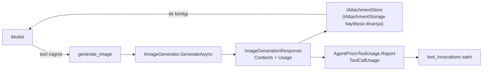

# Faz 88 — Görsel Üretim Tool'u

> **Durum:** ✅ Tamamlandı (2026-08-23)
> **Kaynak:** [ADAYLAR.md](../../ADAYLAR.md) · **F-142** — Dalga 14 Küme Ö
> **Önkoşul:** [Faz 28](28-SES-TOOLLARI.md) (ses tool'ları — yapı emsali) · [Faz 14](14-COK-MODLULUK.md) (ekler ve `IAttachmentStorage`) · [Faz 68](68-CALISTIRMA-KIMLIGI-VE-TOKEN-KIRILIMI.md) (`ToolCallUsage` ve token kırılımı)
> **Paketler:** `AgentPrism.Abstractions`, `AgentPrism.Core`, `AgentPrism.OpenAI`, `AgentPrism.Azure`, `AgentPrism.Google`
> **Yeni paket:** 🚨 **Yok — ÖLÇÜLDÜ (2026-08-21).** Aday listesinin "ÖLÇÜLMEDİ" satırı kapandı: hiçbir yeni NuGet paketi gerekmiyor (88.1) · **Migration:** Yok — ölçüm `tool_invocations` satırına `ToolCallUsage` olarak yazılır ve o yol Faz 68'de açıldı
> **Public API:** Büyüyor — 1 ayar tipi, 2 `ToolUsageUnits` sabiti, sağlayıcı başına 1 kayıt uzantısı. `PublicAPI.Shipped.txt` toplamı **16 satır** (yalnız başlıklar; ölçüldü 2026-08-21) → Faz 7'den önce eklemek **bedava**
> **Tüketici yüzeyi:** `docs-site/` → `guides/multimodal.md`, `guides/model-providers.md`, `reference/configuration.md`, `capabilities.md`, `concepts/tools.md`
> · sevk edilen: tool ve fiyat ayarının XML dokümanı, `src/AgentPrism.Core/README.md`, sağlayıcı paketlerinin `README.md`'leri. `api/` ve `http-api/` **üretilir**
> **Manuel test alanı:** [`docs/manuel-test/19-COK-MODLULUK-VE-SES.md`](../../manuel-test/19-COK-MODLULUK-VE-SES.md) · [`docs/manuel-test/12-GOZLEMLENEBILIRLIK-MALIYET.md`](../../manuel-test/12-GOZLEMLENEBILIRLIK-MALIYET.md)

---

## Bu Faza Başlarken

> `faz-baslangic` skill'ini uygula. Aşağıdaki liste o skill'in 2. adımıdır —
> **tamamını değil, yalnız işaret edilen bölümleri oku.**

1. Bu doküman
2. Kararlar — dosyanın tamamını **okuma**, yalnız bu kalemleri grep'le:
   ```bash
   grep -n "K-221\|K-212\|K-007\|K-211\|K-210\|K-032" docs/KARARLAR.md
   ```
   **K-221** (ses API anahtarı düz `ApiKey`'dir; K-059 yalnız veritabanı içindir
   — görsel için de aynı), **K-212** (paket ağırlığı bir erteleme gerekçesidir),
   **K-007** (yeni paket gerekçe ister), **K-211** (SDK çalışma anında **sessizce**
   kırılabilir), **K-210** (`Azure.Identity` alınmadı; kimlik fabrikası
   tüketiciden gelir), **K-032** (yerleşik model listesi tutulmaz).
3. [`68-CALISTIRMA-KIMLIGI-VE-TOKEN-KIRILIMI.md`](68-CALISTIRMA-KIMLIGI-VE-TOKEN-KIRILIMI.md) — yalnız devir notu:
   ```bash
   awk '/^## Sonraki Faza Devir Notu/,0' docs/arsiv/fazlar/68-CALISTIRMA-KIMLIGI-VE-TOKEN-KIRILIMI.md
   ```
   `ToolCallUsage` ve `AgentPrismToolUsage.Report(...)` sözleşmesi oradadır; bu
   faz o yolu **kullanır**, yeni bir ölçüm yolu **açmaz**.
4. Alan hafızası (bu faz üç alana dokunuyor):
   [`hafiza/ses-ve-konusma.md`](../../hafiza/ses-ve-konusma.md) (birebir emsal — tool yapısı, fiyat, ek deposu) ·
   [`hafiza/openai-saglayici.md`](../../hafiza/openai-saglayici.md) (sağlayıcı kaydı) ·
   [`hafiza/maf-api.md`](../../hafiza/maf-api.md) (MEAI tipleri)
5. Gerektiğinde, tamamı değil ilgili bölümü:
   [`MIMARI.md`](../../MIMARI.md) — tool kayıt ve çalıştırma yolu

---

## Amaç

AgentPrism görsel **üretemiyor**. Faz 14 çok modluluğu **girdi** tarafında çözdü
(görsel, ses, dosya girdisi); çıktı tarafında karşılığı yoktur. Ölçüldü
(2026-08-21): `src/` içinde görsel üretimi için **0 eşleşme**.

Bu bir **ölçüm bütünlüğü** kalemidir. Çok modlu üretim yapan bir tüketicide
görsel adımı üretim hattının bir parçasıdır; bugün dört adımın maliyeti görünür,
beşincisi görünmez kalır. *"Bir çıktının toplam üretim maliyeti nedir"* sorusu
tam cevaplanamaz — ve o soru kontrol düzleminin varlık sebebidir.

- **F-142** — `IImageGenerator` üzerinden bir görsel üretim tool'u; üretilen
  görsel ek deposunda yaşar; maliyet `tool_invocations` satırına yazılır.

### 🚨 Karşı görüş kabul edilir, çürütülmez

`ADAYLAR.md`'nin karşı görüşü şudur: ölçüm bütünlüğü argümanı yalnız görsel
**üreten** tüketici için geçerlidir ve bugün ölçülmüş **tek** bir tüketici
vardır. Bu doğrudur ve fazın önceliğini düşürür — ama tasarımını değiştirmez.

İkinci yarısı daha keskindir: *"yanlış fiyat, fiyat olmamasından kötüdür."* Bu
yüzden 88.4'ün `null` dönme kuralı bu fazın **en sert** kuralıdır; gevşetilirse
kalem değerini kaybeder.

### Bugün ne çalışmıyor — doğrulanmış kanıt

| Kanıt | Gözlem |
|---|---|
| `src/` içinde görsel üretimi araması | **0 eşleşme** |
| [`SpeakTool.cs`](../../../src/AgentPrism.Voice/Tools/SpeakTool.cs) | `internal sealed class`; modele **ek kimliğini** döndürür, ham içeriği değil — *"base64 bağlam penceresini doldururdu"* |
| [`AgentPrismOptions.cs:548`](../../../src/AgentPrism.Core/AgentPrismOptions.cs#L548) | `VoicePriceOverride` `PerMillionCharacters` **veya** `PerMinute` taşır — "bir model ya şu ya bu birimle ücretlenir" ayrımı çözülmüş |
| [`IAttachmentStore.cs:69`](../../../src/AgentPrism.Abstractions/Attachments/IAttachmentStore.cs#L69) | `IAttachmentStorage` genişleme noktası **var**; kayıtlı değilse içerik veritabanında yaşar |
| [`ToolInvocationRecord.cs:68`](../../../src/AgentPrism.Abstractions/Runs/ToolInvocationRecord.cs#L68) | `Usage` alanı `ToolCallUsage` taşır; `AgentPrismToolUsage.Report(...)` ile doldurulur |
| `ToolUsageUnits` | Bugün yalnız `Characters` ve `Seconds` sabitlerini taşır |

> Kanıtlar 2026-08-21 tarihinde yeniden ölçüldü.

---

## 88.1 — 🚨 Paket kararı: ölçüldü, yeni paket YOK

Aday listesi bu satırı **"ÖLÇÜLMEDİ"** olarak bırakmıştı. `maf-api-kesfi` ile
ölçüldü (2026-08-21):

**`Microsoft.Extensions.AI.Abstractions` görsel üretimini GA olarak sevk ediyor:**

```
IImageGenerator.GenerateAsync(ImageGenerationRequest, ImageGenerationOptions, CancellationToken)
    -> Task<ImageGenerationResponse>

ImageGenerationRequest    : Prompt · OriginalImages (IEnumerable<AIContent>)
ImageGenerationOptions    : Count · ImageSize (Size) · MediaType · ModelId
                            ResponseFormat · StreamingCount · AdditionalProperties
ImageGenerationResponse   : Contents (IList<AIContent>) · Usage (UsageDetails) · RawRepresentation
ImageGenerationResponseFormat : Uri = 0 · Data = 1 · Hosted = 2
DelegatingImageGenerator · ImageGeneratorBuilder · AddImageGenerator (DI)
OpenTelemetryImageGenerator · LoggingImageGenerator
```

**Sağlayıcı tarafı — hiçbir yeni paket gerekmiyor:**

| Sağlayıcı | Görsel üretimi | Paket bugün referanslı mı |
|---|---|---|
| **OpenAI** | `ImageClient` (`OpenAI` 2.12.0) → `OpenAIClientExtensions.AsIImageGenerator(ImageClient)` (`Microsoft.Extensions.AI.OpenAI` 10.9.0) | ✅ İkisi de `AgentPrism.OpenAI`'da |
| **Azure** | `AzureOpenAIClient.GetImageClient(deploymentName)` → aynı `ImageClient` → aynı adaptör | ✅ İkisi de `AgentPrism.Azure`'da |
| **Google** | `GenerateImagesConfig` · `GenerateImagesResponse` (`Google.GenAI` 1.16.0). MEAI adaptörü **yok** → `IImageGenerator` elle yazılır | ✅ Paket `AgentPrism.Google`'da |
| **Anthropic** | **Görsel üretmiyor** | Konusuz |

**Yeni geçişli paket sayısı: 0.** K-212'nin (37 paket) erteleme gerekçesi burada
**oluşmuyor**.

### 👤 Karar: tool ve fiyat `Core`'da, uygulamalar sağlayıcı paketlerinde

`IChatClient` için bugün izlenen desenin aynısı. Ses ayrı paket oldu çünkü
**ElevenLabs ayrı bir sağlayıcıydı**; görsel aynı sağlayıcıların **aynı kimlik
bilgisiyle** çalışır. Yeni bir AgentPrism paketi README, `slnx`, meta paket ve
`DependencyDirectionTests` işi getirir ve karşılığında hiçbir şey vermez.

### 🚨 K3: MEAI sarmalanmaz

`IImageGenerator` **doğrudan** kullanılır. Paralel bir `IAgentPrismImageGenerator`
hiyerarşisi **kurulmaz**.

**Ölçülen ikinci yol bilerek alınmıyor.** MEAI ayrıca
`ImageGeneratingChatClient` ve `UseImageGeneration(...)` sevk ediyor — bir chat
client dekoratörü görsel üretimini otomatik olarak bir tool gibi ekliyor. Bu yol
**alınmaz**, çünkü AgentPrism'in tool kayıt defterini atlar: onay
(`RequiresApproval`), yetki (`IToolAuthorizationHandler`), timeout, kota,
denetim izi ve `tool_invocations` kaydı **devreye girmez**. Kalemin bütün değeri
o kayıttır. Gerekçe dokümana yazılır ki sonraki bir tur bunu yeniden keşfetmesin.

### AOT

`AgentPrism.Abstractions`, `Core`, `PostgreSql` ve `OpenAI` **AOT uyumludur**
(ölçüldü: `grep -l "AotCompatible>false" src/*/*.csproj` bu dördünü listelemiyor).
Adaptörler **yansıma kullanmaz**; JSON gerekiyorsa kaynak üreteçli olur.

## 88.2 — Tool: `generate_image`

Yapı `SpeakTool` ile birebir aynıdır.

🚨 **Modele ek kimliği döner, ham görsel değil.** `SpeakTool`'un XML dokümanı
gerekçeyi yazıyor: ham içerik sonuca konursa **bağlam penceresi base64 ile
dolar**. Görselde bu risk sesten büyüktür.



**Üç yanıt biçimi de ele alınır.** `ImageGenerationResponseFormat` üç değer
taşır ve ikisi ek deposuna farklı girer:

| Biçim | Ne gelir | Ne yapılır |
|---|---|---|
| `Data = 1` | `DataContent` (bayt) | Doğrudan ek deposuna yazılır |
| `Uri = 0` | `UriContent` (adres) | 🚨 Adres **süreli** olabilir; indirilip ek deposuna yazılır. İndirme **giden ağ muhafızından** geçer (Faz 77) |
| `Hosted = 2` | `HostedFileContent` | 🚨 Desteklenmez; `IImageGenerator` yalnız provider'a özgü bir kimlik verir, baytı geri alma sözleşmesi vermez. Attachment deposu kalıcı provider kimliği taşımaz; bozuk ek yazmak yerine çağrı fail-closed biter (K-590) |

**Kiracı ve oturum.** Ek yazılırken `AgentPrismRunContext.Current` üzerinden
`TenantId` ve `SessionId` **taşınır**. 🚨 `SessionId` boş bırakılırsa saklama
politikası eki **öksüz** sayar ve kesim tarihinden sonra siler — bu tuzak
[`AgentPrismRunContext.cs:81`](../../../src/AgentPrism.Core/Recording/AgentPrismRunContext.cs#L81)
XML dokümanında yazılıdır.

**Tool `ToolEffect.External` taşır** — veri süreç dışına çıkar ve para harcanır.
Bu, [Faz 87](87-KESILEN-ISIN-DEVAMI.md)'nin devam kısıtıyla **doğrudan
etkileşir**: `External` taşıyan bir tool devam koşusunda varsayılan olarak
yeniden çalışmaz. Bu doğru davranıştır ve bilerek seçilmiştir.

## 88.3 — Ölçüm: iki birim

👤 **Karar (2026-08-21): iki birim — `images` ve `tokens`.**

🚨 **Ölçüm kalemin iki seçeneğine üçüncüsünü ekledi.** Aday listesi *"görsel
başına / çözünürlük başına"* diyordu. `OpenAI` 2.12.0 paketi şunları taşıyor:
`ImageTokenUsage` · `ImageInputTokenUsageDetails` · `ImageOutputTokenUsageDetails`.
Yani **yeni görsel modelleri token ile ücretlendiriliyor.** MEAI tarafı da bunu
doğruluyor: `ImageGenerationResponse.Usage` tipi `UsageDetails`'tir ve
**saf token** taşır (`InputTokenCount`, `OutputTokenCount`, … artı
`AdditionalCounts`).

Tek bir birim seçmek modellerin bir yarısında fiyatı **yanlış** yapardı.

| Birim | Ne zaman | Emsal |
|---|---|---|
| `images` | Görsel başına ücretlenen modeller (boyut ve kalite çarpanıyla) | `VoicePriceOverride.PerMillionCharacters` |
| `tokens` | Token ile ücretlenen modeller | `ModelPriceOverride.InputCostPerMillionTokens` |

Ayar `VoicePriceOverride` desenini izler: bir model **ya şu ya bu** birimle
ücretlenir; ikisi de doluysa bu bir yapılandırma hatasıdır ve
`AgentPrismOptionsValidator` onu **başlangıçta** bildirir.

`ToolUsageUnits` iki sabit kazanır. `Seconds` ve `Characters`'ın yanına
`Images`; token tarafı var olan token yolunu kullanır.

## 88.4 — 🚨 Fiyat uydurulmaz

**Bu fazın en sert kuralıdır.** Eşleşme yoksa `null` döner. Ses tarafının kuralı
([`VoicePricing.Find`](../../../src/AgentPrism.Voice/Internal/VoicePricing.cs)) burada
**aynen** korunur: model kaydı yoksa `null`, tahmin yok.

Gerekçe kalemin kendi karşı görüşüdür: *"yanlış fiyat, fiyat olmamasından
kötüdür."* Sağlayıcıların görsel fiyatlandırması ses fiyatlandırmasından daha
oynaktır; K-032 zaten yerleşik model listesi tutmamayı kararlaştırdı.

`ToolCallUsage.IsEstimated` alanı **vardır** ve bir kaçış kapısı gibi
görünebilir. Kullanılmaz: `IsEstimated` "ölçüm tahminî" demektir, "fiyatı
uydurduk" demek değildir.

## 88.5 — Operatör ucu isteğe bağlıdır

`POST /api/images/generate` — koşu dışı bir operatör ucu. Sesin
`POST /api/voice/speak` emsali aynı kararı taşır.

Uç **isteğe bağlıdır** ve varsayılan **kapalıdır** (K1). Kapalıyken tool yine
çalışır; uç yalnız koşu dışı bir kolaylıktır.

---

## Planlanan Public API

> Taslak imzalardır. Gerçekleşen imzalar kapanışta ayrı bir bölüme yazılır.

```csharp
// AgentPrism.Abstractions
public static class ToolUsageUnits
{
    public const string Characters = "characters";   // bugun var
    public const string Seconds = "seconds";         // bugun var
    public const string Images = "images";           // YENI
}
```

```csharp
// AgentPrism.Core — AgentPrismOptions.Pricing altinda
public sealed class ImagePriceOverride
{
    /// <summary>Gets or sets cost per generated image.</summary>
    public decimal? PerImage { get; set; }

    /// <summary>Gets or sets the multiplier applied for each image size.</summary>
    public IDictionary<string, decimal> SizeMultipliers { get; }

    /// <summary>Gets or sets cost per million output tokens, for token-billed models.</summary>
    public decimal? OutputCostPerMillionTokens { get; set; }
}

public sealed class AgentPrismImageOptions
{
    /// <summary>Gets or sets whether the image tool is registered. Default is <see langword="false"/>.</summary>
    public bool Enabled { get; set; }

    /// <summary>Gets or sets the default model.</summary>
    public string? Model { get; set; }

    /// <summary>Gets or sets the most images one call may produce.</summary>
    public int MaxImagesPerRequest { get; set; } = 1;
}
```

```csharp
// AgentPrism.OpenAI / .Azure / .Google — kayit uzantisi
public static class AgentPrismOpenAIBuilderExtensions
{
    /// <summary>Registers the OpenAI image generator.</summary>
    public static IAgentPrismBuilder UseOpenAIImages(this IAgentPrismBuilder builder, ...);
}
```

> 🚨 `IImageGenerator` **bizim tipimiz değildir** ve sarmalanmaz. Yukarıdaki
> uzantılar MEAI'nin `AddImageGenerator(...)` kaydını çağırır; AgentPrism
> yalnız çözümlemeyi ve tool'u sağlar.

### HTTP `endpoint`'leri

| Metot | Yol | Rol | Ne yapar |
|---|---|---|---|
| `POST` | `/api/images/generate` | `Operator` | Koşu dışı görsel üretir. **İsteğe bağlı, varsayılan kapalı** |

### Arayüz payı

Üretilen görsel transcript'te **var olan ek görüntüleyicisiyle** gösterilir
(Faz 14 yolu). 🚨 Yeni bileşen gerekiyorsa bundle payı **ölçülmelidir**;
bütçe **250 KB gzip**. Yeni metin `en.ts` **ve** `tr.ts`'e girer (K-228).

---

## Planlanan Dosya Listesi

```
src/AgentPrism.Abstractions/Runs/
└── ToolUsageUnits.cs                     (sabit eklenir)

src/AgentPrism.Core/
├── Images/GenerateImageTool.cs           (yeni — SpeakTool emsali)
├── Images/ImagePricing.cs                (yeni — VoicePricing emsali)
├── Images/ImageAttachmentWriter.cs       (yeni — uc yanit bicimi)
├── AgentPrismImageOptions.cs             (yeni)
└── AgentPrismOptions.cs                  (ImagePriceOverride)

src/AgentPrism.OpenAI/
└── AgentPrismOpenAIBuilderExtensions.cs  (AsIImageGenerator kaydi)

src/AgentPrism.Azure/
└── AgentPrismAzureBuilderExtensions.cs   (GetImageClient -> AsIImageGenerator)

src/AgentPrism.Google/
├── AgentPrismGoogleBuilderExtensions.cs
└── Internal/GoogleImageGenerator.cs      (yeni — MEAI adaptoru YOK, elle yazilir)

src/AgentPrism.AspNetCore/Endpoints/
└── ImageEndpoints.cs                     (istege bagli uc)
```

---

## Hata Modları ve Testler

> Mutlu yoldan değil, **ne bozulabilir**den türetilir. Seviyeyi plan seçer.

| Ne bozulabilir | Seviye | Test sınıfı |
|---|---|---|
| 🚨 Ham görsel modele döner; bağlam penceresi base64 ile dolar | Fonksiyonel | `GenerateImageToolTests` — sonuç yalnız ek kimliği taşımalı |
| Model kaydı yokken fiyat **uydurulur** | Birim | `ImagePricingTests` — `null` dönmeli |
| Hem `PerImage` hem token fiyatı dolu | Birim | `AgentPrismOptionsValidatorTests` — başlangıçta hata |
| Token ile ücretlenen model `images` birimiyle fiyatlanır | Birim | `ImagePricingTests` |
| `ResponseFormat = Uri` geldiğinde içerik indirilmez | Fonksiyonel | `ImageAttachmentWriterTests` |
| `Uri` indirmesi giden ağ muhafızını **atlar** | Sözleşme | `EgressPolicyContract` — Faz 77 muhafızı |
| `ResponseFormat = Hosted` geldiğinde ham indirme denenir | Fonksiyonel | `ImageAttachmentWriterTests` |
| 🚨 Ek `SessionId` taşımaz → saklama politikası onu **siler** | Fonksiyonel | `ImageAttachmentWriterTests` |
| Ek başka kiracıya yazılır | Sözleşme | `TenantIsolationContract` |
| `Count > MaxImagesPerRequest` sessizce kabul edilir | Birim | `GenerateImageToolTests` |
| Sağlayıcı hata verirse koşu **çöker** | Fonksiyonel | `GenerateImageToolTests` — tipli hata döner, koşu sınıflandırılır (Faz 44) |
| Ek deposu yazamazsa maliyet yine de kaydedilir | Fonksiyonel | `GenerateImageToolTests` — gözlemlenebilirlik işlevselliği bozmaz |
| İptal edilen çağrı ek yazmaya devam eder | Fonksiyonel | `GenerateImageToolTests` |
| İki eşzamanlı çağrı aynı ek kimliğini üretir | Fonksiyonel | `ImageAttachmentWriterTests` |
| Tool ayar kapalıyken kayıtlı olur | Fonksiyonel | `ImageRegistrationTests` — K1 |
| Uç varsayılan **açık** gelir | Fonksiyonel | `ImageEndpointsTests` — K1 |
| Uç rolsüz erişime açılır | Fonksiyonel | `ImageEndpointsTests` |
| `AgentPrism.OpenAI` AOT duruşunu kaybeder | Fonksiyonel | var olan AOT kapısı |

Beş soru ve cevapları:

| Soru | Cevap |
|---|---|
| **İptal** | `CancellationToken` `GenerateAsync`'e aktarılır; iptal sonrası ek **yazılmaz** ve yarım ek bırakılmaz |
| **Eşzamanlılık** | Bir koşu birden çok görsel isteyebilir; ek kimlikleri UUID v7'dir ve çakışmaz |
| **Boş/aşırı girdi** | Boş `prompt` reddedilir; `Count` `MaxImagesPerRequest` ile sınırlanır — **sessizce kırpılmaz**, hata döner (`SpeakTool` emsali: metin kırpılmıyor) |
| **Başka kiracı** | Ek `AgentPrismRunContext.Current.TenantId` ile yazılır; `TenantIsolationContract` sabitler |
| **Alt sistem hatası** | Sağlayıcı hatası tipli döner (Faz 44). Ek deposu hatası koşuyu düşürür — ek yazılamadıysa modele verilecek kimlik **yoktur** |

---

## Manuel Kabul Case'leri

| # | Ön koşul | Adımlar | Beklenen sonuç |
|---|---|---|---|
| 1 | Ayar **kapalı** (varsayılan) | Agent tanımında `generate_image` istenir | Tanım derlenmez; tool kayıtlı değildir |
| 2 | Ayar açık, OpenAI kayıtlı | Agent'a "bir kedi çiz" denir | Görsel üretilir; sonuç **ek kimliği** taşır, base64 taşımaz |
| 3 | Aynı koşu | `tool_invocations` satırı okunur | `usage.unit` = `images` veya token birimi; `cost` dolu |
| 4 | Fiyat kaydı **yok** | Aynı koşu | `cost` **`null`** döner; koşu başarılı |
| 5 | Ayar açık | Ek deposunda üretilen görsel açılır | Doğru kiracıya ve **oturuma** bağlı; medya tipi doğru |
| 6 | `ResponseFormat = Uri` veren model | Aynı koşu | İçerik indirilip ek deposuna yazılır; adres süresi dolsa da görsel açılır |
| 7 | Giden ağ muhafızı adresi engelliyor | Aynı koşu | İndirme **engellenir**; koşu tipli bir hatayla düşer |
| 8 | Azure kayıtlı | "bir kedi çiz" | Aynı sonuç, `AzureOpenAIClient.GetImageClient` yolundan |
| 9 | Google kayıtlı | "bir kedi çiz" | Aynı sonuç, elle yazılan adaptörden |
| 10 | [Faz 87](87-KESILEN-ISIN-DEVAMI.md) devam açık, görsel tool'u koşuda | Koşu kesilir | Devam **reddedilir** — tool `External` taşır |
| 11 | 👤 insan gerekir | Konsolda transcript açılır | Üretilen görsel görünür ve indirilebilir |

---

## Açık Sorular

| # | Soru | Seçenekler | Öneri |
|---|---|---|---|
| 1 | Boyut çarpanları nasıl adlandırılır? | A: sağlayıcının kendi dizesi (`"1024x1024"`) · B: normalize edilmiş bir enum | **A** — B bir yerleşik boyut listesi demektir ve K-032'nin (yerleşik model listesi tutulmaz) aynı tuzağıdır |
| 2 | `Hosted` biçim için ek deposuna ne yazılır? | A: sağlayıcı kimliği + medya tipi, içerik yok · B: içerik indirilip yazılır | **Kapanışta değişti:** `HostedFileContent` yalnız provider'a özgü `FileId` verir; byte indirme API'si yoktur ve `IAttachmentStore` kalıcı provider referansı modellemez. A veya B güvenli uygulanamaz; çağrı fail-closed reddedilir (K-590) |
| 3 | `OriginalImages` (görsel düzenleme) bu fazda kapsansın mı? | A: hayır, yalnız üretim · B: evet | **A** — düzenleme girdi olarak var olan bir eki ister ve kendi yetki sorusunu açar ("hangi eki düzenleyebilir"). Ayrı bir kalemdir |
| 4 | Operatör ucu bu fazda yazılsın mı? | A: evet, varsayılan kapalı · B: sonraya | **A** — ses emsali var ve maliyeti küçük; kapalı varsayılan K1'i korur |
| 5 | Google adaptörü hangi kapsamda? | A: yalnız `GenerateAsync`, düzenleme/upscale yok · B: tam yüzey | **A** — `IImageGenerator` yalnız `GenerateAsync` ister; fazlası sözleşmesiz koddur |
| 6 | Tool adı ne olsun? | A: `generate_image` · B: `create_image` | **A** — MEAI'nin kendi adlandırması `ImageGeneration*`; tutarlılık arama maliyetini düşürür |

---

## Bitiş Ölçütleri (DoD)

- [x] Ayar **kapalıyken** tool kayıtlı değildir ve uç bağlı değildir (K1).
- [x] `generate_image` OpenAI · Azure · Google adapter kayıtları ve provider çözümüyle çalışır; üç provider extension testi geçer.
- [x] Tool sonucu **yalnız ek kimliği** taşır; base64 taşımaz.
- [x] Üretilen ek doğru `TenantId` **ve** `SessionId` ile yazılır.
- [x] `Data` ve `Uri` biçimleri ek deposuna doğru girer; `Uri` indirmesi giden ağ muhafızından geçer ve chunked gövde sınırlandırılır.
- [x] `tool_invocations` satırı `ToolCallUsage` taşır; birim `images` **veya** token olur.
- [x] 🚨 Fiyat kaydı yoksa `cost` **`null`** döner — hiçbir koşulda uydurulmaz.
- [x] Hem `PerImage` hem token fiyatı doluysa başlangıçta yapılandırma hatası verilir.
- [x] **Yeni NuGet paketi alınmadı** — `dotnet list package --include-transitive` farkı sıfır.
- [x] `AgentPrism.OpenAI` AOT uyumlu kaldı.
- [x] Dört doğrulama kapısı sıfır uyarı ile geçti: build, test, pack ve format.
- [x] `samples/AgentPrism.Api` ile gerçek istek yapıldı. İlk turda yetkisiz `gpt-image-1` çağrısı kontrollü `502` ve alt `403 model_not_found` döndü; yetki tanındıktan sonra (2026-08-23) hem operatör ucu hem `generate_image` tool yolu **gerçek** `gpt-image-1` görseli üretti ve doğru PNG olarak ek deposuna yazıldı — bkz. üçüncü denetim turu.
- [x] Bu fazın değiştirdiği ve eklediği dosyalarda `secret` taraması boş döndü. Repo genelindeki eski manuel-test örnekleri ve Astro cache'i bu kapsam dışındadır.
- [x] Manuel kabul case'leri `docs/manuel-test/19-*` ve `12-*` içine eklendi; otomatikleştirilebilenler koşuldu.
- [x] `faz-denetim` üç kez koşuldu (üçüncüsü gerçek `gpt-image-1` ile canlı manuel koşum); 🔴 bulgu kalmadı.
- [x] `docs-site/` güncellendi; `npm run check`, link ve agent-map kapıları temiz.
- [x] Arayüze dokunulmadı; sözlük veya bundle değişimi yok.

### Doğrulama komutları

```bash
# Yeni gecisli paket alinmadi mi (fazdan ONCE ve SONRA ayni cikti)
dotnet list AgentPrism.slnx package --include-transitive | sort > /tmp/paketler.txt

# Tool sonucu ek kimligi mi tasiyor
curl -s http://localhost:5081/agentprism/api/runs/$RUN_ID/tools \
  | jq '.[] | select(.toolName=="generate_image") | .result'

# Olcum ve maliyet
curl -s http://localhost:5081/agentprism/api/runs/$RUN_ID/tools \
  | jq '.[] | select(.toolName=="generate_image") | .usage'
```

---

## Riskler

| Risk | Önlem |
|------|-------|
| 🚨 Yanlış fiyat üretilir | Eşleşme yoksa `null`. Bu fazın en sert kuralıdır ve `IsEstimated` bir kaçış kapısı olarak kullanılmaz |
| Ham görsel bağlam penceresini doldurur | Sonuç yalnız ek kimliği; `SpeakTool` emsali aynen izlenir |
| Fiyatlandırma karmaşıklığı (boyut, kalite, model başına farklı birim) | İki birim + boyut çarpanı. Sağlayıcı dizesi normalize edilmez (Açık Soru 1) |
| MEAI'nin hazır dekoratörü (`UseImageGeneration`) cazip görünür ve tool defterini atlar | Gerekçe 88.1'de yazılı: onay, yetki, timeout, kota ve denetim izi devre dışı kalırdı |
| `Uri` biçimindeki adres süreli olur ve görsel kaybolur | İçerik indirilip ek deposuna yazılır; adres saklanmaz |
| İndirme giden ağ muhafızını atlar | `EgressPolicyContract` — Faz 77 muhafızı indirme yolunu da kapsar |
| Ek `SessionId` taşımaz ve saklama politikası siler | Fonksiyonel test; tuzak XML dokümanında zaten yazılı |
| Google adaptörü elle yazılır ve sağlayıcı API'si değişirse **sessizce** kırılır (K-211) | Adaptör dar tutulur (yalnız `GenerateAsync`); manuel kabul case'i canlı çağrı yapar |
| AOT duruşu bozulur | Yansıma yok; JSON kaynak üreteçli. Var olan AOT kapısı zorlar |

---

<!-- ============================================================
     AŞAĞISI KAPANIŞTA DOLDURULUR — `faz-tamamlama` skill'i.
     Plan anında boş kalır. Başlıkları SİLME.
     ============================================================ -->

## Plandan Sapmalar

1. Plan MEAI 10.9.0 görsel yüzeyini GA sayıyordu. Reflection ölçümü
   `IImageGenerator` ve ilişkili tiplerde `MEAI001` verdi. Native MEAI tipi
   doğrudan korunuyor; bastırma yalnız dört çağrı/kayıt sınırında dar tutuldu
   (K-588).
2. Plan `HostedFileContent` kimliğinin eki temsil edebileceğini varsayıyordu.
   Gerçek imza yalnız provider'a özgü `FileId` ve isteğe bağlı metadata verir;
   indirme işlemi yoktur. Byte-only `IAttachmentStore` içine bu kimliği yazmak
   bozuk bir görsel üretirdi. `DataContent` ve guard'dan indirilmiş `UriContent`
   desteklenir; hosted yanıt açık hatayla reddedilir (K-590).
3. Tek isimsiz `IImageGenerator` kaydı çoklu sağlayıcı hostunda DI kayıt sırasına
   bağlı olurdu. Sağlayıcı kayıtları provider adıyla keyed yapıldı; isimsiz özel
   consumer kaydı yalnız fallback kaldı (K-589).
4. Google'ın image API'si `WIDTHxHEIGHT` değil ayrı aspect-ratio/size-tier
   değerleri taşır. Yaklaşık eşleme maliyeti ve sonucu değiştirirdi; adapter
   `ImageSize` isteğini tahmin etmeden reddeder (K-591).
5. Denetim sonrası attachment yazıcısı `ITenantContext` okumayı bıraktı; çağıran
   run scope'un sabit tenant kimliğini verir. Çoklu içerik yazısında hata veya
   iptal olursa önceki eklerin silinmesi denenir; cleanup hatası loglanır ve asıl
   hata korunur. Chunked URI gövdesi de limitten büyük belleğe alınmadan durur.
6. Operatör HTTP ucu planın public API sayımında yoktu. Uç için istek/yanıt
   sözleşmeleri `Abstractions`a eklendi ve OpenAPI/client yeniden üretildi.

## Bu Fazda Verilen Kararlar

- **K-588** — Deneysel MEAI görsel yüzeyi dar `MEAI001` sınırlarında kullanılır.
- **K-589** — Image generator provider adına göre keyed çözülür; isimsiz kayıt
  özel consumer fallback'idir.
- **K-590** — Attachment deposu yalnız doğrulanabilir baytı kalıcılaştırır;
  hosted provider referansı fail-closed reddedilir.
- **K-591** — Google adapter `WIDTHxHEIGHT`yi tahminle eşleştirmez, reddeder.

## Gerçekleşen Public API


```csharp
// AgentPrism.Abstractions
public static class ToolUsageUnits
{
    public const string Images = "images";
    public const string Tokens = "tokens";
}

public sealed record ImageGenerationOperatorRequest
{
    public string? Prompt { get; init; }
    public int? Count { get; init; }
    public string? Size { get; init; }
    public string? SessionId { get; init; }
}

public sealed record ImageGenerationOperatorResponse
{
    public required IReadOnlyList<AttachmentDescriptor> Attachments { get; init; }
    public required ToolCallUsage Usage { get; init; }
}

// AgentPrism.Core
public sealed class AgentPrismImageOptions
{
    public const string SectionName = "AgentPrism:Images";
    public bool Enabled { get; set; }
    public string? Provider { get; set; }
    public string? Model { get; set; }
    public int MaxImagesPerRequest { get; set; }
}

public sealed class ImagePriceOverride
{
    public decimal? PerImage { get; set; }
    public IDictionary<string, decimal> SizeMultipliers { get; }
    public decimal? OutputCostPerMillionTokens { get; set; }
}

// Provider packages
public static IAgentPrismBuilder UseOpenAIImages(
    this IAgentPrismBuilder builder,
    Action<AgentPrismImageOptions>? configure = null);
public static IAgentPrismBuilder UseAzureOpenAIImages(
    this IAgentPrismBuilder builder,
    Action<AgentPrismImageOptions>? configure = null);
public static IAgentPrismBuilder UseGoogleImages(
    this IAgentPrismBuilder builder,
    Action<AgentPrismImageOptions>? configure = null);
```

`AgentPrismOptions.Pricing.Images` provider/model başına `ImagePriceOverride`
tablosudur. Ayar kapalıyken public HTTP ucu bağlı değildir. Açıkken
`POST /api/images/generate` operator rolü ve `RunsWrite` API-key scope'u ister.

## Dosya Listesi (gerçekleşen)


```text
src/AgentPrism.Abstractions/
├── Images/ImageGenerationOperatorContracts.cs          (yeni)
└── Tools/ToolCallUsage.cs                               (images/tokens birimleri)

src/AgentPrism.Core/
├── AgentPrismImageOptions.cs                            (yeni)
├── AgentPrismOptions.cs · AgentPrismOptionsValidator.cs
├── AgentPrismServiceCollectionExtensions.cs
├── Images/GenerateImageTool.cs · ImageGeneratorResolver.cs
├── Images/ImagePricing.cs · ImageAttachmentWriter.cs    (yeni)
├── Tools/ToolRegistry.cs
└── Properties/AssemblyInfo.cs                           (üçüncü denetim: InternalsVisibleTo("AgentPrism.Mcp"))

src/AgentPrism.{OpenAI,Azure,Google}/
├── *ChatClientFactory.cs
├── *ImageBuilderExtensions.cs                            (yeni)
└── Internal/GoogleImageGenerator.cs                      (Google, yeni)

src/AgentPrism.AspNetCore/
└── Endpoints/ImageEndpoints.cs                           (yeni)

src/AgentPrism.Mcp/
└── AgentPrismMcpBuilderExtensions.cs                     (üçüncü denetim: ToolRegistry.Create çağrısı)

tests/
├── AgentPrism.Core.UnitTests/Images/{ImagePricingTests,ImageAttachmentWriterTests,
│   ImageGeneratorResolverTests,ImageOptionsValidationTests,GenerateImageToolTests}.cs
├── AgentPrism.AspNetCore.FunctionalTests/ImageEndpointTests.cs
├── AgentPrism.Mcp.UnitTests/McpToolRegistryImageGateTests.cs (üçüncü denetim, yeni)
└── sağlayıcı extension testleri · OpenApiSnapshotTests.cs

docs-site/ · docs/openapi/agentprism.json · üretilen C# client · sample ayarları
· manuel kabul kayıtları
```

**Otomatik test kanıtı:** `ImagePricingTests` fiyat uydurmama ve iki fiyat
birimini; `ImageAttachmentWriterTests` data/URI, egress, chunked limit, rollback
ve hosted red; `ImageEndpointTests` varsayılan kapalı, saklama, tool-run ölçümü,
girdi ve provider hatasını; üç provider extension testi keyed kayıtları doğrular;
`GenerateImageToolTests` tool'un kendi sayım sınırını ve hata yollarını HTTP'siz
doğrular; `McpToolRegistryImageGateTests` `.UseMcp()` etkinken tool'un derlemede
görünür kaldığını doğrular (eski koda karşı kırmızı olduğu ölçüldü).

## Denetim Bulguları


| Bulgu | Seviye | Sonuç |
|---|---|---|
| Hosted response kalıcı ek olamıyordu | 🔴 | Gerçek MEAI imzası yeniden ölçüldü. Byte indirme veya kalıcı referans sözleşmesi olmadığı için fail-closed davranış gerekçelendi, doküman eşitlendi (K-590). |
| Ek çağrı anındaki tenant context'e yazılıyordu | 🔴 | `ImageAttachmentWriter` artık tenantı çağırandan alır; tool run scope tenantını, endpoint güncel request tenantını verir. |
| Çoklu yazıda yarım ek kalıyordu | 🔴 | Hata/iptalde kaydedilen ekler `CancellationToken.None` ile geri silinir; test kapsar. |
| Chunked URI sınırsız belleğe alınabiliyordu | 🔴 | Bounded stream okuyucu limite erişir erişmez durur; test kapsar. |
| Sevk edilen XML içinde `K1` vardı | 🔴 | "default-off rule" ile değiştirildi; self-containment kapısı yeşil. |
| Üç yeni giriş noktasının XML örneği yoktu | 🔴 | Derlenebilir `Use*Images` örnekleri eklendi; capability kapısı yeşil. |
| Başarılı URI indirme kanıtı yoktu | 🟡 | Chunked yerel HTTP sunucusundan guard üzerinden indirme ve saklama testi eklendi. |
| Operatör request/response tipleri plan API'sinde yoktu | 🟡 | Gerçekleşen API bölümüne eklendi. |
| Rollback cleanup hatası için garanti ve test belirsizdi | 🟡 | Cleanup best-effort olarak ürün dokümanına yazıldı; delete hatası asıl hatayı koruyan test eklendi. |
| Shipped agent map Google image giriş noktasını içermiyordu | 🟡 | `capabilities.md` kaynağından map yeniden üretildi; `UseGoogleImages()` artık sevk edilen map'te. |
| 🚨 `.UseMcp(...)` etkinken `generate_image` derlemeye hiç girmiyordu | 🔴 | Üçüncü denetim turu — gerçek `gpt-image-1` çağrısıyla canlı koşumda bulundu. `AgentPrismMcpBuilderExtensions.UseMcpCore` `IToolRegistry`'yi `McpToolRegistry` ile REPLACE ederken iç registry'yi `ToolRegistry.Create(provider)` üzerinden değil, kayıtları elle yeniden toplayan ikinci bir inşa yoluyla kuruyordu; bu ikinci yol 88.1'in `images.Enabled` kapısını hiç çalıştırmıyordu. Ayar açık, sağlayıcı kayıtlı olsa bile `GET /api/tools` ve agent derlemesi tool'u hiç görmüyordu — hata da vermiyordu. Düzeltme: `AgentPrism.Core`'un `InternalsVisibleTo`'suna `AgentPrism.Mcp` eklendi, `UseMcpCore` artık `ToolRegistry.Create(provider)`'ı çağırıyor (K3/K1 ile aynı kapıyı paylaşıyor). `McpToolRegistryImageGateTests` (`tests/AgentPrism.Mcp.UnitTests/`) eski koda karşı doğrulanmış: fix'siz kırmızı, fix'li yeşil. |
| `GenerateImageTool`'un kendi `MaxImagesPerRequest` reddi yalnız HTTP operatör ucunun kopya kontrolüyle test ediliyordu, tool yolu hiç değil | 🟡 | `GenerateImageToolTests` (`tests/AgentPrism.Core.UnitTests/Images/`) eklendi: sayım sınırı, yalnız-ek-kimliği sonucu, sağlayıcı hatasının yutulmadığı, eksik run scope/tenant durumları, `size` ayrıştırması — tool'un kendi gövdesi üzerinden, HTTP'siz. |

🔴 ve 🟡 açık bulgu yoktur.

## Sonraki Faza Devir Notu


- Faz 89 `ToolRegistry` sarmalayıcı zincirine yeni halka eklerken, images açıkken
  factory'nin `generate_image`ı `ToolEffect.External` ile eklediğini korumalıdır.
  Bu tool devam koşusunda otomatik tekrar edilmez.
- 🚨 **Ölçüldü ve düzeltildi (2026-08-23, üçüncü denetim turu):** `.UseMcp(...)`
  `IToolRegistry`'yi `McpToolRegistry` ile REPLACE ederken iç registry'yi
  `ToolRegistry.Create(provider)` üzerinden değil, kayıtları elle yeniden
  toplayan bir kopya inşa yoluyla kuruyordu. Bu kopya 88.1'in `images.Enabled`
  kapısını atlıyordu: ayar açık ve sağlayıcı kayıtlı olsa bile `generate_image`
  MCP açıkken (sample'da her zaman) derlemeye hiç girmiyordu — hatasız, sessizce.
  Düzeltme `AgentPrism.Core` → `InternalsVisibleTo("AgentPrism.Mcp")` ekleyip
  `UseMcpCore`'u `ToolRegistry.Create(provider)`'ı çağıracak şekilde değiştirdi.
  **Ders:** `IToolRegistry`'yi REPLACE/sarmalayan her yeni yer `ToolRegistry.Create`
  üzerinden inşa etmelidir — kayıtları elle yeniden toplamak, `Create`'e sonradan
  eklenen her gate'i (bugünkü images, yarın başka biri) sessizce atlar.
- 🚨 Image attachment yazısı `AgentRunScope.TenantId` ile yapılır; async akışta
  yeniden `ITenantContext` çözmek tenant/run ayrışması üretir.
- 🚨 URI gövdesi `Content-Length`e güvenmez. `ImageAttachmentWriter`ın bounded
  okuma ve best-effort rollback yolu korunmalıdır; cleanup hatası asıl image
  hatasını maskelemez ve loglanır.
- `HostedFileContent` provider `FileId`si dışında okunabilir içerik vermez.
  Depo sözleşmesi değişmeden destek eklenmez.
- 2026-08-23 güncellemesi: `gpt-image-1` erişimi tanındı. Hem
  `POST /api/images/generate` hem agent üzerinden `generate_image` tool çağrısı
  gerçek bir görsel üretti (1024×1024 PNG, ek deposuna doğru yazıldı, `usage.unit
  = tokens` ve fiyat kaydı yokken `cost = null`). Faz 89 artık bu modelle canlı
  deneme yapabilir; provider erişimi kaybolursa yine `HTTP 502` / alt
  `403 model_not_found` beklenir.
