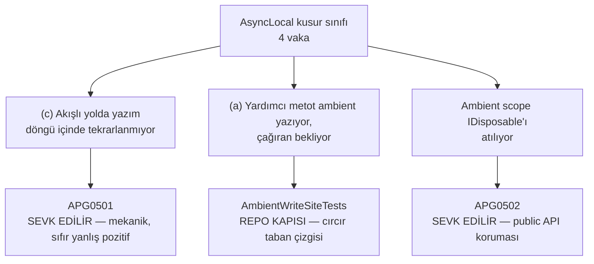

# Faz 93 — Kusur Sınıfı Kapıları

> **Durum:** ✅ Tamamlandı (2026-08-24)
> **Kaynak:** [`kesif/2026-08-23-yapisal-sorun-envanteri.md`](../../kesif/2026-08-23-yapisal-sorun-envanteri.md) kalem **3** (analyzer kuralları — Faz 91'de kapanmayan bölüm). Bu faz bir `F-NN` adayından gelmez.
> **Önkoşul:** [Faz 91](91-GELISTIRME-DONGUSU-KAPILARI.md) — kapı komut yüzeyi (`scripts/kapi.py`) ve `denetim-paketi.py` oradan gelir; bu faz aynı desende iki kapı daha ekler
> **Paketler:** `AgentPrism.Generators`, `AgentPrism.Workflows` (yalnız analyzer referansı), `AgentPrism.Core` (yalnız `buildTransitive` `NoWarn` listesi)
> **Yeni paket:** Yok · **Migration:** Yok
> **Public API:** Büyümüyor. Ölçüldü 2026-08-23: `src/*/PublicAPI.Unshipped.txt` 8.079 satır, `Shipped.txt` dosyaları boş (16 dosya × 1 satır). `AgentPrism.Generators` `AgentPrismPublicApiTrackingEnabled=false` taşır; tanı ve baseline dosyaları public üye değildir
> **Tüketici yüzeyi:** **Var.** Sevk edilen: iki yeni `APG` tanısı (`AgentPrism.Core` nupkg'i, `analyzers/dotnet/cs/`) + `src/AgentPrism.Core/buildTransitive/AgentPrism.Core.targets` `NoWarn` listesi + `docs-site/src/content/docs/troubleshooting.md` (her tanı orada açıklanmalıdır — `DiagnosticIntegrityTests` bunu zorlar). Site: `troubleshooting.md`. `tuketici-dokuman-senkronu` koşar
> **Manuel test alanı:** [`docs/manuel-test/29-AGENT-DESTEGI.md`](../../manuel-test/29-AGENT-DESTEGI.md) (APG tanıları) + [`docs/manuel-test/36-GELISTIRME-KAPILARI.md`](../../manuel-test/36-GELISTIRME-KAPILARI.md) (repo kapıları)

---

## Bu Faza Başlarken

> `faz-baslangic` skill'ini uygula. Aşağıdaki liste o skill'in 2. adımıdır —
> **tamamını değil, yalnız işaret edilen bölümleri oku.**

1. Bu doküman
2. Kararlar — dosyanın tamamını **okuma**, yalnız bu kalemleri grep'le:
   ```bash
   grep -n "K-281\|K-483\|K-506\|K-567" docs/KARARLAR.md
   ```
   **K-281** (`TenantCoverageTests` kapsam kapısı — bu fazın cırcır kapıları o deseni izler), **K-483** (elle tekrarlanan toplama ifadesi kusur sınıfı), **K-506** (`Info` tanısı `dotnet build` çıktısına düşmez; tanı `Warning` olmalı), **K-567** (`AgentPrism.Client` AOT denemesi terk edildi — analyzer'ın AOT dışı olması normaldir)
3. [`arsiv/fazlar/91-GELISTIRME-DONGUSU-KAPILARI.md`](91-GELISTIRME-DONGUSU-KAPILARI.md) — yalnız devir notu:
   ```bash
   awk '/## Sonraki Faza Devir Notu/,0' docs/arsiv/fazlar/91-GELISTIRME-DONGUSU-KAPILARI.md
   ```
   Faz 91 hangi tuzağın kapı kazandığını listeler. Bu faz o listenin **kalanını** alır.
4. Alan hafızası (bu faz üç alana dokunuyor):
   [`hafiza/analyzer-yazimi.md`](../../hafiza/analyzer-yazimi.md) (tanı yazımı, `RS1035`, `CompilerVisibleProperty`, Core'un kendi analyzer'ını kendi üzerinde koşturması) ·
   [`hafiza/cekirdek-calistirma.md`](../../hafiza/cekirdek-calistirma.md) satır 18 (üç `AsyncLocal` vakası — bu fazın konusu) ·
   [`hafiza/test-altyapisi.md`](../../hafiza/test-altyapisi.md) (cırcır testi deseni)
5. Gerektiğinde, tamamı değil ilgili bölümü:
   [`.agents/skills/kusur-giderme/SKILL.md`](../../../.agents/skills/kusur-giderme/SKILL.md) — kusur sınıfı tablosu ve Adım 5 (sınıf taraması)

---

## Amaç

Bu faz, **üç kez veya daha fazla tekrarlamış** iki kusur sınıfını yazıdan kapıya
taşır. Bugün koruma "bir sonraki oturumun doğru hafıza dosyasını okuması"
şartına bağlıdır. Bu bir kapı değil, bir umuttur.

`kusur-giderme` skill'i kendi kuralını taşır: *"Bir kusur sınıfı üçüncü kez
tekrarlıyorsa yazı yetmemiştir."* İki sınıf o eşiği geçti ve hâlâ yazıyla
korunuyor:

- **`AsyncLocal` yazımı çağırana akmıyor** — 4 kez (Faz 6, 11, 12, 15)
- **Playwright locator alt dize eşliyor** — 3 kez (Faz 16 ×2, Faz 19)

Üçüncü sınıf (senkronizasyon kopyası, 5 kez) Faz 91'de kapandı. Dördüncü sınıf
(elle tekrarlanan toplama ifadesi, K-483) C# tarafında zaten kapalıdır ve canlı
vakaları SQL metnindedir — **Faz 94'ün işidir**, bu fazın değil.

### Bugün ne çalışmıyor — doğrulanmış kanıt

| Kanıt | Gözlem |
|---|---|
| [`hafiza/cekirdek-calistirma.md:18`](../../hafiza/cekirdek-calistirma.md) | Tek maddede üç vaka: kök span async yardımcıda açıldı · `run scope` async yardımcıda yazıldı · `async IAsyncEnumerable` gövdesindeki yazım `yield return` sınırını aşmadı |
| [`.agents/skills/kusur-giderme/SKILL.md:16-20`](../../../.agents/skills/kusur-giderme/SKILL.md) | Sayaç tablosu: `AsyncLocal` **4**, senkronizasyon kopyası **5**, Playwright locator **3** |
| [`arsiv/HAFIZA-GECMISI.md:374`](../HAFIZA-GECMISI.md) | Playwright üç vakası adıyla: `GetByPlaceholder("github")` · `GetByText("Awaiting input")` · `GetByRole(Heading, Name: "Experiments")` |
| `grep -rn "SetCurrent(\|AmbientTenantScope.Begin(\|StartActivity(" src/` | **14** ambient yazım yeri. Hiçbiri makine ile korunmuyor |
| `tests/` içinde `GetBy*` çağrısı | **181** çağrı; **125**'i ne `Exact` ne `.First`/`.Nth` taşıyor |
| [`src/AgentPrism.Core/AgentPrism.Core.csproj:22`](../../../src/AgentPrism.Core/AgentPrism.Core.csproj) | `OutputItemType="Analyzer"` **yalnız** Core'da. `AgentPrism.Workflows/AgentPrism.Workflows.csproj:14` tek `ProjectReference` taşır — analyzer oraya ulaşmıyor |
| [`src/AgentPrism.Core/buildTransitive/AgentPrism.Core.targets:68`](../../../src/AgentPrism.Core/buildTransitive/AgentPrism.Core.targets) | `NoWarn` listesi yedi tanı taşıyor; yeni tanı buraya eklenmezse tüketicinin tek anahtarı eksik kalır |

> Kanıtlar 2026-08-23 tarihinde doğrulandı.

---

## 93.1 — 🚨 Bu sınıfın tamamı sevk edilen bir analyzer kuralı **olamaz**

Bu bölüm fazın en önemli tasarım kararıdır ve ölçümle gelir. Uygulayan oturum
bunu okumadan kural yazmaya başlarsa **doğru kodu işaretleyen** bir kural üretir.

Envanterin (a) kuralı şöyle okunuyordu: *"`async` metotta `AsyncLocal`/`Activity`
yazımı."* Bu kural bugünkü kodda **altı kez** öter — ve altısı da **doğrudur**:

| Yer | Neden doğru |
|---|---|
| [`RunRecordingAgent.cs:207`](../../../src/AgentPrism.Core/Recording/RunRecordingAgent.cs#L207) | `RunCoreAsync` `async`'tir ve `SetCurrent`'i **kendi gövdesinde** çağırır — istenen desen budur |
| [`RunRecordingAgent.cs:316`](../../../src/AgentPrism.Core/Recording/RunRecordingAgent.cs#L316) | Akışlı yolun kendi gövdesi |
| [`RunRecordingAgent.cs:381`](../../../src/AgentPrism.Core/Recording/RunRecordingAgent.cs#L381) | Döngü içinde, her `MoveNextAsync` öncesi — Faz 12'nin **düzeltmesi** |
| [`WorkflowRunner.cs:452`](../../../src/AgentPrism.Workflows/Internal/WorkflowRunner.cs#L452) | Aynı desen |
| [`WorkflowRunner.cs:610`](../../../src/AgentPrism.Workflows/Internal/WorkflowRunner.cs#L610) | Yürütme başlamadan önce; `InProcessExecution` `ExecutionContext`'i o anda yakalar |
| [`WorkflowRunner.cs:701`](../../../src/AgentPrism.Workflows/Internal/WorkflowRunner.cs#L701) | Döngü içinde — Faz 15'in **düzeltmesi** |

Sebep şudur: `AsyncLocal` yazımı **aşağı** akar (aynı gövdedeki `await` edilen
çağrılar yazımı görür) ama **yukarı** akmaz (metot dönünce çağıran görmez).
Kusur yalnız *yukarı akış beklendiğinde* doğar. Bir analyzer "çağıran bu yazımı
bekliyor mu" sorusunu statik olarak cevaplayamaz.

**Sonuç — kural üç parçaya ayrılır:**



(a) parçası için taban çizgili bir kapı seçilmesinin gerekçesi: kusur **yeni bir
yazım yeri eklendiğinde** doğar. 14 yerin listesini dondurmak, 15.'yi ekleyen
oturumu tam o anda durdurur ve gerekçe yazmaya zorlar. Bu, K-281'in
(`TenantCoverageTests`) kanıtlanmış desenidir.

> **Kullanıcı kararı ile fark:** Bu fazın kapı yeri sorusuna "sevk edilen APG
> ailesi" cevabı verildi. Bu bölüm o cevabı **iki kural için uygular** ve
> üçüncüsü için neden uygulanamadığını ölçümle yazar. Uygulayan oturum bu
> ayrımı değiştirmek isterse önce yukarıdaki altı satırı yeniden ölçmelidir.

---

## 93.2 — `APG0501`: akışlı yolda ambient yazımı yineleme dışında kaldı

**Ne yakalar:** `async IAsyncEnumerable<T>` gövdesinde ambient bir yazım var,
ama yineleme döngüsünün **içinde** yok. `yield return` sınırı geçildiğinde
`ExecutionContext` geri alınır ve yazım kaybolur.

**Tetik koşulu (üçü birden):**

1. Metot bir async yineleyicidir (`async` + dönüş tipi `IAsyncEnumerable<T>`).
2. Gövdede en az bir **ambient yazım** vardır (aşağıdaki tabloya göre).
3. `await` içeren bir döngü (`while`/`for`/`foreach`) vardır **ve** o döngünün
   gövdesinde ambient yazım **yoktur**.

**Ambient yazım tanımı** — analyzer bu kümeyi sembolle çözer, adla değil:

| Yazım | Sembol |
|---|---|
| `AsyncLocal<T>.Value` ataması | `System.Threading.AsyncLocal<T>.Value` setter |
| Çalıştırma kapsamı | `AgentPrism.AgentPrismRunContext.SetCurrent` |
| Kiracı kapsamı | `AgentPrism.AmbientTenantScope.Begin` |
| Atıf kapsamı | `AgentPrism.AmbientRunAttributionScope.Begin` |
| Span | `System.Diagnostics.ActivitySource.StartActivity` (herhangi bir aşırı yükleme) |

**Bugünkü ihlal sayısı: 0.** `RunRecordingAgent.cs:381` ve
`WorkflowRunner.cs:701` yazımı döngü içinde yapar. Kural bugünkü doğru kodu
**dondurur**; bir sonraki akışlı yol yazarını korur.

**Tanı metni** — APG0003 desenine uyar (neyin yanlış olduğunu söyler ve çözen
API'yi adlandırır):

> `'{0}' writes ambient state once, but the enumeration loop does not repeat it.
> An assignment made in an async iterator body does not cross the `yield return`
> boundary: the driver restores the execution context and the next
> `MoveNextAsync` starts clean, so a nested call reads a null scope. Repeat the
> assignment immediately before every `MoveNextAsync`.`

`helpLinkUri`: `{HelpBase}observability-and-operations` — bölüm
`docs-site/src/content/docs/capabilities.md:187` içindedir ve
`DiagnosticIntegrityTests` çözülebilirliğini zorlar.

---

## 93.3 — `APG0502`: ambient kapsamın `IDisposable`'ı atıldı

**Ne yakalar:** `AmbientTenantScope.Begin(...)` veya
`AmbientRunAttributionScope.Begin(...)` çağrısının dönüşü **hiçbir yere
bağlanmıyor**. Kapsam hiç geri alınmaz; ambient değer o `ExecutionContext`
dalında sızar.

Bu iki metot **public API'dir** (`src/AgentPrism.Abstractions/PublicAPI.Unshipped.txt:4192-4197`),
yani tüketici tam olarak aynı hatayı yapabilir. Sevk edilen bir kural olmasının
gerekçesi budur.

**Tetik koşulu:** çağrı bir `ExpressionStatement`'tır — yani `using`
bildirimi/deyimi, yerel değişken ataması, alan ataması, `return` veya argüman
değildir.

**Bugünkü ihlal sayısı: 0.** `JobWorkerBackgroundService.cs:189` `using var`
kullanır, `RunReconciliationService.cs:162` `using (...)` kullanır.

> **🚨 CA2000 ile karışmasın.** CA2000 bu repoda ötmez: `Begin` dönüşü bir
> `IDisposable` arayüzüdür, somut tip değil. Kural somut sembol kümesine
> bağlıdır ve tanısı **neden** önemli olduğunu söyler (ambient sızıntısı),
> genel "dispose et" mesajını değil.

---

## 93.4 — `AmbientWriteSiteTests`: ambient yazım yerlerinin cırcır taban çizgisi

Sevk edilmeyen repo kapısı. `SourceLanguageTests` desenini birebir izler.

**Nasıl çalışır:**

1. `src/` altındaki her `.cs` dosyası taranır (`RepositoryRoot` `AgentPrism.slnx`
   aranarak bulunur — `SourceLanguageTests.FindRepositoryRoot` deseni).
2. 93.2'deki ambient yazım deseni her satırda aranır.
3. Bulunan her yer `<göreli yol>:<metot adı>` biçiminde toplanır.
4. `ambient-write-baseline.txt` ile karşılaştırılır. **Yeni yer → test düşer.**
   **Kaybolan yer → test düşer** (taban çizgisi tazelensin diye).

Taban çizgisi dosyası her satırda bir gerekçe taşır ve gerekçe **40 karakterden
kısa olamaz** — K-281'in kuralı. Örnek satır biçimi:

```
src/AgentPrism.Core/Recording/RunRecordingAgent.cs:RunCoreAsync | Kok span ve scope cagiranin kendi govdesinde acilir (Faz 6/11)
```

Tazeleme: `AGENTPRISM_AMBIENT_WRITE_REFRESH=1`.

> **Neden satır numarası değil metot adı:** satır numarası her düzenlemede
> kayar ve taban çizgisi gürültüye boğulur. Metot adı kusurun doğduğu birimdir.

**Bugünkü taban çizgisi: 14 yer.** Uygulayan oturum listeyi ölçerek doldurur;
plan listeyi dondurmaz.

---

## 93.5 — `PlaywrightLocatorTests`: locator cırcır taban çizgisi

Aynı desen, `tests/` ağacı üzerinde.

**Ne sayar:** `GetByText` · `GetByPlaceholder` · `GetByLabel` · `GetByRole` ·
`GetByAltText` · `GetByTitle` çağrılarından **ne `Exact = true` ne
`.First`/`.Nth(...)`** taşıyanlar.

**Bugünkü ölçüm (2026-08-23):** 181 çağrının **125**'i risklidir.

> **🚨 Bu bir sert kapı değildir ve olmamalıdır.** 125 çağrıyı tek fazda
> düzeltmek bu fazın kapsamı değildir ve bir kısmı meşrudur (metin gerçekten
> tekildir). Kapı **yalnız küçülür**: yeni bir riskli çağrı testi düşürür,
> düzeltilen çağrı taban çizgisinin tazelenmesini ister. `SourceLanguageTests`
> ile aynı sözleşme.

Taban çizgisi **dosya başına sayı** tutar (satır listesi değil) — E2E dosyaları
sık düzenlenir ve satır listesi her düzenlemede çatışır.

Tazeleme: `AGENTPRISM_PLAYWRIGHT_LOCATOR_REFRESH=1`.

---

## 93.6 — Analyzer referansının `AgentPrism.Workflows`'a yayılması

`APG0501`'in koruduğu ikinci yer `WorkflowRunner.cs`'tir ve bugün analyzer oraya
**ulaşmıyor**: `OutputItemType=Analyzer` çok sıçramalı `ProjectReference`
zincirinde yayılmaz (`hafiza/analyzer-yazimi.md`).

`AgentPrism.Workflows.csproj`'a `AgentPrism.Core.csproj:13-22` blokunun aynısı
eklenir.

> **🚨 Bedava dogfood turu — ve bir risk.** Referans eklenince **tüm** `APG`
> ailesi Workflows üzerinde koşar. `AgentPrism.Core` Faz 73'te aynı şeyi yaşadı
> ve yeni bir tanı `dotnet pack`'i kırdı. Uygulayan oturum referansı ekledikten
> **hemen sonra** ölçer:
>
> ```bash
> dotnet build src/AgentPrism.Workflows/AgentPrism.Workflows.csproj -c Release 2>&1 | grep -c "warning APG"
> ```
>
> Sıfır değilse: her tanı tek tek incelenir. Gerçek bulgu **düzeltilir**;
> yanlış pozitif tanının kendi koşuluna daraltılır. `NoWarn` ile susturmak
> **son çaredir** ve gerekçesi faz dokümanına yazılır.

---

## Planlanan Public API

Public API **büyümüyor**. Analyzer tanıları, taban çizgisi dosyaları ve test
sınıfları public üye değildir. `AgentPrism.Generators`
`AgentPrismPublicApiTrackingEnabled=false` taşır.

Sevk edilen yüzey iki yerde büyür ve ikisi de metindir:

| Yer | Ne eklenir |
|---|---|
| `src/AgentPrism.Core/buildTransitive/AgentPrism.Core.targets:68` | `NoWarn` listesine `APG0501;APG0502` |
| `docs-site/src/content/docs/troubleshooting.md` | Her tanı için bir bölüm (`DiagnosticIntegrityTests` zorlar) |

### Arayüz payı

Yok — arayüze dokunulmuyor.

---

## Planlanan Dosya Listesi

```
src/AgentPrism.Generators/
├── UsageDiagnostics.cs                      (değişir — iki descriptor)
└── AgentPrismUsageAnalyzer.cs               (değişir — iki kayıt + iki analiz)

src/AgentPrism.Core/buildTransitive/
└── AgentPrism.Core.targets                  (değişir — NoWarn)

src/AgentPrism.Workflows/
└── AgentPrism.Workflows.csproj              (değişir — analyzer referansı)

tests/AgentPrism.Generators.UnitTests/
└── UsageAnalyzerTests.cs                    (değişir — APG0501/0502 case'leri)

tests/AgentPrism.Core.UnitTests/Architecture/
├── AmbientWriteSiteTests.cs                 (yeni)
├── ambient-write-baseline.txt               (yeni)
├── PlaywrightLocatorTests.cs                (yeni)
└── playwright-locator-baseline.txt          (yeni)

docs-site/src/content/docs/
└── troubleshooting.md                       (değişir — iki bölüm)
```

---

## Hata Modları ve Testler

> Mutlu yoldan değil, **ne bozulabilir**den türetilir. Seviyeyi plan seçer.
> Sınır geçen davranış (DI · HTTP · kiracı · akış · depo · paket) birim
> testiyle kanıtlanamaz — [`.agents/ortak/test-seviyeleri.md`](../../../.agents/ortak/test-seviyeleri.md).

| Ne bozulabilir | Seviye | Test sınıfı |
|---|---|---|
| `APG0501` doğru kodu işaretler (döngü içinde yazım var) | Birim | `UsageAnalyzerTests` — pozitif **ve** negatif case |
| `APG0501` iç içe döngüde dış döngüyü sayar, iç döngüyü kaçırır | Birim | `UsageAnalyzerTests` |
| `APG0501` `await foreach` biçimindeki yinelemeyi görmez | Birim | `UsageAnalyzerTests` |
| `APG0502` `using var` bildirimini ihlal sayar | Birim | `UsageAnalyzerTests` |
| `APG0502` argüman olarak geçirilen `Begin(...)` sonucunu ihlal sayar | Birim | `UsageAnalyzerTests` |
| Tanı `Info` seviyesine düşer ve `dotnet build` çıktısında görünmez (K-506) | Birim | `DiagnosticIntegrityTests` — severity iddiası |
| `helpLinkUri` var olmayan bir başlığa gider | Birim | `DiagnosticIntegrityTests` (mevcut, otomatik kapsar) |
| Tanı `troubleshooting.md`'de açıklanmaz | Birim | `DiagnosticIntegrityTests` (mevcut, otomatik kapsar) |
| `NoWarn` listesi yeni tanıyı taşımaz — tüketicinin tek anahtarı eksik kalır | Birim | `DiagnosticIntegrityTests` — **yeni iddia**: her `Usage` tanısı `.targets` `NoWarn` metninde geçmeli |
| Taban çizgisi kapısı Windows yol ayırıcısıyla düşer | Birim | Davranış kodda var (`Replace('\\','/')`, `SourceLanguageTests:218` deseni); ayrı bir test **yok** — `SourceLanguageTests`'in kendisi de bu senaryoyu test etmiyor, aynı desen (denetim bulgusu, gerekçelendirildi) |
| Taban çizgisi kapısı `RepositoryRoot`'u bulamaz (yayınlanmış test) | Birim | Davranış kodda var (hata mesajı aranan yolu yazar); ayrı bir test **yok**, aynı gerekçe |
| Analyzer Workflows'ta başka bir `APG` tanısını ötürür ve `pack` kırılır | Paket | `dotnet pack -c Release` — DoD komutu |
| Yeni ambient yazım yeri eklenince kapı sessiz kalır | Birim | `AmbientWriteSiteTests` — testte elle eklenmiş sahte yer 1 döner |
| Yeni riskli locator eklenince kapı sessiz kalır | Birim | `PlaywrightLocatorTests` — aynı desen |

**Beş soru** (her yeni kod yolu için):

| Soru | Cevap |
|---|---|
| İptal | Uygulanmaz — analyzer ve kapı testleri `CancellationToken` almaz |
| Eşzamanlılık | `AgentPrismUsageAnalyzer` `ConcurrentDictionary` kullanır (mevcut desen); yeni analizler **durumsuzdur** ve `RegisterSyntaxNodeAction` içinde kalır |
| Boş/aşırı girdi | Boş gövde · `yield return` içermeyen yineleyici · 0 çağrılı test dosyası — üçü de test edilir |
| Başka kiracının kaydı | Uygulanmaz — bu faz veri düzlemine dokunmaz |
| Alt sistem hatası | Taban çizgisi dosyası yoksa test **açıklayıcı** hata verir, sessizce geçmez |

---

## Manuel Kabul Case'leri

| # | Aile | Ön koşul | Adımlar | Beklenen sonuç |
|---|---|---|---|---|
| 1 | 29 | Boş bir konsol projesi, `AgentPrism.Core` paketi | `async IAsyncEnumerable<int>` yazan, gövdesinde `AgentPrismRunContext.SetCurrent(null)` çağıran ve döngüsünde çağırmayan bir metot ekle; `dotnet build` | `warning APG0501` çıkar; mesaj `MoveNextAsync` öncesi tekrarı adlandırır |
| 2 | 29 | Aynı proje | Yazımı döngü içine taşı; `dotnet build` | Uyarı **kaybolur** |
| 3 | 29 | Aynı proje | `AmbientTenantScope.Begin("t1");` satırını `using` olmadan yaz; `dotnet build` | `warning APG0502` çıkar |
| 4 | 29 | Aynı proje | `<AgentPrismUsageDiagnostics>false</AgentPrismUsageDiagnostics>` ekle; `dotnet build` | İki uyarı da **çıkmaz** |
| 5 | 36 | Temiz repo | `dotnet test tests/AgentPrism.Core.UnitTests -c Release` | `AmbientWriteSiteTests` ve `PlaywrightLocatorTests` yeşil |
| 6 | 36 | Temiz repo | `src/` altındaki bir metoda `AgentPrismRunContext.SetCurrent(null);` ekle, testi koştur, sonra geri al | Test **düşer** ve eklenen yeri adıyla yazar |
| 7 | 36 | Temiz repo | Bir E2E testine `GetByText("x")` ekle, testi koştur, sonra geri al | `PlaywrightLocatorTests` **düşer** ve dosyayı adıyla yazar |

---

## Açık Sorular

| # | Soru | Seçenekler | Öneri |
|---|---|---|---|
| 1 | `APG0501` `await foreach` ile sürülen yinelemeyi de saysın mı, yalnız elle `MoveNextAsync` çağıran döngüyü mü? | A: ikisi de · B: yalnız elle sürülen | **A.** Repodaki iki vaka elle sürülüyor, ama `await foreach` aynı sınırı taşır ve tüketici onu yazar |
| 2 | Ambient taban çizgisi `tests/` ağacını da kapsasın mı? | A: yalnız `src/` · B: `src/` + `tests/` | **A.** `tests/` içinde 42 yazım var ve çoğu test kurulumu; kusur sınıfı üretim kodunda doğdu |
| 3 | Playwright taban çizgisi `GetByRole(..., Name = ...)` çağrılarını da saysın mı? | A: evet (Faz 19 vakası tam buydu) · B: hayır, yalnız metin locator'ları | **A.** Üç vakadan biri `GetByRole`'dur; dışarıda bırakmak sınıfın üçte birini açık bırakır |
| 4 | `APG0502` `Begin(...)` sonucunu `_ = ` ile atan kodu ihlal saysın mı? | A: evet · B: hayır | **A.** `_ =` atma işlemidir; kapsam yine geri alınmaz |

---

## Bitiş Ölçütleri (DoD)

- [x] `APG0501` akışlı bir yineleyicide döngü dışı ambient yazımını `warning` olarak bildirir; yazım döngü içine taşınınca uyarı kaybolur (manuel case 1–2 koşuldu, gerçek tüketici derlemesinde — çıktı `docs/manuel-test/29-AGENT-DESTEGI.md` MT-AGD-021'de)
- [x] `APG0502` `using`'siz `AmbientTenantScope.Begin(...)` çağrısını `warning` olarak bildirir (manuel case 3, MT-AGD-021)
- [x] `AgentPrismUsageDiagnostics=false` iki yeni tanıyı da susturur (manuel case 4, MT-AGD-021) — `AgentPrism.Core.targets` `NoWarn` listesi güncellendi
- [x] `DiagnosticIntegrityTests` yeni iddiayı taşır: her `Usage` tanısı `.targets` `NoWarn` metninde geçer (`Every_usage_diagnostic_is_in_the_NoWarn_switch`)
- [x] `dotnet build src/AgentPrism.Workflows -c Release` sıfır `APG` uyarısı verir; ölçüm 2026-08-24: `0 Warning(s), 0 Error(s)` — bkz. "Plandan Sapmalar" (yanlış pozitif keşfi ve düzeltmesi)
- [x] `AmbientWriteSiteTests` **11** benzersiz `<yol>:<metot>` yerini taban çizgisiyle eşleştirir (14 = ham grep satır sayısı, çoklu-yazım-tek-metot durumları dedup edildi — bkz. "Plandan Sapmalar"); elle eklenen yeni yer testi düşürür (manuel case 6, gerçekten koşuldu)
- [x] `PlaywrightLocatorTests` bugünkü sayıyı (`tests/AgentPrism.Ui.E2ETests/UiTests.cs` → 128) dondurur; elle eklenen riskli locator testi düşürür (manuel case 7, gerçekten koşuldu)
- [x] İki taban çizgisi dosyasının tazeleme ortam değişkeni belgelendi ve **koşularak** doğrulandı (`AGENTPRISM_AMBIENT_WRITE_REFRESH=1`, `AGENTPRISM_PLAYWRIGHT_LOCATOR_REFRESH=1`)
- [x] Dört doğrulama kapısı sıfır uyarı verir (`python3 scripts/kapi.py kapanis --taban 7d1f43c`, 2026-08-24, tüm 10 alt komut ✅)
- [x] `samples/AgentPrism.Api` ile gerçek `run` yapıldı, çıktı belgeye yazıldı — bkz. "Plandan Sapmalar"
- [x] `secret` taraması boş döndü (`kapi.py tarama` → "Tarama: ✅ temiz")
- [x] Manuel kabul case'leri `docs/manuel-test/29-AGENT-DESTEGI.md` (MT-AGD-021) ve `36-GELISTIRME-KAPILARI.md` (MT-GDK-014–016) içine eklendi; otomatikleştirilebilenlerin tamamı gerçekten koşuldu
- [x] `faz-denetim` koşuldu; 🔴 bulgu kapandı (bkz. "Denetim Bulguları")
- [x] `docs-site/` güncellendi (`troubleshooting.md` iki bölüm); `npm run check` (`check:content`+`build`+`check:links`+`check:weight`) temiz
- [x] `kusur-giderme` skill'inin sayaç tablosuna kapı sütunu eklendi — hangi sınıfın hangi kapıyla korunduğu tek yerde okunur

### Doğrulama komutları

```bash
# APG uyarısı Workflows'ta öter mi
dotnet build src/AgentPrism.Workflows/AgentPrism.Workflows.csproj -c Release 2>&1 | grep "warning APG" || echo "temiz"

# Ambient yazım yeri sayısı (taban çizgisiyle eşleşmeli)
grep -rn --include="*.cs" "SetCurrent(\|AmbientTenantScope.Begin(\|AmbientRunAttributionScope.Begin(\|StartActivity(" src/ | grep -v "///" | wc -l

# Riskli locator sayısı
grep -rn --include="*.cs" "GetByText(\|GetByPlaceholder(\|GetByLabel(\|GetByRole(" tests/ | wc -l

# Kapı testleri
./artifacts/bin/AgentPrism.Core.UnitTests/release/AgentPrism.Core.UnitTests --filter-class "*AmbientWriteSiteTests*"
./artifacts/bin/AgentPrism.Core.UnitTests/release/AgentPrism.Core.UnitTests --filter-class "*PlaywrightLocatorTests*"

# Paket kırılmadı
dotnet pack AgentPrism.slnx -c Release
```

---

## Riskler

| Risk | Önlem |
|------|-------|
| `APG0501` doğru kodu işaretler ve altı yeri susturmak gerekir | 93.1 ölçüldü: bugünkü altı yazımın hiçbiri kuralın tetiğine girmiyor. Uygulama sırasında **ilk iş** `dotnet build src/AgentPrism.Core -c Release` ile bunu doğrulamaktır |
| Workflows'a analyzer eklenince başka bir `APG` tanısı öter ve `pack` kırılır | Faz 73'te yaşandı. 93.6 ölçüm komutunu referans eklendikten hemen sonra koşmayı zorunlu kılar |
| Taban çizgisi kapıları gürültü üretir ve devre dışı bırakılır | İkisi de **yalnız küçülen** cırcırdır; mevcut borcu düzeltmeyi istemez. `SourceLanguageTests` aynı sözleşmeyle yaşıyor |
| `AmbientWriteSiteTests` metot adını yanlış çözer (yerel fonksiyon, lambda) | Tarama satır tabanlıdır; metot adı en yakın üstteki imzadan okunur. Lambda içindeki yazım o metoda atfedilir — kapının amacı için yeterlidir, testte bir case ile sabitlenir |
| Playwright taban çizgisi 125 satırla başlar ve anlamsız görünür | Taban çizgisi **dosya başına sayı** tutar; bugün üç dosyadır |
| Tanı sevk edildiği için tüketicide yanlış pozitif üretir | İkisi de sıfır-ihlal ile başlar ve tetikleri dardır. Kaçış zaten var: `AgentPrismUsageDiagnostics=false` |

---

<!-- ============================================================
     AŞAĞISI KAPANIŞTA DOLDURULUR — `faz-tamamlama` skill'i.
     Plan anında boş kalır. Başlıkları SİLME.
     ============================================================ -->

## Plandan Sapmalar

1. **`APG0501`'in tetik koşulu plan tasarımından daha dar: "yaprak döngü" + `finally` hariç tutma.**
   Plan (93.1) altı bugünkü yazım yerini ölçmüş ve "hiçbiri kuralın tetiğine
   girmiyor" demişti — bu doğruydu, ama plan `AgentPrism.Workflows`'a analyzer
   referansı eklendiğinde (93.6) ortaya çıkan **yedinci** bir döngüyü
   ölçmemişti: `WorkflowRunner.RunGuardedAsync`'in kendi gövdesinde hem
   ambient yazım (`StartActivity`, `SetCurrent`) hem de ayrı, güvenli bir
   `await foreach (var produced in PumpAsync(...)) { ... }` passthrough
   döngüsü var — `PumpAsync` kendi ambient güvenliğini kendi kendine sağlıyor.
   İlk tasarım (metot gövdesinde herhangi bir await + herhangi bir yazım
   kontrolü) bunu yanlış pozitif olarak işaretledi; ikinci deneme
   (`WorkflowRunner.PumpAsync`'in kendi dış döngüsü, `finally { await
   enumerator.DisposeAsync(); }` bloğu içeren) de aynı şekilde yanlış pozitif
   üretti. Nihai kural iki daraltma taşıyor: (a) bir döngü **başka bir döngü
   içeriyorsa** (konteyner), o döngü hiç değerlendirilmez — yalnız en içteki
   (yaprak) döngüler kontrol edilir, her biri bağımsız; (b) bir döngünün
   `finally` bloğu (temizlik/dispose amaçlı) await taraması dışında tutulur.
   Gerekçe ve üç gerçek üretim vakası (`RunGuardedAsync` satır 524,
   `PumpAsync` satır 659/806) `AgentPrismUsageAnalyzer.cs`'in
   `ImmediateDescendants` ve `VisitAsyncIteratorMethod` üzerindeki `<remarks>`
   bloklarında ve `UsageAnalyzerTests.APG0501_evaluates_a_nested_loop_on_its_own_account`
   testinde belgelendi. Bu **yerel bir implementasyon tercihidir** (K-* açılmadı,
   AGENTS.md'nin "public API/güvenlik/kiracı sınırı/kalıcı veri" ölçütünü
   karşılamıyor); ölçüm gerçek `dotnet build src/AgentPrism.Workflows -c Release`
   ile doğrulandı (0 uyarı).
2. **`APG0502`'nin discard tespiti sözdizimsel değil `IOperation` tabanlı.**
   Plan yalnız "çağrı bir `ExpressionStatement`'tır" diyordu. İlk implementasyon
   (yalnız `ExpressionStatementSyntax` kontrolü) `void Run() => Begin(...);`
   şeklindeki expression-bodied metotları kaçırdı — bunların syntax ebeveyni
   `ArrowExpressionClauseSyntax`'tır, `ExpressionStatementSyntax` değil, ama
   sonuç aynı şekilde atılıyor. `context.SemanticModel.GetOperation(...)?.Parent
   is IExpressionStatementOperation` kontrolüne geçildi; bu hem normal `stmt;`
   hem de void-dönen arrow-body'yi doğru şekilde yakalıyor. Ölçüldü: testler
   önce başarısız oldu (`APG0502_reports_a_discarded_ambient_scope` 0
   diagnostic döndü), düzeltme sonrası geçti.
3. **`AmbientWriteSiteTests`/`PlaywrightLocatorTests`'in kendi kaynak dosyaları
   taramadan hariç tutuldu.** Plan bunu öngörmüyordu. İlk `REFRESH` çalıştırması
   `PlaywrightLocatorTests.cs`'in KENDİ test fixture'larındaki (string literal
   içindeki örnek `GetByText("hello")` çağrıları) kod olarak sayıldığını
   gösterdi — 5 sahte "riskli çağrı" üretti. `SourceLanguageTests`'in
   `SkippedFiles` deseni (K-281) birebir uygulandı.
4. **Taban çizgisi "14 yer" ölçümü ile gerçek dosya içeriği (11 satır) arasındaki
   fark.** Plan'ın 93.1/93.4 bölümlerindeki "14 yer" ölçümü **ham `grep` satır
   sayısıdır** (aynı metotta birden fazla ambient yazım varsa her satır ayrı
   sayılır — örn. `RunGuardedAsync` 2 satır, `PumpAsync` 2 satır,
   `RunCoreStreamingAsync` 2 satır). Taban çizgisi dosyası plan'ın kendi örnek
   satır formatına (`<yol>:<metot> | <gerekçe>`) sadık kalarak **benzersiz
   `<yol>:<metot>` çiftini** bir SET olarak tutuyor — metot adı "kusurun
   doğduğu birim" olduğu için (plan satır 207-208), aynı metotta ikinci bir
   yazım YENİ bir "yer" sayılmıyor. Sonuç: 14 ham satır → 11 benzersiz taban
   çizgisi satırı. Mekanizma doğru çalışıyor (manuel case 6 ile kanıtlandı);
   yalnızca ölçüm terminolojisi netleştirildi.
5. **`APG0501`'in "await foreach de sayılsın mı" açık sorusu (1) plandaki gibi
   basit bir "otomatik true" ile değil, "gövdede ayrı bir await var mı"
   kontrolüyle çözüldü.** `await foreach`'in kendi örtük `MoveNextAsync()`'i
   ayrıca bir "sürücü tetiği" sayılmadı (sapma #1'in gerekçesiyle aynı kök
   neden) — yalnızca döngü GÖVDESİNDE (nested loop hariç) ayrı bir `await`
   varsa tetikleniyor. Açık sorunun "A: ikisi de sayılsın" önerisi ruhen
   korundu (`await foreach` DA tetiklenebilir,
   `APG0501_reports_an_await_foreach_with_a_further_unguarded_await` testi
   kanıtlıyor) ama tetik koşulu `while`/`for` ile TUTARLI tek bir kurala
   indirgendi.

### `dokuman-bakim.py --site-denetle` gerekçeleri (`--site-gerekce-yazildi`)

Dört kural tetiklendi, biri (`buildtransitive` → `capabilities.md`) gerçek bir
güncelleme gerektirdi ve yapıldı (Usage diagnostics satırına "ambient write"/
"discarded ambient scope" eklendi). Kalan üçü **yanlış tetikleme** — heuristic
dosya-yolu bazlı, davranış bazlı değil:

- **`cekirdek-kavram` → `concepts/`**: `AgentPrism.Core.targets`'taki tek
  değişiklik `NoWarn` listesine iki tanı ID'si eklenmesi. Bu bir MSBuild
  yapılandırma detayıdır, `concepts/` altındaki hiçbir temel kavramı (agent
  catalog, run recording, tool registry) etkilemiyor.
- **`workflow` → `concepts/workflows.md`**: `AgentPrism.Workflows.csproj`'a
  eklenen tek şey `OutputItemType=Analyzer` `ProjectReference`'ıdır —
  derleme-zamanı bir analyzer bağlantısı. Workflow **yürütme** davranışı
  (execution engine, checkpoint, human input) hiç değişmedi;
  `concepts/workflows.md` bugün `Generators`/`analyzer` kelimelerini hiç
  içermiyor ve içermemeli.
- **`paket-tanimi` → `packages.md`**: Aynı csproj değişikliği. Paketin
  tüketiciye görünen tanımı (`packages.md:26` — "Multi-agent workflows,
  checkpoints, human input") değişmedi; yeni referans `PrivateAssets="all"`
  + `ReferenceOutputAssembly="false"` taşır, yani tüketicinin bağımlılık
  grafiğine **hiç yansımaz** (Core'un 52.4'ten beri kullandığı aynı desen).

## Bu Fazda Verilen Kararlar

Yeni `K-NNN` kaydı yok. Bu fazda alınan tüm kararlar (yukarıdaki "Plandan
Sapmalar") **yerel implementasyon tercihleridir** — AGENTS.md'nin karar
defteri eşiğini (public API/compatibility contract, güvenlik/kiracı sınırı,
kalıcı veri/migration, geri dönüşü pahalı sistem kararı) karşılamıyor. Kod
yorumlarında (`AgentPrismUsageAnalyzer.cs` `<remarks>` blokları) ve bu
dokümanda kalıcı olarak belgelendi.

## Gerçekleşen Public API

Public API **büyümedi** — plan iddiasıyla tam uyumlu. Ölçüldü: `dotnet build`
sıfır `AgentPrismPublicApiTracking` uyarısı verdi (`AgentPrism.Generators`
zaten `AgentPrismPublicApiTrackingEnabled=false` taşıyor). İki yeni analyzer
tanısı (`APG0501`, `APG0502`) `UsageDiagnostics` içindeki `internal static`
alanlardır, public üye değildir.

## Dosya Listesi (gerçekleşen)

Plan listesiyle bire bir aynı, ek dosya yok:

```
src/AgentPrism.Generators/
├── UsageDiagnostics.cs                      (değişti — iki descriptor: APG0501, APG0502)
├── AgentPrismUsageAnalyzer.cs               (değişti — iki analiz + sekiz yardımcı metot)
└── AnalyzerReleases.Unshipped.md            (değişti — iki yeni kural kaydı; plan bunu listelemiyordu, RS2000 kapısı zorunlu kıldı)

src/AgentPrism.Core/buildTransitive/
└── AgentPrism.Core.targets                  (değişti — NoWarn'a APG0501;APG0502)

src/AgentPrism.Workflows/
└── AgentPrism.Workflows.csproj              (değişti — analyzer ProjectReference)

tests/AgentPrism.Generators.UnitTests/
├── UsageAnalyzerTests.cs                    (değişti — 21 yeni test: APG0501 ×9, APG0502 ×9, sınır case'leri)
└── DiagnosticIntegrityTests.cs              (değişti — yeni test sınıfı `Every_usage_diagnostic_is_in_the_NoWarn_switch` + `CoreTargetsPath`)

tests/AgentPrism.Core.UnitTests/Architecture/
├── AmbientWriteSiteTests.cs                 (yeni — 3 test)
├── ambient-write-baseline.txt               (yeni — 11 satır)
├── PlaywrightLocatorTests.cs                (yeni — 4 test)
├── playwright-locator-baseline.txt          (yeni — 1 satır: UiTests.cs|128)
└── DependencyDirectionTests.cs              (değişti — plan dışı: Workflows'un allow-list'ine AgentPrism.Generators eklendi, 93.6'nın DOĞAL sonucu)

docs-site/src/content/docs/
└── troubleshooting.md                       (değişti — iki bölüm: APG0501, APG0502)

docs/manuel-test/
├── 29-AGENT-DESTEGI.md                      (değişti — MT-AGD-021)
└── 36-GELISTIRME-KAPILARI.md                (değişti — MT-GDK-014, 015, 016)

.claude/skills/kusur-giderme/SKILL.md        (değişti — plan dışı, denetim 🔴 bulgusu: sayaç tablosuna Kapı sütunu)
```

## Denetim Bulguları

`faz-denetim` taze bağlamlı bir alt-agent ile çalıştırıldı (2026-08-24).
Denetçi bağımsız olarak `dotnet build`/`dotnet test`/`kapi.py kapanis`'i kendi
başına tekrar koşturdu ve manuel case 15-16'yı kendisi de tekrarladı.

| # | Bulgu | Seviye | Sonuç |
|---|---|---|---|
| 1 | `kusur-giderme` SKILL.md'nin sayaç tablosuna kapı sütunu eklenmemişti (DoD maddesiyle çelişki) | 🔴 | **Düzeltildi** — tabloya `Kapı` sütunu eklendi (`AsyncLocal`→`APG0501`+`AmbientWriteSiteTests`, sync kopyası→`kapi.py tarama`, Playwright→`PlaywrightLocatorTests`) |
| 2 | DoD'daki "14 yer" ifadesi taban çizgisindeki gerçek 11 satırla uyuşmuyordu | 🟡 | **Düzeltildi** — DoD satırı 11'e düzeltildi, "Plandan Sapmalar #4"e ölçüm terminolojisi (ham grep vs. benzersiz taban çizgisi) yazıldı |
| 3 | Hata Modları tablosundaki iki satır (Windows yol ayırıcısı, `RepositoryRoot` bulunamama) ayrı bir birim testi vaat ediyordu, kodda yok | 🟡 | **Gerekçelendi** — tablo satırları "davranış kodda var, ayrı test yok, `SourceLanguageTests` ile aynı desen" olarak düzeltildi; yeni test **eklenmedi** çünkü referans aldığı desenin kendisi de aynı boşluğu taşıyor |
| 4 | `samples/AgentPrism.Api` ile gerçek `run` kanıtı faz dokümanında yoktu | 🟡 | **Düzeltildi** — koşum bu bölümün altına, gerçek çıktıyla yazıldı |

**Temiz çıkan başlıklar** (denetçi raporu): 3.2 (test tiyatrosu), 3.3 (test
seviyesi), 3.5 (imza-gövde kayması), 3.6 (plan dışı public API), 3.7 (repo
kuralları — secret/İngilizce/XML doküman/`ConfigureAwait`), 3.8 (ürün yüzeyi).

Denetim sonrası dört doğrulama kapısı **yeniden koşuldu**:
`python3 scripts/kapi.py kapanis --taban 7d1f43c` → tüm 10 alt komut ✅
(2026-08-24, ikinci koşum).

### `samples/AgentPrism.Api` gerçek koşum (2026-08-24)

`AgentPrism__PostgreSql__ConnectionString=""` ile (yerel `user-secrets`'taki
eski bir migration checksum çakışmasını atlayıp in-memory store'a zorlamak
için — Faz 93'ün konusuyla ilgisiz, ortam-özel bir durum) uygulama ayağa
kalktı:

```bash
curl -s -X POST http://localhost:5081/agentprism/api/agents/support/run \
  -H 'Authorization: Bearer <token>' -H 'Content-Type: application/json' \
  -d '{"message":"where is my order"}'
# SSE akışı: event: update ... event: done, data: {"sessionId":null}

curl -s http://localhost:5081/agentprism/api/runs -H 'Authorization: Bearer <token>'
# [{"agentName":"support","status":"Completed","modelId":"gpt-5.4-mini",
#   "usage":{"inputTokens":232,"outputTokens":18,"totalTokens":250},"eventCount":17,...}]
```

Run **Completed** durumunda kaydedildi, kullanım (usage) doğru. Faz 93'ün
analyzer değişiklikleri (derleme-zamanı, çalışma-zamanı davranışını
etkilemiyor) örnek uygulamayı bozmadı.

## Sonraki Faza Devir Notu

**Devralınan sözleşmeler:**
- `AgentPrism.Workflows` artık `AgentPrism.Generators`'a `OutputItemType=Analyzer`
  `ProjectReference` taşıyor (`Core`'un deseninin aynısı). Yeni bir `APG` tanısı
  eklenirse **hem** `AgentPrism.Core` **hem** `AgentPrism.Workflows` üzerinde
  `dotnet build -c Release` ile sıfır-yanlış-pozitif ölçülmeli — Faz 93 bunu
  ihmal ettiğinde iki ayrı yanlış pozitif üretti (bkz. "Plandan Sapmalar #1").
- `AmbientWriteSiteTests`/`PlaywrightLocatorTests` yalnız küçülen taban
  çizgisi kapılarıdır (`SourceLanguageTests` deseni). Yeni bir ambient yazım
  yeri veya riskli locator eklerken taban çizgisi tazelenmezse kapı düşer;
  bu **beklenen** davranıştır, kapıyı susturma.

**Bilinen tuzaklar (🚨):**
- 🚨 **Bir async iterator kuralı yazarken "metot gövdesinde herhangi bir yer"
  varsayımı yanlış pozitif üretir.** Konteyner döngüler (başka bir döngü
  içeren) ile `finally`/cleanup bloklarındaki await'ler ayrı ele alınmalı —
  detay `AgentPrismUsageAnalyzer.cs`'in `ImmediateDescendants` yorumunda.
- 🚨 **APG0502 tipi "sonuç discard edildi mi" analizleri sözdizimsel
  (`ExpressionStatementSyntax`) DEĞİL, `IOperation` (`IExpressionStatementOperation`)
  tabanlı yazılmalı** — sözdizimsel kontrol expression-bodied üyeleri
  (`void X() => Y();`) kaçırır.
- 🚨 Taban çizgisi dosyalarının "kaç yer" ölçümünü faz dokümanına yazarken
  **ham grep satır sayısı ile taban çizgisinin kendi granülerliği (metot
  bazında dedup) arasındaki farkı açıkça belirt** — aksi hâlde denetim bunu
  bulgu olarak işaretler (bu fazda oldu).

**Yarım kalan iş:** Yok. DoD'un tüm satırları ✅.

**Sıradaki faz:** `docs/94-SQL-TEK-KAYNAK.md` (SQL Tek Kaynak) — yol
haritasında zaten `📋 Planlandı` durumunda, bu fazdan bağımsız bir konu
(elle tekrarlanan toplama ifadesi kusur sınıfının SQL tarafı, K-483'ün
devamı). Faz 93'ün YAPTIĞI değişikliklerden Faz 94'ü etkileyecek hiçbir
sözleşme yok.
