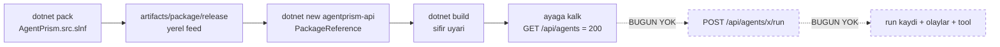

# Faz 95 — Gerçek Tüketici Kapısı

> **Durum:** ✅ Tamamlandı (2026-08-24)
> **Kaynak:** [`kesif/2026-08-23-yapisal-sorun-envanteri.md`](../../kesif/2026-08-23-yapisal-sorun-envanteri.md) — **madde 10** (yeşil test gerçek davranışı kanıtlamıyor) + **madde 22** (bağımlılık kirliliği kuralı kendi istisnasını taşıyor). Kalemler `ADAYLAR.md`'de değildir; F numarası yoktur.
> **Önkoşul:** Yok
> **Paketler:** `src/` **değişmiyor**. İş `tests/AgentPrism.Package.Tests` (bugünkü `AgentPrism.Templates.Tests`) içindedir.
> **Yeni paket:** Yok · **Migration:** Yok
> **Public API:** Büyümüyor — `src/*/PublicAPI.Unshipped.txt` dosyalarına satır eklenmez.
> **Tüketici yüzeyi:** site: `docs-site/src/content/docs/packages.md` → `## What does not enter your graph` bölümü geçişli **beyanı** kazanır (madde 22) · sevk edilen: Yok
> **Manuel test alanı:** [`docs/manuel-test/24-TEST-PAKETI-VE-SABLON.md`](../../manuel-test/24-TEST-PAKETI-VE-SABLON.md)

---

## Bu Faza Başlarken

> `faz-baslangic` skill'ini uygula. Aşağıdaki liste o skill'in 2. adımıdır —
> **tamamını değil, yalnız işaret edilen bölümleri oku.**

1. Bu doküman
2. Kararlar — dosyanın tamamını **okuma**, yalnız bu kalemleri grep'le:
   ```bash
   grep -n "K-007\|K-008\|K-068\|K-205\|K-262\|K-421" docs/KARARLAR.md
   ```
   **K-007** (geçişli sabitleme kapalı), **K-008** (ön sürüm MAF yalnız
   `AgentPrism.AspNetCore` içinde), **K-068** (Faz 7 beklemede — bu yüzden
   paketler yalnız **yerel feed**'den çözülür), **K-205** (`Google.GenAI`
   geçişli ağırlığı bilerek kabul edildi — madde 22'nin kararı), **K-262**
   (`IncludeSymbols=false`), **K-421** (public API takibi açık, `Shipped.txt`
   boş).
3. [`arsiv/fazlar/94-SQL-TEK-KAYNAK.md`](94-SQL-TEK-KAYNAK.md) —
   yalnız devir notu:
   ```bash
   awk '/## Sonraki Faza Devir Notu/,0' docs/arsiv/fazlar/94-SQL-TEK-KAYNAK.md
   ```
   İçindeki `sed -i.bak` + `mv` mtime tuzağı bu fazda da geçerlidir: kapının
   gerçekten bir kusuru yakaladığını sahte kusur enjekte ederek doğrulayacaksın.
4. Alan hafızası (bu faz iki alana dokunuyor):
   [`hafiza/paketleme-ve-dagitim.md`](../../hafiza/paketleme-ve-dagitim.md) (pack
   tuzakları, `AgentPrism.src.slnf` gerekçesi, tüketiciye giden MSBuild) ·
   [`hafiza/test-kosum-tuzaklari.md`](../../hafiza/test-kosum-tuzaklari.md) (**"Alt
   surec ve MSBuild"** bölümü — `MSBUILDDISABLENODEREUSE=1` olmadan fikstür
   asılır).
5. Gerektiğinde: [`.agents/ortak/test-seviyeleri.md`](../../../.agents/ortak/test-seviyeleri.md)

---

## Amaç

AgentPrism bir NuGet paket ailesidir, ama bugün hiçbir kapı **bir paket
tüketicisinin gerçek bir `run` koşturabildiğini** kanıtlamıyor. Bu faz o tek
boşluğu kapatır: `.nupkg`'lerden `PackageReference` ile beslenen bir tüketici
projesi üretilir, içinde ağa çıkmayan bir model ile gerçek bir `run` koşulur ve
`run` kaydı doğrulanır. Aynı fikstür üzerinde ikinci bir kapı, tüketicinin
bağımlılık kapanışını bir taban çizgisine bağlar.

- **Madde 10** — paket tüketicisi üzerinden uçtan uca bir `run`; kayıt, olaylar
  ve tool çağrısı doğrulanır.
- **Madde 22** — geçişli bağımlılık kapanışı ölçülür, taban çizgisine bağlanır
  ve `docs-site`'ta beyan edilir.

### 🚨 Envanterin madde 10 kanıtı KISMEN YANLIŞ — kapsam bu yüzden dar

Envanter "sample uygulamalar CI'da çalıştırılmıyor" diyor ve bunu genel bir
tüketim boşluğu olarak okuyor. Ölçüm bunun büyük kısmını **yanlışlıyor**:
`pack → yerel feed → PackageReference → derle → ayağa kaldır` zinciri **zaten
kurulu ve CI'da koşuyor**. Bu fazın kapsamı, envanterin tarif ettiği işin
tamamı DEĞİL, ölçümle geriye kalan kısmıdır.

### Bugün ne çalışmıyor — doğrulanmış kanıt

| Kanıt | Gözlem |
|---|---|
| [`TemplateFixture.cs:29-56`](../../../tests/AgentPrism.Package.Tests/Infrastructure/TemplateFixture.cs) | Fikstür `dotnet pack AgentPrism.src.slnf` koşar, `artifacts/package/release`'i yerel feed yapar, global paket önbelleğini temizler ve şablonu kurar. **Bu altyapı vardır.** |
| [`TemplateFixture.cs:104-118`](../../../tests/AgentPrism.Package.Tests/Infrastructure/TemplateFixture.cs) | `WriteLocalNuGetConfigAsync` `public static`'tir — şablondan bağımsız bir tüketici projesi için doğrudan kullanılabilir |
| [`TemplateRunTests.cs:16-77`](../../../tests/AgentPrism.Package.Tests/TemplateRunTests.cs) | Tek `run` testi uygulamayı ayağa kaldırır ve **yalnız** `GET /agentprism/api/agents` `200` mü diye bakar. `POST .../run` **hiç çağrılmaz** |
| `grep -rn "api/agents/.*run" tests/AgentPrism.Templates.Tests/` (o zaman `tests/AgentPrism.Package.Tests/`) | **Sıfır sonuç.** Paket tüketicisi üzerinden hiçbir `run` koşmuyor |
| [`samples/AgentPrism.Api.csproj:17`](../../../samples/AgentPrism.Api/AgentPrism.Api.csproj) · [`AgentPrism.Embedded.csproj:8`](../../../samples/AgentPrism.Embedded/AgentPrism.Embedded.csproj) | İki sample da `ProjectReference` taşır. Kendi yorumları söylüyor: *"a real external consumer only takes AgentPrism.Core via PackageReference"* |
| `grep -niE "sample\|smoke" .github/workflows/ci.yml` | **Sıfır satır.** Sample'lar CI'da yalnız derlenir |
| [`AgentPrism.Core.csproj:33-45`](../../../src/AgentPrism.Core/AgentPrism.Core.csproj) | Paketleme katmanının **ölçülmüş** sessiz kusur sınıfı: `analyzers/dotnet/cs/` bir kez BOŞ çıktı ve dört preview paketinden düştü |
| [`AgentPrism.Core.csproj:74-81`](../../../src/AgentPrism.Core/AgentPrism.Core.csproj) | İkinci ölçülmüş sessiz kusur: `<None Update>` çapraz-hedefli projede hiçbir uyarı vermeden dosya düşürdü |
| [`packages.md:189-197`](../../../docs-site/src/content/docs/packages.md) | `## What does not enter your graph` yalnız **girmeyeni** sayar. `Google.GenAI` üzerinden gelen `Newtonsoft.Json` / `System.Management` / `System.CodeDom` site'ta **hiç beyan edilmemiş** |
| [`Directory.Packages.props:99-102`](../../../Directory.Packages.props) | Beyan yalnız bir csproj yorumundadır ve K-205'e atıf yapar |

> Kanıtlar 2026-08-24 tarihinde doğrulandı.

---

## 95.1 — Bugünkü kapı nereye kadar gidiyor



Kapının A–E halkaları vardır. Kapatılacak olan F ve G'dir.

**Ne kazanılır:** `RunRecordingAgent`, `run` kaydı yazımı, token kırılımı,
`run_events` ve üretilmiş tool yürütmesi bugün yalnız `ProjectReference`
üzerinden koşuyor. Paket sınırı bunların hiçbirini görmüyor — oysa paketleme
katmanı bu repoda **iki kez** sessizce kusur üretmiştir (yukarıdaki kanıt
tablosu).

---

## 95.2 — Üretilen tüketici projesi

Şablon **kullanılmaz**. Test kendi projesini yazar; böylece kapı şablondan
bağımsız olarak meta paketin kendisini sınar.

**Proje şekli** (geçici dizine yazılır):

- SDK: `Microsoft.NET.Sdk.Web` — `AgentPrismTestHost` `WebApplication.CreateSlimBuilder()`
  ve `UseTestServer()` kullanır ([`AgentPrismTestHost.cs:63-64`](../../../src/AgentPrism.Testing/AgentPrismTestHost.cs)),
  bu yüzden ASP.NET Core paylaşılan framework'ü gerekir. Uygulama bir port
  **dinlemez**; `TestServer` bellek içidir, yani davranış olarak konsol
  uygulamasıdır.
- `TargetFramework`: `net10.0` — `AgentPrism.Testing` tek TFM'dir (K-263 gerekçesi).
- `PackageReference`: `AgentPrism` (meta) + `AgentPrism.Testing`, ikisi de
  fikstürün çözdüğü `Version` ile.
- `NuGet.config`: `TemplateFixture.WriteLocalNuGetConfigAsync(dir)`.
- Hiçbir test framework'ü paketi alınmaz — `AgentPrism.Testing` bilerek
  framework'süzdür ve `AgentPrismAssertionException` fırlatır.

**Program gövdesi** — sevk edilen yüzeyi tüketici gibi kullanır:

```csharp
using AgentPrism;
using AgentPrism.Testing;
using Microsoft.Agents.AI;

var provider = new FakeModelProvider("fake")
    .CallsTool("order_status", new { orderId = "ORD-7" })
    .EchoesLastToolResult();

await using var host = await AgentPrismTestHost.StartAsync(options =>
{
    options.ModelProvider = provider;
    options.ConfigureAgentPrism = agentPrism => agentPrism
        .AddGeneratedTools()
        .AddAgent(new AgentDefinition
        {
            Name = "assistant",
            DisplayName = "Consumer Assistant",
            Description = "Package consumer smoke agent.",
            Instructions = "Answer briefly.",
            Model = new ModelBinding { Provider = "fake", Model = "fake-1" },
            ToolNames = ["order_status"],
        });
});

var run = await host.RunAsync("assistant", "Where is ORD-7?");

run.ShouldHaveCompleted()
   .ShouldHaveCalledTool("order_status")
   .ShouldHaveOutputContaining("shipped");

Console.WriteLine($"OK run={run.Record.Id} events={run.Events.Count} tools={run.ToolInvocations.Count}");
```

Tool `[AgentPrismTool]` ile ayrı bir dosyada tanımlanır ve sabit bir metin
döndürür (`"ORD-7 shipped"`). `EchoesLastToolResult()` o metni modelin
yanıtına taşır; `ShouldHaveOutputContaining("shipped")` böylece tool'un
**dönüş değerinin** zincirden geri aktığını kanıtlar — yalnız çağrıldığını değil. `AddGeneratedTools()`
**üretilmiş** bir metottur — `src/` altında elle yazılmış tanımı yoktur. Bu
yüzden çağrının derlenmesi, analyzer DLL'inin `.nupkg` içindeki
`analyzers/dotnet/cs/` klasöründen aktığını kanıtlar; `ShouldHaveCalledTool`
ise o üretilmiş tool'un gerçekten **yürütüldüğünü** kanıtlar.

**Test iddiaları** alt sürecin çıkış kodu ve `stdout`'u üzerinden kurulur:
`ExitCode == 0` ve `stdout` `OK run=` ile başlayan satırı taşır.

> **Neden bu şekil:** `run` iddiaları tüketici projesinin **içinde** çalışır.
> Test assembly'si `AgentPrism.Testing`'e referans veremez — o paket aynı
> çözümde üretilir ve bir `PackageReference` döngü kurar. Şablon testlerinin
> kurduğu desen (alt süreç + `stdout` iddiası) bu yüzden korunur.

---

## 95.3 — Geçişli bağımlılık taban çizgisi (madde 22)

Aynı fikstür üzerinde ikinci bir kapı. Üç **tüketici şekli** için bağımlılık
kapanışı ölçülür ve depoya işlenmiş bir taban çizgisiyle karşılaştırılır:

| Şekil | Neden bu şekil |
|---|---|
| `AgentPrism` (meta) | `dotnet add package AgentPrism` diyen tüketicinin aldığı grafiktir |
| `AgentPrism.Core` | Site'in AOT ve "minimum" vaadini taşıyan paket |
| `AgentPrism.Google` | K-205'in bilerek kabul ettiği kirliliğin **tek** kaynağı |

**Ölçüm komutu** (SDK 10.0.100 destekler, doğrulandı):

```bash
dotnet list package --include-transitive --format json
```

Çıktıdan yalnız paket **kimlikleri** alınır; sürüm alınmaz. Sürüm dahil
edilirse taban çizgisi her `Directory.Packages.props` güncellemesinde öter ve
kapı gürültüye dönüşür — bu fazın amacı sürüm takibi değil, **grafiğe yeni bir
adın sessizce girmesini** yakalamaktır.

**Kural:** taban çizgisi `SourceLanguageTests` deseniyle aynıdır — dosya
depodadır, kapı sapmayı bildirir, taban çizgisini büyütmek **bilinçli bir
düzenlemedir**. Yeni bir ad eklendiğinde testin hata mesajı hangi tüketici
şeklinde hangi adın belirdiğini söyler.

**Site beyanı:** `packages.md` içindeki `## What does not enter your graph`
bölümü, girmeyenin yanına **giren geçişli kalemleri** de yazar: `AgentPrism.Google`
seçildiğinde `Newtonsoft.Json`, `System.Management` ve `System.CodeDom` grafiğe
girer; Gemini kullanmayan tüketici hiçbirini almaz. Bu K-205'in tekrarı değil,
onun **tüketiciye dönük** karşılığıdır.

---

## 95.4 — Proje yeniden adlandırma

`AgentPrism.Templates.Tests` → **`AgentPrism.Package.Tests`**.

Gerekçe: proje bugün de şablon dışı şeyleri test ediyor —
`LocalReferenceTests` (buildTransitive hedefleri), `TemplateAgentsFileTests`
(yetenek haritası). Bu fazla birlikte içeriğinin ağırlığı paket tüketimine
kayar. Ad dar kalırsa sonraki oturum testleri yanlış yerde arar.

**Rename yüzeyi — ölçüldü (2026-08-24), 15 dosya:**

| Nerede | Ne değişir |
|---|---|
| `AgentPrism.slnx` · `AgentPrism.no-docker.slnf` | proje yolu |
| `tests/AgentPrism.Package.Tests/*.cs` (12 dosya) | `namespace AgentPrism.Templates.Tests…` → `AgentPrism.Package.Tests…` |
| `.agents/skills/tuketici-dokuman-senkronu/SKILL.md` · `docs/hafiza/paketleme-ve-dagitim.md` · `docs/hafiza/test-kosum-tuzaklari.md` · `docs/manuel-test/24-TEST-PAKETI-VE-SABLON.md` | düz metin geçişleri |

🚨 **`docs/arsiv/` altındaki geçişler DEĞİŞMEZ.** Arşiv tarihsel kayıttır; o
gün proje o addaydı. Ölçüldü: `docs/` ve `.agents/` altında `](../../...)` biçiminde
**hiçbir** bağlantı yoktur — rename bir bağlantı kırmaz.

🚨 `TemplateFixture` adı **korunur**: fikstür hâlâ şablonu kuruyor. Yeni tüketici
testleri aynı fikstürü paylaşır; ikinci bir `dotnet pack` açılmaz.

---

## Planlanan Public API

**Yok.** `src/` değişmez, `PublicAPI.Unshipped.txt` dosyalarına satır eklenmez.

### HTTP `endpoint`'leri

Yok.

### Arayüz payı

Yok — arayüze dokunulmaz.

---

## Planlanan Dosya Listesi

```
tests/AgentPrism.Package.Tests/          (AgentPrism.Templates.Tests'ten yeniden adlandirildi)
├── Infrastructure/
│   ├── ConsumerProject.cs               YENI — tuketici projesini gecici dizine yazar
│   └── TemplateFixture.cs               degisir — yalniz namespace
├── ConsumerRunTests.cs                  YENI — 95.2, gercek run
├── TransitiveDependencyTests.cs         YENI — 95.3, tuketici sekli basina kapanis
└── Baselines/
    └── transitive-dependencies.txt      YENI — islenmis taban cizgisi

docs-site/src/content/docs/
└── packages.md                          degisir — gecisli beyan (95.3)
```

---

## Hata Modları ve Testler

> Mutlu yoldan değil, **ne bozulabilir**den türetilir. Seviyeyi plan seçer.
> Sınır geçen davranış (DI · HTTP · kiracı · akış · depo · **paket**) birim
> testiyle kanıtlanamaz — [`.agents/ortak/test-seviyeleri.md`](../../../.agents/ortak/test-seviyeleri.md).

| Ne bozulabilir | Seviye | Test sınıfı |
|---|---|---|
| Analyzer DLL `.nupkg`'ye girmez; `AddGeneratedTools()` derlenmez | Paket (alt süreç) | `ConsumerRunTests` |
| Analyzer paketten akar ama üretilmiş tool **yürütülmez** | Paket (alt süreç) | `ConsumerRunTests.ShouldHaveCalledTool` |
| `run` başlar ama kaydı `store`'a yazılmaz | Paket (alt süreç) | `ConsumerRunTests.Record` iddiası |
| `run_events` boş kalır | Paket (alt süreç) | `ConsumerRunTests.Events.Count > 0` |
| `buildTransitive/` hedefleri meta paket üzerinden akmaz | Paket | `LocalReferenceTests` (var) |
| Grafiğe yeni bir geçişli paket sessizce girer | Paket (alt süreç) | `TransitiveDependencyTests` |
| Kapı bayat paketle koşar ve yeşil yalan söyler | Fikstür | `TemplateFixture.ClearGlobalPackageCache` (var) |
| Alt süreç MSBuild düğüm yeniden kullanımı yüzünden asılır | Fikstür | `ProcessRunner` `MSBUILDDISABLENODEREUSE=1` (var) |
| Fake model tool çağırmadan yanıt döner (kapı hiçbir şey kanıtlamaz) | Paket (alt süreç) | Sahte kusur enjeksiyonu ile doğrulanır — aşağıdaki DoD |

**Beş soru — yeni kod yolu için:**

| Soru | Cevap |
|---|---|
| İptal | Kapsam dışı: tüketici projesi tek bir `run` koşar ve çıkar. `run` iptali `AgentPrism.AspNetCore.FunctionalTests` içinde kapılıdır |
| Eşzamanlılık | Kapsam dışı: tek `run`. Eşzamanlı `run` davranışı Faz 81'de kapılandı |
| Boş/aşırı girdi | `RunAsync` boş `agentName`'i `ArgumentException` ile reddeder ([`AgentPrismTestHost.cs:95`](../../../src/AgentPrism.Testing/AgentPrismTestHost.cs)); tüketici testi bunu **sınamaz**, sevk edilen davranıştır |
| Başka kiracının kaydı | Kapsam dışı: tüketici projesi tek kiracıdır. Kiracı yalıtımı `TenantIsolationContract` ile dört koşumda kapılıdır |
| Alt sistem hatası | `dotnet restore` yerel feed'i çözemezse test **kırılır** ve `ProcessResult.Combined` hata metnini taşır — sessiz geçiş yoktur |

---

## Manuel Kabul Case'leri

> Kapanışta [`docs/manuel-test/24-TEST-PAKETI-VE-SABLON.md`](../../manuel-test/24-TEST-PAKETI-VE-SABLON.md)
> içine eklenecek case'lerin taslağı. Üçü de otomatikleştirilebilir; kapanışta koşulur.

| # | Ön koşul | Adımlar | Beklenen sonuç |
|---|---|---|---|
| 1 | Temiz depo | `dotnet test tests/AgentPrism.Package.Tests --filter ConsumerRunTests` | Yeşil. Alt süreç `stdout`'u `OK run=<guid> events=<n> tools=1` satırını taşır, `n > 0` |
| 2 | Temiz depo | `Directory.Packages.props`'a `AgentPrism.Google` üzerinden yeni bir geçişli paket girecek bir değişiklik yap; `TransitiveDependencyTests` koş | Test **kırılır** ve mesaj yeni paket adını ve hangi tüketici şeklinde belirdiğini yazar |
| 3 | Temiz depo | `src/AgentPrism.Core/AgentPrism.Core.csproj`'daki `AgentPrismPackGeneratorAssembly` hedefini geçici olarak devre dışı bırak; `ConsumerRunTests` koş | Test **kırılır**: `AddGeneratedTools()` derlenmez. Kapının gerçek kusur sınıfını yakaladığının kanıtı |

🚨 Case 2 ve 3'ten sonra dosyayı geri alırken `touch <dosya>` çalıştır, sonra
derle — yoksa `dotnet build` mtime yüzünden yeniden derlemez ve sahte kusurlu
derlemeyi sessizce test edersin (Faz 94 vakası).

---

## Açık Sorular

> Planı bloklamayan, faz uygulanırken karara bağlanacak sorular.

| # | Soru | Seçenekler | Öneri |
|---|---|---|---|
| 1 | Taban çizgisi 3 tüketici şeklini mi, 19 paketin hepsini mi kapsasın? | A: 3 şekil (meta · Core · Google) · B: paketlenen 19 paketin her biri | **A.** B her paket için ayrı bir restore demektir; kazanç ölçülmedi, maliyet CI süresidir. B'ye geçiş sonradan ucuzdur — taban çizgisi dosyasının biçimi aynı kalır |
| 2 | Tüketici projesi `AgentPrism` meta paketini mi, `AgentPrism.Core` + `AgentPrism.AspNetCore`'u ayrı ayrı mı alsın? | A: meta · B: ayrı | **A.** Meta paket `IncludeBuildOutput=false` sınıfındadır ve K-262/K-263'ün tuzak alanıdır; sınanması gereken odur |
| 3 | `ConsumerRunTests` `no-docker.slnf` içinde kalsın mı? | A: kalsın · B: yalnız tam koşumda | **A.** Docker istemez; Docker'sız makinede en değerli kapıdır |
| 4 | Sahte kusur enjeksiyonu (case 3) kalıcı bir teste mi dönüşsün? | A: yalnız manuel case · B: otomatik | **A.** B, `.csproj`'u koşum anında değiştirmeyi gerektirir; bu depoda mtime tuzağı üretmiş bir sınıftır |

---

## Bitiş Ölçütleri (DoD)

- [x] `dotnet test tests/AgentPrism.Package.Tests` yeşil; `ConsumerRunTests` alt sürecin `stdout`'unda `OK run=` satırını doğruluyor
- [x] `ConsumerRunTests` üretilmiş bir tool'un **yürütüldüğünü** kanıtlıyor (`ShouldHaveCalledTool`)
- [x] `ConsumerRunTests` `run` kaydını ve en az bir `run_event`'i doğruluyor
- [x] Manuel case 3 koşuldu: analyzer paketleme hedefi devre dışıyken kapı **kırılıyor** — çıktı belgeye yazıldı (MT-TEST-071)
- [x] `TransitiveDependencyTests` üç tüketici şekli için taban çizgisiyle eşleşiyor; manuel case 2 koşuldu ve kapı **kırıldı** (MT-TEST-072)
- [x] `AgentPrism.Templates.Tests` → `AgentPrism.Package.Tests` yeniden adlandırması tamam; `AgentPrism.slnx` ve `AgentPrism.no-docker.slnf` güncel; `docs/arsiv/` **değişmedi**
- [x] Dört doğrulama kapısı sıfır uyarı verir
- [x] `samples/AgentPrism.Api` ile gerçek `run` yapıldı, çıktı belgeye yazıldı
- [x] `secret` taraması boş döndü
- [x] Manuel kabul case'leri `docs/manuel-test/24-TEST-PAKETI-VE-SABLON.md` içine eklendi; üçü de koşuldu (MT-TEST-070/071/072)
- [x] `faz-denetim` koşuldu; 🔴 bulgu kalmadı (1 🟡 bulundu, düzeltildi)
- [x] `docs-site/packages.md` geçişli beyanı taşıyor; `npm run check` (dört alt kapı) temiz

### Doğrulama komutları

```bash
# 95.2 — tuketici run kapisi
python3 scripts/kapi.py test --proje AgentPrism.Package.Tests --sinif ConsumerRunTests

# 95.3 — gecisli kapanis, tek sekil icin elle
cd "$(mktemp -d)" && dotnet new web -n Probe && cd Probe
dotnet add package AgentPrism --version <packed> --source <repo>/artifacts/package/release
dotnet list package --include-transitive --format json | python3 -c "import json,sys;d=json.load(sys.stdin);print(len(d))"

# rename tamligi — arsiv haric hicbir canli dosyada eski ad kalmamali
grep -rln "AgentPrism\.Templates\.Tests" --exclude-dir=.git --exclude-dir=arsiv . 
```

---

## Riskler

| Risk | Önlem |
|------|-------|
| Alt süreç MSBuild düğüm yeniden kullanımı fikstürü ~15 dk asar (Faz 47 vakası) | `ProcessRunner` `MSBUILDDISABLENODEREUSE=1` veriyor. Yeni alt süreç **aynı** `ProcessRunner` üzerinden çağrılır; `Process.Start` doğrudan kullanılmaz |
| `dotnet pack` aynı sürümü ürettiği için tüketici bayat paketle derlenir | `TemplateFixture.ClearGlobalPackageCache` zaten koşuyor; yeni test **aynı** fikstürü paylaşır |
| CI süresi büyür | Fikstür tek pack koşuyor ve `AgentPrism.src.slnf` sayesinde warm pack ~30 sn ölçülmüş (Faz 39). Yeni testler restore + build + tek `run` ekler; **kapanışta ölçülüp yazılacak** |
| Taban çizgisi sürüm gürültüsü üretir | Yalnız paket **kimlikleri** karşılaştırılır, sürümler değil (95.3) |
| Tüketici projesi ASP.NET Core paylaşılan framework'ünü çözemez | `Microsoft.NET.Sdk.Web` seçildi. Çözülmezse hata alt sürecin `Combined` çıktısında görünür; sessiz geçiş yoktur |
| Rename `docs/arsiv/` içindeki tarihsel kaydı bozar | Arşive **dokunulmaz**; DoD bunu ayrı bir satır olarak ölçüyor |

---

<!-- ============================================================
     AŞAĞISI KAPANIŞTA DOLDURULUR — `faz-tamamlama` skill'i.
     Plan anında boş kalır. Başlıkları SİLME.
     ============================================================ -->

## Plandan Sapmalar

- **95.3'ün taban çizgisi elle yazılmadı, ölçüldü.** Plan `Google.GenAI`'ın
  "11 geçişli bağımlılık" taşıdığını söylüyordu (K-205'in eski ölçümü);
  bugünkü gerçek ölçüm (`dotnet list package --include-transitive`, 2026-08-24,
  SDK 10.0.100) `AgentPrism.Google` şekli için **39** paket kimliği verdi (meta
  `AgentPrism`: 71, `AgentPrism.Core`: 30). Fark bir kusur değil — paket
  sürümleri Faz 8'den beri ilerledi. `Baselines/transitive-dependencies.txt`
  bu ÇALIŞTIRMA anındaki gerçek grafiği taşır.
- **`packages.md`'ye eklenen "What enters your graph if you opt in" bölümü
  denetimde bir 🟡 bulgu aldı ve daraltıldı.** İlk yazım "diğer üç sağlayıcı
  paketi yalnız Microsoft/System paketi ekler" diye ölçülmemiş bir iddia
  taşıyordu; `Baselines/transitive-dependencies.txt`'in `# AgentPrism`
  bölümü `OpenAI` paket kimliğini (SDK'nın kendisi) taşıdığı için cümle
  yanıltıcıydı. Cümle kaldırıldı; yalnız ölçülen `AgentPrism.Google` kalemi
  kaldı.
- **Manuel case'ler yeni bir "İzlek" harfi açmadı.** Plan izlek şemasına
  değinmiyordu; mevcut dosyanın İzlek A (yerel NuGet feed / paketleme)
  kategorisi kullanıldı — MT-TEST-070/071/072 üçü de A.
- Planın öngördüğü her şey (95.2, 95.3, 95.4, rename yüzeyi, DoD komutları)
  birebir uygulandı; kapsam veya yapısal bir sapma yaşanmadı.

## Bu Fazda Verilen Kararlar

Yok. Bu faz `src/` değiştirmedi, yeni public API/uyumluluk sözleşmesi,
güvenlik/kiracı sınırı veya kalıcı veri/migration kararı içermedi — yalnız
test altyapısı ve doküman beyanı eklendi. `docs/KARARLAR.md`'ye yeni bir
`K-NNN` girilmedi (AGENTS.md'nin karar defteri eşiği).

## Gerçekleşen Public API

Yok. `src/*/PublicAPI.Unshipped.txt` dosyalarına satır eklenmedi — planla
birebir aynı.

## Dosya Listesi (gerçekleşen)

```
tests/AgentPrism.Package.Tests/          (AgentPrism.Templates.Tests'ten yeniden adlandırıldı, git mv)
├── Infrastructure/
│   ├── ConsumerProject.cs               YENİ — .csproj + Program.cs + OrderTools.cs'yi gecici dizine yazar
│   ├── DependencyProbe.cs               YENİ — dotnet restore + list package --include-transitive --format json
│   ├── TransitiveDependencyBaseline.cs  YENİ — Baselines/*.txt'i # basliklariyla okur
│   ├── TemplateFixture.cs               değişti — yalnız namespace
│   └── (diğer 4 dosya)                  değişti — yalnız namespace
├── ConsumerRunTests.cs                  YENİ — 95.2, gerçek paket tüketicisi run'ı
├── TransitiveDependencyTests.cs         YENİ — 95.3, [Theory] ile üç tüketici şekli
├── Baselines/
│   └── transitive-dependencies.txt      YENİ — ölçülmüş taban çizgisi (149 satır, 3 bölüm)
└── (diğer 7 test dosyası)               değişti — yalnız namespace

docs-site/src/content/docs/
└── packages.md                          değişti — "What enters your graph if you opt in" bölümü

docs-site/public/llms-full.txt           yeniden üretildi (build-agent-map.mjs)

AgentPrism.slnx · AgentPrism.no-docker.slnf   değişti — proje yolu

docs/manuel-test/24-TEST-PAKETI-VE-SABLON.md  değişti — MT-TEST-070/071/072 eklendi
docs/manuel-test/00-INDEKS.md                 değişti — durum satırı (41→44 case)
docs/hafiza/paketleme-ve-dagitim.md · test-kosum-tuzaklari.md   değişti — rename metin geçişi + F-102 yeni vaka notu
.agents/skills/tuketici-dokuman-senkronu/SKILL.md   değişti — rename metin geçişi
```

## Denetim Bulguları

`faz-denetim` skill'i taze bağlamlı bir agent ile koşuldu (git diff çalışma
ağacına karşı, taban `a1bc6e85319ec442f975f59b4559933ceda1f545`).

- **🔴 yok.**
- **🟡 1 — `packages.md`'nin yeni bölümü ölçülmeyen bir iddia taşıyordu**
  ("diğer üç sağlayıcı paketi yalnız Microsoft/System paketi ekler" — bu
  fazın ölçtüğü taban çizgisi dosyası bunu doğrulamıyordu, çünkü `AgentPrism`
  meta şeklinin listesi `OpenAI` SDK'sının kendisini de içeriyordu).
  **Sonuç: düzeltildi** — iddia kaldırıldı, yalnız ölçülen `AgentPrism.Google`
  kalemi bırakıldı.
- **🟢 1 — `TransitiveDependencyTests` yalnız 3 tüketici şeklini kapsıyor**,
  paketlenen 19 paketin tamamı değil. Planın kendi Açık Soru 1'i zaten bunu
  bilinçli olarak seçmişti (CI süresi maliyeti > ölçülmemiş kazanç).
  **Sonuç: devredilmedi** — plan zaten gerekçeliyordu, yeni bir `F-NN` açmaya
  gerek görülmedi.

Denetim başlıklarının temiz çıktığı bölümler: 3.1 (DoD'nin her satırı kodda/
testte karşılığını buluyor), 3.2 (test tiyatrosu yok), 3.3 (paket sınırı alt
süreç testiyle doğru seviyede kanıtlanmış), 3.4 (restore/build/run hataları
sessiz geçmiyor), 3.5 (imza-gövde eşleşmesi tam), 3.6 (public API büyümedi),
3.7 (dil/`secret`/MAF sarmalama kuralları temiz), 3.8 (rename tamlığı ölçüldü,
`llms-full.txt` senkron, manuel case'ler eklendi ve koşuldu).

## Sonraki Faza Devir Notu

**Devralınan sözleşmeler:**
- `tests/AgentPrism.Package.Tests` artık paket tüketimi ve şablon testlerinin
  **ortak** yeridir; yeni bir paket-sınırı testi (`ConsumerRunTests`,
  `TransitiveDependencyTests` desenleri) buraya eklenir.
- `ConsumerProject.WriteAsync(version, dir)` ve `DependencyProbe.ResolveGraphAsync(packageId, version, dir)`
  `internal` yardımcılardır (`Infrastructure/`) — aynı projedeki başka bir
  test sınıfı bunları doğrudan çağırabilir.
- `Baselines/transitive-dependencies.txt` yalnız **paket kimliklerini**
  taşır, sürüm taşımaz; yeni bir tüketici şekli eklenecekse aynı `# <şekil>`
  başlık deseni izlenir (`TransitiveDependencyBaseline.Read`).

**Bilinen tuzaklar (🚨):**
- 🚨 Yeni bir test dosyasına **"Faz NN"** yazma — repo kuralı **"Phase NN"**
  (İngilizce). `SourceLanguageTests`'in Türkçe kelime listesi `faz` kelimesini
  taşır ve bunu kapıda yakalar (bu fazda gerçekten yakaladı, düzeltildi).
- 🚨 Tam çözüm test koşumunda (`dotnet test AgentPrism.slnx`) tek bir
  projenin izole/tek başına geçtiği hâlde tam koşumda düşmesi **artık
  `Ui.E2ETests`'e özgü değil** — bu fazın kapanışında `Workflows.UnitTests`
  de aynı deseni gösterdi (bkz. `docs/hafiza/test-kosum-tuzaklari.md`, F-102
  ikinci vaka). Kapanışta bir proje kırmızı geldiğinde önce izole tekrar,
  sonra tam koşum tekrarı ile ayrıştır — hangi proje olduğuna bakmadan.
- 🚨 Bu makinedeki `ap-pg` konteynerinin `agentprism` şeması hâlâ eski bir
  migration checksum'ı taşıyor (Faz 94'ten devralınan durum, bu fazda da
  gözlemlendi): `samples/AgentPrism.Api`'yi varsayılan `AgentPrism:PostgreSql:SchemaName`
  ile başlatmak `0032_tenant_provider_bindings` checksum hatasıyla çöker.
  Bu fazda `AgentPrism__PostgreSql__SchemaName` ortam değişkeniyle geçici bir
  şema (`agentprism_faz95_probe`) kullanılarak atlatıldı. Konteyner henüz
  tazelenmedi.

**Yarım kalan iş:** Yok.

**Sıradaki faz:** Yok — `docs/ADAYLAR.md`'den yeni bir `F-NN` seçilmeli.
