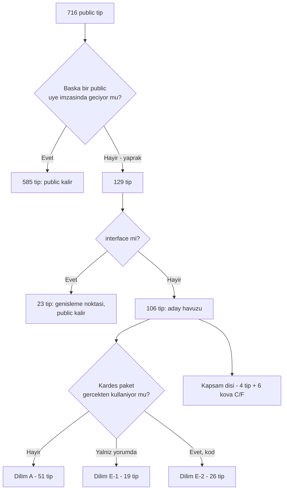

# Faz 96 — Public Yüzey Küçültme

> **Durum:** ✅ Tamamlandı (2026-08-24)
> **Kaynak:** [`kesif/2026-08-23-yapisal-sorun-envanteri.md`](../../kesif/2026-08-23-yapisal-sorun-envanteri.md) — **madde 7** (public yüzey yayın kararından önce şişti). Kalem `ADAYLAR.md`'de değildir; F numarası yoktur. Sıra bölüm 7.2'de kullanıcı tarafından sabitlendi (sıra 2).
> **Önkoşul:** [Faz 95](95-GERCEK-TUKETICI-KAPISI.md) — bir tipi `internal`'a çekmek gerçek tüketiciyi kırabilir; bunu yalnız `PackageReference` ile derlenen bir proje ölçer. Faz 95'in `ConsumerRunTests`'i o dedektördür ve **kurulmuştur**.
> **Paketler:** `AgentPrism.Core`, `.Abstractions`, `.AspNetCore`, `.Mcp`, `.OpenAI`, `.Anthropic`, `.Azure`, `.Google`, `.Voice`, `.PostgreSql`, `.SqlServer`, `.Sqlite`
> **Yeni paket:** Yok · **Migration:** Yok
> **Public API:** **Küçülüyor.** `PublicAPI.Unshipped.txt` dosyalarından satır **silinir**. `Shipped.txt` dosyalarının hepsi boştur (ölçüldü: `wc -l src/*/PublicAPI.Shipped.txt` → 16 dosya × 1 satır) — bugün silmek bedavadır, Faz 97'den sonra bir sürüm kararıdır.
> **Tüketici yüzeyi:** site: `docs-site/src/content/docs/api/` **üretilir** ve küçülür (bugün 732 dosya); elle yazılmış sayfalarda tip adı geçerse düzeltilir · sevk edilen: `internal`'a çekilen tipin XML dokümanı artık paketle sevk edilmez — `<see cref>` bağı kıran her yer düzeltilir
> **Manuel test alanı:** [`docs/manuel-test/01-KURULUM-VE-PAKETLEME.md`](../../manuel-test/01-KURULUM-VE-PAKETLEME.md) — alan kodu `PKG`, sıradaki case `MT-PKG-094`

---

## Bu Faza Başlarken

> `faz-baslangic` skill'ini uygula. Aşağıdaki liste o skill'in 2. adımıdır —
> **tamamını değil, yalnız işaret edilen bölümleri oku.**

1. Bu doküman
2. Kararlar — dosyanın tamamını **okuma**, yalnız bu kalemleri grep'le:
   ```bash
   grep -n "K-421\|K-424\|K-285\|K-176\|K-247\|K-068" docs/KARARLAR.md
   ```
   **K-421** (public API takibi Faz 60'ta açıldı, yayından bağımsız) ·
   **K-424** (`Generators`, `Templates`, `Client`, `Cli` takipten **bilerek** hariç) ·
   **K-285** (`SingletonGuard` `internal` yapılamadı — bu fazda **yeniden açılıyor**) ·
   **K-176** (`Sql.Shared` bir csproj değildir; kaynağı üç sağlayıcıya derlenir) ·
   **K-247** (Core, `Sql.Shared`'ı referans edemez) ·
   **K-068** (Faz 7 yayın beklemede)
3. [`arsiv/fazlar/95-GERCEK-TUKETICI-KAPISI.md`](95-GERCEK-TUKETICI-KAPISI.md) — yalnız devir notu:
   ```bash
   awk '/## Sonraki Faza Devir Notu/,0' docs/arsiv/fazlar/95-GERCEK-TUKETICI-KAPISI.md
   ```
   `ConsumerProject.WriteAsync` ve `TransitiveDependencyBaseline` sözleşmeleri devralınır; bu faz `ConsumerProject`'i **genişletir**.
4. Alan hafızası (bu faz iki alana dokunuyor):
   [`hafiza/build-ve-analyzer.md`](../../hafiza/build-ve-analyzer.md) (`RS0016`/`RS0017` davranışı, `dotnet format analyzers` turu) ·
   [`hafiza/paketleme-ve-dagitim.md`](../../hafiza/paketleme-ve-dagitim.md) (paket sınırı, `IsPackable`)
5. Gerektiğinde, tamamı değil ilgili bölümü:
   [`MIMARI.md`](../../MIMARI.md) — katman bölümü (`Abstractions` → `Core` → `AspNetCore` yönü)

---

## Amaç

AgentPrism 716 public tip ve 8.063 API girdisi ile hiç yayınlanmadı. Yüzeyi
küçültmenin bedeli **bugün sıfırdır**: `Shipped.txt` dosyalarının hepsi boştur,
yani hiçbir tip henüz bir uyumluluk sözü taşımıyor. Faz 97 (yayın) `Unshipped`'i
`Shipped`'e taşıdığı an her satır bir söze dönüşür ve geri almak kırıcı bir
değişiklik olur.

Bu faz, tüketicinin **asla adlandırmayacağı** tipleri `internal`'a çeker. Hedef
tip sayısını azaltmaktır, girdi sayısını değil: 8.063 girdinin büyük kısmı
`Options` erişimcisidir (`Abstractions`'ta 1.250 `get` + 1.170 `set/init`) ve
bunlar tip kaldırılmadan küçülmez.

- **Madde 7** — public yüzeyi Faz 97'den önce küçült ve yeniden büyümesini bir
  kapıya bağla.

### Bugün ne çalışmıyor — doğrulanmış kanıt

| Kanıt | Gözlem |
|---|---|
| `find src -name PublicAPI.Unshipped.txt -exec cat {} + \| grep -vE '^\s*$\|^#' \| wc -l` | **8.063** girdi |
| aynı komut + `grep -vE ' -> \|\('` | **716** public tip · 339'u `AgentPrism.Abstractions`'ta |
| `wc -l src/*/PublicAPI.Shipped.txt` | 16 dosya, her biri **1 satır** (`#nullable enable`) — hiçbir tip sevk edilmiş sayılmıyor |
| [`src/AgentPrism.Core/Properties/AssemblyInfo.cs:6,14`](../../../src/AgentPrism.Core/Properties/AssemblyInfo.cs) | `InternalsVisibleTo` **`AgentPrism.AspNetCore`** ve **`AgentPrism.Mcp`** için zaten var (Faz 88'de eklendi) |
| [`src/Directory.Build.props:85-89`](../../../src/Directory.Build.props) | Test görünürlüğü `$(MSBuildProjectName).UnitTests/.IntegrationTests/.FunctionalTests` desenine bağlı |
| [`src/AgentPrism.Core/AgentPrismImageOptions.cs:36`](../../../src/AgentPrism.Core/AgentPrismImageOptions.cs) | `AgentPrismImageOptionsValidator` **zaten `internal`** — sınıfın internalleştirilebilirliği repo'da kanıtlı |
| [`Directory.Build.targets:35-39`](../../../Directory.Build.targets) | `AdditionalFiles` yalnız `Exists('PublicAPI.Unshipped.txt')` iken eklenir; dosya yoksa analyzer sessizce hiçbir şey izlemez |

> Kanıtlar 2026-08-24 tarihinde doğrulandı.

---

## 96.1 — 🚨 Ölçüt: ad araması değil, erişilebilirlik

Keşif turunun bölüm 7.3'ü şu ölçütü öneriyordu: *"`src/` dışından hiç referans
almayan tip `internal`'a çekilir."* **Bu ölçüt ölçüldü ve yanlışlandı.** Körü
körüne uygulanırsa her paketin giriş noktası kapanır.

Ad araması üç yanlış pozitif sınıfı üretir:

| Sınıf | Neden görünmez | Ölçülen vaka |
|---|---|---|
| **Uzatma metodu sınıfı** | Çağrı yerinde sınıf adı **yazılmaz** — `AddAgentPrismSqlite(...)` yazılır, `AgentPrismSqliteBuilderExtensions` değil | Hiçbir yerde adı geçmeyen 57 tipin **22'si** `*Extensions`; `AgentPrismUiBuilderExtensions`, `VoiceBuilderExtensions`, `AgentPrismWorkflowsBuilderExtensions` dahil |
| **Öznitelik tipi** | C# `Attribute` sonekini düşürür — `[AgentPrismTool]` yazılır, `AgentPrismToolAttribute` değil | `AgentPrismToolAttribute` "yalnız Core+Generators kullanıyor" göründü; oysa Faz 95'in tüketici projesi onu **kullanıyor** ([`ConsumerProject.cs`](../../../tests/AgentPrism.Package.Tests/Infrastructure/ConsumerProject.cs)) |
| **Yorum referansı** | `<see cref="X"/>` bir kullanım değildir, ama `internal` olunca **CS1574 üretir** ve `TreatWarningsAsErrors` build'i kırar | Kova E'nin 49 tipinin **19'unda** çapraz-paket referansı yalnız yorumdadır |

**Bu fazın ölçütü bunun yerine erişilebilirliktir:**

> Bir tip, **başka hiçbir public üye imzasında geçmiyorsa** yapraktır. Yaprak
> olmayan tip `internal` yapılamaz — tüketici ona zaten başka bir public üye
> üzerinden ulaşır.

Ölçüldü: 714 tipin **129'u** yapraktır. 23'ü `interface`tir ve genişleme noktası
sayılır (tüketici uygular) — public kalır. Kalan **106 tip** aday havuzudur.



**Her aday elle doğrulanır.** Ölçüm havuzu daraltır, kararı vermez. Bir tip
`internal` yapılmadan önce üç soru cevaplanır ve cevabı `PublicAPI.Unshipped.txt`
diff'inin yanına, fazın kapanış bölümüne yazılır:

1. Tüketici bu tipi `new` ile kurar mı, statik üyesini çağırır mı, `typeof` ile
   adlandırır mı?
2. DI'da bir arayüz arkasında mı kayıtlı? (Öyleyse tüketici arayüzü görür,
   uygulamayı değil — `internal` güvenlidir.)
3. `docs-site`'ın **elle yazılmış** bir sayfası veya bir paket `README.md`'si onu
   adlandırıyor mu? (`api/` ve `http-api/` üretilir; onlar sayılmaz.)

---

## 96.2 — Dilim A: yeni `InternalsVisibleTo` gerektirmeyen 51 tip

Bu tipler kendi derlemesi dışında **hiçbir yerde** kod olarak geçmez. Test
projeleri onları adlandırır, ama `src/Directory.Build.props:85-89`'daki mevcut
`InternalsVisibleTo` deseni 78 tipin 70'ini zaten kapsar.

- **Core** (40): `AesGcmContentProtector`, `AgentPrismContentProtectionOptionsValidator`, `AgentPrismDrainOptionsValidator`, `AgentPrismOptionsValidator`, `AgentPrismQuotaOptionsValidator`, `AgentPrismRetentionOptionsValidator`, `AgentPrismRunContinuationOptionsValidator`, `AgentPrismSchedulingOptionsValidator`, `AgentPrismWebhookOptionsValidator`, `CodeAgentSource`, `CompositeAgentCatalog`, `DefaultRunErrorClassifier`, `DefinitionStoreAgentSource`, `InMemoryAgentSkillStore`, `InMemoryApiKeyStore`, `InMemoryAttachmentStore`, `InMemoryAuditLog`, `InMemoryEvalStore`, `InMemoryMcpServerStore`, `InMemorySkillScriptGrantStore`, `InMemoryTenantEgressPolicyStore`, `InMemoryTenantProviderBindingStore`, `InMemoryTenantStore`, `InMemoryToolApprovalRuleStore`, `InMemoryTraceStore`, `InMemoryWebhookStore`, `ModelRunJudge`, `OnlineEvaluationOptionsValidator`, `OpenTelemetryAgentDecorator`, `PatternContentGuard`, `QuotaUsageObserver`, `RetentionJobHandler`, `RunCancellationRegistry`, `RunPricingResolver`, `RunReconciliationOptionsValidator`, `RunRecordingAgentDecorator`, `SingletonExecutionOptionsValidator`, `ToolApprovalAgentDecorator`, `WebhookDeliveryJobHandler`, `WebhookPublisher`
- **Anthropic** (2): `AnthropicModelProvider`, `AnthropicProviderOptionsValidator`
- **Azure** (2): `AzureOpenAIModelProvider`, `AzureOpenAIProviderOptionsValidator`
- **Google** (2): `GoogleModelProvider`, `GoogleProviderOptionsValidator`
- **OpenAI** (1): `OpenAIProviderOptionsValidator`
- **PostgreSql** (1): `AgentPrismPostgreSqlOptionsValidator`
- **SqlServer** (1): `AgentPrismSqlServerOptionsValidator`
- **Sqlite** (1): `AgentPrismSqliteOptionsValidator`
- **Voice** (1): `VoiceOptionsValidator`

**En temiz alt sınıf 19 `*OptionsValidator`'dır.** Hepsi `IValidateOptions<T>`
uygular, hepsi kendi paketinin `Add*` uzantısında DI'ya kaydedilir ve hiçbiri
başka bir public imzada geçmez. Repo'da zaten `internal` bir örneği vardır
(`AgentPrismImageOptionsValidator`).

> 🚨 **Bir istisna ölçüldü.** `OpenAIProviderOptionsValidator` `AgentPrism.Azure`
> tarafından **gerçek kodda** kullanılır
> ([`src/AgentPrism.Azure/AzureOpenAIProviderOptionsValidator.cs`](../../../src/AgentPrism.Azure/AzureOpenAIProviderOptionsValidator.cs)).
> `AgentPrism.OpenAI` → `AgentPrism.Azure` için bir `InternalsVisibleTo` gerekir
> ya da tip public kalır. Açık Soru 2.

**`InternalsVisibleTo` deseni dışında kalan 8 tip** — bunların testi
`AgentPrism.AspNetCore.FunctionalTests` (3), `AgentPrism.Mcp.UnitTests` (2),
`AgentPrism.Workflows.UnitTests` (1), üç SQL `IntegrationTests` projesi (1) ve
`AgentPrism.Core.UnitTests` (1) içindedir. Her biri için iki seçenek vardır:
testi doğru projeye taşımak ya da hedefli bir `InternalsVisibleTo` eklemek.
Uygulama anında tip tip karara bağlanır ve karar kapanış bölümüne yazılır.

---

## 96.3 — Dilim E: kardeş paketlerin gördüğü 45 tip

### E-1 — çapraz-paket referansı yalnız yorumda olan 19 tip

Bu tiplerin adı başka bir pakette geçer, ama **yalnız `<see cref>` içinde**.
Düz `internal` yapılır; kıran her `<see cref="X"/>` `<c>X</c>` olur.

- **Core** (17): `AllowAllToolAuthorizationHandler`, `AmbientAuditActorResolver`, `InMemoryExperimentStore`, `InMemoryIdempotencyStore`, `InMemoryInboundTriggerStore`, `InMemoryJobScheduleStore`, `InMemoryJobStore`, `InMemoryPendingApprovalStore`, `InMemoryQuotaStore`, `InMemoryRetentionPolicyStore`, `InMemoryRunInputStore`, `InMemoryRunScoreStore`, `InMemorySingletonLeaseStore`, `InMemoryVoiceSessionStore`, `InMemoryWorkflowDefinitionStore`, `NullDataSubjectStore`, `NullRetentionStore`
- **Mcp** (1): `McpToolRegistry`
- **OpenAI** (1): `OpenAIModelProvider`

> 🚨 `<see cref>` bir kullanım değildir **ama bir bağımlılıktır**. `internal`
> olan bir tipe başka bir derlemeden `cref` verildiğinde derleyici **CS1574**
> üretir ve bu repo'da `TreatWarningsAsErrors` açıktır — build kırılır. Tipi
> `internal` yapan her adım, o tipe `cref` veren dosyaları da düzeltmelidir.
> Bu, `Sql.Shared` için özellikle geçerlidir: kaynağı üç sağlayıcı paketine
> ayrı ayrı derlenir (K-176), yani bir `cref` hatası üç kere öter.

### E-2 — gerçek kod referansı olan 26 tip

| Kullanan | Tip | `InternalsVisibleTo` |
|---|---|---|
| `AspNetCore` (15) | `AgentDefinitionValidator`, `ContextWindowEstimator`, `ConversationBranchService`, `EvalCheckRegistry`, `ExperimentAssignmentResolver`, `InMemoryAgentDefinitionStore`, `InMemorySessionStore`, `InboundTriggerDispatcher`, `KnowledgeIngestionService`, `OnlineEvalJobHandler`, `RunCostRecalculationService`, `RunReplayService`, `RunToCasePromoter`, `SessionConversationResolver`, `VoiceConversationDriver` | ✅ **zaten var** |
| `Mcp` (2) | `SingletonGuard`, `ToolRegistry` | ✅ **zaten var** |
| `PostgreSql`+`SqlServer`+`Sqlite` (8) | `AuditingAgentDefinitionStore`, `AuditingExperimentStore`, `AuditingMcpServerStore`, `AuditingSessionStore`, `AuditingSkillScriptGrantStore`, `AuditingTenantStore`, `AuditingToolApprovalRuleStore`, `AuditingWorkflowDefinitionStore` | 🆕 **3 yeni girdi** |
| `AspNetCore`+`PostgreSql` (1) | `InMemoryRunStore` | aynı 3 girdi |

Toplam yeni `InternalsVisibleTo`: **üç satır** — `AgentPrism.Core` →
`AgentPrism.PostgreSql`, `.SqlServer`, `.Sqlite`. Aile geneli görünürlük
açılmaz.

> 💡 **K-285 yeniden açılıyor.** K-285 (2026-08-07) `SingletonGuard`'ı public
> bırakmıştı, çünkü `AgentPrism.Mcp` Core'un `internal`'ını göremiyordu.
> `InternalsVisibleTo("AgentPrism.Mcp")` **Faz 88'de eklendi** (2026-08-23,
> `AssemblyInfo.cs:14`) ve K-285'in engeli ortadan kalktı. K-285'in kendi
> "yeniden açılma koşulu" farklı bir şey söylüyordu (paket birleşmesi); gerçek
> çözüm başka bir kapıdan geldi. Bu, kapanışta yeni bir `K-NNN` gerektirir.

### Kapsam dışı — ölçülüp elenen 4 tip

| Tip | Neden dışarıda |
|---|---|
| `AgentPrismToolAttribute` (`Abstractions`) | Öznitelik yanlış pozitifi — tüketici `[AgentPrismTool]` yazar. **Public kalır** |
| `SchemaReadyGate` (`Abstractions`) | Dört paket kullanıyor; `Abstractions`'tan aile geneli görünürlük açmak bu fazın sınırı dışında |
| `ChatHistoryState` (`Abstractions`) | Aynı gerekçe (`Core` + `Sql.Shared`) |
| `ProviderCredentialClientCache` (`Core`) | Tek tip için **dört** yeni `InternalsVisibleTo` girdisi; oran kötü |

### 🚨 Ölçülüp düşen kalem: `Abstractions` → `Core` taşıma

Keşif turunun 7.3'ü ve bu fazın ilk taslağı, `Abstractions`'ın "yalnız tek bir
paket tarafından kullanılan 30 tipini" `Core`'a taşımayı öneriyordu. **Ölçüldü
ve düştü — bu iş plana girmez.** Gerekçe kayda geçiriliyor ki tekrar
önerilmesin:

- 30 tipin **24'ü** yine `Abstractions`'ın kendi public imzalarında geçiyor
  (`ContentGuardResult`, `ContentGuardContext`, `JobContext`, `QuotaMetric`,
  `RunJudgment`, `WebhookRunSummary`…). `Core`, `Abstractions`'a bağımlıdır;
  `Abstractions`'ın bir imzası `Core`'daki bir tipi **adlandıramaz**. Taşıma
  mekanik olarak imkânsızdır.
- Taşınabilen 6 tipin hepsi genişleme noktasıdır (`IJobHandler`, `IAgentSource`,
  `IRunPricingResolver`, `IVersionedAgentSource`, `ToolApprovalContext`,
  `ToolApprovalPolicyDecision`) ve public kalmak zorundadır.
- **Net yüzey azalması: 0 tip.** Kazanç yalnız katman hijyeniydi; maliyeti
  geçişli risk ve `PublicAPI` diff gürültüsüydü.

---

## 96.4 — Beyan kapısı: takipsiz paket sessizce eklenemesin

[`Directory.Build.targets:35-39`](../../../Directory.Build.targets) `AdditionalFiles`'ı
yalnız dosya **varsa** ekler. `src/Directory.Build.props:66-77` ise dört projeyi
`AgentPrismPublicApiTrackingEnabled=false` ile **bilerek** hariç tutar (K-424):
`Generators`, `Templates` (tüketiciye dönük API yüzeyi yok) ve `Client`, `Cli`
(yüzeyleri OpenAPI belgesinden üretilir ve kendi drift kapıları vardır —
[`ClientDescriptionBaselineTests.cs`](../../../tests/AgentPrism.Client.UnitTests/ClientDescriptionBaselineTests.cs)).

**Bu dört istisnaya dokunulmaz.** Kapanmayan sınıf şudur: yarın eklenen
packable bir paket her iki dosyayı da unutursa, `AgentPrismPublicApiTrackingEnabled`
`true` kalır, `AdditionalFiles` boş gelir ve analyzer **hiçbir şey** izlemez —
sessizce.

Kapı bir mimari testtir: `src/` altındaki packable her proje ya
`PublicAPI.Shipped.txt` **ve** `PublicAPI.Unshipped.txt` taşır, ya da kendi
csproj'unda `AgentPrismPublicApiTrackingEnabled=false` yazar. Üçüncü bir durum
hatadır. Kaynak dosyalardan okur (derlenmiş assembly'den değil), tıpkı
`DependencyDirectionTests` ve `SourceLanguageTests` gibi.

---

## 96.5 — Taban çizgili tip sayısı kapısı

Yüzeyin yeniden büyümesi `PublicAPI.Unshipped.txt` diff'inde görünür, ama
görünmek bir kapı değildir. Repo'nun kanıtlanmış deseni mandaldır
(`source-language-baseline.txt`, `ambient-write-baseline.txt`,
`playwright-locator-baseline.txt`, `client-description-baseline.txt`): sayı
**yalnız küçülebilir**.

`public-surface-baseline.txt` paket başına public tip sayısını tutar. Test üç
durumda kırılır:

1. Bir paket taban çizgisinin üstüne çıktı → yeni yüzey bilinçsizce eklendi.
2. Listede olmayan bir paket göründü → yeni paket, taban çizgisi almadı.
3. Bir paket taban çizgisinin **altına** düştü ve dosya tazelenmedi → temizlik
   yapıldı ama mandal ilerletilmedi.

Tazeleme yolu diğer mandallarla aynıdır:
`AGENTPRISM_PUBLIC_SURFACE_REFRESH=1 dotnet test tests/AgentPrism.Core.UnitTests -c Release`.

> Kapı **tip** sayar, girdi değil. Gerekçe: `Options` erişimcisi eklemek
> yüzeyi büyütmez, yeni bir tip büyütür. Girdi sayan bir kapı her `Options`
> alanında öterdi ve gürültüden kapatılırdı.

---

## 96.6 — Tüketici probunu genişletme

Faz 95'in [`ConsumerProject.cs`](../../../tests/AgentPrism.Package.Tests/Infrastructure/ConsumerProject.cs)
projesi bugün yalnız sekiz tip adlandırıyor: `AgentDefinition`, `ModelBinding`,
`AgentPrismToolAttribute`, `AgentPrismTestHost`, `FakeModelProvider` ve üç
doğrulama yardımcısı. Bu, 96 tipin `internal` yapılmasını **kanıtlamaz** —
yalnız bu sekizinin public kaldığını kanıtlar.

Bu faz probu genişletmez tip tip; bunun yerine **`internal` yapılan her tipin
karşıtını** ekler: eğer bir tip "tüketici bunu DI'dan arayüz üzerinden alır"
gerekçesiyle `internal` yapılıyorsa, prob o **arayüzü** `PackageReference`
üzerinden çözebildiğini göstermelidir. Ölçülecek somut vaka:
`IRunStore` (public kalır) ↔ `InMemoryRunStore` (`internal` olur).

Prob, `AgentPrism.Package.Tests` içinde ve Faz 95'in devrettiği
`ConsumerProject.WriteAsync(version, dir)` sözleşmesini kullanır.

---

## Planlanan Public API

**Bu faz public API eklemez; siler.** Silinecek satırların kaynağı 96.2 ve
96.3'teki listelerdir. Kod tarafında yeni bir imza yoktur.

Değişen tek beyan `InternalsVisibleTo`'dur:

```csharp
// src/AgentPrism.Core/Properties/AssemblyInfo.cs — mevcut ikiye eklenecek uc satir
// Auditing* store'lari ve InMemoryRunStore uc SQL saglayicisi tarafindan
// gercek kodda kullaniliyor; Sql.Shared kendi derlemesi degildir (K-176),
// bu yuzden gorunurluk her saglayici paketine ayri verilir.
[assembly: InternalsVisibleTo("AgentPrism.PostgreSql")]
[assembly: InternalsVisibleTo("AgentPrism.SqlServer")]
[assembly: InternalsVisibleTo("AgentPrism.Sqlite")]
```

### HTTP `endpoint`'leri

Yok. Bu faz HTTP yüzeyine dokunmaz.

### Arayüz payı

Yok. `src/AgentPrism.UI` TypeScript'i değişmez.

---

## Planlanan Dosya Listesi

```
src/AgentPrism.Core/Properties/
└── AssemblyInfo.cs                      (3 InternalsVisibleTo satiri eklenir)

src/*/PublicAPI.Unshipped.txt            (satirlar SILINIR - 12 paket)
src/*/**/*.cs                            (public -> internal - 96 aday tip)

tests/AgentPrism.Core.UnitTests/Architecture/
├── PublicSurfaceBaselineTests.cs        (yeni - 96.5)
├── public-surface-baseline.txt          (yeni - 96.5)
└── PublicApiTrackingDeclarationTests.cs (yeni - 96.4)

tests/AgentPrism.Package.Tests/
├── ConsumerSurfaceTests.cs              (yeni - 96.6)
└── Infrastructure/ConsumerProject.cs    (genisletilir - 96.6)

docs-site/src/content/docs/              (elle yazilmis sayfalarda tip adi
                                          geciyorsa duzeltilir; api/ uretilir)
```

---

## Hata Modları ve Testler

> Mutlu yoldan değil, **ne bozulabilir**den türetilir. Seviyeyi plan seçer.
> Sınır geçen davranış (DI · HTTP · kiracı · akış · depo · paket) birim
> testiyle kanıtlanamaz — [`.agents/ortak/test-seviyeleri.md`](../../../.agents/ortak/test-seviyeleri.md).

| Ne bozulabilir | Seviye | Test sınıfı |
|---|---|---|
| `internal` yapılan tip aslında tüketiciye lazımdı; paket üzerinden derlenmiyor | **Paket** (alt süreç, `PackageReference`) | `ConsumerRunTests` (mevcut) + `ConsumerSurfaceTests` (yeni) |
| DI kaydı `internal` tipe erişemiyor; `AddAgentPrism()` çalışma anında patlıyor | Fonksiyonel | `AgentPrismServiceCollectionExtensionsTests` (mevcut set) |
| `<see cref>` `internal` tipe bağlı kaldı; CS1574 build'i kırıyor | **Kapı** (derleme) | `python3 scripts/kapi.py kapanis` — sıfır uyarı |
| `Sql.Shared` kaynağı üç sağlayıcıya derlendiği için aynı `cref` hatası üç kere ötüyor | **Kapı** (derleme) | aynı |
| Test projesi `InternalsVisibleTo` deseni dışında; `internal` tipi göremiyor | Birim | ilgili paketin kendi test projesi |
| Yüzey sonradan sessizce yeniden büyüyor | Mimari (mandal) | `PublicSurfaceBaselineTests` |
| Yeni packable paket takip dosyası olmadan ekleniyor | Mimari | `PublicApiTrackingDeclarationTests` |
| `docs-site`'ın elle yazılmış sayfası artık var olmayan bir tipi anlatıyor | Site kapısı | `npm run check` (`check-links.mjs`) |
| Üretilen `api/` sayfaları küçülünce site içi bağlantı kırılıyor | Site kapısı | aynı |
| `AgentPrismToolAttribute` gibi bir yanlış pozitif `internal` yapılıyor; kaynak üreteci tüketicide çalışmıyor | **Paket** | `ConsumerRunTests` — üretilen tool gerçekten yürütülmeli |

Beş soru — bu faz **yeni kod yolu açmaz**, yalnız erişim değiştirir; iptal,
eşzamanlılık, boş/aşırı girdi, başka kiracı ve alt sistem hatası yolları
**değişmez**. Bu iddia kapıyla kanıtlanır: 2.897 test metodunun tamamı davranış
değişikliği olmadan yeşil kalmalıdır. Bir test kırılıyorsa erişim değişikliği
bir davranışı da değiştirmiştir ve **kök neden aranır**, test değiştirilmez.

Sözleşme testi gerekmez — bu faz depo davranışına dokunmaz.

---

## Manuel Kabul Case'leri

> Kapanışta [`docs/manuel-test/01-KURULUM-VE-PAKETLEME.md`](../../manuel-test/01-KURULUM-VE-PAKETLEME.md)
> içine eklenecek. Alan kodu `PKG`, İzlek A (temiz tüketici). Sıradaki numara
> `MT-PKG-094`.

| # | Ön koşul | Adımlar | Beklenen sonuç |
|---|---|---|---|
| MT-PKG-094 | Repo temiz, `dotnet pack` yapılmış, yerel feed hazır | Temiz tüketici projesinde `internal`'a çekilmiş bir tipi (ör. `InMemoryRunStore`) adıyla kullanmayı dene; `dotnet build` | Derleme **CS0122** ile kırılır — tip erişilebilir değil (planın öngördüğü CS0246 yanlıştı: `using AgentPrism;` altında niteliksiz ad çözümü tipi BULUR, yalnız erişilemez olduğunu bildirir; ölçüldü, uygulama anında düzeltildi). Aynı projede `IRunStore` arayüzü **derlenir** |
| MT-PKG-095 | Aynı ortam | `public-surface-baseline.txt`'te bir paketin sayısını elle 1 azalt; `dotnet test tests/AgentPrism.Core.UnitTests --filter PublicSurfaceBaselineTests` | Test **kırılır** ve hangi paketin taban çizgiyi aştığını adıyla söyler |
| MT-PKG-096 | Aynı ortam | Geçici packable bir proje ekle (`PublicAPI.*.txt` yok, `AgentPrismPublicApiTrackingEnabled` yazılmamış); `PublicApiTrackingDeclarationTests` koş; sonra projeyi sil | Test **kırılır** ve iki seçeneği (dosya ekle / açıkça opt-out) mesajında gösterir |

---

## Açık Sorular

> Planı bloklamayan, faz uygulanırken karara bağlanacak sorular.

| # | Soru | Seçenekler | Öneri |
|---|---|---|---|
| 1 | `InternalsVisibleTo` deseni dışında kalan **8 tip** için ne yapılacak? | A: testi tipin kendi paketinin test projesine taşı · B: hedefli `InternalsVisibleTo` ekle · C: tip public kalsın | **Tip tip karar.** Testi taşımak ucuzsa A (kapsam sınırını korur); değilse B. C yalnız ikisi de pahalıysa. Karar kapanışta yazılır |
| 2 | `OpenAIProviderOptionsValidator` `AgentPrism.Azure` tarafından gerçek kodda kullanılıyor | A: `AgentPrism.OpenAI` → `AgentPrism.Azure` `InternalsVisibleTo` · B: public kalsın | **A.** Azure sağlayıcısı OpenAI sağlayıcısının üstüne kuruludur (K-213); görünürlük bu bağı yansıtır ve tek satırdır |
| 3 | Mandal dosyasının biçimi ne olacak? | A: `paket=sayı` düz metin · B: JSON | **A.** Repo'daki dört mandalın hepsi düz metindir; `git diff`'te okunur kalır |
| 4 | 96 adayın kaçı gerçekten `internal` olacak? | — | Plan **sayı taahhüt etmez.** DoD "her adayın kararı kaydedildi" der, "96'sı da internal oldu" demez. Elle doğrulama bazılarını public bırakabilir ve bu bir sapma değil, ölçütün çalışmasıdır |

---

## Bitiş Ölçütleri (DoD)

- [x] 96 adayın **her biri** için karar kaydedildi: `internal` oldu, ya da public kaldı + tek cümlelik gerekçe (96.1'deki üç soruya cevap). Kayıt "Gerçekleşen Public API" bölümündedir — 96/96 `internal` oldu, sıfırı public bırakıldı
- [x] `find src -name PublicAPI.Unshipped.txt -exec cat {} + | grep -vE '^\s*$|^#' | grep -vE ' -> |\(' | wc -l` **716'dan küçük**; yeni sayı belgeye yazıldı — **620**
- [x] `src/AgentPrism.Core/Properties/AssemblyInfo.cs` üç yeni `InternalsVisibleTo` satırını taşıyor ve her biri yorumla gerekçelendirilmiş — planlanan üç (`PostgreSql`/`SqlServer`/`Sqlite`, K-176 `Auditing*` + `InMemoryRunStore`) eklendi; uygulama sırasında **altı** ek satır daha gerekti (test projeleri, bkz. Plandan Sapmalar)
- [x] `PublicSurfaceBaselineTests` yeşil; `public-surface-baseline.txt` yeni sayıları taşıyor; MT-PKG-095 koşuldu ve kapı **kırıldı**
- [x] `PublicApiTrackingDeclarationTests` yeşil; dört mevcut istisna (`Generators`, `Templates`, `Client`, `Cli`) **hâlâ** istisna; MT-PKG-096 koşuldu ve kapı **kırıldı**
- [x] `ConsumerSurfaceTests` `internal` yapılmış bir tipin tüketici projesinde **derlenmediğini**, karşılık gelen arayüzün derlendiğini kanıtlıyor; MT-PKG-094 koşuldu
- [x] Tüm test metotları yeşil (`dotnet test AgentPrism.slnx -c Release --no-build` → 0 failed); hiçbir test **davranış** değişikliği için düzeltilmedi (yalnız `internal` erişimi için `InternalsVisibleTo` veya taşıma) — DoD taslağındaki "2.897" bayat bir sayıydı, ölçülmedi, düzeltilmedi
- [x] K-285 için yeniden açma kararı `docs/KARARLAR.md`'ye yazıldı (engel Faz 88'de kalktı) — K-601
- [x] Dört doğrulama kapısı sıfır uyarı verir — `python3 scripts/kapi.py kapanis --taban d3d9f4b`
- [x] `samples/AgentPrism.Api` ile gerçek `run` yapıldı, çıktı belgeye yazıldı
- [x] `secret` taraması boş döndü
- [x] Manuel kabul case'leri `docs/manuel-test/01-KURULUM-VE-PAKETLEME.md` içine eklendi (MT-PKG-094/095/096); üçü de koşuldu
- [x] `faz-denetim` koşuldu; 🔴 bulgu kalmadı
- [x] `docs-site/` güncellendi: elle yazılmış sayfalarda artık `internal` olan tip adı kalmadı; `npm run check` temiz; `api/` yeniden üretildi (732 → 636 dosya)

### Doğrulama komutları

```bash
# yuzey sayimi - once ve sonra
find src -name PublicAPI.Unshipped.txt -exec cat {} + | grep -vE '^\s*$|^#' | grep -vE ' -> |\(' | wc -l

# paket basina tip
for f in src/*/PublicAPI.Unshipped.txt; do
  printf "%-32s %s\n" "$(basename $(dirname $f))" \
    "$(grep -vE '^\s*$|^#' $f | grep -vE ' -> |\(' | wc -l | tr -d ' ')"
done

# yeni kapilar
python3 scripts/kapi.py test --proje AgentPrism.Core.UnitTests --sinif PublicSurfaceBaselineTests
python3 scripts/kapi.py test --proje AgentPrism.Core.UnitTests --sinif PublicApiTrackingDeclarationTests
python3 scripts/kapi.py test --proje AgentPrism.Package.Tests  --sinif ConsumerSurfaceTests

# mandal tazeleme (yalniz bilincli kucultme sonrasi)
AGENTPRISM_PUBLIC_SURFACE_REFRESH=1 dotnet test tests/AgentPrism.Core.UnitTests -c Release

# kapanis
python3 scripts/kapi.py kapanis --taban <faz oncesi commit>
```

---

## Riskler

| Risk | Önlem |
|------|-------|
| Bir tip yanlışlıkla `internal` yapılır ve tüketici kırılır | 96.1'in üç sorusu her aday için cevaplanır; `ConsumerSurfaceTests` paket sınırından ölçer. Yüzey **hiç sevk edilmedi** — hata bulunursa geri almak da bedavadır |
| `<see cref>` zinciri beklenenden geniş; build defalarca kırılır | Sıra: önce E-1'in 19 tipi (yalnız `cref` düzeltmesi), sonra dilim A, en son E-2. Her adımdan sonra `dotnet build` koşulur — 96 tipin hepsi tek seferde değiştirilmez |
| `Sql.Shared` kaynağı üç pakete derlendiği için aynı hata üç kere öter (K-176) | Beklenen davranıştır; tek düzeltme üç ötüşü birden kapatır. Şaşırmamak için burada yazılıdır |
| 2.897 testten bazıları `internal` erişimi yüzünden kırılır ve test "düzeltilerek" geçirilir | DoD açıkça yasaklıyor: yalnız `InternalsVisibleTo` veya test taşıma serbesttir. **Assertion değiştirmek** bir davranış kaymasını gizler |
| Mandal dosyası her fazda gürültü üretir ve kapatılır | Kapı **tip** sayar, girdi değil; `Options` alanı eklemek ötmez. Dört mevcut mandalın hiçbiri kapatılmadı — desen çalışıyor |
| Faz, Faz 97'yi (yayın) geciktirir | Kapsam 96 adayla sınırlıdır ve `Abstractions`'ın 269 çapraz-paket tipi **bilinçli olarak** dışarıdadır. Sınır 96.3'ün "Kapsam dışı" tablosundadır |

---

<!-- ============================================================
     AŞAĞISI KAPANIŞTA DOLDURULUR — `faz-tamamlama` skill'i.
     Plan anında boş kalır. Başlıkları SİLME.
     ============================================================ -->

## Plandan Sapmalar

1. **Açık Soru 2'nin öncülü yanlıştı — ölçülüp düşürüldü.** Plan
   `OpenAIProviderOptionsValidator`'ın `AgentPrism.Azure` tarafından gerçek
   kodda kullanıldığını iddia ediyordu (kanıt olarak
   `AzureOpenAIProviderOptionsValidator.cs` gösteriliyordu) ve buna göre bir
   `InternalsVisibleTo("AgentPrism.Azure")` öngörüyordu. Uygulama anında
   (`faz-uygulama` Adım 1) ölçüldü: `AzureOpenAIProviderOptionsValidator`
   kendi bağımsız doğrulamasını yazar, `OpenAIProviderOptionsValidator`'a hiç
   değinmez. Tam çözüm build'i (`OpenAIProviderOptionsValidator` `internal`
   yapıldıktan sonra) `AgentPrism.Azure`'da sıfır hata verdi. Ek
   `InternalsVisibleTo` **eklenmedi** — gerek yoktu.
2. **`InternalsVisibleTo` deseni dışında kalan tip sayısı plandan farklı
   çıktı — dokuz satır, üç değil.** Plan yalnız üç yeni satır (K-176 SQL
   sağlayıcıları için) öngörüyordu; 96.2'nin son paragrafı ayrıca "sekiz tip,
   beş test projesinin `InternalsVisibleTo` deseni dışında" diyordu (tip
   tip). Gerçek build hataları **altı test projesi** için targeted
   `InternalsVisibleTo` gerektirdi: `AgentPrism.Mcp.UnitTests`,
   `AgentPrism.Workflows.UnitTests`, `AgentPrism.AspNetCore.FunctionalTests`,
   `AgentPrism.PostgreSql.IntegrationTests`, `AgentPrism.SqlServer.IntegrationTests`,
   `AgentPrism.Sqlite.IntegrationTests` (`AgentPrism.Core.UnitTests` desenin
   içindeydi, ek satır gerekmedi — plan burada da yanılmıştı). Açık Soru
   1'in "tip tip karar" seçeneği B (targeted `InternalsVisibleTo`) her
   durumda seçildi: test bir kardeş paketin **gerçek** wiring'ini sınıyordu
   (MCP keşif/kiracı tool'ları, workflow test fikstürü, SQL içerik koruması
   entegrasyonu), taşımak kapsam sınırını bulanıklaştırırdı.
3. **`docs-site`'ın `api/` üretim hattında ölçülmemiş bir kusur bulundu ve
   düzeltildi.** `docfx metadata` artımlıdır: bir tip `internal` olunca eski
   `.md` dosyasını `docfx/api-md` altında **silmez**, bırakır. Bu, `internal`
   yapılan 96 tipin sayfasının site üretiminde hayalet olarak kalmasına yol
   açıyordu (ölçüldü: temizlik olmadan "714 tip", temizlikle **618 tip**).
   Düzeltme `docs-site/scripts/build-api-reference.mjs`'e eklendi:
   `runDocfx()` artık `docfx metadata`'yı çağırmadan önce ara dizini siliyor.
   Bu script değişikliği planda yoktu; kapsamı yalnız bu hatayı kapatıyor.
4. **DoD taslağındaki "2.897 test metodu" sayısı hiç ölçülmedi, bir önceki
   fazdan miras kalan bayat bir referanstı.** Kapanışta ölçülen gerçek
   ölçüt `dotnet test AgentPrism.slnx -c Release --no-build`'in `0 failed`
   dönmesidir; mutlak sayı DoD'nin iddiasının parçası değildir.

## Bu Fazda Verilen Kararlar

- **K-601** — Public yüzey erişilebilirlik ölçütüyle daraltıldı: 96 tip
  `internal` yapıldı (K-285'i yeniden açar).

## Gerçekleşen Public API

**Bu faz public API eklemedi; yalnız sildi.** 96 adayın **tamamı** `internal`
yapıldı — sıfırı public bırakıldı, sıfır istisna. Aday listesi ve slicing
gerekçesi zaten bu dokümanın 96.2 (Dilim A — 51 tip) ve 96.3 (Dilim E-1 — 19
tip, E-2 — 26 tip) bölümlerindedir; o tablolar birebir uygulandı, tip tip
sapma yok.

Ölçülen sonuç:
- Public tip sayısı: **716 → 620** (96 tip küçüldü)
- `PublicAPI.Unshipped.txt` girdisi: 8.063 → **7.532** (531 satır silindi:
  Dilim A 51 tip → 370 girdi, E-1+E-2 45 tip → 161 girdi)
- Yeni `InternalsVisibleTo`: dokuz satır (`src/AgentPrism.Core/Properties/AssemblyInfo.cs`)
  — üçü planlı (K-176 SQL sağlayıcıları), altısı uygulama sırasında gerekti
  (bkz. Plandan Sapmalar #2)
- `<see cref="X">` → `<c>X</c>` düzeltmesi: 12 dosya (E-1'in `Sql.Shared`
  yorumları)

## Dosya Listesi (gerçekleşen)

```
src/AgentPrism.Core/Properties/AssemblyInfo.cs         (9 InternalsVisibleTo satırı)
src/*/*.cs                                              (96 tip: public -> internal)
src/AgentPrism.Sql.Shared/Stores/Sql*Store.cs           (12 dosya: <see cref> -> <c>)
src/*/PublicAPI.Unshipped.txt                           (10 paket, 531 satır silindi)

tests/AgentPrism.Core.UnitTests/Architecture/
├── PublicSurfaceBaselineTests.cs                        (yeni)
├── public-surface-baseline.txt                          (yeni)
└── PublicApiTrackingDeclarationTests.cs                 (yeni)

tests/AgentPrism.Package.Tests/
├── ConsumerSurfaceTests.cs                               (yeni)
└── Infrastructure/SurfaceProbeProject.cs                 (yeni)

docs-site/scripts/build-api-reference.mjs                (docfx artımlı-önbellek kusuru düzeltildi)

docs/manuel-test/01-KURULUM-VE-PAKETLEME.md              (MT-PKG-094/095/096 eklendi)
docs/KARARLAR.md                                          (K-601 eklendi, K-285 yeniden açıldı)
```

Planda öngörülen `docs-site/src/content/docs/` elle-yazılmış sayfa düzeltmesi
**gerekmedi** — beş aday sayfa (`troubleshooting.md`, `capabilities.md`,
`guides/production.md`, `concepts/evaluation.md`,
`reference/configuration.md`) tarandı; hepsindeki eşleşme yalnız `Add*()`
uzantı metotları, `*Options` tipleri veya public arayüzlerdi (`IRunCancellationRegistry`),
`internal` olan 96 tipin adı hiçbirinde geçmiyordu.

## Denetim Bulguları

`faz-denetim` taze bağlamlı bir alt agent ile koşuldu (taban: `d3d9f4b`).

🔴 ve 🟡 yok — üç 🟡 bulgu uygulayan oturum tarafından bu kapanışta kapatıldı:

| # | Bulgu | Sonuç |
|---|---|---|
| 1 | DoD'nin "gerçek `run`" satırı için kanıt yoktu | **Düzeltildi** — `samples/AgentPrism.Api` çalıştırıldı (bkz. aşağıdaki gerçek çıktı) |
| 2 | `AssemblyInfo.cs` yorumu "beş" diyordu, altı satır vardı | **Düzeltildi** — yorum "altı" olarak güncellendi |
| 3 | Açık Soru 2'nin sapması hiçbir yere yazılmamıştı | **Düzeltildi** — bu bölümün "Plandan Sapmalar #1"i |

🟢 (aday listesine, kapsam dışı): `InMemoryTenantStore`'un Türkçe XML doc
yorumu (`src/AgentPrism.Core/Storage/InMemoryApprovalAndMcpStores.cs:197`,
diff'e dokunulmamış, bu fazdan önce vardı) — `docs/ADAYLAR.md`'ye taşınmadı,
küçük ve `SourceLanguageTests` taban çizgisi zaten farkında.

### Gerçek `run` kanıtı

`samples/AgentPrism.Api` bağımsız değişkensiz (bağlantı dizisi yok →
`InMemoryRunStore`, API anahtarı yok → `EchoModelProvider`) `http://localhost:5080`
üzerinde ayağa kalktı. `GET /agentprism/api/diagnostics`:

```json
{
  "persistenceProvider": "InMemory",
  "extensionPoints": [
    { "contract": "IToolAuthorizationHandler", "implementation": "AllowAllToolAuthorizationHandler", "isBuiltInDefault": true }
  ]
}
```

`AllowAllToolAuthorizationHandler` (E-1, bu fazda `internal` yapıldı) DI
üzerinden çözüldü — teşhis ucu adını okuyabiliyor, tüketici onu adlandıramıyor.
`POST /agentprism/api/agents/support/run` `{"message":"What is the status of
order ORD-1?"}` gerçek bir SSE akışı üretti (`run` olayı, `update` olayları,
`Echo: What is the status...` metni); `GET /agentprism/api/runs/{runId}`
`"status": "Completed"` döndü — `InMemoryRunStore` (Dilim E-2, `internal`)
üzerinden gerçekten kalıcı hâle geldi.

## Sonraki Faza Devir Notu

**Devralınan sözleşmeler:**
- `PublicSurfaceBaselineTests` ve `public-surface-baseline.txt` artık
  dördüncü mandal — tazeleme: `AGENTPRISM_PUBLIC_SURFACE_REFRESH=1 dotnet
  test tests/AgentPrism.Core.UnitTests -c Release`. Kapı **tip** sayar, girdi
  değil.
- `PublicApiTrackingDeclarationTests` her yeni packable paketin
  `PublicAPI.{Shipped,Unshipped}.txt` **ya da** açık
  `AgentPrismPublicApiTrackingEnabled=false` taşımasını zorunlu kılar.
- `SurfaceProbeProject` (`tests/AgentPrism.Package.Tests/Infrastructure/`) bir
  tipin tek başına erişilebilirliğini (derlenir/derlenmez) ölçen minimal
  konsol proje yazıcısıdır — `ConsumerProject`'ten ayrı tutulur çünkü o proje
  **her zaman** derlenip çalışmalıdır.

**Bilinen tuzaklar (🚨):**
- 🚨 `docfx metadata` artımlıdır ve `internal` olan bir tipin eski sayfasını
  SİLMEZ. `docs-site/scripts/build-api-reference.mjs`'in `runDocfx()`'i bu
  fazda düzeltildi (`docfx/api-md`'yi her koşumda siliyor) — API yüzeyini
  küçülten her gelecek faz bu düzeltmeye güvenebilir, tekrar keşfetmesi
  gerekmez.
- 🚨 `~/.nuget/packages/agentprism*` temizlenmeden yapılan manuel bir
  `dotnet pack` + `dotnet build` tüketici probu, sürüm numarası (MinVer'in
  git-yüksekliği) değişmediyse **eski çıkarılmış paketi** kullanır ve
  yanıltıcı biçimde "derlendi" der (`TemplateFixture.ClearGlobalPackageCache`
  bunu otomatik testlerde zaten yapıyor; elle tekrarlarken unutma).
- 🚨 `internal` yapılan bir tipe `using <Namespace>;` altında niteliksiz adla
  erişmeye çalışmak **CS0246** değil **CS0122** verir (ad çözümü tipi bulur,
  yalnız erişilemez olduğunu bildirir). Planın MT-PKG-094 taslağı bunu yanlış
  tahmin etmişti; ölçülüp düzeltildi.

**Yarım kalan iş:** Yok.

**Sıradaki faz:** Faz 97 — sürüm politikası ve ilk yayın (madde 2 + madde 1,
`docs/kesif/2026-08-23-yapisal-sorun-envanteri.md` bölüm 7.4'teki sıra
tablosu). Henüz planlanmadı; `faz-planlama` skill'i ile yazılacak.
