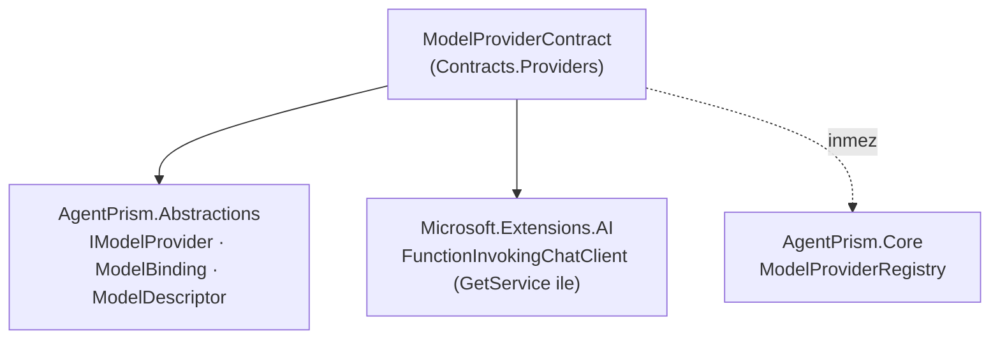

# Faz 99 — Sağlayıcı Sözleşmesinin Yayını

> **Durum:** ✅ Tamamlandı (2026-08-25) — bağımsız `faz-denetim` bulguları kapatıldı, kapanış kapıları temiz ve site yayınlandı.
> **Kaynak:** Doğrudan kullanıcı isteği (2026-08-25). Aday listesinden gelmedi;
> `preview.1` öncesi genişleme noktası olgunlaştırma işidir.
> **Önkoşul:** [Faz 98](98-DEPOLAMA-SOZLESMESININ-YAYINI.md) —
> `AgentPrism.Testing.Contracts.Xunit` paketini, `ContractCoverage` kapısını ve
> yalnız-NuGet sample emsalini (`AgentPrism.Samples.FileRunStore`) bu faz devralır.
> **Paketler:** `AgentPrism.Abstractions`, `AgentPrism.Testing.Contracts.Xunit`,
> `AgentPrism.Core` (yalnız XML dokümanı), `samples/`
> **Yeni paket:** Yok — sözleşme suite'i var olan pakete yeni bir ad alanı ekler ·
> **Migration:** Yok
> **Public API:** Büyüyor — `ModelProviderContract` + `ContractCoverage`'ın kapsam
> parametresi. `wc -l src/*/PublicAPI.Shipped.txt` = 17 satır, hepsi başlık: **her
> dosya boş**, yani yüzeyi bugün büyütmek bedavadır.
> **Tüketici yüzeyi:** site: `guides/model-providers.md` (üçüncü taraf bölümü),
> `packages.md`, `capabilities.md` · sevk edilen: `IModelProvider` XML dokümanı,
> `src/AgentPrism.Testing.Contracts.Xunit/README.md`, `IContentGuard` XML dokümanı
> **Manuel test alanı:** `docs/manuel-test/24-TEST-PAKETI-VE-SABLON.md` (`MT-TEST-078..083`) — plandan sapma 5

---

## Bu Faza Başlarken

> `faz-baslangic` skill'ini uygula. Aşağıdaki liste o skill'in 2. adımıdır —
> **tamamını değil, yalnız işaret edilen bölümleri oku.**

1. Bu doküman
2. Kararlar — dosyanın tamamını **okuma**, yalnız bu kalemleri grep'le:
   ```bash
   grep -n "K-320\|K-032\|K-265\|K-421\|K-008" docs/KARARLAR.md
   ```
   **K-320** (boru hattının tamamını `ModelProviderRegistry` kurar; `IModelProvider`
   HAM istemci döndürür 👤) — bu fazın belgelediği sözleşmenin kaynağıdır.
   **K-032** (model kataloğu yapılandırmadan gelir, kodda yerleşik liste yoktur 👤).
   **K-265** (şablon paket sürümü varsayılanı kayan `*-*`) — sample'ın
   `VersionOverride="*-*"` kullanımının gerekçesi.
   **K-421** (`EnablePublicApiTracking` açık). **K-008** (ön sürüm MAF yalnız
   `AgentPrism.AspNetCore`'da) — sözleşme paketi bunu ihlal etmemelidir.
3. [Faz 98](98-DEPOLAMA-SOZLESMESININ-YAYINI.md) — yalnız devir notu:
   ```bash
   awk '/## Sonraki Faza Devir Notu/,0' docs/arsiv/fazlar/98-DEPOLAMA-SOZLESMESININ-YAYINI.md
   ```
   Sözleşme paketinin bağımlılık sınırını (`AgentPrism.Core` **inmez**),
   `ContractCoverage.MissingDerivedTypes` imzasını ve `xunit.v3.extensibility.core`
   tuzağını oradan devralıyorsun.
4. Alan hafızası (bu faz dört alana dokunuyor):
   [`hafiza/model-boru-hatti.md`](../../hafiza/model-boru-hatti.md) (halka sırası ve
   K-320'nin vakası) · [`hafiza/test-altyapisi.md`](../../hafiza/test-altyapisi.md)
   (sözleşme sınıfı yazımı, MTP) ·
   [`hafiza/paketleme-ve-dagitim.md`](../../hafiza/paketleme-ve-dagitim.md) (yerel besleme,
   sample'ın paket çözümü) · [`hafiza/dokumantasyon.md`](../../hafiza/dokumantasyon.md)
   (`docfx` referans globu — yeni proje eklemek `CS1704` verebilir)
5. Gerektiğinde, tamamı değil ilgili bölümü:
   [`MIMARI.md`](../../MIMARI.md) — model çağrı yolu bölümü

---

## Amaç

AgentPrism'in `IModelProvider` genişleme noktası bugün **kaynak kodu okumadan
doğru uygulanamaz.** Arayüzün XML dokümanı ham istemci kuralını ve boru hattı
sahipliğini anlatır; ama singleton ömrü, thread-safety beklentisi, dispose
sahipliği, ad karşılaştırması, katalog semantiği ve hata sınıflandırmasının
mesaj metnine bağlı olduğu **hiçbir sevk edilen yüzeyde yazmaz**. Üçüncü taraf
bir geliştirici bunları ancak `ModelProviderRegistry.cs`'i okuyarak öğrenir —
ve o dosya NuGet paketinde yoktur.

Faz 98 aynı sorunu depolama tarafında çözdü: sözleşmeyi çalıştırılabilir bir
test suite'ine dönüştürdü ve yalnız-NuGet bir sample ile kanıtladı. Bu faz aynı
üç adımı sağlayıcı tarafına uygular — **davranışı değiştirmeden**, yalnız var
olan davranışı sözleşmeye çevirerek.

- **Kapsam** — `IModelProvider`'ın gerçek çalışma anı sözleşmesini belgele,
  `ModelProviderContract` ile çalıştırılabilir yap, yalnız-NuGet bir sample ile
  kanıtla ve çift-sarmalama hatasını davranışsal bir regresyon testiyle kapat.

### Bugün ne çalışmıyor — doğrulanmış kanıt

| Kanıt | Gözlem |
|---|---|
| [`IModelProvider.cs`](../../../src/AgentPrism.Abstractions/Models/IModelProvider.cs) | XML dokümanı yalnız "ham istemci" ve "ortak boru hattını kurma" kurallarını yazar. Singleton ömrü, thread-safety, dispose sahipliği, ad karşılaştırması ve katalog semantiği **yazmaz** |
| [`AgentPrismBuilder.cs:92-106`](../../../src/AgentPrism.Core/AgentPrismBuilder.cs#L92-L106) | İki aşırı yükleme de `Services.AddSingleton` çağırır. Ömür sevk edilen hiçbir dokümanda geçmez |
| [`ModelProviderRegistry.cs:120-127`](../../../src/AgentPrism.Core/Models/ModelProviderRegistry.cs#L120-L127) | Yinelenen ad `AgentPrismException` atar; sözlük `OrdinalIgnoreCase`. İkisi de belgesiz |
| [`ProviderCredentialClientCache.cs:52-58`](../../../src/AgentPrism.Core/Models/ProviderCredentialClientCache.cs#L52-L58) | `ConcurrentDictionary.GetOrAdd` — `build` yarışta birden çok kez koşabilir. "Yan etkisiz olmalı" beklentisi hiçbir yerde yazmaz |
| [`AgentDefinitionCompiler.cs:583-598`](../../../src/AgentPrism.Core/Compilation/AgentDefinitionCompiler.cs#L583-L598) | Yalnız `AgentPrismException` sarmalanır; başka her exception ham geçer. Belgesiz |
| [`FallbackChatClient.cs:436-458`](../../../src/AgentPrism.Core/Models/FallbackChatClient.cs#L436-L458) | Fallback kararı exception'ın **mesaj metnine** ve **tip adına** bakar. Üçüncü taraf bunu bilmeden mesaj yazarsa fallback sessizce tetiklenmez |
| [`IContentGuard.cs:23-26`](../../../src/AgentPrism.Abstractions/Guards/IContentGuard.cs#L23-L26) | 🚨 XML dokümanı guard'ın "**OUTERMOST**" (en dışta) koştuğunu yazar. Kod K-320'den beri onu tool-call döngüsünün **İÇİNE** koyuyor. Doküman koda göre yanlıştır |
| [`ContractCoverage.cs:26-31`](../../../src/AgentPrism.Testing.Contracts.Xunit/ContractCoverage.cs#L26-L31) | Adı `Contract` ile biten **her** public abstract tipi döndürür; dört test derlemesi bunu kapı olarak koşar. Yeni bir sözleşme ailesi eklemek dördünü birden kırar |
| `src/AgentPrism.Testing.Contracts.Xunit/Contracts/` | 32 sözleşme sınıfı, hepsi depolama. `IModelProvider` için **hiçbiri yok** |
| `samples/` | `AgentPrism.Samples.FileRunStore` (+`.Tests`) yalnız-NuGet emsali. Sağlayıcı karşılığı **yok** |

> Kanıtlar 2026-08-25'te doğrulandı.

### Ölçülen davranış — bu faz bunları sözleşmeye çevirir

Üç ölçüm çalışma anı probu ile yapıldı (kaynak okuması değil). Probe kapanışta
silindi; sonuçlar burada durur.

**Ö1 — Dispose sahipliği.** `agent.GetType()` = `Microsoft.Agents.AI.ChatClientAgent`;
`agent is IDisposable` = **False**; `agent is IAsyncDisposable` = **False**.
Bir `run` sonrası ham istemcinin dispose sayısı **0**. `CompiledAgentCache.Evict`
yalnız `TryRemove` yapar. Boru hattının tepesi elle dispose edilirse zincir ham
istemciye **iner** (sayı 1 olur) — ama AgentPrism bunu hiç çağırmaz.
**Sonuç: AgentPrism dönen `IChatClient`'ı hiçbir zaman dispose etmez.**

**Ö2 — Çift sarmalamanın gözlemlenebilir hasarı.** Bir tool çağıran `run`,
sayaç tutan bir `IContentGuard` ile iki kurulumda koşuldu:

| Kurulum | Ham çağrı | Tool çağrısı | Guard denetimi | Guard'ın gördüğü |
|---|---|---|---|---|
| Ham istemci (doğru) | 2 | 1 | **4** | `Input:hi`, `Input:hi`, **`Input:42`**, `Output:done` |
| Provider `UseFunctionInvocation` kurar (yanlış) | 2 | 1 | **3** | `Input:hi`, `Output:42`, `Output:done` |

Yanıt metni ikisinde de `done`, tool ikisinde de bir kez çağrıldı. **Fark tek
yerde görünür:** doğru kurulumda tool sonucu (`42`) modele **girerken**
`Input` olarak denetlenir; yanlış kurulumda hiç `Input` olarak görünmez — iç
döngü onu guard'ın altından modele besler. K-320'nin kapattığı prompt-injection
yolu tam olarak budur. Regresyon testi bu farkı ölçer, tip adına bakmaz.

**Ö3 — Sözleşme suite'i `AgentPrism.Core` olmadan çift sarmalamayı görebilir mi?**
Evet. MEAI'nin kendi servis keşif protokolü sonucu yüzeye çıkarır:

| Nesne | `GetService(typeof(FunctionInvokingChatClient))` |
|---|---|
| Ham istemci | `null` |
| `UseFunctionInvocation()` ile sarılmış | **dolu** |
| Üstüne `UseOpenTelemetry()` de eklenmiş | **dolu** (iç içe halkadan geçer) |

`FunctionInvokingChatClient` `Microsoft.Extensions.AI` paketindedir ve o paket
sözleşme paketinin çözülmüş grafiğinde **zaten vardır** (`Microsoft.Agents.AI`
üzerinden geçişli). Açık `PackageReference` eklemek **sıfır** yeni paket getirir.
Bu, `GetService` sözleşmesidir — implementation tip adı taraması değil.

---

## 99.1 — Sözleşmenin yazılı hâli

`IModelProvider`'ın XML dokümanı sekiz maddeyi kazanır. Her madde yukarıda
`dosya:satır` ile doğrulanmış bir davranışı yansıtır; hiçbiri yeni davranış
tanımlamaz.

| # | Sözleşme maddesi | Kaynak |
|---|---|---|
| 1 | Implementasyon **singleton** olarak kullanılır. Scoped servis yakalanamaz | `AgentPrismBuilder.cs:92-106` |
| 2 | `CreateChatClient` **eşzamanlı çağrılır**; implementasyon thread-safe olmalıdır | Registry singleton + derleme yolu |
| 3 | Dönen istemci **ham** olmalıdır; ortak halkalar registry'ye aittir | K-320 |
| 4 | Özellikle `UseFunctionInvocation`, OpenTelemetry, content guard, circuit breaker, fallback, eşzamanlılık sınırlayıcı ve attachment çözümü **provider'da kurulmaz** — kurulursa tool sonucu turu guard'ın altında kalır (Ö2) | Ö2 |
| 5 | Dönen istemci **uzun ömürlüdür ve AgentPrism onu dispose etmez**; ömür provider'ındır ve istemci hiç dispose edilmemeye dayanıklı olmalıdır | Ö1 |
| 6 | Credential'a göre istemci cache'leyen fabrika **yan etkisiz** olmalıdır; `ConcurrentDictionary.GetOrAdd` yarışta `build`'i birden çok kez koşabilir | `ProviderCredentialClientCache.cs:52-58` |
| 7 | Ad karşılaştırması **`OrdinalIgnoreCase`**; aynı ad iki kez kaydedilirse registry kurulumda `AgentPrismException` atar | `ModelProviderRegistry.cs:120-127` |
| 8 | `Models` bir **izin listesi değildir**; katalogda olmayan model adı reddedilmek **zorunda değildir** | K-032 |

Ek olarak `credential` parametresinin semantiği (bugünkü `<param>` metninden
genişletilir): `null` → kurulum anındaki global credential; dolu → kiracıya ait
anahtar, ve **anahtar asla global'e düşmez**. Kiracı credential'ı ile üretilen
istemciyle derlenen agent `CompiledAgentCache`'e girmemelidir; çağıran bunu
`IModelProviderRegistry.HasTenantProviderOverrideAsync` ile ayırt eder. Bu
cümle bugün `HasTenantProviderOverrideAsync`'in `<remarks>`'ında var ama
`IModelProvider` tarafından görünmüyor — çapraz referans eklenir.

`IContentGuard`'ın "OUTERMOST" cümlesi koda göre düzeltilir (K-320 sonrası guard
tool-call döngüsünün içindedir). Bu bir doküman düzeltmesidir, davranış değişmez.

### Yetenek bayraklarının gerçek anlamı

`ModelDescriptor`'ın dört bayrağı **aynı ağırlıkta değildir** ve bugün hiçbir
yerde bu ayrım yazmaz. Bu faz anlamı yazar, **API'yi değiştirmez**:

| Bayrak | Gerçekte ne | Zorlayan yer |
|---|---|---|
| `SupportsStructuredOutput` | **Çalışma anı kapısı** — katalogda *bulunan* ve değeri açıkça `false` olan modelde derleme durur. Katalogda yoksa kontrol atlanır | `AgentDefinitionCompiler.cs:773-785` |
| `SupportsTools` | Yalnız metadata (tavsiye) | Zorlayan yok |
| `SupportsStreaming` | Yalnız metadata (tavsiye) | Zorlayan yok |
| `SupportsReasoning` | Yalnız metadata (tavsiye) | Zorlayan yok |

Simetri için bayrak eklenmez, kaldırılmaz, davranış hizalanmaz — kapsam dışıdır.

### Hata sözleşmesi — belgelenir, yeniden tasarlanmaz

Bugünkü sınıflandırma exception'ın **tip adı** ve **mesaj metni** üzerinden
çalışır. Bu bir tasarım borcudur (99.5) ama bu fazda **değiştirilmez**; yalnız
üçüncü tarafın görebileceği bir yere yazılır:

- `OperationCanceledException` (grafiğin herhangi bir yerinde) → fallback **yok**
- Mesajda `HTTP 401` / `HTTP 403` → fallback **yok** (konfigürasyon hatasını
  sağlayıcı değiştirerek gizlemek pahalıdır)
- `429` · `toomanyrequests` · `rate limit` → fallback **var**
- Mesajda `HTTP 5xx` → fallback **var**
- Status taşımayan taşıma/SDK sarmalayıcı tipi → bağlantı hatası sayılır, fallback **var**
- Tanınmayan hata → fallback **yok** (liste kapalı ve pozitiftir)
- Content filter bir **hata değildir**: doğru sinyal `ChatFinishReason.ContentFilter`
  taşıyan `ChatResponse`'tur; provider bunun için exception atmamalıdır
- Circuit breaker `OperationCanceledException` ve `AgentPrismContentBlockedException`
  dışında **her** exception'ı arıza sayar
- `CreateChatClient` yalnız `AgentPrismException` atarsa derleme hatası olarak
  sarmalanır; başka her exception **ham geçer**

---

## 99.2 — `ModelProviderContract`

Yeni ad alanı: `AgentPrism.Testing.Contracts.Providers`. Suite yalnız
`AgentPrism.Abstractions` + `Microsoft.Extensions.AI` (Ö3: geçişli grafikte
zaten var) kullanır. **`AgentPrism.Core` inmez** — Faz 98'in bağımlılık sınırı
korunur.



Türetilen sınıf tek bir üye doldurur; ikisi isteğe bağlıdır:

```csharp
public abstract class ModelProviderContract
{
    protected abstract ValueTask<IModelProvider> CreateProviderAsync();

    // Kataloğa girmeyen ama sağlayıcının kabul etmesi beklenen model adı.
    protected virtual string UnknownModelName => "contract-unknown-model";

    // Sağlayıcı BYOK desteklemiyorsa null döner; ilgili case'ler atlanır.
    protected virtual ModelProviderCredential? SampleCredential => null;
}
```

Doğrulanan davranışlar:

| Case | Ne kanıtlar |
|---|---|
| Eşzamanlı `CreateChatClient` | Aynı örnek üzerinde paralel çağrılar exception atmaz, hepsi `null` olmayan istemci döner |
| Ham istemci | Dönen istemcinin `GetService(typeof(FunctionInvokingChatClient))` sonucu **`null`** (Ö3) |
| Global credential yolu | `credential: null` ile istemci üretilir |
| BYOK yolu | `SampleCredential` verildiğinde istemci üretilir ve global yoldan **farklı** bir örnektir |
| Credential cache idempotansı | Aynı credential ile iki çağrı yan etki üretmez; sağlayıcı `GetOrAdd` yarışına dayanıklıdır |
| Endpoint override | `SampleCredential.Endpoint` doluysa istemci üretimi başarılıdır |
| Ad semantiği | `Name` boş değildir; `Models` içindeki adlar benzersizdir |
| Katalog izin listesi değildir | `UnknownModelName` ile `CreateChatClient` **atmaz** |
| Dispose sözleşmesi | Üretilen istemci dispose **edilmeden** ikinci bir istemci üretilebilir; sağlayıcı hâlâ çalışır (Ö1'in sözleşme hâli) |
| Ayar doğrulaması (isteğe bağlı) | Sağlayıcı `ModelProviderSettings.Validate` kullanıyorsa, tanınmayan anahtar `AgentPrismException` verir |

`ContractCoverage` kapsam parametresi kazanır (kullanıcı kararı, 2026-08-25):
depolama derlemeleri yalnız `...Contracts.Storage`'ı, sağlayıcı derlemesi yalnız
`...Contracts.Providers`'ı sayar. Dört mevcut `StoreContractCoverageTests`
kırılmadan çalışmaya devam eder.

---

## 99.3 — `AgentPrism.Samples.CustomModelProvider`

`AgentPrism.Samples.FileRunStore` emsalinin birebir aynısı: kütüphane + test
projesi, çalıştırılabilir uygulama yok (kullanıcı kararı, 2026-08-25).

- Kütüphane **yalnız `PackageReference`** kullanır (`VersionOverride="*-*"`,
  K-265) — kaynak proje referansı **yasaktır**; sample'ın bütün anlamı budur.
- Test projesi `ModelProviderContract`'ı türetir ve **ayrıca** uçtan uca bir
  `run` koşar: `AddAgentPrism().AddModelProvider(...)` ile DI kurulur, bir agent
  derlenir ve çalıştırılır. Ağ çağrısı yoktur; sample sağlayıcı scriptlenmiş bir
  `IChatClient` döndürür.
- Uçtan uca `run` testi, sample'ın `AgentPrism` meta paketini `PackageReference`
  olarak almasını gerektirir. Kütüphane yalnız `AgentPrism.Abstractions` alır.

---

## 99.4 — Boru hattı sahipliği regresyon testi

Ö2'nin ölçtüğü farkı kalıcı bir kapıya çevirir. Test **tip adına bakmaz**;
guard'ın gördüğü yönü ölçer.

İddia: bir tool çağıran `run`'da, sağlayıcı ham istemci döndürdüğünde
`ContentGuardDirection.Input` yönünde **tool sonucunu taşıyan** bir denetim
vardır. Sağlayıcı kendi `UseFunctionInvocation` döngüsünü kurduğunda bu denetim
**yoktur**.

İkinci iddia: registry tool çağrı katmanını **yalnız bir kez** kurar — ham
sağlayıcıyla üretilen boru hattında tool sonucu turu guard'ın üstünden geçer.

Test `tests/AgentPrism.Core.UnitTests` altında yaşar (registry'ye erişmesi
gerekir, bu yüzden sevk edilen sözleşme paketine giremez). Sözleşme paketindeki
`GetService` case'i aynı hatanın sağlayıcı tarafındaki yarısını kapatır: ikisi
birlikte hem üçüncü tarafı hem registry'yi bağlar.

---

## 99.5 — Devredilen teknik borç

Bu fazda **yapılmaz**; aday listesine kayıt açılır.

**F-149 — Sağlayıcı hata sınıflandırmasını metin eşlemeden yapısal sözleşmeye
taşı.** Bugün `FallbackRetryClassifier` ve `DefaultRunErrorClassifier` kararı
exception'ın tip **adı** ve mesaj **metni** üzerinden verir. Gerekçesi geçerlidir
(`AgentPrism.Core` sağlayıcı SDK tiplerine referans vermez) ama sonucu kırılgandır:
üçüncü taraf bir sağlayıcının hata mesajı `HTTP 429` yazmıyorsa fallback sessizce
tetiklenmez, ve bunu ancak bu faz sayesinde belgeden öğrenebilir. Kayıtta
değerlendirilecek seçenekler: `IProviderFailureClassifier` (kayıtlı, tüketici
değiştirebilir) · sağlayıcı düzeyinde sınıflandırma kancası (`IModelProvider`'a
opsiyonel ikinci arayüz — `IModelProviderHealthCheck` deseni) · AgentPrism'e ait
tipli sağlayıcı hatası soyutlaması. `1.0` öncesi karara bağlanmalıdır; sonrası
kırıcı olur.

---

## Planlanan Public API

> Taslak imzalardır. Gerçekleşen imzalar kapanışta ayrı bir bölüme yazılır.

```csharp
// AgentPrism.Testing.Contracts.Xunit — yeni ad alanı
namespace AgentPrism.Testing.Contracts.Providers;

public abstract class ModelProviderContract
{
    protected abstract ValueTask<IModelProvider> CreateProviderAsync();
    protected virtual string UnknownModelName { get; }
    protected virtual ModelProviderCredential? SampleCredential { get; }
    // ~10 [Fact] senaryosu (adları dokümandır; CS1591 zaten bastırılmış)
}

// AgentPrism.Testing.Contracts.Storage — davranış korunur, kapsam eklenir
public static class ContractCoverage
{
    public static IReadOnlyList<Type> ContractTypes();                 // mevcut
    public static IReadOnlyList<Type> ContractTypes(string namespaceScope);  // yeni
    public static IReadOnlyList<string> MissingDerivedTypes(Assembly consumerAssembly, params string[] except);  // mevcut
    public static IReadOnlyList<string> MissingDerivedTypes(Assembly consumerAssembly, string namespaceScope, params string[] except);  // yeni
}
```

> `ContractCoverage`'ın `namespaceScope` parametresinin **tam şekli** uygulama
> anında seçilir: `string` mi, `Type` işaretçisi mi, yoksa `enum` mu. Üçü de
> davranışı verir; plan biçimi dayatmaz çünkü mevcut aşırı yüklemenin
> uyumluluğu korunduğu sürece fark yerel bir tercihtir.

`IModelProvider`, `IContentGuard` ve `ModelDescriptor`'ın **imzaları değişmez** —
yalnız XML dokümanları büyür.

### HTTP `endpoint`'leri

Yok. Bu faz hiçbir HTTP yüzeyine dokunmaz.

### Arayüz payı

Yok. Arayüze dokunulmaz.

---

## Planlanan Dosya Listesi

```
src/AgentPrism.Abstractions/
├── Models/IModelProvider.cs              (XML dokümanı genişler)
└── Guards/IContentGuard.cs               (OUTERMOST cümlesi düzeltilir)

src/AgentPrism.Testing.Contracts.Xunit/
├── Contracts/Providers/
│   └── ModelProviderContract.cs          (yeni)
├── ContractCoverage.cs                   (kapsam aşırı yüklemesi)
├── README.md                             (sağlayıcı bölümü)
└── AgentPrism.Testing.Contracts.Xunit.csproj  (Microsoft.Extensions.AI açık referans)

samples/AgentPrism.Samples.CustomModelProvider/
├── AgentPrism.Samples.CustomModelProvider.csproj
├── ContosoModelProvider.cs
└── ContosoChatClient.cs

samples/AgentPrism.Samples.CustomModelProvider.Tests/
├── AgentPrism.Samples.CustomModelProvider.Tests.csproj
├── ContosoModelProviderContractTests.cs
└── ContosoProviderRunTests.cs            (uçtan uca run)

tests/AgentPrism.Core.UnitTests/Models/
└── PipelineOwnershipTests.cs             (yeni — Ö2 regresyonu)

docs-site/src/content/docs/guides/model-providers.md   (üçüncü taraf bölümü)
docs/manuel-test/99-SAGLAYICI-SOZLESMESI.md            (yeni)
```

---

## Hata Modları ve Testler

| Ne bozulabilir | Seviye | Test sınıfı |
|---|---|---|
| Üçüncü taraf sağlayıcı kendi `UseFunctionInvocation`'ını kurar; tool sonucu guard'ın altında kalır | **Fonksiyonel** (guard + tool + registry sınırı geçer) | `PipelineOwnershipTests` |
| Sağlayıcı ham istemci yerine sarılmış istemci döndürür | **Sözleşme** | `ModelProviderContract` — `GetService` case'i |
| Sağlayıcı eşzamanlı `CreateChatClient` altında çöker | **Sözleşme** | `ModelProviderContract` — paralel çağrı case'i |
| Sağlayıcı katalogda olmayan modeli reddeder (K-032 ihlali) | **Sözleşme** | `ModelProviderContract` |
| BYOK credential'ı global anahtara düşer | **Sözleşme** | `ModelProviderContract` — farklı örnek iddiası |
| `ModelProviderContract` eklenince dört depolama kapsam testi kırılır | **Birim** | mevcut `StoreContractCoverageTests` ×4 (kırmızıya dönmemeli) |
| Sample kaynak proje referansı alır ve "yalnız NuGet" iddiası çöker | **Birim** | `DependencyDirectionTests` veya csproj taraması |
| Sample paketle derlenir ama gerçek `run` yapamaz | **Fonksiyonel** | `ContosoProviderRunTests` |
| Yeni proje `docfx` referans globunu `CS1704` ile kırar | **Kapı** | kapanış kapısı (`docs/hafiza/dokumantasyon.md`) |
| XML dokümanı koddan sapar (guard konumu gibi) | **Manuel** | kabul case'i #3 |

Beş soru, `ModelProviderContract`'ın yeni kod yolu için:

- **İptal:** sözleşme `CancellationToken` almaz — `CreateChatClient` senkrondur, iptal yolu yoktur.
- **Eşzamanlılık:** birinci sınıf case'tir (paralel `CreateChatClient`).
- **Boş/aşırı girdi:** `UnknownModelName` ve boş `Models` kataloğu case'leri.
- **Başka kiracı:** sözleşme kiracı bilmez; BYOK yalnız credential nesnesi olarak görünür. Kiracı yalıtımı registry'nin işidir ve `TenantIsolationContract` zaten kapsar.
- **Alt sistem hatası:** sağlayıcı `CreateChatClient` içinde atarsa — bu davranış **sözleşmede zorlanmaz**, yalnız belgelenir (`AgentPrismException` sarmalanır, diğerleri ham geçer).

---

## Manuel Kabul Case'leri

| # | Ön koşul | Adımlar | Beklenen sonuç |
|---|---|---|---|
| 1 | Temiz klon, `dotnet pack` koşulmuş | `cd samples/AgentPrism.Samples.CustomModelProvider.Tests && dotnet test` | Tüm `ModelProviderContract` case'leri ve uçtan uca `run` testi yeşil. Kaynak proje referansı kullanılmadı |
| 2 | Sample kütüphanesinin csproj'u | `grep -c ProjectReference samples/AgentPrism.Samples.CustomModelProvider/*.csproj` | `0` — yalnız `PackageReference` |
| 3 | 👤 Yalnız yayınlanmış yüzey elde | `docs-site` üçüncü taraf bölümü + `IModelProvider` XML dokümanı okunur; 99.1'deki sekiz maddenin **hepsi** bulunur | Sekiz maddenin hiçbiri yalnız kaynak kodda kalmamıştır |
| 4 | Sağlayıcı kasıtlı olarak `UseFunctionInvocation` kuracak şekilde değiştirilir | `dotnet test` (sample testleri) | Sözleşme suite'i **kırmızıya** döner ve hangi maddenin ihlal edildiğini adıyla söyler |
| 5 | Dört depolama kapsam testi | `dotnet test` (Core.UnitTests + üç SQL entegrasyon) | Dördü de yeşil; `ModelProviderContract` onları kapsam dışı bırakır |

---

## Açık Sorular

| # | Soru | Seçenekler | Öneri |
|---|---|---|---|
| 1 | `ContractCoverage` kapsam parametresinin biçimi | A: `string namespaceScope` · B: bir işaretçi `Type`'ın ad alanı · C: `enum ContractFamily` | **A** — en az tip getirir ve yeni aile eklemek public API'yi büyütmez. Ama uygulayan oturum C'yi seçerse yazım hatasını derlemeye taşır; ikisi de kabul edilir |
| 2 | Sample sağlayıcı BYOK'u (credential) destekleyecek mi | A: destekler, `SampleCredential` dolu döner · B: desteklemez, BYOK case'leri atlanır | **A** — suite'in BYOK case'lerinin gerçekten koştuğunu kanıtlar; aksi hâlde o case'ler sample tarafından hiç sınanmaz |
| 3 | `ModelProviderContract`'ın "ayar doğrulaması" case'i zorunlu mu | A: isteğe bağlı (varsayılan atla) · B: zorunlu | **A** — `ModelProviderSettings` kullanmak sağlayıcı için bir tercihtir, sözleşme değil |
| 4 | Sample'ın uçtan uca `run` testi `AgentPrism` meta paketini mi yoksa `AgentPrism.Core`'u mu alsın | A: meta paket · B: `Core` | **A** — tüketicinin gerçekten yazdığı satır budur; meta paketin sağlayıcı kaydını taşıdığını da doğrular |

---

## Bitiş Ölçütleri (DoD)

- [x] `IModelProvider` XML dokümanı 99.1'deki **sekiz maddenin hepsini** taşır; `credential` semantiği ve `CompiledAgentCache` uyarısı çapraz referanslıdır
- [x] `IContentGuard`'ın "OUTERMOST" cümlesi koda göre düzeltildi
- [x] `ModelProviderContract` `AgentPrism.Testing.Contracts.Providers` ad alanında yayınlandı; yalnız `Abstractions` + `Microsoft.Extensions.AI` alır (`AgentPrism.Core` **inmez** — bağımlılık grafiği ölçülerek doğrulandı)
- [x] `samples/AgentPrism.Samples.CustomModelProvider` yalnız `PackageReference` kullanır; `grep -c ProjectReference` → `0`
- [x] Sample'ın test projesi `ModelProviderContract`'ı türetir, credential'ı gerçek istemci sınırında uygular **ve** uçtan uca bir `run` tamamlar; hepsi yeşil
- [x] `PipelineOwnershipTests` Ö2'nin farkını ölçer: ham sağlayıcıda tool sonucu `Input` yönünde denetlenir, sarmalayan sağlayıcıda denetlenmez. Test hiçbir implementation tip adına bağlanmaz
- [x] Dört mevcut `StoreContractCoverageTests` yeşil kaldı
- [x] Sözleşme paketinin public yüzeyine `Shouldly` tipi **sızmaz**: `protected`/`public` imzalarda Shouldly tipi yok
- [x] Dört doğrulama kapısı sıfır uyarı verdi
- [x] `samples/AgentPrism.Api` gerçek PostgreSQL veritabanıyla başladı; `/health` 200 döndü
- [x] `secret` taraması boş döndü
- [x] Manuel kabul case'leri `docs/manuel-test/24-TEST-PAKETI-VE-SABLON.md` içine eklendi; 1·2·4·5 koşuldu
- [x] `faz-denetim` koşuldu; ilk turdaki iki 🔴 ve üç 🟡 bulgu kapatıldı
- [x] `docs-site/` güncellendi (`guides/model-providers.md`, `packages.md`, üretilen `llms-full.txt`); Node 22 ile site doğrulama ve link kapıları temiz
- [x] `F-149` `docs/ADAYLAR.md` içine yazıldı
- [x] Dispose sahipliği kararı `KARARLAR.md`'ye K-609 olarak girdi (public contract kararıdır)

### Doğrulama komutları

```bash
# Sözleşme paketi Core'a inmiyor
F=$(find artifacts/obj/AgentPrism.Testing.Contracts.Xunit -name project.assets.json | head -1)
python3 -c "import json;d=json.load(open('$F'));print([k for k in list(d['targets'].values())[0] if 'AgentPrism.Core' in k])"
# beklenen: []

# Sample yalnız NuGet
grep -c ProjectReference samples/AgentPrism.Samples.CustomModelProvider/*.csproj || true   # 0

# Sample sözleşmeyi geçiyor
MSBUILDDISABLENODEREUSE=1 dotnet test samples/AgentPrism.Samples.CustomModelProvider.Tests

# Boru hattı sahipliği regresyonu
./artifacts/bin/AgentPrism.Core.UnitTests/release/AgentPrism.Core.UnitTests --filter-method "*PipelineOwnership*"
```

---

## Riskler

| Risk | Önlem |
|------|-------|
| `ContractCoverage`'a kapsam eklemek dört depolama kapsam testini sessizce gevşetir (her şeyi "kapsam dışı" sayarsa yeşil kalır ama hiçbir şey kontrol etmez) | Kapsamı ekledikten sonra bir depolama sözleşme sınıfını kasten türetmeden bırak ve dördünün **kırmızıya döndüğünü** gör; sonra geri al |
| Sözleşme suite'i sağlayıcıyı gerçek bir ağ çağrısına zorlar ve üçüncü taraf onu koşamaz | Hiçbir case `GetResponseAsync` çağırmaz; yalnız `CreateChatClient` ve `GetService` kullanılır. Sample scriptlenmiş istemci döndürür |
| Yeni sample projesi `docfx` referans globunu `CS1704` ile kırar | Faz 98 aynı tuzağa düştü; `references.exclude`'a proje adı eklenir, glob yeniden tasarlanmaz (`docs/hafiza/dokumantasyon.md`) |
| Sample'ın `VersionOverride="*-*"` çözümü yerel besleme boşsa kırılır | `dotnet pack` sample testlerinden **önce** koşulur; FileRunStore ile aynı sıra |
| XML dokümanı büyürken kod ile çelişen yeni bir cümle girer | Her madde 99.1'deki tabloda bir `dosya:satır` kanıtına bağlıdır; denetim bu tabloyu kullanır |
| `Microsoft.Extensions.AI` açık referansı K-008'i (ön sürüm MAF) ihlal eder | Ölçüldü: paket GA'dır ve grafikte zaten vardır. Sürümü merkezden gelir; açık referans yeni paket getirmez |

---

<!-- ============================================================
     AŞAĞISI KAPANIŞTA DOLDURULUR — `faz-tamamlama` skill'i.
     Plan anında boş kalır. Başlıkları SİLME.
     ============================================================ -->

## Plandan Sapmalar

> Uygulama sırasında yazıldı; kapanışta gözden geçirilir.

**1. `ModelProviderContract` tek sınıf değil, ÜÇ sınıf oldu.** Plan isteğe bağlı
davranışları (BYOK, sağlayıcı ayarları) tek sınıfta atlanan senaryolar olarak
tasarlamıştı. Ölçüm bunu düşürdü: `Assert.Skip` `xunit.v3.assert` paketindedir ve
o paket sözleşme paketinin çözülmüş grafiğinde **yoktur** — eklemek planın "yeni
paket: yok" satırını ihlal ederdi. xunit v3'ün `[Fact(SkipUnless = ...)]`
alternatifi ise **public static** bir özellik ister; bizim koşulumuz örnek
düzeyinde sanal bir üyeye bağlıdır, static bir üye onu okuyamaz. Çözüm paketin
kendi deyimidir: isteğe bağlı davranış ayrı bir opt-in sözleşme sınıfıdır
(`ModelProviderCredentialContract`, `ModelProviderSettingsContract`). Türetmek
niyet beyanıdır ve **sessizce geçen senaryo kalmaz** — depolama tarafındaki 32
sınıf + muafiyet deseninin aynısı.

**2. `ContractCoverage` ad alanı taşındı ve kapsamsız aşırı yüklemeler KALDIRILDI.**
Plan yalnız kapsamlı bir aşırı yükleme *eklemeyi* öngörüyordu. Kapsamsız olanı
bırakmak, dört depolama kapsam testini kıran tuzağın kendisini bırakmak olurdu:
bir depolama tüketicisi, AgentPrism sağlayıcı sözleşmesi yayınladı diye
kırılabilirdi. Tip `AgentPrism.Testing.Contracts.Storage`'dan
`AgentPrism.Testing.Contracts`'a taşındı — iki aileye birden hizmet ediyor, ad
alanı artık yanıltmıyor. Aile adları `ContractCoverage.StorageContracts` /
`ProviderContracts` sabitleridir; yazım hatası derleme hatasıdır. Hiçbir
sözleşme tipi eşleşmeyen bir kapsam `ArgumentException` verir — sessizce hiçbir
şeyi kontrol etmeyen yeşil bir kapı üretmez.

**3. Public yüzey büyümesi ölçüldü ve kabul edildi.** `AgentPrism.Testing.Contracts.Xunit`
36 → **39** public tip (üç sözleşme sınıfı); `PublicAPI.Unshipped.txt` +38 girdi,
eski `Storage.ContractCoverage` girdileri düştü. `PublicSurfaceBaselineTests`
büyümeyi kasıtlı bir ekleme olarak zorladı — taban çizgisi elle güncellendi.

**4. Analyzer gevşetmeleri `.editorconfig`'e değil sample'ın csproj'una gitti.**
`[samples/*.Tests/**/*.cs]` glob'u eşleşmedi (ölçüldü). Ayrıca `.editorconfig`'de
mevcut `[samples/**/*.cs]` bloğunun ilk satırına tutunan bir düzenleme bloğu
**ikiye böldü** — CA2007/MA0004 satırları yanlış bölüme kaydı ve geri alındı.
Gevşetme artık projeye özgü ve gerekçeli: `<NoWarn>CA1707;xUnit1051</NoWarn>`.

**5. Manuel case'ler ayrı dosyaya değil `24-TEST-PAKETI-VE-SABLON.md`'ye girdi.**
Plan `docs/manuel-test/99-SAGLAYICI-SOZLESMESI.md` diyordu; 22 numarası zaten
doluydu ve daha önemlisi Faz 98 aynı türden case'leri (sözleşme paketi + örnek
tüketici) 24'e koymuştu. O dosyanın kapsam satırı zaten
`src/AgentPrism.Testing.Contracts.Xunit` ve `samples/*` içeriyor. Case'ler
`MT-TEST-078..083`.

**6. Planda olmayan bir doküman kusuru bulundu ve düzeltildi.** `IContentGuard`'ın
XML dokümanı guard'ın "OUTERMOST" koştuğunu yazıyordu; K-320'den beri guard
tool-call döngüsünün **içindedir**. Koda göre düzeltildi.

**7. Sevk edilen doküman kapısı planın kendi metnini yakaladı.**
`ShippedDocumentationSelfContainmentTests` `IModelProvider`'ın yeni
`<remarks>`'ında bir 🚨 buldu ve reddetti — sevk edilen XML alarm emojisi
taşımaz. Kaldırıldı. Kapı, bu fazın amacını (tüketici sesiyle yazmak) kendi
üzerimizde uyguladı.

**8. Ölçülen bulgu: en olası hatayı yapmak yapısal olarak zordur.** Sözleşmeyi
kasten ihlal etme denemesi **derlenmedi**: yalnız `AgentPrism.Abstractions`'a
bağlı bir sağlayıcı `AsBuilder()`/`UseFunctionInvocation()` tiplerine erişemez —
onlar `Microsoft.Extensions.AI` paketindedir ve `Abstractions` yalnız
`Microsoft.Extensions.AI.Abstractions` taşır. İhlal ancak paket bilerek
eklenirse mümkün. Sözleşme testi yine de gereklidir (sağlayıcı o paketi başka
bir sebeple almış olabilir), ama risk planın varsaydığından düşüktür.

**9. Denetim, BYOK iddiasının eksik ölçüldüğünü buldu.** İlk test, credential ile
oluşan iki istemcinin ayrı nesne olduğunu doğruluyordu; bu, credential'ın gerçek
istek sınırında kullanıldığını kanıtlamaz. `ModelProviderCredentialContract` artık
sağlayıcının `AssertCredentialIsApplied` kancasını zorunlu tutar. Sample bu
kancada scriptlenmiş istemcinin API key'i kullandığını doğrular.

**10. Faz dışı iki üretim kusuru kapanışa alındı.** F-150 için worker, uçuştaki
işleri kaydeder ve slot semaforunu dispose etmeden önce tamamlanmalarını bekler.
F-151 için iki uygulanmış migration, uygulanmış ilk baytlarına döndürüldü; kapı
dosyaları değiştirilebilir checksum manifestinden değil, Git'teki sabit kaynak
commit'lerden okur. Bu iki düzeltme fazın kapsamını genişletti, çünkü `preview.1`
öncesinde sevk edilmiş kırılmayı açık bırakmak kabul edilemezdi.

## Bu Fazda Verilen Kararlar

- **K-609:** AgentPrism'in dönen `IChatClient` için dispose sahipliği yoktur.
- **K-610:** `ContractCoverage` her çağrıda açık bir sözleşme ailesi alır.
- **K-611:** İsteğe bağlı sağlayıcı davranışı, atlanan case değil ayrı opt-in
  sözleşme sınıfıdır.
- **K-612:** Uygulanmış migration baytları, değiştirilebilir checksum kaydına
  değil Git'teki sabit kaynak commit'lerine göre doğrulanır.

## Gerçekleşen Public API

`AgentPrism.Testing.Contracts.Xunit` — 36 → **39** public tip.

```csharp
namespace AgentPrism.Testing.Contracts;

public static class ContractCoverage
{
    public const string StorageContracts = "AgentPrism.Testing.Contracts.Storage";
    public const string ProviderContracts = "AgentPrism.Testing.Contracts.Providers";

    public static IReadOnlyList<Type> ContractTypes(string namespaceScope);
    public static IReadOnlyList<string> MissingDerivedTypes(
        Assembly consumerAssembly, string namespaceScope, IReadOnlyCollection<string>? except = null);
}

namespace AgentPrism.Testing.Contracts.Providers;

public abstract class ModelProviderContract : IAsyncLifetime
{
    protected IModelProvider Provider { get; }
    protected abstract ValueTask<IModelProvider> CreateProviderAsync();
    protected virtual string UnknownModelName { get; }
    protected virtual ValueTask OnDisposeAsync();
    protected ModelBinding Binding(string? model = null, string? providerName = null);
    // 7 [Fact]
}

public abstract class ModelProviderCredentialContract : ModelProviderContract
{
    protected abstract ModelProviderCredential Credential { get; }
    protected virtual ModelProviderCredential OtherCredential { get; }
    protected abstract void AssertCredentialIsApplied(
        IChatClient client, ModelProviderCredential credential);
    // 6 [Fact]
}

public abstract class ModelProviderSettingsContract : ModelProviderContract
{
    protected abstract KeyValuePair<string, JsonElement> SupportedSetting { get; }
    protected virtual string UnsupportedSettingKey { get; }
    // 3 [Fact]
}
```

**Kaldırılan:** `ContractCoverage.ContractTypes()` ve
`MissingDerivedTypes(Assembly, IReadOnlyCollection<string>?)` — aile adı almayan
aşırı yüklemeler (K-610). Tip `…Contracts.Storage`'dan `…Contracts`'a taşındı.

`IModelProvider`, `IContentGuard`, `ModelDescriptor`: **imza değişmedi**, yalnız
XML dokümanları büyüdü. Çalışma anı davranışı hiçbir yerde değişmedi.

`PublicAPI.Unshipped.txt`: +38 girdi, −2 (eski `Storage.ContractCoverage`).
`public-surface-baseline.txt`: `AgentPrism.Testing.Contracts.Xunit` 36 → 39.
**`Shouldly` public/protected hiçbir imzada geçmiyor** (doğrulandı).

## Dosya Listesi (gerçekleşen)

```
YENİ
src/AgentPrism.Testing.Contracts.Xunit/Contracts/Providers/
├── ModelProviderContract.cs
├── ModelProviderCredentialContract.cs
└── ModelProviderSettingsContract.cs
samples/AgentPrism.Samples.CustomModelProvider/
├── AgentPrism.Samples.CustomModelProvider.csproj   (yalnız PackageReference)
├── ContosoModelProvider.cs
└── ContosoChatClient.cs
samples/AgentPrism.Samples.CustomModelProvider.Tests/
├── AgentPrism.Samples.CustomModelProvider.Tests.csproj
├── ContosoModelProviderContractTests.cs            (3 sözleşme + kapsam testi)
└── ContosoProviderRunTests.cs                      (uçtan uca 3 run testi)
tests/AgentPrism.Core.UnitTests/Models/PipelineOwnershipTests.cs

DEĞİŞTİ
src/AgentPrism.Abstractions/Models/IModelProvider.cs        (XML sözleşmesi)
src/AgentPrism.Abstractions/Guards/IContentGuard.cs         (OUTERMOST düzeltmesi)
src/AgentPrism.Testing.Contracts.Xunit/ContractCoverage.cs  (aile kapsamı, ad alanı)
src/AgentPrism.Testing.Contracts.Xunit/README.md
src/AgentPrism.Testing.Contracts.Xunit/*.csproj             (Microsoft.Extensions.AI)
src/AgentPrism.Testing.Contracts.Xunit/PublicAPI.Unshipped.txt
tests/AgentPrism.Core.UnitTests/Architecture/public-surface-baseline.txt
tests/{Core.UnitTests,PostgreSql,SqlServer,Sqlite}/…/StoreContractCoverageTests.cs  (aile adı)
AgentPrism.slnx
docs-site/src/content/docs/guides/model-providers.md
docs-site/src/content/docs/packages.md
docs-site/public/llms-full.txt · src/AgentPrism.Core/buildTransitive/AgentPrism.AgentMap.md  (üretildi)
docs/manuel-test/24-TEST-PAKETI-VE-SABLON.md · 00-INDEKS.md
docs/ADAYLAR.md (F-149, F-150, F-151) · docs/KARARLAR.md (K-609..612)
docs/hafiza/{cekirdek-calistirma,postgresql,test-altyapisi,model-boru-hatti,dokumantasyon}.md
scripts/{kapi.py,kapi_test.py,applied-migrations.json}
src/AgentPrism.Core/{Scheduling/JobWorkerBackgroundService.cs,Properties/AssemblyInfo.cs}
tests/AgentPrism.Core.UnitTests/Scheduling/JobWorkerBackgroundServiceTests.cs
```

### Testler

| Sınıf | Ne doğrular | Sayı |
|---|---|---|
| `ModelProviderContract` | Ad, katalog, ham istemci (`GetService`), harf büyüklüğü, bilinmeyen model, eşzamanlılık, dispose edilmeme | 7 |
| `ModelProviderCredentialContract` | BYOK istemcisi, gerçek istemci sınırında credential kullanımı, global'den farklılık, iki credential ayrışması, eşzamanlı çözüm, endpoint override | 6 |
| `ModelProviderSettingsContract` | Desteklenen ayar, desteklenmeyen ayarın reddi + mesajda anahtar adı, harf büyüklüğü | 3 |
| `ContosoProviderRunTests` | Uçtan uca `run`, harf büyüklüğüyle çözüm, bilinmeyen sağlayıcı mesajı | 3 |
| `PipelineOwnershipTests` | Guard'ın tool sonucunu `Input` yönünde görmesi; ihlalde görmemesi; döngüyü registry'nin kurması | 3 |

Sample test projesi toplam: **37 test, 0 atlanan.**

## Site Senkron Gerekçesi

`--site-denetle` bir kural bildirdi: `IContentGuard.cs` değişti ama
`docs-site/.../concepts/` değişmedi. **Site güncelleme gerektirmiyor, çünkü site
zaten doğruydu.** `concepts/governance.md` şunu yazıyor: *"The guard sits
**inside** the tool-call loop, above the raw client. A tool result re-enters the
model on a second call, and a guard outside the loop would never see it."*
Bayat olan sevk edilen XML dokümanıydı ("OUTERMOST") ve bu fazda koda göre
düzeltildi (sapma 6). Yani değişiklik siteyi siteye yaklaştırdı, ondan
uzaklaştırmadı. `--site-gerekce-yazildi` ile geçildi.

Fazın gerçekten dokunduğu site sayfaları güncellendi:
`guides/model-providers.md` (üçüncü taraf bölümü baştan yazıldı, hata
sınıflandırma tablosu, yetenek bayrağı tablosu ve gerekli `AddHttpClient`
kaydını ekledi) ve `packages.md` (sözleşme paketinin satırı iki aileyi kapsıyor).
`llms-full.txt` üretilen yüzeydir. `capabilities.md` değişmedi; paket ya da
yetenek tanımı değişmedi. F-151'deki iki SQL yorumunun geri alınması yalnız
migration bayt bütünlüğünü düzeltir; persistence sayfasındaki tüketici davranışı
zaten doğrudur. Bu gerekçelerle `--site-denetle --site-gerekce-yazildi` geçti.

---

## Denetim Bulguları

2026-08-25'te taze bağlamlı bağımsız denetçi `faz-denetim` koştu. İlk turdaki
iki 🔴 ve üç 🟡 bulgunun tamamı aşağıdaki odak testleriyle kapatıldı:

| Bulgu | Seviye | Kapanış kanıtı |
|---|---|---|
| Sample csproj yorumunda `ProjectReference` sözcüğü kaldığı için DoD komutu yanlış pozitif veriyordu | 🔴 | Sözcük yorumdan kaldırıldı; `grep -c ... || true` → `0` |
| Uygulanmış migration bütünlüğü değiştirilebilir checksum manifestine dayanıyordu | 🔴 | `scripts/applied-migrations.json` Git kaynak commit'lerini taşır; `kapi.py tarama` bu commit'lerin baytlarını okur ve manifest değişse bile farklı migration'ı reddeder |
| BYOK testi yalnız nesne ayrılığını ölçüyordu | 🟡 | Yeni zorunlu `AssertCredentialIsApplied` kancası sample istemcinin API key'i gerçekten kullandığını doğrular |
| F-150 için kapanış yarışını doğrudan ölçen test yoktu | 🟡 | `JobWorkerBackgroundServiceTests` `StopAsync`'in iş slotu serbest kalmadan dönmediğini doğrular |
| Sağlayıcı site örneğinde `HttpClient` kaydı yoktu | 🟡 | Örneğe `services.AddHttpClient()` eklendi |

F-150, temel commit `c4e3189` üzerinde yeniden üretildi ve düzeltildi. F-151'in
iki dosyası ilk uygulanmış baytlarına döndürüldü. İnceleme ayrıca
`dokuman-bakim.py` arşivleme yolunun yalnız `*.md` dosyalarına dokunduğunu
gösterdi; önceki "arşivleme SQL yorumunu değiştirdi" kök neden iddiası yanlıştı.
Yeni Git tabanlı kapı, değişikliği hangi araç yaparsa yapsın yakalar.

## Sonraki Faza Devir Notu

**Devralınan sözleşmeler:**
- `IModelProvider`'ın çalışma anı sözleşmesi artık **sevk edilen yüzeydedir**
  (XML + site). Sekiz madde: singleton ömrü · eşzamanlı çağrı · ham istemci ·
  ortak halkaların registry'ye aitliği · dispose sahipliği (K-609) · credential
  fabrikasının yan etkisizliği · `OrdinalIgnoreCase` ad + yinelenen kayıt hatası ·
  kataloğun izin listesi olmaması. Bu maddelerden birini değiştiren her faz
  `ModelProviderContract`'ı da değiştirmek zorundadır.
- `ContractCoverage` artık **aile adı alır** (K-610). Yeni bir sözleşme ailesi
  eklerken: `Contracts/<Aile>/` klasörü, `…Contracts.<Aile>` ad alanı,
  `ContractCoverage`'a bir sabit. Kapsamsız aşırı yükleme **yoktur ve
  eklenmemelidir**.
- İsteğe bağlı davranış = **ayrı opt-in sözleşme sınıfı** (K-611), atlanan
  senaryo değil.

**Bilinen tuzaklar (🚨):**
- 🚨 `xunit.v3.extensibility.core` `Assert` taşımaz; `[Fact(SkipUnless=…)]`
  **public static** özellik ister. `docs/hafiza/test-altyapisi.md`.
- 🚨 Sevk edilen `///` XML'inde alarm emojisi yasaktır — kapı kırar.
  `docs/hafiza/dokumantasyon.md`.
- 🚨 Yeni `samples/*.Tests` projesi `tests/**` analyzer gevşemelerini almaz;
  bastırma projenin kendi `<NoWarn>`'una yazılır.
- 🚨 Bu makinede tam çözüm testi (`dotnet test AgentPrism.slnx`) **host
  çekişmesinden** kırılıyor: iki veritabanı konteyneri + Playwright aynı anda
  koşuyor. Faz 99'da 641 kırmızının **tamamı** izole koşumda yeşile döndü
  (PostgreSQL 637/637, şablon 1/1, E2E 2/2, ToolGovernance 4/4). Faz 97'nin
  kapanış kaydı aynı sınıfı yazmıştı. **İzole koşum ayırt eder** — kırmızıyı
  otomatik olarak kusur sayma.

**Açık iş:**
- **F-149** hata sınıflandırmasının yapısal sözleşmeye taşınması — `1.0`
  öncesi karara bağlanmalıdır.
