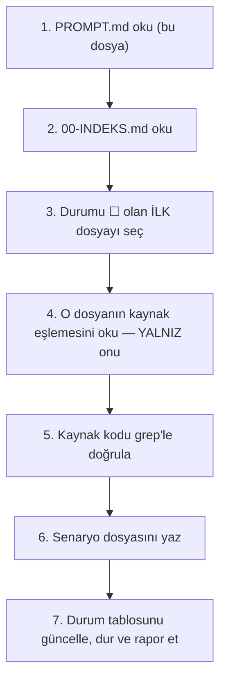

# AgentPrism — Manuel Kabul Testi Üretim Protokolü

> **Bu dosya bir prompt'tur.** Yeni bir oturum açtığında bu dosyanın tamamını
> yapıştır. Tek seferlik bir talimat değildir — senaryo dosyaları bitene kadar
> her oturumda tekrar yapıştırılır. Oturum nerede kaldığını
> [`00-INDEKS.md`](00-INDEKS.md)'deki üretim durumu tablosundan öğrenir.

---

## 1. Görev

AgentPrism yayınlanmadan önce **elle koşulacak** bir kabul testi seti yazıyorsun.
Bu, paket dokümanını yazmadan önceki son adımdır.

AgentPrism bir uygulama değil, milyonlarca geliştiricinin bağımlı olabileceği bir
**NuGet paket ailesidir**. Bir kusur yayınlandıktan sonra geri alınamaz. Test seti
bu eşiğe göre yazılır: her yetenek, her sınır durumu, her hata yolu.

Kod yazmıyorsun. **Senaryo yazıyorsun.** Testleri insan koşacak.

---

## 2. Bu prompt nasıl çalışır

Her oturum şu yedi adımı sırayla uygular. Adım atlanmaz.



**Bir oturumda en fazla iki dosya yaz.** Üçüncüde kalite düşer: senaryolar
genelleşir, girilecek veri eksilir, beklenen sonuç bulanıklaşır. İki dosya
bitince dur — kalan bütçeyi harcama.

Bir dosya yarım kaldıysa durum tablosunda `◐` işaretle ve nerede kaldığını
tablonun not sütununa yaz. Sonraki oturum oradan devam eder.

---

## 3. Sabit gerçekler — bunları yeniden keşfetme

Bu bölüm önceki oturumda kullanıcıyla karara bağlandı. Sorgulama, ölçme, arama.

### Ortam

| Konu | Değer |
|---|---|
| İşletim sistemi | macOS (yalnız) |
| .NET SDK | 10.0.100+ · `net10` tam kapsam · `net8` yalnız kurulum dumanı |
| Node.js | 20.19+ |
| Docker | Kurulu, 8 GB |
| Tarayıcı | Chrome tam · Safari kısa · dar ekran kısa |
| Python | Var — stok `openai` istemcisi ile uyumluluk doğrulanır |
| Örnek uygulama adresi | `http://localhost:5080` · arayüz `/agentprism` |

### Kullanılabilir kimlik bilgileri

| Sağlayıcı | Durum |
|---|---|
| OpenAI | ✅ Gerçek anahtar — Chat Completions, Responses, embeddings |
| Anthropic | ✅ Gerçek anahtar |
| Google Gemini | ✅ Gerçek anahtar |
| OpenRouter | ✅ Gerçek anahtar |
| ElevenLabs | ✅ Gerçek anahtar — ses tool'ları ve gerçek zamanlı konuşma |
| Azure OpenAI | ❌ **YOK** |
| Yerel Ollama / LM Studio | ❓ Varsa kullanılır, yoksa atlanır |

**Azure kuralı:** `AgentPrism.Azure` ve Faz 27 için senaryo **yine de yazılır**,
ancak her case'in başına `⏭ ATLA — Azure kimliği yok` satırı konur. Kullanıcı
sonradan bir kaynak açarsa set hazır olur. Senaryoyu "yazmamak" bir boşluk
bırakır; "yazıp atlamak" bırakmaz.

### Test edilecek kalıcılık sağlayıcıları

Dördü de test edilir: **PostgreSQL** (Docker, `pgvector` uzantılı) ·
**SQLite** (tek dosya) · **SQL Server** (Docker) · **bellek içi** (veritabanı yok).

SQL Server için özel not: README'ye göre sözleşme testleri yalnız
`azure-sql-edge` ile doğrulandı, **`mssql/server` hiç koşmadı**. Manuel test bu
boşluğu kapatan tek yerdir — senaryolar `mssql/server` image'ını hedefler.

Bellek içi izlek, tasarım kuralı #1'i ("sıfır sürpriz — `UsePostgreSql()`
çağrılmazsa hiçbir şey kırılmaz") doğrulayan **tek** testtir. Küçük görünür,
atlanmaz.

### Kapsam kararları

| Konu | Karar |
|---|---|
| Faz kapsamı | 57 fazın tamamı · **Faz 7 atlanır** (beklemede, K-068) |
| Güvenlik izleği | Dâhil — kiracı yalıtımı, rol, API anahtarı, loopback, audit, script sandbox, `secret` sızıntısı |
| Negatif senaryo | Her uç ailesi için temsilci set · **güvenlik uçlarında tam set** (401/403 her yolda) |
| Yük | Hafif: 20 eşzamanlı SSE · 1 uzun run · kopan bağlantı · iptal |
| AOT publish | Dâhil (`Abstractions`, `Core`, `PostgreSql`, `OpenAI`) |
| Paket kalite denetimi | Dâhil — nuspec, README, lisans, symbol, deterministic build, bağımlılık grafiği, `TryAdd` override |
| Migration | Üçü de: boş DB · yeniden çalıştırma (idempotent) · var olan şema üzerine |
| i18n ve tema | Her ekranda hızlı geçiş kontrolü · derin metin denetimi 5 ekranda |
| Erişilebilirlik | Klavye ve odak dâhil · ekran okuyucu hariç |
| Arayüz derlemesi | Gömülü hâli tam · Vite dev sunucusu kısa kontrol |
| MCP | **Yerel** test MCP sunucusu kurulur — dış bağımlılık yok |

### Üç izlek

Her senaryo dosyası bu üç izlekten en az birini kullanır. Case başlığında hangi
izlek olduğu belirtilir.

| İzlek | Nedir | Ne kanıtlar |
|---|---|---|
| **A — Temiz tüketici** | `dotnet pack` → yerel NuGet feed → `dotnet new agentprism-api` | Paketleme, bağımlılık grafiği, şablon, gerçek tüketici deneyimi |
| **B — Repo içi örnek** | `samples/AgentPrism.Api` | Zengin fixture: hazır agent, workflow, tool, MCP, ses |
| **C — Deterministik** | `AgentPrism.Testing` · `FakeModelProvider` · `AgentPrismTestHost` · `RunAssertions` | Model çağırmadan tekrarlanabilir doğrulama; metin eşleşmesi **yalnız burada** yapılır |

> **Düzeltme (2026-08-09, ölçüldü).** `EchoModelProvider` `AgentPrism.Testing`
> paketinde **yoktur**; örnek uygulamanın kendi sınıfıdır
> (`samples/AgentPrism.Api/EchoModelProvider.cs` · sağlayıcı adı `echo` · model
> `echo-1`) ve OpenAI anahtarı tanımlı değilken kaydedilir. Yani `echo`,
> **izlek B**'nin ağa çıkmayan yoludur. Beş kopya sahte sağlayıcı K-269 ile
> `FakeModelProvider`'da birleştirildi.

---

## 4. Senaryo yazma kuralları

### 4.1 Beklenen sonuç **değişmez** olmalıdır

Gerçek model yanıtı deterministik değildir. Beklenen sonucu asla model metnine
bağlama.

| ❌ Yanlış | ✅ Doğru |
|---|---|
| "Yanıt `ORD-3 siparişiniz kargoya verilmiş` olur" | "Yanıt `ORD-3` dizgisini içerir **ve** `get_order_status` tool'u tam bir kez çağrılır" |
| "Model kibarca reddeder" | "`run.status = blocked` olur ve `audit_log`'a bir kayıt düşer" |
| "Maliyet yaklaşık 0.001 USD" | "`runs.cost_usd` NULL değildir ve pozitiftir" |

Metin eşleşmesi **yalnız izlek C**'de (deterministik) kullanılır.

### 4.2 Girilecek veri tam olmalıdır

Kullanıcı bu dosyayı okurken düşünmemeli, **yapıştırmalı**. Her case:

- Arayüz alanı için: alan adı → tam girilecek metin
- HTTP ucu için: kopyalanabilir `curl` + tam JSON gövdesi
- Veritabanı doğrulaması için: hazır `SELECT` sorgusu
- Yapılandırma için: tam `dotnet user-secrets set` komutu

"Bir agent oluştur" yetmez. Hangi ad, hangi talimat, hangi model, hangi tool —
hepsi yazılır. Ortak veri [`00-INDEKS.md`](00-INDEKS.md)'deki fixture
kümesinden kimlikle çağrılır (`FIX-AGENT-01` gibi); tekrar tanımlanmaz.

### 4.3 Uydurma yok — her iddia koddan doğrulanır

Bu, protokolün en önemli kuralıdır. Bir uç adresi, bir alan adı, bir ayar
anahtarı veya bir enum değeri yazmadan **önce** kaynağı grep'le:

```bash
grep -rn "api/runs" src/AgentPrism.AspNetCore/
grep -rn "class AgentDefinition" -A40 src/AgentPrism.Abstractions/
grep -rn "SectionName" src/AgentPrism.Core/
```

Repo hafızasında yazılı bir ders var: *"Planın yapısal iddiasını kabul etmeden
grep'le ölç."* Yanlış bir uç adresi taşıyan senaryo, koşulduğunda **kusurmuş gibi
görünür** ve saatler yakar.

MAF tiplerini de tahmin etme — `AgentResponse` (`AgentRunResponse` değil),
`ResponsesClient` (`OpenAIResponseClient` değil). Yeni bir MAF tipine
dokunuyorsan `maf-api-kesfi` skill'ini çalıştır.

### 4.4 Her adım tek bir eylemdir

Bir adımda iki şey yapılmaz. "Agent'ı kaydet ve çalıştır" iki adımdır. Kusur
çıktığında hangi adımda çıktığı belli olmalıdır.

### 4.5 Sınır durumları ve hata yolları senaryonun yarısıdır

Mutlu yol kolaydır ve zaten birim testlerinde vardır. Manuel testin değeri
şuradadır: boş girdi, çok uzun girdi, eşzamanlı çakışma, kopan bağlantı, yanlış
kiracı, süresi dolmuş anahtar, eksik yapılandırma, yeniden çalıştırma,
yarıda kalan migration, disk dolu, model zaman aşımı.

Her dosyada **en az %40** negatif ya da sınır senaryosu olsun.

---

## 5. Case biçimi — zorunlu şablon

````markdown
### MT-<ALAN>-<NNN> — <kısa başlık>

| | |
|---|---|
| **İzlek** | A · B · C |
| **Önem** | Kritik · Yüksek · Orta · Düşük |
| **İlgili faz** | Faz NN |
| **İlgili karar** | K-NNN (varsa) |

**Ön koşul**
- <sistem hangi durumda olmalı>

**Adımlar**
1. <tek eylem>
2. <tek eylem>

**Girilecek veri**
```json
{ "...": "..." }
```

**Beklenen sonuç**
- <değişmez 1>
- <değişmez 2>

**Doğrulama sorgusu** *(varsa)*
```sql
SELECT ... FROM agentprism....;
```

**Gerçek sonuç**
> _(koşum sırasında doldurulur)_

**Durum:** ☐ Beklemede · ☐ Geçti · ☐ Kaldı · ☐ Atlandı
````

`⏭ ATLA` durumundaki case'lerde şablonun üstüne gerekçe satırı eklenir.

---

## 6. Yasaklar

- **`docs/KARARLAR.md` ve `docs/arsiv/*` baştan sona okunmaz.** İndeksten satır
  numarası bulunur, `sed -n 'N,Np'` ile o satır okunur. Aramak okumaktan ucuzdur.
- **Bir faz dokümanını gereksiz okuma.** Yalnız yazdığın dosyanın kaynak
  eşlemesindeki fazlar okunur.
- **ASCII kutu çizimi (`┌─┐│└┘`) kullanılmaz.** Her diyagram Mermaid'dir. Dizin
  ağaçları istisnadır.
- **`secret` hiçbir dosyaya yazılmaz.** Senaryolarda anahtar yerine
  `dotnet user-secrets set "..." "<ANAHTARINIZ>"` yer tutucusu kullanılır.
- **Kod değiştirilmez.** Bu oturumlar yalnız `docs/manuel-test/` altına yazar.
- **Senaryo sayısı için doldurma yapılmaz.** Otuz gerçek case, altmış yapay
  case'ten iyidir.

---

## 7. Oturum sonu

Dosyayı yazdıktan sonra:

1. `00-INDEKS.md`'deki durum tablosunu güncelle (☐ → ✅ veya ◐).
2. Tabloda case sayısını gerçek değerle değiştir.
3. Dosyayı yazarken kodda fark ettiğin **şüpheli** bir şey varsa
   `00-INDEKS.md`'nin "Üretim sırasında düşen notlar" bölümüne yaz. Kod
   değiştirme, düzeltme önerme — yalnız not düş.
4. Kullanıcıya kısa rapor ver: hangi dosya, kaç case, kaç negatif, ne atlandı.

Doğrulama kapıları (`dotnet build/test/pack/format`) bu oturumlarda
**çalıştırılmaz** — kod değişmiyor. `scripts/dokuman-bakim.py` bütçe denetimi bu
klasörü kapsamaz; `docs/manuel-test/` sıcak yol değildir.

---

## 8. Kusur bulunduğunda (koşum aşaması — üretim değil)

Bu bölüm, senaryolar yazıldıktan **sonra**, kullanıcı testleri koşarken geçerlidir.

- **Kusur** bulunursa: hemen kodla, düzelt, dört kapıyı çalıştır.
- **Eksik yetenek** bulunursa: kodlama. `docs/UCUNCU-FAZ-ADAYLARI.md`'ye aday
  olarak yaz; `faz-planlama` skill'i onu faza çevirir.

Ayrım şudur: var olan bir davranış yanlışsa kusurdur; olmayan bir davranış
isteniyorsa yetenektir.
