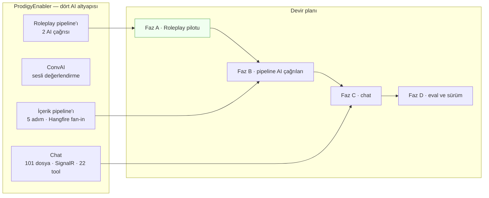

# AgentPrism — Tüketici Geri Bildirim Raporu

> **Kimden:** ProdigyEnabler (ABP 10.5 / .NET 10 / PostgreSQL / Hangfire) — AgentPrism'i üretim AI altyapısına gömmeye hazırlanan tüketici proje.
> **Kime:** AgentPrism kod geliştirme agent'ı.
> **Tarih:** 2026-08-21 · **Ölçülen sürüm:** `0.0.0-preview.0.291` (13 paket referanslı; `Azure`/`Sqlite`/`SqlServer` bilinçli dışarıda)
> **Önceki tur:** [`2026-08-18-tuketici-raporu.md`](../arsiv/kesif/2026-08-18-tuketici-raporu.md) — aynı tüketiciden. O tur F-110…F-119'u doğurdu. **Bu rapor onun devamıdır.**
>
> **Not (AgentPrism tarafı, 2026-08-21):** Bu dosya dışarıdan gelen bir tüketici
> raporudur ve **olduğu gibi** saklanır. İddiaların doğrulaması bizim tarafımızda
> [`2026-08-21-tuketici-turu-2.md`](2026-08-21-tuketici-turu-2.md) içindedir.
> Rapordaki göreli bağlantılar bu repo'ya göre düzeltilmiştir; metin değişmemiştir.

---

## 0. Bu Rapor Nasıl Okunmalı

Bu bir spec değildir, **tüketici raporudur**. Önceki turun zemin notu şunu yazmıştı:

> "Yetkilendirme ve maliyet dağıtımı boşlukları önceki turlarda görülmemişti. İkisini de faz listesine bakmak değil, **gerçek bir tüketicinin paketi gömmeye çalışması** gösterdi."

Aradaki fark şudur: **2026-08-18 turu dokümanı okuyarak yazılmıştı; bu tur paketin API yüzeyi okunarak ve gerçek bir geçiş planlanarak yazıldı.** Kaynak: 12 paketin XML dokümanı (~6.100 public member), `AgentPrism.AgentMap.md`, `agentprism.json` (123 yol), nuspec bağımlılıkları ve tüketici tarafının 190 dosyalık AI kod tabanı.

Okuma sırası:

| Bölüm | Ne var |
|---|---|
| §1 | Zemin — ne ölçüldü, hangi kararlarla çakışma tarandı |
| §2 | **Önce bunu oku:** iddia edilmeyen 6 kalem — zaten var olan veya yanlış çıkan şeyler |
| §3 | Kalemler — `ADAYLAR.md` şablonunda, kopyalanmaya hazır (Y1–Y9) |
| §4 | Ek özellik önerileri — tüketici ihtiyacından değil, ürün açısından |
| §5 | Açık sorular |

**F numarası atamadım.** Bugünkü en büyük numara F-138'dir; numarayı `aday-kesfi`/`faz-planlama` verir. Rapor içi kimlikler `Y1…Y8`'dir.

---

## 1. Zemin

### 1.1 Çakışma taraması

Her kalem, önerilmeden önce üç yere karşı tarandı. Bu tarama olmadan yazılan bir kalem, zaten kapatılmış bir tartışmayı yeniden açar.

| Kaynak | Sonuç |
|---|---|
| [`arsiv/KARARLAR-INDEKS-REDDEDILEN.md`](../arsiv/KARARLAR-INDEKS-REDDEDILEN.md) (25 kalem) | **L16 (EF Core kullanılmadı 🤔)** bir kalemi doğrudan etkiledi — Y1 buna göre yeniden yazıldı |
| `ADAYLAR.md` — *Bilerek Önerilmeyenler* (18 kalem) | **Fatura üretimi** orada. Bu turda **önerilmedi** — bkz. §2.5 |
| `ADAYLAR.md` — açık kalemler | **F-34** (talimat şablonlama) ve **F-95** (tur bazlı kontrol noktası) bu raporun iki kalemiyle örtüşüyor. İkisi de **yeni kalem olarak açılmadı**; ikisine de yeni kanıt eklendi |
| `YOL-HARITASI.md` (82 faz) | Faz 69, 70, 72 kapalı — üç iddiam bu yüzden düştü (§2) |

### 1.2 Tüketicinin zemini — kalemlerin geldiği yer

Kalemler soyut değil. Hepsi şu geçişin planlanmasından çıktı:

Her fazın planlaması bir engel üretti. Kalemler o engellerdir.

---

## 2. İddia Edilmeyen Kalemler — Önce Bunu Oku

Bu turun ilk çıktısı, kendi ilk taslağımdaki **altı iddiayı düşürmek** oldu. Reddin gerekçesi kabulün gerekçesi kadar değerlidir; bu bölüm o gerekçeleri kaydeder.

### 2.1 SignalR köprüsü kancası — ❌ zaten var

**İlk iddia:** "Taşıma yalnızca SSE'dir; gerçek zamanlı olayları başka bir kanala aktarmanın yolu yok."

**Ölçüm:** `IRunEventSink` var (Faz 70, F-115 — **önceki turumuzun kalemi**). Sözleşmesi tam olarak bu iş için yazılmış: sıcak yolda çalışır, `await` edilir, hata koşuyu düşürmez, sink hata verirse o koşu için devre dışı bırakılır, tek örnek tüm koşulara hizmet eder ve `RunEvent.TenantId` ile kiracı ayrımı yapılır.

**Kalan boşluk çok daha küçüktür** ve Y6'da yazılıdır: örnek yok, ve "kuyruğa at, dönüş yap" kuralı sıcak yol için kritik olduğu hâlde yalnız XML dokümanında duruyor.

### 2.2 Tool başına yetkilendirme — ❌ zaten var

**İlk iddia:** "Onay var, izin yok; tool gövdesindeki yetki kontrolü tüketicinin işi."

**Ölçüm:** `IToolAuthorizationHandler` var (Faz 69, F-113 — yine önceki turumuzun kalemi) ve tasarımı doğru: yetkilendirme onaydan **önce** koşar, `AllowAllToolAuthorizationHandler` varsayılan davranışı korur, handler hata verirse çağrı **reddedilir** (fail-closed), `RequiredPermission` opak string'dir ve anlamını yalnız handler çözer.

Bu, ABP izin sistemine birebir oturur: `RequiredPermission` = `Permissions.Skills.Delete`, handler = `IPermissionChecker`. Tüketici tarafında yazılacak kod ~30 satırdır. **Kalem yok.**

### 2.3 Yapılandırma/örnekleme ayarlarının koşuda kaydı — ❌ konusuz

**İlk iddia:** "`RunRecord` sıcaklık/top-p taşımıyor; replay ve eval karşılaştırması sadık değil."

**Ölçüm:** `RunRecord.AgentVersion` var. Örnekleme ayarları agent tanımında yaşar ve tanım sürümlenir. Sürüm numarasından ayarlar geri okunur. **Ayrı kolon gereksizdir.**

### 2.4 Toplu üretim (batch) — ❌ zaten var

**İlk iddia:** "Bir kaynaktan N çıktı üreten toplu koşu primitifi yok."

**Ölçüm:** `JobKind.AgentBatch` + `JobRecord.TotalItems`/`DoneItems`/`FailedItems` (Faz 17). **Kalem yok.**

### 2.5 Fatura üretimi — ❌ bilerek önerilmiyor, itiraz yok

Önceki tur bunu *Bilerek Önerilmeyenler*'e koydu: maliyet hesaplanıyor, `RunCost` para birimi taşıyor, dönem/kur/mark-up bir iş katmanıdır ve muhasebe sistemine göre değişir.

**Tüketici olarak katılıyoruz.** F-111'in kırılım boyutları (kiracı · kullanıcı · etiket) geldikten sonra toplama katmanını kendimiz yazarız. Bu kalem yeniden açılmasın.

### 2.6 EF Core tabanlı bir entegrasyon paketi — ❌ karar defterine takıldı

**İlk iddia:** "ABP/EF Core köprü paketi lazım."

**Ölçüm:** L16 — *EF Core kullanılmadı 🤔*. Ham `Npgsql` + gömülü SQL bilinçli bir karardır (L29) ve doğrulanmıştır.

**Sonuç:** Köprü ihtiyacı gerçektir ama **EF Core ile ilgisi yoktur.** Kimlik, kiracı ve izin genişleme noktalarını bağlamak için tek satır EF Core gerekmez. Y1 bu yüzden bir **paket** değil, bir **örnek + doküman** kalemi olarak yazıldı.

---

## 3. Kalemler

Her kalem `ADAYLAR.md` şablonundadır ve doğrudan kopyalanabilir. Sıra tüketici değerine göredir. Mercek numaraları `ADAYLAR.md`'nin sekiz merceğine karşılık gelir.

---

### Y1 · Talimat şablonlama — F-34'e tüketici kanıtı 🔴

> **Yeni kalem değildir.** `ADAYLAR.md` §D'deki **F-34**'e ait yeni kanıt ve daralan bir kapsamdır. F-34 bugün "ergonomi" olarak sınıflanmış ve iki bağımsız kalemden biri olarak "hiçbiri bugün bir tüketiciyi engellemiyor" satırında duruyor. **Bu doğru değildir. Bizi engelliyor.**

**Sorun:** `AgentDefinition.Instructions` düz metindir. `InstructionsByCulture` (Faz 72) yalnız dile göre varyant verir. **Çalışma anı parametresi için yer yoktur.**

Tüketici tarafında **her** AI çağrısı çalışma anında parametre enjekte eder. Bu bir kolaylık değil, mimarinin temelidir:

| Çağrı yolu | Talimata giren çalışma-anı verisi |
|---|---|
| Sohbet turu | Oturuma özgü alanlar (`DynamicParametersJson`) — kullanıcının hangi ekranda olduğu, hangi kaydı düzenlediği |
| İçerik üretimi | Makale metni, ders/konu bağlamı |
| Sesli değerlendirme | Değerlendirme rubriği, yetkinlik boyutları, roleplay talimatı |
| Roleplay üretimi | Senaryo parametreleri |

Bugün bunu Scriban tabanlı bir renderer yapıyor ve JSON-güvenli kaçış uyguluyor.

**AgentPrism'de bugün iki yol var ve ikisi de kötüdür:**

1. **Parametreyi kullanıcı mesajına koy.** Talimatı veri kanalına indirir. Enjeksiyon yüzeyini büyütür (bkz. Y8) ve "system prompt" ile "kullanıcı girdisi" ayrımını yok eder.
2. **Her çağrıda `AddAgent(name, factory)` ile dinamik agent üret.** Kod agent'larının sürüm geçmişi yoktur — bu, Faz 19'un sürümleme, diff, rollback, A/B ve eval kazanımlarının **tamamını** kapatır. Yani F-34'ün eksikliği, bizim için Faz 18/19/45/49/56'yı erişilemez kılıyor.

**İkinci yol, kalemin gerçek maliyetini gösterir:** F-34 tek başına bir ergonomi kalemi değil, **ölçme–iyileştirme döngüsünün tüketici için ön koşuludur.**

**Kapsam** (F-34'ün mevcut kapsamına ek — ve onun risk cümlesiyle uyumlu):

- `AgentDefinition.Parameters` — tipli parametre şeması (ad, tip, zorunluluk, varsayılan). Tanım derlenirken doğrulanır.
- `AgentRunRequest.parameters` — koşu isteğinde sözlük. Şemayla eşleşmezse **koşu başlamaz** (`/estimate` ve `/validate` de aynı hatayı verir).
- **Yalnız değer yerleştirme.** F-34'ün risk satırı zaten bunu söylüyor: ifade, koşul, döngü, filtre yok. Sadece `{{ad}}`. Bu kısıt kalemin en değerli kısmıdır ve gevşetilmemelidir.
- **JSON-güvenli kaçış yerleşik.** Talimat JSON parçası taşıyorsa (tool şema örneği, çıktı şablonu) değer yapıyı bozamaz. Bunu bugün tüketicide elle yapıyoruz ve bu, güvenlik açığı üreten türden bir iştir.
- **Eksik parametre davranışı sözleşmede olmalı.** Sessizce boş bırakma bir üretim hatasıdır; "koşu başlamaz" doğru varsayılandır.
- **Eval vakası parametre seti taşımalı.** Aksi hâlde parametreli bir agent değerlendirilemez ve kalem kendi değerini kesmiş olur.
- `InstructionsByCulture` ile birleşir: her kültür varyantı **aynı** parametre şemasını kullanır.

**Değer:** Bu olmadan parametreli agent'lar AgentPrism tanımına taşınamaz. Bir tüketici için "agent tanımını AgentPrism'e taşı" adımı bugün yarım kalıyor.
**Mercek:** 1, 5, 7 — ve dolaylı olarak 3 (parametresiz bir kontrol düzlemi kurumsal bir prompt kütüphanesi olamaz).
**Hazırlık:** Sıfırdan. Ama kapsam daraldığı için ucuzladı: değer yerleştirme + kaçış bir şablon motoru değildir, ~150 satırlık saf bir fonksiyondur. Scriban gibi bir motor **alınmamalıdır** — hem K2'yi zorlar hem AOT duruşunu.
**Maliyet:** Orta. Yeni public tip: 2 (`AgentParameterDefinition`, sözlük alanı). Migration: agent tanımı yükü zaten `jsonb`.
**Risk:** 🚨 Şablon dili bir güvenlik yüzeyidir — F-34'ün kendi cümlesi. Değer yerleştirmeyle sınırlı kalırsa risk düşüktür. İkinci risk: eksik parametre davranışının sessiz olması.
**Bağımlılık:** Faz 19 (sürümleme) · Faz 72 (çok dillilik) · Faz 18/45 (eval vakası şeması).
**Ekosistem:** Langfuse, Braintrust, Portkey'de tam olarak bu var — `ADAYLAR.md` bunu zaten yazıyor. Eksik olan tek şey bir tüketicinin "bu beni engelliyor" demesiydi.

---

### Y2 · Kesintiye uğramış turun devamı — F-95'in MAF-kancasız alternatifi 🔴

> **F-95 ile aynı ihtiyaç, farklı tasarım.** F-95 şu ölçümle kapsam dışına alınmıştı: *"MAF agent düzeyinde kanca vermiyor — ölçüldü. Kancayı AgentPrism yazmak K3'ü zorlar. Kanca yalnız `Microsoft.Agents.AI.Workflows` içinde var."* **Bu ölçüm doğrudur ve bu kalem onu tartışmıyor.** Önerilen tasarım MAF'a hiç kanca takmaz.

**Sorun:** Agent koşusu süreç-içidir. Süreç yeniden başlarsa (deploy, çökme, ölçek olayı) koşu kaybolur. `ClaimOrphanedRunsAsync` (Faz 54) satırı `Failed` işaretler — doğru davranıştır ama **kurtarma değildir.**

Tüketici tarafında bugünkü karşılık şudur: her tool turunda iş kuyruğa geri girer, bu yüzden deploy sırasında akan bir sohbet turu **hayatta kalır**. AgentPrism'e geçiş bu davranışı kaybettirir. Tek instance'lı bir kurulumda bu, **her yayında aktif turların kesilmesi** demektir.

**Kritik gözlem — kayıp veri yoktur.** Kesilen turun bilgisi zaten diskte durur:

- `run_events` append-only'dir ve `ToolInvoking`/`ToolInvoked` çiftleri **argümanları ve sonuçları** taşır.
- `RecordedToolPlayback` bu kayıttan bir defter kurup `(tool adı, argümanlar)` çiftiyle eşleştirmeyi **zaten yapıyor** ve aynı çağrının tekrarını kayıt sırasına göre tüketiyor.
- `PendingApproval` sözleşmesi şu emsali **zaten kurmuş**: *"Karar verildikten sonra AYNI koşu devam etmez; kuyruğa yeni bir koşu konur (aynı oturum, yeni RunId)."*

Yani "turu tur sınırında devam ettirme" mekanizması AgentPrism'de **iki parça hâlinde mevcuttur**; eksik olan üçüncüsü onları birleştiren tetikleyicidir.

**Kapsam:**

- `ClaimOrphanedRunsAsync` öksüz bir koşuyu kapatırken, koşu bir **oturuma** bağlıysa ve ayar açıksa, aynı oturum için bir devam koşusu kuyruğa konur (`JobKind.AgentRun`, yeni `RunId`, `parent_run_id` ile öksüz koşuya bağlı).
- Devam koşusu tool'ları `RecordedToolPlayback` defteriyle koşar: kesilen turda **tamamlanmış** tool çağrıları yeniden çalıştırılmaz, kayıtlı sonuçları döner. Yarım kalan çağrı yeniden çalışır.
- Ayar varsayılan **kapalı** (sıfır sürpriz kuralı). `AgentPrism:RunReconciliation` altında yaşar — orası zaten öksüz koşunun evi.
- Deneme sayısı sınırlı; `JobRecord.MaxAttempts` zaten var.
- Devam koşusu koşu ağacında görünür olmalı: operatör "bu tur bir kez kesildi ve devam etti" cümlesini konsolda okuyabilmelidir.

**Neden K3'ü zorlamaz:** MAF'a kanca takılmıyor. Kullanılan üç şeyin üçü de AgentPrism'in kendi kaydıdır — `run_events`, `RecordedToolPlayback`, iş kuyruğu.

**Neden K-315'i (yeniden oynatma oturumsuzdur) ihlal etmez:** Bu bir replay değildir. Replay kaynak koşuyu yeni ve oturumsuz bir koşu olarak tekrar çalıştırır. Bu kalem **aynı oturumun kesilen turunu** devam ettirir ve bunu `ApprovalResume`'un zaten yaptığı gibi yeni bir koşuyla yapar. İki işlem ayrı adlandırılmalıdır ki karışmasın.

**Bilinen zayıflık — dürüstçe:** Yan etkisi olan bir tool yarıda kesilirse (yazma yapmış ama sonucu kaydedilmemiş) devam koşusu onu tekrar çalıştırır. Bu, tüketicinin idempotency sorumluluğudur ve dokümanda açıkça yazılmalıdır. `ToolEffect.Destructive` taşıyan tool'lar için devam varsayılan olarak **reddedilmelidir**.

**Değer:** "Dayanıklı agent çalıştırması (crash-resume)" ekosistem boşluk tablosunun ilk satırıdır ve LangGraph/Mastra/Temporal'ın standardıdır. Faz 46 bunun HTTP yüzünü (`202 Accepted`) verdi; bu kalem **motor tarafını** verir.
**Mercek:** 2 (gece 03:00 nöbetçisi), 3, 6.
**Hazırlık:** Üç parça hazır (olay akışı, playback defteri, kuyruk). Yeni olan yalnız tetikleyici ve devam sözleşmesi.
**Maliyet:** Orta. Yeni public tip: 1–2 (ayar + belki bir `RunContinuation` kaydı). Migration: `runs` tablosuna bir `continued_from_run_id` kolonu (nullable).
**Risk:** Orta. En büyük risk yan etkili tool'un tekrarıdır — `ToolEffect` ile kapatılır. İkinci risk: sonsuz devam döngüsü — `MaxAttempts` ile kapatılır.
**Bağımlılık:** Faz 46 (kuyruk) · Faz 47 (`RecordedToolPlayback`) · Faz 54 (öksüz uzlaştırma) · Faz 55 (`ApprovalResume` emsali).
**Ekosistem:** LangGraph `durable-execution`, Mastra `createDurableAgent`, Temporal, Inngest, Restate. .NET'te karşılığı **yok** — `ADAYLAR.md`'nin kendi tablosu bunu yazıyor.

---

### Y3 · Görsel üretim tool'u 🟠

**Sorun:** AgentPrism görsel **üretemiyor**. Faz 14 çok modluluğu girdi tarafında çözdü (görsel, ses, dosya girdisi); çıktı tarafında karşılığı yok. `ImageGenerationToolCallContent` yalnız MAF içerik tipi olarak JSON bağlamında geçiyor — bir sağlayıcı yeteneği olarak sunulmuyor.

Tüketici tarafında görsel üretimi üretimde çalışan bir pipeline adımıdır: bir makale onaya girdiğinde beş içerik üretilir ve biri görseldir. AgentPrism'e geçince **dört adımın maliyeti görünür olur, beşincisi görünmez kalır.** "Bir makalenin toplam üretim maliyeti nedir" sorusu tam cevaplanamaz — ve o soru kontrol düzleminin varlık sebebidir.

**Kapsam:**

- `AgentPrism.Images` (veya mevcut sağlayıcı paketlerine ek): `GenerateImageTool` — ses tarafındaki `SpeakTool`/`TranscribeTool` emsaliyle birebir aynı yapı.
- Ölçüm: görsel başına / çözünürlük başına fiyat. `VoicePriceOverride` deseni aynen uygulanabilir — o desen "bir model ya karakter başına ya süre başına ücretlenir" ayrımını zaten çözmüş.
- `tool_invocations` satırına yazılır; koşuya bağlıdır; kota, onay, denetim ve kiracılık otomatik gelir.
- Üretilen görsel `IAttachmentStorage` üzerinden yaşar — genişleme noktası zaten var.
- Operatör ucu: sesin `POST /api/voice/speak` emsali gibi bir `POST /api/images/generate` **isteğe bağlıdır**; o uç koşu dışıdır ve ses tarafında ölçüm satırı yazılamadığı için karakter sayısını yanıtta döndürüyor. Aynı karar burada da geçerlidir.

**Değer:** Çok modlu üretim yapan her tüketici için ölçüm bütünlüğü. Ses için verilen sözün görsel için de verilmesi.
**Mercek:** 1, 3, 8.
**Hazırlık:** Sağlayıcı SDK'ları hazır (OpenAI `Images`, Google Gemini görsel çıktısı). Ses fazının (Faz 28) yapısı birebir emsaldir.
**Maliyet:** Orta. Yeni paket **gerekmeyebilir** — sağlayıcı paketlerine tool eklemek yeterli olabilir; ölçülmelidir.
**Risk:** Düşük–orta. Asıl risk fiyatlandırmanın karmaşıklığıdır (boyut, kalite, model başına farklı birim). Ses tarafındaki "AgentPrism fiyat uydurmaz; eşleşme yoksa `null` döner" kuralı burada da korunmalıdır.
**Bağımlılık:** Faz 28 (ses tool'ları — emsal) · Faz 14 (ekler).
**Ekosistem:** LiteLLM görsel üretimi maliyetiyle birlikte proxy'liyor. Langfuse görsel çıktıyı izlemede gösteriyor. .NET'te kontrol düzlemi seviyesinde karşılığı yok.

---

### Y4 · Tüketici köprü örneği — beş genişleme noktası tek yerde 🟠

> **Bu bir paket kalemi değildir.** İlk taslakta "ABP entegrasyon paketi" olarak yazılmıştı; L16 (EF Core kullanılmadı) ve *"S3/Azure Blob uygulaması: genişleme noktası zaten var, somut uygulama tüketicinin işidir"* emsali okununca **örnek + doküman** kalemine daraltıldı. Volo.Abp bağımlılığı paket ailesine girmemelidir.

**Sorun:** AgentPrism'i mevcut bir kurumsal uygulamaya gömmek için **beş** genişleme noktası aynı anda doğru bağlanmalıdır:

| Genişleme noktası | Neyi çözer | Tuzağı |
|---|---|---|
| `ITenantContext` | "Bu isteğin kiracısı kim" | Uygulamanın kiracı kimliği `Guid?`, AgentPrism'inki `string`. Host/null hâli eşlenmelidir |
| `IRunAttributionContext` | "Kim harcadı, hangi iş için" | Singleton olmalı |
| `IToolAuthorizationHandler` | "Bu çağrıyı yapabilir mi" | Fail-closed — doğru, ama uygulamanın izin kontrolü fırlatıyorsa davranış değişir |
| `IRunEventSink` | Gerçek zamanlı köprü | Sıcak yolda `await` edilir |
| Kiracı kaydının senkronizasyonu | AgentPrism'in kendi `tenants` tablosu | `MigrationHostedService` yalnız **varsayılan** kiracıyı garanti eder; yeni kiracı elle eklenmelidir |

Beşinin **her biri** kendi XML dokümanında iyi anlatılmış. Ama beşi bir arada hiçbir yerde görünmüyor. Tüketici bunları tek tek keşfediyor ve sırayı kendi kuruyor.

**Ve bir tuzak bunların hepsini kesiyor:** `AmbientTenantScope` / `AmbientRunAttributionScope` — arka planda çalışan bir işte (Hangfire job'ı, hosted service, ABP background job) scope'un **koşuyu başlatan metodun kendi gövdesinde** açılması ve akış yolunda her `MoveNextAsync` öncesi açık kalması gerekir. Bu, AgentPrism'in kendi `AGENTS.md`'sinde *"beş kez yaşandı"* diye kayıtlı bir tuzaktır. Tüketici bunu ilk kez yaşayacaktır — ve tüketici tarafında `AsyncLocal` akışını hata ayıklamak, kütüphane içinde ayıklamaktan zordur.

**Kapsam:**

- `samples/` altına ikinci bir örnek: **"var olan bir uygulamaya gömme"**. Bugünkü `AgentPrism.Api` örneği yeşil alan kurulumudur; bu örnek beş noktayı da bağlar.
- Örnek çerçeve-nötr olmalıdır: ASP.NET Core + jenerik bir "kiracılı, izinli, arka plan işli uygulama". ABP adı geçmesin — ama desen ABP, Orchard, kendi yazdığı çerçeve, hepsine uysun.
- Arka plan işi senaryosu **zorunlu**: örnekte bir hosted service'ten koşu başlatan bir yol olsun, scope orada doğru açılsın. Tuzağın tek gerçek panzehiri budur.
- `docs-site/`'a "Embedding AgentPrism in an existing application" sayfası: beş nokta + sıra + doğrulama listesi.

**Değer:** Mercek 1'in ta kendisi — ilk agent'a kadar geçen süre. Yeşil alan kurulumu iki satırdır (`AddAgentPrism()` + `MapAgentPrism()`); gömme kurulumu bugün keşif gerektiriyor.
**Mercek:** 1, 3, 6.
**Hazırlık:** Hazır — beş nokta da mevcut. Yalnız örnek ve sayfa yazılacak.
**Maliyet:** Küçük. Public yüzey **büyümez**.
**Risk:** Düşük. Tek risk örneğin bayatlamasıdır; `samples/` derlemeye dahil olduğu için kapı zaten var.
**Bağımlılık:** Faz 69, 70 (iki genişleme noktası oradan geldi).
**Ekosistem:** Langfuse ve LiteLLM'in "self-host + mevcut auth'una bağla" rehberleri benimsemenin en çok okunan sayfalarıdır.

---

### Y5 · Workflow düğüm retry'ı ve takılmış workflow uzlaştırması 🟠

**Sorun:** Workflow yürütme dayanıklıdır ama **kendi kendini toparlamaz**. Ölçülen durum:

| Var olan | Eksik olan |
|---|---|
| `EnableCheckpointing` varsayılan açık, süper adım başına yazım | Kesilen bir workflow'un **otomatik** devamı yok — `POST /workflows/runs/{id}/resume` elle çağrılır |
| `MaxSuperSteps` sonsuz döngüyü kesiyor | **Düğüm başına retry politikası yok** — bir düğüm geçici bir sağlayıcı hatasıyla düşerse tüm koşu düşer |
| `ClaimOrphanedRunsAsync` koşuyu `Failed` kapatıyor | Checkpoint'i olan bir workflow için "kapat" yerine "devam ettir" seçeneği yok |
| `MaxConcurrentRuns` sağlayıcı kotasını koruyor | Takılmış workflow taraması yok (lease süresi dolan koşu) |

Tüketici tarafındaki karşılığı üç katmanlı bir kurtarma mimarisidir: her adım sonrası öksüz adım tespiti · periyodik watchdog taraması · yeni tetiklemede zorla sonlandırma. Bu üç katman gerçek bir üretim olayından doğdu — dört paralel adımın biri sessizce takılınca pipeline sonsuza dek `Running` kaldı.

**Bu kalem olmadan** tüketici Hangfire'ı bırakamaz. Yani AgentPrism kurulumunda **üçüncü** bir kuyruk kalıcı olur.

**Kapsam:**

- Workflow tanımında düğüm başına retry politikası: deneme sayısı + geri çekilme (backoff) çarpanı. `JobRecord.MaxAttempts`'ın düğüm seviyesindeki kardeşi.
- Geçici/kalıcı hata ayrımı — tipli sağlayıcı exception'ları (`AgentPrismProviderUnavailableException`) zaten bunu **taşıyor**; metin eşleştirmesine gerek yok. Bu, kalemin en ucuz parçasıdır.
- `RunReconciliation` workflow koşularını da kapsasın: checkpoint'i olan ve lease'i düşmüş bir koşu `Failed` yerine **kuyruğa geri konsun** (ayarla, varsayılan kapalı).
- Konsolda "bu workflow düğümü 2 kez denendi" görünürlüğü — `run_events` zaten olay taşıyor.

**Değer:** Workflow'un "dayanıklı" iddiasının tamamlanması. Bugün dayanıklılık **manuel bir düğmeye** bağlı.
**Mercek:** 2, 3, 6.
**Hazırlık:** Checkpoint altyapısı, kuyruk, tipli hata sınıfları ve uzlaştırma taraması **hazır**. Yeni olan politika alanı ve tetikleyici.
**Maliyet:** Orta. Workflow tanımı yükü `jsonb`; migration gerekmeyebilir.
**Risk:** Orta. Retry ile checkpoint'in etkileşimi ölçülmelidir: bir düğüm yeniden denenirken süper adım sınırı nerede? İkinci risk: yan etkili düğümün tekrarı — Y2'nin `ToolEffect` kısıtıyla aynı çözüm.
**Bağımlılık:** Faz 15/16 (workflows) · Faz 44 (hata sınıflandırma) · Faz 54 (uzlaştırma) · Y2 ile **aynı aileden** — ikisi de "kesilen işi devam ettir" sorusudur ve birlikte planlanmaları ucuz olabilir.
**Ekosistem:** Temporal ve Inngest'in çekirdek vaadi tam olarak budur: düğüm başına retry + otomatik devam.

---

### Y6 · `IRunEventSink` için gerçek zamanlı köprü örneği ve tampon 🟡

**Sorun:** Kanca var ve doğru tasarlanmış (§2.1). Ama sözleşmesinin en kritik cümlesi yalnız XML dokümanında yaşıyor:

> "Sıcak yolda çalışır. Koşunun yanıtı kendi çağıranına akmaya devam etmeden önce `await` edilir — olayı kuyruğa at ve dön, başka I/O'da bloklama."

Gerçek bir gerçek zamanlı köprü (SignalR, WebSocket fan-out, Redis pub/sub) bu kuralı kendi başına uygulamak zorundadır. Yanlış yazılmış bir sink, **model akışını istemci ağının hızına bağlar.** Bu, fark edilmesi zor ve üretimde pahalı bir hatadır.

**Kapsam:**

- `samples/` içinde bir sink örneği: sınırlı bir kanal (`System.Threading.Channels`) + arka plan tüketici + kanal dolduğunda **düşürme** politikası (blokama değil). Örnek SignalR ile olabilir; desen taşınabilir olmalıdır.
- İsteğe bağlı: paket içinde `BufferedRunEventSink` sarmalayıcısı — `AddRunEventSink<T>(bufferSize)` gibi. Bu, "her tüketici aynı kuyruğu yeniden yazmasın" argümanıdır ve S3 emsalinden farklıdır: burada tekrarlanan şey bir bulut SDK'sı değil, **bir eşzamanlılık desenidir** ve yanlış yazılması sıcak yolu bozar.
- Doküman: "olay ne zaman düşürülebilir" sözleşmesi. Bir istemci yavaşsa hangi olay atılır, `Sequence` ile istemci nasıl toparlanır?

**Değer:** `IRunEventSink`'in doğru kullanımını varsayılan hâle getirir. Bugün doğru kullanım **dikkatli okumaya** bağlı.
**Mercek:** 2, 4, 5.
**Hazırlık:** Hazır.
**Maliyet:** Küçük (örnek) veya küçük–orta (sarmalayıcı da yazılırsa).
**Risk:** Düşük. Sarmalayıcı eklenirse tek soru varsayılan tampon boyutudur.
**Bağımlılık:** Faz 70.
**Ekosistem:** —

---

### Y7 · Tool çıktısı için boyut sınırı 🟡

**Sorun:** Bir tool'un döndürdüğü metin **sınırsızdır** ve doğrudan bağlama girer. Ölçüldü: `ToolOptions` timeout taşıyor (Faz 69), boyut taşımıyor. `CompactionSettings` bağlamı **sonradan** toparlar — ama toparlanacak token zaten harcanmıştır ve sıkıştırmanın kendisi bir model çağrısıdır.

Tüketici tarafında somut örnek: bir ontoloji arama tool'u geniş bir alt ağaç döndürebilir. Bugün bunu tüketici kodu elle kırpıyor. Her tool'un bunu kendi gövdesinde yapması, unutulduğunda sessizce pahalıya patlayan türden bir kuraldır.

**Kapsam:**

- `AgentPrismToolRegistration.MaxOutputBytes` (veya karakter) — `Timeout` alanının kardeşi, aynı yerde yaşar, kurulum varsayılanı `ToolOptions`'tan gelir.
- Aşımda çıktı kırpılır ve modele **açık bir işaretle** verilir: "çıktı kırpıldı, N bayt atlandı". Sessiz kırpma modelin yanlış sonuç üretmesine yol açar.
- Kırpma olayı `run_events`'e yazılır — operatör hangi tool'un sürekli kırpıldığını görebilmelidir. Bu, kalemin ölçme–iyileştirme tarafıdır: kırpılan tool, yanlış tasarlanmış tool'dur.

**Değer:** Doğrudan FinOps. Tek bir kaçak tool bir kiracının kotasını yiyebilir.
**Mercek:** 8, 2, 5.
**Hazırlık:** Hazır — `TimeoutAIFunction` sarmalayıcısının yanına ikinci bir sarmalayıcı.
**Maliyet:** Küçük. Yeni public alan: 2.
**Risk:** Düşük. Tek risk varsayılanın ne olacağıdır — varsayılan **sınırsız** olmalıdır (sıfır sürpriz), sınır açıkça konur.
**Bağımlılık:** Faz 69 (`ToolOptions`) · Faz 13 (compaction — tamamlayıcıdır, rakip değil).
**Ekosistem:** LiteLLM ve Portkey tool/yanıt boyutu sınırını gateway seviyesinde sunuyor.

---

### Y8 · Veri ile talimatın yapısal ayrımı 🟡

**Sorun:** Faz 48 guard'ları kalıp tabanlıdır ve **bilinen** desenleri arar. Enjeksiyonun asıl vektörü desen değildir: kullanıcı tarafından yazılmış uzun bir metnin (makale, transcript, döküman) talimatın içine gömülmesidir. Kalıp guard'ı burada yardımcı olmaz; metin zararsız görünür ve içindeki "önceki talimatları yok say" cümlesi modele **talimat kanalından** ulaşır.

Tüketici tarafında bu, sistemdeki en geniş yüzeydir: içerik üretim adımları kullanıcının yazdığı makale metnini prompt'a gömer.

**Kapsam:**

- `AgentRunRequest.documents` — adı ve içeriği olan, **talimat olmadığı işaretli** bir dizi.
- Sağlayıcı sınırında uygun biçimde sarmalanır: Anthropic'te XML etiketi, OpenAI'de ayrı mesaj rolü/sınırlayıcı. Sağlayıcı başına en iyi biçim, sağlayıcı adaptörünün bilgisidir — kontrol düzlemi bunu merkezîleştirebilir.
- Kayıtta ayrı görünür: `run_inputs` içinde "talimat" ile "belge" ayrı alanlar olur. Denetim izi "modele hangi belge girdi" sorusunu cevaplayabilir.
- Y1 ile birlikte anlam kazanır: bugün belge metni **parametre olarak talimata** giriyor; iki kalem birlikte planlanırsa doğru kanal en baştan doğru olur.

**Dürüst sınır:** Hiçbir sağlayıcı "bu veri, talimat değil" için sert bir garanti vermiyor. Bu kalem bir **konvansiyon ve denetim** kalemidir, bir güvenlik garantisi değil. Dokümanı bunu açıkça söylemelidir; aksi hâlde yanlış bir güven duygusu üretir — ki bu, hiç yapmamaktan kötüdür.

**Değer:** Enjeksiyon yüzeyinin daraltılması ve denetlenebilir hâle gelmesi.
**Mercek:** 3, 7.
**Hazırlık:** Sağlayıcı adaptörleri mevcut; sarmalama biçimi her sağlayıcı için ayrı ölçülmeli.
**Maliyet:** Orta.
**Risk:** 🚨 **Fazla söz verme riski.** Kalemin adı "prompt injection koruması" olmamalıdır.
**Bağımlılık:** Faz 48 (guard'lar) · Y1 (şablon) ile aynı ailede.
**Ekosistem:** Anthropic'in belge sarmalama önerisi, OpenAI'ın `input` rolleri. Kontrol düzlemi seviyesinde merkezîleştiren bir .NET kütüphanesi yok.

---

### Y9 · Türkçe/bölgesel PII kalıp ailesi 🟢

**Sorun:** `PiiPatterns` aileleri Kuzey Amerika biçimlerine göre kurulmuş. `DeniedTerms` tüketicinin kendi terimlerini alıyor (ve regex olmadığı için ReDoS taşımıyor — doğru karar). Ama bölgesel kimlik numarası, IBAN ve telefon biçimleri için tüketici kendi `IContentGuard`'ını yazmak zorunda.

**Bu en küçük kalemdir ve kolayca ertelenebilir.** Buraya yazılmasının tek sebebi, ertelenirken **bilinçli** ertelenmesidir.

**Kapsam:** `PiiPatterns`'a bölgesel aileler (TR kimlik numarası, IBAN, TR telefon biçimi). Her aile bağımsız açılır — mevcut "hepsini birden açmak yanlış pozitifi katlar" kuralı korunur.
**Değer:** Küçük ama KVKK/GDPR konuşulan bir satın alma görüşmesinde somut.
**Mercek:** 3.
**Hazırlık:** Hazır — mevcut aile mekanizmasına ekleme.
**Maliyet:** Küçük.
**Risk:** Düşük. Yanlış pozitif riski aile bazlı açılışla zaten yönetiliyor. IBAN kalıbı ülkeler arası çakışabilir — ölçülmeli.
**Bağımlılık:** Faz 48.
**Ekosistem:** Presidio'nun bölgesel tanıyıcıları emsal.

---

## 4. Ek Özellik Önerileri

Bunlar tüketici ihtiyacından çıkmadı. Paketi bir bütün olarak okurken görünen boşluklardır. **Hiçbiri acil değildir**; kayda geçmeleri için yazıldılar.

### 4.1 Agent tanımı yaşam döngüsü — `Deprecated` durumu

Bugün bir agent ya vardır ya silinir. Sürüm geçmişi var, ama "bu agent artık kullanılmamalı, yeni koşu kabul etmesin, geçmişi dursun" hâli yok. Kurumsal bir kurulumda agent sayısı arttıkça bu hâl gerekir — silmek geçmişi ve maliyet raporunu bozar. Küçük bir alan (`Status`) ve bir kabul kontrolü.

### 4.2 Kota aşımının modele değil **operatöre** anlatılması

Kota aşımında 429 dönüyor ve `ProblemDetails` hangi kotanın aşıldığını ve sayacın ne zaman sıfırlandığını taşıyor — bu iyi. Eksik olan, aşımın **bildirim** tarafıdır. Webhook var; ama "kota %80'e geldi" gibi bir eşik olayı yayınlanıyor mu, ölçmedim. Yayınlanmıyorsa `IRunEventSink`'in kardeşi bir "yönetişim olayı" akışı düşünülebilir. Operatör kotanın dolduğunu kullanıcı şikâyetinden öğrenmemelidir.

### 4.3 `AgentDefinition.Metadata` için şema desteği

Serbest biçimli metadata alanı doğru bir karar. Tüketici oraya domain bilgisi koyacak (hangi ekran hangi agent'ı kullanır gibi). Bir noktada "bu kurulumda metadata şu anahtarları taşımalı" demek gerekebilir. Bugün gerek yok; kayda geçsin.

### 4.4 Konsolda koşu ağacı için maliyet toplamı

`GET /runs/{id}/tree` ağacı veriyor ve her koşu kendi maliyetini taşıyor. Ağaç toplamının (kök + tüm çocuklar) tek yerde görünmesi, alt agent kullanan bir kurulumda en çok sorulan sorudur. Muhtemelen konsolda vardır; API'de bir alan olarak var mı, ölçmedim.

### 4.5 Tanım doğrulama ucunun tüketici CI'ında kullanımı

`POST /api/agents/validate` var. Tüketici bunu CI'da kullanmak isteyecektir: "prompt değişikliği merge edilmeden önce doğrula". Bunun için uç değil, **kütüphane içinden çağrılabilir** bir doğrulayıcı gerekir (`AgentDefinitionCompiler` public mi?). F-50 (tipli yönetim istemcisi) bu ihtiyacın bir kısmını karşılar.

---

## 5. Açık Sorular

Bunlar tüketici olarak cevabını bilmediğim ve tasarımı etkileyen sorulardır.

| # | Soru | Neden önemli |
|---|---|---|
| 1 | Y1 (şablon) ve Y8 (belge kanalı) tek fazda mı planlanmalı? | İkisi de "talimata ne girer" sorusudur. Ayrı planlanırsa ikincisi birincisinin kararını bozar — Küme C emsali |
| 2 | Y2 ve Y5 tek fazda mı? | İkisi de "kesilen işi devam ettir"dir; biri agent, biri workflow. Ortak sözleşme (devam kaydı, deneme sayısı, yan etki kısıtı) yazılabilir |
| 3 | Y2'de devam koşusu **varsayılan kapalı** mı olmalı? | Sıfır sürpriz kuralı "evet" diyor. Ama o zaman özellik varsayılan kurulumda görünmez kalır |
| 4 | Görsel üretim (Y3) yeni bir paket mi, mevcut sağlayıcı paketlerine ek mi? | Ses ayrı paket oldu (`AgentPrism.Voice`); görselin bağımlılık ağırlığı ölçülmeli |
| 5 | `IRunEventSink` için tampon sarmalayıcısı (Y6) paket sınırına girer mi? | S3 emsali "somut uygulama tüketicinin işi" diyor; ama burada tekrarlanan şey bir eşzamanlılık desenidir |

---

## 6. Ölçüm Kaynakları

Bu rapordaki her iddia aşağıdakilerden birine dayanır. Canlı çalıştırma yapılmadı — tüketici ortamında Docker kapalı, DB ve sağlayıcı anahtarı yok.

| Kaynak | Ne için |
|---|---|
| 12 paketin XML dokümanı (`~/.nuget/packages/agentprism.*/0.0.0-preview.0.291/lib/net10.0/*.xml`) | Tip sözleşmeleri, tasarım gerekçeleri, varsayılanlar |
| `AgentPrism.AgentMap.md` (Core `buildTransitive/`) | Yetenek envanteri |
| `agentprism.json` (OpenAPI 3.1.1 · 123 yol) | HTTP yüzeyi, uç davranışları |
| `.nuspec` dosyaları | Bağımlılıklar, hedef framework |
| `docs/ADAYLAR.md` · `docs/YOL-HARITASI.md` · `docs/arsiv/KARARLAR-INDEKS-REDDEDILEN.md` | Çakışma taraması (§1.1) |
| `docs/kesif/2026-08-18-tuketici-raporu.md` | Önceki turla süreklilik |
| ProdigyEnabler `docs/AI-MIMARISI.md` · `claudedocs/ai-altyapi-*` | Tüketici tarafındaki gerçek ihtiyaç |
| ProdigyEnabler `claudedocs/agentprism-uygulanabilirlik-raporu-2026-08-21.md` | Bu raporun kaynağı olan tam geçiş analizi |
