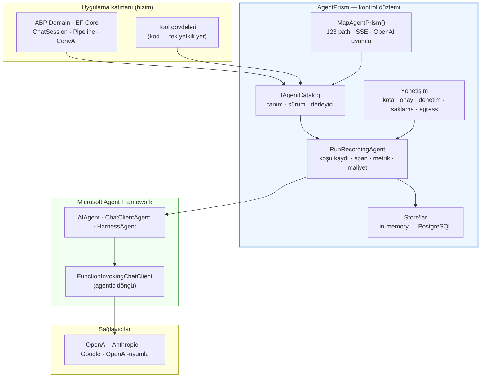
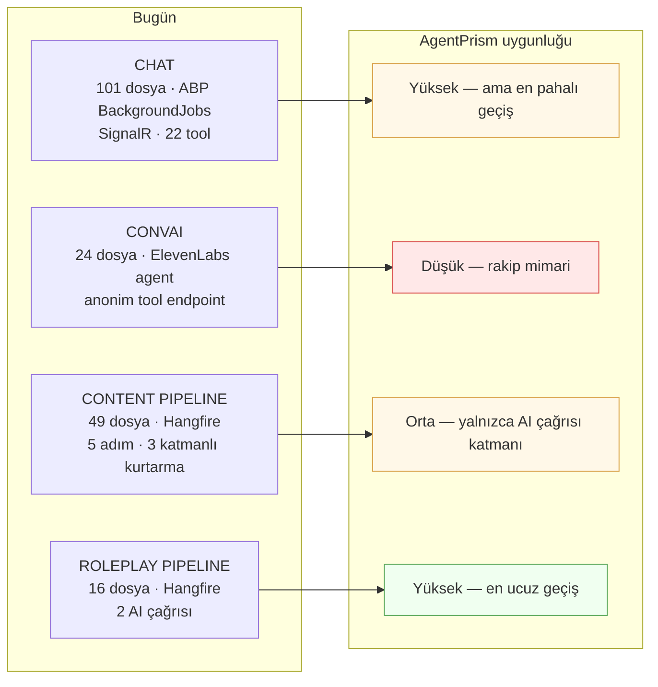
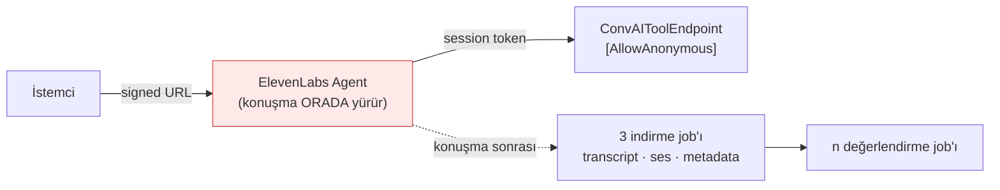
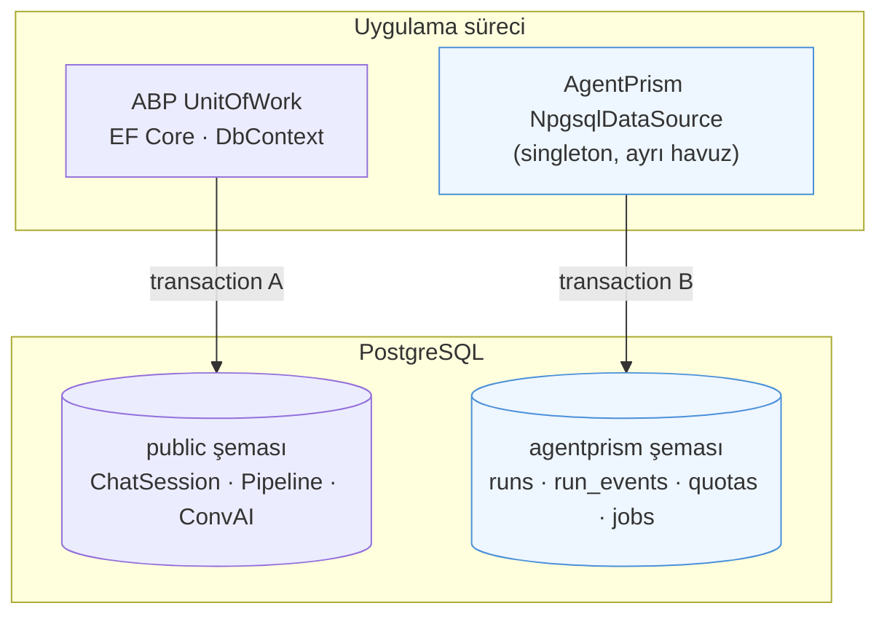
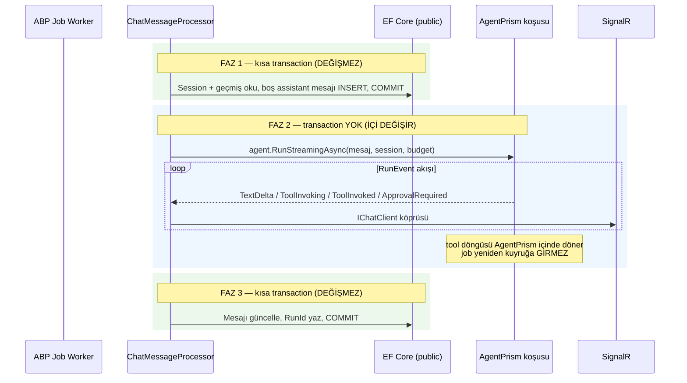
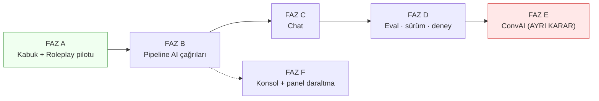

# AgentPrism — Uygulanabilirlik ve Geçiş Raporu

> **Tarih:** 2026-08-21
> **Soru:** ProdigyEnabler'ın AI altyapısı AgentPrism'e devredilebilir mi? Nerede oturur, nerede oturmaz, ne eksik?
> **İncelenen sürüm:** AgentPrism `0.0.0-preview.0.291` (13 paket, `ProdigyEnabler.Application`'a referanslı)
> **Kanıt tabanı:** Paketlerin XML dokümanları (~6.100 public member), `AgentPrism.AgentMap.md` yetenek haritası, `agentprism.json` (OpenAPI 3.1.1, 123 path), nuspec bağımlılıkları · `docs/AI-MIMARISI.md` · `claudedocs/ai-altyapi-elestiri-2026-07-27.md` (B1–B28) · `claudedocs/ai-altyapi-hedef-mimari-2026-07-27.md` (Faz 0–7) · `claudedocs/ms-agent-framework-karsilastirma-2026-08-01.md` · `docs/AI-OPS-PANELI.md` · `docs/KARARLAR.md` · `ProdigyEnabler/src/` kodu
> **Ortam notu:** Bu ortamda Docker kapalı, DB bağlantısı ve AI anahtarları yok. Rapordaki hiçbir iddia canlı çalıştırmayla değil, kod ve doküman okumasıyla doğrulandı. Canlı smoke test kullanıcının kendi ortamında yapılmalıdır.
>
> **Not (AgentPrism tarafı, 2026-08-21):** Bu dosya dışarıdan gelen bir tüketici
> raporudur ve **olduğu gibi** saklanır. §12'deki sorular tüketicinin kendi
> kararlarıdır, bizim değil. Doğrulama:
> [`2026-08-21-tuketici-turu-2.md`](2026-08-21-tuketici-turu-2.md).

---

## İçindekiler

1. [Yönetici özeti](#1-yönetici-özeti)
2. [AgentPrism ne yapar — mimari konumlandırma](#2-agentprism-ne-yapar--mimari-konumlandırma)
3. [Mevcut altyapı ile eşleme](#3-mevcut-altyapı-ile-eşleme)
4. [B1–B28 bulgularının karşılığı](#4-b1b28-bulgularının-karşılığı)
5. [Hedef mimari fazlarının karşılığı](#5-hedef-mimari-fazlarının-karşılığı)
6. [Alt sistem alt sistem uygunluk analizi](#6-alt-sistem-alt-sistem-uygunluk-analizi)
7. [Entegrasyon mimarisi — somut çatışma noktaları](#7-entegrasyon-mimarisi--somut-çatışma-noktaları)
8. [AI Ops Console'un durumu](#8-ai-ops-consoleun-durumu)
9. [Önerilen geçiş planı](#9-önerilen-geçiş-planı)
10. [Eksik yetenekler — daha çok neye ihtiyacımız var](#10-eksik-yetenekler--daha-çok-neye-ihtiyacımız-var)
11. [Riskler](#11-riskler)
12. [Karar gerektiren açık sorular](#12-karar-gerektiren-açık-sorular)
13. [Başarı ölçütleri](#13-başarı-ölçütleri)

---

## 1. Yönetici Özeti

**Tez:** AgentPrism, `ai-altyapi-hedef-mimari-2026-07-27.md` dokümanının yazdığı platform katmanının büyük bölümünü hazır getirir. Devir teknik olarak mümkündür ve yüksek getirilidir. Ancak devir **"AI altyapısını teslim etmek" değil, "AI altyapısının bir yarısını teslim etmek"** olarak planlanmalıdır.

2026-08-01 tarihli MS Agent Framework karşılaştırması sistemi ikiye ayırmıştı:

| Yarı | O günkü karar | AgentPrism'le bugünkü durum |
|---|---|---|
| **Agent yarısı** — tool şeması, tool-call formatı, onay, iterasyon kontrolü, gözlemlenebilirlik | "Tekrar ettik, framework'te hazır" | **Devredilebilir.** AgentPrism bunların hepsini kapatır. |
| **Orkestrasyon yarısı** — transaction sınırları, ABP tenant/yetki, Hangfire + 3 katmanlı kurtarma, SignalR kontratı, ConvAI | "Haklı özel geliştirme, framework'te karşılığı yok" | **Kısmen değişti.** AgentPrism tenant, kota, kuyruk, koşu mutabakatı getirir — ama ABP'ye bağlanmaz, dayanıklı fan-in yapmaz, SignalR bilmez. |

Kaba ölçüm:

- **28 mimari bulgunun (B1–B28) 20'si tam kapanır**, 6'sı kısmen kapanır, 1'i değişmez, 1'i (B22 — kuyruk çokluğu) **kötüleşir**.
- **7 fazlık hedef mimarinin 5'i büyük ölçüde AgentPrism'e devredilir.** Faz 5 (streaming protokolü) ve Faz 6'nın bir kısmı bizde kalır.
- **AI Ops Console'un 13 modülünün 9'u** AgentPrism'in gömülü konsoluyla karşılanır. 76 sayfalık gereksinim ciddi biçimde daralır.

**En büyük üç kazanım:** koşu kaydı + maliyet muhasebesi (B2/B6/B7), sunucu tarafı onay kapısı (B5), agent tanımı versiyonlama + eval + deney (B18).

**En büyük üç engel:** (1) ABP/EF Core ile AgentPrism iki ayrı veri düzlemidir, ortak transaction yoktur; (2) agent döngüsü süreç-içidir, bizim job-tabanlı dayanıklı döngümüzün karşılığı yoktur; (3) prompt'a çalışma-anı parametre enjeksiyonu (Scriban) AgentPrism'de yoktur.

**Önerilen yol:** Tek seferde devir değil, **beş fazlı kademeli devir**. En küçük ve en izole parçadan (Roleplay pipeline) başla, chat'i sona bırak, ConvAI'yi ayrı bir karar olarak ayır.

---

## 2. AgentPrism Ne Yapar — Mimari Konumlandırma

AgentPrism, Microsoft Agent Framework (MAF) üstüne oturan bir **kontrol düzlemidir**. MAF tiplerini (`AIAgent`, `AgentSession`, `ChatMessage`, `AIFunction`) sarmalamaz, doğrudan kullanır. Kendi katkısı MAF'ın bilinçli olarak boş bıraktığı yerdir: kalıcılık, kimlik, para, denetim, operasyon.

### 2.1 Değişmez kuralları

Bu kurallar paket dokümanında açıkça yazılıdır ve entegrasyon tasarımını doğrudan belirler:

| Kural | Sonucu |
|---|---|
| **Tool kodu yalnızca kodda tanımlanır.** `AgentDefinition.ToolNames` isim listesidir; UI'dan agent yaratılır, kod yaratılamaz. | Bizim 22 backend tool'umuz kodda kalır. UI'dan yalnızca seçilir. |
| **Koşu kanıt birimidir.** Her çalıştırma bir `runs` satırı + append-only olay akışı üretir. | `AiCallLog` tasarımımız gereksiz olur. |
| **Gözlemlenebilirlik davranışı bozmaz.** Store yazımı başarısız olursa koşu devam eder. | Kayıt kaybı sessizdir; kritik muhasebe için ek kontrol gerekir. |
| **Guard bir kontroldür, gözlem aracı değil.** `IContentGuard` hata fırlatırsa koşu başarısız olur. | Guard'larımızın semantiği değişir: bugün "blokla ve devam et" değil, "bloklanan istek ağa hiç çıkmaz". |
| **API-key kapsamı rol vermez.** Yetki = rol ∩ kapsam. | ABP izin ağacıyla eşleme yapılabilir. |
| **Sürpriz yok.** `AddAgentPrism()` tek başına hiçbir guard, worker, kota veya sağlayıcı açmaz. | Kademeli devir mümkündür; her yetenek tek tek açılır. |
| **Tüketicinin kaydı kazanır.** Store'lar `TryAdd` ile kaydedilir; `UsePostgreSql()` yalnızca kendi seçimini `Replace` eder. | Her store'u kendi implementasyonumuzla değiştirebiliriz. |

### 2.2 Paket haritası ve bu projedeki durumu

| Paket | Rol | Bizim için |
|---|---|---|
| `AgentPrism.Core` + `.Abstractions` | Çalışma zamanı + sözleşmeler (4.014 member) | Zorunlu |
| `AgentPrism.PostgreSql` | Kalıcılık — ham Npgsql, kendi şeması, kendi migration'ları | Zorunlu (kalıcı kayıt isteniyorsa) |
| `AgentPrism.OpenAI` / `.Anthropic` / `.Google` | Sağlayıcı adaptörleri | 4 provider'ımızın 4'ü de karşılanır |
| `AgentPrism.AspNetCore` | 123 path'lik yönetim API'si, SSE, OpenAI uyumluluk | Konsol/panel için |
| `AgentPrism.UI` | Gömülü operatör konsolu + `embed.js` | AI Ops Console kapsamını daraltır |
| `AgentPrism.Workflows` | Çok-agent'lı workflow motoru (süreç-içi) | Sınırlı fayda — bkz. §7.6 |
| `AgentPrism.Voice` | ElevenLabs istemcisi + gerçek zamanlı sesli konuşma | ConvAI ile **rakip** mimari — bkz. §6.2 |
| `AgentPrism.Mcp` | MCP istemcisi | Bugün ihtiyaç yok |
| `AgentPrism.Testing` | `FakeModelProvider`, `AgentPrismTestHost`, `RunAssertions` | Test yazımında doğrudan değer |

`Azure` / `Sqlite` / `SqlServer` bilinçli olarak dışarıda. `Templates` teknik nedenle dışarıda (`packageType=Template`).

---

## 3. Mevcut Altyapı ile Eşleme

Sistemde dört AI altyapısı var. AgentPrism'in her birine değme derecesi farklıdır.

### 3.1 Kavram eşleme tablosu

| Bizdeki kavram | AgentPrism karşılığı | Eşleme kalitesi |
|---|---|---|
| `AgentConfiguration` (DB tablosu) | `AgentDefinition` + `IAgentDefinitionStore` + sürüm geçmişi | ✅ Üstün — sürüm, diff, rollback, eval bedava gelir |
| `AgentConfiguration.SystemPrompt` (Scriban şablonu) | `AgentDefinition.Instructions` + `InstructionsByCulture` | ⚠️ **Parametre interpolasyonu yok** — bkz. §10.2 |
| `IAIProvider` + `AIProviderFactory` | `IModelProvider` + `IModelProviderRegistry` + `ModelBinding` | ✅ Birebir |
| `AgentConnectionResolver` (şifreli ApiKey) | Yapılandırma anahtarı referansı + `ITenantProviderBindingStore` (BYOK) | ✅ Üstün — kiracı başına sağlayıcı |
| `BackendToolHandlerBase<TIn,TOut>` | `AIFunction` + `IToolRegistry` + `[AgentPrismTool]` | ✅ Şema gücü artar (enum/dizi/nested) |
| Frontend tool + `SubmitToolResultAsync` | `AddClientTool()` + `AgentRunRequest.ToolResults` | ✅ Kavram birebir aynı |
| `ToolConfirmationParser` + `ConfirmationRequired` | `PendingApproval` + `ToolApprovalRule` + `/approvals/{id}/decide` | ✅ Onay sunucuya taşınır |
| `ChatSession` + `ChatMessage` | `AgentSession` (opak MAF state) + `runs` + olay akışı | ⚠️ Domain sorgularımız (retry, resume, liste) kaybolur |
| `ChatSession.TokenQuota` | `IQuotaStore` (kural + atomik sayaç) + 429 | ✅ Kotayı sunucu belirler |
| `ChatToolCallCoordinator` agentic döngü | MAF `FunctionInvokingChatClient` + `AgentRunBudget` | ⚠️ Süreç-içi — bkz. §7.4 |
| `ChatResponseStreamer` tamponlama | `RunEvent` akışı + SSE (`Sequence` ile resume) | ⚠️ SignalR köprüsü bizde |
| `ChatGuardService` GUARD 1/3 | `IContentGuard` + `AddPatternContentGuard()` | ⚠️ Türkçe desenler bizde |
| `PipelineExecution` / `PipelineStepExecution` | `JobRecord` + `IJobStore` / `Workflows` | ❌ Dayanıklı fan-in karşılığı yok |
| `PipelineErrorClassifier` | Devre kesici + tipli `AgentPrismProviderUnavailableException` | ✅ Metin eşleşmesi biter |
| `PipelineWatchdogScheduler` | `ClaimOrphanedRunsAsync` + `AgentPrism:RunReconciliation` | 🟡 Koşu seviyesinde var, adım seviyesinde yok |
| `ConvAISession` + ElevenLabs signed URL | `VoiceConversationDriver` (Option A) + WebSocket | ❌ Rakip mimari — bkz. §6.2 |
| `ConvAIMetricResult` + ağırlıklı skor | `IRunJudge` + eval suite | ⚠️ Kısmi — domain skorlaması bizde kalır |
| `ImageGenerationJob` | **Yok** | ❌ Karşılığı yok |
| `ElevenLabsTtsService` + `PodcastTranscriptBuilder` | `SpeakTool` + `ElevenLabsAudioWithTimestampsResponse` | 🟡 TTS var, podcast montajı bizde |
| `AiCallLog` (planlanan) | `runs` + `run_events` + `IRunInputStore` + replay | ✅ Yazmaya gerek kalmaz |
| `AiPrice` + `CostCalculator` (planlanan) | `Pricing` + `RunCost` (fiyat anlık görüntüsü) | ✅ Yazmaya gerek kalmaz |
| `AiBudget` (planlanan) | `IQuotaStore` + `AgentRunBudget` | ✅ Yazmaya gerek kalmaz |
| `AgentPromptVersion` (planlanan) | Agent sürüm geçmişi + diff + rollback endpoint'i | ✅ Yazmaya gerek kalmaz |

---

## 4. B1–B28 Bulgularının Karşılığı

`ai-altyapi-elestiri-2026-07-27.md` 28 bulgu listeler. Aşağıdaki tablo her birinin AgentPrism'deki karşılığını verir. Kanıt sütunu paketin kendi dokümanına dayanır.

| # | Bulgu | Şiddet | AgentPrism karşılığı | Durum |
|---|---|---|---|---|
| B1 | Agentic loop'un iterasyon sınırı yok | 🔴 | `AgentRunBudget` — adım/token/para/süre; çağrı ağacının tamamında paylaşılan tek örnek | ✅ Tam |
| B2 | Maliyet kaydı sıfır | 🔴 | `RunCost` — koşu bitişinde fiyat anlık görüntüsüyle yazılır; model/agent/koşu/alt-koşu/ses kırılımı | ✅ Tam |
| B3 | Kotayı client belirliyor | 🔴 | `IQuotaStore` — kurallar admin'de, sayaçlar atomik (`INSERT … ON CONFLICT`), aşımda 429 | ✅ Tam |
| B4 | Tool'lar rolsüz principal ile çalışıyor | 🔴 | `IToolAuthorizationHandler` + `ToolAuthorizationRequest.RequiredPermission` + `ToolEffect` — yetkilendirme onaydan önce koşar, fail-closed. Handler'ı ABP `IPermissionChecker`'a bağlamak bizim (~30 satır) | ✅ Tam (kanca) |
| B5 | Yıkıcı işlem onayı modele delege | 🔴 | `PendingApproval` + `ToolApprovalRule` + `/approvals/{id}/decide`; karar MAF oturum geçmişinde, koşu durur | ✅ Tam |
| B6 | Provider istek/yanıt logu yok | 🔴 | Append-only `run_events` + `IRunInputStore` + `GET /runs/{id}/input` + replay | ✅ Tam |
| B7 | Pipeline token kaydı yok | 🔴 | Her çalıştırma bir `runs` satırı — pipeline çağrıları AgentPrism'e taşınırsa otomatik | ✅ Tam (koşullu) |
| B8 | Sıfır OpenTelemetry | 🟠 | `ActivitySource` + `Meter`; koşu/tool/model span'leri; `agentprism.run` kök span'i | ✅ Tam |
| B9 | Request-response yolunda tool döngüsü yok | 🟠 | MAF `FunctionInvokingChatClient` — streaming ve non-streaming aynı döngü | ✅ Tam |
| B10 | Tool şeması düz `{type, description}` | 🟠 | `AIFunction` tam JSON Schema — enum, dizi, iç içe nesne, format | ✅ Tam |
| B11 | Tool kaydı tek assembly'ye kilitli | 🟠 | `AgentPrismToolRegistration` DI kaydı; `AddToolsFrom`, MCP, client tool, skill | ✅ Tam |
| B12 | Streaming token-token değil | 🟠 | `RunEvent` akışı — tek yazıcıdan artan `Sequence`; SSE ve replay aynı yol. `IRunEventSink` ile başka kanala aktarılır | ✅ Tam (kanca) — SignalR adaptörü bizde |
| B13 | Üretim iptali yok | 🟠 | `IRunCancellationRegistry` + `POST /runs/{id}/cancel`; kök iptali ağacı iptal eder | ✅ Tam (tek instance) |
| B14 | Stream'de sıra/devam ettirme yok | 🟠 | `RunEvent.Sequence` — istemci koptuğu sıradan devam eder | ✅ Tam |
| B15 | Guard regex'leri sadece İngilizce | 🟠 | `IContentGuard` + `AddPatternContentGuard()` — kalıp ailesi seçilir; TR desenleri bizim | ⚠️ Kısmi |
| B16 | İçerik metni doğrudan system prompt'a giriyor | 🟠 | Yapısal ayrım yok. Ek dosya/knowledge kanalları var ama "veri ≠ talimat" işareti yok | ⚠️ Kısmi |
| B17 | Provider hata string'i orkestrasyonda | 🟠 | Tipli `AgentPrismProviderUnavailableException` + devre kesici + sağlayıcı sağlığı | ✅ Tam |
| B18 | Prompt versiyonlama / eval yok | 🟠 | Sürüm geçmişi + `versions/{a}/diff/{b}` + rollback + eval suite + deney + canary | ✅ Tam — en büyük kazanım |
| B19 | Agent'lar isim string'iyle çözülüyor | 🟡 | Hâlâ isim, ama `IAgentCatalog` tek kaynak + `POST /agents/validate` | 🟡 Değişmez |
| B20 | Pipeline job'ları %80 kopyala-yapıştır | 🟡 | `IJobHandler` + `Workflows` ortak gövde sağlar; ama fan-in desenimizi karşılamaz | ⚠️ Kısmi |
| B21 | Tool çıktısı sınırsız bağlamda | 🟡 | `CompactionSettings` + `AgentPrism:UtilityModel` (ucuz özetleyici model) | ✅ Tam |
| B22 | İki farklı kuyruk API'si | 🟡 | **Üçüncü kuyruk gelir** (AgentPrism job queue + scheduling) | ❌ Kötüleşir |
| B23 | ConvAI endpoint'i tenant filtresini kapatıyor | 🟡 | `ApiKeyScopeRequirement` + `ExternalSurfaceGuard` + `UseTenancy()`; ConvAI mimarisi değişirse çözülür | ⚠️ Kısmi |
| B24 | Token muhasebesi çıkarmayla tahmin | 🟡 | `RunUsage` — MAF `UsageDetails` sözleşmesi; ölçülmeyen alan `null`, sıfır değil | ✅ Tam |
| B25 | Structured output yok | 🟡 | `AgentResponseFormat` — tanım derlenirken doğrulanır | ✅ Tam |
| B26 | Prompt caching / reasoning alanları yok | 🟡 | `RunUsage` kırılım alanları (cached input, reasoning) | ✅ Tam |
| B27 | Tool timeout ve idempotency yok | 🟡 | `ToolOptions` timeout + `Idempotency-Key` (Stripe deseni) + `IIdempotencyStore` | ✅ Tam |
| B28 | Agent'ın agent'ı çağırması yok | 🟡 | `CallableAgentNames` + `AgentGraph` limitleri + ağaç boyunca paylaşılan bütçe | ✅ Tam |

**Sayım:** 20 tam · 6 kısmi · 1 değişmez · 1 kötüleşen.

> **Düzeltme (2026-08-21, ikinci inceleme):** B4 ve B12 ilk taslakta "kısmi" işaretlenmişti. Paketin API yüzeyi yeniden okununca ikisi de tam çıktı: `IToolAuthorizationHandler` (Faz 69) ve `IRunEventSink` (Faz 70) mevcut. İkisi de bu projenin 2026-08-18 tarihli önceki tüketici raporunun doğurduğu kalemlerdir (F-113, F-115).

Kritik gözlem: **kırmızı (🔴) 7 bulgunun 6'sı tam kapanır.** Kalan biri (B4) yalnızca yarım kapanır ve o yarım bizim işimizdir — çünkü yetkilendirme ABP izin sistemine bağlıdır, AgentPrism onu bilemez.

---

## 5. Hedef Mimari Fazlarının Karşılığı

`ai-altyapi-hedef-mimari-2026-07-27.md` 7 faz tanımlar (~7 hafta iş). AgentPrism bu planın ne kadarını gereksiz kılar?

| Faz | Planlanan iş | AgentPrism'de | Kalan iş |
|---|---|---|---|
| **Faz 0** — Kanamayı durdur | `MaxSteps`, kota tavanı, rol'lü principal | `AgentRunBudget`, `IQuotaStore` hazır | Principal düzeltmesi bizde kalır (küçük) |
| **Faz 1** — Gateway + görünürlük | `IAiGateway`, `AiCallLog`, `AiPrice`, OTel, çağrı gezgini | **Tamamı hazır** — `runs`, `run_events`, `RunCost`, `ActivitySource`, konsol | Yalnızca çağrı yollarını AgentPrism'e bağlamak |
| **Faz 2** — Bütçe + faturalandırma | `AiBudget`, `AiUsageDaily`, maliyet paneli | Kota + `stats/timeseries` + konsol hazır | **Fatura kalemi yok** — tenant faturalandırma çıktısı bizde |
| **Faz 3** — Agent runtime | `IAgentRunner`, `IAgentEventSink`, `IAgentStateStore`, `IContextManager` | **Tamamı hazır** — MAF döngüsü + `AgentSessionManager` + compaction | Süreç-içi/dayanıklılık farkı (§7.4) |
| **Faz 4** — Capability layer | `ICapabilityProvider`, JSON Schema, per-tool izin, onay kapısı | `IToolRegistry`, `AIFunction` şeması, onay kapısı **ve per-tool yetkilendirme** hazır | ABP `IPermissionChecker` köprüsü (~30 satır) |
| **Faz 5** — Streaming protokolü | `ChatStreamEvent`, seq, resume, iptal, token-token | Olay modeli + seq + iptal + `IRunEventSink` kancası hazır | SignalR adaptörü + FE koordinasyonu bizde |
| **Faz 6** — Skill'ler + alt agent | Declarative capability, sub-agent, MCP | `AddSkill`, `CallableAgentNames`, `UseMcp()` hazır | Deklaratif SQL/HTTP capability yok |
| **Faz 7** — Kalite + sertleştirme | Prompt versiyonlama, eval, egress, saklama, ConvAI sertleştirme | Sürüm + eval + `AgentPrism:Egress` + retention + veri sahibi silme hazır | Türkçe guard'lar, ConvAI kararı |

**Sonuç:** 7 fazın 5'i büyük ölçüde devredilir. Kabaca **~7 haftalık planlanan işin ~4,5 haftası** paketle gelir. Kalan iş entegrasyon işidir ve yeni kod değil, köprü kodudur.

Bu, KARARLAR.md'nin kanıt eşiği açısından da önemlidir: hedef mimari zaten kabul edilmiş bir plandı. AgentPrism o planı **iptal etmiyor, uyguluyor**.

---

## 6. Alt Sistem Alt Sistem Uygunluk Analizi

### 6.1 Chat — yüksek uyum, en pahalı geçiş

**Oturan yerler:**

- Agentic döngü, tool çağırma, tool şeması, onay kapısı, iterasyon/bütçe limiti, iptal, oturum durumu, bağlam sıkıştırma, structured output, alt agent.
- Frontend tool kavramı birebir karşılanır: `AddClientTool(name, description, jsonSchema)` sunucuda gövde çalıştırmaz, `FunctionCallContent` üretir ve çağırana döner. İstemci sonucu `AgentRunRequest.ToolResults` ile geri gönderir. Bizim `IsFrontend=true` + `SubmitToolResultAsync` akışımızın aynısıdır.
- Kota: `ChatQuotaEnforcer`'ın üç eşiği (`Warning`/`Error`/`HardStop`) yerine `IQuotaStore` + 429 gelir. Sunucu tavanı zorunlu olur (B3 kapanır).

**Oturmayan yerler:**

| Konu | Neden sorun |
|---|---|
| **SignalR `IChatClient` (14 metod)** | AgentPrism SSE konuşur. FE'nin 14 metotluk sözleşmesi bizde kalır; `RunEvent` → hub köprüsü yazılmalıdır. |
| **`ChatSession` / `ChatMessage` domain entity'leri** | AgentPrism oturum state'ini **opak** tutar (MAF `SerializeSession` çıktısı). Bizim "son 6 mesaja bak", "bayat tool tespiti", `RetrySessionAsync`, `ResumeSessionAsync` sorgularımız bu opak state üzerinde çalışamaz. Entity'ler kalmalı veya bu özellikler yeniden tasarlanmalıdır. |
| **3 fazlı transaction ayrımı** | Ayrıntı §7.3'te. Aslında **çatışma değil, uyum** — ama dikkatli kurulmalıdır. |
| **Job-tabanlı döngü** | Ayrıntı §7.4'te. Gerçek bir dayanıklılık kaybı vardır. |
| **`DynamicParametersJson` interpolasyonu** | Ayrıntı §10.2'de. En sinsi engel budur. |
| **`ContentRegen` önizleme akışı** | `PreviewVersionAdded` + `integrityToken` + `InMemoryContentPreviewStore` tamamen domain'e özgüdür. AgentPrism'de karşılığı yoktur ve olmamalıdır — tool gövdesinde kalır. |

**Verdikt:** Devredilebilir, ama en son devredilmelidir. Kazanç yüksektir; risk de yüksektir çünkü FE sözleşmesi buradadır.

### 6.2 ConvAI — düşük uyum, rakip mimari

Bu, raporun en kritik bulgusudur.

Bugünkü ConvAI, konuşmayı **ElevenLabs'ın kendi agent platformunda** yürütür:

AgentPrism'in `VoiceConversationDriver`'ı **Option A** kullanır: ses proxy'lenmez, sesi metne çevirir, **kendi koşu yolunu** çalıştırır, çıktıyı sese çevirir. Dokümanının kendi ifadesiyle: "Bedeli gecikmedir, getirisi her şeydir — koşu kaydı, span, maliyet, tool onayı, kiracılık ve kota bir ses turunda da tam olarak diğer yerlerdeki gibi çalışır."

| Boyut | Bugünkü ConvAI | AgentPrism Voice |
|---|---|---|
| Konuşmayı kim yürütür | ElevenLabs agent'ı | Bizim agent'ımız (AgentPrism koşusu) |
| Transcript | Konuşma sonrası indirilir (30 sn gecikmeli job) | Konuşma sırasında zaten bizde |
| Tool çağrısı | Anonim REST endpoint + session token | Normal tool yolu — onay, kota, denetim dahil |
| Maliyet görünürlüğü | Yok | Tam (`VoiceSessionRecord` + karakter/süre bazlı fiyat) |
| Gecikme | ElevenLabs optimize | Daha yüksek (segment bazlı, cümle sınırında konuşur) |
| Söz kesme / sıra alma | ElevenLabs'ın olgun implementasyonu | `VoiceConversationStateMachine` — kendi protokolü |
| FE istemcisi | ElevenLabs SDK | AgentPrism WebSocket protokolü (`Sec-WebSocket-Protocol` ile token) |
| Ölçekleme | ElevenLabs tarafında | **Sticky session zorunlu** — bağlantı tek instance'a bağlanır |

**Geçilirse kazanılan:** 3 indirme adımı ve onların kurtarma katmanları **tamamen ortadan kalkar**. `ConvAIProcessingPipeline`'ın iki fazlı fan-in'i sadeleşir. Anonim tool endpoint'i (B23) yok olur. Ses maliyeti görünür olur.

**Geçilirse kaybedilen:** ElevenLabs'ın konuşma kalitesi (gecikme, söz kesme), FE ses istemcisinin tamamı, ve `ConvAISession` durum makinesinin ElevenLabs'a bağlı yarısı.

**Verdikt:** Bu bir teknik geçiş değil, **ürün kararıdır**. Sesli değerlendirme deneyiminin kalitesi doğrudan etkilenir. Ayrı faz, ayrı karar. Raporun geri kalanı ConvAI'nin yerinde kaldığını varsayar.

> Not: Değerlendirme (evaluation) tarafı ayrıdır ve ses mimarisinden bağımsız devredilebilir. `ConvAIEvaluationJob`'ın her kriter için yaptığı AI çağrısı bugün bile AgentPrism agent'ına taşınabilir — `EvaluationCriterion.AgentConfigurationId` zaten agent başına ayrışmış durumdadır.

### 6.3 Content Generation Pipeline — orta uyum, sınırlı devir

**Devredilebilen:** Beş adımın AI çağrıları (`QAGeneration`, `PodcastScript`, `Assessment`). Her çağrı bir AgentPrism koşusu olur. Kazanç: B7 kapanır, pipeline harcaması görünür olur, structured output ile `EvaluationResponseJson` alias karmaşası biter, replay ile bir adım tekrar oynatılabilir.

**Devredilemeyen — ve devredilmemeli:**

| Parça | Neden kalmalı |
|---|---|
| Hangfire orkestrasyonu | AgentPrism job queue'su **kendi iş türlerini** çalıştırır (`JobKind` = `AgentRun`, `AgentBatch`, `Workflow`, `Eval`, `OnlineEval`, `ApprovalResume`, `Retention`, `WebhookDelivery`). Genel amaçlı iş kuyruğu değildir; `ImageGenerationJob` gibi AI-dışı bir adımı barındıramaz. |
| 3 katmanlı kurtarma | AgentPrism `ClaimOrphanedRunsAsync` ile **koşu** seviyesinde mutabakat yapar. Bizim öksüz **adım** tespiti, watchdog taraması ve orchestrator kurtarması bundan daha geniştir. |
| `ContentPipelineCompletionJob` fan-in | AgentPrism'de dağıtık fan-in yoktur. `Workflows` süreç-içi çalışır. |
| Adım entity'leri + ayarlar | `Enabled`, `MaxRetryCount`, `RetryDelaySeconds` gibi adım bazlı ayarlar ve `PipelineStepProgressEto` bildirimleri domain'e aittir. |
| `ImageGenerationJob` | AgentPrism'de görsel üretme yeteneği **yok** (§10.6). |

**Verdikt:** "AI çağrısı katmanı devredilir, orkestrasyon kalır." Bu, MS Agent Framework karşılaştırmasının 4.3'teki sonucuyla birebir aynıdır ve AgentPrism o sonucu değiştirmemiştir.

### 6.4 Roleplay Pipeline — yüksek uyum, en ucuz geçiş

İki AI çağrısı (`roleplay-full-scenario-generator`, `roleplay-artifacts-generator`), kendi pipeline tablosu yok, durum `Roleplay.Status`'ta. Fan-in yok, paralel adım yok.

Bu yüzden **pilot için doğru aday budur.** Geçiş:

1. İki `AgentConfiguration` kaydını AgentPrism `AgentDefinition`'ına taşı.
2. `GenerateRoleplayPipelineJob` içinden `IAgentCatalog.ResolveAsync` + `RunAsync` çağır.
3. 4 artifact üretimini `AgentResponseFormat` ile yapısal çıktıya bağla (bugün prompt'la JSON isteniyor).
4. Hangfire job'ı, principal kurulumu, `MarkPublished`, bildirimler — hepsi yerinde kalır.

Kazanım: koşu kaydı, maliyet, OTel, replay, eval — hepsi tek bir izole akışta doğrulanır. Risk: neredeyse sıfır; FE etkisi yok.

---

## 7. Entegrasyon Mimarisi — Somut Çatışma Noktaları

Bu bölüm, "çalışır mı" sorusunun teknik cevabıdır. Her başlık gerçek bir tasarım kararı gerektirir.

### 7.1 İki veri düzlemi — ortak transaction yok

**En temel yapısal gerçek budur.**

`AgentPrism.PostgreSql` EF Core kullanmaz. Ham `Npgsql` üzerinden çalışır, kendi `NpgsqlDataSource`'unu singleton olarak tutar, kendi migration runner'ıyla kendi şemasını kurar. Dokümanı açıkça yazıyor: *"Tüketicinin public şeması hiçbir koşulda ellenmez."*

Sonuçları:

| Sonuç | Anlamı |
|---|---|
| **Atomiklik yok** | `ChatMessage` INSERT'i ile koşu kaydı aynı transaction'da değildir. Biri commit olur, diğeri olmayabilir. |
| **ABP soft delete / tenant filtresi geçmez** | AgentPrism satırlarına ABP global query filter'ları uygulanmaz. Kiracı izolasyonu AgentPrism'in kendi `tenant_id` sütunuyla sağlanır. |
| **Migration ikili olur** | `db-migration` skill'i yalnızca EF tarafını kapsar. AgentPrism şeması uygulama açılışında kendi kendine migrate olur (`AutoApplyMigrations`). |
| **`DbMigrator` container'ı yetmez** | CI/CD'de migration adımı AgentPrism şemasını kapsamaz — ilk uygulama açılışı kapsar. Bu davranış `AutoApplyMigrations=false` ile kapatılıp ayrı adım yapılabilir. |
| **Bağlantı havuzu iki katına çıkar** | Npgsql kendi havuzunu yönetir. DigitalOcean/Hetzner Postgres bağlantı limiti gözden geçirilmelidir. |

**Tasarım kuralı önerisi:** AgentPrism koşu kaydı için **tek gerçek kaynak** olsun. Domain entity'lerimiz koşuya yalnızca `RunId` ile referans versin (`ChatMessage.RunId`, `ContentPipelineStep.RunId`). Ters yönde veri kopyalamayın — iki kaynak arasında tutarlılık kovalamak, olmayan bir sorunu çözmeye çalışmaktır. Koşu kaydı zaten "gözlemlenebilirlik davranışı bozmaz" kuralıyla yazılır; kayıp bir satır işlevselliği durdurmaz.

### 7.2 Kimlik köprüleri — üç arayüz, ~200 satır

AgentPrism kimlik konusunda hiçbir varsayım yapmaz. Üç arayüzü kendi kimlik hattımıza bağlarız:

| Arayüz | Ne sorar | ABP karşılığı | Not |
|---|---|---|---|
| `ITenantContext` | "Bu isteğin kiracısı kim?" | `ICurrentTenant.Id` | `Guid?` → `string`. Host (null) → `DefaultTenantId`. |
| `IRunAttributionContext` | "Kim harcadı, hangi iş için?" | `ICurrentUser.Id` + job etiketi | Singleton olmalı. Arka plan işleri için `AmbientRunAttributionScope`. |
| Rol politikaları | Reader / Operator / Admin | ABP permission → ASP.NET policy | `AgentPrismPolicies` isimleriyle kaydedilir. |

Dikkat edilecek iki nokta:

1. **`AmbientTenantScope` ve `AmbientRunAttributionScope` `AsyncLocal` benzeri davranır.** Dokümanı uyarıyor: *"Bir async metodun içinde yapılan yazma çağırana geri akmaz. Scope'u koşuyu gerçekten başlatan metodun gövdesinde aç ve koşu boyunca açık tut — akış yolunda bu, her `MoveNextAsync` öncesinde hâlâ açık olması demektir."* Hangfire/ABP job'larında bu tuzağa düşmek kolaydır.
2. **Kiracı kaydı senkronize edilmelidir.** AgentPrism'in kendi `tenants` tablosu vardır (`ITenantStore`). ABP'de yeni kiracı açıldığında AgentPrism'e de kaydedilmelidir. `MigrationHostedService` yalnızca varsayılan kiracıyı garanti eder.

### 7.3 Transaction sınırları — çatışma değil, uyum

MS Agent Framework karşılaştırması `ChatClientAgent.RunAsync`'i "doğrudan mimari çatışma" olarak işaretlemişti. Gerekçe: tek çağrı, faz ayrımını yok eder, Postgres `57014` hatasını geri getirir.

**AgentPrism'de bu gerekçe geçerliliğini yitiriyor** — çünkü AgentPrism ABP UoW'una hiç girmez. Kendi bağlantısını kullanır. `ChatSession` satır kilidi, AgentPrism koşusu boyunca **zaten tutulmaz**.

Doğru kurulum şudur:

Yani faz 1 ve faz 3 aynen korunur; yalnızca faz 2'nin **içi** AgentPrism'e devredilir. Bu, mevcut prod bug düzeltmesini bozmaz. Aksine sadeleştirir: her tool turunda job'ı yeniden kuyruğa alma ihtiyacı ortadan kalkar.

### 7.4 Dayanıklılık kaybı — süreç-içi döngü

Yukarıdaki sadeleşmenin bir bedeli vardır ve bu bedel açıkça yazılmalıdır.

| | Bugün | AgentPrism ile |
|---|---|---|
| Tool turu sınırı | Job yeniden kuyruğa girer | Süreç-içi devam eder |
| Deploy/restart ortasında | İş kuyrukta bekler, kaldığı yerden devam eder | **Koşu kaybolur** |
| Kurtarma | ABP job retry | `ClaimOrphanedRunsAsync` koşuyu `Failed` işaretler |
| Kullanıcı deneyimi | Kesinti fark edilmez | Tur başarısız olur, kullanıcı tekrar dener |

Deploy sırasında akan bir chat turu bugün hayatta kalır, AgentPrism ile kalmaz. Tek instance'lı Hetzner deploy'unda bu, her deploy'da aktif chat turlarının kesilmesi demektir.

**Hafifletme:** `ApplicationStopping` sinyalinde açık koşuları nazikçe bekleyen bir kapatma gecikmesi (graceful shutdown drain) yazılabilir. Kalıcı çözüm paket tarafındadır — bkz. §10.3.

### 7.5 Streaming — SignalR köprüsü

AgentPrism'in taşıması SSE'dir (`RunEndpoints.RunEventStream`, `SseWriter`). Bizim FE'miz SignalR konuşur ve `IChatClient`'ta 14 metot vardır. FE'de merkezî SignalR hook'u yoktur; her component kendi bağlantısını kurar.

İki seçenek vardır:

| Seçenek | İş | FE etkisi | Değerlendirme |
|---|---|---|---|
| **A — Köprü yaz** | `RunEvent` akışını tüketip mevcut `IChatClient` metotlarına dönüştür | **Sıfır** | Önerilen. Mevcut FE hiç değişmeden AgentPrism'e geçilir. |
| **B — SSE'ye geç** | FE'yi AgentPrism'in SSE sözleşmesine taşı | **Yüksek** | Hedef mimari Faz 5'in işi. Ayrı proje, ayrı FE koordinasyonu. |

Seçenek A ile hedef mimarinin Faz 5 kazanımlarının bir kısmı (gerçek token-token akış, `Sequence` ile devam ettirme) köprü içinde zaten elde edilir. `ReceiveStreamChunk`'ın 10-delta tamponlaması köprüde korunabilir veya kaldırılabilir — bu, FE'nin render stratejisine göre ölçülmelidir.

### 7.6 Kuyruk çokluğu — B22 kötüleşiyor

Bugün iki kuyruk var: chat için ABP BackgroundJobs, pipeline'lar için Hangfire. AgentPrism kendi kuyruğunu getirir (`IJobStore`, `FOR UPDATE SKIP LOCKED` ile lease, `MaxAttempts`, `ScheduledFor`).

Ancak AgentPrism kuyruğu genel amaçlı değildir. `JobKind` kapalı bir listedir ve yalnızca AgentPrism'in kendi iş türlerini taşır: `AgentRun`, `AgentBatch`, `Workflow`, `Eval`, `OnlineEval`, `ApprovalResume`, `Retention`, `WebhookDelivery`. Yani `ImageGenerationJob` gibi bir domain adımı oraya konamaz.

**Öneri:** `UseScheduling()` çağrısını **başlangıçta yapma.** Worker kapalıyken store'lar çalışmaya devam eder, yalnızca lease alınmaz. Şu üç ihtiyaç doğduğunda aç:

- Zamanlanmış (cron) agent koşuları
- Toplu (batch) koşu — bir girdi kümesi üzerinde N koşu
- Çevrimiçi değerlendirme örneklemesi ve eval suite koşuları

Bu üçü gerçekten istendiğinde üçüncü kuyruk **gerekçelidir**. Gerekçesizken açmak B22'yi bedelsiz kötüleştirir.

### 7.7 Tool sistemi — göç yolu

22 backend tool `BackendToolHandlerBase<TInput,TOutput>` kalıbındadır: deserialize → DataAnnotations doğrulaması → `HandleAsync` → standart hata zarfı.

AgentPrism'de karşılığı `AIFunction`'dır. İki yol vardır:

| Yol | Nasıl | Değerlendirme |
|---|---|---|
| **Sarmalama** | Mevcut handler'ı çağıran ince bir `AIFunction` üret; şemayı `TInput`'tan `JsonSchemaExporter` ile çıkar | Hızlı, düşük risk. `BackendToolHandlerBase` korunur, mevcut testler geçerli kalır. |
| **Yeniden yazma** | `[AgentPrismTool]` işaretli metotlara taşı | Daha temiz, ama 22 tool × test = büyük diff. Kazanç marjinal. |

**Öneri: sarmalama.** `new-chat-tool` skill'i güncellenir, `BackendToolHandlerBase` kalıbı korunur, kayıt noktası `BackendToolRegistry` yerine `AgentPrismToolRegistration` olur. Şema üretimi B10'u kapatır.

**Yetkilendirme burada çözülür:** `AgentPrismToolRegistration` `RequiredPermission` (opak string) ve `ToolEffect` (`Read`/`Write`/`Destructive`/`External`) taşır. `IToolAuthorizationHandler`'ı ABP `IPermissionChecker`'a bağlayınca 22 tool'un tamamı ABP izin ağacıyla korunur. Yetkilendirme onaydan **önce** koşar ve handler hata verirse çağrı reddedilir. Bu, B4'ün asıl çözümüdür.

Dikkat: tool gövdesi artık AgentPrism koşusu içinde çalışır. `ChatToolCallCoordinator.EnrichWithSessionContext`'in yaptığı `_sessionId` + `DynamicParametersJson` enjeksiyonunun yeni karşılığı planlanmalıdır — muhtemelen `AmbientRunAttributionScope` benzeri bir kapsam veya DI'dan okunan bir bağlam nesnesi.

### 7.8 Güvenlik yüzeyi — net kazanç, tek dikkat noktası

**Kazanç:**

- `MapAgentPrism()` üç katmanlı korumayla gelir: loopback kısıtı (varsayılan), sabit bearer token, ASP.NET Core policy. Varsayılan **kapalıdır** — yanlışlıkla dışarı açılmaz.
- `AgentPrism:Egress` tek ayarla webhook, MCP ve sağlayıcı çağrılarının hedefini kısıtlar. Dokümanı bulut metadata adresini (`169.254.169.254`) açıkça örnek veriyor. Bizde egress kontrolü hiç yoktu.
- Denetim izi store dekoratörlerinde yazılır, endpoint katmanında değil — başka bir kod yolundan yapılan değişiklik de kaydedilir. Silme/düzenleme endpoint'i yoktur ve olmayacaktır.
- KVKK açısından: veri sahibi dışa aktarma ve silme (`/api/data-subjects/{id}`) hazır gelir.

**Dikkat noktası:** `IContentGuard` bir kontroldür. Hata fırlatırsa **koşu başarısız olur**. Bugünkü `ChatGuardService` GUARD 3 ise sanitize eder ve devam eder. Semantik farkı bilinçli seçilmelidir; guard'ı gözlem aracı gibi kullanmak koşuları düşürür.

---

## 8. AI Ops Console'un Durumu

`docs/AI-OPS-PANELI.md` 13 modül, 76 sayfa, ~40 ortak bileşen tanımlar. MVP 18 sayfadır. §9'da ~25 yeni AppService, `AiOpsHub` ve 5 okuma modeli isteniyor.

AgentPrism'in gömülü konsolu (`AgentPrism.UI` + 123 path'lik API) bu kapsamın büyük kısmını karşılar:

| Modül | AgentPrism karşılığı | Durum |
|---|---|---|
| M1 · Kontrol Kulesi | `/api/stats`, `/api/stats/timeseries`, `/api/stats/errors` | ✅ |
| M2 · Çağrı Gezgini | `/api/runs`, `/runs/{id}/events`, `/input`, `/trace`, `/tree` | ✅ |
| M3 · Koşu Gezgini | `/runs/{a}/compare/{b}`, `/replay`, `/tools` | ✅ Üstün (replay + karşılaştırma) |
| M4 · Maliyet ve Faturalandırma | `RunCost`, `/api/quotas/usage`, `/stats/recalculate-costs` | ⚠️ Fatura kalemi yok |
| M5 · Agent Stüdyosu | `/api/agents`, `/versions`, `/diff`, `/rollback`, `/validate`, `/estimate` | ✅ Üstün |
| M6 · Capability Yönetimi | `/api/tools`, `/tools/usage`, `/api/skills`, `/api/mcp-servers` | ✅ |
| M7 · Eval ve Kalite | `/api/evals`, `/api/experiments`, canary, `/api/evaluation/online` | ✅ Üstün |
| M8 · Güvenlik ve Yönetişim | `/api/approvals`, `/api/audit`, `/api/api-keys`, egress, retention | ✅ |
| M9 · Pipeline ve Kuyruk Operasyonu | `/api/jobs`, `/api/schedules` — **ama Hangfire'ı görmez** | ❌ Bizde kalır |
| M10 · Chat Operasyonu | `/api/sessions` — ama `ChatSession` domain durumunu görmez | ⚠️ Kısmi |
| M11 · ConvAI Operasyonu | `/api/voice/sessions` — ConvAI'ye geçilmezse boş | ❌ Bizde kalır |
| M12 · Sağlayıcı ve Sistem Sağlığı | `/api/models/health`, `/api/diagnostics` | ✅ |
| M13 · Kiracı Yönetimi | `/api/tenants`, kiracı sağlayıcı bağlama (BYOK), kiracı egress | ✅ Üstün (BYOK planda yoktu) |

**Sonuç:** 13 modülün 8'i tamamen, 2'si kısmen karşılanır. 3'ü bizde kalır ve bunların hepsi **domain operasyonudur** (Hangfire pipeline'ları, chat domain durumu, ConvAI oturumları) — zaten AgentPrism'in işi değildir.

**Öneri:** AI Ops Console'u iptal etme, **daralt**. Yeni kapsam: AgentPrism konsolunu ABP izniyle koru, üzerine yalnızca M9 + M10 + M11'i kapsayan bir "domain operasyon" ekranı yaz. 76 sayfa ~20 sayfaya iner ve §9'daki ~25 AppService'in çoğu gereksizleşir.

---

## 9. Önerilen Geçiş Planı

İlke: **her faz kendi başına değer üretir, bağımsız deploy edilir ve geri alınabilir.** Sıra riske göredir, kazanca göre değil.

### Faz A — Kabuk ve pilot

**Amaç:** AgentPrism'i ayağa kaldır, en izole akışta doğrula.

1. `AddAgentPrism()` + `UsePostgreSql()` (ayrı şema, aynı veritabanı) + `UseOpenAI/UseAnthropic/UseGoogle` + `UseOpenAICompatible`.
2. `ITenantContext` ve `IRunAttributionContext` köprüleri (ABP `ICurrentTenant` / `ICurrentUser`).
3. ABP kiracı oluşturma olayına AgentPrism kiracı kaydı ekle.
4. Roleplay pipeline'ının 2 AI çağrısını AgentPrism agent'ına taşı. Structured output kullan.
5. OpenTelemetry çıktısını Seq'e bağla.

**Kazanım:** İlk gerçek koşu kaydı, ilk maliyet rakamı, ilk trace. B6/B7/B8/B2 kanıtlanmış olur.
**Risk:** Düşük. FE etkisi yok. Geri alma: agent çağrısını eski `IAIProvider` yoluna döndür.

### Faz B — Pipeline AI çağrıları

**Amaç:** Harcamanın çoğunu görünür kıl.

6. `QAGenerationJob`, `AssessmentGenerationJob`, `PodcastScriptJob`, `ConvAIEvaluationJob` çağrılarını AgentPrism koşusuna taşı.
7. `ContentPipelineStep`'e `RunId` alanı ekle (nullable — kural 13).
8. `IQuotaStore` kurallarını kiracı başına tanımla, **zorlamayı kapalı başlat**; 2 hafta veri topla.
9. `AgentPrism:Egress` politikasını yaz.

**Kazanım:** Pipeline maliyeti görünür. B7 tamamen kapanır. Replay ile başarısız bir adım tekrar oynatılabilir.
**Risk:** Orta. Hangfire orkestrasyonuna dokunulmaz — yalnızca job gövdesindeki AI çağrısı değişir.

### Faz C — Chat

**Amaç:** En büyük yüzeyi devret.

10. 22 backend tool'u `AgentPrismToolRegistration` ile sarmala. `BackendToolHandlerBase` korunur.
11. Frontend tool'ları `AddClientTool()`'a taşı.
12. `ChatMessageProcessor` faz 2'sini AgentPrism koşusuna devret. Faz 1 ve 3 korunur.
13. `RunEvent` → `IChatClient` köprüsünü yaz. FE değişmez.
14. Onay kapısını sunucuya al (B5). `confirmed='true'` deseni kalkar.
15. `AgentRunBudget` ile adım/token/para/süre tavanı (B1).
16. `ChatSession` durum makinesini koru; `ChatMessage.RunId` ekle.

**Kazanım:** B1, B4 (kısmi), B5, B9, B10, B13, B14, B21, B27, B28 kapanır.
**Risk:** Yüksek. Karakterizasyon testleri şart. `fe-impact` çıktısı zorunlu.

### Faz D — Kalite katmanı

17. `AgentConfiguration` kayıtlarını AgentPrism agent tanımına taşı. **Tek kaynak kararı burada verilir** (§12.1).
18. Kritik agent'lar için eval suite tanımla; regresyon takibi kur.
19. Prompt değişikliklerini deney (experiment) + canary ile yayına al.
20. Çevrimiçi değerlendirme örneklemesini aç (`AddModelRunJudge`).
21. `UseScheduling()` — burada gerekçelenir.

**Kazanım:** B18 kapanır. Prompt değişikliği artık ölçülebilir bir işlem olur.

### Faz E — ConvAI (ayrı karar)

Bu faz §6.2'deki ürün kararı verilmeden başlamaz. Karar "geçilsin" olursa iş kalemleri: FE ses istemcisi, `VoiceConversationDriver` kurulumu, sticky session/reverse proxy ayarı, 3 indirme adımının kaldırılması, `ConvAISession` durum makinesinin sadeleştirilmesi.

### Faz F — Konsol

22. `MapAgentPrism()` → ABP izin politikasıyla (`AiOps.Reader/Operator/Admin`).
23. `AI-OPS-PANELI.md` kapsamını M9/M10/M11'e daralt.

---

## 10. Eksik Yetenekler — Daha Çok Neye İhtiyacımız Var

Bu bölüm, "AgentPrism şu yeteneğe de sahip olsaydı bu projede işimiz belirgin biçimde kolaylaşırdı" listesidir. Sıra, bu projedeki somut değere göredir. Her kalem bir gözlemden türetilmiştir, temenniden değil.

### 10.1 🔴 ABP / EF Core köprü paketi

**Bugün:** `ITenantContext`, `IRunAttributionContext`, rol politikaları, kiracı senkronizasyonu ve `AmbientTenantScope` kullanımı elle yazılır. Tahminî 200–400 satır köprü kodu, artı `AsyncLocal` akış tuzağı (§7.2) için dikkat.

**İstenen:** Beş genişleme noktasını (`ITenantContext`, `IRunAttributionContext`, `IToolAuthorizationHandler`, `IRunEventSink`, kiracı senkronizasyonu) **bir arada** gösteren bir örnek ve doküman sayfası. Özellikle arka plan işi senaryosu: `AmbientTenantScope`/`AmbientRunAttributionScope` koşuyu başlatan metodun kendi gövdesinde açılmalı ve akışlı yolda her `MoveNextAsync` öncesi açık kalmalıdır.

> **Not:** İlk taslak bunu bir `AgentPrism.Abp` paketi olarak istiyordu. AgentPrism'in karar defteri bunu iki yerden kesiyor: EF Core bilinçli olarak kullanılmıyor (L16) ve "genişleme noktası varsa somut uygulama tüketicinin işidir" emsali (S3/Azure Blob kalemi) mevcut. Paket doğru istek değil; **örnek + doküman** doğru istek.

**Neden değerli:** ABP dünyada yaygın bir .NET kurumsal çerçevesidir. Bu köprü yalnızca bize değil, AgentPrism'in benimsenme hızına da yarar. Bizim açımızdan: entegrasyonun en sıkıcı ve en hataya açık kısmını siler.

### 10.2 🔴 Prompt parametre şablonu

**Bugün:** `AgentDefinition.Instructions` düz metindir. `InstructionsByCulture` yalnızca dile göre varyant verir. Parametre yeri yoktur.

**Bizim gerçeğimiz:** Sistemin **her** AI çağrısı çalışma anında parametre enjekte eder:

| Çağrı | Enjekte edilen |
|---|---|
| Chat | `ChatSession.DynamicParametersJson` — oturuma özgü alanlar |
| `QAGenerationJob` | Makale metni, subject bilgisi |
| `ConvAIEvaluationJob` | `AssessmentInstrument.Rubric`, `Skill.Dimensions`, roleplay talimatları |
| ConvAI tool endpoint'i | Host/tenant skill'e göre derlenmiş system prompt |
| Roleplay | Senaryo parametreleri |

Bunu `ScribanPromptRenderer` yapar ve `RenderJson` değerleri JSON-escape ederek yapıyı korur.

**AgentPrism'de bugünkü tek yol:** Parametreyi kullanıcı mesajına koymak veya her çağrıda `AddAgent(name, factory)` ile dinamik agent üretmek. İkisi de kötüdür: birincisi talimatı veri kanalına indirir (B16'yı kötüleştirir), ikincisi sürüm geçmişini, eval'i ve deneyi imkânsız kılar — çünkü *"kod agent'larının sürüm geçmişi yoktur"*.

**İstenen:** `AgentDefinition`'a tipli parametre şeması (`ParametersSchema`) + koşu isteğinde `parameters` sözlüğü + sunucu tarafı render. Şablon sürümle birlikte versiyonlanmalı, eval koşusunda parametre seti case'in parçası olmalıdır. JSON-güvenli kaçış (bizim `RenderJson`'ın yaptığı) yerleşik olmalıdır.

**Etki:** Bu yetenek olmadan **agent tanımlarını AgentPrism'e taşımak (Faz D) yarım kalır.** Değerlendirmesi en yüksek eksik budur.

### 10.3 🔴 Dayanıklı (durable) agent koşusu

**Bugün:** Koşu süreç-içidir. Restart/deploy koşuyu düşürür (§7.4). `Workflows` tarafında checkpoint vardır, ama agent koşusunda yoktur.

**İstenen:** Tool turu sınırında checkpoint + `ResumeAsync`. Yani workflow'un dayanıklılık modelinin agent koşusuna da uygulanması. Olay akışı zaten append-only ve sıralıdır; kayıp olan yalnızca "kaldığı yerden devam" düğmesidir.

**Neden bizim için kritik:** Mevcut mimarimiz bunu job-tabanlı döngüyle **zaten** çözmüş durumdadır. Devretmek burada bir gerileme demektir. Tek instance'lı deploy'da her yayın, akan turları keser.

### 10.4 🟠 Dayanıklı fan-in / DAG pipeline

**Bugün:** `Workflows` süreç-içidir. AgentPrism job queue'su her işte tek bir hedef çalıştırır; graf semantiği taşımaz.

**Bizim desenimiz:** 4 paralel adım + 1 completion job (fan-in) + adım bazlı retry/backoff + öksüz adım tespiti + watchdog + orchestrator kurtarması. Bu desen `ContentGenerationPipeline` ve `ConvAIProcessingPipeline`'da iki kez, biri iki fazlı fan-in ile uygulanmıştır.

**Ölçüm düzeltmesi:** Workflow tarafı ilk taslakta sanıldığından güçlüdür. `EnableCheckpointing` varsayılan **açıktır**, checkpoint SQL store'a süper adım başına yazılır, `KeepCheckpointsAfterCompletion` varsayılan açıktır, `POST /workflows/runs/{id}/resume` vardır ve workflow koşuları kuyruğa alınabilir (`JobKind.Workflow`). Eksik olan "dayanıklılık" değil, **otomatiklik ve düğüm granülerliğidir**.

**İstenen:** Düğüm başına retry politikası (deneme + geri çekilme) ve takılmış workflow'un `Failed` kapatılmak yerine kuyruğa geri konması. Geçici/kalıcı hata ayrımı için tipli sağlayıcı exception'ları zaten var — metin eşleştirmesi gerekmez.

**Etki:** Bu olmadan Hangfire kalır ve B22 (kuyruk çokluğu) kalıcı olur. Bu yetenek gelirse üç kuyruk ikiye, hatta bire iner.

### 10.5 🟡 `IRunEventSink` için köprü örneği ve tampon

> **Düzeltme:** İlk taslak "SignalR köprüsü kancası yok" diyordu. **Yanlış.** `IRunEventSink` mevcut (Faz 70) ve tam bu iş için tasarlanmış: sıcak yolda çalışır, hata koşuyu düşürmez, `RunEvent.TenantId` ile kiracı ayrımı yapılır. Kanca bu projenin 2026-08-18 tarihli raporunun doğurduğu F-115 kalemidir.

**Bugün:** Kanca var, örnek yok. Sözleşmesinin en kritik kuralı ("olayı kuyruğa at ve dön, başka I/O'da bloklama") yalnız XML dokümanında yaşıyor.

**İstenen:** Sınırlı kanal + arka plan tüketici + dolulukta düşürme politikası taşıyan bir örnek; isteğe bağlı olarak paket içinde bir `BufferedRunEventSink` sarmalayıcısı.

**Neden:** Yanlış yazılmış bir sink model akışını istemci ağının hızına bağlar. Bu, üretimde pahalı ve fark edilmesi zor bir hatadır. Bizim tarafımızda köprü yine yazılacak — ama kanca hazır olduğu için iş küçük.

### 10.6 🟠 Görsel üretim yeteneği

**Bugün:** AgentPrism'de görsel üretme yoktur. MAF'ın `ImageGenerationToolCallContent` tipleri JSON bağlamında geçer, ama bir sağlayıcı yeteneği olarak sunulmaz.

**Bizde:** `ImageGenerationJob` + `Domain/AI/ImageGeneration` + `Infrastructure/AI/ImageGeneration` üretimde çalışır ve içerik pipeline'ının beş adımından biridir.

**İstenen:** Ses için yapılanın aynısı — birinci sınıf görsel üretim aracı, ölçümlü (görsel başına/çözünürlük başına fiyat), koşu kaydına bağlı. `AgentPrism.Voice` için `SpeakTool`/`TranscribeTool` nasıl duruyorsa, `AgentPrism.Images` için de `GenerateImageTool` öyle durmalıdır.

**Etki:** Bu olmadan içerik pipeline'ının bir adımı ölçüm dışında kalır. "Bir makalenin toplam üretim maliyeti" sorusu tam cevaplanamaz.

### 10.7 🟠 Yapısal prompt-injection savunması

**Bugün:** `IContentGuard` kalıp tabanlıdır. B16'nın asıl vektörü (makale metninin doğrudan system prompt'a girmesi) kalıpla çözülmez.

**İstenen:** Modele giden içerikte "bu veri, talimat değil" ayrımını taşıyan birinci sınıf bir kanal — `AgentRunRequest.documents` gibi. Sağlayıcıya giderken sağlayıcının kendi ayrım mekanizmasına eşlenmeli, olmayan yerde açık sınırlayıcılarla sarılmalıdır.

**Neden bizim için:** `QAGenerationJob` kullanıcı tarafından yazılmış makale metnini prompt'a gömer. Bu, sistemdeki en geniş enjeksiyon yüzeyidir ve bugün korumasızdır.

### 10.8 🟡 Türkçe / çok dilli guard kalıpları

`AddPatternContentGuard()` kalıp aileleri sunar (kredi kartı, e-posta, PII). Ama `ChatGuardService`'in 14 injection deseni İngilizcedir ve B15 bunu zaten işaretlemişti. Paket tarafında dil-farkında kalıp aileleri (en azından TR kimlik/telefon/IBAN ve TR dilinde yaygın injection kalıpları) olsa, her tüketicinin bunu yeniden yazması gerekmezdi.

### 10.9 ❌ Faturalandırma çıktısı — kapalı, itiraz yok

Maliyet vardır (`RunCost`, para birimiyle), kota vardır, istatistik vardır. Fatura kalemi yoktur.

**Bu, AgentPrism'in bilinçli kararıdır** (*Bilerek Önerilmeyenler*, 2026-08-18): dönem, kur dönüşümü, mark-up ve fatura satırı bir iş katmanıdır ve muhasebe sistemine göre değişir. Katılıyoruz — hedef mimarideki `AiInvoiceLine` bizim tarafımızda yazılır. Kırılım boyutları (kiracı · kullanıcı · etiket) geldikten sonra toplama katmanı ucuzdur.

### 10.10 🟡 Bildirim köprüsü

Webhook vardır (imzalı, teslimat geçmişli). Bizim `Notifications` modülümüz olay tabanlıdır ve kullanıcı tercihleri/çok dillilik taşır. Bütçe eşiği veya bekleyen onay gibi olayların bu modüle akması için köprü yazılmalıdır. Paket tarafında `IAgentPrismEventSink` benzeri süreç-içi bir olay kancası (webhook'un HTTP'siz kardeşi) bu işi kolaylaştırırdı.

### 10.11 🟡 Çok-instance iptal ve idempotency

`IRunCancellationRegistry` süreç-içidir; yanlış instance'a düşen iptal 409 döner. `IIdempotencyStore`'un bellek-içi hâli tek instance içindir (SQL sağlayıcısı bunu çözer). KARARLAR.md'ye göre yatay ölçekleme bugün gündemde değildir; bu yüzden kalem 🟡'dir. Yatay ölçekleme açılırsa 🔴 olur.

### 10.12 Küçük notlar

- **Podcast montajı:** `ElevenLabsAudioWithTimestampsResponse` + `ElevenLabsCharacterAlignment` paket içinde var. Bizim `PodcastTranscriptBuilder` + `Mp3FrameReader` işimiz bununla örtüşüyor. Devretmek mümkün ama kazanç düşük, risk orta — 2026-08-11'de yeni yazıldı ve çalışıyor.
- **Agent isim çözümlemesi (B19):** AgentPrism'de de isim string'iyle çözülüyor. `POST /agents/validate` ve katalog tekliği durumu iyileştiriyor ama tipli bir agent kimliği yok. Düşük öncelik.
- **`AgentDefinition.Metadata`:** serbest biçimli alan var. `ChatSessionType` → agent eşlemesi gibi domain bilgilerini burada taşıyabiliriz.

---

## 11. Riskler

| # | Risk | Olasılık | Etki | Hafifletme |
|---|---|---|---|---|
| R1 | Preview sürüm; API yüzeyi hareket halinde (287 → 291 arasında build-time kuralı eklendi) | Yüksek | Orta | Sürüm tek yerden pinli; `agentprism-update` skill'i var; yükseltmeyi planlı yap |
| R2 | Chat geçişinde davranış kayması (tamponlama, tool sırası, hata mesajları) | Orta | Yüksek | Karakterizasyon testleri **önce** yazılsın; `FakeModelProvider` ile deterministik koşu |
| R3 | Deploy sırasında akan turların kesilmesi (§7.4) | Yüksek | Orta | Graceful drain; kullanıcıya "tekrar dene" akışı; §10.3 beklenirse faz ertelenir |
| R4 | İki veri düzlemi arasında tutarsızlık kovalamak | Orta | Orta | Tek yön kuralı: AgentPrism koşu için tek kaynak, domain yalnızca `RunId` tutar |
| R5 | Bağlantı havuzu iki katına çıkması | Orta | Orta | Npgsql `MaxPoolSize` ayarı + DB bağlantı limiti kontrolü |
| R6 | Üçüncü kuyruğun operasyonel yükü | Orta | Düşük | `UseScheduling()` gerekçelenene kadar kapalı |
| R7 | ConvAI geçişinde ses deneyiminin gerilemesi | Yüksek | Yüksek | Faz E ayrı karar; önce prototip + gecikme ölçümü |
| R8 | Guard semantiği farkı koşu düşürmesi | Düşük | Orta | Guard'ı önce kayıt modunda çalıştır, blok kararını ölçümle aç |
| R9 | `AutoApplyMigrations` ile şema değişikliğinin deploy anında koşması | Orta | Orta | `false` yapıp DbMigrator benzeri ayrı adıma bağla |
| R10 | Tek geliştiricili paket — bakım devamlılığı | — | Yüksek | MIT lisans + kaynak elde; kritik hata durumunda fork/patch mümkün |

---

## 12. Karar Gerektiren Açık Sorular

Bu soruların cevabı planı doğrudan değiştirir. Varsayım yapmadım.

### 12.1 Agent tanımının tek kaynağı nerede olacak?

`AgentConfiguration` bugün ABP tablosudur; admin ekranları, `ChatSessionType → AgentNameMap` eşlemesi, `EvaluationCriterion.AgentConfigurationId` FK'sı ve setting'ler ona bağlıdır. AgentPrism'e taşınırsa sürüm/diff/rollback/eval kazanılır ama bu FK'lar ve ekranlar yeniden düşünülmelidir. İki kaynağı senkron tutmak **önerilmez**.

### 12.2 `ChatSession` / `ChatMessage` korunacak mı?

AgentPrism oturum state'ini opak tutar. `RetrySessionAsync`, `ResumeSessionAsync`, bayat tool tespiti, son-6-mesaj heuristiği ve FE'nin mesaj listesi bu entity'lere bağlıdır. Öneri: korunsun, `RunId` ile bağlansın. Ama kabul edilirse "iki yerde mesaj" durumu doğar — bunun bilinçli kabulü gerekir.

### 12.3 SignalR mi, SSE mi?

Köprü (§7.5 Seçenek A) FE'yi hiç değiştirmez ve önerilen yoldur. SSE'ye geçiş FE'nin baştan yazılmasını gerektirir. Karar FE ekibinin kapasitesine bağlıdır.

### 12.4 ConvAI ElevenLabs agent platformundan çıkılacak mı?

§6.2'deki tablo karar için yeterli veriyi veriyor. Karar verilmeden Faz E planlanamaz.

### 12.5 AI Ops Console projesi ne olacak?

İptal mi, daraltma mı? Öneri daraltma (§8). 76 sayfa → ~20 sayfa.

### 12.6 Aynı veritabanı ayrı şema mı, ayrı veritabanı mı?

Aynı DB + ayrı şema önerilir (yedekleme ve operasyon tek yerden). Ayrı DB, bağlantı limiti ve maliyet ayrımı isteniyorsa mantıklıdır.

### 12.7 pgvector kurulacak mı?

`EnableKnowledge` ve `IVectorSearchStore` pgvector uzantısı ister. Bugün ölçülmüş bir RAG ihtiyacı yok (hedef mimari de "vektör DB yok" demişti). Kapalı başlatılması önerilir.

### 12.8 `UseScheduling()` ne zaman açılacak?

§7.6'daki üç tetikleyiciden biri gerçekleşene kadar kapalı kalması önerilir.

---

## 13. Başarı Ölçütleri

Geçişin işe yaradığını nasıl bileceğiz? Her faz sonunda ölçülebilir olmalı.

| Faz | Ölçüt | Kaynak |
|---|---|---|
| A | Roleplay üretimi için koşu kaydı ve maliyet rakamı görünür | `/api/runs`, `RunCost` |
| A | Solution 0 uyarı / 0 hata, 4 test projesi yeşil | `verify` skill'i |
| B | Bir makalenin üretim maliyeti tek sorguyla çıkar | `/api/stats/timeseries` |
| B | Başarısız bir pipeline adımı replay ile tekrar oynatılır | `/runs/{id}/replay` |
| C | Sonsuz tool döngüsü **imkânsız** — bütçe aşımı testle kanıtlanır | `AgentRunBudget` testi |
| C | Yıkıcı tool, onay olmadan **çalışmaz** — testle kanıtlanır | `PendingApproval` testi |
| C | FE'de hiçbir değişiklik gerekmedi | `fe-impact` çıktısı |
| D | Prompt değişikliği eval regresyonuyla ölçülür | `/api/evals/{name}/runs` |
| Genel | `docs/AI-MIMARISI.md` §10'daki 14 sınırdan kaçı kapandı | Doküman güncellemesi |

---

## 14. Sonuç

AgentPrism bu proje için **doğru kategoride bir araçtır**. Eleştiri dokümanının teşhisi şuydu: *"Sistem 'LLM çağıran bir uygulama' olarak yazılmış; 'LLM'i çalıştıran bir platform' olarak değil."* AgentPrism tam olarak o eksik platform katmanıdır ve hedef mimarinin yazdığı sözleşmelerin çoğunu isim isim karşılar.

Ama devir tek hamlede yapılmamalıdır. Üç sebeple:

1. **Orkestrasyon yarısı hâlâ bizimdir.** ABP transaction sınırları, Hangfire fan-in, 3 katmanlı kurtarma, SignalR kontratı ve ConvAI akışı paketin kapsamı dışındadır — ve olmaları da gerekmez.
2. **Üç somut eksik vardır** (§10.1–10.3) ve bunlardan biri (prompt parametre şablonu) agent tanımlarını devretmenin ön koşuludur.
3. **Bir gerileme vardır** (§7.4 — dayanıklı döngü kaybı) ve bu, bilinçli kabul edilmeden geçilmemelidir.

Önerilen sıra: **Roleplay → pipeline AI çağrıları → chat → kalite katmanı → (ayrı karar) ConvAI**. İlk iki faz düşük riskli, yüksek kanıt üretir. Chat fazına girmeden önce elde gerçek maliyet ve koşu verisi olur — yani en büyük kararı kanıtla veririz, tahminle değil.

> Front-End Breaking Change yok. Bu doküman bir analizdir; kod değişikliği içermez.

---

## Ek — Kaynaklar

| Kaynak | Ne için okundu |
|---|---|
| `AgentPrism.AgentMap.md` (Core `buildTransitive/`) | Yetenek haritası, kural cümleleri |
| 12 paketin XML dokümanı (~6.100 member) | Tip sözleşmeleri, tasarım gerekçeleri |
| `agentprism.json` (OpenAPI 3.1.1, 123 path) | HTTP yüzeyi, run endpoint davranışı |
| `.nuspec` dosyaları | Bağımlılıklar, hedef framework, lisans |
| `docs/AI-MIMARISI.md` | Mevcut mimari, 14 bilinen sınır, dosya haritası |
| `claudedocs/ai-altyapi-elestiri-2026-07-27.md` | B1–B28 bulgu listesi |
| `claudedocs/ai-altyapi-hedef-mimari-2026-07-27.md` | Faz 0–7 planı, hedef sözleşmeler |
| `claudedocs/ms-agent-framework-karsilastirma-2026-08-01.md` | Önceki devir kararı ve gerekçeleri |
| `claudedocs/icerik-onay-ve-uretim-pipeline-2026-08-10.md` | Content pipeline'ın güncel hâli |
| `docs/AI-OPS-PANELI.md` | Panel kapsamı, 13 modül |
| `docs/KARARLAR.md` | Kapatılmış kararlar (Redis, broker, rate limiting) |
| `ProdigyEnabler/src/` | Klasör/dosya sayımları, referans yapılandırması |
