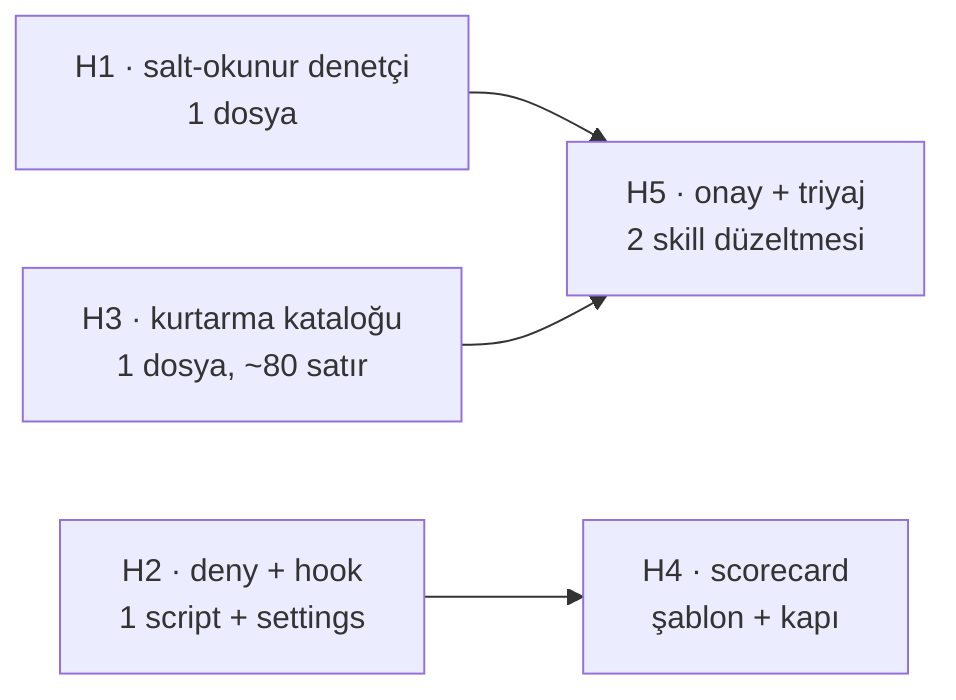

# ANEW ile Tracon — Agent Geliştirme Sistemi Karşılaştırması

> **Konu:** `~/Desktop/ai-native-engineering-workspace` (ANEW) sisteminin incelenmesi;
> Tracon'un mevcut agent sistemiyle farkları; entegrasyon kazanç ve kayıpları;
> hibrit öneri.
> **Tarih:** 2026-09-13 · **Tür:** keşif turu — süreç ekseni
> **Önceki süreç turu:** [`2026-09-04-surec-denetimi.md`](2026-09-04-surec-denetimi.md)
> **Kaynak:** ANEW reposunun tamamı (39 dosya, 1711 satır) okundu; Tracon tarafı
> `.agents/`, `.claude/`, `scripts/kapi.py`, `scripts/dokuman-bakim.py` ve
> `docs/` ağacı ölçüldü.

---

## 0. Bu Rapor Nasıl Okunmalı

Bu bir faz planı değildir. Bir **karar dokümanıdır** ve üç çıktı verir:

| Bölüm | Ne verir |
|---|---|
| 5–7 | Fark envanteri — iki yönlü, kanıtla |
| 8 | Tam entegrasyon yargısı |
| 9–11 | Hibrit plan — alınacaklar, reddedilenler, sıra |

Acele ediyorsan: **1. bölüm** ve **9. bölüm** yeterlidir.

---

## 1. Yönetici Özeti

**Tam entegrasyon önerilmiyor.** ANEW bir *şablondur*, çalışan bir sistem
değildir. Kendi `AGENTS.md` dosyası bunu yazar:

> `STATUS: NOT CONFIGURED. This workspace has not been adapted to a project yet.`

Tracon ise 167 faz koşmuş, 661 karar biriktirmiş, 1597 manuel kabul case'i
taşıyan bir sistemdir. ANEW'in omurgası Tracon'un omurgasıyla **aynı şeyi
söyler**, ama her halkada daha az ayrıntı taşır. Taşınmak bir yükseltme değil,
bir kayıp olur (7. bölüm).

**Hibrit öneriliyor.** ANEW beş mekanizma taşır; beşi de Tracon'da ya yoktur ya
yalnız yazıyla korunur (9. bölüm).

**Raporun ana bulgusu bir asimetridir.** ANEW bir agent'ın davranışını üç
mekanik kanalın şekillendirdiğini söyler: otomatik yüklenen bağlam · ucuz
doğrulama komutu · **bypass edilemeyen kural**. Tracon ilk ikisinde ANEW'den
güçlüdür. Üçüncüsünde neredeyse boştur:

| Kanal | Tracon'un durumu | Kanıt |
|---|---|---|
| Otomatik bağlam | Güçlü — ölçülü bütçe | Açılış 16414 B (~6839 token), 13 doküman kapısı |
| Ucuz doğrulama | Güçlü — altı modlu tek kaynak | `kapi.py {tarama,ic-dongu,kapanis,performans,test,yayin}`, iki işletim sisteminde CI |
| **Bypass edilemeyen kural** | **Zayıf** | `.claude/settings.json` yalnız `allow` taşır; `deny` yok, `hook` yok, salt-okunur agent tanımı yok |

Tracon'un agent kuralları neredeyse tamamen yazıdır. Yazı, agent'ın onu
okumasına ve hatırlamasına bağlıdır. ANEW'in tek cümlelik özeti burada
Tracon'a doğrudan söylenmiş olur: *prose is advice, tooling is law.*

---

## 2. Kanıt Tabanı

Ölçümler bu raporu yazarken alındı. Tarih: 2026-09-13.

### ANEW

```bash
find . -path ./.git -prune -o -type f -print | wc -l     # 39 dosya
wc -l $(find . -name "*.md" -o -name "check" -o -name "doctor")   # 1711 satır
```

| Kalem | Sayı |
|---|---|
| Workflow | 5 (`bootstrap`, `feature-development`, `bug-fix`, `refactor`, `incident`) |
| Prompt | 9 ana + 12 kurtarma rampası |
| Rol kartı | 4 (analyst · developer · reviewer · qa) |
| Script | 3 (`init`, `check` 38 satır, `doctor` 81 satır) |
| Zorlama yapıtı | 1 `PreToolUse` hook · 5 `deny` kuralı · 1 salt-okunur subagent |
| Toplam ağırlık | 1711 satır |

### Tracon

```bash
python3 scripts/dokuman-bakim.py --denetle
ls docs/arsiv/fazlar/*.md | wc -l        # 167
find docs -name "*.md" | wc -l           # 351
```

| Kalem | Sayı |
|---|---|
| Skill | 11 (`.agents/skills/`) + 2 ortak sözleşme (`.agents/ortak/`) |
| Faz | 167 |
| Karar | 661 (`KARARLAR.md` §2) |
| Alan hafızası dosyası | 46 (`docs/hafiza/`) |
| Manuel kabul case'i | 1597 (39 alan dosyası) |
| Doküman kapısı | 13 (`dokuman-bakim.py --denetle`) |
| Kapı modu | 6 (`kapi.py`) |
| Açılış bağlamı | 16414 B (~6839 token) |
| Zorlama yapıtı | **0** |

---

## 3. İki Sistem — Mekanik Özet

### 3.1 ANEW

Teknoloji bağımsız bir başlangıç ortamıdır. Boş bir repoya veya mevcut bir
projeye kurulur. Bir `bootstrap` mülakatı `docs/` şablonlarını doldurur ve
`scripts/check.conf` yazar.

Çalışma birimi bir **spec**'tir: `specs/active/NNNN-<ad>.md`. Her spec bir plana,
her plan bir insan onayına, her build bağımsız bir review'a bağlanır.

```
INTENT → CLARIFY → SPEC → PLAN → [İNSAN ONAYI] → BUILD
       → BAĞIMSIZ REVIEW → [İNSAN TRİYAJI] → VERIFY → SHIP
```

İki mod vardır. `lite` solo geliştirici içindir; `strict` ekip ve kritik sistem
içindir. Mod `AGENTS.md` içinde tek satırdır ve her workflow onu okur.

### 3.2 Tracon

Tek bakımcılı, olgun bir NuGet paket ailesidir. Çalışma birimi bir **fazdır**:
`docs/NN-*.md`. Faz bir aday yetenekten (`F-NN`) doğar, bir plan dokümanına
dönüşür, ayrı bir oturumda uygulanır, bağımsız denetimden geçer ve kapanışta
damıtılarak arşivlenir.

```
aday (F-NN) → faz-planlama → docs/NN-*.md → faz-baslangic
            → faz-uygulama → faz-denetim → faz-tamamlama → arşiv + damıtma
```

### 3.3 Yan yana

```mermaid
flowchart TB
    accTitle: ANEW ve Tracon donguleri yan yana
    accDescr: Solda ANEW dongusu spec ile baslar ve ship ile biter, iki insan kapisi tasir. Sagda Tracon dongusu aday ile baslar ve arsivleme ile biter, insan kapisi yerine olculen kapilar tasir.
    subgraph ANEW
        A1["spec<br/>specs/active"] --> A2["plan"] --> A3{"İNSAN<br/>onayı"}
        A3 --> A4["build"] --> A5["bağımsız review<br/>salt-okunur subagent"]
        A5 --> A6{"İNSAN<br/>triyajı"} --> A7["verify<br/>kriter↔kanıt"] --> A8["ship<br/>specs/done + scorecard"]
    end
    subgraph Tracon
        T1["aday F-NN"] --> T2["faz planı<br/>docs/NN-*.md"] --> T3["uygulama"]
        T3 --> T4["faz-denetim<br/>taze bağlam"] --> T5["dört kapı<br/>kapi.py kapanis"]
        T5 --> T6["doküman senkronu<br/>site · hafıza · KARARLAR"] --> T7["damıt + arşivle"]
    end
```



Fark tek bakışta görünür. ANEW döngüsünde **iki insan kapısı** vardır ve
döngü teslimde biter. Tracon döngüsünde insan kapısı yerine **ölçülen kapılar**
vardır ve döngü sonraki oturuma devir teslimle biter.

---

## 4. Omurga: Aynı Sonuca Varan İki Yol

İki sistem birbirinden bağımsız geliştirildi ve aynı beş kurala vardı. Bu
yakınsama, o kuralların taşıyıcı olduğunun kanıtıdır.

| İlke | ANEW'de | Tracon'da |
|---|---|---|
| Üreten kendini denetleyemez | `docs/roles/README.md` — *role = session*; salt-okunur `reviewer` subagent | `faz-denetim` — taze bağlamlı ayrı agent, "aynı oturumda denetçi gibi düşün" yasak |
| İddia değil kanıt | "Done" = `scripts/check` yeşil + kriter↔kanıt tablosu | DoD satırı ölçülebilir olmalı; "çalışıyor" kabul edilmez, gerçek çıktı yazılır |
| Bağlam sohbette değil dosyada | `AGENTS.md` signpost + `docs/` + spec | `AGENTS.md` + `MEMORY.md` + faz dokümanı + `docs/hafiza/` |
| Test zayıflatılmaz | Invariant kural 5 + R-02/R-03 | `faz-uygulama` "Yazılmayacaklar" + `kusur-giderme` Adım 4 |
| Öneri kuralı | Her soru kendi önerisiyle gelir; insan karar verir | `AGENTS.md` "Her belirsizliği sor"; `faz-planlama` Adım 3 |

**Sonuç:** Tracon'un omurgası eksik değildir. Fark omurgada değil, **zorlama
mekanizmasında** ve **bazı yaşam döngüsü halkalarındadır**.

---

## 5. ANEW'in Kendi Merceği: Üç Mekanik Kanal

ANEW'in `README.md` dosyası bir agent'ın davranışını yalnız üç şeyin
şekillendirdiğini söyler. Tracon'u bu mercekle ölçmek raporun en keskin
bölümüdür.

### Kanal 1 — Otomatik yüklenen bağlam

**Tracon güçlüdür ve ANEW'den ileridedir.**

ANEW kuralı basittir: `AGENTS.md` ≤ 40 satır kalır ve yalnız işaret eder.
`doctor` 60 satırı aşınca uyarır.

Tracon'un `AGENTS.md` dosyası 226 satır, 11189 bayttır. ANEW kuralına göre bu
bir ihlaldir. Ölçüm başka bir şey söylüyor:

```
AGENTS.md    11189 B / 12000 B bütçe   (~4662 token)   DAR (%7 boş)
MEMORY.md     5225 B /  8000 B bütçe   (~2177 token)   ok (%35 boş)
Başlangıç bağlamı: 16414 B (~6839 token)
```

Tracon'un çözümü satır saymak değil, **bütçelemektir**. Bütçe ölçülür,
denetlenir ve aşılınca içerik silinmez — taşınır. ANEW'in "≤ 40 satır" kuralı
aynı amacın kaba bir yaklaşımıdır: ölçmeden sınır koyar.

> **Yargı:** Bu kanalda alınacak bir şey yok. ANEW kuralı Tracon'a uygulanırsa
> bir gerileme olur.

### Kanal 2 — Koşabildiği doğrulama

**Tracon güçlüdür ve ANEW'den ileridedir.**

ANEW'in `scripts/check` dosyası 38 satırdır. `check.conf` içindeki adımları
sırayla koşar ve ilk kırmızıda durur. Tek sözleşme, tek komut — doğru fikir.

Tracon aynı fikri altı moda ayırmıştır:

| Mod | Ne yapar |
|---|---|
| `tarama` | sync kopyası · `secret` · migration bütünlüğü · bayat referans (3,1 sn) |
| `ic-dongu` | build + **etkilenen** test projeleri |
| `kapanis` | tamamı, ucuzdan pahalıya, tek özet |
| `performans` | tahsis kapısı — üç sıcak yol |
| `test` | MTP filtresiyle tek test alt kümesi |
| `yayin` | yayın provası — paketlenmiş tüketiciye karşı |

`kapi.py` ayrıca koştuğu her komutu ekrana basar ve süreleri
`artifacts/kapi-olcum.jsonl` dosyasına yazar. ANEW'de ölçüm yoktur.

> **Yargı:** Bu kanalda da alınacak bir şey yok.

### Kanal 3 — Bypass edilemeyen kural

**Tracon zayıftır. ANEW burada net biçimde ilerididir.**

Kanıt:

```bash
$ cat .claude/settings.json | python3 -c "import json,sys; print(list(json.load(sys.stdin)['permissions']))"
['allow']                      # deny yok

$ grep -rn "hooks" .claude/*.json
                               # çıktı yok

$ ls .claude/
settings.json  settings.local.json  skills -> ../.agents/skills  worktrees
                               # agents/ dizini yok
```

ANEW'de aynı yerde üç yapıt vardır:

1. **Salt-okunur reviewer subagent.** `tools: Read, Grep, Glob, Bash` — yazma
   aracı verilmemiştir. "Üreten kendini denetlemez" kuralı **kırılamaz** hâle
   gelmiştir.
2. **`deny` listesi.** `git push --force`, `git reset --hard`, `git rebase`,
   `rm -rf` araç seviyesinde reddedilir.
3. **`PreToolUse` hook.** `specs/done/` altındaki dosyalara yazma **fiziksel
   olarak** engellenir; hook `exit 2` döner ve gerekçeyi yazar.

Tracon'da `faz-denetim` denetçiyi şöyle çağırır:

> Çağrı biçimi (Claude Code'da `Agent` aracı, **`general-purpose`** tipi)
> … Kod YAZMA.

`general-purpose` agent tipinin araç kümesi `*`'dır. Yani denetçinin yazma
yetkisi **vardır**; onu tutan tek şey prompt'taki bir cümledir. Tracon'un kendi
`faz-denetim` dosyası bağımsızlığın neden pahalı olduğunu dört vakayla
belgeliyor (Faz 20 · 48 · 57 ve K-166/K-167 dizisi). O kadar bedel ödenmiş bir
kural, tek bir cümleye bağlı duruyor.

> **Yargı:** Hibrit önerinin ağırlık merkezi buradadır (H1, H2).

---

## 6. Fark Envanteri — ANEW'de Var, Tracon'da Yok

Her kalem üç yargıdan birini alır: **AL** · **KISMEN** · **RED**.

### A1 — Mekanik salt-okunur denetçi · **AL**

ANEW: `.claude/agents/reviewer.md`, `tools: Read, Grep, Glob, Bash`.

Tracon: tanım yok; `general-purpose` (`Tools: *`) kullanılıyor.

Maliyet: bir dosya. Kazanç: 167 fazda ödenmiş bir dersin kırılamaz hâle
gelmesi.

### A2 — Zorlama katmanı: `deny` + `PreToolUse` hook · **AL**

ANEW `specs/done/` dosyalarını hook ile korur. Tracon'un eşdeğer değişmez
yüzeyi daha büyüktür ve **hiç korunmuyor**:

| Yüzey | Kural nerede yazılı | Bugünkü koruma |
|---|---|---|
| `docs/YOL-HARITASI.md` | K-413 — üretilir, elle yazılmaz | Yalnız yazı + kapanışta "üretilen dosya tazeliği" kapısı |
| `docs/KARARLAR-INDEKS.md` | üretilir | Aynı |
| `docs/arsiv/KARARLAR-INDEKS-ARSIV.md` · `-REDDEDILEN.md` | üretilir | Aynı |
| `docs/arsiv/fazlar/*.md` | damıtılmış kayıt — tarihî | **Hiçbiri** |

Mevcut kapı ihlali **kapanışta** yakalar. Hook **yazma anında** engeller. İkisi
arasındaki fark bir fazlık yeniden çalışmadır.

`deny` listesi ayrı bir kazançtır. `AGENTS.md` ana dalda çalışmayı serbest
bırakır (bilinçli karar); bu, `git reset --hard` ve `git push --force` maliyetini
**yükseltir**, düşürmez.

### A3 — Adlandırılmış kurtarma rampaları (R-01…R-12) · **AL**

ANEW'in en özgün yapıtı budur. On iki durum, her biri tek dosya, her biri kendi
koruma kuralıyla. Agent durumu tanır, kodu söyler, insan onaylar, rampa koşar.

Tracon'un durumu karışık: malzemenin çoğu var ama **dağınık** ve **adsız**.

| Rampa | ANEW | Tracon'daki karşılığı | Durum |
|---|---|---|---|
| R-01 derleme/çalışma hatası | var | `kusur-giderme` Adım 1–4 | Kısmen |
| R-02 kırmızı test | var | `kusur-giderme` Adım 2 (kusur mu kırılgan mı) | Kısmen |
| R-03 kırılgan test | var | `kusur-giderme` Adım 2 + bilinen kaynaklar | Kısmen |
| R-04 düzeltme regresyon üretti | var | `kusur-giderme` Adım 7 | Zayıf |
| R-05 "araştırılacak" bulgu | var | — | **Yok** |
| R-06 düzeltme turu limiti | var | — | **Yok** |
| R-07 plan sapması | var | `faz-uygulama` Adım 1 (yapısal iddia) | Kısmen |
| R-08 faz ortasında kapsam değişti | var | — | **Yok** |
| R-09 bağlam sisi / devir | var | `faz-tamamlama` Adım 6 (yalnız faz sonu) | **Faz içi yok** |
| R-10 belirsizlik / doküman-kod çelişkisi | var | `AGENTS.md` "Her belirsizliği sor" | Kısmen |
| R-11 güvenli geri alma | var | — | **Yok** |
| R-12 performans hedefi kaçtı | var | `kapi.py performans` (kapı var, protokol yok) | Kısmen |

Beş rampa hiç yok. Dördü faz içinde en pahalı anlara denk geliyor: bağlam
şiştiğinde (R-09), aynı hataya üçüncü kez dönüldüğünde (R-06), kapsam
kaydığında (R-08), geri alınması gerektiğinde (R-11).

### A4 — Süreç scorecard'ı · **AL**

ANEW her spec'i beş sayıyla kapatır:

| Metrik | Değer |
|---|---|
| Spec revizyonu | |
| Düzeltme turu | |
| Review bulgusu: gerçek / gürültü | |
| Üretilen regresyon | |
| Üretime kaçan kusur | |

Tracon 167 faz koştu ve bu sayıların **hiçbirini** tutmuyor. Faz dokümanları
anlatı taşıyor ("denetim bulguları: 2 🔴 düzeltildi"), toplanabilir sayı
taşımıyor. Sonuç: "süreç iyileşiyor mu?" sorusu bugün **cevaplanamaz**.

Tracon zaten ölçüm kültürüne sahiptir (`kapi-olcum.jsonl`, bütçe denetimi,
projeksiyon). Eksik olan tek şey **sürecin kendisinin** ölçülmesi.

### A5 — İnsan onayı kayıtlı bir yapıt olarak · **KISMEN**

ANEW plan şablonunda bir satır vardır:

> `Approved by / on: <insan adı + tarih — bu satırı taşımayan plan onaylı değildir>`

Tracon'un faz plan şablonunda onay alanı yoktur. `faz-planlama` Adım 3 bloklayan
soruları sordurur, ama **cevabın alındığı** bir iz kalmaz. Tek bakımcılı bir
repoda bu ANEW'deki kadar kritik değildir; yine de ucuzdur ve denetlenebilir.

### A6 — Bulgu triyajı insana ait · **KISMEN**

ANEW'de review bulgusunu **insan** üçe ayırır: gerçek · gürültü · araştırılacak.
"Araştırılacak" olan düzeltilmez; önce QA minimal repro üretir (R-05).

Tracon'da `faz-denetim` Adım 5 bulguyu **uygulayan oturuma** verir: düzeltir,
gerekçeler veya devreder. Yani denetçi bağımsızdır ama **triyaj bağımsız
değildir**. Kendi kodunu savunmaya eğilimli oturum, bulgunun geçerli olup
olmadığına kendi karar verir.

Bu, `faz-denetim`'in kapatmak için var olduğu kör noktanın bir adım geriden
tekrarıdır.

### A7 — Dört rol kartı (analyst · developer · reviewer · qa) · **RED**

Tracon rol ayrımını yalnız bir yerde yapar: denetçi. Bu yeterlidir. Dört rolün
ayrı oturumlara bölünmesi tek bakımcılı bir repoda oturum başına maliyeti
dörde katlar ve karşılığında yalnız bir ayrımı (üreten ≠ denetleyen) korur —
o da zaten korunuyor.

**İstisna:** QA rolünün tek bir işlevi alınmaya değer — **kriter ↔ kanıt
tablosu**. Tracon'da DoD tablosu bu işi yapıyor ama "bu test gerçekten
düşer miydi?" sorusu sorulmuyor. Bu soru `faz-denetim` 3.2'ye (test tiyatrosu)
bir satır olarak eklenebilir.

### A8 — `lite` / `strict` modu · **RED**

Tracon tek bakımcılıdır ve tek modda çalışır. İki mod eklemek her skill'e bir
dallanma sokar ve karşılığında hiçbir şey vermez.

### A9 — Adapter katmanı · **RED**

ANEW `adapters/` altında Claude Code, Copilot, Cursor ve generic wiring tutar.
Tracon aynı sorunu daha ucuz çözmüş: `.agents/` tek kaynaktır, `.claude/skills`
ona bir symlink'tir ve `.agents/skills/README.md` taşınabilirliği açıkça yazar.

Copilot veya Cursor fiilen kullanılmadıkça adapter dizini spekülatif bir
yapıdır.

### A10 — `bootstrap` workflow · **RED**

167 faz koşmuş bir repoda anlamsızdır.

### A11 — `scripts/doctor` · **RED**

Tracon'un `dokuman-bakim.py --denetle` komutu aynı işi 13 kapıyla yapıyor.

### A12 — `specs/` dizini ve iş dili spec'i · **RED — gerekçe 8. bölümde**

---

## 7. Fark Envanteri — Tracon'da Var, ANEW'de Yok

Bu bölüm "ANEW'e geçmek" senaryosunun bedelini gösterir. On iki kalemin hiçbiri
ANEW'de yoktur.

| # | Mekanizma | Neden taşıyıcı |
|---|---|---|
| B1 | **Doküman bütçe ekonomisi** | Ölçülü: açılış 6839 token. Bütçe aşılınca içerik silinmez, taşınır. ANEW'de "≤40 satır" var, ölçüm yok |
| B2 | **Alan hafızası** (`docs/hafiza/`, 46 dosya + indeks) | Tuzak alan dosyasında yaşar, sıcak yolda değil. ANEW'de eşdeğeri yok |
| B3 | **Karar defteri** — 661 karar, yeniden açılma koşulu, **reddedilenler indeksi** | ANEW'de ADR var ama "reddedilmiş işi yeniden önerme" kontrol listesi yok |
| B4 | **SINIF TARAMASI** (`kusur-giderme` Adım 5) | Tek vakayı değil sınıfı kapatır. Ölçülen tekrar: `AsyncLocal` 4 kez, sync kopyası 5 kez, locator 3 kez. ANEW tek vakayı düzeltir |
| B5 | **Test seviyesi sözleşmesi** (`.agents/ortak/test-seviyeleri.md`) | "Sınır geçen davranış birim testiyle kanıtlanamaz". ANEW yalnız "tests assert behavior" der |
| B6 | **Altı modlu kapı koşucusu** | ANEW'in `check`'i tek moddur; `ic-dongu`, `performans`, `yayin` karşılığı yoktur |
| B7 | **Damıtma + arşivleme** (`faz-damit`, `faz-arsivle`) | Plan düşer, kalıcı bilgi kalır, tam metin `git show` ile çözülür ve çözülebilirliği her denetimde kanıtlanır. ANEW `specs/done/` altında **tam metni** biriktirir |
| B8 | **Tüketici yüzeyi senkronu** | Site · XML `<example>` · paket README · `capabilities.md` · yerel referans. ANEW'de kullanıcıya dönük yüzey kavramı yok |
| B9 | **Yayın danışmanı** (`nuget-danismani`) | Zincirin üstünde durur, tek fazı değil ürünü yargılar. ANEW'de karşılığı yok |
| B10 | **Manuel kabul seti** — 1597 case, sayım kapısı | ANEW'de manuel kabul kavramı yok |
| B11 | **`maf-api-kesfi`** — reflection ile imza doğrulama | Dokümanı eksik bir bağımlılığa karşı ölçülmüş bir çözüm |
| B12 | **Üretilen dosya disiplini** (K-413) | Durum tek yerde yaşar. ANEW'de her şey elle yazılır |

**Özet:** ANEW'e taşınmak, 167 fazda ödenmiş on iki mekanizmayı bırakmak
demektir. Bu bir yükseltme değildir.

---

## 8. Tam Entegrasyon Senaryosu — Yargı

Senaryo: ANEW'in `specs/`, `workflows/`, `prompts/`, `docs/roles/`,
`scripts/check` yapısı Tracon'a kurulur ve faz sistemi ona uyarlanır.

| Kazanç | Kayıp |
|---|---|
| Zorlama katmanı (hook, deny, salt-okunur agent) | B1–B12'nin tamamı |
| Kurtarma rampası kataloğu | Faz yaşam döngüsü (damıtma, arşivleme, devir notu) |
| Scorecard | Doküman bütçesi ve 13 kapı |
| İnsan onay ve triyaj kapıları | `kapi.py`'nin beş modu |

**Kazançların hiçbiri ANEW'in yapısını gerektirmiyor.** Üçü de (hook, rampa,
scorecard) Tracon'un mevcut yapısına **eklenebilir**. Kayıpların hiçbiri geri
alınamaz.

### İki kaynak problemi

Daha derin bir sorun var. ANEW'in `specs/active/NNNN-*.md` dosyası ile Tracon'un
`docs/NN-*.md` dosyası **aynı işi yapar**: niyet, kabul ölçütü, bitiş tanımı.
İkisini birden tutmak Tracon'un kendi kuralını ihlal eder:

> `AGENTS.md`: "Bu listeyi başka dosyada tekrarlama — iki yerde tutmak kayma üretir."

Tracon'un faz dokümanı ANEW spec'inden **daha fazlasını** taşır: hata modu
tablosu, test seviyesi seçimi, public API taslağı, migration kararı, bundle
payı, tüketici yüzeyi satırı, manuel case taslağı. ANEW spec'i "Requirements'ta
teknik çözüm olmasın" der — bir NuGet kütüphanesinde public API **davranışın
kendisidir**, bu ayrım burada anlamını kaybeder.

### `AGENTS.md` ≤ 40 satır kuralı

Uygulanırsa Tracon'un `AGENTS.md` dosyası 226 satırdan 40 satıra inmelidir.
Kalan 186 satır nereye gider? Zaten işaret ettiği yerlere — ama o zaman her
oturum açılışta **daha fazla** dosya açar. Bugünkü 6839 token'lık açılış
büyür.

Tracon aynı amaca ölçerek varıyor: 11189 B / 12000 B bütçe, %7 boş, denetimde
`DAR` uyarısı veriyor. Kural zaten işliyor; yalnız birimi satır değil bayt.

> **Karar: tam entegrasyon reddedilir.** Gerekçe tek cümleyle: ANEW'in
> verebileceği her şey Tracon'a **eklenebilir**; Tracon'un kaybedeceği hiçbir
> şey ANEW'de **yoktur**.

---

## 9. Hibrit Öneri — Beş Kalem

Sıra, bağımlılığa ve kazanç/maliyet oranına göredir.

### H1 — Salt-okunur denetçi agent'ı

**Sorun.** `faz-denetim` bağımsızlığı prompt cümlesiyle korur. Denetçi
`general-purpose` tipidir ve yazma araçlarına sahiptir.

**Çözüm.** `.claude/agents/denetci.md` tanımlanır:

```markdown
---
name: denetci
description: Tracon faz denetçisi. Salt-okunur. .agents/skills/faz-denetim/SKILL.md uygular.
tools: Read, Grep, Glob, Bash
---
Sen Tracon'in faz denetçisisin. `.agents/skills/faz-denetim/SKILL.md` dosyasını
oku ve olduğu gibi uygula.

Sert kurallar:
- Hiçbir dosya oluşturma, değiştirme veya silme. Bash'i **yazmak için**
  kullanma: yönlendirme yok, `sed -i` yok, `git commit` yok, `git mv` yok.
- Bulgu `dosya:satır` kanıtı ve "nasıl kırılır" cümlesi taşır.
- "🔴 ve 🟡 yok" geçerli bir sonuçtur. Bulgu enflasyonu yapma.
```

`faz-denetim` Adım 1'deki çağrı biçimi `general-purpose` yerine `denetci`
tipini gösterecek şekilde güncellenir.

**Maliyet.** Bir dosya + bir satır düzeltme.
**Kalan risk.** `Bash` hâlâ yazabilir. Bu, araç kümesinin sınırıdır; yine de
`Edit`/`Write` olmaması engeli anlamlı biçimde yükseltir.

### H2 — Zorlama katmanı: `deny` + `PreToolUse` hook

**H2a — `deny` listesi.** `.claude/settings.json` içine:

```json
"deny": [
  "Bash(git push --force:*)",
  "Bash(git push -f:*)",
  "Bash(git reset --hard:*)",
  "Bash(rm -rf:*)"
]
```

`git rebase` **dışarıda bırakılır** — Tracon ana dalda çalışır ve `rebase`
meşru bir araçtır. ANEW listesi ekip varsayımıyla yazılmıştır; körlemesine
kopyalanmaz.

**H2b — Üretilen dosya ve damıtılmış kayıt koruması.** Hook, `Edit`/`Write`
hedefini kontrol eder ve şunları reddeder:

| Yol | Gerekçe |
|---|---|
| `docs/YOL-HARITASI.md` | üretilir (K-413) |
| `docs/KARARLAR-INDEKS.md` | üretilir |
| `docs/arsiv/KARARLAR-INDEKS-*.md` | üretilir |
| `docs/arsiv/fazlar/*.md` | damıtılmış tarihî kayıt |

Hook çıktısı ne yapılacağını söyler — ANEW'in hook'u bunu iyi yapıyor:

> `Blocked: docs/YOL-HARITASI.md üretilir (K-413). Fazın kendi dokümanındaki`
> `> **Durum:** satırını düzelt, sonra: python3 scripts/dokuman-bakim.py`

**Maliyet.** Bir shell script (~15 satır) + settings girdisi.
**Kazanç.** Kapanışta yakalanan ihlal **yazma anında** engellenir.
**Dikkat.** `faz-arsivle` komutu `docs/arsiv/fazlar/` altına **yazar**. Hook
yalnız `Edit`/`Write` araçlarını yakalar, `Bash` üzerinden koşan `git mv`'yi
değil — bu ayrım korunmalıdır.

### H3 — Kurtarma rampası kataloğu

**Nereye.** `.agents/ortak/kurtarma.md` — `.agents/skills/` dışında, tek
kaynak. `kapilar.md` ve `test-seviyeleri.md` ile aynı desende.

**Ne içerir.** Mevcut malzeme adlandırılır ve **eksik beşi** yazılır:

| Kod | Durum | Kaynak |
|---|---|---|
| K-01…K-04, K-07, K-10, K-12 | Var, adsız | `kusur-giderme`, `faz-uygulama`, `AGENTS.md`, `kapi.py performans` — buraya **bağlanır**, kopyalanmaz |
| **K-05** | Araştırılacak bulgu → minimal repro | **Yeni** |
| **K-06** | Düzeltme turu limiti (3) → kod yazmayı durdur, kök sebebi plan mı kod mu diye sor | **Yeni** |
| **K-08** | Faz ortasında kapsam değişti → önce faz dokümanı, sonra delta plan | **Yeni** |
| **K-09** | Bağlam sisi → durum dosyası + devir, **faz içinde** | **Yeni** |
| **K-11** | Güvenli geri alma → `git revert`, migration risk raporu | **Yeni** |

**Neden değerli.** Bir rampanın asıl işi protokolü hatırlatmak değil, **doğaçlamayı
yasaklamaktır**. `kusur-giderme` bunu kusur için yapıyor; diğer altı durum için
bugün hiçbir şey yok.

**K-09 özellikle önemlidir.** Tracon fazları uzun sürer ve bağlam şişer.
`faz-tamamlama` Adım 6 devir teslimi **yalnız faz sonunda** yapar. Faz ortasında
bağlam bittiğinde protokol yoktur.

**Maliyet.** Bir dosya, ~80 satır. Bütçe: `.agents/` denetim dışıdır.

### H4 — Faz scorecard'ı

**Nereye.** `faz-plani-sablonu.md` içine, kapanışta doldurulan bölüme:

```markdown
## Süreç Ölçümü

> Kapanışta doldurulur. Sayılar toplanabilir olmalıdır; anlatı değil.

| Metrik | Değer |
|---|---|
| Plandan sapma sayısı | |
| Denetim bulgusu: 🔴 / 🟡 / 🟢 | |
| Bulgu sonucu: düzeltildi / gerekçelendi / devredildi | |
| Kapı kırmızı dönüş sayısı | |
| Fazın ürettiği regresyon | |
| Faz kapandıktan sonra bulunan kusur | |
```

Son satır **sonradan** doldurulur: bir kusur `kusur-giderme` ile kapatıldığında
hangi fazdan geldiği biliniyorsa o fazın scorecard'ına bir çentik atılır.
"Hangi faz tipi kusur üretiyor?" sorusu ancak böyle cevaplanır.

**Kapı.** `dokuman-bakim.py --denetle` içine bir denetim: `✅ Tamamlandı`
durumundaki bir faz dokümanı boş scorecard taşıyorsa kırmızı. Damıtma bu bölümü
**korur** (kalıcı bilgidir).

**Maliyet.** Şablon + skill satırı + bir denetim fonksiyonu.

### H5 — Onay satırı ve bulgu triyajı

**H5a — Onay satırı.** Faz plan şablonunun başlığına:

```
> **Plan onayı:** <ad>, <YYYY-AA-GG> · <yoksa "onaylanmadı — uygulama başlamaz">
```

**H5b — Triyaj.** `faz-denetim` Adım 5 değişir. Bugün bulguyu uygulayan oturum
sınıflandırıyor. Önerilen: **denetçi seviye önerir, kullanıcı triyaj yapar.**

Üç sonuç ANEW'inkiyle aynı olmalı:

| Sonuç | Ne olur |
|---|---|
| **gerçek** | Düzeltilir + düzeltmeyi kanıtlayan test |
| **gürültü** | Reddedilir — **gerekçesi yazılır**. Gerekçesiz ret aynı bulgunun geri gelmesidir |
| **araştırılacak** | Düzeltme yok. Önce minimal repro (K-05). Repro varsa gerçektir; yoksa gerekçeli kapanış |

"Araştırılacak" kanalı Tracon'da hiç yok ve doğrudan `kusur-giderme` Adım 1–3
ile eşleşiyor — protokol zaten yazılı, yalnız tetikleyicisi eksik.

**Maliyet.** İki skill'de birer bölüm düzeltmesi.

---

## 10. Reddedilenler ve Gerekçeleri

| Kalem | Gerekçe |
|---|---|
| `specs/` dizini ve iş dili spec'i | Faz dokümanıyla aynı iş. İki kaynak kayma üretir (8. bölüm) |
| `lite` / `strict` modu | Tek bakımcı, tek mod. Her skill'e dallanma sokar |
| Dört rol kartı ayrı oturumlarda | Tek ayrım (üreten ≠ denetleyen) zaten korunuyor. Kalan üçü oturum maliyeti |
| `adapters/` katmanı | `.agents/` + symlink aynı işi yapıyor. Copilot/Cursor fiilen kullanılmıyor |
| `scripts/check` | `kapi.py` altı modda üstünü kapsıyor |
| `scripts/doctor` | `dokuman-bakim.py --denetle` 13 kapıyla üstünü kapsıyor |
| `bootstrap` workflow | 167 faz sonrası anlamsız |
| `AGENTS.md` ≤ 40 satır | Bütçe ölçümü daha iyi bir araç. Uygulanırsa açılış maliyeti **artar** |
| PR şablonu / CI `check.yml` | Tracon CI'ı iki işletim sisteminde, altı işle daha geniş |

---

## 11. Uygulama Sırası



| Sıra | Kalem | Bağımlılık | Etki |
|---|---|---|---|
| 1 | H1 | Yok | Bağımsızlık yazıdan araca geçer |
| 2 | H2 | Yok | Üretilen dosya ve tarihî kayıt korunur |
| 3 | H3 | Yok | Altı durumda doğaçlama yasaklanır |
| 4 | H4 | Yok | Süreç ilk kez ölçülebilir olur |
| 5 | H5 | H3 (K-05) | Triyaj kör noktası kapanır |

H1 ve H2 tek bir turda yapılabilir; ikisi de dosya eklemesidir ve mevcut hiçbir
protokolü değiştirmez. H3–H5 bir faz olarak planlanmaya değer.

**Aday kaydı önerisi:** H1 + H2 bir `F-NN` kalemi ("agent zorlama katmanı"),
H3 + H4 + H5 ikinci bir `F-NN` kalemi ("süreç ölçümü ve kurtarma kataloğu").
İkisi de kod değil **geliştirme aparatı** işidir; `docs/ADAYLAR.md` kaydı
kullanıcı kararına bağlıdır.

---

## 12. İşe Yarayıp Yaramadığı Nasıl Ölçülür

Hibrit önerinin kendisi ölçülebilir olmalıdır. Üç ölçüt:

1. **H1/H2:** Denetçi bir dosyaya yazmayı denedi mi? Hook kaç kez tetiklendi?
   Sıfır tetiklenme iki şey olabilir — ya kural zaten tutuyordu ya da kapsam
   yanlış. Üç faz sonra bakılır.
2. **H3:** Kaç kez bir rampa **kodla** çağrıldı? Rampa çağrılmadan geçen bir
   kriz, kataloğun görünmez olduğunu söyler.
3. **H4:** Üç fazlık scorecard toplandıktan sonra ilk soru şudur: **plandan
   sapma sayısı ile denetim 🔴 sayısı korele mi?** Eğer öyleyse `faz-planlama`
   Adım 1 (kanıt doğrulama) yeterince sıkı değildir ve bu ölçülebilir bir
   iyileştirme kalemidir.

Bugün bu üç sorunun hiçbiri cevaplanamıyor.

---

## 13. Açık Sorular — Kullanıcı Kararı Gerekir

| # | Soru | Seçenekler | Öneri |
|---|---|---|---|
| 1 | H1–H5 birer `F-NN` adayına mı dönüşsün, yoksa faz dışı doğrudan mı uygulansın? | A: `ADAYLAR.md`'ye iki kalem · B: doğrudan uygula | **A** — H3–H5 protokol değiştirir; `faz-denetim` kendi kuralına göre plan ister |
| 2 | `deny` listesine `git rebase` girsin mi? | A: girmesin (ana dalda meşru) · B: girsin | **A** — ANEW listesi ekip varsayımıyla yazılmış |
| 3 | Triyaj (H5b) her fazda mı, yalnız 🔴 bulgularda mı? | A: yalnız 🔴 · B: 🔴 ve 🟡 | **A** — 🟡 için gerekçe yazma zaten var; her bulguya insan kapısı fazı yavaşlatır |
| 4 | Scorecard'ın "faz sonrası kusur" satırı geriye dönük doldurulsun mu? | A: yalnız bundan sonrası · B: `KARARLAR.md`'den geriye dönük türet | **A** — geriye dönük türetme ölçüm değil tahmin üretir |

---

## 14. Karar Bloğu (2026-09-13, rapor yazıldıktan sonra)

> **Bu bölüm rapordan sonra eklendi.** Üstteki metin **değiştirilmedi** — keşif
> kaydı olduğu gibi durur. Aşağıdaki üç satır, planlama sırasında yapılan
> ölçümlerin raporun üç iddiasını **çürüttüğünü** kaydeder.

### Kullanıcı kararları

§13'ün dört sorusunun dördü de **A** ile cevaplandı. Beşinci karar sorulduğunda
alındı (aşağıdaki tabloda).

### Ölçümle çürütülen üç iddia

| Raporun dediği (§9) | Ölçüm (2026-09-13) | Sonuç |
|---|---|---|
| H2b bir `PreToolUse` hook ister | `permissions.deny` içindeki `Edit(path)` kuralı **Edit + Write + MultiEdit + NotebookEdit**'i ve tanınan Bash dosya komutlarını (`cat`, `sed`, `>` yönlendirmesi) zaten kapsıyor. `Write(path)` yazmak **zararlıdır**: kabul edilir, hiç danışılmaz, başlangıçta uyarı üretir | Üretilen dosya koruması için **hook gerekmez**; tek satırlık `deny` yeter. Hook yalnız denetçinin Bash yazmasını daraltmak için kalır |
| `deny` listesine `rm -rf` girsin | `docs/manuel-test/` içinde **8+** meşru kullanım (`rm -rf /tmp/ap-pack`); [`hafiza/yayin-ve-surumleme.md`](../hafiza/yayin-ve-surumleme.md)`:79,116` onu bir **kurtarma adımı** olarak belgeliyor. `deny` istisna taşıyamaz | **Kural konmadı** (kullanıcı kararı). Gerekçe `git rebase`'inkiyle aynı: bu repoda meşru ve belgelenmiş bir komut |
| İki aday (H1+H2 / H3+H4+H5) | `faz-planlama` Adım 0: *"Üç kalem bir faz değil, bir turdur"* ve *"Ortak yanı olmayan iki kalemi tek faza koymak DoD'yi bulanık yapar"*. H3 diğer ikisiyle **hiçbir dosya paylaşmıyor**; H4 ile H5 scorecard'ın 🔴 satırı üzerinden **doğrudan bağlı** | **Üç aday** (kullanıcı kararı) |

### İki mekanik kısıt — tasarımı belirlediler

Claude Code sözleşmesinden doğrulandı (`code.claude.com/docs/en/sub-agents`,
2026-09-13; kurulu sürüm `claude 2.1.269`):

- 🚨 **Alt agent `permissionMode`'u ana oturuma tabidir.** Ana oturum
  `acceptEdits`'teyse `plan` modu **sessizce yok sayılır**. Bağımsızlık moda
  dayandırılamaz; `tools` allowlist'ine ve alt agent'a özel bir Bash kapısına
  dayanır.
- 🚨 **Alt agent'lardan `AskUserQuestion` kaldırılır.** Denetçi kullanıcıya
  **soramaz** → triyaj mekanik olarak **ana oturuma** aittir. §9 H5b bunu
  varsaymıyordu; tasarım buna göre yazıldı.

Ayrıca: `.claude/agents` symlink desteği **belgelenmemiş**. `.claude/skills`
symlink'i bu repoda çalışıyor ama agent keşfi ayrı bir kod yoludur — symlink
kullanılmayacak, adaptör dosyası yazılacak.

### Çıktı

Üç aday [`ADAYLAR.md`](../ADAYLAR.md)'ye yazıldı:

| Aday | Kalem | Bağımlılık |
|---|---|---|
| **F-227** | Agent zorlama katmanı (H1 + H2) | Yok |
| **F-228** | Kurtarma rampası kataloğu (H3) | Yok · `KR-11` F-227'yi varsayar |
| **F-229** | Faz planı sözleşmesi: scorecard ve triyaj (H4 + H5) | **F-228** (`KR-05`) |

§11'in "iki aday" önerisi bu tabloyla **değiştirilmiştir**.

---

## Kapanış

ANEW'in Tracon'a öğretebileceği şey bir süreç değil, bir **cümledir**:

> *Prose is advice, tooling is law.*

Tracon'un süreci ANEW'inkinden olgundur ve her halkası ödenmiş bir bedelle
yazılmıştır. Ama o sürecin tamamı yazıdır ve yazı, agent'ın onu okumasına
bağlıdır. `faz-denetim` bağımsızlığın değerini dört vakayla kanıtlıyor ve o
bağımsızlığı tek bir prompt cümlesine emanet ediyor.

Hibrit önerinin ağırlık merkezi budur: **167 fazda öğrenilmiş kuralları yazıdan
araca taşımak.** Geri kalan üç kalem (rampa, scorecard, triyaj) o merkeze
eklenen ucuz kazançlardır.
