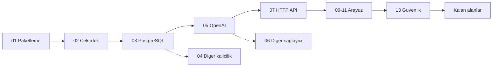

# AgentPrism — Manuel Kabul Testi İndeksi

> Yayın öncesi elle koşulan kabul testi setinin giriş noktası. Ortam kurulumu,
> ortak fixture verisi, reset yordamı, hata bildirim şablonu ve dosya durum
> tablosu buradadır.
>
> **Koşum protokolü bu dosyada değildir** —
> [`.agents/skills/manuel-test-kosumu/SKILL.md`](../../.agents/skills/manuel-test-kosumu/SKILL.md).
> Bu dosya turdan bağımsız **ortamı** tarif eder, koşumun kendisini değil.

---

## 1. Bu setin üç parçası

| Parça | Nerede | Ömrü |
|---|---|---|
| **Spec** — case metni (ön koşul, adımlar, beklenen sonuç) | `docs/manuel-test/<NN>-<ALAN>.md` | Kalıcı; turdan bağımsız |
| **Protokol** — nasıl koşulur, nasıl kapatılır | [`manuel-test-kosumu`](../../.agents/skills/manuel-test-kosumu/SKILL.md) skill'i | Kalıcı; her tur aynısını uygular |
| **Koşum kaydı** — `Gerçek sonuç` + `Durum` | [`kosumlar/<tarih>/`](kosumlar/) → kapanınca `docs/arsiv/` | Bir tura ait; donmuş (K-414) |

Üçü karışmaz. Spec dosyalarında `Durum:` satırı **yoktur**; ikinci bir tur
spec'in üzerine yazmaz, `kosumlar/` altında yeni bir tarih dizini açar.

> **Şeride özgü ortam kurulumu ve reset yordamı** skill'in
> [`resources/serit-kurulumu.md`](../../.agents/skills/manuel-test-kosumu/resources/serit-kurulumu.md)
> dosyasındadır. Bu dosyanın §2 bölümü tura bağımsız ön koşulları ve fixture
> verisini tarif eder; şerit yordamlarını tekrarlamaz.

---

## 2. Ortam kurulumu

Bu bölüm bir kez uygulanır. Her senaryo dosyası buraya referans verir.

### 2.1 Ön koşullar

| Gereksinim | Sürüm | Doğrulama |
|---|---|---|
| .NET SDK | 10.0.100+ | `dotnet --version` |
| Node.js | 20.19+ | `node --version` |
| Docker Desktop | Çalışır durumda, 8 GB | `docker info` |
| Python | 3.10+ · `pip install openai` | `python3 -c "import openai"` |
| Chrome | Güncel | — |

**Donanım notu:** Bu makine `arm64` (Apple Silicon). `mcr.microsoft.com/mssql/server`
imajının arm64 sürümü **yoktur**. Docker Desktop → Settings → General →
*Rosetta for x86/amd64 emulation* açık olmalıdır. Açılamazsa SQL Server izleği
`azure-sql-edge` ile koşulur ve bu sapma sonuç dosyasına yazılır.

### 2.2 Veritabanı container'ları

Entegrasyon testlerinin kullandığı **aynı** imajlar kullanılır; başka bir imaj
farklı davranış üretebilir.

```bash
# PostgreSQL — pgvector uzantisi ZORUNLU (RAG izlegi icin).
docker run -d --name ap-pg -p 55432:5432 \
  -e POSTGRES_PASSWORD=agentprism -e POSTGRES_DB=agentprism \
  pgvector/pgvector:pg18

# SQL Server — ~2 GB bellek ister.
docker run -d --name ap-mssql -p 51433:1433 \
  -e ACCEPT_EULA=Y -e MSSQL_SA_PASSWORD='AgentPrism!2026' \
  mcr.microsoft.com/mssql/server:2022-latest
```

SQLite dosya tabanlıdır, container istemez.

### 2.3 Yerel NuGet feed (İzlek A)

Temiz tüketici izleği, paketleri **nuget.org'dan değil** yerel dizinden alır.

```bash
cd /Users/farukatasoy/Desktop/projects/AgentPrism

MSBUILDDISABLENODEREUSE=1 dotnet pack AgentPrism.slnx -c Release

mkdir -p ~/agentprism-local-feed
find artifacts -name "*.nupkg" -exec cp {} ~/agentprism-local-feed/ \;

dotnet nuget add source ~/agentprism-local-feed -n agentprism-local
dotnet new install AgentPrism.Templates::*-* --add-source ~/agentprism-local-feed
```

> 🚨 `MSBUILDDISABLENODEREUSE=1` **atlanmaz.** Öksüz MSBuild düğümleri boruyu açık
> tutar ve komut dakikalarca asılı kalır (repo hafızasında ölçüldü: 8 dk+ → 18,5 sn).

Repo'nun `NuGet.config` dosyası `<clear />` içerir ve yalnız nuget.org tanımlar.
Yerel feed **repo dışında** oluşturulan tüketici projesinde kullanılır; repo'nun
`NuGet.config` dosyası değiştirilmez.

### 2.4 Secret'lar

Hiçbir değer dosyaya yazılmaz. Tümü `dotnet user-secrets` içinde yaşar.

```bash
cd samples/AgentPrism.Api

dotnet user-secrets set "AgentPrism:PostgreSql:ConnectionString" \
  "Host=localhost;Port=55432;Database=agentprism;Username=postgres;Password=agentprism"

dotnet user-secrets set "AgentPrism:Providers:OpenAI:ApiKey"    "<OPENAI_ANAHTARINIZ>"
dotnet user-secrets set "AgentPrism:Providers:Anthropic:ApiKey" "<ANTHROPIC_ANAHTARINIZ>"
dotnet user-secrets set "AgentPrism:Providers:Google:ApiKey"    "<GOOGLE_ANAHTARINIZ>"
dotnet user-secrets set "AgentPrism:Providers:OpenAICompatible:openrouter:ApiKey" "<OPENROUTER_ANAHTARINIZ>"
dotnet user-secrets set "AgentPrism:Voice:ApiKey"               "<ELEVENLABS_ANAHTARINIZ>"
dotnet user-secrets set "AgentPrism:Ui:AuthToken"               "manuel-test-token-2026"
```

Diğer kalıcılık sağlayıcıları **aynı anda verilmez** — biri denenirken diğerinin
kaydı silinir:

```bash
dotnet user-secrets remove "AgentPrism:PostgreSql:ConnectionString"
dotnet user-secrets set    "AgentPrism:Sqlite:ConnectionString"   "Data Source=agentprism-manuel.db"
dotnet user-secrets set    "AgentPrism:SqlServer:ConnectionString" \
  "Server=localhost,51433;Database=AgentPrism;User Id=sa;Password=AgentPrism!2026;TrustServerCertificate=true"
```

### 2.5 Uygulamayı çalıştırma

```bash
cd samples/AgentPrism.Api && dotnet run     # http://localhost:5080/agentprism
```

Yalnız arayüz üzerinde çalışırken Vite dev sunucusu:

```bash
cd src/AgentPrism.UI/frontend && npm run dev   # http://localhost:5173
```

---

## 3. Ortak fixture verisi

Senaryolar bu kümeden **kimlikle** çağırır; veriyi tekrar tanımlamaz.
Bir senaryonun kendi verisi gerekiyorsa case içinde tanımlanır ve buraya girmez.

### 3.1 Örnek uygulamada hazır gelen agent'lar (İzlek B)

| Ad | Görünen ad | Not |
|---|---|---|
| `support` | Destek Asistani | Sipariş tool'ları bağlı |
| `arastirmaci` | Arastirmaci | |
| `yonlendirici` | Yonlendirici | |
| `ozetleyici` | Ozetleyici | MCP ve A2A ile dışa açık |
| `cevirmen` | Cevirmen | |
| `openrouter-destek` | OpenRouter Destek | OpenRouter anahtarı ister |
| `claude-destek` · `claude-dusunen` | Claude | Anthropic anahtarı ister |
| `gemini-destek` · `gemini-kati-filtre` | Gemini | Google anahtarı ister |
| `azure-destek` | Azure Destek | ⏭ Azure kimliği yok |
| `sesli-asistan` | Sesli Asistani | ElevenLabs anahtarı ister |
| `bilgi-asistani` | Bilgi Asistani | `pgvector` + embedding ister |

### 3.2 Örnek uygulamada hazır gelen tool'lar

| Tool | İmza | Not |
|---|---|---|
| `get_order_status` | `orderId` | Sabit metin döndürür |
| `list_recent_orders` | `customerId` | `ORD-1001, ORD-1002` döndürür |
| `cancel_order` | `orderId` | **`RequiresApproval = true`** — onay kartı üretir |

### 3.3 Örnek uygulamada hazır gelen workflow'lar

| Ad | Not |
|---|---|
| `ozetle-ve-cevir` | Sıralı desen |
| `ozetle-ve-onayla` | Human-in-the-loop |

### 3.4 Manuel testin kendi verisi

| Kimlik | Değer |
|---|---|
| `FIX-TENANT-01` | `kiraci-alfa` |
| `FIX-TENANT-02` | `kiraci-beta` |
| `FIX-AGENT-01` | Ad `manuel-destek` · Talimat `Sen bir siparis destek asistanisin. Kisa yanit ver.` · Tool `get_order_status` |
| `FIX-AGENT-02` | Ad `manuel-bos` · Talimat `Yalnizca "tamam" yaz.` · Tool yok |
| `FIX-SESSION-01` | `musteri-42` |
| `FIX-SESSION-02` | `musteri-99` |
| `FIX-PROMPT-01` | `ORD-1001 siparisim nerede?` → tool çağrısı bekler |
| `FIX-PROMPT-02` | `Merhaba` → tool çağrısı **beklemez** |
| `FIX-PROMPT-03` | `ORD-1001 siparisimi iptal et` → onay kartı bekler |
| `FIX-PROMPT-04` | 50.000 karakterlik metin → sınır senaryosu |
| `FIX-PROMPT-05` | `gizli-proje hakkinda bilgi ver` → guard engellemesi bekler |
| `FIX-TOKEN-01` | `manuel-test-token-2026` (geçerli) |
| `FIX-TOKEN-02` | `yanlis-token` (geçersiz — 401 bekler) |

`FIX-PROMPT-05`, örnek uygulamadaki `AddPatternContentGuard` yapılandırmasının
`DeniedTerms` listesine dayanır.

---

## 4. Reset yordamı

Bir dosyaya başlamadan önce sistem temiz duruma alınır. Kirli durum, yanlış
"kaldı" sonucu üretir.

```bash
# 1. Uygulamayi durdur (Ctrl+C).

# 2. PostgreSQL semasini dusur — yalniz agentprism semasi.
docker exec -i ap-pg psql -U postgres -d agentprism \
  -c "DROP SCHEMA IF EXISTS agentprism CASCADE;"

# 3. SQLite dosyasini sil.
rm -f samples/AgentPrism.Api/agentprism-manuel.db*

# 4. SQL Server veritabanini dusur.
docker exec -i ap-mssql /opt/mssql-tools18/bin/sqlcmd -C -S localhost \
  -U sa -P 'AgentPrism!2026' -Q "DROP DATABASE IF EXISTS AgentPrism;"

# 5. Tarayici deposunu temizle: DevTools → Application → Clear site data.

# 6. Uygulamayi yeniden baslat.
cd samples/AgentPrism.Api && dotnet run
```

Şema düşürüldükten sonra migration'lar açılışta yeniden uygulanır
(`AutoApplyMigrations: true`). PostgreSQL'de **32 çekirdek** migration dosyası
vardır; örnek uygulamanın `appsettings.json`'ı `EnableKnowledge: true` taşır
(bir `EnableVectorSearch` agent'ı demoluyor, Faz 67), bu yüzden isteğe bağlı
"knowledge" setinin **1** migration'ı da uygulanır — açılış logunda toplam
**33** doğrulanır. Ayrıntı: [`03-KALICILIK-POSTGRESQL.md`](03-KALICILIK-POSTGRESQL.md).

---

## 5. Önem dereceleri

| Derece | Anlamı | Yayın etkisi |
|---|---|---|
| **Kritik** | Veri kaybı, `secret` sızıntısı, kiracı yalıtımının kırılması, çalışmayan çekirdek yol | Yayın **durur** |
| **Yüksek** | Bir yetenek çalışmıyor, sessiz veri bozulması, geri alınamaz yanlış etki | Yayın durur |
| **Orta** | Yetenek çalışıyor ama sınır durumunda yanlış davranıyor | Yayın notunda bilinen kusur |
| **Düşük** | Görsel, metin, kolaylık | Sonraki sürüm |

---

## 6. Hata bildirim şablonu

Bir case `Kaldı` işaretlendiğinde bu şablon doldurulur ve
`SONUCLAR-<YYYY-AA-GG>.md` dosyasına eklenir.

```markdown
### HATA-<NNN> — <kısa başlık>

- **Case:** MT-<ALAN>-<NNN>
- **Önem:** Kritik · Yüksek · Orta · Düşük
- **İzlek:** A · B · C
- **Ortam:** macOS arm64 · net10 · PostgreSQL · <sağlayıcı>

**Beklenen**
<tek cümle>

**Gerçekleşen**
<tek cümle>

**Yeniden üretme**
1. ...

**Kanıt**
- Log satırı / ekran görüntüsü yolu / HTTP yanıtı / SQL çıktısı

**Kapsam**
- Yalnız bu case mi, yoksa başka case'ler de mi etkileniyor?
```

---

## 7. Dosya durum tablosu

`Üretim` sütunu senaryonun **yazılıp yazılmadığını**, `Koşum` sütunu **son
turun** sonucunu gösterir. Üretim oturumu yalnız `Üretim` sütununa dokunur.

**Koşum sütunu — son tur: 2026-08-13.** Sayılar
[`kosumlar/2026-08-13/`](kosumlar/2026-08-13/) kayıtlarından **ölçülmüştür**
(`manuel-test-kosumu` skill'i §7 sayım betiği). Biçim: `✅ geçen/toplam` ve
varsa `N ☒` kaldı · `N ⏭` atlandı · `N ☐` beklemede · `N ⬜` hiç koşulmadı.
Yeni bir tur bu sütunu kendi sayımıyla değiştirir.

**Üretim işaretleri:** ☐ beklemede · ◐ yarım · ✅ bitti

`Kaynak` sütunu, o dosyayı üretecek oturumun okuyacağı **tek** kaynak kümesidir.
Bu eşleme bir başlangıçtır; üretim oturumu grep ile doğrular ve gerekirse düzeltir.

| # | Dosya | Alan kodu | Faz | Kaynak | Hedef case | Üretim | Koşum |
|---|---|---|---|---|---|---|---|
| 01 | [`01-KURULUM-VE-PAKETLEME.md`](01-KURULUM-VE-PAKETLEME.md) | `PKG` | 0, 52, 97 | `Directory.Build.props` · `Directory.Build.targets` · `src/Directory.Build.props` · `*.csproj` · `src/AgentPrism.Generators` · `scripts/kapi.py` (`yayin`) | **52** | ✅ | ✅ 48/48 · 4 🆕 (Faz 97: MT-PKG-097..099 koşuldu, MT-PKG-100 👤 gerekir) |
| 02 | [`02-CEKIRDEK-VE-KATALOG.md`](02-CEKIRDEK-VE-KATALOG.md) | `CORE` | 1, 3, 72, 86, 101, 127 | `src/AgentPrism.Core` (`Compilation/` · `Catalog/` · `Tools/` · `Sessions/`) · `src/AgentPrism.Abstractions` | **66** | ✅ | ✅ 42/42 (2026-08-13) · MT-CORE-075..080 Faz 72 kapanışında koşuldu, 081 👤 gerekir · MT-CORE-082/086 Faz 86 kapanışında `samples/AgentPrism.Api`'ye karşı koşuldu (2026-08-22, gerçek OpenAI çağrısı) · MT-CORE-083/084/085 henüz koşulmadı · MT-CORE-087..096 Faz 101'de eklendi: 096 otomatik koşuldu (15/15), 087-094 `samples/AgentPrism.Api`'nin PostgreSQL bağımlılığı bu ortamda kurulmadığı için koşulmadı, 095 👤 gerekir (kiracıya duyarlı örnek kaynak yok) · MT-CORE-107..108 Faz 127'de eklendi, otomatik karşılıkları (`ScopedToolLifetimeTests`, `ToolMethodScanner` testleri) koştu, 👤 elle koşulmadı |
| 03 | [`03-KALICILIK-POSTGRESQL.md`](03-KALICILIK-POSTGRESQL.md) | `PG` | 2, 51, 110 | `src/AgentPrism.PostgreSql` | **40** | ✅ | ✅ 40/40 (Faz 110: MT-PG-068..071 kapanışta koşuldu) |
| 04 | [`04-KALICILIK-DIGER.md`](04-KALICILIK-DIGER.md) | `SQL` | 23, 24, 110 | `src/AgentPrism.Sqlite` · `src/AgentPrism.SqlServer` · `src/AgentPrism.Sql.Shared` | **41** | ✅ | ✅ 38/41 · 3 ⏭ (Faz 110: MT-SQL-076 kapanışta koşuldu) |
| 05 | [`05-SAGLAYICI-OPENAI.md`](05-SAGLAYICI-OPENAI.md) | `OAI` | 3, 8 | `src/AgentPrism.OpenAI` (tümü) · devre kesici/sağlık için `src/AgentPrism.Core/Models/ModelProviderCircuitBreaker.cs` · `CircuitBreakingChatClient.cs` · `ModelProviderHealthCache.cs` · `ModelProviderRegistry.cs` | **40** | ✅ | ✅ 39/40 · 1 ⏭ |
| 06 | [`06-SAGLAYICI-DIGER.md`](06-SAGLAYICI-DIGER.md) | `PROV` | 8, 26, 27 | `src/AgentPrism.Anthropic` · `src/AgentPrism.Google` · `src/AgentPrism.Azure` | **39** | ✅ | ✅ 30/39 · 9 ⏭ |
| 07 | [`07-HTTP-YONETIM-API.md`](07-HTTP-YONETIM-API.md) | `API` | 4, 34, 43, 44 | `src/AgentPrism.AspNetCore/Endpoints` (kısmi — bkz. dosyanın kaynak başlığı) | **43** | ✅ | ✅ 43/43 |
| 08 | [`08-OPENAI-UYUMLU-UCLAR.md`](08-OPENAI-UYUMLU-UCLAR.md) | `COMPAT` | 50 | `src/AgentPrism.AspNetCore/OpenAICompat/` (gerçek klasör adı — bkz. not) | **49** | ✅ | ✅ 49/49 |
| 09 | [`09-ARAYUZ-GENEL.md`](09-ARAYUZ-GENEL.md) | `UI` | 5, 30 | `src/AgentPrism.UI/frontend/src` (kabuk, `access-gate`, `layout`, `command-palette`, `router`, `i18n`, `theme`, `auth`, `shortcuts`, `ui`; `settings`/`models`/`tools` ekranları yalnız genel kısım) | **43** | ✅ | ✅ 35/43 · 1 ☒ · 7 ⏭ |
| 10 | [`10-ARAYUZ-AGENT-PLAYGROUND.md`](10-ARAYUZ-AGENT-PLAYGROUND.md) | `UIAG` | 5, 19 | `screens/agent*.tsx` · `playground.tsx` | **51** | ✅ | ✅ 49/51 · 2 ⏭ |
| 11 | [`11-ARAYUZ-RUN-SESSION-SSE.md`](11-ARAYUZ-RUN-SESSION-SSE.md) | `UIRUN` | 5, 32, 47 | `screens/run*.tsx` · `session*.tsx` · `components/cancel-run-button.tsx` · `replay-panel.tsx` · `run-comparison.tsx` · `branch-button.tsx` | **46** | ✅ | ✅ 44/46 · 1 ⏭ · 1 ☐ |
| 12 | [`12-GOZLEMLENEBILIRLIK-MALIYET.md`](12-GOZLEMLENEBILIRLIK-MALIYET.md) | `OBS` | 6, 20, 35, 68, 89, 119 | `src/AgentPrism.Core` · `screens/dashboard.tsx` | **52** | ✅ | ✅ 35/37 · 2 ⏭ · 9 🆕 (Faz 68, koşulmadı) · 2 🆕 (Faz 89, koşulmadı) · 4 🆕 (Faz 119: MT-OBS-054..057, gerçek `samples/AgentPrism.Api` + sağlayıcı anahtarı gerekir, koşulmadı) — MT-OBS-058 koşuldu (2026-08-27) |
| 13 | [`13-KIRACI-VE-GUVENLIK.md`](13-KIRACI-VE-GUVENLIK.md) | `SEC` | 6, 9, 41, 50, 53, 82 | `src/AgentPrism.AspNetCore/Security` · `Tenancy/` · `AgentPrismEndpointOptions.cs` · `Endpoints/ApiKeyEndpoints.cs`/`AuditEndpoints.cs`/`GovernanceEndpoints.cs` (yalnız `MapTenants`) · `AgentPrism.Abstractions/Security`, `Audit`, `Tenancy` · `AgentPrism.Core/Security`, `Audit`, `Tenancy` | **59** | ✅ | ✅ 54/54 · 4 🆕 elle koşuldu (Faz 82: 131-134, gerçek `samples/AgentPrism.Api` + PostgreSQL), 135 otomasyonla kanıtlandı (`ContentProtectionTests`, koşulmadı) |
| 14 | [`14-SKILL-VE-SCRIPT.md`](14-SKILL-VE-SCRIPT.md) | `SKILL` | 10, 11 | `src/AgentPrism.Abstractions/Skills` · `src/AgentPrism.Core/Skills` (tümü) · `src/AgentPrism.Core/Storage/InMemoryAgentSkillStore.cs`/`InMemorySkillScriptGrantStore.cs` · `src/AgentPrism.AspNetCore/Endpoints/SkillEndpoints.cs`/`SkillScriptGrantEndpoints.cs` · `src/AgentPrism.UI/frontend/src/screens/skills.tsx` | **47** | ✅ | ✅ 45/46 · 1 ⬜ |
| 15 | [`15-WORKFLOWS.md`](15-WORKFLOWS.md) | `WF` | 15, 16, 71, 87, 122 | `src/AgentPrism.Workflows` · `screens/workflow*.tsx` | **63** | ✅ | ✅ 58/60 · 2 ☒ (Faz 87'nin 2 case'i koşum bekliyor) · 1 🆕 (Faz 122: MT-WF-119, `WorkflowCatalogTests` ile otomatik ölçüldü) |
| 16 | [`16-IS-KUYRUGU-VE-ZAMANLAMA.md`](16-IS-KUYRUGU-VE-ZAMANLAMA.md) | `JOB` | 17, 42, 46, 120 | `src/AgentPrism.Core` (job) · `screens/job*.tsx` | **63** | ✅ | ✅ 61/61 · 2 🆕 (Faz 120, koşulmadı) |
| 17 | [`17-EVAL-VE-DENEYLER.md`](17-EVAL-VE-DENEYLER.md) | `EVAL` | 18, 19, 31, 45, 49, 56 | `src/AgentPrism.Abstractions/Evaluation`, `Experiments` · `src/AgentPrism.Core/Evaluation`, `Experiments`, `Audit/AuditingExperimentStore.cs` · `src/AgentPrism.AspNetCore/Endpoints/EvalEndpoints.cs`, `ExperimentEndpoints.cs`, `RunEndpoints.cs` (yalnız feedback/compare/input/replay) · `screens/eval*.tsx` · `experiment*.tsx` · `promote-to-eval-case.tsx` · `feedback-control.tsx` | **69** | ✅ | ✅ 69/69 |
| 18 | [`18-MCP-VE-A2A.md`](18-MCP-VE-A2A.md) | `MCP` | 6, 22, 50, 89, 127 | `src/AgentPrism.Mcp` · `src/AgentPrism.AspNetCore/McpServer` · `A2A` · `Endpoints/GovernanceEndpoints.cs` (yalnız `/api/mcp-servers/*`) | **45** | ✅ | ✅ 42/43 · 1 ☒ · 1 🆕 (Faz 89, koşulmadı) · 1 🆕 (Faz 127: MT-MCP-068, otomatik karşılığı koştu, 👤 elle koşulmadı) |
| 19 | [`19-COK-MODLULUK-VE-SES.md`](19-COK-MODLULUK-VE-SES.md) | `MM` | 14, 28, 29, 72 | `src/AgentPrism.Abstractions/Attachments`, `Voice` · `src/AgentPrism.Core/Attachments`, `Voice` · `src/AgentPrism.Voice` (tümü) · `src/AgentPrism.AspNetCore/Endpoints/AttachmentEndpoints.cs`, `VoiceEndpoints.cs` · `src/AgentPrism.AspNetCore/Voice/VoiceConversationEndpoint.cs` · `src/AgentPrism.AspNetCore/OpenAICompat/AttachmentIngestion.cs` | **65** | ✅ | ✅ 59/61 · 2 ⏭ (2026-08-13) · MT-MM-091..094 Faz 72 kapanışında gerçek ElevenLabs'a karşı koşuldu |
| 20 | [`20-BELLEK-RAG-BAGLAM.md`](20-BELLEK-RAG-BAGLAM.md) | `MEM` | 13, 51 | `src/AgentPrism.Abstractions/Agents/{Compaction,Memory}Settings.cs` · `Knowledge/*.cs` · `src/AgentPrism.Core/Compilation/AgentDefinitionCompiler.cs` (bellek/sıkıştırma/vektör bağlama kısmı), `ObservedCompactionStrategy.cs` · `src/AgentPrism.Core/Knowledge/*.cs` · `src/AgentPrism.PostgreSql/MigrationsKnowledge/0001_vector.sql`, `Stores/PgVectorSearchStore.cs` · `src/AgentPrism.AspNetCore/Endpoints/KnowledgeEndpoints.cs`, `Contracts/KnowledgeContracts.cs` | **31** | ✅ | ✅ 31/31 |
| 21 | [`21-DAYANIKLILIK-VE-IPTAL.md`](21-DAYANIKLILIK-VE-IPTAL.md) | `RES` | 32, 54, 55, 87, 126 (44/46/47 yalnız kesişim) | `src/AgentPrism.Abstractions/Runs/IRunCancellationRegistry.cs`, `RunReconciliationOptions.cs` · `src/AgentPrism.Abstractions/Approvals/` · `src/AgentPrism.Core/Recording/{RunCancellationRegistry,RunHeartbeatWriter,RunReconciliationService}.cs` · `src/AgentPrism.Core/Approvals/` · `src/AgentPrism.Core/Hosting/AgentPrismDrainService.cs` · `src/AgentPrism.Core/Scheduling/RunContinuationJobHandler.cs` · `src/AgentPrism.AspNetCore/Endpoints/{RunEndpoints.cs (yalnız CancelRunAsync),ApprovalEndpoints.cs}` · `src/AgentPrism.Core/Sessions/AgentSessionManager.cs` (Faz 126: `StateSchemaVersion`/`StateMafVersion`) · `screens/approvals.tsx`, `run-detail.tsx` | **41** | ✅ | ✅ 26/28 · 2 ⏭ (Faz 87'nin 9 case'i koşum bekliyor) · MT-RES-069..071 Faz 126 kapanışında `samples/AgentPrism.Api` + gerçek SQLite'a karşı koşuldu (2026-09-01); 072 👤 gerekir (gerçek MAF sürüm yükseltmesi elde varken) |
| 22 | [`22-GUARDRAIL-VE-YAPISAL-CIKTI.md`](22-GUARDRAIL-VE-YAPISAL-CIKTI.md) | `GUARD` | 38, 48, 86, 127, 131 | `src/AgentPrism.Abstractions/Guards`, `Agents/ResponseFormat.cs`, `Agents/IStructuredResponseValidator.cs` · `src/AgentPrism.Core/Guards` (tümü), `Compilation/AgentDefinitionCompiler.cs`, `Compilation/StructuredResponseValidatingAgent*.cs`, `Models/ModelProviderRegistry.cs` · `src/AgentPrism.Core/Runs/DocumentChannelMessageBuilder.cs` · `src/AgentPrism.AspNetCore/Endpoints/AgentEndpoints.cs` · `src/AgentPrism.UI/frontend/src/screens/{agent-editor,agent-detail,models,run-detail}.tsx` | **46** | ✅ | ✅ 35/35 · MT-GUARD-075/076 Faz 86 kapanışında `samples/AgentPrism.Api`'ye karşı koşuldu (2026-08-22, gerçek OpenAI çağrısı — belge içeriği hiçbir olayda görünmedi, sahte sınırlayıcı `(escaped)` etiketiyle değiştirildi) · 2 🆕 (Faz 127: MT-GUARD-080/081, otomatik karşılıkları koştu, 👤 elle koşulmadı — gerçek sağlayıcı anahtarı bu ortamda yoktu) · 7 🆕 (Faz 131: MT-GUARD-090..096, geçerli-yanıt kolu `order-summary` demo agent'ıyla gerçek OpenAI çağrısına karşı koşuldu 2026-09-01; geçersiz-yanıt kolu OpenAI'nin `response_format` sözdizimsel garantisi yüzünden gerçek sağlayıcıyla üretilemez — otomatik karşılıkları koştu, 095 👤 gerekir) |
| 23 | [`23-SAKLAMA-ARSIV-KOTA.md`](23-SAKLAMA-ARSIV-KOTA.md) | `RET` | 21 (yalnız kota), 25, 36, 114, 128 | `src/AgentPrism.Abstractions/Retention`, `Quotas`, `Runs/AgentRunBudget.cs` · `src/AgentPrism.Core/Retention`, `Quotas`, `Recording/RunRecordingAgent.cs`, `Models/RunBudgetChatClient.cs`, `AgentPrismOptions.cs` (`AgentGraph.MaxDuration`) · `src/AgentPrism.Sql.Shared/Internal/RetentionTargetRegistry.cs` · `src/AgentPrism.AspNetCore/Endpoints/{Retention,Quota}Endpoints.cs` · `samples/AgentPrism.Api/FileSystemArchiveSink.cs` | **37** | ✅ | ✅ 26/26 · 6 🆕 (Faz 114, koşulmadı — gerçek OpenAI çağrısı gerektirir) · MT-RET-060..063 Faz 128 kapanışında `samples/AgentPrism.Api` + gerçek OpenAI çağrısına karşı koşuldu (2026-09-01); 064 elle güvenilir tetiklenemez, otomatik `RunDeadlineTests`'e bırakıldı |
| 24 | [`24-TEST-PAKETI-VE-SABLON.md`](24-TEST-PAKETI-VE-SABLON.md) | `TEST` | 37, 39, 95, 98, 99 | `src/AgentPrism.Testing` · `src/AgentPrism.Templates` · `src/AgentPrism.Testing.Contracts.Xunit` · `samples/AgentPrism.Samples.FileRunStore(.Tests)` · `tests/AgentPrism.Package.Tests` · `samples/AgentPrism.Samples.CustomModelProvider(.Tests)` | **55** | ✅ | ✅ 44/44 (2026-08-24) · MT-TEST-073..076 Faz 98 kapanışında koşuldu (2026-08-24); 077 👤 gerekir · MT-TEST-078..082 Faz 99 kapanışında koşuldu (2026-08-25); 083 👤 gerekir |
| 25 | [`25-SAGLIK-TESHIS-OPENAPI.md`](25-SAGLIK-TESHIS-OPENAPI.md) | `DIAG` | 33, 40, 122 | `src/AgentPrism.AspNetCore` (health, diagnostics, OpenAPI) · `src/AgentPrism.Core/Diagnostics/SilentGapWarningService.cs` | **31** | ✅ | ✅ 31/31 (Faz 122: MT-DIAG-055..057 kapanışta gerçek `samples/AgentPrism.Api`'ye karşı koşuldu, 2026-08-28) |
| 26 | [`26-ISTEMCI-TOOLLARI-VE-GOMULEBILIR.md`](26-ISTEMCI-TOOLLARI-VE-GOMULEBILIR.md) | `IST` | 61 | `src/AgentPrism.Core/Tools/AgentPrismClientToolExtensions.cs` · `src/AgentPrism.AspNetCore/Internal/{ClientToolResultResolver,AgentPrismCorsMiddleware}.cs` · `Endpoints/AgentEndpoints.cs` (`toolResults`) · `AgentPrismEndpointOptions.cs` (`AllowedOrigins`) · `src/AgentPrism.UI/frontend/src/embed/` | **13** | ✅ | ⬜ henüz koşulmadı |
| 27 | [`27-MODEL-YEDEK-VE-ON-UCUS.md`](27-MODEL-YEDEK-VE-ON-UCUS.md) | `MYU` | 62 · 81 · 113 · 124 | `src/AgentPrism.Abstractions/Agents/{ModelBinding,ModelFallback,ResponseCacheSettings}.cs` · `Options/{AgentPrismPreflightOptions,AgentPrismModelConcurrencyOptions}.cs` · `src/AgentPrism.Core/Models/{FallbackChatClient,ProviderConcurrencyLimiter,ContextWindowEstimator,AgentPrismResponseCachingChatClient,ModelProviderRegistry}.cs` · `Replay/RecordedToolPlayback.cs` · `Compilation/AgentDefinitionCompiler.cs` (yalnız `BuildContextWindowStrategy`) · `src/AgentPrism.AspNetCore/Endpoints/AgentEndpoints.cs` (yalnız `EstimateAsync`) · `RateLimiting/PreflightGate.cs` | **17** | ✅ | ⬜ henüz koşulmadı (010/011/012 gerçek `openai` çağrısıyla 2026-08-22'de elle doğrulandı, kayıt altına alınmadı) |
| 28 | [`28-DENETIM-ZINCIRI-VE-VERI-HAKLARI.md`](28-DENETIM-ZINCIRI-VE-VERI-HAKLARI.md) | `DVR` | 64 | `src/AgentPrism.Abstractions/Audit`, `Privacy` · `src/AgentPrism.Core/Audit/{AuditChainHasher,AuditChainWalker}.cs`, `Privacy/NullDataSubjectStore.cs` · `src/AgentPrism.Sql.Shared/Stores/{SqlAuditLog,SqlDataSubjectStore}.cs`, `Internal/DataSubjectTargetRegistry.cs` · `src/AgentPrism.AspNetCore/Endpoints/{AuditEndpoints,DataSubjectEndpoints}.cs` | **10** | ✅ | ⬜ henüz koşulmadı |
| 29 | [`29-AGENT-DESTEGI.md`](29-AGENT-DESTEGI.md) | `AGD` | 73 | `src/AgentPrism.Generators/{AgentPrismUsageAnalyzer,UsageDiagnostics}.cs` · `src/AgentPrism.Core/buildTransitive/` · `src/AgentPrism.Templates/content/AgentPrism.Starter/AgentPrism.Starter.csproj` · `docs-site/scripts/build-agent-map.mjs` · `docs-site/src/content/docs/capabilities.md` · `tests/AgentPrism.Core.UnitTests/Architecture/CapabilityCoverageTests.cs` | **15** | ✅ | ⬜ henüz koşulmadı |
| 30 | [`30-YEREL-REFERANS.md`](30-YEREL-REFERANS.md) | `YRF` | 74 · 78 | `src/AgentPrism.Core/buildTransitive/AgentPrism.Core.targets` · `src/AgentPrism.AspNetCore/buildTransitive/AgentPrism.AspNetCore.targets` · `src/AgentPrism.AspNetCore/AgentPrism.AspNetCore.csproj` (OpenAPI paketlemesi) · `src/AgentPrism.Templates/content/AgentPrism.Starter/.gitignore` · `docs-site/scripts/build-agent-map.mjs` · `tests/AgentPrism.Core.UnitTests/Architecture/{CapabilityEntryPoints,CapabilityExampleTests}.cs` · `src/AgentPrism.Generators/UsageDiagnostics.cs` (`APG0402`) | **27** | ✅ | ⬜ henüz koşulmadı |
| 31 | [`31-DOKUMAN-DOGRULUGU.md`](31-DOKUMAN-DOGRULUGU.md) | `DDG` | 75 | `tests/AgentPrism.Core.UnitTests/Architecture/ShippedDocumentationSelfContainmentTests.cs` · `docs-site/scripts/check-content.mjs` · `docs-site/scripts/build-agent-map.mjs` · `docs-site/scripts/{build-api-reference,build-http-api}.mjs` · `tests/AgentPrism.Ui.E2ETests/DocumentationScreenshotTests.cs` · `README.md` · `src/*/README.md` · `docs-site/site.config.mjs` | **24** | ✅ | ⬜ henüz koşulmadı |
| 32 | [`32-DOKUMAN-KALITESI.md`](32-DOKUMAN-KALITESI.md) | `DKL` | 76 | `docs-site/src/styles/site.css` · `docs-site/astro.config.mjs` · `docs-site/src/sidebar.mjs` · `docs-site/src/starlightRouteData.mjs` · `docs-site/scripts/check-content.mjs` · `docs-site/scripts/check-weight.mjs` · `docs-site/scripts/build-social-images.mjs` | **20** | ✅ | ⬜ henüz koşulmadı |
| 33 | [`33-DOKUMAN-KAPILARI.md`](33-DOKUMAN-KAPILARI.md) | `DKP` | 80, 90 | `scripts/dokuman-bakim.py` · `scripts/dokuman_bakim_test.py` · `.github/workflows/ci.yml` | **15** | ✅ | ⬜ henüz koşulmadı |
| 34 | [`34-ISTEMCI-VE-CLI.md`](34-ISTEMCI-VE-CLI.md) | `CLI` | 83, 115 | `src/AgentPrism.Client` · `src/AgentPrism.Cli` · `nswag.json` · `scripts/nswag-*.py` | **22** | ✅ | ✅ 10/11 otomasyonla + 11 elle koşuldu (Faz 83 kapanışı); 13-21 `EvalCommandTests.cs` ile otomasyonla koşuldu (Faz 115 kapanışı); 12 ve 22 👤 koşulmadı |
| 35 | [`35-TYPESCRIPT-ISTEMCISI.md`](35-TYPESCRIPT-ISTEMCISI.md) | `TSC` | 84 | `packages/agentprism-client` · `src/AgentPrism.UI/frontend/src/lib/{api.ts,server-types.ts}` · `src/AgentPrism.UI/AgentPrism.UI.Frontend.targets` · `.github/workflows/ci.yml` | **11** | ✅ | ✅ 8/11 otomasyonla veya elle koşuldu (Faz 84 kapanışı); 5 elle koşulmadı (E2E boşluğu, F-145); 8-9 👤 koşulmadı |
| 36 | [`36-GELISTIRME-KAPILARI.md`](36-GELISTIRME-KAPILARI.md) | `GDK` | 91, 116 | `scripts/kapi.py` · `scripts/denetim-paketi.py` · `scripts/*_test.py` · `src/AgentPrism.UI/AgentPrism.UI.Frontend.targets` · `docfx/docfx.json` · `DocfxConfigurationTests.cs` · `CanaryEvaluationServiceTests.cs` · `RunReconciliationTests.cs` · `bench/AgentPrism.Benchmarks/` | **25** | ✅ | ✅ otomatik kapılar koşuldu (19-23, 25 Faz 116 kapanışında); UI Playwright 57/57, browser connector görsel koşumu ve 24 (iki işletim sistemi) 👤 insan gerekir |

### 7.1 Açık kalemler — 2026-08-13 turundan devreden

Turun kusurları kodlandı ve kapandı (`docs/KARARLAR.md` K-392..K-407). Aşağıdaki
altı case **kapanmadı** ve bir sonraki tura devreder. Kaynak: turun kapanış
kaydı, [`../arsiv/manuel-test-kosum-2026-08/KAPANIS-PLANI.md`](../arsiv/manuel-test-kosum-2026-08/KAPANIS-PLANI.md) §6, §10.

| Case | Dosya | Durum | Neden açık |
|---|---|---|---|
| `MT-UI-005` | 09 | ☒ Kaldı | Kalıcı — soğuk tam sayfa yenilemede kabuk sunucu çöküşünü fark etmiyor; altyapısal sınır olarak kabul edildi |
| `MT-WF-071` | 15 | ☒ Kaldı | Kalıcı — MAF'ın kapalı-kutu orkestrasyon durumuna bağımlı |
| `MT-WF-073` | 15 | ☒ Kaldı | Kalıcı — aynı MAF sınırı |
| `MT-MCP-052` | 18 | ☒ Kaldı | Kalıcı — Aile F kapsam düzeltmesi bu bulguyu ampirik olarak kapatmadı |
| `MT-UIRUN-019` | 11 | ☐ Beklemede | Playwright/CDP çevrimdışı emülasyonu açık SSE akışını kesmiyor; **fiziksel ağ kesintisi** ister |
| `MT-SKILL-057` | 14 | ⬜ Hiç koşulmadı | Koşum kaydı boş bırakılmış — sonraki turda koşulur |

Ortam kurulumu bekleyen 21 case (Ollama, WebKit, ikinci örnek, Reader rollü
anahtar fixture'ı vb.) ve kimlik olmadığı için kalıcı ⏭ Atlandı kalan 9 Azure
case'i aynı kapanış kaydının §10 bölümündedir.

**Toplam hedef:** ~980 case. Rakam bir kota değildir — gerçek yüzeye göre azalır
ya da artar.

**Faz 7 (Sağlamlaştırma ve Yayın)** kapsam dışıdır: beklemededir (K-068).

### Önerilen koşum sırası

Üretim sırası yukarıdaki numaralandırmadır. **Koşum** sırası farklıdır; bağımlılık
zincirine göre gider:



`01 → 02 → 03 → 05 → 07` zinciri kırılırsa sonraki hiçbir dosya anlamlı sonuç
vermez. Bu beş dosya **kapı**dır.

---

## 8. Üretim sırasında düşen notlar

Üretim oturumları koddaki şüpheli bulguları buraya yazar. Burası bir kusur listesi
değildir — koşum aşamasında doğrulanacak **şüphelerdir**.

> ## 🔧 2026-08-10 — Koşum başlamadan önce inceleme turu (bu bölümün tamamı okundu)
>
> Kullanıcı, üretim bitip koşum başlamadan önce bu bölümdeki ~40 notun tek tek
> gözden geçirilip **şu an alınabilecek her aksiyonun** alınmasını istedi. Aşağıda
> ne yapıldığı özetlenir; her not kendi orijinal metninde durur (tarihsel kayıt
> bozulmadı), yalnız bu özet eklendi. Ayrıntılı gerekçe ve kanıt: konuşma kaydı;
> kod tarafı gerekçeler ilgili commit mesajlarında.
>
> **Kodlandı (kusur, doğrudan düzeltildi):**
> 1. 🚨🚨 **KRİTİK — `CompiledAgentCache` kiracı boyutu taşımıyordu** (bu turda
>    NOTLARDA HİÇ yazılı değildi, kod okuması sırasında ayrıca bulundu). İki
>    farklı kiracının aynı adda+sürümde+bağımlılık parmak izinde bir tanımı
>    olması (ör. ikisi de `"support"`, ikisi de sürüm 1) onbelleğin BİRİNCİ
>    kiracının derlenmiş agent'ını (talimatlar, tool bağlamaları, `search_knowledge`'ın
>    bindirdiği kiracı kimliği dahil) İKİNCİ kiracıya döndürmesine yol açıyordu —
>    kiracı yalıtımının tam anlamıyla kırılması. `TenantId` artık onbellek
>    anahtarının bir parçası (`CompiledAgentCache.cs`, `DefinitionStoreAgentSource.cs`,
>    `CodeAgentSource.cs`).
> 2. 🚨 **KRİTİK ŞÜPHE doğrulandı ve KISMEN düzeltildi — dosya belleği/metin
>    araması kiracılar arası sızdırıyordu.** Paylaşılan `AgentFileStore`
>    (`TryAddSingleton`) artık her kiracı için `TenantPrefixingAgentFileStore`
>    ile sarmalanıyor (`AgentDefinitionCompiler.RequireFileStore`) — kiracılar
>    arası sızıntı KAPANDI. Aynı kiracı içindeki ajan/oturum sınırı **hâlâ
>    açık** — bkz. `docs/ADAYLAR.md` F-105 (yetenek adayı, mekanizma
>    MAF'ın `TextSearchProvider` callback'inin oturum bilgisi taşımaması).
> 3. **`HttpTenantContext.AllowedTenants` beyaz listesi gerçekten atlanıyordu**
>    (bu turda notlarda "ölçüldü, KOŞULMADI" diye kaydedilmişti — kod okumasıyla
>    doğrulandı, deterministik bir mantık hatası, koşum gerektirmiyordu).
>    `AgentPrismEndpointFilter`'a `CheckTenancyWhitelist` eklendi: beyaz listede
>    olmayan bir aday artık 403 ile reddedilir, varsayılan kiracıya sessizce
>    düşmez.
> 4. **`--no-build` ile paketlenen `AgentPrism.Core` kaynak üretecini
>    TAŞIMIYORDU** (Kritik olarak işaretlenmişti). `AgentPrism.Core.csproj`
>    artık `@(Analyzer)` yerine Generators projesinin `GetTargetPath` hedefini
>    kullanıyor — `dotnet pack --no-build` sonrası doğrulandı
>    (`analyzers/dotnet/cs/AgentPrism.Generators.dll` artık var).
> 5. **SSE `error` çerçevesi boşluğu (K-296)** — `AgentEndpoints.ExecuteStreamingAsync`,
>    `OpenAIResponsesEndpoints.ResponsesStream`, `OpenAIChatCompletionsEndpoints.ChatCompletionsStream`
>    üçünde de dar `catch` filtresi kaldırıldı; artık `OperationCanceledException`
>    dışındaki HER istisna bir `error` çerçevesine dönüşüyor. Bu, Anthropic'in
>    gerçek istisna hiyerarşisini, `RegexMatchTimeoutException`'ı (guard notu,
>    aşağıda) ve gelecekteki benzer sürprizleri kapsıyor.
> 6. **`/v1/conversations/{id}/items`'ta `has_more` sabit `false` idi** —
>    artık kırpma gerçekleştiğinde `true` döner.
> 7. **`GET /api/workflows/{name}`, kod-tanımlı bir workflow için düz 404
>    döndürüyordu** — artık `runner` üzerinden var olduğu tespit edilirse
>    "düzenlenebilir tanımı yok" diye ayırt edici bir 404 mesajı döner (tam
>    birleştirme mimari olarak mümkün değil — kod-tanımlı workflow'lar hiç
>    `WorkflowDefinition` taşımıyor, bkz. `CodeWorkflowRegistration`).
> 8. **`POST /api/voice/speak`, `MaxCharactersPerRequest`'i denetlemiyordu**
>    (yalnız `speak` tool'u denetliyordu). `ISpeechSynthesizer`'a
>    `MaxCharactersPerRequest` eklendi; HTTP ucu artık aynı sınırı uygular.
> 9. **Şablon hâlâ `AddToolsFrom` (yansıma) öğretiyordu** — `AddGeneratedTools()`'a
>    geçirildi (`src/AgentPrism.Templates/content/AgentPrism.Starter/Program.cs`).
>    İzlek A ile UÇTAN UCA doğrulandı (`dotnet pack` → yerel feed → `dotnet new`
>    → `dotnet build`, sıfır uyarı).
> 10. **`AgentPrism:Ui:AllowRemoteAccess` ölü config anahtarıydı** —
>     `samples/AgentPrism.Api/Program.cs`'in `MapAgentPrism` çağrısına bağlandı.
> 11. **AOT bayrağı `AGENTS.md` ile çelişiyordu** — dört değil sekiz paket
>     (Anthropic, Google, Azure, Voice eklendi) olacak şekilde düzeltildi.
> 12. **`/api/meta`'nın "gerçek çıktı" örneği Faz 4'ten kalma, güncel değildi**
>     (`docs/arsiv/fazlar/04-HTTP-API.md`) — `jobStore`/`jobWorkerEnabled`/`roles` alanlarını
>     içerecek şekilde güncellendi, tarihli bir uyarı notuyla.
> 13. **`docs/arsiv/fazlar/36-SAKLAMA-HACIM-SINIRI.md`'nin K-260 notu artık yanlıştı**
>     (`MaxRows`'un kiracı filtresi taşımadığı iddiası) — kod ondan ileri
>     gitmiş; sayfaya "ARTIK ESKİMİŞ" uyarısı ve güncel davranış eklendi.
> 14. 🐛 **Yan bulgu (notlarda hiç yoktu): `TemplateFixture.ResolveMetaPackageVersion()`
>     dosya sistemi sırasına güveniyordu** — `artifacts/package/release/`'de
>     birikmiş eski (bozuk, `--no-build`'den kalma) `.nupkg` dosyaları varsa
>     rastgele biri seçilebiliyordu; şablon testleri bu yüzden aralıklı
>     CS1061 ile düşüyordu. En son yazılan dosyayı seçecek şekilde düzeltildi;
>     eski `artifacts/package/release/*.nupkg` temizlendi (git-ignored, yeniden
>     üretilebilir).
>
> **Doğrudan doğrulandı, kod DEĞİŞMEDİ (not zaten doğruydu veya konu kapsam
> dışıydı):** mssql/server çelişkisi, EchoModelProvider konumu, migration
> sayısı farkı, Faz 31 kapsam boşluğu, 08/20 tablo satırları — bunların hepsi
> ilgili notta zaten "ÇÖZÜLDÜ" işaretliydi, bu turda yeniden dokunulmadı.
>
> **Yetenek adayına dönüştürüldü (kusur değil — `docs/hafiza`'daki "kusur
> kodla, yetenek planla" ayrımı):** `docs/ADAYLAR.md`'ye üç yeni
> kalem eklendi —
> **F-103** (API anahtarı kapsam taksonomisinin genişletilmesi — bu bölümde
> `RequireApiKeyScope` eksikliği DOKUZ ayrı notta tekrar tekrar bulunmuştu:
> Workflow, Scheduling, Eval/Experiment, Governance/MCP kaydı, Knowledge,
> Approval, Retention, Quota; hepsi TEK, zaten bilinen ve K-360'ta kayıtlı bir
> kararın — "tam taksonomi bilinçli ertelendi" — aynı sonucu),
> **F-104** (örnek uygulama rol politikalarını hiç kaydetmiyor, `RequireRole`
> her yerde no-op — Skill/Approval notlarında ayrı ayrı bulunmuştu, tek kök
> neden), **F-105** (dosya belleği/metin aramasının kiracı-İÇİ ajan/oturum
> sınırı — madde 2'nin tamamlanmamış kısmı).
>
> **Hâlâ açık, kasıtlı olarak dokunulmadı (koşum aşamasında doğrulanacak veya
> ayrı bir kod incelemesi ister — bu tur yalnız NOTLARI taradı, yeni bir tam
> kod taraması yapmadı):** `NpgsqlDataSourceFactory` ölü kod şüphesi,
> `RunStatistics` altı sayaç toplamı, `QuotaDecision.CostFellBackToTokens` /
> `RunErrorClass.Canceled` ölü kod şüpheleri, `RunErrorClass` Anthropic/Google'da
> `Unknown`'a düşmesi, skill sayısı sınırının save/run asimetrisi,
> `WorkflowSaveRequest.Kind` zorunlu olmaması, `pending_approvals`/`quota_usage`
> retention hedefi eksikliği, `PatternContentGuard`'ın boş bölümde bile
> kaydolması, `RunEvent.Payload` JSON olmaması, `AgentPrismDiagnosticsReport`
> plan sapması (Faz 33 doc), `AgentPrismTestHost`'un auth middleware eklemediği
> — bunların hiçbiri kiracı yalıtımı veya veri kaybı sınıfında değil (Orta/Düşük
> önem), bu yüzden bu turun bütçesi içinde ele alınmadı. Hız sınırı ve
> webhook/olay yayını için hâlâ hiçbir senaryo dosyası yok — bu bir kod
> boşluğu değil, **üretim** boşluğudur (bkz. §7'nin dosya listesi); sonraki
> bir üretim oturumu kapatmalı.
>
> **Doğrulama:** Dört kapı bu turda çalıştırıldı — `dotnet build` (0 uyarı, 0
> hata, arayüz dahil), `dotnet test` (dokunulan HER alan %100 geçti;
> SqlServer container'ının bu makinede hiç başlamaması — K-186/K-317 — ve
> Faz 56'nın kanarya metotlarının kiracı-kapsama sözleşme testine hiç
> eklenmemiş olması ÖNCEDEN VAR olan, bu turla ilgisiz iki bulguydu, dokunulmadı),
> `dotnet pack --no-build` (üreteç DOĞRULANDI), `dotnet format --verify-no-changes`
> (0 fark).

- **`mssql/server` "çelişkisi" ÇÜRÜTÜLDÜ (2026-08-09, `04-KALICILIK-DIGER.md`
  üretilirken ölçüldü).** Çelişki yoktur: `SqlServerFixture.cs:28` gerçekten
  `mcr.microsoft.com/mssql/server:2022-latest`'i HEDEFLER (kod hiç değişmedi);
  README'nin "sözleşme testleri `azure-sql-edge` ile doğrulandı" notu bu
  imajın BU GELİŞTİRME MAKİNESİNDE (Apple Silicon, Docker Desktop) hiç
  başarıyla başlamamış olmasının kaydıdır (K-186, K-317 — Rosetta emülasyonu
  altında container içi amd64 çalıştırma `exit 133` ile düşüyor; ayrıntı
  `docs/hafiza/sql-server-yerel-test.md`). `04-KALICILIK-DIGER.md`
  `MT-SQL-042` bu ortam kısıtını koşum sırasında kaydeden bir case olarak
  eklendi; dosyanın SQL Server bölümündeki her case, hangi imajla koşulduğunu
  ayrıca not eder.
- 🚨 **`--no-build` ile paketlenen `AgentPrism.Core` kaynak üretecini TAŞIMIYOR
  (2026-08-09, ÖLÇÜLDÜ).** Aynı proje, aynı yapılandırma, tek fark `--no-build`:
  - `dotnet pack src/AgentPrism.Core -c Release -o <dizin>` →
    `analyzers/dotnet/cs/AgentPrism.Generators.dll` **var** (53 248 bayt)
  - `dotnet pack src/AgentPrism.Core -c Release --no-build -o <dizin>` → **yok**

  `artifacts/package/release/` altındaki son dört `AgentPrism.Core` paketinin
  (`preview.0.56`–`preview.0.59`, 8–9 Ağustos) **dördünde de** analyzer girdisi
  yoktur. Doğrulama kapısı `dotnet pack AgentPrism.slnx -c Release --no-build`
  komutunu kullanır; Faz 52'nin DoD'si ise `--no-build` **olmadan** tek proje
  paketleyerek doğrulamıştı (K-348). Muhtemel sebep: `--no-build`,
  `@(Analyzer)` item grubunu dolduran `ResolveReferences` geçişini atlar ve
  `TargetsForTfmSpecificContentInPackage` hedefi boş liste görür.

  Etki `Kritik`: üreteç eksikse tüketicinin `AddGeneratedTools()` çağrısı
  `CS1061` verir ve Faz 52'nin bütün kazanımı yayınlanan pakette yoktur.
  Ölçüm ve kapsam netleştirmesi `MT-PKG-021`; meta paket üzerinden akış
  `MT-PKG-050`. **Kod değiştirilmedi.**
- **`EchoModelProvider` izleği yanlış yerde tarif edilmişti (2026-08-09, düzeltildi).**
  [`PROMPT.md`](../arsiv/manuel-test-kosum-2026-08/PROMPT.md) §3 onu izlek C'nin (`AgentPrism.Testing`) parçası
  sayıyordu. Ölçüm: paket böyle bir tip taşımıyor; sınıf örnek uygulamanın
  kendisindedir (`samples/AgentPrism.Api/EchoModelProvider.cs`, sağlayıcı adı
  `echo`, model `echo-1`) ve OpenAI anahtarı yokken kaydedilir. Yani `echo`
  **izlek B**'nin ağa çıkmayan yoludur. `PROMPT.md` düzeltildi;
  `02-CEKIRDEK-VE-KATALOG.md` bu ayrımla yazıldı.
- **AOT bayrağı doküman ile çelişiyor (2026-08-09).** `AGENTS.md` ve `README.md`
  AOT uyumlu paket olarak dördünü sayar (`Abstractions`, `Core`, `PostgreSql`,
  `OpenAI`). Kod sekiz paketi uyumlu bırakıyor: bunlara ek olarak `Anthropic`,
  `Google`, `Azure`, `Voice` (`grep -l "AgentPrismAotCompatible>false" src/*/*.csproj`
  ile ölçüldü). Doküman koddan **az** iddia ediyor. `MT-PKG-062` bunu ölçer.
- **Şablon hâlâ yansıma yolunu öğretiyor (2026-08-09).**
  `src/AgentPrism.Templates/content/AgentPrism.Starter/Program.cs`
  `AddToolsFrom(typeof(OrderTools))` kullanıyor. Faz 52 önerilen yolu
  `AddGeneratedTools()` yaptı ve örnek uygulama ona geçti; şablon geçmedi.
  Yeni bir tüketicinin gördüğü ilk desen, AOT uyarısı üreten desendir.
  Bu bir **kusur değil, eksik**tir — koşumda `MT-PKG-071` ile birlikte
  değerlendirilir.
- **Faz 7 için iki eksik yüzey (2026-08-09).** `AgentPrism.Mcp` ve
  `AgentPrism.Workflows` yayınlanabilir paketlerdir ama `PublicAPI.Shipped.txt` /
  `PublicAPI.Unshipped.txt` dosyaları **yoktur** (diğer 12 paketin vardır).
  Ayrıca `Microsoft.CodeAnalysis.BannedApiAnalyzers` her yayınlanabilir pakette
  referanslıdır ama repo'da hiç `BannedSymbols.txt` yoktur — analyzer yüklü,
  kural kümesi boş. İkisi de Faz 7'nin (`EnablePublicApiTracking=true`) işidir.
- **Migration sayısı farkı ÇÖZÜLDÜ (2026-08-09, `04-KALICILIK-DIGER.md`
  üretilirken ölçüldü) — eksik yetenek DEĞİL, birleştirilmiş migration seti.**
  PostgreSQL **28**, SQLite **15**, SQL Server **15** migration dosyası taşır,
  ama nihai şema neredeyse özdeştir: her üç sağlayıcının `CREATE TABLE`
  ifadeleri tek tek grep'lendi (`grep -ho "CREATE TABLE ... {schema}..."`) —
  SQLite ve SQL Server aynı 44 tabloyu TEK, granüler olmayan `0001_initial.sql`
  migration'ında kurar (SQLite'ta bir istisna: `sessions` tablosu K-278'in
  birincil anahtar genişletmesi için `0006_sessions_tenant_key.sql`'de
  `sessions_new` oluşturup yeniden adlandırır — SQL Server aynı işi düz
  `ALTER TABLE ... DROP/ADD CONSTRAINT` ile yapar). PostgreSQL aynı özellik
  setini 29 migration'a böler ve yalnız **`document_embeddings`** (Faz 51,
  `pgvector`) fazlasını taşır — o da SQLite/SQL Server'ın kasıtlı olarak
  UYGULAMADIĞI tek depo (`IVectorSearchStore`, yalnız PostgreSQL). Sonuç:
  SQLite = SQL Server = 44 tablo, PostgreSQL = 45. `04-KALICILIK-DIGER.md`
  `MT-SQL-060` bu ölçümü koşum sırasında üç canlı veritabanına karşı
  doğrulayan bir case olarak eklendi.
- **`NpgsqlDataSourceFactory`'nin boş bağlantı dizesi kontrolü normal DI akışında
  ULAŞILAMAZ olabilir (2026-08-09).** `AgentPrismPostgreSqlOptionsValidator`
  `ConnectionString`'i her `IOptions<T>.Value` erişiminde doğrular (`ValidateOnStart`'tan
  bağımsız — bu, `IValidateOptions<T>`'nin genel davranışıdır). `UsePostgreSql()`'in
  `NpgsqlDataSource` fabrikası da `IOptions<T>.Value`'yu okuyarak `Create()`'i çağırır;
  bu yüzden Validator'ın hatası `NpgsqlDataSourceFactory.Create` içindeki kendi
  boş-dize kontrolünden ÖNCE tetiklenir gibi görünüyor — o kontrol muhtemelen ölü
  koddur (yalnız fabrikanın DI dışında doğrudan çağrıldığı senaryolarda ulaşılır).
  Kod değiştirilmedi; `03-KALICILIK-POSTGRESQL.md` `MT-PG-006` koşumda hangi
  istisna tipinin göründüğünü kaydeder ve bu şüpheyi doğrular/çürütür.
  **Aynı desen `SqliteDataSourceFactory.Create` ve `SqlServerDataSourceFactory.Create`
  için de geçerlidir** (`04-KALICILIK-DIGER.md` üretilirken doğrulandı — ikisi
  de kendi boş-dize kontrolünü taşır ve ikisi de aynı `IValidateOptions<T>`
  desenine tabidir). `04-KALICILIK-DIGER.md` `MT-SQL-001`/`MT-SQL-010`
  case'leri bu yüzden validator'ın mesajını (`ConnectionString bos olamaz`)
  bekler, fabrikanın kendi mesajını değil; koşum bunu doğrular.
- **Migration atomikliği (kesinti altında) manuel testte pratik biçimde
  tetiklenemiyor (2026-08-09).** `MigrationRunner.ApplyOneAsync` her migration'ı
  KENDİ transaction'ı içinde çalıştırır — bu, süreç migration ortasında
  kesilirse kısmi bir migration'ın asla commit edilmeyeceğini garanti eder. Ancak
  bunu elle güvenilir biçimde tetiklemek ya kaynak koduna geçici bozuk bir
  migration dosyası eklemeyi (repo değişikliği, riskli) ya da saniyeler içinde
  biten gerçek migration'lara karşı zamanlaması imkânsız bir kesinti enjekte
  etmeyi gerektiriyor. `03-KALICILIK-POSTGRESQL.md` bu case'i **bilerek
  içermez** — doldurma yapmamak (`PROMPT.md` §6) bu garantiyi zayıf/yanıltıcı
  bir manuel case ile "kanıtlanmış" göstermekten iyidir. Güvence otomatik
  entegrasyon testlerine bırakılmıştır; bu bir kapsam boşluğu olarak not edilir.
- 🚨 **Akışlı (SSE) çalıştırma yanıtı, gerçek sağlayıcı SDK istisnalarını
  `error` çerçevesiyle bildirmeyebilir (2026-08-09, `05-SAGLAYICI-OPENAI.md`
  üretilirken koddan ölçüldü, koşulmadı).** `AgentEndpoints.AgentRunStream
  .ExecuteStreamingAsync` yalnız `catch (Exception ex) when (ex is
  AgentPrismException or InvalidOperationException or HttpRequestException)`
  yakalar ve `event: error` çerçevesi yazar. K-296'nın ölçtüğü gerçek OpenAI
  SDK istisnası (`System.ClientModel.ClientResultException`, örnek: geçersiz
  model adı → HTTP 404) bu üç tipten HİÇBİRİNE uymaz — `DefaultRunErrorClassifier`
  bu tipi tanır (K-296) ama o sınıflandırma yalnız `RunRecordingAgent
  .CompleteAsync` içinde depoya YAZILAN `RunError.Class` alanını doldurur
  (K-294), akışın kendisini etkilemez. Sonuç: SSE headers zaten gönderildiği
  için (200 OK, `text/event-stream`) bağlantı muhtemelen `error` çerçevesi
  ÜRETMEDEN kapanır; istemci "sağlayıcı 404 döndü" ile "bağlantı koptu"yu ayırt
  edemez — oysa `GET /api/runs/{runId}` çağrıldığında run'ın doğru şekilde
  `Failed`/`ProviderError` olarak kayıtlı olduğu görülür. Kod değiştirilmedi;
  `05-SAGLAYICI-OPENAI.md` `MT-OAI-043` bu tam senaryoyu koşumda kaydeden bir
  case olarak eklendi ve devre kesicinin AÇIK olduğu durumla (`MT-OAI-080`,
  `AgentPrismProviderUnavailableException` `AgentPrismException`'dan türediği
  için doğru şekilde yakalanır) tam tersini kanıtlar.
- **`AgentPrismEndpointOptions`/`EnableDiagnosticsEndpoint` `IConfiguration`'dan
  bağlanmaz, yalnız `MapAgentPrism(prefix, configure)` lambda'sı ile
  açılır (2026-08-09, ölçüldü).** `05-SAGLAYICI-OPENAI.md` üretilirken önce
  bunun bir ayar anahtarı (`dotnet user-secrets`) olduğu varsayılmıştı; kod
  okumasıyla düzeltildi. Örnek uygulama ucu zaten `Program.cs` satır ~711'de
  `options.EnableDiagnosticsEndpoint = true;` ile açık kaydeder — koşum
  sırasında hiçbir ayar değişikliği gerekmez. Bu tuzak (Action-tabanlı endpoint
  seçenekleri, `IConfiguration` beklentisiyle karıştırılabilir) sonraki bir
  manuel test dosyası `AgentPrismEndpointOptions`'a dokunursa yeniden
  hatırlanmalıdır.
- 🚨 **OpenAI'nin SSE `error` çerçevesi boşluğu (K-296, `MT-OAI-043`) Anthropic'te
  de var; Google'da YOK — decompile ile ölçüldü (2026-08-09,
  `06-SAGLAYICI-DIGER.md` üretilirken).** `.NET` reflection'la üç SDK'nin hata
  istisna hiyerarşisi çıkarıldı: `Anthropic.Exceptions.AnthropicApiException`
  (ve tüm alt sınıfları — `AnthropicNotFoundException`,
  `AnthropicUnauthorizedException` vb.) doğrudan `System.Exception`'dan türer,
  `HttpRequestException`'dan **türemez**. `Google.GenAI.ClientError` ve
  `ServerError` ise **`HttpRequestException`'dan türer**
  (`ClientError -> HttpRequestException -> Exception`, ilspycmd ile
  `Google.GenAI.HttpApiClient.ThrowFromErrorResponse` da doğrulandı).
  `AgentEndpoints.AgentRunStream.ExecuteStreamingAsync`'in `error` çerçevesi
  üreten `catch` bloğu yalnız `AgentPrismException`, `InvalidOperationException`,
  `HttpRequestException` yakaladığı için: Anthropic'in gerçek API hataları
  OpenAI ile **aynı** boşluğa düşer (SSE'de `error` çerçevesi üretilmeyebilir),
  Google'ınki düşmez (`ClientError` yakalanır). Kod değiştirilmedi;
  `06-SAGLAYICI-DIGER.md` `MT-PROV-036`/`MT-PROV-042` (Anthropic) ve
  `MT-PROV-053` (Google, karşıt kanıt) bunu koşumda kaydeden case'ler olarak
  eklendi.
- **`RunErrorClass` sınıflandırması Anthropic/Google hatalarında `Unknown`'a
  düşebilir — mesaj biçimi `DefaultRunErrorClassifier`in `HTTP [45]\d{2}`
  desenini karşılamıyor (2026-08-09, kod okuyarak + decompile ile ölçüldü,
  `06-SAGLAYICI-DIGER.md` üretilirken).** `AnthropicApiException.Message`
  `$"Status Code: {StatusCode}\n{ResponseBody}"` biçimindedir; `StatusCode`
  bir `HttpStatusCode` enum'ı olduğu için interpolasyon `"NotFound"` yazar,
  `"404"` YAZMAZ. `Google.GenAI`'nin `ThrowFromErrorResponse`'u ise hata
  gövdesindeki `error.message` alanını (örnek: `"API key not valid..."`)
  olduğu gibi kullanır ve gövde boşsa `"Request failed with status code
  {kod}: {sebep}"` yedeğine düşer — ikisi de `"HTTP"` sözcüğünü taşımaz. OpenAI'nin
  `ClientResultException` mesajının `HTTP 404` içerdiği (K-296'nın ölçtüğü,
  `MT-OAI-043`) durumdan farklı olarak bu iki sağlayıcıda `RunError.Class`
  `Unknown` kovasına düşebilir — `RateLimited`/`QuotaExceeded`/`ToolError`
  desenlerinden biri gövdede geçmiyorsa. Kod değiştirilmedi; `MT-PROV-042`
  ve `MT-PROV-053` gerçek değeri koşumda kaydeder.
- **Faz 43/44 satırları hem `07` hem `21` dosyasında görünüyor — ÇATIŞMA
  DEĞİL, iki farklı açı (2026-08-09, `07-HTTP-YONETIM-API.md` üretilirken
  netleştirildi).** İndeks tablosunda 07 (`4, 34, 43, 44`) ile 21
  (`32, 43, 44, 46, 47, 54, 55`) aynı faz numaralarını paylaşıyor. Ölçüldü:
  `src/AgentPrism.AspNetCore/Endpoints/` altındaki gerçek yüzey ikiye ayrılıyor
  — `AgentEndpoints.cs`/`RunEndpoints.cs`'in CRUD/liste/idempotency/HTTP-zarf
  kısmı `07`'nin konusu (kanıtlandı); aynı dosyalardaki `cancel` (iptal),
  `feedback`/`compare`/`replay` (skorlama/karşılaştırma/yeniden oynatma,
  değerlendirme alanına daha yakın) ve `Prefer: respond-async` kuyruğa alma
  YOLDA BIRAKILDI — bunlar sırasıyla `21`, `17`, `16` dosyalarının işi.
  `07-HTTP-YONETIM-API.md`'nin "Sınır" tablosu bu ayrımı satır satır yazar.
  Sonraki üretim oturumu (21, 17 veya 16) bu ayrımı tekrar keşfetmek zorunda
  kalmasın diye burada da not edilir.
- **`/api/meta`'nın gerçekleşen şekli Faz 4 dokümanındaki örnekten FARKLI
  (2026-08-09, ölçüldü, `07-HTTP-YONETIM-API.md` üretilirken).** `docs/arsiv/fazlar/04-HTTP-API.md`'nin
  "Gerçek çıktı" bölümündeki örnek (`{"version":...,"authentication":{...},"storage":{...}}`)
  Faz 4 kapanışındaki bir anlık görüntüdür; güncel `MetaEndpoints.cs` ayrıca
  `storage.jobStore`, `storage.jobWorkerEnabled` ve üst düzey `roles`
  (`canRead`/`canOperate`/`canAdminister`) alanlarını taşıyor — hiçbiri o
  dokümanın örneğinde yok. Kod değiştirilmedi; `07-HTTP-YONETIM-API.md`
  `MT-API-080` güncel şekli koşumda kaydeder. Faz dokümanlarındaki "Gerçek
  çıktı" örnekleri o fazın KAPANIŞ anına aittir, sonraki fazlarda sessizce
  eskiyebilir — bu genel bir tuzak olarak akılda tutulmalı.
- **`RunStatistics`in altı sayacının (`totalRuns`, `completedRuns`,
  `failedRuns`, `canceledRuns`, `runningRuns`, `awaitingInputRuns`) toplama
  ilişkisi doğrulanmadı (2026-08-09, `07-HTTP-YONETIM-API.md` üretilirken).**
  Alan adları `src/AgentPrism.Abstractions/Runs/RunStatistics.cs`'ten okundu
  ama `IRunStore.GetStatisticsAsync` uygulamasının gövdesi (toplamanın gerçek
  mantığı) okunmadı — `totalRuns`'ın beş alt sayacın toplamına tam eşit olup
  olmadığı (özellikle `Queued` durumundaki satırların hangi kovaya girdiği)
  bilinmiyor. `MT-API-042` bunu koşumda gerçek sayılarla sınar.
- **08 tablo satırının kaynak sütunu YANLIŞTI, düzeltildi (2026-08-09,
  `08-OPENAI-UYUMLU-UCLAR.md` üretilirken ölçüldü).** Satır `src/AgentPrism.AspNetCore`
  (`v1/*`) yazıyordu; böyle bir `v1/` klasörü yok (`find src/AgentPrism.AspNetCore
  -iname "*v1*"` boş döndü). Gerçek klasör `OpenAICompat/`'tır — `v1/` yalnızca
  `MapPost("/v1/chat/completions", ...)` gibi çağrılardaki HTTP yol önekidir,
  dosya sistemi yolu değildir. §7 tablosu düzeltildi.
- 🚨 **SSE `error` çerçevesi boşluğu (K-296) `OpenAIResponsesEndpoints
  .ResponsesStream` ve `OpenAIChatCompletionsEndpoints.ChatCompletionsStream`'de
  de var — ÜÇÜNCÜ bağımsız tekrar (2026-08-09, `08-OPENAI-UYUMLU-UCLAR.md`
  üretilirken kaynak okumasıyla ölçüldü).** `05-SAGLAYICI-OPENAI.md` (`MT-OAI-043`)
  ve `06-SAGLAYICI-DIGER.md` (`MT-PROV-036`/`042`) aynı boşluğu
  `AgentEndpoints.AgentRunStream.ExecuteStreamingAsync` (yönetim API'si) için
  ölçmüştü. Bu iki compat uç noktasının akışlı yolları da **birebir aynı** dar
  `catch (Exception ex) when (ex is AgentPrismException or InvalidOperationException
  or HttpRequestException)` desenini taşıyor — üç ayrı dosyada, üç ayrı yerde
  kopyalanmış aynı desen. Kod değiştirilmedi; `08-OPENAI-UYUMLU-UCLAR.md`
  `MT-COMPAT-028` bunu compat uçları için ayrıca kaydeder.
- **`/v1/conversations/{id}/items` sayfalaması `has_more`'u SABİT `false` yazar
  (2026-08-09, `08-OPENAI-UYUMLU-UCLAR.md` üretilirken ölçüldü).**
  `OpenAIConversationsEndpoints.ListItemsAsync` gerçek toplam öge sayısından
  bağımsız olarak `ItemListResource` kurucusuna `HasMore: false`'u elle geçirir;
  gerçek OpenAI'nin `items.list` sözleşmesindeki `after`/`before` imleç
  parametreleri de hiç desteklenmiyor. `MT-COMPAT-041` bunu koşumda ölçer ve
  kusur adayı olarak işaretler (Önem: Orta — veri kaybı yok, yalnız yanlış
  sayfalama bayrağı).
- 🚨 **SSE `error` çerçevesi boşluğunun (K-296) arayüzdeki SESSİZ sonucu ölçüldü
  (2026-08-09, `10-ARAYUZ-AGENT-PLAYGROUND.md` üretilirken kod okumasıyla,
  koşulmadı).** `05`/`06`'nın ölçtüğü boşluk (bir sağlayıcı istisnası
  `AgentRunStream.ExecuteStreamingAsync`'in dar `catch`'ine uymayınca bağlantı
  `error` çerçevesi ÜRETMEDEN kapanır) `lib/sse.ts`'in `readSse`'sinde bir
  İSTİSNA olarak GÖRÜNMEZ — akış sonu (`reader.read()` → `done: true`) normal
  bir bitiştir. `playground.tsx`'in `run()` fonksiyonu bu yüzden `catch`
  bloğuna hiç girmeden döngü sonrası satırda turu `done` işaretler. Sonuç:
  kullanıcı playground'da metinsiz, hatasız, "tamamlanmış" bir tur görür;
  gerçek durumun `Failed`/`ProviderError` olduğunu yalnız Run bağlantısına
  tıklayıp `GET /api/runs/{runId}` okuyarak anlayabilir. Kod değiştirilmedi;
  `10-ARAYUZ-AGENT-PLAYGROUND.md` `MT-UIAG-043` bunu koşumda kaydeder.
- **`VersionHistory`'de "Geri Al" hiçbir onay istemez — "Sil" ister (2026-08-09,
  `10-ARAYUZ-AGENT-PLAYGROUND.md` üretilirken ölçüldü).**
  `agent-detail.tsx`'teki `AgentDetailScreen`'in Sil düğmesi `window.confirm`
  ile sarılıyken (`agentDetail.confirmDelete`), aynı ekrandaki `VersionHistory`
  bileşeninin Geri Al düğmesi (`onClick={() => rollback.mutate(version.version)}`)
  hiçbir onay katmanı taşımıyor — tıklanır tıklanmaz güncel tanımın üzerine
  yeni bir sürüm yazılıyor. İkisi de geri dönüşü zor bir yazma işlemi olduğu
  için bu bir asimetri; kusur olarak değil, koşumda doğrulanacak bir UX
  gözlemi olarak `MT-UIAG-024`'e eklendi. Kod değiştirilmedi.
- ✅ **Faz 31 (Geri Bildirim ve Puanlama) boşluğu KAPATILDI (2026-08-10,
  `17-EVAL-VE-DENEYLER.md` üretilirken).** Aşağıdaki not (2026-08-09,
  `11-ARAYUZ-RUN-SESSION-SSE.md` üretilirken) Faz 31'in hiçbir dosyanın
  `Faz` sütununda olmadığını tespit etmişti. `17-EVAL-VE-DENEYLER.md`'nin
  `Faz` listesine `31` eklendi ve dosyanın §9'u (`MT-EVAL-080`–`090`)
  `RunEndpoints.cs`'in `feedback`/`compare`/`input`/`replay` dallarını —
  `FeedbackControl` bileşeni dâhil — tam kapsar. Orijinal not, tarihsel
  kayıt için aşağıda korunur:
  > 🚨 Faz 31 (Geri Bildirim ve Puanlama) §7 tablosunda HİÇBİR dosyaya
  > atanmamış. `run-detail.tsx`'in `FeedbackControl` bileşeni (thumbs
  > up/down, yorum, judge puanlama — `RunEndpoints.cs`'in `/feedback`
  > uçları, kod yorumunda açıkça `docs/arsiv/fazlar/31-GERI-BILDIRIM-VE-PUANLAMA.md`'ye
  > referans verir) §7 tablosundaki hiçbir satırın `Faz` sütununda
  > YOKTUR: 12 (OBS) `6, 20, 35` taşır, 17 (EVAL) `18, 19, 45, 49, 56`
  > taşır — ikisi de 31'i içermez. `11-ARAYUZ-RUN-SESSION-SSE.md` bu
  > yüzden `FeedbackControl`'e kasıtlı olarak HİÇ dokunmadı.
- 🚨 **Sunucu `Last-Event-ID` ile akış devamını destekler ama HİÇBİR istemci
  kod yolu bunu kullanmaz (2026-08-09, kod okumasıyla ölçüldü,
  `11-ARAYUZ-RUN-SESSION-SSE.md` üretilirken).** `SseWriter.ReadResumeSequence`
  (`Streaming/SseWriter.cs`) ve `RunEndpoints.cs`'in `/api/runs/{id}/events`
  ucu bu başlığı okuyup kaldığı sıradan devam etmeye hazırdır, ama
  `run-detail.tsx`'in `openStream` çağrısı (`useEffect`, satır ~129)
  `lastEventId` parametresini HİÇ geçirmez — bağlantı koptuğunda otomatik
  yeniden bağlanma da yoktur (yalnız `error` state'ine düşer). Sayfa elle
  yenilendiğinde akış sıra `0`'dan yeniden başlar; olaylar append-only
  olduğu için (K-014) bu bir VERİ KAYBI değildir, yalnız gereksiz yeniden
  indirmedir. Kod değiştirilmedi; `11-ARAYUZ-RUN-SESSION-SSE.md` `MT-UIRUN-019`
  bunu koşumda (DevTools → Offline) doğrulayan bir case olarak ekler.
- **`session-detail.tsx`'te yalnız MESAJ-bazlı "Dallandır" düğmesi var; API'nin
  "tüm oturumu dallandır" (`upToSequence: null`) seçeneğinin arayüzde giriş
  noktası YOK (2026-08-09, `11-ARAYUZ-RUN-SESSION-SSE.md` üretilirken
  ölçüldü).** `components/branch-button.tsx`'in tek kullanım yeri
  `session-detail.tsx`'te `upToSequence={index}` iledir — API kendisi
  (`SessionBranchRequest.upToSequence`, isteğe bağlı) tüm konuşmayı
  kopyalamayı destekler ama hiçbir ekran elemanı bunu `null` göndermez. Kusur
  değil, eksik bir arayüz girişi; `MT-UIRUN-044` koşumda doğrular. Kod
  değiştirilmedi.
- **Faz 21 ("Kota ve Olay Yayını") ile Faz 35 ("Maliyet ve Kota Metrikleri")
  KARIŞTIRILMAMALI — ikisi ayrı katmanlar (2026-08-09,
  `12-GOZLEMLENEBILIRLIK-MALIYET.md` üretilirken netleştirildi).** Faz 21
  kota KURAL MOTORUdur (`QuotaEnforcer`, `QuotaGate`, `QuotaEndpoints.cs`,
  `429` zorlaması) ve §7 tablosunda `23-SAKLAMA-ARSIV-KOTA.md`'ye atanmıştır.
  Faz 35 bu motoru GÖZLEMLEYEN iki OpenTelemetry enstrümanıdır
  (`AgentPrismMetrics.RunCost` sayacı, `QuotaUsageObserver`'ın
  `agentprism.quota.usage`/`.limit` ölçerleri) ve **arayüzü yoktur**
  (`docs/arsiv/fazlar/35-MALIYET-VE-KOTA-METRIKLERI.md`: "arayüz işi yok") — yalnız
  `dotnet-counters` gibi bir OTel tüketicisiyle gözlemlenebilir; örnek
  uygulama hiçbir metrik exporter'ı (`AddOpenTelemetry()`) kaydetmez.
  `12-GOZLEMLENEBILIRLIK-MALIYET.md` §12 bu ölçerleri `dotnet-counters
  monitor` ile test eder; kuralın KENDİSİ (429, `PUT /api/quotas`) test
  edilmez, yalnız bir kota kuralı SCAFFOLD olarak `curl` ile tanımlanır.
- 🚨 **`QuotaDecision.CostFellBackToTokens` (Faz 21) ölü koddur — hiçbir yerde
  `true`'ya ayarlanmaz (2026-08-09, `12-GOZLEMLENEBILIRLIK-MALIYET.md`
  üretilirken, Faz 35 araştırması sırasında yan bulgu olarak ölçüldü;
  KENDİSİ Faz 21'in konusu olduğu için bu dosyada test EDİLMEDİ — sonraki
  `23-SAKLAMA-ARSIV-KOTA.md` oturumu için not düşülüyor).**
  `Abstractions/Quotas/QuotaTypes.cs:147`'de tanımlı, `QuotaGate.cs:95-98`'de
  OKUNUR (varsa `ProblemDetails.extensions["quotaCostFellBackToTokens"] =
  true` yazar) ama `QuotaEnforcer.Evaluate`/`RecordQuotaAsync` (`RunRecordingAgent.cs:615`)
  bu alanı HİÇBİR YERDE `true` yapmaz — `grep -rn "CostFellBackToTokens"
  src/` yalnız üç sonuç döner: tanım + iki okuma, hiç yazma yok. Doğrudan
  sonucu: `RunRecordingAgent.RecordQuotaAsync`, `cost.Source == Unknown`
  olduğunda `Cost` alanını `null` (sıfır DEĞİL, `null`) geçirir ve
  `InMemoryQuotaStore.Increment` bunu toplama hiç KATMAZ — yani fiyatı
  tanımsız bir modelin çalıştırmaları bir `MaxCost` kota kuralına karşı
  PRATİKTE HİÇ SAYILMAZ, dokümantasyonun vaat ettiği "maliyet token'a düşer"
  yedek yolu YOKTUR. `23-SAKLAMA-ARSIV-KOTA.md` üretilirken bu, `MaxCost`
  kuralının fiyatsız bir modelde etkisiz kaldığını doğrulayan bir negatif
  case olarak eklenebilir. Kod değiştirilmedi.
- **Örnek uygulama (`samples/AgentPrism.Api/Program.cs`) hiçbir model fiyatı
  tanımlamaz (2026-08-09, ölçüldü).** `grep -rn "InputCostPerMillionTokens\|Pricing"
  samples/AgentPrism.Api/Program.cs` boş döner — reset sonrası HER
  çalıştırma `RunCost.Source = Unknown`'dur. Bu, sonraki bir "maliyet"
  odaklı manuel test dosyası fiyatlı bir senaryo yazacaksa önce
  `dotnet user-secrets set "AgentPrism:Pricing:openai:gpt-5.4-mini:Input/
  Output"` ile fiyat tanımlaması GEREKTİĞİ anlamına gelir; `12-GOZLEMLENEBILIRLIK-MALIYET.md`
  bunu her ilgili case'in ön koşuluna yazdı.
- 🚨 **`HttpTenantContext`'in `AllowedTenants` beyaz listesi koddaki KENDİ
  yorumuyla ÇELİŞİYOR OLABİLİR (2026-08-10, kod okumasıyla ölçüldü,
  `13-KIRACI-VE-GUVENLIK.md` üretilirken bulundu, KOŞULMADI).**
  `HttpTenantContext.Accept` (`src/AgentPrism.AspNetCore/Tenancy/HttpTenantContext.cs:133-135`)
  şu yorumu taşır: *"Beyaz liste doluysa dışındaki bir değer varsayılan
  kiracıya DÜŞMEZ; düşmek, yetkisiz bir isteğin varsayılan kiracının
  verisini görmesi demekti."* Ama aynı metot bu durumda `null` döner ve
  çağıran zincir — `TenantId => AmbientTenantScope.Current ?? ResolveFromApiKey()
  ?? Resolve() ?? _coreOptions.Value.DefaultTenantId` (satır 73-74) —
  `Resolve()` `null` olduğunda YİNE DE `DefaultTenantId`'ye düşüyor gibi
  görünüyor: `Accept`'in döndürdüğü `null`, `Resolve()`'dan `null` olarak
  çıkar ve üst zincirdeki `??` operatörü bunu varsayılan kiracıyla doldurur.
  Eğer bu okuma doğruysa, `AllowedTenants` beyaz listesinde OLMAYAN bir
  `X-AgentPrism-Tenant` değeri isteği REDDETMEK yerine sessizce varsayılan
  kiracının verisine yönlendirir — yorumun açıkça önlemeye çalıştığı tam o
  senaryo. Kod değiştirilmedi; `13-KIRACI-VE-GUVENLIK.md` `MT-SEC-024` bunu
  koşumda doğrulayan/çürüten bir case olarak eklendi ve doğrulanırsa
  **Kusur, Önem: Yüksek** olarak işaretlenmesi gerektiğini not düşer.
- **`appsettings.json`'daki `AgentPrism:Ui:AllowRemoteAccess` anahtarı ÖLÜDÜR
  (2026-08-10, ölçüldü, `13-KIRACI-VE-GUVENLIK.md` üretilirken).**
  `samples/AgentPrism.Api/Program.cs`'in `MapAgentPrism` çağrısı yalnız
  `AuthToken` ve `EnableDiagnosticsEndpoint`'i `builder.Configuration`'dan
  okur; `grep -n "AllowRemoteAccess" samples/AgentPrism.Api/Program.cs` boş
  döner. `appsettings.json`'daki `AgentPrism:Ui:AllowRemoteAccess: false`
  değeri hiçbir zaman `options.AllowRemoteAccess`'e bağlanmaz — değeri
  `true` yapan bir tüketici hiçbir etki görmez, sessizce. Varsayılan
  değer güvenli (`false`) olduğu için bu bir GÜVENLİK KUSURU değil, bir
  DOKÜMANTASYON/ŞEMA tutarsızlığıdır. `13-KIRACI-VE-GUVENLIK.md`'nin uzak
  erişim case'leri (`MT-SEC-070`/`071`) bu yüzden `dotnet user-secrets` değil
  GEÇİCİ bir `Program.cs` kod değişikliği ister. Kod değiştirilmedi.
- **Hız sınırlama (`AgentPrismRateLimitFilter`, `src/AgentPrism.AspNetCore/RateLimiting/`)
  hiçbir manuel test dosyasına atanmamış (2026-08-10, `13-KIRACI-VE-GUVENLIK.md`
  üretilirken fark edildi).** Filtre `AgentPrismEndpointRouteBuilderExtensions.cs:116-119`'da
  koşullu eklenir (`IOptionsMonitor<AgentPrismRateLimitOptions>` kayıtlıysa) ve
  varsayılan kapalıdır (K-165). §7 tablosundaki 25 satırın hiçbiri bu dosyayı
  veya bir "hız sınırlama" alan kodunu taşımıyor. `13-KIRACI-VE-GUVENLIK.md`
  bunu KASITLI OLARAK içermedi (kaynak eşlemesi `Security/` klasörüyle sınırlı,
  `RateLimiting/` değil) — sonraki bir üretim oturumu bu boşluğu bir dosyaya
  (muhtemelen mevcut bir alanın faz listesine eklenerek) kapatmalı.
- **Rol matrisi (`AgentPrismPolicies.Reader`/`.Admin`) hiçbir manuel test
  dosyasına atanmamış (2026-08-10, `14-SKILL-VE-SCRIPT.md` üretilirken
  ölçüldü).** `RoleEndpointConventionBuilderExtensions.RequireRole`
  (`RoleEndpointConventionBuilderExtensions.cs:24-29`) policy adı `null` ise
  NO-OP'tur; `AgentPrismPolicies.Reader`/`.Admin` örnek uygulamanın
  `AuthorizationOptions`'ında hiç kayıtlı değildir (`grep -rn
  "AgentPrismPolicies\." samples/AgentPrism.Api/Program.cs` boş döner). Sonuç:
  `SkillEndpoints`/`SkillScriptGrantEndpoints` DAHİL, `RequireRole` çağıran
  HİÇBİR uç varsayılan kurulumda rol kısıtlaması UYGULAMAZ — statik bearer
  token her role açık uçlara erişir. `13-KIRACI-VE-GUVENLIK.md` bu mekanizmayı
  test etmedi (API-anahtarı SCOPE'larını test etti, bu AYRI bir sistemdir).
  Gerçek bir rol ayrımı testi özel bir kimlik doğrulama şeması (rol claim'i
  üreten bir test handler'ı) ister; `14-SKILL-VE-SCRIPT.md` bunu kasıtlı
  olarak atladı (bkz. dosyanın "Sınır" notu) — sonraki bir oturum bunu ele
  almalı.
- 🚨 **Skill script'lerinde "kayıt" ile "çalıştırma" iki ayrı DI kapısı —
  config TEK BAŞINA script'i asla çalıştırılabilir yapmaz (2026-08-10, ölçüldü,
  `14-SKILL-VE-SCRIPT.md` üretilirken).** `AgentPrismSkillScriptOptions`'ın
  TÜM alanları (`Enabled`, `PlatformIsolationAcknowledged`,
  `AllowStoredScripts`, `Interpreters`, `SkillRoots`, `Timeout`, ...)
  `IConfiguration`'dan bağlanır (`AgentPrismServiceCollectionExtensions.cs:1063-1142`,
  `AddAgentPrism()` her zaman çalıştırır) — bu, `11-SKILL-SCRIPT-CALISTIRMA.md`'nin
  "kökler KODDA, arayüzden DEĞİL" ifadesinden daha gevşektir. Ama
  `SkillScriptSupport`/`SandboxedSkillScriptRunner` YALNIZ
  `UseSkillScripts(...)` builder çağrısıyla DI'a eklenir
  (`AgentPrismSkillScriptBuilderExtensions.cs:47-78`); bu çağrı hiç
  yapılmazsa `AgentPrismSkillsSource._scripts` her zaman `null`'dır ve
  `_scripts is { StoredScriptsEnabled: true }` koşulu (`AgentPrismSkillsSource.cs:71`)
  asla sağlanmaz — config'te `Enabled=true`/`AllowStoredScripts=true`/geçerli
  bir `Interpreters` girişi olsa BİLE model script'i hiçbir zaman bir tool
  olarak görmez, sessizce. Kod değiştirilmedi; `14-SKILL-VE-SCRIPT.md`
  `MT-SKILL-057` bu tam senaryoyu (yalnız config, kod çağrısı YOK) koşumda
  kaydeder ve karşıt kanıtı (`MT-SKILL-058`, kod çağrısı VAR) yan yana koyar.
- **Skill sayısı sınırı (`MaxSkillsPerAgent`) SAVE zamanında değil, yalnız RUN
  zamanında yakalanıyor — "bilinmeyen skill" ile asimetrik (2026-08-10,
  ölçüldü, `14-SKILL-VE-SCRIPT.md` üretilirken).**
  `AgentDefinitionValidator.CheckSkillsAsync` (`AgentDefinitionValidator.cs:271-289`,
  `PUT/POST /api/agents`'ta çalışır) yalnız her skill adının VARLIĞINI
  denetler. `CheckStructureAsync`'in çağırdığı gerçek `_compiler.Compile(...)`
  (`AgentDefinitionValidator.cs:317-337`) `AgentSkillCatalog.ResolveAsync`'i
  (sayı sınırının bulunduğu yer, `AgentSkillCatalog.cs:44-51`) HİÇ ÇAĞIRMAZ —
  o metot yalnız `DefinitionStoreAgentSource.ResolveAsync`/`ResolveVersionAsync`
  üzerinden, agent gerçekten ÇALIŞTIRILDIĞINDA devreye girer
  (`Catalog/DefinitionStoreAgentSource.cs:80-87`). Sonuç: `MaxSkillsPerAgent`'ı
  aşan bir `skillNames` listesiyle `PUT /api/agents` her zaman `201` döner;
  hata yalnız `POST /api/agents/{name}/run` çağrıldığında `400 "Agent
  derlenemedi"` olarak görünür. Ayrıca arayüzün `agent-editor.tsx:540`'taki
  checkbox limiti (`>= 10`) sabittir ve sunucunun gerçek `MaxSkillsPerAgent`
  değerini `/api/meta`'dan hiç okumaz — sunucu sınırı değiştirilirse arayüz
  bundan habersiz kalır. Kod değiştirilmedi; `MT-SKILL-021` asimetriyi,
  `MT-SKILL-025` arayüz/sunucu uyuşmazlığını koşumda kaydeder.
- 🚨 **`WorkflowEndpoints` hiçbir ucunda `RequireApiKeyScope(...)` çağırmaz —
  API anahtarı kapsam sistemi workflow uçlarında TAMAMEN devre dışı olabilir
  (2026-08-10, ölçüldü, `15-WORKFLOWS.md` üretilirken).** Karşılaştırma:
  `AgentEndpoints.cs`/`RunEndpoints.cs` her CRUD/çalıştırma ucuna
  `RequireApiKeyScope(ApiKeyScope.AgentsAdmin/RunsWrite/...)` ekler;
  `WorkflowEndpoints.Map` (`src/AgentPrism.AspNetCore/Endpoints/WorkflowEndpoints.cs`)
  hiçbirini eklemez. `AgentPrismEndpointFilter.CheckScope`
  (`AgentPrismEndpointFilter.cs:190-203`) şu satırı taşır: `if (requirement is
  null || record.Scopes.Contains(requirement.Scope)) return null;` — uçta
  metadata YOKSA denetim koşulsuz geçer. Rol politikaları (`RequireRole`) zaten
  no-op olduğu için (bkz. yukarıdaki `AgentPrismPolicies` notu), bu ölçüm
  doğrularsa yalnız `RunsRead` taşıyan bir OKUMA-amaçlı otomasyon anahtarının
  workflow tanımlarını yazabildiği/silebildiği VE gerçek para harcayan bir
  Magentic çalıştırmasını başlatabildiği anlamına gelir. Kod değiştirilmedi;
  `15-WORKFLOWS.md` `MT-WF-100` bunu bir kontrol grubuyla (aynı anahtarla
  `AgentsAdmin` gerektiren bir agent ucuna yazmayı deneyip `403` beklentisiyle)
  birlikte koşumda doğrulayan/çürüten bir case olarak ekledi.
- **`GET /api/workflows/{name}` (tekil), KOD-tanımlı bir workflow için `404`
  döner — liste ve çalıştırma ile TUTARSIZ (2026-08-10, ölçüldü,
  `15-WORKFLOWS.md` üretilirken).** `WorkflowEndpoints.GetAsync`
  `[FromServices] IWorkflowDefinitionStore store` alır ve doğrudan
  `store.GetAsync(...)` çağırır (`WorkflowEndpoints.cs:140-149`); `IWorkflowRunner`
  parametresi YOKTUR. Kodda tanımlı bir workflow (`AddWorkflow(...)`, örnek
  uygulamada `ozetle-ve-cevir`/`ozetle-ve-onayla`) hiçbir zaman `store`'a
  yazılmaz — yalnız `GET /api/workflows` (liste, `WorkflowCatalog.ListAsync`
  üzerinden) ve `runner.GetAsync` (çalıştırma öncesi varlık kontrolü) bunu
  görür. Sonuç: bir workflow listede görünüp başarıyla çalışırken tekil `GET`
  ucu onu `404` ile "yok" sayabilir. Bu muhtemelen `workflow-detail.tsx`'in
  tekil `GET` yerine `(await api.workflows()).find(...)` (liste + arama)
  kullanmasının SEBEBİDİR — arayüz kodu bu boşluğu zaten dolaylı olarak
  atlatıyor, ama doğrudan `/workflows/{ad}/edit` URL'ine gidildiğinde
  editör ekranı (`api.workflow(name)` kullanır) hata paneli gösterir. Kod
  değiştirilmedi; `15-WORKFLOWS.md` `MT-WF-004` (HTTP seviyesinde) ve
  `MT-WF-035` (arayüz seviyesinde) bunu koşumda kaydeder.
- **`WorkflowSaveRequest.Kind` zorunlu değildir; `kind` alanı JSON gövdesinde
  atlanırsa sessizce `Sequential`'a düşer (2026-08-10, ölçüldü,
  `15-WORKFLOWS.md` üretilirken).** `Kind` özelliği `required` işaretli
  DEĞİLDİR (`WorkflowContracts.cs:19`) ve enum varsayılanı `Sequential = 0`'dır.
  Bir istemci `kind`'i unutursa `400` almaz, hatasız ama YANLIŞ bir desenle
  kayıt oluşur. Kod değiştirilmedi; `MT-WF-010` bunu koşumda kaydeder.
- **İsim çakışmasında KOD, veritabanı kaydının üzerine geçer ve DB kaydı
  listede/`GET /{name}`'de görünmez hâle gelir (2026-08-10, ölçüldü,
  `15-WORKFLOWS.md` üretilirken).** `WorkflowCatalog.ListAsync` önce `store`
  girdilerini, SONRA kod kayıtlarını aynı sözlüğe yazar
  (`WorkflowCatalog.cs:57-75`) — aynı adla bir DB tanımı `PUT` edilebilir
  (kayıt reddedilmez), ama liste ve çalıştırma her zaman KOD grafını gösterir/
  çalıştırır; DB kaydı "gizli" kalır. Kod değiştirilmedi; `MT-WF-005` bunu
  koşumda kaydeder.
- 🚨 **`SchedulingEndpoints` de (tıpkı `WorkflowEndpoints` gibi) hiçbir ucunda
  `RequireApiKeyScope(...)` çağırmaz — ÜÇÜNCÜ bağımsız tekrar (2026-08-10,
  ölçüldü, `16-IS-KUYRUGU-VE-ZAMANLAMA.md` üretilirken).**
  `grep -n "RequireApiKeyScope" src/AgentPrism.AspNetCore/Endpoints/SchedulingEndpoints.cs`
  boş döner; `AgentPrismEndpointFilter.CheckScope` metadata yoksa denetimi
  koşulsuz geçirir (aynı kalıp `15-WORKFLOWS.md`'nin `MT-WF-100` bulgusuyla
  birebir). Rol politikaları zaten no-op olduğu için, doğrularsa yalnız
  `RunsRead` taşıyan bir OKUMA-amaçlı anahtar zamanlama silebilir, iş iptal
  edebilir ve (dolaylı olarak, bir `AgentBatch` zamanlaması aracılığıyla)
  gerçek para harcayan çalıştırmalar tetikleyebilir. Kod değiştirilmedi;
  `16-IS-KUYRUGU-VE-ZAMANLAMA.md` `MT-JOB-090` bunu bir kontrol grubuyla
  (aynı anahtarla `AgentsAdmin` gerektiren bir agent ucuna yazmayı deneyip
  `403` beklentisiyle) birlikte koşumda doğrulayan/çürüten bir case olarak
  ekledi. Üç bağımsız uç grubunda (Workflow, Scheduling, ve muhtemelen
  taranmamış diğerleri) tekrarlayan bir kalıp — sistematik bir denetim
  önerilir.
- 🚨 **`ApiKeyScope` enum'ında Eval/Experiment için hiçbir kapsam değeri
  tanımlanmamış — Workflow/Scheduling/Governance boşluğundan FARKLI bir
  kök neden (2026-08-10, ölçüldü, `17-EVAL-VE-DENEYLER.md` üretilirken).**
  `src/AgentPrism.Abstractions/Security/ApiKeyScope.cs` yalnız beş üye
  taşır: `RunsRead=0, RunsWrite=1, AgentsRead=2, AgentsAdmin=3,
  ExternalInvoke=4`. Önceki bulgular (`WorkflowEndpoints`,
  `SchedulingEndpoints`, aşağıdaki `GovernanceEndpoints`) var olan bir
  kapsamı ÇAĞIRMAYI unutmuş uçlardı; burada durum farklı — `EvalEndpoints
  .cs`/`ExperimentEndpoints.cs` için çağrılabilecek bir
  `EvalsRead`/`ExperimentsAdmin` gibi bir kapsam **hiç var değil**. Ayrıca
  `RunEndpoints.cs`'in KENDİ İÇİNDE karışık bir desen var: run yaşam
  döngüsü uçları (`/runs`, `/tree`, `/{id}`, `/events`, `/cancel`,
  `/replay`) `RequireApiKeyScope` çağırırken, aynı dosyadaki
  `feedback`/`compare`/`input` uçları (Faz 31) çağırmaz. Kod
  değiştirilmedi; `17-EVAL-VE-DENEYLER.md` `MT-EVAL-100`/`101` bunu
  koşumda doğrulayan case'ler olarak ekledi.
- 🚨 **`GovernanceEndpoints.cs` (`/api/mcp-servers/*`, 15 uç eşlemesi)
  hiçbir yerinde `RequireApiKeyScope` çağırmaz — BEŞİNCİ bağımsız tekrar
  (2026-08-10, ölçüldü, `18-MCP-VE-A2A.md` üretilirken).** Aynı kalıp
  `WorkflowEndpoints`/`SchedulingEndpoints`'te (ve şimdi Eval/Experiment
  yüzeyinde, farklı kök nedenle) zaten görülmüştü. Bu örnek özellikle
  belirgin: kodun kendisi `GovernanceEndpoints.cs:230`'da bu MCP sunucu
  kaydı işlemini `"GUVENLIK SINIRI"` diye adlandırıyor, ama onu
  koruyan tek şey (örnek uygulamada, rol politikaları da kayıtlı
  olmadığından) TEK bir statik paylaşılan bearer token'dır — salt-okunur
  run incelemesi için verilen AYNI token, keyfi bir dış MCP sunucusu
  kaydedebilir. `docs/arsiv/fazlar/53-KIRACI-API-ANAHTARLARI.md:442-451`'in kendi
  kapsam-denetim tablosu da `GovernanceEndpoints`'i "uygulanan uçlar"
  listesine almıyor — bu, kasıtlı bir "kapsamsız uç" kararı değil,
  gözden kaçmış bir boşluk gibi görünüyor. Kod değiştirilmedi;
  `18-MCP-VE-A2A.md` `MT-MCP-051`/`052` bunu bir pozitif kontrolle
  (`MT-MCP-050`: dış yüzeyin — `/agentprism/mcp` — kendisi kapsamı DOĞRU
  uyguluyor) yan yana koyarak koşumda doğrular.
- 🚨 **`POST /api/voice/speak`, kendi XML belgesinin iddiasının aksine
  `MaxCharactersPerRequest`'i YEREL OLARAK denetlemiyor gibi görünüyor
  (2026-08-10, ölçüldü, `19-COK-MODLULUK-VE-SES.md` üretilirken).**
  `VoiceEndpoints.cs`'in `SpeakAsync` üzerindeki XML yorumu "ayrica uc
  ...tool ile ayni karakter sinirina uyar" diyor, ama gövde okunduğunda
  (`grep -n "MaxCharactersPerRequest" src/AgentPrism.AspNetCore/Endpoints/VoiceEndpoints.cs`
  → sıfır sonuç) tek kontrol `string.IsNullOrWhiteSpace(request.Text)`'tir;
  ardından `synthesizer.SynthesizeAsync` DOĞRUDAN çağrılır. Sınırı uygulayan
  tek kod yolu `SpeakTool.InvokeCoreAsync`'tir (agent tool çağrısı) — HTTP
  operatör ucu (`POST /api/voice/speak`) bu kontrolden GEÇMEZ görünüyor.
  Kod değiştirilmedi; `19-COK-MODLULUK-VE-SES.md` `MT-MM-042` bunu gerçek
  bir istekle (6000 karakter, varsayılan sınır 5000) koşumda ölçen bir case
  olarak eklendi — sonuç (kabul mü, sağlayıcıdan gelen `502` mi) koşum
  notuna yazılacak.
- **20 tablo satırının kaynak sütunu EKSİKTİ, düzeltildi (2026-08-10,
  `20-BELLEK-RAG-BAGLAM.md` üretilirken ölçüldü).** Satır yalnız
  `src/AgentPrism.Core` (memory) ve `Migrations/0024_vector.sql` yazıyordu.
  Bu iki yol olmadan dosyanın ana kanıtı (belge yükleme, arama, HTTP hata
  gövdeleri) hiç test edilemezdi: Faz 51'in yönetim yüzeyi
  (`KnowledgeEndpoints.cs`, `KnowledgeContracts.cs`) ve Faz 13/51'in
  sözleşme tipleri (`AgentPrism.Abstractions/Agents/{Compaction,Memory}Settings.cs`,
  `Knowledge/*.cs`) hiçbir dosyanın kaynak eşlemesinde yoktu. §7 tablosu ve
  dosyanın kendi üst bilgisi düzeltildi.
- 🚨 **KRİTİK ŞÜPHE: `TextSearchProvider`'ın (Faz 13) arama callback'i
  paylaşılan `AgentFileStore`'u KÖKTEN ve tenant/agent/session filtresi
  OLMADAN arıyor (2026-08-10, kod okumasıyla ölçüldü, `20-BELLEK-RAG-BAGLAM.md`
  üretilirken, KOŞULMADI).** `AgentDefinitionCompiler.SearchFileStoreAsync`
  (`AgentDefinitionCompiler.cs:829-840`) her çağrıda
  `fileStore.SearchAsync("/", regexPattern: query, globPattern: null,
  recursive: true, cancellationToken)` çalıştırır — `directory` parametresi
  HER ZAMAN kök `"/"`dir ve callback imzası (`Func<string,CancellationToken,...>`)
  arayanın kim olduğunu (tenant/agent/session) hiç bilmez. Depo tek bir
  süreç-çapında `TryAddSingleton<AgentFileStore>`dir
  (`AgentPrismServiceCollectionExtensions.cs:300-301`) — TÜM kiracılar, TÜM
  agent'lar, TÜM oturumlar AYNI depoyu paylaşır. MAF reflection'ı
  (`FileMemoryState.WorkingFolder` alanı) `FileMemoryProvider`'ın yazma
  tarafını oturum başına bir çalışma klasörüne ayırdığını düşündürüyor, ama
  bu, OKUMA tarafının (`TextSearchProvider`'ın `search_files`-benzeri tool'u)
  bu ayrımı BİLDİĞİ anlamına gelmez — kod okumasıyla ayrımı bilmediği
  DOĞRULANDI. Sonuç (şüphe): `EnableFileMemory` ile yazılan bir dosya,
  `EnableTextSearch` açık FARKLI bir agent/oturum/kiracı tarafından
  bulunabilir. Kod değiştirilmedi; `20-BELLEK-RAG-BAGLAM.md` `MT-MEM-013`
  (aynı kiracı, farklı agent/oturum — pozitif kanıt, sızıntı zaten
  gösterildi) ve `MT-MEM-014` (farklı KİRACI, tenancy açılarak) bunu koşumda
  doğrulayan/çürüten case'ler olarak eklendi. Doğrularsa **Kusur, Önem:
  Kritik** — kiracı yalıtımının kırılması `00-INDEKS.md` §5'in yayın
  durduran eşiğine girer. `search_knowledge` (Faz 51, yeni anlamsal arama)
  bu kusurdan MUAF'tır — `PgVectorSearchStore` her sorguda `tenant_id`
  filtresi taşır (`MT-MEM-030` bu tezatı kontrol grubuyla birlikte
  kaydeder).
- **`KnowledgeEndpoints.cs` (Faz 51) hiçbir ucunda `RequireApiKeyScope`
  çağırmıyor — `WorkflowEndpoints`/`SchedulingEndpoints`/Eval-Experiment
  yüzeyi/`GovernanceEndpoints`'ten sonra bilinen BEŞİNCİ örnek (2026-08-10,
  ölçüldü, `20-BELLEK-RAG-BAGLAM.md` üretilirken).**
  `grep -n "RequireApiKeyScope" src/AgentPrism.AspNetCore/Endpoints/KnowledgeEndpoints.cs`
  boş döner. Kod değiştirilmedi; `20-BELLEK-RAG-BAGLAM.md` `MT-MEM-031` bunu
  bir kontrol grubuyla (aynı anahtarla `AgentsAdmin` gerektiren bir agent
  ucuna yazmayı deneyip `403` beklentisiyle) birlikte koşumda doğrulayan bir
  case olarak ekledi. 🚨 Bu ailedeki notların kendi ordinal sayaçları
  (`ÜÇÜNCÜ`, `BEŞİNCİ`) `00-INDEKS.md` içinde TUTARSIZ ilerliyor (§ line
  ~527'deki `ÜÇÜNCÜ` farklı bir bulguya — K-296 SSE `error` çerçevesi
  boşluğuna — ait, `RequireApiKeyScope` ailesiyle KARIŞTIRILMAMALI); sonraki
  bir oturum bu sayacı düzeltirse burası da güncellenmelidir.
- **`02-CEKIRDEK-VE-KATALOG.md`'nin bazı doğrulama sorguları güncel PostgreSQL
  şemasıyla UYUŞMUYOR OLABİLİR (2026-08-10, `20-BELLEK-RAG-BAGLAM.md`
  üretilirken `conversation_items` şemasını doğrularken yan bulgu olarak
  ölçüldü, KOŞULMADI).** `02-CEKIRDEK-VE-KATALOG.md` birden çok yerde
  `ci.session_id` ve `s.external_id` sütunlarını kullanıyor
  (`JOIN agentprism.sessions s ON s.id = ci.session_id`,
  `WHERE s.external_id = '...'`). Ölçüldü: `0001_initial.sql`'e göre
  `sessions`'ın birincil anahtarı `id` (text)'tir, `external_id` diye bir
  sütun YOKTUR; `conversation_items`'ın yabancı anahtarı `conversation_id`dir
  (`conversations.id`'ye bağlı), `session_id` diye bir sütun YOKTUR — bu iki
  sütun yalnız `runs` ve `responses` tablolarında var. Sonraki migration'lar
  (`0018_sessions_tenant_key.sql`, `0023_replay_and_branching.sql`) da bu
  sütunları eklemiyor. `20-BELLEK-RAG-BAGLAM.md`'nin kendi doğrulama
  sorguları bu yüzden `conversations`/`conversation_items`'ı `agent_name`
  üzerinden eşliyor, `02`'nin deseni TEKRARLANMADI. Kod değiştirilmedi, `02`
  de değiştirilmedi (bu oturumun bütçesi yalnız `20`'yi kapsar) — sonraki
  bir oturum `02`'yi bu ölçümle karşılaştırıp gerekirse düzeltmelidir.
  🔧 **KOŞUMDA DOĞRULANDI (2026-08-12).** `02-CEKIRDEK-VE-KATALOG.md` koşuldu; MT-CORE-053 tam olarak
  bu şüpheyi doğruladı — `s.external_id` ve `ci.session_id` gerçekten yok, çalışan sorgu
  `sessions.state->'stateBag'->'AgentPrism.ChatHistory'->>'conversationId'` üzerinden `conversations`'a
  bağlanmak zorunda kaldı. MT-CORE-033/054'ün sorguları da aynı sorunu taşıyor (`runs.agent_version`
  alanı doğru ama JOIN'ler kontrol edilmeli). `02`'nin SQL sorguları henüz düzeltilmedi; düzeltme
  sonraki bir üretim/bakım oturumuna kalıyor.
- **§7 tablosunun `21` satırı Faz 32/43/44/46/47/54/55'in TAMAMINI ve `~45`
  case hedefini veriyordu; ölçüldü ve KÖKTEN daraltıldı (2026-08-10,
  `21-DAYANIKLILIK-VE-IPTAL.md` üretilirken).** Üretime başlamadan önce
  `docs/manuel-test/*.md` içinde bu yedi fazın yüzeyleri arandı
  (`grep -ln "cancel\|Idempotency\|RunErrorClass\|Queued\|respond-async\|
  replay\|branch\|orphan\|PendingApproval" *.md`): Faz 32'nin arayüz iptali
  zaten `11` `MT-UIRUN-021`–`025`'te, iş kuyruğu iptali `16`
  `MT-JOB-080`–`082`'de; Faz 43'ün idempotency yüzeyi `07`
  `MT-API-030/032/033` ve `16` `MT-JOB-083/084`'te; Faz 44'ün hata sınıfı
  panosu `07`/`12`'de; Faz 46'nın `Prefer: respond-async` sözleşmesi `16`
  `MT-JOB-070`–`078`'de; Faz 47'nin yeniden oynatma/dallandırma arayüzü `11`,
  kapsam denetimi `17`'de — TAMAMEN üretilmişti. Buna karşılık
  `pending_approvals`/`PendingApproval`/`/api/approvals` (Faz 55) için SIFIR
  eşleşme vardı ve `orphan`/`reconcil` (Faz 54) yalnız `16`'da geçen bir
  cümlede vardı, kendi case'i yoktu — ikisi HİÇ üretilmemişti. `21` bu yüzden
  Faz 32/44'ün yalnız daha önce ölçülmemiş kayıt-defteri/hata-sınıfı
  köşelerine ve Faz 54/55'in TAMAMINA odaklandı; `~45` yerine **28** case
  yazıldı (§6: "doldurma yapılmaz"). Sonraki bir üretim oturumu benzer bir
  faz-listesi çakışmasıyla karşılaşırsa önce AYNI grep taramasını yapmalı —
  kaynak eşlemesi tablosu faz numaralarını dosyalar arasında TEKRAR
  KULLANIYOR (bkz. `07`/`21`'in Faz 43/44 paylaşımı üstteki not) ve bu her
  zaman kasıtlı bir kesişim olmayabilir.
- 🚨 **`ApprovalEndpoints.cs` hiçbir ucunda `RequireApiKeyScope` çağırmaz —
  `Workflow`/`Scheduling`/`Eval-Experiment`/`Governance`/`Knowledge`'tan
  sonra bilinen ailenin YENİ bir örneği (2026-08-10, ölçüldü,
  `21-DAYANIKLILIK-VE-IPTAL.md` üretilirken).**
  `grep -n "RequireApiKeyScope" src/AgentPrism.AspNetCore/Endpoints/
  ApprovalEndpoints.cs` boş döner; karşılaştırma olarak `RunEndpoints.cs`'in
  `/cancel` ucu `RequireApiKeyScope(ApiKeyScope.RunsWrite)` TAŞIR (kod
  okumasıyla doğrulandı — bu uç ailede DEĞİL). Kod değiştirilmedi;
  `21-DAYANIKLILIK-VE-IPTAL.md` `MT-RES-028` bunu bir kontrol grubuyla
  birlikte koşumda doğrulayan/çürüten bir case olarak ekledi — doğrularsa
  salt-okunur (`RunsRead`) bir anahtar yan etkili bir onay kararı (gerçek bir
  `cancel_order` çalıştırmasını sürdürme/reddetme) verebilir.
- **`RoleEndpointConventionBuilderExtensions.RequireRole`'ün no-op olduğu
  bulgusu (`14-SKILL-VE-SCRIPT.md`'de Skill uçları için kaydedilmişti) Onay
  kutusu uçlarında da DOĞRULANDI (2026-08-10, ölçüldü,
  `21-DAYANIKLILIK-VE-IPTAL.md` üretilirken).** `ApprovalEndpoints.Map`
  `/decide` ucuna `.RequireRole(roles.Operator)` ekliyor ama
  `samples/AgentPrism.Api/Program.cs`'te `AgentPrismPolicies.Reader/Operator/
  Admin` hiç kayıtlı değil (`grep` boş) — `AgentPrismRolePolicies.Resolve`
  `Operator`'ü `null` çözer, `RequireRole` hiçbir yetkilendirme eklemez. Bu
  ortamda "Reader karar veremez" DoD iddiası (Faz 55'in kendi izole
  fonksiyonel test host'unda doğrulanmıştı) GÖZLEMLENEMEZ — örnek uygulamada
  tek bir statik operatör token'ı dışında bir kimlik yok. `MT-RES-029`
  bilinçli olarak `⏭ Atlandı` yazıldı (kusur değil, `14`'ün de kasıtlı
  atladığı aynı ortam kısıtı). Kod değiştirilmedi.
- **`RunErrorClass.Canceled` şüpheli ölü kod (2026-08-10, ölçüldü,
  `21-DAYANIKLILIK-VE-IPTAL.md` üretilirken) — `CostFellBackToTokens`
  bulgusuyla AYNI sınıftan.** `RunRecordingAgent`'ın iki
  `OperationCanceledException` yakalayan noktası (satır 241-243, 323-325)
  `CompleteAsync(scope, RunStatus.Canceled, null, null, ...)` çağırır —
  `error` parametresi HER İKİSİNDE de `null`. `CompleteAsync`'in kendi kod
  yorumu: sınıflandırıcı YALNIZ `error is not null` iken çağrılır. Sonuç:
  `DefaultRunErrorClassifier.Classify`'ın `RunErrorClass.Canceled` döndüren
  dalı (`DefaultRunErrorClassifier.cs:61`) hiçbir zaman tetiklenmez — iptal
  edilen bir çalıştırmanın `error` alanı hep `null` kalır, `/api/stats/errors`
  asla bir `Canceled` kümesi göstermez. Kod değiştirilmedi;
  `21-DAYANIKLILIK-VE-IPTAL.md` `MT-RES-006` bunu koşumda doğrulayan bir
  case olarak ekledi.
- **`pending_approvals` (Faz 55) `RetentionTargets.cs`'te bir hedef olarak
  YOKTUR — süresi dolan onaylar SİLİNMEZ, yalnız `Expired` işaretlenir
  (2026-08-10, ölçüldü, `21-DAYANIKLILIK-VE-IPTAL.md` üretilirken).**
  `grep -n "IdempotencyKeys\|RunInputs" src/AgentPrism.Abstractions/
  Retention/RetentionTargets.cs` iki sonuç döner, `PendingApprovals` diye bir
  sabit yoktur. `ApprovalExpirationService` yalnız durumu değiştirir, satırı
  silmez — tablo süresiz büyüyebilir. Kod değiştirilmedi; bu bir hacim
  boşluğu olarak `23-SAKLAMA-ARSIV-KOTA.md`'yi üretecek oturuma not düşüldü.
- 🚨 **`GET /api/runs?errorType=...` diye bir sorgu parametresi YOKTUR —
  `docs/arsiv/fazlar/48-GUARDRAILS.md`'nin plan aşamasındaki doğrulama komutu (§"Doğrulama
  komutları", madde 5) gerçekleşmeyen bir filtreye dayanıyor (2026-08-10,
  ölçüldü, `22-GUARDRAIL-VE-YAPISAL-CIKTI.md` üretilirken).**
  `src/AgentPrism.AspNetCore/Endpoints/RunEndpoints.cs:42-53`'teki
  `MapGet("/api/runs", ...)` imzası yalnız `agentName`, `status`, `kind`,
  `sessionId`, `startedAfter`, `includeChildren`, `parentRunId`, `rootRunId`,
  `skip`, `take` parametrelerini bağlar; `errorType` bunların hiçbirinde yok.
  ASP.NET Core minimal API bağlanmamış bir sorgu parametresini sessizce yok
  sayar — bu yüzden plan aşamasındaki `curl .../api/runs?errorType=
  content_blocked | jq 'length'` komutu muhtemelen **tüm** run'ları sayıyordu,
  yalnız engellenenleri değil. Faz kapanışının "Gerçek koşum çıktıları"
  bölümü (48-GUARDRAILS.md:1145-1147) bu komutu hiç tekrarlamadı — onun
  yerine tekil `GET /api/runs/{id}`'den `type`/`class` okumaya geçti; bu
  yüzden boşluk kapanışta hiç fark edilmemiş olabilir. Kod değiştirilmedi;
  `22-GUARDRAIL-VE-YAPISAL-CIKTI.md` `MT-GUARD-064` bunu (`status=Failed`
  gibi GERÇEKTEN bağlı bir parametreyle kontrol grubu oluşturarak) koşumda
  doğrulayan bir case olarak ekledi.
- 🚨 **`RegexMatchTimeoutException`, guard'ın çalıştığı uç noktaların yakaladığı
  üç istisna tipinden (`AgentPrismException`/`InvalidOperationException`/
  `HttpRequestException`) HİÇBİRİNE uymuyor — potansiyel yakalanmamış `500`
  (2026-08-10, kod okumasıyla ölçüldü, `22-GUARDRAIL-VE-YAPISAL-CIKTI.md`
  üretilirken, KOŞULMADI).** `PatternContentGuard.cs`'deki beş
  `[GeneratedRegex(..., matchTimeoutMilliseconds: 1000)]` deseninden
  `EmailPattern`'in `(?:\.[A-Za-z0-9\-]+)*\.[A-Za-z]{2,}` gövdesi klasik bir
  geri izleme (backtracking) patlaması şeklidir — ardışık `x.` blokları ve
  ardından geçersiz bir uzantıyla biten bir girdi, .NET'in geri izlemeli regex
  motorunu 1000 ms sınırına zorlayabilir. Bu durumda fırlayan
  `RegexMatchTimeoutException` (`TimeoutException`'dan türer)
  `AgentEndpoints.cs`'in `ExecuteBufferedAsync`/`ExecuteStreamingAsync`
  bloklarındaki `catch (Exception ex) when (ex is AgentPrismException or
  InvalidOperationException or HttpRequestException)` deseninin HİÇBİR dalına
  uymuyor gibi görünüyor — bu da SSE `error` boşluğu ailesinin (K-296, bkz.
  05/06/08 dosyalarındaki notlar) BEŞİNCİ bağımsız kök nedeni olabilir, ama bu
  kez farklı bir istisna tipiyle. DoD'nin kendi iddiası yalnız "patolojik
  girdi çalıştırmayı KİLİTLEMEZ" (zaman aşımı çalışır) — hangi HTTP durum
  kodunun döndüğünü İDDİA ETMİYOR. Kod değiştirilmedi; `MT-GUARD-054` bunu
  koşumda ÖLÇEN (doğrulamayan — sonuç önceden bilinmiyor) bir case olarak
  eklendi.
- **`AgentPrism:ContentGuard:Pattern` bölümünde TEK bir alakasız anahtar
  (örn. yalnız `MaskReplacement`) bile `PatternContentGuard`'ı DI'a kaydeder
  — K1'in "kayıt = sıfır maliyet" denklemi incelmiş bir sınır taşır
  (2026-08-10, ölçüldü, `22-GUARDRAIL-VE-YAPISAL-CIKTI.md` üretilirken).**
  `AgentPrismServiceCollectionExtensions.cs:178-185`'teki
  `if (patternSection.Exists()) { services.TryAddEnumerable(...) }` kontrolü
  bölümün HERHANGİ bir alt anahtarının varlığına bakar, `DeniedTerms`/
  `MaskedPii`'nin DOLU olup olmadığına değil. Davranış aynı görünür (guard
  hiçbir kuralı yoksa hep `Allow` döner) ama `ContentGuardPipeline.HasGuards`
  artık `true`'dur ve Faz 48'in kendi tahsis tablosu bu durumu zaten 736 B
  yerine 952 B/çağrı olarak ölçmüştü — "hiç guard kayıtlı değilse maliyet
  sıfırdır" iddiası yalnız `ContentGuard` bölümü DB'de HİÇ yoksa geçerlidir,
  bölüm var ama fonksiyonel olarak boşsa değil. Kod değiştirilmedi;
  `MT-GUARD-071` bunu koşumda doğrulayan bir case olarak ekledi.
- 🚨 **`RetentionEndpoints` VE `QuotaEndpoints` hiçbir ucunda
  `RequireApiKeyScope` çağırmaz — SEKİZİNCİ ve DOKUZUNCU bağımsız tekrar
  (2026-08-10, ölçüldü, `23-SAKLAMA-ARSIV-KOTA.md` üretilirken).** Aynı aile
  daha önce Workflow/Scheduling/Eval-Experiment/Governance/Knowledge/Approval
  uçlarında bulunmuştu (bkz. yukarıdaki notlar). `grep -n
  "RequireApiKeyScope" src/AgentPrism.AspNetCore/Endpoints/{Retention,Quota}
  Endpoints.cs` sıfır sonuç döner — ikisi de yalnız `RequireRole(roles.Admin/
  .Reader)` taşır, ve rol politikaları örnek uygulamada hiç kayıtlı değildir.
  Bu örnek özellikle belirgin: `Retention`'ın `run` ucu gerçek bir **silme**
  çalıştırması tetikler — salt-okunur (`RunsRead`) bir otomasyon anahtarı
  potansiyel olarak veri silebilir. Kod değiştirilmedi; `23-SAKLAMA-ARSIV-KOTA.md`
  `MT-RET-040` bunu bir kontrol grubuyla (aynı anahtarla `AgentsAdmin`
  gerektiren bir uca yazmayı deneyip `403` beklentisiyle) birlikte koşumda
  doğrulayan bir case olarak ekledi.
- **`quota_usage` tablosu hiçbir saklama hedefinde YOKTUR — Faz 21'in kendi
  devir notunun ("Faz 25 için: `quota_usage` de temizlemeye muhtaçtır")
  hiç ele alınmamış bir kalıntısı (2026-08-10, ölçüldü,
  `23-SAKLAMA-ARSIV-KOTA.md` üretilirken).** `RetentionTargets.All`'un güncel
  16 üyesinde (`webhook_deliveries` dahil, o eklenmiş) `quota_usage`/
  `QuotaUsage` sabiti yoktur. Veri kaybı riski taşımaz (kota geçmişi
  zararsızdır) ama eski dönem sayaçları sonsuza dek birikir. Kod
  değiştirilmedi; `MT-RET-042` bunu koşumda doğrulayan bir case olarak
  ekledi; kalıcı çözüm `ADAYLAR.md`'ye aday olarak yazılabilir.
- **`docs/arsiv/fazlar/36-SAKLAMA-HACIM-SINIRI.md`'nin kendi "K-260: `MaxRows` kiracı
  başına değil, tablo genelinde çalışır" notu ARTIK YANLIŞ — kod ondan
  ileri gitmiş (2026-08-10, ölçüldü, `23-SAKLAMA-ARSIV-KOTA.md`
  üretilirken).** Güncel `IRetentionStore.FindRowLimitCutoffAsync` imzası
  bir `string? tenantId` parametresi taşır ve `RetentionExecutor.cs:230`
  onu gerçekten geçirir — muhtemelen Faz 41'in `DeleteBatchAsync`'e kiracı
  sınırlaması eklediği K-279 değişikliğiyle birlikte veya sonrasında
  `MaxRows`'a da uygulanmış, ama Faz 36'nın kendi metni hiç güncellenmemiş.
  Kod değiştirilmedi, faz dokümanı da değiştirilmedi (bu oturumun bütçesi
  yalnız `docs/manuel-test/`'i kapsar) — sonraki bir doküman bakım turu
  `36-SAKLAMA-HACIM-SINIRI.md`'nin K-260 bölümünü düzeltmelidir. `MT-RET-023`
  güncel (doğru) davranışı iki kiracıyla koşumda doğrular.
- 🚨 **Faz 21'in hız sınırı (`AgentPrismRateLimitFilter`, 21.1) VE webhook/olay
  yayını (`WebhookEndpoints`, `IWebhookPublisher`, 21.3) dilimleri hiçbir
  manuel test dosyasına atanmamıştır (2026-08-10, `23-SAKLAMA-ARSIV-KOTA.md`
  üretilirken doğrulandı).** `23-SAKLAMA-ARSIV-KOTA.md` yalnız Faz 21'in
  KOTA dilimini kapsar (§7 tablosundaki "RET" satırının "Saklama-Arşiv-Kota"
  başlığıyla tutarlı); `grep -n "webhook\|Webhook\|RateLimit" 00-INDEKS.md`'nin
  §7 tablosunda (bu notlar hariç) hiçbir satırda geçmediği doğrulandı. Bu,
  daha önce yalnız hız sınırı için not düşülmüş boşluğun (`13-KIRACI-VE-GUVENLIK.md`
  üretilirken bulunan) webhook/olay yayınını da kapsayacak şekilde
  GENİŞLEDİĞİNİN teyididir. Önerilen kapsam: hız sınırı `13-KIRACI-VE-GUVENLIK.md`'ye
  (HTTP koruma katmanı), webhook/olay yayını muhtemelen kendi dosyasına
  (`26-WEBHOOK-VE-OLAY-YAYINI.md` gibi, aday listesine eklenmeli) ait olurdu
  — ikisi de "RET" (saklama/arşiv/kota) alan koduyla tematik olarak
  örtüşmez. Kod değiştirilmedi; sonraki bir üretim oturumu bu boşluğu
  kapatmalıdır.
- 🚨 **`content_filtered` ile `content_blocked` farklı istisna sınıflarıdır ve
  karıştırılması kolaydır (2026-08-10, `24-TEST-PAKETI-VE-SABLON.md`
  üretilirken ölçüldü).** `AgentPrismContentFilteredException` (`content_filtered`)
  yalnız SAĞLAYICININ yanıtı kestiğini bildirir (Anthropic `refusal`, Gemini
  `SAFETY` — Faz 26); bir `IContentGuard`ın (örn. `PatternContentGuard`/`DeniedTerms`)
  içeriği kendi politikasıyla engellemesi **ayrı** bir tip olan
  `AgentPrismContentBlockedException` (`content_blocked`) fırlatır
  (`AgentPrism.Abstractions/AgentPrismException.cs:97,154`). İkisi kasıtlı
  ayrı tutulmuş (kod yorumu: "operatörün 'model reddetti' ile 'biz reddettik'
  arasındaki ayrımı kaybetmesine yol açardı") ama isim benzerliği yüzünden bir
  senaryo yazarının yanlış sabiti kullanması kolaydır — `MT-TEST-051` bu
  ayrımı doğrulayan bir case olarak eklendi. Kod değiştirilmedi; bu yalnızca
  gelecekteki senaryo yazımı için bir uyarı notudur.
- **`RunEvent.Payload` alanı `ToolInvoked`/`ToolInvoking` olaylarında JSON
  değil, `result.Result?.ToString()`'un ham çıktısıdır (2026-08-10, ölçüldü,
  `24-TEST-PAKETI-VE-SABLON.md` üretilirken).** `RunEvent.cs`'nin kendi XML
  dokümanı `Payload`'ı "Serbest JSON yükü" olarak tanımlar ama gerçek yazım
  yeri (`RunRecordingAgent.cs:899`, `WriteToolResultAsync`) `Payload = result.Result?.ToString()`
  atar — tool'un dönüş değeri bir `string` ise `Payload` doğrudan o metindir,
  JSON'a hiç sarılmaz. Bir tool karmaşık bir nesne döndürürse `Payload`'ın
  gerçekte JSON mu yoksa `.ToString()`'in varsayılan (genelde işe yaramaz)
  çıktısı mı olduğu koşumda ayrıca doğrulanmalıdır — bu dosyanın case'leri
  yalnız `string` dönen tool'lar kullandığı için bu belirsizliği tetiklemez.
  Kod değiştirilmedi; XML dokümanı ile gerçek davranış arasındaki bu küçük
  tutarsızlık ayrı bir not olarak bırakıldı.
- **`AgentPrismDiagnosticsReport`nin GERÇEKLEŞEN API'si, Faz 33 planının 33.2
  tablosunda vaat ettiği bağlantı dizesi ayrıştırmasını (Host/Database alanları)
  TAŞIMAZ (2026-08-10, ölçüldü, `25-SAGLIK-TESHIS-OPENAPI.md` üretilirken).**
  Plan tablosu "Bağlantı dizesinin `Host` ve `Database` alanları YAZILIR,
  `Password`/`User Id` YAZILMAZ" diyordu; gerçekleşen `AgentPrismDiagnosticsReport`
  (`src/AgentPrism.Abstractions/Diagnostics/AgentPrismDiagnosticsReport.cs`)
  yalnız `PersistenceProvider` (düz sağlayıcı adı, örn. `"PostgreSQL"`) taşır —
  bağlantı dizesinin hiçbir alanı (Host dahil) ayrıştırılıp raporlanmaz. Bu bir
  `secret` sızıntısı DEĞİLDİR (daha az bilgi sızdırıyor, plandan sapma yönü
  güvenlik lehine) ama Faz 33'ün kendi "Gerçekleşen Public API" bölümü bu
  sapmayı hiç yazmamış — plan metniyle gerçekleşen API arasında sessiz bir
  fark. Kod değiştirilmedi; `25-SAGLIK-TESHIS-OPENAPI.md` bu yüzden yalnız
  gerçekleşen alanları (`persistenceProvider` dahil) sınayan case'ler yazdı.
- 🚨 **`AgentPrism.Testing.AgentPrismTestHost` `app.UseAuthentication()`/`UseAuthorization()`
  middleware'ini HİÇ eklemez (2026-08-10, kod okumasıyla ölçüldü,
  `25-SAGLIK-TESHIS-OPENAPI.md` üretilirken).** `AgentPrismTestHost.cs`'in
  `StartAsync`'i `builder.Build()` → `app.MapAgentPrism(...)` → `app.StartAsync()`
  sırasını izler; ikisi arasında kimlik doğrulama/yetkilendirme middleware'i
  kurulmaz. `RequireRole(...)` çağrıları nihayetinde ASP.NET Core'un yerleşik
  `RequireAuthorization(policy)`'sine dayanır (`AgentPrismEndpointRouteBuilderExtensions.cs:123`)
  ve bu, adı geçen middleware'ler pipeline'da OLMADAN etkisizdir. Sonuç:
  `AgentPrismTestHost` üzerinden rol tabanlı yetkilendirme (`Admin`/`Reader`/`Operator`)
  **anlamlı biçimde test edilemez** — yalnız gerçek `samples/AgentPrism.Api` +
  `13-KIRACI-VE-GUVENLIK.md` §8'in geçici `RoleTestAuthHandler` kurulumu bunu
  kanıtlayabilir. `25-SAGLIK-TESHIS-OPENAPI.md`'nin MT-DIAG-022 case'i bu
  yüzden izlek B kullanır, izlek C değil. Bu, `AgentPrism.Testing`in KENDİ bir
  kusuru değildir (bilinçli bir tasarım kapsam sınırı gibi görünüyor — fixture
  HTTP boru hattını değil AgentPrism'in kendi zincirini test etmeyi
  hedefliyor) ama paketin dokümanında/README'sinde şu an açıkça YAZILI
  DEĞİL; ileride bir tüketici bu sınırla karşılaşabilir.
  `ADAYLAR.md`'ye küçük bir doküman notu olarak eklenebilir
  (kodlama değil, bu oturumun kapsamı dışı).
- **`docs/openapi/agentprism.json`'daki gerçek operasyon sayısı BUGÜN 143'tür,
  Faz 40'ın kapanışta kaydettiği 121/123/124 değil (2026-08-10, ölçüldü,
  `25-SAGLIK-TESHIS-OPENAPI.md` üretilirken, Python ile `paths` sayıldı).**
  Bu beklenen bir kaymadır — Faz 40'tan (2026-08-07) bu yana 16 faz (41-56)
  daha kapandı ve her biri yeni uç ekleyebildi; bir kusur değildir.
  `25-SAGLIK-TESHIS-OPENAPI.md`'nin case'leri sabit bir sayı **iddia etmez**,
  yalnız ilişkisel doğrulamalar (tüm operasyonların ≥2 etiketi var,
  `operationId`ler benzersiz, belirli bir ucun şeması doğru) kullanır — sabit
  sayı hiçbir case'e yazılmadı. Gelecekteki bir doküman bakım turu Faz 40'ın
  kendi belgesindeki tarihsel sayıları güncel gibi sunmamalı; onlar 2026-08-07
  tarihli birer ölçümdür.
