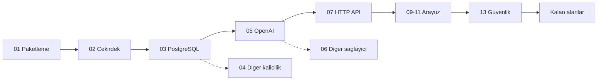

# Tracon — Manuel Kabul Testi İndeksi

> Yayın öncesi elle koşulan kabul testi setinin giriş noktası. Ortam kurulumu,
> ortak fixture verisi, reset yordamı, hata bildirim şablonu ve dosya durum
> tablosu buradadır.
>
> **Koşum protokolü bu dosyada değildir** —
> [`.agents/skills/manuel-test-kosumu/SKILL.md`](../../.agents/skills/manuel-test-kosumu/SKILL.md).
> Bu dosya turdan bağımsız **ortamı** tarif eder, koşumun kendisini değil.

---

## 1. Bu setin üç parçası

| Parça | Nerede | Ömrü |
|---|---|---|
| **Spec** — case metni (ön koşul, adımlar, beklenen sonuç) | `docs/manuel-test/<NN>-<ALAN>.md` | Kalıcı; turdan bağımsız |
| **Protokol** — nasıl koşulur, nasıl kapatılır | [`manuel-test-kosumu`](../../.agents/skills/manuel-test-kosumu/SKILL.md) skill'i | Kalıcı; her tur aynısını uygular |
| **Koşum kaydı** — `Gerçek sonuç` + `Durum` | `kosumlar/<tarih>/` (tur açılışında açılır) → kapanınca `docs/arsiv/` | Bir tura ait; donmuş (K-414) |

Üçü karışmaz. Spec dosyalarında `Durum:` satırı **yoktur**; ikinci bir tur
spec'in üzerine yazmaz, `kosumlar/` altında yeni bir tarih dizini açar.

> 🔄 **Açık tur: 2026-09-16.** Bir koşum oturumuna başlıyorsan bu dosyayı değil,
> önce turun devir notunu oku:
> [`../arsiv/manuel-test-kosum-2026-09/DEVIR.md`](../arsiv/manuel-test-kosum-2026-09/DEVIR.md) — durum,
> değişmez kurallar, ortam doğrulaması ve sıradaki iş oradadır. Bu dosya turdan
> **bağımsız** ortamı tarif eder, turun kendisini değil.

> **Şeride özgü ortam kurulumu ve reset yordamı** skill'in
> [`resources/serit-kurulumu.md`](../../.agents/skills/manuel-test-kosumu/resources/serit-kurulumu.md)
> dosyasındadır. Bu dosyanın §2 bölümü tura bağımsız ön koşulları ve fixture
> verisini tarif eder; şerit yordamlarını tekrarlamaz.

---

## 2. Ortam kurulumu

Bu bölüm bir kez uygulanır. Her senaryo dosyası buraya referans verir.

### 2.1 Ön koşullar

| Gereksinim | Sürüm | Doğrulama |
|---|---|---|
| .NET SDK | 10.0.100+ | `dotnet --version` |
| Node.js | 20.19+ | `node --version` |
| Docker Desktop | Çalışır durumda, 8 GB | `docker info` |
| Python | 3.10+ · `pip install openai` | `python3 -c "import openai"` |
| Chrome | Güncel | — |

**Donanım notu:** Bu makine `arm64` (Apple Silicon). `mcr.microsoft.com/mssql/server`
imajının arm64 sürümü **yoktur**. Docker Desktop → Settings → General →
*Rosetta for x86/amd64 emulation* açık olmalıdır. Açılamazsa SQL Server izleği
`azure-sql-edge` ile koşulur ve bu sapma sonuç dosyasına yazılır.

### 2.2 Veritabanı container'ları

Entegrasyon testlerinin kullandığı **aynı** imajlar kullanılır; başka bir imaj
farklı davranış üretebilir.

```bash
# PostgreSQL — pgvector uzantisi ZORUNLU (RAG izlegi icin).
docker run -d --name ap-pg -p 55432:5432 \
  -e POSTGRES_PASSWORD=tracon -e POSTGRES_DB=tracon \
  pgvector/pgvector:pg18

# SQL Server — ~2 GB bellek ister.
docker run -d --name ap-mssql -p 51433:1433 \
  -e ACCEPT_EULA=Y -e MSSQL_SA_PASSWORD='Tracon!2026' \
  mcr.microsoft.com/mssql/server:2022-latest
```

SQLite dosya tabanlıdır, container istemez.

### 2.3 Yerel NuGet feed (İzlek A)

Temiz tüketici izleği, paketleri **nuget.org'dan değil** yerel dizinden alır.

```bash
cd /Users/farukatasoy/Desktop/projects/Tracon

MSBUILDDISABLENODEREUSE=1 dotnet pack Tracon.slnx -c Release

mkdir -p ~/tracon-local-feed
find artifacts -name "*.nupkg" -exec cp {} ~/tracon-local-feed/ \;

dotnet nuget add source ~/tracon-local-feed -n tracon-local
dotnet new install Tracon.Templates::*-* --add-source ~/tracon-local-feed
```

> 🚨 `MSBUILDDISABLENODEREUSE=1` **atlanmaz.** Öksüz MSBuild düğümleri boruyu açık
> tutar ve komut dakikalarca asılı kalır (repo hafızasında ölçüldü: 8 dk+ → 18,5 sn).

Repo'nun `NuGet.config` dosyası `<clear />` içerir ve yalnız nuget.org tanımlar.
Yerel feed **repo dışında** oluşturulan tüketici projesinde kullanılır; repo'nun
`NuGet.config` dosyası değiştirilmez.

### 2.4 Secret'lar

Hiçbir değer dosyaya yazılmaz. Tümü `dotnet user-secrets` içinde yaşar.

```bash
cd samples/Tracon.Api

dotnet user-secrets set "Tracon:PostgreSql:ConnectionString" \
  "Host=localhost;Port=55432;Database=tracon;Username=postgres;Password=tracon"

dotnet user-secrets set "Tracon:Providers:OpenAI:ApiKey"    "<OPENAI_ANAHTARINIZ>"
dotnet user-secrets set "Tracon:Providers:Anthropic:ApiKey" "<ANTHROPIC_ANAHTARINIZ>"
dotnet user-secrets set "Tracon:Providers:Google:ApiKey"    "<GOOGLE_ANAHTARINIZ>"
dotnet user-secrets set "Tracon:Providers:OpenAICompatible:openrouter:ApiKey" "<OPENROUTER_ANAHTARINIZ>"
dotnet user-secrets set "Tracon:Voice:ApiKey"               "<ELEVENLABS_ANAHTARINIZ>"
dotnet user-secrets set "Tracon:Ui:AuthToken"               "manuel-test-token-2026"
```

> ### 🔧 Ortamın durumu — 2026-09-16 tazeleme turunda kuruldu ve doğrulandı
>
> `UserSecretsId` **`tracon-sample-api`**'dir. Faz 162'ye kadar
> `agentprism-sample-api` idi ve anahtarlar eski ürün adının önekini taşıyordu;
> göç bu turda yapıldı. Eski depo **silinmedi**, geri dönüş açıktır.
>
> **Tanımlı 17 anahtar** (yalnız AD — K-059 gereği hiçbir değer hiçbir dosyada
> yazılı değildir; okumak için `dotnet user-secrets list`):
> `Tracon:Providers:{OpenAI,Anthropic,Google}:ApiKey` ·
> `Tracon:Providers:OpenAICompatible:openrouter:ApiKey` · `Tracon:Voice:ApiKey` ·
> `Tracon:Voice:{DefaultVoiceId,Conversation:PersistAudio,Live:Instructions}` ·
> `Tracon:Ui:AuthToken` · `Tracon:PostgreSql:{ConnectionString,SchemaName}` ·
> `Tracon:Sqlite:ConnectionString` · `Tracon:ContentProtection:RawKeys:{sample,sample2}` ·
> `Tracon:Pricing:Currency` · `Tracon:Pricing:Voice:openai:gpt-live-1:PerMinute` ·
> `Tracon:TriggerSecrets:Slack`.
>
> **Azure kimliği YOKTUR.** `azure-support` katalogda görünmez (ölçüldü: 15
> tanımdan 14'ü çözüldü) ve `MT-MM-122` ⏭ kalır.
>
> **Container'lar §2.2'ye hizalandı.** İkisi de Faz 162 öncesinden kalmıştı ve
> eski ürün adını taşıyordu: `ap-pg`'nin veritabanı ile parolası, `ap-mssql`'in
> SA parolası. `ap-pg`'ye `tracon` veritabanı eklendi, `postgres` parolası
> §2.2'deki değere çekildi ve `vector` uzantısı kuruldu; `ap-mssql`'in SA
> parolası da §2.2'deki değere çekildi. İki container da **silinmedi**; eski
> veritabanları yerinde duruyor.
>
> 🚨 **Sağlayıcı anahtarları 2026-09-16'da düz metne çıktı ve DÖNDÜRÜLMELİDİR.**
> Tur bitince beşini de yenileyin; yenileme yalnız `user-secrets`'ı etkiler,
> hiçbir dokümanı değiştirmez.

Diğer kalıcılık sağlayıcıları **aynı anda verilmez** — biri denenirken diğerinin
kaydı silinir. Örnek uygulamanın seçim önceliği
`SqlServer > PostgreSql > Sqlite`'tır (`Program.cs:860-870`), yani ikisi birden
tanımlıysa üstteki kazanır:

```bash
dotnet user-secrets remove "Tracon:PostgreSql:ConnectionString"
dotnet user-secrets set    "Tracon:Sqlite:ConnectionString"   "Data Source=tracon-manuel.db"
dotnet user-secrets set    "Tracon:SqlServer:ConnectionString" \
  "Server=localhost,51433;Database=Tracon;User Id=sa;Password=Tracon!2026;TrustServerCertificate=true"
```

### 2.5 Uygulamayı çalıştırma

```bash
cd samples/Tracon.Api && dotnet run     # http://localhost:5080/tracon
```

Yalnız arayüz üzerinde çalışırken Vite dev sunucusu:

```bash
cd src/Tracon.UI/frontend && npm run dev   # http://localhost:5173
```

---

## 3. Ortak fixture verisi

Senaryolar bu kümeden **kimlikle** çağırır; veriyi tekrar tanımlamaz.
Bir senaryonun kendi verisi gerekiyorsa case içinde tanımlanır ve buraya girmez.

### 3.1 Örnek uygulamada hazır gelen agent'lar (İzlek B)

> 🚨 **Adlar Faz 162'de İngilizce'ye çevrildi.** Bu tablo ve case gövdeleri
> 2026-09-16 tazeleme turunda düzeltildi (294 geçiş, 17 aile). `Ad` ve
> `Görünen ad` sütunları `samples/Tracon.Api/Program.cs`'in `Name` /
> `DisplayName` satırlarından **ölçülmüştür**; elle yazılmaz.

| Ad | Görünen ad | Not |
|---|---|---|
| `support` | Support Assistant | Sipariş tool'ları bağlı |
| `researcher` | Researcher | |
| `router` | Router | |
| `summarizer` | Summarizer | MCP ve A2A ile dışa açık |
| `translator` | Translator | |
| `order-summary` | Order Summary (structured output demo) | Yapısal çıktı demosu |
| `cached-support` | Cached Support (demo) | Yanıt cache'i demosu |
| `openrouter-support` | OpenRouter Support | OpenRouter anahtarı ister |
| `claude-support` · `claude-thinking` | Claude Support · Claude Thinking | Anthropic anahtarı ister |
| `gemini-support` · `gemini-strict-filter` | Gemini Support · Gemini Strict Filter | Google anahtarı ister |
| `azure-support` | Azure Support | ⏭ Azure kimliği yok |
| `voice-assistant` | Voice Assistant | ElevenLabs anahtarı ister |
| `knowledge-assistant` | Knowledge Assistant | `pgvector` + embedding ister |

### 3.2 Örnek uygulamada hazır gelen tool'lar

> ⚠️ **Sayıyı sabitleme, varlığı denetle** — `02-CEKIRDEK-VE-KATALOG.md`'nin
> kendi kuralı. Ölçüldü 2026-09-19 (`grep -c 'TraconTool(' OrderTools.cs` +
> `Program.cs`): `OrderTools.cs`'te **8** tool, `Program.cs`'te **1** istemci
> tool'u (`read_shopping_cart`) ve ses anahtarı varsa **3** ses tool'u
> (`speak` · `transcribe` · `list_voices`) — anahtarlı kurulumda katalog
> **12**, anahtarsız **9**. `GET /api/tools` turda **10** ölçmüştü; aradaki
> iki fark `refund_order` ve `whoami`, ikisi de K-834 ile eklendi. Katalog
> ayrıca MCP keşfiyle büyür.

| Tool | İmza | Not |
|---|---|---|
| `get_order_status` | `orderId` | Sabit metin döndürür |
| `list_recent_orders` | `customerId` | `ORD-1001, ORD-1002` döndürür |
| `cancel_order` | `orderId` | **`RequiresApproval = true`** · `Effect = Destructive` · `RequiredPermission = orders.cancel` |
| `refund_order` | `orderId`, `amount` | **K-834 (2026-09-19).** `RequiresApproval = true` · `Effect = Destructive` · `RequiredPermission = orders.refund`. 🚨 Onay isteyen **ve sayısal argüman alan** tek tool — koşullu onay kuralı (`ArgumentConditions`) ancak bununla gözlemlenebilir (`MT-SEC-101`…`105`) |
| `get_slow_report` | `reportId` | `TimeoutSeconds = 1`; gövde timeout'undan uzun uyur |
| `estimate_shipping_cost` | `address` (`Street`, `City`, `PostalCode`) | Nesne argüman alan tek tool — şema iç içe bir `object` üretir |
| `mark_preview_ready` | `orderId` | Faz 141: `RunEventType.Custom` yazar (`contoso.preview-ready`) |
| `whoami` | — | **K-834 (2026-09-19).** `TraconRunContext.Current?.UserId`'yi geri okur; run atıfının tool koduna ULAŞTIĞINI gösteren tek yüzey (`MT-SEC-149`) |
| `read_shopping_cart` | — | `Program.cs`'te `AddClientTool` ile bildirilir; sunucu ÇALIŞTIRMAZ, çağrı tarayıcıya döner (Faz 61) |
| `speak` · `transcribe` · `list_voices` | — | `src/Tracon.Voice`; yalnız `Tracon:Voice` anahtarı varsa kayıtlıdır — anahtarsız kurulumda üçü de yoktur |

### 3.3 Örnek uygulamada hazır gelen workflow'lar

| Ad | Not |
|---|---|
| `summarize-and-translate` | Sıralı desen |
| `summarize-and-approve` | Human-in-the-loop |

### 3.4 Manuel testin kendi verisi

| Kimlik | Değer |
|---|---|
| `FIX-TENANT-01` | `kiraci-alfa` |
| `FIX-TENANT-02` | `kiraci-beta` |
| `FIX-AGENT-01` | Ad `manuel-destek` · Talimat `Sen bir siparis destek asistanisin. Kisa yanit ver.` · Tool `get_order_status` |
| `FIX-AGENT-02` | Ad `manuel-bos` · Talimat `Yalnizca "tamam" yaz.` · Tool yok |
| `FIX-SESSION-01` | `musteri-42` |
| `FIX-SESSION-02` | `musteri-99` |
| `FIX-PROMPT-01` | `ORD-1001 siparisim nerede?` → tool çağrısı bekler |
| `FIX-PROMPT-02` | `Merhaba` → tool çağrısı **beklemez** |
| `FIX-PROMPT-03` | `ORD-1001 siparisimi iptal et` → onay kartı bekler |
| `FIX-PROMPT-04` | 50.000 karakterlik metin → sınır senaryosu |
| `FIX-PROMPT-05` | `confidential-project hakkinda bilgi ver` → guard engellemesi bekler (2026-09-16 turunda düzeltildi: eski metin `gizli-proje` idi, `Program.cs:217`'nin `DeniedTerms`'i İngilizce `"confidential-project"` taşıyor — K-228 aynı bayatlık, MT-OAI-084'te de bulunmuştu) |
| `FIX-TOKEN-01` | `manuel-test-token-2026` (geçerli) |
| `FIX-TOKEN-02` | `yanlis-token` (geçersiz — 401 bekler) |

`FIX-PROMPT-05`, örnek uygulamadaki `AddPatternContentGuard` yapılandırmasının
`DeniedTerms` listesine dayanır.

---

## 4. Reset yordamı

Bir dosyaya başlamadan önce sistem temiz duruma alınır. Kirli durum, yanlış
"kaldı" sonucu üretir.

```bash
# 1. Uygulamayi durdur (Ctrl+C).

# 2. PostgreSQL semasini dusur — yalniz tracon semasi.
docker exec -i ap-pg psql -U postgres -d tracon \
  -c "DROP SCHEMA IF EXISTS tracon CASCADE;"

# 3. SQLite dosyasini sil.
rm -f samples/Tracon.Api/tracon-manuel.db*

# 4. SQL Server veritabanini dusur.
docker exec -i ap-mssql /opt/mssql-tools18/bin/sqlcmd -C -S localhost \
  -U sa -P 'Tracon!2026' -Q "DROP DATABASE IF EXISTS Tracon;"

# 5. Tarayici deposunu temizle: DevTools → Application → Clear site data.

# 6. Uygulamayi yeniden baslat.
cd samples/Tracon.Api && dotnet run
```

Şema düşürüldükten sonra migration'lar açılışta yeniden uygulanır
(`AutoApplyMigrations: true`). PostgreSQL'de **50 çekirdek** migration dosyası
vardır (2026-09-16 ölçümü: `src/Tracon.PostgreSql/Migrations/*.sql`); örnek
uygulamanın `appsettings.json`'ı `EnableKnowledge: true` taşır (bir
`EnableVectorSearch` agent'ı demoluyor, Faz 67), bu yüzden isteğe bağlı
"knowledge" setinin **1** migration'ı da uygulanır — açılış logunda toplam
**51** doğrulanır. 🚨 **Bu sayı her yeni migration'la artar; sabit sayıya değil
dosya sayımına bak.** Ayrıntı: [`03-KALICILIK-POSTGRESQL.md`](03-KALICILIK-POSTGRESQL.md).

---

## 5. Önem dereceleri

| Derece | Anlamı | Yayın etkisi |
|---|---|---|
| **Kritik** | Veri kaybı, `secret` sızıntısı, kiracı yalıtımının kırılması, çalışmayan çekirdek yol | Yayın **durur** |
| **Yüksek** | Bir yetenek çalışmıyor, sessiz veri bozulması, geri alınamaz yanlış etki | Yayın durur |
| **Orta** | Yetenek çalışıyor ama sınır durumunda yanlış davranıyor | Yayın notunda bilinen kusur |
| **Düşük** | Görsel, metin, kolaylık | Sonraki sürüm |

---

## 6. Hata bildirim şablonu

Bir case `Kaldı` işaretlendiğinde bu şablon doldurulur ve
`SONUCLAR-<YYYY-AA-GG>.md` dosyasına eklenir.

```markdown
### HATA-<NNN> — <kısa başlık>

- **Case:** MT-<ALAN>-<NNN>
- **Önem:** Kritik · Yüksek · Orta · Düşük
- **İzlek:** A · B · C
- **Ortam:** macOS arm64 · net10 · PostgreSQL · <sağlayıcı>

**Beklenen**
<tek cümle>

**Gerçekleşen**
<tek cümle>

**Yeniden üretme**
1. ...

**Kanıt**
- Log satırı / ekran görüntüsü yolu / HTTP yanıtı / SQL çıktısı

**Kapsam**
- Yalnız bu case mi, yoksa başka case'ler de mi etkileniyor?
```

---

## 7. Dosya durum tablosu

`Üretim` sütunu senaryonun **yazılıp yazılmadığını**, `Koşum` sütunu **son
turun** sonucunu gösterir. Üretim oturumu yalnız `Üretim` sütununa dokunur.

**Koşum sütunu — son tur: 2026-09-16.** Sayılar turun kendi kaydından
**ölçülmüştür** (`manuel-test-kosumu` skill'i §7 sayım betiği, kapanış koşumu
2026-09-19). Biçim: `✅ geçen/hedef` ve varsa `N ☒` kaldı · `N ⏭` atlandı ·
`N ☐` beklemede · `N ⬜` hiç koşulmadı. Yeni bir tur bu sütunu kendi sayımıyla
değiştirir; bir önceki turun sütunu git geçmişindedir.

**Turun toplamı:** kayıt **1.859** case taşıyor — **1.813 ☑ Geçti** ·
**26 ☐ Beklemede** · **19 ⏭ Atlandı** · **1 ☒ Kaldı**. Setin hedefi **1.867**
case'tir; aradaki **8** case hiç kayıt bloğu almadı (⬜ — §7.2 E maddesi).
🚨 Sayım betiği yalnız **blok taşıyan** case'i görür: bir case'in hiç bloğu
yoksa `İŞARETSİZ` sayısına da girmez. Turun sayımı bu yüzden `Hedef case`
sütunuyla karşılaştırılarak doğrulanır.

⚠️ **Sayımı damıtılmış kayıt üzerinde TEKRARLAMA.** Damıtma temiz geçen
case'leri tablo satırına indirir; bir case iki blok taşıyorsa (ilk deneme
ertelendi, ikincisi geçti) geriye **ilk** blok kalır ve işaretsiz görünür
(ölçüldü: 19 blok, `F-251`). Yukarıdaki sayı damıtmadan **önce** ölçülmüştür
ve bu tablonun kendisi tek kaynaktır.

**Üretim işaretleri:** ☐ beklemede · ◐ yarım · ✅ bitti

`Kaynak` sütunu, o dosyayı üretecek oturumun okuyacağı **tek** kaynak kümesidir.
Bu eşleme bir başlangıçtır; üretim oturumu grep ile doğrular ve gerekirse düzeltir.

| # | Dosya | Alan kodu | Faz | Kaynak | Hedef case | Üretim | Koşum |
|---|---|---|---|---|---|---|---|
| 01 | [`01-KURULUM-VE-PAKETLEME.md`](01-KURULUM-VE-PAKETLEME.md) | `PKG` | 0, 52, 97, 160, 182, 183, 185, 187, 188, 189, 191 | `Directory.Build.props` · `Directory.Build.targets` · `src/Directory.Build.props` · `*.csproj` · `src/Tracon.Generators` · `scripts/kapi.py` (`yayin`, `test --tfm`, `paketle`, `paket-dogrula`) · `.github/workflows/ci.yml` (tek derleme zinciri, Faz 191) · `scripts/public-yuzey-envanteri.py` (Faz 182) · `tests/Directory.Build.props` · `samples/Tracon.Samples.Net8Consumer` (Faz 183) | **122** | ✅ | ✅ 81/81 · Faz 182: `MT-PKG-123` ✅ · `MT-PKG-124` ✅ · `MT-PKG-125` ➜ CI · Faz 183: `MT-PKG-126`…`129` ✅ · Faz 185: `MT-PKG-130`…`133` ✅ · `134` 👤 · Faz 187: `MT-PKG-135`…`141` ✅ · `142` ➜ CI · `143`, `144` ✅ · Faz 188: `MT-PKG-145`…`148` ✅ · Faz 189: `MT-PKG-149`…`152` ✅ · Faz 191: `MT-PKG-153`…`158` ✅ · `159` ➜ CI · `160` 👤 · `100` güncellendi ✅ · kusur-giderme 2026-09-24 (A-59 · BL-058 · prova dizini): `MT-PKG-161` ✅ · `162` adım 1–2 ✅, 3–4 açık · `163` adım 1 ✅ |
| 02 | [`02-CEKIRDEK-VE-KATALOG.md`](02-CEKIRDEK-VE-KATALOG.md) | `CORE` | 1, 3, 72, 86, 101, 127, 130, 135, 189 | `src/Tracon.Core` (`Compilation/` · `Catalog/` · `Tools/` · `Sessions/`) · `src/Tracon.Abstractions` | **99** | ✅ | ✅ 96/97 · 1 ☐ (`MT-CORE-095`) · Faz 189: `MT-CORE-130` ✅ · `131` ⏳ |
| 03 | [`03-KALICILIK-POSTGRESQL.md`](03-KALICILIK-POSTGRESQL.md) | `PG` | 2, 51, 110 | `src/Tracon.PostgreSql` | **50** | ✅ | ✅ 50/50 |
| 04 | [`04-KALICILIK-DIGER.md`](04-KALICILIK-DIGER.md) | `SQL` | 23, 24, 110 | `src/Tracon.Sqlite` · `src/Tracon.SqlServer` · `src/Tracon.Sql.Shared` | **46** | ✅ | ✅ 44/46 · 2 ☐ (`MT-SQL-071` · `079` — 079 koşulmadı; ➜ CI) |
| 05 | [`05-SAGLAYICI-OPENAI.md`](05-SAGLAYICI-OPENAI.md) | `OAI` | 3, 8 | `src/Tracon.OpenAI` (tümü) · devre kesici/sağlık için `src/Tracon.Core/Models/ModelProviderCircuitBreaker.cs` · `CircuitBreakingChatClient.cs` · `ModelProviderHealthCache.cs` · `ModelProviderRegistry.cs` | **40** | ✅ | ✅ 39/40 · 1 ⏭ (`MT-OAI-053`) |
| 06 | [`06-SAGLAYICI-DIGER.md`](06-SAGLAYICI-DIGER.md) | `PROV` | 8, 26, 27 | `src/Tracon.Anthropic` · `src/Tracon.Google` · `src/Tracon.Azure` | **39** | ✅ | ✅ 30/39 · 9 ⏭ (Azure kimliği yok) |
| 07 | [`07-HTTP-YONETIM-API.md`](07-HTTP-YONETIM-API.md) | `API` | 4, 34, 43, 44 | `src/Tracon.AspNetCore/Endpoints` (kısmi — bkz. dosyanın kaynak başlığı) | **43** | ✅ | ✅ 43/43 |
| 08 | [`08-OPENAI-UYUMLU-UCLAR.md`](08-OPENAI-UYUMLU-UCLAR.md) | `COMPAT` | 50 | `src/Tracon.AspNetCore/OpenAICompat/` (gerçek klasör adı — bkz. not) | **50** | ✅ | ✅ 50/50 |
| 09 | [`09-ARAYUZ-GENEL.md`](09-ARAYUZ-GENEL.md) | `UI` | 5, 30, 164, 175 | `src/Tracon.UI/frontend/src` (kabuk, `access-gate`, `layout`, `navigation`, `command-palette`, `router`, `i18n`, `theme`, `auth`, `shortcuts`, `ui`, `dialog`, `menu`, `tooltip`, `toolbar`, `status-dot`, `styles.css`; `settings`/`models`/`tools` ekranları yalnız genel kısım; `confirm-dialog`) | **57** | ✅ | ✅ 56/57 · 1 ☐ (`MT-UI-042`) |
| 10 | [`10-ARAYUZ-AGENT-PLAYGROUND.md`](10-ARAYUZ-AGENT-PLAYGROUND.md) | `UIAG` | 5, 19 | `screens/agent*.tsx` · `playground.tsx` | **58** | ✅ | ✅ 56/58 · 2 ⏭ |
| 11 | [`11-ARAYUZ-RUN-SESSION-SSE.md`](11-ARAYUZ-RUN-SESSION-SSE.md) | `UIRUN` | 5, 32, 47 | `screens/run*.tsx` · `session*.tsx` · `components/cancel-run-button.tsx` · `replay-panel.tsx` · `run-comparison.tsx` · `branch-button.tsx` | **66** | ✅ | ✅ 66/66 |
| 12 | [`12-GOZLEMLENEBILIRLIK-MALIYET.md`](12-GOZLEMLENEBILIRLIK-MALIYET.md) | `OBS` | 6, 20, 35, 68, 89, 119, 132, 154, 173 | `src/Tracon.Core` · `screens/dashboard.tsx` · `screens/run-detail.tsx` | **65** | ✅ | ✅ 64/65 · 1 ☐ (`MT-OBS-055`) |
| 13 | [`13-KIRACI-VE-GUVENLIK.md`](13-KIRACI-VE-GUVENLIK.md) | `SEC` | 6, 9, 41, 50, 53, 82, 139, 147, 148, 149, 170, 182 | `src/Tracon.AspNetCore/Security` · `Tenancy/` · `TraconEndpointOptions.cs` · `Endpoints/ApiKeyEndpoints.cs`/`AuditEndpoints.cs`/`GovernanceEndpoints.cs` (yalnız `MapTenants`) · `Tracon.Abstractions/Security`, `Audit`, `Tenancy` · `Tracon.Core/Security`, `Audit`, `Tenancy` · `Abstractions/Runs/RunAuthorizationTypes.cs`, `Core/Runs/AllowAllRunAuthorizationHandler.cs`, `AspNetCore/RateLimiting/RunAuthorizationGate.cs` (Faz 139) · `AspNetCore/Security/SessionOwnershipGate.cs`, `Abstractions/Options/TraconSessionOwnershipOptions.cs` (Faz 148 · 149) · `Core/Diagnostics/ProductionProfileValidator.cs` + `Diagnostics/Checks/`, `AspNetCore/Tenancy/TenancyResolutionProfileCheck.cs` (Faz 170) · `Core/Audit/AuditRecorder.cs` (Faz 171) · `Abstractions/Tenancy/AmbientTenantScope.cs`, `Sql.Shared/Migrations/TenantIdCaseGuard.cs` (Faz 179) · `Core/Approvals/ToolArgumentConditionFingerprint.cs` (Faz 182) | **161** | ✅ | ✅ 143/149 · 1 ☐ (`MT-SEC-193`) · 5 ☐ (`MT-SEC-194`…`MT-SEC-198`, Faz 179 — koşulmadı) · Faz 182: `MT-SEC-199` ✅ (➜ CI) · 2026-09-23 kusur giderme: 7 ☐ (`MT-SEC-200`…`MT-SEC-206`, K-852…K-854 + yetki kapısı logu + anahtar basma — koşulmadı; ➜ CI) · Faz 190: `MT-SEC-207`…`209` ✅ (örnek uygulama) · `MT-SEC-210` ☐ (➜ CI) · `MT-SEC-091` yeniden yazıldı |
| 14 | [`14-SKILL-VE-SCRIPT.md`](14-SKILL-VE-SCRIPT.md) | `SKILL` | 10, 11, 186 | `src/Tracon.Abstractions/Skills` · `src/Tracon.Core/Skills` (tümü) · `src/Tracon.Core/Storage/InMemoryAgentSkillStore.cs`/`InMemorySkillScriptGrantStore.cs` · `src/Tracon.AspNetCore/Endpoints/SkillEndpoints.cs`/`SkillScriptGrantEndpoints.cs` · `src/Tracon.UI/frontend/src/screens/skills.tsx` | **59** | ✅ | ✅ 46/47 · 1 ⏭ (`MT-SKILL-063`) · 12 yeni case (Faz 186: `MT-SKILL-064`…`069`, `072`…`077`) tur kaydında yok — altısı faz kapanışında örnek uygulamada ölçüldü, 11'i ➜ CI |
| 15 | [`15-WORKFLOWS.md`](15-WORKFLOWS.md) | `WF` | 15, 16, 71, 87, 122 | `src/Tracon.Workflows` · `screens/workflow*.tsx` | **70** | ✅ | ✅ 70/70 |
| 16 | [`16-IS-KUYRUGU-VE-ZAMANLAMA.md`](16-IS-KUYRUGU-VE-ZAMANLAMA.md) | `JOB` | 17, 42, 46, 120 | `src/Tracon.Core` (job) · `screens/job*.tsx` | **98** | ✅ | ✅ 98/98 (`MT-JOB-132` kapanışta yeniden numaralandı — ID çakışması) |
| 17 | [`17-EVAL-VE-DENEYLER.md`](17-EVAL-VE-DENEYLER.md) | `EVAL` | 18, 19, 31, 45, 49, 56, 154, 176 | `src/Tracon.Abstractions/Evaluation`, `Experiments` · `src/Tracon.Core/Evaluation`, `Experiments`, `Audit/AuditingExperimentStore.cs` · `src/Tracon.AspNetCore/Endpoints/EvalEndpoints.cs`, `ExperimentEndpoints.cs`, `RunEndpoints.cs` (yalnız feedback/compare/input/replay) · `screens/eval*.tsx` · `experiment*.tsx` · `promote-to-eval-case.tsx` · `feedback-control.tsx` | **69** | ✅ | ✅ 69/69 |
| 18 | [`18-MCP-VE-A2A.md`](18-MCP-VE-A2A.md) | `MCP` | 6, 22, 50, 89, 127, 190 | `src/Tracon.Mcp` · `src/Tracon.AspNetCore/McpServer` · `A2A` · `Endpoints/GovernanceEndpoints.cs` (yalnız `/api/mcp-servers/*`) | **67** | ✅ | ✅ 56/59 · 3 ☐ (`MT-MCP-058` · `067` · `069` — 069 koşulmadı; ➜ CI) · Faz 190: `MT-MCP-070`…`073`, `076`, `077` ✅ (örnek uygulama) · `074` ◐ (👤 tarayıcı tıklaması koşulmadı) · `075` ☐ (➜ CI) |
| 19 | [`19-COK-MODLULUK-VE-SES.md`](19-COK-MODLULUK-VE-SES.md) | `MM` | 14, 28, 29, 72, 88, 138, 161 | `src/Tracon.Abstractions/Attachments`, `Voice` · `src/Tracon.Core/Attachments`, `Voice` · `src/Tracon.Voice` (tümü) · `src/Tracon.AspNetCore/Endpoints/AttachmentEndpoints.cs`, `VoiceEndpoints.cs` · `src/Tracon.AspNetCore/Voice/VoiceConversationEndpoint.cs`, `LiveVoiceEndpoints.cs`, `VoiceEndpointGates.cs` · `src/Tracon.OpenAI/Live` · `src/Tracon.AspNetCore/OpenAICompat/AttachmentIngestion.cs` | **93** | ✅ | ✅ 87/93 · 2 ⏭ · 4 ☐ (`MT-MM-121` 2026-09-24'te canlı yeniden koşuldu: ☑) |
| 20 | [`20-BELLEK-RAG-BAGLAM.md`](20-BELLEK-RAG-BAGLAM.md) | `MEM` | 13, 51 | `src/Tracon.Abstractions/Agents/{Compaction,Memory}Settings.cs` · `Knowledge/*.cs` · `src/Tracon.Core/Compilation/AgentDefinitionCompiler.cs` (bellek/sıkıştırma/vektör bağlama kısmı), `ObservedCompactionStrategy.cs` · `src/Tracon.Core/Knowledge/*.cs` · `src/Tracon.PostgreSql/MigrationsKnowledge/0001_vector.sql`, `Stores/PgVectorSearchStore.cs` · `src/Tracon.AspNetCore/Endpoints/KnowledgeEndpoints.cs`, `Contracts/KnowledgeContracts.cs` | **31** | ✅ | ✅ 31/31 |
| 21 | [`21-DAYANIKLILIK-VE-IPTAL.md`](21-DAYANIKLILIK-VE-IPTAL.md) | `RES` | 32, 54, 55, 87, 126, 144, 177 (44/46/47 yalnız kesişim) | `src/Tracon.Abstractions/Runs/IRunCancellationRegistry.cs`, `RunReconciliationOptions.cs` · `src/Tracon.Abstractions/Approvals/` · `src/Tracon.Core/Recording/{RunCancellationRegistry,RunHeartbeatWriter,RunReconciliationService}.cs` · `src/Tracon.Core/Approvals/` · `src/Tracon.Core/Hosting/TraconDrainService.cs` · `src/Tracon.Core/Scheduling/RunContinuationJobHandler.cs` · `src/Tracon.AspNetCore/Endpoints/{RunEndpoints.cs (yalnız CancelRunAsync),ApprovalEndpoints.cs}` · `src/Tracon.Core/Sessions/AgentSessionManager.cs` (Faz 126: `StateSchemaVersion`/`StateMafVersion`) · `src/Tracon.Core/Graph/ChildAgentInvoker.cs`, `Compilation/AgentDefinitionCompiler.Agents.cs`, `TraconOptions.cs` (`AgentGraph.ChildDeadline`/`WaitTimeout`, Faz 144) · `screens/approvals.tsx`, `run-detail.tsx` · `src/Tracon.Testing.Contracts.Xunit/Contracts/StoreCancellationContract.cs` (Faz 177) | **56** | ✅ | ✅ 51/55 · 4 ⏭ · 1 ⬜ (`MT-RES-093` — 2026-09-24'te eklendi, tur sonrası) |
| 22 | [`22-GUARDRAIL-VE-YAPISAL-CIKTI.md`](22-GUARDRAIL-VE-YAPISAL-CIKTI.md) | `GUARD` | 38, 48, 86, 127, 131, 134 | `src/Tracon.Abstractions/Guards`, `Agents/ResponseFormat.cs`, `Agents/IStructuredResponseValidator.cs` · `src/Tracon.Core/Guards` (tümü), `Compilation/AgentDefinitionCompiler.cs`, `Compilation/StructuredResponseValidatingAgent*.cs`, `Models/ModelProviderRegistry.cs` · `src/Tracon.Core/Runs/DocumentChannelMessageBuilder.cs` · `src/Tracon.AspNetCore/Endpoints/AgentEndpoints.cs` · `src/Tracon.UI/frontend/src/screens/{agent-editor,agent-detail,models,run-detail}.tsx` | **56** | ✅ | ✅ 54/56 · 2 ☐ (`MT-GUARD-095` · `106`) |
| 23 | [`23-SAKLAMA-ARSIV-KOTA.md`](23-SAKLAMA-ARSIV-KOTA.md) | `RET` | 21 (yalnız kota), 25, 36, 114, 128, 146 | `src/Tracon.Abstractions/Retention`, `Quotas`, `Runs/AgentRunBudget.cs` · `src/Tracon.Core/Retention`, `Quotas`, `Recording/RunRecordingAgent.cs`, `Models/RunBudgetChatClient.cs`, `TraconOptions.cs` (`AgentGraph.MaxDuration`) · `src/Tracon.Sql.Shared/Internal/RetentionTargetRegistry.cs` · `src/Tracon.AspNetCore/Endpoints/{Retention,Quota}Endpoints.cs` · `samples/Tracon.Api/FileSystemArchiveSink.cs` | **45** | ✅ | ✅ 45/45 |
| 24 | [`24-TEST-PAKETI-VE-SABLON.md`](24-TEST-PAKETI-VE-SABLON.md) | `TEST` | 37, 39, 95, 98, 99, 143, 185, 188 | `src/Tracon.Testing` · `src/Tracon.Templates` · `src/Tracon.Testing.Contracts.Xunit` · `samples/Tracon.Samples.FileRunStore(.Tests)` · `tests/Tracon.Package.Tests` · `samples/Tracon.Samples.CustomModelProvider(.Tests)` | **69** | ✅ | ✅ 64/66 · 2 ⬜ (`MT-TEST-077` · `083` — 👤, kayıt bloğu yok) · Faz 185: `MT-TEST-095`…`097` ✅ · Faz 188: `MT-TEST-027` DI ile yeniden yazıldı, paketlenmiş `Tracon.Testing`'e karşı ✅ |
| 25 | [`25-SAGLIK-TESHIS-OPENAPI.md`](25-SAGLIK-TESHIS-OPENAPI.md) | `DIAG` | 33, 40, 85, 122, 150 | `src/Tracon.AspNetCore` (health, diagnostics, OpenAPI) · `src/Tracon.Core/Diagnostics/{SilentGapWarningService,TraconExtensionPoints,RequiredBindingValidator}.cs` | **45** | ✅ | ✅ 45/45 |
| 26 | [`26-ISTEMCI-TOOLLARI-VE-GOMULEBILIR.md`](26-ISTEMCI-TOOLLARI-VE-GOMULEBILIR.md) | `IST` | 61 | `src/Tracon.Core/Tools/TraconClientToolExtensions.cs` · `src/Tracon.AspNetCore/Internal/{ClientToolResultResolver,TraconCorsMiddleware}.cs` · `Endpoints/AgentEndpoints.cs` (`toolResults`) · `TraconEndpointOptions.cs` (`AllowedOrigins`) · `src/Tracon.UI/frontend/src/embed/` | **16** | ✅ | ✅ 16/16 |
| 27 | [`27-MODEL-YEDEK-VE-ON-UCUS.md`](27-MODEL-YEDEK-VE-ON-UCUS.md) | `MYU` | 62 · 81 · 113 · 124 | `src/Tracon.Abstractions/Agents/{ModelBinding,ModelFallback,ResponseCacheSettings}.cs` · `Options/{TraconPreflightOptions,TraconModelConcurrencyOptions}.cs` · `src/Tracon.Core/Models/{FallbackChatClient,ProviderConcurrencyLimiter,ContextWindowEstimator,TraconResponseCachingChatClient,ModelProviderRegistry}.cs` · `Replay/RecordedToolPlayback.cs` · `Compilation/AgentDefinitionCompiler.cs` (yalnız `BuildContextWindowStrategy`) · `src/Tracon.AspNetCore/Endpoints/AgentEndpoints.cs` (yalnız `EstimateAsync`) · `RateLimiting/PreflightGate.cs` | **17** | ✅ | ✅ 17/17 |
| 28 | [`28-DENETIM-ZINCIRI-VE-VERI-HAKLARI.md`](28-DENETIM-ZINCIRI-VE-VERI-HAKLARI.md) | `DVR` | 64 | `src/Tracon.Abstractions/Audit`, `Privacy` · `src/Tracon.Core/Audit/{AuditChainHasher,AuditChainWalker}.cs`, `Privacy/NullDataSubjectStore.cs` · `src/Tracon.Sql.Shared/Stores/{SqlAuditLog,SqlDataSubjectStore}.cs`, `Internal/DataSubjectTargetRegistry.cs` · `src/Tracon.AspNetCore/Endpoints/{AuditEndpoints,DataSubjectEndpoints}.cs` | **10** | ✅ | ✅ 10/10 |
| 29 | [`29-AGENT-DESTEGI.md`](29-AGENT-DESTEGI.md) | `AGD` | 73 | `src/Tracon.Cli/Commands/{AgentSkillCommand,GateSkillText}.cs` · `src/Tracon.Generators/{TraconUsageAnalyzer,UsageDiagnostics}.cs` · `src/Tracon.Core/buildTransitive/` · `src/Tracon.Templates/content/Tracon.Starter/Tracon.Starter.csproj` · `docs-site/scripts/build-agent-map.mjs` · `docs-site/src/content/docs/capabilities.md` · `tests/Tracon.Core.UnitTests/Architecture/CapabilityCoverageTests.cs` | **24** | ✅ | ✅ 22/24 · 2 ☐ (`MT-AGD-018` · `024`) |
| 30 | [`30-YEREL-REFERANS.md`](30-YEREL-REFERANS.md) | `YRF` | 74 · 78 | `src/Tracon.Core/buildTransitive/Tracon.Core.targets` · `src/Tracon.AspNetCore/buildTransitive/Tracon.AspNetCore.targets` · `src/Tracon.AspNetCore/Tracon.AspNetCore.csproj` (OpenAPI paketlemesi) · `src/Tracon.Templates/content/Tracon.Starter/.gitignore` · `docs-site/scripts/build-agent-map.mjs` · `tests/Tracon.Core.UnitTests/Architecture/{CapabilityEntryPoints,CapabilityExampleTests}.cs` · `src/Tracon.Generators/UsageDiagnostics.cs` (`TRC0402`) | **27** | ✅ | ✅ 25/27 · 2 ☐ (`MT-YRF-026` · `027`) |
| 31 | [`31-DOKUMAN-DOGRULUGU.md`](31-DOKUMAN-DOGRULUGU.md) | `DDG` | 75, 79, 104, 172 | `tests/Tracon.Core.UnitTests/Architecture/ShippedDocumentationSelfContainmentTests.cs` · `docs-site/scripts/check-content.mjs` · `docs-site/scripts/build-agent-map.mjs` · `docs-site/scripts/{build-api-reference,build-http-api}.mjs` · `tests/Tracon.Ui.E2ETests/DocumentationScreenshotTests.cs` · `README.md` · `src/*/README.md` · `docs-site/site.config.mjs` | **35** | ✅ | ✅ 32/35 · 3 ☐ (`MT-DDG-007` · `017` · `018`) |
| 32 | [`32-DOKUMAN-KALITESI.md`](32-DOKUMAN-KALITESI.md) | `DKL` | 76, 158, 163 | `docs-site/src/styles/site.css` · `docs-site/astro.config.mjs` · `docs-site/src/sidebar.mjs` · `docs-site/src/starlightRouteData.mjs` · `docs-site/scripts/check-content.mjs` · `docs-site/scripts/check-weight.mjs` · `docs-site/scripts/build-social-images.mjs` · `docs-site/scripts/check-console-screens.mjs` · `docs-site/src/components/` · `docs-site/src/styles/landing.css` · `assets/tracon-mark.svg` · `tests/Tracon.AspNetCore.FunctionalTests/DocumentedPolicyTests.cs` | **40** | ✅ | ✅ 35/40 · 5 ☐ (`MT-DKL-001`…`004` · `006`) |
| 33 | [`33-DOKUMAN-KAPILARI.md`](33-DOKUMAN-KAPILARI.md) | `DKP` | 80, 90, 167, 174 | `scripts/dokuman-bakim.py` · `scripts/dokuman_bakim_test.py` · `.github/workflows/ci.yml` · `docs-site/scripts/check-capacity-stamp.mjs` | **27** | ✅ | ✅ 25/27 · 2 ☐ (`MT-DKP-026` · `027` — koşulmadı; ➜ CI) |
| 34 | [`34-ISTEMCI-VE-CLI.md`](34-ISTEMCI-VE-CLI.md) | `CLI` | 83, 115, 153, 156, 159 | `src/Tracon.Client` · `src/Tracon.Cli` · `nswag.json` · `scripts/nswag-*.py` | **46** | ✅ | ✅ 42/46 · 4 ⬜ (`MT-CLI-012` · `022` · `037` · `046` — 👤, kayıt bloğu yok) |
| 35 | [`35-TYPESCRIPT-ISTEMCISI.md`](35-TYPESCRIPT-ISTEMCISI.md) | `TSC` | 84 | `packages/tracon-client` · `src/Tracon.UI/frontend/src/lib/{api.ts,server-types.ts}` · `src/Tracon.UI/Tracon.UI.Frontend.targets` · `.github/workflows/ci.yml` | **11** | ✅ | ✅ 9/11 · 2 ⬜ (`MT-TSC-008` · `009` — 👤, npm kapsamı rezerve değil) |
| 36 | [`36-GELISTIRME-KAPILARI.md`](36-GELISTIRME-KAPILARI.md) | `GDK` | 91, 92, 116, 166, 167, 168, 169, 180, 184 | `scripts/kapi.py` · `scripts/capacity.py` · `scripts/denetim-paketi.py` · `scripts/*_test.py` · `src/Tracon.UI/Tracon.UI.Frontend.targets` · `docfx/docfx.json` · `DocfxConfigurationTests.cs` · `CanaryEvaluationServiceTests.cs` · `RunReconciliationTests.cs` · `bench/Tracon.Benchmarks/` · `bench/capacity/` · `.agents/ortak/kurtarma.md` · `scripts/dokuman-bakim.py` · `scripts/manuel-test-tazelik.py` (Faz 180) · `WaitUntil.cs` · `TestDelayClassificationTests.cs` · `Tracon.Ui.E2ETests/Ui/` (Faz 184) | **55** | ✅ | ✅ 47/48 · 1 ☐ (`MT-GDK-024`) |

### 7.1 Açık kalemler — 2026-08-13 turundan devreden

Turun kusurları kodlandı ve kapandı (`docs/KARARLAR.md` K-392..K-407). Aşağıdaki
altı case **kapanmadı** ve bir sonraki tura devreder. Kaynak: turun kapanış
kaydı, 2026-08 turu kapanış planı §6, §10 (silindi 2026-09-22, K-847;
`git show 64c8a103:docs/arsiv/manuel-test-kosum-2026-08/KAPANIS-PLANI.md`).

| Case | Dosya | Durum | Neden açık |
|---|---|---|---|
| `MT-UI-005` | 09 | ☒ Kaldı | Kalıcı — soğuk tam sayfa yenilemede kabuk sunucu çöküşünü fark etmiyor; altyapısal sınır olarak kabul edildi |
| `MT-WF-071` | 15 | ☒ Kaldı | Kalıcı — MAF'ın kapalı-kutu orkestrasyon durumuna bağımlı |
| `MT-WF-073` | 15 | ☒ Kaldı | Kalıcı — aynı MAF sınırı |
| `MT-MCP-052` | 18 | ☒ Kaldı | Kalıcı — Aile F kapsam düzeltmesi bu bulguyu ampirik olarak kapatmadı |
| `MT-UIRUN-019` | 11 | ☐ Beklemede | Playwright/CDP çevrimdışı emülasyonu açık SSE akışını kesmiyor; **fiziksel ağ kesintisi** ister |
| `MT-SKILL-057` | 14 | ⬜ Hiç koşulmadı | Koşum kaydı boş bırakılmış — sonraki turda koşulur |

Ortam kurulumu bekleyen 21 case (Ollama, WebKit, ikinci örnek, Reader rollü
anahtar fixture'ı vb.) ve kimlik olmadığı için kalıcı ⏭ Atlandı kalan 9 Azure
case'i aynı kapanış kaydının §10 bölümündedir.

**Toplam hedef:** ~980 case. Rakam bir kota değildir — gerçek yüzeye göre azalır
ya da artar.

**Faz 7 (Sağlamlaştırma ve Yayın)** kapsam dışıdır: beklemededir (K-068).

### 7.2 Açık kalemler — 2026-09-16 turundan devreden

Tur kapandı: **1.813 case geçti**, 1 `Kaldı`, 19 `Atlandı`. Aşağıdaki **26**
case koşulamadı ve gerekçesiyle devreder; ayrıca **8** case hiç kayıt bloğu
almadı (E maddesi). Kaynak: turun kapanış kaydı,
[`../arsiv/manuel-test-kosum-2026-09/KAPANIS-PLANI.md`](../arsiv/manuel-test-kosum-2026-09/KAPANIS-PLANI.md)
§5 ve her case'in kendi koşum kaydı.

**A. İnsan gözü gerekiyor — tipografi, görsel doğruluk, iki dil** (10)

| Case | Dosya | Neden açık |
|---|---|---|
| `MT-DKL-001` · `002` · `003` · `004` · `006` | 32 | Tipografi/hizalama yargısı — ölçülebilir bir iddia değil |
| `MT-DDG-007` · `017` · `018` | 31 | Üretilen görsel/diyagramın **anlattığının** doğruluğu |
| `MT-GUARD-095` · `106` | 22 | Olay ve onarım metinlerinin iki dilde görsel doğruluğu |

**B. Fiziksel kaynak ya da dış ortam gerekiyor** (9)

| Case | Dosya | Neden açık |
|---|---|---|
| `MT-MM-086` · `087` | 19 | Ölçüldü: konuşma paneli `MediaRecorder` kullanıyor ve bu tarayıcıda **sentetik** bir `MediaStream`'den veri üretmiyor (giden çerçeve `2`, ses parçası `0`). Gerçek bir insanın mikrofona konuşması şart. ⚠️ Canlı ses yolu (`MT-MM-110…118`) aynı yordamla **koştu** — sınır yalnız `MediaRecorder`'da |
| `MT-SQL-071` | 04 | Ölçüldü: `chmod` çalışan sürece etki etmiyor (izin `open()` anında denetlenir) ve yazmalar WAL'a gidiyor. **Salt-okunur remount** gerekir |
| `MT-UI-042` | 09 | Gerçek WebKit/Safari motoru — bu kurulum yalnız Chromium sağlıyor |
| `MT-MCP-058` | 18 | Erişilebilir gerçek bir **iç ağ** MCP sunucusu |
| `MT-MCP-067` | 18 | Gerçek zaman aralığı — `TaskTimeToLive` dolana kadar bekleme |
| `MT-YRF-026` · `027` | 30 | Dış ölçüm deposu (`prodigy-enabler-backend`) bu ortamda yok |
| `MT-GDK-024` | 36 | İkinci bir işletim sistemi (Linux CI'da `kapi.py performans --guncelle`) |

**C. İzole bir agent/CLI koşumu gerekiyor** (2)

| Case | Dosya | Neden açık |
|---|---|---|
| `MT-AGD-018` | 29 | Taze bağlamlı bir kod agent'ına yalnız yayımlanmış `guides/embedding.md` verilerek ölçüm |
| `MT-AGD-024` | 29 | Gerçek `claude` CLI (`--output-format stream-json`) izole bir proje kökünde |

**D. Kullanıcı kararı bekliyor — sevk edilen koda ekleme ister** (5)

| Case | Dosya | Ne gerekiyor |
|---|---|---|
| `MT-CORE-095` | 02 | Kiracıya duyarlı örnek bir `IAgentSource` — bu depoda **yok**. Aday olarak kaydedildi: [`ADAYLAR.md` F-250](../ADAYLAR.md) |
| `MT-SEC-193` | 13 | Bir `IDataSubjectResolver` uygulaması. K-834'ün diğer kancalarından farklı: var olan bir anahtarı çevirmek değil, bir **alan eşlemesi** uydurmak demek. Ucun kendi cümlesi: *"Tracon does not store personal identity"* |
| `MT-MM-097` | 19 | `UriContent` dönen bir test adapter'ı — sevk edilen üç adapter'ın **hiçbiri** `UriContent` döndürmüyor (üçü de `DataContent`) |
| `MT-MM-098` | 19 | **Adım 1 GEÇTİ** (adapter `WIDTHxHEIGHT`'ı tahmin etmiyor). Adım 2 **K-835** ile bloklu |
| `MT-OBS-055` | 12 | Tetikleyici yeniden tasarlanmalı: uzun `sessionId` **üç sağlayıcıda da** çalışmıyor (ölçüldü). İş **çalışırken** oturum deposunu **yabancı** bir istisnayla düşüren bir yol gerekir |

**E. Kayıt bloğu hiç açılmadı — sayım betiğinin göremediği 8 case** (2026-09-19
kapanış ölçümü)

Bu case'ler ne `Beklemede` ne `İŞARETSİZ` sayıldı: kayıtta **blokları yok**.
Ölçüm `Hedef case` sütunuyla kaydı karşılaştırarak bulundu. Sekizinin de
gerekçesi turun kaydında yazılıdır; hiçbiri sessizce atlanmadı.

| Case | Dosya | Neden blok yok |
|---|---|---|
| `MT-TEST-077` · `083` | 24 | 👤 Yayınlanan siteyi tarayıcıda gözle inceleme |
| `MT-CLI-012` · `022` · `037` · `046` | 34 | 👤 IntelliSense gözlemi · gerçek `Ctrl+C` · site sayfası okuma · tarayıcıda `readSse` |
| `MT-TSC-008` · `009` | 35 | 👤 `@tracon` npm kapsamı **rezerve değil** — ön koşul karşılanmıyor (kullanıcı kararı) |

🚨 **Aynı ölçüm iki case'i KAPATTI.** `MT-SEC-180` ve `MT-SEC-181` de blok
taşımıyordu, ikisi de `İnsan gerekir: Hayır` diyor. 2026-09-19'da canlı
koşuldular ve **geçtiler**: 180 K-834'ün `deny-all` kancasıyla kod
değişikliği olmadan, 181 için aynı karar uyarınca üçüncü bir kalıcı demo
kancası eklendi (`Tracon:Demo:MapOpenAIConversations`).

**Tek `☒ Kaldı` case:** `MT-MM-121` — ürün kusuru, **K-835** olarak kodlandı
(`Tracon.Google`'ın görsel yolu artık sunulmayan Imagen `:predict` uç noktasını
hedefliyor). Düzeltme kullanıcı kararına bırakıldı.

**`⏭ Atlandı` 19 case:** Azure kimliği bu ortamda yoktur (§3.1) — kusur
değildir. `MT-MM-122` bu turda listeye eklendi.

### Önerilen koşum sırası

Üretim sırası yukarıdaki numaralandırmadır. **Koşum** sırası farklıdır; bağımlılık
zincirine göre gider:



`01 → 02 → 03 → 05 → 07` zinciri kırılırsa sonraki hiçbir dosya anlamlı sonuç
vermez. Bu beş dosya **kapı**dır.

---

## 8. Üretim sırasında düşen notlar

Üretim oturumları koddaki şüpheli bulguları buraya yazar. Burası bir kusur listesi
değildir — koşum aşamasında doğrulanacak **şüphelerdir**.

> ## 🔧 2026-09-16 — Tur öncesi tazeleme (`manuel-test-tazelik.py`)
>
> Tam tur açılmadan önce set, taban tura (`12fb6477`, 2026-08-15) karşı ölçüldü.
> Ölçüm ve koşum sırası: [`../arsiv/manuel-test-kosum-2026-09/00-KOSUM-PLANI.md`](../arsiv/manuel-test-kosum-2026-09/00-KOSUM-PLANI.md).
>
> **Kapatıldı:**
>
> 1. 🚨 **Fixture adları bayattı — 294 geçiş, 17 aile.** Faz 162 örnek
>    uygulamanın agent ve workflow adlarını İngilizce'ye çevirdi; set hiç takip
>    etmedi (`ozetleyici`→`summarizer`, `yonlendirici`→`router`,
>    `cevirmen`→`translator`, `arastirmaci`→`researcher`,
>    `ozetle-ve-cevir`→`summarize-and-translate` ve dokuz ad daha). Bu case'ler
>    turun ilk gününde "agent bulunamadı" ile **sahte** düşecekti. Her hedef ad
>    `samples/Tracon.Api/Program.cs`'in `Name` satırından doğrulandı; eski
>    adların hiçbiri `src/` veya `samples/` içinde yaşamıyordu. §3.1 tablosu
>    `DisplayName` sütunuyla birlikte yenilendi ve eksik iki agent
>    (`order-summary` · `cached-support`) eklendi.
> 2. **Kapsama boşluğu kapandı.** `CapabilityEntryPoints` kuralıyla (K-509)
>    ölçülen 54 kayıt giriş noktasının 7'si sette hiç anılmıyordu. Dördü
>    **adlandırma** boşluğuydu — davranış zaten koşuluyordu, case metni üyenin
>    adını yazmıyordu (`AddClientTool` → 26, `MapTraconMcpServer`/`MapTraconA2A`
>    → 18, `UseOpenAIImages` → 19). Üçü gerçek boşluktu ve case aldı:
>    `AddAgentDecorator` → MT-CORE-129, `UseGoogleImages`/`UseAzureOpenAIImages`
>    → MT-MM-120..122. Ölçüm şimdi 54/54.
> 3. **Faz 172 hiç case almamıştı.** Faz iki yönlü bir tazelik kapısı sevk etti
>    (`check-content.mjs`: güvenlik kılavuzunun sınır tablosu ↔ tehdit modelinin
>    `Boundary mapping` tablosu). MT-DDG-033..035 eklendi; 035 **ters yönü**
>    sınar, yani artık var olmayan bir korumayı vaat eden bayat sözü.
>
> **Açık kalem — 🟡 `Faz` listeleri çelişiyor (36 ailenin 21'inde).** Aile
> dosyasının `**Faz:**` başlığı ile bu dosyanın §7 `Faz` sütunu birbirini
> tutmuyor ve sapma **iki yönlü**: ör. 17-EVAL başlıkta `100, 103, 118, 152,
> 153, 155` yazıyor, indekste yok; 16-JOB başlıkta `66, 129, 137` yazıyor,
> indekste yok; 02-CORE'da indekste `86`, başlıkta `106` var. Sebep tek: iki
> liste elle tutuluyor ve hiçbir kapı ikisini karşılaştırmıyor.
> `manuel_test_sayim_kaymasi` yalnız **sayıyı** ölçer.
>
> Bu turda yalnız **kanıtlanan** üç ekleme yapıldı (176→17, 172→31, 88→19);
> kalan 21 aile **uzlaştırılmadı**. Gerekçe: iki tarafta da açıklama metni var
> (`87 (yalnız düğüm başına retry)`, `44/46/47 yalnız kesişim`) ve sayıları
> prose'dan ayrıştıran bir kapı güvenilir olmaz — yanlış kapı, kapısızlıktan
> beterdir (Faz 80'in "kapı sessizce geçer" sınıfı). Kalıcı çözüm §7'nin `Faz`
> sütununu aile başlıklarından **üretmektir**; bir faz adayı olarak açılmalıdır.

> ## 🔧 2026-08-10 — Koşum başlamadan önce inceleme turu (bu bölümün tamamı okundu)
>
> Kullanıcı, üretim bitip koşum başlamadan önce bu bölümdeki ~40 notun tek tek
> gözden geçirilip **şu an alınabilecek her aksiyonun** alınmasını istedi. Aşağıda
> ne yapıldığı özetlenir; her not kendi orijinal metninde durur (tarihsel kayıt
> bozulmadı), yalnız bu özet eklendi. Ayrıntılı gerekçe ve kanıt: konuşma kaydı;
> kod tarafı gerekçeler ilgili commit mesajlarında.
>
> **Kodlandı (kusur, doğrudan düzeltildi):**
> 1. 🚨🚨 **KRİTİK — `CompiledAgentCache` kiracı boyutu taşımıyordu** (bu turda
>    NOTLARDA HİÇ yazılı değildi, kod okuması sırasında ayrıca bulundu). İki
>    farklı kiracının aynı adda+sürümde+bağımlılık parmak izinde bir tanımı
>    olması (ör. ikisi de `"support"`, ikisi de sürüm 1) onbelleğin BİRİNCİ
>    kiracının derlenmiş agent'ını (talimatlar, tool bağlamaları, `search_knowledge`'ın
>    bindirdiği kiracı kimliği dahil) İKİNCİ kiracıya döndürmesine yol açıyordu —
>    kiracı yalıtımının tam anlamıyla kırılması. `TenantId` artık onbellek
>    anahtarının bir parçası (`CompiledAgentCache.cs`, `DefinitionStoreAgentSource.cs`,
>    `CodeAgentSource.cs`).
> 2. 🚨 **KRİTİK ŞÜPHE doğrulandı ve KISMEN düzeltildi — dosya belleği/metin
>    araması kiracılar arası sızdırıyordu.** Paylaşılan `AgentFileStore`
>    (`TryAddSingleton`) artık her kiracı için `TenantPrefixingAgentFileStore`
>    ile sarmalanıyor (`AgentDefinitionCompiler.RequireFileStore`) — kiracılar
>    arası sızıntı KAPANDI. Aynı kiracı içindeki ajan/oturum sınırı **hâlâ
>    açık** — bkz. `docs/ADAYLAR.md` F-105 (yetenek adayı, mekanizma
>    MAF'ın `TextSearchProvider` callback'inin oturum bilgisi taşımaması).
> 3. **`HttpTenantContext.AllowedTenants` beyaz listesi gerçekten atlanıyordu**
>    (bu turda notlarda "ölçüldü, KOŞULMADI" diye kaydedilmişti — kod okumasıyla
>    doğrulandı, deterministik bir mantık hatası, koşum gerektirmiyordu).
>    `TraconEndpointFilter`'a `CheckTenancyWhitelist` eklendi: beyaz listede
>    olmayan bir aday artık 403 ile reddedilir, varsayılan kiracıya sessizce
>    düşmez.
> 4. **`--no-build` ile paketlenen `Tracon.Core` kaynak üretecini
>    TAŞIMIYORDU** (Kritik olarak işaretlenmişti). `Tracon.Core.csproj`
>    artık `@(Analyzer)` yerine Generators projesinin `GetTargetPath` hedefini
>    kullanıyor — `dotnet pack --no-build` sonrası doğrulandı
>    (`analyzers/dotnet/cs/Tracon.Generators.dll` artık var).
> 5. **SSE `error` çerçevesi boşluğu (K-296)** — `AgentEndpoints.ExecuteStreamingAsync`,
>    `OpenAIResponsesEndpoints.ResponsesStream`, `OpenAIChatCompletionsEndpoints.ChatCompletionsStream`
>    üçünde de dar `catch` filtresi kaldırıldı; artık `OperationCanceledException`
>    dışındaki HER istisna bir `error` çerçevesine dönüşüyor. Bu, Anthropic'in
>    gerçek istisna hiyerarşisini, `RegexMatchTimeoutException`'ı (guard notu,
>    aşağıda) ve gelecekteki benzer sürprizleri kapsıyor.
> 6. **`/v1/conversations/{id}/items`'ta `has_more` sabit `false` idi** —
>    artık kırpma gerçekleştiğinde `true` döner.
> 7. **`GET /api/workflows/{name}`, kod-tanımlı bir workflow için düz 404
>    döndürüyordu** — artık `runner` üzerinden var olduğu tespit edilirse
>    "düzenlenebilir tanımı yok" diye ayırt edici bir 404 mesajı döner (tam
>    birleştirme mimari olarak mümkün değil — kod-tanımlı workflow'lar hiç
>    `WorkflowDefinition` taşımıyor, bkz. `CodeWorkflowRegistration`).
> 8. **`POST /api/voice/speak`, `MaxCharactersPerRequest`'i denetlemiyordu**
>    (yalnız `speak` tool'u denetliyordu). `ISpeechSynthesizer`'a
>    `MaxCharactersPerRequest` eklendi; HTTP ucu artık aynı sınırı uygular.
> 9. **Şablon hâlâ `AddToolsFrom` (yansıma) öğretiyordu** — `AddGeneratedTools()`'a
>    geçirildi (`src/Tracon.Templates/content/Tracon.Starter/Program.cs`).
>    İzlek A ile UÇTAN UCA doğrulandı (`dotnet pack` → yerel feed → `dotnet new`
>    → `dotnet build`, sıfır uyarı).
> 10. **`Tracon:Ui:AllowRemoteAccess` ölü config anahtarıydı** —
>     `samples/Tracon.Api/Program.cs`'in `MapTracon` çağrısına bağlandı.
> 11. **AOT bayrağı `AGENTS.md` ile çelişiyordu** — dört değil sekiz paket
>     (Anthropic, Google, Azure, Voice eklendi) olacak şekilde düzeltildi.
> 12. **`/api/meta`'nın "gerçek çıktı" örneği Faz 4'ten kalma, güncel değildi**
>     (`docs/arsiv/fazlar/04-HTTP-API.md`) — `jobStore`/`jobWorkerEnabled`/`roles` alanlarını
>     içerecek şekilde güncellendi, tarihli bir uyarı notuyla.
> 13. **`docs/arsiv/fazlar/36-SAKLAMA-HACIM-SINIRI.md`'nin K-260 notu artık yanlıştı**
>     (`MaxRows`'un kiracı filtresi taşımadığı iddiası) — kod ondan ileri
>     gitmiş; sayfaya "ARTIK ESKİMİŞ" uyarısı ve güncel davranış eklendi.
> 14. 🐛 **Yan bulgu (notlarda hiç yoktu): `TemplateFixture.ResolveMetaPackageVersion()`
>     dosya sistemi sırasına güveniyordu** — `artifacts/package/release/`'de
>     birikmiş eski (bozuk, `--no-build`'den kalma) `.nupkg` dosyaları varsa
>     rastgele biri seçilebiliyordu; şablon testleri bu yüzden aralıklı
>     CS1061 ile düşüyordu. En son yazılan dosyayı seçecek şekilde düzeltildi;
>     eski `artifacts/package/release/*.nupkg` temizlendi (git-ignored, yeniden
>     üretilebilir).
>
> **Doğrudan doğrulandı, kod DEĞİŞMEDİ (not zaten doğruydu veya konu kapsam
> dışıydı):** mssql/server çelişkisi, EchoModelProvider konumu, migration
> sayısı farkı, Faz 31 kapsam boşluğu, 08/20 tablo satırları — bunların hepsi
> ilgili notta zaten "ÇÖZÜLDÜ" işaretliydi, bu turda yeniden dokunulmadı.
>
> **Yetenek adayına dönüştürüldü (kusur değil — `docs/hafiza`'daki "kusur
> kodla, yetenek planla" ayrımı):** `docs/ADAYLAR.md`'ye üç yeni
> kalem eklendi —
> **F-103** (API anahtarı kapsam taksonomisinin genişletilmesi — bu bölümde
> `RequireApiKeyScope` eksikliği DOKUZ ayrı notta tekrar tekrar bulunmuştu:
> Workflow, Scheduling, Eval/Experiment, Governance/MCP kaydı, Knowledge,
> Approval, Retention, Quota; hepsi TEK, zaten bilinen ve K-360'ta kayıtlı bir
> kararın — "tam taksonomi bilinçli ertelendi" — aynı sonucu),
> **F-104** (örnek uygulama rol politikalarını hiç kaydetmiyor, `RequireRole`
> her yerde no-op — Skill/Approval notlarında ayrı ayrı bulunmuştu, tek kök
> neden), **F-105** (dosya belleği/metin aramasının kiracı-İÇİ ajan/oturum
> sınırı — madde 2'nin tamamlanmamış kısmı).
>
> **Hâlâ açık, kasıtlı olarak dokunulmadı (koşum aşamasında doğrulanacak veya
> ayrı bir kod incelemesi ister — bu tur yalnız NOTLARI taradı, yeni bir tam
> kod taraması yapmadı):** `NpgsqlDataSourceFactory` ölü kod şüphesi,
> `RunStatistics` altı sayaç toplamı, `QuotaDecision.CostFellBackToTokens` /
> `RunErrorClass.Canceled` ölü kod şüpheleri, `RunErrorClass` Anthropic/Google'da
> `Unknown`'a düşmesi, skill sayısı sınırının save/run asimetrisi,
> `WorkflowSaveRequest.Kind` zorunlu olmaması, `pending_approvals`/`quota_usage`
> retention hedefi eksikliği, `PatternContentGuard`'ın boş bölümde bile
> kaydolması, `RunEvent.Payload` JSON olmaması, `TraconDiagnosticsReport`
> plan sapması (Faz 33 doc), `TraconTestHost`'un auth middleware eklemediği
> — bunların hiçbiri kiracı yalıtımı veya veri kaybı sınıfında değil (Orta/Düşük
> önem), bu yüzden bu turun bütçesi içinde ele alınmadı. Hız sınırı ve
> webhook/olay yayını için hâlâ hiçbir senaryo dosyası yok — bu bir kod
> boşluğu değil, **üretim** boşluğudur (bkz. §7'nin dosya listesi); sonraki
> bir üretim oturumu kapatmalı.
>
> **Doğrulama:** Dört kapı bu turda çalıştırıldı — `dotnet build` (0 uyarı, 0
> hata, arayüz dahil), `dotnet test` (dokunulan HER alan %100 geçti;
> SqlServer container'ının bu makinede hiç başlamaması — K-186/K-317 — ve
> Faz 56'nın kanarya metotlarının kiracı-kapsama sözleşme testine hiç
> eklenmemiş olması ÖNCEDEN VAR olan, bu turla ilgisiz iki bulguydu, dokunulmadı),
> `dotnet pack --no-build` (üreteç DOĞRULANDI), `dotnet format --verify-no-changes`
> (0 fark).

- **`mssql/server` "çelişkisi" ÇÜRÜTÜLDÜ (2026-08-09, `04-KALICILIK-DIGER.md`
  üretilirken ölçüldü).** Çelişki yoktur: `SqlServerFixture.cs:28` gerçekten
  `mcr.microsoft.com/mssql/server:2022-latest`'i HEDEFLER (kod hiç değişmedi);
  README'nin "sözleşme testleri `azure-sql-edge` ile doğrulandı" notu bu
  imajın BU GELİŞTİRME MAKİNESİNDE (Apple Silicon, Docker Desktop) hiç
  başarıyla başlamamış olmasının kaydıdır (K-186, K-317 — Rosetta emülasyonu
  altında container içi amd64 çalıştırma `exit 133` ile düşüyor; ayrıntı
  `docs/hafiza/sql-server-yerel-test.md`). `04-KALICILIK-DIGER.md`
  `MT-SQL-042` bu ortam kısıtını koşum sırasında kaydeden bir case olarak
  eklendi; dosyanın SQL Server bölümündeki her case, hangi imajla koşulduğunu
  ayrıca not eder.
- 🚨 **`--no-build` ile paketlenen `Tracon.Core` kaynak üretecini TAŞIMIYOR
  (2026-08-09, ÖLÇÜLDÜ).** Aynı proje, aynı yapılandırma, tek fark `--no-build`:
  - `dotnet pack src/Tracon.Core -c Release -o <dizin>` →
    `analyzers/dotnet/cs/Tracon.Generators.dll` **var** (53 248 bayt)
  - `dotnet pack src/Tracon.Core -c Release --no-build -o <dizin>` → **yok**

  `artifacts/package/release/` altındaki son dört `Tracon.Core` paketinin
  (`preview.0.56`–`preview.0.59`, 8–9 Ağustos) **dördünde de** analyzer girdisi
  yoktur. Doğrulama kapısı `dotnet pack Tracon.slnx -c Release --no-build`
  komutunu kullanır; Faz 52'nin DoD'si ise `--no-build` **olmadan** tek proje
  paketleyerek doğrulamıştı (K-348). Muhtemel sebep: `--no-build`,
  `@(Analyzer)` item grubunu dolduran `ResolveReferences` geçişini atlar ve
  `TargetsForTfmSpecificContentInPackage` hedefi boş liste görür.

  Etki `Kritik`: üreteç eksikse tüketicinin `AddGeneratedTools()` çağrısı
  `CS1061` verir ve Faz 52'nin bütün kazanımı yayınlanan pakette yoktur.
  Ölçüm ve kapsam netleştirmesi `MT-PKG-021`; meta paket üzerinden akış
  `MT-PKG-050`. **Kod değiştirilmedi.**
- **`EchoModelProvider` izleği yanlış yerde tarif edilmişti (2026-08-09, düzeltildi).**
  2026-08 turu PROMPT'u §3 (silindi 2026-09-22, K-847;
  `git show 64c8a103:docs/arsiv/manuel-test-kosum-2026-08/PROMPT.md`)
  onu izlek C'nin (`Tracon.Testing`) parçası
  sayıyordu. Ölçüm: paket böyle bir tip taşımıyor; sınıf örnek uygulamanın
  kendisindedir (`samples/Tracon.Api/EchoModelProvider.cs`, sağlayıcı adı
  `echo`, model `echo-1`) ve OpenAI anahtarı yokken kaydedilir. Yani `echo`
  **izlek B**'nin ağa çıkmayan yoludur. `PROMPT.md` düzeltildi;
  `02-CEKIRDEK-VE-KATALOG.md` bu ayrımla yazıldı.
- **AOT bayrağı doküman ile çelişiyor (2026-08-09).** `AGENTS.md` ve `README.md`
  AOT uyumlu paket olarak dördünü sayar (`Abstractions`, `Core`, `PostgreSql`,
  `OpenAI`). Kod sekiz paketi uyumlu bırakıyor: bunlara ek olarak `Anthropic`,
  `Google`, `Azure`, `Voice` (`grep -l "TraconAotCompatible>false" src/*/*.csproj`
  ile ölçüldü). Doküman koddan **az** iddia ediyor. `MT-PKG-062` bunu ölçer.
- **Şablon hâlâ yansıma yolunu öğretiyor (2026-08-09).**
  `src/Tracon.Templates/content/Tracon.Starter/Program.cs`
  `AddToolsFrom(typeof(OrderTools))` kullanıyor. Faz 52 önerilen yolu
  `AddGeneratedTools()` yaptı ve örnek uygulama ona geçti; şablon geçmedi.
  Yeni bir tüketicinin gördüğü ilk desen, AOT uyarısı üreten desendir.
  Bu bir **kusur değil, eksik**tir — koşumda `MT-PKG-071` ile birlikte
  değerlendirilir.
- **~~Faz 7 için iki eksik yüzey (2026-08-09)~~ — bayat (Faz 187, 2026-09-24).**
  `Tracon.Mcp` ve `Tracon.Workflows` bugün `PublicAPI.Shipped.txt` /
  `PublicAPI.Unshipped.txt` taşır; takip anahtarı `TraconPublicApiTrackingEnabled`'dır
  (kökteki `EnablePublicApiTracking` silindi). `BannedSymbols.txt` durumu ayrıca
  ölçülmedi.
- **Migration sayısı farkı ÇÖZÜLDÜ (2026-08-09, `04-KALICILIK-DIGER.md`
  üretilirken ölçüldü) — eksik yetenek DEĞİL, birleştirilmiş migration seti.**
  PostgreSQL **28**, SQLite **15**, SQL Server **15** migration dosyası taşır,
  ama nihai şema neredeyse özdeştir: her üç sağlayıcının `CREATE TABLE`
  ifadeleri tek tek grep'lendi (`grep -ho "CREATE TABLE ... {schema}..."`) —
  SQLite ve SQL Server aynı 44 tabloyu TEK, granüler olmayan `0001_initial.sql`
  migration'ında kurar (SQLite'ta bir istisna: `sessions` tablosu K-278'in
  birincil anahtar genişletmesi için `0006_sessions_tenant_key.sql`'de
  `sessions_new` oluşturup yeniden adlandırır — SQL Server aynı işi düz
  `ALTER TABLE ... DROP/ADD CONSTRAINT` ile yapar). PostgreSQL aynı özellik
  setini 29 migration'a böler ve yalnız **`document_embeddings`** (Faz 51,
  `pgvector`) fazlasını taşır — o da SQLite/SQL Server'ın kasıtlı olarak
  UYGULAMADIĞI tek depo (`IVectorSearchStore`, yalnız PostgreSQL). Sonuç:
  SQLite = SQL Server = 44 tablo, PostgreSQL = 45. `04-KALICILIK-DIGER.md`
  `MT-SQL-060` bu ölçümü koşum sırasında üç canlı veritabanına karşı
  doğrulayan bir case olarak eklendi.
- **`NpgsqlDataSourceFactory`'nin boş bağlantı dizesi kontrolü normal DI akışında
  ULAŞILAMAZ olabilir (2026-08-09).** `TraconPostgreSqlOptionsValidator`
  `ConnectionString`'i her `IOptions<T>.Value` erişiminde doğrular (`ValidateOnStart`'tan
  bağımsız — bu, `IValidateOptions<T>`'nin genel davranışıdır). `UsePostgreSql()`'in
  `NpgsqlDataSource` fabrikası da `IOptions<T>.Value`'yu okuyarak `Create()`'i çağırır;
  bu yüzden Validator'ın hatası `NpgsqlDataSourceFactory.Create` içindeki kendi
  boş-dize kontrolünden ÖNCE tetiklenir gibi görünüyor — o kontrol muhtemelen ölü
  koddur (yalnız fabrikanın DI dışında doğrudan çağrıldığı senaryolarda ulaşılır).
  Kod değiştirilmedi; `03-KALICILIK-POSTGRESQL.md` `MT-PG-006` koşumda hangi
  istisna tipinin göründüğünü kaydeder ve bu şüpheyi doğrular/çürütür.
  **Aynı desen `SqliteDataSourceFactory.Create` ve `SqlServerDataSourceFactory.Create`
  için de geçerlidir** (`04-KALICILIK-DIGER.md` üretilirken doğrulandı — ikisi
  de kendi boş-dize kontrolünü taşır ve ikisi de aynı `IValidateOptions<T>`
  desenine tabidir). `04-KALICILIK-DIGER.md` `MT-SQL-001`/`MT-SQL-010`
  case'leri bu yüzden validator'ın mesajını (`ConnectionString bos olamaz`)
  bekler, fabrikanın kendi mesajını değil; koşum bunu doğrular.
- **Migration atomikliği (kesinti altında) manuel testte pratik biçimde
  tetiklenemiyor (2026-08-09).** `MigrationRunner.ApplyOneAsync` her migration'ı
  KENDİ transaction'ı içinde çalıştırır — bu, süreç migration ortasında
  kesilirse kısmi bir migration'ın asla commit edilmeyeceğini garanti eder. Ancak
  bunu elle güvenilir biçimde tetiklemek ya kaynak koduna geçici bozuk bir
  migration dosyası eklemeyi (repo değişikliği, riskli) ya da saniyeler içinde
  biten gerçek migration'lara karşı zamanlaması imkânsız bir kesinti enjekte
  etmeyi gerektiriyor. `03-KALICILIK-POSTGRESQL.md` bu case'i **bilerek
  içermez** — doldurma yapmamak (`PROMPT.md` §6) bu garantiyi zayıf/yanıltıcı
  bir manuel case ile "kanıtlanmış" göstermekten iyidir. Güvence otomatik
  entegrasyon testlerine bırakılmıştır; bu bir kapsam boşluğu olarak not edilir.
- 🚨 **Akışlı (SSE) çalıştırma yanıtı, gerçek sağlayıcı SDK istisnalarını
  `error` çerçevesiyle bildirmeyebilir (2026-08-09, `05-SAGLAYICI-OPENAI.md`
  üretilirken koddan ölçüldü, koşulmadı).** `AgentEndpoints.AgentRunStream
  .ExecuteStreamingAsync` yalnız `catch (Exception ex) when (ex is
  TraconException or InvalidOperationException or HttpRequestException)`
  yakalar ve `event: error` çerçevesi yazar. K-296'nın ölçtüğü gerçek OpenAI
  SDK istisnası (`System.ClientModel.ClientResultException`, örnek: geçersiz
  model adı → HTTP 404) bu üç tipten HİÇBİRİNE uymaz — `DefaultRunErrorClassifier`
  bu tipi tanır (K-296) ama o sınıflandırma yalnız `RunRecordingAgent
  .CompleteAsync` içinde depoya YAZILAN `RunError.Class` alanını doldurur
  (K-294), akışın kendisini etkilemez. Sonuç: SSE headers zaten gönderildiği
  için (200 OK, `text/event-stream`) bağlantı muhtemelen `error` çerçevesi
  ÜRETMEDEN kapanır; istemci "sağlayıcı 404 döndü" ile "bağlantı koptu"yu ayırt
  edemez — oysa `GET /api/runs/{runId}` çağrıldığında run'ın doğru şekilde
  `Failed`/`ProviderError` olarak kayıtlı olduğu görülür. Kod değiştirilmedi;
  `05-SAGLAYICI-OPENAI.md` `MT-OAI-043` bu tam senaryoyu koşumda kaydeden bir
  case olarak eklendi ve devre kesicinin AÇIK olduğu durumla (`MT-OAI-080`,
  `TraconProviderUnavailableException` `TraconException`'dan türediği
  için doğru şekilde yakalanır) tam tersini kanıtlar.
- **`TraconEndpointOptions`/`EnableDiagnosticsEndpoint` `IConfiguration`'dan
  bağlanmaz, yalnız `MapTracon(prefix, configure)` lambda'sı ile
  açılır (2026-08-09, ölçüldü).** `05-SAGLAYICI-OPENAI.md` üretilirken önce
  bunun bir ayar anahtarı (`dotnet user-secrets`) olduğu varsayılmıştı; kod
  okumasıyla düzeltildi. Örnek uygulama ucu zaten `Program.cs` satır ~711'de
  `options.EnableDiagnosticsEndpoint = true;` ile açık kaydeder — koşum
  sırasında hiçbir ayar değişikliği gerekmez. Bu tuzak (Action-tabanlı endpoint
  seçenekleri, `IConfiguration` beklentisiyle karıştırılabilir) sonraki bir
  manuel test dosyası `TraconEndpointOptions`'a dokunursa yeniden
  hatırlanmalıdır.
- 🚨 **OpenAI'nin SSE `error` çerçevesi boşluğu (K-296, `MT-OAI-043`) Anthropic'te
  de var; Google'da YOK — decompile ile ölçüldü (2026-08-09,
  `06-SAGLAYICI-DIGER.md` üretilirken).** `.NET` reflection'la üç SDK'nin hata
  istisna hiyerarşisi çıkarıldı: `Anthropic.Exceptions.AnthropicApiException`
  (ve tüm alt sınıfları — `AnthropicNotFoundException`,
  `AnthropicUnauthorizedException` vb.) doğrudan `System.Exception`'dan türer,
  `HttpRequestException`'dan **türemez**. `Google.GenAI.ClientError` ve
  `ServerError` ise **`HttpRequestException`'dan türer**
  (`ClientError -> HttpRequestException -> Exception`, ilspycmd ile
  `Google.GenAI.HttpApiClient.ThrowFromErrorResponse` da doğrulandı).
  `AgentEndpoints.AgentRunStream.ExecuteStreamingAsync`'in `error` çerçevesi
  üreten `catch` bloğu yalnız `TraconException`, `InvalidOperationException`,
  `HttpRequestException` yakaladığı için: Anthropic'in gerçek API hataları
  OpenAI ile **aynı** boşluğa düşer (SSE'de `error` çerçevesi üretilmeyebilir),
  Google'ınki düşmez (`ClientError` yakalanır). Kod değiştirilmedi;
  `06-SAGLAYICI-DIGER.md` `MT-PROV-036`/`MT-PROV-042` (Anthropic) ve
  `MT-PROV-053` (Google, karşıt kanıt) bunu koşumda kaydeden case'ler olarak
  eklendi.
- **`RunErrorClass` sınıflandırması Anthropic/Google hatalarında `Unknown`'a
  düşebilir — mesaj biçimi `DefaultRunErrorClassifier`in `HTTP [45]\d{2}`
  desenini karşılamıyor (2026-08-09, kod okuyarak + decompile ile ölçüldü,
  `06-SAGLAYICI-DIGER.md` üretilirken).** `AnthropicApiException.Message`
  `$"Status Code: {StatusCode}\n{ResponseBody}"` biçimindedir; `StatusCode`
  bir `HttpStatusCode` enum'ı olduğu için interpolasyon `"NotFound"` yazar,
  `"404"` YAZMAZ. `Google.GenAI`'nin `ThrowFromErrorResponse`'u ise hata
  gövdesindeki `error.message` alanını (örnek: `"API key not valid..."`)
  olduğu gibi kullanır ve gövde boşsa `"Request failed with status code
  {kod}: {sebep}"` yedeğine düşer — ikisi de `"HTTP"` sözcüğünü taşımaz. OpenAI'nin
  `ClientResultException` mesajının `HTTP 404` içerdiği (K-296'nın ölçtüğü,
  `MT-OAI-043`) durumdan farklı olarak bu iki sağlayıcıda `RunError.Class`
  `Unknown` kovasına düşebilir — `RateLimited`/`QuotaExceeded`/`ToolError`
  desenlerinden biri gövdede geçmiyorsa. Kod değiştirilmedi; `MT-PROV-042`
  ve `MT-PROV-053` gerçek değeri koşumda kaydeder.
- **Faz 43/44 satırları hem `07` hem `21` dosyasında görünüyor — ÇATIŞMA
  DEĞİL, iki farklı açı (2026-08-09, `07-HTTP-YONETIM-API.md` üretilirken
  netleştirildi).** İndeks tablosunda 07 (`4, 34, 43, 44`) ile 21
  (`32, 43, 44, 46, 47, 54, 55`) aynı faz numaralarını paylaşıyor. Ölçüldü:
  `src/Tracon.AspNetCore/Endpoints/` altındaki gerçek yüzey ikiye ayrılıyor
  — `AgentEndpoints.cs`/`RunEndpoints.cs`'in CRUD/liste/idempotency/HTTP-zarf
  kısmı `07`'nin konusu (kanıtlandı); aynı dosyalardaki `cancel` (iptal),
  `feedback`/`compare`/`replay` (skorlama/karşılaştırma/yeniden oynatma,
  değerlendirme alanına daha yakın) ve `Prefer: respond-async` kuyruğa alma
  YOLDA BIRAKILDI — bunlar sırasıyla `21`, `17`, `16` dosyalarının işi.
  `07-HTTP-YONETIM-API.md`'nin "Sınır" tablosu bu ayrımı satır satır yazar.
  Sonraki üretim oturumu (21, 17 veya 16) bu ayrımı tekrar keşfetmek zorunda
  kalmasın diye burada da not edilir.
- **`/api/meta`'nın gerçekleşen şekli Faz 4 dokümanındaki örnekten FARKLI
  (2026-08-09, ölçüldü, `07-HTTP-YONETIM-API.md` üretilirken).** `docs/arsiv/fazlar/04-HTTP-API.md`'nin
  "Gerçek çıktı" bölümündeki örnek (`{"version":...,"authentication":{...},"storage":{...}}`)
  Faz 4 kapanışındaki bir anlık görüntüdür; güncel `MetaEndpoints.cs` ayrıca
  `storage.jobStore`, `storage.jobWorkerEnabled` ve üst düzey `roles`
  (`canRead`/`canOperate`/`canAdminister`) alanlarını taşıyor — hiçbiri o
  dokümanın örneğinde yok. Kod değiştirilmedi; `07-HTTP-YONETIM-API.md`
  `MT-API-080` güncel şekli koşumda kaydeder. Faz dokümanlarındaki "Gerçek
  çıktı" örnekleri o fazın KAPANIŞ anına aittir, sonraki fazlarda sessizce
  eskiyebilir — bu genel bir tuzak olarak akılda tutulmalı.
- **`RunStatistics`in altı sayacının (`totalRuns`, `completedRuns`,
  `failedRuns`, `canceledRuns`, `runningRuns`, `awaitingInputRuns`) toplama
  ilişkisi doğrulanmadı (2026-08-09, `07-HTTP-YONETIM-API.md` üretilirken).**
  Alan adları `src/Tracon.Abstractions/Runs/RunStatistics.cs`'ten okundu
  ama `IRunStore.GetStatisticsAsync` uygulamasının gövdesi (toplamanın gerçek
  mantığı) okunmadı — `totalRuns`'ın beş alt sayacın toplamına tam eşit olup
  olmadığı (özellikle `Queued` durumundaki satırların hangi kovaya girdiği)
  bilinmiyor. `MT-API-042` bunu koşumda gerçek sayılarla sınar.
- **08 tablo satırının kaynak sütunu YANLIŞTI, düzeltildi (2026-08-09,
  `08-OPENAI-UYUMLU-UCLAR.md` üretilirken ölçüldü).** Satır `src/Tracon.AspNetCore`
  (`v1/*`) yazıyordu; böyle bir `v1/` klasörü yok (`find src/Tracon.AspNetCore
  -iname "*v1*"` boş döndü). Gerçek klasör `OpenAICompat/`'tır — `v1/` yalnızca
  `MapPost("/v1/chat/completions", ...)` gibi çağrılardaki HTTP yol önekidir,
  dosya sistemi yolu değildir. §7 tablosu düzeltildi.
- 🚨 **SSE `error` çerçevesi boşluğu (K-296) `OpenAIResponsesEndpoints
  .ResponsesStream` ve `OpenAIChatCompletionsEndpoints.ChatCompletionsStream`'de
  de var — ÜÇÜNCÜ bağımsız tekrar (2026-08-09, `08-OPENAI-UYUMLU-UCLAR.md`
  üretilirken kaynak okumasıyla ölçüldü).** `05-SAGLAYICI-OPENAI.md` (`MT-OAI-043`)
  ve `06-SAGLAYICI-DIGER.md` (`MT-PROV-036`/`042`) aynı boşluğu
  `AgentEndpoints.AgentRunStream.ExecuteStreamingAsync` (yönetim API'si) için
  ölçmüştü. Bu iki compat uç noktasının akışlı yolları da **birebir aynı** dar
  `catch (Exception ex) when (ex is TraconException or InvalidOperationException
  or HttpRequestException)` desenini taşıyor — üç ayrı dosyada, üç ayrı yerde
  kopyalanmış aynı desen. Kod değiştirilmedi; `08-OPENAI-UYUMLU-UCLAR.md`
  `MT-COMPAT-028` bunu compat uçları için ayrıca kaydeder.
- **`/v1/conversations/{id}/items` sayfalaması `has_more`'u SABİT `false` yazar
  (2026-08-09, `08-OPENAI-UYUMLU-UCLAR.md` üretilirken ölçüldü).**
  `OpenAIConversationsEndpoints.ListItemsAsync` gerçek toplam öge sayısından
  bağımsız olarak `ItemListResource` kurucusuna `HasMore: false`'u elle geçirir;
  gerçek OpenAI'nin `items.list` sözleşmesindeki `after`/`before` imleç
  parametreleri de hiç desteklenmiyor. `MT-COMPAT-041` bunu koşumda ölçer ve
  kusur adayı olarak işaretler (Önem: Orta — veri kaybı yok, yalnız yanlış
  sayfalama bayrağı).
- 🚨 **SSE `error` çerçevesi boşluğunun (K-296) arayüzdeki SESSİZ sonucu ölçüldü
  (2026-08-09, `10-ARAYUZ-AGENT-PLAYGROUND.md` üretilirken kod okumasıyla,
  koşulmadı).** `05`/`06`'nın ölçtüğü boşluk (bir sağlayıcı istisnası
  `AgentRunStream.ExecuteStreamingAsync`'in dar `catch`'ine uymayınca bağlantı
  `error` çerçevesi ÜRETMEDEN kapanır) `@tracon/client`'ın `readSse`'sinde bir
  İSTİSNA olarak GÖRÜNMEZ — akış sonu (`reader.read()` → `done: true`) normal
  bir bitiştir. `playground.tsx`'in `run()` fonksiyonu bu yüzden `catch`
  bloğuna hiç girmeden döngü sonrası satırda turu `done` işaretler. Sonuç:
  kullanıcı playground'da metinsiz, hatasız, "tamamlanmış" bir tur görür;
  gerçek durumun `Failed`/`ProviderError` olduğunu yalnız Run bağlantısına
  tıklayıp `GET /api/runs/{runId}` okuyarak anlayabilir. Kod değiştirilmedi;
  `10-ARAYUZ-AGENT-PLAYGROUND.md` `MT-UIAG-043` bunu koşumda kaydeder.
- ✅ **"Geri Al onay istemez, Sil ister" asimetrisi KAPANDI (2026-09-16, Faz 175).**
  Eski not (2026-08-09) bunu açıklanamayan bir asimetri sayıyordu. Faz 175 ikisini
  de bir **ölçüte** bağladı (K-786) ve asimetri artık bilinçlidir: Sil, tanımla
  birlikte sürüm geçmişini de yok eder (`agent_definition_versions ON DELETE
  CASCADE`) ve ölçütün (a) dalını geçer → `ConfirmDialog`. Geri Al hiçbir şeyi
  yok etmez — eski sürüm geçmişte kalır ve yeniden geri alınabilir → yalnız
  katman 1 (`agentDetail.rollbackEffect` tooltip'i, Faz 164). `window.confirm`
  artık konsolda hiç yoktur (K-785) ve bir kapı bunu zorlar
  (`frontend/scripts/check-modal-layer.mjs`).
- ✅ **Faz 31 (Geri Bildirim ve Puanlama) boşluğu KAPATILDI (2026-08-10,
  `17-EVAL-VE-DENEYLER.md` üretilirken).** Aşağıdaki not (2026-08-09,
  `11-ARAYUZ-RUN-SESSION-SSE.md` üretilirken) Faz 31'in hiçbir dosyanın
  `Faz` sütununda olmadığını tespit etmişti. `17-EVAL-VE-DENEYLER.md`'nin
  `Faz` listesine `31` eklendi ve dosyanın §9'u (`MT-EVAL-080`–`090`)
  `RunEndpoints.cs`'in `feedback`/`compare`/`input`/`replay` dallarını —
  `FeedbackControl` bileşeni dâhil — tam kapsar. Orijinal not, tarihsel
  kayıt için aşağıda korunur:
  > 🚨 Faz 31 (Geri Bildirim ve Puanlama) §7 tablosunda HİÇBİR dosyaya
  > atanmamış. `run-detail.tsx`'in `FeedbackControl` bileşeni (thumbs
  > up/down, yorum, judge puanlama — `RunEndpoints.cs`'in `/feedback`
  > uçları, kod yorumunda açıkça `docs/arsiv/fazlar/31-GERI-BILDIRIM-VE-PUANLAMA.md`'ye
  > referans verir) §7 tablosundaki hiçbir satırın `Faz` sütununda
  > YOKTUR: 12 (OBS) `6, 20, 35` taşır, 17 (EVAL) `18, 19, 45, 49, 56`
  > taşır — ikisi de 31'i içermez. `11-ARAYUZ-RUN-SESSION-SSE.md` bu
  > yüzden `FeedbackControl`'e kasıtlı olarak HİÇ dokunmadı.
- 🚨 **Sunucu `Last-Event-ID` ile akış devamını destekler ama HİÇBİR istemci
  kod yolu bunu kullanmaz (2026-08-09, kod okumasıyla ölçüldü,
  `11-ARAYUZ-RUN-SESSION-SSE.md` üretilirken).** `SseWriter.ReadResumeSequence`
  (`Streaming/SseWriter.cs`) ve `RunEndpoints.cs`'in `/api/runs/{id}/events`
  ucu bu başlığı okuyup kaldığı sıradan devam etmeye hazırdır, ama
  `run-detail.tsx`'in `openStream` çağrısı (`useEffect`, satır ~129)
  `lastEventId` parametresini HİÇ geçirmez — bağlantı koptuğunda otomatik
  yeniden bağlanma da yoktur (yalnız `error` state'ine düşer). Sayfa elle
  yenilendiğinde akış sıra `0`'dan yeniden başlar; olaylar append-only
  olduğu için (K-014) bu bir VERİ KAYBI değildir, yalnız gereksiz yeniden
  indirmedir. Kod değiştirilmedi; `11-ARAYUZ-RUN-SESSION-SSE.md` `MT-UIRUN-019`
  bunu koşumda (DevTools → Offline) doğrulayan bir case olarak ekler.
- **`session-detail.tsx`'te yalnız MESAJ-bazlı "Dallandır" düğmesi var; API'nin
  "tüm oturumu dallandır" (`upToSequence: null`) seçeneğinin arayüzde giriş
  noktası YOK (2026-08-09, `11-ARAYUZ-RUN-SESSION-SSE.md` üretilirken
  ölçüldü).** `components/branch-button.tsx`'in tek kullanım yeri
  `session-detail.tsx`'te `upToSequence={index}` iledir — API kendisi
  (`SessionBranchRequest.upToSequence`, isteğe bağlı) tüm konuşmayı
  kopyalamayı destekler ama hiçbir ekran elemanı bunu `null` göndermez. Kusur
  değil, eksik bir arayüz girişi; `MT-UIRUN-044` koşumda doğrular. Kod
  değiştirilmedi.
- **Faz 21 ("Kota ve Olay Yayını") ile Faz 35 ("Maliyet ve Kota Metrikleri")
  KARIŞTIRILMAMALI — ikisi ayrı katmanlar (2026-08-09,
  `12-GOZLEMLENEBILIRLIK-MALIYET.md` üretilirken netleştirildi).** Faz 21
  kota KURAL MOTORUdur (`QuotaEnforcer`, `QuotaGate`, `QuotaEndpoints.cs`,
  `429` zorlaması) ve §7 tablosunda `23-SAKLAMA-ARSIV-KOTA.md`'ye atanmıştır.
  Faz 35 bu motoru GÖZLEMLEYEN iki OpenTelemetry enstrümanıdır
  (`TraconMetrics.RunCost` sayacı, `QuotaUsageObserver`'ın
  `tracon.quota.usage`/`.limit` ölçerleri) ve **arayüzü yoktur**
  (`docs/arsiv/fazlar/35-MALIYET-VE-KOTA-METRIKLERI.md`: "arayüz işi yok") — yalnız
  `dotnet-counters` gibi bir OTel tüketicisiyle gözlemlenebilir; örnek
  uygulama hiçbir metrik exporter'ı (`AddOpenTelemetry()`) kaydetmez.
  `12-GOZLEMLENEBILIRLIK-MALIYET.md` §12 bu ölçerleri `dotnet-counters
  monitor` ile test eder; kuralın KENDİSİ (429, `PUT /api/quotas`) test
  edilmez, yalnız bir kota kuralı SCAFFOLD olarak `curl` ile tanımlanır.
- 🚨 **`QuotaDecision.CostFellBackToTokens` (Faz 21) ölü koddur — hiçbir yerde
  `true`'ya ayarlanmaz (2026-08-09, `12-GOZLEMLENEBILIRLIK-MALIYET.md`
  üretilirken, Faz 35 araştırması sırasında yan bulgu olarak ölçüldü;
  KENDİSİ Faz 21'in konusu olduğu için bu dosyada test EDİLMEDİ — sonraki
  `23-SAKLAMA-ARSIV-KOTA.md` oturumu için not düşülüyor).**
  `Abstractions/Quotas/QuotaTypes.cs:147`'de tanımlı, `QuotaGate.cs:95-98`'de
  OKUNUR (varsa `ProblemDetails.extensions["quotaCostFellBackToTokens"] =
  true` yazar) ama `QuotaEnforcer.Evaluate`/`RecordQuotaAsync` (`RunRecordingAgent.cs:615`)
  bu alanı HİÇBİR YERDE `true` yapmaz — `grep -rn "CostFellBackToTokens"
  src/` yalnız üç sonuç döner: tanım + iki okuma, hiç yazma yok. Doğrudan
  sonucu: `RunRecordingAgent.RecordQuotaAsync`, `cost.Source == Unknown`
  olduğunda `Cost` alanını `null` (sıfır DEĞİL, `null`) geçirir ve
  `InMemoryQuotaStore.Increment` bunu toplama hiç KATMAZ — yani fiyatı
  tanımsız bir modelin çalıştırmaları bir `MaxCost` kota kuralına karşı
  PRATİKTE HİÇ SAYILMAZ, dokümantasyonun vaat ettiği "maliyet token'a düşer"
  yedek yolu YOKTUR. `23-SAKLAMA-ARSIV-KOTA.md` üretilirken bu, `MaxCost`
  kuralının fiyatsız bir modelde etkisiz kaldığını doğrulayan bir negatif
  case olarak eklenebilir. Kod değiştirilmedi.
- **Örnek uygulama (`samples/Tracon.Api/Program.cs`) hiçbir model fiyatı
  tanımlamaz (2026-08-09, ölçüldü).** `grep -rn "InputCostPerMillionTokens\|Pricing"
  samples/Tracon.Api/Program.cs` boş döner — reset sonrası HER
  çalıştırma `RunCost.Source = Unknown`'dur. Bu, sonraki bir "maliyet"
  odaklı manuel test dosyası fiyatlı bir senaryo yazacaksa önce
  `dotnet user-secrets set "Tracon:Pricing:openai:gpt-5.4-mini:Input/
  Output"` ile fiyat tanımlaması GEREKTİĞİ anlamına gelir; `12-GOZLEMLENEBILIRLIK-MALIYET.md`
  bunu her ilgili case'in ön koşuluna yazdı.
- 🚨 **`HttpTenantContext`'in `AllowedTenants` beyaz listesi koddaki KENDİ
  yorumuyla ÇELİŞİYOR OLABİLİR (2026-08-10, kod okumasıyla ölçüldü,
  `13-KIRACI-VE-GUVENLIK.md` üretilirken bulundu, KOŞULMADI).**
  `HttpTenantContext.Accept` (`src/Tracon.AspNetCore/Tenancy/HttpTenantContext.cs:133-135`)
  şu yorumu taşır: *"Beyaz liste doluysa dışındaki bir değer varsayılan
  kiracıya DÜŞMEZ; düşmek, yetkisiz bir isteğin varsayılan kiracının
  verisini görmesi demekti."* Ama aynı metot bu durumda `null` döner ve
  çağıran zincir — `TenantId => AmbientTenantScope.Current ?? ResolveFromApiKey()
  ?? Resolve() ?? _coreOptions.Value.DefaultTenantId` (satır 73-74) —
  `Resolve()` `null` olduğunda YİNE DE `DefaultTenantId`'ye düşüyor gibi
  görünüyor: `Accept`'in döndürdüğü `null`, `Resolve()`'dan `null` olarak
  çıkar ve üst zincirdeki `??` operatörü bunu varsayılan kiracıyla doldurur.
  Eğer bu okuma doğruysa, `AllowedTenants` beyaz listesinde OLMAYAN bir
  `X-Tracon-Tenant` değeri isteği REDDETMEK yerine sessizce varsayılan
  kiracının verisine yönlendirir — yorumun açıkça önlemeye çalıştığı tam o
  senaryo. Kod değiştirilmedi; `13-KIRACI-VE-GUVENLIK.md` `MT-SEC-024` bunu
  koşumda doğrulayan/çürüten bir case olarak eklendi ve doğrulanırsa
  **Kusur, Önem: Yüksek** olarak işaretlenmesi gerektiğini not düşer.
- **`appsettings.json`'daki `Tracon:Ui:AllowRemoteAccess` anahtarı ÖLÜDÜR
  (2026-08-10, ölçüldü, `13-KIRACI-VE-GUVENLIK.md` üretilirken).**
  `samples/Tracon.Api/Program.cs`'in `MapTracon` çağrısı yalnız
  `AuthToken` ve `EnableDiagnosticsEndpoint`'i `builder.Configuration`'dan
  okur; `grep -n "AllowRemoteAccess" samples/Tracon.Api/Program.cs` boş
  döner. `appsettings.json`'daki `Tracon:Ui:AllowRemoteAccess: false`
  değeri hiçbir zaman `options.AllowRemoteAccess`'e bağlanmaz — değeri
  `true` yapan bir tüketici hiçbir etki görmez, sessizce. Varsayılan
  değer güvenli (`false`) olduğu için bu bir GÜVENLİK KUSURU değil, bir
  DOKÜMANTASYON/ŞEMA tutarsızlığıdır. `13-KIRACI-VE-GUVENLIK.md`'nin uzak
  erişim case'leri (`MT-SEC-070`/`071`) bu yüzden `dotnet user-secrets` değil
  GEÇİCİ bir `Program.cs` kod değişikliği ister. Kod değiştirilmedi.
- **Hız sınırlama (`TraconRateLimitFilter`, `src/Tracon.AspNetCore/RateLimiting/`)
  hiçbir manuel test dosyasına atanmamış (2026-08-10, `13-KIRACI-VE-GUVENLIK.md`
  üretilirken fark edildi).** Filtre `TraconEndpointRouteBuilderExtensions.cs:116-119`'da
  koşullu eklenir (`IOptionsMonitor<TraconRateLimitOptions>` kayıtlıysa) ve
  varsayılan kapalıdır (K-165). §7 tablosundaki 25 satırın hiçbiri bu dosyayı
  veya bir "hız sınırlama" alan kodunu taşımıyor. `13-KIRACI-VE-GUVENLIK.md`
  bunu KASITLI OLARAK içermedi (kaynak eşlemesi `Security/` klasörüyle sınırlı,
  `RateLimiting/` değil) — sonraki bir üretim oturumu bu boşluğu bir dosyaya
  (muhtemelen mevcut bir alanın faz listesine eklenerek) kapatmalı.
- **Rol matrisi (`TraconPolicies.Reader`/`.Admin`) hiçbir manuel test
  dosyasına atanmamış (2026-08-10, `14-SKILL-VE-SCRIPT.md` üretilirken
  ölçüldü).** `RoleEndpointConventionBuilderExtensions.RequireRole`
  (`RoleEndpointConventionBuilderExtensions.cs:24-29`) policy adı `null` ise
  NO-OP'tur; `TraconPolicies.Reader`/`.Admin` örnek uygulamanın
  `AuthorizationOptions`'ında hiç kayıtlı değildir (`grep -rn
  "TraconPolicies\." samples/Tracon.Api/Program.cs` boş döner). Sonuç:
  `SkillEndpoints`/`SkillScriptGrantEndpoints` DAHİL, `RequireRole` çağıran
  HİÇBİR uç varsayılan kurulumda rol kısıtlaması UYGULAMAZ — statik bearer
  token her role açık uçlara erişir. `13-KIRACI-VE-GUVENLIK.md` bu mekanizmayı
  test etmedi (API-anahtarı SCOPE'larını test etti, bu AYRI bir sistemdir).
  Gerçek bir rol ayrımı testi özel bir kimlik doğrulama şeması (rol claim'i
  üreten bir test handler'ı) ister; `14-SKILL-VE-SCRIPT.md` bunu kasıtlı
  olarak atladı (bkz. dosyanın "Sınır" notu) — sonraki bir oturum bunu ele
  almalı.
- 🚨 **Skill script'lerinde "kayıt" ile "çalıştırma" iki ayrı DI kapısı —
  config TEK BAŞINA script'i asla çalıştırılabilir yapmaz (2026-08-10, ölçüldü,
  `14-SKILL-VE-SCRIPT.md` üretilirken).** `TraconSkillScriptOptions`'ın
  TÜM alanları (`Enabled`, `PlatformIsolationAcknowledged`,
  `AllowStoredScripts`, `Interpreters`, `SkillRoots`, `Timeout`, ...)
  `IConfiguration`'dan bağlanır (`TraconServiceCollectionExtensions.cs:1063-1142`,
  `AddTracon()` her zaman çalıştırır) — bu, `11-SKILL-SCRIPT-CALISTIRMA.md`'nin
  "kökler KODDA, arayüzden DEĞİL" ifadesinden daha gevşektir. Ama
  `SkillScriptSupport`/`SandboxedSkillScriptRunner` YALNIZ
  `UseSkillScripts(...)` builder çağrısıyla DI'a eklenir
  (`TraconSkillScriptBuilderExtensions.cs:47-78`); bu çağrı hiç
  yapılmazsa `TraconSkillsSource._scripts` her zaman `null`'dır ve
  `_scripts is { StoredScriptsEnabled: true }` koşulu (`TraconSkillsSource.cs:71`)
  asla sağlanmaz — config'te `Enabled=true`/`AllowStoredScripts=true`/geçerli
  bir `Interpreters` girişi olsa BİLE model script'i hiçbir zaman bir tool
  olarak görmez, sessizce. Kod değiştirilmedi; `14-SKILL-VE-SCRIPT.md`
  `MT-SKILL-057` bu tam senaryoyu (yalnız config, kod çağrısı YOK) koşumda
  kaydeder ve karşıt kanıtı (`MT-SKILL-058`, kod çağrısı VAR) yan yana koyar.
- **Skill sayısı sınırı (`MaxSkillsPerAgent`) SAVE zamanında değil, yalnız RUN
  zamanında yakalanıyor — "bilinmeyen skill" ile asimetrik (2026-08-10,
  ölçüldü, `14-SKILL-VE-SCRIPT.md` üretilirken).**
  `AgentDefinitionValidator.CheckSkillsAsync` (`AgentDefinitionValidator.cs:271-289`,
  `PUT/POST /api/agents`'ta çalışır) yalnız her skill adının VARLIĞINI
  denetler. `CheckStructureAsync`'in çağırdığı gerçek `_compiler.Compile(...)`
  (`AgentDefinitionValidator.cs:317-337`) `AgentSkillCatalog.ResolveAsync`'i
  (sayı sınırının bulunduğu yer, `AgentSkillCatalog.cs:44-51`) HİÇ ÇAĞIRMAZ —
  o metot yalnız `DefinitionStoreAgentSource.ResolveAsync`/`ResolveVersionAsync`
  üzerinden, agent gerçekten ÇALIŞTIRILDIĞINDA devreye girer
  (`Catalog/DefinitionStoreAgentSource.cs:80-87`). Sonuç: `MaxSkillsPerAgent`'ı
  aşan bir `skillNames` listesiyle `PUT /api/agents` her zaman `201` döner;
  hata yalnız `POST /api/agents/{name}/run` çağrıldığında `400 "Agent
  derlenemedi"` olarak görünür. Ayrıca arayüzün `agent-editor.tsx:540`'taki
  checkbox limiti (`>= 10`) sabittir ve sunucunun gerçek `MaxSkillsPerAgent`
  değerini `/api/meta`'dan hiç okumaz — sunucu sınırı değiştirilirse arayüz
  bundan habersiz kalır. Kod değiştirilmedi; `MT-SKILL-021` asimetriyi,
  `MT-SKILL-025` arayüz/sunucu uyuşmazlığını koşumda kaydeder.
- 🚨 **`WorkflowEndpoints` hiçbir ucunda `RequireApiKeyScope(...)` çağırmaz —
  API anahtarı kapsam sistemi workflow uçlarında TAMAMEN devre dışı olabilir
  (2026-08-10, ölçüldü, `15-WORKFLOWS.md` üretilirken).** Karşılaştırma:
  `AgentEndpoints.cs`/`RunEndpoints.cs` her CRUD/çalıştırma ucuna
  `RequireApiKeyScope(ApiKeyScope.AgentsAdmin/RunsWrite/...)` ekler;
  `WorkflowEndpoints.Map` (`src/Tracon.AspNetCore/Endpoints/WorkflowEndpoints.cs`)
  hiçbirini eklemez. `TraconEndpointFilter.CheckScope`
  (`TraconEndpointFilter.cs:190-203`) şu satırı taşır: `if (requirement is
  null || record.Scopes.Contains(requirement.Scope)) return null;` — uçta
  metadata YOKSA denetim koşulsuz geçer. Rol politikaları (`RequireRole`) zaten
  no-op olduğu için (bkz. yukarıdaki `TraconPolicies` notu), bu ölçüm
  doğrularsa yalnız `RunsRead` taşıyan bir OKUMA-amaçlı otomasyon anahtarının
  workflow tanımlarını yazabildiği/silebildiği VE gerçek para harcayan bir
  Magentic çalıştırmasını başlatabildiği anlamına gelir. Kod değiştirilmedi;
  `15-WORKFLOWS.md` `MT-WF-100` bunu bir kontrol grubuyla (aynı anahtarla
  `AgentsAdmin` gerektiren bir agent ucuna yazmayı deneyip `403` beklentisiyle)
  birlikte koşumda doğrulayan/çürüten bir case olarak ekledi.
- **`GET /api/workflows/{name}` (tekil), KOD-tanımlı bir workflow için `404`
  döner — liste ve çalıştırma ile TUTARSIZ (2026-08-10, ölçüldü,
  `15-WORKFLOWS.md` üretilirken).** `WorkflowEndpoints.GetAsync`
  `[FromServices] IWorkflowDefinitionStore store` alır ve doğrudan
  `store.GetAsync(...)` çağırır (`WorkflowEndpoints.cs:140-149`); `IWorkflowRunner`
  parametresi YOKTUR. Kodda tanımlı bir workflow (`AddWorkflow(...)`, örnek
  uygulamada `summarize-and-translate`/`summarize-and-approve`) hiçbir zaman `store`'a
  yazılmaz — yalnız `GET /api/workflows` (liste, `WorkflowCatalog.ListAsync`
  üzerinden) ve `runner.GetAsync` (çalıştırma öncesi varlık kontrolü) bunu
  görür. Sonuç: bir workflow listede görünüp başarıyla çalışırken tekil `GET`
  ucu onu `404` ile "yok" sayabilir. Bu muhtemelen `workflow-detail.tsx`'in
  tekil `GET` yerine `(await api.workflows()).find(...)` (liste + arama)
  kullanmasının SEBEBİDİR — arayüz kodu bu boşluğu zaten dolaylı olarak
  atlatıyor, ama doğrudan `/workflows/{ad}/edit` URL'ine gidildiğinde
  editör ekranı (`api.workflow(name)` kullanır) hata paneli gösterir. Kod
  değiştirilmedi; `15-WORKFLOWS.md` `MT-WF-004` (HTTP seviyesinde) ve
  `MT-WF-035` (arayüz seviyesinde) bunu koşumda kaydeder.
- **`WorkflowSaveRequest.Kind` zorunlu değildir; `kind` alanı JSON gövdesinde
  atlanırsa sessizce `Sequential`'a düşer (2026-08-10, ölçüldü,
  `15-WORKFLOWS.md` üretilirken).** `Kind` özelliği `required` işaretli
  DEĞİLDİR (`WorkflowContracts.cs:19`) ve enum varsayılanı `Sequential = 0`'dır.
  Bir istemci `kind`'i unutursa `400` almaz, hatasız ama YANLIŞ bir desenle
  kayıt oluşur. Kod değiştirilmedi; `MT-WF-010` bunu koşumda kaydeder.
- **İsim çakışmasında KOD, veritabanı kaydının üzerine geçer ve DB kaydı
  listede/`GET /{name}`'de görünmez hâle gelir (2026-08-10, ölçüldü,
  `15-WORKFLOWS.md` üretilirken).** `WorkflowCatalog.ListAsync` önce `store`
  girdilerini, SONRA kod kayıtlarını aynı sözlüğe yazar
  (`WorkflowCatalog.cs:57-75`) — aynı adla bir DB tanımı `PUT` edilebilir
  (kayıt reddedilmez), ama liste ve çalıştırma her zaman KOD grafını gösterir/
  çalıştırır; DB kaydı "gizli" kalır. Kod değiştirilmedi; `MT-WF-005` bunu
  koşumda kaydeder.
- 🚨 **`SchedulingEndpoints` de (tıpkı `WorkflowEndpoints` gibi) hiçbir ucunda
  `RequireApiKeyScope(...)` çağırmaz — ÜÇÜNCÜ bağımsız tekrar (2026-08-10,
  ölçüldü, `16-IS-KUYRUGU-VE-ZAMANLAMA.md` üretilirken).**
  `grep -n "RequireApiKeyScope" src/Tracon.AspNetCore/Endpoints/SchedulingEndpoints.cs`
  boş döner; `TraconEndpointFilter.CheckScope` metadata yoksa denetimi
  koşulsuz geçirir (aynı kalıp `15-WORKFLOWS.md`'nin `MT-WF-100` bulgusuyla
  birebir). Rol politikaları zaten no-op olduğu için, doğrularsa yalnız
  `RunsRead` taşıyan bir OKUMA-amaçlı anahtar zamanlama silebilir, iş iptal
  edebilir ve (dolaylı olarak, bir `AgentBatch` zamanlaması aracılığıyla)
  gerçek para harcayan çalıştırmalar tetikleyebilir. Kod değiştirilmedi;
  `16-IS-KUYRUGU-VE-ZAMANLAMA.md` `MT-JOB-090` bunu bir kontrol grubuyla
  (aynı anahtarla `AgentsAdmin` gerektiren bir agent ucuna yazmayı deneyip
  `403` beklentisiyle) birlikte koşumda doğrulayan/çürüten bir case olarak
  ekledi. Üç bağımsız uç grubunda (Workflow, Scheduling, ve muhtemelen
  taranmamış diğerleri) tekrarlayan bir kalıp — sistematik bir denetim
  önerilir.
- 🚨 **`ApiKeyScope` enum'ında Eval/Experiment için hiçbir kapsam değeri
  tanımlanmamış — Workflow/Scheduling/Governance boşluğundan FARKLI bir
  kök neden (2026-08-10, ölçüldü, `17-EVAL-VE-DENEYLER.md` üretilirken).**
  `src/Tracon.Abstractions/Security/ApiKeyScope.cs` yalnız beş üye
  taşır: `RunsRead=0, RunsWrite=1, AgentsRead=2, AgentsAdmin=3,
  ExternalInvoke=4`. Önceki bulgular (`WorkflowEndpoints`,
  `SchedulingEndpoints`, aşağıdaki `GovernanceEndpoints`) var olan bir
  kapsamı ÇAĞIRMAYI unutmuş uçlardı; burada durum farklı — `EvalEndpoints
  .cs`/`ExperimentEndpoints.cs` için çağrılabilecek bir
  `EvalsRead`/`ExperimentsAdmin` gibi bir kapsam **hiç var değil**. Ayrıca
  `RunEndpoints.cs`'in KENDİ İÇİNDE karışık bir desen var: run yaşam
  döngüsü uçları (`/runs`, `/tree`, `/{id}`, `/events`, `/cancel`,
  `/replay`) `RequireApiKeyScope` çağırırken, aynı dosyadaki
  `feedback`/`compare`/`input` uçları (Faz 31) çağırmaz. Kod
  değiştirilmedi; `17-EVAL-VE-DENEYLER.md` `MT-EVAL-100`/`101` bunu
  koşumda doğrulayan case'ler olarak ekledi.
- 🚨 **~~`GovernanceEndpoints.cs` (`/api/mcp-servers/*`, 15 uç eşlemesi)
  hiçbir yerinde `RequireApiKeyScope` çağırmaz — BEŞİNCİ bağımsız tekrar~~
  (2026-08-10, ölçüldü, `18-MCP-VE-A2A.md` üretilirken).**
  **Düzeltildi (2026-09-17):** artık DOĞRU DEĞİL — kod bu iki tarih
  arasında düzeltilmiş. `GovernanceEndpoints.cs`'teki `mcp-servers`
  uçlarının HEPSİ (`PUT`/`DELETE`/`refresh`/`prompts`/`resources`/
  `oauth/start`, 9 ayrı `Map*` çağrısı) artık hem `RequireRole` hem
  `RequireApiKeyScope` (`AgentsAdmin`/`AgentsRead`/`SecurityAdmin`
  karışımı) taşıyor — `18-MCP-VE-A2A.md` `MT-MCP-051` koşumda doğruladı:
  yalnız `RunsRead` kapsamlı bir anahtarla `PUT /api/mcp-servers/{name}`
  artık `403 "requires the 'AgentsAdmin' scope"` veriyor. **Aşağıdaki
  boşluk hâlâ AÇIK** — bu düzeltme onu KAPATMADI, çünkü farklı bir
  katmanda yaşıyor: Aynı kalıp
  `WorkflowEndpoints`/`SchedulingEndpoints`'te (ve şimdi Eval/Experiment
  yüzeyinde, farklı kök nedenle) zaten görülmüştü. Bu örnek özellikle
  belirgin: kodun kendisi `GovernanceEndpoints.cs:230`'da bu MCP sunucu
  kaydı işlemini `"GUVENLIK SINIRI"` diye adlandırıyor, ama onu
  koruyan tek şey (örnek uygulamada, rol politikaları da kayıtlı
  olmadığından) TEK bir statik paylaşılan bearer token'dır — salt-okunur
  run incelemesi için verilen AYNI token, keyfi bir dış MCP sunucusu
  kaydedebilir (`RequireApiKeyScope` yalnız DB-destekli API anahtarlarına
  uygulanır, statik token bu denetimin tamamen DIŞINDADIR). Bu boşluğun
  KENDİSİ hâlâ gerçek ve 2026-09-17'de `MT-MCP-052` ile yeniden doğrulandı.
  `docs/arsiv/fazlar/53-KIRACI-API-ANAHTARLARI.md:442-451`'in kendi
  kapsam-denetim tablosu da `GovernanceEndpoints`'i "uygulanan uçlar"
  listesine almıyor — bu, kasıtlı bir "kapsamsız uç" kararı değil,
  gözden kaçmış bir boşluk gibi görünüyor. Kod değiştirilmedi;
  `18-MCP-VE-A2A.md` `MT-MCP-051`/`052` bunu bir pozitif kontrolle
  (`MT-MCP-050`: dış yüzeyin — `/tracon/mcp` — kendisi kapsamı DOĞRU
  uyguluyor) yan yana koyarak koşumda doğrular.
- 🚨 **`POST /api/voice/speak`, kendi XML belgesinin iddiasının aksine
  `MaxCharactersPerRequest`'i YEREL OLARAK denetlemiyor gibi görünüyor
  (2026-08-10, ölçüldü, `19-COK-MODLULUK-VE-SES.md` üretilirken).**
  `VoiceEndpoints.cs`'in `SpeakAsync` üzerindeki XML yorumu "ayrica uc
  ...tool ile ayni karakter sinirina uyar" diyor, ama gövde okunduğunda
  (`grep -n "MaxCharactersPerRequest" src/Tracon.AspNetCore/Endpoints/VoiceEndpoints.cs`
  → sıfır sonuç) tek kontrol `string.IsNullOrWhiteSpace(request.Text)`'tir;
  ardından `synthesizer.SynthesizeAsync` DOĞRUDAN çağrılır. Sınırı uygulayan
  tek kod yolu `SpeakTool.InvokeCoreAsync`'tir (agent tool çağrısı) — HTTP
  operatör ucu (`POST /api/voice/speak`) bu kontrolden GEÇMEZ görünüyor.
  Kod değiştirilmedi; `19-COK-MODLULUK-VE-SES.md` `MT-MM-042` bunu gerçek
  bir istekle (6000 karakter, varsayılan sınır 5000) koşumda ölçen bir case
  olarak eklendi — sonuç (kabul mü, sağlayıcıdan gelen `502` mi) koşum
  notuna yazılacak.
- **20 tablo satırının kaynak sütunu EKSİKTİ, düzeltildi (2026-08-10,
  `20-BELLEK-RAG-BAGLAM.md` üretilirken ölçüldü).** Satır yalnız
  `src/Tracon.Core` (memory) ve `Migrations/0024_vector.sql` yazıyordu.
  Bu iki yol olmadan dosyanın ana kanıtı (belge yükleme, arama, HTTP hata
  gövdeleri) hiç test edilemezdi: Faz 51'in yönetim yüzeyi
  (`KnowledgeEndpoints.cs`, `KnowledgeContracts.cs`) ve Faz 13/51'in
  sözleşme tipleri (`Tracon.Abstractions/Agents/{Compaction,Memory}Settings.cs`,
  `Knowledge/*.cs`) hiçbir dosyanın kaynak eşlemesinde yoktu. §7 tablosu ve
  dosyanın kendi üst bilgisi düzeltildi.
- 🚨 **KRİTİK ŞÜPHE: `TextSearchProvider`'ın (Faz 13) arama callback'i
  paylaşılan `AgentFileStore`'u KÖKTEN ve tenant/agent/session filtresi
  OLMADAN arıyor (2026-08-10, kod okumasıyla ölçüldü, `20-BELLEK-RAG-BAGLAM.md`
  üretilirken, KOŞULMADI).** `AgentDefinitionCompiler.SearchFileStoreAsync`
  (`AgentDefinitionCompiler.cs:829-840`) her çağrıda
  `fileStore.SearchAsync("/", regexPattern: query, globPattern: null,
  recursive: true, cancellationToken)` çalıştırır — `directory` parametresi
  HER ZAMAN kök `"/"`dir ve callback imzası (`Func<string,CancellationToken,...>`)
  arayanın kim olduğunu (tenant/agent/session) hiç bilmez. Depo tek bir
  süreç-çapında `TryAddSingleton<AgentFileStore>`dir
  (`TraconServiceCollectionExtensions.cs:300-301`) — TÜM kiracılar, TÜM
  agent'lar, TÜM oturumlar AYNI depoyu paylaşır. MAF reflection'ı
  (`FileMemoryState.WorkingFolder` alanı) `FileMemoryProvider`'ın yazma
  tarafını oturum başına bir çalışma klasörüne ayırdığını düşündürüyor, ama
  bu, OKUMA tarafının (`TextSearchProvider`'ın `search_files`-benzeri tool'u)
  bu ayrımı BİLDİĞİ anlamına gelmez — kod okumasıyla ayrımı bilmediği
  DOĞRULANDI. Sonuç (şüphe): `EnableFileMemory` ile yazılan bir dosya,
  `EnableTextSearch` açık FARKLI bir agent/oturum/kiracı tarafından
  bulunabilir. Kod değiştirilmedi; `20-BELLEK-RAG-BAGLAM.md` `MT-MEM-013`
  (aynı kiracı, farklı agent/oturum — pozitif kanıt, sızıntı zaten
  gösterildi) ve `MT-MEM-014` (farklı KİRACI, tenancy açılarak) bunu koşumda
  doğrulayan/çürüten case'ler olarak eklendi. Doğrularsa **Kusur, Önem:
  Kritik** — kiracı yalıtımının kırılması `00-INDEKS.md` §5'in yayın
  durduran eşiğine girer. `search_knowledge` (Faz 51, yeni anlamsal arama)
  bu kusurdan MUAF'tır — `PgVectorSearchStore` her sorguda `tenant_id`
  filtresi taşır (`MT-MEM-030` bu tezatı kontrol grubuyla birlikte
  kaydeder).
- **`KnowledgeEndpoints.cs` (Faz 51) hiçbir ucunda `RequireApiKeyScope`
  çağırmıyor — `WorkflowEndpoints`/`SchedulingEndpoints`/Eval-Experiment
  yüzeyi/`GovernanceEndpoints`'ten sonra bilinen BEŞİNCİ örnek (2026-08-10,
  ölçüldü, `20-BELLEK-RAG-BAGLAM.md` üretilirken).**
  `grep -n "RequireApiKeyScope" src/Tracon.AspNetCore/Endpoints/KnowledgeEndpoints.cs`
  boş döner. Kod değiştirilmedi; `20-BELLEK-RAG-BAGLAM.md` `MT-MEM-031` bunu
  bir kontrol grubuyla (aynı anahtarla `AgentsAdmin` gerektiren bir agent
  ucuna yazmayı deneyip `403` beklentisiyle) birlikte koşumda doğrulayan bir
  case olarak ekledi. 🚨 Bu ailedeki notların kendi ordinal sayaçları
  (`ÜÇÜNCÜ`, `BEŞİNCİ`) `00-INDEKS.md` içinde TUTARSIZ ilerliyor (§ line
  ~527'deki `ÜÇÜNCÜ` farklı bir bulguya — K-296 SSE `error` çerçevesi
  boşluğuna — ait, `RequireApiKeyScope` ailesiyle KARIŞTIRILMAMALI); sonraki
  bir oturum bu sayacı düzeltirse burası da güncellenmelidir.
- **`02-CEKIRDEK-VE-KATALOG.md`'nin bazı doğrulama sorguları güncel PostgreSQL
  şemasıyla UYUŞMUYOR OLABİLİR (2026-08-10, `20-BELLEK-RAG-BAGLAM.md`
  üretilirken `conversation_items` şemasını doğrularken yan bulgu olarak
  ölçüldü, KOŞULMADI).** `02-CEKIRDEK-VE-KATALOG.md` birden çok yerde
  `ci.session_id` ve `s.external_id` sütunlarını kullanıyor
  (`JOIN tracon.sessions s ON s.id = ci.session_id`,
  `WHERE s.external_id = '...'`). Ölçüldü: `0001_initial.sql`'e göre
  `sessions`'ın birincil anahtarı `id` (text)'tir, `external_id` diye bir
  sütun YOKTUR; `conversation_items`'ın yabancı anahtarı `conversation_id`dir
  (`conversations.id`'ye bağlı), `session_id` diye bir sütun YOKTUR — bu iki
  sütun yalnız `runs` ve `responses` tablolarında var. Sonraki migration'lar
  (`0018_sessions_tenant_key.sql`, `0023_replay_and_branching.sql`) da bu
  sütunları eklemiyor. `20-BELLEK-RAG-BAGLAM.md`'nin kendi doğrulama
  sorguları bu yüzden `conversations`/`conversation_items`'ı `agent_name`
  üzerinden eşliyor, `02`'nin deseni TEKRARLANMADI. Kod değiştirilmedi, `02`
  de değiştirilmedi (bu oturumun bütçesi yalnız `20`'yi kapsar) — sonraki
  bir oturum `02`'yi bu ölçümle karşılaştırıp gerekirse düzeltmelidir.
  🔧 **KOŞUMDA DOĞRULANDI (2026-08-12).** `02-CEKIRDEK-VE-KATALOG.md` koşuldu; MT-CORE-053 tam olarak
  bu şüpheyi doğruladı — `s.external_id` ve `ci.session_id` gerçekten yok, çalışan sorgu
  `sessions.state->'stateBag'->'Tracon.ChatHistory'->>'conversationId'` üzerinden `conversations`'a
  bağlanmak zorunda kaldı. MT-CORE-033/054'ün sorguları da aynı sorunu taşıyor (`runs.agent_version`
  alanı doğru ama JOIN'ler kontrol edilmeli). `02`'nin SQL sorguları henüz düzeltilmedi; düzeltme
  sonraki bir üretim/bakım oturumuna kalıyor.
- **§7 tablosunun `21` satırı Faz 32/43/44/46/47/54/55'in TAMAMINI ve `~45`
  case hedefini veriyordu; ölçüldü ve KÖKTEN daraltıldı (2026-08-10,
  `21-DAYANIKLILIK-VE-IPTAL.md` üretilirken).** Üretime başlamadan önce
  `docs/manuel-test/*.md` içinde bu yedi fazın yüzeyleri arandı
  (`grep -ln "cancel\|Idempotency\|RunErrorClass\|Queued\|respond-async\|
  replay\|branch\|orphan\|PendingApproval" *.md`): Faz 32'nin arayüz iptali
  zaten `11` `MT-UIRUN-021`–`025`'te, iş kuyruğu iptali `16`
  `MT-JOB-080`–`082`'de; Faz 43'ün idempotency yüzeyi `07`
  `MT-API-030/032/033` ve `16` `MT-JOB-083/084`'te; Faz 44'ün hata sınıfı
  panosu `07`/`12`'de; Faz 46'nın `Prefer: respond-async` sözleşmesi `16`
  `MT-JOB-070`–`078`'de; Faz 47'nin yeniden oynatma/dallandırma arayüzü `11`,
  kapsam denetimi `17`'de — TAMAMEN üretilmişti. Buna karşılık
  `pending_approvals`/`PendingApproval`/`/api/approvals` (Faz 55) için SIFIR
  eşleşme vardı ve `orphan`/`reconcil` (Faz 54) yalnız `16`'da geçen bir
  cümlede vardı, kendi case'i yoktu — ikisi HİÇ üretilmemişti. `21` bu yüzden
  Faz 32/44'ün yalnız daha önce ölçülmemiş kayıt-defteri/hata-sınıfı
  köşelerine ve Faz 54/55'in TAMAMINA odaklandı; `~45` yerine **28** case
  yazıldı (§6: "doldurma yapılmaz"). Sonraki bir üretim oturumu benzer bir
  faz-listesi çakışmasıyla karşılaşırsa önce AYNI grep taramasını yapmalı —
  kaynak eşlemesi tablosu faz numaralarını dosyalar arasında TEKRAR
  KULLANIYOR (bkz. `07`/`21`'in Faz 43/44 paylaşımı üstteki not) ve bu her
  zaman kasıtlı bir kesişim olmayabilir.
- 🚨 **`ApprovalEndpoints.cs` hiçbir ucunda `RequireApiKeyScope` çağırmaz —
  `Workflow`/`Scheduling`/`Eval-Experiment`/`Governance`/`Knowledge`'tan
  sonra bilinen ailenin YENİ bir örneği (2026-08-10, ölçüldü,
  `21-DAYANIKLILIK-VE-IPTAL.md` üretilirken).**
  `grep -n "RequireApiKeyScope" src/Tracon.AspNetCore/Endpoints/
  ApprovalEndpoints.cs` boş döner; karşılaştırma olarak `RunEndpoints.cs`'in
  `/cancel` ucu `RequireApiKeyScope(ApiKeyScope.RunsWrite)` TAŞIR (kod
  okumasıyla doğrulandı — bu uç ailede DEĞİL). Kod değiştirilmedi;
  `21-DAYANIKLILIK-VE-IPTAL.md` `MT-RES-028` bunu bir kontrol grubuyla
  birlikte koşumda doğrulayan/çürüten bir case olarak ekledi — doğrularsa
  salt-okunur (`RunsRead`) bir anahtar yan etkili bir onay kararı (gerçek bir
  `cancel_order` çalıştırmasını sürdürme/reddetme) verebilir.
- **`RoleEndpointConventionBuilderExtensions.RequireRole`'ün no-op olduğu
  bulgusu (`14-SKILL-VE-SCRIPT.md`'de Skill uçları için kaydedilmişti) Onay
  kutusu uçlarında da DOĞRULANDI (2026-08-10, ölçüldü,
  `21-DAYANIKLILIK-VE-IPTAL.md` üretilirken).** `ApprovalEndpoints.Map`
  `/decide` ucuna `.RequireRole(roles.Operator)` ekliyor ama
  `samples/Tracon.Api/Program.cs`'te `TraconPolicies.Reader/Operator/
  Admin` hiç kayıtlı değil (`grep` boş) — `TraconRolePolicies.Resolve`
  `Operator`'ü `null` çözer, `RequireRole` hiçbir yetkilendirme eklemez. Bu
  ortamda "Reader karar veremez" DoD iddiası (Faz 55'in kendi izole
  fonksiyonel test host'unda doğrulanmıştı) GÖZLEMLENEMEZ — örnek uygulamada
  tek bir statik operatör token'ı dışında bir kimlik yok. `MT-RES-029`
  bilinçli olarak `⏭ Atlandı` yazıldı (kusur değil, `14`'ün de kasıtlı
  atladığı aynı ortam kısıtı). Kod değiştirilmedi.
- **`RunErrorClass.Canceled` şüpheli ölü kod (2026-08-10, ölçüldü,
  `21-DAYANIKLILIK-VE-IPTAL.md` üretilirken) — `CostFellBackToTokens`
  bulgusuyla AYNI sınıftan.** `RunRecordingAgent`'ın iki
  `OperationCanceledException` yakalayan noktası (satır 241-243, 323-325)
  `CompleteAsync(scope, RunStatus.Canceled, null, null, ...)` çağırır —
  `error` parametresi HER İKİSİNDE de `null`. `CompleteAsync`'in kendi kod
  yorumu: sınıflandırıcı YALNIZ `error is not null` iken çağrılır. Sonuç:
  `DefaultRunErrorClassifier.Classify`'ın `RunErrorClass.Canceled` döndüren
  dalı (`DefaultRunErrorClassifier.cs:61`) hiçbir zaman tetiklenmez — iptal
  edilen bir çalıştırmanın `error` alanı hep `null` kalır, `/api/stats/errors`
  asla bir `Canceled` kümesi göstermez. Kod değiştirilmedi;
  `21-DAYANIKLILIK-VE-IPTAL.md` `MT-RES-006` bunu koşumda doğrulayan bir
  case olarak ekledi.
- **`pending_approvals` (Faz 55) `RetentionTargets.cs`'te bir hedef olarak
  YOKTUR — süresi dolan onaylar SİLİNMEZ, yalnız `Expired` işaretlenir
  (2026-08-10, ölçüldü, `21-DAYANIKLILIK-VE-IPTAL.md` üretilirken).**
  `grep -n "IdempotencyKeys\|RunInputs" src/Tracon.Abstractions/
  Retention/RetentionTargets.cs` iki sonuç döner, `PendingApprovals` diye bir
  sabit yoktur. `ApprovalExpirationService` yalnız durumu değiştirir, satırı
  silmez — tablo süresiz büyüyebilir. Kod değiştirilmedi; bu bir hacim
  boşluğu olarak `23-SAKLAMA-ARSIV-KOTA.md`'yi üretecek oturuma not düşüldü.
- 🚨 **`GET /api/runs?errorType=...` diye bir sorgu parametresi YOKTUR —
  `docs/arsiv/fazlar/48-GUARDRAILS.md`'nin plan aşamasındaki doğrulama komutu (§"Doğrulama
  komutları", madde 5) gerçekleşmeyen bir filtreye dayanıyor (2026-08-10,
  ölçüldü, `22-GUARDRAIL-VE-YAPISAL-CIKTI.md` üretilirken).**
  `src/Tracon.AspNetCore/Endpoints/RunEndpoints.cs:42-53`'teki
  `MapGet("/api/runs", ...)` imzası yalnız `agentName`, `status`, `kind`,
  `sessionId`, `startedAfter`, `includeChildren`, `parentRunId`, `rootRunId`,
  `skip`, `take` parametrelerini bağlar; `errorType` bunların hiçbirinde yok.
  ASP.NET Core minimal API bağlanmamış bir sorgu parametresini sessizce yok
  sayar — bu yüzden plan aşamasındaki `curl .../api/runs?errorType=
  content_blocked | jq 'length'` komutu muhtemelen **tüm** run'ları sayıyordu,
  yalnız engellenenleri değil. Faz kapanışının "Gerçek koşum çıktıları"
  bölümü (48-GUARDRAILS.md:1145-1147) bu komutu hiç tekrarlamadı — onun
  yerine tekil `GET /api/runs/{id}`'den `type`/`class` okumaya geçti; bu
  yüzden boşluk kapanışta hiç fark edilmemiş olabilir. Kod değiştirilmedi;
  `22-GUARDRAIL-VE-YAPISAL-CIKTI.md` `MT-GUARD-064` bunu (`status=Failed`
  gibi GERÇEKTEN bağlı bir parametreyle kontrol grubu oluşturarak) koşumda
  doğrulayan bir case olarak ekledi.
- 🚨 **`RegexMatchTimeoutException`, guard'ın çalıştığı uç noktaların yakaladığı
  üç istisna tipinden (`TraconException`/`InvalidOperationException`/
  `HttpRequestException`) HİÇBİRİNE uymuyor — potansiyel yakalanmamış `500`
  (2026-08-10, kod okumasıyla ölçüldü, `22-GUARDRAIL-VE-YAPISAL-CIKTI.md`
  üretilirken, KOŞULMADI).** `PatternContentGuard.cs`'deki beş
  `[GeneratedRegex(..., matchTimeoutMilliseconds: 1000)]` deseninden
  `EmailPattern`'in `(?:\.[A-Za-z0-9\-]+)*\.[A-Za-z]{2,}` gövdesi klasik bir
  geri izleme (backtracking) patlaması şeklidir — ardışık `x.` blokları ve
  ardından geçersiz bir uzantıyla biten bir girdi, .NET'in geri izlemeli regex
  motorunu 1000 ms sınırına zorlayabilir. Bu durumda fırlayan
  `RegexMatchTimeoutException` (`TimeoutException`'dan türer)
  `AgentEndpoints.cs`'in `ExecuteBufferedAsync`/`ExecuteStreamingAsync`
  bloklarındaki `catch (Exception ex) when (ex is TraconException or
  InvalidOperationException or HttpRequestException)` deseninin HİÇBİR dalına
  uymuyor gibi görünüyor — bu da SSE `error` boşluğu ailesinin (K-296, bkz.
  05/06/08 dosyalarındaki notlar) BEŞİNCİ bağımsız kök nedeni olabilir, ama bu
  kez farklı bir istisna tipiyle. DoD'nin kendi iddiası yalnız "patolojik
  girdi çalıştırmayı KİLİTLEMEZ" (zaman aşımı çalışır) — hangi HTTP durum
  kodunun döndüğünü İDDİA ETMİYOR. Kod değiştirilmedi; `MT-GUARD-054` bunu
  koşumda ÖLÇEN (doğrulamayan — sonuç önceden bilinmiyor) bir case olarak
  eklendi.
- **`Tracon:ContentGuard:Pattern` bölümünde TEK bir alakasız anahtar
  (örn. yalnız `MaskReplacement`) bile `PatternContentGuard`'ı DI'a kaydeder
  — K1'in "kayıt = sıfır maliyet" denklemi incelmiş bir sınır taşır
  (2026-08-10, ölçüldü, `22-GUARDRAIL-VE-YAPISAL-CIKTI.md` üretilirken).**
  `TraconServiceCollectionExtensions.cs:178-185`'teki
  `if (patternSection.Exists()) { services.TryAddEnumerable(...) }` kontrolü
  bölümün HERHANGİ bir alt anahtarının varlığına bakar, `DeniedTerms`/
  `MaskedPii`'nin DOLU olup olmadığına değil. Davranış aynı görünür (guard
  hiçbir kuralı yoksa hep `Allow` döner) ama `ContentGuardPipeline.HasGuards`
  artık `true`'dur ve Faz 48'in kendi tahsis tablosu bu durumu zaten 736 B
  yerine 952 B/çağrı olarak ölçmüştü — "hiç guard kayıtlı değilse maliyet
  sıfırdır" iddiası yalnız `ContentGuard` bölümü DB'de HİÇ yoksa geçerlidir,
  bölüm var ama fonksiyonel olarak boşsa değil. Kod değiştirilmedi;
  `MT-GUARD-071` bunu koşumda doğrulayan bir case olarak ekledi.
- 🚨 **`RetentionEndpoints` VE `QuotaEndpoints` hiçbir ucunda
  `RequireApiKeyScope` çağırmaz — SEKİZİNCİ ve DOKUZUNCU bağımsız tekrar
  (2026-08-10, ölçüldü, `23-SAKLAMA-ARSIV-KOTA.md` üretilirken).** Aynı aile
  daha önce Workflow/Scheduling/Eval-Experiment/Governance/Knowledge/Approval
  uçlarında bulunmuştu (bkz. yukarıdaki notlar). `grep -n
  "RequireApiKeyScope" src/Tracon.AspNetCore/Endpoints/{Retention,Quota}
  Endpoints.cs` sıfır sonuç döner — ikisi de yalnız `RequireRole(roles.Admin/
  .Reader)` taşır, ve rol politikaları örnek uygulamada hiç kayıtlı değildir.
  Bu örnek özellikle belirgin: `Retention`'ın `run` ucu gerçek bir **silme**
  çalıştırması tetikler — salt-okunur (`RunsRead`) bir otomasyon anahtarı
  potansiyel olarak veri silebilir. Kod değiştirilmedi; `23-SAKLAMA-ARSIV-KOTA.md`
  `MT-RET-040` bunu bir kontrol grubuyla (aynı anahtarla `AgentsAdmin`
  gerektiren bir uca yazmayı deneyip `403` beklentisiyle) birlikte koşumda
  doğrulayan bir case olarak ekledi.
- **`quota_usage` tablosu hiçbir saklama hedefinde YOKTUR — Faz 21'in kendi
  devir notunun ("Faz 25 için: `quota_usage` de temizlemeye muhtaçtır")
  hiç ele alınmamış bir kalıntısı (2026-08-10, ölçüldü,
  `23-SAKLAMA-ARSIV-KOTA.md` üretilirken).** `RetentionTargets.All`'un güncel
  16 üyesinde (`webhook_deliveries` dahil, o eklenmiş) `quota_usage`/
  `QuotaUsage` sabiti yoktur. Veri kaybı riski taşımaz (kota geçmişi
  zararsızdır) ama eski dönem sayaçları sonsuza dek birikir. Kod
  değiştirilmedi; `MT-RET-042` bunu koşumda doğrulayan bir case olarak
  ekledi; kalıcı çözüm `ADAYLAR.md`'ye aday olarak yazılabilir.
- **`docs/arsiv/fazlar/36-SAKLAMA-HACIM-SINIRI.md`'nin kendi "K-260: `MaxRows` kiracı
  başına değil, tablo genelinde çalışır" notu ARTIK YANLIŞ — kod ondan
  ileri gitmiş (2026-08-10, ölçüldü, `23-SAKLAMA-ARSIV-KOTA.md`
  üretilirken).** Güncel `IRetentionStore.FindRowLimitCutoffAsync` imzası
  bir `string? tenantId` parametresi taşır ve `RetentionExecutor.cs:230`
  onu gerçekten geçirir — muhtemelen Faz 41'in `DeleteBatchAsync`'e kiracı
  sınırlaması eklediği K-279 değişikliğiyle birlikte veya sonrasında
  `MaxRows`'a da uygulanmış, ama Faz 36'nın kendi metni hiç güncellenmemiş.
  Kod değiştirilmedi, faz dokümanı da değiştirilmedi (bu oturumun bütçesi
  yalnız `docs/manuel-test/`'i kapsar) — sonraki bir doküman bakım turu
  `36-SAKLAMA-HACIM-SINIRI.md`'nin K-260 bölümünü düzeltmelidir. `MT-RET-023`
  güncel (doğru) davranışı iki kiracıyla koşumda doğrular.
- 🚨 **Faz 21'in hız sınırı (`TraconRateLimitFilter`, 21.1) VE webhook/olay
  yayını (`WebhookEndpoints`, `IWebhookPublisher`, 21.3) dilimleri hiçbir
  manuel test dosyasına atanmamıştır (2026-08-10, `23-SAKLAMA-ARSIV-KOTA.md`
  üretilirken doğrulandı).** `23-SAKLAMA-ARSIV-KOTA.md` yalnız Faz 21'in
  KOTA dilimini kapsar (§7 tablosundaki "RET" satırının "Saklama-Arşiv-Kota"
  başlığıyla tutarlı); `grep -n "webhook\|Webhook\|RateLimit" 00-INDEKS.md`'nin
  §7 tablosunda (bu notlar hariç) hiçbir satırda geçmediği doğrulandı. Bu,
  daha önce yalnız hız sınırı için not düşülmüş boşluğun (`13-KIRACI-VE-GUVENLIK.md`
  üretilirken bulunan) webhook/olay yayınını da kapsayacak şekilde
  GENİŞLEDİĞİNİN teyididir. Önerilen kapsam: hız sınırı `13-KIRACI-VE-GUVENLIK.md`'ye
  (HTTP koruma katmanı), webhook/olay yayını muhtemelen kendi dosyasına
  (`26-WEBHOOK-VE-OLAY-YAYINI.md` gibi, aday listesine eklenmeli) ait olurdu
  — ikisi de "RET" (saklama/arşiv/kota) alan koduyla tematik olarak
  örtüşmez. Kod değiştirilmedi; sonraki bir üretim oturumu bu boşluğu
  kapatmalıdır.
- 🚨 **`content_filtered` ile `content_blocked` farklı istisna sınıflarıdır ve
  karıştırılması kolaydır (2026-08-10, `24-TEST-PAKETI-VE-SABLON.md`
  üretilirken ölçüldü).** `TraconContentFilteredException` (`content_filtered`)
  yalnız SAĞLAYICININ yanıtı kestiğini bildirir (Anthropic `refusal`, Gemini
  `SAFETY` — Faz 26); bir `IContentGuard`ın (örn. `PatternContentGuard`/`DeniedTerms`)
  içeriği kendi politikasıyla engellemesi **ayrı** bir tip olan
  `TraconContentBlockedException` (`content_blocked`) fırlatır
  (`Tracon.Abstractions/TraconException.cs:97,154`). İkisi kasıtlı
  ayrı tutulmuş (kod yorumu: "operatörün 'model reddetti' ile 'biz reddettik'
  arasındaki ayrımı kaybetmesine yol açardı") ama isim benzerliği yüzünden bir
  senaryo yazarının yanlış sabiti kullanması kolaydır — `MT-TEST-051` bu
  ayrımı doğrulayan bir case olarak eklendi. Kod değiştirilmedi; bu yalnızca
  gelecekteki senaryo yazımı için bir uyarı notudur.
- **`RunEvent.Payload` alanı `ToolInvoked`/`ToolInvoking` olaylarında JSON
  değil, `result.Result?.ToString()`'un ham çıktısıdır (2026-08-10, ölçüldü,
  `24-TEST-PAKETI-VE-SABLON.md` üretilirken).** `RunEvent.cs`'nin kendi XML
  dokümanı `Payload`'ı "Serbest JSON yükü" olarak tanımlar ama gerçek yazım
  yeri (`RunRecordingAgent.cs:899`, `WriteToolResultAsync`) `Payload = result.Result?.ToString()`
  atar — tool'un dönüş değeri bir `string` ise `Payload` doğrudan o metindir,
  JSON'a hiç sarılmaz. Bir tool karmaşık bir nesne döndürürse `Payload`'ın
  gerçekte JSON mu yoksa `.ToString()`'in varsayılan (genelde işe yaramaz)
  çıktısı mı olduğu koşumda ayrıca doğrulanmalıdır — bu dosyanın case'leri
  yalnız `string` dönen tool'lar kullandığı için bu belirsizliği tetiklemez.
  Kod değiştirilmedi; XML dokümanı ile gerçek davranış arasındaki bu küçük
  tutarsızlık ayrı bir not olarak bırakıldı.
- **`TraconDiagnosticsReport`nin GERÇEKLEŞEN API'si, Faz 33 planının 33.2
  tablosunda vaat ettiği bağlantı dizesi ayrıştırmasını (Host/Database alanları)
  TAŞIMAZ (2026-08-10, ölçüldü, `25-SAGLIK-TESHIS-OPENAPI.md` üretilirken).**
  Plan tablosu "Bağlantı dizesinin `Host` ve `Database` alanları YAZILIR,
  `Password`/`User Id` YAZILMAZ" diyordu; gerçekleşen `TraconDiagnosticsReport`
  (`src/Tracon.Abstractions/Diagnostics/TraconDiagnosticsReport.cs`)
  yalnız `PersistenceProvider` (düz sağlayıcı adı, örn. `"PostgreSQL"`) taşır —
  bağlantı dizesinin hiçbir alanı (Host dahil) ayrıştırılıp raporlanmaz. Bu bir
  `secret` sızıntısı DEĞİLDİR (daha az bilgi sızdırıyor, plandan sapma yönü
  güvenlik lehine) ama Faz 33'ün kendi "Gerçekleşen Public API" bölümü bu
  sapmayı hiç yazmamış — plan metniyle gerçekleşen API arasında sessiz bir
  fark. Kod değiştirilmedi; `25-SAGLIK-TESHIS-OPENAPI.md` bu yüzden yalnız
  gerçekleşen alanları (`persistenceProvider` dahil) sınayan case'ler yazdı.
- 🚨 **`Tracon.Testing.TraconTestHost` `app.UseAuthentication()`/`UseAuthorization()`
  middleware'ini HİÇ eklemez (2026-08-10, kod okumasıyla ölçüldü,
  `25-SAGLIK-TESHIS-OPENAPI.md` üretilirken).** `TraconTestHost.cs`'in
  `StartAsync`'i `builder.Build()` → `app.MapTracon(...)` → `app.StartAsync()`
  sırasını izler; ikisi arasında kimlik doğrulama/yetkilendirme middleware'i
  kurulmaz. `RequireRole(...)` çağrıları nihayetinde ASP.NET Core'un yerleşik
  `RequireAuthorization(policy)`'sine dayanır (`TraconEndpointRouteBuilderExtensions.cs:123`)
  ve bu, adı geçen middleware'ler pipeline'da OLMADAN etkisizdir. Sonuç:
  `TraconTestHost` üzerinden rol tabanlı yetkilendirme (`Admin`/`Reader`/`Operator`)
  **anlamlı biçimde test edilemez** — yalnız gerçek `samples/Tracon.Api` +
  `13-KIRACI-VE-GUVENLIK.md` §8'in geçici `RoleTestAuthHandler` kurulumu bunu
  kanıtlayabilir. `25-SAGLIK-TESHIS-OPENAPI.md`'nin MT-DIAG-022 case'i bu
  yüzden izlek B kullanır, izlek C değil. Bu, `Tracon.Testing`in KENDİ bir
  kusuru değildir (bilinçli bir tasarım kapsam sınırı gibi görünüyor — fixture
  HTTP boru hattını değil Tracon'in kendi zincirini test etmeyi
  hedefliyor) ama paketin dokümanında/README'sinde şu an açıkça YAZILI
  DEĞİL; ileride bir tüketici bu sınırla karşılaşabilir.
  `ADAYLAR.md`'ye küçük bir doküman notu olarak eklenebilir
  (kodlama değil, bu oturumun kapsamı dışı).
- **`docs/openapi/tracon.json`'daki gerçek operasyon sayısı BUGÜN 143'tür,
  Faz 40'ın kapanışta kaydettiği 121/123/124 değil (2026-08-10, ölçüldü,
  `25-SAGLIK-TESHIS-OPENAPI.md` üretilirken, Python ile `paths` sayıldı).**
  Bu beklenen bir kaymadır — Faz 40'tan (2026-08-07) bu yana 16 faz (41-56)
  daha kapandı ve her biri yeni uç ekleyebildi; bir kusur değildir.
  `25-SAGLIK-TESHIS-OPENAPI.md`'nin case'leri sabit bir sayı **iddia etmez**,
  yalnız ilişkisel doğrulamalar (tüm operasyonların ≥2 etiketi var,
  `operationId`ler benzersiz, belirli bir ucun şeması doğru) kullanır — sabit
  sayı hiçbir case'e yazılmadı. Gelecekteki bir doküman bakım turu Faz 40'ın
  kendi belgesindeki tarihsel sayıları güncel gibi sunmamalı; onlar 2026-08-07
  tarihli birer ölçümdür.

---

## 9. Devir şablonu — bir case'in üç olası kaderi

> Faz 180. Bu set CI'da koşmaz ve tam bir tur üç gün sürer. Şablon o turu
> kısaltmaz; **hangi case'in artık elle koşulması gerekmediğini** tek bir
> okunabilir işarete bağlar.

Şablon uygulanınca her `MT-*` case'i üç sınıftan birine düşer ve sınıfı
**spec satırında görünür** olur:

| Sınıf | İşaret | Kural |
|---|---|---|
| **Devredildi** | ➜ CI: `Sınıf.Test` | Davranış [test seviyeleri tablosuna](../../.agents/ortak/test-seviyeleri.md) göre **doğru seviyede** otomatikleşti. Bir case'in mevcut bir testi göstermesi de bu sınıftır — devir yeni test yazmayı gerektirmez |
| **Manuel kalır** | `👤 insan gerekir — <sebep>` | Model kalitesi, görsel yargı, fiziksel ortam (ses cihazı, gerçek sağlayıcı hesabı). Sebep **tek cümle** |
| **İşaretsiz** | (işaret yok) | Henüz yargılanmadı. Bir kusur değildir; dilim planlama girdisidir |

**Case spec'ten SİLİNMEZ.** Davranışın tanımı spec'te, kanıtı CI'da durur;
işaret tek yönlü gösterir. Silmek, testin adı değiştiğinde davranışın tarifini
de kaybetmek olurdu.

### İşaretin yeri

Başlık biçimli ailelerde (01–30) işaret, case'in üstbilgi tablosuna **kendi
satırı** olarak girer — `**İlgili karar**`'dan hemen sonra:

```markdown
| **İlgili karar** | K-296 |
| **Devir** | ➜ CI: `AgentCrudTests.Delete_removes_the_definition` |
```

Bir case birden çok testi gösterebilir; ayırıcı ` · `'dır. Tablo biçimli
ailelerde (31–36) tabloya bir `Devir` **sütunu** eklenir ve işaret o hücrede
yaşar.

🚨 **İşaretin TEK evi vardır** — `Devir` satırı ya da `Devir` sütunu. Case
gövdesinin başka bir yerinde geçen bir `👤` cümlesi (ön koşul metni gibi)
işaret **değildir** ve sayıma girmez. Tek ev olmasaydı sayım, hiç
devredilmemiş ailelerde bile "manuel" üretirdi (ölçüldü: dört ailede yedi
sahte kalem).

🚨 **Hedef backtick içinde yazılır.** Backtick'siz bir hedef doğrulanamaz ve
sayaç o case'i devredilmiş **saymaz** — kanıtsız bir case'in kanıtlı görünmesi
bu sayımın tek yalan söyleyebileceği yerdir.

**İşaret imzadan düşer.** Bir case'i işaretlemek onun davranışını
değiştirmez, bu yüzden tazelik ölçümünde `değişti` üretmez — `Devir` satırı da,
`Devir` sütunu da imza hesaplanmadan önce çıkarılır. Ölçüldü: bu fazın 43
işareti `0` sahte `değişti` üretti.

### Seviye kuralı devrin ön koşuludur

Bir davranış **sınır** geçiyorsa (DI · HTTP · kiracı · akış · depo · paket)
birim testine devredilemez. Yeşil bir birim testi o sınırın çalıştığını
kanıtlamaz; yanlış seviyeye devretmek, test **yokken** yanlış bir güven üretir.
Tek kaynak: [`test-seviyeleri.md`](../../.agents/ortak/test-seviyeleri.md).

### Sayaç

```bash
python3 scripts/manuel-test-tazelik.py            # yalnız devir ölçümü
python3 scripts/manuel-test-tazelik.py --taban <commit>   # tazelik + devir
```

Tabansız mod dosya yazmaz, aile başına `devredildi / manuel / işaretsiz` basar.
Her `➜ CI:` hedefinin gerçekten var olduğu doğrulanır: **bayat işaret
kırmızıdır** (çıkış `1`). Çözülemeyen bir kaynak yolu yalnız uyarıyken bayat
işaretin kırmızı olması bilinçlidir — biri ölçümü kabalaştırır, öteki kanıtsız
bir case'i kanıtlıymış gibi gösterir.

`işaretsiz` sayısı bir **kapı değildir**. "İşaretsiz azalmalı" kuralı ancak
yeterli dilim ölçüldükten sonra ayrı bir kararla bağlanır; bugün cırcır
kurmak, yargılanmamış case'leri gelişigüzel işaretlemeye davet ederdi.

### Devredilen dilimler

| Aile | Faz | devredildi | manuel | işaretsiz | yeni/genişletilmiş test | mevcut teste işaret |
|---|---|---|---|---|---|---|
| [`07-HTTP-YONETIM-API.md`](07-HTTP-YONETIM-API.md) | 180 | 42 | 1 | 0 | 12 case | 30 case |

Devredilen 42 case **51 benzersiz testi** gösterir ve hepsi
`Tracon.AspNetCore.FunctionalTests` altındadır — HTTP sınırı geçen hiçbir
davranış birim testine devredilmedi.
