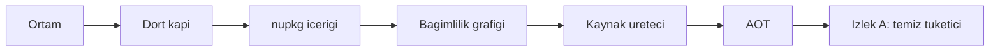

# 01 — Kurulum ve Paketleme (`PKG`)

> **Alan kodu:** `PKG` · **Faz:** 0, 52, 60, 182, 183, 185, 188, 189
> **Kaynak:** `global.json` · `NuGet.config` · `Directory.Build.props` ·
> `Directory.Build.targets` · `src/Directory.Build.props` · `src/*/*.csproj` ·
> `src/Tracon.Generators/` · `tests/Directory.Build.props` (TFM matrisi) ·
> `samples/Tracon.Samples.Net8Consumer`
>
> Ortam kurulumu, fixture verisi ve reset yordamı [`00-INDEKS.md`](00-INDEKS.md)'dedir.

> **Koşum kaydı ayrıdır:** son tur (2026-09-16):
> [`../arsiv/manuel-test-kosum-2026-09/01-KURULUM-VE-PAKETLEME.md`](../arsiv/manuel-test-kosum-2026-09/01-KURULUM-VE-PAKETLEME.md)
> — `Gerçek sonuç` ve `Durum` orada. Bu dosya **spesifikasyondur** ve
> her koşumda yeniden kullanılır. 2026-08-13 turunun kaydı silindi (K-847);
> tam metin: git show 64c8a103:docs/manuel-test/kosumlar/2026-08-13/01-KURULUM-VE-PAKETLEME.md

---

## Bu dosya neyi kanıtlar

Tracon bir NuGet paket ailesidir. Bu dosya **paketin kendisini** test eder:
derleme kapıları, üretilen `.nupkg` içeriği, bağımlılık grafiği, derleme anı
tanıları, AOT vaadi ve temiz bir tüketicinin ilk beş dakikası.

Bu dosya **kapıdır**. Burada bir case kalırsa sonraki hiçbir dosya anlamlı sonuç
vermez — paket yanlışsa üstündeki her şey yanlış zeminde koşar.



## Koşmadan önce

1. Repo temiz olmalıdır: `git status` çıktısı `docs/manuel-test/` dışında boş.
2. Bu dosya **veritabanı istemez**. PostgreSQL/SQL Server container'ları kapalı olabilir.
3. Çalışma dizinleri:
   - Repo: `/Users/farukatasoy/Desktop/projects/Tracon`
   - Temiz tüketici (İzlek A): `~/tracon-manuel/` — repo **dışında**
   - Yerel feed: `~/tracon-local-feed/`
4. Bu dosyadaki hiçbir case repo kaynağını kalıcı değiştirmez. Geçici dosya ekleyen
   case'ler son adımda onu siler.

> 🚨 **Her `dotnet pack` komutunun başına `MSBUILDDISABLENODEREUSE=1` yazılır.**
> Atlanırsa öksüz MSBuild düğümleri boruyu açık tutar ve komut dakikalarca asılı
> kalır (repo hafızasında ölçüldü: 8 dk+ → 18,5 sn).

---

# 1 — Ön koşullar

### MT-PKG-001 — SDK sürümü ve roll-forward politikası

| | |
|---|---|
| **İzlek** | A |
| **Önem** | Kritik |
| **İlgili faz** | Faz 0 |
| **İlgili karar** | — |

**Ön koşul**
- Repo kökünde bulunulur.

**Adımlar**
1. Yüklü SDK'ları listele.
2. Repo kökünde çözülen SDK sürümünü oku.
3. `global.json` içeriğini oku.

**Girilecek veri**
```bash
cd /Users/farukatasoy/Desktop/projects/Tracon
dotnet --list-sdks
dotnet --version
cat global.json
```

**Beklenen sonuç**
- `dotnet --version` çıktısı `10.0.1xx` bandındadır.
- `global.json` şu üç değeri taşır: `version: 10.0.100`, `rollForward: latestFeature`,
  `allowPrerelease: false`.
- `dotnet --version` bir önizleme (`-preview`, `-rc`) sürümü **döndürmez** —
  `allowPrerelease: false` bunu engeller.

---

### MT-PKG-002 — Node.js ve npm arayüz derlemesi için yeterli

| | |
|---|---|
| **İzlek** | A |
| **Önem** | Yüksek |
| **İlgili faz** | Faz 0, Faz 5 |
| **İlgili karar** | — |

**Ön koşul**
- Yok.

**Adımlar**
1. Node sürümünü oku.
2. npm sürümünü oku.

**Girilecek veri**
```bash
node --version
npm --version
```

**Beklenen sonuç**
- Node sürümü **20.19** veya üstüdür.
- `npm --version` sıfır çıkış kodu verir.

---

### MT-PKG-003 — Docker hazır ve `mssql/server` imajı arm64'te çekilebiliyor

| | |
|---|---|
| **İzlek** | A |
| **Önem** | Yüksek |
| **İlgili faz** | Faz 23 |
| **İlgili karar** | — |

Bu case yalnız **ortamı** doğrular. SQL Server davranışı
[`04-KALICILIK-DIGER.md`](04-KALICILIK-DIGER.md)'dedir.

**Ön koşul**
- Docker Desktop çalışır durumda.

**Adımlar**
1. Docker durumunu oku.
2. Makine mimarisini oku.
3. `mssql/server` imajını çek.

**Girilecek veri**
```bash
docker info --format '{{.ServerVersion}} · {{.NCPU}} CPU · {{.MemTotal}} bayt'
uname -m
docker pull mcr.microsoft.com/mssql/server:2022-latest
```

**Beklenen sonuç**
- `docker info` bellek değeri **8 GB veya üstünü** gösterir.
- `uname -m` çıktısı `arm64`'tür.
- `docker pull` başarılı biter. Başarısız olursa Docker Desktop →
  Settings → General → *Rosetta for x86/amd64 emulation* açılır ve tekrarlanır.
- Rosetta açılamıyorsa bu case `Atlandı` işaretlenir ve
  [`00-INDEKS.md`](00-INDEKS.md) §2.1'deki sapma notu uygulanır.

### MT-PKG-010 — Dört kapı sıfır uyarı verir

| | |
|---|---|
| **İzlek** | A |
| **Önem** | Kritik |
| **İlgili faz** | Faz 0 |
| **İlgili karar** | — |

**Ön koşul**
- Repo temiz (`git status` yalnız `docs/manuel-test/` gösterir).
- Docker çalışıyor (entegrasyon testleri container ister).

**Adımlar**
1. Çözümü derle.
2. Testleri koş.
3. Paketle.
4. Biçim denetimini koş.

**Girilecek veri**
```bash
cd /Users/farukatasoy/Desktop/projects/Tracon
dotnet build  Tracon.slnx -c Release
dotnet test   Tracon.slnx -c Release --no-build
MSBUILDDISABLENODEREUSE=1 dotnet pack Tracon.slnx -c Release --no-build
dotnet format Tracon.slnx --verify-no-changes --no-restore
```

**Beklenen sonuç**
- Dört komut da çıkış kodu `0` döndürür.
- `dotnet build` çıktısında `Warning(s)` sayısı **0**'dır.
- `dotnet test` çıktısında `failed` sayısı **0**'dır.
- `dotnet format` hiçbir dosya değişikliği bildirmez.
- Her komutun süresi not edilir. `dotnet test` **15 dakikayı** aşarsa bu bir
  kusurdur: asılı kalan alt süreç aranır (`ps aux | grep MSBuild`).
  🚨 Eşik **ölçülmüştür, tahmin değildir** (2026-09-19, `HATA-S1-003`): boş bir
  makinede tam koşum **10 dk 27 sn** sürdü — 22 proje · 7930 test · 0 düşen.
  Eski 2,5 dakikalık eşik set bu boyuta gelmeden önce yazılmıştı ve bugün
  **ulaşılamazdır**; tek başına `Tracon.AspNetCore.FunctionalTests` 3 dk 07 sn,
  `Tracon.Package.Tests` 1 dk 31 sn sürüyor. 15 dakika ölçülen süreye ~%45 pay
  bırakır. 🚨 **Ölçüm başka bir iş koşarken yapılmaz**: bu turda bir koşum,
  aynı anda koşan derlemeler yüzünden kirlendi ve iptal edildi.

---

### MT-PKG-011 — `dotnet format` build'in görmediğini yakalar

| | |
|---|---|
| **İzlek** | A |
| **Önem** | Yüksek |
| **İlgili faz** | Faz 0 |
| **İlgili karar** | — |

Sınır senaryosu. `dotnet build` yeşilken `dotnet format` kırmızı olabilir; bu
repo'da bir kez 276 `IDE0055` hatası bu şekilde çıktı.

**Ön koşul**
- MT-PKG-010 geçti.

**Adımlar**
1. Bir kaynak dosyasına bilerek bozuk girinti ekle.
2. Yalnız derle.
3. Biçim denetimini koş.
4. Değişikliği geri al.

**Girilecek veri**
```bash
cd /Users/farukatasoy/Desktop/projects/Tracon
printf '\ninternal static class BicimTesti\n{\n        public static int Deger => 1;\n}\n' \
  >> src/Tracon.Abstractions/Tools/TraconToolAttribute.cs

dotnet build  Tracon.slnx -c Release
dotnet format Tracon.slnx --verify-no-changes --no-restore ; echo "format cikis kodu: $?"

git checkout -- src/Tracon.Abstractions/Tools/TraconToolAttribute.cs
```

**Beklenen sonuç**
> **Düzeltildi (2026-08-15, KAPANIS-PLANI §8):** `Directory.Build.props:28`
> `EnforceCodeStyleInBuild=true` taşır (`AnalysisLevel=latest-recommended`
> ile birlikte) — bu, `dotnet build`'in KENDİSİNİN `IDE0055` gibi biçim
> kurallarını **derleme hatası** olarak raporladığı anlamına gelir. Yani
> "build yeşil / format kırmızı" durumu bu repoda **yapısal olarak
> imkânsızdır**: bozuk girintili bir satır eklendiğinde `dotnet build`
> kendisi `IDE0055` ile **kırmızı** çıkar, `dotnet format`'a hiç sıra
> gelmeden. `dotnet format` yalnız build'in YAKALAMADIĞI (derleyicinin
> görmediği) analyzer tanılarını yakalar — bu, dosyanın en üstündeki uyarı
> notuyla (`⚠️ dotnet format, dotnet build'in yakalamadığı analyzer
> tanılarını yakalayabilir`) tutarlıdır, ama BU case'in kurgusu ("build
> farkına varmaz, format yakalar") o notun kapsadığı senaryo değil — bugünkü
> yapılandırmada IDE0055 sınıfı için ikisi de aynı anda kırmızıdır.

~~Eski beklenti: `dotnet format` çıkış kodu sıfır değildir ve `IDE0055`
(veya kardeşi) bildirir; `dotnet build` bunu YAKALAMAZ (yeşil kalır). Son
adımdan sonra `git status` yalnız `docs/manuel-test/` gösterir.~~

---

### MT-PKG-012 — Uyarı gerçekten hataya dönüşüyor

| | |
|---|---|
| **İzlek** | A |
| **Önem** | Yüksek |
| **İlgili faz** | Faz 0 |
| **İlgili karar** | — |

Negatif senaryo. `TreatWarningsAsErrors=true` ve `WarningsNotAsErrors` boştur —
yani hiçbir uyarı muaf değildir. Bu iddia ölçülmeden kabul edilmez.

**Ön koşul**
- Repo temiz.

**Adımlar**
1. `Tracon.Core` içine, XML dokümanı olmayan bir public tip ekle.
2. Yalnız o projeyi derle.
3. Dosyayı sil.

**Girilecek veri**
```bash
cd /Users/farukatasoy/Desktop/projects/Tracon
cat > src/Tracon.Core/ManuelUyariTesti.cs <<'EOF'
namespace Tracon;

public sealed class ManuelUyariTesti
{
    public int Deger { get; set; }
}
EOF

dotnet build src/Tracon.Core -c Release ; echo "cikis kodu: $?"
rm src/Tracon.Core/ManuelUyariTesti.cs
```

**Beklenen sonuç**
- Derleme **başarısız** olur (çıkış kodu ≠ 0).
- Çıktıda `CS1591` **`error`** olarak görünür, `warning` olarak değil.
- Dosya silindikten sonra `dotnet build src/Tracon.Core -c Release` yeniden geçer.

---

### MT-PKG-013 — Senkronizasyon kopyası derlemeyi kırar, sessizce geçmez

| | |
|---|---|
| **İzlek** | A |
| **Önem** | Kritik |
| **İlgili faz** | Faz 29, 30, 41, 48 |
| **İlgili karar** | K-228 |

Negatif senaryo. `<ad> 2.cs` biçimindeki bulut senkronizasyon kopyaları bu repo'da
dört kez bedel ödetti. Bir kopya arayüzü **sessizce** boşaltabilir. Bu case
denetimin gerçekten çalıştığını kanıtlar.

**Ön koşul**
- MT-PKG-010 geçti.

**Adımlar**
1. Kopya denetimini çalıştır — temiz olmalı.
2. Bir `.cs` dosyasının kopyasını oluştur.
3. Derle.
4. Kopyayı sil ve denetimi tekrarla.

**Girilecek veri**
```bash
cd /Users/farukatasoy/Desktop/projects/Tracon
find src -name "* 2.*" -not -path "*/node_modules/*"          # bos olmali

cp src/Tracon.Abstractions/Tools/TraconToolAttribute.cs \
   "src/Tracon.Abstractions/Tools/TraconToolAttribute 2.cs"

dotnet build src/Tracon.Abstractions -c Release ; echo "cikis kodu: $?"

rm "src/Tracon.Abstractions/Tools/TraconToolAttribute 2.cs"
find src -name "* 2.*" -not -path "*/node_modules/*"          # yine bos olmali
```

**Beklenen sonuç**
- 1. adımdaki `find` **hiçbir şey** döndürmez.
- 3. adımdaki derleme `CS0101` (aynı ad alanında yinelenen tip) ile başarısız olur.
- 4. adımdan sonra `find` yine boştur ve
  `dotnet build src/Tracon.Abstractions -c Release` geçer.

---

### MT-PKG-014 — Hızlı iç döngü arayüz zincirini atlar

| | |
|---|---|
| **İzlek** | A |
| **Önem** | Orta |
| **İlgili faz** | Faz 5 |
| **İlgili karar** | — |

**Ön koşul**
- MT-PKG-010 geçti.

**Adımlar**
1. Arayüz kapalı biçimde derle ve süreyi ölç.
2. Çıktıda npm adımlarını ara.

**Girilecek veri**
```bash
cd /Users/farukatasoy/Desktop/projects/Tracon
time dotnet build Tracon.slnx -c Release -p:TraconFrontendEnabled=false 2>&1 \
  | grep -Ei "npm ci|npm run build|arayuz derleniyor" || echo "NPM ADIMI YOK - beklenen"
```

**Beklenen sonuç**
- Çıktı `NPM ADIMI YOK - beklenen` yazar.
- Derleme başarılı biter.
- Bu bayrakla derlenen çıktı ile **E2E testi koşulmaz** — arayüz varlığı yoktur.

---

### MT-PKG-015 — Arayüz varlığı yokken `pack` hata verir

| | |
|---|---|
| **İzlek** | A |
| **Önem** | Yüksek |
| **İlgili faz** | Faz 5 |
| **İlgili karar** | — |

Negatif senaryo. İçi boş bir arayüz paketi yayınlanamaz. Kod bunu iki seviyede
korur: derlemede `TRACON0002` uyarısı, `pack` aşamasında `TRACON0003` hatası.

**Ön koşul**
- MT-PKG-010 geçti.

**Adımlar**
1. Üretilmiş arayüz çıktısını ve damgayı geçici bir yere taşı.
2. `Tracon.UI` paketini, arayüz zinciri kapalıyken paketle.
3. Çıktıyı geri koy ve normal derlemeyle yeniden üret.

**Girilecek veri**
```bash
cd /Users/farukatasoy/Desktop/projects/Tracon
mv src/Tracon.UI/wwwroot /tmp/ap-wwwroot-yedek

MSBUILDDISABLENODEREUSE=1 dotnet pack src/Tracon.UI -c Release \
  -p:TraconFrontendEnabled=true --no-build -o /tmp/ap-ui-test 2>&1 | grep TRACON0003
echo "cikis kodu: $?"

mv /tmp/ap-wwwroot-yedek src/Tracon.UI/wwwroot
dotnet build src/Tracon.UI -c Release
```

**Beklenen sonuç**
- `pack` **başarısız** olur ve `TRACON0003` kodlu hata verir.
- Hata metni eksik varlığı ve çözümü adıyla taşır: `UI assets were not produced`
  (`wwwroot/index.html does not exist`) ve `Install Node.js 20.19+ and rebuild`.
  *(2026-09-16 turunda düzeltildi: metin İngilizce'dir; eski Türkçe alıntı bayattı.)*
- Son adımdan sonra `src/Tracon.UI/wwwroot/index.html` yeniden vardır.

> ⚠️ Bu case dosya taşır. Adım 3 **atlanmaz**; atlanırsa sonraki tüm arayüz
> dosyaları yanlış sonuç verir.

---

### MT-PKG-016 — Yayınlanabilir pakette `README.md` eksikse derleme durur

| | |
|---|---|
| **İzlek** | A |
| **Önem** | Yüksek |
| **İlgili faz** | Faz 0 |
| **İlgili karar** | — |

Negatif senaryo. NuGet paket sayfası `README.md` olmadan boş görünür.
`Directory.Build.targets` bunu `TRACON0001` ile erken yakalar.

**Ön koşul**
- Repo temiz.

**Adımlar**
1. `Tracon.Voice` paketinin `README.md` dosyasını geçici olarak taşı.
2. O projeyi paketle.
3. Dosyayı geri koy.

**Girilecek veri**
```bash
cd /Users/farukatasoy/Desktop/projects/Tracon
mv src/Tracon.Voice/README.md /tmp/ap-voice-readme.md

MSBUILDDISABLENODEREUSE=1 dotnet pack src/Tracon.Voice -c Release -o /tmp/ap-voice-test 2>&1 \
  | grep TRACON0001

mv /tmp/ap-voice-readme.md src/Tracon.Voice/README.md
```

**Beklenen sonuç**
- `pack` başarısız olur ve `TRACON0001` kodlu hata verir.
- Hata metni paket adını (`Tracon.Voice`) taşır.
- Dosya geri konduktan sonra aynı komut başarılı biter.

### MT-PKG-020 — Paket sayısı ve sembol paketi sayısı

| | |
|---|---|
| **İzlek** | A |
| **Önem** | Kritik |
| **İlgili faz** | Faz 0, 37 |
| **İlgili karar** | — |

`src/` altında 22 proje vardır. Biri (`Tracon.Generators`) `IsPackable=false`
taşır ve yayımlanmaz; `Tracon.Sql.Shared` de paket üretmez. `Tracon` (meta) ve
`Tracon.Templates` sembol paketi üretmez (`IncludeSymbols=false`,
`src/Tracon/Tracon.csproj:20` · `src/Tracon.Templates/Tracon.Templates.csproj:35`)
— içlerinde derlenen bir derleme yoktur.

*(2026-09-16 turunda güncellendi: 18 proje → 22; `Tracon.Cli`, `Tracon.Client`
ve `Tracon.Testing.Contracts.Xunit` sonradan eklendi.)*

**Ön koşul**
- Repo temiz.

**Adımlar**
1. Eski paket çıktısını temizle.
2. Çözümü paketle.
3. Üretilen dosyaları say.

**Girilecek veri**
```bash
cd /Users/farukatasoy/Desktop/projects/Tracon
rm -rf /tmp/ap-pack && mkdir -p /tmp/ap-pack

MSBUILDDISABLENODEREUSE=1 dotnet pack Tracon.slnx -c Release -o /tmp/ap-pack

echo "nupkg : $(ls /tmp/ap-pack/*.nupkg  | wc -l)"
echo "snupkg: $(ls /tmp/ap-pack/*.snupkg | wc -l)"
ls /tmp/ap-pack/*.nupkg | sed 's#.*/##' | sort
ls /tmp/ap-pack/*.nupkg | grep -i generators || echo "Generators yayimlanmadi - beklenen"
```

**Beklenen sonuç**
- **20** `.nupkg` üretilir.
- **18** `.snupkg` üretilir; eksik olan **ikisi** `Tracon` (meta) ve
  `Tracon.Templates`'tir — ikisi de `IncludeSymbols=false` taşır.
- `Tracon.Generators` hiçbir çıktı üretmez ve son satır
  `Generators yayimlanmadi - beklenen` yazar.
- Paket adları: `Tracon`, `.Abstractions`, `.Anthropic`, `.AspNetCore`,
  `.Azure`, `.Cli`, `.Client`, `.Core`, `.Google`, `.Mcp`, `.OpenAI`,
  `.PostgreSql`, `.SqlServer`, `.Sqlite`, `.Templates`, `.Testing`,
  `.Testing.Contracts.Xunit`, `.UI`, `.Voice`, `.Workflows`.
- `Tracon.Sql.Shared` bir paket **değildir** ve listede görünmez.

---

### MT-PKG-021 — 🚨 Kaynak üreteci `.nupkg` içinde taşınıyor mu

| | |
|---|---|
| **İzlek** | A |
| **Önem** | **Kritik** |
| **İlgili faz** | Faz 52 |
| **İlgili karar** | K-348 |

🚨 **Bu case bir şüphe üzerine yazıldı ve üretim oturumunda ölçüldü.** Ölçüm
şunu gösterdi: `--no-build` ile paketlenen `Tracon.Core`, üreteç DLL'ini
**taşımıyor**. Ayrıntı [`00-INDEKS.md`](00-INDEKS.md) §8'dedir. Koşum bu ölçümü
tekrarlar ve kapsamını kesinleştirir.

Etki: üreteç eksikse tüketicinin `AddGeneratedTools()` çağrısı `CS1061` verir.
Faz 52'nin bütün kazanımı bu tek dosyaya bağlıdır.

**Ön koşul**
- Repo temiz.

**Adımlar**
1. `Tracon.Core`'u tek başına, `--no-build` **olmadan** paketle ve içeriğe bak.
2. `Tracon.Core`'u tek başına, `--no-build` **ile** paketle ve içeriğe bak.
3. Çözüm genelinde, `--no-build` **olmadan** paketle ve içeriğe bak.
4. Çözüm genelinde, doğrulama kapısının kullandığı biçimde (`--no-build` ile)
   paketle ve içeriğe bak.

**Girilecek veri**
```bash
cd /Users/farukatasoy/Desktop/projects/Tracon
dotnet build Tracon.slnx -c Release

for etiket in "tek-build" "tek-nobuild" "cozum-build" "cozum-nobuild"; do
  rm -rf "/tmp/ap-$etiket" && mkdir -p "/tmp/ap-$etiket"
done

MSBUILDDISABLENODEREUSE=1 dotnet pack src/Tracon.Core -c Release            -o /tmp/ap-tek-build
MSBUILDDISABLENODEREUSE=1 dotnet pack src/Tracon.Core -c Release --no-build -o /tmp/ap-tek-nobuild
MSBUILDDISABLENODEREUSE=1 dotnet pack Tracon.slnx     -c Release            -o /tmp/ap-cozum-build
MSBUILDDISABLENODEREUSE=1 dotnet pack Tracon.slnx     -c Release --no-build -o /tmp/ap-cozum-nobuild

for etiket in "tek-build" "tek-nobuild" "cozum-build" "cozum-nobuild"; do
  printf '%-16s ' "$etiket"
  unzip -l /tmp/ap-$etiket/Tracon.Core.*.nupkg \
    | grep -c "analyzers/dotnet/cs/Tracon.Generators.dll"
done
```

**Beklenen sonuç**
- Dört satırın **dördü de** `1` yazmalıdır.
- Herhangi biri `0` yazarsa case **Kaldı**'dır ve `Kritik` bir hata bildirimi
  açılır. Bugünkü ölçüm `tek-nobuild` için `0` bekliyor — bu doğrulanırsa
  yayın **durur**.
- `1` yazan çıktıda DLL boyutu ~53 KB'dir.

**Doğrulama sorgusu**
```bash
unzip -l /tmp/ap-cozum-nobuild/Tracon.Core.*.nupkg | grep analyzers
```

---

### MT-PKG-022 — Her pakette üç TFM ve XML dokümanı var

| | |
|---|---|
| **İzlek** | A |
| **Önem** | Yüksek |
| **İlgili faz** | Faz 0 |
| **İlgili karar** | K-005 |

**Ön koşul**
- MT-PKG-020 koşuldu, `/tmp/ap-pack` dolu.

**Adımlar**
1. `Tracon.Core` paketinin dosya listesini oku.
2. Tek TFM'li paketleri ayrı doğrula.

**Girilecek veri**
```bash
unzip -l /tmp/ap-pack/Tracon.Core.*.nupkg    | grep -E "lib/|README"
unzip -l /tmp/ap-pack/Tracon.Testing.*.nupkg | grep -E "lib/"
unzip -l /tmp/ap-pack/Tracon.*.nupkg         2>/dev/null | head -1
```

**Beklenen sonuç**
- `Tracon.Core` şunları içerir: `lib/net8.0/`, `lib/net9.0/`, `lib/net10.0/` —
  her birinde `Tracon.Core.dll` **ve** `Tracon.Core.xml`.
- Paket kökünde `README.md` vardır.
- `Tracon.Testing` de üç TFM'in üçünü birden içerir — K-780 ile K-270'in
  tek-TFM daralması **kaldırıldı**; test paketi çalışma paketleriyle aynı
  matrisi hedefler. *(2026-09-16 turunda düzeltildi: eski beklenti
  "yalnız `lib/net10.0/`, tek TFM, bilinçli" idi.)*
- `Tracon` (meta) hiçbir `lib/` klasörü içermez.

---

### MT-PKG-023 — nuspec üstverisi eksiksiz

| | |
|---|---|
| **İzlek** | A |
| **Önem** | Yüksek |
| **İlgili faz** | Faz 0 |
| **İlgili karar** | — |

**Ön koşul**
- `/tmp/ap-pack` dolu.

**Adımlar**
1. `Tracon.Core` paketinden nuspec'i çıkar.
2. Üstveri alanlarını oku.

**Girilecek veri**
```bash
cd /tmp && rm -rf ap-nuspec && mkdir ap-nuspec && cd ap-nuspec
unzip -o /tmp/ap-pack/Tracon.Core.*.nupkg "*.nuspec" > /dev/null
cat Tracon.Core.nuspec
```

**Beklenen sonuç**
> **Düzeltildi (2026-08-15, KAPANIS-PLANI §8):** `<requireLicenseAcceptance>`
> elementi nuspec'e hiç yazılmaz (2026-08-15 koşumunda `Tracon.Core
> 0.0.0-preview.0.166` nuspec'inde de doğrulandı — element yok). NuGet bu
> yokluğu `false` olarak yorumlar, yani davranışsal etki yoktur; dokümanın
> "vardır" iddiası koda göre düzeltildi.

~~Eski beklenti: `<requireLicenseAcceptance>false</requireLicenseAcceptance>`
vardır.~~
- `<license type="file">LICENSE.md</license>` vardır (Faz 160). PolyForm OSI
  onaylı olmadığı için `expression` kullanılamaz; lisans dosya olarak gömülür.
- `<requireLicenseAcceptance>true</requireLicenseAcceptance>` vardır — PolyForm
  lisanslı paketlerde element **yazılır**. MIT üçlüsünde yazılmaz (üstteki not).
- `<readme>README.md</readme>` vardır.
- `<authors>Faruk Atasoy</authors>` ve `<projectUrl>` /
  `<repository type="git" url="https://github.com/farukatasoy/Tracon">` vardır.
- `<repository>` düğümü **boş olmayan** bir `commit` niteliği taşır.
- `<tags>` içinde `tracon ai agents microsoft-agent-framework llm dotnet`
  geçer.
- 🚨 Hiçbir alan `TODO`, `placeholder` veya boş dize taşımaz.

---

### MT-PKG-024 — Sembol paketi taşınabilir PDB taşır

| | |
|---|---|
| **İzlek** | A |
| **Önem** | Orta |
| **İlgili faz** | Faz 0 |
| **İlgili karar** | — |

**Ön koşul**
- `/tmp/ap-pack` dolu.

**Adımlar**
1. `Tracon.Core` sembol paketinin içeriğini listele.

**Girilecek veri**
```bash
unzip -l /tmp/ap-pack/Tracon.Core.*.snupkg | grep -E "\.pdb|\.nuspec"
```

**Beklenen sonuç**
- Üç TFM için birer `.pdb` dosyası vardır (`lib/net8.0/`, `lib/net9.0/`, `lib/net10.0/`).
- Paket uzantısı `.snupkg`'dir (`.symbols.nupkg` değil).

---

### MT-PKG-025 — Deterministik build: iki paketleme aynı derlemeyi üretir

| | |
|---|---|
| **İzlek** | A |
| **Önem** | Orta |
| **İlgili faz** | Faz 0 |
| **İlgili karar** | — |

Sınır senaryosu. `Deterministic=true` aynı girdiden aynı çıktıyı vaat eder.
Karşılaştırma `.nupkg` üzerinde değil, içindeki **derleme** üzerinde yapılır —
zip zaman damgası her seferinde değişir.

**Ön koşul**
- Repo temiz. `git status` yalnız `docs/manuel-test/` gösterir.

**Adımlar**
1. Birinci kez paketle ve `Tracon.Abstractions.dll` özetini al.
2. Ara çıktıyı sil.
3. İkinci kez paketle ve özeti tekrar al.
4. İki özeti karşılaştır.

**Girilecek veri**
```bash
cd /Users/farukatasoy/Desktop/projects/Tracon
ozet() {
  rm -rf /tmp/ap-det && mkdir -p /tmp/ap-det && cd /tmp/ap-det
  unzip -o "$1"/Tracon.Abstractions.*.nupkg "lib/net10.0/*.dll" > /dev/null
  shasum -a 256 lib/net10.0/Tracon.Abstractions.dll | cut -d' ' -f1
  cd /Users/farukatasoy/Desktop/projects/Tracon
}

rm -rf /tmp/ap-d1 /tmp/ap-d2
MSBUILDDISABLENODEREUSE=1 dotnet pack src/Tracon.Abstractions -c Release -o /tmp/ap-d1
A=$(ozet /tmp/ap-d1)

rm -rf artifacts/obj/Tracon.Abstractions
MSBUILDDISABLENODEREUSE=1 dotnet pack src/Tracon.Abstractions -c Release -o /tmp/ap-d2
B=$(ozet /tmp/ap-d2)

echo "1: $A"; echo "2: $B"; [ "$A" = "$B" ] && echo "AYNI" || echo "🚨 FARKLI"
```

**Beklenen sonuç**
- Çıktı `AYNI` yazar.
- `FARKLI` çıkarsa gömülü mutlak yol veya zaman damgası aranır.

---

### MT-PKG-026 — Şablon paketi doğru biçimde kurulur

| | |
|---|---|
| **İzlek** | A |
| **Önem** | Yüksek |
| **İlgili faz** | Faz 37 |
| **İlgili karar** | — |

`.template.config` klasörü nokta ile başlar. `NoDefaultExcludes` olmadan pakete
hiç girmez ve `dotnet new install` **sessizce çalışmayan** bir paket kurar.

**Ön koşul**
- `/tmp/ap-pack` dolu.

**Adımlar**
1. Şablon paketinin içeriğini listele.
2. nuspec'te paket tipini oku.

**Girilecek veri**
```bash
unzip -l /tmp/ap-pack/Tracon.Templates.*.nupkg | grep -E "template.config|content/"
cd /tmp && rm -rf ap-tpl && mkdir ap-tpl && cd ap-tpl
unzip -o /tmp/ap-pack/Tracon.Templates.*.nupkg "*.nuspec" > /dev/null
grep -E "packageType|<readme>" Tracon.Templates.nuspec
```

**Beklenen sonuç**
- `content/Tracon.Starter/.template.config/template.json` **ve**
  `dotnetcli.host.json` paket içindedir.
- `content/Tracon.Starter/.gitignore` paket içindedir.
- Yollar tek katmanlıdır: `content/content/...` **yoktur**.
- nuspec `<packageType name="Template" ...>` taşır.
- Paket hiçbir `lib/` klasörü içermez.

---

### MT-PKG-027 — Sürüm git etiketinden gelir

| | |
|---|---|
| **İzlek** | A |
| **Önem** | Orta |
| **İlgili faz** | Faz 0 |
| **İlgili karar** | — |

Sınır senaryosu. Bugün repo'da **hiç etiket yoktur**; MinVer taban sürümü ve
commit yüksekliğini kullanır. Yayın anında bu davranış değişir.

**Ön koşul**
- Repo temiz. Bu case yerel bir etiket oluşturur ve **siler**.

**Adımlar**
1. Etiketsiz durumdaki sürümü oku.
2. Geçici bir sürüm etiketi at.
3. Sürümü yeniden oku.
4. Etiketi sil ve ilk sürümün geri geldiğini doğrula.

**Girilecek veri**
```bash
cd /Users/farukatasoy/Desktop/projects/Tracon
git tag                                     # bos olmali

MSBUILDDISABLENODEREUSE=1 dotnet pack src/Tracon.Abstractions -c Release -o /tmp/ap-v1
ls /tmp/ap-v1/*.nupkg | sed 's#.*/##'

git tag v1.0.0-preview.1
MSBUILDDISABLENODEREUSE=1 dotnet pack src/Tracon.Abstractions -c Release -o /tmp/ap-v2
ls /tmp/ap-v2/*.nupkg | sed 's#.*/##'

git tag -d v1.0.0-preview.1

# 🚨 TEMIZLIK - ATLANMAZ. Etiketli pack, surumu artifacts/package/release'e de
# birakir ve orayi feed olarak kullanan MT-PKG-093/094'u KIRAR (2026-09-16'da
# olculdu: NU1603, Abstractions 1.0.0-preview.1 cozuldu).
rm -f artifacts/package/release/*1.0.0-preview.1.*   # repo kokunden, serit worktree'sinde de dogru
```

**Beklenen sonuç**
- Etiketsiz sürüm `0.0.0-preview.0.<N>` biçimindedir; `<N>` commit sayısıdır.
- Etiketten sonra sürüm tam olarak `1.0.0-preview.1`'dir.
- `git tag -d` sonrası `git tag` yine boştur.

### MT-PKG-030 — Meta paket yalnız altı bileşen getirir

| | |
|---|---|
| **İzlek** | A |
| **Önem** | Yüksek |
| **İlgili faz** | Faz 0 |
| **İlgili karar** | K-185 |

Tasarım kuralı: PostgreSQL kullanmayan tüketici `Npgsql`'i çekmez, Gemini
kullanmayan tüketici `Google.Apis.Auth` zincirini almaz.

**Ön koşul**
- `/tmp/ap-pack` dolu.

**Adımlar**
1. Meta paketin nuspec bağımlılıklarını oku.

**Girilecek veri**
```bash
cd /tmp && rm -rf ap-meta && mkdir ap-meta && cd ap-meta
unzip -o /tmp/ap-pack/Tracon.0.*.nupkg "*.nuspec" > /dev/null
grep -E "<dependency id=" Tracon.nuspec | sort -u
```

**Beklenen sonuç**
- Yalnız şu altı bağımlılık görünür: `Tracon.AspNetCore`, `Tracon.Mcp`,
  `Tracon.OpenAI`, `Tracon.PostgreSql`, `Tracon.UI`,
  `Tracon.Workflows`.
- Şunlar **görünmez**: `Tracon.SqlServer`, `Tracon.Sqlite`,
  `Tracon.Anthropic`, `Tracon.Google`, `Tracon.Azure`,
  `Tracon.Voice`, `Tracon.Testing`, `Tracon.Templates`.

---

### MT-PKG-031 — Geçişli sabitleme kapalı: grafik kirlenmiyor

| | |
|---|---|
| **İzlek** | A |
| **Önem** | Yüksek |
| **İlgili faz** | Faz 0 |
| **İlgili karar** | K-007 |

Sınır senaryosu. `CentralPackageTransitivePinningEnabled=true` olsaydı
`Tracon.PostgreSql` 13 doğrudan bağımlılık bildirirdi. Kapalıyken 2 bekleniyor.

**Ön koşul**
- `/tmp/ap-pack` dolu.

**Adımlar**
1. `Tracon.PostgreSql` nuspec'inin `net10.0` grubunu oku.
2. `Tracon.Abstractions` için tekrarla.

**Girilecek veri**
```bash
cd /tmp && rm -rf ap-dep && mkdir ap-dep && cd ap-dep
unzip -o /tmp/ap-pack/Tracon.PostgreSql.*.nupkg   "*.nuspec" > /dev/null
unzip -o /tmp/ap-pack/Tracon.Abstractions.*.nupkg "*.nuspec" > /dev/null

echo "--- PostgreSql"   && grep -A20 'targetFramework="net10.0"' Tracon.PostgreSql.nuspec   | grep "dependency id"
echo "--- Abstractions" && grep -A20 'targetFramework="net10.0"' Tracon.Abstractions.nuspec | grep "dependency id"
```

**Beklenen sonuç**
- `Tracon.PostgreSql` **2** bağımlılık bildirir: `Tracon.Core` ve `Npgsql`.
- `Tracon.Abstractions` **2** bağımlılık bildirir:
  `Microsoft.Agents.AI.Abstractions` ve `Microsoft.Extensions.AI.Abstractions`.
- Hiçbirinde `OpenTelemetry.Api`, `OpenAI` gibi geçişli paketler **görünmez**.

---

### MT-PKG-032 — Önsürüm MAF paketleri yalnız `Tracon.AspNetCore`'da

| | |
|---|---|
| **İzlek** | A |
| **Önem** | **Kritik** |
| **İlgili faz** | Faz 0 |
| **İlgili karar** | K-008 |

Negatif senaryo. Bir önsürüm bağımlılığının `Core`'a veya `Abstractions`'a
sızması, kararlı bir 1.0 verilmesini imkânsız kılar.

**Ön koşul**
- `/tmp/ap-pack` dolu.

**Adımlar**
1. Her paketin nuspec'inde önsürüm sürüm dizgisi ara.

**Girilecek veri**
```bash
cd /tmp && rm -rf ap-pre && mkdir ap-pre && cd ap-pre
for f in /tmp/ap-pack/*.nupkg; do
  ad=$(basename "$f" .nupkg)
  unzip -p "$f" "*.nuspec" 2>/dev/null \
    | grep -E 'dependency id="(Microsoft\.Agents|A2A)' \
    | grep -E 'preview|alpha|rc|beta' \
    | sed "s#^#$ad : #"
done
```

**Beklenen sonuç**
- Çıktının **her** satırı `Tracon.AspNetCore` ile başlar.
- `Tracon.Core`, `Tracon.Abstractions`, `Tracon.PostgreSql`,
  `Tracon.OpenAI` hiçbir satırda görünmez.
- Beklenen önsürüm paketleri: `Microsoft.Agents.AI.Hosting`,
  `Microsoft.Agents.AI.Hosting.OpenAI`, `Microsoft.Agents.AI.Hosting.A2A`,
  `Microsoft.Agents.AI.Hosting.AspNetCore`, `A2A.AspNetCore`.

---

### MT-PKG-033 — Roslyn tüketicinin grafiğine sızmıyor

| | |
|---|---|
| **İzlek** | A |
| **Önem** | Yüksek |
| **İlgili faz** | Faz 52 |
| **İlgili karar** | K-348, K-349 |

Negatif senaryo. Üreteç `Microsoft.CodeAnalysis.CSharp 4.8.0`'a bağlıdır. Bu
bağımlılık tüketiciye geçerse ağır ve gereksiz bir yük olur.

**Ön koşul**
- `/tmp/ap-pack` dolu.

**Adımlar**
1. Tüm nuspec'lerde `CodeAnalysis` ara.

**Girilecek veri**
```bash
for f in /tmp/ap-pack/*.nupkg; do
  unzip -p "$f" "*.nuspec" 2>/dev/null | grep -i "CodeAnalysis" \
    && echo "🚨 $(basename $f)"
done
echo "tarama bitti"
```

**Beklenen sonuç**
- Hiçbir `🚨` satırı yazılmaz; yalnız `tarama bitti` görünür.
- `Microsoft.CodeAnalysis.CSharp` hiçbir pakette bağımlılık olarak görünmez.

---

### MT-PKG-034 — Ağır sağlayıcı zincirleri kendi paketlerinde kalıyor

| | |
|---|---|
| **İzlek** | A |
| **Önem** | Orta |
| **İlgili faz** | Faz 26 |
| **İlgili karar** | K-205 |

`Google.GenAI`, `Google.Apis.Auth` üzerinden `Newtonsoft.Json`,
`System.Management` ve `System.CodeDom` getirir. Bu yük yalnız Gemini
kullananları ilgilendirir.

**Ön koşul**
- `/tmp/ap-pack` dolu.

**Adımlar**
1. Sağlayıcı SDK'larının hangi paketlerde bildirildiğini ara.

**Girilecek veri**
```bash
for f in /tmp/ap-pack/*.nupkg; do
  ad=$(basename "$f" .nupkg | sed 's/\.0\.0\.0.*//')
  unzip -p "$f" "*.nuspec" 2>/dev/null \
    | grep -E 'dependency id="(Google\.GenAI|Anthropic|OpenAI|Npgsql|Microsoft\.Data\.SqlClient)"' \
    | sed "s#^#$ad : #"
done
```

**Beklenen sonuç**
- `Google.GenAI` yalnız `Tracon.Google`'da görünür.
- `Anthropic` yalnız `Tracon.Anthropic`'te görünür.
- `Npgsql` yalnız `Tracon.PostgreSql`'de görünür.
- `Microsoft.Data.SqlClient` yalnız `Tracon.SqlServer`'da görünür.
- Hiçbiri meta pakette (`Tracon`) görünmez.

## Üreteç bölümünün ön koşulu (`MT-PKG-040`..`050`, `060`, `061`)

> **2026-09-16 turunda GERİ GETİRİLDİ.** Bu blok `946a37fb` ("faz 58",
> spec/kayıt ayrımı) ile bölüm başlıklarıyla birlikte spec'ten düşmüştü;
> ardındaki sekiz case "Bölüm ön koşulu uygulandı" diyor ama ön koşul
> dosyada yoktu — yani koşulamaz durumdaydılar. Tam metin:
> `git show 946a37fb~1:docs/manuel-test/01-KURULUM-VE-PAKETLEME.md | sed -n '1337,1365p'`
> (eski ürün adıyla). Aşağısı bugünkü adlara çevrilmiş hâlidir.

Bu case'ler repo **dışında**, izole bir tüketici projesinde koşar. Böylece
repo'nun `ProjectReference` zinciri sonucu bulandırmaz.

> **Bölüm ön koşulu (bir kez uygulanır):**
> ```bash
> cd /Users/farukatasoy/Desktop/projects/Tracon
> rm -rf /tmp/ap-pack && mkdir -p /tmp/ap-pack
> MSBUILDDISABLENODEREUSE=1 dotnet pack Tracon.slnx -c Release -o /tmp/ap-pack
>
> rm -rf ~/tracon-manuel/uretec && mkdir -p ~/tracon-manuel/uretec
> cd ~/tracon-manuel/uretec
> dotnet new console -o . --force
> cat > nuget.config <<'EOF'
> <?xml version="1.0" encoding="utf-8"?>
> <configuration>
>   <packageSources>
>     <clear />
>     <add key="nuget.org" value="https://api.nuget.org/v3/index.json" protocolVersion="3" />
>     <add key="ap-yerel" value="/tmp/ap-pack" />
>   </packageSources>
> </configuration>
> EOF
> SURUM=$(ls /tmp/ap-pack/Tracon.Core.*.nupkg | sed 's#.*Tracon.Core\.##;s#\.nupkg##')
> dotnet add package Tracon.Core --version "$SURUM"
> ```
> 🚨 `Tracon.Core` **doğrudan** `PackageReference` ile alınır. MT-PKG-021
> bunun neden önemli olduğunu ölçer.

### MT-PKG-040 — Üreteç işaretli statik metodu kaydeder

| | |
|---|---|
| **İzlek** | A |
| **Önem** | Kritik |
| **İlgili faz** | Faz 52 |
| **İlgili karar** | K-350 |

**Ön koşul**
- Bölüm ön koşulu uygulandı.

**Adımlar**
1. İşaretli bir tool sınıfı yaz.
2. Üretilen kodu diske yazdırarak derle.
3. Üretilen dosyayı oku.

**Girilecek veri**
```bash
cd ~/tracon-manuel/uretec
cat > Tools.cs <<'EOF'
using Tracon;

internal static class SiparisTools
{
    [TraconTool("get_order_status", "Bir siparisin kargo durumunu dondurur.")]
    public static string GetOrderStatus(string orderId) => $"{orderId}: kargoda";
}
EOF

dotnet build -c Release \
  -p:EmitCompilerGeneratedFiles=true \
  -p:CompilerGeneratedFilesOutputPath=obj/generated

find obj/generated -name "*.g.cs" | head
cat $(find obj/generated -name "TraconGeneratedTools.g.cs" | head -1)
```

**Beklenen sonuç**
- Derleme sıfır **hata** ile biter. Tek uyarı `TRC0009`'dur ve beklenir:
  bu case'in fixture kodu `orderId` parametresine `[Description]` koymaz.
  *(2026-09-16 turunda düzeltildi: eski beklenti "sıfır uyarı" idi; `TRC0009`
  Faz 125'te eklendi ve spec ondan eskidir.)*
- **İki** dosya üretilir: `TraconGeneratedTools.g.cs` (kayıt listesi) ve tool
  başına bir tip dosyası — `<Metot>_<hash>Tool.g.cs`.
  *(2026-09-16: üreteç eskiden tek dosya üretiyordu.)*
- `TraconGeneratedTools.g.cs`'in ilk satırı `// <auto-generated/>`'dır.
- O dosya `AddGeneratedTools` adlı bir uzantı metodu tanımlar
  (`namespace Tracon`).
- `get_order_status` dizgisi **tool tipi dosyasında** geçer
  (`public override string Name => "get_order_status";`) — kayıt listesinde
  değil, orada yalnız üretilen tipin adı vardır.
- Üretilen dosyaların **hiçbirinde** `System.Reflection`, `Activator.`,
  `GetMethod(` ve `AIFunctionFactory` dizgileri geçmez.

---

### MT-PKG-041 — Üretilen kod `dotnet format` kapısını geçer

| | |
|---|---|
| **İzlek** | A |
| **Önem** | Yüksek |
| **İlgili faz** | Faz 52 |
| **İlgili karar** | — |

Sınır senaryosu. Üretilen kod tüketicinin biçim kapısını kırarsa paket
kullanılamaz hâle gelir.

**Ön koşul**
- MT-PKG-040 geçti.

**Adımlar**
1. Tüketici projesinde biçim denetimini koş.
2. Üretilen dosyada TAB ve satır sonu boşluğu ara.

**Girilecek veri**
```bash
cd ~/tracon-manuel/uretec
dotnet format --verify-no-changes --no-restore ; echo "format cikis kodu: $?"

# 🚨 grep -P macOS'un BSD grep'inde YOKTUR (2026-09-16'da olculdu: "invalid
# option -- P"). Once sessizce "temiz" gibi gorunuyordu -- grep hata verince
# || dali calisiyordu. Tasinabilir bicim, uretilen TUM dosyalar icin:
for G in $(find obj/generated -name "*.g.cs"); do
  printf '%s -> TAB:%s satir-sonu:%s\n' "$(basename $G)" \
    "$(grep -c "$(printf '\t')" "$G")" "$(grep -cE '[[:space:]]+$' "$G")"
done
```

**Beklenen sonuç**
- `dotnet format` çıkış kodu **0**'dır.
- Üretilen her dosya için `TAB:0` ve `satir-sonu:0` yazar.

---

### MT-PKG-042 — `TRC0001`: aynı tool adı iki metotta

| | |
|---|---|
| **İzlek** | A |
| **Önem** | Yüksek |
| **İlgili faz** | Faz 52 |
| **İlgili karar** | — |

Negatif senaryo. Bugüne kadar hiçbir yerde yakalanmıyordu; son kayıt sessizce
kazanabiliyordu.

**Ön koşul**
- Bölüm ön koşulu uygulandı.

**Adımlar**
1. Aynı adı iki metoda ver.
2. Derle.
3. Dosyayı sil.

**Girilecek veri**
```bash
cd ~/tracon-manuel/uretec
cat > Hata.cs <<'EOF'
using Tracon;

internal static class CakisanTools
{
    [TraconTool("ayni_ad", "Birinci.")]
    public static string Bir(string a) => a;

    [TraconTool("ayni_ad", "Ikinci.")]
    public static string Iki(string a) => a;
}
EOF

dotnet build -c Release 2>&1 | grep -E "TRC0001|error"
rm Hata.cs
```

**Beklenen sonuç**
- Derleme **başarısız** olur.
- `TRC0001` **error** olarak çıkar.
- Mesaj `ayni_ad` adını ve **iki** metodu birden listeler
  (`CakisanTools.Bir, CakisanTools.Iki`).
- Tanı iki ayrı konumda birden bildirilir.

---

### MT-PKG-043 — `TRC0002`: geçersiz karakterli tool adı

| | |
|---|---|
| **İzlek** | A |
| **Önem** | Yüksek |
| **İlgili faz** | Faz 52 |
| **İlgili karar** | — |

Negatif ve sınır senaryosu. Kural: 1–64 karakter, yalnız harf, rakam, `_` ve `-`.

**Ön koşul**
- Bölüm ön koşulu uygulandı.

**Adımlar**
1. Üç geçersiz ad dene: boşluklu, nokta içeren, 65 karakter.
2. Derle.
3. Sınırın tam üstünü (64 karakter) ayrı dene.
4. Dosyaları sil.

**Girilecek veri**
```bash
cd ~/tracon-manuel/uretec
cat > Hata.cs <<'EOF'
using Tracon;

internal static class KotuAdTools
{
    [TraconTool("get order", "Bosluk var.")]
    public static string A(string x) => x;

    [TraconTool("get.order", "Nokta var.")]
    public static string B(string x) => x;

    [TraconTool("aaaaaaaaaabbbbbbbbbbccccccccccddddddddddeeeeeeeeeeffffffffffggggg", "65 karakter.")]
    public static string C(string x) => x;
}
EOF
dotnet build -c Release 2>&1 | grep -c "TRC0002"

cat > Hata.cs <<'EOF'
using Tracon;

internal static class SinirAdTools
{
    [TraconTool("aaaaaaaaaabbbbbbbbbbccccccccccddddddddddeeeeeeeeeeffffffffffgggg", "64 karakter - gecerli.")]
    public static string D(string x) => x;
}
EOF
dotnet build -c Release 2>&1 | grep -c "TRC0002"

rm Hata.cs
```

**Beklenen sonuç**
- Birinci derleme **3** `TRC0002` tanısı üretir ve başarısız olur.
- İkinci derleme **0** `TRC0002` üretir ve başarılı biter — 64 karakter geçerlidir.
- Mesaj hem metot adını hem geçersiz tool adını taşır.

---

### MT-PKG-044 — `TRC0003`: desteklenmeyen parametre tipi

| | |
|---|---|
| **İzlek** | A |
| **Önem** | Yüksek |
| **İlgili faz** | Faz 52 |
| **İlgili karar** | K-351 |

Negatif senaryo. Beyaz liste `record`/`class` tiplerini **kapsamaz**; bu bilinçli
bir sınırdır ve tanı kaçış yolunu göstermelidir.

**Ön koşul**
- Bölüm ön koşulu uygulandı.

**Adımlar**
1. Bir `record` parametreli tool yaz.
2. Derle.
3. Beyaz listedeki tipleri ayrı bir dosyada dene.
4. Dosyaları sil.

**Girilecek veri**
```bash
cd ~/tracon-manuel/uretec
cat > Hata.cs <<'EOF'
using Tracon;

internal sealed record Siparis(string Id, int Adet);

internal static class BilesikTools
{
    [TraconTool("siparis_ver", "Bilesik tip - desteklenmez.")]
    public static string SiparisVer(Siparis siparis) => siparis.Id;
}
EOF
dotnet build -c Release 2>&1 | grep "TRC0003"

cat > Hata.cs <<'EOF'
using System;
using System.Collections.Generic;
using System.Threading;
using Tracon;

internal enum Oncelik { Dusuk, Yuksek }

internal static class BeyazListeTools
{
    [TraconTool("beyaz_liste", "Desteklenen tiplerin tamami.")]
    public static string Hepsi(
        string a, int b, long c, double d, decimal e, bool f,
        Guid g, DateTime h, DateTimeOffset i, Oncelik j,
        int? k, string[] l, IReadOnlyList<int> m, CancellationToken ct) => a;
}
EOF
dotnet build -c Release 2>&1 | grep -c "TRC0003"

rm Hata.cs
```

**Beklenen sonuç**
- Birinci derleme başarısız olur ve `TRC0003` verir.
- `TRC0003` mesajı desteklenen tipleri **listeler** ve
  `AddTool(AIFunctionFactory.Create(...))` kaçış yolunu gösterir.
- İkinci derleme **0** `TRC0003` üretir ve başarılı biter.
- İkinci derlemede `CancellationToken` bir tool parametresi olarak kabul edilir.

---

### MT-PKG-045 — `TRC0004`: generic metot tool olamaz

| | |
|---|---|
| **İzlek** | A |
| **Önem** | Orta |
| **İlgili faz** | Faz 52 |
| **İlgili karar** | — |

Negatif senaryo. Bu hata daha önce **çalışma anında** çıkıyordu.

**Ön koşul**
- Bölüm ön koşulu uygulandı.

**Adımlar**
1. Generic bir tool metodu yaz.
2. Derle.
3. Dosyayı sil.

**Girilecek veri**
```bash
cd ~/tracon-manuel/uretec
cat > Hata.cs <<'EOF'
using Tracon;

internal static class GenericTools
{
    [TraconTool("generic_tool", "Generic - desteklenmez.")]
    public static string Getir<T>(string id) => id;
}
EOF
dotnet build -c Release 2>&1 | grep "TRC0004"
rm Hata.cs
```

**Beklenen sonuç**
- Derleme başarısız olur ve `TRC0004` **error** verir.
- Mesaj somut bir sarmalayıcı metot yazmayı önerir.

---

### MT-PKG-046 — `TRC0005`: çağrı var, işaretli metot yok

| | |
|---|---|
| **İzlek** | A |
| **Önem** | Orta |
| **İlgili faz** | Faz 52 |
| **İlgili karar** | — |

Negatif senaryo. Sessiz atlama yasaktır: `AddGeneratedTools()` çağrıldığı hâlde
hiç tool yoksa derleme durur.

**Ön koşul**
- Bölüm ön koşulu uygulandı. `Tools.cs` **silinmiş** olmalıdır.

**Adımlar**
1. İşaretli tool bırakma.
2. `AddGeneratedTools()` çağıran bir kurulum yaz.
3. Derle.
4. Dosyaları eski hâline getir.

**Girilecek veri**
```bash
cd ~/tracon-manuel/uretec
mv Tools.cs /tmp/ap-tools-yedek.cs

cat > Program.cs <<'EOF'
using Tracon;
using Microsoft.Extensions.DependencyInjection;

var services = new ServiceCollection();
services.AddTracon().AddGeneratedTools();
EOF

dotnet build -c Release 2>&1 | grep "TRC0005"

mv /tmp/ap-tools-yedek.cs Tools.cs
```

**Beklenen sonuç**
- Derleme başarısız olur ve `TRC0005` **error** verir.
- Mesaj iki çözüm önerir: metotları işaretlemek veya çağrıyı kaldırmak.
- `Tools.cs` geri konduktan sonra aynı derleme geçer.

---

### MT-PKG-047 — `TRC0006`: açıklama eksik — hata değil, uyarı

| | |
|---|---|
| **İzlek** | A |
| **Önem** | Orta |
| **İlgili faz** | Faz 52 |
| **İlgili karar** | — |

Sınır senaryosu. Bir kütüphane, tüketicinin derlemesini kırma hakkını dikkatli
kullanır. `TRC0006` tek **uyarı** seviyeli tanıdır ve bastırılabilir olmalıdır.

**Ön koşul**
- Bölüm ön koşulu uygulandı.

**Adımlar**
1. Açıklamasız bir tool yaz.
2. Derle ve tanının seviyesini oku.
3. Tanıyı bastırarak derle.
4. Dosyayı sil.

**Girilecek veri**
```bash
cd ~/tracon-manuel/uretec
cat > Hata.cs <<'EOF'
using Tracon;

internal static class AciklamasizTools
{
    [TraconTool("aciklamasiz")]
    public static string Getir(string id) => id;
}
EOF

dotnet build -c Release 2>&1 | grep "TRC0006"
echo "--- bastirilmis ---"
dotnet build -c Release -p:NoWarn=TRC0006 2>&1 | grep -c "TRC0006"

rm Hata.cs
```

**Beklenen sonuç**
- Birinci derlemede `TRC0006` **warning** olarak görünür.
- `TreatWarningsAsErrors` bu projede tanımlı değildir, bu yüzden derleme
  **başarılı** biter.
- `-p:NoWarn=TRC0006` ile derlemede tanı sayısı **0**'dır ve derleme geçer.

---

### MT-PKG-048 — `TRC0007`: örnek metot tool olamaz

| | |
|---|---|
| **İzlek** | A |
| **Önem** | **Kritik** |
| **İlgili faz** | Faz 52 |
| **İlgili karar** | K-218, K-347 |

Negatif senaryo. Bu, üretecin en değerli tanısıdır. Örnek metot tool'ları
**sessizce bozuktu**: MAF, `AIFunctionArguments.Services` olarak boş bir
sağlayıcı geçirir ve yazılan koruma hiç çalışmaz.

**Ön koşul**
- Bölüm ön koşulu uygulandı.

**Adımlar**
1. Örnek (non-static) bir tool metodu yaz.
2. Derle.
3. Metodu `static` yap ve tekrar derle.
4. Dosyayı sil.

**Girilecek veri**
```bash
cd ~/tracon-manuel/uretec
cat > Hata.cs <<'EOF'
using Tracon;

internal sealed class OrnekTools
{
    [TraconTool("ornek_metot", "Ornek metot - desteklenmez.")]
    public string Getir(string id) => id;
}
EOF
dotnet build -c Release 2>&1 | grep "TRC0007"

sed -i '' 's/public string Getir/public static string Getir/' Hata.cs
dotnet build -c Release 2>&1 | grep -c "TRC0007"

rm Hata.cs
```

**Beklenen sonuç**
- Birinci derleme başarısız olur ve `TRC0007` **error** verir.
- Mesaj K-218'e açıkça atıf yapar ve iki çözüm gösterir: metodu `static` yapmak
  veya tool'u kurulum anında örnekleyip `AddTool(AIFunctionFactory.Create(...))`
  ile kaydetmek.
- `static` yapıldıktan sonra tanı sayısı **0**'dır ve derleme geçer.

---

### MT-PKG-049 — İşaretsiz metot sessizce tool olmaz

| | |
|---|---|
| **İzlek** | A |
| **Önem** | Orta |
| **İlgili faz** | Faz 52 |
| **İlgili karar** | K2 |

Sınır senaryosu. İşaretleme **açık tercihtir**. Bir sınıfa yeni bir public metot
eklemek onu kendiliğinden agent'lara açmamalıdır — bu bir güvenlik sınırıdır.

**Ön koşul**
- MT-PKG-040 geçti; `Tools.cs` yerinde.

**Adımlar**
1. Aynı sınıfa işaretsiz bir public metot ekle.
2. Derle.
3. Üretilen kodda o metodu ara.

**Girilecek veri**
```bash
cd ~/tracon-manuel/uretec
cat > Tools.cs <<'EOF'
using Tracon;

internal static class SiparisTools
{
    [TraconTool("get_order_status", "Bir siparisin kargo durumunu dondurur.")]
    public static string GetOrderStatus(string orderId) => $"{orderId}: kargoda";

    public static string GizliYardimci(string x) => x;
}
EOF

rm -rf obj/generated
dotnet build -c Release -p:EmitCompilerGeneratedFiles=true \
  -p:CompilerGeneratedFilesOutputPath=obj/generated

G=$(find obj/generated -name "TraconGeneratedTools.g.cs" | head -1)
grep -c "GizliYardimci"  "$G"
grep -c "GetOrderStatus" "$G"
```

**Beklenen sonuç**
- Derleme sıfır **hata** ile biter. Tek uyarı `TRC0009`'dur ve işaretsiz
  metotla ilgisi yoktur: `get_order_status`'un `orderId` parametresi
  `[Description]` taşımaz (bkz. MT-PKG-040).
  *(2026-09-16 turunda düzeltildi: eski beklenti "sıfır uyarı" idi.)*
- `GizliYardimci` sayısı **0**'dır — üretilen **hiçbir** dosyada geçmez.
- `GetOrderStatus` sayısı **0'dan büyüktür**.
- İşaretsiz metot için **hiçbir tanı** üretilmez — bir hata değildir.

---

### MT-PKG-050 — Üreteç meta paket üzerinden de akıyor

| | |
|---|---|
| **İzlek** | A |
| **Önem** | Yüksek |
| **İlgili faz** | Faz 52 |
| **İlgili karar** | K-348 |

Sınır senaryosu. Faz 52, üreteci **yalnız** `Tracon.Core`'a doğrudan
`PackageReference` veren bir tüketiciyle doğruladı. Gerçek tüketicilerin çoğu
meta paketi (`Tracon`) alır. Analyzer varlıkları meta paket üzerinden
geçişli olarak akmalıdır.

**Ön koşul**
- `/tmp/ap-pack` dolu.

**Adımlar**
1. Yeni bir tüketici projesi kur ve **yalnız meta paketi** referansla.
2. İşaretli bir tool ve `AddGeneratedTools()` çağrısı yaz.
3. Derle.

**Girilecek veri**
```bash
rm -rf ~/tracon-manuel/meta && mkdir -p ~/tracon-manuel/meta
cd ~/tracon-manuel/meta
dotnet new web -o . --force
cp ~/tracon-manuel/uretec/nuget.config .

SURUM=$(ls /tmp/ap-pack/Tracon.0.*.nupkg | sed 's#.*/Tracon\.##;s#\.nupkg##')
dotnet add package Tracon --version "$SURUM"

cat > Program.cs <<'EOF'
using Tracon;

var builder = WebApplication.CreateBuilder(args);
builder.AddTracon().AddGeneratedTools();
var app = builder.Build();
app.MapTracon("/tracon");
app.Run();
EOF

cat > Tools.cs <<'EOF'
using Tracon;

internal static class MetaTools
{
    [TraconTool("meta_tool", "Meta paket uzerinden uretilen tool.")]
    public static string Getir(string id) => id;
}
EOF

dotnet build -c Release ; echo "cikis kodu: $?"
```

**Beklenen sonuç**
- Derleme **başarılı** olur.
- `CS1061` (`AddGeneratedTools` bulunamadı) hatası **çıkmaz**.
- Çıkış kodu `0`'dır.
- 🚨 `CS1061` çıkarsa bu `Kritik` bir kusurdur: meta paketi alan tüketici
  önerilen yansımasız yolu hiç kullanamaz. MT-PKG-021 ile birlikte incelenir.

### MT-PKG-060 — AOT uyumlu paketler sıfır trim uyarısı verir

| | |
|---|---|
| **İzlek** | A |
| **Önem** | Yüksek |
| **İlgili faz** | Faz 0, 52 |
| **İlgili karar** | K-006 |

**Ön koşul**
- MT-PKG-040 geçti; `~/tracon-manuel/uretec` çalışır durumda.

**Adımlar**
1. Tüketici projesine AOT bayrağını ekle.
2. `osx-arm64` için yayınla.
3. Trim ve AOT uyarılarını ara.

**Girilecek veri**
```bash
cd ~/tracon-manuel/uretec
cat > Program.cs <<'EOF'
using Tracon;
using Microsoft.Extensions.DependencyInjection;

var services = new ServiceCollection();
services.AddTracon().AddGeneratedTools();
Console.WriteLine("kayit tamam");
EOF

dotnet publish -c Release -r osx-arm64 -p:PublishAot=true 2>&1 | tee /tmp/ap-aot.log | tail -5
grep -Ec "IL2[0-9]{3}|IL3[0-9]{3}" /tmp/ap-aot.log
./bin/Release/net*/osx-arm64/publish/uretec
```

**Beklenen sonuç**
- `IL2xxx`/`IL3xxx` sayısı **0**'dır.
- Yayınlama başarılı biter.
- Üretilen ikili çalışır ve `kayit tamam` yazar.

---

### MT-PKG-061 — `AddToolsFrom` AOT bedelini çağırana iletiyor

| | |
|---|---|
| **İzlek** | A |
| **Önem** | Orta |
| **İlgili faz** | Faz 52 |
| **İlgili karar** | K-350 |

Negatif senaryo. Yansıma yolu meşru bir kaçış kapısıdır ama **bedelsiz değildir**.
Uyarı bastırılmamalı, çağırana iletilmelidir.

**Ön koşul**
- MT-PKG-060 geçti.

**Adımlar**
1. `AddGeneratedTools()` yerine `AddToolsFrom(...)` kullan.
2. AOT ile yayınla.
3. Kodu eski hâline getir.

**Girilecek veri**
```bash
cd ~/tracon-manuel/uretec
cat > Program.cs <<'EOF'
using Tracon;
using Microsoft.Extensions.DependencyInjection;

var services = new ServiceCollection();
services.AddTracon().AddToolsFrom(typeof(SiparisTools));
Console.WriteLine("kayit tamam");
EOF

dotnet publish -c Release -r osx-arm64 -p:PublishAot=true 2>&1 \
  | grep -E "IL2026|IL3050" | head -5
```

**Beklenen sonuç**
- En az bir `IL2026` veya `IL3050` uyarısı **çıkar**.
- Uyarı `RequiresUnreferencedCode` / `RequiresDynamicCode` gerekçesini taşır.
- Bu bir kusur değildir; beklenen ve belgelenmiş davranıştır. Uyarı **çıkmazsa**
  case `Kaldı`'dır: bastırma yapılmış demektir.

---

### MT-PKG-062 — AOT bayrağı paket bazında doğru

| | |
|---|---|
| **İzlek** | A |
| **Önem** | Orta |
| **İlgili faz** | Faz 0 |
| **İlgili karar** | K-006 |

Sınır senaryosu. AOT vaadi verilen paketle verilmeyen paket ayrı olmalıdır;
vermek yanıltıcı olur.

**Ön koşul**
- Repo kökünde bulunulur.

**Adımlar**
1. Bayrağı `false` yapan projeleri listele.
2. README'nin AOT iddiasıyla karşılaştır.

**Girilecek veri**
```bash
cd /Users/farukatasoy/Desktop/projects/Tracon
grep -l "TraconAotCompatible>false" src/*/*.csproj | sed 's#src/##;s#/.*##' | sort
```

**Beklenen sonuç**
> **Düzeltildi (2026-08-15, KAPANIS-PLANI §8):** Bu case'in kendi eski
> beklentisi ("AOT uyumlu paket olarak yalnız dördü sayılır") güncelliğini
> yitirmişti; `AGENTS.md` zaten "Sekiz paket uyumludur" diyor ve bu koddan
> türetilen kümeyle birebir örtüşüyor. Düzeltilecek taraf bu test dosyasıydı,
> `AGENTS.md`/kod değil.
- Bayrağı `false` yapan **12** proje şunlardır: `Tracon` (meta),
  `Tracon.AspNetCore`, `Tracon.Cli`, `Tracon.Client`, `Tracon.Generators`,
  `Tracon.Mcp`, `Tracon.SqlServer`, `Tracon.Sqlite`, `Tracon.Templates`,
  `Tracon.Testing`, `Tracon.UI`, `Tracon.Workflows`.
  *(2026-09-16 turunda güncellendi: `Tracon.Cli` ve `Tracon.Client` sonradan
  eklendi, ikisi de gerekçeli muafiyet taşıyor — Cli "global tools ship as IL",
  Client K-006'ya atıfla 146 IL tanısı.)*
- Geriye kalan **9 paket** AOT uyumludur: `Abstractions`, `Anthropic`, `Azure`,
  `Core`, `Google`, `OpenAI`, `PostgreSql`, `Testing.Contracts.Xunit`, `Voice`.
  (`Tracon.Sql.Shared` de bayrağı devralır ama paket değildir.)
  *(2026-09-16: eski beklenti 8 diyor ve `AGENTS.md`'nin "Sekiz paket
  uyumludur" cümlesine dayanıyordu; o cümle `AGENTS.md`'de **artık yok**.
  `Tracon.Testing.Contracts.Xunit` bayrağı `src/Directory.Build.props:33`'ten
  varsayılan `true` olarak devralır ve tek başına derlemede 0 uyarı verir —
  vaat analyzer ile destekleniyor.)*

~~Eski beklenti (güncelliğini yitirmiş): Geriye kalan (AOT uyumlu) paketler
yalnız dört tanedir — `Abstractions`, `Core`, `PostgreSql`, `OpenAI`.~~

### MT-PKG-070 — Yerel feed kurulur ve şablon yüklenir

| | |
|---|---|
| **İzlek** | A |
| **Önem** | Kritik |
| **İlgili faz** | Faz 37 |
| **İlgili karar** | — |

**Ön koşul**
- MT-PKG-020 geçti.

**Adımlar**
1. Paketleri yerel feed dizinine kopyala.
2. Feed'i NuGet kaynağı olarak ekle.
3. Şablonu kur.
4. Şablonun listede göründüğünü doğrula.

**Girilecek veri**
```bash
mkdir -p ~/tracon-local-feed
rm -f ~/tracon-local-feed/*.nupkg
cp /tmp/ap-pack/*.nupkg ~/tracon-local-feed/

# 🚨 REPO KOKUNDEN KOSMA. `dotnet nuget add source` en yakin NuGet.config'e
# yazar; repo icinden kosulursa repo'nun NuGet.config'ini DEGISTIRIR (ve BOM
# ekler) - 00-INDEKS.md 2.3 bunu yasaklar. Olculdu: 2026-09-16.
# Repo'nun <clear /> kurali kullanici kaynaklarini zaten bastirir, yani bu
# kaynak yalniz repo DISINDAKI tuketici projeleri icin gorunur olmalidir.
(cd ~ && dotnet nuget list source | grep tracon-local \
  || dotnet nuget add source ~/tracon-local-feed -n tracon-local)

dotnet new install Tracon.Templates::*-* --add-source ~/tracon-local-feed
dotnet new list tracon
```

**Beklenen sonuç**
- `dotnet new list tracon` çıktısında `tracon-api` kısa adı görünür.
- Şablon adı `Tracon control plane (ASP.NET Core)`'dur.
- Dil sütunu `C#`, tip sütunu `project`'tir.

---

### MT-PKG-071 — Varsayılan şablon derlenir ve çalışır

| | |
|---|---|
| **İzlek** | A |
| **Önem** | **Kritik** |
| **İlgili faz** | Faz 37 |
| **İlgili karar** | K-018 |

Varsayılanlar: `--persistence memory`, `--provider openai`, `--ui true`. Bu case
tasarım kuralı #1'i de kanıtlar: veritabanı olmadan hiçbir şey kırılmaz.

**Ön koşul**
- MT-PKG-070 geçti.

**Adımlar**
1. Yeni projeyi üret.
2. Derle.
3. Çalıştır.
4. `meta` ucuna istek at.
5. Arayüzü tarayıcıda aç.
6. Uygulamayı durdur.

**Girilecek veri**
```bash
rm -rf ~/tracon-manuel/varsayilan && mkdir -p ~/tracon-manuel/varsayilan
cd ~/tracon-manuel/varsayilan
cp ~/tracon-manuel/uretec/nuget.config .

SURUM=$(ls ~/tracon-local-feed/Tracon.0.*.nupkg | sed 's#.*/Tracon\.##;s#\.nupkg##')
dotnet new tracon-api -o . --TraconVersion "$SURUM"

dotnet build -c Release
dotnet run -c Release &
sleep 8

curl -s http://localhost:5081/tracon/api/meta | head -c 400
open http://localhost:5081/tracon
```

**Beklenen sonuç**
- `dotnet new` bir hata vermez ve `Program.cs`, `Tools/OrderTools.cs`,
  `appsettings.json`, `README.md`, `.gitignore` üretilir.
- `dotnet build` sıfır hata verir.
- `curl` HTTP 200 döndürür ve gövde bir JSON nesnesidir.
- Tarayıcıda `/tracon` arayüzü açılır ve boş bir agent listesi değil,
  `support` agent'ını gösterir.
- Uygulama, hiçbir bağlantı dizesi ve API anahtarı **tanımlı değilken** ayağa kalkar.
- Üretilen `appsettings.json` `ConnectionString` ve `ApiKey` alanlarını **boş
  dize** olarak taşır; hiçbir gerçek `secret` içermez.

---

### MT-PKG-072 — Şablon gerçek bir model çağrısı yapar

| | |
|---|---|
| **İzlek** | A |
| **Önem** | Kritik |
| **İlgili faz** | Faz 37 |
| **İlgili karar** | K-032 |

Sınır senaryosu. Şablon model adını bilerek **sabitlemez**; yer tutucu
`WRITE_MODEL_NAME_HERE`'dır. Bu case yer tutucunun gerçekten fark edildiğini
ve düzeltildikten sonra yolun çalıştığını kanıtlar.

**Ön koşul**
- MT-PKG-071 geçti. Uygulama durduruldu.

**Adımlar**
1. Yer tutucuyla çalışırken bir `run` dene.
2. Model adını düzelt.
3. API anahtarını `user-secrets` ile ver.
4. Uygulamayı başlat ve `run`'ı tekrarla.

**Girilecek veri**
```bash
cd ~/tracon-manuel/varsayilan

# 1) Yer tutucu ile
dotnet run -c Release & sleep 8
curl -s -X POST http://localhost:5081/tracon/api/agents/support/run \
  -H "content-type: application/json" \
  -d '{"message":"ORD-1001 siparisim nerede?"}' | head -c 400
kill %1

# 2) Model adini duzelt
sed -i '' 's/WRITE_MODEL_NAME_HERE/gpt-5.4-mini/' Program.cs

# 3) Anahtari ver — SKILL.md 1.2: user-secrets YAZILMAZ, ortam degiskeni kullanilir
export Tracon__Providers__OpenAI__ApiKey="<OPENAI_ANAHTARINIZ>"

# 4) Tekrar dene
dotnet build -c Release
dotnet run -c Release & sleep 8
curl -s -X POST http://localhost:5081/tracon/api/agents/support/run \
  -H "content-type: application/json" \
  -d '{"message":"ORD-1001 siparisim nerede?"}' | head -c 600
```

**Beklenen sonuç**
- 1. adımda `run` **başarısız** olur. Yanıt bir hata taşır ve hata metni model
  adını (`WRITE_MODEL_NAME_HERE`) içerir. Uygulama **çökmez**.
- 4. adımda `run` başarılı biter.
- Yanıt `ORD-1001` dizgisini içerir **ve** `get_order_status` tool'u tam bir kez
  çağrılır. (Model metni sabit değildir; metne bağlı iddia yapılmaz.)
- `/tracon/api/runs` en az bir kayıt döndürür ve son kaydın `status` alanı
  tamamlanmış durumu gösterir.

---

### MT-PKG-073 — Kalıcılık seçenekleri doğru paket ve kod üretiyor

| | |
|---|---|
| **İzlek** | A |
| **Önem** | Yüksek |
| **İlgili faz** | Faz 37 |
| **İlgili karar** | K-185 |

**Ön koşul**
- MT-PKG-070 geçti.

**Adımlar**
1. Üç kalıcılık varyantını ayrı dizinlerde üret.
2. Her birinin `.csproj` ve `Program.cs` içeriğini denetle.
3. Üçünü de derle.

**Girilecek veri**
```bash
SURUM=$(ls ~/tracon-local-feed/Tracon.0.*.nupkg | sed 's#.*/Tracon\.##;s#\.nupkg##')

for p in postgres sqlite sqlserver; do
  rm -rf ~/tracon-manuel/$p && mkdir -p ~/tracon-manuel/$p
  cd ~/tracon-manuel/$p
  cp ~/tracon-manuel/uretec/nuget.config .
  dotnet new tracon-api -o . --persistence $p --TraconVersion "$SURUM"
  echo "=== $p csproj ==="   && grep "PackageReference" *.csproj
  echo "=== $p Program.cs ===" && grep -E "Use(PostgreSql|Sqlite|SqlServer)" Program.cs
  echo "=== $p appsettings ===" && grep -E "PostgreSql|Sqlite|SqlServer" appsettings.json
  dotnet build -c Release > /dev/null && echo "$p derlendi"
done
```

**Beklenen sonuç**
- `postgres` varyantı yalnız `Tracon` paketini referanslar (PostgreSQL meta
  pakete dâhildir) ve `UsePostgreSql` çağrısını taşır.
- `sqlite` varyantı ek olarak `Tracon.Sqlite` paketini referanslar.
- `sqlserver` varyantı ek olarak `Tracon.SqlServer` paketini referanslar.
- Her varyantın `appsettings.json` dosyası yalnız **kendi** sağlayıcısının
  bölümünü taşır; diğer ikisi yoktur.
- Hiçbir varyantta `#if` / `//#if` yönergesi üretilmiş dosyada kalmaz.
- Üç varyant da derlenir.

---

### MT-PKG-074 — Sağlayıcı seçenekleri doğru paket ve kod üretiyor

| | |
|---|---|
| **İzlek** | A |
| **Önem** | Yüksek |
| **İlgili faz** | Faz 26, 27, 37 |
| **İlgili karar** | K-185 |

**Ön koşul**
- MT-PKG-070 geçti.

**Adımlar**
1. Üç sağlayıcı varyantını üret ve derle.
2. Azure varyantını ayrı üret ve derle.

**Girilecek veri**
```bash
SURUM=$(ls ~/tracon-local-feed/Tracon.0.*.nupkg | sed 's#.*/Tracon\.##;s#\.nupkg##')

for s in openai anthropic google azure; do
  rm -rf ~/tracon-manuel/prov-$s && mkdir -p ~/tracon-manuel/prov-$s
  cd ~/tracon-manuel/prov-$s
  cp ~/tracon-manuel/uretec/nuget.config .
  dotnet new tracon-api -o . --provider $s --TraconVersion "$SURUM"
  echo "=== $s ===" && grep -E "PackageReference|Use(OpenAI|Anthropic|Google|AzureOpenAI)" *.csproj Program.cs
  dotnet build -c Release > /dev/null && echo "$s derlendi"
done
```

**Beklenen sonuç**
- `openai` varyantı ek paket referanslamaz (`Tracon.OpenAI` meta paketten gelir).
- `anthropic`, `google`, `azure` varyantları sırasıyla `Tracon.Anthropic`,
  `Tracon.Google`, `Tracon.Azure` paketlerini ekler.
- Her varyantın `Program.cs` dosyası tek bir `Use*` çağrısı taşır.
- Dördü de **derlenir**. Azure varyantının derlenmesi kimlik bilgisi istemez.

⏭ **ATLA — Azure kimliği yok:** Azure varyantının gerçek bir `run` yapması
[`06-SAGLAYICI-DIGER.md`](06-SAGLAYICI-DIGER.md)'de test edilir ve orada atlanır.
Bu case yalnız üretim ve derlemeyi kapsar.

---

### MT-PKG-075 — `--ui false` arayüzü hiç bağlamaz

| | |
|---|---|
| **İzlek** | A |
| **Önem** | Orta |
| **İlgili faz** | Faz 37 |
| **İlgili karar** | — |

Sınır senaryosu. Arayüz istemeyen tüketici için HTTP API çalışmaya devam etmelidir.

**Ön koşul**
- MT-PKG-070 geçti.

**Adımlar**
1. Arayüzsüz varyantı üret.
2. Derle ve çalıştır.
3. API ucunu ve arayüz kökünü ayrı ayrı dene.

**Girilecek veri**
```bash
SURUM=$(ls ~/tracon-local-feed/Tracon.0.*.nupkg | sed 's#.*/Tracon\.##;s#\.nupkg##')
rm -rf ~/tracon-manuel/uisiz && mkdir -p ~/tracon-manuel/uisiz
cd ~/tracon-manuel/uisiz
cp ~/tracon-manuel/uretec/nuget.config .
dotnet new tracon-api -o . --ui false --TraconVersion "$SURUM"

grep -c "UseUI" Program.cs
dotnet build -c Release
dotnet run -c Release & sleep 8

echo "meta : $(curl -s -o /dev/null -w '%{http_code}' http://localhost:5081/tracon/api/meta)"
echo "arayuz: $(curl -s -o /dev/null -w '%{http_code}' http://localhost:5081/tracon)"
kill %1
```

**Beklenen sonuç**
- `grep -c "UseUI"` çıktısı **0**'dır.
- `meta` satırı **200** gösterir.
- `arayuz` satırı 200 **göstermez** (404 beklenir).
- Uygulama çökmez ve log'da arayüzle ilgili hata yoktur.

---

### MT-PKG-076 — Şablon sürüm sabitlemesi çalışıyor

| | |
|---|---|
| **İzlek** | A |
| **Önem** | Orta |
| **İlgili faz** | Faz 37 |
| **İlgili karar** | — |

Negatif ve sınır senaryosu. Varsayılan `*-*` en güncel önsürümü alır. Yanlış bir
sürüm verildiğinde hata **anlaşılır** olmalıdır.

**Ön koşul**
- MT-PKG-070 geçti.

**Adımlar**
1. Sürüm vermeden üret ve `.csproj`'u oku.
2. Var olmayan bir sürümle üret ve restore et.
3. Geçerli sürümle üret.

**Girilecek veri**
```bash
rm -rf ~/tracon-manuel/surum && mkdir -p ~/tracon-manuel/surum
cd ~/tracon-manuel/surum
cp ~/tracon-manuel/uretec/nuget.config .

dotnet new tracon-api -o . --skip-restore
grep "Tracon" *.csproj

rm -rf ~/tracon-manuel/surum2 && mkdir -p ~/tracon-manuel/surum2
cd ~/tracon-manuel/surum2
cp ~/tracon-manuel/uretec/nuget.config .
dotnet new tracon-api -o . --TraconVersion 99.99.99 --skip-restore
dotnet restore 2>&1 | tail -3
```

**Beklenen sonuç**
- Birinci projede `Version="*-*"` görünür ve `TRACON_TEMPLATE_PACKAGE_VERSION`
  yer tutucusu **kalmaz**.
- `--skip-restore` verildiğinde `dotnet new` restore çalıştırmaz (çıktıda
  "Restoring" satırı yoktur).
- İkinci projede `dotnet restore` **başarısız** olur ve hata mesajı
  `Tracon` paket adını **ve** `99.99.99` sürümünü açıkça yazar (`NU1102`).

---

### MT-PKG-077 — Şablon `secret` sızdırmıyor

| | |
|---|---|
| **İzlek** | A |
| **Önem** | **Kritik** |
| **İlgili faz** | Faz 37 |
| **İlgili karar** | K-059 |

Negatif senaryo. Üretilen proje bir geliştiricinin ilk dosyasıdır. Yanlış bir
desen burada öğrenilirse her yerde tekrarlanır.

**Ön koşul**
- MT-PKG-072 koşuldu (`user-secrets` tanımlandı).

**Adımlar**
1. Üretilen projedeki tüm dosyalarda anahtar deseni ara.
2. `user-secrets` kimliğinin proje dosyasında tanımlı olduğunu doğrula.
3. `.gitignore` içeriğini denetle.

**Girilecek veri**
```bash
cd ~/tracon-manuel/varsayilan
grep -rn "sk-\|api[_-]\?key.*[:=].*[A-Za-z0-9]\{20,\}" \
  --include="*.json" --include="*.cs" --include="*.csproj" . | grep -v "bin/\|obj/"
echo "--- tarama bitti ---"

grep "UserSecretsId" *.csproj
grep -E "appsettings\..*\.json|\.env|secrets|\*\.user" .gitignore
```

**Beklenen sonuç**
- Tarama hiçbir satır döndürmez; yalnız `--- tarama bitti ---` görünür.
- `appsettings.json` içindeki `ApiKey` ve `ConnectionString` değerleri **boş
  dizedir**.
- `.csproj` bir `UserSecretsId` taşır.
- `.gitignore` en az bir `secret` deseni içerir: `appsettings.*.local.json`
  ve `*.user`. *(2026-09-16 turunda grep düzeltildi: eski desen
  `appsettings.*.json` arıyordu ve dosyadaki `appsettings.*.local.json`
  satırına takılmıyordu — case geçtiği hâlde komut sıfır satır dönüyordu.)*

### MT-PKG-080 — Tüketicinin kaydı her zaman kazanır

| | |
|---|---|
| **İzlek** | C |
| **Önem** | **Kritik** |
| **İlgili faz** | Faz 1 |
| **İlgili karar** | — |

Tracon servislerini `TryAdd*` ile kaydeder. Tüketici kendi
uygulamasını **önce** kaydettiyse Tracon onu ezmemelidir.

**Ön koşul**
- MT-PKG-070 geçti.

**Adımlar**
1. Yeni bir konsol projesi kur.
2. Kendi `IRunStore` uygulamanı Tracon'den **önce** kaydet.
3. Çözümlenen tipi yazdır.
4. Kaydı Tracon'den **sonra** yapıp tekrarla.

**Girilecek veri**
```bash
rm -rf ~/tracon-manuel/tryadd && mkdir -p ~/tracon-manuel/tryadd
cd ~/tracon-manuel/tryadd
dotnet new console -o . --force
cp ~/tracon-manuel/uretec/nuget.config .
SURUM=$(ls ~/tracon-local-feed/Tracon.Core.*.nupkg | sed 's#.*Tracon.Core\.##;s#\.nupkg##')
dotnet add package Tracon.Core --version "$SURUM"

cat > Program.cs <<'EOF'
using Tracon;
using Microsoft.Extensions.DependencyInjection;

// 1) Tuketicinin kaydi ONCE
var once = new ServiceCollection();
once.AddSingleton<IRunStore, BenimRunStore>();
once.AddTracon();
Console.WriteLine("once: " + once.BuildServiceProvider().GetRequiredService<IRunStore>().GetType().Name);

// 2) Tuketicinin kaydi SONRA
var sonra = new ServiceCollection();
sonra.AddTracon();
sonra.AddSingleton<IRunStore, BenimRunStore>();
Console.WriteLine("sonra: " + sonra.BuildServiceProvider().GetRequiredService<IRunStore>().GetType().Name);
EOF

# BenimRunStore: IRunStore'un tum uyelerini NotSupportedException ile uygular.
# Uyeler icin: grep -n "" src/Tracon.Abstractions/Runs/IRunStore.cs

dotnet run -c Release
```

**Beklenen sonuç**
- `once:` satırı `BenimRunStore` yazar — Tracon kaydı **ezmez**.
- `sonra:` satırı `BenimRunStore` yazar — son kayıt kazanır.
- Hiçbir adımda istisna atılmaz.

> Not: `BenimRunStore` sınıfını yazmak için önce arayüz üyeleri okunur:
> `grep -n "" src/Tracon.Abstractions/Runs/IRunStore.cs`. Bu case, tam
> gövdesi [`02-CEKIRDEK-VE-KATALOG.md`](02-CEKIRDEK-VE-KATALOG.md)'de yazılacak
> `MT-CORE` case'leriyle birlikte koşulabilir.

---

### MT-PKG-081 — Hiçbir `Use*` çağrılmadan kurulum ayakta kalır

| | |
|---|---|
| **İzlek** | C |
| **Önem** | **Kritik** |
| **İlgili faz** | Faz 1 |
| **İlgili karar** | K-018 |

Tasarım kuralı #1: `UsePostgreSql()` çağrılmazsa hiçbir şey kırılmaz. Bu, bellek
içi izleğin **tek** doğrudan testidir. Küçük görünür, atlanmaz.

**Ön koşul**
- MT-PKG-080 projesi hazır.

**Adımlar**
1. Yalnız `AddTracon()` çağır.
2. Servis sağlayıcıyı kur.
3. Çekirdek servisleri çözümle.

**Girilecek veri**
```bash
cd ~/tracon-manuel/tryadd
cat > Program.cs <<'EOF'
using Tracon;
using Microsoft.Extensions.DependencyInjection;

var services = new ServiceCollection();
services.AddTracon();

var provider = services.BuildServiceProvider();

Console.WriteLine("IRunStore     : " + provider.GetRequiredService<IRunStore>().GetType().Name);
Console.WriteLine("ISessionStore : " + provider.GetRequiredService<ISessionStore>().GetType().Name);
Console.WriteLine("IToolRegistry : " + provider.GetRequiredService<IToolRegistry>().GetType().Name);
Console.WriteLine("kurulum tamam");
EOF

dotnet run -c Release ; echo "cikis kodu: $?"
```

**Beklenen sonuç**
> **Düzeltildi (2026-08-15, KAPANIS-PLANI §8):** İsim beklentisi eski —
> `ISessionStore` denetim izi dekoratörü (`AuditingSessionStore`) ile sarılı
> (iç deposu yine bellek içi, dış bağımlılık yok); `IToolRegistry` hiç
> `InMemory` önekiyle adlandırılmamış (`ToolRegistry`). 2026-08-15'te kaynak
> yeniden doğrulandı: `src/Tracon.Core/Tools/ToolRegistry.cs:9`,
> `src/Tracon.Core/Storage/InMemoryRunStore.cs:22`,
> `src/Tracon.Core/Audit/AuditingSessionStore.cs:13`.
- Çıkış kodu `0`'dır.
- `IRunStore` → `InMemoryRunStore`, `ISessionStore` → `AuditingSessionStore`,
  `IToolRegistry` → `ToolRegistry` (önek yok).
- Son satır `kurulum tamam`'dır.
- Hiçbir bağlantı denemesi ve hiçbir uyarı log'u yoktur.

~~Eski beklenti (güncelliğini yitirmiş): Üç satır da `InMemory` ile başlayan
bir tip adı yazar.~~

---

### MT-PKG-082 — İki kalıcılık sağlayıcısı aynı anda verilirse

| | |
|---|---|
| **İzlek** | A |
| **Önem** | Yüksek |
| **İlgili faz** | Faz 23, 24 |
| **İlgili karar** | — |

Negatif senaryo. `README.md` şunu iddia eder: *"üçü AYNI ANDA verilmez; verilirse
son kayıt kazanır ve uyarı loglanır."* Bu iddia ölçülür.

**Ön koşul**
- PostgreSQL container'ı çalışıyor (`ap-pg`).
- SQLite dosya yolu yazılabilir.

**Adımlar**
1. Şablonun `sqlite` varyantına gidip her iki bağlantı dizesini de tanımla.
2. `Program.cs`'e ikinci `Use*` çağrısını ekle.
3. Çalıştır ve açılış log'unu oku.
4. Hangi deponun aktif olduğunu `meta` ucundan doğrula.

**Girilecek veri**
```bash
cd ~/tracon-manuel/sqlite
dotnet user-secrets init
dotnet user-secrets set "Tracon:Sqlite:ConnectionString" "Data Source=manuel-cift.db"
dotnet user-secrets set "Tracon:PostgreSql:ConnectionString" \
  "Host=localhost;Port=55432;Database=tracon;Username=postgres;Password=tracon"

# Program.cs'e PostgreSql cagrisini de ekle (Sqlite cagrisinin ALTINA).
# tracon.UsePostgreSql(builder.Configuration.GetSection("Tracon:PostgreSql"));

dotnet build -c Release
dotnet run -c Release 2>&1 | tee /tmp/ap-cift.log &
sleep 10
curl -s http://localhost:5081/tracon/api/meta
kill %1
grep -iE "warn|uyari|birden fazla|multiple" /tmp/ap-cift.log
```

**Beklenen sonuç**
- Uygulama **çöker değil**, ayağa kalkar.
- `meta` yanıtı **tek** bir aktif kalıcılık sağlayıcısı bildirir.
- Aktif olan, `Program.cs`'te **son** çağrılan sağlayıcıdır.
- Log'da bir uyarı satırı vardır ve iki sağlayıcının birlikte tanımlandığını
  söyler. Uyarı **yoksa** case `Kaldı`'dır: `README.md`'nin iddiası kodla
  doğrulanmıyor demektir.

---

### MT-PKG-090 — Public API kapısı temiz ağaçta sıfır uyarı verir

| | |
|---|---|
| **İzlek** | A |
| **Önem** | Yüksek |
| **İlgili faz** | Faz 60 |
| **İlgili karar** | K-421 |

Faz 60, `EnablePublicApiTracking`'i açtı ve `NoWarn` istisnasını kaldırdı.
Temel iddia: kayıtlı bir yüzeyde kapı sessizdir.

**Ön koşul**
- Temiz çalışma ağacı (`git status` boş).

**Adımlar**
1. Tam derle.
2. `RS00xx` tanısı ara.

**Girilecek veri**
```bash
dotnet build Tracon.slnx -c Release --no-incremental 2>&1 | grep -c "warning RS0"
```

**Beklenen sonuç**
- Çıktı `0`'dır.
- Ölçüldü (2026-08-16): `Build succeeded. 0 Warning(s). 0 Error(s).`

---

### MT-PKG-091 — Kayıtsız yeni bir public üye derlemeyi kırar

| | |
|---|---|
| **İzlek** | A |
| **Önem** | Yüksek |
| **İlgili faz** | Faz 60 |
| **İlgili karar** | K-421 |

Kapının **gerçekten** çalıştığının kanıtı — yalnız yeşil bir build bunu
kanıtlamaz.

**Ön koşul**
- MT-PKG-090 geçti.

**Adımlar**
1. `ITraconBuilder`'a yeni, kayıtsız bir `public` metot ekle (arayüz + uygulama).
2. Derle.
3. Metodu ve dosyayı geri al.

**Girilecek veri**
```bash
# ITraconBuilder.cs içine: void ProbeUnregisteredMember();
# TraconBuilder.cs içine: public void ProbeUnregisteredMember() { }
dotnet build src/Tracon.Core/Tracon.Core.csproj -c Release 2>&1 | grep "RS0016"
```

**Beklenen sonuç**
- Derleme `error RS0016` ile **kırılır** ve eklenen üyenin tam imzasını adıyla söyler.
- Ölçüldü (2026-08-16): `error RS0016: Symbol 'Tracon.ITraconBuilder.ProbeUnregisteredMember() -> void' is not part of the declared public API`.

---

### MT-PKG-092 — `PublicAPI.Unshipped.txt`'e eklenince kapı tekrar yeşil

| | |
|---|---|
| **İzlek** | A |
| **Önem** | Orta |
| **İlgili faz** | Faz 60 |
| **İlgili karar** | K-421 |

**Ön koşul**
- MT-PKG-091'in üyesi hâlâ kodda.

**Adımlar**
1. `src/Tracon.Core/PublicAPI.Unshipped.txt`'e üyenin imzasını ekle.
2. Yeniden derle.
3. Üyeyi ve satırı geri al.

**Beklenen sonuç**
- Derleme sıfır uyarıyla biter — kapı kayıtlı üyeyi engellemez.

---

### MT-PKG-093 — Sadeleşen aşırı yüklemeler paketlenmiş tüketicide görünür ve çalışır

| | |
|---|---|
| **İzlek** | A |
| **Önem** | Yüksek |
| **İlgili faz** | Faz 60 |
| **İlgili karar** | K-422 |

RS0026 düzeltmelerinin (60.2) `ProjectReference` ile değil, gerçek `.nupkg` ile
tüketildiğinde de çalıştığının kanıtı — iç test bu sınıfı hiç görmez.
Faz 182 dört `*ChatClientFactory` tipini `internal` yaptı; `FromClient` statik
fabrikası artık tüketiciye görünmez, bu yüzden case yalnız sadeleşen `UseMcp()`
aşırı yüklemesini ve `UseAnthropic(apiKey)` kaydını ölçer.

**Ön koşul**
- `dotnet pack` üretti (`artifacts/package/release/`).

**Adımlar**
1. Scratch bir konsol projesi aç, yerel besleme (`artifacts/package/release`) ile `Tracon.Anthropic` ve `Tracon.Mcp`'yi ekle.
2. `UseAnthropic("k")` ve `UseMcp()` (bare, sadeleşmiş aşırı yükleme) çağır.
3. Derle ve çalıştır.

**Girilecek veri**
```bash
mkdir -p ~/tracon-manuel/tuketici-probe && cd ~/tracon-manuel/tuketici-probe
dotnet new console -n ConsumerProbe --force
cd ConsumerProbe
cat > NuGet.config <<'EOF'
<?xml version="1.0" encoding="utf-8"?>
<configuration>
  <packageSources>
    <clear />
    <add key="local" value="<repo>/artifacts/package/release" />
    <add key="nuget" value="https://api.nuget.org/v3/index.json" />
  </packageSources>
</configuration>
EOF
dotnet add package Tracon.Anthropic --version <surum>
dotnet add package Tracon.Mcp --version <surum>
# Program.cs: var services = new ServiceCollection();
#             services.AddTracon().UseAnthropic("k").UseMcp();
#             Console.WriteLine($"Consumer probe OK: {services.Count} services");
dotnet build -c Release
dotnet run -c Release --no-build
```

**Beklenen sonuç**
- Derleme sıfır uyarıyla biter.
- Çalıştırma `Consumer probe OK: <n> services` yazdırır (`n` > 0).
- `AnthropicChatClientFactory` adı derlenmez (`CS0122`) — tip Faz 182'de
  `internal` oldu; bu case onu artık çağırmaz.
- Ölçüldü (2026-08-16, Faz 182 öncesi biçim): `FromClient` ile birebir çıktı
  üretildi, sürüm `0.0.0-preview.0.251`.

---

### MT-PKG-094 — `internal`'a çekilmiş bir tip paketlenmiş tüketicide görünmez, arayüzü görünür

| | |
|---|---|
| **İzlek** | A |
| **Önem** | Yüksek |
| **İlgili faz** | Faz 96 |
| **İlgili karar** | — |

Faz 96'nın 96 tipi `internal`'a çekmesinin gerçek tüketicide de tuttuğunun
kanıtı — `ConsumerSurfaceTests` bunu otomatik koşar, bu case elle tekrarı için.

**Ön koşul**
- Repo temiz, `dotnet pack "Tracon.src.slnf" -c Release` yapılmış, yerel besleme hazır.
- `~/.nuget/packages/tracon*` global paket önbelleğinden silinmiş (aynı sürüm sayısı tekrar
  paketlenirse NuGet eski çıkarılmış kopyayı kullanır — ölçüldü, bu fazda yaşandı).

**Adımlar**
1. Scratch bir konsol projesi aç, yerel besleme ile `Tracon`'i ekle.
2. `Program.cs`'e `var store = new Tracon.InMemoryRunStore();` yaz, derle.
3. Satırı `Tracon.IRunStore? store = null;` ile değiştir, tekrar derle.

**Girilecek veri**
```bash
mkdir -p ~/tracon-manuel/surface-probe && cd ~/tracon-manuel/surface-probe
dotnet new console -n SurfaceProbe --force
cd SurfaceProbe
cat > NuGet.config <<'EOF'
<?xml version="1.0" encoding="utf-8"?>
<configuration>
  <packageSources>
    <clear />
    <add key="local" value="<repo>/artifacts/package/release" />
    <add key="nuget" value="https://api.nuget.org/v3/index.json" />
  </packageSources>
</configuration>
EOF
dotnet add package Tracon --version <surum>
# Program.cs adim 2:
echo 'var store = new Tracon.InMemoryRunStore();' > Program.cs
dotnet build -c Release
# Program.cs adim 3:
echo 'Tracon.IRunStore? store = null;' > Program.cs
dotnet build -c Release
```

**Beklenen sonuç**
- Adım 2'nin derlemesi **CS0122** ile kırılır (`'InMemoryRunStore' is inaccessible
  due to its protection level`) — tip artık tüketiciye görünmüyor.
- Adım 3'ün derlemesi sıfır uyarıyla biter — arayüz görünür kalıyor.

---

### MT-PKG-095 — Public yüzey taban çizgisi paket başına tip sayısını yakalar

| | |
|---|---|
| **İzlek** | A |
| **Önem** | Orta |
| **İlgili faz** | Faz 96 |
| **İlgili karar** | — |

`PublicSurfaceBaselineTests`'in gerçekten kırdığının kanıtı — sessizce
büyüyen bir yüzey bu kapı olmadan fark edilmeden ilerler.

**Ön koşul**
- `tests/Tracon.Core.UnitTests/Architecture/public-surface-baseline.txt` kodda.

**Adımlar**
1. Baseline dosyasında bir paketin sayısını elle 1 azalt.
2. `PublicSurfaceBaselineTests` sınıfını koş.
3. Satırı geri al.

**Girilecek veri**
```bash
./artifacts/bin/Tracon.Core.UnitTests/release_net10.0/Tracon.Core.UnitTests \
  --filter-method "*PublicSurfaceBaseline*"
```

**Beklenen sonuç**
- Test **kırılır** ve hangi paketin taban çizgiyi aştığını adıyla, sayısıyla mesajda gösterir.

---

### MT-PKG-096 — Takipsiz packable paket beyan kapısında yakalanır

| | |
|---|---|
| **İzlek** | A |
| **Önem** | Orta |
| **İlgili faz** | Faz 96 |
| **İlgili karar** | K-424 |

`PublicApiTrackingDeclarationTests`'in gerçekten kırdığının kanıtı — takip
dosyası eklenmeyi unutulan bir paket bu kapı olmadan sessizce izlenmez kalır.

**Ön koşul**
- Yok.

**Adımlar**
1. `src/Tracon.Core/PublicAPI.Shipped.txt` ve `PublicAPI.Unshipped.txt`'i geçici olarak başka
   bir isme taşı (dosyaları "kaybet").
2. `PublicApiTrackingDeclarationTests` sınıfını koş.
3. Dosyaları geri taşı.

**Girilecek veri**
```bash
mv src/Tracon.Core/PublicAPI.Shipped.txt /tmp/Shipped.txt.bak
mv src/Tracon.Core/PublicAPI.Unshipped.txt /tmp/Unshipped.txt.bak
./artifacts/bin/Tracon.Core.UnitTests/release_net10.0/Tracon.Core.UnitTests \
  --filter-method "*PublicApiTrackingDeclaration*"
mv /tmp/Shipped.txt.bak src/Tracon.Core/PublicAPI.Shipped.txt
mv /tmp/Unshipped.txt.bak src/Tracon.Core/PublicAPI.Unshipped.txt
```

**Beklenen sonuç**
- Test **kırılır** ve `Tracon.Core`'un iki seçeneğini (izleme dosyalarını ekle / açıkça
  `TraconPublicApiTrackingEnabled=false` yaz) mesajında gösterir.

---

### MT-PKG-097 — Yayın provası bir tag'e hiçbir şey yazmadan yeşil olur

| | |
|---|---|
| **İzlek** | A |
| **Önem** | Yüksek |
| **İlgili faz** | Faz 97 |
| **İlgili karar** | — |

Gerçek `v1.0.0-preview.1` etiketi atılmadan önce yayının neye üreteceğinin
provasıdır — depoya hiçbir şey yazmaz, ağa hiçbir şey göndermez.

**Ön koşul**
- `main` temiz.
- 🚨 **`CHANGELOG.md` hedef sürüm için bir `## [<sürüm>]` bölümü taşımalıdır.**
  Taşımazsa prova **fail-closed** olur ve kırmızı biter — bu doğru davranıştır
  (MT-PKG-102 onu ayrıca ölçer), ama bu case'in yeşil beklentisi hazırlanmış
  bir changelog varsayar. *(2026-09-16 turunda eklendi: ön koşul yazılmamıştı
  ve case bu yüzden kaldı.)*
- `git tag` **iki** arşiv etiketi taşır (`arsiv/ilk-gun-stash-2026-08-01`,
  `docs/damitma-oncesi-2026-08`); ikisi de sürüm etiketi değildir.

**Adımlar**
1. Provayı koş.
2. Çıktıdaki paket kimliği/sürüm listesini say.
3. `git tag` çıktısını tekrar al.

**Girilecek veri**
```bash
python3 scripts/kapi.py yayin --kuru --surum 1.0.0-preview.1
git tag
```

**Beklenen sonuç**
- Komut yeşil (çıkış `0`); çıktı 19 paket kimliğini ve `1.0.0-preview.1` sürümünü listeler.
- `npm publish --dry-run` adımı da yeşil biter (`✅ npm publish --dry-run`).
- İkinci `git tag` çıktısı **birinciyle aynı tek etiketi** gösterir — prova depoya
  hiçbir etiket bırakmadı.

---

### MT-PKG-098 — icon.png 19 paketin hepsinde tam olarak var

| | |
|---|---|
| **İzlek** | A |
| **Önem** | Yüksek |
| **İlgili faz** | Faz 97 |
| **İlgili karar** | — |

`<None Update=...>` yerine `<None Include=...>` kullanmanın kanıtı — çapraz
hedefli bir projede `Update` sessizce hiçbir şey paketlemez ve hiçbir uyarı
çıkmaz (`docs/hafiza/paketleme-ve-dagitim.md`).

**Ön koşul**
- MT-PKG-097 bir kez koşmuş (`artifacts/package/release/*.1.0.0-preview.1.nupkg` dolu).

**Adımlar**
1. 19 paketin her birinde `icon.png` girdisini say.
2. Sıfır çıkan varsa adını yazdır.

**Girilecek veri**
```bash
for f in artifacts/package/release/*.1.0.0-preview.1.nupkg; do
  n=$(unzip -l "$f" | grep -c icon.png)
  [ "$n" = "1" ] || echo "IKON YOK ($n): $f"
done
echo "toplam paket: $(ls artifacts/package/release/*.1.0.0-preview.1.nupkg | wc -l)"
```

**Beklenen sonuç**
- Hiçbir "IKON YOK" satırı basılmaz.
- Toplam paket sayısı **20**. *(2026-09-16 turunda 19'dan güncellendi;
  `docs-site` içerik kapısı da 20 bekliyor — MT-PKG-099 çıktısı:
  "package table has 19 row(s), expected 20".)*

---

### MT-PKG-099 — Paket tablosu repo'dan sapınca kapı kırılır

| | |
|---|---|
| **İzlek** | A |
| **Önem** | Orta |
| **İlgili faz** | Faz 97 |
| **İlgili karar** | — |

`check-content.mjs`'in yeni iddiasının gerçekten kırdığının kanıtı —
`compatibility.md`'nin paket tablosu `packageCount`'tan sapınca (Faz 96'da
17/19 sapması sessizce üç hafta durdu) artık bu kapı yakalar.

**Ön koşul**
- Yok.

**Adımlar**
1. `compatibility.md`'deki "The 19 packages" tablosundan bir satır sil.
2. İçerik kapısını koş.
3. Satırı geri al, kapıyı tekrar koş.

**Girilecek veri**
```bash
cd docs-site
# Örn. Tracon.Cli satırını geçici sil, sonra:
node scripts/check-content.mjs
git checkout -- src/content/docs/reference/compatibility.md
node scripts/check-content.mjs
```

**Beklenen sonuç**
- Silme sonrası kapı **kırılır**: `compatibility.md package table has 18 row(s), expected 19`.
- Geri alma sonrası kapı **yeşile döner**.

---

### MT-PKG-100 — Prova kapısı gerçekten yayının önündedir

| | |
|---|---|
| **İzlek** | 👤 |
| **Önem** | Yüksek |
| **İlgili faz** | Faz 97 |
| **İlgili karar** | — |

`publish` ve `npm-publish` işlerinin `needs:` satırından `release-dryrun`
çıkarılırsa, prova kırık olsa bile yayının koşacağını **gözle** doğrular —
yayın işi yalnız gerçek bir `v*` etiketinde tetiklendiği için CI'da simüle
edilemez, iş grafiği elle okunur.

**Ön koşul**
- Yok.

**Adımlar**
1. `.github/workflows/ci.yml`'de `publish` ve `npm-publish` işlerinin `needs:` satırını oku.
2. `release-dryrun` işinin ikisinde de listeli olduğunu doğrula.
3. (Yalnız gözle) `needs:` satırından `release-dryrun`'ı elle çıkar, iş grafiğinin artık
   `publish`'i prova beklemeden çalıştırdığını gör, değişikliği geri al.

**Girilecek veri**
```bash
grep -n -A2 "^  publish:\|^  npm-publish:\|^  release-dryrun:" .github/workflows/ci.yml
```

**Beklenen sonuç**
- `publish` ve `npm-publish` işlerinin `needs:` satırı `release-dryrun`'ı içerir.
- Satır elle çıkarıldığında iş grafiği `publish`'i `pack` bittiği an başlatır — prova
  artık yolun üzerinde değildir; bu gözlem geri alma kararını doğrular.

---

### MT-PKG-101 — Yayın provası altı sample'ı da sayar

| | |
|---|---|
| **İzlek** | A |
| **Önem** | Kritik |
| **İlgili faz** | Faz 123 |
| **İlgili karar** | K-622 |

`kapi.py yayin` artık `Tracon.Samples.CustomJobHandler.Tests`'i de koşar
(BL-052) — beş değil altı sample, artı Native AOT smoke.

**Ön koşul**
- Temiz ağaç.

**Adımlar**
1. Yayın provasını zorlanmış bir sürümle koş.
2. Başarı satırının sample sayısını oku.

**Girilecek veri**
```bash
MSBUILDDISABLENODEREUSE=1 python3 scripts/kapi.py yayin --kuru --surum 1.0.0-preview.1
```

**Beklenen sonuç**
- Çıkış `0`.
- Son satır: `✅ 6 exact-version packed sample ve Native AOT smoke: 1.0.0-preview.1`.

---

### MT-PKG-102 — `CHANGELOG.md` bölümü eksikken kapı fail-closed döner

| | |
|---|---|
| **İzlek** | A |
| **Önem** | Kritik |
| **İlgili faz** | Faz 123 |
| **İlgili karar** | — |

Zorlanan sürüm için `CHANGELOG.md`'de `## [<sürüm>]` başlığı yoksa kapı
sıfır olmayan çıkış verir — notsuz bir `v*` etiketi NuGet.org'a gidemez.

**Ön koşul**
- Hedef sürüm için `CHANGELOG.md`'de `## [<sürüm>]` başlığı **bulunmamalıdır**.
  Bugün taban çizgisi zaten böyledir: dosya yalnız `## [Unreleased]` taşır ve
  "ilk gerçek yayın kendi bölümünü alır" der. Dosyada bir sürüm bölümü varsa
  geçici olarak başka bir numaraya çevrilir (ör. `1.0.0-preview.9999`),
  yoksa adım no-op'tur.

**Adımlar**
1. Başlığı geçici değiştir.
2. Yayın provasını aynı sürümle koş.
3. Başlığı geri al.

**Girilecek veri**
```bash
cp CHANGELOG.md /tmp/CHANGELOG.md.bak
sed -i '' 's/## \[1\.0\.0-preview\.1\] - 2026-08-28/## [1.0.0-preview.9999] - 2026-08-28/' CHANGELOG.md
MSBUILDDISABLENODEREUSE=1 python3 scripts/kapi.py yayin --kuru --surum 1.0.0-preview.1
cp /tmp/CHANGELOG.md.bak CHANGELOG.md
```

**Beklenen sonuç**
- Sıfır olmayan çıkış.
- Son satır: `❌ CHANGELOG.md içinde '## [1.0.0-preview.1]' bölümü yok veya boş`.
- Başlık geri alındıktan sonra aynı komut tekrar `0` döner.

---

### MT-PKG-103 — Envanterden sarkan yeni bir sample kapıyı kırar

| | |
|---|---|
| **İzlek** | A |
| **Önem** | Kritik |
| **İlgili faz** | Faz 123 |
| **İlgili karar** | K-622 |

`samples/Tracon.Samples.*.Tests` envanteri `SAMPLE_TEST_PROJECTS` ∪
`SAMPLE_TEST_EXCLUSIONS` ile tam eşleşmezse kapı adı vererek kırılır —
Faz 120'nin sessizce dışarıda kalan sample'ının tekrarı imkânsız kılınır.

**Ön koşul**
- Boş bir `samples/Tracon.Samples.Deneme.Tests/` dizini, içinde tek bir
  `.csproj` dosyası, geçici olarak açılır.

**Adımlar**
1. Sahte proje dizinini oluştur.
2. Envanter kapısını tek başına çalıştır (tam prova beklemeden).
3. Dizini sil.

**Girilecek veri**
```bash
mkdir -p samples/Tracon.Samples.Deneme.Tests
echo '<Project Sdk="Microsoft.NET.Sdk" />' > samples/Tracon.Samples.Deneme.Tests/Tracon.Samples.Deneme.Tests.csproj
python3 -c "
import sys, pathlib
sys.path.insert(0, 'scripts')
import release_extension_samples as res
print(res.validate_sample_inventory(pathlib.Path('.')))
"
rm -rf samples/Tracon.Samples.Deneme.Tests
```

**Beklenen sonuç**
- Liste boş değildir; tek satırı `Tracon.Samples.Deneme.Tests`'i adlandırır
  ve `SAMPLE_TEST_PROJECTS`/`SAMPLE_TEST_EXCLUSIONS`'a girmediğini söyler.
- Dizin silindikten sonra liste tekrar boştur.

---

### MT-PKG-104 — `PackageReleaseNotes` çözümlenmiş sürümü taşır, ham `$(Version)` değil

| | |
|---|---|
| **İzlek** | A |
| **Önem** | Kritik |
| **İlgili faz** | Faz 123 |
| **İlgili karar** | — |

`$(Version)` MinVer'in kendi hedefinden gelir ve `src/Directory.Build.props`
içindeki düz bir `<PropertyGroup>` onu HENÜZ boşken okur; `PackageReleaseNotes`
bu yüzden `BeforeTargets="GenerateNuspec"` bir hedefin İÇİNDE atanır.

**Ön koşul**
- MT-PKG-101 koşuldu (paketler `artifacts/package/release/` içinde).

**Adımlar**
1. `Tracon.Core` paketinin `.nuspec`'inden `releaseNotes` alanını oku.

**Girilecek veri**
```bash
unzip -p artifacts/package/release/Tracon.Core.1.0.0-preview.1.nupkg '*.nuspec' | grep releaseNotes
```

**Beklenen sonuç**
- `https://tracon.dev/reference/changelog/#v1.0.0-preview.1`.
- `v$(Version)` veya `#v` (boş sürüm) **görünmez**.

> Hedef Faz 162'de (`630f3212`) GitHub blob URL'inden site sayfasına döndü:
> repo private olduğu sürece bir `github.com` URL'i her tüketici için `404`
> verir. Gerekçe `src/Directory.Build.props:120-137` yorumundadır. Case'in
> asıl konusu URL'in **adresi** değil, `$(Version)`'ın çözümlenmiş olmasıdır.

---

### MT-PKG-105 — 20/20 paket `releaseNotes` alanını taşır

| | |
|---|---|
| **İzlek** | A |
| **Önem** | Yüksek |
| **İlgili faz** | Faz 123 |
| **İlgili karar** | — |

**Ön koşul**
- MT-PKG-101 koşuldu.

**Adımlar**
1. Her `.nupkg`'in `.nuspec`'inde `<releaseNotes>` alanını ara.

**Girilecek veri**
```bash
for f in artifacts/package/release/*.nupkg; do
  unzip -p "$f" '*.nuspec' | grep -q '<releaseNotes>' || echo "EKSIK: $f"
done
```

**Beklenen sonuç**
- Hiçbir satır basılmaz (20/20 paket alanı taşır).

---

### MT-PKG-106 — Dört adaptörün model-sağlayıcı sözleşmesi `secret` ve ağ olmadan geçer

| | |
|---|---|
| **İzlek** | A |
| **Önem** | Kritik |
| **İlgili faz** | Faz 123 |
| **İlgili karar** | K-646 |

`Tracon.{Anthropic,Azure,Google,OpenAI}.UnitTests` artık
`ModelProviderContract` + `ModelProviderCredentialContract`'ı türetir (Anthropic
ve Google ayrıca `ModelProviderSettingsContract`'ı). Sözleşme bir kusur buldu
(BYOK sarmalayıcısı önbelleğe alınmıyordu, K-646) ve dördünde de düzeltildi.

**Ön koşul**
- `secret` yok, ağ erişimi gerekmez.

**Adımlar**
1. Dört adaptör test projesini ayrı ayrı koş.

**Girilecek veri**
```bash
for p in Anthropic Azure Google OpenAI; do
  MSBUILDDISABLENODEREUSE=1 dotnet build tests/Tracon.$p.UnitTests -c Release
  ./artifacts/bin/Tracon.$p.UnitTests/release/Tracon.$p.UnitTests
done
```

**Beklenen sonuç**
- Dördü de `Test run summary: Passed!`; `Skip` **yok**.
- `Concurrent_resolution_of_one_credential_stays_stable` dahil her sözleşme case'i geçer.

---

### MT-PKG-107 — Site sürüm sayfası `CHANGELOG.md`'ye bağlanır

| | |
|---|---|
| **İzlek** | 👤 |
| **Önem** | Orta |
| **İlgili faz** | Faz 123 |
| **İlgili karar** | — |

**Ön koşul**
- `docs-site` bağımlılıkları kurulu.

**Adımlar**
1. Siteyi derle.
2. `/reference/versioning/` sayfasını tarayıcıda aç.
3. "Release notes" bölümündeki bağlantıyı tıkla.

**Girilecek veri**
```bash
cd docs-site && npm run build && npm run preview
```

**Beklenen sonuç**
- Sayfada "Release notes" başlığı ve site içi `/reference/changelog/` sayfasına
  giden bir bağlantı görünür.
- Bağlantı o sayfayı açar (200, başlık "Release notes | Tracon"). Sayfa elle
  yazılmaz: `docs-site/scripts/build-changelog.mjs` onu kök `CHANGELOG.md`'den
  `prebuild` adımında üretir, yani tek kaynak yine kök dosyadır.
- 🚨 Hedef **GitHub değildir** ve olmamalıdır: repo private olduğu için blob
  URL'i repo dışındaki herkese 404 döner; site notları taşıyabilen tek public
  yüzeydir (`build-changelog.mjs` başlık yorumu).
- Hiç yayınlanmış sürüm yokken sayfa bunu açıkça söyler ve olmayan bir sürümü
  adlandırmaz.

---

### MT-PKG-108 — Temiz ağaçta pack normal çalışır

| | |
|---|---|
| **İzlek** | A |
| **Önem** | Kritik |
| **İlgili faz** | Faz 136 |
| **İlgili karar** | K-661 |

Yeni kapının temiz ağaçta hiçbir etkisi olmamalı.

**Ön koşul**
- `git status --porcelain` boş.

**Adımlar**
1. Tek bir paketi paketle.

**Girilecek veri**
```bash
MSBUILDDISABLENODEREUSE=1 dotnet pack src/Tracon.Abstractions/Tracon.Abstractions.csproj -c Release
```

**Beklenen sonuç**
- Çıkış `0`; `artifacts/package/release/Tracon.Abstractions.*.nupkg` üretilir.

---

### MT-PKG-109 — Commit'siz bir değişiklik `TRACON0004` ile pack'i durdurur

| | |
|---|---|
| **İzlek** | A |
| **Önem** | Kritik |
| **İlgili faz** | Faz 136 |
| **İlgili karar** | K-661 |

Aynı `<id, sürüm>` çiftinin farklı içerikli iki artifact adlandırabildiği
tüketici bulgusunun (AP-REQ-002) kapatıldığı kapı.

**Ön koşul**
- `git status --porcelain` boş.

**Adımlar**
1. Takip edilen bir dosyaya commit'siz bir satır ekle.
2. Aynı paketi paketlemeyi dene.
3. Değişikliği geri al.

**Girilecek veri**
```bash
printf '\n' >> src/Directory.Build.props
MSBUILDDISABLENODEREUSE=1 dotnet pack src/Tracon.Abstractions/Tracon.Abstractions.csproj -c Release
git checkout -- src/Directory.Build.props
```

**Beklenen sonuç**
- Sıfır olmayan çıkış; `error TRACON0004` mesajı görünür.
- Hiçbir yeni `.nupkg` üretilmez.

---

### MT-PKG-110 — Kirli ağaçta `dotnet build` etkilenmez

| | |
|---|---|
| **İzlek** | A |
| **Önem** | Kritik |
| **İlgili faz** | Faz 136 |
| **İlgili karar** | K-661 |

Kapı yalnız `GenerateNuspec`'ten önce koşar; `build`/`test` yolunu HİÇ görmez.

**Ön koşul**
- MT-PKG-109'daki gibi bir dosya kirletilmiş olsun (aynı adımı tekrarla).

**Adımlar**
1. Kirli ağaçta derle.
2. Değişikliği geri al.

**Girilecek veri**
```bash
printf '\n' >> src/Directory.Build.props
MSBUILDDISABLENODEREUSE=1 dotnet build src/Tracon.Abstractions/Tracon.Abstractions.csproj -c Release
git checkout -- src/Directory.Build.props
```

**Beklenen sonuç**
- Çıkış `0`; `TRACON0004` **görünmez**.

---

### MT-PKG-111 — Yalnız untracked bir dosya da kapıyı tetikler

| | |
|---|---|
| **İzlek** | A |
| **Önem** | Kritik |
| **İlgili faz** | Faz 136 |
| **İlgili karar** | K-661 |

136.1'in bilinçli kararı: `git status --porcelain` `-uno` almaz — takip edilmeyen
bir `.cs` dosyası SDK'nın varsayılan glob'uyla pakete girebilir.

**Ön koşul**
- `git status --porcelain` boş.

**Adımlar**
1. Bir projeye takip edilmeyen boş bir dosya bırak.
2. Paketlemeyi dene.
3. Dosyayı sil.

**Girilecek veri**
```bash
touch src/Tracon.Abstractions/.mt-pkg-111-marker
MSBUILDDISABLENODEREUSE=1 dotnet pack src/Tracon.Abstractions/Tracon.Abstractions.csproj -c Release
rm src/Tracon.Abstractions/.mt-pkg-111-marker
```

**Beklenen sonuç**
- Sıfır olmayan çıkış; `error TRACON0004` mesajı görünür.

---

### MT-PKG-112 — Override sürümsüz verilirse `TRACON0006` ister

| | |
|---|---|
| **İzlek** | A |
| **Önem** | Yüksek |
| **İlgili faz** | Faz 136 |
| **İlgili karar** | K-661 |

Override sürüm ÜRETMEZ, sürümü insandan ister — MinVer'in kirli bir artifact'i
kendiliğinden bir sürüme bağlamasını tamamen engeller.

**Ön koşul**
- `git status --porcelain` boş.

**Adımlar**
1. Ağacı kirlet.
2. `TraconAllowDirtyPack=true` ile, `MinVerVersionOverride` VERMEDEN paketle.
3. Değişikliği geri al.

**Girilecek veri**
```bash
printf '\n' >> src/Directory.Build.props
MSBUILDDISABLENODEREUSE=1 dotnet pack src/Tracon.Abstractions/Tracon.Abstractions.csproj -c Release -p:TraconAllowDirtyPack=true
git checkout -- src/Directory.Build.props
```

**Beklenen sonuç**
- Sıfır olmayan çıkış; `error TRACON0006` mesajı görünür.

---

### MT-PKG-113 — Açık `dirty` sürümüyle override başarıyla paketler

| | |
|---|---|
| **İzlek** | A |
| **Önem** | Yüksek |
| **İlgili faz** | Faz 136 |
| **İlgili karar** | K-661 |

**Ön koşul**
- `git status --porcelain` boş.

**Adımlar**
1. Ağacı kirlet.
2. Override'ı açık `dirty` sürümüyle ver.
3. Değişikliği geri al.
4. Üretilen dosyayı sil (temizlik).

**Girilecek veri**
```bash
printf '\n' >> src/Directory.Build.props
MSBUILDDISABLENODEREUSE=1 dotnet pack src/Tracon.Abstractions/Tracon.Abstractions.csproj -c Release -p:TraconAllowDirtyPack=true -p:MinVerVersionOverride=0.0.0-dirty.deneme
git checkout -- src/Directory.Build.props
rm -f artifacts/package/release/Tracon.Abstractions.0.0.0-dirty.deneme.nupkg artifacts/package/release/Tracon.Abstractions.0.0.0-dirty.deneme.snupkg
```

**Beklenen sonuç**
- Çıkış `0`; `Tracon.Abstractions.0.0.0-dirty.deneme.nupkg` üretilir.

---

### MT-PKG-114 — CI'da override tamamen reddedilir

| | |
|---|---|
| **İzlek** | A |
| **Önem** | Kritik |
| **İlgili faz** | Faz 136 |
| **İlgili karar** | K-661 |

Kirli bir pack'in hiçbir CI koşumundan çıkmasına izin verilmez — `dirty`
taşıyan açık bir sürümle bile.

**Ön koşul**
- `git status --porcelain` boş.

**Adımlar**
1. Ağacı kirlet.
2. MT-PKG-113'ün AYNI komutunu `CI=true` ile koş.
3. Değişikliği geri al.

**Girilecek veri**
```bash
printf '\n' >> src/Directory.Build.props
MSBUILDDISABLENODEREUSE=1 CI=true dotnet pack src/Tracon.Abstractions/Tracon.Abstractions.csproj -c Release -p:TraconAllowDirtyPack=true -p:MinVerVersionOverride=0.0.0-dirty.deneme
git checkout -- src/Directory.Build.props
```

**Beklenen sonuç**
- Sıfır olmayan çıkış; `error TRACON0005` mesajı görünür.

---

### MT-PKG-115 — Aynı sürümle iki ardışık yayın koşumu ikincisinde no-op'tur

| | |
|---|---|
| **İzlek** | A |
| **Önem** | Kritik |
| **İlgili faz** | Faz 136 |
| **İlgili karar** | K-661 |

`_clean_stale_packages`'ın sessiz silmesi kaldırıldı; yerine gelen promote
akışının deterministik no-op yolu.

**Ön koşul**
- `git status --porcelain` boş.
- `artifacts/package/release/` **yayınlanacak sürümden başka** `Tracon*` paketi
  taşımaz. Extension sample contract kapısı bayat feed'i reddeder ("release
  feed contains stale Tracon packages") ve prova terfiden **sonra** sıfır
  olmayan çıkışla durur — no-op sorusu o zaman ölçülemez. Ölçüldü 2026-09-19.

**Adımlar**
1. Yayın provasını koş.
2. Aynı komutu tekrar koş.

**Girilecek veri**
```bash
MSBUILDDISABLENODEREUSE=1 python3 scripts/kapi.py yayin --kuru --surum 1.0.0-preview.1
MSBUILDDISABLENODEREUSE=1 python3 scripts/kapi.py yayin --kuru --surum 1.0.0-preview.1
```

**Beklenen sonuç**
- İkisi de çıkış `0` ile biter.
- İkinci koşumun çıktısında hiçbir "❌" satırı yoktur (aynı SHA-256 promote
  edilmeden geçer).

---

### MT-PKG-116 — Aynı kimlikte farklı içerik yayın koşumunu durdurur, mevcut artifact yerinde kalır

| | |
|---|---|
| **İzlek** | A |
| **Önem** | Kritik |
| **İlgili faz** | Faz 136 |
| **İlgili karar** | K-661 |

Tüketicinin ölçtüğü olayın kendisi: aynı sürüm iddiası, farklı SHA-256.

**Ön koşul**
- MT-PKG-115 koşuldu (`release_dir`'de `1.0.0-preview.1` paketleri var).

**Adımlar**
1. Bir kaynak dosyaya küçük, davranışı etkilemeyen bir yorum ekle ve commit'le.
2. AYNI sürümle yayın provasını tekrar koş.
3. Mevcut `.nupkg`'in SHA-256'sının DEĞİŞMEDİĞİNİ doğrula.
4. Commit'i geri al (`git revert` veya `reset`).

**Girilecek veri**
```bash
echo "// mt-pkg-116" >> src/Tracon.Abstractions/AssemblyInfo.cs 2>/dev/null || \
  printf '\n// mt-pkg-116\n' >> src/Tracon.Abstractions/Tracon.Abstractions.csproj
git add -A && git commit -m "test: mt-pkg-116 geçici değişiklik"
shasum -a 256 artifacts/package/release/Tracon.Abstractions.1.0.0-preview.1.nupkg
MSBUILDDISABLENODEREUSE=1 python3 scripts/kapi.py yayin --kuru --surum 1.0.0-preview.1
shasum -a 256 artifacts/package/release/Tracon.Abstractions.1.0.0-preview.1.nupkg
git reset --hard HEAD~1
```

**Beklenen sonuç**
- İkinci koşum sıfır olmayan çıkışla durur; "FARKLI içerikli bir artifact
  zaten var" mesajı `Tracon.Abstractions`'ı adlandırır.
- İki `shasum` çağrısı **aynı** değeri verir (dosya hiç değişmedi).

---

### MT-PKG-117 — Manifest 20 paketin kimliğini SHA-256 ile taşır

| | |
|---|---|
| **İzlek** | A |
| **Önem** | Yüksek |
| **İlgili faz** | Faz 136 |
| **İlgili karar** | K-661 |

**Ön koşul**
- MT-PKG-115 koşuldu.

**Adımlar**
1. Manifesti oku.

**Girilecek veri**
```bash
python3 -c "
import json
d = json.load(open('artifacts/package/release/package-manifest.json'))
print(len(d['packages']), d['version'], d['dirty'])
print(d['packages'][0])
"
```

**Beklenen sonuç**
- `20 1.0.0-preview.1 False`.
- İlk paket kaydı `id`, `file`, `sha256` alanlarını taşır (kütüphane
  profilindeyse `symbolsFile`/`symbolsSha256` de dolu).

---

### MT-PKG-118 — Lisans matrisi: her paket tam olarak bir lisans dosyası taşır

| | |
|---|---|
| **İzlek** | A |
| **Önem** | Yüksek |
| **İlgili faz** | Faz 160 |
| **İlgili karar** | — |

**Ön koşul**
- `/tmp/ap-pack` dolu (`MT-PKG-020` çalıştırıldı).

**Adımlar**
1. Üretilen her `.nupkg` içinde lisans dosyalarını ara.
2. Sayının paket başına **bir** olduğunu doğrula.

**Girilecek veri**
```bash
for f in /tmp/ap-pack/*.nupkg; do
  id=$(basename "$f" | sed 's/\.[0-9].*//')
  echo "$id -> $(unzip -l "$f" | grep -oE 'LICENSE(-MIT)?\.md' | sort -u | tr '\n' ' ')"
done
```

**Beklenen sonuç**
- 20 satır döner.
- `Tracon.Abstractions`, `Tracon.Testing.Contracts.Xunit` ve
  `Tracon.Templates` yalnız `LICENSE-MIT.md` taşır.
- Kalan 17 paket yalnız `LICENSE.md` taşır.
- 🚨 Hiçbir paket **iki** lisans dosyasını birden taşımaz. Taşısaydı tüketicinin
  eline hangi şartların geçtiği belirsiz olurdu.

---

### MT-PKG-119 — Beyan edilen lisans ile paketlenen dosya aynı

| | |
|---|---|
| **İzlek** | A |
| **Önem** | Yüksek |
| **İlgili faz** | Faz 160 |
| **İlgili karar** | — |

**Ön koşul**
- `/tmp/ap-pack` dolu.

**Adımlar**
1. Bir MIT paketinin ve bir PolyForm paketinin nuspec'ini oku.
2. `<license>` değerini paket içeriğiyle karşılaştır.

**Girilecek veri**
```bash
for id in Tracon.Abstractions Tracon.Core; do
  f=$(ls /tmp/ap-pack/$id.*.nupkg | head -1)
  echo "== $id"
  unzip -p "$f" "$id.nuspec" | grep -E "<license |requireLicenseAcceptance"
done
```

**Beklenen sonuç**
- `Tracon.Abstractions`: `<license type="file">LICENSE-MIT.md</license>`,
  `requireLicenseAcceptance` elementi **yok** (NuGet `false` değerini yazmaz).
- `Tracon.Core`: `<license type="file">LICENSE.md</license>` ve
  `<requireLicenseAcceptance>true</requireLicenseAcceptance>`.
- Her iki pakette beyan edilen dosya adı, paketin içindeki dosya adıyla aynıdır.

---

### MT-PKG-120 — PolyForm gövdesi kanonik metinden sapmamış

| | |
|---|---|
| **İzlek** | A |
| **Önem** | Yüksek |
| **İlgili faz** | Faz 160 |
| **İlgili karar** | — |

**Ön koşul**
- Ağ erişimi var.

**Adımlar**
1. SPDX'ten kanonik metni indir.
2. `LICENSE.md`'nin başlık bloğundan sonraki gövdesiyle karşılaştır.

**Girilecek veri**
```bash
curl -sS -L -o /tmp/polyform.canonical \
  https://raw.githubusercontent.com/spdx/license-list-data/main/text/PolyForm-Small-Business-1.0.0.txt
awk '/^# PolyForm Small Business License 1\.0\.0$/{f=1} f' LICENSE.md > /tmp/polyform.ours
diff /tmp/polyform.canonical /tmp/polyform.ours && echo "BIREBIR"
```

**Beklenen sonuç**
- `diff` çıktısı boştur, `BIREBIR` yazar.
- 🚨 Bir fark çıkarsa lisans **tanınmaz** hâle gelmiştir: tüketicinin lisans
  tarayıcısı adı eşleştiremez, ve bu modelin tahsilat mekanizması tam olarak o
  eşleşmedir. Metin düzeltilmez — kanonik hâline geri alınır.

---

### MT-PKG-121 — 👤 npm istemcisi NuGet ikiziyle aynı şartları taşır

| | |
|---|---|
| **İzlek** | A |
| **Önem** | Orta |
| **İlgili faz** | Faz 160 |
| **İlgili karar** | — |

**Ön koşul**
- `npm` kurulu.

**Adımlar**
1. npm paketinin lisans alanını ve içerdiği dosyaları listele.

**Girilecek veri**
```bash
cd packages/tracon-client
grep '"license"' package.json
npm pack --dry-run 2>&1 | grep -i license
diff LICENSE.md ../../LICENSE.md && echo "KOPYA BIREBIR"
```

**Beklenen sonuç**
- `"license": "PolyForm-Small-Business-1.0.0"`.
- `npm pack` çıktısında `LICENSE.md` görünür.
- Paket içindeki kopya kök `LICENSE.md` ile birebir aynıdır.
- 👤 İnsan doğrulaması: npmjs.com'da yayınlandıktan sonra lisans rozetinin
  `PolyForm-Small-Business-1.0.0` gösterdiği gözle kontrol edilir.

---

### MT-PKG-122 — Sevk edilen README'nin lisans iddiası nuspec ile aynı

| | |
|---|---|
| **İzlek** | A |
| **Önem** | Yüksek |
| **İlgili faz** | Faz 160 |
| **İlgili karar** | — |

**Ön koşul**
- `/tmp/ap-pack` dolu.

**Adımlar**
1. Her paketin İÇİNDEKİ `README.md`'yi çıkar.
2. README'nin lisans cümlesini aynı paketin `.nuspec` beyanıyla karşılaştır.

**Girilecek veri**
🚨 **İddia iki biçimde yazılıyor** — satır içi (`Licence: PolyForm ...`, 19
paket) **veya** başlık (`## Licence` + sonraki satır, `Tracon.Workflows`).
Yalnız satır içini arayan bir `grep` başlık biçimini "iddia yok" gibi gösterir
ve gerçekten iddiasız bir paketten ayırt edilemez. İkisini de tara
(`scripts/mt-pkg-122-lisans.py` olarak kaydet, sonra `AP=/tmp/ap-pack python3 ...`):

```python
import os, re, zipfile, pathlib
ap = pathlib.Path(os.environ["AP"])
for f in sorted(ap.glob("*.nupkg")):
    pid = re.sub(r"\.[0-9].*", "", f.name)
    with zipfile.ZipFile(f) as z:
        nus = z.read(f"{pid}.nuspec").decode("utf-8", "replace")
        decl = (re.search(r'<license type="file">([^<]+)</license>', nus) or [None, "(YOK)"])[1]
        rd = z.read("README.md").decode("utf-8", "replace")
    m = (re.search(r"^Licen[sc]e:[ \t]*(.+)$", rd, re.M)
         or re.search(r"^##+[ \t]*Licen[sc]e[ \t]*$\n+(.+)$", rd, re.M))
    iddia = m.group(1).strip() if m else "(IDDIA YOK)"
    ilk = "MIT" if iddia.startswith("MIT") else ("PolyForm" if iddia.startswith("PolyForm") else "?")
    beklenen = "MIT" if decl == "LICENSE-MIT.md" else "PolyForm"
    print(f"{pid:32} {decl:17} {ilk:9} {'OK' if ilk == beklenen else 'CELISKI'}")
```

**Beklenen sonuç**
- `nuspec=LICENSE-MIT.md` olan her pakette README **MIT** der.
- `nuspec=LICENSE.md` olan her pakette README **PolyForm** der.
- 🚨 Hiçbir pakette README ile nuspec çelişmez. Bu case Faz 160 denetiminin
  bulduğu 🔴'nın sınıfıdır: `packages/tracon-client/README.md` `package.json`
  PolyForm'a geçtikten sonra MIT demeye devam etmişti. README, nuget.org'un ve
  npmjs.com'un render ettiği sayfadır — çeliştiğinde tüketici ona inanır.
- npm tarafı `MT-PKG-121` ile ayrıca ölçülür.

---

### MT-PKG-123 — Public yüzey envanteri kanıtsız tip bırakmaz

| | |
|---|---|
| **İzlek** | A |
| **Önem** | Orta |
| **İlgili faz** | Faz 182 |
| **İlgili karar** | K-850 |

GA freeze turu (UR-003) bu envanterle başlar; `kanıtsız` sütunu o turun iş
listesidir. Faz 182 sütunu sıfıra indirdi.

**Ön koşul**
- Repo temiz; `docs/openapi/tracon.json` güncel.

**Adımlar**
1. Paket tablosunu üret.
2. Bir tipin neden kaldığını sor.
3. Denetim kipini koş.

**Girilecek veri**
```bash
python3 scripts/public-yuzey-envanteri.py
python3 scripts/public-yuzey-envanteri.py --tip Tracon.RunStatus
python3 scripts/public-yuzey-envanteri.py --denetle; echo "exit=$?"
```

**Beklenen sonuç**
- Tablo 16 paket satırı ve bir **Toplam** satırı basar; her satırda
  `Toplam = Tüketici + Seam + Gerekçeli + Kanıtsız`.
- `Kanıtsız` sütunu her pakette `0`.
- Adım 2 zinciri köke kadar yazar (her `imza:`/`istisna:` adımı bir satır).
- Adım 3 `exit=0` döner ve stderr'e `bayat gerekçe` basmaz.
- Ölçüldü (2026-09-22): Toplam **673** · Tüketici 567 · Seam 91 · Gerekçeli 15 ·
  Kanıtsız **0** (faz öncesi: 766 tip, 108 kanıtsız).

---

### MT-PKG-124 — Daraltılmış yüzey paketlenmiş dış sample'larda derlenir ve koşar

| | |
|---|---|
| **İzlek** | A |
| **Önem** | Yüksek |
| **İlgili faz** | Faz 182 |
| **İlgili karar** | K-850 |

Bir tipi `internal` yapmak testleri kırmaz — test projeleri
`InternalsVisibleTo` alır. Kıracağı tek yer gerçek tüketicidir; altı dış
sample yalnız `PackageReference` ile derlenir.

**Ön koşul**
- Çalışma ağacı temiz (`yayin` kirli ağaçta paketlemez).

**Adımlar**
1. Yayın provasını koş.

**Girilecek veri**
```bash
python3 scripts/kapi.py yayin --kuru
```

**Beklenen sonuç**
- Altı `samples/Tracon.Samples.*.Tests` projesi paketlenmiş sürüme karşı
  derlenir ve testleri geçer; AOT smoke yayımlanır.
- Hiçbir sample `CS0122` vermez.
- Ölçüldü (2026-09-22, `e284868b`, sürüm `1.0.0-preview.2.10`): 20 paket; altı
  sample 101 · 38 · 11 · 15 · 18 · 10 test geçti; AOT smoke geçti. 🚨 İlk koşum
  `release feed contains stale Tracon packages` ile durdu — yerel
  `artifacts/package/release` önceki sürümleri tutuyordu; `rm -rf
  artifacts/package/release` sonrası temiz geçti (bkz. `hafiza/yayin-ve-surumleme.md`).

---

### MT-PKG-125 — `MigrationRunner` tüketiciye görünmez, `IMigrationApplier` görünür

| | |
|---|---|
| **İzlek** | A |
| **Önem** | Orta |
| **İlgili faz** | Faz 182 |
| **İlgili karar** | K-850 |
| **Devir** | ➜ CI: `ConsumerSurfaceTests.Internal_type_is_not_visible_to_a_package_consumer` · `ConsumerSurfaceTests.Corresponding_interface_is_visible_to_a_package_consumer` · `PublicSurfaceBaselineTests.A_public_type_name_is_declared_by_only_one_package` |

`MigrationRunner` üç SQL sağlayıcı paketinde aynı tam adla public'ti: iki
sağlayıcıya bağlı bir tüketici onu adlandıramıyordu (`CS0433`), site ise
tüketiciye onu çağırmasını söylüyordu.

**Ön koşul**
- Yerel besleme hazır (`MT-PKG-094` ile aynı); `~/.nuget/packages/tracon*` silinmiş.

**Adımlar**
1. `Tracon.PostgreSql` ve `Tracon.Sqlite` paketlerine bağlı scratch bir konsol
   projesinde `MigrationRunner? r = null;` yaz, derle.
2. Satırı `IMigrationApplier? r = null;` ile değiştir, derle.

**Beklenen sonuç**
- Adım 1 `CS0122` verir (`CS0433` değil — tip artık hiçbir pakette public değil).
- Adım 2 derlenir.


---

### MT-PKG-126 — Paketlenmiş `net8.0` tüketicisi .NET 8 runtime'ında bir agent koşturur

| | |
|---|---|
| **İzlek** | A |
| **Önem** | Yüksek |
| **İlgili faz** | Faz 183 |
| **İlgili karar** | — |

Paketler `net8.0` sevk ediyor, ama Faz 183'e kadar hiçbir tüketici yolu `net8.0`
bağımlılık grubunu restore edip .NET 8 runtime'ında çalıştırmıyordu — her sample
`net10.0` idi. `samples/Tracon.Samples.Net8Consumer` yalnız `Tracon.Core` +
`Microsoft.Extensions.Hosting` alır ve bir agent'ı uçtan uca koşturur.

**Ön koşul**
- Çalışma ağacı temiz (`yayin` kirli ağaçta paketlemez).
- .NET 8 runtime kurulu (`DOTNET_ROOT` altında ya da global kurulumda).
- `artifacts/package/release` önceki sürümlerden temiz (`MT-PKG-124` notu).

**Adımlar**
1. Yayın provasını koş.

**Girilecek veri**
```bash
python3 scripts/kapi.py yayin --kuru
```

**Beklenen sonuç**
- Çıktıda `net8.0 consumer smoke passed on .NET 8.0.<yama>: reply: ping from net8`
  satırı; son satır `... Native AOT smoke ve net8.0 tüketici smoke: <sürüm>`.
- Program başka bir runtime'da koşarsa `1` ile çıkar ve prova durur — başarı satırı
  .NET 8'in kanıtıdır.

---

### MT-PKG-127 — Temsilci bir test projesi tek TFM bacağında koşar

| | |
|---|---|
| **İzlek** | A |
| **Önem** | Orta |
| **İlgili faz** | Faz 183 |
| **İlgili karar** | — |

Temsilci küme (`tests/Directory.Build.props`, `TraconMultiTargetTest`) üç TFM'de
derlenir; çıktı `release_<tfm>/` altındadır. `kapi.py test` bacağı açıkça seçebilmelidir.

**Ön koşul**
- `dotnet build Tracon.slnx -c Release` yapılmış; .NET 8 runtime kurulu.

**Adımlar**
1. Runtime nöbetçisini yalnız `net8.0` bacağında koş.
2. Aynı projeyi `dotnet test` ile yalnız `net8.0` için koş.
3. Tek hedefli bir projeye `--tfm net8.0` ver.

**Girilecek veri**
```bash
python3 scripts/kapi.py test --proje Tracon.Core.UnitTests --sinif "*RuntimeMatchesTargetFrameworkTests*" --tfm net8.0
dotnet test tests/Tracon.Core.UnitTests -c Release --no-build -f net8.0
python3 scripts/kapi.py test --proje Tracon.Generators.UnitTests --sinif "*X*" --tfm net8.0
```

**Beklenen sonuç**
- Adım 1 `artifacts/bin/Tracon.Core.UnitTests/release_net8.0/...` ikilisini koşar; 1 test geçer.
- Adım 2 yalnız `(net8.0|arm64)` satırı basar ve bütün testler geçer.
- Adım 3 hiçbir şey koşmadan `2` ile çıkar: `Tracon.Generators.UnitTests yalnız net10.0 için derlenir`.

---

### MT-PKG-128 — Eksik runtime testten ÖNCE ve adıyla raporlanır

| | |
|---|---|
| **İzlek** | A |
| **Önem** | Orta |
| **İlgili faz** | Faz 183 |
| **İlgili karar** | — |

Test apphost'u runtime'ı `DOTNET_ROOT`'tan çözer. Runtime yoksa bacak dakikalar sonra
düşer ve izole yeniden koşum onu "gerçek regresyon" sanır; ön kontrol bunu önler.

**Ön koşul**
- Yok (sahte bir runtime kökü kurulur).

**Adımlar**
1. Yalnız 10.0 runtime'ı taşıyan sahte bir kökü `DOTNET_ROOT` yap ve bir temsilci projeyi koş.

**Girilecek veri**
```bash
T=$(mktemp -d); mkdir -p "$T/shared/Microsoft.NETCore.App/10.0.0"
DOTNET_ROOT="$T" python3 scripts/kapi.py test --proje Tracon.Core.UnitTests --sinif "*X*"; echo "rc=$?"
rm -rf "$T"
```

**Beklenen sonuç**
- `❌ Çoklu TFM test projeleri şu runtime'ları ister: net8.0, net9.0 — ... altında yok (kurulu: 10).`
- `rc=1`; hiçbir test ikilisi başlatılmaz.

---

### MT-PKG-129 — Roll-forward edilen bir bacak kendi kendini düşürür

| | |
|---|---|
| **İzlek** | A |
| **Önem** | Orta |
| **İlgili faz** | Faz 183 |
| **İlgili karar** | — |

`DOTNET_ROLL_FORWARD=LatestMajor` ile `net8.0` bacağı, net8 kurulu olsa bile en yeni
runtime'da koşar ve her test geçer — kanıt sessizce kaybolur.
`RuntimeMatchesTargetFrameworkTests` bunu yakalar. (`Major` yalnız net8 **yoksa** ileri
sarar; net8 kuruluyken bacak net8'de koşar ve test doğru olarak geçer.)

**Ön koşul**
- `dotnet build Tracon.slnx -c Release` yapılmış; net10 runtime kurulu.

**Adımlar**
1. `net8.0` ikilisini roll-forward ile koş.

**Girilecek veri**
```bash
DOTNET_ROLL_FORWARD=LatestMajor ./artifacts/bin/Tracon.Testing.Contracts.Xunit.UnitTests/release_net8.0/Tracon.Testing.Contracts.Xunit.UnitTests \
  --filter-class "*RuntimeMatchesTargetFrameworkTests*"
```

**Beklenen sonuç**
- Test düşer: `Built for '.NETCoreApp,Version=v8.0' but running on '.NET 10.0.<yama>'`
  (makinedeki en yeni runtime).
- Aynı komut `DOTNET_ROLL_FORWARD` olmadan ve net8 runtime kuruluyken geçer.

---

### MT-PKG-130 — Her kardeş bağımlılığı her TFM grubunda tam aralık ve paketin kendi sürümü

| | |
|---|---|
| **İzlek** | A |
| **Önem** | Yüksek |
| **İlgili faz** | Faz 185 |
| **İlgili karar** | K-858 |

`dotnet pack` bir `ProjectReference`'ı alt sınır (`>= x`) yazar; `TraconPinSiblingDependencies`
onu `[x]` yapar. Üçüncü taraf bağımlılıklar alt sınırda kalır.

**Ön koşul**
- Temiz ağaç; `<V>` = `dotnet msbuild src/Tracon/Tracon.csproj -t:MinVer -getProperty:PackageVersion`.

**Adımlar**
1. Paketle, sonra her `<V>` paketinin nuspec'indeki Tracon bağımlılıklarını say.

**Girilecek veri**
```bash
dotnet pack Tracon.src.slnf -c Release
for f in artifacts/package/release/*.<V>.nupkg; do unzip -p "$f" '*.nuspec' | grep -o '<dependency id="Tracon[^/]*/>'; done | wc -l
for f in artifacts/package/release/*.<V>.nupkg; do unzip -p "$f" '*.nuspec' | grep -o '<dependency id="[^"]*" version="\[[^/]*/>' | grep -v 'id="Tracon'; done | wc -l
```

**Gerçek sonuç (2026-09-24, `<V>` = `1.0.0-preview.2.43`)**
- 66 satır; 66'sı `version="[1.0.0-preview.2.43]" exclude="Build,Analyzers"`; Tracon dışı `[`: 0.

**Beklenen sonuç**
- 66 satır (22 kenar × 3 TFM), hepsi `[<V>]` ve `exclude="Build,Analyzers"`.
- İkinci komut `0` (Tracon dışı tam aralık yok).

---

### MT-PKG-131 — Farklı sürümdeki iki yaprak restore'da `NU1107` ile düşer

| | |
|---|---|
| **İzlek** | A |
| **Önem** | Yüksek |
| **İlgili faz** | Faz 185 |
| **İlgili karar** | K-858 |

`Tracon.AspNetCore` ve `Tracon.Voice` ikisi de `Tracon.Core`'a bağlıdır; farklı sürümde
ortak düğüm iki tam aralığı birden karşılayamaz.

**Ön koşul**
- Feed'de `1.0.0-preview.1` (`ReleaseArtifactFixture` damgası) ve `<V>` var.
- 🚨 İzole önbellek: `export NUGET_PACKAGES=$(mktemp -d)` — yerel preview.1 global
  önbelleği zehirler (nuget.org aynı kimlikte farklı bir preview.1 sunar).

**Adımlar**
1. Geçici classlib'e iki `PackageReference` yaz; `NuGet.config` `Tracon*`'u yalnız
   `artifacts/package/release`'e eşlesin (`packageSourceMapping`).
2. `dotnet restore`.

**Girilecek veri**
```xml
<PackageReference Include="Tracon.AspNetCore" Version="1.0.0-preview.1" />
<PackageReference Include="Tracon.Voice" Version="<V>" />
```

**Gerçek sonuç (2026-09-24)**
- `error NU1107: Version conflict detected for Tracon.Core.` · `Tracon.Voice <V> -> Tracon.Core (= <V>)` ·
  `Tracon.AspNetCore 1.0.0-preview.1 -> Tracon.Core (= 1.0.0-preview.1)`; çıkış ≠ 0.

**Beklenen sonuç**
- Çıkış ≠ 0; `NU1107` ve `Tracon.Core` adı.

---

### MT-PKG-132 — Doğrudan başvuru aralığı ezer: `NU1608` uyarısı, host başlamaz

| | |
|---|---|
| **İzlek** | A |
| **Önem** | Kritik |
| **İlgili faz** | Faz 185 |
| **İlgili karar** | K-859 |

Doğrudan başvuru kazanır; NuGet yalnız uyarır. Restore'dan geçen karışık graf host
başlarken durur.

**Ön koşul**
- MT-PKG-131 ön koşulu (iki damgalı feed, izole önbellek, kaynak eşlemesi).

**Adımlar**
1. Geçici web projesi: `Tracon.AspNetCore 1.0.0-preview.1` + `Tracon.Core <V>`;
   `Program.cs` = `builder.AddTracon()` + `app.MapTracon()` + `StartAsync`.
2. `dotnet build -c Release`, sonra `dotnet run -c Release --no-build`.

**Gerçek sonuç (2026-09-24)**
- Build: `warning NU1608: Detected package version outside of dependency constraint:
  Tracon.AspNetCore 1.0.0-preview.1 requires Tracon.Core (= 1.0.0-preview.1) but version
  Tracon.Core 1.0.0-preview.2.43 was resolved.`
- Run: `Hosting failed to start` · `Tracon.TraconException: Tracon packages from more than
  one release are loaded into this process.` ve ayrı satırlarda
  `Tracon.Abstractions 1.0.0-preview.2.43` · `Tracon.AspNetCore 1.0.0-preview.1` ·
  `Tracon.Core 1.0.0-preview.2.43`; çıkış ≠ 0.

**Beklenen sonuç**
- Build geçer, `NU1608` uyarısı görünür.
- Run sıfır olmayan çıkışla biter; mesaj iki sürümü ayrı satırlarda listeler.

---

### MT-PKG-133 — Yayınlanmış açık aralıklı preview.2 kardeşi host'u durdurur (DLL değişimi)

| | |
|---|---|
| **İzlek** | B |
| **Önem** | Kritik |
| **İlgili faz** | Faz 185 |
| **İlgili karar** | K-859 |

nuget.org'daki `1.0.0-preview.2` her yeni kardeşi kabul eder; restore onu durduramaz,
yalnız başlangıç kontrolü durdurur.

**Ön koşul**
- `samples/Tracon.Api` release derlemesi; `~/.nuget/packages/tracon.aspnetcore/1.0.0-preview.2/.nupkg.metadata`
  içinde `"source": "https://api.nuget.org/v3/index.json"`.

**Adımlar**
1. `artifacts/bin/Tracon.Api/release/Tracon.AspNetCore.dll`'i preview.2 kopyasıyla değiştir.
2. `hafiza/elle-kosum-ortami.md` tarifiyle başlat.
3. Geri al: `dotnet build samples/Tracon.Api -c Release`.

**Girilecek veri**
```bash
cp ~/.nuget/packages/tracon.aspnetcore/1.0.0-preview.2/lib/net10.0/Tracon.AspNetCore.dll artifacts/bin/Tracon.Api/release/
dotnet artifacts/bin/Tracon.Api/release/Tracon.Api.dll --contentRoot "$PWD/artifacts/bin/Tracon.Api/release" --urls http://127.0.0.1:5199
```

**Gerçek sonuç (2026-09-24)**
- Çıkış 134; `Unhandled exception. Tracon.TraconException: Tracon packages from more than
  one release ...`; 14 satır, `Tracon.AspNetCore 1.0.0-preview.2` dışındakilerin hepsi
  `1.0.0-preview.2.43`. `curl` `000` (dinleyen yok).

**Beklenen sonuç**
- Host başlamaz; mesajda `Tracon.AspNetCore 1.0.0-preview.2` ve `Tracon.Core <V>` satırları.
- Geri alma sonrası host normal başlar.

---

### MT-PKG-134 — 👤 insan gerekir: yayından sonra eski preview'lar deprecated görünür

| | |
|---|---|
| **İzlek** | A |
| **Önem** | Orta |
| **İlgili faz** | Faz 185 |
| **İlgili karar** | — |

Bakımcı eylemi: sonraki yayın nuget.org'da görünür olduktan sonra preview.1 ve preview.2'nin
her paket kimliği deprecated işaretlenir (silme ve unlist bu adım değildir).

**Ön koşul**
- Sonraki yayın nuget.org'da görünür; deprecation bakımcı tarafından yapılmış.

**Adımlar**
1. `1.0.0-preview.2`'ye başvuran bir projede listele.

**Girilecek veri**
```bash
dotnet list package --deprecated
```

**Beklenen sonuç**
- Tracon paketleri deprecated görünür; alternatif olarak aynı kimliğin yeni sürümü.
- `dotnet restore` engellenmez.

---

### MT-PKG-135 — Yayın provası son yayına karşı kırıcı listeyi çıkarır ve yeşil verir

| | |
|---|---|
| **İzlek** | A |
| **Önem** | Kritik |
| **İlgili faz** | Faz 187 |
| **İlgili karar** | K-864 |

**Ön koşul**
- Temiz ağaç, HEAD etiketsiz; `artifacts/package/release` eski damga taşımaz (taşıyorsa `rm -rf`).

**Adımlar**
1. `DOTNET_ROOT=~/.dotnet python3 scripts/kapi.py yayin --kuru`
2. `git status --porcelain` · `find src -name CompatibilitySuppressions.xml` · `ls artifacts/package/api-compat`

**Gerçek sonuç (2026-09-24, `f8f85052`)**
- Çıkış 0, 112,5 sn. `Taban: v1.0.0-preview.2 (git describe)` · `Taban paketleri izole cache'ten:
  17 paket, kaynak api.nuget.org` · `✅ Kırıcı liste: 95 tip, 0 TFM düşüşü, 10 paket — hepsi
  'Unreleased' notunda` · `artifacts/package/breaking-changes.json`. AOT ve net8.0 smoke geçti.
- Üç komut boş; rapor dizini koşum sonunda silinir.

**Beklenen sonuç**
- Çıkış 0; çıktı tabanı, "17 paket"i ve `breaking-changes.json` yolunu yazar; ağaç ve `src/` temiz kalır.

---

### MT-PKG-136 — Notta adı geçmeyen kırılmış tip provayı durdurur

| | |
|---|---|
| **İzlek** | A |
| **Önem** | Kritik |
| **İlgili faz** | Faz 187 |
| **İlgili karar** | K-864 |

**Ön koşul**
- Depo dışı worktree (`git worktree add --detach "$(cd "$TMPDIR" && pwd -P)/wt" HEAD`); `CHANGELOG.md`'den
  `` `SchemaReadyGate`, `` silinip commit edildi.

**Adımlar**
1. Worktree'de `DOTNET_ROOT=~/.dotnet python3 scripts/kapi.py yayin --kuru`

**Gerçek sonuç (2026-09-24)**
- Çıkış 1: `❌ Kırıcı değişiklik sürüm notunda adıyla geçmiyor (taban v1.0.0-preview.2, not
  'Unreleased'):` + `Tracon.Abstractions: SchemaReadyGate`. `artifacts/package/release` oluşmadı.

**Beklenen sonuç**
- Çıkış 1; eksik ad paketiyle yazılır; release dizinine paket yazılmaz.

---

### MT-PKG-137 — Joker satırı (`*ModelCatalog`) tip adı sayılmaz

| | |
|---|---|
| **İzlek** | A |
| **Önem** | Yüksek |
| **İlgili faz** | Faz 187 |
| **İlgili karar** | K-864 |

**Ön koşul**
- Worktree; `CHANGELOG.md` Faz 187 öncesi hâline döndü (`git show fa34f7ed:CHANGELOG.md`), commit edildi.

**Adımlar**
1. `DOTNET_ROOT=~/.dotnet python3 scripts/kapi.py yayin --kuru`

**Gerçek sonuç (2026-09-24)**
- Çıkış 1; dört satır: `Tracon.Anthropic: AnthropicChatClientFactory, AnthropicModelCatalog` ·
  `Tracon.Azure: …` · `Tracon.Google: …` · `Tracon.OpenAI: OpenAIChatClientFactory, OpenAIModelCatalog`.
  Aynı worktree'de ikinci koşumdu; doğrulama yine koştu (semaphore kanıtı kırmızı vermedi).

**Beklenen sonuç**
- Çıkış 1; dört pakette sekiz ad.

---

### MT-PKG-138 — Taban geliştirici cache'inden okunmaz

| | |
|---|---|
| **İzlek** | A |
| **Önem** | Kritik |
| **İlgili faz** | Faz 187 |
| **İlgili karar** | K-864 |

**Ön koşul**
- MT-PKG-135 koşumu; öncesinde `ls -laT ~/.nuget/packages/tracon.core/` zamanları not edildi.

**Adımlar**
1. Koşum sırasında izole cache'i gör: `ls "$TMPDIR" | grep tracon-baseline`; `.nupkg.metadata` kaynağını oku.
2. Koşumdan sonra aynı `ls -laT` ve `ls "$TMPDIR" | grep tracon-baseline`.

**Gerçek sonuç (2026-09-24)**
- Çıktı satırı `kaynak api.nuget.org` (kapı her `.nupkg.metadata`'yı okur; başka kaynak kırmızıdır).
  Geliştirici cache'inde son değişiklik 09:40, koşum 10:2x; `tracon-baseline-*` koşumdan sonra yok.

**Beklenen sonuç**
- Taban kaynağı `https://api.nuget.org/v3/index.json`; geliştirici cache'i değişmez; geçici dizin silinir.

---

### MT-PKG-139 — Bayat ilk yayın bayrağı pack'ten önce durdurur

| | |
|---|---|
| **İzlek** | A |
| **Önem** | Yüksek |
| **İlgili faz** | Faz 187 |
| **İlgili karar** | — |

**Ön koşul**
- Worktree; `src/Tracon.Voice/Tracon.Voice.csproj`'a
  `<PropertyGroup><TraconPackageFirstRelease>true</TraconPackageFirstRelease></PropertyGroup>`, commit edildi.

**Adımlar**
1. `DOTNET_ROOT=~/.dotnet python3 scripts/kapi.py yayin --kuru`

**Gerçek sonuç (2026-09-24)**
- Çıkış 1, saniyeler içinde: `❌ İlk yayın bayrağı bayat - paket v1.0.0-preview.2 etiketinde zaten
  vardı; TraconPackageFirstRelease'i kaldırın: Tracon.Voice`. `artifacts/package` oluşmadı.

**Beklenen sonuç**
- Çıkış 1, pack yok; mesaj paketi adlandırır.

---

### MT-PKG-140 — Strict mode yalnız bir TFM'de olan public üyeyi reddeder

| | |
|---|---|
| **İzlek** | A |
| **Önem** | Yüksek |
| **İlgili faz** | Faz 187 |
| **İlgili karar** | K-865 |

**Ön koşul**
- Worktree; `src/Tracon.Voice/StrictProbe.cs`: `public static class StrictProbe` içinde
  `#if NET10_0_OR_GREATER public static int OnlyOnNet10() => 1; #endif`; commit edildi.

**Adımlar**
1. `dotnet pack src/Tracon.Voice -c Release -o <depo dışı> -p:TraconPublicApiTrackingEnabled=false`
2. Kontrol: aynı komut `-p:EnableStrictModeForCompatibleTfms=false -p:EnableStrictModeForCompatibleFrameworksInPackage=false` ile.

**Gerçek sonuç (2026-09-24)**
- (1) Çıkış 1: `error CP0002: Member 'int Tracon.StrictProbe.OnlyOnNet10()' exists on
  lib/net10.0/Tracon.Voice.dll but not on lib/net9.0/Tracon.Voice.dll`. (2) Çıkış 0.

**Beklenen sonuç**
- Strict açıkken çıkış ≠ 0 ve üye adıyla; strict kapalıyken geçer (sebep strict mode'dur).

---

### MT-PKG-141 — Düşen TFM (`PKV006`) paket + TFM ile anılmalı

| | |
|---|---|
| **İzlek** | A |
| **Önem** | Yüksek |
| **İlgili faz** | Faz 187 |
| **İlgili karar** | K-864 |

**Ön koşul**
- Bir dizinde `Tracon.Voice.xml` = `scripts/testdata/breaking-changes/voice-net10-only.xml`
  (Voice yalnız `net10.0` ile paketlenip preview.2'ye karşı doğrulandı, 187.0 adım 4).

**Adımlar**
1. `python3 scripts/breaking_changes.py --rapor-dizini <dizin> --taban 1.0.0-preview.2`
2. Scratch `CHANGELOG.md`: `- `Tracon.Voice`: `VoiceProviderNames`.` ve
   `- `Tracon.Voice`: the `net8.0` and `net9.0` targets.`; aynı komut `--changelog <scratch>` ile.

**Gerçek sonuç (2026-09-24)**
- (1) Çıkış 1: `Tracon.Voice: düşen TFM net8.0, net9.0` (depodaki `### Deprecated` maddesi TFM'leri
  anar ama paketi anmaz). (2) Çıkış 0: `1 tip, 2 TFM düşüşü, 1 paket`.

**Beklenen sonuç**
- Paket ve TFM aynı maddede code span olarak geçmeden yeşil yoktur.

---

### MT-PKG-142 — ➜ CI: `release-dryrun` gerçek Linux koşumunda yeşil

| | |
|---|---|
| **İzlek** | B |
| **Önem** | Kritik |
| **İlgili faz** | Faz 187 |
| **İlgili karar** | K-864 |

**Ön koşul**
- Faz 187 commit'leri `origin`'e itildi (bakımcı eylemi).

**Adımlar**
1. `gh run list --workflow CI --limit 1` → `gh run view <id> --log | grep -E "Taban|Kırıcı liste"`

**Beklenen sonuç**
- `release-dryrun` yeşil; log `Taban: v1.0.0-preview.2` ve `17 paket` satırlarını taşır
  (Linux'ta semaphore klasörü `release/`).

---

### MT-PKG-143 — Etiket anında sürüm bölümü okunur (`--surum`)

| | |
|---|---|
| **İzlek** | A |
| **Önem** | Yüksek |
| **İlgili faz** | Faz 187 |
| **İlgili karar** | K-825 |

**Ön koşul**
- Worktree; `## [Unreleased]` → `## [1.0.0-preview.3] - <tarih>`, üstüne boş `## [Unreleased]`; commit.

**Adımlar**
1. `DOTNET_ROOT=~/.dotnet python3 scripts/kapi.py yayin --kuru --surum 1.0.0-preview.3`

**Gerçek sonuç (2026-09-24)**
- Çıkış 0: `✅ Kırıcı liste: 95 tip, 0 TFM düşüşü, 10 paket — hepsi '1.0.0-preview.3' notunda`;
  20 paket `1.0.0-preview.3`, örnekler ve smoke geçti.

**Beklenen sonuç**
- Çıkış 0; not başlığı `1.0.0-preview.3`.

---

### MT-PKG-144 — Kesim commit'i etiketsiz: kırmızı; etiketle: yeşil (Açık Soru 1 = C)

| | |
|---|---|
| **İzlek** | A |
| **Önem** | Yüksek |
| **İlgili faz** | Faz 187 |
| **İlgili karar** | K-864 |

**Ön koşul**
- Klon (`git clone "$REPO" <depo dışı>`; worktree etiketleri paylaşır); MT-PKG-143'ün kesimi commit edildi.

**Adımlar**
1. (a) `DOTNET_ROOT=~/.dotnet python3 scripts/kapi.py yayin --kuru`
2. (b) `git tag v1.0.0-preview.3`, sonra aynı komut.

**Gerçek sonuç (2026-09-24)**
- (a) Çıkış 1: `Kırıcı değişiklik var ama '1.0.0-preview.2.54' için sürüm notu yok` +
  `'## [1.0.0-preview.3]' bölümü var ama etiketi yok: … (git push --atomic origin main v1.0.0-preview.3)`.
- (b) Çıkış 0: `Taban: v1.0.0-preview.2` (bir önceki etiket), not `1.0.0-preview.3`.

**Beklenen sonuç**
- (a) Kırmızı ve mesaj tek komutla itmeyi söyler; (b) yeşil, taban bir önceki etiket.

---

### MT-PKG-145 — Kurucu daraltması sonrası paketlenmiş sample'lar ve kırıcı değişiklik kapısı yeşil

| | |
|---|---|
| **İzlek** | A |
| **Önem** | Yüksek |
| **İlgili faz** | Faz 188 |
| **İlgili karar** | K-866 · K-864 |

**Ön koşul**
- Temiz ağaç (değişiklik commit edildi); `rm -rf artifacts/package/release`; ağ (nuget.org).

**Adımlar**
1. `DOTNET_ROOT=~/.dotnet python3 scripts/kapi.py yayin --kuru`

**Gerçek sonuç (2026-09-24)**
- Çıkış 0 · `Taban: v1.0.0-preview.2` · `✅ Kırıcı liste: 119 tip, 0 TFM düşüşü, 10 paket — hepsi 'Unreleased' notunda` ·
  `✅ 6 exact-version packed sample, Native AOT smoke ve net8.0 tüketici smoke`.

**Beklenen sonuç**
- Çıkış 0; kurucusu kalkan ve `internal` olan her tip `CHANGELOG.md` notunda tam adıyla geçer.

---

### MT-PKG-146 — Paketlenmiş `Tracon.Core` DI servis kurucusunu tüketiciye açmaz

| | |
|---|---|
| **İzlek** | A |
| **Önem** | Orta |
| **İlgili faz** | Faz 188 |
| **İlgili karar** | K-866 |

**Ön koşul**
- MT-PKG-145'in ürettiği `artifacts/package/release` beslemesi; ona bağlı atılabilir `net10.0` konsol projesi
  (`Tracon.Testing` paket referansı; `NuGet.config` yerel besleme + nuget.org).

**Adımlar**
1. Bir dosyaya `new Tracon.ModelProviderRegistry([])` yaz.
2. `dotnet build`

**Gerçek sonuç (2026-09-24)**
- `error CS1729: 'ModelProviderRegistry' does not contain a constructor that takes 1 arguments`.

**Beklenen sonuç**
- Derleme `CS1729` ile düşer (plan `CS0122` bekliyordu; referans derlemesi `internal` kurucuyu taşımaz, kurucu aday bile olmaz).

---

### MT-PKG-147 — Envanterde kanıtsız tip kalmaz (üye düzeyi dalga)

| | |
|---|---|
| **İzlek** | A |
| **Önem** | Orta |
| **İlgili faz** | Faz 188 |
| **İlgili karar** | K-850 · K-866 |

**Ön koşul**
- Depo kökü.

**Adımlar**
1. `python3 scripts/public-yuzey-envanteri.py --denetle; echo "çıkış=$?"`

**Gerçek sonuç (2026-09-24)**
- `| **Toplam** | **654** | **527** | **112** | **15** | **0** |` · `çıkış=0` (Core 79, Abstractions 404 tip).

**Beklenen sonuç**
- Kanıtsız sütunu 0; toplam tip sayısı `PublicSurfaceBaselineTests` tabanıyla tutarlı.

---

### MT-PKG-148 — DI'ın kurduğu servisler örnek uygulamada gerçek run'da çalışır

| | |
|---|---|
| **İzlek** | A |
| **Önem** | Yüksek |
| **İlgili faz** | Faz 188 |
| **İlgili karar** | K-866 |

**Ön koşul**
- `samples/Tracon.Api` Development'ta ayakta (`docs/hafiza/elle-kosum-ortami.md` tarifi, `--urls http://127.0.0.1:5199`);
  `Tracon:Ui:AuthToken` user-secrets'ta; bir OpenAI sağlayıcı anahtarı.

**Adımlar**
1. `curl -H "Authorization: Bearer $T" http://127.0.0.1:5199/tracon/api/diagnostics`
2. `curl -H "Authorization: Bearer $T" http://127.0.0.1:5199/tracon/api/models/health`
3. `curl -N -X POST http://127.0.0.1:5199/tracon/api/agents/router/run -H "Authorization: Bearer $T" -H 'Content-Type: application/json' -d '{"message":"Where is order 4182?"}'`
4. `GET /tracon/api/runs/<runId>` ve `GET /tracon/api/runs?parentRunId=<runId>`

**Gerçek sonuç (2026-09-24)**
- (1) `200`, `persistenceProvider: PostgreSQL`, `modelProviders` listesi (`TraconDiagnosticsCollector`).
- (2) `200`, `anthropic`/`google` `Healthy` (`ModelProviderHealthCache`).
- (3) SSE: `run` · 140 `update` · `done`.
- (4) Kök run `Completed` (`router`, `openai/gpt-5.4-mini`); alt run `support` `Completed`, `parentRunId` kök run (`ChildAgentInvoker`).

**Beklenen sonuç**
- Dört çağrı da başarılı; `router` `support`'u çağırır ve iki run da `Completed` biter.

---

### MT-PKG-149 — Paketlenmiş tüketici: kayıt metotları uzantıdır, eski kurucu argümanı `CS1739` verir (Faz 189)

| | |
|---|---|
| **İzlek** | A |
| **Önem** | Yüksek |
| **İlgili faz** | Faz 189 |
| **İlgili karar** | K-867 |

**Ön koşul**
- Fazın paketleri yerel feed'de (`python3 scripts/kapi.py yayin --kuru` sonrası `artifacts/package/release`).

**Adımlar**
1. Boş bir konsol projesi: yerel feed'den `Tracon` paketi; `Program.cs`:
   `using Tracon;` + `new ServiceCollection().AddTracon().AddTool(fn, o => o.RequiresApproval = true).RequireProductionProfile();`
2. Aynı dosyaya `new TraconToolRegistration(fn, requiresApproval: true);` ekle ve derle.

**Beklenen sonuç**
- (1) Derleme temiz: `AddTool` ve `RequireProductionProfile` `TraconBuilderExtensions` üzerinden çözülür.
- (2) `CS1739`; mesaj `requiresApproval` adını söyler. Doğru biçim `new TraconToolRegistration(fn) { RequiresApproval = true }`.

---

### MT-PKG-150 — Önceki preview'a karşı derlenmiş üretilmiş tool'lar yeniden derlenene kadar `MissingMethodException` verir (Faz 189)

| | |
|---|---|
| **İzlek** | B |
| **Önem** | Orta |
| **İlgili faz** | Faz 189 |
| **İlgili karar** | K-867 |

**Ön koşul**
- Ağ; nuget.org'da `1.0.0-preview.2`. Fazın paketleri yerel feed'de.

**Adımlar**
1. `[TraconTool]`'lu bir sınıf kütüphanesi `Tracon.Core@1.0.0-preview.2`'ye karşı derlenir (üreteç kayıt kodunu kütüphaneye yazar).
2. Host yeni paketlerle koşar, kütüphanenin **derlenmiş** DLL'ini referanslar ve `AddGeneratedTools()` çağırır.
3. Kütüphaneyi yeni paketlere karşı yeniden derle, host'u tekrar koş.

**Beklenen sonuç**
- (2) `AddGeneratedTools()` çağrısında `MissingMethodException` (`TraconToolRegistration..ctor` yedi opsiyonel parametreli imza).
- (3) Geçer. Metin `CHANGELOG.md` `[Unreleased]` notuyla aynıdır.

---

### MT-PKG-151 — Yayın provası sample'ları ve kırıcı değişiklik notunu geçer (Faz 189)

| | |
|---|---|
| **İzlek** | A |
| **Önem** | Yüksek |
| **İlgili faz** | Faz 189 |
| **İlgili karar** | K-867 · K-866 |

**Ön koşul**
- Temiz ağaç (commit'li), ağ.

**Adımlar**
1. `python3 scripts/kapi.py yayin --kuru; echo "çıkış=$?"`

**Beklenen sonuç**
- `Tracon.Samples.CustomTool` + testleri ve `Tracon.Samples.ExtensionAotSmoke` (`AddOrderPreviewTools()`, native AOT) paketlenmiş sürüme karşı geçer.
- Kırıcı değişiklik kapısı `TraconToolRegistration` ve `ITraconBuilder` adlarını `CHANGELOG.md` `[Unreleased]`'de bulur; `çıkış=0`.

---

### MT-PKG-152 — Karışık graf: önceki preview sağlayıcısı yeni Core ile kayıtta kırılır (Faz 189)

| | |
|---|---|
| **İzlek** | B |
| **Önem** | Orta |
| **İlgili faz** | Faz 189 |
| **İlgili karar** | K-867 · K-858 · K-859 |

**Ön koşul**
- Ağ; fazın paketleri yerel feed'de.

**Adımlar**
1. Konsol host: nuget.org `Tracon.OpenAI@1.0.0-preview.2` + yerel `Tracon.Core` (restore'u geçirmek için `NU1608` uyarı kalır).
2. `AddTracon().UseOpenAI(...)` çağır.
3. Paketleri hizala (hepsi yerel sürüm), tekrarla.

**Beklenen sonuç**
- (2) `UseOpenAI()` içinde `MissingMethodException` (`ITraconBuilder.AddModelProvider`); başlangıç sürüm kontrolü koşmaz (kayıt anı host'tan önce).
- (3) Geçer.
