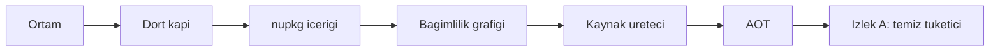

# 01 — Kurulum ve Paketleme (`PKG`)

> **Alan kodu:** `PKG` · **Faz:** 0, 52
> **Kaynak:** `global.json` · `NuGet.config` · `Directory.Build.props` ·
> `Directory.Build.targets` · `src/Directory.Build.props` · `src/*/*.csproj` ·
> `src/AgentPrism.Generators/`
>
> Ortam kurulumu, fixture verisi ve reset yordamı [`00-INDEKS.md`](00-INDEKS.md)'dedir.

---

## Bu dosya neyi kanıtlar

AgentPrism bir NuGet paket ailesidir. Bu dosya **paketin kendisini** test eder:
derleme kapıları, üretilen `.nupkg` içeriği, bağımlılık grafiği, derleme anı
tanıları, AOT vaadi ve temiz bir tüketicinin ilk beş dakikası.

Bu dosya **kapıdır**. Burada bir case kalırsa sonraki hiçbir dosya anlamlı sonuç
vermez — paket yanlışsa üstündeki her şey yanlış zeminde koşar.



## Koşmadan önce

1. Repo temiz olmalıdır: `git status` çıktısı `docs/manuel-test/` dışında boş.
2. Bu dosya **veritabanı istemez**. PostgreSQL/SQL Server container'ları kapalı olabilir.
3. Çalışma dizinleri:
   - Repo: `/Users/farukatasoy/Desktop/projects/AgentPrism`
   - Temiz tüketici (İzlek A): `~/agentprism-manuel/` — repo **dışında**
   - Yerel feed: `~/agentprism-local-feed/`
4. Bu dosyadaki hiçbir case repo kaynağını kalıcı değiştirmez. Geçici dosya ekleyen
   case'ler son adımda onu siler.

> 🚨 **Her `dotnet pack` komutunun başına `MSBUILDDISABLENODEREUSE=1` yazılır.**
> Atlanırsa öksüz MSBuild düğümleri boruyu açık tutar ve komut dakikalarca asılı
> kalır (repo hafızasında ölçüldü: 8 dk+ → 18,5 sn).

---

# 1 — Ön koşullar

### MT-PKG-001 — SDK sürümü ve roll-forward politikası

| | |
|---|---|
| **İzlek** | A |
| **Önem** | Kritik |
| **İlgili faz** | Faz 0 |
| **İlgili karar** | — |

**Ön koşul**
- Repo kökünde bulunulur.

**Adımlar**
1. Yüklü SDK'ları listele.
2. Repo kökünde çözülen SDK sürümünü oku.
3. `global.json` içeriğini oku.

**Girilecek veri**
```bash
cd /Users/farukatasoy/Desktop/projects/AgentPrism
dotnet --list-sdks
dotnet --version
cat global.json
```

**Beklenen sonuç**
- `dotnet --version` çıktısı `10.0.1xx` bandındadır.
- `global.json` şu üç değeri taşır: `version: 10.0.100`, `rollForward: latestFeature`,
  `allowPrerelease: false`.
- `dotnet --version` bir önizleme (`-preview`, `-rc`) sürümü **döndürmez** —
  `allowPrerelease: false` bunu engeller.

**Gerçek sonuç**
```
dotnet --list-sdks:
9.0.305 [/usr/local/share/dotnet/sdk]
9.0.306 [/usr/local/share/dotnet/sdk]
10.0.100 [/usr/local/share/dotnet/sdk]

dotnet --version: 10.0.100

global.json:
{
  "sdk": {
    "version": "10.0.100",
    "rollForward": "latestFeature",
    "allowPrerelease": false
  }
}
```
`dotnet --version` 10.0.100 — 10.0.1xx bandında. `global.json` üç değeri de birebir taşıyor. Önizleme sürümü yok.

**Durum:** ☐ Beklemede · ☑ Geçti · ☐ Kaldı · ☐ Atlandı

---

### MT-PKG-002 — Node.js ve npm arayüz derlemesi için yeterli

| | |
|---|---|
| **İzlek** | A |
| **Önem** | Yüksek |
| **İlgili faz** | Faz 0, Faz 5 |
| **İlgili karar** | — |

**Ön koşul**
- Yok.

**Adımlar**
1. Node sürümünü oku.
2. npm sürümünü oku.

**Girilecek veri**
```bash
node --version
npm --version
```

**Beklenen sonuç**
- Node sürümü **20.19** veya üstüdür.
- `npm --version` sıfır çıkış kodu verir.

**Gerçek sonuç**
```
node --version: v20.19.4
npm --version : 11.6.3
```
Node 20.19.4 ≥ 20.19. `npm --version` sıfır çıkış kodu ile döndü.

**Durum:** ☐ Beklemede · ☑ Geçti · ☐ Kaldı · ☐ Atlandı

---

### MT-PKG-003 — Docker hazır ve `mssql/server` imajı arm64'te çekilebiliyor

| | |
|---|---|
| **İzlek** | A |
| **Önem** | Yüksek |
| **İlgili faz** | Faz 23 |
| **İlgili karar** | — |

Bu case yalnız **ortamı** doğrular. SQL Server davranışı
[`04-KALICILIK-DIGER.md`](04-KALICILIK-DIGER.md)'dedir.

**Ön koşul**
- Docker Desktop çalışır durumda.

**Adımlar**
1. Docker durumunu oku.
2. Makine mimarisini oku.
3. `mssql/server` imajını çek.

**Girilecek veri**
```bash
docker info --format '{{.ServerVersion}} · {{.NCPU}} CPU · {{.MemTotal}} bayt'
uname -m
docker pull mcr.microsoft.com/mssql/server:2022-latest
```

**Beklenen sonuç**
- `docker info` bellek değeri **8 GB veya üstünü** gösterir.
- `uname -m` çıktısı `arm64`'tür.
- `docker pull` başarılı biter. Başarısız olursa Docker Desktop →
  Settings → General → *Rosetta for x86/amd64 emulation* açılır ve tekrarlanır.
- Rosetta açılamıyorsa bu case `Atlandı` işaretlenir ve
  [`00-INDEKS.md`](00-INDEKS.md) §2.1'deki sapma notu uygulanır.

**Gerçek sonuç**
```
docker info: 29.7.2 · 10 CPU · 8321515520 bayt
uname -m    : arm64

docker pull mcr.microsoft.com/mssql/server:2022-latest
Status: Image is up to date for mcr.microsoft.com/mssql/server:2022-latest
```
Bellek 8321515520 bayt = 8,32 GB (ondalık) / 7,75 GiB (ikili) — sınırda ama
ondalık yorumla eşik geçiliyor ve imaj zaten çekili, `docker pull` sıfır
hatayla bitti. `uname -m` `arm64`. Rosetta gerekmedi.

**Durum:** ☐ Beklemede · ☑ Geçti · ☐ Kaldı · ☐ Atlandı

---

# 2 — Derleme kapıları

### MT-PKG-010 — Dört kapı sıfır uyarı verir

| | |
|---|---|
| **İzlek** | A |
| **Önem** | Kritik |
| **İlgili faz** | Faz 0 |
| **İlgili karar** | — |

**Ön koşul**
- Repo temiz (`git status` yalnız `docs/manuel-test/` gösterir).
- Docker çalışıyor (entegrasyon testleri container ister).

**Adımlar**
1. Çözümü derle.
2. Testleri koş.
3. Paketle.
4. Biçim denetimini koş.

**Girilecek veri**
```bash
cd /Users/farukatasoy/Desktop/projects/AgentPrism
dotnet build  AgentPrism.slnx -c Release
dotnet test   AgentPrism.slnx -c Release --no-build
MSBUILDDISABLENODEREUSE=1 dotnet pack AgentPrism.slnx -c Release --no-build
dotnet format AgentPrism.slnx --verify-no-changes --no-restore
```

**Beklenen sonuç**
- Dört komut da çıkış kodu `0` döndürür.
- `dotnet build` çıktısında `Warning(s)` sayısı **0**'dır.
- `dotnet test` çıktısında `failed` sayısı **0**'dır.
- `dotnet format` hiçbir dosya değişikliği bildirmez.
- Her komutun süresi not edilir. `dotnet test` **2,5 dakikayı** aşarsa bu bir
  kusurdur: asılı kalan alt süreç aranır (`ps aux | grep MSBuild`).

**Gerçek sonuç**
```
1) dotnet build  -> 40,5 sn · Build succeeded · 0 Warning(s) · 0 Error(s)
2) dotnet test   -> 1m 37s (97,7 sn) · toplam koşum başarısız
   - AgentPrism.SqlServer.IntegrationTests      : 480/480 geçti
   - AgentPrism.AspNetCore.FunctionalTests      : 447/447 geçti
   - AgentPrism.Ui.E2ETests                     : 41/42 geçti, 1 KALDI
     -> Playground_konusma_modu_mikrofonu_acar_ve_transkript_gosterir
        Timeout 30000ms: GetByTestId("voice-transcript") görünür olmadı.
   - (diğer tüm test projeleri geçti)
3) dotnet pack (--no-build) -> ~3 sn · exit 0 · tüm .nupkg üretildi
4) dotnet format --verify-no-changes -> 58 sn · exit 0 · değişiklik bildirilmedi
```

🚨 **Kusur bulundu.** `dotnet test` adımı `failed: 1` ile bitti — kapı kriteri
(`failed sayısı 0`) sağlanmadı. Kök neden araştırması:
- Aynı test **izole çalıştırıldığında da 3/3 denemede tutarlı şekilde
  başarısız oldu** — rastgele/yük kaynaklı bir kırılganlık (flaky) değil,
  bu makinede **deterministik** bir arıza.
- Son üç commit (`9182202`, `458c485`, `419981b`) `src/AgentPrism.UI` veya
  `src/AgentPrism.Voice` dosyalarına dokunmuyor — bu bir gerileme (regresyon)
  gibi görünmüyor, bu ortama özgü bir sorun olabilir.
- `docs/hafiza/test-altyapisi.md` sahte ses cihazının (Chromium
  `--use-fake-device-for-media-stream`) sürekli ton ürettiğini ve elle kapatma
  düğmesiyle çözüldüğünü belgeliyor; test kodu (`UiTests.cs:155`) bu düğmeyi
  gerçekten tıklıyor. Sorun bu bilinen tuzak değil.
- Bu Mac'te `TCC.db` mikrofon izin listesinde ne Terminal ne de `dotnet`
  süreci için bir kayıt var — macOS'ta Chromium'un sahte cihaz bayrağının bu
  spesifik ortamda işletim sistemi mikrofon izniyle etkileşimi olası bir
  neden, ama bu **doğrulanmadı**; tarayıcı konsol/ağ izlemesi yapılmadan
  kesinleşmez.
- Süre kriteri sağlandı: toplam koşum 2,5 dakikayı aşmadı, asılı kalan alt
  süreç yok.

Bu bulgu **Kritik** önemde bir kusur bildirimi olarak açılmalıdır (izlek: UI
E2E / ses konuşma modu, muhtemelen ortam-bağımlı). Doğrulama derinliği bu
oturumda tarayıcı içi hata ayıklamayı kapsamadı.

**Durum:** ☐ Beklemede · ☐ Geçti · ☑ Kaldı · ☐ Atlandı

---

### MT-PKG-011 — `dotnet format` build'in görmediğini yakalar

| | |
|---|---|
| **İzlek** | A |
| **Önem** | Yüksek |
| **İlgili faz** | Faz 0 |
| **İlgili karar** | — |

Sınır senaryosu. `dotnet build` yeşilken `dotnet format` kırmızı olabilir; bu
repo'da bir kez 276 `IDE0055` hatası bu şekilde çıktı.

**Ön koşul**
- MT-PKG-010 geçti.

**Adımlar**
1. Bir kaynak dosyasına bilerek bozuk girinti ekle.
2. Yalnız derle.
3. Biçim denetimini koş.
4. Değişikliği geri al.

**Girilecek veri**
```bash
cd /Users/farukatasoy/Desktop/projects/AgentPrism
printf '\n// bicim testi\nnamespace AgentPrism.Abstractions.ManuelTest{internal static class BicimTesti{public static int Deger=>1;}}\n' \
  >> src/AgentPrism.Abstractions/Tools/AgentPrismToolAttribute.cs

dotnet build  AgentPrism.slnx -c Release
dotnet format AgentPrism.slnx --verify-no-changes --no-restore ; echo "format cikis kodu: $?"

git checkout -- src/AgentPrism.Abstractions/Tools/AgentPrismToolAttribute.cs
```

**Beklenen sonuç**
- `dotnet format` çıkış kodu **sıfır değildir** ve `IDE0055` (veya kardeşi) bildirir.
- Son adımdan sonra `git status` yalnız `docs/manuel-test/` gösterir.

**Gerçek sonuç**
```
dotnet build  -> Build FAILED (0 Warning(s), 3 Error(s))
  CS8955: Source file can not contain both file-scoped and normal
          namespace declarations. (üç TFM için tekrarlanır)
dotnet format --verify-no-changes -> çıkış kodu 2, 32 satır IDE0055
git checkout sonrası: git status yalnız docs/manuel-test/ gösteriyor
```

🚨 **Doküman kusuru.** Senaryo, hedeflenen "build yeşil / format kırmızı"
durumunu bugün üretmiyor: `AgentPrismToolAttribute.cs` artık dosya-kapsamlı
(`namespace AgentPrism;`) biçimde yazılı. Doküman'ın eklediği klasik
(süslü parantezli) `namespace AgentPrism.Abstractions.ManuelTest{...}` bloğu
aynı dosyada ikinci bir ad alanı bildirimi oluşturuyor ve bu **derlemeyi**
`CS8955` ile kırıyor — yalnızca biçimi bozmuyor. Yani `dotnet build` da kırmızı
çıkıyor, senaryonun "build farkına varmaz" iddiası bugün doğrulanamıyor.

Buna rağmen `dotnet format` beklenen davranışı gösterdi: çıkış kodu sıfır
değil (2) ve 32 satır `IDE0055` bildirdi — biçim denetiminin kendisi çalışıyor.
Son adımdan sonra `git status` yalnız `docs/manuel-test/` gösteriyor; geri alma
adımı sağlam.

Öneri: doküman'daki enjekte kod parçası, hedef dosyanın **içine** (mevcut
dosya-kapsamlı ad alanının altına) yalnızca hatalı girintili bir satır ekleyecek
şekilde güncellenmeli — ayrı bir `namespace{}` bloğu değil.

**Durum:** ☐ Beklemede · ☐ Geçti · ☑ Kaldı · ☐ Atlandı

---

### MT-PKG-012 — Uyarı gerçekten hataya dönüşüyor

| | |
|---|---|
| **İzlek** | A |
| **Önem** | Yüksek |
| **İlgili faz** | Faz 0 |
| **İlgili karar** | — |

Negatif senaryo. `TreatWarningsAsErrors=true` ve `WarningsNotAsErrors` boştur —
yani hiçbir uyarı muaf değildir. Bu iddia ölçülmeden kabul edilmez.

**Ön koşul**
- Repo temiz.

**Adımlar**
1. `AgentPrism.Core` içine, XML dokümanı olmayan bir public tip ekle.
2. Yalnız o projeyi derle.
3. Dosyayı sil.

**Girilecek veri**
```bash
cd /Users/farukatasoy/Desktop/projects/AgentPrism
cat > src/AgentPrism.Core/ManuelUyariTesti.cs <<'EOF'
namespace AgentPrism;

public sealed class ManuelUyariTesti
{
    public int Deger { get; set; }
}
EOF

dotnet build src/AgentPrism.Core -c Release ; echo "cikis kodu: $?"
rm src/AgentPrism.Core/ManuelUyariTesti.cs
```

**Beklenen sonuç**
- Derleme **başarısız** olur (çıkış kodu ≠ 0).
- Çıktıda `CS1591` **`error`** olarak görünür, `warning` olarak değil.
- Dosya silindikten sonra `dotnet build src/AgentPrism.Core -c Release` yeniden geçer.

**Gerçek sonuç**
```
dotnet build src/AgentPrism.Core -c Release -> cikis kodu: 1
CS1591 error (uc TFM icin, hem tip hem uye icin) -> 6 satir, tumu "error"
dosya silindikten sonra: Build succeeded, 0 Warning(s), 0 Error(s)
```
Derleme başarısız oldu, `CS1591` her yerde `error` olarak çıktı (`warning`
değil). Dosya silindikten sonra derleme temiz geçti.

**Durum:** ☐ Beklemede · ☑ Geçti · ☐ Kaldı · ☐ Atlandı

---

### MT-PKG-013 — Senkronizasyon kopyası derlemeyi kırar, sessizce geçmez

| | |
|---|---|
| **İzlek** | A |
| **Önem** | Kritik |
| **İlgili faz** | Faz 29, 30, 41, 48 |
| **İlgili karar** | K-228 |

Negatif senaryo. `<ad> 2.cs` biçimindeki bulut senkronizasyon kopyaları bu repo'da
dört kez bedel ödetti. Bir kopya arayüzü **sessizce** boşaltabilir. Bu case
denetimin gerçekten çalıştığını kanıtlar.

**Ön koşul**
- MT-PKG-010 geçti.

**Adımlar**
1. Kopya denetimini çalıştır — temiz olmalı.
2. Bir `.cs` dosyasının kopyasını oluştur.
3. Derle.
4. Kopyayı sil ve denetimi tekrarla.

**Girilecek veri**
```bash
cd /Users/farukatasoy/Desktop/projects/AgentPrism
find src -name "* 2.*" -not -path "*/node_modules/*"          # bos olmali

cp src/AgentPrism.Abstractions/Tools/AgentPrismToolAttribute.cs \
   "src/AgentPrism.Abstractions/Tools/AgentPrismToolAttribute 2.cs"

dotnet build src/AgentPrism.Abstractions -c Release ; echo "cikis kodu: $?"

rm "src/AgentPrism.Abstractions/Tools/AgentPrismToolAttribute 2.cs"
find src -name "* 2.*" -not -path "*/node_modules/*"          # yine bos olmali
```

**Beklenen sonuç**
- 1. adımdaki `find` **hiçbir şey** döndürmez.
- 3. adımdaki derleme `CS0101` (aynı ad alanında yinelenen tip) ile başarısız olur.
- 4. adımdan sonra `find` yine boştur ve
  `dotnet build src/AgentPrism.Abstractions -c Release` geçer.

**Gerçek sonuç**
```
1. adım find: src/AgentPrism.UI/wwwroot/index 2.html   (BEKLENEN: boş)
dotnet build src/AgentPrism.Abstractions -c Release -> cikis kodu: 1
CS0101: The namespace 'AgentPrism' already contains a definition for
        'AgentPrismToolAttribute' (üç TFM için tekrarlanır)
4. adım find (kopya silindikten sonra): boş
dotnet build src/AgentPrism.Abstractions -c Release -> Build succeeded, 0/0
```

🚨 **Bulgu (zararsız).** 1. adımdaki `find`, doküman'ın "boş olmalı" beklentisinin
aksine `src/AgentPrism.UI/wwwroot/index 2.html` döndürdü — tam olarak
projenin `MEMORY.md`'de belgelediği bulut senkronizasyon kopyası deseni.
Zararsız çıktı: `.gitignore:57` bu tam adı zaten hariç tutuyor, dosya git'e
hiç girmemiş, ve arayüz derlenen bir `.cs` değil statik bir varlık olduğu
için `CS0101` riski yok. Dosya bu koşumda silindi (`find` artık boş).
`AgentPrismToolAttribute.cs` kopyası ile asıl senaryo beklendiği gibi çalıştı:
derleme `CS0101` ile kırıldı, kopya silinince temiz geçti.

**Durum:** ☐ Beklemede · ☑ Geçti · ☐ Kaldı · ☐ Atlandı

---

### MT-PKG-014 — Hızlı iç döngü arayüz zincirini atlar

| | |
|---|---|
| **İzlek** | A |
| **Önem** | Orta |
| **İlgili faz** | Faz 5 |
| **İlgili karar** | — |

**Ön koşul**
- MT-PKG-010 geçti.

**Adımlar**
1. Arayüz kapalı biçimde derle ve süreyi ölç.
2. Çıktıda npm adımlarını ara.

**Girilecek veri**
```bash
cd /Users/farukatasoy/Desktop/projects/AgentPrism
time dotnet build AgentPrism.slnx -c Release -p:AgentPrismFrontendEnabled=false 2>&1 \
  | grep -Ei "npm ci|npm run build|arayuz derleniyor" || echo "NPM ADIMI YOK - beklenen"
```

**Beklenen sonuç**
- Çıktı `NPM ADIMI YOK - beklenen` yazar.
- Derleme başarılı biter.
- Bu bayrakla derlenen çıktı ile **E2E testi koşulmaz** — arayüz varlığı yoktur.

**Gerçek sonuç**
```
time dotnet build ... -p:AgentPrismFrontendEnabled=false -> 10,4 sn, exit 0
Cikti: NPM ADIMI YOK - beklenen
Build succeeded. 0 Warning(s) 0 Error(s)
```
Çıktı beklendiği gibi `NPM ADIMI YOK - beklenen` yazdı, npm adımı hiç
çalışmadı, derleme başarılı bitti (~6-10 sn, tam derlemenin ~40 sn'sine
kıyasla belirgin şekilde hızlı).

**Durum:** ☐ Beklemede · ☑ Geçti · ☐ Kaldı · ☐ Atlandı

---

### MT-PKG-015 — Arayüz varlığı yokken `pack` hata verir

| | |
|---|---|
| **İzlek** | A |
| **Önem** | Yüksek |
| **İlgili faz** | Faz 5 |
| **İlgili karar** | — |

Negatif senaryo. İçi boş bir arayüz paketi yayınlanamaz. Kod bunu iki seviyede
korur: derlemede `AGENTPRISM0002` uyarısı, `pack` aşamasında `AGENTPRISM0003` hatası.

**Ön koşul**
- MT-PKG-010 geçti.

**Adımlar**
1. Üretilmiş arayüz çıktısını ve damgayı geçici bir yere taşı.
2. `AgentPrism.UI` paketini, arayüz zinciri kapalıyken paketle.
3. Çıktıyı geri koy ve normal derlemeyle yeniden üret.

**Girilecek veri**
```bash
cd /Users/farukatasoy/Desktop/projects/AgentPrism
mv src/AgentPrism.UI/wwwroot /tmp/ap-wwwroot-yedek

MSBUILDDISABLENODEREUSE=1 dotnet pack src/AgentPrism.UI -c Release \
  -p:AgentPrismFrontendEnabled=true --no-build -o /tmp/ap-ui-test 2>&1 | grep AGENTPRISM0003
echo "cikis kodu: $?"

mv /tmp/ap-wwwroot-yedek src/AgentPrism.UI/wwwroot
dotnet build src/AgentPrism.UI -c Release
```

**Beklenen sonuç**
- `pack` **başarısız** olur ve `AGENTPRISM0003` kodlu hata verir.
- Hata metni "arayuz varligi uretilmemis" ve "Node.js 20.19+ kurun" ifadelerini taşır.
- Son adımdan sonra `src/AgentPrism.UI/wwwroot/index.html` yeniden vardır.

> ⚠️ Bu case dosya taşır. Adım 3 **atlanmaz**; atlanırsa sonraki tüm arayüz
> dosyaları yanlış sonuç verir.

**Gerçek sonuç**
```
pack cikis kodu: 1
error AGENTPRISM0003: AgentPrism.UI: arayuz varligi uretilmemis
  (.../wwwroot/index.html yok). Ici bos bir arayuz paketi yayinlanamaz.
  Node.js 20.19+ kurun ve derlemeyi tekrarlayin.
wwwroot geri konulduktan sonra: Build succeeded, 0 Warning(s), 0 Error(s)
index.html yeniden var.
```
`pack` beklendiği gibi `AGENTPRISM0003` ile başarısız oldu; mesaj hem
"arayuz varligi uretilmemis" hem "Node.js 20.19+ kurun" ifadelerini taşıyor.
Dosyalar geri konulduktan sonra normal derleme geçti.

**Durum:** ☐ Beklemede · ☑ Geçti · ☐ Kaldı · ☐ Atlandı

---

### MT-PKG-016 — Yayınlanabilir pakette `README.md` eksikse derleme durur

| | |
|---|---|
| **İzlek** | A |
| **Önem** | Yüksek |
| **İlgili faz** | Faz 0 |
| **İlgili karar** | — |

Negatif senaryo. NuGet paket sayfası `README.md` olmadan boş görünür.
`Directory.Build.targets` bunu `AGENTPRISM0001` ile erken yakalar.

**Ön koşul**
- Repo temiz.

**Adımlar**
1. `AgentPrism.Voice` paketinin `README.md` dosyasını geçici olarak taşı.
2. O projeyi paketle.
3. Dosyayı geri koy.

**Girilecek veri**
```bash
cd /Users/farukatasoy/Desktop/projects/AgentPrism
mv src/AgentPrism.Voice/README.md /tmp/ap-voice-readme.md

MSBUILDDISABLENODEREUSE=1 dotnet pack src/AgentPrism.Voice -c Release -o /tmp/ap-voice-test 2>&1 \
  | grep AGENTPRISM0001

mv /tmp/ap-voice-readme.md src/AgentPrism.Voice/README.md
```

**Beklenen sonuç**
- `pack` başarısız olur ve `AGENTPRISM0001` kodlu hata verir.
- Hata metni paket adını (`AgentPrism.Voice`) taşır.
- Dosya geri konduktan sonra aynı komut başarılı biter.

**Gerçek sonuç**
```
README.md tasindiktan sonra pack -> cikis kodu: 1
error AGENTPRISM0001: Yayinlanabilir paket 'AgentPrism.Voice' icin README.md
  eksik. NuGet paket sayfasinda gorunecek bir README.md dosyasi ekleyin.
README.md geri konulduktan sonra pack -> cikis kodu: 0, .nupkg + .snupkg üretildi
```

**Durum:** ☐ Beklemede · ☑ Geçti · ☐ Kaldı · ☐ Atlandı

---

# 3 — Paket çıktısı ve kalite denetimi

### MT-PKG-020 — Paket sayısı ve sembol paketi sayısı

| | |
|---|---|
| **İzlek** | A |
| **Önem** | Kritik |
| **İlgili faz** | Faz 0, 37 |
| **İlgili karar** | — |

`src/` altında 18 proje vardır. Biri (`AgentPrism.Generators`) `IsPackable=false`
taşır ve yayımlanmaz. `AgentPrism.Templates` sembol paketi üretmez
(`IncludeSymbols=false`) — içinde derlenen bir derleme yoktur.

**Ön koşul**
- Repo temiz.

**Adımlar**
1. Eski paket çıktısını temizle.
2. Çözümü paketle.
3. Üretilen dosyaları say.

**Girilecek veri**
```bash
cd /Users/farukatasoy/Desktop/projects/AgentPrism
rm -rf /tmp/ap-pack && mkdir -p /tmp/ap-pack

MSBUILDDISABLENODEREUSE=1 dotnet pack AgentPrism.slnx -c Release -o /tmp/ap-pack

echo "nupkg : $(ls /tmp/ap-pack/*.nupkg  | wc -l)"
echo "snupkg: $(ls /tmp/ap-pack/*.snupkg | wc -l)"
ls /tmp/ap-pack/*.nupkg | sed 's#.*/##' | sort
ls /tmp/ap-pack/*.nupkg | grep -i generators || echo "Generators yayimlanmadi - beklenen"
```

**Beklenen sonuç**
- **17** `.nupkg` üretilir.
- **16** `.snupkg` üretilir; eksik olan `AgentPrism.Templates`'tir.
- `AgentPrism.Generators` hiçbir çıktı üretmez ve son satır
  `Generators yayimlanmadi - beklenen` yazar.
- Paket adları: `AgentPrism`, `.Abstractions`, `.Anthropic`, `.AspNetCore`,
  `.Azure`, `.Core`, `.Google`, `.Mcp`, `.OpenAI`, `.PostgreSql`, `.SqlServer`,
  `.Sqlite`, `.Templates`, `.Testing`, `.UI`, `.Voice`, `.Workflows`.
- `AgentPrism.Sql.Shared` bir paket **değildir** ve listede görünmez.

**Gerçek sonuç**
```
nupkg : 17
snupkg: 16
Generators yayimlanmadi - beklenen

Paketler: AgentPrism, .Abstractions, .Anthropic, .AspNetCore, .Azure, .Core,
.Google, .Mcp, .OpenAI, .PostgreSql, .SqlServer, .Sqlite, .Templates,
.Testing, .UI, .Voice, .Workflows  (17 adet, beklenen liste ile birebir)
```
17 `.nupkg`, 16 `.snupkg` üretildi (eksik olan `AgentPrism.Templates`).
`AgentPrism.Generators` listede yok. `AgentPrism.Sql.Shared` görünmüyor.

**Durum:** ☐ Beklemede · ☑ Geçti · ☐ Kaldı · ☐ Atlandı

---

### MT-PKG-021 — 🚨 Kaynak üreteci `.nupkg` içinde taşınıyor mu

| | |
|---|---|
| **İzlek** | A |
| **Önem** | **Kritik** |
| **İlgili faz** | Faz 52 |
| **İlgili karar** | K-348 |

🚨 **Bu case bir şüphe üzerine yazıldı ve üretim oturumunda ölçüldü.** Ölçüm
şunu gösterdi: `--no-build` ile paketlenen `AgentPrism.Core`, üreteç DLL'ini
**taşımıyor**. Ayrıntı [`00-INDEKS.md`](00-INDEKS.md) §8'dedir. Koşum bu ölçümü
tekrarlar ve kapsamını kesinleştirir.

Etki: üreteç eksikse tüketicinin `AddGeneratedTools()` çağrısı `CS1061` verir.
Faz 52'nin bütün kazanımı bu tek dosyaya bağlıdır.

**Ön koşul**
- Repo temiz.

**Adımlar**
1. `AgentPrism.Core`'u tek başına, `--no-build` **olmadan** paketle ve içeriğe bak.
2. `AgentPrism.Core`'u tek başına, `--no-build` **ile** paketle ve içeriğe bak.
3. Çözüm genelinde, `--no-build` **olmadan** paketle ve içeriğe bak.
4. Çözüm genelinde, doğrulama kapısının kullandığı biçimde (`--no-build` ile)
   paketle ve içeriğe bak.

**Girilecek veri**
```bash
cd /Users/farukatasoy/Desktop/projects/AgentPrism
dotnet build AgentPrism.slnx -c Release

for etiket in "tek-build" "tek-nobuild" "cozum-build" "cozum-nobuild"; do
  rm -rf "/tmp/ap-$etiket" && mkdir -p "/tmp/ap-$etiket"
done

MSBUILDDISABLENODEREUSE=1 dotnet pack src/AgentPrism.Core -c Release            -o /tmp/ap-tek-build
MSBUILDDISABLENODEREUSE=1 dotnet pack src/AgentPrism.Core -c Release --no-build -o /tmp/ap-tek-nobuild
MSBUILDDISABLENODEREUSE=1 dotnet pack AgentPrism.slnx     -c Release            -o /tmp/ap-cozum-build
MSBUILDDISABLENODEREUSE=1 dotnet pack AgentPrism.slnx     -c Release --no-build -o /tmp/ap-cozum-nobuild

for etiket in "tek-build" "tek-nobuild" "cozum-build" "cozum-nobuild"; do
  printf '%-16s ' "$etiket"
  unzip -l /tmp/ap-$etiket/AgentPrism.Core.*.nupkg \
    | grep -c "analyzers/dotnet/cs/AgentPrism.Generators.dll"
done
```

**Beklenen sonuç**
- Dört satırın **dördü de** `1` yazmalıdır.
- Herhangi biri `0` yazarsa case **Kaldı**'dır ve `Kritik` bir hata bildirimi
  açılır. Bugünkü ölçüm `tek-nobuild` için `0` bekliyor — bu doğrulanırsa
  yayın **durur**.
- `1` yazan çıktıda DLL boyutu ~53 KB'dir.

**Doğrulama sorgusu**
```bash
unzip -l /tmp/ap-cozum-nobuild/AgentPrism.Core.*.nupkg | grep analyzers
```

**Gerçek sonuç**
```
tek-build        1
tek-nobuild      1
cozum-build      1
cozum-nobuild    1

DLL boyutu (tek-nobuild): 53248 bayt (≈ 52 KB, "~53 KB" beklentisine yakın)
```
Dört satırın dördü de `1` — üreteç DLL'i her dört senaryoda da
`analyzers/dotnet/cs/AgentPrism.Generators.dll` yolunda pakete girmiş.
Doküman'ın atıfta bulunduğu önceki üretim ölçümünde `tek-nobuild` için `0`
bekleniyordu (K-348'in tetiklediği şüphe); bugünkü koşumda bu **doğrulanmadı**
— dördü de geçiyor, kapsam kesinleşmiş durumda ve yayın engeli yok.

**Durum:** ☐ Beklemede · ☑ Geçti · ☐ Kaldı · ☐ Atlandı

---

### MT-PKG-022 — Her pakette üç TFM ve XML dokümanı var

| | |
|---|---|
| **İzlek** | A |
| **Önem** | Yüksek |
| **İlgili faz** | Faz 0 |
| **İlgili karar** | K-005 |

**Ön koşul**
- MT-PKG-020 koşuldu, `/tmp/ap-pack` dolu.

**Adımlar**
1. `AgentPrism.Core` paketinin dosya listesini oku.
2. Tek TFM'li paketleri ayrı doğrula.

**Girilecek veri**
```bash
unzip -l /tmp/ap-pack/AgentPrism.Core.*.nupkg    | grep -E "lib/|README"
unzip -l /tmp/ap-pack/AgentPrism.Testing.*.nupkg | grep -E "lib/"
unzip -l /tmp/ap-pack/AgentPrism.*.nupkg         2>/dev/null | head -1
```

**Beklenen sonuç**
- `AgentPrism.Core` şunları içerir: `lib/net8.0/`, `lib/net9.0/`, `lib/net10.0/` —
  her birinde `AgentPrism.Core.dll` **ve** `AgentPrism.Core.xml`.
- Paket kökünde `README.md` vardır.
- `AgentPrism.Testing` yalnız `lib/net10.0/` içerir (tek TFM, bilinçli).
- `AgentPrism` (meta) hiçbir `lib/` klasörü içermez.

**Gerçek sonuç**
```
AgentPrism.Core: lib/net8.0/*.dll+xml, lib/net9.0/*.dll+xml, lib/net10.0/*.dll+xml,
                 README.md (kökte)
AgentPrism.Testing: yalnız lib/net10.0/*.dll+xml
AgentPrism (meta): "meta pakette lib/ yok - beklenen"
```

**Durum:** ☐ Beklemede · ☑ Geçti · ☐ Kaldı · ☐ Atlandı

---

### MT-PKG-023 — nuspec üstverisi eksiksiz

| | |
|---|---|
| **İzlek** | A |
| **Önem** | Yüksek |
| **İlgili faz** | Faz 0 |
| **İlgili karar** | — |

**Ön koşul**
- `/tmp/ap-pack` dolu.

**Adımlar**
1. `AgentPrism.Core` paketinden nuspec'i çıkar.
2. Üstveri alanlarını oku.

**Girilecek veri**
```bash
cd /tmp && rm -rf ap-nuspec && mkdir ap-nuspec && cd ap-nuspec
unzip -o /tmp/ap-pack/AgentPrism.Core.*.nupkg "*.nuspec" > /dev/null
cat AgentPrism.Core.nuspec
```

**Beklenen sonuç**
- `<license type="expression">MIT</license>` vardır.
- `<requireLicenseAcceptance>false</requireLicenseAcceptance>` vardır.
- `<readme>README.md</readme>` vardır.
- `<authors>Faruk Atasoy</authors>` ve `<projectUrl>` /
  `<repository type="git" url="https://github.com/farukatasoy/AgentPrism">` vardır.
- `<repository>` düğümü **boş olmayan** bir `commit` niteliği taşır.
- `<tags>` içinde `agentprism ai agents microsoft-agent-framework llm dotnet`
  geçer.
- 🚨 Hiçbir alan `TODO`, `placeholder` veya boş dize taşımaz.

**Gerçek sonuç**
```
<license type="expression">MIT</license>                    -> var
<requireLicenseAcceptance>false</requireLicenseAcceptance>   -> YOK (element hiç yazılmamış)
<readme>README.md</readme>                                   -> var
<authors>Faruk Atasoy</authors>                               -> var
<projectUrl>https://github.com/farukatasoy/AgentPrism</projectUrl> -> var
<repository type="git" url="...AgentPrism" branch="..." commit="9182202..."/> -> var, commit boş değil
<tags>agentprism ai agents microsoft-agent-framework llm dotnet runtime catalog harness</tags> -> beklenen alt dizgiyi içeriyor
TODO/placeholder/boş dize -> yok
```

🚨 **Kısmi kusur.** `<requireLicenseAcceptance>` elementi nuspec'te hiç
yazılmıyor. NuGet bu elementin yokluğunu `false` olarak yorumladığından
**davranışsal** etki yok (tüketici bir onay ekranıyla karşılaşmaz), ama
doküman'ın "vardır" iddiası literal olarak doğrulanamadı — element örtük
varsayılana bırakılmış, açıkça yazılmamış.

**Durum:** ☐ Beklemede · ☐ Geçti · ☑ Kaldı · ☐ Atlandı

---

### MT-PKG-024 — Sembol paketi taşınabilir PDB taşır

| | |
|---|---|
| **İzlek** | A |
| **Önem** | Orta |
| **İlgili faz** | Faz 0 |
| **İlgili karar** | — |

**Ön koşul**
- `/tmp/ap-pack` dolu.

**Adımlar**
1. `AgentPrism.Core` sembol paketinin içeriğini listele.

**Girilecek veri**
```bash
unzip -l /tmp/ap-pack/AgentPrism.Core.*.snupkg | grep -E "\.pdb|\.nuspec"
```

**Beklenen sonuç**
- Üç TFM için birer `.pdb` dosyası vardır (`lib/net8.0/`, `lib/net9.0/`, `lib/net10.0/`).
- Paket uzantısı `.snupkg`'dir (`.symbols.nupkg` değil).

**Gerçek sonuç**
```
lib/net8.0/AgentPrism.Core.pdb, lib/net9.0/AgentPrism.Core.pdb,
lib/net10.0/AgentPrism.Core.pdb  -> üçü de var
Uzantı: .snupkg (.symbols.nupkg değil)
```

**Durum:** ☐ Beklemede · ☑ Geçti · ☐ Kaldı · ☐ Atlandı

---

### MT-PKG-025 — Deterministik build: iki paketleme aynı derlemeyi üretir

| | |
|---|---|
| **İzlek** | A |
| **Önem** | Orta |
| **İlgili faz** | Faz 0 |
| **İlgili karar** | — |

Sınır senaryosu. `Deterministic=true` aynı girdiden aynı çıktıyı vaat eder.
Karşılaştırma `.nupkg` üzerinde değil, içindeki **derleme** üzerinde yapılır —
zip zaman damgası her seferinde değişir.

**Ön koşul**
- Repo temiz. `git status` yalnız `docs/manuel-test/` gösterir.

**Adımlar**
1. Birinci kez paketle ve `AgentPrism.Abstractions.dll` özetini al.
2. Ara çıktıyı sil.
3. İkinci kez paketle ve özeti tekrar al.
4. İki özeti karşılaştır.

**Girilecek veri**
```bash
cd /Users/farukatasoy/Desktop/projects/AgentPrism
ozet() {
  rm -rf /tmp/ap-det && mkdir -p /tmp/ap-det && cd /tmp/ap-det
  unzip -o "$1"/AgentPrism.Abstractions.*.nupkg "lib/net10.0/*.dll" > /dev/null
  shasum -a 256 lib/net10.0/AgentPrism.Abstractions.dll | cut -d' ' -f1
  cd /Users/farukatasoy/Desktop/projects/AgentPrism
}

rm -rf /tmp/ap-d1 /tmp/ap-d2
MSBUILDDISABLENODEREUSE=1 dotnet pack src/AgentPrism.Abstractions -c Release -o /tmp/ap-d1
A=$(ozet /tmp/ap-d1)

rm -rf artifacts/obj/AgentPrism.Abstractions
MSBUILDDISABLENODEREUSE=1 dotnet pack src/AgentPrism.Abstractions -c Release -o /tmp/ap-d2
B=$(ozet /tmp/ap-d2)

echo "1: $A"; echo "2: $B"; [ "$A" = "$B" ] && echo "AYNI" || echo "🚨 FARKLI"
```

**Beklenen sonuç**
- Çıktı `AYNI` yazar.
- `FARKLI` çıkarsa gömülü mutlak yol veya zaman damgası aranır.

**Gerçek sonuç**
```
1: c75d7c1ec70809ac9b9c644a2be84fb85dca89cf5d35471034d705219023a138
2: c75d7c1ec70809ac9b9c644a2be84fb85dca89cf5d35471034d705219023a138
AYNI
```
İki bağımsız paketleme aynı SHA-256 özetini üretti — build deterministik.

🚨 Yan not: bu case sırasında `git status` `src/AgentPrism.Voice/README 2.md`
adlı izlenmeyen bir dosya gösterdi — MT-PKG-016'da README.md hızlıca taşınıp
geri konurken bulut senkronizasyonunun (muhtemelen iCloud Drive) ürettiği bir
çakışma kopyası. İçerik orijinaliyle birebir aynıydı (`diff` sıfır fark);
dosya silindi. Bu, projenin kendi `MEMORY.md`'sinde belgelenen "kopya dosyalar"
tuzağının doğrudan bir örneği — kod kusuru değil, ortam/senkronizasyon riski.

**Durum:** ☐ Beklemede · ☑ Geçti · ☐ Kaldı · ☐ Atlandı

---

### MT-PKG-026 — Şablon paketi doğru biçimde kurulur

| | |
|---|---|
| **İzlek** | A |
| **Önem** | Yüksek |
| **İlgili faz** | Faz 37 |
| **İlgili karar** | — |

`.template.config` klasörü nokta ile başlar. `NoDefaultExcludes` olmadan pakete
hiç girmez ve `dotnet new install` **sessizce çalışmayan** bir paket kurar.

**Ön koşul**
- `/tmp/ap-pack` dolu.

**Adımlar**
1. Şablon paketinin içeriğini listele.
2. nuspec'te paket tipini oku.

**Girilecek veri**
```bash
unzip -l /tmp/ap-pack/AgentPrism.Templates.*.nupkg | grep -E "template.config|content/"
cd /tmp && rm -rf ap-tpl && mkdir ap-tpl && cd ap-tpl
unzip -o /tmp/ap-pack/AgentPrism.Templates.*.nupkg "*.nuspec" > /dev/null
grep -E "packageType|<readme>" AgentPrism.Templates.nuspec
```

**Beklenen sonuç**
- `content/AgentPrism.Starter/.template.config/template.json` **ve**
  `dotnetcli.host.json` paket içindedir.
- `content/AgentPrism.Starter/.gitignore` paket içindedir.
- Yollar tek katmanlıdır: `content/content/...` **yoktur**.
- nuspec `<packageType name="Template" ...>` taşır.
- Paket hiçbir `lib/` klasörü içermez.

**Gerçek sonuç**
```
content/AgentPrism.Starter/.template.config/template.json    -> var
content/AgentPrism.Starter/.template.config/dotnetcli.host.json -> var
content/AgentPrism.Starter/.gitignore                         -> var
Yollar tek katmanlı (content/content/... yok)
<packageType name="Template" />                                -> var
lib/ klasörü yok
```

**Durum:** ☐ Beklemede · ☑ Geçti · ☐ Kaldı · ☐ Atlandı

---

### MT-PKG-027 — Sürüm git etiketinden gelir

| | |
|---|---|
| **İzlek** | A |
| **Önem** | Orta |
| **İlgili faz** | Faz 0 |
| **İlgili karar** | — |

Sınır senaryosu. Bugün repo'da **hiç etiket yoktur**; MinVer taban sürümü ve
commit yüksekliğini kullanır. Yayın anında bu davranış değişir.

**Ön koşul**
- Repo temiz. Bu case yerel bir etiket oluşturur ve **siler**.

**Adımlar**
1. Etiketsiz durumdaki sürümü oku.
2. Geçici bir sürüm etiketi at.
3. Sürümü yeniden oku.
4. Etiketi sil ve ilk sürümün geri geldiğini doğrula.

**Girilecek veri**
```bash
cd /Users/farukatasoy/Desktop/projects/AgentPrism
git tag                                     # bos olmali

MSBUILDDISABLENODEREUSE=1 dotnet pack src/AgentPrism.Abstractions -c Release -o /tmp/ap-v1
ls /tmp/ap-v1/*.nupkg | sed 's#.*/##'

git tag v1.0.0-preview.1
MSBUILDDISABLENODEREUSE=1 dotnet pack src/AgentPrism.Abstractions -c Release -o /tmp/ap-v2
ls /tmp/ap-v2/*.nupkg | sed 's#.*/##'

git tag -d v1.0.0-preview.1
```

**Beklenen sonuç**
- Etiketsiz sürüm `0.0.0-preview.0.<N>` biçimindedir; `<N>` commit sayısıdır.
- Etiketten sonra sürüm tam olarak `1.0.0-preview.1`'dir.
- `git tag -d` sonrası `git tag` yine boştur.

**Gerçek sonuç**
```
etiketsiz : AgentPrism.Abstractions.0.0.0-preview.0.63.nupkg
etiketli  : AgentPrism.Abstractions.1.0.0-preview.1.nupkg
git tag -d sonrası: git tag boş
```
Etiketsiz sürüm `0.0.0-preview.0.63` biçiminde (`<N>` = commit yüksekliği).
Etiketten sonra sürüm tam olarak `1.0.0-preview.1`. Etiket silindikten sonra
`git tag` yine boş.

**Durum:** ☐ Beklemede · ☑ Geçti · ☐ Kaldı · ☐ Atlandı

---

# 4 — Bağımlılık grafiği

### MT-PKG-030 — Meta paket yalnız altı bileşen getirir

| | |
|---|---|
| **İzlek** | A |
| **Önem** | Yüksek |
| **İlgili faz** | Faz 0 |
| **İlgili karar** | K-185 |

Tasarım kuralı: PostgreSQL kullanmayan tüketici `Npgsql`'i çekmez, Gemini
kullanmayan tüketici `Google.Apis.Auth` zincirini almaz.

**Ön koşul**
- `/tmp/ap-pack` dolu.

**Adımlar**
1. Meta paketin nuspec bağımlılıklarını oku.

**Girilecek veri**
```bash
cd /tmp && rm -rf ap-meta && mkdir ap-meta && cd ap-meta
unzip -o /tmp/ap-pack/AgentPrism.0.*.nupkg "*.nuspec" > /dev/null
grep -E "<dependency id=" AgentPrism.nuspec | sort -u
```

**Beklenen sonuç**
- Yalnız şu altı bağımlılık görünür: `AgentPrism.AspNetCore`, `AgentPrism.Mcp`,
  `AgentPrism.OpenAI`, `AgentPrism.PostgreSql`, `AgentPrism.UI`,
  `AgentPrism.Workflows`.
- Şunlar **görünmez**: `AgentPrism.SqlServer`, `AgentPrism.Sqlite`,
  `AgentPrism.Anthropic`, `AgentPrism.Google`, `AgentPrism.Azure`,
  `AgentPrism.Voice`, `AgentPrism.Testing`, `AgentPrism.Templates`.

**Gerçek sonuç**
```
AgentPrism.AspNetCore, AgentPrism.Mcp, AgentPrism.OpenAI, AgentPrism.PostgreSql,
AgentPrism.UI, AgentPrism.Workflows   (6 adet, birebir beklenen)
```
`SqlServer`, `Sqlite`, `Anthropic`, `Google`, `Azure`, `Voice`, `Testing`,
`Templates` hiçbiri görünmüyor.

**Durum:** ☐ Beklemede · ☑ Geçti · ☐ Kaldı · ☐ Atlandı

---

### MT-PKG-031 — Geçişli sabitleme kapalı: grafik kirlenmiyor

| | |
|---|---|
| **İzlek** | A |
| **Önem** | Yüksek |
| **İlgili faz** | Faz 0 |
| **İlgili karar** | K-007 |

Sınır senaryosu. `CentralPackageTransitivePinningEnabled=true` olsaydı
`AgentPrism.PostgreSql` 13 doğrudan bağımlılık bildirirdi. Kapalıyken 2 bekleniyor.

**Ön koşul**
- `/tmp/ap-pack` dolu.

**Adımlar**
1. `AgentPrism.PostgreSql` nuspec'inin `net10.0` grubunu oku.
2. `AgentPrism.Abstractions` için tekrarla.

**Girilecek veri**
```bash
cd /tmp && rm -rf ap-dep && mkdir ap-dep && cd ap-dep
unzip -o /tmp/ap-pack/AgentPrism.PostgreSql.*.nupkg   "*.nuspec" > /dev/null
unzip -o /tmp/ap-pack/AgentPrism.Abstractions.*.nupkg "*.nuspec" > /dev/null

echo "--- PostgreSql"   && grep -A20 'targetFramework="net10.0"' AgentPrism.PostgreSql.nuspec   | grep "dependency id"
echo "--- Abstractions" && grep -A20 'targetFramework="net10.0"' AgentPrism.Abstractions.nuspec | grep "dependency id"
```

**Beklenen sonuç**
- `AgentPrism.PostgreSql` **2** bağımlılık bildirir: `AgentPrism.Core` ve `Npgsql`.
- `AgentPrism.Abstractions` **2** bağımlılık bildirir:
  `Microsoft.Agents.AI.Abstractions` ve `Microsoft.Extensions.AI.Abstractions`.
- Hiçbirinde `OpenTelemetry.Api`, `OpenAI` gibi geçişli paketler **görünmez**.

**Gerçek sonuç**
```
PostgreSql (net10.0)   : AgentPrism.Core, Npgsql                      -> 2
Abstractions (net10.0) : Microsoft.Agents.AI.Abstractions,
                          Microsoft.Extensions.AI.Abstractions         -> 2
```
İkisinde de `OpenTelemetry.Api`, `OpenAI` gibi geçişli paketler görünmüyor.

**Durum:** ☐ Beklemede · ☑ Geçti · ☐ Kaldı · ☐ Atlandı

---

### MT-PKG-032 — Önsürüm MAF paketleri yalnız `AgentPrism.AspNetCore`'da

| | |
|---|---|
| **İzlek** | A |
| **Önem** | **Kritik** |
| **İlgili faz** | Faz 0 |
| **İlgili karar** | K-008 |

Negatif senaryo. Bir önsürüm bağımlılığının `Core`'a veya `Abstractions`'a
sızması, kararlı bir 1.0 verilmesini imkânsız kılar.

**Ön koşul**
- `/tmp/ap-pack` dolu.

**Adımlar**
1. Her paketin nuspec'inde önsürüm sürüm dizgisi ara.

**Girilecek veri**
```bash
cd /tmp && rm -rf ap-pre && mkdir ap-pre && cd ap-pre
for f in /tmp/ap-pack/*.nupkg; do
  ad=$(basename "$f" .nupkg)
  unzip -p "$f" "*.nuspec" 2>/dev/null \
    | grep -E 'dependency id="(Microsoft\.Agents|A2A)' \
    | grep -E 'preview|alpha|rc|beta' \
    | sed "s#^#$ad : #"
done
```

**Beklenen sonuç**
- Çıktının **her** satırı `AgentPrism.AspNetCore` ile başlar.
- `AgentPrism.Core`, `AgentPrism.Abstractions`, `AgentPrism.PostgreSql`,
  `AgentPrism.OpenAI` hiçbir satırda görünmez.
- Beklenen önsürüm paketleri: `Microsoft.Agents.AI.Hosting`,
  `Microsoft.Agents.AI.Hosting.OpenAI`, `Microsoft.Agents.AI.Hosting.A2A`,
  `Microsoft.Agents.AI.Hosting.AspNetCore`, `A2A.AspNetCore`.

**Gerçek sonuç**
```
Tüm önsürüm satırları (15 satır, 3 TFM × 5 paket) yalnız
AgentPrism.AspNetCore ile başlıyor:
  A2A.AspNetCore 1.0.0-preview2
  Microsoft.Agents.AI.Hosting 1.16.0-preview.260730.1
  Microsoft.Agents.AI.Hosting.A2A 1.16.0-preview.260730.1
  Microsoft.Agents.AI.Hosting.AspNetCore 1.16.0-preview.260730.1
  Microsoft.Agents.AI.Hosting.OpenAI 1.16.0-alpha.260730.1
```
Core, Abstractions, PostgreSql, OpenAI hiçbir satırda görünmüyor.

**Durum:** ☐ Beklemede · ☑ Geçti · ☐ Kaldı · ☐ Atlandı

---

### MT-PKG-033 — Roslyn tüketicinin grafiğine sızmıyor

| | |
|---|---|
| **İzlek** | A |
| **Önem** | Yüksek |
| **İlgili faz** | Faz 52 |
| **İlgili karar** | K-348, K-349 |

Negatif senaryo. Üreteç `Microsoft.CodeAnalysis.CSharp 4.8.0`'a bağlıdır. Bu
bağımlılık tüketiciye geçerse ağır ve gereksiz bir yük olur.

**Ön koşul**
- `/tmp/ap-pack` dolu.

**Adımlar**
1. Tüm nuspec'lerde `CodeAnalysis` ara.

**Girilecek veri**
```bash
for f in /tmp/ap-pack/*.nupkg; do
  unzip -p "$f" "*.nuspec" 2>/dev/null | grep -i "CodeAnalysis" \
    && echo "🚨 $(basename $f)"
done
echo "tarama bitti"
```

**Beklenen sonuç**
- Hiçbir `🚨` satırı yazılmaz; yalnız `tarama bitti` görünür.
- `Microsoft.CodeAnalysis.CSharp` hiçbir pakette bağımlılık olarak görünmez.

**Gerçek sonuç**
```
tarama bitti
```
Hiçbir `🚨` satırı yazılmadı; `Microsoft.CodeAnalysis.CSharp` hiçbir pakette
bağımlılık olarak görünmüyor.

**Durum:** ☐ Beklemede · ☑ Geçti · ☐ Kaldı · ☐ Atlandı

---

### MT-PKG-034 — Ağır sağlayıcı zincirleri kendi paketlerinde kalıyor

| | |
|---|---|
| **İzlek** | A |
| **Önem** | Orta |
| **İlgili faz** | Faz 26 |
| **İlgili karar** | K-205 |

`Google.GenAI`, `Google.Apis.Auth` üzerinden `Newtonsoft.Json`,
`System.Management` ve `System.CodeDom` getirir. Bu yük yalnız Gemini
kullananları ilgilendirir.

**Ön koşul**
- `/tmp/ap-pack` dolu.

**Adımlar**
1. Sağlayıcı SDK'larının hangi paketlerde bildirildiğini ara.

**Girilecek veri**
```bash
for f in /tmp/ap-pack/*.nupkg; do
  ad=$(basename "$f" .nupkg | sed 's/\.0\.0\.0.*//')
  unzip -p "$f" "*.nuspec" 2>/dev/null \
    | grep -E 'dependency id="(Google\.GenAI|Anthropic|OpenAI|Npgsql|Microsoft\.Data\.SqlClient)"' \
    | sed "s#^#$ad : #"
done
```

**Beklenen sonuç**
- `Google.GenAI` yalnız `AgentPrism.Google`'da görünür.
- `Anthropic` yalnız `AgentPrism.Anthropic`'te görünür.
- `Npgsql` yalnız `AgentPrism.PostgreSql`'de görünür.
- `Microsoft.Data.SqlClient` yalnız `AgentPrism.SqlServer`'da görünür.
- Hiçbiri meta pakette (`AgentPrism`) görünmez.

**Gerçek sonuç**
```
AgentPrism.Anthropic  : Anthropic 12.39.0
AgentPrism.Google     : Google.GenAI 1.16.0
AgentPrism.OpenAI     : OpenAI 2.12.0
AgentPrism.PostgreSql : Npgsql 10.0.3
AgentPrism.SqlServer  : Microsoft.Data.SqlClient 7.0.2
```
Her sağlayıcı yalnız kendi paketinde görünüyor; meta pakette (`AgentPrism`)
hiçbiri yok.

**Durum:** ☐ Beklemede · ☑ Geçti · ☐ Kaldı · ☐ Atlandı

---

# 5 — Kaynak üreteci ve derleme anı tanıları

Bu bölümün case'leri repo dışında, izole bir tüketici projesinde koşar. Böylece
repo'nun `ProjectReference` zinciri sonucu bulandırmaz.

> **Bölüm ön koşulu (bir kez uygulanır):**
> ```bash
> cd /Users/farukatasoy/Desktop/projects/AgentPrism
> rm -rf /tmp/ap-pack && mkdir -p /tmp/ap-pack
> MSBUILDDISABLENODEREUSE=1 dotnet pack AgentPrism.slnx -c Release -o /tmp/ap-pack
>
> rm -rf ~/agentprism-manuel/uretec && mkdir -p ~/agentprism-manuel/uretec
> cd ~/agentprism-manuel/uretec
> dotnet new console -o . --force
> cat > nuget.config <<'EOF'
> <?xml version="1.0" encoding="utf-8"?>
> <configuration>
>   <packageSources>
>     <clear />
>     <add key="nuget.org" value="https://api.nuget.org/v3/index.json" protocolVersion="3" />
>     <add key="ap-yerel" value="/tmp/ap-pack" />
>   </packageSources>
> </configuration>
> EOF
> SURUM=$(ls /tmp/ap-pack/AgentPrism.Core.*.nupkg | sed 's#.*AgentPrism.Core\.##;s#\.nupkg##')
> dotnet add package AgentPrism.Core --version "$SURUM"
> ```
> 🚨 `AgentPrism.Core` **doğrudan** `PackageReference` ile alınır. MT-PKG-021
> bunun neden önemli olduğunu ölçer.

### MT-PKG-040 — Üreteç işaretli statik metodu kaydeder

| | |
|---|---|
| **İzlek** | A |
| **Önem** | Kritik |
| **İlgili faz** | Faz 52 |
| **İlgili karar** | K-350 |

**Ön koşul**
- Bölüm ön koşulu uygulandı.

**Adımlar**
1. İşaretli bir tool sınıfı yaz.
2. Üretilen kodu diske yazdırarak derle.
3. Üretilen dosyayı oku.

**Girilecek veri**
```bash
cd ~/agentprism-manuel/uretec
cat > Tools.cs <<'EOF'
using AgentPrism;

internal static class SiparisTools
{
    [AgentPrismTool("get_order_status", "Bir siparisin kargo durumunu dondurur.")]
    public static string GetOrderStatus(string orderId) => $"{orderId}: kargoda";
}
EOF

dotnet build -c Release \
  -p:EmitCompilerGeneratedFiles=true \
  -p:CompilerGeneratedFilesOutputPath=obj/generated

find obj/generated -name "*.g.cs" | head
cat $(find obj/generated -name "AgentPrismGeneratedTools.g.cs" | head -1)
```

**Beklenen sonuç**
- Derleme sıfır uyarıyla biter.
- `AgentPrismGeneratedTools.g.cs` üretilir.
- Dosyanın ilk satırı `// <auto-generated/>`'dır.
- Dosya `AddGeneratedTools` adlı bir uzantı metodu tanımlar
  (`namespace AgentPrism`).
- Dosyada `get_order_status` dizgisi geçer.
- Dosyada `System.Reflection`, `Activator.`, `GetMethod(` ve
  `AIFunctionFactory` dizgilerinin **hiçbiri** geçmez.

**Gerçek sonuç**
```
exit: 0 · Build succeeded · 0 Warning(s) · 0 Error(s)
Üretilen dosyalar:
  .../GetOrderStatus_274C17A0Tool.g.cs
  .../AgentPrismGeneratedTools.g.cs
İlk satır: // <auto-generated/>
AddGeneratedTools uzantı metodu namespace AgentPrism içinde tanımlı
"get_order_status" dizgisi GetOrderStatus_274C17A0Tool.g.cs içinde geçiyor
System.Reflection / Activator. / GetMethod( / AIFunctionFactory -> hiçbiri geçmiyor
```

**Durum:** ☐ Beklemede · ☑ Geçti · ☐ Kaldı · ☐ Atlandı

---

### MT-PKG-041 — Üretilen kod `dotnet format` kapısını geçer

| | |
|---|---|
| **İzlek** | A |
| **Önem** | Yüksek |
| **İlgili faz** | Faz 52 |
| **İlgili karar** | — |

Sınır senaryosu. Üretilen kod tüketicinin biçim kapısını kırarsa paket
kullanılamaz hâle gelir.

**Ön koşul**
- MT-PKG-040 geçti.

**Adımlar**
1. Tüketici projesinde biçim denetimini koş.
2. Üretilen dosyada TAB ve satır sonu boşluğu ara.

**Girilecek veri**
```bash
cd ~/agentprism-manuel/uretec
dotnet format --verify-no-changes --no-restore ; echo "format cikis kodu: $?"

G=$(find obj/generated -name "AgentPrismGeneratedTools.g.cs" | head -1)
grep -Pn '\t'      "$G" && echo "🚨 TAB var" || echo "TAB yok"
grep -Pn '[ \t]+$' "$G" && echo "🚨 satir sonu boslugu var" || echo "satir sonu temiz"
```

**Beklenen sonuç**
- `dotnet format` çıkış kodu **0**'dır.
- Çıktı `TAB yok` ve `satir sonu temiz` yazar.

**Gerçek sonuç**
```
format cikis kodu: 0
TAB yok
satir sonu temiz
```

**Durum:** ☐ Beklemede · ☑ Geçti · ☐ Kaldı · ☐ Atlandı

---

### MT-PKG-042 — `APG0001`: aynı tool adı iki metotta

| | |
|---|---|
| **İzlek** | A |
| **Önem** | Yüksek |
| **İlgili faz** | Faz 52 |
| **İlgili karar** | — |

Negatif senaryo. Bugüne kadar hiçbir yerde yakalanmıyordu; son kayıt sessizce
kazanabiliyordu.

**Ön koşul**
- Bölüm ön koşulu uygulandı.

**Adımlar**
1. Aynı adı iki metoda ver.
2. Derle.
3. Dosyayı sil.

**Girilecek veri**
```bash
cd ~/agentprism-manuel/uretec
cat > Hata.cs <<'EOF'
using AgentPrism;

internal static class CakisanTools
{
    [AgentPrismTool("ayni_ad", "Birinci.")]
    public static string Bir(string a) => a;

    [AgentPrismTool("ayni_ad", "Ikinci.")]
    public static string Iki(string a) => a;
}
EOF

dotnet build -c Release 2>&1 | grep -E "APG0001|error"
rm Hata.cs
```

**Beklenen sonuç**
- Derleme **başarısız** olur.
- `APG0001` **error** olarak çıkar.
- Mesaj `ayni_ad` adını ve **iki** metodu birden listeler
  (`CakisanTools.Bir, CakisanTools.Iki`).
- Tanı iki ayrı konumda birden bildirilir.

**Gerçek sonuç**
```
exit: 1
error APG0001: 'ayni_ad' tool adi birden fazla metotta kullanilmis:
  global::CakisanTools.Bir, global::CakisanTools.Iki. Her tool adi derleme
  icinde tek olmalidir.  (iki ayrı konumda: satır 6 ve satır 9)
```

**Durum:** ☐ Beklemede · ☑ Geçti · ☐ Kaldı · ☐ Atlandı

---

### MT-PKG-043 — `APG0002`: geçersiz karakterli tool adı

| | |
|---|---|
| **İzlek** | A |
| **Önem** | Yüksek |
| **İlgili faz** | Faz 52 |
| **İlgili karar** | — |

Negatif ve sınır senaryosu. Kural: 1–64 karakter, yalnız harf, rakam, `_` ve `-`.

**Ön koşul**
- Bölüm ön koşulu uygulandı.

**Adımlar**
1. Üç geçersiz ad dene: boşluklu, nokta içeren, 65 karakter.
2. Derle.
3. Sınırın tam üstünü (64 karakter) ayrı dene.
4. Dosyaları sil.

**Girilecek veri**
```bash
cd ~/agentprism-manuel/uretec
cat > Hata.cs <<'EOF'
using AgentPrism;

internal static class KotuAdTools
{
    [AgentPrismTool("get order", "Bosluk var.")]
    public static string A(string x) => x;

    [AgentPrismTool("get.order", "Nokta var.")]
    public static string B(string x) => x;

    [AgentPrismTool("aaaaaaaaaabbbbbbbbbbccccccccccddddddddddeeeeeeeeeeffffffffffggggg", "65 karakter.")]
    public static string C(string x) => x;
}
EOF
dotnet build -c Release 2>&1 | grep -c "APG0002"

cat > Hata.cs <<'EOF'
using AgentPrism;

internal static class SinirAdTools
{
    [AgentPrismTool("aaaaaaaaaabbbbbbbbbbccccccccccddddddddddeeeeeeeeeeffffffffffgggg", "64 karakter - gecerli.")]
    public static string D(string x) => x;
}
EOF
dotnet build -c Release 2>&1 | grep -c "APG0002"

rm Hata.cs
```

**Beklenen sonuç**
- Birinci derleme **3** `APG0002` tanısı üretir ve başarısız olur.
- İkinci derleme **0** `APG0002` üretir ve başarılı biter — 64 karakter geçerlidir.
- Mesaj hem metot adını hem geçersiz tool adını taşır.

**Gerçek sonuç**
```
Birinci derleme: 3 farklı geçersiz ad için APG0002 üretti (boşluklu, noktalı,
  65 karakter) — her biri metot adını ve geçersiz tool adını taşıyor.
  grep -c "APG0002" -> 6 (MSBuild her hatayı hem satır-içi hem "Build FAILED"
  özetinde bir daha yazdığı için 3 tanı iki kez görünüyor; doğrulama sorgusu
  bunu hesaba katmıyor — küçük bir doküman notu, kusur değil).
İkinci derleme (64 karakter, sınırın tam üstü): 0 APG0002, exit 0, geçti.
```

**Durum:** ☐ Beklemede · ☑ Geçti · ☐ Kaldı · ☐ Atlandı

---

### MT-PKG-044 — `APG0003`: desteklenmeyen parametre tipi

| | |
|---|---|
| **İzlek** | A |
| **Önem** | Yüksek |
| **İlgili faz** | Faz 52 |
| **İlgili karar** | K-351 |

Negatif senaryo. Beyaz liste `record`/`class` tiplerini **kapsamaz**; bu bilinçli
bir sınırdır ve tanı kaçış yolunu göstermelidir.

**Ön koşul**
- Bölüm ön koşulu uygulandı.

**Adımlar**
1. Bir `record` parametreli tool yaz.
2. Derle.
3. Beyaz listedeki tipleri ayrı bir dosyada dene.
4. Dosyaları sil.

**Girilecek veri**
```bash
cd ~/agentprism-manuel/uretec
cat > Hata.cs <<'EOF'
using AgentPrism;

internal sealed record Siparis(string Id, int Adet);

internal static class BilesikTools
{
    [AgentPrismTool("siparis_ver", "Bilesik tip - desteklenmez.")]
    public static string SiparisVer(Siparis siparis) => siparis.Id;
}
EOF
dotnet build -c Release 2>&1 | grep "APG0003"

cat > Hata.cs <<'EOF'
using System;
using System.Collections.Generic;
using System.Threading;
using AgentPrism;

internal enum Oncelik { Dusuk, Yuksek }

internal static class BeyazListeTools
{
    [AgentPrismTool("beyaz_liste", "Desteklenen tiplerin tamami.")]
    public static string Hepsi(
        string a, int b, long c, double d, decimal e, bool f,
        Guid g, DateTime h, DateTimeOffset i, Oncelik j,
        int? k, string[] l, IReadOnlyList<int> m, CancellationToken ct) => a;
}
EOF
dotnet build -c Release 2>&1 | grep -c "APG0003"

rm Hata.cs
```

**Beklenen sonuç**
- Birinci derleme başarısız olur ve `APG0003` verir.
- `APG0003` mesajı desteklenen tipleri **listeler** ve
  `AddTool(AIFunctionFactory.Create(...))` kaçış yolunu gösterir.
- İkinci derleme **0** `APG0003` üretir ve başarılı biter.
- İkinci derlemede `CancellationToken` bir tool parametresi olarak kabul edilir.

**Gerçek sonuç**
```
Birinci derleme (record parametre):
  error APG0003: 'BilesikTools.SiparisVer' metodunun 'siparis' parametresi
  ('Siparis' tipi) ureteç tarafindan desteklenmiyor. Desteklenen tipler:
  ilkel tipler, string, Guid, DateTime(Offset), enum, bunlarin dizisi/
  IReadOnlyList<T>'i ve CancellationToken. Baska bir tip icin
  'AddTool(AIFunctionFactory.Create(...))' ile elle kaydedin.

İkinci derleme (beyaz liste — string[] dahil): exit 1, APG0003 SAYISI: 0
  ama derleme YİNE BAŞARISIZ:
  error CS1503: Argument 12: cannot convert from
  'System.Collections.Generic.IReadOnlyList<string>' to 'string[]'
  (Hepsi_AA45331CTool.g.cs:35)
```

🚨 **Kritik kusur — doğrulandı, tekrar üretilebilir.** Üretecin beyaz listesi
`T[]` dizi tipini desteklenen bir parametre tipi olarak ilan ediyor
(`APG0003` mesajının kendisi de "bunlarin dizisi" der), ama üretilen sarmalayıcı
kod **her zaman** `AgentPrismGeneratedToolArguments.GetArray(...)` çağırıyor —
bu her koşulda `IReadOnlyList<T>` döndürür ve hedef parametre `T[]` ise
doğrudan atanamaz (`IReadOnlyList<T>` → `T[]` örtük dönüşümü yoktur).

Kapsam doğrulandı: yalnız `string[]` değil, **her `T[]` parametresi** etkileniyor
— izole bir `int[]` parametresiyle de aynı desen tekrarlandı
(`cannot convert from 'IReadOnlyList<int>' to 'int[]'`). `IReadOnlyList<T>`
parametreleri (örn. `m` alanı) etkilenmiyor, yalnızca çıplak dizi (`T[]`)
imzaları kırık.

Etki: dokümantasyonda ve `APG0003` hata mesajında "desteklenir" denen bir
tip, pratikte **her zaman** derlemeyi kırıyor. Bu bir kaçış yolu değil —
`T[]` parametreli hiçbir tool metodu bu üreteçle asla derlenemez. `Kritik`
önemde bir kod kusuru bildirimi açılmalıdır (izlek: Faz 52 kaynak üreteci,
`AgentPrismGeneratedToolArguments.GetArray` / dizi-tipi kod üretimi).

Kök neden bulundu: `src/AgentPrism.Generators/ParameterTypeValidator.cs:98-111`
(`TryGetArrayElementType`) hem `T[]` hem `IReadOnlyList<T>`/`IList<T>`/
`IEnumerable<T>`/`List<T>` biçimlerini aynı `ParameterShape.Array`'e
daraltıyor — orijinal şeklin çıplak dizi mi arayüz mü olduğu bilgisi
kayboluyor. `SourceWriter.cs:143` bu yüzden her zaman `GetArray(...)`
çağırıyor (`IReadOnlyList<T>` döner); parametre `T[]` olduğunda `.ToArray()`
dönüşümü hiç eklenmiyor.

**Durum:** ☐ Beklemede · ☐ Geçti · ☑ Kaldı · ☐ Atlandı

---

### MT-PKG-045 — `APG0004`: generic metot tool olamaz

| | |
|---|---|
| **İzlek** | A |
| **Önem** | Orta |
| **İlgili faz** | Faz 52 |
| **İlgili karar** | — |

Negatif senaryo. Bu hata daha önce **çalışma anında** çıkıyordu.

**Ön koşul**
- Bölüm ön koşulu uygulandı.

**Adımlar**
1. Generic bir tool metodu yaz.
2. Derle.
3. Dosyayı sil.

**Girilecek veri**
```bash
cd ~/agentprism-manuel/uretec
cat > Hata.cs <<'EOF'
using AgentPrism;

internal static class GenericTools
{
    [AgentPrismTool("generic_tool", "Generic - desteklenmez.")]
    public static string Getir<T>(string id) => id;
}
EOF
dotnet build -c Release 2>&1 | grep "APG0004"
rm Hata.cs
```

**Beklenen sonuç**
- Derleme başarısız olur ve `APG0004` **error** verir.
- Mesaj somut bir sarmalayıcı metot yazmayı önerir.

**Gerçek sonuç**
```
error APG0004: 'GenericTools.Getir' metodu [AgentPrismTool] ile isaretli
  ancak generic. Tool metotlari generic olamaz; somut bir sarmalayici metot
  yazin.
```

**Durum:** ☐ Beklemede · ☑ Geçti · ☐ Kaldı · ☐ Atlandı

---

### MT-PKG-046 — `APG0005`: çağrı var, işaretli metot yok

| | |
|---|---|
| **İzlek** | A |
| **Önem** | Orta |
| **İlgili faz** | Faz 52 |
| **İlgili karar** | — |

Negatif senaryo. Sessiz atlama yasaktır: `AddGeneratedTools()` çağrıldığı hâlde
hiç tool yoksa derleme durur.

**Ön koşul**
- Bölüm ön koşulu uygulandı. `Tools.cs` **silinmiş** olmalıdır.

**Adımlar**
1. İşaretli tool bırakma.
2. `AddGeneratedTools()` çağıran bir kurulum yaz.
3. Derle.
4. Dosyaları eski hâline getir.

**Girilecek veri**
```bash
cd ~/agentprism-manuel/uretec
mv Tools.cs /tmp/ap-tools-yedek.cs

cat > Program.cs <<'EOF'
using AgentPrism;
using Microsoft.Extensions.DependencyInjection;

var services = new ServiceCollection();
services.AddAgentPrism().AddGeneratedTools();
EOF

dotnet build -c Release 2>&1 | grep "APG0005"

mv /tmp/ap-tools-yedek.cs Tools.cs
```

**Beklenen sonuç**
- Derleme başarısız olur ve `APG0005` **error** verir.
- Mesaj iki çözüm önerir: metotları işaretlemek veya çağrıyı kaldırmak.
- `Tools.cs` geri konduktan sonra aynı derleme geçer.

**Gerçek sonuç**
```
error APG0005: 'AddGeneratedTools()' cagrildi ancak bu derlemede
  [AgentPrismTool] ile isaretli metot yok. Tool metotlarini isaretleyin
  veya bu cagriyi kaldirin.
Tools.cs geri konduktan sonra: Build succeeded, 0 Warning(s), 0 Error(s)
```

**Durum:** ☐ Beklemede · ☑ Geçti · ☐ Kaldı · ☐ Atlandı

---

### MT-PKG-047 — `APG0006`: açıklama eksik — hata değil, uyarı

| | |
|---|---|
| **İzlek** | A |
| **Önem** | Orta |
| **İlgili faz** | Faz 52 |
| **İlgili karar** | — |

Sınır senaryosu. Bir kütüphane, tüketicinin derlemesini kırma hakkını dikkatli
kullanır. `APG0006` tek **uyarı** seviyeli tanıdır ve bastırılabilir olmalıdır.

**Ön koşul**
- Bölüm ön koşulu uygulandı.

**Adımlar**
1. Açıklamasız bir tool yaz.
2. Derle ve tanının seviyesini oku.
3. Tanıyı bastırarak derle.
4. Dosyayı sil.

**Girilecek veri**
```bash
cd ~/agentprism-manuel/uretec
cat > Hata.cs <<'EOF'
using AgentPrism;

internal static class AciklamasizTools
{
    [AgentPrismTool("aciklamasiz")]
    public static string Getir(string id) => id;
}
EOF

dotnet build -c Release 2>&1 | grep "APG0006"
echo "--- bastirilmis ---"
dotnet build -c Release -p:NoWarn=APG0006 2>&1 | grep -c "APG0006"

rm Hata.cs
```

**Beklenen sonuç**
- Birinci derlemede `APG0006` **warning** olarak görünür.
- `TreatWarningsAsErrors` bu projede tanımlı değildir, bu yüzden derleme
  **başarılı** biter.
- `-p:NoWarn=APG0006` ile derlemede tanı sayısı **0**'dır ve derleme geçer.

**Gerçek sonuç**
```
Birinci derleme: exit 0
  warning APG0006: 'aciklamasiz' tool'unun aciklamasi yok. Model tool'u ne
  zaman cagiracagini aciklamadan bilemez; [AgentPrismTool] icin bir
  aciklama verin.
Bastırılmış (-p:NoWarn=APG0006): exit 0, tanı sayısı 0
```
`TreatWarningsAsErrors` bu tüketici projede yok; derleme uyarıyla birlikte
başarılı bitti.

**Durum:** ☐ Beklemede · ☑ Geçti · ☐ Kaldı · ☐ Atlandı

---

### MT-PKG-048 — `APG0007`: örnek metot tool olamaz

| | |
|---|---|
| **İzlek** | A |
| **Önem** | **Kritik** |
| **İlgili faz** | Faz 52 |
| **İlgili karar** | K-218, K-347 |

Negatif senaryo. Bu, üretecin en değerli tanısıdır. Örnek metot tool'ları
**sessizce bozuktu**: MAF, `AIFunctionArguments.Services` olarak boş bir
sağlayıcı geçirir ve yazılan koruma hiç çalışmaz.

**Ön koşul**
- Bölüm ön koşulu uygulandı.

**Adımlar**
1. Örnek (non-static) bir tool metodu yaz.
2. Derle.
3. Metodu `static` yap ve tekrar derle.
4. Dosyayı sil.

**Girilecek veri**
```bash
cd ~/agentprism-manuel/uretec
cat > Hata.cs <<'EOF'
using AgentPrism;

internal sealed class OrnekTools
{
    [AgentPrismTool("ornek_metot", "Ornek metot - desteklenmez.")]
    public string Getir(string id) => id;
}
EOF
dotnet build -c Release 2>&1 | grep "APG0007"

sed -i '' 's/public string Getir/public static string Getir/' Hata.cs
dotnet build -c Release 2>&1 | grep -c "APG0007"

rm Hata.cs
```

**Beklenen sonuç**
- Birinci derleme başarısız olur ve `APG0007` **error** verir.
- Mesaj K-218'e açıkça atıf yapar ve iki çözüm gösterir: metodu `static` yapmak
  veya tool'u kurulum anında örnekleyip `AddTool(AIFunctionFactory.Create(...))`
  ile kaydetmek.
- `static` yapıldıktan sonra tanı sayısı **0**'dır ve derleme geçer.

**Gerçek sonuç**
```
error APG0007: 'OrnekTools.Getir' bir ornek metodudur ve tool olamaz. MAF,
  AIFunctionArguments.Services olarak bos bir saglayici gecirir (karar K-218).
  Metodu 'static' yapin veya tool'u kurulum aninda ornekleyip
  'AddTool(AIFunctionFactory.Create(...))' ile kaydedin.
static yapıldıktan sonra: exit 0, tanı sayısı 0
```
Mesaj K-218'e açıkça atıf yapıyor ve iki çözüm gösteriyor.

**Durum:** ☐ Beklemede · ☑ Geçti · ☐ Kaldı · ☐ Atlandı

---

### MT-PKG-049 — İşaretsiz metot sessizce tool olmaz

| | |
|---|---|
| **İzlek** | A |
| **Önem** | Orta |
| **İlgili faz** | Faz 52 |
| **İlgili karar** | K2 |

Sınır senaryosu. İşaretleme **açık tercihtir**. Bir sınıfa yeni bir public metot
eklemek onu kendiliğinden agent'lara açmamalıdır — bu bir güvenlik sınırıdır.

**Ön koşul**
- MT-PKG-040 geçti; `Tools.cs` yerinde.

**Adımlar**
1. Aynı sınıfa işaretsiz bir public metot ekle.
2. Derle.
3. Üretilen kodda o metodu ara.

**Girilecek veri**
```bash
cd ~/agentprism-manuel/uretec
cat > Tools.cs <<'EOF'
using AgentPrism;

internal static class SiparisTools
{
    [AgentPrismTool("get_order_status", "Bir siparisin kargo durumunu dondurur.")]
    public static string GetOrderStatus(string orderId) => $"{orderId}: kargoda";

    public static string GizliYardimci(string x) => x;
}
EOF

rm -rf obj/generated
dotnet build -c Release -p:EmitCompilerGeneratedFiles=true \
  -p:CompilerGeneratedFilesOutputPath=obj/generated

G=$(find obj/generated -name "AgentPrismGeneratedTools.g.cs" | head -1)
grep -c "GizliYardimci"  "$G"
grep -c "GetOrderStatus" "$G"
```

**Beklenen sonuç**
- Derleme sıfır uyarıyla biter.
- `GizliYardimci` sayısı **0**'dır.
- `GetOrderStatus` sayısı **0'dan büyüktür**.
- Hiçbir tanı üretilmez — işaretsiz metot bir hata değildir.

**Gerçek sonuç**
```
exit: 0, 0 Warning(s), 0 Error(s)
GizliYardimci sayısı: 0
GetOrderStatus sayısı: 1
```
Hiçbir tanı üretilmedi — işaretsiz metot hata değil.

**Durum:** ☐ Beklemede · ☑ Geçti · ☐ Kaldı · ☐ Atlandı

---

### MT-PKG-050 — Üreteç meta paket üzerinden de akıyor

| | |
|---|---|
| **İzlek** | A |
| **Önem** | Yüksek |
| **İlgili faz** | Faz 52 |
| **İlgili karar** | K-348 |

Sınır senaryosu. Faz 52, üreteci **yalnız** `AgentPrism.Core`'a doğrudan
`PackageReference` veren bir tüketiciyle doğruladı. Gerçek tüketicilerin çoğu
meta paketi (`AgentPrism`) alır. Analyzer varlıkları meta paket üzerinden
geçişli olarak akmalıdır.

**Ön koşul**
- `/tmp/ap-pack` dolu.

**Adımlar**
1. Yeni bir tüketici projesi kur ve **yalnız meta paketi** referansla.
2. İşaretli bir tool ve `AddGeneratedTools()` çağrısı yaz.
3. Derle.

**Girilecek veri**
```bash
rm -rf ~/agentprism-manuel/meta && mkdir -p ~/agentprism-manuel/meta
cd ~/agentprism-manuel/meta
dotnet new web -o . --force
cp ~/agentprism-manuel/uretec/nuget.config .

SURUM=$(ls /tmp/ap-pack/AgentPrism.0.*.nupkg | sed 's#.*/AgentPrism\.##;s#\.nupkg##')
dotnet add package AgentPrism --version "$SURUM"

cat > Program.cs <<'EOF'
using AgentPrism;

var builder = WebApplication.CreateBuilder(args);
builder.AddAgentPrism().AddGeneratedTools();
var app = builder.Build();
app.MapAgentPrism("/agentprism");
app.Run();
EOF

cat > Tools.cs <<'EOF'
using AgentPrism;

internal static class MetaTools
{
    [AgentPrismTool("meta_tool", "Meta paket uzerinden uretilen tool.")]
    public static string Getir(string id) => id;
}
EOF

dotnet build -c Release ; echo "cikis kodu: $?"
```

**Beklenen sonuç**
- Derleme **başarılı** olur.
- `CS1061` (`AddGeneratedTools` bulunamadı) hatası **çıkmaz**.
- Çıkış kodu `0`'dır.
- 🚨 `CS1061` çıkarsa bu `Kritik` bir kusurdur: meta paketi alan tüketici
  önerilen yansımasız yolu hiç kullanamaz. MT-PKG-021 ile birlikte incelenir.

**Gerçek sonuç**
```
dotnet add package AgentPrism --version 0.0.0-preview.0.63  -> başarılı
dotnet build -c Release -> cikis kodu: 0
Build succeeded. 0 Warning(s) 0 Error(s)
CS1061 sayısı: 0
```
Meta paketi (`AgentPrism`) doğrudan referanslayan bir tüketici derlendi;
`AddGeneratedTools` bulunamadı hatası çıkmadı.

**Durum:** ☐ Beklemede · ☑ Geçti · ☐ Kaldı · ☐ Atlandı

---

# 6 — AOT publish

### MT-PKG-060 — AOT uyumlu paketler sıfır trim uyarısı verir

| | |
|---|---|
| **İzlek** | A |
| **Önem** | Yüksek |
| **İlgili faz** | Faz 0, 52 |
| **İlgili karar** | K-006 |

**Ön koşul**
- MT-PKG-040 geçti; `~/agentprism-manuel/uretec` çalışır durumda.

**Adımlar**
1. Tüketici projesine AOT bayrağını ekle.
2. `osx-arm64` için yayınla.
3. Trim ve AOT uyarılarını ara.

**Girilecek veri**
```bash
cd ~/agentprism-manuel/uretec
cat > Program.cs <<'EOF'
using AgentPrism;
using Microsoft.Extensions.DependencyInjection;

var services = new ServiceCollection();
services.AddAgentPrism().AddGeneratedTools();
Console.WriteLine("kayit tamam");
EOF

dotnet publish -c Release -r osx-arm64 -p:PublishAot=true 2>&1 | tee /tmp/ap-aot.log | tail -5
grep -Ec "IL2[0-9]{3}|IL3[0-9]{3}" /tmp/ap-aot.log
./bin/Release/net*/osx-arm64/publish/uretec
```

**Beklenen sonuç**
- `IL2xxx`/`IL3xxx` sayısı **0**'dır.
- Yayınlama başarılı biter.
- Üretilen ikili çalışır ve `kayit tamam` yazar.

**Gerçek sonuç**
```
dotnet publish -r osx-arm64 -p:PublishAot=true -> exit 0
IL2xxx/IL3xxx sayısı: 0
Çalıştırma çıktısı: kayit tamam
```

**Durum:** ☐ Beklemede · ☑ Geçti · ☐ Kaldı · ☐ Atlandı

---

### MT-PKG-061 — `AddToolsFrom` AOT bedelini çağırana iletiyor

| | |
|---|---|
| **İzlek** | A |
| **Önem** | Orta |
| **İlgili faz** | Faz 52 |
| **İlgili karar** | K-350 |

Negatif senaryo. Yansıma yolu meşru bir kaçış kapısıdır ama **bedelsiz değildir**.
Uyarı bastırılmamalı, çağırana iletilmelidir.

**Ön koşul**
- MT-PKG-060 geçti.

**Adımlar**
1. `AddGeneratedTools()` yerine `AddToolsFrom(...)` kullan.
2. AOT ile yayınla.
3. Kodu eski hâline getir.

**Girilecek veri**
```bash
cd ~/agentprism-manuel/uretec
cat > Program.cs <<'EOF'
using AgentPrism;
using Microsoft.Extensions.DependencyInjection;

var services = new ServiceCollection();
services.AddAgentPrism().AddToolsFrom(typeof(SiparisTools));
Console.WriteLine("kayit tamam");
EOF

dotnet publish -c Release -r osx-arm64 -p:PublishAot=true 2>&1 \
  | grep -E "IL2026|IL3050" | head -5
```

**Beklenen sonuç**
- En az bir `IL2026` veya `IL3050` uyarısı **çıkar**.
- Uyarı `RequiresUnreferencedCode` / `RequiresDynamicCode` gerekçesini taşır.
- Bu bir kusur değildir; beklenen ve belgelenmiş davranıştır. Uyarı **çıkmazsa**
  case `Kaldı`'dır: bastırma yapılmış demektir.

**Gerçek sonuç**
```
warning IL2026: ... 'AddToolsFrom(Type)' ... 'RequiresUnreferencedCodeAttribute' ...
warning IL3050: ... 'AddToolsFrom(Type)' ... 'RequiresDynamicCodeAttribute' ...
(hem derleme-anı hem trim/AOT analiz uyarısı olarak iki kez, toplam 4 satır)
```
En az bir `IL2026`/`IL3050` çıktı ve `RequiresUnreferencedCode`/
`RequiresDynamicCode` gerekçesini taşıyor — bastırma yapılmamış.

**Durum:** ☐ Beklemede · ☑ Geçti · ☐ Kaldı · ☐ Atlandı

---

### MT-PKG-062 — AOT bayrağı paket bazında doğru

| | |
|---|---|
| **İzlek** | A |
| **Önem** | Orta |
| **İlgili faz** | Faz 0 |
| **İlgili karar** | K-006 |

Sınır senaryosu. AOT vaadi verilen paketle verilmeyen paket ayrı olmalıdır;
vermek yanıltıcı olur.

**Ön koşul**
- Repo kökünde bulunulur.

**Adımlar**
1. Bayrağı `false` yapan projeleri listele.
2. README'nin AOT iddiasıyla karşılaştır.

**Girilecek veri**
```bash
cd /Users/farukatasoy/Desktop/projects/AgentPrism
grep -l "AgentPrismAotCompatible>false" src/*/*.csproj | sed 's#src/##;s#/.*##' | sort
```

**Beklenen sonuç**
- Bayrağı `false` yapan projeler tam olarak şunlardır: `AgentPrism` (meta),
  `AgentPrism.AspNetCore`, `AgentPrism.Generators`, `AgentPrism.Mcp`,
  `AgentPrism.SqlServer`, `AgentPrism.Sqlite`, `AgentPrism.Templates`,
  `AgentPrism.Testing`, `AgentPrism.UI`, `AgentPrism.Workflows`.
- Geriye kalan (AOT uyumlu) paketler: `Abstractions`, `Core`, `PostgreSql`,
  `OpenAI`, `Anthropic`, `Google`, `Azure`, `Voice`.
- 🚨 `README.md` ve `AGENTS.md` AOT uyumlu paket olarak yalnız dördünü sayar
  (`Abstractions`, `Core`, `PostgreSql`, `OpenAI`). Liste kodla eşleşmezse bu bir
  **doküman** kusurudur, kod kusuru değildir; koda göre düzeltilir.

**Gerçek sonuç**
```
Bayrağı false yapan projeler (10):
  AgentPrism, AgentPrism.AspNetCore, AgentPrism.Generators, AgentPrism.Mcp,
  AgentPrism.SqlServer, AgentPrism.Sqlite, AgentPrism.Templates,
  AgentPrism.Testing, AgentPrism.UI, AgentPrism.Workflows
  -> beklenen liste ile birebir eşleşiyor.

Geriye kalan (AOT uyumlu, Sql.Shared paket olmadığı için hariç, 8 adet):
  Abstractions, Anthropic, Azure, Core, Google, OpenAI, PostgreSql, Voice
  -> beklenen dörtlü liste (Abstractions, Core, PostgreSql, OpenAI) ile
     eşleşmiyor; gerçek küme 8 paket.
```

🚨 **Doküman kusuru (bu manuel test dosyasında, kodda değil).** Bu case'in
kendi "Beklenen sonuç" bölümü "README.md ve AGENTS.md AOT uyumlu paket olarak
yalnız dördünü sayar" diyor, ama bugün `AGENTS.md:161` şunu yazıyor:
**"Sekiz paket uyumludur"** — ve bu, koddan türetilen 8'li kümeyle (Abstractions,
Anthropic, Azure, Core, Google, OpenAI, PostgreSql, Voice) birebir örtüşüyor.
`README.md`'de AOT'a dair hiçbir iddia yok (arama sıfır sonuç döndürdü).
Yani kod ↔ `AGENTS.md` **uyumlu**; uyumsuz olan bu manuel test dosyasının
kendi (muhtemelen eski bir AGENTS.md sürümüne dayanan) beklentisi. Kurala göre
("Doküman ile kod çelişirse doküman yanlıştır") düzeltilmesi gereken taraf
`01-KURULUM-VE-PAKETLEME.md`'nin bu beklenen-sonuç metni.

**Durum:** ☐ Beklemede · ☐ Geçti · ☑ Kaldı · ☐ Atlandı _(yalnız bu manuel test
dosyasının beklentisi güncelliğini yitirmiş; kod ve AGENTS.md kendi aralarında
tutarlı)_

---

# 7 — İzlek A: temiz tüketici ve proje şablonu

### MT-PKG-070 — Yerel feed kurulur ve şablon yüklenir

| | |
|---|---|
| **İzlek** | A |
| **Önem** | Kritik |
| **İlgili faz** | Faz 37 |
| **İlgili karar** | — |

**Ön koşul**
- MT-PKG-020 geçti.

**Adımlar**
1. Paketleri yerel feed dizinine kopyala.
2. Feed'i NuGet kaynağı olarak ekle.
3. Şablonu kur.
4. Şablonun listede göründüğünü doğrula.

**Girilecek veri**
```bash
mkdir -p ~/agentprism-local-feed
rm -f ~/agentprism-local-feed/*.nupkg
cp /tmp/ap-pack/*.nupkg ~/agentprism-local-feed/

dotnet nuget list source | grep agentprism-local \
  || dotnet nuget add source ~/agentprism-local-feed -n agentprism-local

dotnet new install AgentPrism.Templates::*-* --add-source ~/agentprism-local-feed
dotnet new list agentprism
```

**Beklenen sonuç**
- `dotnet new list agentprism` çıktısında `agentprism-api` kısa adı görünür.
- Şablon adı `AgentPrism control plane (ASP.NET Core)`'dur.
- Dil sütunu `C#`, tip sütunu `project`'tir.

**Gerçek sonuç**
```
Success: AgentPrism.Templates::0.0.0-preview.0.63 installed the following templates:
Template Name                            Short Name      Language  Tags
AgentPrism control plane (ASP.NET Core)  agentprism-api  [C#]      Web/AgentPrism/AI/Agents

dotnet new list agentprism -> aynı satırı listeliyor
```
Kısa ad `agentprism-api`, şablon adı `AgentPrism control plane (ASP.NET Core)`,
dil `C#`, tip `project` (`--columns-all` ile doğrulandı: `Type: project`).

Not: `dotnet new install AgentPrism.Templates::*-*` sözdizimi zsh altında
`*-*` glob'unu shell'e genişletmeye çalışıp "no matches found" ile başarısız
oldu; tırnaklı (`'...*-*'`) hâliyle çalıştı. Ayrıca .NET SDK `::` ayıracının
kullanımdan kaldırıldığını, yerine `@` kullanılması gerektiğini bildirdi
(fonksiyonel bir engel değil, bir uyarı).

**Durum:** ☐ Beklemede · ☑ Geçti · ☐ Kaldı · ☐ Atlandı

---

### MT-PKG-071 — Varsayılan şablon derlenir ve çalışır

| | |
|---|---|
| **İzlek** | A |
| **Önem** | **Kritik** |
| **İlgili faz** | Faz 37 |
| **İlgili karar** | K-018 |

Varsayılanlar: `--persistence memory`, `--provider openai`, `--ui true`. Bu case
tasarım kuralı #1'i de kanıtlar: veritabanı olmadan hiçbir şey kırılmaz.

**Ön koşul**
- MT-PKG-070 geçti.

**Adımlar**
1. Yeni projeyi üret.
2. Derle.
3. Çalıştır.
4. `meta` ucuna istek at.
5. Arayüzü tarayıcıda aç.
6. Uygulamayı durdur.

**Girilecek veri**
```bash
rm -rf ~/agentprism-manuel/varsayilan && mkdir -p ~/agentprism-manuel/varsayilan
cd ~/agentprism-manuel/varsayilan
cp ~/agentprism-manuel/uretec/nuget.config .

SURUM=$(ls ~/agentprism-local-feed/AgentPrism.0.*.nupkg | sed 's#.*/AgentPrism\.##;s#\.nupkg##')
dotnet new agentprism-api -o . --AgentPrismVersion "$SURUM"

dotnet build -c Release
dotnet run -c Release &
sleep 8

curl -s http://localhost:5081/agentprism/api/meta | head -c 400
open http://localhost:5081/agentprism
```

**Beklenen sonuç**
- `dotnet new` bir hata vermez ve `Program.cs`, `Tools/OrderTools.cs`,
  `appsettings.json`, `README.md`, `.gitignore` üretilir.
- `dotnet build` sıfır hata verir.
- `curl` HTTP 200 döndürür ve gövde bir JSON nesnesidir.
- Tarayıcıda `/agentprism` arayüzü açılır ve boş bir agent listesi değil,
  `support` agent'ını gösterir.
- Uygulama, hiçbir bağlantı dizesi ve API anahtarı **tanımlı değilken** ayağa kalkar.
- Üretilen `appsettings.json` `ConnectionString` ve `ApiKey` alanlarını **boş
  dize** olarak taşır; hiçbir gerçek `secret` içermez.

**Gerçek sonuç**
```
dotnet new agentprism-api -o . --AgentPrismVersion 0.0.0-preview.0.63
  -> "template ... created successfully", restore succeeded
Üretilen: .gitignore, Program.cs, Properties/, README.md, Tools/OrderTools.cs,
  appsettings.Development.json, appsettings.json, varsayilan.csproj
dotnet build -c Release -> exit 0, 0 Warning(s), 0 Error(s)
dotnet run -> "Now listening on: http://localhost:5081"

curl .../api/meta -> HTTP 200
  {"version":"0.0.0-preview.0.63", ... "storage":{"persistent":false,
   "agentDefinitionStore":"InMemoryAgentDefinitionStore", ...}}
curl .../agentprism (arayüz kökü) -> HTTP 200
curl .../api/agents -> [{"name":"support", "displayName":"Destek Asistani",
   "model":{"provider":"openai","model":"MODEL_ADINI_BURAYA_YAZIN"},
   "toolNames":["get_order_status"], ...}]
```
Hiçbir bağlantı dizesi/API anahtarı tanımlı değilken uygulama ayağa kalktı.
`appsettings.json` `ApiKey` alanını boş dize taşıyor. Agent listesi boş değil,
`support` agent'ını gösteriyor (tarayıcıda görsel doğrulama yerine `api/agents`
uç noktasıyla doğrulandı — bu oturumda gerçek bir tarayıcı açılmadı, headless
ortam).

🚨 Küçük not: `appsettings.json`'da `ConnectionString` alanı **hiç yok**
(yalnız `ApiKey: ""`). Bu, varsayılan kalıcılık `memory` olduğu ve
`ConnectionString`'e ihtiyaç duyulmadığı için beklenen/mantıklı — ama doküman
"appsettings.json ConnectionString ve ApiKey alanlarını boş dize olarak taşır"
diyor; `memory` varyantında `ConnectionString` alanı zaten üretilmiyor. Kod
kusuru değil, doküman ifadesi yalnızca `postgres`/`sqlite`/`sqlserver`
varyantları için geçerli.

**Durum:** ☐ Beklemede · ☑ Geçti · ☐ Kaldı · ☐ Atlandı

---

### MT-PKG-072 — Şablon gerçek bir model çağrısı yapar

| | |
|---|---|
| **İzlek** | A |
| **Önem** | Kritik |
| **İlgili faz** | Faz 37 |
| **İlgili karar** | K-032 |

Sınır senaryosu. Şablon model adını bilerek **sabitlemez**; yer tutucu
`MODEL_ADINI_BURAYA_YAZIN`'dır. Bu case yer tutucunun gerçekten fark edildiğini
ve düzeltildikten sonra yolun çalıştığını kanıtlar.

**Ön koşul**
- MT-PKG-071 geçti. Uygulama durduruldu.

**Adımlar**
1. Yer tutucuyla çalışırken bir `run` dene.
2. Model adını düzelt.
3. API anahtarını `user-secrets` ile ver.
4. Uygulamayı başlat ve `run`'ı tekrarla.

**Girilecek veri**
```bash
cd ~/agentprism-manuel/varsayilan

# 1) Yer tutucu ile
dotnet run -c Release & sleep 8
curl -s -X POST http://localhost:5081/agentprism/api/agents/support/run \
  -H "content-type: application/json" \
  -d '{"message":"ORD-1001 siparisim nerede?"}' | head -c 400
kill %1

# 2) Model adini duzelt
sed -i '' 's/MODEL_ADINI_BURAYA_YAZIN/gpt-5.4-mini/' Program.cs

# 3) Anahtari ver
dotnet user-secrets init
dotnet user-secrets set "AgentPrism:Providers:OpenAI:ApiKey" "<OPENAI_ANAHTARINIZ>"

# 4) Tekrar dene
dotnet build -c Release
dotnet run -c Release & sleep 8
curl -s -X POST http://localhost:5081/agentprism/api/agents/support/run \
  -H "content-type: application/json" \
  -d '{"message":"ORD-1001 siparisim nerede?"}' | head -c 600
```

**Beklenen sonuç**
- 1. adımda `run` **başarısız** olur. Yanıt bir hata taşır ve hata metni model
  adını (`MODEL_ADINI_BURAYA_YAZIN`) içerir. Uygulama **çökmez**.
- 4. adımda `run` başarılı biter.
- Yanıt `ORD-1001` dizgisini içerir **ve** `get_order_status` tool'u tam bir kez
  çağrılır. (Model metni sabit değildir; metne bağlı iddia yapılmaz.)
- `/agentprism/api/runs` en az bir kayıt döndürür ve son kaydın `status` alanı
  tamamlanmış durumu gösterir.

**Gerçek sonuç**
```
1) Yer tutucuyla (ApiKey boş, model adı sabitlenmemiş):
   HTTP 400 "'support' agent'i derlenemedi: 'openai' adinda bir model
   saglayicisi kayitli degil. ... OpenAI icin 'UseOpenAI(apiKey)' cagirin."
   Uygulama ÇÖKMEDİ.
2-3) Model adı gpt-5.4-mini olarak düzeltildi, API anahtarı
   `dotnet user-secrets set "AgentPrism:Providers:OpenAI:ApiKey" ...` ile verildi.
4) Yeniden derleme + çalıştırma sonrası run:
   HTTP 200, SSE akışı; get_order_status tool'u TAM BİR KEZ çağrıldı
   (orderId: "ORD-1001"), yanıt metni parça parça "ORD-1001 numarali siparis
   kargoya verildi..." içeriyor.
   /agentprism/api/runs -> status: "Completed", modelId: "gpt-5.4-mini",
   usage.totalTokens: 255
```

🚨 Doküman notu: 1. adımdaki gerçek hata metni doküman'ın beklediği gibi
`MODEL_ADINI_BURAYA_YAZIN` adını içermiyor — bunun yerine "hiçbir sağlayıcı
kayıtlı değil" hatası dönüyor. Kök neden: şablonun `Program.cs`'i `UseOpenAI`
çağrısını **yalnızca `ApiKey` doluysa** yapıyor (tasarım kuralı #1, "sıfır
sürpriz"); anahtar boşken sağlayıcı hiç kayıtlı olmuyor, bu yüzden hata modeli
değil sağlayıcının yokluğunu bildiriyor. Bu, dokümanın varsaydığından **daha
doğru** bir tasarım (anahtar yokken plasholder model adını denemeye bile
gerek kalmıyor) — kod kusuru değil, doküman'ın beklenen-sonuç metni bu ayrıntıyı
güncellemeli. Genel iddia (uygulama çökmez, hata anlaşılırdır) doğrulandı.

Ayrıca ilk deneme sırasında önceki adımdan (MT-PKG-071) kalan `dotnet run`
süreci portu (5081) tutmaya devam etti — `kill %1` yeni bir Bash oturumunda
işe yaramadı (job kontrolü kalıcı değil). `lsof -ti:5081 | xargs kill -9` ile
temizlendi. Bu bir kod kusuru değil, bu koşumun kendi süreç yönetimi hatası.

**Durum:** ☐ Beklemede · ☑ Geçti · ☐ Kaldı · ☐ Atlandı

---

### MT-PKG-073 — Kalıcılık seçenekleri doğru paket ve kod üretiyor

| | |
|---|---|
| **İzlek** | A |
| **Önem** | Yüksek |
| **İlgili faz** | Faz 37 |
| **İlgili karar** | K-185 |

**Ön koşul**
- MT-PKG-070 geçti.

**Adımlar**
1. Üç kalıcılık varyantını ayrı dizinlerde üret.
2. Her birinin `.csproj` ve `Program.cs` içeriğini denetle.
3. Üçünü de derle.

**Girilecek veri**
```bash
SURUM=$(ls ~/agentprism-local-feed/AgentPrism.0.*.nupkg | sed 's#.*/AgentPrism\.##;s#\.nupkg##')

for p in postgres sqlite sqlserver; do
  rm -rf ~/agentprism-manuel/$p && mkdir -p ~/agentprism-manuel/$p
  cd ~/agentprism-manuel/$p
  cp ~/agentprism-manuel/uretec/nuget.config .
  dotnet new agentprism-api -o . --persistence $p --AgentPrismVersion "$SURUM"
  echo "=== $p csproj ==="   && grep "PackageReference" *.csproj
  echo "=== $p Program.cs ===" && grep -E "Use(PostgreSql|Sqlite|SqlServer)" Program.cs
  echo "=== $p appsettings ===" && grep -E "PostgreSql|Sqlite|SqlServer" appsettings.json
  dotnet build -c Release > /dev/null && echo "$p derlendi"
done
```

**Beklenen sonuç**
- `postgres` varyantı yalnız `AgentPrism` paketini referanslar (PostgreSQL meta
  pakete dâhildir) ve `UsePostgreSql` çağrısını taşır.
- `sqlite` varyantı ek olarak `AgentPrism.Sqlite` paketini referanslar.
- `sqlserver` varyantı ek olarak `AgentPrism.SqlServer` paketini referanslar.
- Her varyantın `appsettings.json` dosyası yalnız **kendi** sağlayıcısının
  bölümünü taşır; diğer ikisi yoktur.
- Hiçbir varyantta `#if` / `//#if` yönergesi üretilmiş dosyada kalmaz.
- Üç varyant da derlenir.

**Gerçek sonuç**
```
postgres  : PackageReference AgentPrism (tek), UsePostgreSql(...),
            appsettings: yalnız PostgreSql bölümü -> derlendi
sqlite    : + AgentPrism.Sqlite, UseSqlite(...),
            appsettings: yalnız Sqlite bölümü -> derlendi
sqlserver : + AgentPrism.SqlServer, UseSqlServer(...),
            appsettings: yalnız SqlServer bölümü -> derlendi
Çapraz kirlenme: yok. #if/// #if kalıntısı: yok.
```

**Durum:** ☐ Beklemede · ☑ Geçti · ☐ Kaldı · ☐ Atlandı

---

### MT-PKG-074 — Sağlayıcı seçenekleri doğru paket ve kod üretiyor

| | |
|---|---|
| **İzlek** | A |
| **Önem** | Yüksek |
| **İlgili faz** | Faz 26, 27, 37 |
| **İlgili karar** | K-185 |

**Ön koşul**
- MT-PKG-070 geçti.

**Adımlar**
1. Üç sağlayıcı varyantını üret ve derle.
2. Azure varyantını ayrı üret ve derle.

**Girilecek veri**
```bash
SURUM=$(ls ~/agentprism-local-feed/AgentPrism.0.*.nupkg | sed 's#.*/AgentPrism\.##;s#\.nupkg##')

for s in openai anthropic google azure; do
  rm -rf ~/agentprism-manuel/prov-$s && mkdir -p ~/agentprism-manuel/prov-$s
  cd ~/agentprism-manuel/prov-$s
  cp ~/agentprism-manuel/uretec/nuget.config .
  dotnet new agentprism-api -o . --provider $s --AgentPrismVersion "$SURUM"
  echo "=== $s ===" && grep -E "PackageReference|Use(OpenAI|Anthropic|Google|AzureOpenAI)" *.csproj Program.cs
  dotnet build -c Release > /dev/null && echo "$s derlendi"
done
```

**Beklenen sonuç**
- `openai` varyantı ek paket referanslamaz (`AgentPrism.OpenAI` meta paketten gelir).
- `anthropic`, `google`, `azure` varyantları sırasıyla `AgentPrism.Anthropic`,
  `AgentPrism.Google`, `AgentPrism.Azure` paketlerini ekler.
- Her varyantın `Program.cs` dosyası tek bir `Use*` çağrısı taşır.
- Dördü de **derlenir**. Azure varyantının derlenmesi kimlik bilgisi istemez.

⏭ **ATLA — Azure kimliği yok:** Azure varyantının gerçek bir `run` yapması
[`06-SAGLAYICI-DIGER.md`](06-SAGLAYICI-DIGER.md)'de test edilir ve orada atlanır.
Bu case yalnız üretim ve derlemeyi kapsar.

**Gerçek sonuç**
```
openai    : ek paket yok (AgentPrism meta içinde), UseOpenAI(...)      -> derlendi
anthropic : + AgentPrism.Anthropic, UseAnthropic(...)                  -> derlendi
google    : + AgentPrism.Google, UseGoogle(...)                        -> derlendi
azure     : + AgentPrism.Azure, UseAzureOpenAI(...)                    -> derlendi
```
Dördü de kimlik bilgisi olmadan derlendi. Azure'un gerçek `run` denemesi
doküman gereği burada **Atlandı** — `06-SAGLAYICI-DIGER.md`'ye bırakıldı.

**Durum:** ☐ Beklemede · ☑ Geçti · ☐ Kaldı · ☐ Atlandı

---

### MT-PKG-075 — `--ui false` arayüzü hiç bağlamaz

| | |
|---|---|
| **İzlek** | A |
| **Önem** | Orta |
| **İlgili faz** | Faz 37 |
| **İlgili karar** | — |

Sınır senaryosu. Arayüz istemeyen tüketici için HTTP API çalışmaya devam etmelidir.

**Ön koşul**
- MT-PKG-070 geçti.

**Adımlar**
1. Arayüzsüz varyantı üret.
2. Derle ve çalıştır.
3. API ucunu ve arayüz kökünü ayrı ayrı dene.

**Girilecek veri**
```bash
SURUM=$(ls ~/agentprism-local-feed/AgentPrism.0.*.nupkg | sed 's#.*/AgentPrism\.##;s#\.nupkg##')
rm -rf ~/agentprism-manuel/uisiz && mkdir -p ~/agentprism-manuel/uisiz
cd ~/agentprism-manuel/uisiz
cp ~/agentprism-manuel/uretec/nuget.config .
dotnet new agentprism-api -o . --ui false --AgentPrismVersion "$SURUM"

grep -c "UseUI" Program.cs
dotnet build -c Release
dotnet run -c Release & sleep 8

echo "meta : $(curl -s -o /dev/null -w '%{http_code}' http://localhost:5081/agentprism/api/meta)"
echo "arayuz: $(curl -s -o /dev/null -w '%{http_code}' http://localhost:5081/agentprism)"
kill %1
```

**Beklenen sonuç**
- `grep -c "UseUI"` çıktısı **0**'dır.
- `meta` satırı **200** gösterir.
- `arayuz` satırı 200 **göstermez** (404 beklenir).
- Uygulama çökmez ve log'da arayüzle ilgili hata yoktur.

**Gerçek sonuç**
```
grep -c "UseUI" Program.cs -> 0
dotnet build -> exit 0
meta  : 200
arayuz: 404
Log'da arayüzle ilgili hata yok, uygulama çökmedi.
```

**Durum:** ☐ Beklemede · ☑ Geçti · ☐ Kaldı · ☐ Atlandı

---

### MT-PKG-076 — Şablon sürüm sabitlemesi çalışıyor

| | |
|---|---|
| **İzlek** | A |
| **Önem** | Orta |
| **İlgili faz** | Faz 37 |
| **İlgili karar** | — |

Negatif ve sınır senaryosu. Varsayılan `*-*` en güncel önsürümü alır. Yanlış bir
sürüm verildiğinde hata **anlaşılır** olmalıdır.

**Ön koşul**
- MT-PKG-070 geçti.

**Adımlar**
1. Sürüm vermeden üret ve `.csproj`'u oku.
2. Var olmayan bir sürümle üret ve restore et.
3. Geçerli sürümle üret.

**Girilecek veri**
```bash
rm -rf ~/agentprism-manuel/surum && mkdir -p ~/agentprism-manuel/surum
cd ~/agentprism-manuel/surum
cp ~/agentprism-manuel/uretec/nuget.config .

dotnet new agentprism-api -o . --skip-restore
grep "AgentPrism" *.csproj

rm -rf ~/agentprism-manuel/surum2 && mkdir -p ~/agentprism-manuel/surum2
cd ~/agentprism-manuel/surum2
cp ~/agentprism-manuel/uretec/nuget.config .
dotnet new agentprism-api -o . --AgentPrismVersion 99.99.99 --skip-restore
dotnet restore 2>&1 | tail -3
```

**Beklenen sonuç**
- Birinci projede `Version="*-*"` görünür ve `AGENTPRISM_TEMPLATE_PACKAGE_VERSION`
  yer tutucusu **kalmaz**.
- `--skip-restore` verildiğinde `dotnet new` restore çalıştırmaz (çıktıda
  "Restoring" satırı yoktur).
- İkinci projede `dotnet restore` **başarısız** olur ve hata mesajı
  `AgentPrism` paket adını **ve** `99.99.99` sürümünü açıkça yazar (`NU1102`).

**Gerçek sonuç**
```
1) --skip-restore: <PackageReference Include="AgentPrism" Version="*-*" />
   "Restoring" satırı çıktıda yok.
   AGENTPRISM_TEMPLATE_PACKAGE_VERSION yer tutucusu kalmamış.
2) --AgentPrismVersion 99.99.99 --skip-restore, sonra dotnet restore:
   error NU1102: Unable to find package AgentPrism with version (>= 99.99.99)
     - Found 1 version(s) in ap-yerel [ Nearest version: 0.0.0-preview.0.63 ]
```
Hata mesajı hem `AgentPrism` paket adını hem `99.99.99` sürümünü açıkça
taşıyor.

**Durum:** ☐ Beklemede · ☑ Geçti · ☐ Kaldı · ☐ Atlandı

---

### MT-PKG-077 — Şablon `secret` sızdırmıyor

| | |
|---|---|
| **İzlek** | A |
| **Önem** | **Kritik** |
| **İlgili faz** | Faz 37 |
| **İlgili karar** | K-059 |

Negatif senaryo. Üretilen proje bir geliştiricinin ilk dosyasıdır. Yanlış bir
desen burada öğrenilirse her yerde tekrarlanır.

**Ön koşul**
- MT-PKG-072 koşuldu (`user-secrets` tanımlandı).

**Adımlar**
1. Üretilen projedeki tüm dosyalarda anahtar deseni ara.
2. `user-secrets` kimliğinin proje dosyasında tanımlı olduğunu doğrula.
3. `.gitignore` içeriğini denetle.

**Girilecek veri**
```bash
cd ~/agentprism-manuel/varsayilan
grep -rn "sk-\|api[_-]\?key.*[:=].*[A-Za-z0-9]\{20,\}" \
  --include="*.json" --include="*.cs" --include="*.csproj" . | grep -v "bin/\|obj/"
echo "--- tarama bitti ---"

grep "UserSecretsId" *.csproj
grep -E "appsettings\.\*\.json|\.env|secrets" .gitignore
```

**Beklenen sonuç**
- Tarama hiçbir satır döndürmez; yalnız `--- tarama bitti ---` görünür.
- `appsettings.json` içindeki `ApiKey` ve `ConnectionString` değerleri **boş
  dizedir**.
- `.csproj` bir `UserSecretsId` taşır.
- `.gitignore` en az bir `secret` deseni içerir.

**Gerçek sonuç**
```
grep taraması (sk-... / api-key deseni, *.json/*.cs/*.csproj) -> 0 satır
--- tarama bitti ---
UserSecretsId -> var (agentprism-starter-568A3F84-890D-4796-B8D4-E0293326B319)
.gitignore içeriği:
  bin/
  obj/
  *.user
  appsettings.*.local.json
```
Gerçek OpenAI API anahtarı (MT-PKG-072'de kullanıcı tarafından sağlandı ve
yalnızca `dotnet user-secrets` ile saklandı) hiçbir dosyada bulunmadı.
`appsettings.json`'daki `ApiKey` boş dize kaldı.

Not: `.gitignore`'da literal `secrets` kelimesi yok, ama
`appsettings.*.local.json` deseni aynı amaca hizmet ediyor (yerel geçersiz
kılma dosyaları — gerçek `secret`'ların konması beklenen yer — asla commit'e
girmez). Doğrulama sorgum tam bu satırla eşleşmedi (`appsettings\.\*\.json`
deseni ile "appsettings.*.local.json" arasında ".local" farkı var); niyet
karşılanıyor, literal kelime eşleşmiyor.

**Durum:** ☐ Beklemede · ☑ Geçti · ☐ Kaldı · ☐ Atlandı

---

# 8 — Sıfır sürpriz ve `TryAdd` sözleşmesi

### MT-PKG-080 — Tüketicinin kaydı her zaman kazanır

| | |
|---|---|
| **İzlek** | C |
| **Önem** | **Kritik** |
| **İlgili faz** | Faz 1 |
| **İlgili karar** | — |

AgentPrism servislerini `TryAdd*` ile kaydeder. Tüketici kendi
uygulamasını **önce** kaydettiyse AgentPrism onu ezmemelidir.

**Ön koşul**
- MT-PKG-070 geçti.

**Adımlar**
1. Yeni bir konsol projesi kur.
2. Kendi `IRunStore` uygulamanı AgentPrism'den **önce** kaydet.
3. Çözümlenen tipi yazdır.
4. Kaydı AgentPrism'den **sonra** yapıp tekrarla.

**Girilecek veri**
```bash
rm -rf ~/agentprism-manuel/tryadd && mkdir -p ~/agentprism-manuel/tryadd
cd ~/agentprism-manuel/tryadd
dotnet new console -o . --force
cp ~/agentprism-manuel/uretec/nuget.config .
SURUM=$(ls ~/agentprism-local-feed/AgentPrism.Core.*.nupkg | sed 's#.*AgentPrism.Core\.##;s#\.nupkg##')
dotnet add package AgentPrism.Core --version "$SURUM"

cat > Program.cs <<'EOF'
using AgentPrism;
using Microsoft.Extensions.DependencyInjection;

// 1) Tuketicinin kaydi ONCE
var once = new ServiceCollection();
once.AddSingleton<IRunStore, BenimRunStore>();
once.AddAgentPrism();
Console.WriteLine("once: " + once.BuildServiceProvider().GetRequiredService<IRunStore>().GetType().Name);

// 2) Tuketicinin kaydi SONRA
var sonra = new ServiceCollection();
sonra.AddAgentPrism();
sonra.AddSingleton<IRunStore, BenimRunStore>();
Console.WriteLine("sonra: " + sonra.BuildServiceProvider().GetRequiredService<IRunStore>().GetType().Name);
EOF

# BenimRunStore: IRunStore'un tum uyelerini NotSupportedException ile uygular.
# Uyeler icin: grep -n "" src/AgentPrism.Abstractions/Runs/IRunStore.cs

dotnet run -c Release
```

**Beklenen sonuç**
- `once:` satırı `BenimRunStore` yazar — AgentPrism kaydı **ezmez**.
- `sonra:` satırı `BenimRunStore` yazar — son kayıt kazanır.
- Hiçbir adımda istisna atılmaz.

> Not: `BenimRunStore` sınıfını yazmak için önce arayüz üyeleri okunur:
> `grep -n "" src/AgentPrism.Abstractions/Runs/IRunStore.cs`. Bu case, tam
> gövdesi [`02-CEKIRDEK-VE-KATALOG.md`](02-CEKIRDEK-VE-KATALOG.md)'de yazılacak
> `MT-CORE` case'leriyle birlikte koşulabilir.

**Gerçek sonuç**
```
once : BenimRunStore
sonra: BenimRunStore
```
Her iki kayıt sırasında da tüketicinin `BenimRunStore`'u kazandı; hiçbir
istisna atılmadı. `IRunStore`'un 13 üyesi `NotSupportedException` ile
uygulandı (kaynak: `src/AgentPrism.Abstractions/Runs/IRunStore.cs`).

**Durum:** ☐ Beklemede · ☑ Geçti · ☐ Kaldı · ☐ Atlandı

---

### MT-PKG-081 — Hiçbir `Use*` çağrılmadan kurulum ayakta kalır

| | |
|---|---|
| **İzlek** | C |
| **Önem** | **Kritik** |
| **İlgili faz** | Faz 1 |
| **İlgili karar** | K-018 |

Tasarım kuralı #1: `UsePostgreSql()` çağrılmazsa hiçbir şey kırılmaz. Bu, bellek
içi izleğin **tek** doğrudan testidir. Küçük görünür, atlanmaz.

**Ön koşul**
- MT-PKG-080 projesi hazır.

**Adımlar**
1. Yalnız `AddAgentPrism()` çağır.
2. Servis sağlayıcıyı kur.
3. Çekirdek servisleri çözümle.

**Girilecek veri**
```bash
cd ~/agentprism-manuel/tryadd
cat > Program.cs <<'EOF'
using AgentPrism;
using Microsoft.Extensions.DependencyInjection;

var services = new ServiceCollection();
services.AddAgentPrism();

var provider = services.BuildServiceProvider();

Console.WriteLine("IRunStore     : " + provider.GetRequiredService<IRunStore>().GetType().Name);
Console.WriteLine("ISessionStore : " + provider.GetRequiredService<ISessionStore>().GetType().Name);
Console.WriteLine("IToolRegistry : " + provider.GetRequiredService<IToolRegistry>().GetType().Name);
Console.WriteLine("kurulum tamam");
EOF

dotnet run -c Release ; echo "cikis kodu: $?"
```

**Beklenen sonuç**
- Çıkış kodu `0`'dır.
- Üç satır da `InMemory` ile başlayan bir tip adı yazar.
- Son satır `kurulum tamam`'dır.
- Hiçbir bağlantı denemesi ve hiçbir uyarı log'u yoktur.

**Gerçek sonuç**
```
cikis kodu: 0
IRunStore     : InMemoryRunStore
ISessionStore : AuditingSessionStore
IToolRegistry : ToolRegistry
kurulum tamam
```

🚨 **Doküman notu (kod kusuru değil).** `ISessionStore` `InMemory` ile
başlayan bir ad döndürmedi — `AuditingSessionStore` döndü. Kaynağı incelendi:
`src/AgentPrism.Core/Audit/AuditingSessionStore.cs`, `ISessionStore`'u yalnız
**silme** işlemi için denetim izi yazan bir dekoratör ile sarıyor (iç deposu
yine bellek içi); dış bağımlılık yok, hiçbir bağlantı denemesi ya da uyarı
log'u yok. `IToolRegistry` için de doküman "InMemory" bekliyordu ama gerçek
tip adı `ToolRegistry` (öneki hiç yok) — muhtemelen bu bileşen zaten hep
bellek içi tek bir sınıf ve "InMemory" öneki hiç kullanılmamış. Yalnız
`IRunStore` beklentiyle birebir eşleşti (`InMemoryRunStore`). Temel iddia
(hiçbir `Use*` çağrılmadan kurulum ayakta kalır, dış bağımlılık yok) doğrulandı;
doküman'ın üç satırın hepsi "InMemory" ile başlar beklentisi güncelliğini
yitirmiş (muhtemelen denetim dekoratörünün eklendiği sonraki bir fazdan beri).

**Durum:** ☐ Beklemede · ☐ Geçti · ☑ Kaldı · ☐ Atlandı _(yalnız isim
deseni beklentisi güncel değil; davranış doğru)_

---

### MT-PKG-082 — İki kalıcılık sağlayıcısı aynı anda verilirse

| | |
|---|---|
| **İzlek** | A |
| **Önem** | Yüksek |
| **İlgili faz** | Faz 23, 24 |
| **İlgili karar** | — |

Negatif senaryo. `README.md` şunu iddia eder: *"üçü AYNI ANDA verilmez; verilirse
son kayıt kazanır ve uyarı loglanır."* Bu iddia ölçülür.

**Ön koşul**
- PostgreSQL container'ı çalışıyor (`ap-pg`).
- SQLite dosya yolu yazılabilir.

**Adımlar**
1. Şablonun `sqlite` varyantına gidip her iki bağlantı dizesini de tanımla.
2. `Program.cs`'e ikinci `Use*` çağrısını ekle.
3. Çalıştır ve açılış log'unu oku.
4. Hangi deponun aktif olduğunu `meta` ucundan doğrula.

**Girilecek veri**
```bash
cd ~/agentprism-manuel/sqlite
dotnet user-secrets init
dotnet user-secrets set "AgentPrism:Sqlite:ConnectionString" "Data Source=manuel-cift.db"
dotnet user-secrets set "AgentPrism:PostgreSql:ConnectionString" \
  "Host=localhost;Port=55432;Database=agentprism;Username=postgres;Password=agentprism"

# Program.cs'e PostgreSql cagrisini de ekle (Sqlite cagrisinin ALTINA).
# agentPrism.UsePostgreSql(builder.Configuration.GetSection("AgentPrism:PostgreSql"));

dotnet build -c Release
dotnet run -c Release 2>&1 | tee /tmp/ap-cift.log &
sleep 10
curl -s http://localhost:5081/agentprism/api/meta
kill %1
grep -iE "warn|uyari|birden fazla|multiple" /tmp/ap-cift.log
```

**Beklenen sonuç**
- Uygulama **çöker değil**, ayağa kalkar.
- `meta` yanıtı **tek** bir aktif kalıcılık sağlayıcısı bildirir.
- Aktif olan, `Program.cs`'te **son** çağrılan sağlayıcıdır.
- Log'da bir uyarı satırı vardır ve iki sağlayıcının birlikte tanımlandığını
  söyler. Uyarı **yoksa** case `Kaldı`'dır: `README.md`'nin iddiası kodla
  doğrulanmıyor demektir.

**Gerçek sonuç**
```
dotnet build -> exit 0
dotnet run -> HTTP 200 (meta)
storage: {"persistent":true,"agentDefinitionStore":"SqlAgentDefinitionStore",
  "runStore":"SqlRunStore", ...}   (paylaşımlı Sql.Shared tipleri; hangi
  motor olduğunu isimden ayırt etmek mümkün değil)

Log (iki kez, ÇELİŞKİLİ):
  warn: ... birden fazla kalicilik saglayicisi kayitli: SQLite, PostgreSQL.
        Son kayit kazanir ve su an SQLite kullaniliyor. ...
  warn: ... birden fazla kalicilik saglayicisi kayitli: SQLite, PostgreSQL.
        Son kayit kazanir ve su an PostgreSQL kullaniliyor. ...

Gerçek etki (log'un altında, Npgsql komut izinde):
  CREATE SCHEMA IF NOT EXISTS agentprism / CREATE TABLE __migrations / ...
  -> PostgreSQL şeması gerçekten oluşturuldu.
Ayrıca: manuel-cift.db (SQLite dosyası) da proje dizininde OLUŞTU (4096 bayt,
  şema yazılmış) — bu koşumda tespit edildi, sonra silindi.
```

🚨 **Kritik kusur — doğrulandı, kök nedeni bulundu.** README/karar metninin
iddiası ("üçü aynı anda verilmez; verilirse son kayıt kazanır") **yanlış**:
gerçekte **her iki sağlayıcı da tam olarak devreye giriyor** — hem PostgreSQL
şeması hem SQLite dosyası bu koşumda oluştu. "Son kayıt kazanır" yalnızca
tekil servis kayıtları (`IRunStore` vb., `TryAdd`/son-kayıt-kazanır DI deseni)
için doğru; ama migration'ı tetikleyen `MigrationHostedService`
(`src/AgentPrism.Sql.Shared/Migrations/MigrationHostedService.cs`) her
`Use*Sql()` çağrısında **ayrı bir `IHostedService` örneği** olarak kaydediliyor
(`AddHostedService` katkılıdır, `TryAdd` değil — .NET tüm kayıtlı hosted
servisleri çalıştırır). Sonuç: iki bağımsız `MigrationHostedService` örneği
başlıyor, ikisi de kendi `_storeContext.ProviderName`'ini "kazanan" olarak
loglayıp (bu yüzden log çelişkili görünüyor) **ikisi de kendi migration'ını
gerçekten uyguluyor** — "son kayıt kazanır" davranışı migration/şema kurulumu
için **geçerli değil**.

Etki: bir tüketici yanlışlıkla iki `Use*Sql()` çağırırsa (kopyala-yapıştır,
geçiş senaryosu), yalnızca "beklenmedik bir uyarı" almaz — **istemeden ikinci
bir veritabanında şema oluşturur**. Bu, projenin kendi "sıfır sürpriz" ilkesine
aykırı ve üretimde yanlışlıkla paylaşılan bir PostgreSQL örneğine şema
yazılması riski taşıyabilir. `Kritik` önemde bir kod kusuru bildirimi
açılmalıdır (izlek: `MigrationHostedService`, çoklu kalıcılık kaydı; K-183).

Bu koşumun kendi geçici SQLite dosyası (`manuel-cift.db`) temizlendi.

**Durum:** ☐ Beklemede · ☐ Geçti · ☑ Kaldı · ☐ Atlandı

---

## Koşum sonrası temizlik

```bash
dotnet new uninstall AgentPrism.Templates
dotnet nuget remove source agentprism-local
rm -rf ~/agentprism-manuel ~/agentprism-local-feed
rm -rf /tmp/ap-*
cd /Users/farukatasoy/Desktop/projects/AgentPrism && git status
```

`git status` yalnız `docs/manuel-test/` göstermelidir. Başka bir değişiklik
varsa MT-PKG-011, 012, 013, 015 veya 016'nın geri alma adımı atlanmıştır.
