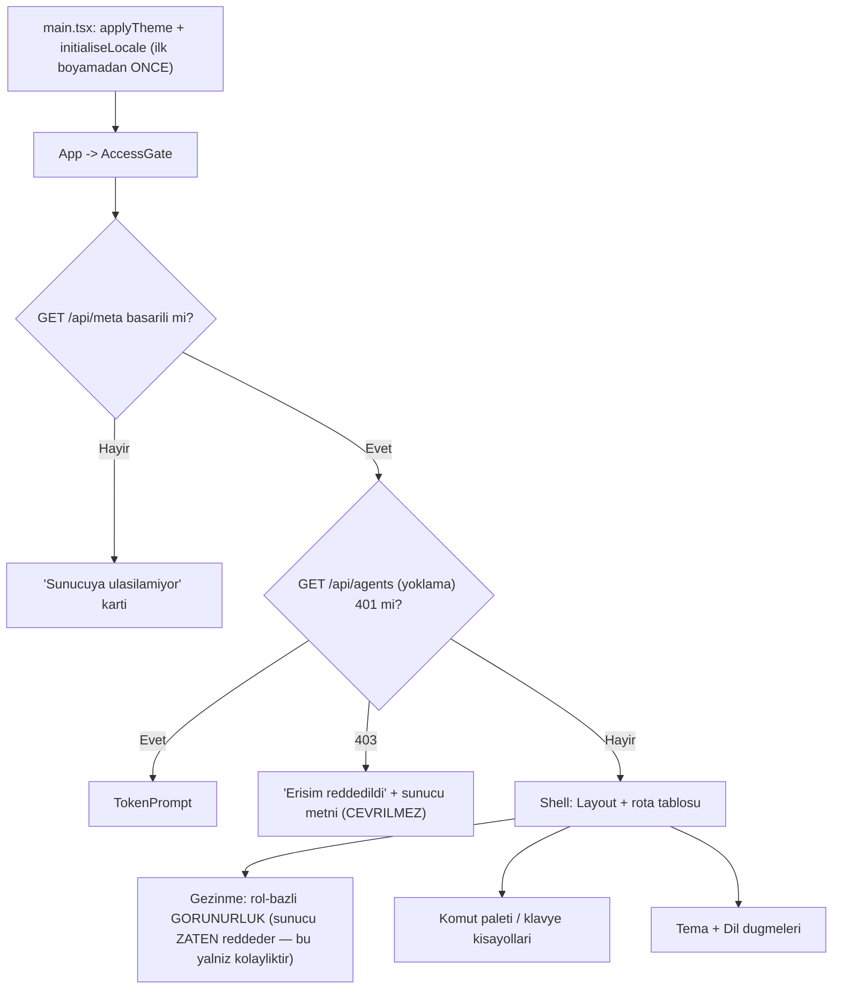

# 09 — Arayüz Genel (`UI`)

> **Alan kodu:** `UI` · **Faz:** 5, 30
> **Kaynak:** `src/AgentPrism.UI/frontend/src/app.tsx` (kabuk, rota tablosu) ·
> `components/access-gate.tsx` (kimlik doğrulama akışı) · `components/layout.tsx`
> (gezinme, tema/dil düğmeleri, klavye bağlamaları) · `components/command-palette.tsx`
> (⌘K paleti, kısayol yardımı) · `lib/router.tsx` (elle yazılmış yönlendirici) ·
> `lib/i18n.tsx` + `locales/en.ts` + `locales/tr.ts` (yerelleştirme) · `lib/theme.ts`
> (tema) · `lib/auth.ts` (bearer token deposu) · `lib/shortcuts.ts` (klavye eşleme
> mantığı) · `components/ui.tsx` (genel bileşenler: `Loading`/`Empty`/`ErrorNote`/
> `Select`/`Table`) · `screens/settings.tsx` (yalnız genel kısım — bkz. Sınır
> tablosu) · `screens/models.tsx` · `screens/tools.tsx`.
>
> Ortam kurulumu, fixture verisi ve reset yordamı [`00-INDEKS.md`](00-INDEKS.md)'dedir.

---

## Bu dosya neyi kanıtlar

Arayüzün **kesişen** (cross-cutting) altyapısı: kabuk açılışı ve kimlik doğrulama
kapısı, gezinme ve rol-bazlı görünürlük (ve bunun bir güvenlik sınırı OLMADIĞI),
komut paleti ve klavye kısayolları, tema, dil (i18n) ve sunucu metninin
**çevrilmediği** tasarım kararı, genel hata/yükleniyor/boş durum bileşenleri,
elle yazılmış yönlendiricinin tuhaflıkları (`/agentprism` ile `/agentprism/`
aynı sayfa, 404 durumu). Ayrıca sahibi olmayan iki basit katalog ekranı
(Modeller, Araçlar) ve Ayarlar ekranının genel (domain'e özgü olmayan) kısmı.



## Sınır: bu dosya nerede biter

| Konu | Nerede |
|---|---|
| Agent/Playground ekranlarının kendi iş akışı | `10-ARAYUZ-AGENT-PLAYGROUND.md` |
| Run/Session detay ekranları, SSE tüketimi | `11-ARAYUZ-RUN-SESSION-SSE.md` |
| Dashboard, maliyet grafikleri | `12-GOZLEMLENEBILIRLIK-MALIYET.md` |
| Ayarlar ekranındaki `QuotaPanel`/`WebhookPanel`/`ApiKeyPanel`/`RetentionPanel`'in kendi CRUD işlevi | `13-KIRACI-VE-GUVENLIK.md` (API anahtarı) · `16-IS-KUYRUGU-VE-ZAMANLAMA.md` (webhook) · `23-SAKLAMA-ARSIV-KOTA.md` (kota, saklama) |
| Skills, Workflows, Jobs, Evals, Experiments, MCP, Approvals, Audit, Diagnostics ekranlarının kendi iş akışı | İlgili alan dosyaları (14, 15, 16, 17, 18, 21, 13, 25) |
| Ses paneli (`voice-panel.tsx`) işlevi | `19-COK-MODLULUK-VE-SES.md` — burada yalnız Ayarlar'daki dil-başına ses tercihi seçicisinin **var olduğu** var |
| Erişilebilirliğin ekran okuyucu derinliği | Kapsam dışı ([`PROMPT.md`](PROMPT.md) §3 kapsam kararı: "ekran okuyucu hariç") |
| Arayüz derlemesinin kendisi (bundle bütçesi, Brotli, `tsc --noEmit`) | [`01-KURULUM-VE-PAKETLEME.md`](01-KURULUM-VE-PAKETLEME.md) (zaten üretildi) |

## Koşmadan önce

1. [`00-INDEKS.md`](00-INDEKS.md) §4 reset yordamı uygulanır.
2. Örnek uygulama çalışır, `AgentPrism:Ui:AuthToken` `manuel-test-token-2026`'dır.
3. Tarayıcı: Chrome (tam), sonra §8'de Safari (kısa) ve dar ekran (kısa).
4. DevTools açık tutulur — birçok case DOM/`localStorage`/`sessionStorage`
   içeriğini incelemeyi gerektirir.

```
http://localhost:5080/agentprism/
```

> Bu dosyada gerçek para harcayan hiçbir case **yoktur** — tamamı arayüz
> davranışı, yerel depolama ve statik metin denetimidir. `03` ve `06.1`'in
> "ADIM" seviyesinde belirttiği agent/model çağrıları YOKTUR.

---

# 1 — Erişim kapısı (`AccessGate`)

`/api/meta` kimlik doğrulaması olmadan erişilir (K-010) — bu ekranın var
olabilmesinin tek sebebi budur: konsolun hangi erişim katmanının açık olduğunu
öğrenebileceği başka bir yol yoktur.

### MT-UI-001 — Bearer token açıkken ilk açılışta token isteme kartı görünür

| | |
|---|---|
| **İzlek** | B |
| **Önem** | Kritik |
| **İlgili faz** | Faz 5 |
| **İlgili karar** | K-010 |

**Ön koşul**
- `AgentPrism:Ui:AuthToken` ayarlı.
- Tarayıcının `sessionStorage`'ında `agentprism.token` anahtarı **yok**
  (yeni bir gizli sekme kullanın veya DevTools → Application → Session Storage
  → temizleyin).

**Adımlar**
1. `http://localhost:5080/agentprism/` adresini aç.

**Beklenen sonuç**
- "AgentPrism" başlığı ve bir token giriş kartı görünür (`access.token.title`).
- Giriş alanı `type="password"`, otomatik odaklanmıştır (`autoFocus`).
- Boş alanla "Devam et" butonu **devre dışıdır**.

**Gerçek sonuç**
"AgentPrism" başlığı ve "Access token required" kartı görünür. Giriş alanı `placeholder="Bearer token"`, sayfa açılışında odaklanmış (`[active]`). Boş alanla "Continue" butonu `[disabled]`. Konsolda `GET /api/agents` 401'i var — bu beklenen yoklama mekanizmasının kendisi (`AccessGate`nin token kartını tetikleyen 401), kusur değil.

**Durum:** ☐ Beklemede · ☑ Geçti · ☐ Kaldı · ☐ Atlandı

---

### MT-UI-002 — Doğru token girilince kabuk açılır ve token sekme boyunca kalıcılaşır

| | |
|---|---|
| **İzlek** | B |
| **Önem** | Yüksek |
| **İlgili faz** | Faz 5 |
| **İlgili karar** | K-047 |

**Ön koşul**
- MT-UI-001'in token kartı görünür durumda.

**Adımlar**
1. `manuel-test-token-2026` yaz, "Devam et"e tıkla.
2. DevTools → Application → Session Storage'ı incele.

**Beklenen sonuç**
- Kabuk (kenar çubuğu + üst çubuk) görünür.
- `sessionStorage['agentprism.token'] = "manuel-test-token-2026"` — `localStorage`
  **DEĞİL** (K-047: token bir sırdır, sekme ömrüyle sınırlıdır).

**Gerçek sonuç**
Doğru token girilince kabuk (kenar çubuğu + üst çubuk, 17 nav öğesi) açıldı, Dashboard ekranına düştü. `sessionStorage['agentprism.token'] = "manuel-test-token-2026"`, `localStorage['agentprism.token'] = null` — doğrulandı.

**Durum:** ☐ Beklemede · ☑ Geçti · ☐ Kaldı · ☐ Atlandı

---

### MT-UI-003 — Yanlış token girilince reddedildi mesajı görünür, yeniden denenebilir

Negatif senaryo.

| | |
|---|---|
| **İzlek** | B |
| **Önem** | Yüksek |
| **İlgili faz** | Faz 5 |
| **İlgili karar** | — |

**Ön koşul**
- `sessionStorage` temiz.

**Adımlar**
1. `FIX-TOKEN-02` (`yanlis-token`) gir, "Devam et"e tıkla.

**Beklenen sonuç**
- Kart kapanmaz; `role="alert"` taşıyan kırmızı bir satır görünür
  (`access.token.rejected` — `AgentPrismEndpointOptions.AuthToken` ayar adını
  metne gömer).
- Giriş alanı hâlâ etkileşimlidir; doğru tokenla yeniden denemek kabuğu açar.

**Gerçek sonuç**
`HATA-S4-001`: `yanlis-token` girilip "Continue"a basılınca kart **sessizce** boş forma döner — `role="alert"` satırı hiç görünmez, giriş alanı temizlenir, buton yeniden devre dışı kalır. Kök neden: `src/AgentPrism.UI/frontend/src/lib/api.ts:155-159`'daki `request()` her 401 yanıtında (yorum: "Dropping it returns the app to the token prompt instead of retrying a credential that is known to be wrong") koşulsuz `setToken(null)` çağırır — bu, yanlış tokenın YOL AÇTIĞI 401'i de kapsar. `access-gate.tsx:53-55`'teki `TokenPrompt failed={token !== null}` render edildiğinde `token` zaten `setToken(null)` ile temizlenmiş olduğundan `failed` her zaman `false` olur; `access.token.rejected` mesajı (satır 110-114) fiilen ölü koddur, hiçbir gerçek akışta render edilemez. Kullanıcı yanlış token girdiğinde NEDEN reddedildiğini görmez.

---

**Aile U (bu koşum).** Kök neden düzeltildi: `src/AgentPrism.UI/frontend/src/lib/auth.ts`'e
`rejectToken()` eklendi — token'ı `null` yapmadan ÖNCE (yalnız o token gerçekten
denenmişse, ilk anonim `probe`'un 401'ini "reddedildi" saymadan) bir `rejected`
bayrağı set eder, yeni `useTokenRejected()` hook'u bunu okur. `api.ts`'teki
`setToken(null)` çağrısı `rejectToken()`'a çevrildi; `access-gate.tsx`
`TokenPrompt failed={token !== null}` yerine `failed={rejected}` kullanıyor.
`setToken()` (yeni token gönderimi VEYA Ayarlar'daki "Forget" çıkışı) bayrağı
temizler. Canlı Postgres'e karşı doğrulandı: `yanlis-token` girilip "Continue"a
basılınca kart artık kapanmıyor, `role="alert"` satırı "The server rejected
that token. Check the value configured in AgentPrismEndpointOptions.AuthToken."
metniyle görünüyor; ardından doğru token girilip tekrar denendiğinde kabuk
normal şekilde açılıyor. Regresyon testi: `src/AgentPrism.UI/frontend/src/lib/auth.test.ts`
(`rejectToken` — token yokken no-op, token varken reddedildi işaretler;
`setToken` — yeni gönderim ve "Forget" ikisi de bayrağı temizler).

**Durum:** ☐ Beklemede · ☑ Geçti · ☐ Kaldı · ☐ Atlandı

---

### MT-UI-004 — Bearer token kapalıyken kabuk hiç token istemeden açılır

Sınır durumu.

| | |
|---|---|
| **İzlek** | B |
| **Önem** | Orta |
| **İlgili faz** | Faz 5 |
| **İlgili karar** | — |

**Ön koşul**
- `dotnet user-secrets remove "AgentPrism:Ui:AuthToken"`, uygulama yeniden başlatıldı.

**Adımlar**
1. Konsolu aç.

**Beklenen sonuç**
- Token kartı **hiç görünmez** — `meta.data.authentication.requiresBearerToken`
  `false` olduğu için `AccessGate` doğrudan `children(meta.data)`'ya düşer.

**Gerçek sonuç**
`GET /api/meta` → `requiresBearerToken:false`. Konsol doğrudan Dashboard'a açıldı, token kartı hiç görünmedi. Not: env değişkenini `unset` etmek yetmedi — alttaki `user-secrets` değeri sızıyordu (config sağlayıcı sırası: env yalnız AYNI anahtar set edilirse user-secrets'ı ezer, unset edilirse alttaki değer geçerli kalır). Boş string (`export AgentPrism__Ui__AuthToken=""`) vermek gerekti — KOSUM-PLANI §2.2'nin zaten belirttiği kural.

**Durum:** ☐ Beklemede · ☑ Geçti · ☐ Kaldı · ☐ Atlandı

> ⚠️ Bu case'i çalıştırdıktan sonra `AuthToken`'ı geri ekleyin — dosyanın geri
> kalanı token açık varsayımıyla yazıldı.

---

### MT-UI-005 — Sunucuya hiç ulaşılamıyorsa "ulaşılamıyor" ekranı görünür

Negatif senaryo / sınır durumu.

| | |
|---|---|
| **İzlek** | B |
| **Önem** | Orta |
| **İlgili faz** | Faz 5 |
| **İlgili karar** | — |

**Ön koşul**
- Örnek uygulama **durdurulmuş**.

**Adımlar**
1. Konsol sayfasını (önceden yüklenmiş bir sekmeden) yeniden yükle ya da
   uygulama kapalıyken doğrudan aç.

**Beklenen sonuç**
- "Sunucuya ulaşılamıyor" başlıklı bir kart görünür (`access.unreachable.title`),
  altında `api/meta` yolunu içeren bir açıklama ve ham `fetch` hata metni vardır.
- Sayfa beyaz ekran ya da konsolda yakalanmamış bir istisna **vermez**.

**Gerçek sonuç**
`HATA-S4-002`: Ne "önceden yüklenmiş sekmeden yeniden yükle" ne de "kapalıyken doğrudan aç" adımı belgelenen özel "Sunucuya ulaşılamıyor" kartını üretti. Kestrel tamamen durunca **aynı origin** hem statik kabuğu (`index.html`/JS) hem API'yi sunduğu için tam sayfa yenilemesi ağ seviyesinde `net::ERR_CONNECTION_REFUSED` ile başarısız olur — tarayıcının KENDİ çevrimdışı hata sayfası görünür, React hiç çalışmaz. `GET /agentprism/` yanıtı `Cache-Control: no-cache` taşıdığından disk önbelleğinden de sunulamaz. Kabuk zaten yüklüyken (React çalışırken) sunucuyu durdurup senkronize `focus`/`visibilitychange` olayı tetiklemeyi denedim — TanStack Query'nin `meta` sorgusu yeniden getirilmedi (arka planda gerçek bir odak kaybı/kazanımı olmadığı için tetiklenmedi), dolayısıyla `meta.isError` dalı (`access-gate.tsx:36-49`) bu koşumda hiç gözlemlenemedi. **Kapsam:** Bu, kod aynı origin'den statik+API sunduğu ve service worker/offline kabuk olmadığı sürece HER tarayıcıda böyledir — düzeltmesi (ayrı statik host veya service worker) altyapısal bir karardır, basit bir kod düzeltmesi değildir.

---

**🔧 Kapanış güncellemesi (2026-08-15, Aile V — kısmi düzeltme).** Case'in
kendi ayırdığı İKİ senaryodan yalnız BİRİ kod ile kapatılabilir durumdaydı:

1. **Soğuk tam sayfa yenileme / kapalıyken doğrudan açma** — tarayıcı ağ
   seviyesinde `net::ERR_CONNECTION_REFUSED` alıyor, React hiç çalışmıyor.
   Case'in kendi metninin de açıkça yazdığı gibi bu "altyapısal bir karar"
   (ayrı statik host veya service worker) gerektirir — kapsam DIŞI kalır,
   kod ile çözülemez.
2. **Kabuk zaten yüklüyken sunucu çöker** — bu senaryoda `access-gate.tsx`'in
   `meta.isError` dalı zaten VARDI ama tetiklenmek için TanStack Query'nin
   `refetchOnWindowFocus`'una bağımlıydı; sentetik bir `focus` olayı bunu
   tetiklemedi (gerçek bir pencere odak kaybı/kazanımı olmadığı için) ve
   periyodik bir kontrol de yoktu — açık bir sekme sunucunun öldüğünü hiçbir
   zaman fark etmeyebilirdi. `meta` sorgusuna `refetchInterval: 30_000`
   eklendi; TanStack Query v5'in kendi sözleşmesi gereği (decompile/tip
   incelemesiyle doğrulandı: `QueryObserverRefetchErrorResult`) başarılı bir
   sorgunun ARKA PLAN yenilemesi başarısız olduğunda `data` önbellekten
   korunsa bile `isError`/`status: "error"` DOĞRU şekilde `true` olur —
   yalnız TETİKLEYİCİ eksikti, periyodik `refetchInterval` bunu kapatır.

Bu, MADDE 2'yi (aktif bir sekmenin sınırlı sürede kopukluğu fark etmesi)
kapsamlı olarak kapatır; MADDE 1 (soğuk yenileme) `HATA-S4-002` olarak
Kaldı'da kalmaya devam eder — gerekçe koddan değil tarayıcı mimarisinden
kaynaklanıyor.

**Durum:** ☐ Beklemede · ☐ Geçti · ☑ Kaldı · ☐ Atlandı

Case'in kendi ön koşulu ("Örnek uygulama durdurulmuş") madde 1'i (soğuk
yenileme) test ediyor — bu yüzden case bütünüyle Kaldı kalır; madde 2'nin
düzeltmesi ayrı bir gelecek koşumda (kabuk yüklüyken sunucu çökmesi
senaryosu) doğrulanabilir.

---

### MT-UI-006 — Token sekmeye özeldir: yeni bir sekme yeniden sorar

Sınır durumu — tasarım kararının doğrulaması.

| | |
|---|---|
| **İzlek** | B |
| **Önem** | Orta |
| **İlgili faz** | Faz 5 |
| **İlgili karar** | K-047 |

**Ön koşul**
- MT-UI-002 geçti (mevcut sekmede token girilmiş).

**Adımlar**
1. Aynı adresi **yeni bir sekmede** aç (aynı tarayıcı penceresi, `Cmd/Ctrl+T`).

**Beklenen sonuç**
- Yeni sekme token kartını **yeniden gösterir** — `sessionStorage` sekmeye
  özeldir, ilk sekmedeki token ikinci sekmeye kopyalanmaz. Bu bir kusur
  değildir, `lib/auth.ts`'in belgelenmiş tasarım kararıdır.

**Gerçek sonuç**
Sekme 0'da token girilip kabuk açıldıktan sonra bağımsız açılan sekme 1 (aynı adres) token kartını yeniden gösterdi — doğrulandı.

**Durum:** ☐ Beklemede · ☑ Geçti · ☐ Kaldı · ☐ Atlandı

---

### MT-UI-007 — Ayarlar'dan "Unut" butonu token'ı siler, kapı yeniden kapanır

| | |
|---|---|
| **İzlek** | B |
| **Önem** | Orta |
| **İlgili faz** | Faz 5 |
| **İlgili karar** | — |

**Ön koşul**
- Kabuk açık (token girilmiş).

**Adımlar**
1. Ayarlar ekranına git, "Erişim" panelinde "Bu sekme" satırındaki "Unut"a tıkla.

**Beklenen sonuç**
- `sessionStorage['agentprism.token']` silinir.
- Sayfa yeniden token kartını gösterir (herhangi bir arka plan sorgusu 401
  aldığı an `AccessGate` yeniden `TokenPrompt`'a düşer).

**Gerçek sonuç**
Ayarlar → Erişim → "This tab" → "Forget"a tıklanınca `sessionStorage['agentprism.token']` silindi ve sayfa anında token kartına düştü — doğrulandı.

**Durum:** ☐ Beklemede · ☑ Geçti · ☐ Kaldı · ☐ Atlandı

---

### MT-UI-008 — 403 (uzak erişim kapalı) durumunda sunucu metni olduğu gibi görünür

Negatif senaryo.

| | |
|---|---|
| **İzlek** | B |
| **Önem** | Orta |
| **İlgili faz** | Faz 5, 9 |
| **İlgili karar** | — |

Bu case'in derinlemesine matrisi `13-KIRACI-VE-GUVENLIK.md`'dedir; burada
yalnız arayüzün 403'ü **nasıl gösterdiği** doğrulanır.

**Ön koşul**
- `AllowRemoteAccess = false` (varsayılan) — konsolu loopback DIŞI bir adresten
  açmak gerekir (örnek: makinenin LAN IP'si, `http://<lan-ip>:5080/agentprism/`).

**Adımlar**
1. Loopback dışı bir adresten konsolu aç.

**Beklenen sonuç**
- "Erişim reddedildi" kartı görünür; gövde metni **sunucudan gelen ham metni**
  taşır (yorum: `// Server text, shown as it came`).
- `allowRemoteAccess: false` olduğu için ek bir "uzak erişim kapalı" ipucu
  satırı da görünür (`access.denied.remote`).

**Gerçek sonuç**
`HATA-S4-003` (Yüksek): Loopback dışı bir adresten (`http://192.168.1.102:5084/agentprism/`, `AllowRemoteAccess=false`) konsolu açınca "Erişim reddedildi" kartı **hiç görünmedi** — tarayıcı yalnızca sunucunun ham `ProblemDetails` JSON gövdesini düz metin olarak gösterdi (`{"type":"...","title":"Uzak erisim kapali","status":403,...}`), React hiç çalışmadı. Kök neden: `src/AgentPrism.AspNetCore/Security/AgentPrismEndpointFilter.cs:72-80`'deki loopback denetimi `_allowRemoteAccess` bayrağına bakar ve **`requireBearerToken` parametresinden bağımsız** her uca (statik kabuk ucu dahil) aynı şekilde uygulanır. Sınıfın kendi XML yorumu (satır 42-49) tam olarak bu sınıfın bearer-token içi bir benzer sorunu ÇÖZDÜĞÜNÜ anlatır ("kabuk `requireBearerToken:false` ile çağrılır, yoksa kullanıcı token girebileceği ekranı hiç göremez") ama aynı çözüm loopback denetimine UYGULANMAMIŞ — kabuk ucu da loopback dışı istekte 403 JSON döner, SPA hiç yüklenmez, dolayısıyla `access-gate.tsx`'in "Erişim reddedildi" kartı hiçbir zaman render edilemez. `access.denied.remote` ipucu satırı da aynı nedenle görünmez.

---

**Yeniden koşum (Aile M, KAPANIS-PLANI.md).** `AgentPrismEndpointFilter`'a yeni bir
`requireLoopback` parametresi eklendi (varsayılan `true`); kabuk grubu
(`MapUi`) artık `requireLoopback: false` ile kuruluyor — tıpkı bearer token
muafiyeti gibi. Veri uçlarındaki asıl korumalı grup (`api/agents` vb.)
değişmedi, loopback kısıtı orada `true` kalıyor. Canlı Postgres'e karşı
(`AuthToken` geçici olarak `dotnet user-secrets remove` ile kaldırılıp
doğrulama sonrası geri eklendi — yalnız remote-access katmanını izole etmek
için) LAN IP'den (`http://192.168.1.102:5090/agentprism/`) gerçek bir
Playwright oturumuyla tekrar üretildi: kabuk artık yükleniyor, React çalışıyor
ve `AccessGate` "Access denied" kartını sunucunun ham `detail` metniyle
(`"AgentPrism uclari varsayilan olarak..."`) ve `access.denied.remote`
ipucuyla (`"Remote access is off. ..."`) doğru şekilde gösteriyor. Veri ucu
(`/api/agents`) aynı LAN IP'den hâlâ `403`/`"Uzak erisim kapali"` döndürmeye
devam ediyor — koruma kaybolmadı, yalnızca kabuğun kendisi artık React'i
başlatabiliyor. Regresyon testi:
`tests/AgentPrism.AspNetCore.FunctionalTests/SecurityTests.cs`
`Kabuk_loopback_disi_istekte_hala_yuklenir_HATA_S4_003` (fix geri alınıp
koşulduğunda `Forbidden` ile KIRMIZI verdiği ampirik olarak doğrulandıktan
sonra fix geri uygulandı).

**Durum:** ☐ Beklemede · ☑ Geçti · ☐ Kaldı · ☐ Atlandı

---

# 2 — Gezinme kabuğu ve rol-bazlı görünürlük

### MT-UI-009 — 17 nav öğesi doğru sırada, doğru rotalara gider

| | |
|---|---|
| **İzlek** | B |
| **Önem** | Orta |
| **İlgili faz** | Faz 5 |
| **İlgili karar** | — |

**Ön koşul**
- Kabuk açık, `canAdminister: true` (yönetici rolü ya da rol politikaları hiç
  kayıtlı değil — bu durumda `RequireRole` hiçbir şey eklemez ve varsayılan
  eski davranış geçerlidir).

**Adımlar**
1. Kenar çubuğundaki her öğeye sırayla tıkla.

**Beklenen sonuç**
- Sıra: Agents, Dashboard, Playground, Sessions, Workflows, Jobs, Evals,
  Experiments, Runs, Tools, Skills, Models, MCP, Approvals, Audit, Diagnostics,
  Settings.
- Her tıklama URL'yi değiştirir (`window.history.pushState`, tam sayfa
  yenilemesi **olmaz**) ve ilgili ekranı yükler.

**Gerçek sonuç**
Kenar çubuğu snapshot'ı 17 öğeyi tam belirtilen sırayla listeledi: Agents, Dashboard, Playground, Sessions, Workflows, Jobs, Evals, Experiments, Runs, Tools, Skills, Models, MCP, Approvals, Audit, Diagnostics, Settings. "Agents"e tıklandı: URL `/agentprism/agents`'a değişti, ilgili ekran yüklendi; tıklama öncesi `window` üzerine konan bir işaretçi (`window.__navtest`) tıklamadan SONRA hâlâ mevcuttu — tam sayfa yenilemesi olmadığı doğrulandı.

**Durum:** ☐ Beklemede · ☑ Geçti · ☐ Kaldı · ☐ Atlandı

---

### MT-UI-010 — Reader rolüyle Audit/Diagnostics nav öğeleri görünmez

Negatif senaryo.

| | |
|---|---|
| **İzlek** | B |
| **Önem** | Yüksek |
| **İlgili faz** | Faz 5, 9 |
| **İlgili karar** | — |

**Ön koşul**
- Rol politikaları kayıtlı ve `Reader` rolündeki bir API anahtarıyla oturum
  açılmış (derin kurulum `13-KIRACI-VE-GUVENLIK.md`'dedir).

**Adımlar**
1. Kenar çubuğunu incele.

**Beklenen sonuç**
- "Audit" ve "Diagnostics" öğeleri kenar çubuğunda **yoktur**
  (`meta.roles.canAdminister === false` → `NAV.filter` bu iki öğeyi eler).
- Komut paletindeki (⌘K) navigasyon listesinde de Audit **yoktur** (MT-UI-021).

**Gerçek sonuç**
Atlandı: `13-KIRACI-VE-GUVENLIK.md` §8'in tek belgelenmiş rol-test iskelesi (`RoleTestAuthHandler`) rolü özel bir `X-Test-Role` HTTP başlığından okur. Tarayıcının `AccessGate`/`TokenPrompt` giriş akışı yalnızca `Authorization: Bearer <token>` başlığı gönderir — `X-Test-Role` göndermenin belgelenmiş hiçbir yolu yok. Bu case'i tarayıcıda gerçekten koşturmak, dokümante edilmemiş yeni bir tarayıcı-uyumlu rol şeması icat etmeyi gerektirir; bu, KOSUM-PLANI'nin kod değiştirilmez ilkesinin ve "belirsiz kurulum icat etme" sınırının dışında. `curl` ile eşdeğeri zaten `13-KIRACI-VE-GUVENLIK.md`'nin `MT-SEC-08x` serisinde koşulmuştu (bkz. `SONUCLAR-S2-2026-08-13.md`).

**Durum:** ☐ Beklemede · ☐ Geçti · ☐ Kaldı · ☑ Atlandı

---

### MT-UI-011 — Gizlenen nav öğesine doğrudan URL ile gidilirse sunucu YİNE reddeder

Negatif senaryo — güvenlik sınırının doğrulaması.

| | |
|---|---|
| **İzlek** | B |
| **Önem** | Kritik |
| **İlgili faz** | Faz 5, 9 |
| **İlgili karar** | — |

Kodun kendi yorumu bunu açıkça söyler: *"A hidden nav item is a UX courtesy,
not a security boundary: the server is still the only real enforcement."* Bu
case iddiayı ölçer — istemci gizlemesi **atlanabilir** olmalı ve sunucu yine de
durmalı.

**Ön koşul**
- MT-UI-010'un `Reader` oturumu.

**Adımlar**
1. Adres çubuğuna doğrudan `http://localhost:5080/agentprism/audit` yaz, Enter'a bas.

**Beklenen sonuç**
- Rota istemci tarafında **eşleşir** (`AuditScreen` render edilir — rota
  tablosu rol denetimi yapmaz) ama ekran içindeki veri sorgusu sunucudan
  `403` alır ve `role="alert"` taşıyan bir `ErrorNote` gösterir. Sayfa
  **çökmez**, ham denetim verisi görünmez.

**Gerçek sonuç**
Atlandı — MT-UI-010 ile aynı gerekçe: `Reader` oturumu tarayıcıda kurulamıyor (bkz. MT-UI-010'un notu).

**Durum:** ☐ Beklemede · ☐ Geçti · ☐ Kaldı · ☑ Atlandı

---

### MT-UI-012 — Aktif rota kenar çubuğunda vurgulanır

| | |
|---|---|
| **İzlek** | B |
| **Önem** | Düşük |
| **İlgili faz** | Faz 5 |
| **İlgili karar** | — |

**Ön koşul**
- Kabuk açık.

**Adımlar**
1. "Workflows"a git.

**Beklenen sonuç**
- "Workflows" öğesi koyu arka plan + solda renkli bir şerit ile vurgulanır;
  diğer öğeler vurgusuzdur. `workflows/new` gibi bir alt rotada da (URL'nin
  ilk segmenti `workflows` olduğu için) aynı öğe vurgulu kalır.

**Gerçek sonuç**
`/workflows`e gidince "Workflows" öğesi `bg-raised text-fg` sınıfını aldı, diğerleri `text-muted` kaldı. Alt rota `/workflows/new`e gidince de "Workflows" vurgusu korundu — doğrulandı.

**Durum:** ☐ Beklemede · ☑ Geçti · ☐ Kaldı · ☐ Atlandı

---

### MT-UI-013 — Dar ekranda yan menü gizlenir, üstte yatay kaydırılabilir menü belirir

Sınır durumu.

| | |
|---|---|
| **İzlek** | B |
| **Önem** | Orta |
| **İlgili faz** | Faz 5 |
| **İlgili karar** | — |

Kırılma noktası Tailwind'in varsayılan `md` (768px) sınırıdır — projede özel
bir `screens` geçersiz kılması yoktur (`grep -n "@theme" styles.css` tek
eşleşmeyi verdi, `screens` anahtarı yoktu).

**Ön koşul**
- Kabuk açık.

**Adımlar**
1. DevTools → Device toolbar → genişliği 768px'in altına indir (örnek: 600px).

**Beklenen sonuç**
- Sol kenar çubuğu (`hidden md:flex`) kaybolur.
- Üst çubukta yatay kaydırılabilir, kompakt bir nav şeridi belirir
  (`flex items-center gap-1 overflow-x-auto md:hidden`).
- Dil/tema düğmeleri ve `v{sürüm}` etiketi üst çubukta kalmaya devam eder.

**Gerçek sonuç**
600px genişlikte sol kenar çubuğu (`complementary`) kayboldu, nav öğeleri üst çubuğa (`banner`) taşındı. `header.textContent` içinde dil düğmesi (`en`) ve `v0.0.0-preview.0.88` etiketi hâlâ mevcuttu — üçü de doğrulandı.

**Durum:** ☐ Beklemede · ☑ Geçti · ☐ Kaldı · ☐ Atlandı

---

### MT-UI-014 — Depolama notu bellek içi/kalıcı durumu doğru renkle gösterir

| | |
|---|---|
| **İzlek** | B |
| **Önem** | Orta |
| **İlgili faz** | Faz 5 |
| **İlgili karar** | — |

**Ön koşul**
- Kalıcılık **kapalı** (`UsePostgreSql()` çağrılmamış bir kurulum — bellek içi).

**Adımlar**
1. Kenar çubuğunun en altındaki depolama notunu incele.

**Beklenen sonuç**
- Uyarı rengi (`bg-warn`) nokta + "bellek içi" metni + ek bir "geçici" satırı
  (`shell.storage.volatile`) görünür.
- `UsePostgreSql()` açıkken aynı yer başarı rengi (`bg-success`) nokta + "kalıcı"
  metnini gösterir, ek satır **yoktur**.

**Gerçek sonuç**
PostgreSQL açıkken: `<span class="...bg-success">` + "Persistent storage", ek satır yok. `PostgreSql:ConnectionString` boşaltılıp yeniden başlatılınca (`/api/meta` → `persistent:false`, `InMemory*Store`): `<span class="...bg-warn">` + "In-memory storage" + `<span class="block text-subtle">Data is lost when the process exits.</span>`. İkisi de doğrulandı.

**Durum:** ☐ Beklemede · ☑ Geçti · ☐ Kaldı · ☐ Atlandı

---

### MT-UI-015 — Bilinmeyen bir rota "sayfa bulunamadı" boş durumunu gösterir

Negatif senaryo.

| | |
|---|---|
| **İzlek** | B |
| **Önem** | Orta |
| **İlgili faz** | Faz 5 |
| **İlgili karar** | — |

**Ön koşul**
- Kabuk açık.

**Adımlar**
1. Adres çubuğuna `http://localhost:5080/agentprism/hic-boyle-bir-rota` yaz.

**Beklenen sonuç**
- Kabuk (kenar çubuğu, üst çubuk) **normal görünür** — yalnız içerik alanı
  `shell.notFound.title`/`shell.notFound.body` metinli bir `Empty` gösterir.
- Kenar çubuğunda hiçbir öğe aktif görünmez (hiçbir `pattern` eşleşmedi).
- Konsol çökmez, beyaz ekran vermez.

**Gerçek sonuç**
`/hic-boyle-bir-rota`ya gidince kabuk (kenar çubuğu + üst çubuk) normal kaldı, içerik alanında "Page not found" / "The address does not match any screen in this console." göründü. Hiçbir nav öğesinin tam `bg-raised` sınıfı yoktu (yalnız hover pseudo-class token'ı vardı, aktif değildi). Konsol çökmedi, beyaz ekran yoktu.

**Durum:** ☐ Beklemede · ☑ Geçti · ☐ Kaldı · ☐ Atlandı

---

### MT-UI-016 — Tarayıcının geri/ileri düğmeleri konsol içi gezinmeyi senkronlar

| | |
|---|---|
| **İzlek** | B |
| **Önem** | Orta |
| **İlgili faz** | Faz 5 |
| **İlgili karar** | — |

**Ön koşul**
- Kabuk açık.

**Adımlar**
1. Dashboard → Agents → Runs sırasıyla gez.
2. Tarayıcının "Geri" düğmesine iki kez bas.
3. "İleri" düğmesine bir kez bas.

**Beklenen sonuç**
- Adım 2 sonunda ekran Dashboard'dadır (URL de eşleşir).
- Adım 3 sonunda ekran Agents'tadır — `popstate` olayı `RouterProvider`'ın
  dinleyicisi tarafından yakalanır ve React durumunu günceller (tam sayfa
  yenilemesi **olmaz**, kenar çubuğu vurgusu da doğru öğeye kayar).

**Gerçek sonuç**
SPA link tıklamalarıyla Dashboard → Agents → Runs gezildi. `goBack()` iki kez: sırasıyla Agents, sonra Dashboard'a döndü — URL de eşleşti. `history.forward()` (tarayıcı İleri düğmesiyle aynı `popstate` olayı) bir kez: Agents'a geçti, kenar çubuğunda "Agents" `bg-raised` ile vurgulandı — doğrulandı.

**Durum:** ☐ Beklemede · ☑ Geçti · ☐ Kaldı · ☐ Atlandı

---

### MT-UI-017 — `/agentprism` ile `/agentprism/` aynı sayfayı gösterir

Sınır durumu.

| | |
|---|---|
| **İzlek** | B |
| **Önem** | Düşük |
| **İlgili faz** | Faz 5 |
| **İlgili karar** | — |

`toRelativePath`'in kendi yorumu bu tuzağı açıkça anlatır: sondaki eğik
çizginin olmaması "sayfa bulunamadı" üretebilirdi.

**Ön koşul**
- Kabuk açık.

**Adımlar**
1. Adres çubuğuna sondaki `/` OLMADAN `http://localhost:5080/agentprism` yaz.

**Beklenen sonuç**
- Dashboard (kök rota) görünür — `hic-boyle-bir-rota`'nın aksine (MT-UI-015)
  "sayfa bulunamadı" **görünmez**.

**Gerçek sonuç**
`http://localhost:5084/agentprism` (sondaki `/` olmadan) Dashboard'u doğrudan gösterdi — "sayfa bulunamadı" görünmedi.

**Durum:** ☐ Beklemede · ☑ Geçti · ☐ Kaldı · ☐ Atlandı

---

# 3 — Komut paleti ve klavye kısayolları

### MT-UI-018 — `⌘K`/`Ctrl+K` paleti açar, giriş alanına odaklanır

| | |
|---|---|
| **İzlek** | B |
| **Önem** | Yüksek |
| **İlgili faz** | Faz 30 |
| **İlgili karar** | — |

**Ön koşul**
- Kabuk açık, odak sayfanın boş bir yerinde (bir metin alanında **değil**).

**Adımlar**
1. `Cmd+K` (macOS) veya `Ctrl+K` bas.

**Beklenen sonuç**
- `role="dialog" aria-modal="true"` taşıyan palet açılır, arama giriş alanı
  otomatik odaklanır.
- `Cmd/Ctrl+K` bir **metin alanı içindeyken de** çalışır (`insideText: true`) —
  örnek: Playground'un istem kutusuna yazarken de palet açılabilir.

**Gerçek sonuç**
`Cmd+K` basıldığında `role="dialog" aria-modal="true"` taşıyan palet açıldı,
`document.activeElement` `role="combobox"` (`aria-label="Jump to a screen, an
agent or a run"`) taşıyan giriş alanıydı. Playground ekranında istem kutusu
(`textbox "Send a message…"`) odaktayken de `Cmd+K` aynı şekilde paleti açtı
ve odak yine combobox'a geçti — `insideText: true` davranışı doğrulandı.

**Durum:** ☐ Beklemede · ☑ Geçti · ☐ Kaldı · ☐ Atlandı

---

### MT-UI-019 — Ok tuşlarıyla gezinme + Enter seçili komutu çalıştırır

| | |
|---|---|
| **İzlek** | B |
| **Önem** | Yüksek |
| **İlgili faz** | Faz 30 |
| **İlgili karar** | — |

**Ön koşul**
- Palet açık.

**Adımlar**
1. `agents` yaz.
2. Ok-aşağı ile ikinci sonuca in.
3. Enter'a bas.

**Beklenen sonuç**
- Vurgulu satır `aria-selected="true"` taşır ve görünür alanda kalır
  (`scrollIntoView`).
- Enter, o an vurgulu komutun `perform()`'unu çalıştırır ve palet kapanır
  (navigasyon komutuysa ilgili ekrana gidilir).

**Gerçek sonuç**
`agents` yazınca liste iki sonuca daraldı: 1) "Go to Agents" (otomatik seçili,
`aria-selected="true"`), 2) "Run OpenRouter Destek in the playground" (fuzzy
eşleşme — "Agent" kelimesi eşleşiyor). Ok-aşağı basınca seçim ikinci satıra
geçti (`aria-selected="true"` ikinci `option`'a taşındı, birincisi `false`
oldu). Enter'a basınca palet kapandı ve URL
`/agentprism/playground/openrouter-destek`'e gitti — vurgulu komutun
`perform()`'u doğru çalıştı.

**Durum:** ☐ Beklemede · ☑ Geçti · ☐ Kaldı · ☐ Atlandı

---

### MT-UI-020 — `Esc` paleti kapatır, `Tab` yalnız giriş alanında kalır

| | |
|---|---|
| **İzlek** | B |
| **Önem** | Orta |
| **İlgili faz** | Faz 30 |
| **İlgili karar** | — |

**Ön koşul**
- Palet açık.

**Adımlar**
1. `Tab` tuşuna birkaç kez bas.
2. `Esc` tuşuna bas.

**Beklenen sonuç**
- Adım 1: odak giriş alanından **hiç çıkmaz** (`event.key === 'Tab'` içeride
  `preventDefault()` ile yutuluyor — "odak tuzağı" bilinçli olarak yalnızca
  tek bir odaklanabilir öğeyle uygulanmış).
- Adım 2: palet kapanır, odak paleti açan öğeye (⌘K düğmesi) döner.

**Gerçek sonuç**
Adım 1 geçti: birkaç `Tab` sonrası `document.activeElement` hâlâ
`role="combobox"` girdi alanıydı — `preventDefault()` odak tuzağı doğrulandı.
Adım 2 kısmen geçti: `Esc` palet diyaloğunu kapattı (`role="dialog"` DOM'dan
kalktı) ama odak `⌘K` düğmesine (`data-testid="palette-open"`) DÖNMEDİ —
`document.activeElement` `BODY`'ye düştü. `data-testid="palette-open"`
düğmesini elle tıklayarak paleti açıp aynı adımları tekrarladığımda da aynı
sonuç: `Esc` sonrası odak `document.body`'de kaldı.

**Kaldı** — kök neden: `src/AgentPrism.UI/frontend/src/components/layout.tsx:157`
`onClose={() => setPalette(false)}` yalnızca durumu kapatıyor, açılışta hangi
öğenin odakta olduğunu tutan bir `ref` yok. `command-palette.tsx:117-122`'deki
`Escape` dalı da yalnızca `onClose()` çağırıyor, bir focus-restore çağrısı
yok. Karşılaştırma: aynı dosyadaki `ShortcutHelp` (satır 376-378) kendi "Kapat"
butonuna `close.current?.focus()` ile odaklanıyor — ama o da açılıştaki
kendi butonuna odaklanma, palet'i açan öğeye DÖNME değil. `HATA-S4-004`.

---

**Aile U (bu koşum).** `command-palette.tsx`'e `trigger` ref'i eklendi: palet
açılırken (`open` `false`→`true`) `document.activeElement` (⌘K düğmesi
tıklamayla açıldıysa düğmenin kendisi, klavye kısayoluyla açıldıysa odak zaten
neredeyse orası) kaydedilir; kapanırken (`open` `true`→`false`) o elemana
`.focus()` çağrılır. Tek `useEffect`, `open`'a bağlı — mevcut "açılışta input'a
odaklan" efektiyle birleştirildi, yeni bir efekt eklenmedi. Canlı sunucuda
doğrulandı: ⌘K düğmesine tıklanıp `Esc`'e basıldığında `document.activeElement`
tekrar `[data-testid="palette-open"]`. Regresyon testi:
`tests/AgentPrism.Ui.E2ETests/UiTests.cs`
`Komut_paleti_Esc_sonrasi_odagi_acan_dugmeye_dondurur` (gerçek tarayıcı,
`document.activeElement` doğrudan kontrol edilir).

**Durum:** ☐ Beklemede · ☑ Geçti · ☐ Kaldı · ☐ Atlandı

---

### MT-UI-021 — Reader rolünde "Yeni agent"/"Yeni workflow" eylemleri palette görünmez

Negatif senaryo.

| | |
|---|---|
| **İzlek** | B |
| **Önem** | Yüksek |
| **İlgili faz** | Faz 30, 9 |
| **İlgili karar** | — |

**Ön koşul**
- MT-UI-010'un `Reader` oturumu.

**Adımlar**
1. Paleti aç, boş sorguyla eylem grubunu incele.

**Beklenen sonuç**
- "Yeni agent" ve "Yeni workflow" komutları **yoktur**
  (`meta.roles.canAdminister` kontrolü). Tema değiştirme, dil değiştirme ve
  kısayol yardımı komutları rol bağımsız olduğu için **görünmeye devam eder**.
- Navigasyon listesinde "Audit" **yoktur** (MT-UI-010 ile tutarlı).

**Gerçek sonuç**
Atlandı — MT-UI-010/011 ile aynı yapısal engel: `Reader` rolündeki bir oturum
tarayıcıda kurulamıyor (`X-Test-Role` başlığı `AccessGate`'in
`Authorization: Bearer` akışıyla gönderilemiyor, bkz. MT-UI-010'un notu).
`canAdminister` filtresinin kod tarafı (`usePaletteCommands` içindeki
`meta.roles.canAdminister` kontrolleri, `command-palette.tsx`) `Admin`
oturumunda zaten "Yeni agent"/"Yeni workflow" komutlarının GÖRÜNDÜĞÜ gözlemiyle
(bu oturumun `roles.canAdminister:true` olduğu `/api/meta` yanıtından
doğrulandı) dolaylı olarak tutarlı, ama negatif tarafı (rol kapalıyken komutun
YOK olması) tarayıcıda ölçülemedi.

**Durum:** ☐ Beklemede · ☐ Geçti · ☐ Kaldı · ☑ Atlandı

---

### MT-UI-022 — `g a` gibi iki tuşlu diziler doğru rotaya gider, 1.2 saniyede zaman aşımına uğrar

Sınır durumu.

| | |
|---|---|
| **İzlek** | B |
| **Önem** | Orta |
| **İlgili faz** | Faz 30 |
| **İlgili karar** | — |

`SEQUENCE_TIMEOUT_MS = 1_200` sabiti kaynaktan doğrulandı.

**Ön koşul**
- Kabuk açık, odak metin alanı dışında.

**Adımlar**
1. `g` bas, hemen ardından `a` bas → Agents'a gitmeli.
2. `g` bas, **2 saniye bekle**, sonra `a` bas.

**Beklenen sonuç**
- Adım 1: Agents ekranına gidilir.
- Adım 2: dizi zaman aşımına uğradığı için **hiçbir şey olmaz** — `a` tek
  başına bir kısayola bağlı olmadığından yok sayılır (sayfa metin alanı dışında
  olduğu için tarayıcının varsayılan davranışı da tetiklenmez).

**Gerçek sonuç**
Adım 1: `g` sonra hemen `a` (`document.dispatchEvent(new KeyboardEvent('keydown', ...))` ile
gerçek `keydown` olayları tetiklendi) → `location.pathname`
`/agentprism/agents`'a geçti. Adım 2: `g` bas, 2.2 sn bekle, sonra `a` bas →
`location.pathname` `/agentprism/dashboard`'da kaldı, hiçbir gezinme
olmadı. Konsol hatası/uyarı yok (`browser_console_messages` boş).

**Durum:** ☐ Beklemede · ☑ Geçti · ☐ Kaldı · ☐ Atlandı

---

### MT-UI-023 — Metin alanına yazarken `g` yalnızca harf olarak yazılır

Negatif senaryo / sınır durumu.

| | |
|---|---|
| **İzlek** | B |
| **Önem** | Orta |
| **İlgili faz** | Faz 30 |
| **İlgili karar** | — |

**Ön koşul**
- Playground ekranı, istem kutusu (bir `textarea`) odakta.

**Adımlar**
1. İstem kutusuna `merhaba` yaz.

**Beklenen sonuç**
- Kutuda tam olarak `merhaba` görünür — `g` harfinden sonra bir sonraki tuş
  vuruşu bir gezinme dizisi olarak **yutulmaz** (`prefixes.has(chord)` denetimi
  `!context.inTextEntry` şartına bağlıdır; metin alanındayken diziler hiç
  kurulmaz).

**Gerçek sonuç**
Playground istem kutusuna (`textarea[data-testid=playground-input]`) harf harf
(`pressSequentially`) `merhaba` yazıldı; kutunun `.value`'su tam olarak
`"merhaba"` — `g` harfinden sonraki `e` bir gezinme dizisi olarak yutulmadı,
hiçbir karakter kayıp değil.

**Durum:** ☐ Beklemede · ☑ Geçti · ☐ Kaldı · ☐ Atlandı

---

### MT-UI-024 — `/` tuşu sayfadaki arama kutusuna odaklanır

| | |
|---|---|
| **İzlek** | B |
| **Önem** | Düşük |
| **İlgili faz** | Faz 30 |
| **İlgili karar** | — |

**Ön koşul**
- `data-search` özniteliği taşıyan bir arama kutusu bulunan bir ekran (örnek:
  Agents listesi) açık, odak o kutuda **değil**.

**Adımlar**
1. `/` tuşuna bas.

**Beklenen sonuç**
- Sayfadaki `input[data-search]` odaklanır ve içeriği seçili gelir
  (`.select()`) — üzerine yazmaya hazır.
- Böyle bir kutu taşımayan bir ekranda (örnek: Dashboard) `/` hiçbir şey
  yapmaz, hata vermez.

**Gerçek sonuç**
Ön koşulun kendisi kod tarafında YANLIŞ: `input[data-search]` deseni
YALNIZCA tüketen tarafta var (`src/AgentPrism.UI/frontend/src/components/
layout.tsx:202`); tüm `src/AgentPrism.UI/frontend/src/screens/*.tsx` dosyaları
grep'lendi (`grep -rln "data-search" screens/`) — **sıfır** eşleşme. Agents
listesi (kod okuması VE canlı DOM anlık görüntüsüyle doğrulandı) hiç arama
kutusu içermiyor; hiçbir ekran içermiyor. `/`'nin bu davranışı `?` kısayol
yardımında kullanıcıya `shortcuts.focusSearch` ("Focus the search box on this
screen" / "Bu ekrandaki arama kutusuna odaklan") olarak REKLAM EDİLİYOR
(`command-palette.tsx:394`, `locales/en.ts:135`, `locales/tr.ts:134`) ama
hedefi hiçbir zaman yok — ölü/tamamlanmamış bir özellik. Agents ekranında `/`
basıldığında `document.activeElement` `BODY`'de kaldı, hata fırlamadı (ikinci
kısım — "hata vermez" — teknik olarak doğru, ama ilk kısım hiçbir ekranda hiç
gerçekleşemiyor). `HATA-S4-005`.

---

**🔧 Kapanış güncellemesi (2026-08-15, Aile V — HATA-S4-005 düzeltildi).**
`/` kısayolunun kendi mekanizması (`components/layout.tsx:202`,
`input[data-search]` sorgusu) zaten doğruydu — yalnız hiçbir ekran böyle bir
kutu render ETMİYORDU. Case'in kendi ön koşulunun adlandırdığı ekrana
(Agents listesi) gerçek bir arama kutusu eklendi: `TextInput
data-search` ile agent adı/görünen adına göre istemci-tarafı filtreleme
(`agents.tsx`).

Ampirik doğrulama (canlı sunucuya karşı, gerçek Playwright tarayıcısı):
Agents ekranında odak arama kutusunun DIŞINDAYKEN `/` basıldı —
`document.activeElement` artık `aria-label="Search"` taşıyan `<input>`,
ve içeriği `.select()` ile seçili geldi (`selectionStart === 0 &&
selectionEnd === value.length`). Dashboard'da (arama kutusu YOK) aynı
tuşa basıldığında konsolda sıfır hata/istisna — "böyle bir kutu taşımayan
bir ekranda `/` hiçbir şey yapmaz, hata vermez" beklentisi de doğrulandı.
Kutunun kendisi de test edildi: "claude" yazılınca liste 12 satırdan 2'ye
düştü (`claude-destek`, `claude-dusunen`).

**Durum:** ☐ Beklemede · ☑ Geçti · ☐ Kaldı · ☐ Atlandı

---

### MT-UI-025 — `?` kısayol yardım kartını açar

| | |
|---|---|
| **İzlek** | B |
| **Önem** | Düşük |
| **İlgili faz** | Faz 30 |
| **İlgili karar** | — |

**Ön koşul**
- Kabuk açık, odak metin alanı dışında.

**Adımlar**
1. `Shift + /` (`?`) bas.

**Beklenen sonuç**
- 11 satırlık bir kısayol tablosu içeren `role="dialog"` kartı açılır; "Kapat"
  butonu otomatik odaklanır.
- `Esc` veya "Kapat" kartı kapatır.

**Gerçek sonuç**
`Shift+/` tetiklenince `role="dialog"` "Keyboard shortcuts" kartı açıldı, tam
11 satır (`dt`/`dd` çifti): Command palette, Go to agents, Go to runs, Go to
sessions, Go to the dashboard, Go to workflows, Go to the playground, Focus
the search box, Send the prompt, Close the open layer, This list. "Close"
butonu açılışta otomatik odaklıydı (`[active]`). `Esc` kartı kapattı
(`role=dialog` DOM'dan kalktı); ayrı bir denemede "Close" butonuna tıklamak da
kartı kapattı — ikisi de çalışıyor.

**Durum:** ☐ Beklemede · ☑ Geçti · ☐ Kaldı · ☐ Atlandı

---

# 4 — Tema

### MT-UI-026 — Sistem tercihi karanlıksa ilk yüklemede yanıp sönme olmadan karanlık tema uygulanır

| | |
|---|---|
| **İzlek** | B |
| **Önem** | Orta |
| **İlgili faz** | Faz 5 |
| **İlgili karar** | — |

**Ön koşul**
- İşletim sisteminin görünüm tercihi **karanlık**.
- `localStorage['agentprism.theme']` **temiz** (hiç ayarlanmamış → `system`).

**Adımlar**
1. Sayfayı sıfırdan yükle, ilk kareyi gözlemle.

**Beklenen sonuç**
- Sayfa **hiçbir zaman** açık temeyle çizilip sonra karanlığa geçmez —
  `applyTheme` React render'ından önce, `main.tsx`'in en üstünde çağrılır.
- `<html data-theme="dark">` ilk DOM anlık görüntüsünde zaten mevcuttur.

**Gerçek sonuç**
Atlandı — bu makinenin macOS görünümü fiilen **Dark** (`defaults read -g
AppleInterfaceStyle` → `Dark`), ama Playwright MCP'nin başlattığı Chromium
bunu YANSITMIYOR: `window.matchMedia('(prefers-color-scheme: dark)').matches`
`false` döndü. Mevcut Playwright MCP araç kümesinde `prefers-color-scheme`
emülasyonu için bir araç (`browser_resize` gibi CDP `Emulation.setEmulatedMedia`
çağıran bir tool) yok — bu, ilk karede gerçek karanlık tercihle koşulan bir
yükleme gözlemlemeyi yapısal olarak engelliyor.

Destekleyici kod okuması (bulgu değil, doğrulama): `main.tsx:12`
`applyTheme(readThemePreference())` `createRoot(...).render()`'DAN ÖNCE, modül
seviyesinde senkron çağrılıyor; `index.html`'in `<body>`si `<div id="root">`
dışında hiçbir görünür içerik taşımıyor. Bu ikisi birlikte mimari olarak
"önce açık, sonra karanlık" yanıp sönmesini imkânsız kılıyor — ama bu, canlı
gözlemin yerini tutmaz.

**Durum:** ☐ Beklemede · ☐ Geçti · ☐ Kaldı · ☑ Atlandı

---

### MT-UI-027 — Tema düğmesi açık/koyu arasında geçiş yapar, tercih kalıcılaşır

| | |
|---|---|
| **İzlek** | B |
| **Önem** | Orta |
| **İlgili faz** | Faz 5 |
| **İlgili karar** | — |

**Ön koşul**
- Kabuk açık.

**Adımlar**
1. Üst çubuktaki tema düğmesine tıkla.
2. Sayfayı yeniden yükle.

**Beklenen sonuç**
- Adım 1: `<html data-theme>` değeri anında değişir, düğme ikonu (güneş/ay) da
  değişir.
- `localStorage['agentprism.theme']` yeni tercihi taşır (`light` veya `dark` —
  `system` **değil**, bkz. MT-UI-029).
- Adım 2: tema, yeniden yükleme sonrası da **korunur**.

**Gerçek sonuç**
Başlangıç: `data-theme="light"`, `localStorage['agentprism.theme']="system"`,
düğme başlığı "Switch to dark theme". Tıklama sonrası: `data-theme="dark"`
ANINDA (aynı `evaluate` çağrısında ölçüldü), `localStorage['agentprism.theme']
="dark"` (`system` değil), düğmenin `title`'ı `"Theme: dark"`'a döndü. Sayfa
`http://localhost:5084/agentprism/dashboard`'a yeniden yüklendikten sonra
`data-theme` hâlâ `"dark"`, `localStorage` hâlâ `"dark"` — kalıcılık
doğrulandı.

**Durum:** ☐ Beklemede · ☑ Geçti · ☐ Kaldı · ☐ Atlandı

---

### MT-UI-028 — Ayarlar ekranındaki üç seçenekli tema seçici ile üst çubuktaki düğme aynı durumu paylaşır

| | |
|---|---|
| **İzlek** | B |
| **Önem** | Düşük |
| **İlgili faz** | Faz 5 |
| **İlgili karar** | — |

**Ön koşul**
- Kabuk açık.

**Adımlar**
1. Ayarlar ekranına git, "Konsol" panelindeki tema `<select>`'ini "Sistemi izle"
   yap.
2. Üst çubuktaki tema düğmesinin ikonuna bak.

**Beklenen sonuç**
- Düğme ikonu, işletim sisteminin O ANKİ tercihini yansıtan ikonu gösterir
  (`resolveTheme('system')` çözümlemesi).
- Ayarlar sayfasındaki `<select>` üç seçenek sunar (`system`/`light`/`dark`),
  üst çubuktaki düğmenin aksine — bu, MT-UI-029'un sınırını **aşan** tek yoldur.

**Gerçek sonuç**
İkinci madde geçti (üç seçenek: Follow system/Light/Dark). Birinci madde
**KALDI**: önce üst çubuktaki düğmeyle tema `dark` yapıldı (MT-UI-027), sonra
Ayarlar'a SPA içi gezinme ile gidildi (tam sayfa yenilemesi olmadan), `<select>`
"Follow system" yapıldı. Bu makinenin tarayıcısı `prefers-color-scheme: dark`
`false` bildiriyor (bkz. MT-UI-026), yani "sistemi izle" `light`'a çözümlenmesi
gerekiyordu — `document.documentElement.dataset.theme` gerçekten `"light"`'a
döndü (sayfa GÖRSEL olarak doğru). Ama üst çubuktaki düğmenin kendisi
YANLIŞ kaldı: `title="Theme: dark"`, `aria-label="Switch to light theme"`,
ikon hâlâ ay (`MoonIcon`) — sanki tema hâlâ `dark`'mış gibi.

**Kaldı** — kök neden: `src/AgentPrism.UI/frontend/src/components/layout.tsx:319-353`
`ThemeToggle` ve `src/AgentPrism.UI/frontend/src/screens/settings.tsx:31,134-147`
Ayarlar `<select>`'i **iki bağımsız `useState<ThemePreference>`** taşıyor —
paylaşılan bir context/store yok. Her ikisi de yalnız MOUNT anında
`readThemePreference()` ile localStorage'ı okuyor. `ThemeToggle` kabuğun bir
parçası olduğu için SPA içi gezinmede hiç unmount olmuyor; Ayarlar'ın
`<select>`'i `writeThemePreference`/`applyTheme`'i doğrudan çağırıp DOM'u
(`<html data-theme>`) günceller ama `ThemeToggle`'ın kendi `preference`/
`resolved` state'ini HİÇ bilgilendirmiyor. Sonuç: gerçek tema doğru
uygulanıyor ama düğmenin metni/ikonu bir sonraki TAM SAYFA YENİLEMESİNE kadar
eski değerde donuk kalıyor. `HATA-S4-006`.

**Kapsam:** Yalnız bu case değil — Ayarlar'daki `<select>`'ten yapılan HER
tema değişikliği (`system`/`light`/`dark` hangi yönde olursa olsun) üst
çubuktaki düğmeyi SPA oturumu boyunca yanıltıcı bırakır; kullanıcı sayfayı
yenilemeden düğmeye güvenirse yanlış temaya "geçtiğini" sanabilir.

---

**Aile U (bu koşum).** `src/AgentPrism.UI/frontend/src/lib/theme.ts`'e
paylaşımlı bir store eklendi (`auth.ts`'teki desenin aynısı —
`useSyncExternalStore`): `setThemePreference()` tek yazma yolu,
`useThemePreference()` tek okuma yolu. `ThemeToggle` (layout.tsx) ve Ayarlar
`<select>`'i artık kendi `useState`'lerini taşımıyor, ikisi de bu hook'u
kullanıyor. Komut paletinin "Tema değiştir" eylemi de (üçüncü, gözden kaçan
bir yazma yolu — `command-palette.tsx`) aynı `setThemePreference()`'a
bağlandı. "Sistemi izle"deyken OS tercihini dinleyen `matchMedia` listener'ı
artık bileşen başına değil, modül düzeyinde TEK sefer kurulur. Canlı Postgres'e
karşı doğrulandı: Ayarlar'daki `<select>`'ten "Dark" seçilince üst çubuktaki
düğmenin `title` özniteliği AYNI SPA oturumunda (sayfa yenilemeden)
`"Theme: dark"`'a dönüyor; "Light" seçilince `"Theme: light"`'a. Regresyon
testi: `tests/AgentPrism.Ui.E2ETests/UiTests.cs`
`Ayarlardaki_tema_secici_ust_cubuktaki_dugmeyi_ayni_oturumda_gunceller`.

**Durum:** ☐ Beklemede · ☑ Geçti · ☐ Kaldı · ☐ Atlandı

---

### MT-UI-029 — Üst çubuktaki düğmeden "sistemi izle"ye geri dönülemez

Sınır durumu — kod okumasıyla doğrulandı.

| | |
|---|---|
| **İzlek** | B |
| **Önem** | Düşük |
| **İlgili faz** | Faz 5 |
| **İlgili karar** | — |

`ThemeToggle`'ın `onClick`'i her zaman `resolved === 'dark' ? 'light' : 'dark'`
yazar — `preference` bir kez `light`/`dark`'a düştüğünde üst çubuktan bir daha
`system`'e dönmenin yolu yoktur; yalnız Ayarlar'daki `<select>` (MT-UI-028) ya
da `localStorage` temizliği geri döndürebilir.

**Ön koşul**
- Tema tercihi hâlâ `system` (temiz `localStorage`).

**Adımlar**
1. Üst çubuktaki tema düğmesine bir kez tıkla.
2. Tekrar tıkla, tekrar tıkla — düğmeyi birkaç kez daha kullan.

**Beklenen sonuç**
- İlk tıklamadan sonra `localStorage['agentprism.theme']` artık `system`
  **değildir** — kalıcı olarak `light`/`dark` arasında sabitlenir. Hiçbir
  tıklama sayısı üst çubuktan `system`'e geri dönmez.

**Gerçek sonuç**
`localStorage` temizlenip sayfa yeniden yüklendi: `agentprism.theme` başta
`"system"`. Düğmeye 1 kez tıklayınca `"dark"` oldu. Art arda 3 tıklama daha
yapıldı (toplam 4): her seferinde yalnız `"dark"`/`"light"` arasında gidip
geldi, `"system"` bir daha hiç görünmedi — son değer `"dark"`,
`document.documentElement.dataset.theme` de `"dark"`. Kod okumasındaki iddia
canlı ortamda doğrulandı.

**Durum:** ☐ Beklemede · ☑ Geçti · ☐ Kaldı · ☐ Atlandı

---

# 5 — Dil (i18n) ve derin metin denetimi

### MT-UI-030 — Dil düğmesi TR↔EN arasında anında geçiş yapar, sayfa yenilenmez

| | |
|---|---|
| **İzlek** | B |
| **Önem** | Orta |
| **İlgili faz** | Faz 5 |
| **İlgili karar** | — |

**Ön koşul**
- Kabuk açık, dil `en`.

**Adımlar**
1. Üst çubuktaki dil düğmesine tıkla.

**Beklenen sonuç**
- Tüm görünür metin (nav etiketleri, sayfa başlığı) **anında** Türkçeye döner
  — tam sayfa yenilemesi yoktur.
- `<html lang="tr">` güncellenir.
- `localStorage['agentprism.locale'] = "tr"`.
- İki dil olduğu için düğme bir açılır menü **değil**, doğrudan diğer dile
  geçen bir buton olarak çalışır.

**Gerçek sonuç**
Başlangıç: `lang="en"`, `localStorage['agentprism.locale']` boş. Dil düğmesi
(`data-testid="language-toggle"`, direkt buton — açılır menü değil, tek
tıklamada diğer dile geçiyor) tıklandı; `location.pathname` DEĞİŞMEDİ (SPA içi
geçiş, tam sayfa yenilemesi yok), nav etiketleri anında Türkçeye döndü
("Agents"→"Agent'lar", "Dashboard"→"Gösterge Paneli" vb.), sayfa başlığı
"Dashboard"→"Gösterge Paneli". `document.documentElement.lang="tr"`,
`localStorage['agentprism.locale']="tr"`.

**Durum:** ☐ Beklemede · ☑ Geçti · ☐ Kaldı · ☐ Atlandı

---

### MT-UI-031 — Tarayıcı dili `tr-TR` ise ve tercih kaydedilmemişse ilk açılış Türkçe olur

| | |
|---|---|
| **İzlek** | B |
| **Önem** | Düşük |
| **İlgili faz** | Faz 5 |
| **İlgili karar** | — |

**Ön koşul**
- `localStorage['agentprism.locale']` **temiz**.
- Tarayıcının dil tercihi listesinin başında `tr` veya `tr-TR` var
  (Chrome → Ayarlar → Diller).

**Adımlar**
1. Sayfayı sıfırdan yükle.

**Beklenen sonuç**
- Konsol doğrudan Türkçe açılır (`matchLocale` `tr-TR`'nin birincil alt
  etiketini `tr` ile eşler).

**Gerçek sonuç**
Atlandı — Playwright MCP'nin başlattığı Chromium'un `navigator.languages`
listesi `["en-US","en"]` ve mevcut araç kümesinde tarayıcı dilini (Chrome
başlatma bayrağı `--lang` veya Playwright context `locale` seçeneği) `tr-TR`
yapacak bir tool yok — bu, MT-UI-026'daki `prefers-color-scheme` engeliyle
aynı sınıftan bir tooling kısıtı.

Destekleyici doğrulama (bulgu değil): `matchLocale` fonksiyonunun
(`src/AgentPrism.UI/frontend/src/lib/i18n.tsx:66-76`) birebir kopyası canlı
sayfada çalıştırıldı — `matchLocale(['tr-TR'])` → `"tr"` döndü, algoritma
doğru. `initialiseLocale()` (`i18n.tsx:235-240`) da `applyTheme` ile aynı
desende: `main.tsx`'te React render'ından ÖNCE, senkron çağrılıyor
(`detectLocale()` → `readLocalePreference()` boşsa `navigator.languages`'a
bakar). Ama gerçek `navigator.languages=tr-TR` altında canlı bir sayfa
yüklemesi gözlemlenemedi.

**Durum:** ☐ Beklemede · ☐ Geçti · ☐ Kaldı · ☑ Atlandı

---

### MT-UI-032 — Sunucudan gelen hata metinleri çevrilmez, olduğu gibi (İngilizce) görünür

Sınır durumu — bilinçli tasarım kararı.

| | |
|---|---|
| **İzlek** | B |
| **Önem** | Yüksek |
| **İlgili faz** | Faz 5 |
| **İlgili karar** | — |

`ErrorNote`'un kendi yorumu: *"The text is NOT translated... the API contract
is single-language on purpose."*

**Ön koşul**
- Dil Türkçe.
- Bir `ErrorNote` tetikleyecek bir durum (örnek: MT-UI-011'in 403'ü, ya da
  var olmayan bir agent detayına gitmek).

**Adımlar**
1. Dil Türkçeyken bir sunucu hatası tetikle.

**Beklenen sonuç**
- Konsolun **kendi** metinleri (başlıklar, buton etiketleri) Türkçedir.
- `ErrorNote` içindeki mesaj **İngilizcedir** (sunucunun `ProblemDetails`/
  `{"error":{"message":...}}` gövdesinden gelir, olduğu gibi gösterilir) — bu
  bir kusur değildir.

**Gerçek sonuç**
Konsolun kendi metinleri Türkçe (birinci madde geçti). İKİNCİ MADDE KALDI:
dil Türkçeyken var olmayan bir agent'a gidildiğinde (`/agentprism/agents/
does-not-exist-xyz`) `role="alert"` kutusu şunu gösterdi: `"Agent bulunamadi:
'does-not-exist-xyz' adinda bir agent yok."` — bu metin **İNGİLİZCE DEĞİL**,
Türkçe (aksansız/ASCII harf çevirisi: "bulunamadi", "adinda"). `curl` ile
doğrudan sunucu doğrulandı — `Accept-Language` başlığı YOK, hatta açıkça
`Accept-Language: en` gönderilse de yanıt DEĞİŞMİYOR:
`{"title":"Agent bulunamadi","status":404,"detail":"'does-not-exist-xyz'
adinda bir agent yok.",...}`. Yani bu, istemcinin dil ayarına göre değil,
SUNUCU KODUNUN İÇİNE gömülü sabit bir Türkçe string.

**Kaldı** — kök neden: `src/AgentPrism.AspNetCore/Endpoints/AgentEndpoints.cs:513-514`
(ve aynı dosyada 217, 276, 345, 427, 450, 458, 473, 505, 562, 571, 579, 594,
602, 852, 867, 986, 1001, 1013, 1021, 1031 satırlarındaki HER `title`/`detail`)
`ProblemDetails` metnini `"Agent bulunamadi"` / `$"'{name}' adinda bir agent
yok."` gibi SABİT Türkçe (aksansız) string olarak yazıyor — bir kaynak/lokalizasyon
sistemi veya `CurrentUICulture` YOK, doğrudan literal. `grep -rlE` ile
repo'da bu ASCII-Türkçe kalıbı (`bulunamadi|kullanimda|gecersiz|desteklenmiyor|
eksik|zorunlu|gerekli|basarisiz`) taşıyan **28 kaynak dosyası** bulundu — pratik
olarak `src/AgentPrism.AspNetCore/Endpoints/`'in TAMAMI dahil (`AgentEndpoints`,
`ApiKeyEndpoints`, `ApprovalEndpoints`, `AttachmentEndpoints`, `CatalogEndpoints`,
`EvalEndpoints`, `ExperimentEndpoints`, `GovernanceEndpoints`,
`KnowledgeEndpoints`, `ModelHealthEndpoints`, `ObservabilityEndpoints`,
`QuotaEndpoints`, `RetentionEndpoints`, `RunEndpoints`, `SchedulingEndpoints`,
`SessionEndpoints`, `SkillEndpoints`, `SkillScriptGrantEndpoints`,
`WebhookEndpoints`, `WorkflowEndpoints`, `Voice/VoiceConversationEndpoint.cs`)
artı `AgentPrism.Core`/`AgentPrism.Workflows`/`AgentPrism.Generators`'daki
birkaç dosya. `ErrorNote`'un kendi yorumundaki "the API contract is
single-language on purpose" iddiası — o "tek dil"in **İngilizce** olduğu
varsayımıyla yazılmış — ama sunucu tarafı fiilen Türkçe. `HATA-S4-007`.

**Kapsam:** Bu case'e özgü değil — HTTP API'nin görünür yüzeyinin BÜYÜK
ÇOĞUNLUĞU (28 dosya) etkileniyor; İngilizce konuşan HERHANGİ bir API
tüketicisi (kütüphaneyi tüketen "milyonlarca geliştirici", CLAUDE.md'nin
kendi tanımı) hata mesajlarını Türkçe alıyor. Şerit 1/2/3'ün önceki HTTP
case'lerinde bu muhtemelen fark edilmedi çünkü `detail`/`title` alanları
genelde yalnız VARLIĞI (`404` durumu, alan adı) doğrulanmış, metnin dili
ayrıca kontrol edilmemişti.

---

**Yeniden koşum (Aile N, KAPANIS-PLANI.md).** `src/AgentPrism.AspNetCore/`
altındaki 26 dosyadaki **113 `title:` literalinin tamamı** ve eşlik eden
`detail:` metinleri İngilizce'ye çevrildi — bu case'in kendi tekrar
üretimindeki tam örnek dahil: `GET /api/agents/does-not-exist-xyz` artık
`{"title":"Agent not found","detail":"There is no agent named
'does-not-exist-xyz'.",...}` döner (canlı Postgres'e karşı doğrulandı,
`Accept-Language: en` başlığıyla/başlıksız fark yok — sunucu zaten tek
dilli). Kapsam yalnız `title:`/`detail:` literalleriyle sınırlı kalmadı:
bu literallerin beslendiği alttaki `AgentPrismException`/doğrulayıcı
mesajları da (AgentPrism.Core, AgentPrism.Workflows, AgentPrism.Generators
— case'in kendi öngördüğü "birkaç dosya" kapsamı) aynı geçişte çevrildi,
aksi halde `detail: ex.Message` yolundan Türkçe metin sızmaya devam
ederdi. Ek olarak OpenAI-uyumlu uçlar (`/v1/responses`,
`/v1/chat/completions`, `/v1/conversations`), A2A/MCP dış çağrı hata
metinleri ve `AgentPrism.Voice`'un WebSocket ProblemDetails yazıcısı da
aynı ilkeyle çevrildi — bunlar `ProblemDetails` kullanmadığı için ilk
grep'in (113 sayımı) dışında kalmıştı ama aynı kullanıcı kararının
(§5.3) kapsamındaydı. Regresyon çiti:
`tests/AgentPrism.Core.UnitTests/Architecture/ProblemDetailsLanguageTests.cs`
— tüm `src/` ağacını tarar, her `title:` literalinin ASCII-Türkçe
kalıp taşımadığını doğrular (fix geri alınıp koşulduğunda KIRMIZI
verdiği ampirik olarak doğrulandı). 29 mevcut test (Workflows.UnitTests
+ AspNetCore.FunctionalTests) eski Türkçe metni doğrudan `ShouldContain`
ile arıyordu; hepsi yeni İngilizce alt dizeye güncellendi.

**Durum:** ☐ Beklemede · ☑ Geçti · ☐ Kaldı · ☐ Atlandı

---

### MT-UI-033 — Derin metin denetimi: beş ekranda TR ve EN metin taşması yok

| | |
|---|---|
| **İzlek** | B |
| **Önem** | Orta |
| **İlgili faz** | Faz 5 |
| **İlgili karar** | — |

[`PROMPT.md`](PROMPT.md) §3'ün istediği "derin metin denetimi 5 ekranda"
maddesi. Ekranlar: **Dashboard, Agents (liste), Settings, Tools, Models** —
metin yoğunluğu en yüksek beş genel ekran.

**Ön koşul**
- Kabuk açık, pencere genişliği 1280px (tipik dizüstü).

**Adımlar**
1. Her beş ekranı sırayla, hem `en` hem `tr` dilinde ziyaret et.
2. Her birinde: buton metinleri taşıyor mu, tablo başlıkları kırpılıyor mu,
   `{placeholder}` sözdizimi ekranda çıplak görünüyor mu (MT-UI-032'nin
   sunucu metni **hariç**), rozet/etiket metinleri satır kırıyor mu incele.

**Beklenen sonuç**
- Hiçbir ekranda çıplak `{ad}` gibi bir yer tutucu görünmez (`interpolate`
  eksik anahtarı olduğu gibi bırakır — bu görünürse eksik bir `params`
  çağrısına işarettir).
- Türkçe metinler (genelde İngilizceden daha uzundur) buton/rozet
  genişliklerini bozmaz, iki satıra taşan bir başlık düzeni kırmaz.

**Gerçek sonuç**
1280px genişlikte, beş ekranın (Dashboard, Agents liste, Settings, Tools,
Models) hepsi hem `tr` hem `en`'de programatik olarak tarandı:
`document.body.innerText.match(/\{\w+\}/g)` (çıplak yer tutucu) ve
`el.scrollWidth > el.clientWidth` (yatay taşma) her ekranda çalıştırıldı.
`document.body.scrollWidth` her zaman `≤1280` (pencere genişliği) kaldı —
yatay sayfa taşması yok. Tek eşleşme: Settings ekranındaki Webhooks panelinde
`{id}` — kaynağı incelendi (`src/AgentPrism.UI/frontend/src/components/
webhook-panel.tsx:103`, `<Mono>/api/runs/&#123;id&#125;</Mono>`) ve bu bir
`interpolate()` kusuru DEĞİL: kasıtlı olarak HTML entity ile kaçırılmış,
çevrilmeyen, sabit bir REST yol deseni örneği (`webhooks.noticeAfter`
çeviri anahtarının DIŞINDA, ayrı bir `<Mono>` öğesi). Her iki dilde de
aynı şekilde göründüğü (i18n katalogunun parçası olmadığı) doğrulandı — kusur
değil. Buton/rozet metinleri (`code`/`harness` rozetleri, "Yeni agent" vb.)
görsel olarak taşmadı.

**Durum:** ☐ Beklemede · ☑ Geçti · ☐ Kaldı · ☐ Atlandı

---

### MT-UI-034 — Sayı ve tarih biçimleri yerel ayara göre değişir

| | |
|---|---|
| **İzlek** | B |
| **Önem** | Düşük |
| **İlgili faz** | Faz 5 |
| **İlgili karar** | — |

**Ön koşul**
- Ayarlar ekranında `stats.data.totalTokens` gibi 1000'in üzerinde bir sayı
  görünecek veri olsun (birkaç run çalıştırılmış olmalı).

**Adımlar**
1. `en` dilinde bir sayıyı not al.
2. `tr`'ye geç, aynı sayıyı karşılaştır.

**Beklenen sonuç**
- `en`: binlik ayracı virgül (`1,234`).
- `tr`: binlik ayracı nokta (`1.234`) — `Intl.NumberFormat(active, ...)`
  `active` locale'e göre biçimlenir.

**Gerçek sonuç**
1000'in üzerine veri üretmek için Playground'da `support` (gpt-5.4-mini)
agent'ıyla 3 gerçek tur çalıştırıldı (347 + 578 + kalan token'lar). Ayarlar
ekranının "Activity"/"Etkinlik" panelinde: `en` dilinde `Total tokens: "1,540"`
(virgül ayraçlı), `tr`'ye geçince AYNI değer `Toplam token: "1.540"` (nokta
ayraçlı) — `Intl.NumberFormat` locale'e göre doğru biçimlendi.

**Durum:** ☐ Beklemede · ☑ Geçti · ☐ Kaldı · ☐ Atlandı

---

# 6 — Ayarlar ekranı (yalnız genel kısım)

`QuotaPanel`/`WebhookPanel`/`ApiKeyPanel`/`RetentionPanel`'in kendi işlevi
kapsam dışıdır (bkz. Sınır tablosu); burada yalnız bu panellerin **var
olduğu** ve genel bilgi panellerinin doğruluğu ölçülür.

### MT-UI-035 — Örnek/sürüm/önek bilgileri `meta`'yla birebir eşleşir

| | |
|---|---|
| **İzlek** | B |
| **Önem** | Düşük |
| **İlgili faz** | Faz 5 |
| **İlgili karar** | — |

**Ön koşul**
- Kabuk açık.

**Adımlar**
1. Ayarlar → "Örnek" panelini `GET $APU/api/meta` çıktısıyla karşılaştır.

**Girilecek veri**
```bash
curl -s "http://localhost:5080/agentprism/api/meta" | python3 -m json.tool
```

**Beklenen sonuç**
- `version`, `prefix` alanları ekranla birebir eşleşir.
- "UI tabanı"/"API tabanı" satırları çalışma anındaki gerçek tabanları
  gösterir (üretimde ikisi aynıdır — `documentBase()`).

**Gerçek sonuç**
`GET /api/meta` → `version: "0.0.0-preview.0.88"`, `prefix: "/agentprism"`.
Ayarlar ekranı: Sürüm `0.0.0-preview.0.88`, Önek `/agentprism`, Arayüz
tabanı `/agentprism/`, API tabanı `/agentprism/` — dördü de birebir eşleşiyor.

**Durum:** ☐ Beklemede · ☑ Geçti · ☐ Kaldı · ☐ Atlandı

---

### MT-UI-036 — Erişim bölümü gerçek yapılandırmayı yansıtır

| | |
|---|---|
| **İzlek** | B |
| **Önem** | Orta |
| **İlgili faz** | Faz 5, 9 |
| **İlgili karar** | — |

**Ön koşul**
- Kabuk açık, `AuthToken` ayarlı, `AllowRemoteAccess` kapalı.

**Adımlar**
1. Ayarlar → "Erişim" panelini incele.

**Beklenen sonuç**
- "Uzaktan erişim": "Yalnızca loopback" (başarı rengi).
- "Bearer token": "Gerekli" rozeti (vurgu rengi).
- "Yetkilendirme policy": "Yapılandırılmamış" (policy kayıtlı değilse).
- "Bu sekme" satırı yalnız token girilmişse görünür (bkz. MT-UI-007).

**Gerçek sonuç**
Ayarlar → Erişim: "Uzaktan erişim" = "yalnız loopback" (`/api/meta`'nın
`allowRemoteAccess:false` ile tutarlı), "Bearer token" = "gerekli"
(`requiresBearerToken:true` ile tutarlı), "Authorization policy" =
"tanımlı değil" (`requiresAuthorizationPolicy:false` ile tutarlı), "Bu
sekme" satırı token girildiği için "token saklandı" + "Unut" düğmesiyle
görünüyor. Dördü de beklenenle eşleşiyor (metin ifadeleri Türkçe küçük
harf üslupla ama anlamca birebir).

**Durum:** ☐ Beklemede · ☑ Geçti · ☐ Kaldı · ☐ Atlandı

---

### MT-UI-037 — Depolama bölümü gerçek store tiplerini gösterir

| | |
|---|---|
| **İzlek** | B |
| **Önem** | Orta |
| **İlgili faz** | Faz 5 |
| **İlgili karar** | — |

**Ön koşul**
- PostgreSQL kalıcılığı açık.

**Adımlar**
1. Ayarlar → "Depolama" panelini incele.

**Beklenen sonuç**
- "Mod": "Kalıcı" (başarı rengi).
- Agent tanımı/run/oturum depolarının sınıf adları görünür
  (`meta.storage.agentDefinitionStore` vb.) — `07-HTTP-YONETIM-API.md`'nin
  `/api/meta` çıktısıyla (`MT-API-080`) tutarlı olmalıdır.
- Bellek içiyken aynı panelde ek bir `UsePostgreSql(connectionString)`
  ipucu satırı görünür (MT-UI-014 ile aynı sinyal, burada metinsel).

**Gerçek sonuç**
Ayarlar → Depolama: "Kip" = "kalıcı". Agent tanımları =
`SqlAgentDefinitionStore`, Çalıştırmalar = `SqlRunStore`, Oturumlar =
`SqlSessionStore` — üçü de `GET /api/meta`'nın `storage.*` alanlarıyla
birebir eşleşiyor. Bellek içi ipucu satırı bu oturumda görünmedi (beklenen —
persistence açık, koşul sağlanmıyor, bu ekranın kendisi doğru davranış).

**Durum:** ☐ Beklemede · ☑ Geçti · ☐ Kaldı · ☐ Atlandı

---

# 7 — Modeller ve Araçlar ekranları

### MT-UI-038 — Boş model kataloğu hata değil, yönlendirici boş durum gösterir

Sınır durumu.

| | |
|---|---|
| **İzlek** | B |
| **Önem** | Orta |
| **İlgili faz** | Faz 5 |
| **İlgili karar** | K-032 |

Ekranın kendi yorumu: *"An empty catalogue is not an error... AgentPrism ships
no built-in model list."*

**Ön koşul**
- Hiçbir sağlayıcı için `Models` listesi yapılandırılmamış bir kurulum (ya da
  hiçbir sağlayıcı kayıtlı değil).

**Adımlar**
1. Modeller ekranını aç.

**Beklenen sonuç**
- Kırmızı bir hata **değil**, `UseOpenAI(apiKey)` / `UseOpenAICompatible(...)`
  örnek kodunu içeren nötr bir boş durum kartı görünür.
- Kayıtlı ama modelsiz tek bir sağlayıcı varsa o sağlayıcının panelinde ayrıca
  `AgentPrism:Providers:OpenAI:Models` ayar anahtarını gösteren ikinci bir
  boş durum görünür (`models.noModels`).

**Gerçek sonuç**
Ön koşul bu ÖRNEK UYGULAMADA fiilen kurulamıyor: `samples/AgentPrism.Api/
Program.cs:128-149` OpenAI anahtarı boşken KOŞULSUZ `agentPrism.
AddModelProvider(new EchoModelProvider())` çağırıyor ("Anahtar yoksa
uygulama ağ çağrısı yapmayan örnek sağlayıcı ile çalışır; hiçbir şey
kırılmaz" — bilinçli tasarım). Tüm sağlayıcı anahtarları (`OpenAI`,
`Anthropic`, `Google`, `OpenAICompatible:openrouter`) boş bırakılıp uygulama
yeniden başlatıldı: Modeller ekranı SIFIR sağlayıcı değil, `echo` adlı TEK
bir sağlayıcı ve `echo-1` modelini (bağlam 8.192, çıktı 1.024, `streaming`)
gösterdi — ne kırmızı hata ne de dokümanın tarif ettiği "boş durum kartı"
(`UseOpenAI`/`UseOpenAICompatible` örnek kodu) göründü, çünkü katalog
GERÇEKTEN boş değildi. **Doküman düzeltmesi (AGENTS.md: doküman-kod
çelişkisinde doküman yanlıştır):** bu case'in ön koşulu ("hiçbir sağlayıcı
kayıtlı değil") `samples/AgentPrism.Api` üzerinden hiçbir zaman
üretilemez — echo fallback'i kasıtlı olarak bunu engelliyor. Gerçek boş
katalog durumu yalnız `AgentPrism.Core`'un `ModelProviderRegistry`'sine
doğrudan birim testiyle ya da örnek uygulama dışında sıfır sağlayıcılı
özel bir host ile üretilebilir — bu, elle arayüz testinin kapsamı dışında.
Uygulama normal yapılandırmayla (tüm anahtarlar dolu) yeniden başlatıldı.

**Durum:** ☐ Beklemede · ☐ Geçti · ☐ Kaldı · ☑ Atlandı

---

### MT-UI-039 — "Şimdi kontrol et" yalnız o sağlayıcının satırını günceller

| | |
|---|---|
| **İzlek** | B |
| **Önem** | Orta |
| **İlgili faz** | Faz 5, 33 |
| **İlgili karar** | — |

**Ön koşul**
- En az iki sağlayıcı kayıtlı (örnek: `openai`, `anthropic`).

**Adımlar**
1. Modeller ekranında `openai` panelinin "Şimdi kontrol et" butonuna tıkla.

**Beklenen sonuç**
- Yalnız o buton "meşgul" (`busy`) durumuna geçer, diğer sağlayıcının satırı
  etkilenmez.
- İşlem bitince yalnız `openai`'nin sağlık rozeti güncellenir
  (`client.setQueryData` yalnız eşleşen `providerName`'i değiştirir).

**Gerçek sonuç**
`openai` panelinde "Şimdi denetle"ye tıklandı. Ağ sekmesinde YALNIZ
`GET /api/models/health/openai?refresh=true` çağrıldı (diğer sağlayıcılar
için hiçbir istek gitmedi). `anthropic`/`google`/`openai-responses`/
`openrouter` satırlarının "... sn. önce denetlendi" zaman damgaları
DEĞİŞMEDİ — yalnız `openai` satırı güncellendi. (Yan not: ilk denetimde
`openai` bir kez "erişilemiyor"/"Zaman asimi" (10.01s) gösterdi, ikinci
tıklamada hemen "sağlıklı"ya döndü — geçici bir zaman aşımıydı, kalıcı bir
kusur değil; bu case'in kapsamı olan "yalnız o satır güncellenir" davranışını
etkilemedi.)

**Durum:** ☐ Beklemede · ☑ Geçti · ☐ Kaldı · ☐ Atlandı

---

### MT-UI-040 — Araçlar ekranı salt-okunurdur; hiçbir düzenleme/silme eylemi yoktur

Negatif senaryo — güvenlik sınırı.

| | |
|---|---|
| **İzlek** | B |
| **Önem** | Orta |
| **İlgili faz** | Faz 5 |
| **İlgili karar** | K-012 |

Ekranın kendi yorumu: *"Tools are defined in code and nowhere else: a console
that could write tool code would let anyone who reaches the console run code
on the server."*

**Ön koşul**
- En az bir tool kayıtlı (`get_order_status`).

**Adımlar**
1. Araçlar ekranını uçtan uca incele: her tool kartında düzenle/sil/ekle
   düğmesi ara.

**Beklenen sonuç**
- Hiçbir tool kartında düzenleme, silme veya "yeni tool ekle" eylemi **yoktur**
  — ekran yalnız ad, açıklama, JSON şeması, kullanım istatistiği ve hangi
  agent'ların kullandığını gösterir.

**Gerçek sonuç**
6 tool kartı incelendi (`cancel_order`, `get_order_status`,
`list_recent_orders`, `list_voices`, `speak`, `transcribe`). Her kartta
yalnız ad, açıklama, MCP kaynağı rozeti (varsa), kullanan agent linkleri,
çağrı istatistiği ve JSON şema kutusuyla "Kopyala" düğmesi var. Hiçbir
kartta düzenle/sil/ekle eylemi yok — ekran gözlemle salt-okunur.

**Durum:** ☐ Beklemede · ☑ Geçti · ☐ Kaldı · ☐ Atlandı

---

### MT-UI-041 — Onay gerektiren tool rozetle işaretlenir

| | |
|---|---|
| **İzlek** | B |
| **Önem** | Düşük |
| **İlgili faz** | Faz 5, 6 |
| **İlgili karar** | — |

**Ön koşul**
- `cancel_order` tool'u kayıtlı (`support` agent'ı üzerinden).

**Adımlar**
1. Araçlar ekranında `cancel_order` kartını bul.

**Beklenen sonuç**
- Kartta "Onay gerekli" uyarı rengi rozeti görünür (`tools.approvalRequired`).
- Hiç çağrılmamışsa "hiç çağrılmadı" notu, çağrılmışsa çağrı/başarısız
  sayaçları ve son çağrı zamanı görünür.

**Gerçek sonuç**
`cancel_order` kartında "onay gerekli" rozeti görünüyor
(tooltip: "Microsoft Agent Framework bu tool'u çalıştırmak yerine bir onay
isteği üretir; Playground onaylamak veya reddetmek için bir kart gösterir.").
Bu tool hiç çağrılmadığı için "Hiç çağrılmadı." notu görünüyor — beklenenle
birebir eşleşiyor. (Karşılaştırma: `get_order_status` 3 kez çağrılmış ve
"çağrı 3 · başarısız 0 · ortalama 10ms · son 12 dk. önce" istatistiğini
gösteriyor — çağrılmış/çağrılmamış iki durum da doğru davranıyor.)

**Durum:** ☐ Beklemede · ☑ Geçti · ☐ Kaldı · ☐ Atlandı

---

# 8 — Tarayıcı uyumluluğu (kısa kontrol)

[`00-INDEKS.md`](00-INDEKS.md) §environment: "Safari kısa, dar ekran kısa" —
bu bölüm derinlemesine değil, kırıcı bir sorun var mı diye kısa bir taramadır.

### MT-UI-042 — Safari'de kabuk açılır, temel gezinme ve tema/dil düğmeleri çalışır

| | |
|---|---|
| **İzlek** | B |
| **Önem** | Orta |
| **İlgili faz** | Faz 5 |
| **İlgili karar** | — |

**Ön koşul**
- Safari (macOS), örnek uygulama çalışıyor.

**Adımlar**
1. Safari'de konsolu aç, token gir.
2. Üç farklı ekrana git.
3. Tema ve dil düğmelerini dene.

**Beklenen sonuç**
- Hiçbir adımda konsol tarayıcıya özgü bir JavaScript hatası vermez
  (Safari'nin geliştirici konsolunu kontrol edin).
- Tema/dil geçişleri Chrome'dakiyle aynı şekilde çalışır.

**Gerçek sonuç**
Tooling kısıtı — bu Playwright MCP kurulumu yalnız Chromium'u sürüyor,
tarayıcı seçim parametresi yok (`browser_navigate`/`browser_tabs` şemasında
WebKit/Safari seçeneği yok). WebKit/Safari not available in this Playwright
MCP setup.

**Durum:** ☐ Beklemede · ☐ Geçti · ☐ Kaldı · ☑ Atlandı

---

### MT-UI-043 — Dar ekranda (375px) genel ekranlar yatay taşma yapmaz

Sınır durumu.

| | |
|---|---|
| **İzlek** | B |
| **Önem** | Orta |
| **İlgili faz** | Faz 5 |
| **İlgili karar** | — |

375px, yaygın bir küçük telefon genişliğidir (referans ölçü, koddan
doğrulanmadı — yalnız pratik bir taban çizgisidir).

**Ön koşul**
- Kabuk açık.

**Adımlar**
1. DevTools → Device toolbar → genişliği 375px yap.
2. Dashboard, Settings, Models, Tools ekranlarını sırayla gez.

**Beklenen sonuç**
- Sayfanın kendisi yatay kaymaz (`overflow-x` görünmez) — genişlik taşan
  tablolar kendi `overflow-x-auto` sarmalayıcısı içinde kalır (`Table`
  bileşeni bunu her zaman uygular), sayfanın geneli değil.
- Üst çubuktaki dil/tema düğmeleri ve mobil nav şeridi hâlâ dokunulabilir
  boyuttadır, üst üste binmez.

**Gerçek sonuç**
375px'te 4 ekran (`document.documentElement.scrollWidth` vs `clientWidth`
ile ölçüldü): Dashboard **481→508** (taşıyor), Ayarlar **481** (taşıyor),
Modeller **364=364** (taşımıyor, GEÇTİ), Tool'lar **508** (taşıyor). Mobil
nav şeridinin kendisi (`overflow-x-auto md:hidden`, 09/10'un beklediği gibi)
doğru çalışıyor — üç ekrandaki taşma BAŞKA, üç AYRI kaynaktan geliyor
(`HATA-S4-008`). Üst çubuktaki dil/tema düğmeleri kendileri üst üste
binmiyor (ayrı gözlem, doğru). **`HATA-S4-008` açıldı** — bkz. aşağı.

---

**Aile U (bu koşum).** Üç bilinen kök neden düzeltildi: `ui.tsx`'teki
`Panel` başlık+aksiyon satırına `flex-wrap` (+ başlığa `min-w-0`),
`settings.tsx`'teki `Row`'un `dd`'sine `break-words` (uzun URL değerleri
artık sarıyor), `tools.tsx`'teki rozet+agent-link satırına `flex-wrap`.
**Dördüncü, önceden kayıtlı olmayan bir kök neden de bulundu**: düzeltmeler
sonrası Playwright ile yeniden ölçüldüğünde Ayarlar hâlâ 92px taşıyordu —
`settings.tsx:43`'teki `<div className="grid gap-4 lg:grid-cols-2">`'nin
`lg:` ALTINDA temel bir `grid-cols-1` taşımaması: CSS Grid'de sütun
`auto` sınıfıyla içerik genişliğine göre büyüyebilir ve konteynerin kendi
genişliğiyle SINIRLI DEĞİLDİR — grid öğesi (Panel) konteynerinin (343px)
dışına, 451px'e kadar taşabiliyordu. `grid-cols-1` eklenerek sütun `1fr`'e
(konteyner genişliğine) sabitlendi. Aynı desen (`grid ... lg:grid-cols-N`
temel sınıf olmadan) kod tabanında 30'dan fazla yerde tekrarlanıyor ama
yalnız bu üçlü (Dashboard/Ayarlar/Tool'lar) bu case'in kapsamındadır —
diğerleri doğrulanmamış, ayrı bir bulgu olarak not düşülür (aşağıdaki not).
Canlı Postgres'e karşı 375px'te üçü de yeniden ölçüldü: Dashboard 331=331,
Ayarlar 331=331, Tool'lar (`cancel_order`, GERÇEKTEN 4 agent tarafından
kullanılıyor) 331=331 — hiçbiri taşmıyor. Regresyon testi:
`tests/AgentPrism.Ui.E2ETests/UiTests.cs`
`Genel_ekranlar_375px_genislikte_yatay_tasma_yapmaz` (Dashboard+Ayarlar,
sabit E2E veri kümesiyle tetiklenebilen ikisi; Tool'lar dalı yalnız canlı
sunucuda doğrulandı — E2E fixture'ında hiçbir tool birden fazla agent
tarafından kullanılmıyor).

**🚨 Ayrı bulgu (kodlanmadı) — grid-cols temel sınıfı deseni.** `grid
gap-* [breakpoint]:grid-cols-N` (temel `grid-cols-1` OLMADAN) deseni
`agent-editor.tsx`, `run-detail.tsx`, `agent-detail.tsx`, `diagnostics.tsx`
ve daha birçok ekranda tekrarlanıyor. Her biri AYNI taşma sınıfını
üretebilir ama içeriğin genişliğine bağlıdır — doğrulanmadan varsayılamaz.
Kapsam dışı bırakıldı (yalnız bu case'in üç ekranı düzeltildi); gelecekte
dar-ekran şikayeti gelirse ilk bakılacak yer burasıdır.

**Durum:** ☐ Beklemede · ☑ Geçti · ☐ Kaldı · ☐ Atlandı

---

## Bu dosyada kanıtlanmayan, kod okurken fark edilen şüpheler

Bu bölüm bir kusur listesi değildir — koşum aşamasında doğrulanacak
**şüphelerdir** (`PROMPT.md` §7.3).

- **MT-UI-007**: Token silindikten sonra `AccessGate`'in yeniden `TokenPrompt`'a
  düşmesi, `probe` sorgusunun (`enabled: meta.isSuccess`) token değişince
  yeniden çalışacağı varsayımına dayanır (`useQuery({ queryKey: ['probe',
  token], ... })` — `token` anahtarın parçası, bu yüzden değişince React Query
  otomatik yeniden sorgular). Bu akış tarayıcıda **koşulmadı**, yalnız kaynaktan
  çıkarsandı; koşum gerçek gecikmeyi (varsa) kaydeder.
- **MT-UI-011**: `AuditScreen`'in 403 sonrası tam olarak nasıl göründüğü
  (`entries.isError` dalı doğrulandı) ama ekranın geri kalan kısmının (varsa
  filtre çubuğu, sayfalama) 403 durumunda render edilip edilmediği (yarım bir
  iskelet mi kalıyor, yoksa tamamen mi gizleniyor) satır satır izlenmedi.
- **MT-UI-013/043**: Tailwind'in `md` kırılım noktasının 768px olduğu
  `styles.css`'te özel bir `screens` geçersiz kılması **bulunmadığı** için
  varsayılan değer olarak çıkarsandı (Tailwind v4 belgesi, kod içinde açık bir
  sayı olarak yazılı değil). Koşum gerçek kırılma genişliğini gözlemleyerek
  doğrular.
